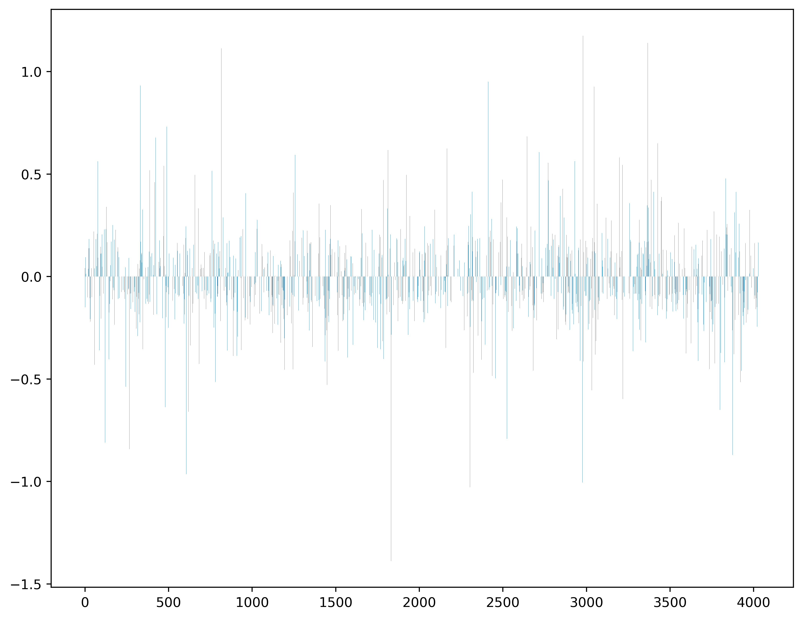

### Kaggle data set(titanic)


## 0 준비
  - 01 import
  - 02 pd.read_
  - 03 데이터 병합
  
## 1 데이터 조정
  - 11 결측값
  - 12 이상치
  - 13 잘못입력
  - 14 익명화된 정보
  
## 2피쳐 엔지니어링
  - 원핫인코딩 / 라벨인코딩
  - test 셋

## 3 EDA
## 4 학습
  - 41 split data
  - 42 model = 
  - 43 model.fit(X,y)
  
## 5 예측

# Titanic: Machine Learning from Disaster

# 준비


```python
import pandas as pd
import numpy as np
import matplotlib as plt

# 워닝 무시
import warnings
warnings.filterwarnings('ignore')
```


```python
# 그래프
%matplotlib inline
import os
import matplotlib.pyplot as plt
import seaborn as sns
import graphviz
from sklearn.tree import export_graphviz
```


```python
# 그래프 문자 깨지는 것 대처
import matplotlib
from matplotlib import font_manager, rc
import platform

if platform.system() == 'Windows':
# 윈도우인 경우
    font_name = font_manager.FontProperties(fname="c:/Windows/Fonts/malgun.ttf").get_name()
    rc('font', family=font_name)
else:
# Mac 인 경우
    rc('font', family='AppleGothic')
    
matplotlib.rcParams['axes.unicode_minus'] = False
# 그래프에서 마이너스 기호가 표시되도록 하는 설정입니다. 
```


```python
train = pd.read_csv('data_titanic/train.csv', index_col=['PassengerId'])
print(train.shape)
train.head(10)
```

    (891, 11)
    


<div>
<style scoped>
    .dataframe tbody tr th:only-of-type {
        vertical-align: middle;
    }

    .dataframe tbody tr th {
        vertical-align: top;
    }

    .dataframe thead th {
        text-align: right;
    }
</style>
<table border="1" class="dataframe">
  <thead>
    <tr style="text-align: right;">
      <th></th>
      <th>Survived</th>
      <th>Pclass</th>
      <th>Name</th>
      <th>Sex</th>
      <th>Age</th>
      <th>SibSp</th>
      <th>Parch</th>
      <th>Ticket</th>
      <th>Fare</th>
      <th>Cabin</th>
      <th>Embarked</th>
    </tr>
    <tr>
      <th>PassengerId</th>
      <th></th>
      <th></th>
      <th></th>
      <th></th>
      <th></th>
      <th></th>
      <th></th>
      <th></th>
      <th></th>
      <th></th>
      <th></th>
    </tr>
  </thead>
  <tbody>
    <tr>
      <th>430</th>
      <td>1</td>
      <td>3</td>
      <td>Pickard, Mr. Berk (Berk Trembisky)</td>
      <td>male</td>
      <td>32.0</td>
      <td>0</td>
      <td>0</td>
      <td>SOTON/O.Q. 392078</td>
      <td>8.0500</td>
      <td>E10</td>
      <td>S</td>
    </tr>
    <tr>
      <th>752</th>
      <td>1</td>
      <td>3</td>
      <td>Moor, Master. Meier</td>
      <td>male</td>
      <td>6.0</td>
      <td>0</td>
      <td>1</td>
      <td>392096</td>
      <td>12.4750</td>
      <td>E121</td>
      <td>S</td>
    </tr>
    <tr>
      <th>824</th>
      <td>1</td>
      <td>3</td>
      <td>Moor, Mrs. (Beila)</td>
      <td>female</td>
      <td>27.0</td>
      <td>0</td>
      <td>1</td>
      <td>392096</td>
      <td>12.4750</td>
      <td>E121</td>
      <td>S</td>
    </tr>
    <tr>
      <th>129</th>
      <td>1</td>
      <td>3</td>
      <td>Peter, Miss. Anna</td>
      <td>female</td>
      <td>NaN</td>
      <td>1</td>
      <td>1</td>
      <td>2668</td>
      <td>22.3583</td>
      <td>F E69</td>
      <td>C</td>
    </tr>
    <tr>
      <th>700</th>
      <td>0</td>
      <td>3</td>
      <td>Humblen, Mr. Adolf Mathias Nicolai Olsen</td>
      <td>male</td>
      <td>42.0</td>
      <td>0</td>
      <td>0</td>
      <td>348121</td>
      <td>7.6500</td>
      <td>F G63</td>
      <td>S</td>
    </tr>
    <tr>
      <th>76</th>
      <td>0</td>
      <td>3</td>
      <td>Moen, Mr. Sigurd Hansen</td>
      <td>male</td>
      <td>25.0</td>
      <td>0</td>
      <td>0</td>
      <td>348123</td>
      <td>7.6500</td>
      <td>F G73</td>
      <td>S</td>
    </tr>
    <tr>
      <th>716</th>
      <td>0</td>
      <td>3</td>
      <td>Soholt, Mr. Peter Andreas Lauritz Andersen</td>
      <td>male</td>
      <td>19.0</td>
      <td>0</td>
      <td>0</td>
      <td>348124</td>
      <td>7.6500</td>
      <td>F G73</td>
      <td>S</td>
    </tr>
    <tr>
      <th>777</th>
      <td>0</td>
      <td>3</td>
      <td>Tobin, Mr. Roger</td>
      <td>male</td>
      <td>NaN</td>
      <td>0</td>
      <td>0</td>
      <td>383121</td>
      <td>7.7500</td>
      <td>F38</td>
      <td>Q</td>
    </tr>
    <tr>
      <th>11</th>
      <td>1</td>
      <td>3</td>
      <td>Sandstrom, Miss. Marguerite Rut</td>
      <td>female</td>
      <td>4.0</td>
      <td>1</td>
      <td>1</td>
      <td>PP 9549</td>
      <td>16.7000</td>
      <td>G6</td>
      <td>S</td>
    </tr>
    <tr>
      <th>206</th>
      <td>0</td>
      <td>3</td>
      <td>Strom, Miss. Telma Matilda</td>
      <td>female</td>
      <td>2.0</td>
      <td>0</td>
      <td>1</td>
      <td>347054</td>
      <td>10.4625</td>
      <td>G6</td>
      <td>S</td>
    </tr>
  </tbody>
</table>
</div>


```python
test = pd.read_csv('data_titanic/test.csv', index_col=['PassengerId'])

print(test.shape)
test.head(10)
```

    (418, 10)
    


<div>
<style scoped>
    .dataframe tbody tr th:only-of-type {
        vertical-align: middle;
    }

    .dataframe tbody tr th {
        vertical-align: top;
    }

    .dataframe thead th {
        text-align: right;
    }
</style>
<table border="1" class="dataframe">
  <thead>
    <tr style="text-align: right;">
      <th></th>
      <th>Pclass</th>
      <th>Name</th>
      <th>Sex</th>
      <th>Age</th>
      <th>SibSp</th>
      <th>Parch</th>
      <th>Ticket</th>
      <th>Fare</th>
      <th>Cabin</th>
      <th>Embarked</th>
    </tr>
    <tr>
      <th>PassengerId</th>
      <th></th>
      <th></th>
      <th></th>
      <th></th>
      <th></th>
      <th></th>
      <th></th>
      <th></th>
      <th></th>
      <th></th>
    </tr>
  </thead>
  <tbody>
    <tr>
      <th>892</th>
      <td>3</td>
      <td>Kelly, Mr. James</td>
      <td>male</td>
      <td>34.5</td>
      <td>0</td>
      <td>0</td>
      <td>330911</td>
      <td>7.8292</td>
      <td>NaN</td>
      <td>Q</td>
    </tr>
    <tr>
      <th>893</th>
      <td>3</td>
      <td>Wilkes, Mrs. James (Ellen Needs)</td>
      <td>female</td>
      <td>47.0</td>
      <td>1</td>
      <td>0</td>
      <td>363272</td>
      <td>7.0000</td>
      <td>NaN</td>
      <td>S</td>
    </tr>
    <tr>
      <th>894</th>
      <td>2</td>
      <td>Myles, Mr. Thomas Francis</td>
      <td>male</td>
      <td>62.0</td>
      <td>0</td>
      <td>0</td>
      <td>240276</td>
      <td>9.6875</td>
      <td>NaN</td>
      <td>Q</td>
    </tr>
    <tr>
      <th>895</th>
      <td>3</td>
      <td>Wirz, Mr. Albert</td>
      <td>male</td>
      <td>27.0</td>
      <td>0</td>
      <td>0</td>
      <td>315154</td>
      <td>8.6625</td>
      <td>NaN</td>
      <td>S</td>
    </tr>
    <tr>
      <th>896</th>
      <td>3</td>
      <td>Hirvonen, Mrs. Alexander (Helga E Lindqvist)</td>
      <td>female</td>
      <td>22.0</td>
      <td>1</td>
      <td>1</td>
      <td>3101298</td>
      <td>12.2875</td>
      <td>NaN</td>
      <td>S</td>
    </tr>
    <tr>
      <th>897</th>
      <td>3</td>
      <td>Svensson, Mr. Johan Cervin</td>
      <td>male</td>
      <td>14.0</td>
      <td>0</td>
      <td>0</td>
      <td>7538</td>
      <td>9.2250</td>
      <td>NaN</td>
      <td>S</td>
    </tr>
    <tr>
      <th>898</th>
      <td>3</td>
      <td>Connolly, Miss. Kate</td>
      <td>female</td>
      <td>30.0</td>
      <td>0</td>
      <td>0</td>
      <td>330972</td>
      <td>7.6292</td>
      <td>NaN</td>
      <td>Q</td>
    </tr>
    <tr>
      <th>899</th>
      <td>2</td>
      <td>Caldwell, Mr. Albert Francis</td>
      <td>male</td>
      <td>26.0</td>
      <td>1</td>
      <td>1</td>
      <td>248738</td>
      <td>29.0000</td>
      <td>NaN</td>
      <td>S</td>
    </tr>
    <tr>
      <th>900</th>
      <td>3</td>
      <td>Abrahim, Mrs. Joseph (Sophie Halaut Easu)</td>
      <td>female</td>
      <td>18.0</td>
      <td>0</td>
      <td>0</td>
      <td>2657</td>
      <td>7.2292</td>
      <td>NaN</td>
      <td>C</td>
    </tr>
    <tr>
      <th>901</th>
      <td>3</td>
      <td>Davies, Mr. John Samuel</td>
      <td>male</td>
      <td>21.0</td>
      <td>2</td>
      <td>0</td>
      <td>A/4 48871</td>
      <td>24.1500</td>
      <td>NaN</td>
      <td>S</td>
    </tr>
  </tbody>
</table>
</div>


# 데이터 조정&피쳐 엔지니어링

### 칼럼별 null값 확인 및 처리

null값 처리해야할 열
- (1)Age
- Cabin (x)
- (2)Embarked


```python
train.isnull().sum()
```


    Survived      0
    Pclass        0
    Name          0
    Sex           0
    Age         177
    SibSp         0
    Parch         0
    Ticket        0
    Fare          0
    Cabin       687
    Embarked      0
    dtype: int64


열 unique값 확인


```python
train.Survived.unique()
```


    array([1, 0], dtype=int64)


```python
train.Pclass.unique()
```


    array([3, 2, 1], dtype=int64)


```python
train.Age.describe()
```


    count    714.000000
    mean      29.699118
    std       14.526497
    min        0.420000
    25%       20.125000
    50%       28.000000
    75%       38.000000
    max       80.000000
    Name: Age, dtype: float64


```python
train.Fare.describe()
```


    count    891.000000
    mean      32.204208
    std       49.693429
    min        0.000000
    25%        7.910400
    50%       14.454200
    75%       31.000000
    max      512.329200
    Name: Fare, dtype: float64


```python
train.SibSp.unique()
```


    array([0, 1, 3, 4, 2, 5, 8], dtype=int64)


```python
train.Parch.unique()
```


    array([0, 1, 2, 5, 3, 4, 6], dtype=int64)


```python
train.Embarked.unique()
```


    array(['S', 'C', 'Q'], dtype=object)


## (1) Fare 전처리 -> 연속변수이므로 distplot으로 이상치를 보자

## Fare 100 이상은 이상치 -> 제거


```python
# sns.distplot(train['Fare'], hist=False)
plt.subplots(figsize=(10,5))
sns.distplot(train.Fare, hist=False, label='1', kde=True, rug=True)
```


    <AxesSubplot:xlabel='Fare', ylabel='Density'>


    

    


```python
train = train[train['Fare']<200]
```


```python
print(train.shape)
train.head(10)
```

    (838, 33)
    


<div>
<style scoped>
    .dataframe tbody tr th:only-of-type {
        vertical-align: middle;
    }

    .dataframe tbody tr th {
        vertical-align: top;
    }

    .dataframe thead th {
        text-align: right;
    }
</style>
<table border="1" class="dataframe">
  <thead>
    <tr style="text-align: right;">
      <th></th>
      <th>Survived</th>
      <th>Pclass</th>
      <th>Name</th>
      <th>Sex</th>
      <th>Age</th>
      <th>SibSp</th>
      <th>Parch</th>
      <th>Ticket</th>
      <th>Fare</th>
      <th>Cabin</th>
      <th>...</th>
      <th>Title_Master</th>
      <th>Title_other</th>
      <th>Sex_M</th>
      <th>Sex_W</th>
      <th>Sex_revised</th>
      <th>FamilySize</th>
      <th>Family_cl</th>
      <th>Family_cl_S</th>
      <th>Family_cl_N</th>
      <th>Family_cl_B</th>
    </tr>
    <tr>
      <th>PassengerId</th>
      <th></th>
      <th></th>
      <th></th>
      <th></th>
      <th></th>
      <th></th>
      <th></th>
      <th></th>
      <th></th>
      <th></th>
      <th></th>
      <th></th>
      <th></th>
      <th></th>
      <th></th>
      <th></th>
      <th></th>
      <th></th>
      <th></th>
      <th></th>
      <th></th>
    </tr>
  </thead>
  <tbody>
    <tr>
      <th>430</th>
      <td>1</td>
      <td>3</td>
      <td>Pickard, Mr. Berk (Berk Trembisky)</td>
      <td>male</td>
      <td>32.00000</td>
      <td>0</td>
      <td>0</td>
      <td>SOTON/O.Q. 392078</td>
      <td>8.0500</td>
      <td>E</td>
      <td>...</td>
      <td>False</td>
      <td>False</td>
      <td>True</td>
      <td>False</td>
      <td>0.0</td>
      <td>0</td>
      <td>Single</td>
      <td>True</td>
      <td>False</td>
      <td>False</td>
    </tr>
    <tr>
      <th>752</th>
      <td>1</td>
      <td>3</td>
      <td>Moor, Master. Meier</td>
      <td>male</td>
      <td>6.00000</td>
      <td>0</td>
      <td>1</td>
      <td>392096</td>
      <td>12.4750</td>
      <td>E</td>
      <td>...</td>
      <td>True</td>
      <td>False</td>
      <td>True</td>
      <td>False</td>
      <td>0.0</td>
      <td>1</td>
      <td>Nuclear</td>
      <td>False</td>
      <td>True</td>
      <td>False</td>
    </tr>
    <tr>
      <th>824</th>
      <td>1</td>
      <td>3</td>
      <td>Moor, Mrs. (Beila)</td>
      <td>female</td>
      <td>27.00000</td>
      <td>0</td>
      <td>1</td>
      <td>392096</td>
      <td>12.4750</td>
      <td>E</td>
      <td>...</td>
      <td>False</td>
      <td>False</td>
      <td>False</td>
      <td>True</td>
      <td>1.0</td>
      <td>1</td>
      <td>Nuclear</td>
      <td>False</td>
      <td>True</td>
      <td>False</td>
    </tr>
    <tr>
      <th>129</th>
      <td>1</td>
      <td>3</td>
      <td>Peter, Miss. Anna</td>
      <td>female</td>
      <td>25.14062</td>
      <td>1</td>
      <td>1</td>
      <td>2668</td>
      <td>22.3583</td>
      <td>F</td>
      <td>...</td>
      <td>False</td>
      <td>False</td>
      <td>False</td>
      <td>True</td>
      <td>1.0</td>
      <td>2</td>
      <td>Nuclear</td>
      <td>False</td>
      <td>True</td>
      <td>False</td>
    </tr>
    <tr>
      <th>700</th>
      <td>0</td>
      <td>3</td>
      <td>Humblen, Mr. Adolf Mathias Nicolai Olsen</td>
      <td>male</td>
      <td>42.00000</td>
      <td>0</td>
      <td>0</td>
      <td>348121</td>
      <td>7.6500</td>
      <td>F</td>
      <td>...</td>
      <td>False</td>
      <td>False</td>
      <td>True</td>
      <td>False</td>
      <td>0.0</td>
      <td>0</td>
      <td>Single</td>
      <td>True</td>
      <td>False</td>
      <td>False</td>
    </tr>
    <tr>
      <th>76</th>
      <td>0</td>
      <td>3</td>
      <td>Moen, Mr. Sigurd Hansen</td>
      <td>male</td>
      <td>25.00000</td>
      <td>0</td>
      <td>0</td>
      <td>348123</td>
      <td>7.6500</td>
      <td>F</td>
      <td>...</td>
      <td>False</td>
      <td>False</td>
      <td>True</td>
      <td>False</td>
      <td>0.0</td>
      <td>0</td>
      <td>Single</td>
      <td>True</td>
      <td>False</td>
      <td>False</td>
    </tr>
    <tr>
      <th>716</th>
      <td>0</td>
      <td>3</td>
      <td>Soholt, Mr. Peter Andreas Lauritz Andersen</td>
      <td>male</td>
      <td>19.00000</td>
      <td>0</td>
      <td>0</td>
      <td>348124</td>
      <td>7.6500</td>
      <td>F</td>
      <td>...</td>
      <td>False</td>
      <td>False</td>
      <td>True</td>
      <td>False</td>
      <td>0.0</td>
      <td>0</td>
      <td>Single</td>
      <td>True</td>
      <td>False</td>
      <td>False</td>
    </tr>
    <tr>
      <th>777</th>
      <td>0</td>
      <td>3</td>
      <td>Tobin, Mr. Roger</td>
      <td>male</td>
      <td>25.14062</td>
      <td>0</td>
      <td>0</td>
      <td>383121</td>
      <td>7.7500</td>
      <td>F</td>
      <td>...</td>
      <td>False</td>
      <td>False</td>
      <td>True</td>
      <td>False</td>
      <td>0.0</td>
      <td>0</td>
      <td>Single</td>
      <td>True</td>
      <td>False</td>
      <td>False</td>
    </tr>
    <tr>
      <th>11</th>
      <td>1</td>
      <td>3</td>
      <td>Sandstrom, Miss. Marguerite Rut</td>
      <td>female</td>
      <td>4.00000</td>
      <td>1</td>
      <td>1</td>
      <td>PP 9549</td>
      <td>16.7000</td>
      <td>G</td>
      <td>...</td>
      <td>False</td>
      <td>False</td>
      <td>False</td>
      <td>True</td>
      <td>1.0</td>
      <td>2</td>
      <td>Nuclear</td>
      <td>False</td>
      <td>True</td>
      <td>False</td>
    </tr>
    <tr>
      <th>206</th>
      <td>0</td>
      <td>3</td>
      <td>Strom, Miss. Telma Matilda</td>
      <td>female</td>
      <td>2.00000</td>
      <td>0</td>
      <td>1</td>
      <td>347054</td>
      <td>10.4625</td>
      <td>G</td>
      <td>...</td>
      <td>False</td>
      <td>False</td>
      <td>False</td>
      <td>True</td>
      <td>1.0</td>
      <td>1</td>
      <td>Nuclear</td>
      <td>False</td>
      <td>True</td>
      <td>False</td>
    </tr>
  </tbody>
</table>
<p>10 rows × 33 columns</p>
</div>


```python
# sns.distplot(train['Fare'], hist=False)
plt.subplots(figsize=(10,5))
sns.distplot(train.Fare, hist=False, label='1', kde=True, rug=True)
```


    <AxesSubplot:xlabel='Fare', ylabel='Density'>


    

    


```python
survived = train[train['Survived']==1]
dead = train[train['Survived']==0]
```


```python
plt.subplots(figsize=(12,5))
sns.distplot(survived.Fare, hist=False, label='S', kde=True, rug=True)
sns.distplot(dead.Fare, hist=False, label='D', kde=True, rug=True)
```


    <AxesSubplot:xlabel='Fare', ylabel='Density'>


    

    


```python
plt.subplots(figsize=(20,5))
sns.distplot(survived.Fare,
              hist_kws=dict(cumulative=True),
              kde_kws=dict(cumulative=True))
sns.distplot(dead.Fare,
              hist_kws=dict(cumulative=True),
              kde_kws=dict(cumulative=True))
```


    <AxesSubplot:xlabel='Fare', ylabel='Density'>


    

    


```python
# Fare 원핫인코딩
train['inexst'] = train['Fare']<14
train['inex'] = (train['Fare']>=14) & (train['Fare']<50)
train['ex'] = train['Fare']>=50

train[['inexst', 'inex', 'ex']].head()
```


<div>
<style scoped>
    .dataframe tbody tr th:only-of-type {
        vertical-align: middle;
    }

    .dataframe tbody tr th {
        vertical-align: top;
    }

    .dataframe thead th {
        text-align: right;
    }
</style>
<table border="1" class="dataframe">
  <thead>
    <tr style="text-align: right;">
      <th></th>
      <th>inexst</th>
      <th>inex</th>
      <th>ex</th>
    </tr>
    <tr>
      <th>PassengerId</th>
      <th></th>
      <th></th>
      <th></th>
    </tr>
  </thead>
  <tbody>
    <tr>
      <th>430</th>
      <td>True</td>
      <td>False</td>
      <td>False</td>
    </tr>
    <tr>
      <th>752</th>
      <td>True</td>
      <td>False</td>
      <td>False</td>
    </tr>
    <tr>
      <th>824</th>
      <td>True</td>
      <td>False</td>
      <td>False</td>
    </tr>
    <tr>
      <th>129</th>
      <td>False</td>
      <td>True</td>
      <td>False</td>
    </tr>
    <tr>
      <th>700</th>
      <td>True</td>
      <td>False</td>
      <td>False</td>
    </tr>
  </tbody>
</table>
</div>


```python
train.head()
```


<div>
<style scoped>
    .dataframe tbody tr th:only-of-type {
        vertical-align: middle;
    }

    .dataframe tbody tr th {
        vertical-align: top;
    }

    .dataframe thead th {
        text-align: right;
    }
</style>
<table border="1" class="dataframe">
  <thead>
    <tr style="text-align: right;">
      <th></th>
      <th>Survived</th>
      <th>Pclass</th>
      <th>Name</th>
      <th>Sex</th>
      <th>Age</th>
      <th>SibSp</th>
      <th>Parch</th>
      <th>Ticket</th>
      <th>Fare</th>
      <th>Cabin</th>
      <th>...</th>
      <th>Sex_W</th>
      <th>Sex_revised</th>
      <th>FamilySize</th>
      <th>Family_cl</th>
      <th>Family_cl_S</th>
      <th>Family_cl_N</th>
      <th>Family_cl_B</th>
      <th>Embarked_C</th>
      <th>Embarked_S</th>
      <th>Embarked_Q</th>
    </tr>
    <tr>
      <th>PassengerId</th>
      <th></th>
      <th></th>
      <th></th>
      <th></th>
      <th></th>
      <th></th>
      <th></th>
      <th></th>
      <th></th>
      <th></th>
      <th></th>
      <th></th>
      <th></th>
      <th></th>
      <th></th>
      <th></th>
      <th></th>
      <th></th>
      <th></th>
      <th></th>
      <th></th>
    </tr>
  </thead>
  <tbody>
    <tr>
      <th>430</th>
      <td>1</td>
      <td>3</td>
      <td>Pickard, Mr. Berk (Berk Trembisky)</td>
      <td>male</td>
      <td>32.00000</td>
      <td>0</td>
      <td>0</td>
      <td>SOTON/O.Q. 392078</td>
      <td>8.0500</td>
      <td>E</td>
      <td>...</td>
      <td>False</td>
      <td>0.0</td>
      <td>0</td>
      <td>Single</td>
      <td>True</td>
      <td>False</td>
      <td>False</td>
      <td>False</td>
      <td>True</td>
      <td>False</td>
    </tr>
    <tr>
      <th>752</th>
      <td>1</td>
      <td>3</td>
      <td>Moor, Master. Meier</td>
      <td>male</td>
      <td>6.00000</td>
      <td>0</td>
      <td>1</td>
      <td>392096</td>
      <td>12.4750</td>
      <td>E</td>
      <td>...</td>
      <td>False</td>
      <td>0.0</td>
      <td>1</td>
      <td>Nuclear</td>
      <td>False</td>
      <td>True</td>
      <td>False</td>
      <td>False</td>
      <td>True</td>
      <td>False</td>
    </tr>
    <tr>
      <th>824</th>
      <td>1</td>
      <td>3</td>
      <td>Moor, Mrs. (Beila)</td>
      <td>female</td>
      <td>27.00000</td>
      <td>0</td>
      <td>1</td>
      <td>392096</td>
      <td>12.4750</td>
      <td>E</td>
      <td>...</td>
      <td>True</td>
      <td>1.0</td>
      <td>1</td>
      <td>Nuclear</td>
      <td>False</td>
      <td>True</td>
      <td>False</td>
      <td>False</td>
      <td>True</td>
      <td>False</td>
    </tr>
    <tr>
      <th>129</th>
      <td>1</td>
      <td>3</td>
      <td>Peter, Miss. Anna</td>
      <td>female</td>
      <td>25.14062</td>
      <td>1</td>
      <td>1</td>
      <td>2668</td>
      <td>22.3583</td>
      <td>F</td>
      <td>...</td>
      <td>True</td>
      <td>1.0</td>
      <td>2</td>
      <td>Nuclear</td>
      <td>False</td>
      <td>True</td>
      <td>False</td>
      <td>True</td>
      <td>False</td>
      <td>False</td>
    </tr>
    <tr>
      <th>700</th>
      <td>0</td>
      <td>3</td>
      <td>Humblen, Mr. Adolf Mathias Nicolai Olsen</td>
      <td>male</td>
      <td>42.00000</td>
      <td>0</td>
      <td>0</td>
      <td>348121</td>
      <td>7.6500</td>
      <td>F</td>
      <td>...</td>
      <td>False</td>
      <td>0.0</td>
      <td>0</td>
      <td>Single</td>
      <td>True</td>
      <td>False</td>
      <td>False</td>
      <td>False</td>
      <td>True</td>
      <td>False</td>
    </tr>
  </tbody>
</table>
<p>5 rows × 36 columns</p>
</div>


### (2) Age null값 채우기 / 범주화 -> 원핫인코딩

### Age를 유추할 독립변수 찾기 -> 히트맵 이용 -> Pclass가 가장 상관관계가 높다. Pclass별 평균값으로 Age를 넣자.


```python
fig=plt.gcf()
fig.set_size_inches(12,6)
sns.heatmap(train.corr(), cmap='RdBu_r', square=True, cbar=True, annot=True, fmt=".2f")
```


    <AxesSubplot:>


    

    


### Age의 null값을 채워보자 - ★groupby 사용 (Pclass 조건별로 평균값으로 채워넣기)


```python

```


```python
# (1) Pclass별 평균값 구하기 - groupby 이용 통계값 구하기
mean_by_P = train.groupby('Pclass')['Age'].mean()
```


```python
mean_by_P
```


    Pclass
    1    40.416667
    2    29.877630
    3    25.140620
    Name: Age, dtype: float64


```python
# (2) Age null값에 Pclass별로 평균값 넣기
train.loc[(train.Age.isnull())&(train.Pclass==1), 'Age'] = mean_by_P[1]
train.loc[(train.Age.isnull())&(train.Pclass==2), 'Age'] = mean_by_P[2]
train.loc[(train.Age.isnull())&(train.Pclass==3), 'Age'] = mean_by_P[3]
```


```python
train.head(10)
```


<div>
<style scoped>
    .dataframe tbody tr th:only-of-type {
        vertical-align: middle;
    }

    .dataframe tbody tr th {
        vertical-align: top;
    }

    .dataframe thead th {
        text-align: right;
    }
</style>
<table border="1" class="dataframe">
  <thead>
    <tr style="text-align: right;">
      <th></th>
      <th>Survived</th>
      <th>Pclass</th>
      <th>Name</th>
      <th>Sex</th>
      <th>Age</th>
      <th>SibSp</th>
      <th>Parch</th>
      <th>Ticket</th>
      <th>Fare</th>
      <th>Cabin</th>
      <th>...</th>
      <th>Title_Master</th>
      <th>Title_other</th>
      <th>Sex_M</th>
      <th>Sex_W</th>
      <th>Sex_revised</th>
      <th>FamilySize</th>
      <th>Family_cl</th>
      <th>Family_cl_S</th>
      <th>Family_cl_N</th>
      <th>Family_cl_B</th>
    </tr>
    <tr>
      <th>PassengerId</th>
      <th></th>
      <th></th>
      <th></th>
      <th></th>
      <th></th>
      <th></th>
      <th></th>
      <th></th>
      <th></th>
      <th></th>
      <th></th>
      <th></th>
      <th></th>
      <th></th>
      <th></th>
      <th></th>
      <th></th>
      <th></th>
      <th></th>
      <th></th>
      <th></th>
    </tr>
  </thead>
  <tbody>
    <tr>
      <th>430</th>
      <td>1</td>
      <td>3</td>
      <td>Pickard, Mr. Berk (Berk Trembisky)</td>
      <td>male</td>
      <td>32.00000</td>
      <td>0</td>
      <td>0</td>
      <td>SOTON/O.Q. 392078</td>
      <td>8.0500</td>
      <td>E</td>
      <td>...</td>
      <td>False</td>
      <td>False</td>
      <td>True</td>
      <td>False</td>
      <td>0.0</td>
      <td>0</td>
      <td>Single</td>
      <td>True</td>
      <td>False</td>
      <td>False</td>
    </tr>
    <tr>
      <th>752</th>
      <td>1</td>
      <td>3</td>
      <td>Moor, Master. Meier</td>
      <td>male</td>
      <td>6.00000</td>
      <td>0</td>
      <td>1</td>
      <td>392096</td>
      <td>12.4750</td>
      <td>E</td>
      <td>...</td>
      <td>True</td>
      <td>False</td>
      <td>True</td>
      <td>False</td>
      <td>0.0</td>
      <td>1</td>
      <td>Nuclear</td>
      <td>False</td>
      <td>True</td>
      <td>False</td>
    </tr>
    <tr>
      <th>824</th>
      <td>1</td>
      <td>3</td>
      <td>Moor, Mrs. (Beila)</td>
      <td>female</td>
      <td>27.00000</td>
      <td>0</td>
      <td>1</td>
      <td>392096</td>
      <td>12.4750</td>
      <td>E</td>
      <td>...</td>
      <td>False</td>
      <td>False</td>
      <td>False</td>
      <td>True</td>
      <td>1.0</td>
      <td>1</td>
      <td>Nuclear</td>
      <td>False</td>
      <td>True</td>
      <td>False</td>
    </tr>
    <tr>
      <th>129</th>
      <td>1</td>
      <td>3</td>
      <td>Peter, Miss. Anna</td>
      <td>female</td>
      <td>25.14062</td>
      <td>1</td>
      <td>1</td>
      <td>2668</td>
      <td>22.3583</td>
      <td>F</td>
      <td>...</td>
      <td>False</td>
      <td>False</td>
      <td>False</td>
      <td>True</td>
      <td>1.0</td>
      <td>2</td>
      <td>Nuclear</td>
      <td>False</td>
      <td>True</td>
      <td>False</td>
    </tr>
    <tr>
      <th>700</th>
      <td>0</td>
      <td>3</td>
      <td>Humblen, Mr. Adolf Mathias Nicolai Olsen</td>
      <td>male</td>
      <td>42.00000</td>
      <td>0</td>
      <td>0</td>
      <td>348121</td>
      <td>7.6500</td>
      <td>F</td>
      <td>...</td>
      <td>False</td>
      <td>False</td>
      <td>True</td>
      <td>False</td>
      <td>0.0</td>
      <td>0</td>
      <td>Single</td>
      <td>True</td>
      <td>False</td>
      <td>False</td>
    </tr>
    <tr>
      <th>76</th>
      <td>0</td>
      <td>3</td>
      <td>Moen, Mr. Sigurd Hansen</td>
      <td>male</td>
      <td>25.00000</td>
      <td>0</td>
      <td>0</td>
      <td>348123</td>
      <td>7.6500</td>
      <td>F</td>
      <td>...</td>
      <td>False</td>
      <td>False</td>
      <td>True</td>
      <td>False</td>
      <td>0.0</td>
      <td>0</td>
      <td>Single</td>
      <td>True</td>
      <td>False</td>
      <td>False</td>
    </tr>
    <tr>
      <th>716</th>
      <td>0</td>
      <td>3</td>
      <td>Soholt, Mr. Peter Andreas Lauritz Andersen</td>
      <td>male</td>
      <td>19.00000</td>
      <td>0</td>
      <td>0</td>
      <td>348124</td>
      <td>7.6500</td>
      <td>F</td>
      <td>...</td>
      <td>False</td>
      <td>False</td>
      <td>True</td>
      <td>False</td>
      <td>0.0</td>
      <td>0</td>
      <td>Single</td>
      <td>True</td>
      <td>False</td>
      <td>False</td>
    </tr>
    <tr>
      <th>777</th>
      <td>0</td>
      <td>3</td>
      <td>Tobin, Mr. Roger</td>
      <td>male</td>
      <td>25.14062</td>
      <td>0</td>
      <td>0</td>
      <td>383121</td>
      <td>7.7500</td>
      <td>F</td>
      <td>...</td>
      <td>False</td>
      <td>False</td>
      <td>True</td>
      <td>False</td>
      <td>0.0</td>
      <td>0</td>
      <td>Single</td>
      <td>True</td>
      <td>False</td>
      <td>False</td>
    </tr>
    <tr>
      <th>11</th>
      <td>1</td>
      <td>3</td>
      <td>Sandstrom, Miss. Marguerite Rut</td>
      <td>female</td>
      <td>4.00000</td>
      <td>1</td>
      <td>1</td>
      <td>PP 9549</td>
      <td>16.7000</td>
      <td>G</td>
      <td>...</td>
      <td>False</td>
      <td>False</td>
      <td>False</td>
      <td>True</td>
      <td>1.0</td>
      <td>2</td>
      <td>Nuclear</td>
      <td>False</td>
      <td>True</td>
      <td>False</td>
    </tr>
    <tr>
      <th>206</th>
      <td>0</td>
      <td>3</td>
      <td>Strom, Miss. Telma Matilda</td>
      <td>female</td>
      <td>2.00000</td>
      <td>0</td>
      <td>1</td>
      <td>347054</td>
      <td>10.4625</td>
      <td>G</td>
      <td>...</td>
      <td>False</td>
      <td>False</td>
      <td>False</td>
      <td>True</td>
      <td>1.0</td>
      <td>1</td>
      <td>Nuclear</td>
      <td>False</td>
      <td>True</td>
      <td>False</td>
    </tr>
  </tbody>
</table>
<p>10 rows × 33 columns</p>
</div>


```python
train.isnull().sum()
```


    Survived          0
    Pclass            0
    Name              0
    Sex               0
    Age               0
    SibSp             0
    Parch             0
    Ticket            0
    Fare              0
    Cabin           677
    Embarked          0
    inexst            0
    inex              0
    ex                0
    youngest          0
    young             0
    mid               0
    old               0
    oldest            0
    Title             0
    Title_Mr          0
    Title_Mrs         0
    Title_Miss        0
    Title_Master      0
    Title_other       0
    Sex_M             0
    Sex_W             0
    Sex_revised       0
    FamilySize        0
    Family_cl         0
    Family_cl_S       0
    Family_cl_N       0
    Family_cl_B       0
    dtype: int64


### => Age null값 처리 완료

### 원핫인코딩을 위해 Age의 생존, 사망 각각의 distplot분포를 바탕으로 범주를 나눠보자


```python
# sns.distplot(dead['Age'], hist=False,label='D',kde=True, rug=True)
plt.subplots(figsize=(12,5))
sns.distplot(survived.Age, hist=False, label='S', kde=True, rug=True)
sns.distplot(dead.Age, hist=False, label='D', kde=True, rug=True)
```


    <AxesSubplot:xlabel='Age', ylabel='Density'>


    

    


```python
dead.Age.hist(cumulative='True')
survived.Age.hist(cumulative='True')
```


    <AxesSubplot:>


    

    


```python
survived.isnull().sum()
```


    Survived          0
    Pclass            0
    Name              0
    Sex               0
    Age               0
    SibSp             0
    Parch             0
    Ticket            0
    Fare              0
    Cabin           198
    Embarked          0
    inexst            0
    inex              0
    ex                0
    youngest          0
    young             0
    mid               0
    old               0
    oldest            0
    Title             0
    Title_Mr          0
    Title_Mrs         0
    Title_Miss        0
    Title_Master      0
    Title_other       0
    Sex_M             0
    Sex_W             0
    Sex_revised       0
    FamilySize        0
    Family_cl         0
    Family_cl_S       0
    Family_cl_N       0
    Family_cl_B       0
    dtype: int64


### => Age는 다음  범주로 나누면 될거같다.

16세 이하 : youngest
17 ~ 26 : young
27 ~ 36 : mid
37 ~ 62 : old
63세 이상 : oldest


```python
train['youngest'] = train['Age']<=14
train['young'] = (train['Age']>14) & (train['Age']<= 26) 
train['mid'] = (train['Age']>26) & (train['Age']<= 36)
train['old'] = (train['Age']>36) & (train['Age']<= 62)
train['oldest'] = train['Age']>62


train[['youngest','young','mid','old','oldest']].head()
```


<div>
<style scoped>
    .dataframe tbody tr th:only-of-type {
        vertical-align: middle;
    }

    .dataframe tbody tr th {
        vertical-align: top;
    }

    .dataframe thead th {
        text-align: right;
    }
</style>
<table border="1" class="dataframe">
  <thead>
    <tr style="text-align: right;">
      <th></th>
      <th>youngest</th>
      <th>young</th>
      <th>mid</th>
      <th>old</th>
      <th>oldest</th>
    </tr>
    <tr>
      <th>PassengerId</th>
      <th></th>
      <th></th>
      <th></th>
      <th></th>
      <th></th>
    </tr>
  </thead>
  <tbody>
    <tr>
      <th>430</th>
      <td>False</td>
      <td>False</td>
      <td>True</td>
      <td>False</td>
      <td>False</td>
    </tr>
    <tr>
      <th>752</th>
      <td>True</td>
      <td>False</td>
      <td>False</td>
      <td>False</td>
      <td>False</td>
    </tr>
    <tr>
      <th>824</th>
      <td>False</td>
      <td>False</td>
      <td>True</td>
      <td>False</td>
      <td>False</td>
    </tr>
    <tr>
      <th>129</th>
      <td>False</td>
      <td>True</td>
      <td>False</td>
      <td>False</td>
      <td>False</td>
    </tr>
    <tr>
      <th>700</th>
      <td>False</td>
      <td>False</td>
      <td>False</td>
      <td>True</td>
      <td>False</td>
    </tr>
  </tbody>
</table>
</div>


```python
train.isnull().sum()
```


    Survived          0
    Pclass            0
    Name              0
    Sex               0
    Age               0
    SibSp             0
    Parch             0
    Ticket            0
    Fare              0
    Cabin           677
    Embarked          0
    inexst            0
    inex              0
    ex                0
    youngest          0
    young             0
    mid               0
    old               0
    oldest            0
    Title             0
    Title_Mr          0
    Title_Mrs         0
    Title_Miss        0
    Title_Master      0
    Title_other       0
    Sex_M             0
    Sex_W             0
    Sex_revised       0
    FamilySize        0
    Family_cl         0
    Family_cl_S       0
    Family_cl_N       0
    Family_cl_B       0
    dtype: int64


=> Age 전처리 완료

## (3)Name 전처리 : 호칭 추출 -> 원핫인코딩


```python
def get_title(name):
    return name.split(",")[1].split(".")[0].strip()

train['Title'] = train['Name'].apply(get_title)

```


```python
train['Title']
```


    PassengerId
    430          Mr
    752      Master
    824         Mrs
    129        Miss
    700          Mr
             ...   
    695         Col
    767          Dr
    794          Mr
    823    Jonkheer
    843        Miss
    Name: Title, Length: 838, dtype: object


```python
train.Title.unique()
```


    array(['Mr', 'Master', 'Mrs', 'Miss', 'Rev', 'Dr', 'Ms', 'Lady', 'Sir',
           'Col', 'Capt', 'Mme', 'Mlle', 'Major', 'the Countess', 'Don',
           'Jonkheer'], dtype=object)


```python
train.Title.value_counts()
```


    Mr              501
    Miss            160
    Mrs             113
    Master           38
    Rev               6
    Dr                6
    Col               2
    Mlle              2
    Major             2
    Capt              1
    Mme               1
    Don               1
    Sir               1
    the Countess      1
    Ms                1
    Jonkheer          1
    Lady              1
    Name: Title, dtype: int64


```python
# 호칭 이상치 제거 함수(핵심 호칭_Mr,Miss,Mrs,Master만 남기고, 나머지는 other)
def get_title2(name):
    title = name.split(",")[1].split(".")[0].strip()
    if title in ['Mr', 'Mrs', 'Miss', 'Master']:
        return title
    else :
        return 'other'
```


```python
# train 셋의 'Title' 가져와서 호칭&other로 바꾸기
train['Title'] = train['Name'].apply(get_title2)
```


```python
train.Title.unique()
```


    array(['Mr', 'Master', 'Mrs', 'Miss', 'other'], dtype=object)


#### Title별 Survived 생존율 -> Title과 Survived는 상관관계 있다.
#### -> Title 원핫인코딩 실행


```python
train.groupby('Title')['Survived'].mean()
```


    Title
    Master    0.552632
    Miss      0.662500
    Mr        0.153693
    Mrs       0.778761
    other     0.423077
    Name: Survived, dtype: float64


```python
train['Title_Mr'] = train['Title'] == 'Mr'
train['Title_Mrs'] = train['Title'] == 'Mrs'
train['Title_Miss'] = train['Title'] == 'Miss'
train['Title_Master'] = train['Title'] == 'Master'
train['Title_other'] = train['Title'] == 'other'

train[['Title_Mr', 'Title_Mrs', 'Title_Miss', 'Title_Master', 'Title_other']].head()
```


<div>
<style scoped>
    .dataframe tbody tr th:only-of-type {
        vertical-align: middle;
    }

    .dataframe tbody tr th {
        vertical-align: top;
    }

    .dataframe thead th {
        text-align: right;
    }
</style>
<table border="1" class="dataframe">
  <thead>
    <tr style="text-align: right;">
      <th></th>
      <th>Title_Mr</th>
      <th>Title_Mrs</th>
      <th>Title_Miss</th>
      <th>Title_Master</th>
      <th>Title_other</th>
    </tr>
    <tr>
      <th>PassengerId</th>
      <th></th>
      <th></th>
      <th></th>
      <th></th>
      <th></th>
    </tr>
  </thead>
  <tbody>
    <tr>
      <th>430</th>
      <td>True</td>
      <td>False</td>
      <td>False</td>
      <td>False</td>
      <td>False</td>
    </tr>
    <tr>
      <th>752</th>
      <td>False</td>
      <td>False</td>
      <td>False</td>
      <td>True</td>
      <td>False</td>
    </tr>
    <tr>
      <th>824</th>
      <td>False</td>
      <td>True</td>
      <td>False</td>
      <td>False</td>
      <td>False</td>
    </tr>
    <tr>
      <th>129</th>
      <td>False</td>
      <td>False</td>
      <td>True</td>
      <td>False</td>
      <td>False</td>
    </tr>
    <tr>
      <th>700</th>
      <td>True</td>
      <td>False</td>
      <td>False</td>
      <td>False</td>
      <td>False</td>
    </tr>
  </tbody>
</table>
</div>


## (4) 성별(Sex) 원핫인코딩


```python
train.groupby('Sex')['Survived'].mean()
```


    Sex
    female    0.717857
    male      0.182796
    Name: Survived, dtype: float64


```python
train['Sex_M'] = train['Sex'] == 'male'
train['Sex_W'] = train['Sex'] == 'female'

train[['Sex_M', 'Sex_W']].head()
```


<div>
<style scoped>
    .dataframe tbody tr th:only-of-type {
        vertical-align: middle;
    }

    .dataframe tbody tr th {
        vertical-align: top;
    }

    .dataframe thead th {
        text-align: right;
    }
</style>
<table border="1" class="dataframe">
  <thead>
    <tr style="text-align: right;">
      <th></th>
      <th>Sex_M</th>
      <th>Sex_W</th>
    </tr>
    <tr>
      <th>PassengerId</th>
      <th></th>
      <th></th>
    </tr>
  </thead>
  <tbody>
    <tr>
      <th>430</th>
      <td>True</td>
      <td>False</td>
    </tr>
    <tr>
      <th>752</th>
      <td>True</td>
      <td>False</td>
    </tr>
    <tr>
      <th>824</th>
      <td>False</td>
      <td>True</td>
    </tr>
    <tr>
      <th>129</th>
      <td>False</td>
      <td>True</td>
    </tr>
    <tr>
      <th>700</th>
      <td>True</td>
      <td>False</td>
    </tr>
  </tbody>
</table>
</div>


```python
train.loc[train['Sex'] == 'male', 'Sex_revised'] = 0
train.loc[train['Sex'] == 'female', 'Sex_revised'] = 1

train['Sex_revised'].head()
```


    PassengerId
    430    0.0
    752    0.0
    824    1.0
    129    1.0
    700    0.0
    Name: Sex_revised, dtype: float64


## (5) Embarked 원핫인코딩


```python
# EMbarked도 Survived와 상관관계가 있다.
train.groupby('Embarked')['Survived'].mean()
```


    Embarked
    C    0.517986
    Q    0.397436
    S    0.322061
    Name: Survived, dtype: float64


```python
## Embarked의 null값 채우기
train.loc[train.Embarked.isnull(), 'Embarked'] = 'C'
```


```python
train.isnull().sum() 
```


    Survived          0
    Pclass            0
    Name              0
    Sex               0
    Age               0
    SibSp             0
    Parch             0
    Ticket            0
    Fare              0
    Cabin           677
    Embarked          0
    inexst            0
    inex              0
    ex                0
    youngest          0
    young             0
    mid               0
    old               0
    oldest            0
    Title             0
    Title_Mr          0
    Title_Mrs         0
    Title_Miss        0
    Title_Master      0
    Title_other       0
    Sex_M             0
    Sex_W             0
    Sex_revised       0
    FamilySize        0
    Family_cl         0
    Family_cl_S       0
    Family_cl_N       0
    Family_cl_B       0
    dtype: int64


```python
train['Embarked_C'] = train['Embarked'] == 'C'
train['Embarked_S'] = train['Embarked'] == 'S'
train['Embarked_Q'] = train['Embarked'] == 'Q'

train[['Embarked_C', 'Embarked_S', 'Embarked_Q']].head()
```


<div>
<style scoped>
    .dataframe tbody tr th:only-of-type {
        vertical-align: middle;
    }

    .dataframe tbody tr th {
        vertical-align: top;
    }

    .dataframe thead th {
        text-align: right;
    }
</style>
<table border="1" class="dataframe">
  <thead>
    <tr style="text-align: right;">
      <th></th>
      <th>Embarked_C</th>
      <th>Embarked_S</th>
      <th>Embarked_Q</th>
    </tr>
    <tr>
      <th>PassengerId</th>
      <th></th>
      <th></th>
      <th></th>
    </tr>
  </thead>
  <tbody>
    <tr>
      <th>430</th>
      <td>False</td>
      <td>True</td>
      <td>False</td>
    </tr>
    <tr>
      <th>752</th>
      <td>False</td>
      <td>True</td>
      <td>False</td>
    </tr>
    <tr>
      <th>824</th>
      <td>False</td>
      <td>True</td>
      <td>False</td>
    </tr>
    <tr>
      <th>129</th>
      <td>True</td>
      <td>False</td>
      <td>False</td>
    </tr>
    <tr>
      <th>700</th>
      <td>False</td>
      <td>True</td>
      <td>False</td>
    </tr>
  </tbody>
</table>
</div>


## (6) SibSp, Parch 전처리 -> FamilySize로 합친 후 원핫인코딩


```python
train.SibSp
```


    PassengerId
    430    0
    752    0
    824    0
    129    1
    700    0
          ..
    695    0
    767    0
    794    0
    823    0
    843    0
    Name: SibSp, Length: 838, dtype: int64


```python
train['FamilySize'] = train['SibSp'] + train['Parch']
```


```python
train.groupby('FamilySize')['Survived'].mean()
```


    FamilySize
    0     0.287908
    1     0.534247
    2     0.569892
    3     0.727273
    4     0.076923
    5     0.055556
    6     0.333333
    7     0.000000
    10    0.000000
    Name: Survived, dtype: float64


```python
train.loc[train['FamilySize']<1, 'Family_cl'] = 'Single'
train.loc[(train['FamilySize']>=1)&(train['FamilySize']<4), 'Family_cl'] = 'Nuclear'
train.loc[(train['FamilySize']>=4)&(train['FamilySize']<6), 'Family_cl'] = 'Big'
train.loc[(train['FamilySize']>=6)&(train['FamilySize']<11), 'Family_cl'] = 'Biggest'
train[['FamilySize', 'Family_cl']].head(10)
```


<div>
<style scoped>
    .dataframe tbody tr th:only-of-type {
        vertical-align: middle;
    }

    .dataframe tbody tr th {
        vertical-align: top;
    }

    .dataframe thead th {
        text-align: right;
    }
</style>
<table border="1" class="dataframe">
  <thead>
    <tr style="text-align: right;">
      <th></th>
      <th>FamilySize</th>
      <th>Family_cl</th>
    </tr>
    <tr>
      <th>PassengerId</th>
      <th></th>
      <th></th>
    </tr>
  </thead>
  <tbody>
    <tr>
      <th>430</th>
      <td>0</td>
      <td>Single</td>
    </tr>
    <tr>
      <th>752</th>
      <td>1</td>
      <td>Nuclear</td>
    </tr>
    <tr>
      <th>824</th>
      <td>1</td>
      <td>Nuclear</td>
    </tr>
    <tr>
      <th>129</th>
      <td>2</td>
      <td>Nuclear</td>
    </tr>
    <tr>
      <th>700</th>
      <td>0</td>
      <td>Single</td>
    </tr>
    <tr>
      <th>76</th>
      <td>0</td>
      <td>Single</td>
    </tr>
    <tr>
      <th>716</th>
      <td>0</td>
      <td>Single</td>
    </tr>
    <tr>
      <th>777</th>
      <td>0</td>
      <td>Single</td>
    </tr>
    <tr>
      <th>11</th>
      <td>2</td>
      <td>Nuclear</td>
    </tr>
    <tr>
      <th>206</th>
      <td>1</td>
      <td>Nuclear</td>
    </tr>
  </tbody>
</table>
</div>


```python
train['Family_cl_S'] = train['Family_cl'] == 'Single'
train['Family_cl_N'] = train['Family_cl'] == 'Nuclear'
train['Family_cl_B'] = train['Family_cl'] == 'Big'
train['Family_cl_G'] = train['Family_cl'] == 'Biggest'

train[['Family_cl_S', 'Family_cl_N', 'Family_cl_B','Family_cl_G']].head()
```


<div>
<style scoped>
    .dataframe tbody tr th:only-of-type {
        vertical-align: middle;
    }

    .dataframe tbody tr th {
        vertical-align: top;
    }

    .dataframe thead th {
        text-align: right;
    }
</style>
<table border="1" class="dataframe">
  <thead>
    <tr style="text-align: right;">
      <th></th>
      <th>Family_cl_S</th>
      <th>Family_cl_N</th>
      <th>Family_cl_B</th>
      <th>Family_cl_G</th>
    </tr>
    <tr>
      <th>PassengerId</th>
      <th></th>
      <th></th>
      <th></th>
      <th></th>
    </tr>
  </thead>
  <tbody>
    <tr>
      <th>430</th>
      <td>True</td>
      <td>False</td>
      <td>False</td>
      <td>False</td>
    </tr>
    <tr>
      <th>752</th>
      <td>False</td>
      <td>True</td>
      <td>False</td>
      <td>False</td>
    </tr>
    <tr>
      <th>824</th>
      <td>False</td>
      <td>True</td>
      <td>False</td>
      <td>False</td>
    </tr>
    <tr>
      <th>129</th>
      <td>False</td>
      <td>True</td>
      <td>False</td>
      <td>False</td>
    </tr>
    <tr>
      <th>700</th>
      <td>True</td>
      <td>False</td>
      <td>False</td>
      <td>False</td>
    </tr>
  </tbody>
</table>
</div>


## (7) Cabin


```python
fig=plt.gcf()
fig.set_size_inches(20,10)
sns.heatmap(train.corr(), cmap='RdBu_r', square=True, cbar=True, annot=True, fmt=".2f")
```


    <AxesSubplot:>


    

    


```python
train['Cabin'] = train['Cabin'].str[:1]
```


```python
pd.pivot_table(data=train, index=['Pclass', 'Cabin'], values='Survived')
# P1, C null -> 
```


<div>
<style scoped>
    .dataframe tbody tr th:only-of-type {
        vertical-align: middle;
    }

    .dataframe tbody tr th {
        vertical-align: top;
    }

    .dataframe thead th {
        text-align: right;
    }
</style>
<table border="1" class="dataframe">
  <thead>
    <tr style="text-align: right;">
      <th></th>
      <th></th>
      <th>Survived</th>
    </tr>
    <tr>
      <th>Pclass</th>
      <th>Cabin</th>
      <th></th>
    </tr>
  </thead>
  <tbody>
    <tr>
      <th rowspan="6" valign="top">1</th>
      <th>A</th>
      <td>0.466667</td>
    </tr>
    <tr>
      <th>B</th>
      <td>0.516129</td>
    </tr>
    <tr>
      <th>C</th>
      <td>0.611111</td>
    </tr>
    <tr>
      <th>D</th>
      <td>0.769231</td>
    </tr>
    <tr>
      <th>E</th>
      <td>0.695652</td>
    </tr>
    <tr>
      <th>T</th>
      <td>0.000000</td>
    </tr>
    <tr>
      <th rowspan="3" valign="top">2</th>
      <th>D</th>
      <td>0.750000</td>
    </tr>
    <tr>
      <th>E</th>
      <td>0.750000</td>
    </tr>
    <tr>
      <th>F</th>
      <td>0.460227</td>
    </tr>
    <tr>
      <th rowspan="3" valign="top">3</th>
      <th>E</th>
      <td>1.000000</td>
    </tr>
    <tr>
      <th>F</th>
      <td>0.200000</td>
    </tr>
    <tr>
      <th>G</th>
      <td>0.238095</td>
    </tr>
  </tbody>
</table>
</div>


```python
# train['Cabin'][(train['Cabin'].isnull()) & (train['Pclass']==1)] 
```


```python
mean_by_F = train.groupby('Cabin')['Fare'].mean()
mean_by_F
```


    Cabin
    A    39.623887
    B    49.244758
    C    54.459839
    D    51.641533
    E    40.128473
    F    20.750736
    G    13.723886
    T    35.500000
    Name: Fare, dtype: float64


```python
train.groupby('Cabin')['Fare'].describe()
```


<div>
<style scoped>
    .dataframe tbody tr th:only-of-type {
        vertical-align: middle;
    }

    .dataframe tbody tr th {
        vertical-align: top;
    }

    .dataframe thead th {
        text-align: right;
    }
</style>
<table border="1" class="dataframe">
  <thead>
    <tr style="text-align: right;">
      <th></th>
      <th>count</th>
      <th>mean</th>
      <th>std</th>
      <th>min</th>
      <th>25%</th>
      <th>50%</th>
      <th>75%</th>
      <th>max</th>
    </tr>
    <tr>
      <th>Cabin</th>
      <th></th>
      <th></th>
      <th></th>
      <th></th>
      <th></th>
      <th></th>
      <th></th>
      <th></th>
    </tr>
  </thead>
  <tbody>
    <tr>
      <th>A</th>
      <td>15.0</td>
      <td>39.623887</td>
      <td>17.975333</td>
      <td>0.000</td>
      <td>30.8479</td>
      <td>35.5000</td>
      <td>50.247900</td>
      <td>81.8583</td>
    </tr>
    <tr>
      <th>B</th>
      <td>62.0</td>
      <td>49.244758</td>
      <td>26.899615</td>
      <td>0.000</td>
      <td>27.7208</td>
      <td>49.5021</td>
      <td>76.887500</td>
      <td>93.5000</td>
    </tr>
    <tr>
      <th>C</th>
      <td>36.0</td>
      <td>54.459839</td>
      <td>24.763258</td>
      <td>26.550</td>
      <td>29.9250</td>
      <td>52.0000</td>
      <td>83.158300</td>
      <td>90.0000</td>
    </tr>
    <tr>
      <th>D</th>
      <td>30.0</td>
      <td>51.641533</td>
      <td>24.679668</td>
      <td>12.875</td>
      <td>30.0000</td>
      <td>52.5542</td>
      <td>76.729200</td>
      <td>78.2667</td>
    </tr>
    <tr>
      <th>E</th>
      <td>30.0</td>
      <td>40.128473</td>
      <td>23.681541</td>
      <td>8.050</td>
      <td>25.7625</td>
      <td>32.5250</td>
      <td>55.785425</td>
      <td>83.1583</td>
    </tr>
    <tr>
      <th>F</th>
      <td>181.0</td>
      <td>20.750736</td>
      <td>13.552654</td>
      <td>0.000</td>
      <td>13.0000</td>
      <td>15.0000</td>
      <td>26.000000</td>
      <td>73.5000</td>
    </tr>
    <tr>
      <th>G</th>
      <td>483.0</td>
      <td>13.723886</td>
      <td>11.853181</td>
      <td>0.000</td>
      <td>7.7500</td>
      <td>8.0500</td>
      <td>15.500000</td>
      <td>69.5500</td>
    </tr>
    <tr>
      <th>T</th>
      <td>1.0</td>
      <td>35.500000</td>
      <td>NaN</td>
      <td>35.500</td>
      <td>35.5000</td>
      <td>35.5000</td>
      <td>35.500000</td>
      <td>35.5000</td>
    </tr>
  </tbody>
</table>
</div>


```python
train.loc[(train.Cabin.isnull())&(train.Fare >= 1)& (train.Fare <14), 'Cabin'] = 'G'
train.loc[(train.Cabin.isnull())&(train.Fare >= 14 )& (train.Fare <21),  'Cabin'] = 'F'
train.loc[(train.Cabin.isnull())&(train.Fare >= 22)& (train.Fare < 40), 'Cabin'] = 'A'
train.loc[(train.Cabin.isnull())&(train.Fare >= 40)& (train.Fare <48), 'Cabin'] = 'E'
train.loc[(train.Cabin.isnull())&(train.Fare >= 48)& (train.Fare <51), 'Cabin'] = 'B'
train.loc[(train.Cabin.isnull())&(train.Fare >= 51)& (train.Fare <200), 'Cabin'] = 'D'
train.loc[(train.Cabin.isnull())&(train.Fare >= 200), 'Cabin'] = 'C'
```


```python
train['Cabin_A'] = train['Cabin'] == 'A'
train['Cabin_B'] = train['Cabin'] == 'B'
train['Cabin_C'] = train['Cabin'] == 'C'
train['Cabin_D'] = train['Cabin'] == 'D'
train['Cabin_E'] = train['Cabin'] == 'E'
train['Cabin_F'] = train['Cabin'] == 'F'
train['Cabin_G'] = train['Cabin'] == 'G'

train[['Cabin_A','Cabin_B','Cabin_C','Cabin_D','Cabin_E','Cabin_F','Cabin_G']].head()
```


<div>
<style scoped>
    .dataframe tbody tr th:only-of-type {
        vertical-align: middle;
    }

    .dataframe tbody tr th {
        vertical-align: top;
    }

    .dataframe thead th {
        text-align: right;
    }
</style>
<table border="1" class="dataframe">
  <thead>
    <tr style="text-align: right;">
      <th></th>
      <th>Cabin_A</th>
      <th>Cabin_B</th>
      <th>Cabin_C</th>
      <th>Cabin_D</th>
      <th>Cabin_E</th>
      <th>Cabin_F</th>
      <th>Cabin_G</th>
    </tr>
    <tr>
      <th>PassengerId</th>
      <th></th>
      <th></th>
      <th></th>
      <th></th>
      <th></th>
      <th></th>
      <th></th>
    </tr>
  </thead>
  <tbody>
    <tr>
      <th>430</th>
      <td>False</td>
      <td>False</td>
      <td>False</td>
      <td>False</td>
      <td>True</td>
      <td>False</td>
      <td>False</td>
    </tr>
    <tr>
      <th>752</th>
      <td>False</td>
      <td>False</td>
      <td>False</td>
      <td>False</td>
      <td>True</td>
      <td>False</td>
      <td>False</td>
    </tr>
    <tr>
      <th>824</th>
      <td>False</td>
      <td>False</td>
      <td>False</td>
      <td>False</td>
      <td>True</td>
      <td>False</td>
      <td>False</td>
    </tr>
    <tr>
      <th>129</th>
      <td>False</td>
      <td>False</td>
      <td>False</td>
      <td>False</td>
      <td>False</td>
      <td>True</td>
      <td>False</td>
    </tr>
    <tr>
      <th>700</th>
      <td>False</td>
      <td>False</td>
      <td>False</td>
      <td>False</td>
      <td>False</td>
      <td>True</td>
      <td>False</td>
    </tr>
  </tbody>
</table>
</div>


```python
train.head()
```


<div>
<style scoped>
    .dataframe tbody tr th:only-of-type {
        vertical-align: middle;
    }

    .dataframe tbody tr th {
        vertical-align: top;
    }

    .dataframe thead th {
        text-align: right;
    }
</style>
<table border="1" class="dataframe">
  <thead>
    <tr style="text-align: right;">
      <th></th>
      <th>Survived</th>
      <th>Pclass</th>
      <th>Name</th>
      <th>Sex</th>
      <th>Age</th>
      <th>SibSp</th>
      <th>Parch</th>
      <th>Ticket</th>
      <th>Fare</th>
      <th>Cabin</th>
      <th>...</th>
      <th>Embarked_S</th>
      <th>Embarked_Q</th>
      <th>Family_cl_G</th>
      <th>Cabin_A</th>
      <th>Cabin_B</th>
      <th>Cabin_C</th>
      <th>Cabin_D</th>
      <th>Cabin_E</th>
      <th>Cabin_F</th>
      <th>Cabin_G</th>
    </tr>
    <tr>
      <th>PassengerId</th>
      <th></th>
      <th></th>
      <th></th>
      <th></th>
      <th></th>
      <th></th>
      <th></th>
      <th></th>
      <th></th>
      <th></th>
      <th></th>
      <th></th>
      <th></th>
      <th></th>
      <th></th>
      <th></th>
      <th></th>
      <th></th>
      <th></th>
      <th></th>
      <th></th>
    </tr>
  </thead>
  <tbody>
    <tr>
      <th>430</th>
      <td>1</td>
      <td>3</td>
      <td>Pickard, Mr. Berk (Berk Trembisky)</td>
      <td>male</td>
      <td>32.00000</td>
      <td>0</td>
      <td>0</td>
      <td>SOTON/O.Q. 392078</td>
      <td>8.0500</td>
      <td>E</td>
      <td>...</td>
      <td>True</td>
      <td>False</td>
      <td>False</td>
      <td>False</td>
      <td>False</td>
      <td>False</td>
      <td>False</td>
      <td>True</td>
      <td>False</td>
      <td>False</td>
    </tr>
    <tr>
      <th>752</th>
      <td>1</td>
      <td>3</td>
      <td>Moor, Master. Meier</td>
      <td>male</td>
      <td>6.00000</td>
      <td>0</td>
      <td>1</td>
      <td>392096</td>
      <td>12.4750</td>
      <td>E</td>
      <td>...</td>
      <td>True</td>
      <td>False</td>
      <td>False</td>
      <td>False</td>
      <td>False</td>
      <td>False</td>
      <td>False</td>
      <td>True</td>
      <td>False</td>
      <td>False</td>
    </tr>
    <tr>
      <th>824</th>
      <td>1</td>
      <td>3</td>
      <td>Moor, Mrs. (Beila)</td>
      <td>female</td>
      <td>27.00000</td>
      <td>0</td>
      <td>1</td>
      <td>392096</td>
      <td>12.4750</td>
      <td>E</td>
      <td>...</td>
      <td>True</td>
      <td>False</td>
      <td>False</td>
      <td>False</td>
      <td>False</td>
      <td>False</td>
      <td>False</td>
      <td>True</td>
      <td>False</td>
      <td>False</td>
    </tr>
    <tr>
      <th>129</th>
      <td>1</td>
      <td>3</td>
      <td>Peter, Miss. Anna</td>
      <td>female</td>
      <td>25.14062</td>
      <td>1</td>
      <td>1</td>
      <td>2668</td>
      <td>22.3583</td>
      <td>F</td>
      <td>...</td>
      <td>False</td>
      <td>False</td>
      <td>False</td>
      <td>False</td>
      <td>False</td>
      <td>False</td>
      <td>False</td>
      <td>False</td>
      <td>True</td>
      <td>False</td>
    </tr>
    <tr>
      <th>700</th>
      <td>0</td>
      <td>3</td>
      <td>Humblen, Mr. Adolf Mathias Nicolai Olsen</td>
      <td>male</td>
      <td>42.00000</td>
      <td>0</td>
      <td>0</td>
      <td>348121</td>
      <td>7.6500</td>
      <td>F</td>
      <td>...</td>
      <td>True</td>
      <td>False</td>
      <td>False</td>
      <td>False</td>
      <td>False</td>
      <td>False</td>
      <td>False</td>
      <td>False</td>
      <td>True</td>
      <td>False</td>
    </tr>
  </tbody>
</table>
<p>5 rows × 44 columns</p>
</div>


```python
train[train.Cabin.isnull()]
```


<div>
<style scoped>
    .dataframe tbody tr th:only-of-type {
        vertical-align: middle;
    }

    .dataframe tbody tr th {
        vertical-align: top;
    }

    .dataframe thead th {
        text-align: right;
    }
</style>
<table border="1" class="dataframe">
  <thead>
    <tr style="text-align: right;">
      <th></th>
      <th>Survived</th>
      <th>Pclass</th>
      <th>Name</th>
      <th>Sex</th>
      <th>Age</th>
      <th>SibSp</th>
      <th>Parch</th>
      <th>Ticket</th>
      <th>Fare</th>
      <th>Cabin</th>
      <th>...</th>
      <th>Embarked_S</th>
      <th>Embarked_Q</th>
      <th>Family_cl_G</th>
      <th>Cabin_A</th>
      <th>Cabin_B</th>
      <th>Cabin_C</th>
      <th>Cabin_D</th>
      <th>Cabin_E</th>
      <th>Cabin_F</th>
      <th>Cabin_G</th>
    </tr>
    <tr>
      <th>PassengerId</th>
      <th></th>
      <th></th>
      <th></th>
      <th></th>
      <th></th>
      <th></th>
      <th></th>
      <th></th>
      <th></th>
      <th></th>
      <th></th>
      <th></th>
      <th></th>
      <th></th>
      <th></th>
      <th></th>
      <th></th>
      <th></th>
      <th></th>
      <th></th>
      <th></th>
    </tr>
  </thead>
  <tbody>
  </tbody>
</table>
<p>0 rows × 44 columns</p>
</div>


## X_test 전처리

### test셋도 train셋과 똑같이 맞춰준다. 
(1) null값 채우기


```python
test.isnull().sum()
```


    Pclass          0
    Name            0
    Sex             0
    Age             0
    SibSp           0
    Parch           0
    Ticket          0
    Fare            0
    Cabin           0
    Embarked        0
    inexst          0
    inex            0
    ex              0
    youngest        0
    young           0
    mid             0
    old             0
    oldest          0
    Title           0
    Title_Mr        0
    Title_Mrs       0
    Title_Miss      0
    Title_Master    0
    Title_other     0
    Sex_M           0
    Sex_W           0
    Embarked_C      0
    Embarked_S      0
    Embarked_Q      0
    FamilySize      0
    Family_cl       0
    Family_cl_S     0
    Family_cl_N     0
    Family_cl_B     0
    Family_cl_G     0
    Cabin_A         0
    Cabin_B         0
    Cabin_C         0
    Cabin_D         0
    Cabin_E         0
    Cabin_F         0
    Cabin_G         0
    dtype: int64


```python
# null값 채우기
# (1) Pclass별 평균값 구하기 - groupby 이용 통계값 구하기
mean_by_P = test.groupby('Pclass')['Age'].mean()
```


```python
mean_by_P
```


    Pclass
    1    40.876168
    2    28.836647
    3    24.395434
    Name: Age, dtype: float64


```python
test.loc[(test.Age.isnull())&(test.Pclass==1), 'Age'] = mean_by_P[1]
test.loc[(test.Age.isnull())&(test.Pclass==2), 'Age'] = mean_by_P[2]
test.loc[(test.Age.isnull())&(test.Pclass==3), 'Age'] = mean_by_P[3]
```

### (★조건에 맞는 값을 넣는 것은 ★loc를 이용해라!)

(2) 원핫 인코딩 해주기 : Age / Name(Title) / Sex / Embarked / SibSp&Parch


```python

```


```python
# Fare 원핫인코딩
test['inexst'] = test['Fare']<14
test['inex'] = (test['Fare']>=14) & (test['Fare']<50)
test['ex'] = test['Fare']>=50

train[['inexst', 'inex', 'ex']].head()
```


<div>
<style scoped>
    .dataframe tbody tr th:only-of-type {
        vertical-align: middle;
    }

    .dataframe tbody tr th {
        vertical-align: top;
    }

    .dataframe thead th {
        text-align: right;
    }
</style>
<table border="1" class="dataframe">
  <thead>
    <tr style="text-align: right;">
      <th></th>
      <th>inexst</th>
      <th>inex</th>
      <th>ex</th>
    </tr>
    <tr>
      <th>PassengerId</th>
      <th></th>
      <th></th>
      <th></th>
    </tr>
  </thead>
  <tbody>
    <tr>
      <th>430</th>
      <td>True</td>
      <td>False</td>
      <td>False</td>
    </tr>
    <tr>
      <th>752</th>
      <td>True</td>
      <td>False</td>
      <td>False</td>
    </tr>
    <tr>
      <th>824</th>
      <td>True</td>
      <td>False</td>
      <td>False</td>
    </tr>
    <tr>
      <th>129</th>
      <td>False</td>
      <td>True</td>
      <td>False</td>
    </tr>
    <tr>
      <th>700</th>
      <td>True</td>
      <td>False</td>
      <td>False</td>
    </tr>
  </tbody>
</table>
</div>


```python
# 1. Age
# young, junior, senior, old 으로 나눠서 원핫인코딩 하기
test['youngest'] = test['Age']<=14
test['young'] = (test['Age']>14) & (test['Age']<= 26) 
test['mid'] = (test['Age']>26) & (test['Age']<= 36)
test['old'] = (test['Age']>36) & (test['Age']<= 62)
test['oldest'] = test['Age']>62


test[['youngest','young','mid','old','oldest']].head()
```


<div>
<style scoped>
    .dataframe tbody tr th:only-of-type {
        vertical-align: middle;
    }

    .dataframe tbody tr th {
        vertical-align: top;
    }

    .dataframe thead th {
        text-align: right;
    }
</style>
<table border="1" class="dataframe">
  <thead>
    <tr style="text-align: right;">
      <th></th>
      <th>youngest</th>
      <th>young</th>
      <th>mid</th>
      <th>old</th>
      <th>oldest</th>
    </tr>
    <tr>
      <th>PassengerId</th>
      <th></th>
      <th></th>
      <th></th>
      <th></th>
      <th></th>
    </tr>
  </thead>
  <tbody>
    <tr>
      <th>892</th>
      <td>False</td>
      <td>False</td>
      <td>True</td>
      <td>False</td>
      <td>False</td>
    </tr>
    <tr>
      <th>893</th>
      <td>False</td>
      <td>False</td>
      <td>False</td>
      <td>True</td>
      <td>False</td>
    </tr>
    <tr>
      <th>894</th>
      <td>False</td>
      <td>False</td>
      <td>False</td>
      <td>True</td>
      <td>False</td>
    </tr>
    <tr>
      <th>895</th>
      <td>False</td>
      <td>False</td>
      <td>True</td>
      <td>False</td>
      <td>False</td>
    </tr>
    <tr>
      <th>896</th>
      <td>False</td>
      <td>True</td>
      <td>False</td>
      <td>False</td>
      <td>False</td>
    </tr>
  </tbody>
</table>
</div>


```python
# 2. Name
test['Title'] = test['Name'].apply(get_title2)
```


```python
train.groupby('Title')['Survived'].mean()
```


    Title
    Master    0.552632
    Miss      0.662500
    Mr        0.153693
    Mrs       0.778761
    other     0.423077
    Name: Survived, dtype: float64


```python
test['Title_Mr'] = test['Title'] == 'Mr'
test['Title_Mrs'] = test['Title'] == 'Mrs'
test['Title_Miss'] = test['Title'] == 'Miss'
test['Title_Master'] = test['Title'] == 'Master'
test['Title_other'] = test['Title'] == 'other'

test[['Title_Mr', 'Title_Mrs', 'Title_Miss', 'Title_Master', 'Title_other']].head()
```


<div>
<style scoped>
    .dataframe tbody tr th:only-of-type {
        vertical-align: middle;
    }

    .dataframe tbody tr th {
        vertical-align: top;
    }

    .dataframe thead th {
        text-align: right;
    }
</style>
<table border="1" class="dataframe">
  <thead>
    <tr style="text-align: right;">
      <th></th>
      <th>Title_Mr</th>
      <th>Title_Mrs</th>
      <th>Title_Miss</th>
      <th>Title_Master</th>
      <th>Title_other</th>
    </tr>
    <tr>
      <th>PassengerId</th>
      <th></th>
      <th></th>
      <th></th>
      <th></th>
      <th></th>
    </tr>
  </thead>
  <tbody>
    <tr>
      <th>892</th>
      <td>True</td>
      <td>False</td>
      <td>False</td>
      <td>False</td>
      <td>False</td>
    </tr>
    <tr>
      <th>893</th>
      <td>False</td>
      <td>True</td>
      <td>False</td>
      <td>False</td>
      <td>False</td>
    </tr>
    <tr>
      <th>894</th>
      <td>True</td>
      <td>False</td>
      <td>False</td>
      <td>False</td>
      <td>False</td>
    </tr>
    <tr>
      <th>895</th>
      <td>True</td>
      <td>False</td>
      <td>False</td>
      <td>False</td>
      <td>False</td>
    </tr>
    <tr>
      <th>896</th>
      <td>False</td>
      <td>True</td>
      <td>False</td>
      <td>False</td>
      <td>False</td>
    </tr>
  </tbody>
</table>
</div>


```python
# 3. Sex
test['Sex_M'] = test['Sex'] == 'male'
test['Sex_W'] = test['Sex'] == 'female'

test[['Sex_M', 'Sex_W']].head()
```


<div>
<style scoped>
    .dataframe tbody tr th:only-of-type {
        vertical-align: middle;
    }

    .dataframe tbody tr th {
        vertical-align: top;
    }

    .dataframe thead th {
        text-align: right;
    }
</style>
<table border="1" class="dataframe">
  <thead>
    <tr style="text-align: right;">
      <th></th>
      <th>Sex_M</th>
      <th>Sex_W</th>
    </tr>
    <tr>
      <th>PassengerId</th>
      <th></th>
      <th></th>
    </tr>
  </thead>
  <tbody>
    <tr>
      <th>892</th>
      <td>True</td>
      <td>False</td>
    </tr>
    <tr>
      <th>893</th>
      <td>False</td>
      <td>True</td>
    </tr>
    <tr>
      <th>894</th>
      <td>True</td>
      <td>False</td>
    </tr>
    <tr>
      <th>895</th>
      <td>True</td>
      <td>False</td>
    </tr>
    <tr>
      <th>896</th>
      <td>False</td>
      <td>True</td>
    </tr>
  </tbody>
</table>
</div>


```python
# 4. Sex
# test.loc[test['Sex'] == 'male', 'Sex_revised'] = 0
# test.loc[test['Sex'] == 'female', 'Sex_revised'] = 1
# test['Sex_revised'].head()
```


```python
# 5. Embarked
test['Embarked_C'] = test['Embarked'] == 'C'
test['Embarked_S'] = test['Embarked'] == 'S'
test['Embarked_Q'] = test['Embarked'] == 'Q'

test[['Embarked_C', 'Embarked_S', 'Embarked_Q']].head()
```


<div>
<style scoped>
    .dataframe tbody tr th:only-of-type {
        vertical-align: middle;
    }

    .dataframe tbody tr th {
        vertical-align: top;
    }

    .dataframe thead th {
        text-align: right;
    }
</style>
<table border="1" class="dataframe">
  <thead>
    <tr style="text-align: right;">
      <th></th>
      <th>Embarked_C</th>
      <th>Embarked_S</th>
      <th>Embarked_Q</th>
    </tr>
    <tr>
      <th>PassengerId</th>
      <th></th>
      <th></th>
      <th></th>
    </tr>
  </thead>
  <tbody>
    <tr>
      <th>892</th>
      <td>False</td>
      <td>False</td>
      <td>True</td>
    </tr>
    <tr>
      <th>893</th>
      <td>False</td>
      <td>True</td>
      <td>False</td>
    </tr>
    <tr>
      <th>894</th>
      <td>False</td>
      <td>False</td>
      <td>True</td>
    </tr>
    <tr>
      <th>895</th>
      <td>False</td>
      <td>True</td>
      <td>False</td>
    </tr>
    <tr>
      <th>896</th>
      <td>False</td>
      <td>True</td>
      <td>False</td>
    </tr>
  </tbody>
</table>
</div>


```python
# 6. SibSp, Parch
test['FamilySize'] = test['SibSp'] + test['Parch']
```


```python
test.loc[test['FamilySize']<1, 'Family_cl'] = 'Single'
test.loc[(test['FamilySize']>=1)&(test['FamilySize']<4), 'Family_cl'] = 'Nuclear'
test.loc[(test['FamilySize']>=4)&(test['FamilySize']<6), 'Family_cl'] = 'Big'
test.loc[(test['FamilySize']>=6)&(test['FamilySize']<11), 'Family_cl'] = 'Biggest'
```


```python
test['Family_cl_S'] = test['Family_cl'] == 'Single'
test['Family_cl_N'] = test['Family_cl'] == 'Nuclear'
test['Family_cl_B'] = test['Family_cl'] == 'Big'
test['Family_cl_G'] = test['Family_cl'] == 'Biggest'

test[['Family_cl_S', 'Family_cl_N', 'Family_cl_B','Family_cl_G']].head()
```


<div>
<style scoped>
    .dataframe tbody tr th:only-of-type {
        vertical-align: middle;
    }

    .dataframe tbody tr th {
        vertical-align: top;
    }

    .dataframe thead th {
        text-align: right;
    }
</style>
<table border="1" class="dataframe">
  <thead>
    <tr style="text-align: right;">
      <th></th>
      <th>Family_cl_S</th>
      <th>Family_cl_N</th>
      <th>Family_cl_B</th>
      <th>Family_cl_G</th>
    </tr>
    <tr>
      <th>PassengerId</th>
      <th></th>
      <th></th>
      <th></th>
      <th></th>
    </tr>
  </thead>
  <tbody>
    <tr>
      <th>892</th>
      <td>True</td>
      <td>False</td>
      <td>False</td>
      <td>False</td>
    </tr>
    <tr>
      <th>893</th>
      <td>False</td>
      <td>True</td>
      <td>False</td>
      <td>False</td>
    </tr>
    <tr>
      <th>894</th>
      <td>True</td>
      <td>False</td>
      <td>False</td>
      <td>False</td>
    </tr>
    <tr>
      <th>895</th>
      <td>True</td>
      <td>False</td>
      <td>False</td>
      <td>False</td>
    </tr>
    <tr>
      <th>896</th>
      <td>False</td>
      <td>True</td>
      <td>False</td>
      <td>False</td>
    </tr>
  </tbody>
</table>
</div>


```python
# 7. cabin
test.loc[(test.Cabin.isnull())&(test.Fare >= 1)& (test.Fare <14), 'Cabin'] = 'G'
test.loc[(test.Cabin.isnull())&(test.Fare >= 14 )& (test.Fare <21),  'Cabin'] = 'F'
test.loc[(test.Cabin.isnull())&(test.Fare >= 22)& (test.Fare < 40), 'Cabin'] = 'A'
test.loc[(test.Cabin.isnull())&(test.Fare >= 40)& (test.Fare <48), 'Cabin'] = 'E'
test.loc[(test.Cabin.isnull())&(test.Fare >= 48)& (test.Fare <51), 'Cabin'] = 'B'
test.loc[(test.Cabin.isnull())&(test.Fare >= 51)& (test.Fare <200), 'Cabin'] = 'D'
test.loc[(test.Cabin.isnull())&(test.Fare >= 200), 'Cabin'] = 'C'


test[['Sex_M', 'Sex_W']].head()
```


<div>
<style scoped>
    .dataframe tbody tr th:only-of-type {
        vertical-align: middle;
    }

    .dataframe tbody tr th {
        vertical-align: top;
    }

    .dataframe thead th {
        text-align: right;
    }
</style>
<table border="1" class="dataframe">
  <thead>
    <tr style="text-align: right;">
      <th></th>
      <th>Sex_M</th>
      <th>Sex_W</th>
    </tr>
    <tr>
      <th>PassengerId</th>
      <th></th>
      <th></th>
    </tr>
  </thead>
  <tbody>
    <tr>
      <th>892</th>
      <td>True</td>
      <td>False</td>
    </tr>
    <tr>
      <th>893</th>
      <td>False</td>
      <td>True</td>
    </tr>
    <tr>
      <th>894</th>
      <td>True</td>
      <td>False</td>
    </tr>
    <tr>
      <th>895</th>
      <td>True</td>
      <td>False</td>
    </tr>
    <tr>
      <th>896</th>
      <td>False</td>
      <td>True</td>
    </tr>
  </tbody>
</table>
</div>


```python
test['Cabin_A'] = test['Cabin'] == 'A'
test['Cabin_B'] = test['Cabin'] == 'B'
test['Cabin_C'] = test['Cabin'] == 'C'
test['Cabin_D'] = test['Cabin'] == 'D'
test['Cabin_E'] = test['Cabin'] == 'E'
test['Cabin_F'] = test['Cabin'] == 'F'
test['Cabin_G'] = test['Cabin'] == 'G'
```


```python
test[['Cabin_A','Cabin_B','Cabin_C','Cabin_D','Cabin_E','Cabin_F','Cabin_G']].head()
```


<div>
<style scoped>
    .dataframe tbody tr th:only-of-type {
        vertical-align: middle;
    }

    .dataframe tbody tr th {
        vertical-align: top;
    }

    .dataframe thead th {
        text-align: right;
    }
</style>
<table border="1" class="dataframe">
  <thead>
    <tr style="text-align: right;">
      <th></th>
      <th>Cabin_A</th>
      <th>Cabin_B</th>
      <th>Cabin_C</th>
      <th>Cabin_D</th>
      <th>Cabin_E</th>
      <th>Cabin_F</th>
      <th>Cabin_G</th>
    </tr>
    <tr>
      <th>PassengerId</th>
      <th></th>
      <th></th>
      <th></th>
      <th></th>
      <th></th>
      <th></th>
      <th></th>
    </tr>
  </thead>
  <tbody>
    <tr>
      <th>892</th>
      <td>False</td>
      <td>False</td>
      <td>False</td>
      <td>False</td>
      <td>False</td>
      <td>False</td>
      <td>True</td>
    </tr>
    <tr>
      <th>893</th>
      <td>False</td>
      <td>False</td>
      <td>False</td>
      <td>False</td>
      <td>False</td>
      <td>False</td>
      <td>True</td>
    </tr>
    <tr>
      <th>894</th>
      <td>False</td>
      <td>False</td>
      <td>False</td>
      <td>False</td>
      <td>False</td>
      <td>False</td>
      <td>True</td>
    </tr>
    <tr>
      <th>895</th>
      <td>False</td>
      <td>False</td>
      <td>False</td>
      <td>False</td>
      <td>False</td>
      <td>False</td>
      <td>True</td>
    </tr>
    <tr>
      <th>896</th>
      <td>False</td>
      <td>False</td>
      <td>False</td>
      <td>False</td>
      <td>False</td>
      <td>False</td>
      <td>True</td>
    </tr>
  </tbody>
</table>
</div>


```python
test.shape
```


    (418, 42)


# 학습1: 랜덤포레스트

### 피쳐 결정 & 데이터 나누기


```python
train.shape
```


    (838, 44)


```python
train.columns.unique()
```


    Index(['Survived', 'Pclass', 'Name', 'Sex', 'Age', 'SibSp', 'Parch', 'Ticket',
           'Fare', 'Cabin', 'Embarked', 'inexst', 'inex', 'ex', 'youngest',
           'young', 'mid', 'old', 'oldest', 'Title', 'Title_Mr', 'Title_Mrs',
           'Title_Miss', 'Title_Master', 'Title_other', 'Sex_M', 'Sex_W',
           'Sex_revised', 'FamilySize', 'Family_cl', 'Family_cl_S', 'Family_cl_N',
           'Family_cl_B', 'Embarked_C', 'Embarked_S', 'Embarked_Q', 'Family_cl_G',
           'Cabin_A', 'Cabin_B', 'Cabin_C', 'Cabin_D', 'Cabin_E', 'Cabin_F',
           'Cabin_G'],
          dtype='object')


```python
feature_names = [
                'youngest','young','mid','old','oldest',                                                            # 나이                 
                'Title_Mr', 'Title_Mrs', 'Title_Miss', 'Title_Master', 'Title_other',     # 결혼, 성별
                'Sex_M', 'Sex_W',                                                         # 성별
                'Embarked_C', 'Embarked_S', 'Embarked_Q',                  
                'Family_cl_S', 'Family_cl_N','Family_cl_B','Family_cl_G',                                 # 가족수                 
                'Pclass',                                                                 # 계급                
                'inexst', 'inex', 'ex',                                                     # Fare
                'Cabin_A', 'Cabin_B', 'Cabin_C', 'Cabin_D', 'Cabin_E', 'Cabin_F',
                ]
```


```python
X_train = train[feature_names]
```


```python
X_test = test[feature_names]
test.shape
```


    (418, 42)


```python
y_train = train['Survived']
print(y_train.shape)
```

    (838,)
    


```python
train.head()
```


<div>
<style scoped>
    .dataframe tbody tr th:only-of-type {
        vertical-align: middle;
    }

    .dataframe tbody tr th {
        vertical-align: top;
    }

    .dataframe thead th {
        text-align: right;
    }
</style>
<table border="1" class="dataframe">
  <thead>
    <tr style="text-align: right;">
      <th></th>
      <th>Survived</th>
      <th>Pclass</th>
      <th>Name</th>
      <th>Sex</th>
      <th>Age</th>
      <th>SibSp</th>
      <th>Parch</th>
      <th>Ticket</th>
      <th>Fare</th>
      <th>Cabin</th>
      <th>...</th>
      <th>Embarked_S</th>
      <th>Embarked_Q</th>
      <th>Family_cl_G</th>
      <th>Cabin_A</th>
      <th>Cabin_B</th>
      <th>Cabin_C</th>
      <th>Cabin_D</th>
      <th>Cabin_E</th>
      <th>Cabin_F</th>
      <th>Cabin_G</th>
    </tr>
    <tr>
      <th>PassengerId</th>
      <th></th>
      <th></th>
      <th></th>
      <th></th>
      <th></th>
      <th></th>
      <th></th>
      <th></th>
      <th></th>
      <th></th>
      <th></th>
      <th></th>
      <th></th>
      <th></th>
      <th></th>
      <th></th>
      <th></th>
      <th></th>
      <th></th>
      <th></th>
      <th></th>
    </tr>
  </thead>
  <tbody>
    <tr>
      <th>430</th>
      <td>1</td>
      <td>3</td>
      <td>Pickard, Mr. Berk (Berk Trembisky)</td>
      <td>male</td>
      <td>32.00000</td>
      <td>0</td>
      <td>0</td>
      <td>SOTON/O.Q. 392078</td>
      <td>8.0500</td>
      <td>E</td>
      <td>...</td>
      <td>True</td>
      <td>False</td>
      <td>False</td>
      <td>False</td>
      <td>False</td>
      <td>False</td>
      <td>False</td>
      <td>True</td>
      <td>False</td>
      <td>False</td>
    </tr>
    <tr>
      <th>752</th>
      <td>1</td>
      <td>3</td>
      <td>Moor, Master. Meier</td>
      <td>male</td>
      <td>6.00000</td>
      <td>0</td>
      <td>1</td>
      <td>392096</td>
      <td>12.4750</td>
      <td>E</td>
      <td>...</td>
      <td>True</td>
      <td>False</td>
      <td>False</td>
      <td>False</td>
      <td>False</td>
      <td>False</td>
      <td>False</td>
      <td>True</td>
      <td>False</td>
      <td>False</td>
    </tr>
    <tr>
      <th>824</th>
      <td>1</td>
      <td>3</td>
      <td>Moor, Mrs. (Beila)</td>
      <td>female</td>
      <td>27.00000</td>
      <td>0</td>
      <td>1</td>
      <td>392096</td>
      <td>12.4750</td>
      <td>E</td>
      <td>...</td>
      <td>True</td>
      <td>False</td>
      <td>False</td>
      <td>False</td>
      <td>False</td>
      <td>False</td>
      <td>False</td>
      <td>True</td>
      <td>False</td>
      <td>False</td>
    </tr>
    <tr>
      <th>129</th>
      <td>1</td>
      <td>3</td>
      <td>Peter, Miss. Anna</td>
      <td>female</td>
      <td>25.14062</td>
      <td>1</td>
      <td>1</td>
      <td>2668</td>
      <td>22.3583</td>
      <td>F</td>
      <td>...</td>
      <td>False</td>
      <td>False</td>
      <td>False</td>
      <td>False</td>
      <td>False</td>
      <td>False</td>
      <td>False</td>
      <td>False</td>
      <td>True</td>
      <td>False</td>
    </tr>
    <tr>
      <th>700</th>
      <td>0</td>
      <td>3</td>
      <td>Humblen, Mr. Adolf Mathias Nicolai Olsen</td>
      <td>male</td>
      <td>42.00000</td>
      <td>0</td>
      <td>0</td>
      <td>348121</td>
      <td>7.6500</td>
      <td>F</td>
      <td>...</td>
      <td>True</td>
      <td>False</td>
      <td>False</td>
      <td>False</td>
      <td>False</td>
      <td>False</td>
      <td>False</td>
      <td>False</td>
      <td>True</td>
      <td>False</td>
    </tr>
  </tbody>
</table>
<p>5 rows × 44 columns</p>
</div>


### 모델: 랜덤포레스트


```python
from sklearn.ensemble import RandomForestClassifier
```


```python
# 랜덤포레스트 분류기를 사용
forest = RandomForestClassifier(n_estimators = 100, n_jobs = -1, random_state=2018)
forest 

# <RF 파라미터 설명>
# n_estimators: (가용한 시간, 메모리 안에서) 숫자 클수록 Score up.(더 많은 트리->과대적합 down)
# n_jobs = -1 : cpu core를 모두 사용하라(2 : 2개의 core를 사용해라)
# random_state=2018 : 랜덤포레스트 돌릴 때마다 항상 같은 score를 가지도록.(파라미터 튜닝 위해)
```


    RandomForestClassifier(n_jobs=-1, random_state=2018)


### fit


```python
# feature 행렬 데이터와 sentiment 벡터 데이터를 넣어서 랜덤 포레스트 학습을 시킨다.
%time forest = forest.fit(X_train, y_train)
```

    Wall time: 133 ms
    


```python
# 학습시킨 데이터를 Cross Validation해서 스코어 내기(ROC 커브 활용해서)
from sklearn.model_selection import cross_val_score
%time score = np.mean(cross_val_score(forest, X_train, y_train, cv=10, scoring='roc_auc'))

# 예측 정확도는?
score
```

    Wall time: 2.57 s
    


    0.8136736097022158


# 예측


```python
# 테스트 데이터를 넣고 sentiment를 예측한다. 앞 10개만 보자.
y_pred = forest.predict(X_test)

print(y_pred.shape)
y_pred
```

    (418,)
    


    array([0, 0, 0, 0, 1, 0, 0, 0, 1, 0, 0, 0, 1, 0, 1, 1, 0, 0, 0, 1, 1, 1,
           1, 1, 1, 0, 1, 0, 0, 0, 0, 0, 1, 1, 0, 0, 0, 0, 0, 1, 0, 0, 0, 1,
           1, 0, 0, 0, 1, 1, 0, 0, 1, 1, 0, 0, 0, 0, 0, 1, 0, 0, 0, 1, 0, 1,
           1, 1, 0, 1, 1, 0, 0, 0, 1, 0, 0, 1, 0, 1, 1, 0, 0, 0, 0, 0, 0, 0,
           1, 1, 1, 0, 1, 0, 0, 0, 1, 0, 0, 0, 1, 0, 0, 0, 1, 0, 0, 0, 0, 0,
           0, 1, 1, 1, 1, 0, 0, 1, 0, 1, 1, 0, 1, 0, 0, 1, 0, 1, 0, 0, 0, 1,
           0, 0, 0, 0, 0, 0, 0, 0, 0, 1, 0, 0, 0, 0, 0, 0, 0, 0, 1, 0, 0, 1,
           0, 0, 1, 0, 0, 1, 1, 1, 1, 0, 0, 1, 0, 0, 1, 0, 0, 0, 0, 0, 0, 1,
           1, 1, 1, 1, 0, 1, 1, 0, 1, 0, 1, 0, 0, 0, 0, 0, 1, 0, 1, 0, 1, 0,
           0, 0, 1, 1, 1, 1, 0, 0, 0, 0, 1, 0, 0, 0, 0, 1, 0, 0, 1, 1, 1, 0,
           1, 0, 1, 0, 1, 1, 0, 1, 0, 0, 0, 1, 0, 0, 1, 0, 1, 0, 1, 1, 1, 1,
           1, 0, 1, 1, 1, 0, 1, 1, 1, 0, 0, 0, 0, 0, 0, 0, 1, 0, 0, 0, 1, 1,
           0, 0, 0, 0, 0, 0, 0, 0, 1, 1, 0, 1, 0, 0, 0, 0, 0, 1, 1, 1, 1, 0,
           0, 0, 0, 0, 0, 0, 0, 0, 0, 0, 1, 0, 1, 0, 0, 0, 0, 0, 1, 1, 0, 1,
           0, 0, 0, 0, 0, 0, 1, 1, 0, 0, 0, 0, 0, 0, 0, 1, 1, 0, 1, 1, 0, 0,
           1, 0, 0, 1, 0, 1, 0, 0, 0, 0, 0, 0, 0, 1, 1, 0, 0, 1, 0, 1, 1, 0,
           0, 0, 1, 1, 1, 0, 0, 1, 0, 1, 1, 0, 1, 0, 0, 0, 1, 0, 0, 1, 0, 0,
           1, 1, 0, 0, 0, 0, 0, 0, 1, 1, 0, 1, 0, 0, 0, 0, 0, 1, 1, 0, 0, 1,
           0, 1, 0, 0, 1, 0, 1, 1, 0, 0, 0, 1, 1, 1, 1, 1, 0, 0, 1, 0, 0, 1],
          dtype=int64)


```python
submit = pd.read_csv("data_titanic/gender_submission.csv", index_col='PassengerId')
```


```python
print(X_test.shape)
print(y_pred.shape)
print(submit.shape)
```

    (418, 29)
    (418,)
    (418, 1)
    


```python
submit['Survived'] = forest.predict(X_test)
```


```python
submit.to_csv('data_titanic/submit_{0:4f}.csv'.format(score))
```


```python

```


```python

```
