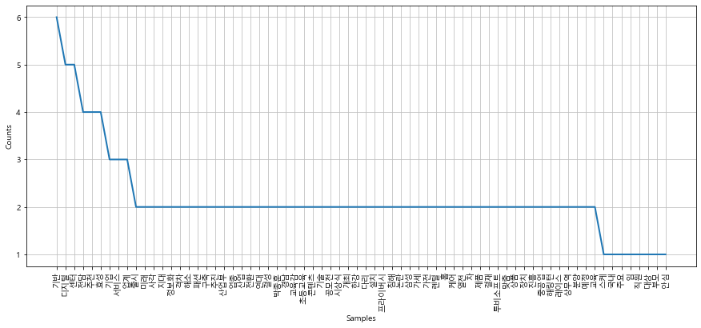
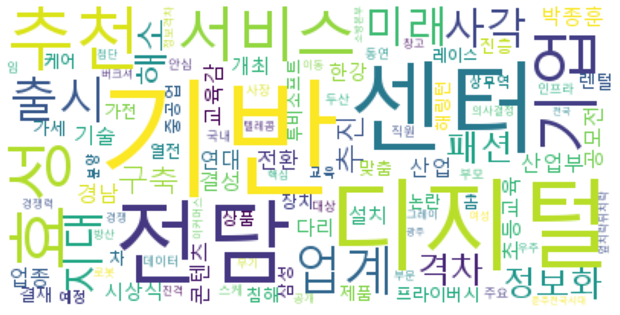

```python
# 네이버에서 검색어 입력받아 검색 한 후 블로그 메뉴를 선택하고
# 오른쪽에 있는 검색옵션 버튼을 눌러서
# 정렬 방식과 기간을 입력하기

#Step 0. 필요한 모듈과 라이브러리를 로딩합니다.
import sys # 시스템
import os  # 시스템

import pandas as pd  # 판다스 : 데이터분석 라이브러리
import numpy as np   # 넘파이 : 숫자, 행렬 데이터 라이브러리

from bs4 import BeautifulSoup    # html 데이터를 전처리
from selenium import webdriver   # 웹 브라우저 자동화
import time    # 서버와 통신할 때 중간중간 시간 지연. 보통은 1초
from tqdm import tqdm_notebook   # for문 돌릴 때 진행상황을 %게이지로 알려준다.
```


```python
# # 3-1. 블로그 글 크롤링하기

# url = url_load['url'][i]

# driver = webdriver.Chrome("chromedriver.exe") # 윈도우는 "chromedriver.exe"

# driver.get(url) # 글 띄우기

# 여기까지는 일반적인 페이지를 크롤링 하는 방법과 동일

# ​

# 페이지에서 내부 iframe이 존재할경우 프레임을 변경해주어야한다.

# driver.switch_to.frame('mainFrame')
```


```python
pwd
```


    'C:\\Users\\user\\study'


```python
path = '/Users/user/study/chromedriver.exe'    
```


```python
driver = webdriver.Chrome(path)
driver.get('http://www.naver.com')
time.sleep(2)
```


```python
element = driver.find_element_by_id('query')
element.send_keys('AI')
element.submit()
```


```python
driver.find_element_by_link_text("뉴스").click()
time.sleep(1)

driver.find_element_by_link_text('최신순').click()
time.sleep(1)
```


```python
url_list = []
title_list = []
```


```python
article_ai = driver.find_elements_by_css_selector('a.news_tit')
article_ai
```


    [<selenium.webdriver.remote.webelement.WebElement (session="826a8d5420f9726be1ca4cc89606c089", element="aa88eae2-c12d-4fce-87cd-6f908f289620")>,
     <selenium.webdriver.remote.webelement.WebElement (session="826a8d5420f9726be1ca4cc89606c089", element="643e052c-cd7b-4f74-9fe2-6e22bfdb2c48")>,
     <selenium.webdriver.remote.webelement.WebElement (session="826a8d5420f9726be1ca4cc89606c089", element="d985d2bf-a402-4f22-8202-f8aade6a8ee4")>,
     <selenium.webdriver.remote.webelement.WebElement (session="826a8d5420f9726be1ca4cc89606c089", element="3b5cf5f6-c7f6-4aaf-a105-d7781917a077")>,
     <selenium.webdriver.remote.webelement.WebElement (session="826a8d5420f9726be1ca4cc89606c089", element="9a0d3eb5-ff96-4a24-b4f7-ad299a1c3d40")>,
     <selenium.webdriver.remote.webelement.WebElement (session="826a8d5420f9726be1ca4cc89606c089", element="288dd533-fb83-4d3a-b27d-24c4a86a44ee")>,
     <selenium.webdriver.remote.webelement.WebElement (session="826a8d5420f9726be1ca4cc89606c089", element="872324a3-5f53-4576-83df-29deba3b8b86")>,
     <selenium.webdriver.remote.webelement.WebElement (session="826a8d5420f9726be1ca4cc89606c089", element="576360cc-e63e-4014-acc1-dcad21dfd9d0")>,
     <selenium.webdriver.remote.webelement.WebElement (session="826a8d5420f9726be1ca4cc89606c089", element="958af491-5849-4fb2-b03e-4a2f65d14b61")>,
     <selenium.webdriver.remote.webelement.WebElement (session="826a8d5420f9726be1ca4cc89606c089", element="159220fd-c7a4-4908-80fd-b772772c9bf6")>]


```python
article_ai[0].get_attribute('href')
```


    'http://www.mdtoday.co.kr/mdtoday/index.html?no=423464'


```python
for article in article_ai : 
    url = article.get_attribute('href')
    url_list.append(url)

    print(url)
    time.sleep(1)
for article in article_ai:
    title = article.text
    title_list.append(title)
    
    print(title)
print('url갯수:', len(url_list))
print('title갯수:', len(title_list))
```

    http://www.mdtoday.co.kr/mdtoday/index.html?no=423464
    http://www.aitimes.com/news/articleView.html?idxno=139156
    http://www.ohmynews.com/NWS_Web/View/at_pg.aspx?CNTN_CD=A0002754174&CMPT_CD=P0010&utm_source=naver&utm_medium=newsearch&utm_campaign=naver_news
    http://www.earlyadopter.co.kr/151360
    http://www.g-enews.com/ko-kr/news/article/news_all/202106240956045240c6fee23429_1/article.html
    http://www.mtnews.net/news/view.php?idx=11110
    http://www.kidd.co.kr/news/222851
    http://www.worktoday.co.kr/news/articleView.html?idxno=16433
    https://www.seoul.co.kr/news/newsView.php?id=20210624500067&wlog_tag3=naver
    https://www.hellot.net/news/article.html?no=59109
    파로스아이바이오, 180억 규모 시리즈C 투자유치 성공
    "지스트에서 반짝이는 아이디어로 AI‧IoT 창업 꿈 펼치세요"
    박종훈 교육감 "미래교육체제 구축, 경남 전체가 교육 현장"
    오토파일럿 그 이후, 테슬라 도조
    소프트뱅크 손정의, "21세기 로스차일드 되고 싶다"...정보혁명의 자본 공급자...
    조선·기계·뿌리소재 등 10대 업종 디지털 전환 ‘연대와 협업’ 네트워크 구...
    [포토뉴스] 일자리를 위한 청년들의 발걸음
    KAIST-SM 엔터테인먼트, 아바타 활용 메타버스 공연기술 연구 '맞손'
    SM 이수만 “에스파, 미래 엔터테인먼트 시작” 카이스트서 강연
    미래차·전자·조선 등 10대 업종별 ‘산업 디지털 전환 연대’ 결성 
    url갯수: 30
    title갯수: 20
    


```python
# 여러 번 실행시켜서 중복을 제거해줘야함.
```


```python
listset = set(url_list)
url_list2 = list(listset)
```


```python
url_list2
```


    ['http://www.kidd.co.kr/news/222851',
     'https://www.seoul.co.kr/news/newsView.php?id=20210624500067&wlog_tag3=naver',
     'http://www.g-enews.com/ko-kr/news/article/news_all/202106240956045240c6fee23429_1/article.html',
     'https://www.hellot.net/news/article.html?no=59109',
     'http://www.mdtoday.co.kr/mdtoday/index.html?no=423464',
     'http://www.aitimes.com/news/articleView.html?idxno=139156',
     'http://www.ohmynews.com/NWS_Web/View/at_pg.aspx?CNTN_CD=A0002754174&CMPT_CD=P0010&utm_source=naver&utm_medium=newsearch&utm_campaign=naver_news',
     'http://www.mtnews.net/news/view.php?idx=11110',
     'http://www.worktoday.co.kr/news/articleView.html?idxno=16433',
     'http://www.earlyadopter.co.kr/151360']


```python
listset2 = set(title_list)
title_list2 = list(listset2)
len(title_list2)
```


    10


```python
ai_df = pd.DataFrame({'url': url_list2, 'title': title_list2})
ai_df
```


<div>
<style scoped>
    .dataframe tbody tr th:only-of-type {
        vertical-align: middle;
    }

    .dataframe tbody tr th {
        vertical-align: top;
    }

    .dataframe thead th {
        text-align: right;
    }
</style>
<table border="1" class="dataframe">
  <thead>
    <tr style="text-align: right;">
      <th></th>
      <th>url</th>
      <th>title</th>
    </tr>
  </thead>
  <tbody>
    <tr>
      <th>0</th>
      <td>http://www.kidd.co.kr/news/222851</td>
      <td>파로스아이바이오, 180억 규모 시리즈C 투자유치 성공</td>
    </tr>
    <tr>
      <th>1</th>
      <td>https://www.seoul.co.kr/news/newsView.php?id=2...</td>
      <td>SM 이수만 “에스파, 미래 엔터테인먼트 시작” 카이스트서 강연</td>
    </tr>
    <tr>
      <th>2</th>
      <td>http://www.g-enews.com/ko-kr/news/article/news...</td>
      <td>소프트뱅크 손정의, "21세기 로스차일드 되고 싶다"...정보혁명의 자본 공급자...</td>
    </tr>
    <tr>
      <th>3</th>
      <td>https://www.hellot.net/news/article.html?no=59109</td>
      <td>KAIST-SM 엔터테인먼트, 아바타 활용 메타버스 공연기술 연구 '맞손'</td>
    </tr>
    <tr>
      <th>4</th>
      <td>http://www.mdtoday.co.kr/mdtoday/index.html?no...</td>
      <td>오토파일럿 그 이후, 테슬라 도조</td>
    </tr>
    <tr>
      <th>5</th>
      <td>http://www.aitimes.com/news/articleView.html?i...</td>
      <td>박종훈 교육감 "미래교육체제 구축, 경남 전체가 교육 현장"</td>
    </tr>
    <tr>
      <th>6</th>
      <td>http://www.ohmynews.com/NWS_Web/View/at_pg.asp...</td>
      <td>[포토뉴스] 일자리를 위한 청년들의 발걸음</td>
    </tr>
    <tr>
      <th>7</th>
      <td>http://www.mtnews.net/news/view.php?idx=11110</td>
      <td>조선·기계·뿌리소재 등 10대 업종 디지털 전환 ‘연대와 협업’ 네트워크 구...</td>
    </tr>
    <tr>
      <th>8</th>
      <td>http://www.worktoday.co.kr/news/articleView.ht...</td>
      <td>미래차·전자·조선 등 10대 업종별 ‘산업 디지털 전환 연대’ 결성</td>
    </tr>
    <tr>
      <th>9</th>
      <td>http://www.earlyadopter.co.kr/151360</td>
      <td>"지스트에서 반짝이는 아이디어로 AI‧IoT 창업 꿈 펼치세요"</td>
    </tr>
  </tbody>
</table>
</div>


```python
# 10페이지까지 url & title을 가져오기
```


```python
n = int(input('몇페이지까지 크롤링할거야?:'))
page = [i for i in range(1,n)]
```

    몇페이지까지 크롤링할거야?:10
    


```python
for i in page :
    driver.find_element_by_link_text(i).click()
    time.sleep(10)
```


    ---------------------------------------------------------------------------

    WebDriverException                        Traceback (most recent call last)

    <ipython-input-73-b7fceec4eb32> in <module>
          1 for i in page :
    ----> 2     driver.find_element_by_link_text(i).click()
          3     time.sleep(10)
    

    C:\ProgramData\Anaconda3\lib\site-packages\selenium\webdriver\remote\webdriver.py in find_element_by_link_text(self, link_text)
        426             element = driver.find_element_by_link_text('Sign In')
        427         """
    --> 428         return self.find_element(by=By.LINK_TEXT, value=link_text)
        429 
        430     def find_elements_by_link_text(self, text):
    

    C:\ProgramData\Anaconda3\lib\site-packages\selenium\webdriver\remote\webdriver.py in find_element(self, by, value)
        974                 by = By.CSS_SELECTOR
        975                 value = '[name="%s"]' % value
    --> 976         return self.execute(Command.FIND_ELEMENT, {
        977             'using': by,
        978             'value': value})['value']
    

    C:\ProgramData\Anaconda3\lib\site-packages\selenium\webdriver\remote\webdriver.py in execute(self, driver_command, params)
        319         response = self.command_executor.execute(driver_command, params)
        320         if response:
    --> 321             self.error_handler.check_response(response)
        322             response['value'] = self._unwrap_value(
        323                 response.get('value', None))
    

    C:\ProgramData\Anaconda3\lib\site-packages\selenium\webdriver\remote\errorhandler.py in check_response(self, response)
        240                 alert_text = value['alert'].get('text')
        241             raise exception_class(message, screen, stacktrace, alert_text)
    --> 242         raise exception_class(message, screen, stacktrace)
        243 
        244     def _value_or_default(self, obj, key, default):
    

    WebDriverException: Message: chrome not reachable
      (Session info: chrome=91.0.4472.106)
    


```python
# 네이버 ai 크롤링 (원하는 페이지)
```


```python
n = int(input('몇페이지까지 크롤링할거야?:'))
page = [str(i) for i in range(1,n+1)]

driver = webdriver.Chrome(path)
driver.get('http://www.naver.com')
time.sleep(2)

element = driver.find_element_by_id('query')
element.send_keys('AI')
element.submit()

driver.find_element_by_link_text("뉴스").click()
time.sleep(1)

driver.find_element_by_link_text('최신순').click()
time.sleep(1)

url_list = []
title_list = []


for i in page :
    driver.find_element_by_link_text(i).click()
    time.sleep(3)
    article_ai = driver.find_elements_by_css_selector('a.news_tit')
    for article in article_ai : 
        url = article.get_attribute('href')
        url_list.append(url)
        time.sleep(1)
        print(url)
    for article in article_ai:
        title = article.text
        title_list.append(title)
        print(title)
        
print('url갯수:', len(url_list))
print('title갯수:', len(title_list))

ai_df = pd.DataFrame({'url': url_list, 'title': title_list})
```

    몇페이지까지 크롤링할거야?:3
    http://www.consumernews.co.kr/news/articleView.html?idxno=629458
    http://news.mk.co.kr/newsRead.php?no=611874&year=2021
    http://www.irobotnews.com/news/articleView.html?idxno=25377
    https://www.hankyung.com/politics/article/2021062410571
    http://www.updownnews.co.kr/news/articleView.html?idxno=232921
    http://www.sporbiz.co.kr/news/articleView.html?idxno=528124
    http://www.m-i.kr/news/articleView.html?idxno=840202
    https://view.asiae.co.kr/article/2021062415162308451
    http://www.digitaltoday.co.kr/news/articleView.html?idxno=407145
    http://www.busan.com/view/busan/view.php?code=2021062415075169176
    AAI헬스케어, 국내 주요 기업 임직원 대상 '부모안심' 서비스 출시
    손동연 두산인프라 사장 "데이터기반 의사결정이 미래경쟁력 핵심"
    美 버크셔 그레이, 창고용 새 AI 이동로봇 공개
    진격의 'K방산'…첨단무기 이어 우주까지 넘본다
    SK텔레콤, 디지털 사각지대 전담센터 개소...정보화 격차 해소
    SKT, '디지털 사각지대 전담센터'로 정보격차 해소한다
    엎치락뒤치락 1위 경쟁, 여성 패션 부문 이커머스서 춘추전국시대 
    광주소방본부, 전국 최초 ‘AI 기반 119신고접수시스템’ 구축 추진
    산업부, 10대 업종 산업 디지털 전환 연대 결성
    박종훈 경남교육감, 3선 불출마 입장 번복할듯
    http://www.digitaltoday.co.kr/news/articleView.html?idxno=407145
    https://www.sedaily.com/NewsView/22NREWR1VY
    https://www.ekn.kr/web/view.php?key=20210624010004656
    https://www.dnews.co.kr/uhtml/view.jsp?idxno=202106241506068010637
    http://news.mt.co.kr/mtview.php?no=2021062411075069706
    http://www.gvalley.co.kr/news/articleView.html?idxno=581374
    https://www.asiatime.co.kr/article/20210624500288
    http://mbnmoney.mbn.co.kr/news/view?news_no=MM1004371349
    http://www.enewstoday.co.kr/news/articleView.html?idxno=1490505
    http://realty.chosun.com/site/data/html_dir/2021/06/24/2021062401450.html
    산업부, 10대 업종 산업 디지털 전환 연대 결성
    에스디하우징X세수X에스엘비, RE100 플랫폼 비즈니스센터 품은 주상복합 프로...
    패션앱도 카카오, 지그재그 인수로 단숨에 업계1위 등극
    SKT, 남산에 정보소외계층 위한 디지털 전담센터 개소
    중기부, 탄소저감 등 강원·충청·경북에 규제자유특구 추진한다
    KT, 초등교육 콘텐츠 및 기술 공모전 시상식 개최
    한강 다리에 AI 기반 CCTV 설치된다… 프라이버시 침해 논란
    삼성·LG도 가세한 가전·렌털업계 '홈케어 서비스' 열전
    내 차에서 제품 추천에 결재까지…투비소프트, AI 기반 맞춤형 상품 추천 장치...
    진흥기업·효성중공업 '효성해링턴 플레이스 상무역' 분양 예정
    https://www.asiatime.co.kr/article/20210624500288
    http://www.gvalley.co.kr/news/articleView.html?idxno=581374
    http://mbnmoney.mbn.co.kr/news/view?news_no=MM1004371349
    http://realty.chosun.com/site/data/html_dir/2021/06/24/2021062401450.html
    http://www.enewstoday.co.kr/news/articleView.html?idxno=1490505
    http://www.cnbnews.com/news/article.html?no=498526
    https://www.news1.kr/articles/?4349918
    https://sports.donga.com/article/all/20210624/107621457/1
    http://www.datanet.co.kr/news/articleView.html?idxno=161128
    http://www.kpinews.co.kr/news/articleView.html?idxno=150459
    한강 다리에 AI 기반 CCTV 설치된다… 프라이버시 침해 논란
    KT, 초등교육 콘텐츠 및 기술 공모전 시상식 개최
    삼성·LG도 가세한 가전·렌털업계 '홈케어 서비스' 열전
    진흥기업·효성중공업 '효성해링턴 플레이스 상무역' 분양 예정
    내 차에서 제품 추천에 결재까지…투비소프트, AI 기반 맞춤형 상품 추천 장치...
    박종훈 교육감 "미래교육체제 구축해 경남교육 새 비전 제시하겠다"
    KLA, 반도체칩 수율과 신뢰성 향상을 위한 자동차용 신제품 포트폴리오 출시
    정보화 격차 줄인다…SKT, 전담센터 개소
    메가존클라우드, 1900억 규모 시리즈 B 투자 유치 성료…세일즈포스 등 참여
    도로공사, 7월 7일부터 고속도로 휴게소서 폐플라스틱 재활용 캠페인
    url갯수: 30
    title갯수: 30
    


```python
ai_df = pd.DataFrame({'url': url_list, 'title': title_list})
```


```python
ai_df
```


<div>
<style scoped>
    .dataframe tbody tr th:only-of-type {
        vertical-align: middle;
    }

    .dataframe tbody tr th {
        vertical-align: top;
    }

    .dataframe thead th {
        text-align: right;
    }
</style>
<table border="1" class="dataframe">
  <thead>
    <tr style="text-align: right;">
      <th></th>
      <th>url</th>
      <th>title</th>
    </tr>
  </thead>
  <tbody>
    <tr>
      <th>0</th>
      <td>http://www.consumernews.co.kr/news/articleView...</td>
      <td>AAI헬스케어, 국내 주요 기업 임직원 대상 '부모안심' 서비스 출시</td>
    </tr>
    <tr>
      <th>1</th>
      <td>http://news.mk.co.kr/newsRead.php?no=611874&amp;ye...</td>
      <td>손동연 두산인프라 사장 "데이터기반 의사결정이 미래경쟁력 핵심"</td>
    </tr>
    <tr>
      <th>2</th>
      <td>http://www.irobotnews.com/news/articleView.htm...</td>
      <td>美 버크셔 그레이, 창고용 새 AI 이동로봇 공개</td>
    </tr>
    <tr>
      <th>3</th>
      <td>https://www.hankyung.com/politics/article/2021...</td>
      <td>진격의 'K방산'…첨단무기 이어 우주까지 넘본다</td>
    </tr>
    <tr>
      <th>4</th>
      <td>http://www.updownnews.co.kr/news/articleView.h...</td>
      <td>SK텔레콤, 디지털 사각지대 전담센터 개소...정보화 격차 해소</td>
    </tr>
    <tr>
      <th>5</th>
      <td>http://www.sporbiz.co.kr/news/articleView.html...</td>
      <td>SKT, '디지털 사각지대 전담센터'로 정보격차 해소한다</td>
    </tr>
    <tr>
      <th>6</th>
      <td>http://www.m-i.kr/news/articleView.html?idxno=...</td>
      <td>엎치락뒤치락 1위 경쟁, 여성 패션 부문 이커머스서 춘추전국시대</td>
    </tr>
    <tr>
      <th>7</th>
      <td>https://view.asiae.co.kr/article/2021062415162...</td>
      <td>광주소방본부, 전국 최초 ‘AI 기반 119신고접수시스템’ 구축 추진</td>
    </tr>
    <tr>
      <th>8</th>
      <td>http://www.digitaltoday.co.kr/news/articleView...</td>
      <td>산업부, 10대 업종 산업 디지털 전환 연대 결성</td>
    </tr>
    <tr>
      <th>9</th>
      <td>http://www.busan.com/view/busan/view.php?code=...</td>
      <td>박종훈 경남교육감, 3선 불출마 입장 번복할듯</td>
    </tr>
    <tr>
      <th>10</th>
      <td>http://www.digitaltoday.co.kr/news/articleView...</td>
      <td>산업부, 10대 업종 산업 디지털 전환 연대 결성</td>
    </tr>
    <tr>
      <th>11</th>
      <td>https://www.sedaily.com/NewsView/22NREWR1VY</td>
      <td>에스디하우징X세수X에스엘비, RE100 플랫폼 비즈니스센터 품은 주상복합 프로...</td>
    </tr>
    <tr>
      <th>12</th>
      <td>https://www.ekn.kr/web/view.php?key=2021062401...</td>
      <td>패션앱도 카카오, 지그재그 인수로 단숨에 업계1위 등극</td>
    </tr>
    <tr>
      <th>13</th>
      <td>https://www.dnews.co.kr/uhtml/view.jsp?idxno=2...</td>
      <td>SKT, 남산에 정보소외계층 위한 디지털 전담센터 개소</td>
    </tr>
    <tr>
      <th>14</th>
      <td>http://news.mt.co.kr/mtview.php?no=20210624110...</td>
      <td>중기부, 탄소저감 등 강원·충청·경북에 규제자유특구 추진한다</td>
    </tr>
    <tr>
      <th>15</th>
      <td>http://www.gvalley.co.kr/news/articleView.html...</td>
      <td>KT, 초등교육 콘텐츠 및 기술 공모전 시상식 개최</td>
    </tr>
    <tr>
      <th>16</th>
      <td>https://www.asiatime.co.kr/article/20210624500288</td>
      <td>한강 다리에 AI 기반 CCTV 설치된다… 프라이버시 침해 논란</td>
    </tr>
    <tr>
      <th>17</th>
      <td>http://mbnmoney.mbn.co.kr/news/view?news_no=MM...</td>
      <td>삼성·LG도 가세한 가전·렌털업계 '홈케어 서비스' 열전</td>
    </tr>
    <tr>
      <th>18</th>
      <td>http://www.enewstoday.co.kr/news/articleView.h...</td>
      <td>내 차에서 제품 추천에 결재까지…투비소프트, AI 기반 맞춤형 상품 추천 장치...</td>
    </tr>
    <tr>
      <th>19</th>
      <td>http://realty.chosun.com/site/data/html_dir/20...</td>
      <td>진흥기업·효성중공업 '효성해링턴 플레이스 상무역' 분양 예정</td>
    </tr>
    <tr>
      <th>20</th>
      <td>https://www.asiatime.co.kr/article/20210624500288</td>
      <td>한강 다리에 AI 기반 CCTV 설치된다… 프라이버시 침해 논란</td>
    </tr>
    <tr>
      <th>21</th>
      <td>http://www.gvalley.co.kr/news/articleView.html...</td>
      <td>KT, 초등교육 콘텐츠 및 기술 공모전 시상식 개최</td>
    </tr>
    <tr>
      <th>22</th>
      <td>http://mbnmoney.mbn.co.kr/news/view?news_no=MM...</td>
      <td>삼성·LG도 가세한 가전·렌털업계 '홈케어 서비스' 열전</td>
    </tr>
    <tr>
      <th>23</th>
      <td>http://realty.chosun.com/site/data/html_dir/20...</td>
      <td>진흥기업·효성중공업 '효성해링턴 플레이스 상무역' 분양 예정</td>
    </tr>
    <tr>
      <th>24</th>
      <td>http://www.enewstoday.co.kr/news/articleView.h...</td>
      <td>내 차에서 제품 추천에 결재까지…투비소프트, AI 기반 맞춤형 상품 추천 장치...</td>
    </tr>
    <tr>
      <th>25</th>
      <td>http://www.cnbnews.com/news/article.html?no=49...</td>
      <td>박종훈 교육감 "미래교육체제 구축해 경남교육 새 비전 제시하겠다"</td>
    </tr>
    <tr>
      <th>26</th>
      <td>https://www.news1.kr/articles/?4349918</td>
      <td>KLA, 반도체칩 수율과 신뢰성 향상을 위한 자동차용 신제품 포트폴리오 출시</td>
    </tr>
    <tr>
      <th>27</th>
      <td>https://sports.donga.com/article/all/20210624/...</td>
      <td>정보화 격차 줄인다…SKT, 전담센터 개소</td>
    </tr>
    <tr>
      <th>28</th>
      <td>http://www.datanet.co.kr/news/articleView.html...</td>
      <td>메가존클라우드, 1900억 규모 시리즈 B 투자 유치 성료…세일즈포스 등 참여</td>
    </tr>
    <tr>
      <th>29</th>
      <td>http://www.kpinews.co.kr/news/articleView.html...</td>
      <td>도로공사, 7월 7일부터 고속도로 휴게소서 폐플라스틱 재활용 캠페인</td>
    </tr>
  </tbody>
</table>
</div>


```python
pwd
```


    'C:\\Users\\user\\study'


```python
ai_df.to_csv('./ai_df.csv', encoding='cp949')
```

### wordcloud , 형태소 분석


```python
import scipy as sp
import pandas as pd
import numpy as np

from konlpy.tag import Kkma       ; kkma = Kkma()
from konlpy.tag import Hannanum   ; hannanum = Hannanum()
from konlpy.tag import Okt        ; t = Okt()
from konlpy.tag import *
import pickle

from sklearn.feature_extraction.text import CountVectorizer
from sklearn.feature_extraction.text import TfidfVectorizer
from sklearn.linear_model import LogisticRegression
from sklearn.pipeline import Pipeline
from sklearn.metrics import accuracy_score
from sklearn.model_selection import train_test_split

# 그래프
%matplotlib inline
import os
import matplotlib.pyplot as plt
import seaborn as sns
import graphviz             
from sklearn.tree import export_graphviz

# 그래프 문자 깨지는 대처
import matplotlib
from matplotlib import font_manager, rc
import platform

if platform.system() == 'Windows':
# 윈도우인 경우
    font_name = font_manager.FontProperties(fname="c:/Windows/Fonts/malgun.ttf").get_name()
    rc('font', family=font_name)
else:    
# Mac 인 경우
    rc('font', family='AppleGothic')
    
matplotlib.rcParams['axes.unicode_minus'] = False   
#그래프에서 마이너스 기호가 표시되도록 하는 설정입니다. 

# 워닝 없애주는 것
import warnings  
warnings.filterwarnings('ignore')
```


```python
pwd
```


    'C:\\Users\\user\\study'


```python
df_title = pd.read_csv('./ai_df.csv', encoding='cp949')
print(df_title.shape)
df_title.head(10)
```

    (30, 3)
    


<div>
<style scoped>
    .dataframe tbody tr th:only-of-type {
        vertical-align: middle;
    }

    .dataframe tbody tr th {
        vertical-align: top;
    }

    .dataframe thead th {
        text-align: right;
    }
</style>
<table border="1" class="dataframe">
  <thead>
    <tr style="text-align: right;">
      <th></th>
      <th>Unnamed: 0</th>
      <th>url</th>
      <th>title</th>
    </tr>
  </thead>
  <tbody>
    <tr>
      <th>0</th>
      <td>0</td>
      <td>http://www.consumernews.co.kr/news/articleView...</td>
      <td>AAI헬스케어, 국내 주요 기업 임직원 대상 '부모안심' 서비스 출시</td>
    </tr>
    <tr>
      <th>1</th>
      <td>1</td>
      <td>http://news.mk.co.kr/newsRead.php?no=611874&amp;ye...</td>
      <td>손동연 두산인프라 사장 "데이터기반 의사결정이 미래경쟁력 핵심"</td>
    </tr>
    <tr>
      <th>2</th>
      <td>2</td>
      <td>http://www.irobotnews.com/news/articleView.htm...</td>
      <td>美 버크셔 그레이, 창고용 새 AI 이동로봇 공개</td>
    </tr>
    <tr>
      <th>3</th>
      <td>3</td>
      <td>https://www.hankyung.com/politics/article/2021...</td>
      <td>진격의 'K방산'…첨단무기 이어 우주까지 넘본다</td>
    </tr>
    <tr>
      <th>4</th>
      <td>4</td>
      <td>http://www.updownnews.co.kr/news/articleView.h...</td>
      <td>SK텔레콤, 디지털 사각지대 전담센터 개소...정보화 격차 해소</td>
    </tr>
    <tr>
      <th>5</th>
      <td>5</td>
      <td>http://www.sporbiz.co.kr/news/articleView.html...</td>
      <td>SKT, '디지털 사각지대 전담센터'로 정보격차 해소한다</td>
    </tr>
    <tr>
      <th>6</th>
      <td>6</td>
      <td>http://www.m-i.kr/news/articleView.html?idxno=...</td>
      <td>엎치락뒤치락 1위 경쟁, 여성 패션 부문 이커머스서 춘추전국시대</td>
    </tr>
    <tr>
      <th>7</th>
      <td>7</td>
      <td>https://view.asiae.co.kr/article/2021062415162...</td>
      <td>광주소방본부, 전국 최초 ‘AI 기반 119신고접수시스템’ 구축 추진</td>
    </tr>
    <tr>
      <th>8</th>
      <td>8</td>
      <td>http://www.digitaltoday.co.kr/news/articleView...</td>
      <td>산업부, 10대 업종 산업 디지털 전환 연대 결성</td>
    </tr>
    <tr>
      <th>9</th>
      <td>9</td>
      <td>http://www.busan.com/view/busan/view.php?code=...</td>
      <td>박종훈 경남교육감, 3선 불출마 입장 번복할듯</td>
    </tr>
  </tbody>
</table>
</div>


```python
df_title.title
```


    0             AAI헬스케어, 국내 주요 기업 임직원 대상 '부모안심' 서비스 출시
    1                손동연 두산인프라 사장 "데이터기반 의사결정이 미래경쟁력 핵심"
    2                        美 버크셔 그레이, 창고용 새 AI 이동로봇 공개
    3                         진격의 'K방산'…첨단무기 이어 우주까지 넘본다
    4                SK텔레콤, 디지털 사각지대 전담센터 개소...정보화 격차 해소
    5                    SKT, '디지털 사각지대 전담센터'로 정보격차 해소한다
    6               엎치락뒤치락 1위 경쟁, 여성 패션 부문 이커머스서 춘추전국시대 
    7             광주소방본부, 전국 최초 ‘AI 기반 119신고접수시스템’ 구축 추진
    8                        산업부, 10대 업종 산업 디지털 전환 연대 결성
    9                          박종훈 경남교육감, 3선 불출마 입장 번복할듯
    10                       산업부, 10대 업종 산업 디지털 전환 연대 결성
    11    에스디하우징X세수X에스엘비, RE100 플랫폼 비즈니스센터 품은 주상복합 프로...
    12                    패션앱도 카카오, 지그재그 인수로 단숨에 업계1위 등극
    13                    SKT, 남산에 정보소외계층 위한 디지털 전담센터 개소
    14                 중기부, 탄소저감 등 강원·충청·경북에 규제자유특구 추진한다
    15                      KT, 초등교육 콘텐츠 및 기술 공모전 시상식 개최
    16               한강 다리에 AI 기반 CCTV 설치된다… 프라이버시 침해 논란
    17                   삼성·LG도 가세한 가전·렌털업계 '홈케어 서비스' 열전
    18    내 차에서 제품 추천에 결재까지…투비소프트, AI 기반 맞춤형 상품 추천 장치...
    19                 진흥기업·효성중공업 '효성해링턴 플레이스 상무역' 분양 예정
    20               한강 다리에 AI 기반 CCTV 설치된다… 프라이버시 침해 논란
    21                      KT, 초등교육 콘텐츠 및 기술 공모전 시상식 개최
    22                   삼성·LG도 가세한 가전·렌털업계 '홈케어 서비스' 열전
    23                 진흥기업·효성중공업 '효성해링턴 플레이스 상무역' 분양 예정
    24    내 차에서 제품 추천에 결재까지…투비소프트, AI 기반 맞춤형 상품 추천 장치...
    25              박종훈 교육감 "미래교육체제 구축해 경남교육 새 비전 제시하겠다"
    26        KLA, 반도체칩 수율과 신뢰성 향상을 위한 자동차용 신제품 포트폴리오 출시
    27                           정보화 격차 줄인다…SKT, 전담센터 개소
    28       메가존클라우드, 1900억 규모 시리즈 B 투자 유치 성료…세일즈포스 등 참여
    29             도로공사, 7월 7일부터 고속도로 휴게소서 폐플라스틱 재활용 캠페인
    Name: title, dtype: object


```python
content_list = df_title.title.values.tolist()
print(len(content_list))
content_list
```

    30
    


    ["AAI헬스케어, 국내 주요 기업 임직원 대상 '부모안심' 서비스 출시",
     '손동연 두산인프라 사장 "데이터기반 의사결정이 미래경쟁력 핵심"',
     '美 버크셔 그레이, 창고용 새 AI 이동로봇 공개',
     "진격의 'K방산'…첨단무기 이어 우주까지 넘본다",
     'SK텔레콤, 디지털 사각지대 전담센터 개소...정보화 격차 해소',
     "SKT, '디지털 사각지대 전담센터'로 정보격차 해소한다",
     '엎치락뒤치락 1위 경쟁, 여성 패션 부문 이커머스서 춘추전국시대 ',
     '광주소방본부, 전국 최초 ‘AI 기반 119신고접수시스템’ 구축 추진',
     '산업부, 10대 업종 산업 디지털 전환 연대 결성',
     '박종훈 경남교육감, 3선 불출마 입장 번복할듯',
     '산업부, 10대 업종 산업 디지털 전환 연대 결성',
     '에스디하우징X세수X에스엘비, RE100 플랫폼 비즈니스센터 품은 주상복합 프로...',
     '패션앱도 카카오, 지그재그 인수로 단숨에 업계1위 등극',
     'SKT, 남산에 정보소외계층 위한 디지털 전담센터 개소',
     '중기부, 탄소저감 등 강원·충청·경북에 규제자유특구 추진한다',
     'KT, 초등교육 콘텐츠 및 기술 공모전 시상식 개최',
     '한강 다리에 AI 기반 CCTV 설치된다… 프라이버시 침해 논란',
     "삼성·LG도 가세한 가전·렌털업계 '홈케어 서비스' 열전",
     '내 차에서 제품 추천에 결재까지…투비소프트, AI 기반 맞춤형 상품 추천 장치...',
     "진흥기업·효성중공업 '효성해링턴 플레이스 상무역' 분양 예정",
     '한강 다리에 AI 기반 CCTV 설치된다… 프라이버시 침해 논란',
     'KT, 초등교육 콘텐츠 및 기술 공모전 시상식 개최',
     "삼성·LG도 가세한 가전·렌털업계 '홈케어 서비스' 열전",
     "진흥기업·효성중공업 '효성해링턴 플레이스 상무역' 분양 예정",
     '내 차에서 제품 추천에 결재까지…투비소프트, AI 기반 맞춤형 상품 추천 장치...',
     '박종훈 교육감 "미래교육체제 구축해 경남교육 새 비전 제시하겠다"',
     'KLA, 반도체칩 수율과 신뢰성 향상을 위한 자동차용 신제품 포트폴리오 출시',
     '정보화 격차 줄인다…SKT, 전담센터 개소',
     '메가존클라우드, 1900억 규모 시리즈 B 투자 유치 성료…세일즈포스 등 참여',
     '도로공사, 7월 7일부터 고속도로 휴게소서 폐플라스틱 재활용 캠페인']


```python
# NaN값이나 공백 제거하는 방법
#  content_list = [x.strip() for x in content_list if type(x) == str]
```


```python
import nltk
from konlpy.tag import Okt; t = Okt()

content_text = ''

for each_line in content_list:
    content_text = content_text + each_line + '\n'
print(content_text)
```

    AAI헬스케어, 국내 주요 기업 임직원 대상 '부모안심' 서비스 출시
    손동연 두산인프라 사장 "데이터기반 의사결정이 미래경쟁력 핵심"
    美 버크셔 그레이, 창고용 새 AI 이동로봇 공개
    진격의 'K방산'…첨단무기 이어 우주까지 넘본다
    SK텔레콤, 디지털 사각지대 전담센터 개소...정보화 격차 해소
    SKT, '디지털 사각지대 전담센터'로 정보격차 해소한다
    엎치락뒤치락 1위 경쟁, 여성 패션 부문 이커머스서 춘추전국시대 
    광주소방본부, 전국 최초 ‘AI 기반 119신고접수시스템’ 구축 추진
    산업부, 10대 업종 산업 디지털 전환 연대 결성
    박종훈 경남교육감, 3선 불출마 입장 번복할듯
    산업부, 10대 업종 산업 디지털 전환 연대 결성
    에스디하우징X세수X에스엘비, RE100 플랫폼 비즈니스센터 품은 주상복합 프로...
    패션앱도 카카오, 지그재그 인수로 단숨에 업계1위 등극
    SKT, 남산에 정보소외계층 위한 디지털 전담센터 개소
    중기부, 탄소저감 등 강원·충청·경북에 규제자유특구 추진한다
    KT, 초등교육 콘텐츠 및 기술 공모전 시상식 개최
    한강 다리에 AI 기반 CCTV 설치된다… 프라이버시 침해 논란
    삼성·LG도 가세한 가전·렌털업계 '홈케어 서비스' 열전
    내 차에서 제품 추천에 결재까지…투비소프트, AI 기반 맞춤형 상품 추천 장치...
    진흥기업·효성중공업 '효성해링턴 플레이스 상무역' 분양 예정
    한강 다리에 AI 기반 CCTV 설치된다… 프라이버시 침해 논란
    KT, 초등교육 콘텐츠 및 기술 공모전 시상식 개최
    삼성·LG도 가세한 가전·렌털업계 '홈케어 서비스' 열전
    진흥기업·효성중공업 '효성해링턴 플레이스 상무역' 분양 예정
    내 차에서 제품 추천에 결재까지…투비소프트, AI 기반 맞춤형 상품 추천 장치...
    박종훈 교육감 "미래교육체제 구축해 경남교육 새 비전 제시하겠다"
    KLA, 반도체칩 수율과 신뢰성 향상을 위한 자동차용 신제품 포트폴리오 출시
    정보화 격차 줄인다…SKT, 전담센터 개소
    메가존클라우드, 1900억 규모 시리즈 B 투자 유치 성료…세일즈포스 등 참여
    도로공사, 7월 7일부터 고속도로 휴게소서 폐플라스틱 재활용 캠페인
    
    


```python
tokens_ko = t.nouns(content_text)   # nouns (명사) /morphs (형태소) // t = okt()
tokens_ko
```


    ['헬',
     '스케',
     '국내',
     '주요',
     '기업',
     '임',
     '직원',
     '대상',
     '부모',
     '안심',
     '서비스',
     '출시',
     '손',
     '동연',
     '두산',
     '인프라',
     '사장',
     '데이터',
     '기반',
     '의사결정',
     '미래',
     '경쟁력',
     '핵심',
     '버크셔',
     '그레이',
     '창고',
     '용',
     '새',
     '이동',
     '로봇',
     '공개',
     '진격',
     '방산',
     '첨단',
     '무기',
     '우주',
     '텔레콤',
     '디지털',
     '사각',
     '지대',
     '전담',
     '센터',
     '정보화',
     '격차',
     '해소',
     '디지털',
     '사각',
     '지대',
     '전담',
     '센터',
     '로',
     '정보격차',
     '해소',
     '엎치락뒤치락',
     '위',
     '경쟁',
     '여성',
     '패션',
     '부문',
     '이커머스',
     '춘추전국시대',
     '광주',
     '소방본부',
     '전국',
     '최초',
     '기반',
     '신고',
     '접수',
     '시스템',
     '구축',
     '추진',
     '산업부',
     '업종',
     '산업',
     '디지털',
     '전환',
     '연대',
     '결성',
     '박종훈',
     '경남',
     '교육감',
     '선',
     '불',
     '출마',
     '입장',
     '번복',
     '산업부',
     '업종',
     '산업',
     '디지털',
     '전환',
     '연대',
     '결성',
     '에스',
     '디',
     '징',
     '세수',
     '에스엘',
     '비',
     '플랫폼',
     '비즈니스',
     '센터',
     '주상',
     '복합',
     '프로',
     '패션',
     '앱',
     '카카오',
     '지그재그',
     '인수',
     '단숨',
     '업계',
     '위',
     '등',
     '남산',
     '정보',
     '소외',
     '계층',
     '위',
     '디지털',
     '전담',
     '센터',
     '중',
     '기부',
     '탄소',
     '감',
     '등',
     '강원',
     '충청',
     '경북',
     '규제',
     '자유',
     '특구',
     '추진',
     '초등교육',
     '콘텐츠',
     '및',
     '기술',
     '공모전',
     '시상식',
     '개최',
     '한강',
     '다리',
     '기반',
     '설치',
     '프라이버시',
     '침해',
     '논란',
     '삼성',
     '도',
     '가세',
     '가전',
     '렌털',
     '업계',
     '홈',
     '케어',
     '서비스',
     '열전',
     '내',
     '차',
     '제품',
     '추천',
     '결재',
     '투비소프트',
     '기반',
     '맞춤',
     '상품',
     '추천',
     '장치',
     '진흥',
     '기업',
     '효성',
     '중공업',
     '효성',
     '해링턴',
     '레이스',
     '상무역',
     '분양',
     '예정',
     '한강',
     '다리',
     '기반',
     '설치',
     '프라이버시',
     '침해',
     '논란',
     '초등교육',
     '콘텐츠',
     '및',
     '기술',
     '공모전',
     '시상식',
     '개최',
     '삼성',
     '도',
     '가세',
     '가전',
     '렌털',
     '업계',
     '홈',
     '케어',
     '서비스',
     '열전',
     '진흥',
     '기업',
     '효성',
     '중공업',
     '효성',
     '해링턴',
     '레이스',
     '상무역',
     '분양',
     '예정',
     '내',
     '차',
     '제품',
     '추천',
     '결재',
     '투비소프트',
     '기반',
     '맞춤',
     '상품',
     '추천',
     '장치',
     '박종훈',
     '교육감',
     '미래',
     '교육',
     '체제',
     '구축',
     '경남',
     '교육',
     '새',
     '제시',
     '반도체',
     '칩',
     '율과',
     '신뢰',
     '향상',
     '위',
     '자동',
     '차용',
     '신제품',
     '포트폴리오',
     '출시',
     '정보화',
     '격차',
     '전담',
     '센터',
     '메',
     '존',
     '클라우드',
     '규모',
     '시리즈',
     '투자',
     '유치',
     '료',
     '포스',
     '등',
     '참여',
     '도로공사',
     '고속도로',
     '휴게소',
     '폐',
     '플라스틱',
     '재활용',
     '캠페인']


```python
ko = nltk.Text(tokens_ko)
```


```python
print(len(ko.tokens))          # 토큰 전체 갯수
print(len(set(ko.tokens)))  #중복제거
```

    267
    177
    


```python
# stopwords 처리작업 전
ko.vocab().most_common(50) 
```


    [('기반', 6),
     ('디지털', 5),
     ('센터', 5),
     ('전담', 4),
     ('추천', 4),
     ('효성', 4),
     ('기업', 3),
     ('서비스', 3),
     ('업계', 3),
     ('출시', 2),
     ('미래', 2),
     ('사각', 2),
     ('지대', 2),
     ('정보화', 2),
     ('격차', 2),
     ('해소', 2),
     ('패션', 2),
     ('구축', 2),
     ('추진', 2),
     ('산업부', 2),
     ('업종', 2),
     ('산업', 2),
     ('전환', 2),
     ('연대', 2),
     ('결성', 2),
     ('박종훈', 2),
     ('경남', 2),
     ('교육감', 2),
     ('초등교육', 2),
     ('콘텐츠', 2),
     ('기술', 2),
     ('공모전', 2),
     ('시상식', 2),
     ('개최', 2),
     ('한강', 2),
     ('다리', 2),
     ('설치', 2),
     ('프라이버시', 2),
     ('침해', 2),
     ('논란', 2),
     ('삼성', 2),
     ('가세', 2),
     ('가전', 2),
     ('렌털', 2),
     ('홈', 2),
     ('케어', 2),
     ('열전', 2),
     ('차', 2),
     ('제품', 2),
     ('결재', 2)]


```python
# 불용어 : 인터넷 검색 시 검색 용어로 사용하지 않는 단어. 관사, 전치사, 조사, 접속사 등 검색 색인 단어로 의미가 없는 단어
stop_words = ['.','가',"!",'\r\n\r\n','\r\n','\n','\n ','요','답변','...','을','수','에','질문','제','를','이','도',
                      '좋','1','는','로','으로','2','것','은','다',',','니다','대','들','용','로','내','차'
                      '2017','들','데','..','의','때','겠','고','게','네요','한','일','할','헬','위',
                      '10','?','하는','06','주','려고','인데','거','좀','는데','~','ㅎㅎ',
                      '하나','이상','20','뭐','까','있는','잘','습니다','다면','했','주려',
                      '지','있','못','후','중','줄','6','과','어떤','기본','!!',
                      '단어','라고','중요한','합','가요','....','보이','네','무지','새' ,'및','등',
              # '제주'에서 큰 의미없는 단어 제외
              '제주','여행','제주도','일상','손','위']
        

tokens_ko = [each_word for each_word in tokens_ko
             if each_word not in stop_words]

ko = nltk.Text(tokens_ko)
freq_50 = ko.vocab().most_common(50)
freq_50
```


    [('기반', 6),
     ('디지털', 5),
     ('센터', 5),
     ('전담', 4),
     ('추천', 4),
     ('효성', 4),
     ('기업', 3),
     ('서비스', 3),
     ('업계', 3),
     ('출시', 2),
     ('미래', 2),
     ('사각', 2),
     ('지대', 2),
     ('정보화', 2),
     ('격차', 2),
     ('해소', 2),
     ('패션', 2),
     ('구축', 2),
     ('추진', 2),
     ('산업부', 2),
     ('업종', 2),
     ('산업', 2),
     ('전환', 2),
     ('연대', 2),
     ('결성', 2),
     ('박종훈', 2),
     ('경남', 2),
     ('교육감', 2),
     ('초등교육', 2),
     ('콘텐츠', 2),
     ('기술', 2),
     ('공모전', 2),
     ('시상식', 2),
     ('개최', 2),
     ('한강', 2),
     ('다리', 2),
     ('설치', 2),
     ('프라이버시', 2),
     ('침해', 2),
     ('논란', 2),
     ('삼성', 2),
     ('가세', 2),
     ('가전', 2),
     ('렌털', 2),
     ('홈', 2),
     ('케어', 2),
     ('열전', 2),
     ('차', 2),
     ('제품', 2),
     ('결재', 2)]


```python
freq_50[0]
```


    ('기반', 6)


```python
word_list = []
for i, word in enumerate(freq_50):
    word_list.append(word[0])
```


```python
import matplotlib.pyplot as plt
import seaborn as sns
import graphviz             
from sklearn.tree import export_graphviz

plt.figure(figsize=(15,6))
ko.plot(70) 
plt.show()
```


    

    


```python
from wordcloud import WordCloud, STOPWORDS
from PIL import Image

data = ko.vocab().most_common(100)
data
```


    [('기반', 6),
     ('디지털', 5),
     ('센터', 5),
     ('전담', 4),
     ('추천', 4),
     ('효성', 4),
     ('기업', 3),
     ('서비스', 3),
     ('업계', 3),
     ('출시', 2),
     ('미래', 2),
     ('사각', 2),
     ('지대', 2),
     ('정보화', 2),
     ('격차', 2),
     ('해소', 2),
     ('패션', 2),
     ('구축', 2),
     ('추진', 2),
     ('산업부', 2),
     ('업종', 2),
     ('산업', 2),
     ('전환', 2),
     ('연대', 2),
     ('결성', 2),
     ('박종훈', 2),
     ('경남', 2),
     ('교육감', 2),
     ('초등교육', 2),
     ('콘텐츠', 2),
     ('기술', 2),
     ('공모전', 2),
     ('시상식', 2),
     ('개최', 2),
     ('한강', 2),
     ('다리', 2),
     ('설치', 2),
     ('프라이버시', 2),
     ('침해', 2),
     ('논란', 2),
     ('삼성', 2),
     ('가세', 2),
     ('가전', 2),
     ('렌털', 2),
     ('홈', 2),
     ('케어', 2),
     ('열전', 2),
     ('차', 2),
     ('제품', 2),
     ('결재', 2),
     ('투비소프트', 2),
     ('맞춤', 2),
     ('상품', 2),
     ('장치', 2),
     ('진흥', 2),
     ('중공업', 2),
     ('해링턴', 2),
     ('레이스', 2),
     ('상무역', 2),
     ('분양', 2),
     ('예정', 2),
     ('교육', 2),
     ('스케', 1),
     ('국내', 1),
     ('주요', 1),
     ('임', 1),
     ('직원', 1),
     ('대상', 1),
     ('부모', 1),
     ('안심', 1),
     ('동연', 1),
     ('두산', 1),
     ('인프라', 1),
     ('사장', 1),
     ('데이터', 1),
     ('의사결정', 1),
     ('경쟁력', 1),
     ('핵심', 1),
     ('버크셔', 1),
     ('그레이', 1),
     ('창고', 1),
     ('이동', 1),
     ('로봇', 1),
     ('공개', 1),
     ('진격', 1),
     ('방산', 1),
     ('첨단', 1),
     ('무기', 1),
     ('우주', 1),
     ('텔레콤', 1),
     ('정보격차', 1),
     ('엎치락뒤치락', 1),
     ('경쟁', 1),
     ('여성', 1),
     ('부문', 1),
     ('이커머스', 1),
     ('춘추전국시대', 1),
     ('광주', 1),
     ('소방본부', 1),
     ('전국', 1)]


```python
wordcloud = WordCloud(font_path="C:\Windows\Fonts\malgun.ttf",
                      relative_scaling = 0.2,
                      #stopwords=STOPWORDS,
                      background_color='white',
                      ).generate_from_frequencies(dict(data))
plt.figure(figsize=(16,8))
plt.imshow(wordcloud)
plt.axis("off")
plt.show()
```


    

    


```python

```
