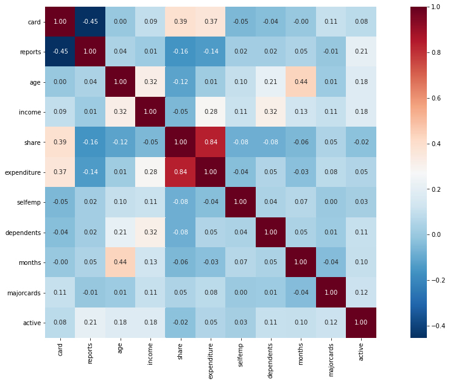

```python
pwd
```


    'C:\\Users\\user\\study'


```python
data_org = pd.read_csv('./AER_credit_card_data.csv', true_values = ['yes'], false_values= ['no'])

data.head(5)
```


<div>
<style scoped>
    .dataframe tbody tr th:only-of-type {
        vertical-align: middle;
    }

    .dataframe tbody tr th {
        vertical-align: top;
    }

    .dataframe thead th {
        text-align: right;
    }
</style>
<table border="1" class="dataframe">
  <thead>
    <tr style="text-align: right;">
      <th></th>
      <th>card</th>
      <th>reports</th>
      <th>age</th>
      <th>income</th>
      <th>share</th>
      <th>expenditure</th>
      <th>owner</th>
      <th>selfemp</th>
      <th>dependents</th>
      <th>months</th>
      <th>majorcards</th>
      <th>active</th>
    </tr>
  </thead>
  <tbody>
    <tr>
      <th>0</th>
      <td>True</td>
      <td>0</td>
      <td>37.66667</td>
      <td>4.5200</td>
      <td>0.033270</td>
      <td>124.983300</td>
      <td>True</td>
      <td>False</td>
      <td>3</td>
      <td>54</td>
      <td>1</td>
      <td>12</td>
    </tr>
    <tr>
      <th>1</th>
      <td>True</td>
      <td>0</td>
      <td>33.25000</td>
      <td>2.4200</td>
      <td>0.005217</td>
      <td>9.854167</td>
      <td>False</td>
      <td>False</td>
      <td>3</td>
      <td>34</td>
      <td>1</td>
      <td>13</td>
    </tr>
    <tr>
      <th>2</th>
      <td>True</td>
      <td>0</td>
      <td>33.66667</td>
      <td>4.5000</td>
      <td>0.004156</td>
      <td>15.000000</td>
      <td>True</td>
      <td>False</td>
      <td>4</td>
      <td>58</td>
      <td>1</td>
      <td>5</td>
    </tr>
    <tr>
      <th>3</th>
      <td>True</td>
      <td>0</td>
      <td>30.50000</td>
      <td>2.5400</td>
      <td>0.065214</td>
      <td>137.869200</td>
      <td>False</td>
      <td>False</td>
      <td>0</td>
      <td>25</td>
      <td>1</td>
      <td>7</td>
    </tr>
    <tr>
      <th>4</th>
      <td>True</td>
      <td>0</td>
      <td>32.16667</td>
      <td>9.7867</td>
      <td>0.067051</td>
      <td>546.503300</td>
      <td>True</td>
      <td>False</td>
      <td>2</td>
      <td>64</td>
      <td>1</td>
      <td>5</td>
    </tr>
  </tbody>
</table>
</div>


```python
import pandas as pd
import numpy as np
import pandas as pd
import matplotlib.pyplot as plt
import seaborn as sns
%matplotlib inline

# 경고 메시지 무시
import warnings
warnings.filterwarnings(action='ignore') 

data = pd.read_csv('./AER_credit_card_data.csv', true_values = ['yes'], false_values= ['no'])

y = data.card

X = data.drop(['card'], axis =1)

print('dataset 행 크기:', X.shape[0])
X.head()
```

    dataset 행 크기: 1319
    


<div>
<style scoped>
    .dataframe tbody tr th:only-of-type {
        vertical-align: middle;
    }

    .dataframe tbody tr th {
        vertical-align: top;
    }

    .dataframe thead th {
        text-align: right;
    }
</style>
<table border="1" class="dataframe">
  <thead>
    <tr style="text-align: right;">
      <th></th>
      <th>reports</th>
      <th>age</th>
      <th>income</th>
      <th>share</th>
      <th>expenditure</th>
      <th>owner</th>
      <th>selfemp</th>
      <th>dependents</th>
      <th>months</th>
      <th>majorcards</th>
      <th>active</th>
    </tr>
  </thead>
  <tbody>
    <tr>
      <th>0</th>
      <td>0</td>
      <td>37.66667</td>
      <td>4.5200</td>
      <td>0.033270</td>
      <td>124.983300</td>
      <td>True</td>
      <td>False</td>
      <td>3</td>
      <td>54</td>
      <td>1</td>
      <td>12</td>
    </tr>
    <tr>
      <th>1</th>
      <td>0</td>
      <td>33.25000</td>
      <td>2.4200</td>
      <td>0.005217</td>
      <td>9.854167</td>
      <td>False</td>
      <td>False</td>
      <td>3</td>
      <td>34</td>
      <td>1</td>
      <td>13</td>
    </tr>
    <tr>
      <th>2</th>
      <td>0</td>
      <td>33.66667</td>
      <td>4.5000</td>
      <td>0.004156</td>
      <td>15.000000</td>
      <td>True</td>
      <td>False</td>
      <td>4</td>
      <td>58</td>
      <td>1</td>
      <td>5</td>
    </tr>
    <tr>
      <th>3</th>
      <td>0</td>
      <td>30.50000</td>
      <td>2.5400</td>
      <td>0.065214</td>
      <td>137.869200</td>
      <td>False</td>
      <td>False</td>
      <td>0</td>
      <td>25</td>
      <td>1</td>
      <td>7</td>
    </tr>
    <tr>
      <th>4</th>
      <td>0</td>
      <td>32.16667</td>
      <td>9.7867</td>
      <td>0.067051</td>
      <td>546.503300</td>
      <td>True</td>
      <td>False</td>
      <td>2</td>
      <td>64</td>
      <td>1</td>
      <td>5</td>
    </tr>
  </tbody>
</table>
</div>


```python
from sklearn.pipeline import make_pipeline
from sklearn.ensemble import RandomForestClassifier
from sklearn.model_selection import cross_val_score

# Since there is no preprocessing, we don't need a pipeline (used anyway as best practice!)
my_pipeline = make_pipeline(RandomForestClassifier(n_estimators=100, random_state=50)) 

#
cv_scores = cross_val_score(my_pipeline, X, y, 
                            cv=5,
                            scoring='accuracy') #'neg_mean_absolute_error'

print("Cross-validation accuracy: %f" % cv_scores.mean())
```

    Cross-validation accuracy: 0.981810
    


```python
expenditures_cardholders = X.expenditure[y]
expenditures_noncardholders = X.expenditure[~y] # 카드 없는 사람 지출

print('Fraction of those who did not receive a card and had no expenditures: %.2f' \
      %((expenditures_noncardholders == 0).mean()))
print('Fraction of those who received a card and had no expenditures: %.2f' \
      %(( expenditures_cardholders == 0).mean()))
```

    Fraction of those who did not receive a card and had no expenditures: 1.00
    Fraction of those who received a card and had no expenditures: 0.02
    

카드를 받지않고 지출이 없는 사람은 없으며, 카드를 받았지만 지출이 없는 사람은 2%에 불과함. 


```python
# Drop leaky predictors from dataset
potential_leaks = ["expenditure",'share', 'active', 'majorcards']
X2 = X.drop(potential_leaks, axis=1)

# Evaluate the model with leaky predictors removedㅁ
cv_scores = cross_val_score(my_pipeline, X2, y, 
                            cv=5,
                            scoring='accuracy')

print("Cross-val accuracy: %f" % cv_scores.mean())
```

    Cross-val accuracy: 0.833201
    

### feature 설명 

1. card : 카드 신청(1) , 카드 미신청(0)
2. reports : Number of major derogatory reports (연체, 대출 등 신용 정보에 대해 악영향을 끼칠만한 건수)
3. age : Age n years plus twelfths of a year
4. income : Yearly income(/ 10,000)
5. share : Ratio of monthly credit card expenditure to yearly income
6. expenditure : Average monthly credit card expenditure
7. owner : 1 if owns home, 0 if rents
8. selfemp1 : 1 if self-employed, 0 if not
9. dependents : 1 + number of dependents
10. months : months living at current address
11. majorcards: Number of major credit cards held
12. active : Number of active credit accouts


```python
# 히트맵도 한번 그려보자
fig=plt.gcf()
fig.set_size_inches(20,10)
sns.heatmap(y.corr(), cmap='RdBu_r', square=True, cbar=True, annot=True, fmt=".2f")
```


    <AxesSubplot:>


    

    


```python

```

###  배열 객체 벡터화 연산


```python
data = [0,1,2,3,4,5,6,7,8,9]
```


```python
answer = []

for i in data:
    answer.append(2*i)
answer
```


    [0, 2, 4, 6, 8, 10, 12, 14, 16, 18]


```python
x = np.array(data)

x*2
```


    array([ 0,  2,  4,  6,  8, 10, 12, 14, 16, 18])


```python
# list는 객체 크기가 증가함.

list = [1,2,3]
print(list*2)
```

    [1, 2, 3, 1, 2, 3]
    


```python
a = np.array([1,2,3])
b = np.array([10,20,30])

print(2 * a + b)
print(a == 2)
print(b > 10)
print((a==2)&(b>10))
```

    [12 24 36]
    [False  True False]
    [False  True  True]
    [False  True False]
    


```python
# 차원의 크기 ndim , 배열의 크기 shape
print(a.ndim)
print(a.shape)
```

    1
    (3,)
    

### 배열의 인덱싱 


```python
a = np.array([0,1,2,3,4])

print(a[2])
print(a[-1])
```

    2
    4
    


```python
a = np.array([[0,1,2,3],[4,5,6,7]])

print(a)
print('\n')

print(a[0,:])
print('\n')

print(a[:, 1])
print('\n')

print(a[1,1:])
print('\n')

print(a[:2,:2])
print('\n')
```

    [[0 1 2 3]
     [4 5 6 7]]
    
    
    [0 1 2 3]
    
    
    [1 5]
    
    
    [5 6 7]
    
    
    [[0 1]
     [4 5]]
    
    
    


```python
a = np.array([0, 1, 2, 3, 4, 5, 6, 7, 8, 9])
idx = np.array([True, False, True, False, True,
               False, True, False, True, False])
print(a[idx])
print(a % 2)
print(a[a%2==0])
```

    [0 2 4 6 8]
    [0 1 0 1 0 1 0 1 0 1]
    [0 2 4 6 8]
    


```python
a = np.array([11, 22, 33, 44, 55, 66, 77, 88, 99])
idx = np.array([0, 2, 4, 6, 8])
a[idx]
```


    array([11, 33, 55, 77, 99])


```python
a = np.array([11, 22, 33, 44, 55, 66, 77, 88, 99])
idx = np.array([0, 0, 0, 0, 0, 0, 1, 1, 1, 1, 1, 2, 2, 2, 2, 2])
a[idx]
```


    array([11, 11, 11, 11, 11, 11, 22, 22, 22, 22, 22, 33, 33, 33, 33, 33])


다음 행렬과 같은 배열이 있다.

x = np.array([1, 2, 3, 4, 5, 6, 7, 8, 9, 10,
             11, 12, 13, 14, 15, 16, 17, 18, 19, 20])
             
             
1.이 배열에서 3의 배수를 찾아라.

2.이 배열에서 4로 나누면 1이 남는 수를 찾아라.

3.이 배열에서 3으로 나누면 나누어지고 4로 나누면 1이 남는 수를 찾아라.
