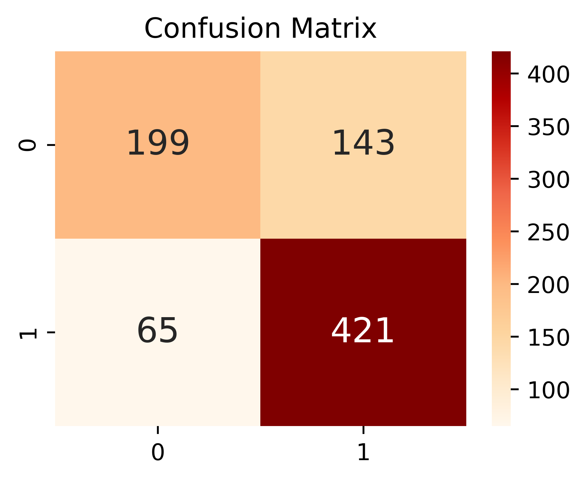

```python
from selenium import webdriver
from webdriver_manager.chrome import ChromeDriverManager
from bs4 import BeautifulSoup
import time, os
from datetime import datetime
import pandas as pd
from selenium.webdriver import ActionChains
from selenium.webdriver.chrome.options import Options
```


```python
URL = "https://play.google.com/store/apps/details?id=com.nexon.mdnf"
```


```python
# chrome_driver = '../chromedriver.exe' # 파일 확장자 이름 표기
chrome_driver = './chromedriver' # 파일 확장자 이름 미표기
```


패키지 import


```python
import requests
from selenium import webdriver
from selenium.webdriver.common.keys import Keys
from selenium.webdriver.support.ui import WebDriverWait
from selenium.webdriver.support import expected_conditions as EC
from selenium.webdriver.common.by import By
from selenium.webdriver.common.keys import Keys
from bs4 import BeautifulSoup
import time
from time import sleep
import random
from tqdm.auto import tqdm, trange
import pandas as pd
import datetime
```

무한 스크롤 함수


```python
def doScrollDown(whileSeconds):
        start = datetime.datetime.now()
        end = start + datetime.timedelta(seconds=whileSeconds)
        while True:
            driver.execute_script('window.scrollTo(0, document.body.scrollHeight);')
            time.sleep(1)
            if datetime.datetime.now() > end:
                break
```


```python
def scroll(modal):
    a = 0
    b = {500, 1000, 1500, 2000, 2500, 3000}
    try:        
        # 스크롤 높이 받아오기
        last_height = driver.execute_script("return arguments[0].scrollHeight", modal)
        while a < 3000:
            pause_time = random.uniform(0.5, 0.8)
            # 최하단까지 스크롤
            driver.execute_script("arguments[0].scrollTo(0, arguments[0].scrollHeight);", modal)
            # 페이지 로딩 대기
            time.sleep(pause_time)
            # 무한 스크롤 동작을 위해 살짝 위로 스크롤
            driver.execute_script("arguments[0].scrollTo(0, arguments[0].scrollHeight-50);", modal)
            time.sleep(pause_time)
            # 스크롤 높이 새롭게 받아오기
            new_height = driver.execute_script("return arguments[0].scrollHeight", modal)
            a = a + 1
            
            if a in b :
                time.sleep(20)
                print("쉬어가기")
            
            try:
                # '더보기' 버튼 있을 경우 클릭
                all_review_button = driver.find_element_by_xpath('/html/body/c-wiz[2]/div/div/div[1]/div[2]/div/div[1]/c-wiz[5]/section/div/div/div[5]/div/div/button/span').click()
            except:
                # 스크롤 완료 경우
                if new_height == last_height:
                    print("스크롤 완료")
                    break
                last_height = new_height
                
    except Exception as e:
        print("에러 발생: ", e)
```

## 데이터 크롤링


```python
# 크롬 드라이버 세팅
chrome_options = webdriver.ChromeOptions()
chrome_options.add_argument('--no-sandbox')
chrome_options.add_argument('--disable-dev-shm-usage')
driver = webdriver.Chrome(chrome_driver, chrome_options = chrome_options)

# 페이지 열기
driver.get(URL)
# 페이지 로딩 대기
wait = WebDriverWait(driver, 5)

# '리뷰 모두 보기' 버튼 렌더링 확인
all_review_button_xpath = '/html/body/c-wiz[2]/div/div/div[1]/div[2]/div/div[1]/c-wiz[4]/section/div/div/div[5]/div/div/button'
button_loading_wait = wait.until(EC.element_to_be_clickable((By.XPATH, all_review_button_xpath)))

# '리뷰 모두 보기' 버튼 클릭
driver.find_element_by_xpath(all_review_button_xpath).click()

# '리뷰 모두 보기' 페이지 렌더링 대기
all_review_page_xpath = '/html/body/div[4]/div[2]/div/div/div/div/div[2]'
page_loading_wait = wait.until(EC.element_to_be_clickable((By.XPATH, all_review_page_xpath)))

# 페이지 무한 스크롤 다운
modal = WebDriverWait(driver, 2).until(EC.element_to_be_clickable((By.XPATH, "//div[@class='fysCi']")))
scroll(modal)


#driver.execute_script('window.scrollTo(0, 99999999);')

# html parsing하기
html_source = driver.page_source
soup_source = BeautifulSoup(html_source, 'html.parser')

# html 데이터 저장
with open("./data_html.html", "w", encoding = 'utf-8') as file:
    file.write(str(soup_source))

# 리뷰 데이터 클래스 접근
review_source = soup_source.find_all(class_ = 'RHo1pe')
# 리뷰 데이터 저장용 배열
dataset = []
# 데이터 넘버링을 위한 변수
review_num = 0 
# 리뷰 1개씩 접근해 정보 추출
for review in tqdm(review_source):
    review_num+=1
    # 리뷰 등록일 데이터 추출
    date_full = review.find_all(class_ = 'bp9Aid')[0].text
    date_year = date_full[0:4] # 연도 데이터 추출
    # 해당 단어가 등장한 인덱스 추출
    year_index = date_full.find('년')
    month_index = date_full.find('월')
    day_index = date_full.find('일')
    
    date_month = str(int(date_full[year_index+1:month_index])) # 월(Month) 데이터 추출
    # 월 정보가 1자리의 경우 앞에 0 붙이기(e.g., 1월 -> 01월)
    if len(date_month) == 1:
        date_month = '0' + date_month
    
    date_day = str(int(date_full[month_index+1:day_index])) # 일(Day) 데이터 추출 
    # 일 정보가 1자리의 경우 앞에 0 붙여줌(e.g., 7일 -> 07일)
    if len(date_day) == 1:
        date_day = '0' + date_day
    
    # 리뷰 등록일 full version은 최종적으로 yyyymmdd 형태로 저장
    date_full = date_year + date_month + date_day
    user_name = review.find_all(class_ = 'X5PpBb')[0].text # 닉네임 데이터 추출
    rating = review.find_all(class_ = "iXRFPc")[0]['aria-label'][10] # 평점 데이터 추출
    content = review.find_all(class_ = 'h3YV2d')[0].text # 리뷰 데이터 추출

    data = {
        "id": review_num, 
        "date": date_full,
        "dateYear": date_year,
        "dateMonth": date_month,
        "dateDay": date_day,
        "rating": rating,
        "userName": user_name,
        "content": content
    }
    dataset.append(data)
    
# html parsing하기
html_source = driver.page_source
soup_source = BeautifulSoup(html_source, 'html.parser')
```

    <ipython-input-50-acfe4ea03e76>:5: DeprecationWarning: use options instead of chrome_options
      driver = webdriver.Chrome(chrome_driver, chrome_options = chrome_options)
    

    스크롤 완료
    


    HBox(children=(HTML(value=''), FloatProgress(value=0.0, max=2760.0), HTML(value='')))


    
    

## 스크롤 완료

HTML Parsing


```python
# html parsing하기
html_source = driver.page_source
soup_source = BeautifulSoup(html_source, 'html.parser')
```


    ---------------------------------------------------------------------------

    NameError                                 Traceback (most recent call last)

    <ipython-input-7-6e527a2d0cfd> in <module>
          1 # html parsing하기
    ----> 2 html_source = driver.page_source
          3 soup_source = BeautifulSoup(html_source, 'html.parser')
    

    NameError: name 'driver' is not defined


HTML 데이터 저장


```python
# html 데이터 저장
with open("./data_html.html", "w", encoding = 'utf-8') as file:
    file.write(str(soup_source))
```


    ---------------------------------------------------------------------------

    NameError                                 Traceback (most recent call last)

    <ipython-input-8-ea56fd1784e7> in <module>
          1 # html 데이터 저장
          2 with open("./data_html.html", "w", encoding = 'utf-8') as file:
    ----> 3     file.write(str(soup_source))
    

    NameError: name 'soup_source' is not defined


데이터프레임 변환


```python
# 리뷰 데이터 클래스 접근
review_source = soup_source.find_all(class_ = 'RHo1pe')
# 리뷰 데이터 저장용 배열
dataset = []
# 데이터 넘버링을 위한 변수
review_num = 0 
# 리뷰 1개씩 접근해 정보 추출
for review in tqdm(review_source):
    review_num+=1
    # 리뷰 등록일 데이터 추출
    date_full = review.find_all(class_ = 'bp9Aid')[0].text
    date_year = date_full[0:4] # 연도 데이터 추출
    # 해당 단어가 등장한 인덱스 추출
    year_index = date_full.find('년')
    month_index = date_full.find('월')
    day_index = date_full.find('일')
    
    date_month = str(int(date_full[year_index+1:month_index])) # 월(Month) 데이터 추출
    # 월 정보가 1자리의 경우 앞에 0 붙이기(e.g., 1월 -> 01월)
    if len(date_month) == 1:
        date_month = '0' + date_month
    
    date_day = str(int(date_full[month_index+1:day_index])) # 일(Day) 데이터 추출 
    # 일 정보가 1자리의 경우 앞에 0 붙여줌(e.g., 7일 -> 07일)
    if len(date_day) == 1:
        date_day = '0' + date_day
    
    # 리뷰 등록일 full version은 최종적으로 yyyymmdd 형태로 저장
    date_full = date_year + date_month + date_day
    user_name = review.find_all(class_ = 'X5PpBb')[0].text # 닉네임 데이터 추출
    rating = review.find_all(class_ = "iXRFPc")[0]['aria-label'][10] # 평점 데이터 추출
    content = review.find_all(class_ = 'h3YV2d')[0].text # 리뷰 데이터 추출

    data = {
        "id": review_num, 
        "date": date_full,
        "dateYear": date_year,
        "dateMonth": date_month,
        "dateDay": date_day,
        "rating": rating,
        "userName": user_name,
        "content": content
    }
    dataset.append(data)
```


    HBox(children=(HTML(value=''), FloatProgress(value=0.0, max=2760.0), HTML(value='')))


    
    

데이터프레임 저장


```python
df = pd.DataFrame(dataset)
print(df)
df.to_csv('./review_dataset.csv', encoding = 'utf-8-sig') # csv 파일로 저장
```


    ---------------------------------------------------------------------------

    NameError                                 Traceback (most recent call last)

    <ipython-input-9-f9db3f2f680d> in <module>
    ----> 1 df = pd.DataFrame(dataset)
          2 print(df)
          3 df.to_csv('./review_dataset.csv', encoding = 'utf-8-sig') # csv 파일로 저장
    

    NameError: name 'dataset' is not defined


리뷰 데이터 불러오기


```python
# 저장한 리뷰 정보 불러오기
df = pd.read_csv('./review_dataset.csv', encoding = 'utf-8-sig')
df = df.drop(['Unnamed: 0'], axis = 1) # 불필요한 칼럼 삭제
df
```


<div>
<style scoped>
    .dataframe tbody tr th:only-of-type {
        vertical-align: middle;
    }

    .dataframe tbody tr th {
        vertical-align: top;
    }

    .dataframe thead th {
        text-align: right;
    }
</style>
<table border="1" class="dataframe">
  <thead>
    <tr style="text-align: right;">
      <th></th>
      <th>id</th>
      <th>date</th>
      <th>dateYear</th>
      <th>dateMonth</th>
      <th>dateDay</th>
      <th>rating</th>
      <th>userName</th>
      <th>content</th>
    </tr>
  </thead>
  <tbody>
    <tr>
      <th>0</th>
      <td>1</td>
      <td>20220407</td>
      <td>2022</td>
      <td>4</td>
      <td>7</td>
      <td>5</td>
      <td>EUF Minimizer</td>
      <td>'던파:혼' 때와 비교하면 그야말로 하늘과 땅 차이...! 콤보 등을 비롯해 여러가...</td>
    </tr>
    <tr>
      <th>1</th>
      <td>2</td>
      <td>20220324</td>
      <td>2022</td>
      <td>3</td>
      <td>24</td>
      <td>5</td>
      <td>족제비샤프도둑</td>
      <td>던파 초창기부터 PC던파를 즐기다가 다른 차원으로 가는 곳부터 난이도가 너무 어려워...</td>
    </tr>
    <tr>
      <th>2</th>
      <td>3</td>
      <td>20220327</td>
      <td>2022</td>
      <td>3</td>
      <td>27</td>
      <td>5</td>
      <td>리얼크크</td>
      <td>너무 재밌게 하고 있긴한데.. 환경설정에서 설정 바꾸고 게임 껐다 키면 설정 이전꺼...</td>
    </tr>
    <tr>
      <th>3</th>
      <td>4</td>
      <td>20220407</td>
      <td>2022</td>
      <td>4</td>
      <td>7</td>
      <td>3</td>
      <td>김준연</td>
      <td>각 던전마다 있는 S랭크 조건 중에 "3분 30초 안에 클리어" 해야되서 게임을 오...</td>
    </tr>
    <tr>
      <th>4</th>
      <td>5</td>
      <td>20220411</td>
      <td>2022</td>
      <td>4</td>
      <td>11</td>
      <td>3</td>
      <td>ᄏᄏᄏᄏᄏ</td>
      <td>게임은 재미있으나 SSS랭크를 따기위한 조건 중에 3분30초 조건이, 40레벨이 넘...</td>
    </tr>
    <tr>
      <th>...</th>
      <td>...</td>
      <td>...</td>
      <td>...</td>
      <td>...</td>
      <td>...</td>
      <td>...</td>
      <td>...</td>
      <td>...</td>
    </tr>
    <tr>
      <th>2755</th>
      <td>2756</td>
      <td>20220419</td>
      <td>2022</td>
      <td>4</td>
      <td>19</td>
      <td>4</td>
      <td>허호</td>
      <td>갤럭시s22 울트라 렉 문제 해결해주세요. 게임이름은 던파모바일인데 컴퓨터로밖에 못...</td>
    </tr>
    <tr>
      <th>2756</th>
      <td>2757</td>
      <td>20220324</td>
      <td>2022</td>
      <td>3</td>
      <td>24</td>
      <td>5</td>
      <td>방울이tv팬</td>
      <td>이날만 기다렸다.. 역시 던파는 너무 재미있어요</td>
    </tr>
    <tr>
      <th>2757</th>
      <td>2758</td>
      <td>20220323</td>
      <td>2022</td>
      <td>3</td>
      <td>23</td>
      <td>5</td>
      <td>조록빛</td>
      <td>잘만듬 과금도 필수는 아님 모바일 조작감이 좀 묘하지만 잼남</td>
    </tr>
    <tr>
      <th>2758</th>
      <td>2759</td>
      <td>20220331</td>
      <td>2022</td>
      <td>3</td>
      <td>31</td>
      <td>1</td>
      <td>양꼬</td>
      <td>점검연장개짱나네 처음부터 길게잡고 빨리끝내면 욕안먹고 얼마나 좋냐</td>
    </tr>
    <tr>
      <th>2759</th>
      <td>2760</td>
      <td>20220325</td>
      <td>2022</td>
      <td>3</td>
      <td>25</td>
      <td>4</td>
      <td>tina Cas</td>
      <td>다 좋은데 직업추가좀 해줬으면 하고싶은직없이 없어서 안하게되네요</td>
    </tr>
  </tbody>
</table>
<p>2760 rows × 8 columns</p>
</div>


### 리뷰 데이터 감성 분석


```python
df.info()
```

    <class 'pandas.core.frame.DataFrame'>
    RangeIndex: 2760 entries, 0 to 2759
    Data columns (total 8 columns):
     #   Column     Non-Null Count  Dtype 
    ---  ------     --------------  ----- 
     0   id         2760 non-null   int64 
     1   date       2760 non-null   int64 
     2   dateYear   2760 non-null   int64 
     3   dateMonth  2760 non-null   int64 
     4   dateDay    2760 non-null   int64 
     5   rating     2760 non-null   int64 
     6   userName   2760 non-null   object
     7   content    2760 non-null   object
    dtypes: int64(6), object(2)
    memory usage: 172.6+ KB
    

1.결측치 및 Text Mining에 불필요한 단어 제거


```python
%matplotlib inline

import pandas as pd
import numpy as np
import matplotlib.pyplot as plt
import seaborn as sns
from konlpy.tag import Okt
from collections import Counter
from nltk.corpus import stopwords
from nltk.tokenize import word_tokenize 
from konlpy.tag import Okt


import warnings
warnings.filterwarnings('ignore')
```


```python
df.head(10)
```


<div>
<style scoped>
    .dataframe tbody tr th:only-of-type {
        vertical-align: middle;
    }

    .dataframe tbody tr th {
        vertical-align: top;
    }

    .dataframe thead th {
        text-align: right;
    }
</style>
<table border="1" class="dataframe">
  <thead>
    <tr style="text-align: right;">
      <th></th>
      <th>id</th>
      <th>date</th>
      <th>dateYear</th>
      <th>dateMonth</th>
      <th>dateDay</th>
      <th>rating</th>
      <th>userName</th>
      <th>content</th>
    </tr>
  </thead>
  <tbody>
    <tr>
      <th>0</th>
      <td>1</td>
      <td>20220407</td>
      <td>2022</td>
      <td>4</td>
      <td>7</td>
      <td>5</td>
      <td>EUF Minimizer</td>
      <td>'던파:혼' 때와 비교하면 그야말로 하늘과 땅 차이...! 콤보 등을 비롯해 여러가...</td>
    </tr>
    <tr>
      <th>1</th>
      <td>2</td>
      <td>20220324</td>
      <td>2022</td>
      <td>3</td>
      <td>24</td>
      <td>5</td>
      <td>족제비샤프도둑</td>
      <td>던파 초창기부터 PC던파를 즐기다가 다른 차원으로 가는 곳부터 난이도가 너무 어려워...</td>
    </tr>
    <tr>
      <th>2</th>
      <td>3</td>
      <td>20220327</td>
      <td>2022</td>
      <td>3</td>
      <td>27</td>
      <td>5</td>
      <td>리얼크크</td>
      <td>너무 재밌게 하고 있긴한데.. 환경설정에서 설정 바꾸고 게임 껐다 키면 설정 이전꺼...</td>
    </tr>
    <tr>
      <th>3</th>
      <td>4</td>
      <td>20220407</td>
      <td>2022</td>
      <td>4</td>
      <td>7</td>
      <td>3</td>
      <td>김준연</td>
      <td>각 던전마다 있는 S랭크 조건 중에 "3분 30초 안에 클리어" 해야되서 게임을 오...</td>
    </tr>
    <tr>
      <th>4</th>
      <td>5</td>
      <td>20220411</td>
      <td>2022</td>
      <td>4</td>
      <td>11</td>
      <td>3</td>
      <td>ᄏᄏᄏᄏᄏ</td>
      <td>게임은 재미있으나 SSS랭크를 따기위한 조건 중에 3분30초 조건이, 40레벨이 넘...</td>
    </tr>
    <tr>
      <th>5</th>
      <td>6</td>
      <td>20220408</td>
      <td>2022</td>
      <td>4</td>
      <td>8</td>
      <td>5</td>
      <td>김한호</td>
      <td>던파 모바일로 나와서 더 편하게 플레이 할 수 있었다. 길찾기나 퀘스트가 터치 한번...</td>
    </tr>
    <tr>
      <th>6</th>
      <td>7</td>
      <td>20220403</td>
      <td>2022</td>
      <td>4</td>
      <td>3</td>
      <td>3</td>
      <td>이동률</td>
      <td>전반적으로 과금요소도 적고 pc던파랑 비교해도 큰차이가 없을정도라서 던파특유의 도트...</td>
    </tr>
    <tr>
      <th>7</th>
      <td>8</td>
      <td>20220424</td>
      <td>2022</td>
      <td>4</td>
      <td>24</td>
      <td>3</td>
      <td>고라니</td>
      <td>게임을 잘 즐기던 한 유저입니다. 갤럭시 제트 플립 사용중입니다. 게임 자체는 재밌...</td>
    </tr>
    <tr>
      <th>8</th>
      <td>9</td>
      <td>20220406</td>
      <td>2022</td>
      <td>4</td>
      <td>6</td>
      <td>3</td>
      <td>토스트</td>
      <td>모바일 기기로 플레이시 단점이라면 스킬버튼칸이 너무 적다는 점. 드래그식으로 쓰는 ...</td>
    </tr>
    <tr>
      <th>9</th>
      <td>10</td>
      <td>20220326</td>
      <td>2022</td>
      <td>3</td>
      <td>26</td>
      <td>5</td>
      <td>EJ K</td>
      <td>일단... ㅇㅌㅂ 광고가 망한 게임인 건 알겠습니다ㅋㅋㅋㅋ 광고 보고 안 할까 하다...</td>
    </tr>
  </tbody>
</table>
</div>


```python
df.isnull().sum()
```


    id           0
    date         0
    dateYear     0
    dateMonth    0
    dateDay      0
    rating       0
    userName     0
    content      0
    dtype: int64


정규 표현식을 활요한 불 필요 단어 제거


```python
import re

def apply_regular_expression(content):
    hangul = re.compile('[^ ㄱ-ㅣ 가-힣]')
    result = hangul.sub('', content)
    return result
```


```python
apply_regular_expression(df['content'][9])
```


    '일단 ㅇㅌㅂ 광고가 망한 게임인 건 알겠습니다ㅋㅋㅋㅋ 광고 보고 안 할까 하다가 깔았는데 재밌네요 리소스 다운할동안 튜토리얼 할 수 있는 점도 좋구요 애니메이션은 랑 라이브 모두 훌륭하고 재밌었는데 원래 던파 유저가 아니어서 내용은 전혀 모르겠는 점이 아쉬운 부분입니다 스킬 이펙트나 움직임도 좋았어요 근데 회피는 필요성을 못 느끼겠네요 그냥 이동하는 게 더 빨라요'


###  명사 형태소 추출


```python
okt = Okt()
nouns = okt.nouns(apply_regular_expression(df['content'][9]))
nouns
```


    ['일단',
     '광고',
     '게임',
     '건',
     '광고',
     '보고',
     '안',
     '리소스',
     '다운',
     '동안',
     '튜토리얼',
     '수',
     '점도',
     '애니메이션',
     '라이브',
     '모두',
     '원래',
     '던파',
     '유저',
     '내용',
     '전혀',
     '점',
     '부분',
     '스킬',
     '이펙트',
     '움직임',
     '회피',
     '필요성',
     '못',
     '그냥',
     '이동',
     '게',
     '더']


```python
corpus = "".join(df['content'].tolist())
corpus
```


    '\'던파:혼\' 때와 비교하면 그야말로 하늘과 땅 차이...! 콤보 등을 비롯해 여러가지로 PC 버전 재현율이 생각 이상으로 높아서 놀랐습니다. 지금은 사라진 요소들을 이용해서 전개를 조금 비튼 스토리도 좋았습니다. 현재로서 조금 아쉬운 건 장비도감에 넣을 수 있는 아이템을 얻었을 때 3종 수집 메뉴에도 빨간 점(?)이 나왔으면 좋겠습니다. 도감 메뉴에 들어갈 때 가끔씩 튕기는 것도 개선됐으면 싶고요... 굳이 또 덧붙이자면... 고대던전 아이템 제작 때에만 쓰이고 더는 안 쓰이는 재료 아이템의 입지도 키워졌으면 하네요;; (가령 고대 왕국의 금화, 원한 서린 사념)던파 초창기부터 PC던파를 즐기다가 다른 차원으로 가는 곳부터 난이도가 너무 어려워져서 접었던 유저입니다. 장비 맞추기와 돈 벌기 및 현질하지 않으면 살아남을 수 없을정도가 되어 추억으로 남기고 접었었는데 모바일로 다시보게 되어 더할나위 없이 반가웠습니다. 다만 걱정되는 게 모바일도 PC처럼 너무 어려워지지 않았으면..이야기에 집중할 수 있게 난이도가 너무 어렵지 않았으면 합니다..파퀘 제일 싫어요..같이 겜을 하면 욕먹어서요..(제가 게임보스룰 복잡하면 못합니다ㅠ) 결론: PC던파와 제일 비슷한 모바일 던파가 나와 매우매우 행복하고 이 날만을 기다려왔지만 너무 어렵지 않게 이야기에 집중할 수 있으면 좋겠습니다. 던파모바일 출시해주셔서 감사합니다:)너무 재밌게 하고 있긴한데.. 환경설정에서 설정 바꾸고 게임 껐다 키면 설정 이전꺼로 되어 있어서 게임 킬때마다 설정 바꿔줘야 하는데 좀 많이 불편하네요. 그리고 템창이랑 금고에서 아이템 정렬이 있으면 좋겠어요. 또한 계속 화면 상단에 다른 유저 강화 성공한 문구가 뜨는데 이게 템 옵션 볼때 라든가 게임중에 화면을 가려서 너무 불편한데.. 다른 위치로 옮기거나 끌 수 있도록 해주시면 진짜 갓겜 입니다.각 던전마다 있는 S랭크 조건 중에 "3분 30초 안에 클리어" 해야되서 게임을 오로지 재미있게 못하겠습니다. 물론 빠른 클리어도 실력이라고 할수 있겠지만 레벨 오름에 따라 던전 방 갯수도 많아지고 클리어 하지 못한 던전은 다시 해야 되서 피로도 소모에 국한되며, 결국에는 던전 앤 파이터가 아니라 "SSS랭크 앤 파이터" 가 되는 느낌을 지울 수가 없습니다. 시간을 늘리거나 다른 S랭크 조건으로 변경 해주시면 감사하겠습니다.게임은 재미있으나 SSS랭크를 따기위한 조건 중에 3분30초 조건이, 40레벨이 넘어가면서 매우 빡세진다. 그 때문에 챔피언몬스터를 더 잡아보고 싶어도, 맵 하나도 제대로 즐길 수가 없으며 무조건 보스방으로 직행해야 하는 것이 너무 아쉽다. PC판 이식을 잘 했지만서도, 이 부분때문에 별을 5개 줄 수가 없다. 맵에 시간제한을 왜 걸어둔건지.. 그리고 강화 알림을 끌 수가 없다는 것도 매우 짜증이 나는데, 왜 강제로 남의 강화 알림을 봐야하는지. 내것도 아닌데 화면 가리면서 끌 수도 없게 해놨다. 왜 이래놨을까.던파 모바일로 나와서 더 편하게 플레이 할 수 있었다. 길찾기나 퀘스트가 터치 한번으로 진행 되어 편하다. 모바일 만으로 플레이 했는데 외부기기 사용하면 더 콤보를 넣고 피격이 줄었을 것 같다. 인게임 동영상은 퀄이 높다. 핵앤슬러시 장르라서 손이 타는건 어쩔 수 없는것 같다 피로도 소모 다하는 시간만큼 플레이 할것 같다전반적으로 과금요소도 적고 pc던파랑 비교해도 큰차이가 없을정도라서 던파특유의 도트감성을 느끼며 재밋게 플레이할수가 있어서 좋았으나, 모바일겜인데도 불구하고 써야할 스킬이 너무많고 휴대폰크기는 너무나 작기에 스킬눌르는 미스가 매우자주 발생합니다. 차라리 패드연동을 하거나 갤럭시패드, 아이패드같이 넓은걸로 하는게 훨씬 효율적입니다. 앞으로 각성스킬이 더 추가되고하면 스킬칸이 더 부족해질텐데 콤보스킬 하나로 가능할지... 나중에 레이드같이 실수한번하면 무조건죽거나 보스 피 못깍는 컨텐츠가 나오게되면 컴터,패드사용자 우선 이런식으로 파티원 모집하지않을까 걱정되네요게임을 잘 즐기던 한 유저입니다. 갤럭시 제트 플립 사용중입니다. 게임 자체는 재밌고 좋은데 왜 자꾸 네트워크 타령을 하면서 로그인 사용자를 찾을수없다며 게임 도중에 튕겨버리는건가요? 재밌게 하고있는데 4~5번 튕겨버리기 때문에 정상적으로 게임을 즐기기가 어렵습니다. 던전에 들어가서 게임하던 도중에 튕겨버리면 피로도마저 사라져버리고 아이템이나 경험치도 쌓을수 없게 됩니다. 보상도 받을수없고 재미마저 즐기기 어렵게 되니 게임에 대한 정도 조금씩 사라지려고 합니다. 고쳐주시면 감사하겠습니다.모바일 기기로 플레이시 단점이라면 스킬버튼칸이 너무 적다는 점. 드래그식으로 쓰는 이상한 방법말고 그냥 3~4개 버튼을 그대로 추가 해줬으면 좋겠음. 게임을 하다보면 스킬을 몇가지 포기해야하는 경우가 생기는데 십자키드래그시스템은 정말 구림. 설정을 통해 십자드래그를 선호하는 사람은 그것을 쓰게하고 추가로 버튼 따로 있는게 좋을듯 함. 아직까지는 매우 재미나게 플레이 중임.일단... ㅇㅌㅂ 광고가 망한 게임인 건 알겠습니다ㅋㅋㅋㅋ 광고 보고 안 할까 하다가 깔았는데 재밌네요. 리소스 다운할동안 튜토리얼 할 수 있는 점도 좋구요. 애니메이션은 2D랑 라이브? 모두 훌륭하고 재밌었는데 원래 던파 유저가 아니어서 내용은 전혀 모르겠는 점이 아쉬운 부분입니다. 스킬 이펙트나 움직임도 좋았어요. 근데 회피는 필요성을 못 느끼겠네요. 그냥 이동하는 게 더 빨라요.과거에 온라인 던파를 즐기던 학생입니다. 그래서 모바일 던파가 나온뒤로 행복함으로 인하여 다운 받고 게임을 하는데 게임 데이터가 존재하지 않는다며 계속 실행이 불가능 합니다. 그래서 게임을 삭제하고 다시 다운 했는데도 똑같이 최신데이터가 아니라며 게임이 강제종료 됩니다. 해결책좀 부탁드립니다.던파 처음 접해본 유저로써 게임은 재밌다. 하지만 피로도 시스템이 좀 아쉽고 아직 개선해야할 부분들이 좀 있는듯 하다. 그리고 유저들 강화성공 메시지창 없애거나 마을 화면에 있을때만 뜨게하면 안되나요? 현질할때 또는 인벤 확인할때 패키지랑 장비 등 이름이 안보여서 불편합니다. 스트리머들 숙제방송에서 가챠할때마다 한번씩은 다 불편하다고 언급할 정도인데;;옛날 던파 느낌도 나고 예전 폴더폰시절에 했던 던파느낌도 나서 좋아요. 그리고 전직하고나서 컨셉에 맞게 대사 바뀌는 것도 좋구요. 다만 아쉬운 점은 폰트때문에 중국산게임같은 느낌이 나서 폰트 좀 바뀌었으면 좋겠고 조작감이 좀 그렇네요 자꾸 혼자 이상한 방향으로 가지는게 있고 발열도 좀 있는게 아쉽습니다.리뷰가 왜 삭제됐죠? 개선건의사항도 별점 5개 아니면 삭제하는건가요;;; 다시 남깁니다. 강화성공 메시지 화면 상단에 뜨는데 그 메시지가 계속 뜨니까 메시지에 가려지는 부분 확인이 어렵습니다. 위치를 조정하던지 메시지 자체를 끌 수 있게 해주세요. 그리고 갤럭시폴드에서 화면 비율때문에 다른 휴대폰에 비해 화면 좌우가 잘려서 시야가 좁아집니다. 던전이나 결투장에서 사실상 패널티로 작용하는 부분인 만큼 화면비율 조정 기능을 넣어주셨으면 좋겠습니다.모바일로 첫 입문했는데 너무 재밌고 하루종일 하게 되네요!!몆가지 개선했으면 하는 점이 있어 글 올립니다. 1. 스킬슬롯 만들어주세요 - 본캐로 프리스트를 키우고있는데 서폿용, 던전용, 결투용 그때그때 찍는게 너무 힘들어요 초보자라 인터넷에서 스킬트리 찾아서 하고있는데 조금 벅찹니다...기본 스킬슬롯 2개정도 해주시고 그 후 테라나 과금으로 늘릴 수 있으면 좋을 것 같아요! 2. 스킬수련장 다음으로 바로 넘어갈 수 있게 해주에요 - 피로도가 한정되있어 부캐를 육성 할 일이 잦은데 그때마다 나가고 들어가고를 반복하다보니 지루한거 같아요.. 잘 검토 해주셨으면 좋겠습니다 던파 모바일 화이팅!!!재밌다. 지금 피씨던파도 재밌긴 하지만 고일대로 고이다 보니 추억과 괴리된 느낌이 많지만 이 모바일 던파는 그때 추억을 충분히 충족하는 것 같고, 던파 자체를 꽤 해본 유저로서, 대충 만든 게임이 아닌것이 느껴진다. 게임성은 좋으니 다만 운영에 힘을 써서 현 모바일 알피지들의 한심한 게임성, 한심한 수익구조 수준을 개선해주는 이정표가 되길 바란다.다른건 다 좋은데 결투장 폰만쓰는 유저는 키보드유저한테 어떻게하라고 연동을 해놓으신건가요...움직임 자체가 다르고 하물며 핸드폰 터치도 손가락 잘못닿이면 그냥 콤보고 뭐고 아무것도 못하는데 결투장만큼은 그냥 전부 핸드폰으로만 할수있게 하는게 좋지않을까요.. 그래도 던파(모바일) 인데 그리고 상태편 핸드폰이 통신상태가 안좋으면 같이 렉이 걸려서 키패드도 반응 1초 늦게되는 현상들좀 개선좀 해주세요원작에 비해 더 낫거나 재밌는 부분도 있구요. 기대한만큼 괜찮게 잘 만들어졌습니다. 다만, 모바일로 결투장을 플레이하면 화면이 이상하게 돌아간다던가 끊기는 둥 부정적 경험요소가 꽤나 있는 편이네요. 와이파이나 데이터 끊김 문제때문인진 모르겠고 던전은 안그러는데 유독 결투장 렉이 심해요.키보드 사용의대하여 블루투스 키보드사용 시 단전에서 방향키만 인식되고 기능 키인 q~v까지의 모든 키가 인식이 안됨 내가 사용하는 기기의 호환성 문제일 수 있으나 기기의 따라 사용이 불가하면 이 기능을 쓰는 의미가 없어질 거 같음 마을내부에서도 텝키를 사용하고 원하는 버튼으로 이동한 뒤 엔터를 눌러야 하나 엔터키가 인식이 안 되므로 사용이 불가함. 이에 대한 개선이 필요하다고 느낌확실히 손쉬운 조작이랑 타격감이 모바일에서 있다는게 너무 만족스럽고...무엇보다도 양산형게임에비해 자동이아니라 수동 조작겜인게 신의한수인것같네요 이만한게임없어서 계속 할것같아요 한동안 겜안했는데 출시하고 옛날생각너무많이나네요 ㅋㅋ일러스트도 너무좋고 성우도 실감나고.. 이쯤되면 애니로도 나가봤으면.. 그리고 주말엔 피로도 핫타임많이많이열어주시면 감사합니다~~~~~왜 좀 더 빨리나오지 않았을까. 이 게임을 더 어렸을때 했더라면 훨씬 재밌었을거라는 생각에 아쉬움이든다. 10년전 중학생일때 던전앤파이터 귀검사편을 그 작은 피쳐폰화면으로도 재밌다고 눈알 빠지게 쳐다보며 했던 그시절이 떠오른다. 다른 직업들도 나오면 얼마나 재밌을까 고대했었는데 이제서야 그 꿈을 이룬것 같다. PC던전앤파이터가 너무 복잡하고 어려워서 따라가지도 못하는 나에게 이 게임은 단비같은 존재다.생각보다 잘 만들어져서 게임을 하려고 하는데 문제가 있습니다 와이파이가 잡힐때만 게임접속이 됩니다.. 갤럭시A90 5G 데이터 사용자입니다만 평소에는 LTE+로 데이터가 사용이 되는데 네트워크가 불안정하다는 메세지와함께 접속에 에러가 있습니다 와이파이가 없는 야외에서는 던파를 할 수가 없는데 빨리 데이터접속 에러를 고쳐줬으면 합니다.. 저 말고도 데이터접속이 안되시는 분이 꽤나 있을 겁니다 밖에서도 던파를 즐길 수 있게 데이터접속 오류를 하루빨리 해결해 주세요 안고쳐주신다면 던파를 지우겠습니다.. 원래 애정있게 해온 온라인게임이라 과금을 준비하던 게임이였으나 데이터접속에러 때문에 과금을 안하고 있습니다 빨리좀 해결해주세요 심각합니다집에서는 pc 버전을, 밖에서는 모바일버전을 바꾸어가며 플레이하는 유저입니다. 조작에 있어서 PC의 키 세팅과 모바일의 세팅 위치가 많이 다른데, 기기를 바꿀때마다 키세팅을 다시하는게 너무 불편하고 힘듭니다. 모바일 프리셋, PC 프리셋으로 나누어 세팅되면 좋겠습니다.던파 모바일 게임 잘 이용하고 있는 유저입니다. 최근부터 던파 월드보스나 영혼쟁탈전 결투장 등 시스템을 이용하려고 하면 로딩화면에서 게임이 진행되지 않는 경우가 대부분이여서 컨텐츠를 대부분 즐기지 못하고 있는 경우가 많습니다. 위 사항 확인해주시고 긍정적인 검토 부탁드립니다.갤럭시 S22 울트라 사용자입니다. 게임진행시 마을, 던전 가릴거없이 프레임드랍이 심합니다. 해결법을 찾았는데 인게임 그래픽 설정에서 프레임 부스터를 "끄기" 설정하면 렉이 사라지는데, 설정해놓고 던전을한번 들어갔다 나오면 다시 켜짐으로 원복되어있습니다. 버그인거같으니 어서 고쳐주세요매크로 잡고 있나요? SD모드 10판하면 9판을 매크로 만나는데 안잡나요? 우리팀 2명이 매크로 인적도 상대 3명 다 매크로 인적도 있어요. 그리고 파티던전시 스킬쓸때 마다 바라보는 방향의 반대편으로 스킬 나가는 버그 대체 왜 안고치는거에요? 파티플 할때 마다 파티원들도 그렇고 스킬 다른데다 난사해서 스킬날리고 클리어타임 늘어나고 게임환경개선 안하시나요?? 잡버그에 파티하면 렉걸리고 입장권쓰고 들어간던전 팅기거나 무한로딩 그런거는 그나마, 참겠는데게임 이름에 모바일을 넣은만큼 폰에서의 편의성은 있으나 pc로 플레이하는게 유리함. 모바일 편의성으로는 콤보배치가 있지만 각 스킬 쿨타임 확인이 불가하고 스킬을 필요한 순간에 바로 못씀. 방향전환의 반응성이 패드나 폰 조작보다 pc가 유리하고 스킬도 pc에서 더 많이 배치할 수 있어서 결장의 승패에 많은 영향을 줌. pc유저와 모바일 유저간 크로스 매칭 기능 켜거나 끌 수 있는 옵션의 필요성이 느껴짐. 직업간 밸렄스만 문제인게 아니라 기종간 유불리함도 심각한듯 느껴짐옛날 추억팔이하기에는 충분했어요 추억회상하면서 즐겁게 할 수 있었는데, pc에서도 모바일에서도 uiux는 좀.... 아니 많이 별로라고 생각되네요 진짜 불편해요 예를 들어 엠블럼을 빼려고 할때, 인벤토리에서 엠블럼을 눌러 장착으로 들어가야되는데, 엠블럼이 없으면 강화창을 눌러서 엠블럼 탭으로 가야되요. 즉 편의성은 최악입니다 한번에 눈에 안들어와요 재련 홍보 하는 문구도 문제에요 그 @@@가 재련에 성공했다고 뜨는데, 이 글자가 크고, 백배경도 엄청 진해서 각종 ui들을 전부 가리는데, 상점에서 무료 부활코인이 어딨는지 한참 찾았네요 그 재련홍보하는 것을 안띄우거나 줄이거나, 투명도를 조절하거나 하는 방법도 필요하다 보네요 결투장도 자유 결투중 나가기 위해서는 나가기 버튼이 눈에 띄게 있거나 그에대한 가이드가 있어야하는데, 그런것 없이 게임설정에 숨어있어서 한참찾아야됐네요 편의성은 진짜 최악이지만, 옛날 추억자체를 망가트리지 않았다는 점은 정말 다행이고 좋았네요재밌었지만 결국 한계가 있네요... 일단 파티플레이 너무 버벅입니다. 하지만 일부 주요 던전은 파티플레이가 강제 됩니다(레이드, 월드보스) 그리고 장비를 왜 케릭 끼리 공유 못하게 했는지 모르겠어요... 밑도 끝도 없이 같은 던전을 뺑뺑이 해야합니다. 그것도 매일... 피로도100을 다 써줘야해요. 피로도도 상당하고, 현타도 오집니다. 그래도 진 던전 나와서 템 파밍이 되게끔 해줬지만 뺑뺑이와 매일 같은 노가다는 똑같네요.. 상당히 재밌었지만 결국 신선했던 경험이 삭아버리네요...아쉽습니다. 휴식 게이지 도입과 잉여 케릭들을 더 잘쓰게 해주는 방안 좀 생각해주세요... 이거 폰 게임 이잖아요? 왜 피시겜이랑 시스템을 같이 한 건지 모르겠어요...요구 과금 수준은 상대적으로 낮지만, 기약없는 파밍요소 & 지지부진한 밸런스 업데이트 & 불편한 UX UI 방치 등등은 매우 불편합니다. 그래도 개선의 의지는 비추고 있어서 기대하면서 플레이중입니다.게임은 던파로써 잘 똑같이 만든부분은 좋은것같음. 하지만 모바일인 만큼 핑부분에서 핸드폰마다 차이가 있는데 던전을 하던 결투장을 하던 안정화가 될 여유시간을 가지고 게임이 시작되었으면 좋겠음. 인게임에서 렉이 걸려서 움직임이 뒤늦게 보인다거나 터치가 안되는경우가 너무 많음.잘되다가 왜 이러는지 모르겠는데 왜 접속을 하면 새로운 버전 나왔다고 업데이트하라고 하면서 업데이트 누르면 항목에 업데이트라고 뜨질 않고 플레이로 나옵니다. 플레이를 누르면 업데이트 확인 창에서 더 진행이 안되구요. 몇번을 해보고 다른 방법 으로 다 해봐도 도무지 진행이 되질 않습니다. 인간적으로 이런 자잘한 업데이트 버그나 접속장애는 이유없이 유저들을 빡치게 만들 뿐 아니라 아예 게임 자체에 대한 접속을 차단시키기 때문에 중장기적으로 운영을 할땐 제일 먼저 고쳐져야 하는게 아닌가 싶습니다.던전앤파이터를 트위치나 유튜브로 많이봤는데 문제는 중국인 핵유저가 많다는것이고 좋은것은 자신이 게임 방송인이 되서 재밌게 할수있는 것이고요. 온라인 게임이 모바일로 이식되서 출시되는 시대가 왔으니까 힘든일보다 이런 게임이 더 좋지요. 또한 던파는 최고의 게임입니다.오늘 접속하려니까 새로운 최신 버전 업데이트가 있다고 떠서 업데이트 버튼 누르면 플레이스토어 화면으로 넘어옵니다. 근데 플레이스토어에서는 업데이트 없이 플레이 버튼만 있어서 플레이 버튼 누르면 게임 화면으로 또 바뀌어서 업데이트 정보를 확인 중이라는 문구와 함께 계속 로딩중입니다. 삭제하고 다시 깔아도 그렇고. 어떻게 해야 하나요에픽 드랍률 던파가 정공겜이라는 소리를 듣는 이유 중 하나가 에픽 먹을라고 지옥파티 돌다 정신병 걸릴 것 같다고 하는 데에서 기인한다고 보는데 바뀐게 크게 없네요. 에픽 드랍률을 올리던가, 에픽 1:1 교환 해주던가, 조각 개수를 낮추던가. 최소한 내가 가지고 있는 아이템들이 필요있게 시스템을 개선하던가. 에픽 하나 먹자고 장기간 동안 폰잡고 겜하는 사람이 많을까요? 기존 유저들은 수틀리면 피시던파로 가면 되고 나머지 신규 유저들은 찍먹하는 느낌으로 하다가 삭제하면 그만입니다. 4년전, 던파 탈주한 입장에서 크게 아쉬웠습니다.너무 재미있고 좋습니다. 다만 오류는 아직 한번 있었는데 그부분은 개선 될것같구요. 졸잼입니다. 걍 좋습니다. 네오플 최고. 결장은 좀 렉이있긴하고 , 일던은 파티도 문제없습니다. 자동사냥이었음 안했을텐데 컨트롤이라 좋아요. 스킬 컨트로하는방법도 감탄했구요. 골드버는건 좀 힘든게 있는데 적절한것같아요.피로도가 작아요. 피로도가 다 떨어지면 반나절 넘게 노땡이까야돼요. 피로도를 얻기위해서는 현질을 해야 얻는 상황입니다. 상점에서 구매할수 있으나 1회만 구입 가능해서 채팅창말처럼 3회는 되야 그나마 게임도 하고 좀 할텐데. 피로도 없다는거 인지하면 할맘이 팍 식어요. 좀하다가 지우지않을까 싶어요.저는 오픈 좀 지나고 시작해서인지 레벨은 낮을지언정 안정적으로 플레이중입니다. 어릴 때 청소년이용버전으로 했던 그 게임 그대로 재현한 것 같아 만족스럽습니다. 배경음악도 효과음도 추억대로 입니다. 특히 자동사냥 없어서 좋습니다. 괜히 이상한 도전하지 않고 깔끔하게 모바일화한 것 같아 환영입니다.재미있게 잘 하고 있습니다. 불편한 점 하나 건의하고자합니다. 버튼크기 조절좀 되게 해주세요. 결투장에서 하다보면 제가 스킬을 누르려다보면 스킬 옆 공백을 누르는 경우 가 많아서 그때마다 항상 역정을 냅니다.. 특히 드래그 스킬같은건 했는데도 스킬 버튼이 저한텐 작아서 사용하기 많이 까다롭네요.. 그렇다고 다른 방법을 하려니 유용한 기능 하나를 잃고 시작하는 패널티가 너무 큽니다..모바일로 게임 하고있는 유저입니다. 프리스트 10렙 달성 하고 전직 퀘스트 실행해버려서 전직하는데서 못나오고 있습니다. 나중에 신직업 나오면 전직 시키려고 준비해 놓은 건데 ㅜㅠ 전직 선택하는 창에 나가기 추가해 주시면 안될까요? 아바타고 입혀놓은 상태라 삭제하지도 못하고. 마을로 나가고 싶어요.무과금으로 충분히 할만한게임 장점 1.무과금으로 충분히 할만함 노력 조금만해도 레압맞춤 2.오픈한지 얼마안됬지만 이벤트가 좋음 초월의돌뿌림 단점 1.지옥파티초대장 수급이 힘듬 쓰는거에 비해 얻는게 힘듬 2.에픽드랍률이 너무 낮음 천장시스템이 있지만 거진 정가로 템나옴.(템 나온다고 해도 자에픽이 아니거나 쓰레기만 뜸) 3.월드보스 패치전에는 갠플이 가능했는데 패치후로는 불가능 혼자하기가 편한데 건의를 해봤지만 무시당함 4. 1:1문의가 있지만 1:1문의는 결제시스템만 받음 다른건 건의사항으로 보내라하는데 답변도없고 들어주지도 않음정말 던파 모바일은 잘 만들었다고 생각합니다. 현질을 하면 조금더 빠른성장을 할수있고 현질을 안해도 속도는 더디지만 따라갈수 있어요 다만 시스템 문제가 있어요 고객센터에 여러번 문의했으나 고쳐주지 않고 있습니다 파티플레이시 스킬쓸때 원치않는 방향으로 스킬이 종종 나갑니다 빈번해요. 방향키를 조작하지않아도 반대로 나가요. 개발진들 파티플레이 돌려보시는건가요? 안해보시는거같네요. 그리고 태블릿pc 갤탭, 아이패드에서 게임하기가 너무 불편해요. 화면 크기에 배해 캐릭터 , ui들 , 비율이 너무커요. 최적화좀 해주세요! 제발 고객센터에 여러번 문의해도 고객 의견은 반영하는지 참 의문스러워요. 던파 모바일 하는사람은 다 겪고있어요!!!과금도 제법 착하고 게임성도 갖춘 게임. 한달간 재미나게 즐겼네요 강화 스트레스도 없고 과금 압박도 없어서 놀랐습니다. 하지만... 모바일 게임 답게 멀티 플레이시에 답답한 반응속도. 잠수타며 답없는 파티원, 막나가는 중국인, 특히 평타 톡톡 치며 잠수타다가 유니크 줏어먹어 가는 파티원 보면 솔플을 하게됨. 이번 레이드는 그런 거지같은 반응속도를 울며 겨자먹기로 해야한다는 단점이 있네요. 그러나 그런걸 다 떠나서 가장 큰 문제는 만렙이후 아무것도 할게 없다는 것. 피로도 120 다 녹여봐야 에픽 하나 뜰까말까한 확률에 자에픽은 꿈에나 나오지요. 로터스 레이드 업데이트? 결국 자에픽이 뜰때까지 소득없이 소비만 느끼는 지루한 컨텐츠에요. 내 캐릭터가 성장함에 있어 강화뿐인 게임. 캐릭터 7개 피로도를 다 녹이면 얻는것은 쓰레기 에픽 한 두개... 이 시점에서 슬슬 유저 빠지고 저또한 그 중 한사람이 되었네요던파 원작도 오픈, 모바일도 오픈때부터 즐겨오고 있는 유저입니다. 원작과 비슷한 수준의 적절한 현질유도는 만점, 하지만 피로도 부분, 직업부분에서 평가하자면 원작은 리디머가 대표ㆍ본캐인 입장에서 여프리스트가 처음부터 있는 것은 맘에들지만 미스트리스가 없고 타직업 대비 전직이 하나뿐인 것도 불만이며, 또 피로도는 원작의 경우 하루1회 피로도 비약(마일리지 샵 등 상점구매)도 회복량이 하루 2회 10(계정당 1회씩만) 에 테라 1,000을 지불하는 것까지 총 30이 전부고 이벤트로 주는 비약만 30회복량이라는 점에서 캐릭육성의 맛이 뚝 끊김. 콤보 연계는 키보드를 대체해 슬라이드와 추가 스킬슬롯(X자)으로 어색하지 않으나, UI의 중구난방함으로 인해 엉뚱한 스킬이 나간다든가 아예 발동이 안되기도 하며, 굳이 슬라이드로 가능한 백스텝은 퀵슬롯 해제도 되지 않으므로 불편함. 하지만 게임성 등은 원작에 충실하고, 원작과 약간 차이도 있는등(ex 흑요정 라라아) 만족함.최적화좀...휴대폰게임이잖아여... 최적화좀 최적화 최적화 최적화좀 해주세요... 왠만해서는 썼던 리뷰까지 지워가면서 말하고 싶지 않았는데요... pc버전있는거 아는데 원래 모바일로 나온거잖아요?? 로터스 돌리는데 렉이 너무 심해서 매번 pc로 해야하거나 화질이나 성능부분 최하로 돌려야 겨우 돌아가는 수준.. 폰게임이고 초반에는 최적화도 잘 되어있는 것 같았는데 점점 폰 최적화가 난리났네요.. 부탁드려요 진심 이벤트 여러개하고 시스템적인부분도 재미있게 즐기고 있으니까요.. 최적화좀 다음업데이트때는 최적화좀 정말 부탁드립니다.. 매번 업데이트때마다 pc환경개선 생각하는것도 좋은데요? 모바일 최적화 진짜 진짜 부탁드려요 모바일게임으로 나왔으면 모바일에 더 집중해주세요 레이드를 도는데 폰이라고 렉걸리고 튕기면 누가 하고싶을까요? 진짜 제발 부탁드려요.. 충분히 할 수 있는 거 알고 있으니까 해주세요 제발.. 최적화 좀 ...솔직히 던파를 모바일로 한다는점에서 저는 굉장히 좋습니다. 다만 지옥파티에서 있는 천장시스템이 나쁘진않은데 제본캐릭터인 헬벤터한테 필요한 에픽무기가 뜨질않습니다. 별로 하지도않고 불만갖는거같지만 제계정에만 데이터가 삭제된느낌이들정도로 출시이후부터 지옥파티를 하루에 풀피로도로 한번씩도는데 남들한번씩나오는무기가 저한테 한번을 안뜨더라구요 운이 안좋은건 알지만 다른에픽템 같은거 몇번씩 나오는동안 에픽대검하나 안뜨는게 말이되는확률인지 궁금하네요. 가뜩이나 초대장수급이라고해봤자 캐릭많은거 아니면 100개 간당하게 모이고 나머지는 다테라로 커버치고있는데 힘드네요. 게임은 재밌는데 파밍에서 힘든게 이만저만이 아닌거같음. 무과금도 하기는 좋은게임인데 확실한 차이는 있는거같아요. 당연하게도 운이 엄청 좋은거 아닌이상은 과금러랑 상대적으로 차이가 없을수가 없는 게임.10년전 추억의 던파, 콤보를 넣으며 적을 물리치던 내가 원하던 게임이다. 시스템과 편의성이 많이 개선되어 클래식 던파라는 느낌을 해치지 않으면서 편안하고 즐거운 플레이를 하게 해준다. Pvp 는.. 밸런스 개편이 필요한 편이다.출시부터 지금까지 꾸준히 즐기고있는 유저입니다. 게임성자체도 정말 좋지만 패치주기도 빠르고 무엇보다 과금시스템이 타게임들에 비해 합리적인 부분이 맘에듭니다. 강화시스템도 스트레스 없게끔 잘만들어줬고 최근에는 메카닉을 키우고있는데 피시던파도 했던 유저로서 이번 전폭패치 너무 마음에 듭니다. 욕하는글이 좀 보이던데 좋은패치 하신거니까 상심하지 않으셨으면 합니다. 앞으로도 지금처럼 운영 잘해주시기 바랍니다.2005년 네오플만의 신념으로 운영하던 그때가 그립네요 넷** ,넥* 온라인은 아뒤만 늘어나고ㅎ 초심은 어디로갔는지 지금저처럼 옛감성없이 요즘 돈질하는 온라인 감성으로 가는게 조금 아쉬워서 별4개 줍니다 ㅡㅡㅡㅡㅡㅡㅡㅡㅡㅡㅡㅡㅡㅡㅡ 현재 온라인던파감성 잘살려 만들어낸 모바일던파 굿입니다 전에 나온 귀검사 던파나 잡다한모바일 더파 다했지만 지금만큼의 퀄리티는 어림없었지요. 이렇게 모바일로 즐길수있게 만들어주신 네오플 관계자님 감사합니다. 초창기 예감칭호얻으며 했던 감성과 멀지만 요즘 트랜드에 맞는던파 적응하며 재밋게합니다 ㅎ 앞으로도 힘내세요 네오플 파이팅! 항상 응원할께요 ㅎ던파 모바일버전을 플레이하면서 옛날생각도 나고 정말 최적화가 적당히 잘되있다고 생각해요. 대부분의 게임이 보면 스마트폰으로 할때에 이정도 사양보다 더 높은 사양의 모바일게임을 하면 손을 못댈정도로 뜨겁거나 그러한데 이 게임은 적절한 최적화 작업으로 손쉽게 수동으로 플레이가 가능하도록 잘 만든거 같아요. 그리고 나중에 패드로 아니면 pc버전으로 다운받아 플레이 하겠지만 정말 이 던파 모바일게임만큼은 안망하고 꼭 잘 해내었으면 좋겠네요. 과금요소는 지금으로 만족합니다. 진짜 재밌어요 추억게임 모바일 던전앤파이터 화이팅!키보드 게임패드 지원이 잘 되어있어 높은 점수를 남깁니다. 당연히 구현되어야할 이런 부분들이 국산게임에는 찾아보기 어려워 안타깝네요. 응원합니다 일본기업 넥슨게임즈. 던전에서는 대사log를 보여주지만 튜토리얼이나 마을대화는 한번 넘어가면 절대로 다시 보여주지 않습니다. 도감작이 있으나 대화도중 세계관속 인물, 용어는 도감을 참고할 수 없어요.Pc던파를 모바일로 잘 이식한 것 같습니다 다양한 조작 방식도 지원하며,pc 던파의 타격감 조작감 액션성을 이식하기 위해 많은 고민을 한 것 같습니다 Pc던파에 익숙하신 분들은 컨트롤 면에서 조금 어색할 수 있지만 적응하면 괜찮을 것 같습니다 캐쉬 아이템이나 패키지 들도 다른 게임에 비해 과한 것 같진 않습니다. 저렴하다고 할 순 없지만, 어차피 국산 게임에서 착하고 혁신적인 과금 모델을 기대하지 않았으니 큰 실망은 없습니다. 앞으로 pc던파의 문제점을 경계하면서 잘 운영한다면 모바일 던파의 인기는 시간이 지날수록 올라갈 것 같습니다. 과거에 pc던파를 좋아했던 사람으로써 초기에 던파 모바일이 큰 인기를 끌기는 어려울 것 같아 아쉽습니다. 시간이 좀 지나면 잘 될 것이라 믿겠습니다게임은 정말 잘 만드셧고 추억이 돌아옵니다. 타격감도 살아있구요^^ 앞으로도 좋은 게임이 되주세요~ 단점 하나 알려드리겠습니다 30분~ 1시간이면 피로도 다쓰게 되어 할게 없습니다... 이것만 어떻게 대처가 안되는지 궁금합니다 방 하나당 피로도 1이지만 5방 도는대 30초도 안걸립니다 피로도 최대치가 100이구요 잔깐 할게임이 되버린다면 피로영약을 사야된다는건데 ... 여기서 충전 의식이란게 꺼려집니다...이 결장 시스템은 모바일이 아닌 키보드전용이다 모바일은 움직이는거 자체가 불편하기에 적을 공중에 띄어놓고도 그위치에 제대로 서있지를못해 공격을못한다 이점이 내가 결장하면서 가장 그지같았던 부분이다 콤보를 넣으려는데 움직이는버튼 이 민감해서 스킬이나 공격자체를못한다 모바일끼리만나면 총체적난국이다 서로 운좋게 스킬맞추다 끝난다 콤보 그딴거 없다할수있는거에 비해서 재료수급이 원활하지않음 엔드스펙에 가까워지면 어쩔수없는건 이해하지만 기본적인 재료수급은 역시나 다소 어려운거같음 예시로 장비를 해체하면 소울및무큐를 주지만 골드와 라이언코스트를 함께 줘도 좋다고 느껴진다 또 , 경매장에 올릴수있는 매물이 너무 한정적이라고봄 좀 더 넓혀주면 더 좋은 느낌일듯십여년전에 하늘성까지 해보고 처음 해본 라이트 유저입니다. 하늘성 전까지는 추억을 회상해보고 이후에는 한 번도 본 적없는 적들과 배경을 구경하는 재미에 푹 빠져 게임을 즐기고 있습니다. 결장이나 파티는 관심없이 스토리를 즐기는 중임에도 흥미롭게 잘 하고 있습니다. 레벨업도 빨라서 노가다 시간도 적고 자동스킬트리도 괜히 고민할 거리를 줄여주어서 좋습니다. 콤보만들어가는 재미에 왜 던파에 \'액션쾌감\'이라는 부제가 붙는지 수긍이가더군요. 혹시 가능하다면 개발진 분들께 재밌는 게임 만들어주셔서, 부담없이 rpg적인 세계관을 즐기게 해주셔서 감사하다는 말씀 꼭 전해주셨으면 좋겠습니다. 하나 건의사항이 있다면 도구등록칸에 몇%정도 hp,mp가 줄어들면 아이템을 사용할지 설정하는 바가 있는데 너무 작고 예민해서 한 번에 맞추기 조금 힘드네요. 나머지는 대만족입니다. 고객대응팀의 노고에 감사드립니다. 건강하시고 행복하시길 바랍니다 :)옛날감성 생각나서 사전예약해서 다운받고 하고있는데 개인적으로 다 좋은데 피로도랑 물약 문제는 해결해주셨슴합니다 피로도가 던전한번 들어가는것도 여간 많이 떨어지는데 던전 한개당 피로도 1씩 총 3~4 피로도가 떨어지고 던전 들어가는곳에서도 90 피로도로 시작했을때 83이나 떨어집니다 던전 한번 도는데요 피로도 문제가 시급한것같습니다 물약에 경우에도 많이 먹는것같은 느낌도 받습니다 물약이야 캐릭터마다 소요되는게 다르다고 생각한다지만 피로도는 아닌것같습니다 개선해주셨으면 합니다현재 데이터로 접속시 매우 높은 빈도로 네트워크가 불안정 하다면서 접속이 안됩니다. 또한 재접속 로그인 패널티로 5분 접속제한까지 걸리니, 이틀동안 접속을 시도하면서 정말 불편함을 느끼고있습니다. 모바일게임이 와이파이 지원 가능한곳에서만 플레이 가능하다는게 정말 이상하다고생각합니다. 네트워크 불안정 관련으로 서둘러 패치해주셨으면 좋겠습니다.모바일로 나온다해서 참 많이 기달렸네요 기다린만큼 재미가 있어서 저로서는 아주 만족한 플레이를 했습니다. 다만 아쉬운게 피로도이지만 게임 특정상 이부분은 어쩔 수 없다고 생각하고 플레이 하고있습니다. 어제 정식 오픈하고 아직 부족한부분이나 이러저러한 부분이 많을 거라 생각합니다만. 그 부분들은 점차 바꾸거나 발전해 나가면 대는부분이니 화이팅 하시길 바랍니다. 나락 가는 일만 없기를 빌겠습니다.갤럭시s22+ 사용유저입니다 발열은 어느정도 있긴 하지만 요즘 같은 환절기에 손난로 대신해서 사용하는 것도 좋네여 pc로 던파로 많이 이용했었는데 모바일 나온다는 소식에 사전예약까지 신청했습니다. 실제로 사용해보니 피로도로 인해 게임중독을 막을 수 있으며 결장도 pc처럼 너무 잘 되어 있어서 너무 감사하고 앞으로 즐겁게 플레이 할게요. (광고아님)너무 재밌지만 55찍고 부터는 일퀘 플레이의 반복이나 좋은 장비를 얻기 위해 지옥파티나 의뢰를 하는데 같은거 계속 하는 지루함이 어쩔 수가 없어 삭제하게 됩니다 다른 캐릭터 키우는 것도 결국은 반복이고요 최소한 소탕권으로 긴급의뢰 같은거는 다 되게 하시고 보스 이전 잡몹들도 소탕 되었으면 좋겠네요테라 정액제 질렀습니다! 옛날 중학교때 던파 하루 3시간씩 했었는데 그때 향수가 흠씬 느껴지네요. 던파가 다른게임보다 재밌었던 이유는, 몬스터한테 처맞으면서 패턴 익히는 재미였던거같아요. 모바일도 신경많이 쓴거같긴한데, 휴대폰 화면이 작아서 그런가 조금 한계가있네요.. ㅋㅋ암튼 진짜 옛날 생각나네. 피로도시스템 있어서 모바일게임으로 적당하고 좋네요.진짜 학창시절같이보낸 던파 스타트 노래부터 클릭효과음까지 추억에 젖을 수 있어서 좋았구요 전 소환사 유저인데 아직 없어서 그건 조금 아쉽지만 이제 시작이고 추후에 살려주실거라 믿습니다ㅠ 모바일이다보디 피씨보다 빠른 전개감과 스토리 몰입도를 높혀주신게 좋았구요 피로도는 여전히 게임을 감질맛나게 해주시는데 이 부분ㅠ 과금말고도 회복할수있는 이벤트나 아이템 해주시면 너무너무너무 좋을것같습니다.오랜만에 제대로 즐기면서 게임하는듯 합니다 옛날 던파 하던 느낌이 100퍼센트는 아니지만 정말 재밌게 하는 중 bm 유도도 과하지 않으며 게임성은 좋고 도트 그래픽들도 새로 찍어서 스킬 이펙트들도 더 깔끔해짐 이후 방향성은 봐야겠지만 이대로라면 정말 pc게임이 모바일로 만들어진 사례중에 가장 성공할 수도 있을 것 같음게임은 재밌지만.. 최적화 가 안좋네요 결장이나 던전 할때 간혈적 끊김. 순간이동 하구요 PC랑 다르게 모바일의 손맛도 있구요 다만. pc에서도 그랬듯 피로도 문제로 하기가 싫어지네요... 모바일이라 더.. 피로도 회복량을 더 뿌리던지 하는사람들이 늘텐데요 이럴거면 pc로 하지.. 왜 모바일로 하나 싶구요.결투 부분이 아쉽다. 대중적 게임이었던 탓에 진입장벽에 문제는 없다. 하지만 과거부터 있던 문제 공중에 한 번 뜨거나 콤보가 들어가면 상대가 실수하지 않는 이상 판이 뒤집히지 않는다. 런칭 초반임에도 다들 콤보가 무지막지하다. 초보가 없다. 그래서 상대의 연이은 공격이 일정수준을 넘어가면 특정 타이밍에 캔슬시키는 신호를 주고 유저는 버튼을 넣어 반격기를 넣는 시스템이 있었으면 한다. 모바일에서 성공을 이어가고자 한다면 PC와의 차별점을 만들어갈 필요가 있다.1. 이동 중 스킬 사용 시 간헐적으로 보고있는방향 반대로 스킬을 사용하는 오류가 있는건 알고있는지? 2. 금고에서 여러가지 재료를 옮길때 금고에 이미 있는 재료는 자동으로 옮길 수 있는 기능이 있으면 좋겠다. 3. 평타 공격 중 방향키를 반대로 입력 시 돌아보며 공격하는 기능은 왜만든건지...? 그냥 PC 버전처럼 평타 공격 중 방향키 입력 시 앞으로 나아가며 공격 or 제자리에서 공격으로 바뀌면 좋겠다1. 서버가 작다. 이건 초반에 사람이 몰리는거라 어느정도 이해함 2. 보상을 받는 방법이 너무 귀찮게 많다. 이건 컨텐츠를 늘리면서 보상을 받을게 많아지는거 같은데, 앞으로 UI개편이랑 편의성 패치가 있어야 할 듯 너무 중국게임 스러움 3. 강화 성공한 사람들 이름 뜨는 건 좋은데 마을에 있을때만 떳으면 좋겠음 나름 스토리 게임인데 집중이 안됨 4. 캐시가 너무 비쌈, 패스렙던파 잘즐기고 있는 유저입니다 다름이 아닌 컨텐츠 추가 문의를 한번쯤 드리고 싶어 댓글 쓰게 됩니다 PC던파에는 전직변경이 가능한걸로 알고 있습니다 반면 모바일에는 도입이 되지 않았던걸로 알고 있습니다 PC던파에 있는 전직 변경 기능을 모바일로도 옴기면 조금더 쾌적하고 편리한 플레이가 될것 같다는 생각이 들어 글써봅니다 항상 게임 개발에 힘써주셔서 감사합니다네오플 님들깨 원하는 모바일과 PC버전을 만들어주셔서 감사합니다.. 블루투스 키보드랑.. 블루투스 마우스가 필요하지만 우선 PC에 모바일 버전을 설치했습니다...!! 여기서는 어떻게 110 lV이 되는지 더욱 궁금하고 남마법사 외전캐릭터 생길수있나요?? 다크나이트,크리에이터 처럼요!! 좀 더 멋진 미래를 선사해 주새요!-푸른늑대김하루민 올림-오랜만에 추억팔이 해볼겸 재미있게 해볼라하는데 피로도시스템을 벌써부터 넣은건지 이해가 안갑니다 던전 확장하고 만렙확장하면서 피로도 시스템을 넣었어도 될법한데.. 그래도 전투력 랭킹이 따로 구비안되있는점은 요즘게임들과 되게 다르게 현질유도를 안하신서같아서 좋습니다.웨펀 크루 40까지 키우면서 느낀점이 던전이랑 다른 시스템은 잘만들었는데 결투장 진짜 심각하네요.. 마법 경직이 거의 대검수준에 웨펀은 광검 마스터리밖에 없어서 강제로 해야 되고 차지크래쉬 슈아 삭제로 콤보 시작 스킬에 슈아가 없어서 버서커 평타에도 캔슬당하고 아수라는 손컨도 필요없는 단순한 콤보 1~2번이면 죽고 레인져는 이동사격에 슈퍼아머 달아놔서 도망다니다가 이동사격만 쓰는 레인져가 무신 달고 있고;;; 여러가지로 문제가 많지만 게임은 괜찮습니다. 결투장 밸런스 심각한거랑 웨펀은 만들다말고 내놓은거 두가지만 빼면 만족하네요어릴때 했던 게이이라 추억때문에 깔아봤습니다. 여전히 재미있게 플레이 되나 피로도 때문에 피로도가 닳으면 할게 없네요.. 콘텐츠가 부족하다는 느낌이 있습니다. 콘텐츠를 늘려주시던, 피로도를 늘려주시던, 피로도 회복 아이템을 더 팔아주시던지 개선해주시면 더 오랜 시간 플레이 할것 같습니다.띵진이의 정수가 담긴 던파 모바일.. 기대를 너무 많이해서 그런지 생각보다는 별로였음. 우리가 원하던 던파 클래식은 맞는데 뭔가 추억보정이 있다고 해도 그 시절로 돌아가는게 아닌 이상 그때의 감성을 재현하긴 힘들듯.. 거기에 양산형 중국 게임식 보상제도, 현질 시스템 등 각종 조잡한 모바일게임 시스템들을 들여와서 뭔가 더 불편한 느낌이 있었음. 칭찬할만한 것은 오픈 첫날이어서 사람이 많이 몰렸을거 같은데 인게임 렉 안걸리고 서버도 문제 없었다는 것. 오픈 첫날인데도 부랴부랴 점검하는 게임들 많이 봤는데 중국에서 사전 테스트를 생각보다 신경써서 한 듯.게임 자체는 재밌어요. 옛날 던파의 향수도 느껴지고요. 그런데 시나리오 던전 부유성1의 첫번째 맵에서 무슨 짓을 해도 다음 맵으로 넘어가지지가 않네요... 개발자님 메일로도 버그 신고 했지만 답장도 없고 조치도 없네요. 캐릭터 두개를 키우는데 두 캐릭터 다 거기서 막히네요. 확인 부탁드릴게요.제가 던파를 정말 좋아합니다.. 하지만 컴퓨터에서는 키보드 조작이 미숙해서 뜻대로 잘 안되던데.. 모바일의 던파를 해보니까 계속하게 되고 거너 타격감 좋고 만족해요! 제가 푹 빠져서 중독자가 될뻔했는데 피로도가 있어서 게임 차원에서 조절도 해주시고 ^^ ㅋㅋㅋ 아무튼 파이팅! 앞으로 좋은 운영 해주세요~게임은 pc버전을 잘 살렸지만, 치명적인 버그가 있는데 버그 제보를 하여도 며칠째 고쳐지지 않습니다. 엘리멘탈 마스터 (마법사) 캐릭터 키우는중인데 결투장과 파티가입하여 던전을 도는등 모든 멀티 관련된 행동들이 되지 않습니다. 로딩은 되는데 로딩이 다 되어도 게임시작이 되지않고 무한대기만 걸리며, 던모 공식 카페에도 저같은 사람이 몇명 있는것같습니다. 다른 캐릭터는 이상없이 잘 되는데 왜 엘마만 안되는건지 모르겠습니다.갤럭시 s21 울트라 사용 유저입니다. 게임을 접속하면 1분 이내로 화면이 멈추거나 어플이 팅기는 현상이 발생하네요.. 폰을 재부팅하거나 게임을 지웠다가 다시 설치하였는데도 동일한 현상이 지속돼서 글 남깁니다. 게임 최적화가 아직 덜 돼서 이런 문제가 발생하는건지 궁금하네요.Pc던파를 그대로 정말 잘 살려서 만들었어요! 깜짝 놀랐네요 ㅋㅋㅋㅋㅋ 피방에서 한창 던파를 할 때 느낌 그대로 살려서 폰에 축약해서 넣어놓은 느낌ㅋㅋㅋㅋㅋㅋ 너무 정겹고 너무 좋네요, 다만 자동사냥이 안되서 아쉬워요ㅠㅠㅜ 덩선이라 타격점을 못 찾아서 헛발질 할 때도 있고 스킬 낭비할 때가 있는 사람이라 자동사냥이 있으면 좀 더 재밌게 할 수 있을 것 같습니다. 선택으로 자동사냥 넣어주셨으면 좋겠어요!결투장 렉걸려서 결투 3번당 한번꼴로 매칭시 스타트 안됩니다. 그리고 어플들어갔는데 갑자기 업데이트 하라고 떠서 플레이스토어 들어갓는데 업데이트 할거 따로 없고 게임은 업데이트 화면에서 계속 멈춰있습니다. 몇시간이 지나도 그대로여서 어플 지웠다가 다시 깔고있는중입니다. 빨리 해결해주세요게임 다운로드다하고 서버로그로 넘어가야되는데 Illegal program has been detected(잘못된 프로그램이 감지되었습니다) 이런 문구가 계속떠서 게임이 실행안되는데 갤S22 ultra이고 멀티프로그램은 다운되어있지도 않은데 뭐가 문제인지 이유를 모르겠어요 뮤오리진3나 바람의나라 게임은 실행이 되는데 던파만 실행이 안되네요점검 연장보상으로 피로도 30영약 등 추가된걸로 아는데 점검 끝나고 3/31 오후 4시쯤 접속하니까 점검보상이 우편함으로 전혀 안와있었습니다.. 그리고 경매장에서도 물품을 구매하면 테라만 빠져나가고 우편함으로 아이템이 안와있습니다... 우편함 시스템 뭔가 잘못된 것 같습니다.. 솔직히 경매장 아이템이야 몇천테라니까 그러려니 하려는데 오늘 피로도 30영약 못받는건 좀 화나네요 보상 해주셔야 하는거 아닌가요20대여성 pc던파유저가 낼모레 40이되서 모바일던파를 플레이 해봤는데 pc 컨트롤(그때도 뭐 잘하진못했지만)보다 모바일컨트롤이 더 어렵게 느껴졌음. 왼손의 이동컨트롤도 아직익숙치않고 오른손의 스무스한 연사 컨트롤이 연습튜토리얼을 시켜줬지만 어찌하는게 맞는건지 잘 모르겠고..모바일액션게임은 처음해보는거라 진심 익숙치않음.역시나 서버는 늘 혼란해서 pc때서버터짐을 생각나게하는 향수를 불러일으킴..그리고 알아서 던전찾아가주니 그건 좋음. pc버전이 더 좋은 낼모레 아짐어릴 적 즐기던 던파의 감성을 그대로 느껴보고 싶어 태블릿+블루투스 키보드 조합으로 플레이하였는데 게임하는 내내 정말 만족스러웠습니다. 던전 하나하나를 격파할 때마다 추억이 새록새록 떠올랐고 여러 bgm을 들으면 온몸에 전율이 흐르더라구요 ㅠㅠ. 키보드를 사용하지 않아도 조작감이 어색하지 않고 타격감까지 완벽히 재현해낸 걸 보니 정말 개발자분들의 애정이 많이 담긴 게임이구나 하는 걸 느꼈습니다. 원래 모바일 게임을 즐겨 하지 않았던 유저로서 자동 사냥 등 기존의 모바일 게임에 최적화된 시스템의 부재에 대해 전혀 불편함을 느끼지 못했고, 현재 시스템에 충분히 만족하며 게임을 즐겼습니다. 다만 결투장 실시간 채팅 기능이 없는게 살짝 아쉬워요.! 앞으로가 더욱 기대되는 게임입니다. 즐겁게 플레이 할 수 있도록 더욱더 좋은 게임 환경 만들어주시길 부탁드려요! 감사합니다^__^운영자님 어렸을때의 추억을 모바일로도 즐기게 해주셔서 너무 감사합니다. 정말 거의 모든게 마음에 듭니다. 단 하나 건의 드리고싶은 내용은 백스텝 키를 변경할 수 있게 해주셨으면 합니다. 많은 유저들이 PC로 즐기다 모바일 던파를 즐기는 만큼 각자 기존의 백스텝을 올려뒀던 키가 있습니다. 이것을 강제로 v로 변경하니 게임이 너무 불편하게 느껴집니다. 저만의 그렇게 느끼는게 아니라 확신해 던파 모바일 갤러리에도 백스텝 관련 글을 찾아봤더니 이미 수페이지의 불편사항 글이 있었습니다. 누구는 a, 또 누구는 s, d를 원하고 있듯이 각자가 원하는 대로 키를 변경할 수 있게 해주시면 너무 감사하겠습니다. 물론 기본스킬에 소요되는 슬롯에 제한이 있는만큼 쉽게 변경하는것이 어려운것은 알고있습니다. 다만 키보드로 할 수 있는 좋은 환경을 만들어주신만큼 조금만 더 유저를 생각해서 개선해주신다면 정말 감사하겠습니다.PC버전에서 이식이굉장히 잘된거같고 게임은 재미있네요. 초반엔 굉장히 재미있게 잘했는데요, 결국 결투장이 이 게임의 최종목적지가 될것인데 고인물이 너무 많고 직업간밸런스 (특히 아수라) 가 너무 안맞아 흥미가 급격히 떨어졌습니다. 결투장에 무슨 아수라밖에;; 시급히 밸런스조정 필요할듯 합니다. 그리고 랙이 너무 심합니다. 결투장에서 랙걸리고 지면 스트레스 더 받네요. 결국 삭제했습니다.뭣같은 결장밸런싱 패왕찍고 현타와서 더 몬하겠다 결장에서 각 직업마다y축 큰 스킬 동일하게 주고 슈압 동일하게 주던가. 챔피언은 진입속도가 프레임이 못따라가서 순간이동속도로 들어오는데 가드 미리하는것도 아니면 화면밖에서 훅들어와서 줠라쳐맞고 이게 반응속도로 겜하는게아니라 예측으로 해야하는게 뭣같음 모바일의 한계인건가낭만이 있던 그 시절 던파를 잘 가져온 것 같은 게임입니다. 이계 고던시절 던파가 그립다면 추천합니다. 저도 pc게임 모바일 이식에는 상당히 부정적인 입장이었는데 이번거는 그런 인식과 반대로 굉장히 잘 나왔다고 생각합니다. 모바일 게임이다보니 조작감은 pc에 비해 살짝 모자라다는 단점은 컨트롤 관련 설정 메뉴가 세심하게 되어있어서 어느정도 극복할 수 있었던 것 같습니다. 개선이 필요한 점이 있다면, 경매장 등 멀티 컨텐츠의 서버 통합이 필요할 것 같습니다. 해외 유저 기피 등의 문제로 수도 서버인 슈시아 서버 말고 민타이 서버를 골랐는데 경매장 매물이 너무 없어요ㅠㅠ 뭐 개선점이 있긴 하지만 그렇게 큰 문제는 아니고, 모바일게임 전체로 놓고 봐도 수작인 건 맞습니다. 많은 분들이 뭐시기뭐시기 M 게임에 상당히 실망을 느껴왔을 것 같은데, 던파 모바일로 인식 전환의 계기를 얻을 수 있지 않을까 싶네요!와ㅋㅋ진짜 좋습니다ㅎㅎ 요즘 자동사냥만 판치는데 이게 게임이죠ㅋㅋ 한가지 아쉬운점은 방향키조절이 조금 힘들더라구요 밑으로 내려가다가 멈춘다는 느낌이랄까... 한번더 터치해서 내리면 밑으로 다시 내려가구요ㅎㅎ 그래도 좋은게임나와서 재밋게하고있습니다ㅎㅎ옛날 던파의 감성을 느낄수있게 해주셔서 고맙습니다. 부탁인데 이대로 클래식던파 컨셉 유지해주세요. 나중가서 BGM, 효과음 등등 컴던파처럼은 절대 안바꿔주셨으면 좋겠습니다. 운영, 밸런스등등은 둘째치고 클래식 던파라는거에 감격해서 100점 만점에 200점 주고싶은 마음입니다. 아마 저같은사람들 많을겁니다 클래식던파 컨셉 밀고간다고 욕할사람은 아무도 없습니다 다들 이부분에 대해서는 칭찬만 있을겁니다 제발 초심잃지말고 유지시켜주세요 게임 앞으로 꾸준히 하겠습니다 BGM 바꾸는 순간 정떨어질거같네요게임 자체는 기존 던파보다 노력해서 만든게 눈에 보일 정도로 발전함. 백스텝을 y축으로 쓸 수 있다던지 두번 누르면 회피되고 스탭이라는 새로운 공격기술을 통해 콤보에 재미를 더해주는 등, 새로운 시스템이 새로운 재미를 주는데에는 성공했다. 다만 기존 작품의 피로도 시스템을 그대로 차용해 게임이 숙제라는 느낌을 강하게 받으며 옛날 던파고뭐고 하루라도 안하면 굉장히 손해본 것 같아 접고싶어진다. 게다가 요즘 던파의 멋있고 화려한 기술이 없어 사실상 던파를 하던 유저들이 모바일 던파에서 머무르기엔 무리일 거라고 생각한다.전체적으로 만족스럽고, 피로도도 지금이 적당하고, 상위랭커들과 일반유저들과의 갭 차이가 많이 나지않도록 잘 이끌어주시기 바랍니다. pvp밸런스는 현재 아수라 및 웨펀마스터가 상당히 오버밸런스긴 하지만 이점은 개선해주시리라 믿습니다. 현재 과금(BM) 이정도로만 쪽 유지해주시고, 화면 중앙 상단부에 강화 성공 전체 메세지좀 없애주세요. on/off 기능을 만들어주시던 너무 불편합니다.처음엔 후기가 좀 안좋게 나오길래요.. 큰기대는 안했는데요.. 생각했던거 보다 괜찬고 재미있고요. 옛날 했던게임이라서 좋았어요ㅎㅎ 아직 처음이라서 컨트롤이 부족하지만요.. 가끔 안좋은건 던전 끝났는데 네트워크불안하다고 자꾸 뜨는게 있네요... 그래도 게임은 재미있어서 자꾸 하게됩니다.게임을 잘 만들긴 하였으나 운영이나 구조 측에서 모바일 게임이라면서 모바일로 게임을 즐기는 사람한테는 죶같이 극도의 불합리함을 느끼게 하는 게임. 연동등의 구조를 이제와서 바꿀 생각은 없을거고 상대적인 박탈감을 왜이리 겁나 심하게 느끼게 게임을 만들었는지 이해가 안됨. 랭킹 보상등을 다 없애던가 결장만 보면 페이투윈 타임투윈 페이투타임 컴퓨터 사용하는게 무조건 승률 90퍼 먹고 들감. 그렇다고 결장을 제외하면 할게 무한 반복 던전 빼꼰 할게 없음. 모바일로 소패왕까지 찍었다가 계속 투콤 억까로 지존 별 0까지 수직나락하고 개빡쳐서 평가함. 질때마다 폰으로 해서 졌다는 기분이 너무 올라와서 거진 억까로 억울함 느껴지는게 세상 모든겜중 탑급 될듯결투장 내부 밸런스 너무 뻔히 보이는데 절대 핫픽스 안함. 한다는게 일주일 방치한 후 업데이트 예정 ㅡ +일일퀘스트 기본 1시간동안 수행 불가능한 매칭인데 많은 사람들이 건의하고 항의해도 그저 개무시. 지적하는 리뷰있으면 아무 답변없이 바로 삭제만함. 제대로된 답변 달리기 전까지 계속 단다 계속 지워라LG Q52쓰는데 무리없이 돌아간다. 적어도 아직까지는. 심지어 결장도 렉없다. 사람많은 마을에서만 렉 조금 있다. 개똥폰이라 어차피 렉땜에 못하겠지 하면서 1도 기대 안하고 그냥 깔아봤는데 잘 돌아가서 매우 만족중이다. 뭐 최적화? 이런부분은 2d게임이라 그런지 최고인것 같고, 게임 내적인 이야기를 하자면 디테일적인 부분에서 꽤 만족스럽다. 모바일게임들이 하도 많이 나와서 요즘 모바일게임 퀄이 좋은건지 그냥 던파가 공을 많이 들인건지 무튼 조잡한느낌은 전혀 안난다. 과금요소에 대한 말을 하자면 솔직히 걱정된다. pc던파를 19년도에 1년정도 열심히 한적 있었는데, 당시 던파는 소과금으로도 충분히 즐길수 있는 갓겜이었다(타 창렬pc겜, 대다수 모바일겜과 비교했을 때). 그런데 모바일던파는 오픈하면서 낸 무수한 패키지들을 봤을때 적어도 pc던파보다는 돈을 많이빨아먹은 게임이 될듯 싶다. 물론 그러기위해 공들여 만든 게임이겠지만 라이트유저로서 어느정도의 선이 지켜졌으면 하는 바램이다.문제점1. 귀검사만이 이 게임을 재밌게 즐길 수 있음 결투장은 아수라들이 다 해먹고 시야각을 좀 넓혀주던지 밸런스 조정이 무조건 필요해보임 문제점2. 렉이 굉장히 걸림 던전이야 그렇다 치지만 결투장은 한 순간 순간이 달린 결투인데 렉과 네트워크 오류가 나면 어떻게 게임을 하라는건지? 문제점3. 피로도가 너무 빨리 닳아 없어진다. 이 게임이 서버가 활동적이지 못한이유가 사람들이 하루에 피로도만 다 쓰고 빠지기 때문에 서버가 활발하지 못한다. 이벤트랍시고 피로도 많이 뿌리는데 고작10? 던전 두번돌면 없어진다. 레벨업을 빨리하고싶은데 그러지도 못하고 패치를 많이 많이 겪어야 좀 할맛나는 게임이 될 것 같음 아 그리고 키보드나 패드 연동은 왜 만든건지 ㅋㅋ 오로지 폰으로만 하는사람은 그냥 하지말란거임?리뷰 잘 안남기는데... 재밌네요ㅎㅎ 부대에서 폰 받을때마다 하는중입니다. 모바일RPG 장르를 워낙 싫어하는데 그 이유가 단조롭고 허술한 스토리, 긴장감 없는 전투등 몇가지 요소가 있었는데 이 게임은 스토리, 타격감, 흥미진진함을 고루 갖추었네요. 온라인 던파도 전역 후 시작해볼까 합니다. 이런 게임 많이많이 만들어주세요!! 이 게임을 추천해준 선임한테 찰해야겠습니다ㅋㅋ 돈 많이 버세요~~진짜 속는다 치고한번더 해봤는데 캐릭터 벨런스가 너무 차이가 심하네요 결투장 때문에 한번씩 너무화가날때도 있네요. 벨런스조절실패로 결투장 돌려보면 거의 같은캐릭터를 연속으로 몇번을만나는지 모르겠네요 열심히 해보았지만 그냥 시간낭비 게임이네요 진짜로 이번에는 접을려고요~~ 다시는 안할꺼같네요 열받아서 한마디할게요 욕많이 먹으세용다시 씁니다. 블루스택이 아닌 PC공식버전으로 다운받아 재밌게 플레이하고 있습니다. 과금구조도 생각보다 독하지 않고, 제작과 서조의 계곡 등의 컨텐츠로 무소과금으로도 높은 등급의 아이템을 얻을 수 있게 하는 시스템 좋았습니다. 다만 튕김현상이 계속해서 발생하여 게임 플레이에 지장을 줄 정도라서 별 다섯개는 못드리겠네요. 이 문제만 해결해주시면 별 다섯개로 다시 리뷰 남기겠습니다.어릴적에 재미있게 했던 기억이 있어 다시 해봤습니다. 오랫동안 집권해오던 게임이 모바일로 시작되었으면 어느정도 밸런스는 맞출줄 알아야하는데 여전히 케릭터간 밸런스는 개똥망이네요. 결투장 모니터링은 해보셨나요? 10명 중 6~7명은 아수라 이기라고 밸런스를 이렇게 만들었나 싶을 정도네요. 너무나 실망이네요. 기초적인 밸런스는 신생게임이나 점차 맞춰가는거지 이미 pc게임에서 히트 친 게임이 아직도 밸런스조차 제대로 못 맞추는 모습을 보니 안타까울뿐이네요.다 좋은데 결장 들어가면 화면 확대 되는 버그좀 없애주세여 상대가 보여야지 견제를 하는데 화면이 꽉 차서 견제를 못해요...아니면 나중에 라도 결장 크기 조절이 가능한 시스템이 나오면 좋겠어요....이것만 해결되면 바로 아바타 지르고 할맛날텐데...아무튼 재밌게 하고 있습니다한국이 아닌 해외에 살고 있는 경우엔 국가제한 때문에 플레이 못 하는게 맞나요? 해외에 나와서도 PC던파가 그리워 미꾸라지VPN, WTFast 등 각종 VPN서비스를 이용해가며 꾸역꾸역 PC던파 하다가.. 도저히 렉 때문에 파티플레이를 하기 힘들어서 접게 되었습니다. 그러던 와중에 모바일던파가 나온다는 소식을 듣고, 플레이스토어 사전등록도 하고 엄청 기대하고 있었는데... 오프닝 첫날부터 지금까지 국가제한 알림창(not available in your region)이 뜨면서 접속 한 번 제대로 해본 적이 없네요. 완전삭제 후 새로 설치도 서너번은 했는데도 이 지경이니.. 기대감이 매우 컸던만큼 실망감은 더더욱 크게 다가왔습니다.PC로 하던 게임을 모바일로 잘 이식한듯. 다만, 다양한 직업군이 분포해 있는만큼 직업 선택의 다양성이 있을것 같으나 그렇지는 않음. PC버전이 오랫동안 서비스 해온만큼 어느정도 직업간 밸런스가 잡혀 있을것 같았으나 특정 직업군이 지나치게 강한 면이 있음. 현재, 아수라가 사냥 효율성, 결투장에서 타 직업군에 비해 압도적인 성능을 보여주며 밸런스 붕괴의 모습을 보여주고 있음. 당장 결투장만 돌려도 아수라만 나오고, 마을맵에도 온통 아수라 밖에 없음. 웰메이드 게임이지만, 만약 유저들이 떠난다면 아마 직업간 밸런스 문제로 떠나는 이유가 가장 클 듯.모바일데이터를 사용하여 던파 모바일을 돌리면 자꾸만 네트워크가 불안정하다고 뜨면서 서버에 접속 할 수 없다고 합니다 빠른 시에 해결부탁드립니다 10GB나 남아있는데 불구하고 서버에 접속 할 수 없다고 하는건 좀 이상하네요 와이파이로 사용 할 때에도 가끔가다 네트워크 불안정하다고 그러고 다른 타사 게임들은 전혀 그러지 않는데.....옛 추억을 느낄 수 있어서 좋네요. 근데 척1척2 보스 브금이나 연옥브금이 대전이 이후꺼라 좀 아쉽네요... 그리고 격투가 이동대시 제가 못하는건가요 PC에선 조금 앞으로 이동하며 대시가 돼서 던전 보스한테도 공콤을 먹일 수 있는데 여기는 제자리대시만 돼서 콤이 자꾸 끊기네요;; 그리고 결정적으로 스킬사운드가 나오다 맙니다. 넨탄은 축염포 발사시 넨포 사운드 없고, 뇌명평타도 1~4타에 호랑이 효과음이 없네요3일차 유저입니다. 왜 와이파인 되고 데이터로는 네트워크 불안정하다고 하는지요ㅠㅠ깔았다지웠다반복도 3번이나했고요 모든앱종료하고이것만시작하려해도안되고 데이터으로만실행가능으로설정해도 안됩니다. 왜그런거죠 ,,,,,?다 좋은데. 결장 관해서 한마디만 합시다. 모바일 유저는 모바일유저만 컴유저는 컴유저로만 만나게 합시다. 둘의 격차가 너무 심함. 그리고 최적화가 ㅈ으로 됐는지 발열이 심해요. 옆집 카러플은 발열 거의 없이 잘 돌아가더만장점 : 옛 던파를 하는기분. 재미있긴 하다. 컨텐츠가 많다. 로망이 살아있다. 단점 : 옛 던파의 단점도 그대로 왔다. 스킬 스위치 크기조정정도는 할수 있었으면 좋겠다. pc던모 유저와 모바일 던모유저간의 격차가 심하다. 하루하루 숙제에 잡아먹는 시간이 과도하다. 근접캐릭으로 피격을 던전랭크로 잡아버리는건 너무 불공평하다.추억으로 맛만볼까하고 시작해 결국 현금태웠습니다. pc버전보다 속도감이 빠르네요. 조작은 아직 키조합으로 하던게 익숙해서 그런지 여러스킬이 안써지네요. 갤럭시노트10+인데 발열없고 렉은 없습니다. 아이패드로도 해보았는데 화면배율이 너무 별로라 바로 삭제했습니다아래에 외계인을 잡아다 만들었냐는 글에 공감됩니다. PC를 그대로 재현해서 너무 놀라웠어요! 모바일이라 손맛이 부족하지만 너무 재밌어요! 제가 하고 싶은 닉네임은 이미 중복된 닉이라고 나올정도로 인기도 많은가봅니다ㅠㅠ 오랜만에 하는거라 가물가물하지만ㅋㅋ다시 열심히 잘 해볼게요 힘내세요!재미있지만 게임을 삭제하려합니다... 피로도때문에 어차피 게임을 더 못하긴하지만, 매일 깨야되는 퀘스트와 피로도를 쓰게되면 아쉬워서 끝까지 겜을 하기 때문에 일 끝나고 폰만잡고 폰게임을 일주일 넘게하니 현타가 오네요... 옛날 느낌 잘 살리셨고 겜 재미있습니다. 잘 즐겼어요, 감사합니다.결투장 밸런스가 너무하네요 마도학자 모바일로 즐기는 유저인데 6전 6패 말이되나요ㅜㅜ 이번판은 이기겠지 하면서 계속 도전하고 있지만 제가 못하는건지, 고인물이 너무 많은건지 싶습니다. 그래서 결투장만하면 게임하고싶은 마음이 싹사라져요. 게다가 pc유저와 모바일유저끼리 싸움붙으면 컨트롤에서도 결투자체가 불리합니다. 특히 저같이 마도학자같은경우에는 결투에 너무나 불리해요. 아무리 과거 결투장을 재현한다지만 이미 고일대로 고여버린 기존 던파유저와 저같이 과거향수에 젖어 게임하는 라이트유저가 만나면 밸런스는 맞춰놔도 컨트롤에서 붕괴가 된거같아요. 예를들어 테트리스 리마스터가 나오면 신규유저가 생기겠지만 얼마지나지않아 기존 유저들만 살아남아 고여버리는 것 같은 느낌이랄까요. 대처가 필요하다느낍니다. AI대전만으로도 등급전 퀘스트 달성이 가능하게 하는 간단한 방법도 있을거같고요.55렙을 찍은 이후 접는 유저가 많다고 생각합니다 1. 확률 너무 낮은 에픽 파밍 -- 하지만 이건 어쩔 수 없는 문제라 생각합니다 2. 더욱 더 빠른 확장 업데이트들이 필요하다 -- 지금 새로운 것들을 내는 업데이트가 느리다고 생각합니다 빨리빨리 만렙 확장되고 새로운 전직 그리고 남프리스트 여거너 도적 등등 빨리빨리 새로운 캐릭터들도 내는 것이 지금 만렙 찍고 매일 똑같은 별 소득없는 파밍을 돌고있는 유저들에게 지루함, 식상함을 주지않을 거라고 생각합니다. 부탁합니다. 만렙 유저들이 흥미를 잃고 떠나고있습니다. 1번 이유도 있겠지만 2번 이유로 그걸 극복할 수 있을거라 생각합니다. 만약 개발진들이 3달정도를 주기로 새로운것들을 내는 확장 업데이트를 염두에 두고있다면 그걸 2달정도로 주기를 줄여주시는 확장 업데이트를 보다 빠르고 더욱 더 속도를 높여주시면 감사하겠습니다. 흥미를 잃고 있는 만렙 던파 모바일 유저의 의견이었습니다.밸런스가 망가져서 게임의 흥미를 감소시키는데 이상한 패치만하고 밸런스 패치 진행을 안함. 맨날 인지하고 있다만 시전. 수많은 유저가 같은 항목을 가지고 지적하고 있고 수혜를 받은 당사자들도 이건 좀 밸런스 파괴다를 말하고 있는데 묵묵부답. 결론은 개 망겜 패치 전까지는 결투장 안돌리는게 속 편하다.프레임 드랍있다는 사람은 기종을 의심해봐야 하는 건 아닌지? 참고로 내 기종과 동생의 기종 모두 전혀 프레임이나 발열 문제 없이 부드럽게 돌아갔음. 심지어 기존 던파보다 퀄리티나 최적화가 훨씬 잘 되어 있다고 서로 놀라워 했다 운영면에선 분명 두고 봐야겠지만 모바일 이정도 최적화도 못 돌리는 사람은 본인의 문제계속 글 올리는데 삭제하면 된다고 생각하는거 같은데 유저의 의견좀 들었으면 좋겠네요. 도데체가 미망의 탑 컨탠츠는 하라고 만든게 맞는지 의문이드네요. 블래스터 유저인데 왜 유닛들이 스킬공격을 맞아도 안멈추고 계속 움직이는거죠? 블래스터가 직업 특성상 스킬 사용중에는 움직이지 못하고 일정 거리를 유지해야하게 본인들이 설정해놓고는 이 설정을 무시하는 유닛들이 있는 컨텐츠를 만들어 넣는게 맞는건가요? 심지어 어떤 유닛들은 캐릭터 보다 작아서 조금만 가까이 있어도 스킬공격범위에도 안들어가고 유닛들 체력 무식하게 크게하고 마리수 늘려서 전투못하게 하고 이럴거면 컨텐츠를 만들지 말던가옛기억 나서 좋습니다 가장 놀랐던건 플스 엑박 패드 컨트롤러 연결이 너무나 자연스러웠던거~ 다만...숙제가 너무 많습니다 다케릭 유도야 원래 그랬고... 개선을 바라는 게 있다면 가장 큰 건 아바타 계정공유..혹은 지옥팟 돌때 자에픽 드랍은 바라지도 않고 최소 케릭터에 맞는 재료 라도 드랍되는 거 정도...?하다보니 옛날에 하던 던전앤파이터느낌이 물씬 들어서 좋네요 요즘 던전앤파이터는 옛날 던전앤파이터 느낌이 너무 없어져서 아쉬웠는데... 구현도 잘되어있고 조작감이나 인터페이스도 보기쉽고 타격감도 나쁘지 않아 재밌게 플레이하고 있습니다재밌게 하고있습니다. 근데 결투장같은 경우는 PC로하시는분들 플레이를 따라잡을수가없습니다 PC로하실분들 따로 대진이 잡히든가 아니면 PC로는 결투장 이용을 못하게 하시던가 해주셔야될거같습니다. 너무 형평성의 문제가있지않나 싶습니다.별 하나 다니간 글 안올려지네요... 별 하나 주고싶은데 글때문에 두개 올려봅니다. 강화성공 메세지 끄는것도 만들어 놔야겄네요 너무 불편합니다. 아니면 위치를 바꿔주든가요. 누가 강화를 하건 축하할 일이지만 불편한 점이 발생되면 역효과 입니다. 오히려 짜증이 나겠죠? 계선해 주세요.드디어 모바일던파가 제대로 만들어져 나왔네요. 지금껏 출시된 던파는 이름만 던파고 정말 완성도가 떨어졌었는데, 이번작은 정말 재미있습니다. 그리고 피씨판이 대미지경쟁 및 레이드 위주라 취향에서 아니라서 접은지 오래됐는데, 모바일판은 던파를 딱 재미있게 하던 초반시점이라 30 40대 올드유저들도 재미를 느끼기에 충분하네요. 조작감도 좋아서 모바일로도 결장 사냥 충분히 가능합니다. 개인적으로 모바일 오리지널 클래스도 나왔으면 좋겠네요. 강제로 과금해야할 게임은 아니지만, 개발진께서 한땀한땀 만들어주신 아바타는 너무너무 갖고싶어서 결제마렵네요ㅎㅎ게임은 재미있게 잘하고 있습니다. 한가지 건의사항이 있는데요.. 저는 pc와 모바일 왔다갔다 하년서 즐기고 있는데 모바일할때 키배치와 pc로 할때 키배치가 달라서 일일이 바꿔가면서 플래이 하고 있습니다. 키배치 프리셋 기능을 만들어 주셔서 매번 할때마다 키배치를 바꿔줘야하는 불편이 없었으면 합니다.PC에서 게임 했던 기억이 있어서 재밌게 하고는 있는데 처음 접속했을 때 서버가 뭐가 있는지도 모르고 어떻게 변경해야하는지도 모르는 상태에서 맨 위에 있는걸 그냥 진행하게되는데 다들 그러니 지금 슈시아만 매일 과포화 상태인데 한 번에 한하더라도 좋으니 서버 이동권같은 거 없나요? 처음 접속했을 때 Pc랑 서버명도 달라서 모바일은 서버 하나만 있나했네요..공식pc버전이 있기때문에 블루스텍, 녹스 등 다중접속 또는 매크로 같은 부가기능이 있는 앱플레이어는 불법프로그램으로 인식되는것 같네요. PC버전 깔아서 해보니 넥슨OTP도 적용되고 훨씬 안전한거 같습니다. 기존 던파는 계속 찍먹만 해봐서 제대로 해본적이 없는데 모바일로 나왔다니 저는 좀 새롭네요ㅎㅎ 게임 후반부로 갈수록 과금이 필수 요소가 될것같지만 시스탬적인 요소들을 살펴보니 탑클래스 랭커나 상위유저가 아니라 적정 수준에서 놀꺼면 그냥 오랜시간 꾸준히 플레이 하다보면 어느정도 원하는것들을 얻으면서 할 수 있도록 만들어둔것 같네요. 더 해봐야 알겠지만 일단은 재밌게 즐기는 중입니다.서조의 계곡에서 날아오는 돌에 가로막혀 끼는 버그가 있습니다ㅜㅜ 던전은 클리어했는데 아이템을 못먹어서 포기하고 나가려해도 아이템을 먹고가야한다며 나가지지않더군요.. 결국 강종했는데 사진첨부가 불가하여 캡처사진은 못붙이는점 이해바랍니다.. 재밌게 하고있는데 그 버그는 수정해주세요과금요소만 잘다듬고 서버관리하면서 컨텐츠만 잘 운영하면 떡상할거같다.. 문제는 늘 그렇듯이 넥슨은 과도한 과금이 눈살찌푸리게 했는데 던파는 어찌될런지 그래도 게임이 상당히 퀄리티가 좋다.. 다만 피로도 시스템으로 게임을 얼마못하고 꺼야하는건 자유도에 상당한 제약인것 같다.. 무과금도 게임진행에 지장없게 즐길수 있게 해주세요.스마트폰 나온 이후로 가장 재밌게하는 게임인데 경매장에서 내 돈주고 산 템을 못옮기게 만들어놓은 이유를 도저히 모르겠네요. 장착했으면 모르겠는데 장착도 안한 아이템 쓸 캐릭터로 옮기는게 그렇게 부당한 일인가요? 문의해도 그냥 무조건 안된다 매크로 답변 시스템이 잘못됐으면 수정할 생각을 하셔야죠. 대체 누굴 위한 시스템인가요? 저같은 피해자 꽤나 있을듯 하네요.휴대폰에서 진동모드가 없다는게 아쉬움 기존보다 빠른진행이 가능해진듯 하여 맘에 드는 부분이나 아무래도 휴대폰으로 해서 맵이 좁게 느껴지기에 좀더 넓었으면 좋겠네요 너무 이동 거리가 짧고 그래서 너무 왔다갔다 하는 느낌이 강하게 듭니다흠 여귀검이랑 여거너는 근본이고 디폴트인데 아직 없네요 일단 설치만 했고 두캐릭터 출시하면 다시 해봐야겠네요... pc버전을 2016년에 접었는데 모바일로 나왔다길래 추억삼아 해보려고 했는데 두캐릭터가 없어서 일단 패스... pc버전 헐때 본캐가 소마이고 다음으로 열심히 키우던 캐릭터가 여스핏이였는데 두 캐릭터 다 없으니... 게임 설치 할때 잠깐 본 그래픽은 나쁘지 않은 듯...전체적으로 다 좋긴한데 최적화 작업 좀만 해주시면 좋을것 같습니다. 특정 던전에 진입시 렉이 걸리는 현상이 발생하는데 이로 인해 시간이 소비되고 캐릭터 히트카운트가 누적되어 SSS클리어에 지장이 있습니다.익숙한 BGM과 봉자와 피로도까지 구현되어있는게 추억에 던며들게한다 모바일에 맞게 여러가지 시스템을 개편한 것 역시 정말 할만하게 만들었다 아직 초창기지만 이런 감정 앞으로도 느낄수 있게 해주길 바란다 2주하고 접는게임이 된다면 군대에서 잠시나마 추억에 젖어든 나의 시간이 매우 슬퍼질 것 같다수동조작이 나쁜건 아닌데 작은 핸드폰을 사용하거나 패드를 사용할 수 없는 사람, 컴퓨터에서 돌릴 수 없는 사람들에게는 매우 불편한 구조라고 생각함. 그래서 차라리 자동사냥이랑 수동사냥을 둘 다 넣어서 그때그때 바꿔가며 플레이 할 수 있도록 해주면 완벽하게 재미있는 게임이라고 생각함.모바일이 왜 모바일인가?? 직장인들의 경우 컨과 퀘가 마냥 들여다 보며 하기엔 어려움이 큰데 올 수동이라면 게임을 하기엔 적지않은 어려움이 있다봅니다 제생각에는 모바일게임이라 함은 어느정도의 오토가 적용되기를 희망합니다 그렇지 않으면 그냥 PC로 겜하는것과 무엇이 메리트를 느낄 수 있을지 의문입니다급식이란 말도 없던 급식때 했던 게임인데, 넥슨이라 기대가 너무 없었는지 잘뽑았다고 생각됩니다ㅎ s21기준 최적화도 나름 잘된거같구요. 그리구 지 폰용량이 딸려서 1점 주고 자동사냥 없어서 1점 주고 사전다운 기간에 안된다고 1점주고 하는 머리쪽성장이덜되신분들은 무시하셔도 될 것 같습니다.리뷰 남기라고 뜨길래씁니다. 모바일 게임에서 키보드 는 왜 적용 된겁니까 ?? 똑같은 인터페이스 가져오지 않을꺼면 모바일용으로 밸런스 패치를 하면 되는건데 그런생각은 못합니까? 폰으로 던파 결장 즐길수 있어서 좋을것같다 생각되서 깔고 하는데 결론은 다른게임하고 다를게 없어졌어요 ㅋㅋ 결장 들어가면 모바일로 나올수 있는 콤보가 없어요. 봇조차도 키보드로 나올수 있는 콤보만 쓰는데 말 다했죠 ㅋㅋ 렙업 즐기실 분만 하세요. 모바일 게임인데 키보드 소지해서 들고 다니실수 있는분만 결장하세요. 저는 회사사람들이 해서 같이 할뿐이지 결재는 없을것같습니다. 번창하세요.솔직히 방향키 너무 컨이 안됨 스킬써서 우측 적 잡을려고 하면 좌측 방향되고 반대로 좌측 적 잡을려고 하면 우측으로 방향되니 짜증남 그리고 던전 평가는 파티일때 공유되야 하는데 개인이고 던전이 높을수록 클리어 시간이 늘어야 하는데 모든 던전이 3분30초로 고정은 아닌것 같음너무 재미있게 게임을 하던 유저인데요 어느 순간부터 게임 접속이 안됩니다. 서버 접속창에서부터 접속 오류가 뜨고 계속 안되서 게임을 몇번을 지웠다 다시 깔고를 반복하는데도 또 접속이 안됩니다. 혹시 계정 문제인가 하고 바꿔봤는디도 안되고.. 어찌 꼭 좀 해결해주시길 부탁드리며 별점 5점 드리겠습니다. 빠른 답글 기다리겠습니다. 감사합니다.PC 던파도 그랬지만 여전히 모바일 던파 또한 결투장 밸런스는 신경을 안 쓰는 것이 보입니다. 결투 게임이라 맞추기 어려운 것 감안하고도 무관심이 느껴지는 부분이 하도 많아 평점 낮게 드립니다. \'낮게\'가 왜 3개나 되냐고요? 이미 결투장이 이럴 거라고 예상했어요.후반갈수록 굉장히 불친절해지는 게임. 기본적으로 마나도 부족한데 포션 수급 방법은 거의 없고, 천계부터만 가도 3분 30초 이내에 7방 클리어와 피격 12회 미만, 코인 0회 쓰기 등등 사실상 무자본한테 무리한 스펙업이 강요됨. 셋중 한두개 미션을 클리어 못해서 다시 재도전하는 경우가 많음. pc판과 다르게 무조건 빨리빨리 진행하도록 제약을 걸어두었으면서 스펙업을 위한 발판은 마련되어있지 않음... 그리 잘만든 게임은 아닌듯오래전에 했던 게임이라 모바일버전 출시에 반가워 즐기고 있습니다. 그러나 서버연결 및 관리에 신경을 더 써주셨으면 하네요. 저번엔 로그인 자체가 잘 안되더니 오늘은 또 플레이중 네트워크불안정 및 서버 응답대기가 자꾸 걸리네요 데이터 무제한과 갤럭시 s22를 사용하고 있기에 제 휴대폰의 문제로는 보이지않습니다. 서버 안정화 및 게임내에 끊기는 듯한 렉이 좀 있는데 게임을 진행함에 있어 불쾌감이 들 정도니 조속히 해결 부탁드립니다.진짜 컴터에서 하던 그 느낌 그대로라 좋은데 그래픽은 더 훌륭해졌네요, 다만 발열이 좀 있어서 오래 하기 힘들고 첫 업뎃 로딩이 좀 많이 오래걸리는거랑 옛날에 컴으로 할때도 그렇고 몬스터랑 거리라던지 줄맞추기가 가늠이 좀 어렵네요 그게 단점 초보자나 다름없어 그런지 살짝 의 장벽이 좀 있네요 조작이 조금 어렵다라는 단점 빼곤 흠잡을 것 없이 완벽합니다, 앞으로도 꾸준히 해나갈 의향 넘쳐요 캐릭터 잘빠졌고 타격감 좋고 간만에 게임다운 게임이 나오니 좋네요, 앞으로도 소통하고 게임에 애정 쏟아주신다면 이보다 더 좋은 게임 명작은 없을 듯 싶네요 단점을 커버하는 그래픽, 타격감, 퀘스트가 있긴하지만 초보는 허덕이네요 그래도 어릴때 학교마치고 친구들이랑 교복치마 휘날리며 집뛰어가서 하던 게임이라 그런지 추억의 한 페이지로 돌아간 기분이에요 남자애들이 주로 많이 했지만 저 포함 여자 애들도 다 같이 하던 추억의 게임 모바일로 내주셔서 감사합니다.운영자님, 던파 접었다가 요즘즘에 모바일로 잼나게 하고있는데 갤럭시 z폴드의 경우 화면이 확대되어 양쪽이 너무많이 잘립니다. 설정에서 확대,축소로는 조정이 안됩니다. 화면비율 조정기능 추가해주세요~폴드2 쓰는데 와이파이환경에서는 되고 데이터사용시에는 네트워크문제가 있고 백그라운드엡종료안하고도 와이파이환경에서는되고 데이터사용시에는 네트워크문제가있고 먼가요 이건??? 백그라운드엡종료하고 하라는 답변도있어서 종로다했는데도 네트워크문제가생기고 와이파이 잡히면 또다시 접속되고...와이파이 전용 겜인가요??버그가 있어요! 나막한테서만 확인되는데 무적기로 잡을때 제가 딜넣어서 카운터 쳐지면 나막이랑 제 캐릭터랑 멈춰서 던전 나가기 밖에 안되네요... 또 반사 버그 있나요?? 나막이 그런거 있다는건 못들었는데요... 그거때문에 코인 3개쓰고 깼네요... 다 유료재화로 소모되는 피로도 코인인데 피로도는 피로도 다로 쓰고 코인은 코인대로 쓰고 이건 좀 문제가 많은거 같네요 여기다 사진은 못올려서 보여드릴순 없네요. 확인해주세요 게임은 재미있네요던파pc로 오래 하다가 모바일로 할수있어서 매우 기대되고 댓글을 보니 인증에 문제다 많은거 같네요. 전 아무문제없이 잘 생성한후 잘즐기고 있습니다. 어제오픈하고 이제2일째됬네요 사전예약한사람들주중 쿠폰받은분도있고 못받은분도 있다고 합니다. 저도 아는형,친구및지인과 같이하는유저인데 친구및지인및형도 사전예약을했는데 못받았다고하는데 어떻게된지 빠른조취하여 사전예약한쿠폰발송을 보내주시기바랍니다.-직업군은 차차업뎃하면서 다나오나요? 수고하셔요.게임 도중에 자꾸 네트워크가 불안정하다고 떠서 재실행하라고 하고 바로 튕깁니다. 게임을 그냥 켜놓기만 해도 발열도 심하네요. 던파가 모바일로 출시되는 날만 엄청 기다렸는데 이렇게 유저들을 불편하게 하면 어떡합니까? 최대한 빠르게 조치해서 원할하게 플레이할수 있도록 해주시길 바랍니다.안타까운게임. 넥슨의 기술이면 PC와 연동이 가능할텐데 다른 이유로 하지 않은 것 같아 아쉬움. 만렙이 만렙이 아닌 상황으로 5렙식 열어주는 형태로 10년 넘는 기간을 바라보며 운영을 할 것 같아 아쉬움. 아쉬운점 못지 않게 좋은 점도 많지만 아쉬운점이 너무 치명적이라 던파를 사랑하는 유저로서 한마디 적고 갑니다.좋은 작품이네요. 액션는 역시 훌륭합니다. 다만 딱 하나 정말 간절한 건의사항이 있습니다. 아이패드로 플레이 시 화면 비율 때문에 도저히 플레이가 어렵습니다. 해상도나 화면 비율을 더 자유롭게 조정할 수 있도록 조치 부탁드립니다. 고생 많으십니다.아니 5G 무제한 요금제인데 네트워크불안정하다고 접속이 안됨? 밑에 몇몇분들도 똑같은 증상 겪으시는거같은데 다른게임들 잘만 돌아가는데 던파만 왜이럽니까? 와이파이 연결하면 게임 돌아가고 5G데이터로 하면 네트워크불안정하다고 접속불가. 5G가 불안정하다고 접속안되는게임은 난생처음이네 ㅋㅋㅋㅋㅋㅋㅋㅋㅋㅋㅋㅋ키보드로 주로 많이하는데 키 설정에 제한이 너무 많네여 백스텝이나 점프도 다 다른키로 설정할 수 있게 패치해주셨으면 좋겠어요. 그리고 유져간 아이템, 테라, 아바타 거래같은거는 절때 앞으로 안생길 예정인가요? 경매장 시스템도 너무 시세가 굳어있어서 비싼건 비싼채로 싼건 싼채로 그냥 그대로인거같아서별로같은데.. otp시스템같은걸로 유져간 거래에 지나친 짱개가 유입되지 않도록하고 생겼으면 좋겠는데 앞으로 유져간 거래를 만들계획인지 궁금한데 답변좀 부탁드립니다.1.pc때 던파유저가아니면 접근하기가힘들다. 2.사냥이 수동이라 직장인들은 하기힘들다. 3.모바일게임으로 나왓지만 발열이심한관계로 최적화가 잘되어있지 않다.(참고로본인은 폴드3 갤s22 최신폰사용중 4.피로도가 예상외로 빨리단다.(과금요소) 총평: pc버전으로 옛날 PC던파처럼죽치고 시간이 남아도는분들은 게임추천. 가정이 있거나 틈틈 히 직장생활하면서 하시는분들은 비추천(참고 로 우리회사직원 20명정도 같이하자고해서 다운받고 실행 30분만에 바로 게임접음 이유 올 수동이라 폰만잡고 볼수없기때문에.)던파는 굳이 현질을 하지 않아도 충분히 즐기는 게임입니다. 타게임에 비해 진입장벽이 상당히 낮고 쉽죠. pc용으로 꽤 많은 성장을 이뤘지만 큰 현질 없었습니다. 앞으로 모바일 행보가 어떨진 모르지만, 레압, 고강무기가 거래되면 좋을것 같습니다.캐릭벨런스나 아이템강화도에 비해 몹들 피가 기하급수적으로 높은등 벨런싱작업이 아직 되지 않은듯 보입니다. 아이템강화시키라고하여 다 10강이 넘지만 동렙던전 몹들 사냥에 점점 힘에 부칩니다. 몹들 hp가 너무 많아서 죽이는데 오래걸리더군요. 아니면 강화에 데미지가 나오지 않는것 같네요 게임 자체는 재미요소가 넘치는데 수정할 부분만 고쳐주세요던파 틀래식이 돌아왔습니다 현재 던파 유저들의 유저층이 전부 올드한 사람들밖에 없어서 모바일로 시장확장하는 것부터 과금 패키지이나 결투 시스템이나 벨런스가 한게임 시절과 지금의 던파를 잘 어울어졌다고 생각이 듭니다 다만 게임에서 아쉬운게 있다면 이 겜을 본격적으로 즐길려면 2 in 1이 지원되는 테블릿과 게임패드가 필요한게 아쉽네요 역대 있었던 게임들의 고질적인 문제를 해결하지 않는 대신에 더 좋은 기능으로 편리하게 게임을 할 수 있게 만들어주는 출구전략은 탈넥슨겜이 드디어 나왔다고 당당하게 말할수 있을거 같네요 저는 이만 대검수라를 하러 가보겠습니다 그럼 이만역시!!! 액션쾌감!!! 던파!!! 일단은 조금 더 해봐야 알겠지만 스토리와 짜릿한 손맛은 강추합니다. 근데 초기 실행 시 대기해야 되는 부분과 대기시간이 너무 많이 걸립니다. 이 부분만 아니면 완벽할 것 같네요.주점난투 로케이션 참여 횟수 카운팅 안된다고 오류를 몇번이나 보냈는데 아직도 수정을 안해주네요. 빠르지 않은 일처리로 인해 유저가 왜 손해봐야하나요?? 그렇다고 손해에대한 보상품도 없는데말이죠. 패키지 상품들로만 돈 뽑아내느라 오류도 처리안해주는 게임 안하렵니다. 오류 수정 전혀 안돼요. 하지 마세요.오래 기다렸습니다. 피씨로만 하다가 던파는 왜 폰게임으로 안나오지 했는데 드디어 기다린 보람이 있내요. 폰게임 으로 만들면서 시스템 적으로 최소화로 잘 갖춰서만든거갖고 엄청 세심 하게 신경쓰셔서 잘만드신거 같내요 앞으로 유저 관리와 소통만 잘 되면 정말 대박일뜻 싶습니다게임이 아주 재밌고 중독성 있고 지루하지 않고 너무 좋은데 아직 초반이라 그런가 렉이 좀 심하고 던전 돌다가 게임 정보에 연결을 시도 합니다 뜨더니 제 접속 하라 해서 했더니 내 소중한 피로도가 계속 사라지더라구요...일부로 끈것도 아닌데..이런 경우는 피로도를 다시 복구 시키는게 맞지 않나 생각 합니다!네트워크 불안정...무한 로딩에..서버접속 안됨..계속 같은상황임...wifi에서도 lte데이터도 안되고..무한 서버접속 대기 게임임. 다른 게임이나 어플은 잘 되는구만..별이 한개는 줘야해서 어쩔 수 없음..개인적으로 pc 버전보다 더 마음에 듭니다 ㅎㅎ 게임패드를 이용해서 게임을 즐기고 있는데 너무 만족스럽네요 특히 전직하면 전직 전용 아바타 주는게 너무 마음에 들었습니다 이제 남은것은 빨리 타 직업들 추가해주시는것? ㅎㅎ 제가 던파를 하는 이유는 직업의 다양성 때문이기에 너무 기대되네요~^^ 항상 감사합니다갤럭시 탭 S7 유저인데 갤럭시탭 전용 키보드 연결해서 사용하니깐 PC랑 거의 같아 편하네요. 근데 스킬 설정에 있어 G,H,R,T 등의 키가 설정할 수 없거나 설정해도 해당 키를 던전에서 사용할 수 없네요...오류 해결 부탁드립니다 ㅠㅠ기종 : 갤럭시 S22+ 게임 자체는 퀄리티 있게 잘 만든거 같습니다. 하지만 발열이 매우 심하고(앱 실행 즉시 뜨거워지기 시작) 캐릭터 접속 후부터 플레이 하는 내내 렉이 걸려서 플레이 하기가 싫을 정도입니다. 10년정도 전에 즐겨 했던 기억이 있어서 내심 기대를 했는데 실망만 안겨주네요. 넥슨 게임은 아무래도 PC게임만 해야할 것 같습니다.한 번 더 수정하게 돼서 죄송합니다만 버서커 아웃백 브레이크의 타수에 관한 질문을 드리고 싶어서 말입니다. 기존의 pc와는 다르게 타수가 급격히 적고 그로 인해 대미지도 낮아서 극딜용으로 활용하기가 너무 부적합하다고 생각해요. 혹시 추후 패치로 버프를 해준다면 조금 더 버서커의 활용성이 좋아지지 않을까 해서 이렇게 리뷰를 작성해봅니다.잘만들었네요. 모바일게임에 거의 처음으로 돈써봅니다. 패드지원이 깔끔해서 잘 쓰고 있는데 건의사항 하나만 드립니다. 엑박패드 기준으로 작은진동은 괜찮은데 큰 진동이 너무커서 몰입에 지장이 있습니다. 진동크기조절 설정좀 부탁드릴께요모바일은 버튼이 작아 조작감이 불편했습니다. pc버전을 플레이해보니 쾌적하네요. 스킬 커맨드 pc버전만 사용 가능하니 사실상 던파 모바일 보다는 던파 클래식에 가까운게 아닌가 싶네요. 여튼 pc던파는 안톤레이드 이후로 재미를 못느껴 더이상 하지 않았는데 이번에는 좋은 운영을 해서 롱런 했으면 좋겠습니다.전반적인 퀄리티나 전투등 원작에서 좋은것들이 많이 넘어온듯 전체적으로 괜찮다 하지만 좀 아쉬운 BM과 굳이 이걸 컴퓨터로 할꺼면 그냥 PC판 던파를 하는게 낫지 않을까 라는 개인적인 생각.... 그리고 결장렉이 너무 많이 걸림 최적화 OR 핑 문제? 게임은 잘 만든것 같아 4점결투장 즐겨보려고 해도 아이템 차이 너무 심하고 렉 개선 패치를 해도 렉이 심해서 본인 스킬 써도 씹히고 상대편 스킬만 적중해서 오히려 내가 맞아서 짜증나고 이런게 게임인가.. 캐릭터 밸런스 붕괴는 이미 저세상이고 현질 유도도 pc버전하고 다를게 없네요 광고에서는 액션쾌감이라고 해던데 쾌감은 무슨 하는 내내 불편만 할뿐 괜히 설치해서 했습니다. 에휴..살다살다 넥슨 게임 칭찬 하게 될줄은...즐기기만 할거면 예전 오락실 게임처럼 컨트롤 한다는 생각 으로 즐기기 좋다. 과금을 강요 하는 구간이 있겠지만 수동 조작의 즐거움이 있고 탐색의 즐거움이 있다. 컨트롤러 물려서 게임을 하면 밸트스크롤 게임 하는거 같아서 좋다.아바타 준다고는 생각지 못했었는데 전직과 동시에 ㅎㅎㅎ 감사합니다. 다 괜찮지만 전직시에 각 직업별 외형 그대로 아바타가 나왔으면 했는데 그러지 않아서 많이 아쉬웠었거든요 앞으로도 기대하겠습니다 2차 3차 각 직업별 외형 너무너무 마음에 들었거든요 NPC들도 너무 예쁜거 많구요 1데미지 만줘도 좋으니 같이 다니고 싶습니다.재밌네요 다만 대화창 설정에서 알림이나 메가폰 같은것도 보기싫어서 체크풀었는데도 메인공지에 알림이뜨고 메가폰이 뜸 안보면되지만 가끔 보이니까 보기싫어서 차단한건데도 보이면...수정하는거야 차차해도 되겠지만 차단하는건 가급적이면 차단되게해주세요 그리고 파티가 종종 팅기네요 저만 문제인지 로딩후에 팅김이 심허네요결장에서 절대 터치로 하기위한 게임이아니다 키보드로 조작하던 게임을 두손가락으로 터치하기가 힘들고 원하지않는 스킬이 나간다 특히 결장에서 더심하고 귀검사쪽에서 전직, 각성한 케릭은 이길수가 없음 내가 쓰는 스킬을 뚫고 나옴 그리고 스킬마다 슈퍼아머가 있어서 내가쓰는 스킬은 효과가 없음재밌게 즐기고 있습니다 그런데 화면 상단에 강화성공 메세지 off 안되나요? 너무 자주 뜨네요.. 생각보다 거슬리구 화면 일부를 가려서 방해되네요.. 이것만 고쳐주시면 원활하게 잘 즐길 수 있을 것 같아요 ~!좀전에 글을 썼는데, 지우네요? 이건 뭐죠? 처음 한번 모바일 접속하고 계속 오류네요. 접속도 안되고, 오류, 팅김 현상 제보를 해도 답변도 없고. 여기는 글을 쓰니까 삭제를 하네요. 던파 이거 안되겠네. 나는 사전 예약까지 했는데. 지금 이게임 접속도 안되고 뭐 하자는거죠? 또 지우면 다시 올립니다. 재설치, 게임부스터 삭제 다해봤어요. 안됩니다. 메인 화면에서 접속하면 오류 나오고, 튕깁니다. 시작한지 얼마나 됬다고, 이런 오류가 나오나요? 답변을 해야지 삭제를 하다니요. 안되겠네.태블릿으로 하기에 딱 좋네요 pc경험 그대로고 최적화도 좋습니다 다만, 런처 키우면서 A~G/Q~T 총 10개에 키보드 스킬 입력을 해놨는데 다른 캐릭터로 갈아타니까 A~F/Q 까지 총 5개의 키밖에 입력이 안되네요 뭔 버그인지 모르겠지만 빨리 고쳐주세요 접습니다아사진.첨부기능이없는데 자꾸 와이파이로연결해서 접속은되는데 데이터로 접속이 간혹 안됄때가 많아요. 왜그런건가요ㅜㅜ 와이파이연결해서게임하면 잘돼는데 데이터만이러네요ㅠ 5g무제한입니다ㅜ시스템 공지를 무슨 각성한거나 템뜬걸로 도배하면 어떡합니까 아니 5분동안 기다려도 계속 뜨고 제가 아이템 항마력 비교하려하는데 다른사람 각성한거랑 템뜬게 뭐가 궁금하다고 5분동안 멍때려야해요 화면 중간에 시야방해하면서 시스템 공지인건 점검을 한다던지 이벤트 때문에 모두가 봐야할것들만 해야지 무지성으로 애들 각성한거 다올리면 겜 하지 말라는거죠 ... 추억의 게임 정말 그대로 구현해주셔서 정말 노고에 감사드리고 좋지만 이 문제는 하루빨리 고쳐졌으면 좋겠네요던전앤파이터 모바일로 나오자마자 처음부터 재밌게 아무 문제 없이 한 사람입니다. 그런데 이제는 접속자 인원수도 많아지고 하니까 끊기는 현상과 렉 걸리는 현상이 발견합니다. 그리고 요즘에는 접속할려 하면 네트워크 불안정 하다고 접속이 안 되네요. 언릉 빨리 고쳐줬으면 합니다1.평타로 공격 중 이면 같은 반격 스킬이 아닌 일반 스킬로 반격 당함 2.스킬 모션 및 이펙트가 끝난후 진입 해도 맞았다는 판정 받고 상대방에게 콤보 기회 줌 3.콤보 시작 전 갑자기 넘어지는 상대방으로 인해 콤보 기회 날아감. 4.평타중 갑자기 반대방향으로 돌며 공격하여 콤보 실수 유발. 5.보정바가 있는 의미를 모르겠는 캐릭터. 6.한번씩은 꼭 있는 사기 캐릭터. 결장을 좋아하는 유저로써 제발 신규 캐릭을 사기캐로 만들어 돈벌 생각만 하지 말고 버그 좀 잡아서 쾌적하게 즐기게 만들어줬으면 좋겠네요. 그리고 별점 낮은거 삭제 좀 하지 마세요.지금 리뷰가 3회째 삭제 되었는데, 그만 하시죠 계속 말하지만 결투장 및 파티 시스템에서 로딩 오류문제가 심각합니다. 로딩은 다 되고 들어가지지가 않는게 벌써 3일째 지속중이라 너무 답답하네요. 근데 웃긴건 부캐릭터로 접속하면 결투장 접속이나 파티 플리이가 이상없이 된다는 것입니다. 제발 좀 알아보고 버그좀 고쳐주세요 왜 방관만 하는거죠?일단 첫느낌은 상당히 좋았어요 그래픽이며 스토리며 완전 옛날느낌으로 너무 좋았습니다 옛 향수를 느끼기엔 충분했고 플레이 조작감도 상당히 좋았습니다 다만..! 결투장에 관한 얘기를 좀 하고싶은데요 전 결투장을 굉장히 좋아하고 오리지널 던파에서도 결투장을 많이 즐겼던 유저입니다 그렇기에 질때도있고 이길때도 있는법 이겠거니 하면서 게임을 하는데 모바일 던파는 승패에 좀 너무 억울한 부분이 많습니다 제 본캐릭은 스트라이커인데요 일단 귀검사 계열 전직업! 평타가 너무 강합니다 공격하는 타수에 비해서 평타가 너무 강합니다 그리고 어퍼슬래쉬도 다른스킬 1000~2000 나올때 어퍼한방에 3~4천은 기본이고 크리뜨면 막 6천도뜨고 그렇더라고요 아수라 스킬 쿨타임이 너무 짧은것도 상당히 문제이지만 기본적으로 평타가 너무너무 강합니다 부캐로 버서커를 키워봤더니 5단까지 한판밖에 안졌네요 ㅎ 제가하고도 민망해서 결투장 안합니다 아수라는 17레벨에 3단이에요 ㅋ 이게 말입니까? 긴글읽어주셔서 감사합니다PC천계 던전이나 스토리 최악 노잼이었음.. 모바일은 스토리나 던전 리메이크 좀 했으면.. 아직까진 잼있다..추억 덕분인지 몰라도.. 근데 추억 재현되면 천계가서 안함. 노잼이라. 던파만의 스토리 느낌이 있는데. 천계가면 메이플 되는 느낌임. 애당초 게임 스토리하고 상관없는 진행도 너무 많고.. 최악이었음다 좋은데 조작이 불편한건 어쩔 수 없는 것 같아요.. pc하다가 모바일 하면 역시 불편하네요ㅠㅠ 그래도 오랜만에 하니까 재미는 있어요. 그리고 조금 빨리 질려요. 컨텐츠가 부족하다고 느껴진달까? 계속 싸우기만 하니까 빨리 질리는 느낌.. 근데 던파는 싸우는 게임이니까요. 그냥 저랑 안맞는 거일 수도 있겠죠.던파라는 게임이 스킬 의존도가 높고 스킬도 다양해서 모바일 ui 구성을 데체 어떻게할까 궁금했는데 신경을 많이 쓰신 티가 나더군요.. 이정도면 정말 말도안되게 잘 만들었다고밖에 말 못할 것 같습니다. 어정쩡하게 만든게 아니라 정말 사용자의 입장에서 어떻게하면 조금이라도 더 편하게 사용할까 고민하신게 티가 납니다. 정말 재미있게 하고 있습니다 ㅎㅎ보통 pc게임에서 모바일판으로 나오면 지금껏 타게임들은 실망투성이에 양산형이라고 말할수밖에없는 퀄리티였죠 근데 이번 던파는 완성도가 꽤나좋네요. 저는 기존 던파의 많은스킬을작은 화면 휴대폰하나로 컨트롤할려고 굳이 기대안하고 안되겠지했지만 해냈네요 너무 앞서지도 뒤처지지도않는 게임이되길바랍니다던파모바일 저한테는 추억의 게임이 아닌 처음 접하는 게임인데 다들 추억팔이 게임이라고하지만 저는 게임성에서는 완전히 만족중에 있고 너무 컨트롤 하는 재미가 있으며 특히 다른 타게임(N땡게임)보다 도박 뽑기요소가 적어서 좋고 제일 좋았던거는 완제품 패키지도 있다는거에 만족하며 처음으로 현질한 게임이네요 부담이 덜해서 그런지 착한BM이 너무 좋아서 리니지 하다가 던파로 넘어왔네요 착한운영과 친화적인 유저와에 소통과 재미있는 게임을 더 많이 만들어 주셨으면 좋겠습니다 게임이 너무 재미있어서 댓글을 잘안다는 편인데 처음으로 글을 써 봅니다 롱런해서 계속1위 자리를 수성했으면 좋겠습니다 던파 모바일 화이팅!!지금것 해본 모바일게임중에 패드지원에 키보드까지 원하는 게임은 처음 접해보네요 던파에 대한 추억은 크지 않지만 경험은 있어서 어렴풋하지만 정말 잘 재현된것같아요 특히 태블릿으로 자주하는데 패드 연결하기 귀찮을땐 그냥 바로 키보드로 되니까 더 좋네요 ㅎㅎ과음부분은 아직 모르겠고 (아바타패키지하나지름) 게임자체는 진짜 잘만든게 임같음 그냥 폰으로 하는것도 출퇴근용으로 좋고 집에와서 테블릿으로 키보드연결해서 하면 진짜 온라인던파 하는 느낌나고 좋음 그리고 컷씬이나 캐릭터도 모바일버전에서 따로 만들어 추가해준부분도 너무 맘에듭니다. (어째 온라인보다 스토리 컷씬이 더 많은느낌 ㅎㅎ 좋다는뜻입니다) 과금정책도 딱 이정도 선만 지켜주면 넥슨이라고 욕안먹고 잘될거 같아요 좋은겜 만드시느라 고생했습니다.어릴 때 동생이랑 즐겨하던 게임이라 너무 좋습니다 그러나 제가 망각하고있었던 건 던파는 피로도게임이였다는거 ㅠㅠ 피로도 채우는 물약같은걸 던전에서 얻을 수 있거나 가끔 피로도 무제한 버프 같은 이벤트를 진행해주시면 좋을 것 같습니다 ! 아니면 미망의탑 같은 곳은 피로도 제한없이 파티로 들어갈수 있게끔 해주세오 ㅠㅠ우선 게임첫로딩후 너무버벅입니다 렉이심해요 좀지나면 가라앉긴하지만 최적화가 너무구립니다 갤s22울트라 GOS도껏는데 사양이 딸리는건 아닐거고 그리고지금 아침부터 패치끝나길 기다리지만 뭔놈의 연장점검을 몇번을하시는거에요... 문제가있으면 시간을 아예쭉늘리세요 끝났겠지하고 들어가면 연장 연장안녕하세요 모바일 던파를 즐기고 있는 한 유저입니다. 최근 여러 캐릭터를 키우다가 한 가지 불편한 점을 느꼈습니다. ex) 양송이(가명) 라는 닉네임으로 거너를 키우다 같은 닉네임으로 귀검사를 키우고 싶어 삭제를 하였고 삭제 완료 되자마자 바로 양송이 이름으로 캐릭 생성을 하였으나 자꾸 중복된 닉네임으로 뜹니다ㅠ 이 닉네임은 이제 쓸 수 없는 건가요??PC버전 키보드 버튼 수정 될수있게 해주세요. 기존 던파에서 스페이스랑 C키 바꿔서 쓰고있었는데 못 바꾸게 막아놨네요. 그리고 PC버전 전체화면모드랑 화질상향 좀 안되나요? 기존 던파 수준으로만 나와도 좋았을꺼같은데 화질이 낮아서 아바타도 찌그러져보이고 타게임 PC호환에 비해서 많이 미흡해보이네요.피로도가 100이지만 기본 한섹션에 6,7개씩 사용되니 너무적은감이 있어 한캐릭에 집중하고싶은데 그렇게 못하네요 상점에사는것도 10피로도주니 두섹션몇분하면 끝이네요ㅋㅋ .게임은 더 즐기고싶은데 어쩔수 없이 부캐릭 만들어 합니다.. 좀더 효율적인 방법이 있으면좋겠네요..오래안해서 눈에피로가 덜하지만..ㅋㅋ던파 모바일이 나왔데서 첨으로 해봅니다 새로워서 재미나게 해볼려고하는데요 화면상단에 시스템메시지 못없애나요? 메뉴도 가리고 상점메뉴도 가려서 보이지않는데 없애는 옵션을 못찾겠네요 다른사람 강화내용을 내가 왜 봐야하는지 모르겠네요점심때 잠깐 접속하려햇는데 데이터로는 네트워크 불안정으로 접속이 안된다하네요 5g든 lte든 안되는건 똑같고 지우고 다시깔아도 똑같고요... 와이파이로 바꿔야 겨우접속되고 리뷰 쭉 보니 저만 이런현상 있는게 아니네요 빨리 서버 안정화든 뭐든 해결해주세요 이거만 아니면 별 5개 드리고 싶은데 이점이 별점 다 깍아먹네요던파 감성을 그대로 가지고 온 느낌이 있어서 좋았습니다. 다만 피로도 시스템은 충전되는 형식이면 좋겠습니다. 계속 플레이하고 싶은데 피로도로 인해 던전을 많이 돌지 못한다는게 아쉽습니다. 게임은 정말로 재밌습니다10여년전 학창시절때 친구들과 정겹게 던파하던때가 떠올랐습니다. 충분히 무과금,소과금도 재미있게 즐길수있을정도이고 시대에 흐름에 결국 자동사냥을 당연히 넣을거라 생각했는데 던파만의 매력을 놓칠수없다며 자동사냥시스템 안넣으신거보고 정말 감동받았습니다. 게임과 유저들에 대한 이해와 사랑이 받쳐주지않았다면 절대 나올수없던 마인드인것같아요. \'1등이 아니어도 칭찬받는게임이 되겠다.\'고 선언하신 인터뷰봤는데 별다섯개로 칭찬드리겠습니다. 걸작에 다다르는 게임이 될수있을겁니다.십여년간 양산형RPG만 하다 처음해본 장르인데요. 소신 리뷰 작성합니다 ㅡ장점ㅡ 1. 캐주얼, 아케이드풍 추억의 오락실 느낌의 신선함 2. 과금에 크게 연연하지 않아도 되는 BM구성과 유도 3. 직업별 밸런스로 컨트롤을 해보는 재미가 상당함 4. 시간과 노력으로 충분히 재료축적이 가능 5. 수동 및 피로도 시스템으로 게임중독 예방 배려 6. 시나리오, 결투시스템(철권같음), 아케이드전투, 파티던전들. 여러컨텐츠 제공. 친구와 내기결투 가능 7.원활한 고객서비스(실시간 해결법 제공 등 빠른조치) ㅡ단점ㅡ(게임의단점이라기 보다는 주관적) 1. 기존 도박게임 중독에 대한 금단증상으로 숙제가 귀찮고 육성하는 내내 오토시스템을 갈망 2. 개인거래. 가격설정 불가 등 상업성 전무 ㅡ결론ㅡ 초딩같은 게임이라고 비난하는 양산형 개돼지들에게 직격탄을 날려주고 싶을 정도로 참신한 게임임 직장인들 수준에 맞게 꾸준히 개발되고 관리되어 롱런되도록 힘써주시면 좋을듯.모바일 기대 이상으로 잘만들었네요. 현질러뿐만 아니라 무과금 충분히 즐길 수 있도록 만들어 주세요. ㅎ Pc버전 가끔 팅기던데 개선 부탁 드립니다. 그리고 채팅창을 조금 더 개선해서 파티원 끼리 소통이 잘될 수 있도록 ui를 개선하면 좋겠어요. 폰에서는 타자 치기 귀찮은 부분이 있긴 하지만 개선하면 더 재밌을거 같아요. 그리고 강화 전체 메시지가 아이템 정보를 가리는데 이것도 개선되면 좋겠어요. 그리고 파티 만들때 파티 제목을 수정하기 쉽게 만들고 수정된 파티 제목이 눈에 잘띄게 보이게 하면 좋겠어요. 피로도 1 남았을때 풀방 파티로 짜고 싶은데 사람들이 잘 모르더라구요. Pc와 폰 모두 채팅으로 소통이 원활하게 개선 부탁 드립니다(")게임 내용은 과거 던파를 추억하게 할 정도로 그래픽이나 조작감 나쁘지않아요. 결투장이 뭔가 조금 별로라는 이야기도 있긴한데 밸러스야 차차 잡아가겠죠 그런데 이번에 고객센터 대응이 사람 열불나게 해서 적어봅니다. 게임에서 시간내에 이벤트를 진행하려했으나 되지않았고 해당 부분에서 재화가 소모되었고 고객센터로 문의하니 시간내에 하였고 정상적으로 이벤트를 참여했다는 답변을 받았습니다. 추후 재문의한 결과 자신들은 도와줄 수 있는 부분이 없다 양해해달라 그게 끝이더군요... 문의도 여러번 하였지만 질문에 대한 답변도 무슨 매크로마냥 제대로 답변주는 것도 아닌 다른 이야기를 하고 계시고 그냥 운영이 최악입니다.모바일컨트롤에 신경쓴게 보이고 좋은 그래픽 최적화는 꽤..잘되어있는거 같네요. 속도감은 최근피던은 너무 빠른가에 익숙해진사람은 몰라도 클래식향수 유저라면 추천신경 많이 쓴 것이 눈에 보입니다. 도감 일러부터 스토리 라인에 맞게 배치된 던전들 하며 등등 그외 Pc 던파의 진입장벽이 여기선 없어진것 같아 좋습니다. 향후 게임의 고도화가 될때 적절하게 모두가 즐길수 있는 방향으로 잘 흘러 갔으면 하는 바람입니다.확실히 재밌습니다. 다만 화면 중앙에 나오는 시스템공지.(누구누구가 뮐 강화했다느니 뭘했다느니) 가로로 계속 나오는 .... 그거 없애주세요 그거 때문에 장비 비교시 가려져서 볼 수가 없습니다. 불편해요던파 클래식.......이라기엔 과거와 현재 PC 던파를 섞은 느낌. 문제는 과거 몬스터들의 짜증나는 움직임까지 거의 그대로 구현해놔서 단순에 잡몹들을 처리하지 않으면 상당히 귀찮아진다.태블릿(아이패드 프로)으로 플레이 할 경우 pc 클라이언트와 스마트폰으로 플레이할 때랑 다르게 화면이 잘리네요. 태블릿 화면 비율을 지원안하는것도 아닌게 결투장 입장하면 잘린 화면 돌아오는데 던전은 왜 일부러 화면 자르는지 모르겠네요컨텐츠보는게 심플하지않고 너무 복잡함.자동사냥이 없는게 살짝 아쉬움 나머진 다 좋아요 컨텐츠보거나 실행하는게 좀 더 깔끔했으면 완벽할듯해요.. 피로도? 그것도 좀 테라 수량이 천개가 되지도 않았는데 뜨는건 좀 그렇네요 빨간점 좀 안뜨게 했음 좋겠네요 계속눌러보게되니..ㅡ.ㅡ 신경쓰여서 겜도 제대로 못할듯요안녕하세요 게임유저입니다. 다름이 아니라 친구와 아이템 교환이나 선물을 주는 시스템이 생겼으면 합니다. 그리고 추후에 신규던전확장,레벨확장,새로운직업 등등 업데이트 해주시면 더욱 재미있을 거 같습니다.게임은 정말 재밌습니다. 예전에 했던 추억의 던파를 느끼게 해주니깐요. 간흑 오류가 있네요. 제가 가지고 있는 템중 에픽 부정한자를 구속하는 수갑의 효과가 피격시 적을 묶는건데 간혹 제가 공격하면 제가 묶이네요. 이런 자잘한 오류가 없으면 더 좋은 게임이 될꺼 같습니다.아니 게임 하다가 중간에 잠깐 끄고 다시 들어가는데 스토리 이어서 하시겠습니까? 라는 말나와서 그거 예스 눌렀는데 다운로드 실패? 인가 그거 뜨면서 게임이 나가지는데 아니 도대체 들어가서 무슨 게임을 하라는건가;;게임을 만들었으면 초반에 제대로 잘 잡든지 해야지 이게 뭐하는거야;;기대하는 사함 실망 시키네진짜 모바일 조작감 최악이다. 모바일이라 pc보다 화면이 작아 y축 이동과 범위가 잘 분간이 안되는데 터치민감도는 높아서 좀만 당겨도 확 이동해서 스킬 미스나는게 진짜 많다. 이게 도대체 모바일로 하라고 만든건지 앱플레이어 쓰라는건지 모르겠다. 그리고 뭔놈에 몹이랑 스킬범위 너비는 깻잎두께로 설정해놨냐?게임중 버벅이는현상과 멈춤현상이 자주발생합니다. 휴대폰문제라고생각하여 제조사에 문의남겼는데 안녕하세요. 게임부스터 담당입니다. 던전앤파이터 모바일 게임 플레이 중 버벅이는 현상은 게임 엔진(Unity 2017)의 일부 호환성 이슈로 확인하였으며 게임 및 게임 엔진 개발사와 협업하여 개선 중입니다. 게임 개발사(넥슨 네오플, NEXON Neople)에서 개선된 게임을 업데이트 할 예정이니 구글 Play 스토어를 통해 게임을 항상 최신 상태로 유지하세요. 다음과같은 답변을받았습니다 업데이트문제라면 빠른시일내에 업데이트부탁드립니다이 게임 경매장 버그있음. 기간만료된 아이템 다시받으려고 기간만료 눌렀는데 템이 우편함으로 안들어옴. 혹시 우편함 가득차서 안들어오나 싶어서 우편함 다 비우고 눌러도 안들어옴. 전에도 경매장 제화버그있어서 한소리 들었는데도 달라진게 없음.게임은 재밋뚬 근대 파티 진행이 거의 불가능 무한 네트워크 불안정... 그리고 버그가 너무 많음 파티를 구하다가 결국 혼자 들어가서 진행 중 갑자기 매칭이 취소되었습니다 뜨면서 튕겨버림 ㅠ.. 좀 더 지켜봐야 할 듯..재밌긴 합니다만, 피로도 시스템 때문에 원하는 시간만큼 게임을 즐기기가 어렵습니다... 피로도 수급처가 따로 있는 것도 아니고 피로도 0되면 더이상 겜을 진행 할 수 없는 상황이 되는게 좀 답답하네요요즘 같은 모바일 시장에서 자동전투가 아닌 직접 조작하는 재미로 즐길 수 있는 게임이 나와서 정말 반갑고 좋습니다! 거기에다가 주제가 어릴적 즐겼던 던전앤파이터를 모바일겸 pc로 즐길 수 있다는 것에 더 큰 만족감을 느끼면서 플레이하고 있습니다. 앞으로도 시작과 같이 꾸준한 업데이트와 이벤트로 유저들을 반갑게 맞아줬으면 합니다:)pc게임을 모바일로 구현한다는게 쉬운 일이 아닌데 그래픽, 사운드, 메뉴의 편의성, 퀘스트 이동동선, 과금 문제 등 여러 부분에서 디테일에 신경 써주신게 보이네요. 고마워요 던파!게임은 옛날 PC게임에 재미가 있어서 좋은데 모바일에 장점 이자 단점이 자동사냥인데 그 기능이 없다는게 좀 힘드네요.모바일게임을 즐기는 이유가 자동사냥후 다른 업무를 볼수 있어서 모바일을 즐기는데 그게 없어서 다른업무를 볼수가 없네요.잠깐 즐기고 삭제 들어가야 겠어요.옛날 즐겼던 느낌만 가지고 있어야 겠어요. 모바일로는 힘드네요.똑같은 3D게임 자동사냥 패턴 게임들이 판치는 요즘 무료했었는데 던파 정말 오랜만이네요ㅋㅋㅋㅋ 자동사냥은 편하지만 게임 컨트롤의 재미를 잃게 만들죠 그저 수집형 게임이 되버리구요. 던파의 수동사냥은 정말 메리트있는것같습니다.파티 게임은 사냥터 조차 들어갈수 없는 시스템. 5g를 사용 하거나 와이파이 여도 상대방이 안되면 사냥 안되거나 사냥 들어가지면 피로도 사용후 그냥 마을로 팅김.그냥 솔플로 해야되고 버그 갓겜 이리고 본다. 네트워크 에러로 게임 플레이 할수 없다는게 어이 읍다. 계속 현질 유도 하는듯한 게임스타일도 별로이며 2인 파티시 1명이 잠수하면 사냥터 이동도 못함. 게임 1일 하고 버그가 너무 많아서 그냥 삭제.재밌습니다. 근데 강화 성공 채팅이 항상 템 정보창의 항마력을 가려서 그 위치를 살짝만 옮겨주면 좋겠어요. 이게 컴퓨터 게임이었으면 창 위치를 옮기기라도 할 텐데 모바일이라 그것도 안 됩니다.월하의 패키지가 39800원인데 세라 충전이 4900, 9900, 29000, 49000 단위임. 어떻게 충전을 해도 39800원이 맞아 떨어지질 않음... 그동안 넥슨이 쌓아온 이미지도 좋지 않은데 충전 단위를 이따위로 해놓으니 가볍게 패키지 하나 질러서 추억팔이라도 해볼까 하다 재수가 없어서 그냥 겜삭 해버림.현 개발자로서, 06년도유저로서 평을하면 사용자인터페이스, sw상의 문제 없고 스토리도 좋고 무엇보다 옛날 오리지널 감성을 살려서 너무도 좋습니다 과도한 과금만 방지하고 유지보수와 향후 기능개선 및 컨텐츠패치만 적절하게 해나가면 매우 훌륭할것 같아요☆가장 시급☆ 남이 강화를 하든 말든 관심도 없고 아무도 안 보니 알림 위치를 재조정하거나 없앨 수 있게 해주세요. 아이템 비교해서 보려는데 항마력 딱 가리는 곳에 있어서 보기 힘듭니다. 빠른 개선 부탁드립니다. 그리고 게임이 계속 끊기는데 이것도 검토 부탁드립니다.리뷰가 삭제되어서 다시 보내드립니다. 6년째 Pc던파를 하는유저입니다. 모바일 던파은 액션성도 좋고 중독성이 있어서 매일매일 꾸준히 하고 있습니다. 하지만 플레이를 하면 할수록 바열이 심해지고, 끓임 현상까지 일어 납니다. 스토리를 밀땐 괜찮은데 결투장할땐 끓임이 좀 있어 하기가 버겁습니다. 운영자님께서 해결해주실 거라고 생각합니다. 언제나 던파 모바일 오래 동안 플레이를 하고싶습니다. 그러니 고쳐주세요. 언제나 응원하겠습니다 ^^정말 재밌어요! 시간 가는줄 모르고 했네요! 근데 가운데 상단에 있는 시스템창은 유저 임의로 못끄나요? 핫핑크색에 계속 글씨가 뜨니까 너무 정신없습니다; 장비 볼 때도 다 가리고요; 그리고 세시간 넘게 게임 했는데 왜 플레이 시간 누적이 안되나요? 오류인가요?결장 벨런스가 너무 안맞아요 크루세이더 만나면 필패네요 결장할때 케릭터 하나는 벤할수 있게 해주시던지 크루가 너무 압도적으로 사기에요 한번 맞으면 게임 끝날때까지 쳐맞고 있어야하니 잘하다가더 게임 접고 싶어집니다. 다른 케릭터를 만날경우 져도 아쉽거나 담번에는 이길수 있겠단 생각이 드는데 크루 만나면 한숨밖에 안나옵니다.스토리만 정주행하고 엔드게임 컨텐츠 즐길 바에 다른겜 찾길 권장합니다. 어차피 원작도 그렇지만 결국 고인물들만 남는 구조라 ㅋㅋ 매일 접속해야하고(ㄹㅇ 귀찮) 라이트하게 할거라 무과금 생각할거면 정신차리시기들.. 이거 넥슨(이라 쓰고 \'돈슨\'이라 읽는다) 게임임. 파티는 비권장. 파티장이 먼저 나가버리면 템도 못먹고 나가지고 성격 급한 놈들 많음 (막누르다 지들도 못먹음ㅋㅋ 근거리캐 추천!). 원거리 캐릭 키우면 절대 파티 하지 않길 권장. 그리고 2D 게임인데 애플, 갤럭시에서도 버벅이는거 보면... 이것도 GOS라고 할텐가? ㅋㅋ스핏파이어,메카닉나온다는 소식에 거너를 전직하지않은채로 키워뒀는데 모르고 런처를 전직 2번째 퀘스트에서 전직확정을 눌러버렸습니다.. 캐릭터 지울려고해도 7일인데 노전직 상태에선 전직변경을 여러번 시도할수있었으면 좋을 것 같아요모든 시스템이 나사가 하나씩 빠진 느낌. 신박한 경매장, 템 세팅 확인중에 계속 튀어나오는 롤링 공지, 파티장이 나가버리면 파티원들 드랍템 못먹는거까지 ㅋㅋ 그래도 재밌게 하다가요. 이것들이 개선된다한들 사이즈 나오네요갤럭시s22울트라에서 너무 버벅여서 때려칩니다. 폰 문제일 수도 있겠지만 다른 게임은 그나마 할만한데 검은사막이나 오딘보다도 렉이 걸리네요. 네트워크 환경점검이라던지 캐시 비우기 최적화 같은건 다른 답변보고 해봤는데 캐시가 비워지니 더 랙걸립니다.다 좋은데 충분히 플레이 가능한 환경임에도 네트워크가 불안정하다는 알림이 뜨면서 띠롱띠롱 소리가 계속나는데 끄지도 못하고 노이로제 걸릴 것 같네요(끄면 다른 효과음도 다 꺼져버림) 시스템 알림소리 조절 옵션을 따로 분리해주세요진짜 이번넥슨 모바일에서 역대급으로 던파 잘만들었습니다. 옛날향수 느껴지고 양산형게임이랑달리 자동사냥 없는거 너무좋았습니다. 도트야무지게 뽑아낸거 지림 pc던파인줄 알았습니다. 솔직히 기대안했는대 너무 좋습니다. 이렇게만 쭉가면 열심히 즐길게요. 리뷰 길게 쓴 모바일게임은 던파가 첨이에요. 던파 롱런가즈아~~게임자체는 정말 재밌습니다 옛날 학창시절에 했던 던파향수가 딱 느껴집니다. 하지만 접속이 안됩니다 뭘하고 싶어도 접속도 안되니 열불이 나네요 게임을 다시 깔고 시작하는것도 한두번이지 매일 이러면 정떨어지네요 빠른 조치 부탁드립니다55찍은평. 파밍순서 같은거 좀 만들어놨으면좋을듯싶네요. Pc던파에도 만들어놨으면서 왜 안하는지모르겠네요 근데 주목적은 에픽 파밍 인데 에픽이 정말 안뜨네요. Pc던파도 나름 할만하지만 모바일 헬파밍 너무 재미없네요... 초대장 수급처를 더만들어주던가...추후에 몇번의 업데이트 해서 pc랑 똑같은 상황이 되지않기를..바라네요... 4월말에 로터스 나오면서 에픽천장시스템 나온던데 그때도 보고 별로면 접을꺼 같네요...재밌습니다~ 일단 아이템이 드랍되는게 너무 좋습니다. 다른 게임은 현질 아니면 아이템 드랍이 안되는데 던파는 가능하더군요 그리고 게임도 진짜 재밌습니다. 개발진분들 감사합니다! 오랜만에 던파 향수 제대로 느낍니다!!!이런 혜자 모바일게임 처음 봤다. 피로도 시스템 제외하면 모든 시스템이 매우 만족스럽다. 그나마 문제인 피로도도 이해할 수 있다. 과금은 강제되지 않으며, 스킬은 양산형이 아니라 진짜 던파에 있는 스킬 그대로 가져왔다. 개혜자겜이다 주변에 추천하면서까지 해라 아 수정하는데 리뷰만 봐도 최적화나 발열 피로도로 평점 깎았지 게임성을 지적하는 리뷰는 없을 것이다. 평소에 리뷰 안 쓰는데 기특해서 이렇게 장문의 리뷰 남긴다정말 기다리던 게임이라서 재밌게 하고 있습니다 그러나 화면 중앙에 나오는 강화 시스템 알림.. 설정을 꺼도 계속 나와서 인벤토리 아이템 확인하는데 계속 뜨니까 아이템 설명도 못 읽는 정도 입니다 끄는 방법이 없나요?추억의 게임이라 아주 잼있게 잘 하고 있어요 근데 넥슨이 오래 이어온 게임사라 게임을 즐겨온 사람들은 계정중복이 많네요 추가 계정생성이 안된다고 해서 지우던중 본 계정까지 지워버렸네요 철회 신청전에 먼저 접속을 해서 그런지 케릭이 지워진거 같은데.... 이건 복구가 가능 한가요? 재미있게 잘하고 있는 유저로서 빠른 답변 부탁드립니다노잼 1. 게임 컨텐츠 복잡하다(다양하다고 볼수도) 2. 재화도 여러종류로 복잡하다 3. 던파장점은 오락실게임처럼 콤보랑 가로이동인데 이거외에는 복잡한 인터페이스, 퀘스트위해 이동해야되는 번거로움(자동이지만 유저는 이거마저 지루하다) 4. 결국 반복적인 노가다로 재미 없어지고 복잡한 인터페이스랑 쓰잘데기업는 탭글로 가시성 떨어짐피로도 시스템 없애던가. 아니면 대폭늘려주던가 해야할듯 좀 즐길만하면 피로도때문에 던전도못돌고 텐션떨어져서 그냥 꺼버림 . 던전말고도 다른 컨텐츠가 풍부해서 성취감얻을만한 요소도없음.헬던전, 던전에 대해 건의 사항좀 할게요 헬던전 난이도좀 조정 다시해줘요. 어쩔땐 빠져나갈수도 없이 외토수를 넣는 일들이 다반수여서 코인이 반강제적으로 쓰게되요. 그리고 던전안에서 수리를 할경우 수리가 안된 상태의 대미지가 떠요 오류 인거 같으니 확인해주세요.PC던파와 비슷하게 구현해놓아서 추억돋고 좋네요. 하지만 이제 막 출시된 탓인지 직업별 남녀 캐릭이 고정적이고 전직이 다양하지않아서 아쉽습니다. 개인적으로 남자프리스트 애정했는데 여자프리스트가 먼저 나와서 아직까지 게임에 크게 흥미는 없지만...크루세이더 이외의 프리스트 전직과 남프리스트가 나올거라 믿으며 존버하겠습니다.PC는 어떤지 안해봐서 모르겠지만 확실히 피로도는 많이 불편 합니다 피로도가 PC에 원래 있었고 피로도의 설명도 모바일 처럼 전혀 설명이 없다고 해도 PC는 하는 사람만 하지만 이번에 신규 오픈이기도 하고 모든 사람들이 갖고 있는 폰이라는 기초 베이스로 만들어진 게임이기에 새로오신 분들이 많을거라고 생각합니다 문론 저도 이번 모바일로 유입된 사람이고요 피로도 때문에 제한적으로 콘텐츠를 할수 밖에 없고 다시 던전을 돌거면 "다시 던전에 도전하시겠습니까?" 라고 하면서 띄워 주시면 감사합니다 그리고 이건 진짜 의문 인데 1개 밖에 못쓰는데 왜 쿠폰ㄴ 3개 씩이나 준거에요?로터스 파티 겨우매칭해서 들어갈려하는데 뭐가 문제인지 로딩화면에서 멈춤??? 5분기다리다 안되겟다싶어서 강제종료하고 다시 접하니 로터스 입장횟수 초과?? 장난하니! 괴물 구경도 못해보고 입장료 차감하는게 상식적으로 말이돼? 운영좀 제대로하자 쓸데없는 피시 최적화해놓고 결장가면 70 프로 다 피시로 콤보 정신없이넣고 모바일로 플레이하는. 유저들은. 그냥 결장뛰지말라는거네 . 차라리 pc 로 던파 클래식만들지 이랄거면 모바일버전왜만듬? 차라리 최작화를. 쳐하지말던가재밌는데, 예전 던파하던것처럼 오류가 많은지, 던전 한번돌면 화면이 자꾸 블랙아웃된거마냥 렉이 걸려서 게임을 껐다가 켜야합니다. 혹시나해서 이용기기 때문일수 있으니 기기 말하자면 갤럭시탭 S8+ 입니다.재밌습니다. 별점 1점준 분들은 각 각의 사유가 있는 듯 합니다. pc던파 막 나올 무렵의 향수도 있고, 기가 막힙니다. 구현 너무 잘했어요, 이런 모바일게임이 계속 나와 줘야 된다 생각 합니다.요새 나온것들중에 제일 재밌어요! 자동전투도없고 오래할수있을것같아요~ 근데 s22+가문제인건지 모르겠는데 그래픽 최저로 낮춰도 렉이 너무자주걸려요ㅜㅜ 최적화만쫌더 되면 좋겠네용3번째 업+다 좋은데 왜대체 공지를 화면 맨위에 큼지막하게 놔가지고 거슬리게 하시나요? 밑에 대화창 위에 해놓을 수도 있는거고 아니면 없애는 옵션이라도 걸어두시던가 계속 위에 하루종일 강화 어쩌구 뜨는거 너무 싫어요 그것때매 화면 가려서 장비 옵션 및 항마력도 잘 안보이고요 진짜 짜증납니다 그리고 결장 아수라 밸런스 패치 부탁드립니다.안녕하세요 먼저 유튜브광고부터 봤는데요 장비도너무 좋고 타격감과 몰입감도 있었습니다 케릭터의 전직,스킬 모습까지 디테일하게 만들어 저도 놀라웠습니다 신기하고요^^ 게임하면서 그동안 수없이했는데요 근무하면서도 끝나면 던파 쉴때도 던파 개속했습니다 만들어가는 게임들 너무도 힘들고 피드백때문에 속상하기도했죠 이렇게 댓글으로도 응원으로 더 화이팅해주세요 화이팅♥게임은 재밌고 스토리가 전달력이 부족했던 부분을 잘보완해서 출시 했다고 봅니다. 또한, 스킬이펙트나 전직시 외형압타를 줌으로써 양산형같은 느낌이 들지않도록 신경써준 부분도 눈여겨볼만 합니다. PC던파처럼 갔던 던전 또가고 또가고 또가고 또가고 또가고 또가고 또 가라고 하는 퀘스트의 강요가 없어진부분이 개인적으로 제일 마음에 듭니다. (여기서부터 단점) 길드전 컨텐츠로 몽환의 미궁던전 딴 사람들은 다 3캐릭터로 40%겨우 찍는데, 누가봐도 쭝꿔새끼 닉을한듯 보이는놈이 캐릭하나로 딜량 포인트를 몇백%먹었더군요. 시작부터 핵이 판을 치는듯 보입니다. 길드전은 그렇다쳐요. 본인은 현재 런쳐로 10단인데,(10급 아님) 아수라만날때마다 대기화면만 보면 토악질이 나와요. 중력보정도 소용이 없음. 무한콤보로 그냥 한번 에어본 당하면 게임 끝임. 단 한번의 실수도 용납이 안되는 욕나오는 아수라.. 결장 너프시켜줘요. 레압은 부위 다 맞추려면 25만원에서 35만은 든다죠. 실제론 더 든답니다.게임은 재미있는데 결투장 랭크전 매칭을 나눠주세요 모바일 터치모드 유저랑만 만나고 모바일 키보드모드+pc클라 유저끼리 만나는게 정상 아닌가요? 지금 결투장 하는 유저도 많아서 갈라도 매칭이 엄청 길어지지도 않을 거 같습니다 자결에서느 다 만날 수 있게 해주고 자결에서도 키보드인지 터치모드인지 이름 옆에 작게 나오게 해야합니다현 pc던파 유저로써 그래픽이pc보다 좋음 같은도트지만 조금더 깔끔한 하고 세련된 도트같음 플레이는 스마트폰으로 하고 있어조금 불편하지만 키보드로하면 편할듯 전반적으로 잘만들어고재미도 있습니다게임패드 설정 변경안되는 키있어서 불편하고 트리거버튼 안눌리고 인식은 되는데 이동안먹는 현상. 스킬 패드에 맞춰해놓으면 폰 방식이 바뀌어있어서 짜증남. 꼼수로 전체동의를 유도함. 그외에는 괜찮음게임진행은 재밌고좋습니다.!! 한가지 크게아쉬운점은 프리스트가 여성이 아닌 남성케릭이 먼저 나왔어야합니다. (구)프리스트 모델링으로 출시되었다면 더할나위없이 좋았을텐데말이죠.!!! 솔직히 (구)남자프리스트 하나만을 여태기다리고있었는데요.!!게임볼륨 풍부함. 조작감 익숙해진뒤 만족함. 과금구조 만족. 게임 브금 만족. 게임사 소통 만족. pvp 발컨이라 몇번하고 어려워서 포기. 대신 2대2 3대3 모드는 할만했음. 내기준 역대 모바일게임 1위. 출시하고 매일 하는중 1시간에서 시간될때는 3시간이상함.안녕하세요.옛날이라고해야될까 던파를엄청 좋아해서 아침까지 피시방에서 게임했던 생각이나 게임을 해보니 거의 똑같아서 좋았는데요..피로옛날에도 피로도 없어 다른게임하다 들어가고 캐릭 여러게 많들어서 했던기억이 나는데요 지금도 피로도가 그때랑 똑같어서..ㅜㅜ그리고 옛날보다 더빨리 없어진다는점..다른거는 다좋은데요.피로도 150까지상승 아니면 1일 1개정50피로도를 상점에팔아 주시면면 더좋을거 같은데요..나중에는 피로도 때문에 다른데 갈거같어요.pc던파를 폰으로 즐길수있어서 좋습니다. 다만 마음에 안드는 부분도 많네요 대체 경매장 이용시 네트워크 불안은 왜자꾸 뜨는겁니까..ㅡ물품 등록할려면 몇번을 새로고침 해야되네요..오픈하자마자 현질템은 바로 만드시면서 이런부분은 신경 안쓰는지요..개선좀 부탁드립니다.출시한지 며칠 되지도 않은데 이 정도면 매우 준수. 그리고 발열 심하다는 사람은 원신부터 하고 오셈. 렉도 하나도 안 걸리고 타격감도 좋고 아직까지는 최상인듯 싶습니다. 뭐 자동전투 + 극한의 현질유도만 하지 마십쇼. 알아서 아재들이 결재해줄겁니다기껏 키워놓은 서버는 혼잡해서 대기순번까지 기다려야하고. 그렇다고 다른 서버로 가서 다시 키우기엔 피로도나 구시대적 스토리 진행이 귀찮음. 추억은 추억으로 남겨둘걸. Pc게임 때도 불편했던 시스템은 고집해서 다 들고 왔네.다좋은데 왜 결투장을 pc유저와 폰유저 같이 하게 하나요?? 폰유저가 현질로 장비맞춰도 pc유저의 편한 컨트롤로 공중에 띄어지면 내려오질 못합니다. 같은 기기끼리 결장하게끔 하던가 모바일 겜인 만큼 경장은 폰만 가능하게 해요 다른 피케이 겜들도 기기끼리 나누는데 넥슨서 이렇게 해버리다니!!!! 폰유저는 과금의미가 없잖아요저렙때는 에픽도 주고 성장 아이템도 꾸준히 주건만 50레벨 넘는 순간부터 결국 에픽 노가다네요. 그리고 피로도 소비 업적은 왜 만든건가요. 안 그래도 소비층 대다수는 없는 시간 쪼개서 플레이하는 직장인인걸 아시면 이렇게 노가다 게임으로 만들어서는 안 되죠... 기약없는 에픽 기다리면서 던전 돌고 또 돌고.... 결국 오늘 접으면서 느낀건 "내가 피같은 시간 쓰면서 이게 뭐 하는 거지" 하는 생각이었습니다... 어떤 의미인지는 알아서 판단하시길...중3때 친구들이 pc던파를 전부다 하길래 저도 친구들 따라서 던파를 했었습니다 중3때 부터 pc던파를 20대 초중반 까지 아주 재밌게 즐겼던 게임 이였기에 pc던파가 모바일로 나온단 소식을 유튜브로 접했고 접했던 소식중에 가장 만족 했던건 키보드모드 를 지원한다는게 가장 만족 했습니다 그래서 사전 다운로드 완료하고 사전 캐릭터 생성 완료 하고 지금현재 태블릿에 블루투스 키보드,마우스 를 연결해서 런처를 즐기고 있습니다 예전 pc던파 와 현재 pc던파 를 아주 적절하게 잘 섞어 놓은거 같아서 좋습니다 pc던파를 즐기던 추억 때문에 오래오래 하고 싶습니다 전부다 아주아주 재밌게 즐기면서 만족합니다 지파 에픽템 파밍 진왕유 고던 까지 그런데 던전 클리어 하고 난뒤 랭크 클리어 시간 아이템 드랍 까지 보여주고 화면이 넘어가면 캐릭터가 한자리에 고정되서 움직이지 않아서 F12를 ON/OFF 해줘야 합니다 이부분만 완벽하게 해결 된다면 정말 깔끔 할거라고 생각합니다 모던 ㅇㅈ👍입니다키보드가 더 편하긴하지만 폰으로 조작하는데 큰 문제가 없네요. 특히 결장하는데 생각보다 나쁘지 않아서 놀랐습니다. 초창기던파도 했던 경험이있다보니 구던파 느낌도 많이 나고 재미있게 플레이했습니다.모바일만 그러는지 모르겠다만 강화알림 때문에 내 장비는 항마력 이 몇인지 알수가없고 s랭크 조건에 시간제한은 어떤건 짧다고 느껴지고 천계스토리로가면서 잡몹들도 슈아들고다니니 피격제한도 힘들게 느껴짐 던파가 애초에 스킬이 많다보니까 스킬 터치도 힘든 고전적인 문제도 보임 그냥 모바일 쪽으론 불편한게 많은겜이다 다만 온라인처럼 스킬한방에 맵 클리어되고 그런게 아닌 옛날 던파 느낌을 오랜만에 느껴서 재미 있었다던파 초창기부터 해왔던 유저로써 옛날감성 그대로 담은것과 특유의 타격감이 살아있네요 비록 PC에 비해 피로도가 조금 짧은느낌이 없잖아 있지만 앞으로도 기대가 많이 되고 재밌게 하겠습니다진짜 사람 좋아 죽게 만드네요 결투장 시스템에서 콤보배치로 트리플 클러치로 셋팅 했는데 업데이트 이후로 윈드밀이 끝까지 나가고 끊긴 다음에 마하킥이 사용되게 하는건 무슨 패치인가요ㅋㅋ 핑도 개같이 튀어서 제대로 하라고 만든건가 싶네 진짜 덕분에 더럽게 많이 져서 스트레스만 받네요 이러니깐 유저들이 접고 다른게임이나 하지우선 잘 즐기고는 있습니다. 근데 우편함 오류인지 버그인지 저만 그러는건지는 모르겠는데 경매장이나 이벤트로 받은 것들 우편함으로 수령할려고 들어가면 템들이 없어져서 수령이 안되네요? 우편함 표시는 뜨는데.. 다시깔고 해봤는데도 변함없네요 저만 그런건가요 이거!?Pc의 창렬함 그대로 담아서 던파M 인가요? 굳이 헬까지 복붙해야함? 골드는 왜 이전 못하게 막음? 진왕유 쓰레기장비는 만들라고 내놓은거맞음? 이 어플의 장점. 1. 무과금으로는 절대 못함(시간이 썩어넘치는 인간제외) 2. 나라에서 합법적으로 인증받은 도박어플임. 3. 겨울철 이것을 켰을시 손난로가 필요없음. 4. 다른 PC RPG게임이 선녀로보임. 5. 퇴근해서도 일을 하고싶은 인간에게 추천.제법 클래식의 느낌이 느긴 하나..분명한 과금유도가 꽤 있음. 결투장에서 핸드폰 환경은 기종과 와이파이 성능에 비해 유독 렉이 걸림. pc-폰 전환 시 스킬 배치가 공유되서 엉망이 됨. 빠른 개선 부탁드립니다.던파를 그렇게 많이 한 유저는 아닙니다. 모바일게임을 굉장히 오래한 사람중 한명으로써 무소과금을 기준으로 맞춘 모바일게임! 옛감성 살아남과 동시에 굳이 돈을 쓰지않아도 스펙을 따라잡을 수 있다는점 매우좋았습니다. 앞으로도 좋은 업데이트 및 컨텐츠 와 이벤트 기대할게용♡♡모바일 버전으로 정말 재밌게 하고있어요~ 사전등록 보상으로 SD크리쳐를 받았는데 능력치가 있는지 잘 모르고 직업에 맞게 선택을 못했네요ㅜ 혹시 선택전으로 되돌릴순 없나요? 꼭 부탁드립니다~ ㅜㅜ게임이 재밌고 다 좋은데 게임이 너무 불안정합니다 경매장 들어가면 서버 지연한다고 계속 뜨고 와이파이 끊겨서 데이터로 넘어가면 재접속해야하는 것도 스트레스네요 마켓 1위 했으니깐 그 만큼의 투자도 기대하겠습니다 이것만 제대로 잘 잡아도 넥슨성장가능성을 믿겠습니다옛날에 하던 그 던파 너무 재밋습니다. 요세 게임들보면 전부 자동사냥 자동전투인데 던파는 자동사냥 자동전투가 없는게 너무 좋네요ㅎㅎ 피로도때매 하루 사냥하는 한계치는 있지만 감소하고 잘 하고있습니다!게임을 하다보면 위에 시스템 공지창이 뜨는데 아이템 비교할 때 너무 거슬립니다. 그래서 밑에 채팅창설정에서 시스템, 시스템(공지)를 둘다 뺐는데 계속 뜨더군요.갤노트 9 화면에서 상단 알림 뜨는게 계속 아이템 옵션이랑 겹쳐서 글씨가 안 보입니다. 남들 강화 이런거 전혀 관심도 없고 그냥 알림을 꺼줄 수 있는 기능이 있으면 좋겠습니다.기종이 s22울트라 인데 렉이 너무 심합니다. 정확히는 겜 실행후 던전 한 2판 돌리기 전까지 렉이 엄청 심하네요 그 뒤부터는 정상으로 돌아옵니다. 그리고 결투장 3판 돌리면 2판은 로딩창에서 멈춥니다 재접하면 패배판정에 렉 또 걸리고 화나네요던파 유저입니다 피씨로도 많이 해보고 그랬지만 아무래도 피로도 백은 좀 너무 적은것같아요 좀더 늘려줬으면 해요 에픽나오는 확율도 좀더 늘려줬으면 합니다 어차피 강화시스템 있기에 강화를 하지않으면 별쓸머 없을것같아요 그러기에 좀더 늘려줬으면 해요 그리구 던전도중 인벤토리 볼수있게 해줬으면 좋겠습니다 ㅎ재밋게 잘 하고 있습니다만 화면 중간부 상단에 강화 성공 및 봉자 나오는 시스템 메세지 창 때문에 게임에 불편함을 겪고 있습니다 표시 되자 않게해주는 인터페이스가 절실히 필요합니다추억의 던파를 옛날 솔플버전말고 이렇게 할수있게되서 좋고 재미있습니다. 다만 한가지 아쉬운점은 결장에서 모바일로 컨트롤하는것과 키보드로 컨트롤하는것의 차이가 너무 납니다.pc로도 즐길수있다는건 장점이지만 모바일로 키보드컨트롤만큼 잘할수없기에 스킬연계속도에서 차이가나는게 좀 아쉽네요.언제 어디서나 즐길수있는 던파 좋습니다~ 겜하다가 지루해서 지웠네요~ 예전의 손맛을 느끼고 싶어서 해봤지만 느낄 수 없으니 지루했습니다. 제안하나 할까요? 던파만의 모바일 조작패드를 만드세요~ 스킬 버튼을 버리고 특정 버튼들을 조합해서 스킬을 사용하는 식으로? 예를들면 암호해제처럼 특정 점을 연결시키면 스킬이 발동되는거죠.. 이거보단 현재 시스템에서 버튼 1번과 2번이 만나면 등록된 스킬 발동이 되는겁니다. 이렇게하면 조작난이도는 올라가지만 지금 보다는 발전하게되요. 히든 스킬 버튼이 더 늘어나고 스킬 활용도가 더 높아지니 특정유저에겐 재미도 올라갑니다. 이런걸 못해서 떠나는 유저는 어차피 지금도 떠나고있어요~ 이동패드는 고정점 사용시 손가락을 대는 방향대로 움직임과동시에 마지막 터치된 방향을 기억해서 스스로 움직이게 하는겁니다. 반자동이죠. 그리고 대쉬나 점프 회피는 이 이동 패드를 두번 터치 혹은 3번 연속터로 작동하게해야합니다. 와우... 재미있겠네요옛날 던파 처음 출시 됐을 때의 그 향수를 자극하면서 손쉽게 접근 할 수 있어 굉장히 재밌습니다. 단지 아쉬운걸 하나 꼽자면 영혼석 쟁탈전이랑 주점난투! 잠수 유저들이 활개치고 있는 상황에 다 보상이 주어지기 때문에 열심히 하는 사람만 맥빠지는 상황인 점이 안타깝네요. 이걸 제외하자면 스토리, 컨텐츠 다 만족스럽구요. 항상 빠른 피드백의 업데이트는 엄지척 하게 만듭니다.초반부터 옛날(던파초창기)생각나서 좋았습니다. 언더풋까지만..그뒤는 레벨업과 장비셋팅으로 끝, PC처럼 혼자하는 던파임(백수,백조 어르신들이 그냥 시간 때우거나 정 할일없을때 하는게임) // 던파가 무너지는 이유는 솔플로 변해서 인데.. 옛날처럼 쩔도 있게끔 만들고 1:1버스등 다시 과거로 가면 좋을듯해요. 이런상태로는 PC버전 그대로 따라가다 망할듯. PC던파 유저였던 사람들은 절대 안할듯 해요...저도 안해요;; 이제 양성레벨업은 그만;; - 던파모바일 현53렙인데요.. 파티사냥을 해야 재밌는데.. 과금이던 무과금이던 솔플로 가능(게임상 사람이 있어도 결국 혼자하는게임)pc던파를 안했던 사람이였는데 던전이나 컨텐츠도 많고 재밌었습니다. pc랑도 연동되는거 모두 경쟁 게임들에 비해 재밌었습니다. 다만 결투장에서 모바일을 와이파이를 통해 대련을 하게 되면 핑차이가 만나는 유저마다 천차만별입니다. 모바일으로는 결투장을 절대 못돌리는 수준이에요. 던파를 초음하는 사람이면 pc 조작이 너무 어렵기에 모바일을 주로 하게 되는데 모바일이 pc에 비해 너무 환경이 안좋습니다.게임은 정말 괜찮게 잘 나왔음. 옛날 그 pc던파 하는 그 느낌 그대로 이식 됨. 다만이게 장점이자 단점인듯 모바일 게임치고 상당히 피로도가 높음. 하다보면 손가락도 저리고.. pc게임을 모바일로 이식했다는 느낌이 강함. 모바일유저가 주 타겟이면 좀더 라이트해도 되지 않았을까 하는 아쉬움이 있습니다.예전 감성 생각하고 진입했다가 너무 현재 시스템을 모두 옮겨놔서 의아했다...... 예전에 처음 서비스 하던 때를 생각하면서 스텝바이스텝으로 현재 pc버전과 다 른 속도로 천천히 업데이트 하면서 신규유저 유입도 염두해서 했으면 좋았을텐데...... 그리고 수동으로 게임을 하기에는 이제 난 너무 자동에 길들여졌더..... 어짜피 격투게임같은 커멘드 입력 스킬 방출이 없는 상황이라면 그냥 자동으로 하게 하지......던파클래식 구현에 성공한 갓겜. 다만 파고들기 시작하면 띵진식 던파의 문제점이 많이 드러나는데, 다캐릭 육성 유도의 피로감, 에픽아이템의 과도한 인플레 조절과 옵션 평준화, 개성 거세 등등. 그만큼 에픽아이템을 획득하기가 어려운 환경이 아니긴 하지만, 던파를 즐겼던 유저들이라면 그냥 수치놀음하는 풀셋 옵션들과 무기옵션의 개성에 큰 매력을 느끼지 못할것임. 할기의본링 옵션은 고대로 내놓은 부분에서 과금모델을 알수 있기도 했고... 그래도 50레벨까지 찍어볼만한 갓겜인건 틀림없는 사실. 플레이도 스피디해서 시간 금방 가고 결투장도 사냥과 거의 90프로 유사한 환경으로 구현하는데 성공한 부분이 굉장히 인상적이었음. 중국인이랑 등산 해본것도 좋은 경험중 하나였고. 시골섭보면 중국인들이 매출 많이 채워주는거같은데 이참에 중국번역 넣어주는거 나쁘지 않을거 같음. 자꾸 리뷰 지워서 5점줄테니깐 그만 지워PC던파와 거의 똑같을 정도로 잘 구현해서 놀랐습니다! 한참 PC던파할땐 90만렙짜리 8개는 만들었던거 같은데(접은지 오래됬어요).. 다시 처음부터 시작하는 느낌이라 흥미가 떨어지네요. 또.. PC던파를 똑같이 구현해놔서 경매장부터 아레나,강화,제련?(10강하는거..)등등.. 할게 너무 많다는게 떠올라 부담스럽네요.. 그렇지만 폰으로도 콤보가 다 들어가게 만들어둔건 정말 놀랐습니다. 던파 좋아하는 분들에겐 최고일듯 !어느정도 자동화 시스템이 있었으면 좋겠습니다. 직장인들은 일일컨텐츠 및 피로도 녹이기도 벅차네요 매일똑같은 컨텐츠를 최소1회는 돌아야해서 ㅎㅎ... 소탕 시스템도 1회 클리어 후에 가능하니 ...사실상 의미없죠 부캐키우고 레압등 현질하려해도 평일에 본캐하기바쁘니 육성하기힘들고 따라서 어차피 못할거 과금 안해버립니다. 반자동화라도 해주세요 밥먹고 씻으면서 키고있게 ~구글측에 문의를 해야될거같아 이쪽에 다시한번남김구매당시부터 번호개통없이 집에서 와이파이로 게임 및 동영상 시청 용도로 구입한 테블릿으로 사전등록 진행함당시 사전등록을 진행한 휴대폰 번호: 개통한적이 없어서, 오래전에 만든 계정이라 따로 휴대폰번호 등록이 안되있는 상태로 사용중이였음 - 등록 후 번호 이동/통신사 변경 등 특이사항 유무 : 통신사 없었고 LG테블릿사용중이였음 기존에 본인 휴대폰은 따로 있고 , 본인이 사용하는 구글계정도 있으며 , 테블릿용 안드로이드 구글스토어 계정은 본인껄로 카드결제등록까지는 해놓았기때문에 던전앤파이터 결제도 무리없이 진행함. 근데 사전등록은 햇으나 번호가없다고 사전등록쿠폰을 받지못함 고객센터 일방적인 성의없는답변 매우불쾌함./ 양대마켓1위쿠폰 방금뿌려서 입력했으나, 지급안됨 우편함에안들어옴.쿠폰은사용했다고재발급안됨. 계정확인후 로그확인하고 오류확인 부탁드립니다.끝까지계속문의할거임일단 PC랑 비슷하게 만들어두고 스토리가 살짝 다른점이 있다. 장점은 자동사냥이 없어서 손맛이 있다. 단점은 후에 현질이 필요할 거 같다는 것과 대시공격 개선이 필요해보인다는것 정도?깔끔한 그래픽,모바일에 맞춰 바뀐 조작시스템,초보자를 위한 가이드... PC버전보다 더 마음에 드네요. 딱 하나 아쉬운 점은 선택할 수 있는 직업 중 저의 원픽 여거너 메카닉이 없다는 거. 신규직업으로 빨리 내주시면 좋겠습니다. 마지막으로 PC버전때 있었던 흑역사가 모바일에선 안생기게 운영에 신경써 주시기 바랍니다.휴대폰으로만 던파모바일을 즐기는유저입니다 혼자스펙쌓고 솔플지향게임처럼 느껴지는기분이 슬슬드네요 결투장은 컴퓨터 키보드플레이어를 이길수없고 폰으로는 자유롭게움직이는 상대방 오와열맞추기도 급급함 파티던전은 네트워크연결상태가 고르지않다며 스킬을 반대방향에 뿌리거나 뒤늦은 움직임에 죽고코인부활하게되는 경우가 생기네요아주 오래전에 던파를 했었는데 모바일로 이식이 잘된 것 같네요, 개인적으로 만족입니다. 다만 게임시작한지 30분 정도만 지나도 발열이 좀 심한듯 싶습니다. 제폰은 갤노트 20 입니다.전반적으로 괜찮은듯손맛이있는 전직이 몇개가 아직없다는게 아쉽고 모바일게임에 한계를 넘을수있을지 불안감이 좀있습니다만 기대와 걱정을 하며 지켜볼게요 대기순이 있다니 듀랑고이래로 오랜만에 모바일게임에서 봐서 좀 놀랬습니다 던파에 인기는 아직 다 식지는 않은 모양이네 던린이로 접긴했으나 던파를 pc로도 즐긴유저이기에 모바일 나왔다기에 모바일으로라도 복귀해보았습니다50레벨 이후 밸런싱이 굉장히 부실함. 던전에 한번 입장하는데 소비되는 현금이 1000원 가량인데 반해 드랍되는 보상이 터무니가 없음. 모든 직업의 에픽템과 함정 에픽템이 떨어지는데 본인 직업의 에픽템을 먹지못하면 게임을 플레이해도 보상이 없는 것과 다름 없음. 드랍되는 에픽템은 모두 캐릭 귀속이기 때문에 경매장 물물교환이 불가능하며 확률을 뚫고 운으로 본인 직업템을 먹거나 2달 노가다해서 1000조각으로 정가제작을 하는 선택지밖에 없는 불합리한 파밍 시스템. 시나리오만 플레이하고 삭제하는 것을 추천드립니다.던파는 하는 거 구경만해서 평가하기 그렇지만 일단 이상하게 과금을 계속해서 유도하는 것 같은 것 빼면 전체적으로 좋습니다. 런쳐를 골라서 그런지 타격감은 좀 적지만 만족스럽습니다.피로도 시스템을 없애던가 아니면 피로도를 PC던파수치인 250으로해주던가 둘중에하나는 해주세요 모바일인데 피로도100이 뭡니까?? 장난치는것도아니고 피로도100 1시간정도플레이하면 다씁니다... 그렇다고 피로도를 자유롭게 충전을 할수있는것도아니고 없애던가 늘리던가 해주세요 그것만해줘도 유저들 유입 더되겠네요보급형 폰으로 해도 크게 무리없이 잘 돌아가고 무현질 유저도 무난하게 던전들 돌 수 있다는게 좋습니다. 클래식이라 옛날 생각도 많이 나서 좋네요. 근래 한 모바일게임 중 최고.즐기고 있는데요, 와이파이와 일반데이터로 변경될때 팅기는 현상은 못고치는건가요? 팅겨도 재접속하면 연결되는게 30%도 안되요.어릴적에 즐겻던 스토리에 도트그래픽도 새로 깔끔하고 컷신 연출이 개인적으로 맘에 들어서 아직까지는 재미나게 하고 있습니다만, 아무래도 넥슨이다 보니 중립기어 두고 좀 더 지켜 봐야될거 같습니다.모바일로 게임을 진행하는데 저녁시간만되면 렉이너무심해서 슬로우모션으로 진행되서 게임을 진행할수가없습니다 다른분들도 그러는건지 모르겠지만 오전까지만해도 잘되던게임이 이틀째 저녁시간만되면 렉이너무심해서 평타한번치는데 3초나걸리는 슬로우모션을 경험합니다 왜그런건가요업데이트가 안되잖아요! 업데이트가 필요하다면서 플레이스토어엔 업데이트버튼도 없고, 지웠다가 설치해도 안되고 어쩌라는겁니까? 예? 그리고 저는 계속 오필리아서버에서 하는데 슈시아로 최근접속서버가 고정되는건 수정좀 해주십쇼. 점수를 올려드릴수가 없네요.모바일로 하기엔 조작법이 너무 어렵고 결투장플레이하는 유저들 전부 pc로 하는사람이라 경쟁에서 이기는 플레이를 즐길수가없음. 또 pc로 하는 유저랑 모바일로 하는 유저랑 같이 플레이를 즐길경우 극심한 렉유발및 캐릭터 동작이 먹히질 않음아티팩트 미지의이빨 에픽개선 문제로 접습니다. 제가 이겜에 300 위아래로 박았는데 돈빨 생각하는꼴을 보니 옛날생각이나서 도저히 열받아서 겜집중이 안되고 출시한지 몇달이나 됬다고 크리쳐 뒤통수를 너무 쌔게 맞아서 더 끓어오르기전에 이겜 접는게 맞다 판단했고요. 투자를 하면 보상이 있어야하는데 지금 스까에픽셋으로도 최종콘텐츠 다 즐기니 더 이상 즐길 목표도 없어졌고 엄청나게 변화하는 에픽풀셋이었으면 더 했을지도 모르겠네요. 첫달은 그래도 재미있게 햇으니 2개드립니다. 유저간 거래가 없으니 팔수있는템도 없고 재미도 없습니다. 그리고 잠수함패치 그만하세요. 티 다 나요.에픽 드랍률 쓰레기만 나오게 그렇게 잠수함 패치 좀 그만하세요. 확률 조작도 그만하시고 레압 20프로가 10개를 박아도 안뜨는데 그게 20프로가 맞아요? 정가 300개 남기고 접습니다. 일부러 귀검 판금 코즈니움 적게 떨구게 만들고. 요새 유저들 호구 아닙니다 다 알아요. 대깨정공만 남겠죠. 넥슨이 넥슨했네요.별로지만 중독성 있네요. 옛날 감성은 확실히 살고요. 근데 누가 강화했고 머 이딴거 뜨는건 좋은데 화면을 가려서 수치를 못 읽겠어요. 여전히 화면은 가리고 만렙 찍으니 너무 졸려서 하다가 코뼈 나갈까봐 지웁니다.밸런스 부분에 대해서 할말이 없습니다 던파 대회출신 혹은 현역들도 결장 밸런스 거지같다고 할정도면 빠른 수정이 필요한데 아직까지 방치하고 있으며 몇몇 사기캐들이 결장을 지배하고 있어서 하기가 싫어지네요 제발 크루,아수라좀 너프하세요 시도때도 없이 해방하고 빛결 쓰니까 노답이에요 꼬우면 너도 해라 식으로 쳐 만들지 말고요한번 더 작성합니다 갤럭시 s 22 울트라 산지 일주일도 안되었습니다. 삼성 AS센터에서도 스마트폰 하드웨어에는 문제가 없다고 합니다. 자꾸 던파를 키고 게임중에 던전 시작한지 10초도 안되어 자꾸 홈화면으로 튕깁니다... 제발 저좀 도와주세요.. 게임이 느린게 아니고 튕긴다고요... 왜 답변도 없고 , 홈페이지에 올려도 답변이 없나요... 이건 어떻게 어디서 고치실건지 계획이라도 답변해주세요... 너무하는거 같아서 , 한번 더 글남깁니다. 참고로 댓글 감사한데요 이미 10번정도 남겼습니다. 동영상 찍은것도 있는데 이미지만 올리라고 하고요.... 데체 뭘 어케 해야되는건데요..?재밌어요 ㅜ던파 폰으로 하니까 편하구 꿀잼이에요! 근데 3번 정도 모험도감 진입할때 크래시 났습니다ㅜㅜ 간헐적으로 그러네여! 수정해주세료!! 그리구 히드라클이 전투 중에 크기가 작아졌다 커졌다 하는데 약간 오류처럼 보여요! 카드가 많이 필요한것같은데 좀 더 떨궈주세효 ㅎㅎ..적당한 과금요소 및 추억돋는 브금과 그래픽 그러나 스마트폰에 최적화된 조작감 등 노력한 티가나는 게임입니다. 빨리 다른 직업도 나왔으면 하며 잘되길 기원합니다.일단..피처폰 이후 모바일게임중 가장 만족 스럽습니다. 단점이 없다고는 말 못하지만 여태 나온 게임들이랑 비교하면 말도 못할 수준이죠. BM 과도하게 안할꺼란거 지켜 준 것도 고맙고... 앞으로 많운 갓게임들이 나올 수 있는 기반이 되는 게임으로 남았으면 좋겠네요.제폰이 이상한건지모르지만 와이파이에서만 접속됩니다... 와이파이아닐뗀 네트워크불안하다고 뜨고 접속안됩니다. 던파를 제외한 다른 어플인터넷등 다잘됩니다. 오류좀 고쳐주세요제 생각에는 피로도 시스템은 게임 내 에서 얻을 수 있는 골드등의 재화로 재충전 할 수 있게 변경하면 좋을거 같습니다. 게임은 재밌는데, 정작 오래 즐길수 없어서 아쉬워요.추억 겜이 모바일로 나왔다길래 해봄 옛날 닉 가져가려고 대기했다가 들어가니까 한국에서는 못한다길래 당황했음.(좀 있으니까 접속됨) 예전에 하던 생각 나고 재미있음. Pc버전은 이제 복귀할 엄두가 안 나고 모바일에도 남은 직업들 추가해주면 좋을 듯. 특히 각성의 서를 꼭 좀...강화메시지 때문에 게임을 못함. 강화메시지 때문에 항마력 수치도 안 보임. 보이기 설정을 할 수 있게 하던가.. 스트레스 엄청 주는 메시지임아이폰에서 갤럭시s22+로 바꿨는데 게임을 할수잇는 수준이 아닙니다. 시작 5분까지는 버벅임이 끊이질않고 5분지나면 조금 괜찮아지지만 프레임드랍이 너무 심합니다. 삼성에서는 호환성이 좋지않다그러던데 언제쯤 해결이될까요?원래 리뷰 안남기는데 pc던파를 해봐서 그래도 이건 써야겠다 싶어서 작성해요 우선 pc던파에 비해서 직업이 너무 없어요 남여가 아니라 어느 직업은 남자 아님 여자만 있고 전직 종류도 적고 스킬도 레벨이 높은 쪽은 스킬수가 줄은 느낌이... 물약도 살려면 상점들어가서 일일이 찾아야하고요 딱 한종류밖에 없고.. 그리고 사람이 많은건 알지만 좀 속도랑 로딩?이 느리네요 아무튼 더 개발중이 겠지만 이래저래 아쉬운 감이 적지않게 많네요..출시이후 잘 즐기고있는데 다~~~ 좋은데 결장.... 결장은 진짜 모바일과 pc 플랫폼 나눠서 해야하는거 아닙니까??? 컨트롤이 중요시되는데 모바일과 pc가 컨트롤이 같진 않잖아요... 그리고 한국섭에 중국인들 왜이리 많습니까;;;;; 차단좀 제발... 제발 부탁드립니다 추가:중국인 진짜 개심각한거 모르나보네 렉 오지고 정상적인 결장 절대 불가능합니다 아직도 심각한줄 모르고 안짜르네 개노답옛날에 했던 던파 느낌이라 너무 재밌게 하고 있습니다 현재 최종 아이템인 에픽 아이템이 드랍률이 낮다 이런말이 많은데 최종 아이템인 만큼 드랍률이 낮은 건 당연하다고 생각합니다. 저런 말들에 휘둘리지 말고 진행하면 좋겠습니다.최적화가 안 되어있음. 와이파이로는 다른 플레이어와 대전이 아예 불가능한 정도. 중간에 와이파이에서 데이터로 바꾸면 아예 게임을 재시작해야 함잘 만들었습니다. 오픈 첫날 서버 문제도 없고 오랜만에 던파하는데 모바일화를 잘 해서 pc의 불편한 점도 많이 개선되었네요. 앞으로도 운영만 잘 해주시면 좋을거 같습니다대격변 전 옛 던파감성은 잘 살린것 같은데요.. 모바일 화면을 종일 잡고 게임하기는 좀 버거움이 있어요...자동 환경을 빠르게 고려해주셨으면 합니다.다소 렉이나 최적화 문제가 있다고 생각합니다 대련장에는 약간 딜레이가 있을때도 있고 사냥할때는 그냥 대놓고 렉이 걸리더라고요 그래도 게임 하나는 제대로 살린거 같고 이것저것 문제점은 고쳐 나가면 된다고 생각합니다 정말 재밌게 하고 있습니다숙제 다 하면 할 게 없는 게임이네요 캐릭터가 네갠데 ㅇㅅㅇ... 던파할까 하고 들어가다가 할 게 없어서 꺼요... 현질겜인건 나오기 전부터 예상하던 바라 딱히 감흥은 없고... 뭐 새로을건 없고 익히 아는 그거에요. 똑같습니다. 재밌게 했다면 재밌을거고, 떠났다면 떠나게 될거에요.재미는있어요 근데폰겜인데조작이쉽지가않네요 자동전투나 모두받기같이 한번에보상품을받을수있게해주면좀쉬울거같아요 피시로하게만드실거면그냥 던파를하고말죠 개선부탁드려요 기본공격이라도 자동전투좀 스킬자동까진안바랍니다피씨랑 비슷하게 이식 잘한것 같고 추억뽕도 좋고 다 좋은데 모바일게임인데 자동사냥이 없네요....손에 땀이 많이나는 체질이라 게임패드나 키보드없이는 못할것 같아요.. 모바일게임 답게 간편히 이동중 할만한 게임은 못되고 그냥 컴터로만 해아하는 던파 클래식인듯..게임 접속하면 30초만에 화면이 멈춥니다.. 게임을 할수가없네요. 갤럭시 21 유저고 재설치, 캐시 삭제 다 해봣는데도 동일하고 팅김 제보에 몇번이나 글 남겨도 달라지는건 없네요.. 25일 업데이트 이후에도 똑같이 멈추네요.안녕하세요..추억의 겜 모바일로 출시되어서 기쁘네요..다만 아쉬운점은 피로도가 아쉬워요..자동으로 충저되는부분, 이벤으로 충전되는부분..다른방법의 충전방식은 어떠한지요 시간이 지났을때 피로도 "1~5" 가 자동으로 충전되는 이런 방법은 어떨까 싶어서 의견올려봅니다. 앞으로도 즐거운 게임이 될수있게 기대하겠습니다. 수고하세요~^^이거 하다보니 느끼는건데 다른건 다좋은데 자동사냥이 없어서 중간에 게임을 못끊고 계속해야되고 뭔가 다른게임에 뒤쳐진 느낌이 나네요 손맛이고 뭐고 솔직히 모바일인데 콘솔을 하라는건 좀 유저들한테 무리한 부탁을 하는듯....이러다 호불호때문에 게임 얼마 못가서 종료할듯...장점:기술이쎄고 퀘스트도 재밌다,케릭터도좋다. 단점:용량이 너무높다. 진짜 아주 재밌다 X100 게임할거 없는분 에게 강추!상당히 재미있습니다 모바일이라 pc던파의 커맨드 입력기능을 슬라이드 형식으로 바꾼건 좀 심박하네요 근데 전직이 너무 적습니다 다른 케릭터로 여러가지 전직을 해서 해볼수있는게 던파의 매혁인데 아직 많이 없어서 아쉽네요던파 슈시아서버 유저입니다 24일부터 시작을 해서 3일째 플레이를 하는데 발열도 심하고 베터리 소모가 장난이 아니내요 100프로 충전시켜놓고 들어가서 한 30분-40분을 플레이를 하고 보면 베터리가 절반이상이 없어지는 마술이보이내요 폰도 최신폰인데 ㅠ재밌게는 하고있는데 ㅠ넘 심하내요옛생각도나고 잘만들었고 요즘 모바일게임들은 자동이나 광고질같은거에 집중하느라 게임의 본질을 무시한다고 생각했는데 제대로 그 불만을 해소해주네요 재미도있는데 배경음이나 소리가 하나도 안들리는뎁쇼, 뭐가 문제일까요옛 향수에 접속자는 많았음. 지금은 55랩 이후 컨텐츠가 한정적이라 사람들이 떠나는 상황이생김 지속적인 일정을 정하여 공지하고 업뎃해서 유저들 떠나지않게 하는게 최우선 인것같음 인게임 내에서 버퍼 인지 핑인지 내폰이 문제인지 버벅임이 있는데 간혹 그래서 죽을때가 있음... 결장 기준 컨텐츠는 좋으나 역시 고인물이 많아 신규 유저는 한계가 금방옴.국내용으론 개떡같이 내놓고 중국내놓는건 좋게 내놓는 사례들이 종종 있다보니 중국에 내놓을려다 막혀서 국내출시 한다했을때 겜 자체는 기대가 됐었다. 반면 넥슨이라 과금구조가 젤걱정이었는데 과금부분도 의외로 괜찮음. 피로도시스템으로 한케릭 계속 키울수없는대신 남는시간 다른케릭들로 적당히 일퀘하고 10만원안쪽으로 과금했을때 주케릭에만 적당히 투자하는식으로 쾌적하게 할수있음. 겜 자체도 수동겜에 pvp에선 특히 컨트롤이 중요하다보니 과금좀했다고해서 넘볼수없는 벽이 되진않고. 뭣보다 자동겜도 아닌데 모바일에서 컨하기가 많이 불편하지않던게 좋았음. 아무래도 Pc로 하는거랑 미세컨차이는 분명나긴해도 협동컨텐츠에서 모바일이냐 pc냐따질만큼 크진않고 스킬버튼들 배치 옵션 다양한거나 콤보시스템은 향후 다른겜에서도 많이 따라할만큼 좋아보였다. 완전수동겜인것도좋고 한판당 시간 많이 안잡아먹게 밸런스잡아서 피곤한것도 덜하고 앞으로도 그냥 겜도멋도 아닌 관상용 돈지룰겜보단 이런겜이 나왔으면좋겠다다좋은데요 서버이동좀 만들어주시면안되나요... 열심히키우긴했는데 초반에 추천서버들왔는데 사람이너무없어요.. 보니까 혼잡한서버는 아이템수급이나 파티도수월하고..부럽더라구요.. 저는 그냥 다 서버마다 사람차겠지했는데 계속 원활하니까 이건뭐..재미가좀떨어지네유.. 서버이동 제발만들어주세요ㅠㅠ다시키우기엔 이미 50을 달려가는중이라..넘 아깝습니다..언제부터인지 서조를 돌때마다 가끔씩 에러가 발생했다면서 팅기네요 그리고 횟수도 없어지고... 재미는있는데 업뎃이랑 점검하고나서 확인좀... 꼭 업뎃이나 점검후에 이런일이 생기니까... 오류로 문의넣으려했는데 쓸게많아서... 아니 그냥 어디서나 에러뜨는것같음플리2 5g 쓰고있는 유저입니다. 밖에서 와이파이 없이 접속을 시도하면 접속이 불가능합니다. 다시 지우고 설치를 해도 바뀌지 않습니다. 가능한 빠른 조치 부탁드리겠습니다.업데이트 이후로 로터스레이드나 파티로 던전돌때 중간에 버그걸리거나 팅김. 재접속하면 로그인기록남아있다며 들어가지지도 않음. 기종 s22+라 핸드폰 문제같진않고 서버가 이상해진듯옆동네 강화 터지는 겜보단 낫고, 수동컨트롤땜에 뭔가 내가 직접 플레이하는 느낌이 있어 지루함을 느낄수가 없다. 다만, 던전겜 특성상 직업 호불호는 어쩔수 없는듯.업데이트 됐다고 알림떠서 플레이하려는데 업데이트 정보 확인중에서 다음으로 진행이되지 않아 재설치 진행하였는데도 동일오류가 발생합니다. 현금결제도 한 게임인데 그만하라는 뜻긴걸까요?...최신버전 업데이트하라면서 화면 넘어가면 업데이트버튼이 안뜹니다 다시 게임화면으로 넘어가면 0%에서 움직이지 않습니다게임은 잼 있는데, 최총 업데이트 날짜가 3월 24일로 나오고 업데이트 버튼이 안 나오고, 플레이 버튼만 나옵니다.기기는 갤럭시 S22 울트라 입니다. 기기를 재부팅해도 동일합니다.결장 유저로써 밸런스 차이가 꽤나 심각한 수준이라 생각한다만 이것은 운영하다보면 점차 고쳐질거라 믿고 지켜볼 예정. 1. 아수라. 홀딩스킬 밸런스 문제. 맞으면 눕든 일어나있든 나보다 30대는 더 때림. 2. 버서커. 스킬,공격 범위 판정 문제. 버서커가 대검도 장착하고 있는 주제에 스킬 판정까지 후하다. 내가 먼저 싸움을 걸어도 버서커가 이긴다. 3. 웨폰마스터 스킬 버그. 웨폰 유저로써 가장 심각하다고 느끼는건 맹룡단공참 이나 차지 슬래시 사용시 화면이 갑자기 엇나가는 심각한 버그가 있음. 또 맹룡은 너무 빨라 감잡기 힘들며 콤보도 제대로 이어가지 못함. 4. 엘마 스킬 범위 밸런스 문제 폰 게임 시야 치고는 스킬 범위가 굉장히 넓어 버서커보다 조금 더 후한 판정을 갖고 있다. 선스 당하면 말린다. 5. 크루세이더 밸런스 문제. 얘는 서포터 라더니 결장오면 그냥 십자가 든 \'귀법사\'나 다름없다. 모든 스킬들이 다 결장에서 A급이다. 이외 더 많지만 글자수 제한 걸림. 고쳐주겠지?현재 갤럭시 s22 울트라 사용중 입니다. 게임을 시작하면 5분도 안돼서 강제종료 됩니다. 삭제 후 재설치도 해보고 백그라운드 앱 전부 종료해도 같은 현상이 발생됩니다.자꾸 메인 화면에서 시작하려면 터치하세요 이후에 아무것도 진행되지 않습니다, bgm만 나오고 로딩이 오래 걸리는건지 5~10분 내내 계속 유지되네요. 폰 기종은 갤럭시 s20 fe입니다. 사전예약까지 해서 기대했는데 실행부터 안되니 조금 아쉽네요pc버전 클라이언트 조작된다고 알림창뜨면서 팅기는 문제가 컴퓨터 백신때문이라는 서비스센터의 반복적인 답변외엔 공지사항에서 거론조차안되는 방관운영 , 윈도우 백신 온오프만 수천번하고 깔지도않은백신 혹시깔렸나 관공서 보안프로그램까지 싹다지워도 답도없어 받은 스트레스에 게임에 대한 역겨움뿐제가 지금껏 살면서 한 어플게임중에 유일하게 1달이상하구 현질도 꽤 많이 한 게임입니다! 처음에는 와! 이 게임 대박이다 개재밌다 이런느낌이 많이 들었는데 만렙을 2개를 찍고 모든 컨텐츠를 다 해봤보니카 점점 지루해져가요.. 이것은 우리의 인생관을 반영한걸까요? 안그래도 저두 처음에 취업했을땐 뭐든게 다 설레구 그랬는데 이제 직장다니면서 웬만한건 경험했다보니까 노잼이 됐어용 그래두 현질을 꽤 많이 했으니까 접지는 않구 하루하루 사냥터노가다만 하구있답니다추억버프 오지게 받는 게임 은근 진입에 난이도가 있는편 저렙엔 현란한 스킬도 타격감도 적다 어느 정도 케릭을 키우기 전까진 이 게임의 찐재미를 알기 어렵다 스토리에 감정이입하는 수밖에... 하지만 55라는 숫자에 가까워 질 수록, 자신의 직업군을 알아 갈 수록 그 특색에 빠져드는 맛이 있으며, 준수한 장비로 사냥 하게 될 때 비소로 그 희열을 느끼게 해주는 게임혼자 하면 괜찮은데 파티하면 렉이너무걸려요 스킬이 계속반대로나감 미치겠음 게임특성상 월보나 레이드등 파티를반드시 해야하는상황이 많이나오는데 모바일로하면 너무스트레스받아요 그리고결장도 모바일이랑 pc유저 같이 매칭안됬으면좋겠어요 너무 불리함 파티할때 스킬반대로나가는거 제발좀 고쳐주세요ㅠ게임은재미있는데 5g가터져도 서버접속이안됨 하루종일 로딩하다 5분제한당하고 빡침 5월19지금알아낸사실 게임안들어가지고팅기면 네트워크연결방식을 LTE로바꿧다5G로바꿧다하면 들어가짐 게임은 재미있음. 딱옛날에 즐겻던던파느낌..대격변한답시고 막안바꿧음좋겠음..온라인던파도 그것때문에접었는지라..GOD게임 쌉인정!!! 분명 요즘 올수동게임보다 컨트롤하는 재미 드랍으로 템 맞춰가는 재미 덕분에 과금도 솔찮게 하며 즐기고있고 PC던파를 클래식하게 잘구현해냈습니다 폰으로 이렇게 다시 던파를 접할수있게 되어 감사합니다 하지만 자에픽(특히무기) 드랍될확률이 너무 운빨입니다ㅠ 코즈니움 갯수를 500개로 줄여주세요 정말 1년 10 년 계속 즐기고싶은 게임입니다 하지만 누군가는 2~3개씩 먹고 다른 누군가는 1개도 못먹고 ㅠ 이러다 자에픽먹은 사람들 부러워만 하다가 지칠것같습니다 고민좀해주세요ㅠ 무형검좀ㅠ재미있다. 피로도 시스템도 좋다. 하지만 단 한가지. 결투장 입장하면 모바일과 pc와의 실력차이가 확연히 드러난다. 모바일 유저들은 결투장 하지 말라는 뜻.모바일 던파 를 무자본 으로 하고있는데 던전 난이도 가 너무 어려워요.레벨 을 올릴려면 퀘스트 를 깨야 하는데 무자본 이라 회복 템 도 없고 부활 코인 이 없어서 던전 을 포기 하게 됩니다 ㅠㅠ. 컨트롤 도 필요 하고 캐릭터 가 강해지려면 현질 밖에 없는것 같아요.슬슬 장사 이상하게 하시네요??... 지옥구슬이랑 트로피 왜 엮어놔서 크리2번뜬거에 다 트로피가 나오죠?? 단진의 황금 항아리 얘는 또 뭔데 크리로 쳐서 2개나 까먹죠?? 오라 숨김은 숨겨지지도 않는거 숨김버튼 왜있는거죠?? 포션 장착해놓고 재접하면 또작창하라고 줄줄이 뜨는건 언제 고쳐줄껀데요?? 장사 잘되니까 신경안쓴다 이겁니까??다 좋은데 폴드사용자는 화면비가 너무 좋지않습니다. 캐릭터만 줌 한거처럼 엄청나게 크게 나오는데.. 화면비 설정 항목 좀 디테일하게 수정 안되나요?어렸을때 했던 느낌이 그대로 있기도 하고 최적화도 잘 되있어서 너무 좋았습니다 여기서 더 발전해서 게임 운영도 잘 되고 pc에서 했던 것들을 따라가는 것도 좋지만 그것보다 더 발전 되서 오래오래 운영했으면 좋겠습니다🤗이번 결투장에서 모바일과 pc버전 따로 될 수 있도록 한것은 좋은데 막상 게임시작하면 열번중 일곱번은 매칭확장으로 pc유저들 걸리기 십상이고 나머지 셋은 가끔 가다가 바로 매칭시켜주는데 이게 솔직히 이번에 패치한게 의미가 있나 싶을정도로 달라진게 없는거같다28일 업데이트 후 던전에서 이동키를 누른상태로 다음방 진입시 이동이 먹히지 않아 떼고 다시 눌러야 하네요 엄청 불편합니다. 공격키는 연속으로 먹히는 것 보면 버그 같은데 빠른 수정 해주세요.컨트롤이 필요한 게임을 멀티플랫폼으로 내고 기준점을 PC로 잡았다는게 어이가 없는수준임. 게임이름에 들어간 모바일의 의미부터 다시 잡아야 하는 게임초 중학생때 던파를 처음 접하였던내가 지금은 20대후반이네요. 옛날의 그느낌과 재밋는 컨텐츠 등. 너무 잘 살려줘서 너무 재밋어요.요즘 던파에 푹빠졌어요 매일 피로도가 부족할정도로. 😂던파야 고마워.👍😍다운로드가 너무오래걸리고 와이파이상태고 인터넷속도도 빠른데 30분 넘게걸리네요ㅡㅡ 충전하면서 하고있는데 고속충전 상태임에도 배터리가 충전이 안되네요 갤럭시s10+ 입니다갤럭시폴드2 사용자입니다. 액스박스패드 3세대로 무선 블루투스 연결하면 진동은 안되는데 안드로이드폰은 애초에 진동 지원 안되는건가요? 아이폰은 되는걸로 알고는 있습니다. 안드로이드폰은 어떻게 해야 게임패드에서 진동이 생기나요?재밋어요 던파했던 초딩때가 생각나고 좋은데 모바일로냇는데 조작불편하다고 패드쓰고 검터로하는데 컴터버전을아예 출시햇던데 컴터랑 모바일 패드 결장구분좀 부탁드려요 조작키 한번씩 멋대로움직이는데 컴터조작감을 어케이겨요 나중에컨텐츠라곤 결투를빼놓을수없는데 누군 컴터로하고 누군 폰으로 하는거보다 컴터는컴터랑 폰은 폰이랑 합시다터치패드의 한계인가봅니다 신경 많이 쓰신것같은데 아무리 민감도를 이리바꾸고 저리바꿔봐도 불편한건 쩔수없네요 안쳐맞아도 되는걸쳐맞는거보니 난이도높아지면 답없을듯합니다. 게임패드 키보드연결해가면서 할거면 모바일 취지에 벗어나는게 아닌가하네요 너무 아쉽습니다 이동기때문이라도 오토는 만들어놓는게 나을듯 합니다 너무 아쉬워요 잘만든 게임인데 그리고 아바타는 너무 못생겨서 현질할맘이 안드네요 수고하세요 ㅜㅜ재밌고 다 좋은데 로터스레이드 팅기는현상좀 어떻게좀해봐요 유일하게 있는 레이드고 주 2회밖에못가서 한번한번이 되게소중한데 팅기면 보상도못받고 횟수는 차감되고 진짜 ..자꾸 불법프로그램 감지됬다는데 이런 기본적인 것도 고치지 못하는데 그런 개발자들이 모여서 만든 게임이야 제가해도 더 낫겟네요 ~ 접속자체를 막는게임은 안하는게 맞습니다. 그런 기본적인 테스트부터 진행하시고 오픈해주세요 같은 업계 종사자로써 기본이 안되있으시네요 ~생각보다 잘만듬 에픽확룰도괜찮고 그래픽도좋고 옛날느낌나서좋음 게임난이도도 폰겜이니 적당히 낮춰서할만함 단점이있다면 테라로 살수있는게 경매장이용이랑 아바타뿐인데 경매장은 유니크아이템 매물이하나도없고 나중에가면 초대장사는용도말고는 쓸데가없을거같음 그것조차도 사람이 없는 서버는 매물이있을까걱정임 사람이점점빠질텐데 경매장은 서버통합하거나 테라로 더욱 다양한아이템을 살수있으면좋겠네요잘 사용하고있다가 어느날 갑자기 네트워크가 불안정합니다 라고하며 접속이 안됩니다 와이파이로는 접속이 잘되는데 휴대폰 요금제는 무제한이라 데이터도 충분합니다 어떻게 해야할까요?조작자체에 굉장히 신경쓴게 보입니다 액션성과 컨트롤에 재미를 느끼라고 이것저것 기능을 넣었는데 역시 모바일은 모바일...기기의한계가 기껏 잘만든 개발자의 의도를 못따라감옛향수가 생각나 사전등록도하고 다운하여 하는데 옛 그대로 즐겜 느낌이 전해지고 너무 재밌습니다 다만... 접속 문제해결은 꼭필요하겠네요 ㅜㅠ 슈시아 섭 접속대기 너무 심해요...좋습니다. 피씨에서 모바일로 넘어오면서 게임 전체적인 조작부분이나 퀄리티등이 다르게 나오는데 피씨와 매우흡사해서 오랜만에 하는대도 거리낌없이 잘 하고 있습니다.던파 특유의 감성을 휴대폰 게임으로 어떻게 스며들게 할 지 걱정도 많이 앞서고 의심했지만, 결과적으로 만족스럽게 출시하여 다행스럽습니다.내 사랑 던파. 그리고 내 인생게임 던파. 현재 피씨던파는 쫓아가긴 너무 복잡하고. 던파 모바일이 나와서 너무 좋다. 오딘을 버리고 던파로 복귀다. 참고로 오딘 현재 아이템도 안나오고, 재미도 실종했지. 반대로 던파는 재밌어. 꼭들해봐. 너를 오랜 시간던파 모바일인데 통신사 데이터로 게임접속 자체및 플레이가 안됨 와이파이는 접속이됨.. 언제해결해줘요? 저번패치후부터 오류투성이 ..저말고도 다른유저들도 같은증상인데 이런거 빨리해결해줘야하는거 아닌가일단 요즘 오토로만 돌아가는 게임을 안 좋아하는 사람으로써 흥미를 가지고 하고 있습니다 시스템창에 강화 성공했다는 문구가 계속 뜨는데 이것 안보이게 할수 없나요? 인벤 열었을때 디게 거슬립니다 그닥 필요도 없는데 집중력을 떨어뜨리고 아이템이 제대로 확인이 안됩니다처음 로그인시 3분 정도 엄청 버벅입니다. 기봉은 갤럭시s22인데요. 굉장히 버벅이다가 점점 원활한 플레이가 되는데요. 재설치해도 같은 문제가 반복돼요.개인적으로 엄청 재밌다 공지해준대로 설정하니까 프레임 드랍도 많이 안나오고 렉도 안걸린다 참고로 작성자 폰 기종은 s8+다 그러니까 나보다 좋은 폰들 안됀다는 건 그냥 그사람이 토종 한국인이라 뭐든 빨리하고 싶어서 그러니까 다들 천천히 메뉴얼 대로 하면 개나소나 재밌게 즐길수있다 평점 하나짜리 평점들은 그냥 거르는게 좋을듯 하다 나름 기대했던거 보다 게임을 잘만들어서 매우 만족스럽고 피로도 부족한건 솔직히 욕심이긴 하지마 어쩔수 없다고 생각한다 이상태로 쭈욱 많은 이밴트와 과금유도만 안해준다면야 어쩌면 뼈를 묻을수 있을꺼같다 좋은 게임 만들어 주셔서 감사합니다게임은 재밌네요 던파라서 그런가 근데 아직 게임 최적화가 부족한거 같아요 빠른 시일내에 최적화가 되어 게임이 한결 부드러워지면 좋겠네요 대작인만큼 좋은게임 운영부탁드립니다.아니 제발 좀 재접 확률 좀 바꾸지? 전화오거나 데이터에서 와이파이로 바뀌면 재접이 안되는데 왜 던파모바일이 이렇게 인기가많은거?ㅋㅋ 이름값 반도못함ㄹㅇ 뭔 폰 게임이 재접이 안되냐?ㅋㅋㅋㅋ 개웃김ㄹㅇ 에픽 2개에 피로도 날려먹고 제발 기존 문제점이나 개선하세요 제대로 좀 하세요따른건 다좋은데 데이터도그렇고 와이파이도그렇고 어떤거로해도 왜 결장할때 렉이 엄청심해요?? 막 상대는 왔다갔다 순간이동하고 기가인터넷 으로해도 그러고 좀고쳐주세요 안그래도 스트라이커하는데 결장할때 렉때문에 간신히 잡아도 콤보 넣지도못하고 제발 할맛나게 해주세요 안그래도 벨붕때문에 개빡치는데 렉이라도 없게해주세요 한두번이어야지 할때마다 렉이있어요 인터넷문제 아닌거같은데 5G 데이터로도 해보고 기가인터넷 와이파이도해보고 다른게임이건 뭐건 다잘되는데 이게임만이래요 재밌게하고있는데 이문제만 제발 빨리 고쳐주십쇼아직 플레이 이틀 차 밖에 되진않았지만 충분히 즐길만한 게임인 것 같습니다! 다만 pc던파에서도 그렇듯이 굳이 과금 없이도 즐길 수 있는 방향으로 흘러갔으면 좋겠습니다 타 게임마냥 과금유도만 해서 그들만의 게임 만들지 마시구요..쾌적이라고 표시된 서버에 접속하려고 시도해도 접속이 되지않음.... 데이터 잘 되는데 계속 접속 시도하면 \'서버에 연결할 수 없습니다\' 라고만 뜨고 5분대기.. 대기 후에 다시 접속하면 또 똑같이 \'서버에 연결할 수 없습니다\'... 뭔 게임을 할수도 없게 되어있어;게임 정말 재밌습니다 저 죄송한데 오류아닌 오류 하나만 해결할 방법쫌 알려주세요 제가 칸나서버인데 로그인할때마다 슈시아서버로 고정되있어서 맨날 서버변경해서 칸나로 들어가야하고 잠시화면내리고 다른거 하다와서 이어하기누르면 슈시아서버 캐릭터만들기로 가져서 이어하기나오면 아니오누르고 또 칸나로 서버변경하고 게임플레이 하고 있습니다 공식홈피에 문의도 어떻게해아하는지 몰라 이렇게 남겨요갤럭시 노트10+ 인데 게임시작하면 잘되다가 갑자기 bgm이 한 프레임 툭끊기더니 화면이멈추고 조작이안돼요 bgm은 다시 나오는데... 아예겜이 멎어버림 재설치해도 마찬가지네요1주일 정도 해봤습니다.나름 괜찮은데 밸런스가 좀 안 맞는 느낌이네요. 마도사하고 있는데 근접군 케릭들이 더 법사 같네요. 근접군 캐릭들이 범위면 사정거리며 딜이며 공격속도 케스팅속도며 다 나아보이네요. 그에 반해서 마도사 어정쩡하고요 케스팅하다가 한대 맞기 시작하면 그대로 경기 끝나기 일쑤네요. 물론 제가 약하고 못하는것도 있는데 격투장에 귀검사 케릭이 일방적으로 많은건 생각해보셔야 할듯 합니다.피로도 매우 몹시 많이 모자라요... 120갖고 뭐 한두시간 하면 할게 없어서 멍때리고 할게 없으니 게임 내 볼때마다 대화 올라오는게 피로도 회복 뭐시기 고마워 뭐 이딴거 하루종일 올라오고 5g 갤럭시s21인데 와이파이도 아니고 5g로 돌리는데도 계속 네트워크가 불안정하다고 떠서 불편한거 이거 딱 세개빼고 일단 게임 자체는 잘뽑은거 같습니다.내 폰에만 해당하는지 모르겠으나 게임 실행 직후 던전에서 프레임 드랍이 심각해서 플레이하기 어려운 정도임. 그리고 방금 보스 잡으니까 튕겨서 그냥 피로도 증발함. 저 두 문제 해결됐으면 좋겠네요클래식던파를 모바일로 잘 옮겨놓았지만 제한적인 피로도와 모험단때문에 부케릭육성을 초반부터 강제시킴 환경만 모바일일뿐 절대 라이트하지않음. 옛 추억을 느껴보실분들은 만족할거임너무 재밌게 잘 하고있어요 옛 추억이 새록새록하네요! 스킬셋도 1번 2번 이렇게 여러게 만들어져있으면 좋겠어요.. 솔플용 파티용 스킬이 달라서 그때그때 찍기힘드네요 ㅠㅠZ플립2 으로 모바일던파를 즐기고 있는 유저입니다. 하지만 서버 접속시 네트워크 불안정이라고 자꾸 뜨고 접속이 잘될때는 잘되고 문제가 무엇인가요?... 문제해결이 안된다면 결제했던거 환불을 좀 받았으면 합니다.갤럭시탭 S5e로 플레이 중인데 렉이 너무 심하네요... 오랜만에 던파를 해서 재미는 있지만 최적화가 너무 안되어 있어 진행이 어려울 정도입니다... 제발 개선 부탁드립니다예전 던파생각하며 즐겁게 플레이중이예요~ 만렙부터 시작답게 간소하게 퀘스트레벨업도 좋고 과금도 기존모바일게임에 비해 혜자! 오래오래 흥했으면 좋겠습니다^^안녕하세요 던파 모바일 앱 다운로드 한 예비이용자 입니다. 다름이 아니라 계속 서비스 준비중이라고 뜨고, 해당지역에서 서비스하지 않는다는 영어안내문구가 뜨네요. 뭐가 문제인지 도통 모르겠습니다 .조속한 확인 후 조치 부탁드립니다. 감사합니다 좋은 하루 보내세요. Ps. 며칠전에 깔었다 지워서 피드백이 안보여 다시 깔았습니다. 이번엔 안지울게요 해결좀 부탁드려요옛날에 컴터로만 했던 던파를 모바일로 하는건 너무 좋습니다 그런데 피로도 깍기는 속도가 너무 빠르네요 몇판 뛰면 금방 사라져서 제대로 키우지도 못하고 있네요 피로도 패치 좀 부탁드려요본래 2D기반한 게임이었기에 화려한 그래픽과 임팩트를 그대로 모바일에 재현한 느낌입니다. 3d게임으로 가던 모바일 게임시장이 요동치겠네요.어제 사전캐릭 생성하고 오늘 접속하려니까 접속은 안되고 로그인 실패했다고 접속도 못했는데 10초 제한 걸리더니 로그인 계속 시도하니까 이제는 5분 로그인 제한이 걸리네요. 접속되고 게임 플레이 하면 억울하지도 않는데 일단 별점1점 주고 추후를 보겠습니다.던파만 11년하다가 애생기고 접었는데 모바일로 나와서 간간히 피로도 쓰기에 좋네요ㅎㅎ 과연 레이드는 어떻게 구현해 낼지 기대가 되기도 하면서 걱정도 되네요~ 레이드 나오면 꿀잼일것 같아요~~현재 5mb 요금제 사용중인데 인터넷 연결이 불안정 하다며 접속이 불가능 합니다. 혹시 다른 방법은 없나요 (apn을 초기화하니까 접속 가능하네요 언제까지 지속될지는 모르겠지만)좋습니다 다 좋은데... 결투장 렉 때문인지 서버 오류 때문인지 결투장 로딩 중 멈추는 현상이 빈번하게 일어나네요 그 덕분에 점수는 떨어지고 확인 좀 부탁드려요저 너무 기뻐요 던전앤파이터는 초등학생때 부터 지금까지 제가 애정하고 사랑하던 추억이 가득한 게임중 하나였어요 유튜브를 통해서 이 게임이 모바일로 나온다고 해서 걱정반 기대반 설렘 반이 였어요 리뷰 보니까 다 않좋은 이야기만 있고 정작 좋은 이야기는 없어서 속상함 한가득 이에요 ㅠㅠ 컴퓨터로 만렙 확장 까지 했는데 ㅠㅠ모바일로 던파 나올때마다 해봤는데 이번것은 피씨랑 크게 차이도 없고 조작감도 고민이 많이 들어가서 그런지 완벽하진 않아도 너무 좋네요 진행도 시원시원하면서 좋은 점만 다살린 띵작에 압도적 감사던파 정말 재미있어요! 빨리 다른 전직이나왔으면 좋겠어요. 제가 하던 직업이 없어서 살짝아쉬워요. 빨리 전직이랑 2차전직 등등 업데이트를 해줬으면 좋겠어요 그때까지 열심히 하고 있을게요 재미있게하고 있습니다다 좋은데 제발 상단 각성 메세지좀... 이거 ui 누가 기획했는지 이해불가. 무슨 다른 사람 각성 메세지가 메인 게임화면을 가리나요. 게임은 재미있는데 이거 하나 땜에 짜증나고 거슬려서 좋은점수를 줄수가 없네또 별1점준 다고 삭제하겠지만 다시적겠은 일단 던모바일은 유저에게 옛추억을 인질삼고 돈을 긁어간다고 요약할수있음 1. 전쳇창 이야기하려면 유료탬사야댐 물론 던파시절부터 그렇지만 2. 개똥 확률 에픽 잠수함패치로인해 도전장 2천개 갈갈했는데 하나도안나오는수준 던파 모바일 게시판가보면 유저는 확률에 짖고 그걸삭제중 3. 바인드큐브 확률 pc에서는 바인드(탬등급조정 캐쉬탬) 확률적으로 최상급 상급 이런식으로 랜덤이였음 최상급 잘나오는 수준이라 바인드에 목을매는 유저없음 하지만 던모에선 확률이있어 최하급에서 다음단계 가려면 확률적으로 올려야댐 물론실패하면 하급 4. 모근게 캐쉬 지르길 유도 아이템 수집이 추가되면서 리니지 따라함 물론 옵션도 안오르는데 이딴 콘테츠 왜만들었는지 무기 방어구 카드 심지어 캐쉬로사야되즌 펫도 수집임 잡탬에 세부화(?) 잡탬에 귀속을 붙여놨음 가방칸 늘리려면 캐쉬 또는 퀘스트로 얻는 재화가 필요하는데 그냥 대놓고 니네 질러 이런기분 라코 천쪼가리 등등 귀속있음오픈 후 잠깐동안 즐긴거지만, 오래 할거같다는 생각이 드는 게임입니다. 예전 pc던파를 하셨던 분들이라면 추억에 빠져 묘한 재미가 있을거에요 던파를 접해보지 않은 분들도 금방 재미를 느끼실것 같네요 장수하는 게임인만큼 모바일도 흥했으면 좋겠습니다일단 피씨 던파를 최대한 구현할려고 한거는 인정. 그런데 한가지 문제점. 모바일로 게임하는 사람들은 pc로 할 시간적 여유가 부족하기 때문인데.. 이 게임중 결투장 시스템은 pc유저가 유리함. 아직 1일차라 피로도 다 쓰고 나오긴했는데 나도 피로도가 쌓이네...폰으로 플레이 하는 버벅거리는 현상 하며, 결투장 등급전은 죄다 귀검사 뿐이고, 다른 직업은 찾아보기 힘들어 결투장 일일임무도 못 하네요. ㅎㅎㅎ 재미없네.대체 왜 네트워크가 불안정하다고 접속도 안되게 만드신건가요 재설치를 3번이나했지만 네트워크가 불안정하다면서 게임 자체가 안되네요 사전예약에 캐릭생성도 포기하고 오늘 오픈하니 좀 해볼랬더니 돌아버리겠습니다예전에 PC로 열심히 했었는데 모바일로 나와서 참 좋네요 간만에 열심히 키울것같아요ㅋㅋ하루 사용하다보니 은근 튕기는 현상이 있고 PC로 했을때와 다른점이 있어 적응하는데 시간이 필요할것 같네요기대 이상이긴함. 전체적으로 잘 이식한듯. 디테일한 부분만 계속 업뎃해주면 좋아질듯. 오랜만에 잼게 모바일겜하는 중솔직히 게임 잘만든거 같음 옛 생각도 나고. 근데 결장에서 5판에 한번꼴로 팅기는데 스트레스 받아 뒤질거같음 연승좀 한다 싶으면 팅겨서 연승 깨지고 뭐 대처가 있어야할듯 진짜 스트레스 개받아서 적어봄 겜은 재밌음그냥 22년도 갓겜 인정 그래픽 기대하고 있었는데 기대이상 입니다. 사전 예약 해놓고 나올때까지 기다렸는데 다른 모바일 게임 갖다 지우고 던파만 할거같네요 일하면서도 생각나네 정말 이대로만 꾸준히 잘 패치 해주세요~!!ㅎㅎ 다른 콘텐츠도 기대하겠습니다.ㅎㅎ모바일에서 던파를 즐길 수 있어 좋았구요. 게임패드 스위치 프로콘 연결은 되는데 LB,RB 버튼이 안되네요. 프로콘도 정상 사용할 수 있으면 좋겠어요~나참 어이가 없어서 서버의 응답을 기다리고 있습니다 뜨더니 화면 정지 상태로 꺼지지도 않고 종료도 안되고 터치도 먹통인 상태로 10분이나 켜져 있다가 간신히 폰 리붓. 휴대폰 망가지기 전에 안하는게 좋겠네요.게임패드로 이용하려는데 마을에서는 마우스모드밖에 안되는건가요? 마우스모드밖에 적용이 안됩니다ㅡㅡ옵션누르면 마우스커서 꺼진다면서 꺼지지도 않고 이동이 아예 불가능하자나요다른건 다좋다 이건데요 결장할때 모바일로만 하는 유저랑 키마 쓰는 유저랑은 구분해야 할거같은데요 움직임이나 스킬 쓰는거에대해 차이가 너무 나네요 모바일른 타치한번에 승패가 오가는데 키마유저는 그게 아니잖아요 움직임만봐도 상대가 모바일로만 하는지 키마연결한 유저인지 분명히 나는데 5단 이상으로보면 거즌 움직임이 티가 나요 이런건 따로 차별화 헤야 한다고 봅니다 피로도 소진시.할게없으면 결장을 돌리는데 그것마저 키마 유저우선면 모바일로만 하는 유저는 다 떠나갈거같네요 매칭시 키마유저는 키마유저 끼리 모바일유저는 모바일유저끼리 잡히도록 해야 하지않을까요 개선좀 부탁드립니다 결장하다가 키마 유저같은 사람 만나면 짜증밖에 안나요 ㅡㅡ일단 등급전을할때 레벨이 10렙이 넘게차이나는상대를 실력이 비슷하다는시고 잡지마세요 10렙이면 스킬 두개나차이나고 딜도 멀도안돼게차이가나고 2급한테 4단을 잡아주면 게임을 하라는건가?라느생각이 많이들네요 그리고 아수라 밸런스퍄치가 필요할것같습니다 아수라가나왔다하면 아수라가 평타만 쳐도 상대가 죽습니다옛추억이담긴BGM 등 오랜만에그정취를 느낄수있어좋았어요 다만모바일이라 모든캐릭터2차 진각성까지 등등 기타프로그램이 조금 부족하다는것 외에는 다좋습니다에픽.유니크 경매올릴수 있는것도 있고 없는것도 있고 일단 그점 불편합니다. 거래도 할수있으면 좋을꺼 같습니다. 너무 현질 게임 같습니다. 현질아니여도 여러사람 모두 즐길수 있는 넥슨 게임 이였음 합니다^^아.진짜 긴급의뢰던전 하지도 않았는데 완료떠있는던전들은 무슨경우요.저번주도그렇고 정기정검 시작하면 왜그러는거요.스샷찍어서 문의를해도 이해를 못하는 답변만형식적으로달아놓고.좀고쳐봐요.다 재미있고 만족 하는데 모바일로 하면 결장과 지옥파티 가려고 하면 게임이 시작이 안됩니다... 정말 다 좋은데 이거 하나때매 게임이 하기 점점 싫어집니다... 다른 사람과 접촉 할때 이런 오류가 나오는거 같은데 빠른 조치 부탁드립니다.다른ip게임들과 다르게 pc게임을 잘살려서 여러 손맛을 느끼게 해주고 여러과금 요소도 적당한거 같아서 굉장히 마음에 듭니다. 던파m 번창하길 바랍니다게임 자체는 재밌습니다. 일단 설정을 해도 렉 문제는 사라지지는 않네요 던파 내에서 최적화 패치를 해야할거같습니다.추억이 생각나는 게임. 모바일 이식도 불편하지 않게 잘 된듯 하여 재미있게 하고 있습니다. 오랜 팬이 많은만큼 본가 스토리랑 별개로 모바일만의 독특한 스토리랑 시스템도 계속 기대하겠습니다.재밌습니다 옛날생각나네요 그런데 패드 기본공격 점프 백스텝은 왜고정해놓은것입니까 각사용자마다 편한패드 조작법이 있는데 이것때문에 패드사놓고 쓰지도 못하고있습니다Pc 1차 2차 3차 하다 접음 모바일이라 많은 변화를 기대함 누군가는 과금이 과하지 않다 하지만 소소하게 하시는분은 파티 길드 가입도 힘들수 있음 독고다이도 어는 정도지 피로도 시스템 그대로 온거두 불만이고 캐릭 얼마나 많이 키우라고 모바일은 복사 버그 없길 바람중국어 일본어 영어 등 번역또는다른국가언어입려카능했으면 정말로 좋겠습니다.잘 플레이하고있습니다. 스킬장착개선해주세요.세계유저들의 한류되실길 기원합니다.서버가많이 지연해서 재미가 감소하고 있어요!?게임성 좋고 옛날 던파하던느낌 나서 좋습니다. 아쉬운 부분은 폴더블폰 사용중인데 펼쳤을때 캐릭터가 커지면서 화면은 좀 쫍아져서 불편합니다전투는 생각보다 시원시원해서 좋음 단점이 있다면 피로도 시스템은 있는데 다캐릭 권장의 이벤트를 한다는점 한캐릭 키우기도 귀찮은데 나한테 안맞는 직업군까지 키워야됨 그외 장비거래도 막혀 있고 계정간에 장비를 옴기지도 못함 다른 직업군 에픽 장비가 떳는데 옴기지못하니까 그냥 방치됨 솔직히 전체적으로 봤을때 다캐릭 레압파려는 느낌뿐게임은 정말 재밌습니다 하지만 목요일마다 업데이트하는건 알고있지만 계속 문의를 드리고는 있는데 최근접속이 제가 칸나서버인데 자꾸만 슈시아로 떠서 이전기록도 슈시아로만 넘아가가지고 저만 그런게 아니라 몇몇분들도 이런현상이 있으신거같은데 빠르게좀 수정 부탁드릴게여현재까진 재미있게 잘 즐기고 있습니다만 한가지 문제점이 있는데 스킬 자리세팅을 하고 던전에들어갔다가 마을에 오고 다시 던전에들어가면 스킬자리세팅이 초기화 되네요던파는다시처음던파나왔을때랑똑같네여 취지는좋으나자동모드함께나왔으면좋겟습니다 수동은하도손가락이힘들고직장인들위한자동모드로나왔으면좋겠습니다업뎃이후로 네트워크 불안정으로 접속이 안되요. 와이파이로 해도 안되고 5g 4g로 해도 안되고 정상적으로 데이터 와이파이 터지는데 계속 네트워크 불안정만 떠요.발열은 있지만 그렇게 심하지 않아서 그러려니 하는데 게임 실행하고 들어가면 렉이 진짜 어마어마 합니다 끊기고 심하게 버벅이고 이러고 핰 3~4분뒤에 렉이 풀리고 프레임이 많이 떨어집니다 폰은 갤럭시s22 울트라이고요 렉 진짜 너무 심해요 삘리 개선좀 부탁드립니다이식도 준수하게 잘되었고 무과금유저도 어느정도 즐길수 있게 되어있는데 접속이 조금 느리네요ㅜㅜ 이부분만 개선되면 좋겠습니다솔직후기 어제까지만해도 재미있게 플레이 했습니다 하지만 금일 오전 오후에는 실행이잘되다가 밤에는 실행이안되네요 네트워크 문제로 재연결 이라는 메세지는 뜨는데 5분~10분 기다려도 똑같고 폰을 제부팅해도 똑같네요 이건머 게임을 하라는건지 하지말라는건지 조치해주셨음 좋겠네요...클래식 던파처럼 구현이 좋아요. 기대가 됩니다. 다만, pc버전에 공통스킬은 건들지 못하는것이 아쉬울 뿐이에요. 지금 던파도 옛날버전 나와서 해봤으면 좋겠어요. 요새 던파는 너무 이상해져서 재미가 떨어지네요. 게임 만드시느라 고생하셨습니다여귀검 및 여그플을 할 수 있는 날이 오길 바라며 우선 앱 인터페이스는 괜찮다고 생각합니다. 좀 더 해봐야겠지만, 아직 나쁘다 싶은 부분은 없네요. +피로도 시스템은 별로라고 생각합니다😌 자동은 영원히 넣지 말아주세요.재밌어요. 현질유도는 다소 있는듯하지만 PC던파는 너무 고여서 신규유저는 모바일던파로 입문하는것도 좋다고 생각해요.결투장 패치좀 해주세요 무슨 데이터로 결투장을 하면 멋대로 움직이고 게임이 되질 않습니다. 데이터 잘 안터지는 곳에서 하는 것도 아닌데사전예약했는데 보상은 없는건가요 게임 재밌게 하고있고 그래픽도 부드럽고 좋아져서 만족합니다 게임도 타격감있고 좋습니만 사전예약했는데 보상은 없나해서 또 올려봅니다개인적으로 pc 보다 재미있습니다 pc로 하면 지루해서 1시간도 못하고 접었는데 모바일로 하니 재미있고 키조작도 간단하고 누워서하니 편안하고 오래오래 할수 있을거 같습니다확실히 폰게임은 자동사냥이 필수인거같네요 직장에서 직장 동료들이랑 얘기하면서 수동으로 하기엔 무리였습니다 재밌지만 겜을 할수가 없으니 겜을 접게됐네요 이번에 던파 하면서 자동사냥의 편의를 알아갑니다던파를 오래 했던 유저로 이정도면 꽤 잘 만들었다고 생각합니 아직 키보드 때 연계기가 가능할지 모르겠지만 많은 부분에서 신경쓰고 만든게 느껴집니다결투장 패치좀 다시해주시면 좋겠는대 뭐 y축 범위 좋은애들만 이기는대 그와중에 프리스트 y축은 너프해서 사라져버려서 뭐 할수가있나 합니다 매번 결투장만하면 열받아서 게임 지워버리고싶은 마음이드는데 만든사람들 고생한게있고 옛날 감성으로 하는중인대 어느정도 밸런스는 맞아야지 던전도 결투장도 즐기면서 할것같습니다 그리고 답변달때 워낙 바쁘신 분들이니까 자동답변말고 그러시는대 직접좀 달아주세요이번던파모바일기대댑니다.나온다는말듣고설레고 옛날클래식던파로 한다는점이 아주기대입니다.제발부탁인데 pc던파처럼난잡한거넣지마시고 초심잃지않으셨음합니다.!기대대네요~안녕하세요 결투장등급전에서 스킬배치가 왜 사냥터에 스킬배치한거랑 틀리게 뜨는거죠? 이상한스킬만 배치되서 계속뒤지는뎅.. 일단결투장에 들어가면 사냥터에서 사용하던 스킬은 전부 없어지고 다른스킬이 배치되어있는데 내가 설정할줄 몰라서 그런건지 아니면 게임이 워낙 이렇게 개발된건지...잘못 만든게임. 밸런스 겁나망함ㅋㅋ 애초에 모바일용이란걸 크게 생각은 하고만든건가 싶을정도로, 과유불급의 인터페이스와 욕심이 너무티남.. 바로 아바타 뽑고 옛감성 느껴보려다가, 3류느낌만 엄청 느끼고 지움.ㅋㅋ 역시 추억으로 묻어야할게임갤럭시탭 S5E(태블릿) 로 플레이하는데 렉이 너무 많이 걸리네요.. 몹이나 유저가 보이거나 플레이 할 때도 렉이 많이 걸립니다.. 사양을 최저사양으로 낮춰도 렉이 걸리네요... 최적화 개선이 좀 가능할까요...?팅기는거에관해 하라는 데이터삭제 캐시삭제 업데이트 저사향모드해도 똑같이 게임도중에 화면이 멈추고 bgm만들리고 작동을안해요 아예 게임을할수가없는데 신속하 처리안대나요 노트10+ 사용유저입니다너무 재밌게 하고 있는데 키보드로 조작 할 때 커맨드 변경 가능하게 했으면 좋겠고 shift 버튼이나 v를 스킬키로 컴퓨터에 썼었는데 안되는 부분도 답답해요 개선 됐으면 좋겠네요다 좋지만 결투장은 PC유저와 모바일유저 구분은 시켜줍시다. 컨트롤차이가 너무 심하게 날수밖이없는 구조인거같아요..별하나도 아까움 모바일액션게임은 단순조작 재미인데 뭔가 인터페이스및 시스템 너무 복잡하네요 재미있다가도 유저들과 소통할려면 왠지 정 떨어지고 솔로겜 같은 느낌 딱 1~2주 하다 질려서 접을듯옛날에pc로했던 유저인데 오랜만에 하니 옛날생각도 나고 좋긴한데 발열이 장난아니네요.. 갤럭시 21노트 울트라쓰는데도.. 그 부분만 개선이 되면 좋을것 같네요!!방치형 게임을 하는데는 다 이유가 있다. 이런 수작업 게임을 하는데에도 다 이유가 있다. PC게임이 아닌 폰게임을 하는데도 다 이유가 있다 . 근데 폰 겜 접속하는데 서버접속대기 2700명이 뜬다. 접근이 쉽기에 해야 하는데 할수가 없다. 10분째 폰만 보고있다가 끈다. 인기 겜 잘되기를..리뷰 왜 자꾸 지워지는지 모르겠네요 전반적으로 괜춘해요 근데 결투장 밸런스 패치 매우 시급한듯... 귀검사 y축이 너무 사기적으로 넓어요 특히 버서커^^ 스트라이커는 슈퍼아머 켜도 아수라 진공참에 밀리는데 왜 있는건지 캐스팅시간도 겁나 길어서 시전하다가 쳐맞고ㅋㅋㅋㅋ레인저도 어퍼 씹어먹는 윈드밀 너무 심합니다 기상윈드밀이라도 없애던지...와이파이가 되어야 게임실행이 가능합니다. 이 점 개선부탁드립니다. 데이터로는 아무리 해봐도 안됩니다. 휴.. 간만에 재밌는게임 찾았나 싶었는데 역시나던파 자체를 처음 접하는 사람도 쉽게 재밌게 즐길 수 있게 접근성에 엄청 노력을 가한 부분이 많이 보이더라구요 정말 재밌게 하고 있어요초보가 시작하기에도 좋고 다른거하다가 화면 돌아와도 연결이 바로되서 지금까지한게임중에 렉안걸리고 부드럽게 잘됩니다! 초보자들도 노력해서 장비 구할수있게해서 진입장벽 너무 높지않게 했음 좋겠어요마도학자 플레이를 하면서 빗자루다루기 스킬이 제대로 사용이 안되는 현상이 있습니다 앞으로 가면서 점프를해도 그냥 점프만 할뿐 스킬이 사용이 안됩니다 공중에서 공격도 제대로 작동이 되지 않습니다향수가 떠올라 시작했는데 너무 재밌다. 던파 고유의 조작 즐거움을 잘 담아낸것 같다. 요즘 추세를 따르지 않고, 던전에서 오토플레이 기능을 없앤 것이 신의 한 수추억 보정 1별.. 생각해 보자.. 현재 나온 횡스류 겜들 보다 좋은 점을 발견 못 함. 과금쪽도 애매함.. (후발들 이지만 동류 게임 7개 중) PC와M 간의 괴리도 있던.. PC로 할 경우 M 으로 가벼운 숙제 정도만ㄱㅏ능 한데 결국 PC특유의 그 편안함과 조작감 압승. 장단점 장: 모바일로 추억 가능 앵간한 폰 으로 가능(옵션 자동조율) 단: 결국 피로도 분재 겜.. 결투장이 꽃 인듯 랭킹은 그것만 존재하는데.. 누가 3N 아니랄까봐.. 카트 때의 그 특유의 BM늬앙스 느껴지던.. 단 경매장 때문에 썩은내 까진 아님.. 삭제 하며 남김. 카트때의 그 썩은내 완전박멸 이오기전 까진 할 일은 없을듯.. 추신 닉생성시 제약이 18버젼도 존재.. 풉게임은 잘만들었고 재미있게 하고있어요 그런데 테라의 용도를 잘 모르겠네요 상점에서테라로 살수있는 아이템도 별로 없는데 누가 좋은아이템을 경매장에 올리겠습니까 차라리 골드로 통합하는게 낮다고 봅니다 개인의견입니다!자동사냥 있으면 좋겠고 세로모드랑 모바일로도 쉽게 할수 있으면 좋겠어요 모바일로는 한계가있고 PC게임이네요..진짜 모바일은 답없다. 와이파이는 멀쩡한데 한 두판하면 등급전 한두판 하면렉심해지고 콤보넣지도 못하고 상대방은 또 콤보잘넣고 상대방은 렉 안걸리나봐 나만 렉걸리고.. 던전이나 그런데에서는 렉안걸리는데 하다보니 내가 문제는 아닌거같음. 연습장인가 거기서는 잘되는거보니까.. 제발 렉안걸리는 사람만나보고싶다.. 진심 한두판 렉걸리는건몰라도 계속 걸리는데 등급전은 포기했다, 진짜 넥슨은 겜하나 잘만드는데 중요한건 막상 안고치는 기분이라니까.. 진짜 이런거보면.. 맘상했다. 재미는 있는데 재미만있지 네트워크?와이파이? 그런쪽으로 신경안쓰는거같아 전부 컴 던파 모바일해서 컴쪽으로만 신경써줬나., 분명 모바일게임인데 모바일유저들은 안챙겨주는 그런느낌이라니까,. 하..추억돋네요...전 지금까진 재밋게 하고있습니다. 글고 MP랑 HP사용할때 켜기누르면 그 남은 잔량으로 자동 채우기 되는거 숫자로 쓸수 있게 해주심 안될까요? 폰으로 하려니 퍼센트 맞추기 힘드네요.항상 별 1,2개 리뷰는 삭제할뿐더러 현재 15번째 삭제 및 별점조작 결투장이 주된 컨텐츠의 느낌이 큰데 패치를 해도 캐릭간 밸런스차이가 매우 심하다. 키보드 유저와 핸드폰유저가 매칭이 같이 되어 핸드폰유저들은 대부분 이길수없다 이거 할바엔 컴터로 pc던파하는게 나음아직까지는 재밌게 하고 있는 중 던파 처음 했을 때가 생각나서 괜히 더 재밌게 느껴지는 듯 다만 모바일 특성상 거리 계산이 영 익숙치 않아서 엄청나게 허우적댐...ㅠ이게임은 모바일게임인가요?pc게임인가요? 결투장일일퀘스트를 하는데 이건 뭐 컨트롤이 너무 좋네요 역시 pc유저라서 그런지 컨트롤이 아주 화려하네요 다른건 컴이고 모바일이고 상관없는데 결투장만큼은 모바일은 모바일답게 했으면 좋겠습니다S22플러스 사용자인데 폰이 쓰레기라서 렉이 걸리는건가요 아님 게임 최적화가 안돼있어서 렉이 걸리는건가요?;; 다운로드 튜토때는 전혀 없던 렉이 너무 심하네요.. 서버도 쾌적이고 그래픽도 보통인데 뭐가 문제인지;;직업차이 개심함. 결장을 유튜브만 보고도 하고싶은마음이 사라짐. 직업별 속도도 다르고 밸런스가 개망함. 추억의 스킬들이나 시스템도 있어서 던전은 괜찮은데 결투장이 너무 쓰레기임. 이정도면 게임 개발할때 테스트 안한 수준.던전앤파이터 모바일, 프리스트 캐릭터 생성과 게임플레이 경험 성장도 그렇지만, 다른 면에서도, 잘되면 좋겠네요 ㅎㅎ이정도면 진짜 모바일 게임으로는 정말 최고인대 원래 피시 버전이랑 비슷하고 모바일로도 하는거 어렵지는 않고 과금도 필요한거 정도만 하면되고 진짜 최고임다좋은데 렉이 좀 걸려요 폰이 좀 되긴했지만 던파에서만 유일하게 렉이걸립니다. 오픈 초기라 렉이심한건지 모르겠는데 빠른 최적화 부탁드려요. 던파에 걸맞게.. 출시 후 며칠동안 렉이없었는데 지금은 렉이 심해요 개선좀처음 던파 출시때부터 던파를 오랬동안 했지만 모바일 이식은 좋으나 모바일 과금유도 시스템을 이상하게 도입시킨건 정말 구린것 같다. 항상 봐왔던 과금유도 모바일 시장은 스팀덱이 전세계 풀리는 순간 폭망할거임.대깨던 골수빠진유저 아니면 하지않는게 좋을겁니다 길어야 1년 짧으면 몇달안에 망하는게 던모바일이고 전작망한것들이 증거입니다 그리고 오픈부터 pc지원하는 이유가 뭘까요 그냥 하지마세요ㆍㆍㆍㆍ 역대 던파모바일 죄다 망했었지요? 그래서 던파를 조금씩변형시켜서 그대로 가져온거같은데 오픈하고 얼마되지도 않았는데 과금요소도 가져온거보니 이후에 조금씩 더생기면 더생기지 줄지는 않을테니 기존 던파유저를 두배로 빨아먹겠다 인거같고 던파한다고 던파모바일 다하지는 않을것일텐데 유저 모으기위해서 던파내에서 이벤트 뿌리다가 결국 사람빠지면 이게임도 망하는 트리 또탈거 뻔한데 이게 맞나 싶네요 10년넘게 정으로 게임하다 접었는데 잘했다는 생각이 다시드는군요 왜 던파유저만 예를들었냐면 접었거나 안하는사람은 과거에는재미있었던 게임으로 생각하고 요즘은 인식자체가 망했죠 새로 시작한다 한들 피로도에서 한번 어느정도 키워놔도 숙제만 할뿐일게임이라는 사실에 두번 실망하고 그만둘게 뻔한스토리라 처음부터 논외로 한겁니다Pc던전 몇년전에 하다가 접엇는데 이번에 모바일 나온다고 해서 놀앗는데 재밋습니다. ㅎㅎ 옛날추억이 떠오르면서 pc던전처럼 오래오래 발전햇음면 좋겟습니다. 그리구 결투장 모바일로 키보드속도를 따라 못가는데 이건 모바일 아니구 구냥 pc로 하구 말지 모바일 왜 만드나 싶네여초등학교 6학년때 친구랑 학교끝나고 같이하던기억이 새록새록 나네요 ㅎㅎ 좋은추억 되살려주셔서 정말 감사합니다. 플레이도 너무 좋고, 옛 던파 그대로 입니다. 다만, 피로도가 좀 적은듯 합니다 ㅠㅠ 쪼끔만 늘려주시먄 감사하겠습니다 😊😊조이스틱 연결후 조이스틱으로 이동이 안됩니다 X box패드도 해보고 다른제품도 해봤는데 마찬가진데 해결책이있나요. 폴드3사용 합니다업적이라거나 퀘스트 수령이라거나 도감 등등 여러가지 뭔가 일일이 눌러주고 수령할게 너무 많아서 손가락피로감을 많이 느낍니다. 안그래도 사냥때 스킬누르고 콤보액션을 하느라 손가락 피로한디..3월 31일 제가 잠든사이 친구가 플레이 한 이후로 게임내 결제가 이뤄진것을 뒤늦게 확인하여 환불을 요청하였으나 환불이 이루어지지 않아 남깁니다. 원치않은 결제가 이루어진것을 핸드폰요금확인후 알게 되었는데 답답합니다.옛날 생각나서 잼있네요.. 남프리가 없어서 아쉬운데 언제쯤 나올까요? 언제 나오는지 모른다면.. 나오긴 하는건지 만이라도 알고 싶네요 그리고 버서커 전직 했는데 눈이 빨갛네요..pc버전은 전직효과 끄는게 있는데.. 모발일버전은 없는건가? 없다면 꼭 만들어 주세요~PC게임 만큼 재미 있네요 예전 느낌 납니다 결투장 개선이 더 필요 할거 같습니다 실력이 좋으면 항상 이기 겠지만 키보드 쓰시는 분들을 이기기가 쉽지 않네요접속하자마자 보이는 채팅보면 알겠지만 -던- 답게 유저수준이 바닥임. 게임사는 안하는 과금유도를 유저들이 함. 도박성 레압 풀세팅 안하면 길드, 파티 못한다. 시간내서 할 정도 겜은 아니고 똥싸면서 플래시게임하듯이 할만한 수준의 겜사전등록 했는데 왜 사전등록쿠폰은 안주시나요? 업데이트도 안되고 플레이 버튼 제거 버튼 2개밖에 없고 삭제후 재설치해도 실행이 안됩니다.Pc를 최대한으로 끌어왔다고 생각은 함.하지만 약간의 초반 렉이 좀 있고 케릭터의 다향성이 떨어지는게 조금 아쉬움.하지만 아직 초반이기에 점차 다른 케릭이 나올꺼라는 믿음을 가지고 있음.그래서...남프리스트 인파이터는 언제 나오나...요?(인파 원챔인데...)액션게임 조작감이 생각보다 매우 편하네여. 특히 블루트스 조이스틱 연결이 되니 게임 제대로 즐길수 있어요.던파모바일만 들어가면 채팅이 예를들어 검을칠려고하면 ㄱᆞㅣ이런식으로 글이붙어서 쳐지는게아니고 따로쳐지는데 오류인건지 수정해주셨으면 좋겠습니다모바일 던파인데 모바일로 파티 플레이 시 무한로딩 후 실행되지 않는 현상을 4주째 게임 내에서 문의를 하고 있는데 답변도 없고 조치도 않해주시네요. 솔플은 잘되고 파티나 등급전과 같이 제3자와 함께 하는 경우 무한로딩 후 튕기는 현상 조치좀 해주세요솔직히 돈 안내고 이정도 즐길수있는 게임은 별로없다 PC로 오랫동안 해왔고 아직도 레어아바타를 포함 수십개의 아바타를 가지고 있고 장비는 강화로 날렸지만 계정은 유지중.. 모바일도 충분히 잘 만들었고 재미있지만 안한다 중독 될까봐.. ㅜ.ㅜ갤럭시탭 s7+로 플레이하던 유저입니다.이번 4월 28일 업데이트 이후로 "새로운 버전이 나왔습니다. 업데이트가 필요합니다."라는 문구만 뜨지 구글 플레이에서 전혀 업데이트가 되지않습니다. 앱을 제거하고 다시깔아도 마찬가지고요. 해결 부탁드립니다.게임 정말 잘 즐기고 있었는데 이번 업데이트 이후 실행하면 업데이트 하라고하고 스토어로 이동되는데 업데이트 버튼은 없고 플레이 버튼만 있고 플레이 누르면 또 무한 로딩이고 무슨짓을 해도 도돌이표네요. 왜 갑자기 안되는건가요?내 인생에 즐거움이 플러스 되는 게임입니다 예전 오락실 철권, 던전앤드래곤 손맛이 느껴져서 간만에 즐겁게 게임을 즐기고 있습니다. 결투장만 직업별 밸런스 맞춰주면 완벽할듯 합니다.네트워크 불안정, 서버접속오류 뜨는 이유 뭐죠 5G 빵빵하게 터지는데 안되고, 와이파이잡힐때만 가능한건가요? 하라는데로 백그라운드 열어서 다 닫고 이용중인 앱 다 닫고 해도 안되네요? 나만이런거 아닌거같은데와이파이 상황에서만 게임이 실행됨 데이터로는 서버연결이 안됨 다른 어플 끄고 던파 하나만 실행해도 안되네요 정확한 해결 방안을 알려주세요갤럭시 S22 사용중인 유저입니다. 아직까지 프레임드랍 현상때문에 렉과 버벅임이 있어서 플레이하는데 불편함이 있습니다. 호환문제라고 들었는데 이 부분만 해결되면 더 재미있게 플레이가 가능할 것 같아요.지하철에서 데이터 키고 모바일 던파 하려고 그랬는데 제가 데이터 무제한인데 왜 네트워크 불안정하다고 하면서 안되는거죠?? 좀 이런부분은 개선좀 해줬으면 좋겠습니다. 모바일 게임 하는 이유가 없어집니다. 이런식으로 관리하면잘만들었군요 아주좋습니다 그런데 스킬쓰는데 옆에꺼가 눌리고해서 좀힘들고 백스텝이나 점프를 다른곳으로 바꾸지도 못하게 왜 해두셨죠? 저두개 저기있으면 불편한데 백스텝 점프엘마는 별로 쓸일도없는 스킬들이라 다른스킬 넣고싶은데 다른스킬은 못넣고 저자리에...옛날 던전앤파이터 모바일 했던 기억도 새록새록 떠오르고 지금은 다양한 기능도 생겨 정말 재미있네요 pc던파를 모바일로 축소한 느낌?!ㅎㅎㅎㅎ 재밌게 플레이 하겠습니다.조작감이 모바일에 익숙치 않아서 그런지 어렵네요. PC 던파 유저로서 조금 더 조작감에 대한 적응을 해야 할 듯합니다.키패드 조작이 좀 불편한감이있네영 노트 20만 그런지 아님 나만 그런지 모르겠지만 제맘대로 부드럽게 원하는방향으로 움직이질않아주네여 ㅎㅎ;; 그래도 하는덴 그렇게 지장없긴하지만 소소하게 계속 조금씩 짜증나는 ㅠㅠ 여튼 오늘 하루 첫날 해본거로는 만족스러워여 ~~클래식한 맛이 있으며 모바일게임으로 가장 적합한 게임이라고 생각했는데 드디어 모바일 출시되었네요. 소과금+다양한 파밍방법, 컨텐츠 등 앞으로 기대해보겠습니다.리마스터를 하는 기분이고, PC던파는 시스템이 많이 복잡해졌는데 아직까지 가벼워서 좋다. 온라인 Rpg 특성상 또 컨텐츠들 누적되다보면 복잡해지겠지만..아니 레벨 10찍고 전직이 진행이안되여 제가 못하는건지 검색해도 설명이 없는데 오류같아요 왜 진행이 안될까요 하루종일 못하고잇다는건 오류가 아니면 시스템이 이상한거아닌가요 속터져요 템을 이쪽으로 받았는데 다시키우자니 그것도 손해네요 하굉장히 신경써서 만든게 느껴짐. 과금은 pc 던파 수준. 조작감은 별로라 패드 플레이 추천. 게임내 이벤트 같은건 많으나 주는건 별거 없음. 예전 던파 유저들은 즐겜 할 듯진짜 다 좋은데 결투장좀 개선해요;; 황열 조각 때문에 하는데 10판을 넘게돌려도 미션관련 직업도 못만나고 피로감 심합니다 차라리 1판 3판 5판 이런 미션을 추가로 넣으시던가요;;; 결장에 무슨 황열조각을 넣으셔가지고 피곤하게 만드시네요클래식 느낌나서 좋네요 피시던파 따라가지말고 각직업의 개성을 살려주는쪽으로 패치했으면 좋겠어요재미는있는데 무기강화.. 9강에서 10강갈때도 100프로 강화포인트 다채우고, 10강에서 11강갈때도 다채우고.. 확률 솔직히말이안됩니다.무지무지 재밌어요 아수라 전직했고요 터치패드로 해도 액션쾌감 느껴집니다^^ PC던파보다 더 재밌어요 추억의 배경음악이 많아서 좋네요 매일매일 할거예요간단한 평가 1. 조작감 별로. 개인적으론 좀 많이 답답하달까. 2. 그래픽이나 이것저것들은 던파 잘 가져온 듯. 3. 궁극적으로 재미가 있냐 하면 그건 모르겠음. 그냥저냥 할 만하다..?전체적으로 재밌긴한데 피로도가 생각보다 부족한거같고 새벽 6시까지 기다리는게 아쉽다 생각이 드네요 차라리 피로도를 없애든 자동적으로 피로도가 채워지던 그렇게 해줬으면 좋겠네요 게임을 즐기고 싶어도 피로도가 없으면 즐길수가 없네요ㅠ진짜 던파 오래한 사람으로써 한마디만 합니다 피시던파 결장 버린거 이해합니다 돈 안되니까요 모바일에 업적까지 넣어놨으면 밸런스 패치 똑바로 하셨어야 할거 아닙니까. 귀검사들 대충 어퍼 단공참만 날려대도 단은 우습게 찍어요 개발하는거 어려운거 압니다 근데 개발을 몇년이나 하셨는데 이거 하나 제대로 못만들어서 내보이십니까 진짜 결장하는사람은 유저로도 안보인다 이말입니까어제는 잘 돌아갔는데 오늘은 네트워크가 불안전정하다 게임 정보 연결중이다고만 나오고 계속 로그인 실패라고 뜹니다 계속 그래서 게임을 못하고 있는데 데이터를 사용하기 때문에 네트워크에는 문제가 없는데 왜 이런가요무한로딩...다운로드하는데 무한로딩걸리고.. 다시 끄고 켜면 업데이트 확인이 0%에서 안올라감...ㅎㅎ 정말 문제가 많네요z플립3유저인데 아무리 삼성폰이어도 결장할때 렉이 너무너무 심합니다 내폰이 문제인가요 시스템문제인가요 개선이 될까요? 그것땜에 버튼이 안눌려 지는경우가 있습니다 어휴 스트레스 쌓여서버 관리가 잘 안되는것 같네요. 결투장 계속 서버 튕겨서 싸움도 못해보고 강등당하고 좀 그러네요. 게임은 재밌습니다.우편함 오류 수정해주세요 기간만료 경매장 물품이나 보상아이템 우편함 확인하면 아무것도 없습니다. 판매하려고 올렸다가 기간만료된 아이템이 증발했네요 그리고 길드출석 보상도 사라지고요튜토리얼 너무길어요 그리고 자동전투 시스템 있으면 좋겠습니다 모바일 게임이 일할때와 이동하면서 편하게 즐길수있는게 최대의 장점 아닐까 싶네요재미있네요. PC를 모바일로 잘 구현했네요. 모바일의 컨트롤 을 반영해서 난이도는 조절도 잘한거 같고요폰 나온지 햇수로 3년되가는폰인데 발열잔렉없음; 최적화잘되있는거같은데? 쨌든 그건 그거고 진짜 초중딩때하던 던파느낌나서 너무좋네요 던파 클래식 그 자체 튜토리얼영상보는데 예전 로리엔 그란플로리스 하늘성 베히모스 알프라이라 등등 기억 새록새록나면서 추억돋음폴드3이용자인데 큰화면으로 게임을 하자니까 정말 옛추억이 돋네요ㅋㅋㅋ 옛날에 PC버전때 중국인에게 해킹을당해서 캐쉬템이고 뭐고 다 도둑맞고 접었었는데 이번 모바일은 그런 일만 없다면 오랫동안 할수 있을것 같아요ㅎㅎ 던파 화이팅!!어제까지만해도 정상적으로 플레이를 했는데 오늘 업데이트 후에 다시 접속하니 잘못된 프로그램이 발견됬다는 오류와 함께 강제종료 되는 현상이 생기고있습니다 빠른 조치 부탁드립니다.재미있습니다. 로딩도 빠르고 렉도 없고 20렙까지는 재미있게 잘하고 있습니다. 그런데 결투장에 사람들 뭐이리 잘하죠 ㅋㅋ 기존 던파 유저들인가. 콤보가 끝이 없음;; ㅋㅋ던파를 이용하고있는 유저입니다 와이파이로는 유저들과 같이 파티나 결투장같은걸 이용하고 있는데 데이터로 해놓으면 로딩만 하고 정작 파티진행이 안됩니다 갤럭시 z플립 1 쓰는데 이유가 뭔지 모르겠습니다...폰으론 재밌게 했는데 퇴근하고 집에서 앱플레이어 키고 로그인하니까 Illegal 어쩌고 오류뜨면서 안되던데 그게 조금 아쉽네요. 키보드 지원하길래 앱플레이어도 가능한가 했는데 무조건 무선키보드로 모바일로 하는 것만 지원하나보네요.패치다운로드를 실패하였습니다. 이러면서 자꾸 초입부터 안들어가 집니다. 삭제 하고 재설치 했는데도 이러네요... 아까 재접하려구 껏다가 다시 들어갈때부터 갑자기 이러네요..이식 제대로임 모바일 게임은 주로 자동으로만 플레이 하는 편인데 던파 모바일 만큼은 수동으로 해도 크게 불편함 없고 손맛 좋음키보드설정 자유롭게 쓰게해주세요... 저같은 경우 방향키 wasd로 습관돼서 핸드폰으로 결장이랑 사냥 하고있어요 ㅠ 분명 저같은 분들도 많을겁니다 진짜진짜 부탁드리겠습니다. 던파 모바일Fighting!PC 이식도 잘되었고 조작하는 재미도 있어요. 과금요소도 타 애매모호RPG들 비하면 합리적이구요. 다만 길드 커뮤니티는 좀 활성화해서 여럿이서 같이 즐기는 겜이 됐으면 해요.근래 나온 mmorpg mobile 중에 오픈첫날 끊김없이 즐길수있는 게임이다 생각합니다. 다만 광고성 수신 동의 및 선택동의를 체크하지않았음에도 불구하고 모두동의를 누르게끔 유도하게 하여 다시 인게임내에서 어디서 철회가능한지 알고싶네요어릴때 플레이 했던게 생각나네요 요즘 웬만한 게임은 자동사냥이 기본으로 있는데 직장인이라 바빠서 틈틈이 하기 때문에 이 게임에도 자동사냥 기능 있었으면 좋겠네요간혹 렉은 있었지만 서버 혼잡으로 인한 부분인것 같고 그 이외에는 타격감이나 조작감 모두 만족 스럽습니다 pc던파 초기 느낌도 나고 재미있게 하고 있네요던파모바일보다는 던파 클래식에 가까움 하지만 전체적으로 모바일에 맞게 라이트해져서 강화도 로스크아크와 같이 실패리스크가없고 장기백이 쌓임 이벤트를 통해 초대장수급을 꽤 많이할수있어서 무소과금도 즐기기좋음재밌게 플레이하고 있는 유저입니다 오늘 아침에 접속하려고 앱을 실행시켰는데 "패치를 다운로드 할 수 없습니다" 라는 메시지가 몇 번을 다시 실행시켜도 계속해서 뜨고, 실행이 되질 않네요. 서버 문제인건지 어떤지.. 조치 부탁드립니다다 좋은데 모바일게임인데 결투장에서 pc모드로 하면 모바일보다 pc모드가 훨씬 더 좋은게 말이 안되는거같네요 밸런스 붕괴 입니다 심지어 아수라는 한 콤보에 많이 넣으면 hp가 80퍼 넘게 빠지는데 아수라 너프 시급합니다스킬배치에 점프랑 백스텝이 왜 고정인가요 게임 진행 중 계속 점프키가 눌러져서 스킬 끊기고 공격하다가 점프하고 너무 짜증나네요 점프랑 백스텝 고정 풀고 다른곳으로 옮길 수 있게 해주세요에픽드랍 잠수함 패치. 후발대는 에픽 구경도 못함. 후발대 진입 금지. 강화문구 없애주세요. 득템은없지만 그래도 명작 그래서 4별. 하지만 서두에 써놓았듯이 후발대로 하겠다면 에픽 득템은 포기해야할듯.재미있음. 여격투가 모델링을 pc판에도 적용하면 참 좋을듯. 탐나네요. 스트라이커? 키우고 있는데 타격감이 진짜 좋음. 그냥 다 pc판에 적용하면 좋겠다. 참. 일러스트는 기존 pc판이 좋고 깔끔함.도와주세요 파티하고싶은데 연결이 한번도 안되네요 다른인원들이 연결안된다는데 한번도 안되는거보니 제 핸드폰에 문제가 있는건지요.. 최신폰입니다 로딩화면에서 안넘어가요... 이유가 뭘까요피로도가 너무적은거 같아요... 19년만에 모바일로 하니깐 좋네요.. 사전등록하신분들한대 좋은 아이템줌 더 많이 주시면 좋겠어요!!!잼있게 잘하고 있습니다..제발 서버 관리 및 확장 좀 해주세요. 서버 오류 땜에 경매장에서 살 수 있는 아이템도 구입이 안 되잖아요. 순식간에 오류 풀려서 다른 사람이 채갔단말이에요. 구하기 힘든 아이템인데... 쨌든 서버 관리 및 확장, 경매장 오류 어떻게 좀 부탁드립니다.생각보다 그래픽도 좋고 렉도없고 조작도 괜찮고 pc던파만큼 재미나네요.빨리 다른 캐릭터 다른직업도 출시되면 좋겠어요.뭔가.. 대단한 착각하시는듯.. 피로도를 굳이 모바일에 넣을 필요가 있었을까..? 수틀리면 모바일 버리고 컴퓨터로 돌아가거나 대충 끄적이다 미련도, 애정도없이 삭제해버리는게 모바일게임인데 굳이...???갤럭시 s22 하고 시스템엔진 이슈 개선중인걸로 알고있는데, 언제쯤 개선될까요? 플레이가 어려울정도로 끊킴이 심합니다 ㅜㅜ 대련장은 꿈도 못꾸겠네요추억의 던파 모바일 나왔다고 해서 깔아봤습니다. 조작감도 좋고 그래픽 퀄리티 너무 좋네요. 재밌어서 한동안 중독될것 같습니다. 간만에 할만한 게임 생긴것 같아서 좋네요어릴적 즐겼던 던파의 느낌이 제대로 나네요 ㅎㅎㅎ 개발해주셔서 감사합니다! 혹시 결투장 팀전은 개발 일정이 있을까요? 1:1 토너먼트 방식으로 있었던 것이요! 그리고 추후에 전 직업 다 오픈이 되는건지도 궁금하네요 ㅎㅎ과금구조,스토리,재미 다 완벽하고 좋다고 생각합니다. 한가지 수정해주셨으면 하는건 와이파이로 접속하면 재인증 실패 문제를 해결해주셨으면 합니다. 노트20 입니다.밸런스 좀 조정해라.. 버서커는 결투장에서 기본 공격만 연타해도 상대방은 손도 못쓰고 끝난다. 한두해 운영한 게임도 아닌데 밸런스 개똥망으로 내놓는건 도저히 이해가 안되네.. 장난치는것도 아니고 ㅋㅋㅋㅋ그때 그시절의 던파를 하는 느낌을 많이 주네요 고증이 조금 어긋나있긴하지만 그래도 그시절의 육성이 어려웠던 던파를 다시 할 수 있어서 재미있게 플레이 합니다저의 휴대폰이 이상한거지 모르겠는데 혼자서 던전을 플레이하면 자잘한 렉은 안걸립니다. 그런데 파티플레이를 하면 조작감도 더뎌지고 반응도 느려집니다. 해결해주시면 감사하겠습니다.던파 모바일은 BM도 적당하고 게임플레이 즉 재미에 초점을 맞춘 모범적인 모바일게임이라고 생각합니다 앞으로 이대로만 운영하시면 분명 국내 모바일게임의 부정적인 인식을 바꾸실수 있다고 봅니다 화이팅!갤럭시S22U에서 렉이 심해서 진행이 어려울 정도 입니다. gos 사양최대로 해놓고 하는데도 그래픽 품질 조정한 후에도 렉이 너무 심해요기대안했는데 옛향수도 나고해서 전직까지 키웠는데 지금은 게임이 어떻게 변했는지 모르지만 애니메이션이랑 편이성 타격감 조작감이 만족 스럽네요 강화하다가 깨먹던 시절이 까마득하네요.슈시아 서버 대기열 순번 이거 너무 오래 걸립니다 접속하는데만 무려 10분이 넘게 걸리는데 충분한 조치가 필요합니다. 큰 서버를 세부적으로 나누든가 서버를 더 크게 만들든가 하는 바람입니다.잼있게 플레이하고있어요!!^^ 키보드모드로 하니까 타격감도 있고 시간 가는지 모르게 재밌네요ㅎㅎ 단지 부탁드릴껀 하루 피로도가 넘 적어요ㅠ 100 금방달아요.. 150으로 올려주세용~~~ㅠ^^;;캐시가 많네요. 그리고 뭔가 모바일화 되면서 간소화한건 좋으나 큰 매리트는 못느끼겠고 과거의 향수 때문에 시작했는데 재미지다 라기보단 귀찮다는 느낌과 지루하다 하는 느낌이 많이듭니다.모바일, pc 두 플랫폼에서 엑스 박스게임패드 4세대 유/무선 연결 시 트리거 버튼이 인식이 안됩니다. 확인 후 조치 바랍니다. 게임 자체는 만족스럽고 재미있습니다. 돈에 눈멀어서 운영만 말아먹는 일은 참아주세요. 제발....오랫만에 던파 향수를 느낄 수 있어서 좋습니다. 예상보다 재미있고요. 다만 PC 던파처럼은 가지말아주세요. (+수정 첨엔 과금 좀 보인다 했으나 생각보다 아니여서 지웁니다.)Gen 8 1 최적화가 안돼있나요? 스냅드래곤 865에선 잘 되는데 갤럭시s22울트사 Gen 8 1 폰에서는 많이 버벅거립니다. gos 끈 상태에서도 gpu클럭이 220mhz에 고정돼 있습니다. cpu클럭도 메인 코어를 빼고는 고정된 것 같습니다.4월 14일 새벽 점검 이후로 접속을 못하고 있다. 삭제 후 다시 설치도 해보았지만 이젠 계정연결도 되지 않고 있다. 계속 점검 중이라는 팝업만 뜬다. 멀쩡히 게임 잘하고 있었는데 이게 무슨 경우지?이동시에 조작하는데 불편함 발생 이동시 원치않는 방향으로 움직이게 됨 조작 미숙도 있을수 있겠지만 좀더 세밀한 움직임이 되었으면 좋겠어요접속이 안되요 최신버전이 아니라고 업데이트 하라고 하고는 업데이트 버튼도 없고 아무것도 안됩니다 참고로 게임 10번 지웠다 깔고 전원 5번 껐다 켰습니다 고객센터로 연락 달라고 하지마시요 귀찮아요다 좋고 그래픽도 괜찮은데 데이터사용때는 안되고 와이파이 사용때만 되는게 아쉽네요 심지어 제일 빠른 데이터인데도 불구하고..휴대폰 사용시 스킬 및 공격버튼의 크기가 작아요 크기를 키우고 투명도를 조정하면 조금더 편하겠어요던전은 잘 구현 된거같은데 도대체 결장 왜이러나요 렉 엄청날 정도로 심하게 걸려서 엘마가 쓰는 검정구체가 마구형태로 날아가네요ㅋㅋㅋ; 참고로 핸드폰 않좋은건 아닙니당 너무 심해서 하다가 짜증 나서 끄고 남깁니다 개선 부탁드려요던파 베타섭부터 해온 유저입니다 다른게 아니고 결장 오류가 너무 심해요 공격키를 누르는데 두번에 한번치질않나 속도가 갑자기 느려지질 않나 게임하는데 스트레스 풀리는게 아니고 쌓이네요...아 그리고 벨런스좀 쫌! 잘좀 해주세요...첫날 서버 문제도 없고 플레이 환경도 나쁘지 않아 재밌게 즐기고 있습니다~ 옛날 던파 느낌나는데 스토리 전개 방식이 옛날보다 좋아진 것 같아서 재밌어요!업데이트가 안됩니다 ... 새로운 버전이 나왔다고 확인 누르면 업데이트 버튼이 활성화 되질 않고 플레이 버튼만 나와요..게임은 정말 잘 이식된것 같습니다 다만 폰에선 아주 잘되는데 패드 사용시 게임이 멈추는 상황이 매우 잦습니다 5분에 1번정도 패드는 갤탭S7+ 이용중 입니다게임 자체는 재밌으나 갤럭시s22시리즈들은 대부분 렉걸리고 사양최대로 낮춰도 렉 오집니다 삼성멤버스에서는 던파m 게임엔진의 호환성문제로 확인된다는데 패치가 언제쯤 되나요...15년전에 피씨로 석달정도 했던 기억에 별생각없이 사전예약해봤는데. ..ㅎ 너무 재밌네요 ㅎ 제가키운캐릭이 얼마나 사냥을잘할지 궁금하기도 하고... ㅎ 결국 소액이라도 과금하게 되지않을까싶지만 ㅎ ㅎ현재 무과금으로 3일동안 29렙까지 올렸는데 정말 재밌어요 !!!!온라인 던파랑 똑같아요; 폰으로 할수있다는 장점외엔 뭐.. 재미를 모르겠습니다. 캐릭터도.. 이제 막 출시라 한정되있는것도 아쉽고. 아바타도 영.......--살맘이 안나고.. 앱플레이어에선 로그인 오류떠서 하질못하고..ㅎㅎ 여러모로 아쉬워요 뭔가. 너무 온라인스러워서 그런가;;옛날학창시절하던생각이나서시작햇는데 거의비슷하게만든거같아잼잇게하고잇습니다 아쉬운점은 피로도가적은느낌이잇네요현재 모바일던파를 잘하고있습니다 하지만 결재 항목에서 문제발생이러면서 구글에 물어보라는데 구글 쪽에 홈페이지 말대로 다했는데 안되네요 내것만 안되는건지 ....... 해결방안을 좀 주세요. ..... 안드로이드 . 갤럭시S22 울트라기종입니다나중에 어떻게 될진 모르겠지만, 일단 지금은 재밌네요. 과금유도도 심하지 않고... 옛날 그 던파 느낌 그대로 입니다. 지금 스탠스 유지한다면 섭종까지 할듯하네요.재밌습니다 런처유저인데 확실히 결장에서 귀검사들한테 너무빡시네요ㅋㅋㅋㅋㅋㅋ이기기가 힘드네요ㅠㅠㅠ 피로도100인것도 너무아쉽습니다 그래도 재밌게 플레이하고있어요적당한 과금에 과금을하지않아도 할만하다는점이 메리트이구 피로도시스템덕분에 직장인이 즐기기에도 좋네요 . 나중에 막 캐시로 피로도 계속 구매하는 그런것만 나오지않으면 더좋겠네요 재밋습니다폰에서 처음 설치하려면 인증을 해야되는데 인증번호 확인하러 나가면 다 지워져서 하질 못 함...결국엔 블루스택 이용해서 인증;; 다만 게임 문제는 아니니까 플레이해보고 별점 바꾸겠습니다리뷰 별점1개는 자동삭제기능 있나요?진짜 생각 있으면 모바일은 모바일 유저끼리 결투장 매칭되게 해주세요 그리고 pc유저 보니까 스킬 등록 칸수도 더 많더만 이게 공평하다고 생각하나요 빠른 시일 내에 공지해주세요 다른 콘텐츠 재밌게 하다가도 업적때문에 결투장만 가면 화가나서 미치겠어요저가 개인적으로 넥슨게임을 싫어하는데요 진짜 이번모바일은 정말 재미있어요 정말로요 과금유도도 없고 일반유저가 하기에 정말좋고 그리고 컨트롤이나 스킬 트리까지 자동으로 찍어주는게 좋아요 이런게임은 게속 칭찬가능할듯조작이 익숙하진 않아서 그런진 몰라도 약간 불편함이 있습니다. 그렇지만 시간이 지난다면 해결 될 문제라고 생각하고 그때까지 재미가 있어서 플레이 할 수 있느냐가 관건인거 같습니다.갤럭시S22 울트라인데 도저히 게임을 할수 없을만큼 렉이 걸립니다 gos를 풀거나 최하옵으로 맞춰도 10프레임도 안나와요 최적화 문제가 있는것 같습니다앞으로 운영이 어떻게 되는지는 두고봐야겠지만 지금처럼만 하시면 쭉 롱런하실거같습니다. 브금 선정도 추억의 구)던파 브금이고 잘만든 게임이라고 생각합니다. 과금면에서는 본가보다 나아보이네요살려주세요. S22 울트라 핸드폰 사용하는데 렉이 너무 심해요... 호환이 안 되는 건가요... 해결방법 없나요... 움직이면 텔포써서 이동됩니다... 지웠다 다시 깔아도 그러고 와이파이 혹은 제 무제한 데이터로 해도 그럽니다저기 친구추가 기능도 없구요.. 길드 탈퇴 기능도 없구요.. 길드 꽉차면 없는길드라고 나오구요.. 옆에 있는 친구랑 게임좀 해보려고 하는데 같이 할 방법이 엄네...이거 참 개웃기넹 ㅋㅋ 길드 탈퇴가 안돼..가입도 안돼 친구 검색도 안돼 .. 친구 추가도 안돼 ㅋㅋㅋ진짜 재밋게 플레이 하고있는 게임입니다. 제가 한 모바일 게임중에는 최고에요. 하지만 한가지 의문점이 있어 이렇게 말해봅니다. 아수라가 격투가 아이템을 먹었습니다. 그리고 이 격투가 아이템을 제계정에 있는 격투가에게 주고싶은데 어떻게 주는것인지 모르겟습니다.사전예약도 하고 엄청 기대했는데 정말 최악. 물론 게임은 재미있지만 컬트롤러 없으면 조작 너무 힘듬.특히 스킬버튼. 진짜pc판이 같이 나온 이유를 알것 같음.옛날 생각도나고 ㅎㅎ 직장인이라 소소하게 즐겁게 하는 중입니다~ 개인적으로 걱정되었던 키보드 연동과 pc모드 정말 혁신적이라 생각됩니다!몇일 접속잘됐는데 어제부터 네트워크가 문제된다고 접속이 계속안되네요(던파만) 근데 와이파이로연결하면 접속됩니다ㅡㅡ.. 문제가있을까요?피로도 전부 사용하면 결투장이 낙인데 아수라, 버서커의 판정이 너무 사기여서 별점 다시 깎습니다. 편애하는게 너무 느껴지네요 하향시키면 다시 올려드림자동이 너무없네요. 피씨는 수동스킬로 생각할게많아서 내뜻대로 움직이는게재밋는건데. 이건 쿨돌아오는거 누르기바쁘네요. 너무 피씨적용을 직진으로 시킨게아닌게생각되요이전 던파모바일들에 많이 실망했었는데 이번작은 정말 잘 만들어졌네요. 던파를 모바일로 pc와 굉장히 흡사하게 즐길 수 있어서 너무나 만족합니다. 앞으로 업데이트도 기대가 됩니다.진짜 잘만든거 같네요. 그런데 혹시 미니채팅창이랑 상단에 있는 강화알림인지 시스템 알림인지 없앨수 없을까요? 아이템 설명도 가리고 게임하다가 자꾸 방해되네여게임은 옛날향수가나서 정말좋아요! 근데 와이파이키고 겜하면 에러코드가 뜹니다 현ip에서 게임제한 1204코드 다시삭제하고 해도 똑같습니다.... 해결책없나요?최신폰이 아님에도 불구, 발열이 심하지 않고 최적화가 잘 되어 있습니다. 옛 향수를 되살려준 개발진에 감사드립니다. 쭉 흥하시길!처음하는 던전 앤 파이터인데 상당히 재미있네요. PC버전은 안해봤지만 모바일이 이렇게 재미있을 줄 몰랐어요. 스토리도 유튜브에서 관심있게 찾아볼 정도였습니다. 재미있게 즐길게요.또 충동구매로 시작 2분만에 30만원 현질을 했지만 한거에 비해 할 수 있는게 없습니다. 피로도를 얻을 수 있는 수단이 너무 제한적인 것 같습니다굳이 점수 짜게 주는 이유가 뭐임?? 이정도면 박수쳐줄만한데?? 별테충들 뭘더 해줘야 만족을느끼려나 게임진짜 재밌게 하고있습니다 과금부분도 적당한거같아 아깝지않은 느낌입니다 응원할게요 업데이트랑 버그픽스 운영 부분만 신경써도 쭈욱 1등먹을듯요솔직히 RPG 것도 모바일로 이 정도의 과금정책을 펼친다는건 칭찬받을만한 일이라보고요 또한 요즘 모바일 RPG가 자사는 거의 기본으로 나오는데 반해 모의전을 제외하곤 죄다 수동조작을 요구해 컨트롤하는 재미가 있습니다무조건 이게임은 최고다 ㅋㅋㅋㅋ ㅋㅋㅋㅋㅋ고맙습니다 운영자님ㅎ 정말 제가 오랫동안 하고있는 pc 던파가 모바일로 나오니 일단 게임하기 정말 편하고 던파를 누워서 핸드폰 들고 게임할수잇다 이것만해도 최고 ㅋㅋ 무자금으로 시간만 투자하신다면 컨텐츠 마스터 가능합니다 ㅋㅋ.액션 너무좋아요 ㅋㅋㅋ제가 해본게임중 최고의 게임 ㅋㅋ Pc이상 못지않게 편의성 그래픽 너무좋아요 운영자님 노력이 보여요 ㅎㅎ 대단히 감사합니다ㅋㅋ 최고입니다 영원하라 ㅋㅋㅋ 던파 화이팅 ㅎㅎㅎㅎㅎㅎㅎㅎ와이파이 상태에서는 매칭이 되는데 데이터 모드 하니까 결투장 매칭 파티 플레이 안됩니다 빨리 고쳐주세요ㅜㅜ 한케릭터만 그렇습니다불법적인 프로그램 사용하지도 않았는데 계속 불법적인 프로그램시 탐지되었습니다라고 뜹니다. 설치하는데 오래걸리는데 두번이나 다운받게 만드네요ㅡㅡ던파 는제가 처음이라 어려움이 있을까봐 조금 걱정했는데 튜토리얼 설명및 가이드가 정말 잘대어 있어서 게임을 잘하고 있습니다. 정말 고맙습니다.갤럭시 S22 사용중입니다. 최신 폰 임에도 렉이 너무 심합니다. 최신 기종 호환문제인 거 같은데 언젠가는 해결해야할 문제. 빠른 시일 내에 개선되었으면 좋겠습니다.현재 시각 13시40분 업데이트 하라면서 플레이스토어 가졌는데 업데이트 버튼은 안나오고 플레이 버튼 나옴, 누르면 던파 로딩 화면만 나오고 게이지 채워지고 이런거 없음 걍 계속 0%임필수 동의만 체크하고 확인 누르니 선택사항까지 전부 동의 되어서 넘어가네요. ㅋㅋㅋ 설정에서 해제하는 메뉴도 안 보이고... 이럴꺼면 선택이라고 왜 표시해 놓은건지...던파 뭐 모바일로할수도 있어서 너무좋은데 진짜 어렸을때 하다가 안한이유가 피로도 때문임 아니 게임 한창 재밌게 하고있으면 피로도가 없어서 던전을 못돌고 ㅋㅋㅋㅋ진짜 이 시스템 왜있는건지 모르겠음 ㅋㅋㅋㅋ제가 지금 데이터를 다써서 3g 무제한인데 첫날,둘째날에는 3g로도 잘 되더니 네트워크 오류가 떠서 3g라 그런가 해서 5g데이터 충전까지 하고 해봤는데 그대로네요 저거때문에 5g충전도 했는데 어쩌라는건지...재밌습니다 BM도 아주 마음에 들고 옛날 던파 느낌도 나서 어제 하루종일 했네요 아집 저렙구간이라 모르겠지만 이후 던전들이 좀 더 하드한 느낌이 있다면 정말 오래 할 수 있을거 같습니다자동 없음 올 수동임 8방향에 앞,뒤로만 스킬씀 길드를 공짜로 만들수 없음 14렙 이전에 친추,길드 못만듬 캐릭터가 제한적임업데이트 되면 경매장 문제도 해결될줄 알았는데 아니네요 ㅠ 등록물품 반환돼서 우편으로 보내졌는데 우편에는 안보이고 팔린 보석도 우편으로 보내졌는데 안보이네요 ㅜ 빨리좀 해결해 주셨음 좋곗네요 ㅜㅜㅜㅜ진찌 초창기때 던파느낌이 나서 좋았어요 ㅎ 원래 모바일 게임 별로 안하고 하더라도 방치형이나.. 카이로소프트 게임 정도만 하는데.. 이건 한번 하고 추억 돋아가지고 ㅠㅠ 현재 아침잠 줄여서라도 게임임무 해내고 제 일과를 시작할정도로 재밌어요 ♥ 사랑합니다.게임 로딩을 할때 와이파이는 잘 접속 되는데 데이터로 로그인만 하면 로딩 불안정 으로 접속이 안되는데 이거 수정 하셔야 겠는데요?재밌습니다! 한가지 아쉬운 점이 있다면 PC클라이언트 전용 마우스 커서 좀 만들어주세요 설원맵에서 눈 때문에 커서 찾기가 힘듭니다 ㅠ접습니다 시간투자 정말 많이했는데 소통도 잘하는듯 싶었습니다만 결투장은 개선 x 담주 비주류 캐릭들 버프를 얼마나 파격적으로 해줄지 모르겠지만 진짜 싹 갈아엎을리는 없을 것 같고 그렇게 되면 여전히 런처, 아수라만 선호받는 그런 게임일듯 싶네요버그를 잡아주지 않네요.. 경매장 물건이 우편으로 들어오지 않고 사라진다고 3일째 글올리는데..고쳐지지 않네요..캐쉬아이템인데.. 이럴거면 화불을 해주던가 해야하는거 아닌가..게임이 실행이 안되서 플레이를 할 수가 없음 그래서 건의 할려고 해도 아니 뭐 다운받고 첨으로 들어갈려고 하는데 캐릭터 이름이고 뭐고 있겠습니까? 건의할려고 해도 할 수가 없어요.... 잘못된 파일 뭐 어쩌구 하면서 영어로 뜨는데 어떻게 이 오류를 해결해야 될까요충분하게 재밌는 게임입니다 다만S22시리즈 제품들이 초반 프레임 드랍이 심하네요 몇몇기종으로 테스트 해봤지만 S22시리즈만 초반랙이 심하네요 개선했으면 바라네요아니 , 서버 접속 자체가 안되네요...대기 인원만 많다고 하고..저만 그런건 가요??... 다른 서버 다 똑같네요...게임을 하려해도 서버 접속이 안되어서 못하고 있습니다.무과금/현질러 들의 공격에는 판정 좋게 시스템 짜놓고. 비현질 유저들한테는 렙업 한번 하기도 힘들고 계다가 피로도는 하루 120이 뭡니까? 게임 한번 쭉 즐기기가 어렵네......모바일 게임 항상 수백만원 과금을 하는 유저의 입장으로서, 던파 모바일은 과금 유도가 심하지는 않은편임 무소과금 유저도 충분히 즐길 수 있음. 갓게임이라고 생각함다 재밌는데 피로도를 다쓰면 이후 할게 거의 없다는것과 런처는 결장컨텐츠에 대해선 제한된다는거 그리고 데이터로 접속이 안되는게 좀 그렇네요 다른건 다 그렇다쳐도 데이터로 접속 안되는건 빨리 고쳐주셨으면 하네요 밖에서 접속을 못해요;블루스택으로 안된다는 분이 있는데, 애초에 던파m은 pc플랫폼 자체를 지원합니다. 공식 홈페이지 들어가서 클라이언트 다운받으면 pc에서 원활하게 플레이 가능합니다.과거에 추억에 햇지만 모바일게임인데 자동사냥도없고 직장인으로써 하루일과에 숙제 같아서 손이 안가네요. 자동사냥만 잇어도 갓게임이엇을텐데 매우 아쉬워요 역시 탈던이겜.. 저랩구간 아이템 드랍 목록도 정리 안되있네 ㅋㅋ 고랩구간 빼곤 엉망이구나.. 미안하다 5~9랩만 봣는데.. 다음거 끝내고 15~19랩가서 15유니크 노가다가니 드랍템과 모험보상에서 10유니크만나오네..ㅋㅋ 그냥 저랩구간은 검사도 안했구만.. 나중에 잠패하면 공지 써라 ㅡㅡ 그냥 나머지 14부캐 55키우고 잠패하면 해야겠네 ㅡㅡS22 사용자 입니다 게임 초반에 렉걸리는 현상 이거 게임엔진이 문제라고 하던데 언제 고쳐지나요 초반에 프레임 엄청 끊기네요 빠른 개선 바라고요 결투장 아수라 밸런스 패치 시급합니다 거의 무적 사기캐네요 ㅋㅋ 이거 외엔 옛날 추억도 생각나고 재밌어요와 진짜 너무 옛날 그 시절 던파 느낌이랑 최근 컨텐츠들을 잘섞은듯 너무너무 행복함 던파모바일 장수했으면좋겠다 넥슨 윗대가ㅡ리들이 뭐라해도 절대 초심잃지말고 이대로만 운영해주길..별하나뺍니다..ㅠㅠ 이유는 와이파이 써야 안정하고 데이터키면 어디서든 못하네요... 개선좀 부탁드립니다하루종일 점검시간이 지속 되고 있네요. 게임좀 할려고 하며 계속 시간 연장 업데이트 할때 정확한 시간 제시 해주세요 계속 1시간씩 연장하지말고 도대체 몇번을 접속을 해야하는지게임자체는재밋는데 스테미너전부소비하면 다시채울방법이너무없음 다른모바일게임들은 몇시간지나면 차있고그런데 굳이모바일게임에서까지 피로도시스템을차용하는이유가....마치 초반 던파를 하는듯한 그 기분 너무 그립고 좋네요 핸돈마이어부터 하늘성까지 피로도 다 쓰면 찍을수있는 하루 렙업의 최대21렙까지 너무 그립네요 덕분에 좋은 추억도 떠오르고 굉장히 재미있게 하고있습니다. 댓글에 안좋은게 많던데 여러분 대형멀티는 당연히 조금 끊깁니다 전세낼꺼아니시면 그냥 데이터를 껏다키세요 설명도 다 나와있던데 안찾고없다하지말고 못하고 안된다하지마세요 다 나와있고 다 됩니다^^깔자마자 업데이트 안되어있다고 깔고오라고 하는게 어딨습니까? 심지어 그렇게해서 스토어 들어와도 업데이트 안떠있고ㅡㅡ애초에 업데이트된 파일을 다운받게 하면 되는거지 시간만 계속 버렸네요오래도록 사전예약하고 기다림 끝에 받은 아이템인데 크리쳐선택을 잘못했어요 직업별 맞춤으로 해야돼는지를 ㅜㅜㅡ 재선택하게 해주시면 안될까요 부탁드려요 ..ㅜㅜ..다좋은데 모바일말고 컴퓨터로도연동해서즐기고싶어요 기존 던파보단 깔끔하고 세련됐음 키보드방향조작이불편해서그렇지아니 피로도 하루 지나니 초기화라니 이게 뭐하는 건가요? 매일 100개 밖에 안주면서 남은 피로도는 남아있어야 정상 아닌가요 어제 75개 남겼는데 오늘 아침 들어가 보니 다시 100개로 초기화. 되었던데 이게 뭡니까 안그래도 피로도 적어서 좀 하다가 보면 할수도 없는데 진짜 운영을 이렇게 할겁니까 100개 줘봐야 던전 몇개돌면 끝인데 남은건 그래도 추가 시켜줘야지 진짜 마음에 안들어타격감 스토리텔링 다좋구요. 그래픽도 맘에드네요~ 예전 pc게임을 좀더 업시켜서 핸드폰으로 구현한듯 하네요~^^갤럭시s22 이용자인데요 렉이 너무심하게걸리는데 해결방법좀알려주세요 그래픽 낮음 보통 높음 사용자설정도 다해봣는데 계속 걸리네요개인적으로 손맛 괜찮고 과금유도 없고(?) PC와는 다른 컨트롤 다소 부족한 유저에게 편의성 제공해주고 괜찮은것같습니다예전 오락실 느낌. 무소과금도 즐기기에 보상도 확실함. 무엇보다 대한민국에서 리니지를 퇴출시켜달란 의미로 1등하라고 만점 줌. 한국게임업계를 위해 1등하세요.이거 뭡니까,,? 최신 업데이트 되엇다면서 구글 플레이로 드러오드만,,,실행이 안 되내요,,,폰이 문제 인가싶어 삭재후 다시 재실행 시켜도 마찬가지,, 뭠니까,,이건,? 업데이트 내용을 확인한다는 에세지만 떠오르고,,,로딩자체가 안되내요,?재미나게 즐기고 있는 유저 입니다 금일 패치 이후 업데이트 정보 확인중 화면에서 넘어가지 않습니다.. 마켓에도 업데이트가 뜨지 않고 플레이가 뜨며 실행 해도 같은 증상이네요.. 갤럭시 폴드3 사용 중이며 빠른 조치 부탁드립니다제가 이겜을 할려고 하는데 캐릭터 첫미션을 받고나서 팅겼습니다.그리고 다시 들어갈려고하니 사용자인증에 실패했다는 문구가 계속나옵니다.여러번 계속 시도했는데도 안됩니다. 이럴때는 어떻게 해야하나요?게임은 잼있습니다 화면 중앙상단에 사람들인챈공지 뜨는거 없애는법없나요~? 화면가려서 그럽니다 다른사람 인챈 궁금하지도 관심도없는데 화면에 계속떠서 제화면만 가리는데 불편합니다다좋은데 ㅎㅎ.. 과금유도 상품이 너무너무 많은거 같습니다.. 확률도 너무 극악인거도 많고요.. 물론 저도 충전 꽤나했지만요.. 게임성은 정말 좋습니다좀 버벅거리긴한데 온라인이다 보니 어쩔 수 없는거 같고 재밌네요 기존 던파에서 조금 더 스토리 각색한것도 좋고 컷신도 중간중간에 재밌네요격투장 오류가 너무너무 심하구.. 배터리 소모가 다른게임들에 비해 너무 심해요 ㅠ 스토리만 진행하면 게임은 재미있습니당레압 색깔좀 선택해서 뽑을 수 있게 개선좀 해주세요 색깔 다 맞추는데 돈이 너무많이 깨지는데 마을에서 짬뽕으로 입고다녀야하나요 pc던파는 레압 거래라도 되지 이거는 아니지않습니까 아바타 외형 덮어쓰는 기능은 괜찮은데 차라리 이 기능 없애더라도 레압 선택해서 뽑을 수 있게 해주세요첫충전 49000원 토스로 했고 오류떠서 나갔다 들어왔는데 3번 결재됐다고 나옴.. 그리고 다시 드가보니 1번 결재 완료됐다고 토스 상에 나오는데 던파 게임상엔 1원도 충전 안됨요.. 지금 게임 끄고키고 4번째인데 이거 뭐죠?결투장에 들어가서 로딩중에 게임 실행도 안되고 패만 자꼬 올라가고 10판을 그렇게해서 패가 올라가고 솔직히 로딩도 너무 말같지않게 별루고 레압 삿던 금액이 아깝다 진짜 하.. 별한개 준다던파를 모바일로하다니 재밌네요! 혹시 게임내 상단에 강화에 성공하였습니다 이 시스템글 안뜨게할수있나요? 없다면 개선좀부탁드려요 화면 가려 불편합니다굿굿 재미남. 옛날 향수도 진함. 패드로 잘된다는게 모바일에 장점 같음. 기본 대쉬 이동이라 신규 유저한테도 쉬움던파 클래식이라고 보면됩니다. 거기에 편의성까지 더한 명작이에요 옛날의 투닥투닥거리는 액션이 살아있어요아니 진짜 병x같은 아수라 결투장 하향좀 해요 콤보는 콤보대로 쳐맞고 딜이나 방어력이라도 줄이시던가 모바일 현실상 콤보넣기도 제일 쉽고 띄우기만 맞추고 버튼만 눌러도 콤보나 딜 조나게 잘나오는 아수라인데 뒤지지도 않고 다른것들은 결장 하지마요? 진짜 개열받네아니 로터스업데이트 나왔다고 업데이트 하라고 구글플레이 뜨면 업데이트 버튼이없고 플레이버튼만 있습니다. 그래서 지우고 다시 설치했는데도 플레이 버튼만 나옵니다착용하고 있는 템마다 외형이 바뀌었으면 보는 맛도 있을 거 같습니다ㅎㅎ 요즘 이거 덕분에 평일도 그렇고 주말도 녹아서 너무 행복하네요 군 생활 가속기입니다 던파를 좋은 이미지로 다시금 바꿔주어서 감사합니다~와이파이 상태로 접속하면 잘 되는데 끄고 접속하면 네트워크가 불안정하다고 나옵니다. 핸드폰 통신 상태는 이상이 없는데 저만 이러나여? ㅠㅜ좋은데 키보드 모드로 할때 커맨드 쓰면 스킬 쿨타임이 얼마나 남았는지 스킬 쿨타임 알림 기능이 없내요. 그것좀 추가 해주세요..아직 17렙이지만 리뷰 씀.. 예전 초딩때 했던 던파가 모바일로 나온다고 해서 해봤는데 재밌네요! 오히려 책상에 앉아서 하는 던파보다 누워서 하는 모바일 던파를 더 오래 할 것 같습니다ㅎㅎ너무재미있고 정말잘나온게임입니다. 다만 나온지 얼마안되서그런지 결장렉이 너무심하네요 이부분은 시간이 지나면 고쳐질문제라생각합니다. 좋은게임내주셔서 감사합니다.말만 던파가 아닌 진짜 예전 던파가 생각나는 이상적인 게임이네요. 추억이 떠오르기도 하고 게임도 잘 만들어서 굉장히 재미있게 즐기고 있습니다.플레이는 재미 있는대 캐릭터 직업이 귀검사만 많이 있고 나머지는 왜 아직인가요? 범위가 너무적음 던파 PC처럼 다른 유저와 교환시스탬도 없고 여러가지로 아직 미흡하네요거의 20년전 그대로 재현했는데도 스마트폰에서 할수있도록 고민한 흔적이 많이 보이네요, 재밌게 잘 하고있습니다~보스 다잡았는데 에러생겼다고 팅겨버리고 재접하려해도 같은알림뜨면서 계속팅기니 할수가없네ㅡㅡ^ 소모된 피로도랑 템이랑 보상어찌할거냐고!!4월28일 업데이트를 진행하고는 태블릿에서는 업데이트도 플레이도 진행이 안됩니다. 남들 다 게임하는데 태블릿에서 진행하지 못하는 상황 혹시 출시 전에 크로스체크는 하셨는가요누구나 쉽게 따라할 수 있고 터치감도 아주 좋아요 오딘과는 색다른 맛이어서 오히려 좋고 조작도 쉬워서 좋습니다점검 이후 업데이트 버튼이 활성화 되지 않고 있네요. 답변 감사합니다. 하지만 답이 오는 시간을 못 참고, 삭제 후 재설치해서 해결했습니다.조작이 쉽게 되어있어서 좋구요. 인터페이스도 간편해서 좋네요. 렉도 생각보다 안 걸리네요. 난이도도 솔직히 적당해서 재밌습니다.게임 설치하고 계정 연동 후 터치 시 실행하는데 앱에서 오류 메세지가 나오네요. . 게임 실행도 못하고 주말 시간 날렸네요설치하고 접속했는데 패치다운 실패라고 해서 지우고 다시 깔아서 처음 첫판 진행하는데 갑자기 꺼지는 상황발생. 다시 접속했더니 패치다운 실패라네요 왜그런거죠내 생애 최고의 갓겜 PC 태블릿 스마트폰 모두 뛰어난 호환성 PC던파의 최고 장점이였던 여전히 너무 재밋는 전투 과하지않은 과금요소 뭐하나 단점이 없는 최고입니다 덕분에 요즘 즐겁게 살고있어요!!갤럭시s22울트라 사용중입니다 gos키고도.. 옵션 하위로해도 발열. 와이리 심합니꼬? 그리고.. 그뭐냐 적어도 하루 1번정도는 피로도 금화로도살수있게좀 변경해주세요... 던파고유매력이라고는 하나 모바일이식땐..좀 바꿀필요성이 있지않나싶네요...검성캐릭터는 범위부터가 레기인데다 와이파이버그 왜이리 심함? 데이터로만 게임실행이되는건 뭔지 밸런스 조정좀 잘합시다PC버전만큼은 아니지만, 할만하네요.. 유저들이 많아 파티원 맺어 사냥하면 좋을듯.. 다른게임처럼 현질 유도도 심하지않아즐기기좋아요. 당연 현질하면 케릭이 강해지겠지요?길게 안쓸게요. 버그가 심함 어떤 버그들이 있는지는 얘기 안할겁니다. 알아서 찾으세요. 제대로 검증도 안하고 게임을 출시한건 아닐거잖아요? 그런고로 답답해서 접음 이거 쓰고 바로 삭제너무 재밌게 하고 있는데 계속 네트워크 오류 때문에 접속이 안되네요. 다른 앱들은 아무 문제 없이 돌아가서 아마 게임 자체 요류인 것 같은데 빨리 오류가 고쳐지길 바랍니다. 오늘 출석체크도 못했네요ㅠㅠ정말 재미있게 플레이하고 있었습니다 그래서 세라 충전을 하고 사용하려하는데 하필 서버가 터져서 들어가지지도 않고 들어갔더니 충전된 세라는 없고 출금만 되어있는 상태가 되었습니다 어떻게햐야되죠???해외거주자는 플레이가 안되네요. 플레이가 안되는것까진 이해할수있는데 게임시작해서 업데이트파일까지 다 받고나서야 플레이불가라고 나오는건 수정이 필요합니다. 불필요하게 파일 다운받기전에 미리 공지를 해야죠--쫌 제대로 할려면 기본 5만원 필수 (패스/마스터계약-- 단점:드랍률 개10창 서버 오픈부터 이벤하는거 1도 없고 뿌리는것도 없고 오픈한지 얼마 안돼서 버그로 시세 다조지고 보상없고 유저들은 다 떠나서 조져 버린게임 장점:블스 말고 pc모바일지원 끝캐릭터 선택 단계에서 전직미리보는 영상 보는 도중에 계속 화면이 멈추고 아무 조작도 되지 않네요... s20울트라인데 사양이 부족한가요?A21 사용유저인데 결투장 랙이 있습니다 반응속도가 너무 빠르고 이동 공속모션도 빨라지고요 스킬콤보기는 바로 나가는거라 힘들고요 이런점도 고치면 좋겠습니다피로도 시스템을 그래도 적용하셨내여. PC보다 적게 100피로도 적용시키면 나머진 현질해서 피로도 회복제 사란말인거죠? 피로도 안고치면 오래못감아쉽습니다..너무 그대로 옮겨놔서..하다가 옛생각 나는 재미는있는데 그 이상이없네요 조금 더 모바일에 친숙하게 기능을 추가했음 어떨까 합니다. 건승하세요.던파모바일 정말 잘하고있는 유저입니다 제가 궁금한게있는데 등급전은 왜 렙높은애들이랑해야하죠? 렙같고 등급도 동일하게 해야 오래할수있을텐데요.. 정말.. 참.. 등급전 수정해주셧으면해요현재 문제가 렉이 심하게 걸립니다. 결투장 및 스토리상 렉이걸려서 골때릴때가 많아요..s22+쓰는데 초반에는 없다가 출시일 기준 2주뒤부터인가 생기네요..고쳐주세요기대한것 이상으로 잘만들어서 놀랐습니다.. 결투장내에 캐릭터간 밸런스조정이 시급하고 시즌패스같은 과금요소는 눈쌀이 찌푸려집니다. 과도한 과금유도만 안해주면 절로 돈쓰고싶게만드는 갓겜이 될거같아요게임은 정말 재밌는데 로터스 레이드 중 항상 오류로 게임이 정지됩니다... 재화는 재화대로 들고 게임은 오류만 나네요ㅠㅠ 사랑하는 게임 더 재밌고 편하게 하고싶습니다 ㅠ재밌는대. 이동관련키랑. 스킬 키랑 바꿔서는 못하나요?? 오른쪽에서 이동하고 왼쪽에서 스킬쓰고싶은대 암만찾아도 없네요..ㅜ게임은 너무 재밌고 좋아요 근데 저 한달전에 플레이스토어로 사전예약 했는데 칭호랑 사전예약 보상같은건 언제쯤 지급되나요? 다른분들은 다 받으신거 같은데...네트워크불안정하다고 로그인이안되네요 지웠다가 다시설치해도 안되고 옛날에 즐겨하던게임이라 시작하려고하는데 너무 짜증나네요 어제부터 오늘까지계속그러는데 해결을해주세요게임은 재미 있습니다 하지만 똑같은 컨텐츠 SSS에 만들라면 3분30초 인데 3분30초가 어려운 직업도 있고 알람에 대한 설정이 덜 되있습니다정말 오랜만에 느껴보는 옛감성 좋아요 다만 자동사냥이있었으면 좋겠어요... 이제 다커서 직장인이라ㅠㅠ 일하면서하기는 힘들어요...처음이라 잘은 모르지만 옛감성 그대로 느껴지네요 아쉬운점은 프리스트 전직에 인파이터도 생기면 좋을것 같네요 게임제작하시느라 고생많으셨어요 ^^뭔놈의 게임이 폰으로 접속하려고 하면 시작 화면에서 멈춰가지고 넘어가지질 않는건지 어제부터 겜을 할수가 없다 별점 하나도아깝네해당국가는 접속불가 계속 뜨다가 겨우겨우 접속... 옛날에 쓰던 닉네임 그대로 사용할려했으나 결국 다른분이 사용중...앞에 저 오류만 없었다면...이라는 아쉬움이 남지만! 그래도 학창시절 향기를 기대해봅니다. 부디 과금유도하는 게임이 되지 않기를..."갤럭시 기기중 심하게 버벅이는 문제는 gos 문제가 아니라 유니티 2017(게임엔진) 문제로 넥슨,네오플 쪽에서 개선 업데이트을 할 것입니다." 삼성 멤버스 커뮤니티에 삼성 게임부스터 담당자 글보고 알았네요. 언제 개선되나요?닌텐도용 컨트롤러도 최적화 되면 좋겠습니다 ㅎㅎ 플스용 컨트롤러 기준으로 rt? 기능이나 a b x y키 위치가 조금 다르더라구요 닌텐도 프로컨 최적화 되면 더 재밌게 게임 할 수 있을거같습니다^^캐릭터 업적 적용 안되는 오류 안고치나요? 언제까지 기다려야 하나요? 벌써 한달이 넘어 두달이 다 돼가는데 그리고 불법프로그램 사용자들 처리 안하나요? 불법프로그램 사용자가 1~3등 인건 좀 너무한거 아닌가요? 환영극단 템 계정끼리 이동하게 하면 안됐나요? 한캐릭 당 장비가 18개인데 본인장비가 잘나오면 말도 안하지 아니 해체해서 파편이라도 나오면 몰라 먹는 것마다 타 직업꺼, 뭔 던전이 도는 보람이없냐 최종템이면 말도 안해요 그렇다고 제작에 투자하자니 업적으로 주는 템 1개를 10개 모와서 만드는 건데 ... 18개를 최대 6개월 ㅎㅎㅎ 최종 에픽 템이야 기대도 안하지만 쩝... 이겜 자체가 될인간만 되는 겜인건 알지만 참 뭐 같네요.좋긴한데 결국 pc로 플레이 해야 정교한 플레이가 가능한 게임. 던전 난이도가 높아질수록 더더욱.결장 밸런스 패치 좀 해주십쇼 프리스트 점공 판정이 너무 넓고 프레스인지 뭔지는 몸 뒤에까지 판정이 있는 게 너무 역하고 아수라 구체 날리는 스킬은 맞은 후 판정이 너무 후해서 콤보뎀이 5만이 나올 때가 있는데 이건 좀 역하다고 생각합니다게임성은 던파를 그대로 가져왔으니 아주 좋다. 다만 던전 s랭 3분 30초와 챔피언 불안정 1분은 개선했으면 좋겠다결두장 버그있나요? 입장은되고 매칭은 되는데 로딩 끝까지 다차도 시작을 안하고 로딩 화면만 되요모바일로 나왔으면 모바일로만 해야지 pc는 또 뭐냐 ㅡㅡ 당연히 키보드로 하면 스킬도 몇배나 더 사용하고 편리한데 휴대폰으로 하는 유저들은 불합리한걸 해결해주든지 모바일게임인데 꼬우면 컴퓨터로 해라는거냐?갤럭시 z 플립 1 입니다 이기종은 소리가 안나오내요. 동영상소리는 나오는데 튜토리얼부터 게임 내 소리가 안나옵니다. 갤럭시s21 구동시에는 정상작동중 조치 부탁드립니다제법 재밌네. 근데 어차피 키보드로 연결해서 하게할거면 뭐하러 모바일하냐 그냥 PC던파 하고말지;; 그냥 키보드 연결 못하게 막았어야됐음고딩때 다들 다룬 게임 할 때... 던파만 계속했던 사람으로서... 던파모바일은 정말 최고입니다... 👍갠적으로 모바일로 하는 게 뭔가 더 재밌는 듯... ㅎ. ㅎ네트워크긴 불안정합니다. 게임 정보의 연결을 시도중입니다. 이문구만 계속 뜹니다. 몇번하다보니 재접속이 많아 5분뒤에 접속하라고 뜨고어제부턴가 던전을 돌면 계속 에러가 발생했다고 튕깁니다. 재접속하면 3초만에 또 튕기도 게임을 할 수가 없어요...갤럭시10 5G사용중인데 그래픽 최하로 설정해도 너무 버벅이네요 게임을 하기 어려울정도로... 이게임이 고사양게임인가요? 최적화가 넘 안되있는듯...게임 재미있고 다 좋습니다 근데 결장 퀘스트 말이안되게 짜증나네요 퀘스트에 해당직업군이랑 싸워야는데 이건 뭐 30판을 해도 안나오는데 퀘스틀 깨라는건지 말라는건지 이럴꺼면 직업 선택 해서 결장할수있게 해주던지요이거 상대방이 날 차단하면 나도 상대방을 차단하게 해줘야지 난 상대방 검색도 못하게 하네.이런 어이없는 상황은 대체뭐냐..똥묻은 놈이 뭐 묻은 놈 아무란다고 상대방 역차단 하려도 하니 황당하네프리스트 결장가면 스킬 쓰지도 않았는데 스킬 4개 정도 시작하자 마자 쿨타임 돌아갑니다 답답해 죽겠습니다 손발 없이 몸통 박치기 하는거 같네요 건의도 했는데 피드백도 없고옛 추억 다시 살려 주신거 같아요 ㅎㅎ 그리고 무엇보다 서버는 괜찮아요 네트워크 문제 없고 원활한게임 이어나가서좋네요 이대로 흥 했으면 합니다전에 댓글 지워주셨던데 없는 말을 하는건 아닙니다. 게임이 계속 서비스 준비중이라면서 켜지지도 않고요. 나름 기대했는데 처리를 이리 못하시니 실망입니다 컴토로는 거의 5년째 하는 게임인데 접을까봐요..재밌는데 부캐가 많아질수록 반복적으로 해야 할 것들이 많구 원정대보상은 너무 안좋습니다 ㅠ ㅠ 보상률 상향좀부탁드립니다ㅠ로그인후 초반에 렉이 많은건 제 핸드폰탓인지는 모르겠지만 들어갈때마다 뚝뚝끊기는 느낌이나지만 전체적으론 피씨게임과 똑같다고해도 과언이 아닐정도로 재밌습니다!생각보다 초반에 스토리깨고 너무 재미있으나 후반에는 지친다. 재미있어서 접속하는게 아니고 노가다하러 접속하는 느낌.그때 그시절 느끼고 싶은데 어느정도 오토는 되야 겜을하지 컴터는 64비트로 바뀌고 직장인들 심야에 늦게 끝나는 사람들은 할 시간이 없습니다 그렇다고 오토를 현금유도하지는 마시구요 첨에 영상은 오토더니만 없어졌네요?ㅎ 돈 벌려고 하는거니까 알겠는데 어느정도 기능은 심어주셨으면 합니다컨트롤이 키보드로 하는거하곤 차이가 많이 나서 세심한 컨이 안되는건 아쉽지만 재미는 있다역시 던파 너무 재미있습니다ㅠ 스킬 세팅하는거랑 게임페드 조금 개선되면 좋겠어요! 앞으로 재미있는 컨텐츠 많이해주시길게임패드를 지원하는 점프액션을 가진 벨트스크롤 액션. 갓겜의 자질은 갖추었다. 나머진 운영이겠지.네트워크 불안정 뜨다가 5분동안 접속제한됨... LTE로 절대안됨 와이파이만됌... 로그인할때 필수사항만 체크해서 동의했더만 페이크 걸림 선택사항까지 다 체크되서 전체동의로 됨...어제자로 경매장에 등록해서 판매완료된 대금과 기간만료에 따른 반환품이 우편함으로 안돌아오는 현상이 반복되고있습니다. 돌려받지 못한 대금 및 물품의 복구, 빠른조치 부탁드립니다.게임을 다운받고 실행하면 신규패치 다운로드 알림뜨고 확인눌러도 다운로드도 안되고 아무것도 안떠요.. (참고로 노트20울트라여서 여유용량은 충분해요)아주 초창기 시절의 던파가 생각이나서 기분이 좋네요 던파 특유의 콤보를 어떻게 구성할라나 했지만 생각한것 보다 잘 나와서 앞으로의 행보가 기대가 됩니다!!PC던파와는 다른 색다른 맛이 있고 전직하면 달라지는 외형과 모바일 버전으로 새로 찍어낸 도트가 매우 마음에 듭니다.저는보통 모바일보다는 피시로플레이 하는편인데요 컨텐츠도많고 이것저것 유저들 신경써주는부분들이 많이보입니다 특히 이번계승시스템업데이트로 안그래도 혜자겜이였는데 킹갓혜자게임등극 앞으로도 쭉 이런운영 보여주셨으면 좋겠습니다리뷰가 사라지네요? 다시 한번 올립니다. 방향키 조작 키좀 빼주세요 1도 도움이 안되고 왜있는지도 도무지 모르겠어요ㅠㅠ 게임할때 방해만 되요.(저는 컴유저입장에서 말씀드리는 겁니다.)그때 그 감성을 살리면서 충분히 재미있게 만들어졌어요. 하는 내내 옛날 생각나더라구요 정말 재밌게 했었는데 추억이라 그런거겠죠 ㅋㅋ 계속 즐겨보겠습니다Pc , 게임패드 , 터치 패드 기타 조작성 그래픽 전부 맘에 듭니다. 넥슨 네오플 진짜 준비 많이 하셧네요. 고생하셨습니다. 오랜만에 젬잇게 하네요.pc던파처럼 커멘드를 자유롭게 바꿀수있었으면 좋겠습니다. 더해서 쉬프트 컨트롤까지 키설정할수있었으면 좋겠습니다 본섭에서 그렇게 즐겼고 그런분들이 적지않을거라 생각해요다 좋은데 레어 아바타도 염색가능하면 좋겠습니다. pc도 염색은 가능한데 모바일도 만들주시면 인기가 더 좋은거 같습니다.아주 재미있게 잘 나왔어요 그런데 스핏파이어 업데이트는 언제인가요? 캐릭 하나만 돌리려고 하는데 10렙 전직창에서 아무것도 못하고있어요모바일 데이터로 했을 때 접속 안 됨. (데이터 무제한) 언제 해결할 것인지 답변 바랍니다. 공식 홈페이지에도 튕김현상 제보로 올렸습니다.진짜 너무 재미있게 하고있습니다!!!하루에 캐릭6개키우기 벅차더라도 재미있어서 또 하게되요~단지 바라는건...애픽 확율이 너무 심각할정도로 낮아요..ㅠ하루 130피로도를 지옥파티로만 돌아도 1~2개가나올까말까 할정도이고 거기에 자에픽뜰 확율도 무지막지하게 낮아요..ㅠㅜ 지옥파티 도전장만5000장은 쓴거같네요...중력셋맞추고싶은데...몇일동안1개를 못먹어서 현타가 심하게 와용..ㅠ재미는있는데 피로도가너무 부족해요.. 하루100;; 그리고 대전... 검사가 한번뛰우면 죽을때까지 줘터지고 끝나네요..노트10으로 할땐 괜찮은데 왜 갤탭8으로는 처음 시작하고 5분정도는 엄청 끊길까요.... 5분정도 지나면 부드럽게 되는데...gos도 껏는데...진짜 초딩때했던 갬성느낌들어 하고싶은데, 블루투스 키보드 연결하면 pc던파 키셋팅 비슷하게 개발해주세요ㅠㅠㅠ요즘 모바일게임에 자동사냥이 안되다니...ㅡㅡ 최악중에 최악입니다. 손플도 좋아하긴 하지만 오토도 기본으로 갖추어야죠. 오토생기면 다시 돌아오겠습니다.모험파트로 넘어가면 3분 30초 제한이 4분이 되는데 용암굴 보스가 3마리 딱 나와있는게 아니라 일정 시간 경과 시 차례로 등장하는 방식이다보니 약 30초가량 잡아먹는다. 용암굴 보스의 출현시간을 빠르게 하거나 아니면 처음부터 나와있는 상태로 상대하게 해주면 좋겠다왜 업데이트 이후에 결투장에서 트리플 클러치가 안되냐고요. 그리고 미러전인데 상대방은 또 트리플 클러치써요. 왜 저한테만 이러냐고요. 왜 저를 저격해서 패치하신건지 모르겠는데 기업이 일반인 상대로 몰래 패치하시면 일반인은 무슨 힘이 있나요. 진짜 화나고 제 실력은 소패왕인데 덕분에 대가까지 떨어졌어요 이거 복구 해주실것도 아니잖아요??? 던파 모바일 망해라 내가 이렇게 빌고 또 빈다 너네 멀리 못간다.스토리 재미있고 완성도 높게 만들어주세요. Pc던파와는 스토리가 약간 달라서 굉장히 기대하고 있습니다. 게임은 매우 재미있어요. Pc던파 보다 플레이 타임이 짧은 것도 저에게는 매우 좋았습니다.키보드랑 키패드랑 하는사람이면 당연하게 컨트롤차이도 있고 실력도 차이가 날텐데 그런거 방지하지위해서 매칭을 안되게 하던가 승급좀할려고하면 키보드드들 대거 만나서 등급만 까이고 제발 생각이로는 것 좀 하고 업데이트해라 ㅡㅡ오래한건 아니지만.. 오랜만에 던파를 모바일로 즐겨볼수있어서 좋았습니다. pc버전을 그대로 잘 가져온 편이라 생각이 들고 간간히 즐기기 편하네요제일 이해가 안되는게 모바일로 출시 했으면서 왜 pc에서도 할 수 있게 만든건지 이해가 전혀 안됌. 이럴꺼면 그냥 던파 클래식을 pc로 내시던가요. pc플레이어들하고 모바일 플레이어들의 결장 체감 난이도는 진짜 하늘과 땅 차이임. 억울하면 pc에서 하라고? 내가 모바일 던파를 하러왔지 pc던파를 하러왔나?업데이트하고 나서부터 던전 두번째 방을 들어가면 자꾸 재접속 중이라면서 게임이 안들어가져요;; 이미 5만원 넘게 결제를 했는데 고쳐주세요...환불해주시거나..개같음 귀검사 전용 게임도 아니고 결장하면 95% 버서커임 그리고 결장돌리면 1~2렙차도 버거운데 평균 렙차가 6~8 많으면 11렙차 .. 뭐하잔건지 모르겠다.지금 재미있게 하고있는 유저입니다. 아무생각없이 하고있었는데 사전등록을 했던거같은데 분명... 사전등록 문자가없어 보상을 못받고있습니다... 어케해야하나요??ㅠ게임 재밌게 즐기고 있는 유저입니다. 해당 게임 진행중 채팅 및 길드 정보수정시 영어를 사용하지 못하게되어있던데 언제쯤 패치되고 왜 사용못하게 막아놨는지 피드백 요청드립니다.다좋았어요 그런데 지금 s22울트라 사용중인데 휴대폰 업데이트 하고 난 후부터 페이스북계정으로 계속 로그인이 안됩니다 10006번 코드가 발생합니다 던파 및 페이스북을 재설치해도 안됩니다.... 이틀째 먹통입니다....게임은 너무재미있게 잘 하고있습니다 그치만 문제가있다면 피로도를 너무적게주네요...ㅜㅜ pc에서는 156정도주던데 피로도좀 늘려주셨으면합니다!뭔가 자유로운 모험 보다는 퀘스트 따라가기 일렬진행 같긴한데, 재밌네요. 옛날 생각도 좀 나고과금유도야 뭐 넥슨 게임이니 뇌절 수준인건 이미 알고 있음. 근데 제일 이 게임이 쓰레기같은 건 대체 왜 로그인 할 때마다 내가 생성한 서버가 아닌 이상한 서버로 로그인 되는지 모르겠음. 매번 킬 때마다 여간 불편한 게 아님.근데 왜 모바일데이터 사용시에는 접속이 안될까요 ???ㅠㅠㅠ 와이파이에서는 접속이 잘되는뎅... KT 5g입니다 기종운 폴드2구요오래된 게임이라 어쩔수 없이 이어나가던 PC던파의 낡고 쓰레기같던 시스템들은 버리고 모바일과 PC 모두 가능한 크로스플랫폼으로 멋지게 돌아왔음 진짜 레벨테이블부터 스토리까지 싹 다 갈아엎고 신경 많이쓴거같음결투장에서 상대방에게 한대맞고 공중에 한번뜨면 진짜 계속 때리던데 짜증나더군요 공격한번 못해보고 졌습니다 이것좀 수정좀 하셔야 할듯합니다 2000년대 부터 즐겨온 던파 40대 나이가되서 오랜만에 하려고 했는데 결투장 때문에 스트레스내요~옛날 감성도 적절히 생각나게하면서 편의성도 잘 챙긴 게임이네요. 잘 운영해서 오래 가기를..이게 넥슨게임이라고? 싶을 정도로 현질유도가 적은 게임입니다. 자동이 안되지만 PC랑 연동되서 옛날 던파 그대로의 맛이 있습니다. 정말 재밌게 하고있어요.저는 재밌네요. 피던 100렙까지 스토리 너무 재미없어서 그걸 그냥 모바일하면서 정리된스토리 보고있음. 근데 피시 던파유저라.. 이거 할 시간이 있을진.. 어쩌가 외출할때 킬듯살다살다...멍때리고 있는 게임은 처음 던파pc버젼도 피로도 있긴하지만 아..모바일...뭐 중독 안되긴 좋음 차후 개선되긴하겠지만...그전에 다른게임 갈아타는 유저가 더 많아보일듯아닠 모바일 게임에서 마저 피로도을 넣어버리고 게임을 하지 말라고 자체적으로 광고 하는 꼴 이네요!!피로도를 올려 주던가 어떤 대책을 마련해 주셨으면 합니다일단...왜 게임을 실행할려고하니 패치파일 다운 안된다고 하면 계속 실행이 안되는건가요 게임을 삭제하고 재설치를 해도 같은 현상이 일어나는거지요PC와 더불어서 재미의 요소를 잘 살렸네요. 근데 확실히 모바일 특성상 커맨드로 하기보다 스킬키 누르며 콤보를 하다보니 조금 어색은 하네요 ㅎㅎ모바일유저는 키보드한테 결장무조건집니다 하지마세요 피로도 다쓰고 할컨텐츠가 결장뿐인데 pc하고 모바일하고매칭시키는 경우는 굉장히 불합리한거 같습니다어제부터 접속시도 20회 이상 서버 들어가려하면 원할인 서버도 네트워크가 불안정하다며 계속 접속안대고 오늘 업데이트 후 다시 시도해도 똑같은 현상 반복댑니다.피로도 징징거리는 애들은 던파의 묘미를 모르는것들..6시만 손꼽아 기다리던 학창시절때 향수를 불러오기엔 충분하다. 네트워크 최적화만 잘되서 이계팟할때 무리만 없을정도로 해주면 바랄것도 없을듯사전등록 했었는데 핸드폰 번호 인증하려니까 인증되지 않은 번호라고 확인됩니다.. 사전등록 알림도 받고 어제 다운로드까지 받았았는데 이런경우도 있나요?다 좋은데 아레나 런처 저거 도저히 못잡습니다. 전체적인 벨런스 좀 패치해주십쇼 쿨타임이라던지 이동기에 범위기가 너무 많아서 근접을 못하겠네요 ㅋㅋㅋ약 16년~13년전 던파 옛향수에젖어 들어왔는데 갓겜이다 ,, 비지엠, 사운드, 그시절 그감성 유저간 트레이드 활성화 시켜주세요버근지뭔지 모르겠지만 파티만 들어가면 화면에줄생기면서 솔플할때도 생기네요 보이지도 않아요 다른게임할때는 멀쩡한데폰바꾸고 어제부터 네트워크 불안정으로 접속안되요!! 와이파이로는 접속되고 데이터로는 왜안됨?게임 정말 잘 만들었네요 이제까자 던파 이름으로 나온 게임들 하나 같이 스킬만 쓰고 끝인데 콤보 시스템 넣은것도 칭찬하고 진짜 자동이 아닌 손맛 느끼게 해줘서 오랜만에 게임다운 게임 나왔네요 직업 더 확장되서 번창 하시길개발자님 다좋은데 결장 매칭 일일 퀘스트 마다 주작은 좀 아니라고 봅니다 직업 관련 퀘스트에 따라 극단적으로 특정 직업만 많이 나오고 특정 직업은 몇시간해도 안나올때도 있어요 사용 시간 늘릴려고 하는건 알겠는데 너무 힘드네요 저는 사냥 유저라 결장 재미없어요 ㅠㅠPC게임부터하던 유저입니다.게임원작의 느낌을 최대한살린것같아 정말맘에드네요 2D게임의 최고의 명작인 던파는 아직까지도 옛감성을 잊지않게하는 소중한게임입니다.게임 재미있게 하고 있어요. 다만 캐릭터 성별이 고정인게 조금 아쉽네요. 나중에 성별도 자유롭게 고를 수 있으면 좋겠습니다.향수도느낄수있는던파 모바일로나와좋은데최적화가너무안되있어용ㅠ미션할때마다재부팅되거나 나가지니 재미있는데 진행이 안되요 수고하신거는알지만 좀더힘써주시기바랍니다 대성하면좋겠어요결투장 시스템좀 바꾸세요 귀검사 데미지 자체가 다르네 진짜..그리고 연결도 제대로 되지도 않습니다재미는 있습니다. 그런데 로그인할 때마다 세리아서버로 고정되어 있습니다. 이어서 하기해도 세리아로 고정되어 있습니다. 고쳐주세요.컴퓨터로 유일하게할줄 아는 게임인데 모바일로 나온다고해서 사전예약까지했어요 생각보다 구현이잘되어있고 심플하게 할수잇는거같애여. 추억돋네용4.28 패치후 결장 런처 트리플 클러치 왜이러나요? 콤보배치로 쓰는데 나갔다 안 나갔다합니다 패치내용엔 딱히 없던데 확인바랍니다. 모바일 터치 유저입니다.골드 공유 좀 하게 해주세요. 세라랑.테라만 공유가능하고 이상한 캐릭터귀속 같은거 만들고 계정귀속까지는 이해한다만 캐릭터 귀속은 선넘은듯잘 만들었네요.. 어렸을적 던파했던 기억이 생각나더군요. 그런데 나이가 들어서인지 이제 복잡한 게임에는 손이 안가네요. 여하튼 잘 만들긴 했습니다.옛날 추억의향수를 다시 느낄수있어서 만족합니다 학창시절때 즐겼던 던파와는 좀다르지만 잘만든게임인거같습니다 ~옛날생각이 새록새록 떠오를 만쿰 타격감두 좋고 정말 잘만들어진것 같습니다..가끔 오류 때문에 애먹는데....그래두 너무 재미써요 피로도때문에 더못하는게 아쉬워요게임은 너무 재미 있는데 갤럭시 S22+는 데이터를 써도 네트워크가 불안정 하다고 그러네용 서버가 아직 안정화가 안돼서 그런거겠죠...?ㅠㅠ에러가있어서 계속튕기는데 또 팅기면진짜접을꺼임 이거 빠르게 잡아주세요 재접했는데 로그인정보가 있다고하네요 진짜 너무짜증납니다 지옥파티돌때 얼마나 손해가 많았는지..모바일을컴터키보드로플레이한다는게.모바일인가결투장 현란하게플레이하네 누구는손가락으로터치하면서하는데 모바일이름바꾸시죠 던파클래식으로 접습니다피로도는 아쉽고 타격감은 좋고 예전pc던할때 느낌나서 좋내요 피시와 동일하게 레벨확장을 했음 하는 바램재밌음 ㅋㅋㅋ 확실히 재밌음 컨텐츠가 많아서 재밌음 시간 진짜 잘감 ㅋㅋㅋㅋㅋ 클래식던파하는 느낌이라서 추억보정 5점드립니다갤럭시탭에 블루투스 키보드 연결해서 하는중인데 블루투스 키보드로 하면 스킬창 열리는 갯수, 사용할수있는 창 갯수에 정말 제한이 있는건가요??s22 플러스 사용하고 있는 사람입니다 그래픽 품질은 최대한 낮게도 해보고 클리너도 깔아보고 별짓 다해도 렉이 걸립니다 진짜 재밌다가도 재미가 뚝 떨어져버립니다자동사냥이 없는거 크게 불편하지 않다 오히려 pc로 즐기던 그 감성을 즐길 수 있어 좋다 허나 피로도가 너무 모자르다는 느낌을 지울수없다 피로도 공짜충전까지 다 해도 기껏1시간 남짓 하면 할께없다기다렸던 게임에 엄청난 노력을 하는 게임 운영진 진짜 혜자스러운 이벤트 현질또한 그렇게 하지않아도 게임을 즐길수도 있음! 진짜 재미있습니다 앞으로도 쭉 할껍니다 ㅎㅎ여기도 피로도 시스템이 있네요. PC도 그래서 캐릭터 여러개 만들었었는데.. 과금을 유도하는건지 게임 시간을 조절하게 하려는건지..PC판이랑 다른게 많긴 하지만 모바일 나름 대로의 조작감이나 최적화는 잘 되있는듯 다만 아쉬운건 pc 던파처럼 과금 안하면 아예 못키우는 직업이 있는거 정도인거 같네요 그래도 만족합니다 쵝오옛날에 많이 즐겨했는데 모바일로 나오니 옛날 동심에 푹 빠져서 더 재미있게 게임을 할수있는거같아요~그때 그시절이랑 똑같네요~변함없이ㅋㅋㅋ서버불안정인가 다른 게임은 다 잘되는데 이것만 수시로 네트워크 불안정이라고 5분에 한번씩 튕겨나간다 피로도는 피로도 대로 쓰고 겜은 튕겨나가고... 에지간하믄 앱에 평가 좋게 주는데... 이건... 좀 아닌듯게임정말 재미있게 하고있는사람인데 업뎃이후로 자꾸의문없이 게임이 팅기고 하늘섬 매칭할려고해도 네이워크 불안정하다고 팅기네요 데이터로 해봐도 소용이 없습니다 개선좀 빨리 해주세요...다좋은대 피로도 던전 들어가는게 너무 한정적이여서 아쉽습니다 .....구리고 피로도 사는것도 너무 한정적이고 이것만 해결해주시면 게임은 베스트입니다5g 무제한 데이터 쓰고잇고 와이파이 연결시에만 접속되고 데이터 연결시 네트워크 불안정이라 뜨고 접속안되요 던파만이래요 던파만 기종은 갤럭시 폴드2 입니다게임맛집 던파모바일을 항상 재밌게 즐기고 있습니다. 그런데 3분30초내 클리어를 30초만 더 늘려주실순 없을까요? 제 실력이 부족한 것일수도 있는데 시간내에 클리어하기가 쉽지 않습니다.사전등록한것도 처음이고 이렇게 재밌고 현질 하고싶은 것도 첨임 역시 애정을 가지고 있던 던파가 모바일로 나온거에 취해버린거 같다 너무 재밌어요추억의 게임이라 해보고 있는데 스토리가 정말 탄탄해졋네요 기존의 누락되거나 불필요한 대화들이 핵심만 깔끔하게 전달되도록 만들어진것같아 만족스럽네요비명굴 하다가 채팅 안되는 현상 있었습니다. 빠르게 수정 하시길 바랍니다. 어떠한 현상이냐 피격 맞고 채팅 안되는 현상 과 그냥 채팅 안되는 버그입니다.컴으로 할 때랑은 또 다른 재미가 있네요, 결투장은 여전히 킹받지만ㅋㅋㅋㅋㅋ BGM이며 배경이며 넘 반가워서 시간 가는 줄 모르고 해요최고임 던파 클레식인데 현대적으로 바뀐것도 많고 모바일 특성 잘살렷고 근데 컨트롤은 좀 어려워서 간단한거는 모바일 레이드 같은건 pc로 할듯 굿마을에 유저가많음랙이심해요 ㅡㅡ 업데이터가 나왔다고 스토어로 팅겨보네서 플레이 눌러서 들어가니 업데이트는 안하고 0프로에서 멈췄네요 지우고 다시깔아도 마찬가지 실망이네요 노트20 울트라입니다 3번을지우고다시하니 되네요 ㅡㅡ모바일로 52까지 넨마 키워봄 던파 "모바일" 이지만 pc게임임 Pc로 할거 아니면 하지마셈 조작감 개구지고 콤보 시스템 만들다 말았고 스킬배치도 안되는것도 있고 파티 플레이 끊기고 개빡침 솔직히 이따구로 만들꺼면 모바일이란 수식어 붙이면 안되는거였다갤럭시 폴드 기준 현 소프트웨어 다 업데이트 하고 던파m을 몇번 삭제 후 설치해봐도 게임 진입 후 거의바로 멈춥니다.. 현재 삼성 폰에 문제가 있나요..?데이터접속시 네트워크 접속이 원할하지않다고 자꾸뜨는데 다른게임은 잘되는데 설정이 잘못됫을까요? 접속이 안되요 와이파이는바로접속되는데.안녕하세요! 던전앤파이터모바일을 즐기고 싶은데 폴드3 는 호환이 잘 안되나요 ㅜㅜ?? 던전 들어가면 되게 잘려서 나오는데 고쳐주실수 있나요?사전예약쿠폰 어디로 언제 주시나요? 전화번호를 적은 기억은 없고 사전예약하기떠서 무작정 해놨던거같기도하고 알림및혜택에도 사전예약한 어플이 출시됐다고 알림도 있는데 쿠폰은 언제 주시나요??안녕하세요 던파 모바일을 7개월 가까이 기다리고 기다리며 굉장히 재미있게 하고 있는 유저입니다 본캐는 유물, 에픽 다 템을 맞추며 부캐릭까지 하루에 3~5캐릭터를 돌면서 피로도를 다 쓸 정도로 하고 있습니다 며칠 전에 갤럭시 S20 울트라에서 S22 울트라로 바꾸면서 플레이를 못할 정도로 렉이 심합니다 진짜 심할 경우는 스킬 하나 누르면 1~2초 뒤에 나가는 경우도 있습니다 통신사에 문의를 했을 땐 삼성 서비스센터에 가보라고 해서 왕복으로 휴대폰 검사까지 3시간이 걸쳐서 다녀왔는데 기계 문제는 없고 이상이 없다고만 했습니다 너무나 화가 나서 다시 통신사에 전화를 하니 던파가 업데이트를 안 해서 저의 폰에서 렉이 걸린다고 이야기를 했습니다 (갤럭시 S20 울트라는 렉 같은 거 없습니다) 만약 진짜로 던파 측이 서 일을 안 해서 그런 거라면 굉장히 실망스러울 거 같습니다커맨드 입력이 불가능한 폰게임이면... 공격키 연계로 게술들어가게 해주든가... 장난하나... 연계도 안될뿐더러 상하좌우키 추가 해봐야 느리게 들어감... 정신차리고 폰에 맞춰하자...튜토리얼 하고 추가 다운로드하면서 똑같은 영상만 몇 번 봤는지, 겨우 캐릭 생성했더니 게임은 안됨! 오아? 내일 8시 되면 또 추가 업그레이드 진행하고 추가 데이터 또 받아야겠지? 그래서 총 용량이 얼마유? 해야돼 말아야돼;구글 계정 전환이 안됩니다. 자동으로 아무거나 접속되더니 사용하지 않는 구글 계정이라 로그아웃하고 변경하려고 했더니 한번 정해진 구글 계정에서 전환하려면 페북 네이버등 뭐 그런것 밖에 안되네요제일 단점은 아무도 원하지않는"XXX가 12강화에 성공하셨습니다"문구가 쉬지않고 뜨는데 이게 아이템 스펙을 가려서 장착템 비교가 안됨 on.off기능도 없음 몹 때로 모아서 콤보 멕이면 렉도 같이 멕여짐 테스트도 안하고 그냥 오픈 때려버린 게임같이 느껴짐 만약 테스트 했다면 이렇게 눈에보이는 불편함 못잡아낸 테스터 잘라버리세요다 좋은데... 화면 상단이강화알림창? 계속 떠서 너무 거슬리네요 노출 안되게 제거할수 있는 방법 없나요?환경설정에서 찾을수가 없네요PC던파 했던 던붕이들이라면 솔직히 기대할 수 밖에 없을듯? PC도 최근에 파밍 개편 되면서 꽤 재밋어졌고 예전 클래식 감성 느껴진다면 존잼 각을 볼 수 있을 것 같다!어우 영자님 저희들이 얼마나현질하는데 피로도좀 더늘리거나 해주십쇼;;피로도너무짧아용..게임은 굿 아주 괜찮습니다 던전에선 퀵오토기능 좀 만들어줬음좋겠군용...ㅎㅎ그리고 좀 부탁드리고싶은게 아마다른유저분들도 공감할건데 예전처럼 던전앤파이터 중국유저들이 한국서버 해킹해서 레압 에픽템 등등 털어가고 이런거없었으면 좋겟네요 보안좀신경써주세요 모바일도 OTP나 기타 보안시스템하나있으면 좋겟네요 해킹당할까봐 걱정임이번에 힘주고만든게 느껴지네요 스펙적인 강함을 추구하는BM보다는 스펙 외적으로 보여지는 꾸미는쪽으로 BM이 많았으면 하네요던파모바일게임 예전에 나온 던전앤파이터혼 보다 먼가더업그레이드되고 컨텐츠도많이생겨서 재밌네요 앞으로 피시던파처럼 업데이트꾸준히하고 오랫동안 가봐요내트워크가 불안정하다고 접속이안되는데 재폰이 이상한거면 다른 겜이나 인터넷도 안켜져야되는데 던파만 접속이 안되요좋습니다. 하지만 닌텐도 스위치 프로 컨트롤러가 호환이 안되네요. 앞으로 업데이트를 좀 해주시면 감사하겠습니다 재밌는 게임을 만들어주셔서 감사합니다.귀검사 날라서내려찍는 기술 결장 인식범위가 너무 한디유.. 결장은 특별 벨런스패치 필요한것같아요 .. 특히 내려올생각을 못함UI가 살짝 난잡하다는 느낌이 떠나질않지만 괜찮은느낌. 예전 던파모바일이랑 조작감이 비슷해 편한느낌정말 좋아하던 게임이라 별점은 5점 드리고싶은데 게임접속하고 5분안에 튕겨서 게임을 할수없네요ㅠㅠ 개선 될때까지 기다리겠습니다 화이팅파티생성이 안됩니다. 파티 생성 버튼을 터치하연 "사용할 수 없는 글자가 포함되어있습니다."라고 뜨면서 파티생성이 안되네요..경매장 던전 통합점.. 피씨던파마냥 서버 상관없이 유저끼리 만나거나 거래가 될 줄 알고 사람 적은 곳 갔는데.. 이러면 너무 변수잖아요... 통합되길 기원합니다모바일에맞게 던전이나 npc좀 한군데 몰아놓고 선택 가능하게좀 해주지 무슨 개 쓰잘떼기없이 걸어다니면서 여기갔다 저기갔다 미션으로 말걸으라고 딴데갔다가 다시 던전 가려고하면 또 졸라 걸어다니게 시간낭비 개 오지네요 던전이 한군데 있는것도 아니고 답답하게 모바일겜이면 편의성에 좀 신경써주지 쓰잘데기없는거에 낭비가 심해서 접어요옛날 bgm너무좋아요 눈물흘릴뻔.. 폴드3유저인데 발열만 잡아주면 참 좋을거같아요 아이폰13프로맥스로도 테스트해봤는데 발열이슈는 좀더 지켜볼께용 게임자체는 신경을 많이쓴거같습니다 재미있네요 ㅎㅎ띵작입니다 요즘같이 의미없는 자동사냥게임들 속에 PC던파의 재미를 그대로 가져와서 진짜 너무 좋습니다.. 던파같은게임이 더 많이 나왔으면 좋겠습니다 감사합니다..!이거 몇분 이상을 유지를 못하네요. 서버응답이 없다고 그냥 재연결중입니다. 처음엔 그럴수도 있지했는데 이건 게임을 못할정도네요. 무척 실망입니다.재미있긴한데 피로도가 많이 없어서 렙오를때마다 회복기능좀 있었으면합니다 그래야 더재미있게즐길수있을것같아요다좋은데 이제 재미가없다. 나도 k모바일게임에 너무 물들었는지 수동사냥을 피곤해서 못하겠내ㅋㅋ 게임자체는 잘만든게임. 과금구조도 아직은 괜찮음.열심히 노력해서 만들었다는게 느껴지긴 하지만. 개발기간, 프로젝트가 너무 오래됐고 중국먼저 내려했던 계획이었던걸 알고있어서 큰 호감이 가질 않네요.기대했던 것 이상으로 재밌습니다. 결장 밸런스문제만 해결되면 만땅일텐데 좀 아쉽습니다 그래도 결장 밸런스문제 감안하면 별 다섯갭니다.다 괜찮은데 결투장좀 고쳐라 한번씩 무한로딩뜨고 3분있다가 둘 다 준비가 안되어있다면서 뜨는데 이거좀 개선좀 해라똥겜. PC던 아이피 가지고 마지막으로 한번 쭉쭉 빨아먹고. 이제 던파 아이피 쓰레기통에 버릴려고 나온 겜. 조작감. 밸런스. 컨탠츠. 다 ㅆㄹㄱ임. 재미도 없는 반복 노가다. 지겹다 지겨워.과금 유도가 없어서 누구나 즐겁게 게임 할 수 있게 개발해주셨네요. ^^ 과금하라는 팝업창 안뜨는 것도 더 좋구요. 바로 과금하고 시작했습니다결투장 핵많습니다 특히 귀검사 아수라 버서커 이 둘은 한 스킬을 몇초안에 연속으로 씁니다 운영 이따위로 하나요? 조정을 하든 핵관리를 하던 하세요 인내심에 한계가 생기네요해외 출장중인데.. 해외라고 접속을 막아놨네요.. 피씨 게임도 아니고 모바일 게임을 일케 막아놓는건 처음보네요 굳이 왜 그러는건지.. 몇시간 걸려서 다운 다 받은다음에나 알람뜨는것도 그렇고 불편하네요업데이트는 안뜨고 플래이만 계속 뜨네요 캐시 삭제 데이터 삭제 다해보고 지우고 다시 깔아보고 재부팅도 해밧는데 업데이트가 안되요 오늘 해결안대면 접을듯..너무너무너무 재미있게 즐기고 있어요 그래픽도 좋고 그리고 귀검사 전직 검귀 업데이트 해주시면 좋겠습니다아닝 무슨 쓰는 리뷰마다 지워지네ㅋㅋ 그만 지우시고요~ 결투장 600판 했습니다~ 스킬 오류 핫픽스 말고 밸런스를 조정하시라구요 제발ㅋㅋ 개발자 분들도 밸런스 문제 인지 중이라면서요? 유저들 원성에 답변이랍시고 기계적인 답글만 반복하고 대체 뭐하자는 건지 모르겠네요ㅋㅋ 밸런스 말고도 격투 게임에 키보드랑 모바일이랑 같이 붙여놓는 건 뭔 생각이에요? PC로는 커맨드도 되고 스킬도 훨씬 많이 넣을 수 있던데 대체 무슨 생각인 거예요? 이럴 거면 그냥 던파 클래식 PC버전으로 내지 왜 모바일로 낸 거예요? 핸드폰으로 즐기라고 \'모바일 던파\'라는 이름 달고 출시한 거 아니에요?피씨로 하면 잘 되는데 5G 데이터 키고 게임 들어가면 서버에 접속할수없다 라고 뜨고 게임이 팅깁니다 재설치해도 지속적으로 발생하는데 어떻게해야할까요왜계속 데이터모바일로 접속이안되조 와이파이에서는 잘만되는데 데이터도많이있는데 개선좀해줘요결투장 컨텐츠에서 상대가 버겁다 싶음 바로 폰꺼버리면 나머지 한명은 기다리다 치지고 뭐하는건가 싶음 결투장 또 고인물 컨텐츠되면서 게임자체도 그렇게 되는게 아닌가 싶어 불안하네초창기 던파와 최근 던파의 편의성이 잘섞인 던파 클래식. 과금도 심하지않고 예전 추억도 떠올라서 잘만들었네요게임 재밌어요 하지만... 이거 모바일게임 아닌가요? 이동중에 게임하니 서버와 연결즁입니다... 맵이동하면 연결중 던전 끝나면 연결중 가끔 끈겨서 재실행 하래 집에서 앉아서하는 모바일 게임인가요 ㅋㅋㅋㅋ 이럴꺼면 걍 pc겜이라고 하셔요갓겜이 등장했네요! 꾸준한 업뎃으로 부디 모바일도 장수했음 좋겠구요! 향후 100제 에픽이랑 신화 아이템이랑 직업들도 추가 되었으면 좋겠습니다! 던파 모바일 화이팅!안녕하세요 사전예약 보상을 받으려는데 조회하니까 3개중 2개가 사용불가라고 뜨네요. 문자로는 3개 다 왔는데 왜 2개만 사용불가로 뜨나요? 쿠폰입력해보니 중복사용은 불가능하다고만 뜨네요ㅠ할것도 없고 사전예약만 하고 시작도 늦었지만 오랜시간 시간들이지 않아도 되고 피로도 적당한거 같아요 옛추억도 느끼고 모바일 pc호환되는것도 좋고 거의 pc랑 다른게 없는 게임이지만 클래식이라 생각하면 맘편하고 다른사람들 왈가불가 하는거에 휘둘리지 않고 겜하면 소소하게 재미있어요 결제때문에 모바일로 출시한거 같은데 bm도 여타 k게임에 비하면 합리적인편이니 게임하나에 인생걸고 1%할거 아니면 재미있어요던파가 모바일로 나왔다길래 한번 해봤는데 pc랑 조금 다르지만 그래도 모바일만에 매력이 있네요 개발자분들에게 감사합니다 모바일로 출시해주셔서 번창하세요~와 어플 까는데 본인폰이고 본인번호인데 인증이 계속 오류떠서ㅡㅡ 번호차단되고 차단해제하고 설치만 반나절. 심지어 남친은 아직도 오류땜시 설치못하는중ㅡㅡs22시리즈 업데이트가 시급합니다. 전 결국 버벅임과 발열로 인해 정상적인 플레이가 불가능해서 게임 삭제해버렸습니다.기대한 값을 하는군요 과금소요는 기존던파와 비슷하지만 무과금도 괜찮은듯.. 모바일인만큼 손에 쥐고 하는 시간이 별로 없는 직장인들에게는 호불호가 갈릴듯합니다~시작하면 메인에 서버 "슈사아"만 뜨는데 누르면 서버인원초과, 다른 서버 클릭하라고 뜹니다. 근데 문제는 다른 서버 선택 화면이 안 뜬다는 겁니다. 어딜 클릭해봐도, 서버 인원 초가 메시지만 뜹니다요즘 사람들 맨날 폰 스크린 보고 산다고 다들 눈아픈데 거기다가 자동사냥도 없는게임 하려니 눈피로도 때문에 몇분밖에 못하겠네요 자동사냥 없는 롤플레잉 시대는 오래전에 끝난듯요스냅드래곤 젠1 대응이 안되서 구형 갤럭시 기기보다 신형갤럭시기에서만 느리게 동작됨. 삼성멤버스 글을 보면 던파가 빅코어인 x2 core만 돌리고 gpu도 낮은 클럭에서만 돌아감.오늘 접속해서 해보았는데 끈김현상오짐니다 왼쪽으로 이동하면 왼쪽아래로 멋대로내려가고 이동시 렉처먹은것처럼 이동하고 문제가 많네별기대 없이 설치해본 게임에서 어린 시절 내모습을 찾고 추억에 젖어 한참동안 즐거웠네요. 잊고 있었던 그날의 기억 그대로입니다. 고맙습니다.던파 pc때도 그러고 왜 점검만 하면 한번에 못하고 연장에 연장인지... 중국인들 우회에서 접속못하게 막는것도 아니고...업데이트 안되고있고 구플 들어와져서도 업데이트는 안뜨고 그냥 플래이만 표시되고 하긴 넥슨이 이렇지.... PC버전은 해킹 당해 신고해도 절차만 복잡하고 복구도 안해주는 놈들이고.... 그런 주제에 모바일을 만들고 여기저기 유저수만 늘리고 돈배만 쳐불리고싶지.... 쓰레기들..... 굥의집단과 똑같은것들 ㅡㅡㅗ운영자님, 자동플레이 기능을 추가 주실수 있나요? 직접 플레이도 좋지만 자동플레이 기능도 추가해주셨으면 합니다.업데이트가 되면 빨리좀 올려주세요. 게임접속을 하면 업데이트를 해야된다고 해서 앱으로 접속을 해서 업데이트를 할려면.. 최신 버전이 없음.. 어떻게 해야 되나요..업데이트할때마다 추가 다운로드 하라고하는데 다운로드 버튼이없고 플레이버튼만 있어서 업데이트가 안됩니다2005년이후 PC게임으로 너무 재밌게 했던게임 이젠 노땅이라 pc게임하기 힘든데,모바일로도 너무 재밌게 잘 만드심.네트워크연결 무슨문구가 너무잘떠요 와이파이도 빵빵할때 뜨는데 그거때매 피로도랑 결장에서 손해봤네요추억 돋는다 정말 요즘 이거 나오고 나서 삶이 달라졌음 고마워요 던파 출시해줘서 정말 감사합니다 현질 더 많이 할께요ㅋㅋ업데이트가 안돼서 게임을 아예 삭제한후에 다운로드 받으려고 했는데 게임 설치 자체도 계속 대기중으로만 나오네요 ^^원래 게임이 조금 힘든면이 없으면 할맛 안남 에픽 확률이 낮다고 징징대는데 그걸 이겨내는게 rpg게임이였음 에픽 얻기 쉬워져봐요 게임 재밌나 너도나도 에픽인데업데이트 하라면서 구글플레이스토어 자동으로 연결해주더니 플레이, 제거 버튼 밖에 없는거죠?? 이상하네업데이트 완료 된거 아닌가요? 던파 키고 게임하려는데 업데이트 하라하네요 그래서 업데이트 할려고 하는데 업데이트가 안되고 게임 실행자체가 안되요돈없으면 못합니다. 던파 처음 접해봤는데 무자본은 못하는겜이네요 피로도 시스템 때문에 근성만으로도 할수없고 그냥 탈퇴하고 삭제 했습니다아니 무슨 모바일겜 렉이 이리심함? 22울트라 21울트라 무슨 파티던전만 가면 렉 겁나심하고 .. 최적화할줄 모름?? 그래서 피씨로도 내놨나?꼬우면 피씨로하라고? 무슨 다른겜처럼 고사양겜도 아니고 횡스크롤2d겜 최적화하나 못잡아 ㅋㅋ 겜은 재미있어서 별하나 드림업데이트가왜안될까요..? 데이터 와이파이 둘다안됩니다... 기종은 s22 울트라입니다모바일게임인데 모바일로 플레이가 안될정도로 렉이 심해서 공홈에 접수까지해도 무반응이네요.. 모바일인데 pc로 로그인까지해서 해야되는 게임을 왜 만든건지 이해가 안되네요. 앞으로는 모바일말고 pc게임만 만드세요아니 결투장렉 갑자기 막튀어나와서 제대로 집중할수가 없네요 결투장렉 개선부탁드립니다 ㅡㅡ기기가 호환되지않습니다로 설치가안됩니다. 이번업데이트전에는 잘되었습니다.지속적인패치 많은컨텐츠 에픽확률은 극악이지만 핵꿀잼 결장아수라로 진짜 너무열받아서 별 하나테러갔다가 패치보고 이성을 되찾아 왔습니다잘만들었어요 뭐랄까 시스템적인 그런게 뛰어나요 블루투스 키보드로 게임도할수있고 모바일게임계의 테슬라 같은 신선한 충격재미있어요 그런데 자동 사냥이 있었음 좋겠어요 지옥파티나그런거말고 결장처럼 스토리 만자동사냥을하게해주셨음 좀더좋을거같은?ㅋㅋ 그래도 겜은 재미있어요ㅋㅋ메카닉기술 로봇전폭이 목표물한테 안날라가고 그자리에서 터져버리는 버그가있습니다 그리고 바이퍼가 공격대상과 너무 붙어있으면 바이퍼 공격데미지가 안받아요간만에 잘나온 모바일게임인데 원래 pc던파를 안해봤지만 에픽 확률이 낮고 옮기기에는 너무나 많은 돈이 필요함 그래서 오히려 키우고 싶다는 생각이 별로 안듦 돈 많은 사람이야 계속 투자해서 원하는대로 만들겠지만 학생, 사회초 직장인들을 공략하기엔 아닌거같음아쉬운건 아이템을 다른케릭으로 못 옮긴다는거에요 에픽장비라던지 아이템들을 부케릭으로 옮기면 더 좋을덴데 그게 쫌 아쉬워요 그것도 개선해주셨으면 좋겠어요처음만재밌지 할수록 재미없어지고 피곤함 결국 노가다겜 에팍확률 나락 산등성이 뺑뺑이도 한두번이지 재료수급 너무안되고 짜증이 재미를 뛰어넘는 순간 바로 접는게임그냥 스트레스를 풀수있어서 좋아요 그냥 자동게임은 편리는 하지만 손으로 직접 하는것이 좋아요현재 게임을 즐기고 있는 유저입니다. 다름이 아니라 얼마전 게임을 하다가 던전에서 조작이 되지않아 그에 관한 건으로 문의를 드렸으나 몇일이 지나도록 답변이 오지 않아 글을 올립니다예전에 중고딩때 하던 던파그대로 재밋네요. 전직업 다 해보진 않았지만 직업 밸런스차이가 많이 심하네요. 직업 밸런스좀 맞춰주세요.기종이 폴드2인데요 게임 키면 하루종일 네트워크 불안정뜹니다... 거의 4번정도 다시 삭제했다가 다시 깔았어요ㅡㅡ너무너무 재미나네여 추가로 이번에 업뎃 된 메타닉 전폭음성은 fire! 이걸로 교체안되나요 모두가 원할거 같은데 그것뗌에 일부로 조준 전폭안했는데 이번엔 무조건 조준전폭만 가능하네요 ㅋ난이도가 어렵다느니 재료수급이 힘들다느니 그런 개소리좀 하지들마샘 월래 이겜이 다그런거임 다른겜들보단 현질유도 그렇게 않하고 무과금으로도 충분히 즐길수있게 해주는겜임 난이도가 어려운건 님들 손문제고ㅋㅋ 그냥 즐기면되고 던파가 월래 노가다다 알겠니?모던 흥해라 조라재밋다 현질 안하는스타일인데 너무 잘만들어준 모던팀 너무 기특해서 꾸준히 과금하는중이다 구매할수있는 캐릭확장슬롯 좀 늘려주면 좋겠다열심히 쓴 리뷰는 삭제가 됐네.. 출시 완전 초기에 나름 에픽 확률 괜찮다고 느꼈는데 확률 조작을 바로 해버리네..ㅋㅋㅋ 계곡이나 지옥파티나 몇십판을 돌아도 나오지를 않네 직업군은 PC랑 비교하면 다양성이 부족해서 끌림이 적었는데 신 전직군 나온다는게 고작 거너만 두직업... 아무리 돈을 벌려고 찬찬히 업뎃 한다고 치더라도... 이러다가 떠나는 유저들 잡을 수 있을런지... 점검 보상이나 패스 혜택도 진짜 너무너무 짜고... 게임은 참 잘 만들었는데...쩝.. 또 죄다 컴터로 하거나 장비 연결 해서 하는데 모바일의 의미가 있는가 싶기도 함..예전부터던파를즐겨했고이번에새롭게모바일로다시나와서별기대않했는데생각보다할만하네요 컴터로했을때아바타도많이투자했는데ㅋㅋ무튼갓겜!!클래스별로 다른 손맛. 파밍의 재미. 무과금도 천천히 즐기며 할 수 있는 갓겜진짜 모바일에 맞게 잘만들었고 피시던파의 단점이 많이 보완된 가완겜입니다^^채팅 기능좀 개선좀해요 글쓰다 파티원들어옴 글싹다지워지고 카트라이더 처럼 음성기능 넣어줘요 이거진짜 시급하다~~ 글고 쪽지기능 쪽지주고받은 이력 삭제기능도없고 카트라이더는 음성기능 이짜나요 만들어줘요 피시처럼 보부상 기능도 만들어주고던파모바일 유저입니다 현재 메카닉 잘 키우구 있는데ㅜ5월4일 업데이트후 넘 불편한접 많아요 메카닉 마공 로봇 폭파로 퍼센트가 이루어지지 않구요 폭파캐스팅도 추가 되여 있는것도 불편 합니다 수정 해줬으면 합니다시간 싸움 인듯 합니다! 너무 재미있고 시간이 어떻게 가는줄 모르고 게임 즐깁니다 무가금 좋습니다!옛날 추억도 되살아나고 게임 운영도 좋네요. 무엇보다 일단 재밌구요! 넥슨게임이라 망설였는데 이번엔 갓겜이네요👍👍👍넨마로 로터스 레이드중에 에러가 발생했다고 뜨면서 안들어가지네요 다시 접속해도 계속 에러라고만 뜨네요 조치 부탁드립니다그래도 빠른 피드백 오류 잡아주고 pc 렉도 빠르게 처리해서 잡아주고 개발자분들 열심히 하는 모습에 평가정정 합니다.구버전 던파느낌이 들어서 어릴적에 했던 추억이 떠오르게 하네요. 생각보다 잘 만들었고 재미있습니다거너 메카닉 스킬 중 로봇전폭을 누르면 적을 추적하지안고 제자리에서 폭파합니다. 어떻게 해결 가능한가요?시작부터 노가다고(건너뛰기가 없냐) 나는 다운로드 중이라 건너뛰기가 없는줄 이 게임이 한국 최초 모바일 게임도 아니고 설명ㆍ 조작방식은 필료없다 (바로 삭제)정말 즐겁게 게임 하는 유저중 한명입니다.. 근데 패치후 자꾸 파티사냥 가면 팅기네요... 여태 이런적이없었는데 ... 계속 이러니 짜증이..게임을 즐겁게하고있습니다.다만 아쉬운건 카드합성확률이 너무낮습니다.오늘 30만테라를 써서 합성했지만 유니크카드가 안나오더군요.그리고 피로도가 짧아서 더 하고싶어도 못하고 버서커는 패시브스킬 스킬데미지 증가가 없어서 아쉽더군요.pc던파보다 많이떨어지더군요.상향좀 해줬으면좋겠습니다.^^게임은 재밌는데 왕의 유저같은 던전 내 영상이 틀어질때마다 소리만 나오고 회색화면 이여서 힘들어요.재미있어요 옛날던파하는 느낌, 여타 비교할모바일게임 없이 재미있게즐기고있습니다.결장 렉이 너무 심하네요...컨이 안 될 정도로 끊기는데... 폰은 갤럭시 20 울트라인데 유독 결장에서 렉이 너무 심하게 걸리네요....계속해서 네트워크 오류 뜨네요 처음에는 잘되다가 업데이트 하고 나서 부터 접속을 못하겠네요 해결쫌해주세요갤럭시 최적화패치가 이제야 되었네요. 늦은감이 없지않지만 그래도 재밌습니다.예전에는 pc로 즐기지 않았으나 모바일로 즐기게 되었으니 색다른 맛을 느꼈습니다.피던 초반감성 굿. 저번 업데이트 후에 오라 가림으로 체크해도 마을 이동시 보이는 버그가 있어요재밌음 그리고 무엇보다 제작자들이 엄청 세심하게 게임의 나아갈 방향 설계하는것 같음 오래갈듯접속정보가 있어 로그인 화면으로 돌아갑니다. 무한반복. 빡쳐서 접을듯하...2주간 시험때문에 접속 못했는데 길드장이 다른사람한테 넘어가있네? 이 그지같은 게임...내 재화로 내가 만들고 내가 키우던 길드인데 기분 드럽게 만드는데는 역시 넥슨만한게 없지👍👍 믿고 거른다아니 왜 항상 게임하다가 렉 때문에에 결장을 지게 만드냐고 왜 항상 이기고 잇다가 중요한 순간에 렉 걸리고 풀리며 지고잇고 이게 한두번 이면 말도 안해 진짜 출시때부터 지금 까지 계속그래 진짜 현질유도 할시간에 이런것 잡아라 짜증나네 적당히 해야지 방송하는애들이 빨아주니 진짜 잘되고잇는줄 아냐 일반인 무과금 유저는 생각 을 아예 안하고 만들엇네 역시 넥슨이라서 넥슨 망하면 좋겠다 그따위로 계속 운영할꺼면 뒤져라 진심으로괜찮은것 같기도 하고 아직 잘모르겠음 피로도 시스템 꼭 필요한지 의문.... 여러개 캐릭키우는데 똑같은것 반복해서 지루함..........개선 안하길바랍니다 이미 동영상으로 폰으로 얼마나 인식이 안되는지 찍고있습니다헬파티말고는 할게 없네요 이제 피로도 소모하는것도 피곤해서 대충하고 있습니다 모바일 게임하면서 초반에 이렇게 할게 없는 게임은 처음이라 당황스럽네요업데이트가 되서 들어가면 플레이스토어에서 업데이트 하라고 하는데 플레이스토어 들어가면 업데이트가 안니고 플레이만 뜨는 현상... 이거 저만 그런가요?피씨버전이 따로있으면 결투장정도는 따로놀게해줘야 하는거 아닌가 싶은데 아쉽네요 pve는 재밌어요레이드 하지도 않앗는던 횟수 초과 나와요 버그 수정좀 바랍니다.어젠 3페 깨지도않앗는데 못들어가지고,, 왜이래요ㄷㄷ 바로 수정좀해줘요피씨버전에서 어릴 때 했던 기억이 나서 추억팔이나 할 겸 깔아서 해봤는데 조작감도 괜찮고 그래픽이나 컨텐츠가 알차서 좋네요업데이트가 필요하신 분은 Play 스토어 첫화면으로 가셔서 던전엔파이터를 찾으신 후 목록에 나온 상태에서 업데이트 버튼을 클릭하시면 됩니다.왜계속 댓글지우냐는 글들있길래 진짜써봤는데 지워버리네 ㅋㅋㅋㅋㅋㅋㅋㅋㅋ 겔럭시22쓰는사람인데 게임키자마다 멀티플레이나 결장돌리면 게이지만파고 시작을안하네요 ~~몇번을하고 며칠을해도 똑같습니다 ㅋ 그냥접을랍니다 또지워그냥~옛추억이 새록새록떠오르고 좋은데 피로도가 너무감질나요. 하루 1시간이면 할거다해서 할게없어요 피로도좀 늘려주시거나 피로도보급좀 많이해주시기바랍니다 혹은 골드상품으로라도 만들어주세요.ㅡ다좋습니다 무과금도 즐길수있네요 다만 현재 2주넘게 서조의계곡 지옥파티 3000장 태우면서 에픽장비 얻으려고 돌아다니는대 공교롭게도 참...무기빼고 다 완성했네여 방어구 악세사리는 잘뜨는데 무기가 너무 안떠요 특히 귀검사 무기요...영자님사용중이던 패드 인식 안되서 바로 지웁니다. 키보드로 인식되고 키 맵핑 조차 안만들어놨네요와 키보드와 게임패드 이용지원까지 가능한걸 보고 정말 놀랐습니다 개발자님들이 정말 고생했겠네요 앞으로의 업데이트도 기대됩니다 건승하시고 좋은 게임 만들어주시길 바랍니다!!좋아요전반적으로향수느낌도나고 다좋은데..일시정지나 자동화쫌..생기면해요..바쁜시간때 에플레어하기가힘드네요평일에는 그러다보니 주말에만 ..운영중..사전등록 문자알림받고 만드려고 어제 설치했는데 하루종일 업데이트확인중에 멈춰있어서 지금 겨우 다운 다 받았는데 점검중이래요ㅠㅠ...사전등록 보상을 못받는건가용ㅠㅠ..노잼. 이게 몇년전껀에 pc를 모바일로 옮겨놓고 그때 인기를 광고로 홍보하기나하고 이만하지 않으세요? 새로운 게임 만들어서 후속작으로 내놓지는 못하고 사골 우려먹는 시기가 지났는데 사골 우리시네... 옛생각나서 설치했다가 지워요 게스트로그인도 없네결투장 지우세요 그냥 컴이랑 폰이랑 만나면 스킬속도가 차원이 다른데 뭐 어케이기라는거고 왜 컴터가 되게만드셨는지 궁금하네요. 이럴거면 그냥 가시중국가셔서 오픈하세요 ㅎㅎ;;너무 던파 온라인과 동일함.. 던파 중엔 카톡이나 다른 알림도 따로 화면에 안나와서 일일이 확인 해야하고, 그래서 놓치는 연락이 잦음..옛날 생각나고 진짜 재밌네요 공 들여 만든게 느껴집니다 좋은 게임 만들어주셔서 감사합니다 그나저나 무형검 하나 주시면 더할 나위 없이 감사하겠습니다 ^_^던파 모바일인데 키보드는 대체 왜 호환을 해가지고, 키보드를 쓰고 안쓰고가 넘사벽이 되어버림. 너도 나도 키보드로 겜하다보니 이게 모바일인지 컴퓨터 게임인지 헷깔리네 ㅋㅋ타락한도둑 던전 몹들 다 처리했는데 다음 단계로 이동이 안되는데 버그인가요? 피로도얻기도 힘든데 피로도 날렸네요 피로도 수급좀 해주세요하... 잘 되다가 갑자기 팅기더니 네트워크 불안정이라뜨고 아예접속이 안되요 맨처음에 나왔을때도 그러더니 와이파이 안잡으면 게임 못하게 하는것도 아니고 5g인데 어떻게좀 해주세요 진짜 돌아버리겠네 수정좀 해요 제발좀중앙에 강화 메세지좀...너무 짜증 UI를 방해 할 정도면 옵션을 주시던가 위치라도 바꾸던가...던파모바일 실행하면 처음에 알림(새로운 버전이 나왔습니다.최신 버전으로 업데이트 됩니다) 이렇게 뜨고 멈춰버려요. 왜 이런거죠??모바일이라지만 기존에 있던건 그대로해주셔야... 결장 버서커는 붕산격 슈아도없고 아수라 살의의파동은 600~1000딜씩이나 나오고 파동검빙인 한대만 맞아도 얼고 보정개념 만들었어도 넨마나 소울블링어 아수라 같은 바닥 쓸기 개념 캐릭터들만 날뛰는 결장이네요.. 기존건 기존그대로해줬음 좋겠네요 던파 굉장히 좋아했던 유저로써 결투장 재미로 겜 많이하는데 한계가 있는듯 해서 답답해서 글 올림니다결투장 할려고 들어갔는데 처음에 1대1 안들어가지길래 휴대폰나가서 다시 들어가니깐 이번에는 다른사람이 안들어와지고 제가 1승을 했네요..그리고 다시 1대1일 할려고했는데 화면이 안넘어가네요...도대체 무슨 상황인지..나만 안되는건지..휴자동게임이 아니고 자기만의 콤보를 사용하여 수동으로 할수 있어서 훨씬 재밌어요 과금유도가 심하지 않고 컴퓨터 게임같은 느낌이 들어서 좋아요아니 별점 5개 주면서 고 강화 알림창 위치 좀 옮겨달라고 한게 그렇게 아니꼬았나? 게임은 재밌다고 했는데... 그것마저 취소할래요 강화창 시선강탈 당해서 볼때마다 눈 아픔재밋서요 근데 결장 아수라 너무 사기에요... 그리고 강화 성공 메시지좀 가릴 수 있게 해주세요.. 이거때문에 게임도 싸보이고 메뉴도 가려지네요..왕의유적 3번방까지 간후에접속정보가 남아있다면서 계속 무한로딩 됩니다. 하다가 짜증나 미치겠네요모바일에 이식을 엄청 잘했고 무과금, 소과금으로도 모든 컨텐츠를 즐기는데 문제 없어 보입니다 특시 경매장 시스템과 이벤트성 던전이 많아서 좋네요 개발자님들 고생많으셨습니다패치다운로드가 잘못 되었다고 해서 다시 실행하는데도 안되고 그리고 삭제 했다가 다시 설치했는데도 실행이 안되네요... 게임을 하고 싶어도 게임을 못하게 하네요....던파 결장만 하면 반응속도가 한1~2초 있다가 반응해서 허공에서 혼자움직입니다.. 0.1초도 중요한게임인데 참;;게임은 정말 재밌는데 하루하고나서 다음날 들어가려고하는데 네트워크가 불안정하다며 게임 접속을 시도중이라고 하는데 서버에 접속이 안됩니다. 전원도 꺼보고 게임도 삭제했다가 다시 깔아도 똑같습니다.. 제 15만원 도와주십쇼..일본 거주중인데 던파 모바일 접속하려니 접속 가능 지역이 아니라는데 막으려면 중국만 막지 왜 일본도 막나여 한국사람이 한국 게임도 못하고 접속 가능한 방법 잇으면 좀 알려줘여잘만들기는 했는데 자동에익숙한모바일하다보니 폰으로 하기에는 컨트롤이 좀손이힘드네요 ㅋㅋ옛날 그시절로 돌아간 느낌이 들어서 재밌네요 아직 출시 초기라 미완성인 느낌도 조금 있지만 추억이 새록새록해서 좋아요자동사냥좀 만들어요 진짜 ㅡㅡ 폰게임을 쉽고 간편하게하려고 하는거지 뭐 컨트롤하고 복잡하게하려고 하는줄압니까 진짜 생각없네 운영진들ㅡㅡ 어차피 현질이 목적아니냐고 답답하네 이사람들왜... 발루투스키보드 방향키 외에 아무것도 키가 안먹을까요.. 엔터도 스페이스도 등록된 스킬도 .. 방향키 이외엔 아무것도 안되요 해결방법 좀 알려주세요 ㅠㅠ제발데이터도 문제없는데 업데이트 후 던전에 들어가는 로딩만되고 들어가지지 않습니다 수차례 해봤는데 안되네요오픈하는날만 기다리면서 사전등록 했는데 사전등록 보상 받으려고 홈피에서 아무리 검색해봐도 사전등록을 안했다니요...해도해도 너무 하시네 사전등록 해서 깔으라고 알림은 보내 주셔서 냅다 깔았는데 이거 뭔가요? 조치 부탁드립니다...시작도 안했지만, 생일을 달로 뒤로 가기 버튼 일일이 하나씩 눌러서 인증해야되는것 실화입니까... 시작 부터 힘빼네ㅜㅡㅜ옛날추억...크으....이렇게 리뷰 안남기는데 진짜 pc던파보다 재밋으면 어쩌자는겁니까.....pc던파보다 재미있어서 1점주고 싶지만 pc던파 모바일 던파 흥했으면 좋겠습니다 ㅎㅎ 재밋게 하겠습니다!!다 좋은데 중앙 위쪽에 관심도 없는 ~~14+ 강화에 성공하였습니다 뜨는 메세지 끄는 옵션 좀 만들어주세요 그것 때문에 장비 스텟이 안 보여요키보드 사용이 가능해서 키보드로 게임하는데 정말 키보드로 하니까 편하고 옛날에 던파했던 생각이 나서 정말 좋았습니다.로그아웃 돼서 다시 접속했는데 캐릭터가 하나도 없네요...그래서 캐릭터 생성부터 뜹니다 결제까지해서 연동이 안된건 아닌데 복구 할 수 있나요 도움 요청합니다타 모바일게임과 비교 시 과금 요소도 적고 반대로 과금 안해도 진행가능하며 과거 추억도 생각나네요 오랜만에 갓겜인거같아요 꾸준히 유지해주심 좋을거같아요다 좋아요 만족만족. 다만 파티플레이는 실행이 안되는데 제폰 왜이런가요 ㅠ 다시깔아도 안됨 갤럭시 a90 5g폰이에요.속도도 빠름 저같은사람없나요재밌게 보이는데 눈아파서 포기함 옛향수 느껴보려했지만 먼미래에 홀로그램 나오면 할까나? ... 요즘 피곤도 하구 자동사냥있으면 좋겠지만 작업장설치겠지? ...결투장에서의 사기캐가 있어도 밸런스 안맞추고 버서커들만 날뛰게 냅두면 어쩌자는건지 ㅋㅋㅋㅋㅋ 피로도라도 없애주든가 던전도 못도는데 결투장에서는 버서커만 날뛰고 별 하나도 너무 아깝다. 주변사람들한테도 절대 하지말라고 해야지 꼭. 넥슨의 역대급 실패작재밌는데 pvp결투장이나 자유대련장에서 플레이어 상대로 할때 특정 상대를 만나면 무한로딩이되고 결투 시작이 되지않습니다 ..결투장에서 귀검사 너무 사기임. 평타 데미지도 너무 세고 한번 띄워지면 피 삼분의일 될때까지 맞아야함..다잘되는데 결투장이랑 의뢰던전에서 파티입장시에 로딩까지만되고 그뒤로는 계속 대기하다가 안되네요 고칠수있나요넥슨 모바일 게임중 단연 원탑 Pc원작 던파를 잘 그대로 왔고 자동사냥 없이 타격감있는 플레이가 가능함 과금은 당연히 하면 스펙이 오르기는 하지만 선택정도로 봐줄만하고 적은 선에서 졸업가능함친구끼리 파티플레이 한번 하려고 한시간을 시도했는데 던전에 들어가질 못할 정도로 서버 개판 입니다 옛날 던파 향수에 시작하려 했는데 쓰레기게임 됐네요 별 한개도 아깝습니다 바로 삭제 합니다 넥슨이 그럼 그렇지..경매장도 가격이 정해져잇고.. 우편도 원하는 캐릭에 보내지도 못하고.. 이게무슨 초창기 던파 그대로 인가요...아이리스서버인데 접속할때마다 슈시아서버로 고정되서 불편한거말고는 던파클래식을 모바일로 연동됬다는 생각이 들정도로 재밌습니다겜 시작도 안되고 무한로딩 이후 로그인실패 8시간째 반복. 네트워크가 불안정? 5g 펑펑터지고 메모리가 12gb인데요?과금유도 없고 타격감 옛 향수 강화방식 다좋습니다 다만 피로도를 조금더 늘려보심이 어떠련지 주캐를 키우려해도 한시간이면 게임을 더 할수가 없어서 제대로 즐기기 힘드네요폴드 2 네트워크 불안정으로 오류 떠서 접속 불가 같은 증상인 폴드 2 사용자들 많던데 이거 처리를 해야 게임을 하던말던 할거같네요...답변주세요늬들은 왜 계속 네트워크가 불안정하다고 하냐? 와 18랩 키우고 다시 들어가려니 안되, 섭 점검 후 해보니 다시되길래 33랩까지 키웠는데 또 안되네 ㅎㅎ, 서버 관리능력은 엿바꿔드셨음?파티사냥하면 게임이 너무 느리고, 버벅거려요 게임을 하라고 만든건지 모르겠네요 그리고 자동사냥 만들어주세요 버벅거릴바에는 자동사냥이 나을듯.,.. 별1개 드림.초반 재밌게 플레이중입니다 ㅎㅎ pc로는 프로젝트 bbq하구 모바일로는 던파 모바일하면 딱이겠네요..너무 재밌음. 관리만 잘해주세여!결장 패치좀 해요 귀검사랑 법사 한테 콤보들어오면 내려가지를 않아요 귀검은 공속도 말도 안되고 렙이랑 템도 낮은데 콤보들어가면 답이 없어요 2단인데 2급이랑 싸워도 져요 던전은 괜찮은데 결투장만 패치좀 해요ㅡㅡ처음엔 터치로 액션겜이 가능하나 싶었지만 콤보가 나오고 편해짐. 격장 키보드랑 터치랑 싸우는것은 헬왜 리뷰가 지워지죠? 기대 이상 너무 좋습니다!! 별 10점도 드리고 싶고요. 피로도 시스템이 있어 적당히 즐기고 결투장 연습할 수 있는게 너무 좋아요네트워크가불안정하다고 접속이안되는데 지웠다다시깔아도 안되고 접속도못했는데 뭔 대기시간을쳐만들어놔서 5분씩몇번을시도하게합니까 5g가 어떻게해야 네트워크가정상이되는데요폴드2 사용자인데 해상도 때문에 화면을 펴면 거의 캐릭터만 꽉차보임 해살도 조절이 시급함웰메이드, 딱 알맞는 표현인듯. 게임장르 자체의 호불호는 있어도 게임자체는 정말 신경써서 만든 부분이 잘보임.완전꿀잼. 직업변경권 출시 해주세요.. 프리스트 직업이 하나뿐이라 크루세이더를 했는데 바꾸고 싶습니다.PC버전하고 상당히 많이 비슷하게 해놨네요... 대박.. 근데.. 아직 폰으론 손에 익지 않아 컨이 힘들어요...ㅎ사냥할때는 못느겼는데 결장할때는 패드의 필요성을 느겼네요 액정화면으로 컨트롤 할려니 액정 특성상 터치 구분이 안되니 엉뚱한곳에 터치하고 있는 제 손을 보게 되네요거의 10년 전에 했던 게임을 모바일로 할 수 있어서 너무나 좋습니다. Pc로 즐기고 싶지만 할 수 없기에 모바일로 대리 만족합니다.예전 PC게임으로 해봤지만 다름대로 재미가 있네요 모바일한다고 상당히 너무너무 하고 싶어서 사전예약도 해보고 기다려시 던전앤파이터모바일 해보니까 좋네요 즐겜캐릭터 선택이 다양했으면 좋겠어요 일반 pc에서 여귀검 총검사등등 캐릭터 선택 엄청 많은데 기본 밖에 없네요 추가 부탁드립니다추억의 게임이네요. 조작이 좀 불편하고, 피로도가 너무 적고, 로딩이 긴것외에는 아직 괜찮은것같습니다옛생각도 나고 감성도 잘살리고 조잡하지도 않고 참 재밋는데 하루 접속 10번중에 7번은 패치가안되서 안되고 업글이안되서 안되고 서버가 어쩌고안되고 아쉽다아쉬워와이파이 만땅에 다른거 다 잘돌아가는데 파티구해서 던전 들어갈려고만 하면 연결이 안된다고 멈춰버리네요 기기 s21인데 안돼면 어쩌라는건지ㅡㅡ 오늘 업데이트부터 이러네제발 슈시아 서버 증축을 하든 아니면 안정화를 시키든 해주세요. 뭐만하면 서버 재연결 이러고 있고. 서버 하나에 사람들 많이 쏠려서 그런건 아는데, 그렇다고 게임사에서 이런거 하나 관리 못하는건 말이 안되죠. 진짜 게임 하기 힘들정도니까 빨리 해결 좀 해주세요왜자꾸 삭제하나요? 패드로 이용하면 시야가 좁아져서 몰입도가 떨어진다구요 화면 밸런스 패치가 필요하다고 여러번 올립니다.한국인 사용불가인가요? 해당국가 사용불가 뜨네요 // 10분 지나서 접속하니 됩니다만 일부러 막아둔 것 같은 의심만 생기네요결투장 파티사냥 안됨. 와이파이 접속 시에만 되고 모바일 데이터 연결시 진행 안됨.재미있네요 캐릭터 키울맛 도 나고 그런데 제가 많은사람과 소통하며 겜하는 걸 조아해서 사람많운데에서 플레이 했더만 렉 엄청 걸리네요.. 어쩌죠..ㅎㅎㅎ접속이 되야 뭘하던말던하죠... 다운받고 리소스 다운받고 구글 로그인만하면 뭔이상한 창뜨면서 팅기는데 지웠다 다시꺼기를 3번째인데 ㅡㅡ 다운로드 시간도 아까워서 안할랍니다재밌습니다 우선 할만한데 아직 처음 출시라 더욱 기대가 됩니다 허나 잔렉이나 서버 끊김 현상 결투장에서 랙걸리는거 이런거 좀 완화 해주시먄 너무 좋을거 같아요키보드샀는데 키보드는 왜 작동 안되나요? 키보드로 플레이 할수있다고 그렇게 홍보해서 샀는데 방향키만작동하네요 다른분도 그런거 같던데 그리고 s22는 왜이리 렉걸리나요 삼성도 진짜 노답 다른폰은 안걸리는데 22만그럼다 좋은데 갤럭시로 접속하려하니 자꾸 네트워크 오류 뜨네요.... 아이폰은 잘되던데 이거 왜이러는 건가요... 갤럭시로 들어가야 아라드패스인가 살수있는데 못사고 있네요....서버선택하고 캐릭터로 들어가려하면 신규캐릭만들라고떠서 10번씩은 뒤로 가기 후 서버접속을해야 캐릭을 불러와요 이건 어떻게 고치나요결투장이 안들어가집니다...로딩바가 다 채워졌는데 5분가까이 로딩화면에서 멈춰있어요 결투장 오류좀 고쳐주세요리뷰 낮게줘서 지우시는건가요 고객센터에 튕김현상 2번 썼는데 말도없고 던전을 한판을 못돌아요 용량도 아직 100기가 넘게 남아있고 사용가능 램도 5기가정도가넘는데요 5g LTE wifi6에서도 다 튕기네요 머라고 말씀좀 해주세요... 기대했는데해외 거주 중인데 다운로드 해서 실행하려 했더니 남들 다 게임 중인데 저만 서비스 중이라며 공홈 공지사항 확인하라고 뜨네요. 근데 또 해외라 공식 홈피는 접속도 안돼서 공지도 못보고..아직 게임한지 얼마 되진 않았지만, 옛추억을 불러 일으켜서 좋네요~ 원작 대비 구현해 놓은 것도 나쁘지 않은 것 같네요~S22울트라 사용자입니다 최저사양으로 맞추고 게임을 해도 랙이 너무 심해요...ㅜ좀 편안하게 게임하고 싶은데 이유를 알 수가 없네요그래픽도 마음에들고 좋습니다 직장인들자동전투가 필수인데 없다는점이 아쉽네요Fail to convert errorresponse 라고 계속나오네요 네이버도 페북도 구글도 뭘로 눌러도 시작자체를 할수가없네요.. 심지어 재설치해도 똑같습니다ㅋㅋㅋㅋㅋ 그런데 지금은 갑자기 해결되었네요게임정말 잘만들었습니다~시간가는줄모르고 하게 되네요 피로도 다쓰면 업적하거나 부캐 돌리니까 피로도 아쉬운건 잘모르겠어요 근데 인벤에서 장비비교할때 다른유저강화성공 뜨는거 때문에 장비비교시 항마력등 다른정보를 가리게되요저만 그런지 모르겠지만 데이터만 키면 접속이 안되요 데이터 무제한인데 왜그런거죠? 던파만안되는데 다른건 괜찮은데어릴 때 추억이 새록새록함 기존 RPG보다 타격감있고 컨으로 한다는게 또 다른 재미 오기로 연습하게 됨 근데 사전쿠폰 예약 젤 먼저했는데 없는 번호라고떠서 슬퍼 ㅠㅠㅠㅠㅠㅠ받고싶습니당..재미는 있다 예전 생각하면서 했다 하지만 피로도가 너무 적다 너무 빨리 사라진다.적어도 성인 던파라면 좀더 피로도 올려도 되지 않을까 싶다오리진으로 출시된 게임 중 제일 완성도 높은 게임이네요 기다린 보람이 있습니다.bm만 합리적이게 유지해 나간다면 승승장구할거 같습니다갤럭시s22울트라로 게임하는데 너무좋아요!! 단...피로도가 없으면 게임을 할수 없다는게 너무 아쉬워요..진짜 재밌어요 그런데 그 뭐냐 제가 거너(런처) 키워봐서 그런가 효과음 때문에 렉걸리듯이 음향이 깨지는데 업데이트로 플레이 환경 개선 해주셨으니깐 조금은 해결 됬겠죠?모바일로 게임을 하니 반갑게 느껴지기는 합니다 하지만 조작난이도가 조금 있어 보이고 직업도 달랑 4개 전직도 2개 이건좀 초창기도 아니고 좀 그래요 ㅎㅎ재밌네요. 옛날생각도나고, 플레이하는데에 문제없이 잘 진행되고, 스토리도 있고.첫날이후 Illigal program detect 에러나는데 오류게시판보고 해도 안되고 문의 세번했는데 답도 없고.. PC로 할 수 밖에 없는 모바일게임..갤럭시s22 시리즈 쓰는분들은 절대 하지마세요 아니 호환성이 안맞는걸 인지했고 버벅임 심한걸 알면 최대한 빨리 조치를 취해야지 언제까지 업데이트 하겟다는 말도 없고 모바일게임인데 피씨해야지만 제대로 할수있는 게임안녕하세요 던전앤파이터 모바일 재미있게 하고있습니다 하지만 서버에 사람이 많아서 그런건지 스킬이랑 일반공격할때 살짝 끊어지는 현상이있습니다던파하면 항상 따라오는 수식어가 있었죠. "될놈앤파이터" 설마 모바일에서도 따라올줄은 생각도 못했어요. 근데 어쩌겠어요. 에픽나오는 운이 개뿔도 없는 유저들의 인생을 한탄하는수밖에.. 엔씨만 욕할게 아닌듯. 그냥 로아로 갈아타는게 맞는것 같네요. 수고하세요.나름 괜춘합니다 예전 피씨로 할때 만큼은 아니지만 폰에서 이정도면 나쁘지 않네요 다만 스킬 인터페이스가 좀 작아서 콤보까지는 쪼금 힘드네요 근데 왜 사전보상 안주나요?재밋네요 굳이 과금 안해도 되고 옛날생각 나네요 ㅋ 그리고 모바일치고 퀄리티 최적화 다 좋은거 같아요게장이 밥도둑이라면 던파 모바일은 시간도둑이네요.ㅎㅎㅎ 스트레스 받을 때 켜서 냅다 때리면 스트레스 해소 장난 아니네요.로그인을햇는데 서버 들어가야하는데 계속 불안정하다 하고 서버바꾸면 계속 한서버로만 들어가고 이거 뭐하자는 거예요 게임을 만들고면 제대로만들던가 기대햇는데 이게뭐야다 좋은데 가끔 스킬포인트 찍는게 롤백되있더라고요... 1개로 빼놓으면 다시 다찍혀있고.. 나머진 좋습니다!아주 재밌고 모바일임에도 과금이 필수가 아니여서 아주 만족합니다. 이런게임이라면 돈써도 아깝단 생각안듭니다결장이 게임 내 분명히 큰 콘텐츠 중 하나임에도 불구하고 에러가 너무 많이뜸 그리고 리뷰를 계속 남기는데 계속 삭제가됨 뭐하는거죠 이게시간가는줄 모르고 열심히 하고 있습니다 ㅎㅎ 피로도 주는 부분도 아주 좋아요 던파 화이팅!!!결장 모바일로 하는데 자꾸 스킬을쓸때마다끊기는데 해결좀해주세요. 그거이외에는 다괜찮은거같습니다.게임은 재미있어 보입니다. 그런데 닉네임 중복 문제도 없는데 아예 모든 서버가 통합이 되었으면 좋겠습니다.추억에 젖게 만듬 초창기 처럼 흘러가다 점점 업데이트 되면 더 재밌을듯 모바일로 컨트롤 하는것도 그닥 어렵지 않음아직까진 pc판 줄인것 처럼 잘 되어있는것 같아요 몇 피로도 충전이 안되서 아쉽다는 의견들이 있던데 저는 던파 매력이 일일 피로도 한정된거라 생각해서 지금이 딱 적당하게 즐기기 좋아요 오히려 피로도 회복식이면 금방 또 질릴지도..결재 마일리지 누락되었습니다. 결재를하고 갑자기튕기길레 다시재접속하니 결재금액은 잘충전되어있지만 마일리지만 누락되어있더라구요. 나중에 들어올줄알았는데 계속안들어오고있어 문의넣습니다. 결재 29일 7시 46분에 결재하였습니다 빠른확인후 지급부탁드립니다서비스 준비중이라고 2일 동안 계속뜨는데 다른사람보면 게임 잘만 하고 있습니다 뭔문제죠? 해당사항은 공식커뮤니티 공지사항보면 안다고 하는데 네이버에 검색해서 들어가보면 해당국가는 지원할수 없다고 하네 ㅋㅋ타격감대박이네여 pc로하다가 모바일로해서그런지 아직은 능숙하지는안지만 재미있네여 친구추가 기능을 쉽게할수있었으면 좋겠네여별5개준다 파티할때 랙이 너무심하다 저사양으로바꿔도 똑같다 핸폰은 5g velvet다 별5개준 이유는 20대에 함께한 게임이기도하고 좋아한게임이구 더욱더 유저들의 쓴소리도 들으면서 앞으로 발전하라는 의미로 별5개준다 파티할때 랙 꼭좀 잡아주시길실행 후 30초뒤 멈춤 재설치 재부팅 12세 버전 모두 시도했지만 동일한 현상.... 이 리뷰 보시는분은 시작하지 마세요!Pc만이 아니라 모바일도 해버리네요 다른 캐릭터도 나오길 기다리면서 가볍게 해보려고 합니다. 너무 빡세게 들어가면 힘들거 같아서먼놈릐 오류가 많냐 아까는 잘되더만 갑자기 다시 들어가니까 패치다운로드가 실패했습니다 라고 뜨고 난리네 벌써3번 삭제했다 깔았는데 아직도 안되네어릴때 친구들이랑 같이 던전돌고 결투장 가서 재밌게 했던 게임이 옛날 그대로 인거 같아서 추억도 생각나고 할때 마다 늘 재밌네요사전예약하거 한참 기다렷다 재밋게 하고있는데요. 게임 내 상단에 뜨는 ~님이 강화에성공하였습니다 메세지 안볼수없나요 그거때문에 아이템옵션이 안보여서 답답합니다. 알지도 못하는사람들 강화성공하는거 알고싶지않아요. 불편합니다 끄게해주세요사전예약 진행했었고, 어제 캐릭터 생성 후 오늘 접속했는데 사전예약 보상 아이템은 어떻게 수령하는건가요? 자동지급이 아닌가요?원작의 IP를 모바일로 정말 잘 이식한 게임 여타 다른 게임이랑은 달리하는 던파가 한국 모바일 게임의 시작을 알리는 계기가 돼서 다른 모바일 게임들도 이렇게 나왔으면 좋겠네요재미있게하고있는데 건의사항이 게임패드 컴퓨터 핸드폰 으로할때마다 스킬배치해논게 뒤죽박죽 되버리는데 이거 설정좀 하게 해주세요원작반영 잘해서 좋네요 레벨업하는게 18렙 겨우 찍는 느낌이 옛날 던파느낌도 나고 좋았어요 근데 결장 웨펀 발도 버그 이거는 컴퓨터나 폰이나 고질병인가요?? 발도 코앞에서 썼는데 데미지가 안들어가요 빨리 고쳐주세요모든게임이 똑같이 나와서 이젠 모바일게임 못하겠다 싶었는데 모바일에 맞게 편할껀 편하고 조작감이 pc보단 떨어져도 나름 괜찮아서 재밌게하고 있습니다.네트워크 불안정으로 접속할수 없다고만 뜨고 접속안됩니다 갤러시 폴드 인데 머가 문제인지 알수가 없네요너무 재미있게하고 있습니다 하지만 결투장이나 파티던전에서 렉이 많이 심하군요..개선 부탁드립니다. ㅣ아니 사전등록하래서 했고 어제는 캐릭터 사전생성하래서 칸나서버에 만들어놨더니 오늘 접속하니 캐릭터가 삭제되어있네요?? 이럴거면 뭐하려고 사전등록하랬던건지ㅡㅡ별하나 짜리 댓글이 많아서 불안한마음으로 시작했는데, 잘되어서 좋았어요 그래도 역시 무과금으로 하기에는 기존 던파와 같네요~ㅎ제 휴대폰 문제인지, 게임이 문제인건지 데이터 상태일땐 게임 접속이 안 됩니다. 오직 와이파이 상태일때만 게임 접속이 가능한데 확인 바랍니다.봉인된 자물쇠 확률보면 합치수가 100프로라고하는데 무기쇼핑팩뽑자고 400번 시도했는데 안나오는데 문제있는거 아닌가여? 약 10만원어치를 충전해서 월 3회제한 열쇠패키지 다사서 했는데 안나옵니다 검토부탁드려요PC의 손맛과 재미가 많이 감소된듯하네요.... 차차 모바일만의 재미가 생기길 바랄께요게임도재밌고 과금성도별로없고다좋은데 레압색상은 선택할수있게바꿔주시면안되나요 색이조잡해서 오히려 안예뻐요ㅠ 그리고아수라너프좀여ㅡㅡ별점0점못주나.??진짜 거지같은게 현질안하면 렙업도못하고 ㅋㅋㅋㅋㅋㅋㅋ아무리그래도 피로도 살수잇는건오바지 차라리중국양산형갬하러갈게요 결투장중에 로딩버그 때문에 게임꺼도 진걸로쳐지는거 그켬만족스럽습니다. 라이언코크스라던가 그런 옛날 템들 보면서 그 시절 던파 생각도 들고 스토리 각색도 그런대로 잘 한게 아닌가 싶기도 하고~ 재밌네요! 아아 월하의 가르침이랑 1차레압 너무 추억이다 ㅋㅋㅋㅋ 근데 여프리는 좀 쌩뚱맞네요 ㅠㅠ 남프리가 근본인데 ㅠㅠ던전에서 착용하고 있는 아이템보다 좋은걸 줏었을 때, 바닦에 나머지 아이템을 줏는 버튼 위에 옷 갈아 입으라고 강요하는 창 좀 꺼줬으면 한다.액션쾌감 던전앤파이터거 모바일로 드디어 출시 급식충일때 정말 즐겁게 재미게 즐기 게임 추억의 게임이 모바일로 출시한다니 정말 감사합니다 요즘 시간 가는줄 모르고라고있어요 운영자분들 정말 감사합니다 추억을 살려주셔서 ㅎㅎ겜은 너무좋아요 다만 결장은 역시 컴퓨터로하는사람을 따라갈수가 없네요ㅠㅠ 그래도 게임은 재밋고 좋습니다!!컴터 던파 요즘 다시들와보니 너무복잡하고 뭐가 많아보이고 고인물위주겜 되서 접근성 낮은데 반해 모바일던파는 간단해서 좋음솔직히 pc겜 모바일로 이식하는게 항상 기대이하여서 이번에도 기대안했었는데.. 트릭스터라던지........던파모 이건 넘 멋있네요 ㄷㄷ 최곱니다그 시절 그대로 가져와서 나름 재밌습니다 브금도 추억이고 대신 스킬포인트 너무 부족해요.. 스킬포인트 책 있으면 좋겠어요첫 점검부터 8시간 가까이 하네요 ㅎㅎㅎ 처음부터 8시간이라고 말했으면 기대도 안 했는데 10시끝 11시끝 12시끝 이러는게 유저들 농락하는거 아닌가요?? 적당히하세요 빠르게 끝내주신다고 답변주더니 들어갔다가 팅기는 20분 점검까지 제대로 농락하시네요 ㅎㅎㅎ 아주 잘 봤습니다튜토는 던파온라인보다 멋진데. 다른건 모바일에 최적화가 부족. 스킬 이펙도 모바일이라 조촐해졌네요. 레인저 난사가 노무큐기라니. 아직 초창기인데 피로도 수급이 안되는건 에바임.와 던파 옛날에 하던 느낌 비슷하게 나는데요??그리고 게임중간중간에 시나리오 영상 연출 미쳤다고 생각합니다. 진짜 재밌네요!!재미있네요 불루투스 키보드도 호환이 되서 더 할만 합니다 다만 무과금으로 하기에는 조금 빡셀꺼 같아요일단 지금까지는 재밌게하고있습니다 빨리 다른 캐릭이 나왔으면 좋겠습니다 개인적으로 키우고싶은 캐릭이 아직 다 안나와서 아쉽네요내가 작성한거 지웠네?팩폭 당하닌깐 바로 삭제인가 ??ㅋㅋㅋ 모바일로 나왔으면서 피씨버전이랑 전혀 다를꺼없는 파밍구조에 플레이방식. 마지막 단계인 에픽 구하는 방식에서 처음엔 500장 무료인데, 그 다음부턴 1만 5천원씩 내야지 구매가능. 모바일로 나왔으면 모바일 형식으로 맞춰서 자동사냥이있거나 좀 달라야되는거아닌가?에픽도 운빨 개망이던데 ㅋㅋ 피씨버전이랑 다를께 먼데요? 삭제하지마세요 계속 올릴꺼임ㅋ피로도 때문에 결장 밖에 할게 없는데 결장 할거면 키보드를 연결해서 해야함 ㅋㅋㅋㅋㅋ 밸런스 맞긴해??? ㅋㅋㅋㅋㅋㅋ 워후 답이 없는데?? 이걸 몇년씩이나 준비한거 마즘??추억돋네요 ㅋㅋ 피씨 버전 오래하다가 그냥 깔아서 해봤는데 세밀함이 더해졌고 구현을 잘 해놓은 것 같습니다.오랜만에 던파 모바일로 접하니 감회가 새롭네요 온라인으로 할때 정말 재밋게 했는데 꾸준한 관리 부탁드려요.재미있게 하고 있습니다만..난 아이리스 썹인데 왜 자꾸만 최근접속썹은 슈시아로 뜨고 들어가지는건지..그썹은 캐릭터도 없는데 귀찮네요 버그 좀.. 그리구 가끔 던전 ㄷㅏ깼는데..보스 죽자마자 ㅇ 마음 귀환 되더니 보상은 없고 피로도만 잡수셨네요 그것도 좀..초창기 던파 아시는 분들은 할만함 난이도도 적당하고 은근히 무과금 소과금도 31일 날짜 진행하는데 무리가 없었음 대신 피로도가 100이라 한케릭만 하기에는 아쉽고 다케릭 키우기에는 조금 시간 압박이 생김 제일 아쉬운 부분이 결장밸런스인데 조금 보안을 해주면 좋겠다는경매장에 내가 원하는 시세에 아이템을 올릴 수 없는건 게임성을 지나치게 위해 한게 아닌지 재미가 반감된다패치후에 결투장 및 파티 맺는거에 문제가 생긴듯 다른사람이랑 같이 게임만 하면 무한로딩 갤럭시 울트라 쓰는데 와이라노 고쳐줘요잼나네요 근데 pc버전 한번접속햇더니 모바일버전 스킬배치 초기화되서 결투장 개털렷네요 버그수정하면 별점올려드림너무재밌어요. 16년전 중학교 다닐때 용돈 천원씩 받아서 매일피시방 잠꺄 던파 했는데 그때 그 기억이 너무 깊고 오래가네요 지금 까지도. 그땐 돈없고 컴퓨터가 없었는데 직장다니고 30살이 되어서 핸드폰 으로 하는게 참 신기하고 감회가 새롭네요 현재 매우 만족합니다.kT통신사쓰는데 데이터로 접속하려하면 접속이안되는데 무슨 문제가있는건가요? 와이파이로는 접속이잘되요한번씩 팅기내요 아직은 안착당게라 그런건가요?피씨로 하다 모바일 기대치 업이내요 다른 모바일이랑 다르게 다현질게임으로 안번지기만하면 대박날듯~넥슨겜..당연히 과금게임이겠구나..라는 틀을 박살내버림 진짜 제발 이대로만 유지했으면 좋겠습니다 오랜만에 정말 재밌는겜찾은거같아서 시간가는줄 모르고 하는중 던파 화이팅던파 처음 하는데 재미있네요. 게임 더 하고 싶은데 피로도 시스템 있어서 조금 아쉽지만 재미있게 플레이하고 있습니다.점검에 점검에 점검을 더해서~ 어머 깜짝야~ 모바일로 잘 뽑았는데 점검은 여전하구나 차라리 연장시간을 충분히 잡든지 하지 왜 찔끔찔끔 늘려서 욕을 사서 먹나요게임 배경 색감이 좋아서 몰입이 잘되네요. 전투브금이 어레인지버전이라서 그런지 좀 정신없긴하네요. ㅋ옛날 생각하며 재미있게 하고 있어요. 근데, 서버 대기시간이 너무 오래 걸리는게... 단점인거 같아요.정말 렉없이 최적화, 반응속도 넘잘됬습니다 굳굳!! 다만..! 나머지 직업들 빨리~~그래플러!!게임은 정말 재밌지만 어째서인지 사용자인증이 계속해서 실패하면서 저를 거부하네요... 재접을 몇번을 해야 하는지 모르겠는데 해결 방법이 없나요?내일 정식 출시되면 재밌게 플레이 해보도록 하겠습니다. 앞으로도 던전앤파이터 모바일 제가 응원해드릴게요! 꼭 1위 차지하시길 바랍니다!만족감있게하고있어요!! 아직은 부담감없이 하고있습니다ㅎ 모바일이다보니 현질있으면 좋지만 없어도 하는데 문제는없네요아니 업데이트 했는데 업데이트계속 하라고하고 삭제했다가 재설치해도 업데이트하라고하고 내가 이럴줄알고 현질을 안했다결투장 밸런스 및 판정이 심히 안맞고 모바일게임을 키보드사용가능으로 만들면 피씨던파와 차이점은 무엇이며 키보드유저와 모바일유저의 결투장갭은 어떻게 매꾸실생각인건지그냥 추억만 있는게아니라 조작감도 괜찮은편이고 다름게임에 비해 현질유도? 그런것도 별로없다생각해서 나름 쏠쏠한듯 합니다옛날에 pc로 엄청했는데 모바일로 보니 너무 반가워서 깔았네요~전 버젼은 하다가 말았는데 이건 pc판 이식을 잘해서 오래할것 같아요~재밋네요 피시던파도 해봤었는데 확실히 스토리나 그런부분을 신경을 많이 쓴거 같아요 전직은 피시컴보다 훨씬 빠르고 좋아서 오래할거 같네여글남긴게 사라졌네요? 로그인시 현재 IP주소에서는 게임접속이 제한되어 있다 1204라는 글이 계속뜨며 로그인이되지않다고 글썼는데 왜그런건가요?거의 10년만에 다시 해보는 던파가 모바일로 나왓다고 해서 시작햇는데 재밌습니다!! PC랑 별차이가 없어서 옛날에 하던 느낌 이 생각나네요ㅎ개인적으로 게임이 너무 복잡함 초반에 외우기 어려운거 빼고 전부 최고 (여기서 과금유도 추가되면 망겜 되는거임 ㅇㅇ...)닉네임 잘못입력했는데 캐릭터 삭제하고 캐릭터 다시 못만드나요? 서버도 다른서버가 뜨질않고 오필리아 서버만 뜹니다. 빠른답뵨 부탁드려요던파 피씨로도 하고 싶었는데... 너무 늅이라서 하기 좀 어렵더라구요 그런데 모바일은 일단 하기 편하네요 ㅎㅎㅎ 재밌어요블루투스 키보드 연결후 던전에 들어가면 키가 먹통이 됩니다. 방향이동은 가능한데 스킬키가 안먹힙니다... 하...고등학생 때 했던 게임을 모바일로 할 수 있게 돼서 정말 좋습니다 무엇복다 퀄리티가 피씨로 하는 것과 거의 똑같다고 할 정도로 우수합니다!!다좋은데 네트워크불안정 방법이없나요? 다른사람들은 데이터로도 하던데 20mbps로도 하고 네트워크불안접 접속실패 그만보고싶어요첫날 이후로 접속시간이 4분에서 늘어나질 않아서 계속 보상을 못 받고 있어요 왜그럴가요.. 재시작해도 매번 똑같고오필리아 서버밖에 안하는데 자꾸 슈시아서버로 잡히는게 여간째증나네요 서버접속 렉인지 버그인지는 모르겠지만 개선 부탁드립니다다 좋은대 피로도....성인 게임 이라고 해놓고 과금 할수 있는 조건 다 좋다고요 근대 피로도 뭐냐고요....과금 몇십만원 하면 뭐합니까 피로도 때문에 게임을 못 하는대...사전예약 넥슨플레이로했는데 왜 쿠폰번호도 문자로 오지도않고 넥슨플레이에 링크를 클릭해도 들어가지지 않는거죠? 이부분을 어떻게 해결해주실수있으신가요? 모바일던파 홈페이지에는 1:1고객센터가 존재하지 않아서 문의를 할 수도 없게되어있고... 답답해서 여기 올려봅니다.. 제발 해결 좀 해주세요..옛추억이 살아나서 너무 재밌게 하고는 있는데 퀘스트는 끊기고 만렙이 55렙이라 더 늘어났으면 좋겠습니다 ...갤럭시탭 A 탭중에 거의초창기껀데 호환이되게 해주십숑!! 재밌게하고있습니다! 탭으로도 하고싶습니다!아주오래전테 PC버전만하고 간만에하는데.. 모바일 버전 재밋네요^^ 남편이랑 같이하는데 전 너무 재밋어요ㅋ갤 s22울트라입니다.. 언제쯤 원활한 플레이가 가능할까요.. 혹시 패치 개발중인건가요.. 궁금하네요.. 답변좀요ㅠㅠ 많은분들이 궁금해합니다.재밌게 즐기고있는데요 엘마 아크틱 피스트 버그좀 해결해주세요. 모션만 나가고 안써집니다. 짜증나요 ㅠㅠㅠㅠㅠㅠㅠ설치하고 지금까지 재미있게 하고 있습니다 앞으로 오래오래 좋은 업데이트 해주시면 좋겠습니다 모바일 버전 내주셔서 고마워요오랜만에 시간들여서 할만한 게임을 찾았습니다 갓작 던파가 모바일로 무과금으로도 충분히 즐길 수 있을것 같네요PC에서하던 던파를 모바일로 즐기게되어 감회가 새롭네요 모바일만의 새로운 캐릭터가 생기면 더 재미있어질거 같습니다 화이팅!!모바일 버전으로 새로 시작하니 타 모바일게임과는 다른 신선함이 있네요ㅎㅎ 얼른 다른 직업들도 나왔으면 좋겠습니다ㅋ(퇴마사랑 그래플러가 주캐였던 저인지라ㅋ)재미는 있으나. 랙이 너무 심해서 어쩔 수 없이 삭제. LG폰을 탓해야 하는건지 게임의 최적화를 탓해야 하는건지 하.....와이파이로는 게임이 잘 구동되는데, 핸드폰의 무선 데이터를 사용하면, 즉 4g lte 혹은 5g를 사용하면 로그인을 할 수 없는데 이게 맞나요?재미 드럽게 없다 현질 게임 pvp... 한번뜨면 렙이.낮은 놈한테도 머 하나 못하고 한방 콤보 다이... 힐러를 괜히 했나.. 다시 키우기도 귀찮고 ... 접음가운데 화면 가리는 다른유저 강화, 각성 표시만 치워주면 정말 좋겠어요게임을키면 계속 잘못됀 프로그램이 있다고 떠서 삭제하고 다기 다운로드 해도 똑같구 . 몇번 했는데도 똑같아요. 도대체 무슨문제죠?재미는있는데피로도가없었으면갓겜이될텐데 여러면에서아쉽네요....... 최적화도덜되어있어서 별3개드릴께요pc로 처음나왔을때부터 시작했던유저입니다. 모바일로 나오게되어 오랜만에 재밌게하네요~ 많은발전바랍니다^^생성제한이 걸려있지 않은서버로 시작하려니깐 로그인 실패로 5분정지 2번째^^ 제가 로그인 실패한적이나 있나요?설치는 잘 되었음. 구형 폰인데 문제 없다는~ 오픈 후에 다시 작성 함. 약 추가설치 용량 4기가라 시간이 걸릴수 있음.상단에 강화성공 메세지 뜨는거 화면 가려서 너무 거슬리는데 없애는 방법 없나요? 애초에 남 잘든거 관심도 없는데 왜 보여주는지 모르겠어요사람이 많은 시간대에는 게임 진행이 불가능할 정도로 던전에서 렉이 심하게 걸립니다. 게임을 할 수가 없습니다.예전 모바일게임 보고 실망 했는데 실제 pc랑 많이 비슷한 분위기 만드려고 노력한듯.. 던파 20년차 중인데 무궁한 발전이 있길 바래요~~게임 즐겁게 하겠습니다.어우...모바일 환경에 1도 신경안쓴게 너무 티남.... 시작부터 삐그덕 거리면 롱런이 어려운건 잘 알만한 사람들이 왜 이따구로 만들었을까...괜찮은데 화면 위에 보이는 알림을 지우는 기능도 추가되면 더 좋겠네요신규 깔고 서버접속 할려고 하면 네트워크 불안정으로 접속이 실패됨 그럼 접속 실패됐다고 5분 후 재접속 하라고 함.. 반복임;;처음엔 조작법이 어려워서 힘들었는데 조작법을 바꾸고 나니 훨씬 하기 쉬워요! 은근 중독임ㅋㅋ기대이상. 타격감. 오픈날 서버터지거나 오류없음. 아직 초반이지만 부드러운 플레이. 과한 과금유도없음15년이나 지났는데 모바일로 다시 접하게 되어 감동입니다 엄청 오래 기다렸어요ㅠㅠ 대박 나길 기원합니다! 던파 화이팅!!3점 그대로 감 - 이유는 결투장 귀검사 직업군 전체, 기본 스킬인 어퍼슬래쉬 사용중 슈퍼 아머가 되는 오류 방치 + 소탕권을 줘도, 사용이 불가능하면 빅 엿 먹으라는거랑 같은 느낌이라 기분이 더러움.남의 강화나 각성한거 안궁금하니까 끌 수 있게 해주세요. 스토리 볼때나 플레이할때 방해가됩니다성인 인증 때문에 생년월일을 선택 해야 하는데, 직접 입력이나 년도 선택이 안되고, 한달 씩 달력을 넘기는 것만 되네요. 하.. 생년월일까지 넘기느라 열받아 죽는 줄 알았습니다.위에 시스템 메세지 좀 어떻게 해봐요...남들 강화 하는거 안 궁금하고 어쩜 위치 선정을 그렇게 하셔서 인벤토리 항마력도 안 보이게ㅋㅋㅋㅋㅋ밑으로 내리든가 숨기기 기능 좀 추가해주세요추억의 게임입니다! 초등학생때 재밌게 했는데 지금해도 역시 재밌네요 ㅎ 피로도만 사라지면 좋겠어요 ㅠㅠ아직도 피로도시스템이이어가는이유를 모르겠네 과거 피로도시스템 도입시기와는 다르게 시대가변했는데 오래준비하고 개발해서 겨우 과거의낡은 운영정책이나 선보이려는것인지..1시간이면 할게없어져버리는구나집에서 인터넷 와이파이 잡아서 하면 잘되는데, 야외에서 하려니까 접속이 안됩니다. 왜 이런가요 ㅠ lte 무제한 쓰고있는데....찰진 타격감과 깔끔해진 그래픽, 그리고 속도감까지 모두 기대 이상이었음! 추천 꾹!진짜 중학생~대학생까지 즐긴 게임인데 느낌 잘 살려서 좋네요!! 다른 전직들까지 차차 보완되면 꿀겜 될듯!! 화이팅요갤럭시22 울트라사용자입니다. 최적화가 안되있는지 프레임드랍이 심하네요. 게임은 재밋습니다모바일 게임 과금의 판도를 바꾸는 게임 워낙에 던파를 좋아했었는데 이건 진짜... PC 온라인 게임을 하는 느낌을 그대로 가져온 느낌이다.지금까진 PC로 했던것처럼 퀄리티가 좋아요~ PC로할땐 게임은 재미있었는데 피로도때문에 접었는데 계속했으면 좋겠어요^^모바일로 옛날 감성도 있고 하니까 재미있게 플레이하고 있지만 앞으로 어떻게 운영하는가에 따라서 댓글이 달라질 수 있다는 점 명심하시기 바랍니다빨리 복구시켜라 pc에서 할려고 했다가 아이디 어디로 갔는지 다 날라가고 모바일에서 계정연동 눌렀다가 연동도 안되고 다 쳐 날라갔네 게임 이따구로 만들지말고 복구나 시켜S21 울트라 사용하고 있습니다. 모바일 이식 온라인 게임은 거의 다 해보고 있는데, 발열 및 배터리 소모가 생각보다 상당하네요 ..서버가 불안정해요 5g라 그런가? 던전 안에서 맵이동하면 바로 팅김 너무 빨리 출시한게 아닌가 ㅋㅋ 이런 기본적인거를 못하는데 성급하게 출시했노 잘 놀다 갑니다~혹시 모르시는건가 해서 말씀드리지만 지금 던파 모바일이 갤럭시 폴드 쓰시는 분들이 데이터로 접속시 네트워크 오류로 접속이 안됩니다 신속한 패치좀 해주세요정말 너무 재미있게 하고있습니다. 친구들끼리도 다같이 할수있게 대장전 컨텐츠가 나왔으면 좋겠습니다접속이 왜 안되는겁니까 도데체가..ㅡㅡ 폰도 갤럭시폴드2구만 접속할때마다 자꾸 문구뜨고 접속안되고 깔아서 지운게 몇번짼데 왜 접속안됨 ㅡㅡ 하아 진짜 짜증나네요피씨게임을 그대로 잘 옮겨놓았어요 요즘 흔한오토게임에 질리고 있었는데 오랜만에 재미있게 게임을 즐기고 있습니다 빨리 전직추가와 캐릭추가가 됐음좋겠네요피로도가너무 부족해서 오래즐길수가업네요 피로도좀 더 개선해주면 좋을거같아요20년전 생각나게 하는 게임이네요 모바일로 게임을 즐길줄은 생각지도 못했습니다. 그때의 기억으로 재미있게 즐기고 있습니다.자동사냥점 만들어주세여.. 수동으로하니 시간 너무 잡아 먹어요. 게임 재미나요.재미있게 잘 하고 있습니다만.. 피로도가 적어서 아쉬움... 조금만 더 늘려줬으면...게임을 친구랑 할려고 파티해서 던전을 들어갈려고 하는데 던전은 안들어가지고 계속 로딩만하고 있네요처음내가알던 던파와 똑같다는것이 좋다 컴퓨터로는 12년전계정에들어가봤더니 너무많이 달라져 다시하려니 뭐가뭔지 모르겠었는데 다시 시작해보니 재미있다 나에겐 옛향수와도같다원래 사전설치말고 사전예약은 보상이 없나요. 사전예약 하고 오래 기다렸는데. 설치예약도 했는데 설치는 알아서 안되고 허허?? 내리뷰를 누가 지운건지 왜 사라졋지? 사전등록햇는데 왜 보상을 못받냐고요 등록되지않은 번호라고 하는데 확인후 정당한 보상 바랍니다 기분 더럽네요경매장 기간만료템들이 눌러도 수급이 안됩니다. 빨리조치좀해주세요 경매장에 물건을 올리고 싶어도 눌러지지 않는 기간만료만 5칸을 차지해서 올릴수가 없어요빠른 피드백은 장점! 본점과 다른 스토리의 재미! 사도 로터스의 레이드 스토리 너ㅡ무 보고싶다아아!업데이트하라고만하고 업데이트가안됨 다른앱에서도 종종있지만 여긴 두세번 시도해도안되서 겜을 못하네요타격감과 수동으로 컨트롤적인 재미 동료와 같이 즐길수 있어서 재밌어요시간이 없어서 못즐기고 방치형만 해서 손으로 하는게 안 익숙하지만 잘 살려놓은 게임이라 생각합니다.안녕하세요, 게임 정말 재밌게 즐기고 있습니다. 그런데 피로도는 이벤트와 상점 그 보석으로 구매하는것 외에는 피로도를 회복할 방법이 없는 걸까요?전혀 문제없이 게임 업뎃도 되고 캐릭터도 생성했습니다. 근데 내일이 불안하기는 하는데 오랜 기간 준비하신만큼 빈틈이 잘 없을거라고 생각합니다~ 남은 리뷰는 겜 해보고 달겠습니다.아니 새로운버젼이 나왔다고 하면서 자꾸 안돼는데 업데이트한것도 없는데 대제 멀 업데이트 하라는거에요??? 로딩이 안돼요 제발 로딩문제좀 해결해주세요업데이트 관련부분때문에 별점은4개입니다 그냥 딱12시고정적으로 시간을 정해서 하시지 지금 계속 1시간씩 연장으로 하면 오래못버팁니다글 남겼었는데 무슨일인지 삭제가 되었네요. ㅠㅠ 어쨌든 14~15년전쯤 던파를 처음 시작했던 마음으로 모바일을 하게되었습니다. 아직 오픈한지 몇일 안되었으니 정신없을겁니다. 그래도 앞으로가 너무 기대가 되는건 변함없으니 화이팅하시길 바랍니다^^b솔직히 현질도 하면서 즐겼는데 결투장 패치 보고 바로 접습니다. 겜 할맛도 안나고 컨텐츠도 노잼이라 재미가 없네요보급형 핸드폰인 갤럭시A90을 사용할때도 잘만 되던 게임이 s22+로 넘어오니 진행을 못 할 정도로 끊기네요 진짜 어이가 없네 ㅋㅋ생각보다 구현이 너무 잘되어있어서 좋습니다. 자동사냥 아닌 게임도 오랜만이라 손맛도 좋아요다 좋은데 귀검사로 평타 쓰다가 갑자기 대쉬공격(찌르는 공격)됨 그래서 콤보가 자꾸 끊기는데 대쉬공격 설정에서 끌 수 있게 해주면 좋겠다 pc로사전예약 보상이 들어오지 않음에 대하여 평점을 남겼고, 답변이 달렸다는 push메시지를 받았으나 답변은 확인할수 없고 리뷰만 삭제되고 보상도 들어오지 않았네요재밌음 다른 온라인게임들은 모바일게임으로 오픈해서 보면 전혀다르게 오픈해서 망하는데 피시랑 많이 비슷하게 해놔서 추억돋고 더재밌네요제발 파일 다운로드 같은거 시킬때 영상 자동무한재생 시켜놓게 하지마세요 오히려 그것때문에 다운로드가 느려터져가지고 데이터만 나감리뷰 했는데 게임서에서 지우네.. 그래픽 15년 전거 그대로 가져왔고 과금만 혁신적으로 개발했을듯... 잠깐 해본게 중국 양산형 공장에 맡긴 느낌... 옛날 IP이용해서 마지막으로 털어 먹으려는 느낌이 강함....너무재밌는데 피로도 좀만 올려주세요ㅠㅠㅠㅠ 재미붙히료니까 또 기다려야되요ㅠㅠㅠㅠㅠㅠㅠㅠ흐어어어어ㅓ어어어ㅠㅠㅠ03.31 업데이트후 듀얼쇼크4 연결이 계속 끊기는 현상이 발생합니다.(던전한바퀴돌면 블루투스연결해제됨)괜찮네요. 피씨게임과 비교해서 크게 다른느낌이 없고, 타격감도 좋습니다. 오토기능은 없는듯한데 그게조금 아쉽긴하지만..ㅎ게임은재밌는데요~~저에게는좀많이어려워서요 자동전투기능도넣어주시면안되나요~부탁드려요이게 격투장 등급전을들어가지는 도중에 계속 렉이생기고 로딩이 안되네요.. 계속 패만늘어가네요.이게 모바일로 나온다길래 니오면해야지히고잇엇는데 오늘 업뎃되고 사전캐릭터 생성 되는걸로 보여서 만들어놓을라고 구글아이디 로그인눌러도 안되고 다른거 눌러도 안되면은 사전캐릳터 생성은 왜된다고 공지로 나오는건가요?모바일로 하니 언제든 접속 가능에 편해요... 태블릿에서 하려다 들고 해야하니 폰으로 합니다.잼있어요 진행빠르고 사운드 타격감도 좋고 다만 풀수동사냥이라. 계속 붙들고 겜하기가 힘드네요 그래서 별4개요 ㅋㅋㅋ운영자님 ! 잘설치하고 업데이트하고 sns 로그인창까진왔는데 여기서 어느 곳으로 로그인을 눌러도 "서버점검중 -9"라고 뜨는데 왜그런건가요? 여러번 문의해도 답변이 없으시네요 ㅠ정말 재밌어요 하지만 아직까지 최적화가 안된건지 솔직히 컴퓨터가 아니면 결투장 렉이 너무많이 걸립니다 개선 부탁해요..ㅋㅋㅋ서버 유저 제안 안해서 서버 한번 들어 가려면 대기 몇천명씩 있어서 기다려야 입장 가능 ㅋㅋㅋ 입장 한번 하기 힘든 게임 처음임 ㅋㅋㅋ데이터로 실행이 안되고 와이파이에만 실행이 되네요... 다른 게임은 잘만 돌아가는데....모바일로 결투장 하지마세요. 조금만 올라가면 전부pc유저 라서 모바일로 절대 못이깁니다.핸드폰으로 횡스크롤게임을 이정도로 구현하다니 대단하네요 패드가 있으면 더 재미있을거 같아서 패드도 구매 해야 겠어요뭐야 사전등록까지 했는뎅 오류 접속 안되네 이게 사전등록까지 한사람 기달리게 한 노력입니다까. 이렇게 처음 부터 오류 시작도 못하는 게임은 왜 만들어나요 이렇 게임을 기달려 다는게 짜쯩나네요잘만들었습니다. 아라드패스 가격이 타 게임에 비해 과한거같긴한데... pc던파보단 확률도그렇고 양호합니다경매장 개선좀해주세요. 판매한 아이템을 며칠째 못받고 있습니다. 드갈때마다 서버오류 뜨는데 게임하기가 싫어집니다과금 없이도 즐길수 있어서 좋다. 과금도 적당선에서 즐길만 하다.사전예약했는데 문자도 안날라오고...무슨 쿠폰준다고하던데 전 그럼 그거 못받고 겜해야하는건가요?.... 엄청 기달렸는데 문자오기전까지 ㅠㅠ 그러다 검색해서 알게되었습니다 ㅠㅠㅠㅠ재미있짐만 이건너무한거아닌가요 피로도 때문에 게임진행안되잖아요 이건 게임을하라는건지말라는건지 그냥 완전 현질하라는거지 이게말이되나? 이거진짜아닌거같아요 피로도 개선 엄첨필요합니다 피로도 너무모자라고 이러거 개선 안하면진짜 망한게임되 이건진짜 너무어이기없어서 퀘스트가 다 피로도가 필요한데 100개말이안됨 이건 그냥 하지말라고한거같음 너무 열받음 운영님 개선합시다 이게임하는 유저로서 부탁합니다 제발 게임들어가보면 월드창어 다피로도받기라고 난리예요 피로도때문에 많은유저가게임못하고있어요설치하는데.. 오래 걸리네요. 접속.. 자체가 되는건지.. 그냥 지울래여.. 못 해먹겠네.. 접속이 아예 안되네요.게임 너무 재밌지만 아쉬운점이 하나있어요 현재 군인이라서 21시 이후에있는 몽환의 미궁을 플레이 못하는게 매우 아쉬워요PC게임도 아닌 모바일게임에 피로도 시스템은 왜 도입한건지 이해가 가질 않네요 게다가 에픽확률도 개구데기고..연계스킬트리가 한번에 나갈수있는 슬롯이 있으면 좋겠어요...쿨타임때문에 이곳저곳 연타로 누를려니 키보드도 아니고 엄지로 일일이 터치로 할려니 귀찬네요. 나머지는 예전에 했던거랑 비슷한거 같아요.드디어 기다렸던 순간이 왔네요~~손사냥 묘미를 느낄 수 있어서 재밌습니다. 클래식한 느낌이 추억도 돋게 하네요~!!PC부터 계속해오던것이어서 역시 참신하고 잼슴돠 하지만 다른 모바일게임과같이 과금유도는 은근보이는건 어쩔수없나보네요재미는있는데 피로도가 넘 적어요ㅠㅠ.... 뭔가 재밋어질라하면 피로도가없고ㅠ 피로도좀 늘려주세요ㅠㅠS20 울트라에서 실행중인데 인게임에서 10초 내외정도의 시간이 지나면 프로그램이 멈춥니다. 업데이트 부탁드려요음..피로도가 부족하니 딱히 오랫동안 게임을 하고있을 수는 없겠어요. 아직 초반이라 내가 잘못하고 있는 것일 수도 있지만 쫌더 해봐야겠지요오랜 시간 공들인 게임인데 역시는 역시네요. 던파 오랜 팬으로써 완성도 만족합니다.원래 하던 던파 유저입니다. 비슷한 모습들이 많이 남아있네요 이렇게 모바일로 만나서 반가워요 재미있게 해볼께요아 탭 이용 유저 인데 스킬슬롯 버그좀 패치좀 해주세요 Q ASDF 이외에 슬롯이 아무것도 안보여서 스킬을 못습니다 이거떄문에 게임 할떄마다 짜증납니다 스킬도 못쓰고 빠른 패치좀 부탁드립니다게임 만들려면 똑바로 만들어 쓰레기 같이 만들지 말고 쓰레기 게임을 다룬로드해도 계속 올류가 생겼다고 게임을 할수가 없네 ㅋㅋㅋㅋㅋ 역시 쓰레기 게임.Illegal program has been detected (108 10007) 이란 오류로 접속이 안됩니다. 재설치했는데도 동일합니다..너무재밌게플레이하구 과금도 어느정도했습니다. 문제없이 게임즐기고있습니다. 다만 혹시제가 세라아이템 월하패키지를 거너캐릭터로 귀검사아이템을 잘못삿는데 환불해주실수있을가요?사전예약 했는데 폰 번호 치면 왜 등록 되지 않았다고 하는걸까요? 자동 설치까지 해놨었고 자동설치 까지다 되었는데아니 서버가 완전 2000년도 서버상태급인데 정작 던파모바일이라고 자랑하면서 내놓으면 뭐함 서버 상태 지옥임 하란건지 말라는건지 그냥 내놓은 자식급임.PC처럼 타격감이 좋아요~ 예전에 키보드에서 느꼈던 손맛을 스마트폰으로 느끼게 해주셔서 감사합니다.재미있어요 근데 스킬창이 너무작아요 배치스킬을 자유롭게해주었으면좋겠어요 몹한테 맞기좋게 설정되어있어서 너무싫어요다 좋은데 벨런스패치가 시급합니다 던파인지 아수라앤파이터인지 캐릭터마다 벨런스가 너무안맞아요 살파 데미지가 말이안되요 ㅋㅋ..(결투장기준)던전앤파이터m 너무 만족합니다 어릴적 기억이 새록새록 나네요 넥슨던전파이터m분들 감사합니다:)옛날 생각나서 너무좋고 pc버전이랑 크게 다르지도않고 잘 구현해놓은거같아서 너무좋아요!!!!!게임화면 가운데 상단에 아이템 강화 공지가 뜨는데 안보이게 할 수 없나요? 게임하는데 굉장히 거슬립니다.PC는 접속잘되는대 모바일로 접속하면 재로그인 실패라고 뜨면서 접속이 안되여 모바일 게임인대 모바일이 안되면 어떻합니까 빠른 수정해주세요자동사냥 없음 안함 ㅅㄱ 조작감도 안 좋은데 패드나 키보드 연결해서 하라하면 누가함 그러면 그냥 피씨던파하지 아재들 폰잡고 게임하고있을 시간도 없고 폰 보고 하느라 눈 빠지겠네 ㅋㅋㅋㅋ잘 만들긴 만들었는데 결투장 밸런스가 거의 귀검앤파이터 수준임.... 결투장 핫픽스로라도 패치 안하나요? 여격가는 진심 결투장 점수 자판기에요 ㅡㅅㅡ갓겜인거 인정함 근데 아니 ㄹㅇ 무과금은 20렙후반 또는 30렙초반 부터 SSS를 전혀 못 땀 기껏해야 한 두개가 끝이고 게임 할 맛 뚝 떨어지고 그것 때문에 던전 돌기 귀찮아져서 게임 플레이 안하는 중. 적어도 5분 이내로 깨야 SSS로 하게끔 바꿔 주세요 개선 좀 합시다. 그리고 컴퓨터 서버랑 모바일 서버를 나누던지 해서 결투장 밸런스 좀 ㄹㅇ;;맞춰주세요 겜 관리 안 하는것도 아니고 어이가 없어요;; 폰 유저는 이겜 접으라는거야 뭐야 결투장은 무조건 PC는 PC유저만 , 모바일은 모바일 유저만 만나게 해주세요 꼭 좀.플레이 환경개선을 똑바로하세요 결투장에서 한박자느리네요 스킬도 도중에 안눌러지고 달인에서 10단 으로 떨어졌네요 Z폴드3 씁니다2차 각성이 없어서 아쉽습니다, 더 많은 스킬 쓸 수 있게 스킬 종류 추가되면 좋을것 같아요개인적으로 컴으로 하기는 귀찮았는데 모바일 나오니 재밌게 하는중 저녁에 시간 남을때 잠깐하기 좋은듯폴드3 이용자인데 화면 조정은안되나요? 화면 크게 사용하려면 조정 기능이 필요할것같네요생각보다 모바일에서 구현하기 위해 티가 많이 남 조작도 불편할 줄 알았는데 의외로 편함 초반이라서 아직은 할 만하고 재밌음앞으로 많은 기대가 됩니다 다른 모바일괼 다른 도박성 조금있지만 심하지 않은선 본 pc와 다르게 가지 않는다는게 오히려좋아정말 중딩때 감성 그대로라 재밌게 하고 있어요 컴터로도 만렙 70때 감성이라면 컴터로도 할텐데 ㅠ선더랜드를 깨고 나면 렙5템을 줘야하는데 마지막에 상자를 열면 렙1템을 주는데 렙5템으로 수정좀해주세요 도감 할려는데 힘들어요 다른데는 딱딱 나오는데 왜 5템나오는데만 1템이 나오는지 하나부터 확실하게 했으면좋겠네요이대로만 운영하면 국산 모바일겜 중에 최고임 덕분에 모바일겜 아닌거같은 단점이 있긴하지만아주 그냥bgm선곡이 어른제국역습에서 영감을 받았나요 잠시 2007년도에 다녀온것 같네요 근데 프리스트가 여캐만 있는것에 아찔한 분노...블루투스 키보드 연결했는데 마을에선 키 다 먹히는데 던전 들어가서 사냥하려니 방향키만되고 나머지 키는 먹통이에요 ㅜㅜ여담으로 메이플스토리m의 경우 게임 다운로드 도중에 팁(스킬)과 인내의 숲 미니게임을 제공해주는데, 여기는 어떤 미니게임도 제공해주지 않습니다.게임은 너무 재밌는대요 한가지 아쉬운점은 창고가있는대 왜 부계정으로 못옴기는거죠? 사냥하다가 전용무기도 아닌걸 경매장에도 못올리고 창고에 못넣고 하면 무슨 의미가 있나요 창고 업데이트 부탁 드립니다컴퓨터에서하는 던전앤파이터처럼 각캐릭터,전직,이벤트,캐릭터아바타 등 추가 되쓰면 좋겠어요!!잘만들었네 옛날 피씨감성 그대로 옮겨오면서 모바일에 최적화를 잘시킨듯함재밌다, 다만 pc 버전에 비해 진행 속도가 무척 빠른듯? 10분만에 전직을 했다 컨텐츠 소비 속도가 너무 빠른듯하다pc감성 그대로 모바일로 가져왔네요 무과금 소과금도 즐길수있는 컨텐츠도 활성화되었으면 좋겠네요데이터에 문재는 없는데 게임을 지웠다가 다시 깔아도 네트워크 문제로 인해 서버 접속을 못하는 중입니다.넘 재미있게 하고 있어용..ㅎㅎ 온라인으로 한적이 있었는뎅 모바일로 나와서 넘 반가웠어용..ㅎㅎ아쉽습니다 정말 재밌는데 갤럭시 s22+모델 사용중인데 초반렉이 너무 심해서 게임플레이하기가 불편하네요ㅠ 이거빼곤 정말 잘 만든거같습니다 제발 빨리 해결해주세요 ㅠ아니 무슨 서버에접속할려고 하는데 네트워크가불안정하다고 들어가지를 못하는데요 1시간째 계속 이럽니다 역시 네오플 일처리를 이런식으로 하고 안되겠네..실수로 동의사항 중 필수사항뿐만 아니라 선택사항도 선택해버려서 선택사항 동의 취소하고 싶은데 어떻게 해야 하죠?예전던파생각나서 재밌게하는중입니다만 길드성장도아닌 단순 생성만하는데 들어가는재료가 너무터무니없다 생각안하시는지요?결장 및 파티 플레이시 프레임이 엄청내려가는현상 만 어케되면 갓겜같은대 휴대폰 기종을타는건지몰라도 다른사람은 렉이없고 어떤사람은 렉이있고 다다르네 결투장 렉 때문에 진짜 허무하긴함잘만든듯 하나, 몬스터 과도한 슈퍼아머나 누골몹 (일반몹조차) 패턴이 근접은 공격조차 하기 힘들게 해놓은건 문제,게임 재미있게 하고 있었는데 "현재 ip 주소에서는 게임 실행이 제한되어 있습니다(1204)" 이런 오류메시지가 뜨네요 참고로 구글 아이디로 로그인 했습니다 조치해주시면 감사하겠습니다근대 피시랑비슷해서 좋긴하나 모바일겜에 피로도는 쫌그렇네요 잠깐하다 걍안하게되는거같네요카톡하기위해 던파 백그라운드 진짜 1분도 안될정도로 뒀자가 다시 듼파 앱 복귀하면 서버연결중입니다 와 사용자인증 안되서 피로도 날린적 겁나많습니다 빠른 조치좀 부탁합니다게임은 잼있는데요 던전돌때는 스킬이나 기본공격 누르면 자동으로 몹 타겟이 잡혀서 공격하게 했음 좋겠어요 몹조준하기가 힘듬과거의 추억과 현재의 세련됨이 조화된 던파 클래식 느낌 과도한 과금유도만 없으면 앞으로도 쭉 흥행할듯파티 사냥 원래 안되는건가요.. 매칭해서 들어가려고 하면 게임 버그걸린것처럼 자꾸 매칭안된다고 하네요.온라인 던파 했을 때 느낌과 추억이 새록새록 아주 좋아요~ 관리도 잘 되는 느낌이에요옛날 전성기시절 던파를 모바일로 할수있는게 좋은데 사람들이 집중되서 그런지 지금 게임을 못들어가네요 계속 네트워크가 불안정하다뜨고.. 어제까지만해도 잘됐는데..아주 재밌어요. PC버전 첨할때 생각이 새록새록 나네요 앞으로 심한 과금유도만 없다면 성공할 듯재밌어요 다좋은데 피로도가 좀 작네요ㅎㅎㅎ 가볍게 즐기기 좋은거같아요 아직 이틀밖에안댔지만너무 재밌어요. 역시 명불허전!! 역시 믿고하는 던파 최고!! 롱런해서 장기운영 해주세요!! 부탁드려요!!옛날감성 그대로 폰 최적화도 잘 되어있고 넥슨과 네오플의 노련함이 엿보인다. 현금 의존도가 얼마나 될 지 지켜보자!추억의 향수 물씬다고 소환사가 없다는점이 아쉽지만 그래도 지금까지는 진짜 재밌음 무과금러라서 계속 할수있기를 바랍니다.잘만들었네. 과금요소도 적당함.기존 던파처럼 운영하면 유저들 계속 남아서 현질할듯60만렙, 인싸겜시절 향수 그대로. 과금요소도 적고 수동임에도 1시간정도만 들이면 다캐도 풀 피로도 다쓴다일단 추억겜이라 별5갠데 갤럭시 폴드인데 발열이 상당하네요. 아마 내일 정식 출시하면 발열에 따른 프레임드랍, 최적화 이슈가 따라올 듯. 못잡으면 망하는거고..개발팀 오늘 밤세워야할 듯. 애도를 표합니다.Pc 던파 원작의 완성도 및 퀄리티를 그대로 재현하여 추억팔이도 되지만 무엇보다도 과거 넥슨 사의 게임들과 차별화 된 적당한 과금유도(착한 bm), nc발 놈들의 막무가내 독주를 저지할 게임으로 확고하게 자리 잡은 것 같다 최근 pc게임의 로아와 디아2레저렉션, 엘든링 등에게 밀려서 국내 게임 업계에서 모바일 게임은 점점 잊혀지는가 싶더니 갑자기 혜성처럼 등장한 넥슨이 영끌해서 만든 대작 \'던파 모바일\'은 마치 스타1 초기시절... 최초의 로열로더인 프로게이머 \'김동수\'를 연상하게 한다 그만큼 수많은 자동 게임, 도박 게임, 방치 게임 판에서 원작의 재미와 넥슨의 착한 소비로 코로나를 잊게 만들기도 한다 개인적으로 넥슨도 던파 모바일 게임으로 과금유도를 적게 하면서 수익이 나면 사회에서 어려운 이웃에게 수익 일부를 환원하는 로아의 유행을 따라갔으면 한다 P.S:직업들, 기종 간의 밸런스와 피로도 문제만 해결 부탁요 게임을 30분만 하고 끄게 되요 피로도가 없어서요재미는 있는데 최적화와 파티 입장시 네트워크 관련해서 보완이 되어야 할 문제점들이 보입니다. 파티로 입장 시 입장이 안 돼요다 좋고 재밌는데 저 위에 저 공지?? 확성기??? 누가 몇 강화선공했다고 흐르는 글 있잖아요 인벤토리든 길드창이든 캐릭터 창이랑 겹쳐서 일부내용 안보여요 왜저렇게 배치해놓으신건지.....옛날 느낌 그대로라 좋다.. 배경음도 그렇고.. 제발 이대로만 운영됐으면 좋겠네 옛날던파 너무 그립구만과금유도가 심한듯합니다 조금 줄여줬으면 향수가 느껴져서 나름 즐겁게 게임하고있습니다.pc던파처럼 오래할거같아요ㅎ간만에 게임다운 게임 해봅니다. 부디 약믿 사건같은 일만 안일어났으면 하네요. 좋은 게임 만든만큼 좋은 운영 하실거라 기대하고 있습니다.던파 과거시절 열심히 했던 게임인데 모바일로 나와서 해봣는데 과거에 했던 느낌은 안났지만 재밌네요네트워크 잘 터지는거 확인 했는데 결장 단 수 높은 애들만 만나면 갑자기 뚝 뚝 끊기더니 캐릭터가 오른쪽 끝에 박혀서 달리기만함 덕분에 3연 강등당함;한국서버에 중국ip 차단좀 시키고 중국서버 따로 만들어서 독립좀 시키세요... 대체 왜 한국서버에서 말도 안통하고 매너없는 중국유저들과 뒤엉켜살아야 합니까? 그리고 영어채팅은 왜 못하게 해놨나요.. 게임 잘 만들어놓고선 운영을 왜이렇게 하시는지첫날 접속해보고 그 다음날부터 업데이트 버그 걸려서 재설치해도 안됨. 세번의 재설치 후 동작함언제 모바일로 나오나 기대하고 있었는데 생각보다 안정적이고 재미 있음 피씨 시절이 새록새록 떠오르고 좋았음플레이도중에 심하게 끊기는경우가 있습니다 이경우는 무슨문제일까요 폰기종은 s10 +입니다사용자인증실패뜨면서 접속이 안되요 와이파이로 게임하는데 데이터때는 괜찮다바 와파바꾸면 안됩니다 ㅡㅡ;폴드2는 업데이트 후에 모바일 네트워크로는 접속이 안되는거 같네요 ㅋㅋ wifa로는 되는거 같은디재밌어요 근데 PC던파에 있는 2차각성이 얼른 나오면 좋겠네요 이기어나 특히 파동형 발도 스킬을 얼른 얻고싶네요PC던파의 파워인플레이션이 싫어서 접었었는데, 던파모는 예전 느낌 나서 너무 좋다!! 이대로만 가자 제발!!!!예. 던파 오픈베타부터 해온 유저로서 옛날 생각나서 아주 좋아요. 나머지 직업군들도 빨리 생겼으면 좋겠어요.재밌음.. 그런데 pc버전이랑 모바일이랑 구글 계정으로 연동 되게 해줬으면 좋겠음..ㅇㅇ완벽하지만 결투장 돌릴때에는 모바일이랑 컴퓨터 유저랑 따로 매칭 됄수있도록 해주세요 아무리 잘해도 저처럼 모바일쓰는 유저들은 컴퓨터유저를 일길수 없어요 제발 부탁드립니다안녕하세여 던파를설치하고 게임을하려고하는데.. 이상한영어가뜨면서 게임이 자꾸 꺼져서 게임 을 할수가없습니다.무슨불법프로그램이라는데 해결안되나여...피씨겜처럼 요새겜을 누가만듬 ? 모바일겜이면 자동사냥 자동스킬은 기본이지 피로도 100 은 그대로하되 자동사냥스킬은 있어야지 노잼겜기존던파랑 거의비슷하면서도 모바일 최적화가 잘돼있네요 굿굿던전앤파이터 구글 플레이로 사전예약 했는데 조회 해보니깐 예약이 안되어있어서 혜택을 못받았습니다. 현질도 했는데....Lg폰인데 데이터 상태에서 접속 안 되는 거 저만 그런가여.. 와이파이 잡혀야만 들어가지네요..던파팬으로서 모바일로 출시해서 또 즐던하게 되었습니다.첫걸음으로 힘들겠지만 늘 응원하겠습니다.화이팅~ 수고많으셨습니다~모바일환경에서 그래픽 멈춤현상 저만그런건가욤? 뚝뚝 느려지면서 끊기는데.. 문의드립니다 기종 s22울트라...해당국가에서 게임승인 안됬다고 자꾸 뜹니다. 사전등록 받게해놓고선 어의없네여 빠른 수정 부탁드리거나 아님 공지사항의 해결방법 기재좀 부탁드립니다. ㅆ...정말로 재미있습니다~ 조금만 하고 자야지 하고 했는데 1시간 넘게 게임을 했습니다!! 강력 추천합니다.게임은 진짜 재밌게 하는중입니다 그런데 경매장에 올렸다가 기간만료된 아이템이 수령이 안됩니다 이게 몇일째인데 해결 안하시나요? 제친구도 그렇고 같은길드의 길드원도 그렇다는데 문제좀 해결해주세요ㅠㅠ 사전예약을 까먹었다.. 던파를 모바일로 처음 접해보는데 오픈하고 열심히 하겠습니다. 화이팅딱 10년전 초등학교 6학년때 피시방 가서 하는 느낌 고대로 잘 구현하셨네요. 재밌게 하고 있어요 화이팅!게임어떻게 해야 실행이 가능합니까? 몇시간째 이짓하고있는데ㅡㅡ 네트워크가 계속 왜 불안정하다고 안들어 가지는건가요?아수라, 크루세이더 결장 너무 사기에요 적당히 쌔야하는데 딜도 쌔고 판정도 사기고 너프 좀 해주세요 결장할 때마다 만나면 겁이 나요자동 플레이 가 안됩니다 그리고 다음 스테이지 연속해서 진행하기 기능 도 없고 배속도 없네요.별기대안했는데 재밌어요!!!이거때매 pc던파도 다시시작했어요ㅎㅎㅎ얼른 남법도 출시됐음좋겠어요!던파 오리지널 갬성에 현대적인 스피드와 편의성. 캐시 컨텐츠는 조금 비싸게 느껴지는 편.던전에서 보스 처치 후 아이템 줍기가 너무 힘들어요ㅠㅠ 던파를 처음 하는 사람인데 계속 눌러도 안 되고...게임은 다 재밌는데 귀검사 너프가 시급합니다 너무 강하게 만든거 같아요 너프 안해주시면 떠나겠습니다랄까... 나머지 애들이 너무 초라해집니다폰도 재밌네요 요즘 시간이 없어서 컴도 못키는데 나왔대서 해봤더니 재밌네요 특히 격가가 초월 도트 ㄷㄷ;재밌어서 저절로 과금이 절로 하고싶어 질정도로 정말 잘 만들었습니다 추억으로 시작했는데 역시 갓겜이 따로없네요좀 조작하기가 힘들지 알았는데 생각보다 어렵지 않고 아직까지는 초반이라서 수월하게 재미있게하고 있슷니다정말정말 좋은데.. 다른사람 강화뜬거 안보이게하거나 다른위치로 옮겨주실수는없나요? 인벤에서 글씨 잘 안보여서 불편할때가 많아요...피로도 진짜 겜답답하게만드네 Rpg겜은 장기 컨텐츠가 생명이라 피로도시스템은 이해하겠는데 던전 맵하나 넘어갈때마다 1씩다는건 좀 아니지 뭐 40분하면 그날 할 수 있는 컨텐츠 끝ㅋㅋㅋㅋㅋㅋ저 엄청 기대하고 시작했는데 자꾸 네트워크 연결이 안된다고 뜨면서 게임을 못하게 하네요...ㅠ 빠른 조치 부탁드립니다..모바일게임 죄다 자동사냥이 다 있는대 좀 넣어주면 안돼나요? 요즘 누가 핸드폰이나 컴터 붙잡고 게임해요. 쟁이나 해야 붙잡지 그거 아니곤 자동인대비교적 최근까지 pc로 게임즐겼던 유저입니다. 기대 많이하고있고 계속해서 발전하는 모습 보여주세요!! 화이팅PC에서 하다가 다시한번 키우게 되었네요. 정말로 30대 이지만 오랜만 해봅니다.아쉬운게있다면 제가 PC로 여거너 여검사만 키워보고 다른캐릭터 사용안해봐서 캐릭터 선택하는대에 문제가쫌있네요.... 저만 선택장애인가요???처음 설치하고 테스트플레이까지 하는동안의 5분 열을 좀받는듯 했습니다 그래서 종료하고 다시켜니 이후는 또 괜찮은듯했습니다 내일 정식오픈하고 플레이 해봐야 자세히 알수있을듯하네요던전을 할때 렉이 자주걸리고요 화면도 먹통 이네요 던파모바일 재미는 있지만.... 후...Pc 버전보다 더 재밌는것 같네요! 모바일이라 움직임이 어색하진 않을까 걱정했는데 너무 부드러워서 놀랬습니다!앞으로도 기대해봅니다. 아직경매장 물품도그렇고 자리잡을려면 몇개월은 걸릴듯..결장만 들어가면 조작버튼없어져요 이동 버튼은있는데 공격스킬버튼은 없어지는데 설정문제인가요 아님 오류인가요?진동 기능 지원해줄수 없나요? 있으면 콘솔마냥 재밌을거 같은데 좀 타격감이 없어서 심심함아니 평점 잘 안다는데 왜 사전예약을 했는데 사전예약을 하지 않았다고 나오는지 잘 모르겠습니다. 게임 자체는 재미있습니다.결투장 봇 매칭 없애거나 결투장 봇전 난이도 하락 부탁합니다. 문제는 이 봇이 사람보다 100배 잘한다는게 문제입니다. 봇전은 무조건 콤보 실수 없고 슈아로 무조건 상대 스킬 씹고 들어오는 아수라가 나오는데 봇전에 아수라 넣어놓는 개발자 뇌속은 혹시 우동사리거나 마요네즈로 꽉차있지 않을까 합리적인 의심을 하며 간곡히 부탁합니다.잼있기는한데 네트워크 오류라고 갑자기 접속이 안돼는데 이거 버그인가요?와이파이 데이터 다안돼요ㅡㅡ앱 다 끄고 시작해도 그렇고 삭제했다 다시 깔아도 계속 불법프로그램 발견됬다고 시작이 안되는데 제대로된 해결법을 좀 알려줬으면 하는데요모바일 최적화는 좋지만 격투가의 전진평타를 없애버려서 액션성은 떨어졌다. 여격 한정PC 버전으로 실행시 키보드세팅 자유롭게 해 주세요 SHIFT CTRL 넘버패드 다 못 쓰는데 뭔 세팅을 해요네트워크가 불안정합니다 라고 접속안되고 5분 패널티생김. 역시 넥슨. 니네가 네트워크 관리 못하고 왜 사용자한테 패널티를 주냐서초의 계곡 돌아서 아이템드롭된거 주웠는데 인벤에 아무것도 없는데 무슨일인지 이런 잡에러만 줄여주면 향수있고 재밌는 게임일 것 같습니다.처음엔 기본캐릭 밖에없지만 온라인 던파랑 다름없이 잼있어요 오랜만에하니 집중하게 되네요 ㅎㅎ별점 1점 리뷰가 많이 보이는데, 개선의 여지는 이제부터 쭉 열리는 거니까요 이래라 저래라하는 유저들이 많아도 좋은 길로 잘 운영해 나가실것이라 믿습니다👍👍다른건 아직 모르겠고 옛날 초창기 시나리오 진행과 pc와 거의 흡사한 구현이라 맘에듭니다 ㅎ추억돋는게임이네요. 이전에 던파m 섭종했던거 생각하니까 bm제대로 안해놓으면 제풀에 지쳐서 또 섭종하는거 아닌지 걱정도 됨..겔럭시 폴드 시리즈는 펼첫을때 좌우 화면이 너무 많이 짤리네요 위 아뢔 음영 생기 더라도 개선해 주시면 안되나요?무과금으로 해도 잘키울수 있는 그런장점도 있네요~무기가 안터져서 더 좋은듯하실분은 거너하지마세요; 피로도 다쓰고 결장 하는데 스킬이 먹히질 않네요;;도망다니면서 스킬써야하고 스킬 판정 쓰래기 역시 갓 쓰래기 게임 바로 삭제진심 이게 맞나 사전예약떠서 해외인데도 설치하고 들어갔더니 해외접속차단 국내IP VPN써서 들어가려했더니 서버점검중 이라는 메시지만 뜨는데 하지말라는거죠?개임패드로 게임하는데 좀더 키를 자유롭게 설정하거나 스킬키를 추가할수있으면 좋겠어요근본순서를 바꿔서 왜 여프리가 먼저나온거 까지야 좋은데 질문이 있습니다 1. 여프리는 지금 직업이 하나뿐인데 다른걸로 바꿀수있게 해줄것인가? 2. Sd크리처에 보면 버프가 한개 달려있던데 추가직업이 생기면 버프를 적용받을수있는가? 3. 본가처럼 서버간의 통합채널을 만들계획인가?pc버전의 매력을 못 살림. 모바일의 한계로인하여 단순 클릭게임으로 변질되었음결장 키보드랑 폰이랑 구분좀해주세요.. 키보드 유저 콤보터지면 못이겨요. 폰집어 던지고싶네요도감작만 들어가면 게임이 팅기면서 자동으로 꺼져요 고쳐주세요ㅜㅠ다 좋은데 결투장에 아수라 차단 설정 좀 만들어 주세요. 같이 하기 싫어져요. 10판한다하면 7번은 아수라에요. 그리고 아바타 랑 크리처를 많이 만들어 주세요~^Ui 플로우나 버튼 위치가 좀 불편함... 나머지는 플레이를 하보고 있는데 신선하지가 않아서...오랜만에 옛날생각하면서 재미있게 게임을 하고 있습니다. 하지만 사전예약을 했는데 왜?? 사전예약을 안했다며 쿠폰이 지급이 안되는건가요??한참 인기일때 실검에 오를만큼 점검연장을 하더니 10년이 넘게 지나도록 개선이 안되네요 ? 일을 하는건지 마는건지 ㅋㅋ아니 업데이트가 안됩니다 ㅡㅡ 게임 접속하면 업데이트 하라고 하고, 업데이트 하려고 플레이스토어 오면 그냥 플레이만 있고 뭡니까 이게PC던파도 재밌고, 모바일던파도 친구 불러다가 재밌게 하는중입니다 ㅎㅎ 더더 재밌고 다양한 컨텐츠 내주세요!!옛날 생각나고 재미있게 하고 있습니다. 스토리와 화면도 나름 업그레이드 된 것 같아 앞으로가 기대되네요폰으로 결장한는데 뛰우는게 쓉히네요..... 매우 불만족 넥슨 역시 현질유도 컴터로 하는사람한테 절때로 결장 거의 못이겨요추억이 있는 게임... 간편하고 쉬운조작.., 그리고 재미... 탄탄한 스토리...킹갓겜. 유저간의 거래시스템 우편이나. 보관함을 이용해 본인 계정으로 아이템. 이동 기능있음 좋을거같습니다재밌어요!간만에 할만한 모바일 게임이 생겨서 좋아요!갤럭시s10쓰는데 겁나 느려서 폰 바꾸고 싶네요네트워크가 불안정하다면서 접속이 안되요 이메세지 뜨면 5분있다 다시접속하라는데 그래도 안되요.... 지웠다깔아도 똑같아요재밋긴한데 컨트롤부분도 많이 신경써서 개발한게 보이구요 근데 좀 많이 끊겨요쪽지받은게 계속안보이네요ㅠㅠ 예전 쪽지받은것만 보이고 방금 받은 쪽지이런건 안보입니다... 게임화면 밑에 작은 대화창으론 쪽지왓다는데.. 쪽지창 열면 안보여요..답장할수도없고추억돋는 좋은 게임입니다 과금요소는 좋으나 다만 인게임 성능에 영향을 과도하게 끼친다면 좋지않은 인상으로 남을것같습니다. 그...바람처럼...결투장 귀검사가 너무쌤.. 평타만 쳐도 반피날아가는데 다른직업은 풀콤 넣어야함..Pc 환경 그대로 옮긴점 + 무한 사냥이 아닌점이 재밌는 게임을 만든것 같네요.경매장 개 역겹네요. 서버지연된다고 다시 시도하라고 하고 돈만 빠져나가고 물건안들어옴 ㅡㅡ갤노트10쓰고 있어요. 다른 게임들은 안멈추는데 던파모바일만 유독 조금 플레이하다보면 화면이 멈춥니다.장비템들을 부케랑 공유 해놧으면 더좋앗을텐데 아쉽네요 시간이 지나면 이모바일도 pc 던파처럼 이용되겟네요다 좋은데 렉걸려서 결장 튕겨서 진게 5번이 넘어요. 고치던가 기록 바꿔주던가 해주시면 좋겠네요.넥슨이라 처음엔 의심했지만 게임자체는 상당히 pc던파를 잘우려냈습니다. 상당히 재미있게하고있습니다.기대이상으로 잘 나왓음. 아주 꿀잼. 모바일로도 콤보 잘 칠수잇게 신경 많게 쓴 티가 남니다.편의성이 확대된느낌 모바일던파는 피시던파랑 다를게 없이 잘만들었다고 느껴짐피시로 플레이 했었다가 폰게임으로 출시된다고해서 바로 다운로드하고 플레이 중입니다 기대 이상으로 재밌습니다~~ 추천!10년전에 하던 게임인데 추억돋네요. pc던파를 잘 구현한것 같고, 더 많은 아바타와 직업이 추가되길 기다립니다.저는 이 게임에 꽃이 결투장이라 생각하는데 피씨연동해서 모바일 유저들 학살당하내요 이럴거면 피씨게임으로 만들지.. 실력문제라고하기엔 던파 피씨로도 지존등급이였습니다.한게임 던파처럼 예전기억이 떠오르네여 컨트롤하는 던파의 재미가 많이 느껴져서 좋네요 다만 손가락이 아플뿐던파 파티가 안됩니다. z폴드3 쓰고 있는데 다른건 다 되는데 파티만 하면 로딩에서 멈춰요 지웠다 깔아도 안되요 문제 해결좀 해주세요 파티사냥을 못합니다.처음접하는 게임입니다 조작법을 상세히 알려줘서 잘 따라 하고 있어요 의외로 렉도 없고 매끄럽네요자동 사냥 만들어 주세요. 모바일로 겜 하기 빡심. 자동 있으면 겜 재미있을것 같음.게임 다운만받고 하지는못하고 다운받는게 엄청오래걸리네요 이게 게임을하라는건지 말라는건지 다운받고하니 따른걸할려고해도 렉걸리고 로딩도안되네요.원판을 잘 가져온듯해서 할만하네요. 다른 클래스들도 업데이트되면 좋겠네요그냥 다름이 아니라 타유저에 각성성공알람 같은건 끄고 싶은데 안꺼짐 이것때문에 아이템 항마력같은것도 잘 안보이는데...제가 지금 헝가리에 있는데 해외는 아직 할 수 없는건가요? 아니면 아예 할 수 없는건가요?계속 서비스 준비중이라고 나오네요. 빠른답변 해주시면 감사합니다.해외에서 데이터로밍해서 하려고하는데 그것도 못하는건가요? 서버오류(-9)라고 뜨긴하는데 아예 안되는걸까요 아니면 다시 깔아봐야하나요?즐겁게 게임하고 있습니다. 결투장 밸런스만 좀 맞춰주세요. 리치가 짧은 격투가 특히 스커가 너무 약합니다.경매장에서 산 유니크 계정이동할수있게 해주시거나 관련 캐시템출시해주세요ㅜㅜ 다른캐릭 키우다가 성장에픽 재료인 유니크 무기를 구매했는데, 귀속되는지 몰랐습니다. 캐시템 출시해주시면 바로살게요.오랜만에 게임 같은 게임을 했습니다. 모든 캐릭터의 피로도를 전부 소비할정도로 푹 빠진거 같네요 :)초등학교시절 처음 접해본 놀이터 이외에 즐거움 그때 그시절이 생각나며 성인이 된 지금 지친 삶 속에 예전 향수를 느끼며 다시금 추억속에 잠겨 아무생각없는 즐거운 휴식을 취할수있게 해주셔 고맙습니다정말 잘만들었고 과금 BM이 넥슨에서 만든게임 맞나 싶을정도로 혜자네요. 하나걱정되는건 후에 새로운 과금 BM 업데이트들로 뒤통수치지 않았으면 좋겠습니다.데시보드로 할때와 너무 같아서 오랜만에 거진15년만에 너무 잼있게 다시 하는것같습니다~제발 쓸데없이 귀속템 일반 템 나눠서 인벤 칸만 차지하는데 대체 왜 넣은지 모르겠네 그냥 다 통합해서 캐릭간 이동 가능하게 해줘야지 항상 넥슨은 이런식으로 일 하네갤럭시S22울트라 사용중인데 엄청난 고사양의 휴대폰에서 던전앤파이터 저사양 게임이 렉이 너무 심합니다. 결장에서 충분히 이길상대를 만나도 렉때문에 패배합니다. 나의 무자비한 버서커 형님이 (닉네임:온부장) 고오스트 크로스 한방 막타 남았는데 렉때문에 80%남았던 체력이 뚜둘겨 맞다가 끝난다구요.. 얼마나 화가 나는줄 아시나요??!?? 도대체 원인이 뭔가요.. 하.. 스트레스 풀려고 설치한 게임인데 렉 때문에 정신병 걸릴거같아요 피해보상 청구 마렵긴한데 조용히 게임할테니 렉좀 풀어주세요..ㅜㅜ 제발료.. 아니면 원인이라도 알려주셈 제발..확실히 좋은거 같은데 사람이 많아서 그런지 결투장 시작할 때 무한 로딩이 자주 걸려요 빨리 고쳐주세요결장매칭되면 겜시작안돼는거 저만이럼??? 결장하지도못하고 로딩만계속되서 껏다키면 패배처리되있고ㅋㅋㅋㅋ뭐임 나만이러나...확실히 PC처럼 던파를 하고있다고 느껴지내여 그리고 옛날에했던 감성 좀 들어나있고요 ㅎ 이제는 어디서나 할수있어 기분이가 좋아요 ㅎㅎ자꾸 몇 시간 째 네트워크 불안정 계속 뜨고 접속 안되네요 폰 문제 있는 건 딱히 없는 거 같은데 테라 이벤트 샀는데 이러면 뭐 어떻게 하나요야이 씨팍들아 겜 어찌 하라고 때리는 버튼이 사라지면 어쩌자는거냐.. 어제는 때리는거 스킬 버튼 다 사라지더니 패치 후 스킬버튼은 생겼는데 때리는 버튼은 여전히 없네ㅡㅡ해외 접속이 불가하면 미리 공지하던지 패치다하고 실행했는데 접속안되고 해외유저 농락하는거네....모바일게임은 조작이 불편하다는 단점이 있는데 이번 게임은 조작에 상당히 신경을 많이쓰신거 같네요. 재밌습니다.다른 게임처럼 자동이 아닌 건 아쉽지만 그래도 추억의 던파를 모바일로 할 수 있어서 색다른 느낌입니다강화 성공 문구가 너무 거슬립니다. 심지어 스토리 컷씬에까지 나오는건 좀 아닌거 같습니다.조작이 아직 익숙하지 않은데 잘 설명되어 잇어 금방 적응 할거같아요! 재밋어요 옛날느낌 그대로~!!생각보다 구현을 너무 잘했었요! 여러가지 기능도 편하고요! 앞으로 많은 업데이트 기대해요~~아쉬운게 있다면 현질하는게 온라인과 동일하다는점...모바일인데 가격좀 낮춰주세요ㅠ옛날 추억에 설치했는데 오리지널 구현도가 높음! 컷씬퀄도 확실하고. 짬짬히 할만할듯다좋은데 갑자기패치오류라고 방금현질 좀하고끄니까 들어가지질않는데요.. 수정추가요..새로 다운도받아봣는데 계속안되네요..?결투장을 하란건지 말란건지 의문이드네요 모바일게임을 컴퓨터로 하면서 렉이란 렉은 다걸리게 만들어놓고 싱크를 맞춰주던가 해도해도 너무하지 싱크가 하나도 안맞아서 똑같은 타이밍에 똑같은 스킬을 써도 모바일유저가 쓰는건 맞지를않네특정 던전에서갑자기 느려지고 그런현상있는데 나갔다 들어가도 같은현상이 지속이 되는데 이거좀 고쳐주세요오늘 아침에 업데이트 하고나서 특히 전투씬에서 프라임드랍이 심해졌어요 어제는 할만했는데.. 확인바랍니다던파 처음했을때 감성을 다시한번 느껴볼수 있어서 좋았다. 잘 만든 리마스터버전같은 느낌너무 완벽한 게임입니다!! 근데 모바일 게임 특성상 자동사냥 만들어주셨으면 좋겠어요~~모바일로도 문화상품권으로 충전할수있게해주세요 번번히 컴으로하기 너무 귀찮아요다 좋은데, 피로도 때문에 많이 못하는게 좀 그렇네요.. 오래 즐길수가 없어서 심심해요~~난 잘되서 만족 좋음 그러나 중간중간 렉걸림 있음 그건 이제 나왔으니 그럴수있다 생각은하지만 빠른시일내에 고쳐줘요 네오플 ㅎㅎ게임을 하는데 데이터로 할려고 하면 서버가 연결이 않된다면서 게임이 시작이 않됩니다. 해결방법이 있을까요?결투장 패치해라 ㅡㅡ 10판중에 10판이 전사 케릭에 아수라여..하.. 진짜. 그럴꺼면 모하로 일일 퀘스트 만들었냐.. 캐릭터 다양성이없어.추억의 던파 출시해주셔서 너무 감사해요 ㅠㅠ 어릴때 회상하면서 열심히하겠습니다 ㅎㅎ게임하게 불편하게 남 습득하고 강화한거 전광판 자꾸 무한정 나와서 겜하는데 너무 짜증나고 끄기도 안되고 머 이런 겜이 다있는지 계속 뜨니까 눈아프고 짜증나네 진짜역쉬 던파!! 옛추억과 재미를~~굿겜!!오류없이 잘만되는데 글들이 왜이런지모르겠네요조작도 불편하고 별루네요~현질안하면 금방죽고,자동전투도 없고~별로네요.사용자 인증에 실패했다고 재접속하라는 문구와 함께 게임이 실행이 안됩니다. 살려주세요. 수정) 오우 이제 잘 됩니다 굿굿게임 서버 입장이 안되요 다른건 다 잘되는데 데이터 로 하면 안되요 와이 파이는 잘되는데 데이터로하면 다른건 잘되는데 던파만 안되네요시스템이랑 캐쉬템 피씨던파 오래한 유저로서 이런시스템이고 수동이면 그냥 피씨던파하는게 좋겠다는생각이듬 직장인들은 솔직히 시간투자해서하기힘듬경매장 어제부터 버그인건지 물건을 사고 팔았는데 테라는 소모 되고 물품은 들어오지도 않고 테라도 안들어오고 뭐하자는거야ㅡㅡ안녕하세요 던전앤파이터 모바일 서비스종료안하고 평생동안 유지를 부탁드립니다 재미게하는중입니다 ㅎㅎㅎ 온라인 던전앤파이터 처럼 모바일 던전앤파이터 결장리그 만들고요 ㅎㅎ 부탁드립니다갤21인데 발열이 너무 심해요 3~4분만 넘어도 뜨거운게 느껴지고 10분되면 들기 곤란할 정도로 뜨거워요게임은 옛날생각나서 꽤 재밌으나 잔 랙이 너무 심하고 조작감도 피쳐폰 시절 모바일 던파 여거너편이 더 좋은데 여거너편 재출시할 계획은 없나요?옛 던파를 했던 사람으로써 감회가 새롭고 재밌네요! 사전등록 유저인데 해당 혜택은 어디서 받을수있는지 여쭙고싶어요! 쿠폰번호 라던가 이런게 하나도 안와서 여쭈어봅니다 ㅠ조작감은 아직 잘 모르겠고 타격감은 역시 훌륭. PC 던파 여격투가 도트도 모바일처럼만 다시 찍어주세요 제발KT 5G 4G 모바일네트워크 서버오픈부터 지금까지 계속 네트워크 연결 불안정 뜨면서 게임안됨 와이파이로는 접속가능 왜 모바일겜이 모바일네트워크로 안되는지????????? 고칠생각 없습니까??????재밌게하고는있는데 결투장만 들어가면 로딩다되고 화면이 안넘어가요 해결방법좀요기대하고 깔았는데 업데이트는 할 꺼 다 시키고 긴 업데이트 끝나서 하려니까 인터넷이 불안정하다면서 접속 안됨게임은 재미있는데 자꾸 오류나요. 파티로 지옥팟 재시도할때 테이블오류 라면서 팅기네요게임 재밌는데 결투장 할때 모바일 유저와 컴퓨터 유저 갭차이가 너무 큼 모바일은 모바일끼리 컴퓨터늨 컴퓨터끼리 만났으면 좋겠음오랜만에 pc가아닌 모바일로 햐니 컨트롤면에서 어색한게있지만 여전히 타격감 액션감등에선 rpg 게임 나온거중에재밌네여이전에 썼었던 리뷰가 사라졌네요?? 초반에 로그인할 때 대기인원이 3000명 이상 된다고 뜨는데 매 번 몇 분씩 기다려야 간신히 들어가네요..이걸 인내할 수 있는 분들만 다운로드하세요경매장에 기간만료 탭을 눌러도 확인되지 않아요. 얼른 개선해야 할 듯 합니다.현재 재미있데 하고있는 유저입니다 어제저녁부터 로그인창에서 네트워크 불안정하다 그러고 로그인 실패로 인해 5분동안 기다리라는게 어이가없습니다.... 이것좀 고쳐주세요재밌어요! 향수가 느껴지고 그것과 별개로 인터페이스도 쉽고 보는 눈이 즐겁네요!그냥 던파 그 자체 피시로 못하면 폰으로 하는 .. 감동의 게임 최고입니다! 근데 아수라 결장 밸런스패치좀 고려해주세요결장 매칭잘되다가 업데이트후부터 안되요... 근디 4번정도 매칭시도했는데 패배처리됬고 햐...힘들게 올렷는데ㄷㄷ결투장 재밌긴한데 10번 돌려서 수라 7번 여크루 3번은 좀 너무한거 아닌가 싶긴합니다. 낭인 가자마자 10단으로 컷당함ㅋㅋㅋ거 선생 인간적으로 키보드 패드 모바일 결투장 다같이매칭시키진 맙시다 키보드로 하라고 낼거면 왜 모바일플랫폼은 채용하냐갤럭시s22 울트라 사용하고있는데요 게임이 너무 끊겨서 진행 할 수가없습니다 뭐가 문제일까요게임을 하던중 오류가 발생해 손해를 봐서 고객센터에 문의를 했습니다 그런데 며칠이 지나도 답장 조차 없습니다 바쁜건 알겠는데 언제까지 기다리고 있어야하는지 그럴꺼면 고객센터를 왜만드는지 답장이라도 해줬으면 좋겠네여 큰 손해만 해결해 주는건 아닐테고 작은 손해라도 좀 답장이라도 해주세요블루스택 5로 플레이 하고 싶은데, Illegal program has been detected 뜨면서 종료됩니다. ㅠㅠ 폰으로는 구동이 안되요...재미 있어요 조금 아쉬운건 피로도가 너무 빨리 달아 하루에 1시간에서 이것저것 하면 2시간 플레이면 피로도 끝 피로도 확장이나 게이내 피로도 충전 상점 좀 만들어 주세요피로도때문에게임제대로할수없는것같니다. 피로도제한을없애다면어떠까싶네요 피로도빼고나머지는다좋습니다예전 던파의 느낌도 있고 pc던파처럼 구현도 잘 되어있네요 나름 만족합니다던파모바일 정말 칭찬합니다 이정도까지 잘나올줄은 생각도 못했네요. 개발자분들 감사해요도대체 피로도 시스템이 왜 있어야 합니까 다른게임처럼 재화 투자해서 마음껏 피로도 충전할 수 있는 시스템도아니고게임 할 시간이 없어서 ㅈㅈ. 시간 때려 부을 자신 없으면 안하는게 나음. 거의 올수동이라 빡심모바일에 잘 옮겼다. 과금도 이정도면 괜찮고 아주 괜찮다 추천!옛날감성 묻어나서 재밌네요ㅎ캐릭터가 빨리 업데이트 됬으면 좋겠습니다은근히 모바일로 잘 이식했음...컴퓨터는 메이플급 발적화였던것 같은데...신기하다.자동줍기로 설정해도 잘 안되네요. 돌아다님서 주워야 들어와요. 개선해야겠네요.퀄리티 자체는 상당히 좋은데 세라상품 가격이 pc버젼과 크게 차이가 안나서 부담스럽네요기존에 게임 재밌게했었는데 갑자기 계속 접속이 안됩니다. 삭제했다 다시 깔아봤고 데이터도 충분한데 왜 그런건가요?추억속에 그때의 느낌을 느껴 소름과 전율을 느꼈네요 겜속 렉없는 부드러움 말로표현 안되게 좋아요👍게임은잘되는데 벨런스 개판 귀검사 버서커,아수라 하세요 그리고 발열 너무심한데;;; 폰수명 단축시키지않을려면 컴으로해야할듯출시전부터 기대했는데 넘 잘만든거 같아서 재밌게 잘하고있어요~ 그런데 오늘만 결투장에 렉이 엄청 심해서 때리지도 못하고 죽네요ㅋ 첫날부터 그랬다면 제 폰에 문제가 있겠다고 생각하겠지만 오늘부터 그러니...빨리 고쳐주세요~~최적화는 개나 준 게임. 던전안에서 버벅임 때문에 게임을 할수가 없네요.어..나 사전예약했는데요..? 왜 fail to convert errorresponse1004가 구글계정도 네이버계정에도 뜨는거죵? 나 스마트폰으로 들어갔는데..?2006~2010년도 감성 다시 느끼려고 시작했는데 감성도 없고 현질유도만 하는 ㅈ슨클라스가 과거 클레식유저의 추억을 깨부수는 기분이라 1점드립니다.별로 재미없음 옛날 감성도 없고 그냥 완전 초반꺼 PC에서 모바일로 옮기고 캐쉬템만 쥰나많음팅김좀 잡아줘요.월보나 입장재료 소모해서 들어가서 하다가 팅기면 그때까지 정보도안남고 재화랑 입장수만 날리고 남는것도없잖아요 이게뭡니까..반복이 계속되니 짜증나네요업데이트가 로딩이 안올라가고 멈춰있습니다 구글플레이 모두종료하고 재실행해도 똑같고 삭제후 재설치를해도 같습니다어렵지만 ㅋㅋ 오래전에 할때 감성이 되살아 나네여. 패드나 키보드 구해서 해야할듯몇시간째 팅겨서 아이피제한 걸려서 못들어가고 있습니다. 고객센터에 문의도 드렸는데 답도없고 대응자체도 할말이 없네요. 빠른처리좀 부탁드릴게요.초창기 던파를 재밌게 했던 사람입니다. 굉장히 세련되게 잘 구현된거 같아요네트워크 연결 골때린데요? 보스 잡다가 튕겼는데 이거 뭐 보상도 안되고 시간은 날리고, 재료도 피로도 날리고.. 뭐하자는 겁니까?본캐로 파티던전입장및 결투장 들어갈때 무한로딩이 자꾸 걸리고있습니다 부캐로 돌려봤을땐 정상적으로 작동하는거 확인했었고..빠른 해결부탁드립니다.우편함 버그 빨리 고쳐주세요 경매장에서 우편함으로 왔는데 아무것도 없고 이벤트로 받은 것도 안보이네요....다 재미있고 좋은데, 키보드 모드에서 스킬추가가 없나요?? 기본공격도 없는거 같은데....결투장이 자꾸 안들어가집니다 대련장 들어가지질않아요 일단 재설치 중인데 어제부터 결투장퀘스트도 못깨고 일일 한정품도 못사고 이만저만손해가아니네요아니 사전예약 번호 똑바로 입력했는데 왜 예약 안 한 번호라고 뜸?? 분명 그때 문자로 온 인증번호까지 쳤을텐데 번호가 틀릴 수 있나??예전에 던파 한창 하던때가 생각나면서 패드로하니 손맛이 너무좋네요~~^^최곱니다본섭 던파 제이씌 (런처)로 키우고있는데 모바일로도 즐길수있어서 좋네요 ㅎ 굿굿 ~재밌네요. 어렸을 때 하던 던파가 생각나고 퀘스트 자동이동이 좋아요로그인 할려고하니 계속 [서버점검중-9]라고 뜨면서 로그인이 안 되네요 출시일부터 지금(4/3)까지던파를 처음하는 사람인데 설명도 좋네요. 게임이해하기가 빠르게 느꺄져요.재밌습니다.예전생각도많이나서좋구요.다만오토사냥기능이있으면좋겠다는생각을합니다.난 던파 처음하는데 재밌다. 사실 기대는 안했었다. 그래픽이 깔끔하니 보기 좋다. 난 린m 유저였다.다좋은데 발열이 너무 심해서 해결하셔야할듯요 다른 폰으로도 해봐도 발열이 심하네요버그라고 생각한게 퀘스트 진행 완료를 끝까지 하지 않은것으로 예상 됩니다;; 퇴근 후 진행 해봐야겠습니다.사전예약 했는데 이벤트상품을 어디서 받는건가요? 캐릭터만들었는데 따로 인벤토리에 들어온것도 없는데 왜 안주나요? 그리고 사전예약했는데도 따로 문자같은것도 안왔는데 뭐예요?인간적으로 피로도는 좀...풀어주시죠 게임을 할려고 들어갓는데 2시간만에 끝.....이게...뭔....완화 부탁드리겠습니다 렉이 좀 걸림니당~와 10년만에 다시 던파를 할줄이야 ㅋㅋ 많이 바뀐듯하지만 열심히 키워보겠음 아재올림 ㅋㅋ이게 뭔게임이고 와이파이 없이 게임도안되고 다른 서버캐릭 만들려고해도 들어가지도못하는데 무슨 옛날 바람의나라도아니고(별한개이면 게임측에서 댓글 삭제합니다)끊김현상발생. 너무 버벅거려서 컨트롤이잘안됩니다. 핸드폰은 최신형입니다.보스잡을때 때리는게중간중간안드러가는거같아요 버그인거같아요 특히렉있는레이드보스요PC버전 잘 뽑아서 가져왔네요 과금유도 적당히하면 캐시카우적인 요소가 다분한 게임입니다 좋아요등급전같은건 로딩은 다끝났는데 실행도안되고 한참지나도 안되서 껐다 다시하면 패배 이거 조치안되는겁니까게임은재밋는데방향키문제도심하고업데이트하는것도문제가있고여러가지로힘드네요모바일로 플레이중인데 모험도감에서 장비수집부분이 빨간점 확인하는게 안나옵니다 수시로 장비먹으면 확인하러가야되고 불편해요 먹었을때 도감에서 빨간점 표시해주세요던파 보기만했지 해본적은 없는데 이렇게 재미있는 게임일줄은 몰랐네요 앞으로도 화이팅입니다!!재밌어요,,,근데 던젼깰때 일일이 손으로 해야하네요,,,자동은 없는듯,,,겜은 맘에 들어요 또 피로도는 멀까요,,,겜 오래 하지 말라는 얘기?이동키 사용감 개구려요 이게 최선인가요. 반응속도도 애메하고 이동키때문에 pc하다넘어온사람들 답답해서 접을것같은데?리뷰 왜 지우셨죠 ㅠ 너무 재밌지만 친구들이나 사람들과 파티를 하려하면 로딩만 계속 뜨고 진행이 안됩니다 ㅋㅋ ㅠ 제발 개선쫌 진짜 ㄷㄷㄷ좋은 게임이네요 운영도 좋은 방향으로 진행되어 오래 할수있는 모바일게임이 되었으면 합니다~ 수고하세요~핸드폰 사양이 딸리는것도 아니구요 게임 잘 플레이했었는데요 갑자기ㅜ네트워크가 불안정하다면서 들어가지지가 않네요 저번에도 이딴식이라서 지웠다 다시 깔았는데 내가 또 그래해야됩니까 ? 그리고 게임 내 고객센터로 연락하라하지마이소 어차피 접속도 안되니까네트워크가 불안정합니다 게임정보 수신중입니다 계속 이 글만 뜨고 접속이 안돼네요생각보다 훨씩 재미 있습니다 15년전 쯤인가 하던 그 느낌보다 더 업그레이드 되고 좋아요개인적으로 추억을 불러일으키는 요소도 많았지만 전혀 다른 스토리 방향시도 참 좋았습니다.컴퓨터에서 게임할때도 재미있게했는데 이제 핸드폰으로도 할수있어서 너무좋아요 너무재미있어요자동사냥이 있어야했다. Pc버전이 모든면에서 뛰어난데 모바일로 할 이유가있나싶네.던전 난이도 개편 언제하냐 몹들 패턴 거지같이 만들거면 차라리 피통이라도 한줄로 만들던가 트랩들을 싹 빼버리던가 아니 비겁하게 맵 밖에서 폭탄던지고 런처 레이저마냥 X축으로 쭉 때려버리고 툭하면 뒤로 돌아와서 때리고 그런데 피격 12회 이하? 3분 30초이내에 클리어?? 당신들이 공식 유튜브에 3별 클리어 인증 영상 올려보시지 양심이 있는거야 없는거야PC판 던파랑 똑같이 잘 만들었네요. 화려한 액션에 옛날생각나서 좀 해봤습니다.너무 재밌어요 피시던파 점점 복잡해져서 접었는데 진행도 쉽고 괜찮아요반자동이라 좀 불편합니다. 모바일과 pc차이가 다소 조금 납니다대다수 유저들이...30대 이상일텐데요 바쁜직장과 가정에 충실해야하기에 자동사냥 없으면 하기 힘들듯하네요 자동사냥 추가해주세요쿠폰 등록시 중복된 사용이라 나옴. 별개 다 빨간 표시(notice) 떠서 필요한 부분만 나오게 수정해야 함.최신형 폰인데 중국인 파티나 레이드 신규 출시된 진던전들 기타등등 렉이 곳곳 너무 심합니다 pc로하면 렉없다지만 저는 컴으로 겜을하고싶은 사람은 아니라서.. 모르는지 않을텐데 폰게임이 폰으로 하기 힘드네요 ㅜㅠ추억돋는진행에 보강된스토리, 맘에드네요. 옛날때랑 다른건 체력이달릴뿐 ㅜㅡㅜ오랜만에 옛 던파 생각나네요. 잘 만든 느낌입니다. 재밌게 플레이 중입니다.게임은 재미있는데 접속할때마다 왜이렇게 사용자정보를 못가져왓다고 재시작을 몇번이나할까요 아휴다 좋은데 화면 중간의 시스템좀 없애게 좀 해주세요 아이템들 능력치가 안보여요 제발 진짜 극혐이에요게임을 하는데 렉이좀 심한데 이게 게임문제인지 아님 제폰이 문제인지는 모르겠지만 원활한 게임 할수있게 해주셨으면 합니다.너무나 재미있고 모바일이 PC 보다 엄청재미있습니다.... 강력추천드링께요^♥^다 좋은데 어플 시작하면 버전정보, 패치정보 오류나몈서 게임접속이 힘들어요 보완해주세요앞전에는게임됐는데 점검 후에 게임이 안되네여 게임 준비중이라고 하고 팅겨요 저만 그런가요 ?지우고 다시 깔아도 계속 그런데 해결법점 알려주세요문의 : pc로 모바일 던파로 즐기려고 하는데 메모리 카드 1gb이하는 지원이 어렵다고 합니다 해결책 부탁드려요~너무 재미있습니다 하지만 결투장 무한 로딩버그는 고쳐주셨으면 좋겠어요던전앤파이터를 해본적도 관심도 없었지만 튜토리얼만 진행했는데 벌써 관심이 간다... 정식 출시 기대중!화면에 다른 유저가 강화 성공했다는 메세지가 자꾸 떠있어서 화면을 가려 불편해요 이거 어떻게 없애나요?ㅠㅠ게임은재밌습니다만 한가지 바라는점은 패키지 가격이 조금 더 저렴했으면 합니다일단 게임 자체는 나쁘지않음 근데 컴퓨터 원작인 게임을 들고와서 모바일 유저들중 즐기는 사람들도 있는데 패드랑 키보드로 플레이를하면 기존유저들은 재밌지만 새로운 유저 유입은 점점 준다고 봄 밸런스 자체도 결장 밸런스 많이 무너져있고 욕하는 사람 많음 내가 뭐 찍먹한것도 아님 풀레압에 다맞췄음 게임 잘되려면 밸런스도 잡고 모바일 유저의 입장도 헤아려줘야 할듯 키보드 패드 사용은 하면 그만아냐? 라고 할 수 있는데 그럼 로스트아크나 메이플같은 컴퓨터게임하러가지 굳이 모바일 던파를 하지않음 컴퓨터 게임에서 던파 입지는 이제 rpg에서 없다고 생각 타게임에 비해 모바일에서도 던파는 충분히 입지 굳힐수 있다고봄 유저들 의견 잘 수용해서 제발 요즘 모바일 게임처럼 방치하지말고 롱런했으면 하는 바람임나오기 전에 등록을 해놨고 모바일 던파 홈페이지 들어가서 사전예약 까지 다했는데 이건뭐.. 아무것도 안주네요.다좋은데 5일동안 에픽1개? 정도껏 잠수패치해라 이러니 겜이 흥미가없어지지 적당히 드랍을시켜줘야 에픽돌을쓰던현질을하던하지 겜접는다조이스틱 쓰니 매우 할만합니다. 솔직히.... 터치스크린으로는 좀.....정말재밌습니다 잘만들었네요 웨펀키우는데 피로도다쓰면다른직업들도키우고싶어지네요랠럭시 z플립 쓰시는 분들은 설치하지마세요 이렇게 발열 심하게 유지되는건 또 처음. 튜토리얼조차도 아니고 게임시작 3분도안되서 발열 뒤지게 심해지고 시네마틱보면서 리소스다운로드만 할때도 발열 안떨어지고 계속 뒤지기직전의 온도유지가 되는데 그냥 컴퓨터로 하는러 추천s22 사용해서 튕기는건지 모르겠는데 게임 실행하고 30초? 안되서 계속 꺼져버리네요과거 던파유저로서 평가는 할만하다는것. 단, 무과금으로는 역시 살아남기 힘들지 ㅋㅋ현질안해도 할수있게 나왔네요 물론 차이는 나긴 하겠지만 정말 괜찮은게임이네요 오랜만에 하니까 잼있고 피씨던파랑 거의비슷하고 좋아요현재까지는 잼있고 좋아요 과도한 현질유도 없고 적당한 이벤트 진정한 옜감성을 보여주는 그러한게임 지금 처럼 유지하신다면 대한민국의 갓모바일 게임이 될꺼라 생각합니다여태 모바일 던파는 폴더폰으로 하던 귀검사나 여거너 이후 최고로 맘에듭니다. 얼른 다른캐릭 출시 기다리고있습니다! 메카닉 얼릉 뽑아주세여 ㅎㅎㅎㅎ 모바일 던파 파이팅!개인적으로는 여태해본 폰게임 rpg중 가장 마음에 드네요 모바일이라는 느낌이 적게 들어서 더 좋은것 같습니다재미 손맛 모두 가히 최고 입니다. 과금요소도 적당합니다~!안녕하세요 던전앤파이터를 재밌게 즐기는 군인입니다 다름이 아니라 컨텐츠중에 몽한의 미궁이라는 컨텐츠의 시간이 군인이 즐길수 없는시간이라서 조정이 필요한것 같습니다 20:00~20:30 정도로 조정이 된다면 대한민국 60만 장정이 행복하게 할수있는 좋은 게임이 될것같습니다왜 계속 리뷰 삭제하나요? 맵이 너무 좁아서 플레이하기 힘들어요. 특히 눈깔 두개 나오는거 뭔 테니스 치는것도 아니고 안그래도 좁은 맵에 저딴식으로 몹 배치를 해놓는건 걍 ㅈ되보라고 해놓은것 같아서 그지같아요.정말 재밌습니다~ 지금처럼 과금유도 심하지 않고 재밌게 유지를 해주시면 좋을 거 같네요!기존 던파보다 그래픽도 좋고 PC버전 조작감도 넘 좋아요.초딩때하던 던파 생각나서 향수떠올리며 즐겁게하고있습니다 생각보다 완성도가 높아서 좋아요 즐겁게 잘 해볼게요인터페이스가 좀불편하고 뭐 확인할게 너무많음 게임은괜찬은데 좀더플레이해보고 현질 유도및 과금 해야만 클리어하는던전 나오면 그냥 지우고 주변사람들한테 비추할꺼임게임 장점 잘 살렸는데 최적화나 서버가 아직 불안해 보입니다. 재밋습니다.S22 울트라 사용중 입니다 게임 시작시 약 3분정도는 렉이 엄청 심하게 걸리고 3분정도 지나면 렉이 풀리는데 저만 그런가요?사냥할때 약간에 오토기능이 있었으면 좋겟어요 오토기능 생기기 전까지 메이플 하다 오겠습니다~~폰발열 너무 심하네요 게임을 오래하는것도 아니구 한판만 해도 발열이 심해 도저히 게임을 할수가 없네요자동사냥 없어서 지웁니다. 모바일인데 던전돌기가 너무귀찬습니다.예전 오픈베타 때 했던 유저인데 그때 그 감성을 잘 살려서 좋네요..ㅋㅋ 던파 클래식 굿너무 재밌네요 ㅋㅋㅋ 바람연처럼 운영마시고 장수하세요 근데 PC버전은 아직 불안한듯요모바일에서 피시구현을 생각보다 잘해놨고 직업이라든지 서버라든지 갯수가 다양해서 좋았음재미지넹ㅅ!근데이거 자기템말고 타직업템만 오지게뜸 현질 안하면 나중에 컨텐츠도 못따라갈듯 중과금은 해야할듯전투 타격감이 좋고 조작감도 부드러웠습니다. 재미있게 하고있습니다.5점을주고도 남을 게임이지만 노트북으로 게임시 팅김현상 때문에 스트레스 받아요 이것좀 해결해줘요재밌게하고 있어요. 피로도가 있어서 많은 시간 할 수 없는 시스템 이네요게임 중 홈키가 눌러집니다. 매번 그런건 아니고 가끔 그러는데 스킬 누르다보면 게임을 빠져나가게 됩니다.프레임 드랍이 너무 심하고 프레임 자체도 안나오고 도저히 게임을 못하겠네요업데이트 정보 확인부터 안넘어갑니다 접속이 안됩니다...어떻게해야하죠게임 은 재밋어요 하지 만 귀검사 소울 브링어는 소도 를 안쓰는걸로 알고 있어요 오히려 카타나를 쓰죠 캐릭터 설정을 다시해주세요제발; 접속이 계속 안돼서 5분제한걸리고 또 접속안되고...서버는 쾌적인데..폴드3 사용자입니다 게임은 pc처럼만든거같은데 툭하면 네트워크 연결이 불안전하다고나오네요 해결좀해주세요재미는 있으나 현질유저 한테는 밀릴 수 밖에없네요..많은 업데이트와 발전이 있기를..!!일단 현재는 만족하지만 다 아시다시피 모바일 게임은 계속 지켜봐야함 방심하면 안됨다좋은데 피로도가 너무 적어서 감질맛나는듯 다쓰는데 2시간도 안걸림ㅠㅠ게임은 옛날 네오플때 하는거 같아 즐겁습니다 퀘스트창 손가락은 치울수있게 해주세요출시가되어서 영광입니다. 재미있게 해보겠습니다.^^ 별5개 ~ 오래오래 하고싶어요!! PC던파도진짜재밋게하는중이구요 패치랑많이많이해주십숑도대체 모바일게임인데 자동사냥이 왜 없는가? 이럴거면 PC던파하고 말지 진짜 피로도 녹일려고 핸드폰 계속 잡고 있어야되는거 엄청 불편하네아니 제가 사전등록을 구글플레이에서 눌러놓고 자동 다운로드도 해놓고 지금 한참을 기다렸는데 사전등록이 안되있어서 쿠폰을 안준다는데 이게 맞나요?옛날 생각 나면서 다시 시작해 봅니다!!정말 재밌게 하던 게임이었는데 모바일로 나온다니 괜찮네요^^기존 던파를 잘 살렸다 하지만 버벅임이 심해서 던파의 타격감이 끈기는감이 없잖아 있다게임 은 재미있지만 피로도가 빨리 따라서 게임 을 오래 못해 조금 불편합니다다운로드 다 받고 업데이트 다하고 게임하려고 했더니 현재지역은 접속안되는 지역 국가라고... 그럼 다운로드가 안되게하던가 해야지....옛날에 했던 감성이 떠오르네요 게임 진행이 좀더 쉬워서 왔다갔다 안하게되네요오늘 처음 시작이지만 흥미가 생기기 시작했습니다. 조금 더 해봐야 알겠지만 모바일로 모던하게 즐길 수 있는 게임인듯갓..겜.. 무분별안 가챠시스템만없고..피로도 개선만되면 장수한다...타사겜 다 씹러먹는 게임될듯설치하고 바로 플레이했는데 조금만 해도 발열나고 렉걸리네요. 최적화가 이상함.ㅋㅋㅋ진짜 예전 느낌나게 잘 만들어졌네요 피로도가 좀 흠이긴 한데 재밌습니다일단 너무 재밌습니다 모바일 쪽으로 내주신건 좋은 선택인거 같습니다! 응원합니다업데이트하라고 했는데 접속이 안됨!하루만에 안됨!삭제후 재설치 해도 접속이 안됨원하던 그이상으로 완벽하게 나와서 감동 그자체입니다. 운영자님들 감사합니다!!!! 4캐릭 피로도 녹이는중ㅋㅋㅋㅋ오늘 시작했어요 타격감이라던지 그래픽 아직까진 괜찮은것같아요 ㅎㅎ 피로도만 좀만 늘려주심이..ㅎㅎ 한번 꾸준히해볼께요우와!!!! 드디어!! 드디어 나왔네요!!!^^ 93년생인데 고등학생때 즐겨하던게임!! 항상 생각하던게 모바일로 컴퓨터랑 똑같이 즐길수있다면... 생각했는데 정말 감사합니다!!!던파를 처음 나왔을때 했던 유저입니다 현재도 하고 있지만 저의 모든 추억이 담겨져 있는 게임이라 별 5개 드려요 ^^달력 궁금해서 켜봄. 업데이트 다운받는데 발열 심하고 프레임드랍 있음 (s22 울트라 gos off). 할 사람은 pc로 하셈. 업뎃 끝나고 달력 볼랬는데 시작부터 점☆검. 갓겜이라 못해봐서 5점줌.확실히 재미는 있다 근데 백스텝을 왜 위치를 못옴기는건가요? 진짜 딸랑 이거 하나가 너무 나를 힘들게하네요ㅠ폰으로 이용할시 필드 사냥터에선 모르겠는데 결투장 같은 경우엔 손가락으로 가려지는 불편한게 조금 있긴하네요 ㅎㅎ여러가지 스킬을 직접 진행할수있어 생동감이 좋네요. 초반이지만 잼납니다모바일에서도 PC에서사용 할수있는 그대로 할수있다니 너무 재밌고 좋아요!오늘 업뎃문제있음??? 새로운버젼나왔다고 이창으로 이동하는데 이후 안됨.. 그래서 삭제하고 다시 해도 안됨.. 그냥 하지말란건가??온라인처럼 잘돼있긴한데 결투장은 키보드 시스템 막아주시면 안되나요ㅠ 이건 모바일게임이지 온라인게임이 아니잖아요모바일 전용으로 컨트롤 하기 수월하게 잘 만들어진것 같네요. 재밋어요진짜 잘만들었음 근데 빨리고쳐줬음 좋겠는게 있는데 결장 무한로딩 버그가있음아직까지는 할만한데 캐릭터랑 뭔가 좀더 추가됫으면 좋겠네요ㅎㅎ재미는 있어요ㅎㅎ들어가서 서버 선택하고 시작하기 누르면 계속 네트워크 불안정하다며 접속이 안되네요 저만 이런가요...업데이트 하라고 뜨는데 구글 플레이에서 업데이트가 안되잖아요... 홈페이지에 기기별로 다를 수 있다고 하는데 유저가 그런 것 까지 직접 알아가면서 대처를 해야하는 상황이 정상입니까?정말 재밌게 플리이하고 있습니다. 다만 튕김현상만 좀개선대면 더 좋을꺼같아요게임에 접손 자체가 안되요.서버를 바꿀려고해도 안돠고.접속장애만 있다고.하고.뭔 이따위 게임을 만든건지채널 선택할 때 나오는 브금 오랜만에 들으니 소름 쫙 돋네..ㅎㄷㄷ 잘만들긴 했다..경매장 판매완료 알람도 오고 아이템도 우편함 알림표시도 떴는데 우편함안에는 수령할 우편이 없다는거 이거 한두번도 아니고 계속 개선 안되고 있습니다 빨리 조치좀 해주세요옛날 던파의 향수가 느껴지지만 역시 폰으로는 조작에 한계가 있어서 어렵네요스킬 sp사용 저장이 안되네요. 몇번을 했는데 게임 재로그인시 초기화 되네요...보완이 필요해 보입니다...어릴적에 많은 추억이 있는 게임을 나이가 들어 다시 이렇게 만날 수 있어 너무 감사합니다.PC버전에 원작을 오랫동안플레이한유저로서 아주재미있게 플레이중입니다.어제 접속해서 듀토리얼 완료까지 했는데, 캐릭터가 사라진 이유가 뭔가요? 중복된 이름이라고 캐릭도 안 만들어지고...장난하나요? 슈샤이, 천마설화컴터 던파랑 매우 흡사함 추억으로 재밌는데 현질은 더 심할듯하게 해야하는게 보이네요오프닝 브금 듣는데 뽕이 차올라서 안 할 수가 없는 게임이네요 던파의 순정을 사랑했던 유저로써 흥하시길 바래요.아니 재설치해도 계속 새로운 업데이트가잇다고 다시 받아라는대 다시 받앗는대도 계속뜨네여 짜증나네 ㅡㅡ오랫만에 던파하는데 너무 재미있습니다. 더욱더ㅜ좋은 모습 부탁 드립니다.피로도 관련 글들 많던데 원래 던파 초기부터 해본사람은 알거임. 피로도 적은대신 부캐는 필수라 모험단레벨도 올려야됨. 피로도다쓰면 부캐들을 키우세요. 부캐키우느라 시간다가요 하루종일 겜하는거 아니면 적당히 부캐랑 키우면서 하시길..화면상단에 강화알림 없애는방밥 없어요? 아이템볼때랑 상점볼때 너무 불편함예전 던파의 향수를 느껴서 좋음, 모바일 조작감만 조금 더 개선필요그래픽도 괜찮고 일단 랙이없으며 던전 처음 하는사람도 재미있게 할수있음!!!♥사전등록을 했는데 등록이 안되어 있다고 하네요.. 일단 재밌게는 하는데 아쉽네요아니 처음 채널을 슈시아로 설정하니 다 슈시아만 드가서 그서버만 폭주네 아 !!처음 추천 채널을 랜더으로 설정 해야지 바부야 친구들이랑 같이해야하는데 더이상 채널에 케릭터도 못 만들고너무 재밌어요 근데 가끔 파티사냥 로딩중에 멈출때가 있어요 해결 부탁드립니다재밌어여 과금효율도 요즘겜들에비하면 진짜 가성비좋고 지르는맛이있네요 다만 피로도가 너무적다는점..오랜만에 친구랑 같이 하니까 정말 재미있어요 PC던파의 예전 클래식 버전같아요결투장 시스템 개같음 ㅋㅋ 힐러는 귀검사 같은 적 콤보 걸리면 가만히 공중에서 쳐맞다가 끝남 ㅋㅋㅋㅋㅋ게임은 재미있습니다 하지만 핫팟으로만 게임 가능하고 데이터로는 안되는되 어턱게 해야 하나요아니...어제까지만 해도 실행 되던게 오늘은 업뎃정보 확인중이라면서 안움직이는데 뭐가 문제 인건지?진작에 이런걸 만들지 그랬어.. 과금요소는 배제하고 게임성만 보면 진짜 요즘 할 게임 없는데 할만한 게임이라고봄.. 제발 운영 pc던파처럼 하지말고 롱런하자 마지막이다 생각하고..레벨과 에픽 스토리가 부족해요 레벨은55레벨밖에없나요 멈추는동시에 에픽 스토리가 없어요 도감스토리에 연연하는중입니다 도감은 한계가있어요 레벨과 에픽스토리 더늘려주세요게임은 재밌게 즐기고 있습니다. 그런데 스토어로 사전신청을 했는데 관련 문자를 받지 못했습니다. 확인해주세요.스틱 움직임이 엄청 빠르고 스킬 각각 맘대로 쓸수있어요 원작처럼 커맨드는 없는듯재밌게잘하고있습니당 예전에 pc로했던 느낌도나고 좋네요 다만 피로도 조금늘렸으면 좋겠어요 ㅎㅎ시작한지 얼마안대서 아무튼 재미는 있는데요 자동 사냥이 있으면 좋겠네요폴드3 이용자입니다 그래픽이 약간 깨지는 현상있는데 수정좀 해주세요ㅜ 너무거슬립니다기존 던파 느낌비슷하게 잘 만듦 다만 순수 수동사냥이기때문에 자동사냥에 익숙한 아재들은 게거품물고 쓰러질듯업데이트정보확인한다고뜨고 업데이트진행이안되잖아요 나뿐만이아닌것같은데 몇시간째 뭡니까이게결투장 밸런스 조정 하세요^^ 특히 크루세이더 거너 아수라 피지컬이라곤 1도 필요가 없는 캐릭터들이네요 ㅎㅎ옛날생각나네요. 발열이 조금있긴한데 최적화도 잘되어있고 좋아요Pc 에서 하다 접었는데 오랜만에 모바일로 다시 하니 재밌네요~ 이벤트나 유저 이탈없는 다양한 기획 부탁드립니다미국해외출장중인데 현지 와이파이로는 게임이 안되네요 무슨 서비스 준비중이니 공지사항을 획인하라고 뜨네요원래 던파보다 더 잼있다 보상은 꽤 많았으면 좋겠다 유저들이 떠나지 않도록그 시절 그 던파 그 자체임 웨펀마스터를 본캐로 플레이중인데 PC버전으로 시작했는데 스마트폰으로 플레이해도 손맛이 죽여줍니다 근데 아수라 결장 너프 안하세요??? 살파 데미지가 무슨 콤보 넣는거보다 많이 들어옵니다다 좋아요 모바일겜 이렇게 재미있게 한건 처음입니다 근데 몇가지 좀 고쳐주세요 1. 슈시아섭 잔렉이 심하고 가끔씩 팅깁니다. 2. 마을에서 15강 성공했다고 띄우는거 좀 안볼수있게 해주세요. 아님 적어도 인벤창에서는 안보이게 해야죠 그거 때문에 인벤창에서 항마력이 안보여요추억이 새록새록 너무 좋아요 그래도 아직 오픈 첫날이라 차근차근 문제 해결해나가면 멋질거같습니다.^0^이렇게도해보고 저렇게도해보고 삭제해서 다시깔아보고해도 업데이트 진행이안됩니다이거 패치 될때마다 지웠다가 다시 설치해야 하나요? 계속 패치때마다 실패해서 지웠다가 깜서버응답중이라고 재연결 되자마자 바로 응답중 한무반복중 에픽파밍도 답없고 진짜 운영 너무 못함 중국인도 못잡고 핵도 못쳐내는 무능한운영모바일이 이정도면 최상타지 갠적인 단점은 아바타 거래.창고이동이 없다는거 이건 언젠가는 고쳐지길..롱런하지재미는있는데 레인저 결장 너무 안좋은듯... 다른캐릭들 보다 실용도가...아니 업데이트되었다고업뎃하라고 해서 업데이트는안뜨고 플레이 만떠서 플레이누르면다시 게임앱으로넘어가서 그냥 멈추는데 업데이트자체가안되는데 이게 무슨상황입니까?너무 재밌어요 타격감 있구요 근데느낌상 과금안하면 과금러는 따라잡을수없을것같은^^지금까지는 현질 유도도 별로없도 예전 느낌 가져온거 같아요 운영진들이 어떻게 운영해갈진 모르지만 지금까진 예전 향수느끼기엔 괜찮네요재밌어요 pc는 근데 핫스팟으로 못하는 건지 자꾸 ip가 다르다거 나와서 좀 그렇긴 한데 옛날 향수 그대로 느껴집니다넘 잼있어 시간 가는줄 모르게 만드는 중독되는게임임에 틀림없당 던파 앞으로 승승장구 하며 영원하라!어렸을때 던파 수동으로 즐겨했었다 그건 학생때나 얘기지 자동없는 게임 오래못간다 직장인들이나 돈쓰지 백수들이 쓰면 얼마나 쓰겠어결투장 스킬이요 던전스킬 복사기능 썼는데 복사는 안되고 계속 기본스킬배치만 적용되네요 버그인가요?결장 로딩창에서 멈춤 오류 개심하네요 관리안함? 와이파이 . 내 폰에는 문제없다다 좋은데 사전예약을 거의 작년에 했었는데 왜 번호 치니까 사전예약은 안되있나요 중간에 계속 확인했었는데... 어떻게 안되나요??오늘 하루 접속 조차 못하는디 초기 화면에서 캐릭선택창도 구경도 못하네예전 던파를 너무 잘 구현해 놓아서 너무 재미있고요 렉도 거의 없어서 좋네요네트워크 불안정 뜨면서 로그인 오류 생기면서 강제로 5분 기다려야 하네여;; 좀 고쳐주세여.네트워크 불안하다고 로그인 안되는거 고쳤다면서요? 아직도 여전히 안됩니다 기기는 갤럭시 폴드업데이트하고 나서 접속하니깐 네트워크 연결시간이 초과 됐다면서 튕기는데 고쳐주세요사전예약 홈페이지를 통해서 사전예약은 못한건 아쉽지만 그래도 게임은 그럭저럭 봐줄만 하네요...짜릿한쾌감 박진감넘치는 재미 옛날 피씨방에서 줄곳 이게임만했죠 그때의감동 너무좋습니다 감사합니다아직까지는 초반일라서 그런지 과금 유도도 심하지 않고, 재밌습니다.던전앤파이터는처음해봤는데 재밋는것같아요! 오픈초라 고점도 높지않고 좋은것같아요!아니 데이터로 모바일키면 자꾸 네트워크 불안전 하다고 뜨는데 백그라운드 다 종료 시켜도 안되용 5g에 겔럭스플립2 사용중입니다pc던파플레이 할때보다 그래픽이 괜찮아서 집중하기 수월한 것 같다던파 재미있음 엣날 감성 그대로즐기수있음 그대신 피로도 없다고 5명이상 키울지마세요 넥슨게임같지않게 이벤트가 짱짱해서 피로도가 넘처나요 그래도 그때에 그갓겜은 인정단순조작게임하다가 하니까 약간 귀찬은데 온라인게임보다 초창기모습이많아서 예전기억이 나서 좋앗습니다결투장 내가못하는건 인정하지만 키가안먹히고 렉걸리는와중에 난 쳐맞고있고 이건 개선을 해주셔아죠던파유져가 아니라 그런가 폰게임기준 냉정하게 평가하면 재미도 떨어지고 rpg느낌도 떨어짐.결투장에서 어떨때는 반응속도 정상적으로 되고 어떨때는 반응이 한타임 느리는데 왜 이런렉이 생기는건가요?니들은 스트라이커 절대로 하지마라 ㅋㅋㅋ 범위넓고 원거리좋은 캐릭해라 진짜 판정도 쓰레기고 던파온라인처럼 각성기무적아니라 각성기쓰다뒤진다 ㄹㅇ그래픽 및 스토리가 pc에서 맛보는 향기가 느껴져 좋네요!아직 초반이라 모르겠지만 낫배드 피로도 회복관련 컨테츠나 물품좀 늘려주기만 하면..와 출시하고 거의 한달됐는데 한달동안 진짜 이거에 미쳐서 살았네요ㅋㅋ 재밌습니다b클래식 던파 느낌..그시절 그감동...격투가는 상향이 좀 필요한 느낌입니다~~기존 던파유저로 모바일도 한번해보자고 시작했는데... 재미있습니다게임 설치 후 실행시 업데이트가 안됩니다. 구글플레이로 넘어오면 업데이트 표시가 없고 지웠다 깔아도 마찬가지인데 어찌해야 하나요? 기대가 커서 그런지 실망도 크네요사전등록해서 23일에 캐릭 생성도 했는데 사전등록 정보가 없다고 쿠폰을 못받았네요ㅋㅋ 바로 삭제합니다 즐굳 이건 별100개를줘도 아니 그이상으로 더줘야하는 게임임 제가 이런걸원했음 던파를 모바일로하고싶은데 그것도 피씨랑 흡사한버전을 이런날이 올줄이야 누워서 던파를 너무 좋습니다S22 울트라 사용중인데 겜을 할 수 없을 정도로 끊기네요. 조속히 해결 바랍니다.네트워크 오류가 너무 심하네요 헬 모드 10번 하면 8번 정도 팅기네요업데이트를 하였는데 네트워크불안정이뜨면서 접속이 안됩니다이혀 ㅋㅋpc랑 별차이가 없고 심지어 에픽퀘 원터치로 자동 진행이라 너무 편합니다 굿경매장에서 아이템을 삿는대 우편으로 오지도 않고 경매취소된것도 우편으로도 않오네요. 이게 어떻게 된건가요? 이게 맞는거에요?어디어디 국가지역 지원인가요? 저 잇는곳은 안된다네요... (수정 답변 고마워요 여긴 아프리카네요 후...) 다운로드에만 한화 2만원정도 들어갔네요 아까워라업데이트 하라고해서 오면 플레이버튼만 나오고... 재미는있는데 만렙찍고나니 지루 .....데이터 잘터지는데 네트워크 연결이 불안전하다고 접속이 안되네용아니 최근 접속 왜 계속 슈시아 고정 입니다 업데이트 2번 할동안 왜 안고쳐 주는건데?채팅하는데도 돈쓰라는건 좀 오바.. 웹과 동일하게 피로도 제한 오바.. 기대한만큼 실망도...아니 패치를하면 몇번을수정하는거야 오류같은거 검사안하고 뭐하는건지게임 최적화 혹시 덜됐습니까? 다른게임은 끊김없이 잘돌아가는데 어째이게임은 스킬컨트롤할때 끊기는모션이 몇개보이는것같거든요? 그리고 평가 지우지 말라고한것같은데 사람말이 호구같나여? 예? 평가1점으로 낮췄습니다 마음같아서는 1점도 아까운데 0점주는법이없어서 1점으로 해드립니다 반성합시다? 넥슨? 평가 또 지우세요 귀찮을때까지 쳐 적어드릴라니까추억돋고 재밌고 완성도도 높네요. 기대한만큼 역시 네임밸류 무시못함Pc처럼 레이드 출시할때 싱글모드도 추가됐으면 합니다 폴드모델 해상도가 이상합니다재미있어요. 옛생각 나네요. 카드도감 들어가면 간헐적으로 튕겨요게임 재미있어요 근데 업데이트하라고떠서 확인 누르면 구글스토어들어와지고 제거 플레이 두개밖에없는데 업데이트어케하라는건지..지웠다깔아도 이러네잘 나왔음 모바일 게임치고 클래식 던파 느낌도 잘 나고 크로스 플레이 장점도 좋고닉네임 선정 하려고 12시 지나서 캐릭터를 생성 해놓았는데, 다시 접속하니 캐릭터가 삭제되어 있었습니다 시작도 하기전에 할 맘이 뚝 떨어지네요 제 닉네임 어쩔건가요?오랜만에 하니 시간 가는줄 모르고 하네요 ㅎㅎ 모바일도 PC처럼 잘 해놔서 개발자님께 아주 칭찬을 드립니다 ㅎ ㅎ 앞으로 쭉 유저와 함께 하길 ㅠ 응원할게요 👍 👍 👍 👍 👍 👍캐릭터가 싹다 사라졌습니다. 다시 로그인후......회원번호도 바껴있습니다. 이거 어떻게 해야합니까게임은 다마음에 듭니다 그런데 게임이 데이터로 접속하면 게임이 연결이 안됩니다 빨리 고쳐주셨으면 합니다결투장만 돌리면 무슨 죄다 아수라 버서커 이 둘만 쳐나와서 지겨워서 못해먹겠네 피던때부터 벨런스 못맞추는 고질적인 문제 아직도 해결 못했음게임호환이 안되는지 계속 보스깨다끊기고 모험중간에끊기고 의뢰하다끊기고 오픈때부터 계속끊겨요..강화알림 계속 뜨는거때문에 템 렙제같은거 못보는데 이게 맞는거임? 좀 꺼요 진짜 계속 짜증나네옛날느낌나고 좋은데 사냣터 배경도 신경더 써주시면 정말 완성도 좋은갬이될듯해요게임 퀄리티는 너무 좋은데 마법사 전직 소환사 하고 거너 전직 메카닉도 추가 시켜주세요 감사합니다.새로 출시된 버전 업데이트가 안되는 오류가 발생하네요. 빠른 확인 조치가 필요합니다.vpn 사용한 적도 없는데 모바일에서 접속 불가 ip라고 나옵니다. 해결 부탁합니다재밌네요 그래픽이 좋구요 예전 pc로 하던 거랑 똑같아 감회가 새롭네요이대로 꾸준히 초반기억 살리면서 빠르게 가지 읺았으면... 천천히 걸어도 즐길수 있는건 많으니모바일게임 역대급 1위. 리xx에 과금할바에 던모에 기부하고 싶을정도임. 누구나 득템할수있고 보스통제나 직장생활에 문제가 하나도없음.화면 비율이 너무 좁아요 원거리로 설정했는데도 뭔가 답답합니다옛추억도 떠오르고 재밌네요..직업이 많이 개방안된게 너무 아쉽지만재밌는데 핸드폰으로 게임을 하면 렉이 너무 심해서 아쉬워요ㅠㅠ 근데 게임은 재밌어요!피로도 최악이다. 피로도 다 쓰니 할게 없네. 그리고 pvp역시 그지같네 무슨 콤보가 끝이 없어. 그리고 상점템 인간적으로 너무 비싼거 아닌가?? 이런게 잼있다고 만들다니...피로도 200으로 조정해주세요 겜 더하고 싶은데 피로도가 넘적어서 겜을 오래 못해요사전등록하고 몇달 기다려서 이제플레이했는데 사전등록 따로 아이템지급은없나요ㅠㅠ던파사용하는 유저인데 코인으로도 살수잇는 상점 물건들추가되엇으면 좋갯어요오늘 업뎃이후로 접속이 안돼요ㅜㅜ 지우고 다시 깔아도 업데이트 정보를 확인중입니다 여기서 넘어가질 않아요ㅜㅜ 접속할수있게 도와주세요ㅜㅜ너무 재밌게 하고있어요 과금유도도 없고 ...언젠가 현질함 할것같아요 너무 재밌어서게임을 즐겁걱 하고 있어요 다만 접속 대기자 수가 4천명이 넘습니다... 어떻게든 조치를 해주셨으면 좋겠어요PC게임만큼 어느정도 구현이 잘 되어 있어서 나름 재밌게 하고 있내요^^휴대폰이 S22+ 인데도 불구하고 계속 렉이걸리고 버벅대고 저사양으로 돌려도 계속 끊기고 미치겠네요.재밌네용 역시 오래전 던파를 즐긴 유저로서 모바일로 나온건 역대급이네용다운로드받고 3일정도 플레이 했는대 다음날 접속하려고 했더니 하루종일 네트워크 오류뜨면서 접속도 안되는데 이유가 뭔가요?광고보고 와서 했는데 초창기 던파에 편의성보완해서 출시 했네요 로그인 브금 완전 감동이구 만족합니다어제 업데이트 받아야 하는데 \'기기와 호환되지 않습니다.\'라고 적혀 있는데. 업데이트 꼭 받고 싶어요.패치하고 로그인하니 캐릭이 다없어짐 모바일로 로그인하다보니 아마 구글로 로그인했던거 같은데 캐릭이 다 없어졌고 아이디가 먼지도 자동으로 로그인되다보니 기억안나는데 빨리 아이디좀 찾아주세요 고객센터 전화번호도 없고 레압이랑 투자많이했는데 무슨일입니까...옛날생각나고 진짜잘만들었음 피로도가 pc버전보다는 작지만 좀만 올려주면 좋겠음장난하는것도 아니고 와이파이 아니면 접속도 안되네 접속페널티만 먹다 끝났네그옛날 던전앤파이터가 떠오르네요 너무 재밌고 계속해서 할겁니다나쁘지않음요, 살짝 도틱한느낌 옛날 과거던파느낌 이동기를 부여해서 플레이부분은 좀더 고퀄느낌 아쉬운건 캐릭터수, 돈슨느낌역시 갓겜 핸드폰으로 할수 있어서 너무 좋고 컴터랑 도트비율이 이상적임서버점검에 대해서 자세하게 적은거 없고 연장을 하고도 세리아가 차마시고있는것도 짜증이 나는상황이네요 이번에는 몇시까지인거죠?알려주지도 않네여진짜 요즘 어릴때 생각하며 너무재밌게하고있습니다. 과금요소도 이정도면 괜찮네요이번에는 진짜 PC버전이랑 비슷하네요 결장은등급전은 너무 귀검사.프리스트 스타일이네요솔직히 기대 안했는데 하다보니 옛날 피시에서하던 감성이 느껴집니다 인파이터 하고싶었는데 없어서 아쉽네요 ㅠㅠ 메카닉이랑 ㅠㅠ예전 던파 초창기 때 생각이 나고 모바일이지만 퀄리티 좋고 재미있게 플레이 하겠습니다~^^PC에서 플레이하던 그대로라 추억돋고 좋습니다! 재밌게 즐기고있어요컴터보다 편의기능 많음 평타도 누르고잇으면 되고 근데 갤럭시22인데 좀 버벅임 ㅜ아니 항마력 보는데 하트비트때문에 가리네요 모바일이면 모바일로써 좀 편하게 만들어야하는데 이건 뭐 그냥 컴터로 하라는건지 하트비트 끄는 옵션 만들어주세요꿀잼 ㅎㅎ 문제점도 충분히 보완가능한 정도임 불평불만있는 얘들만 나가고나면 안정될듯하네요조작 간단하고 어렵지않게 즐길수있는 재미있는 게임 🎮 ♥️환불 해주세요 어제 12시까지는 잘 실행 되던 게임이 왜 실행이 안되는지 모르겠지만 20만원정도 결제했는데 게임은 하지도 못하고 손해만 보고 있네요 게임 할생각 없으니 환불 해주세요렙10인데 시스템 오류떠서 전직도안되네요?재부팅해도그렇고? 네트워크연결문제 뭡닠바옛추억을 불러일으키는 게임! 초기부터 3년간 주구장창했는데 OTP로 해킹된뒤 접었던 기억이나네요운빨겜ㅋㅋ 레벨 55찍으면 이후는 에픽먹냐 못먹냐임. 하루 피로도 다썼는데 에픽 못먹었다 = 오늘 게임 안했다 ㄹㅇㅋㅋ 알피지의 기본이 뭔지 모르는건가.. 컨텐츠가 소멸햇어 55찍으니까 그냥;;잘만든 웰메이드 게임입니다. 온라인 피시 던파의 추억을 다시 경험하고 있어요사전등록을 했는데 왜 받을수 있는 쿠폰이 없다고 나오는가요..? 사전등록하고 자동 설치까지 했는데 쿠폰 지급이 안된다니..ㅠㅠ네트워크 서버가 불안정하다고 게임 맛도 못봤어요 계속 5분동안 대기만 하라그러고 게임은 시작도 안되고 도대체 뭐가문젭니까?오늘정말 재밌게하고 나중에또할려고 드가니 네트워크 오류?라뜨면서 안드가지는데 이렇게되면 어떻게해야할지 모르겠네여.왜 로그인 화면에서 제 서버는 오필리아인데 자꾸 슈시아로 초기화되는건지 게임 키고 터치 잘못해서 케릭터 생성창을 몇번 왔다갔다하는지..이거 게임이 로딩은 잘되는데... 시작하면 나가져요.. 이거 오류인가요??ㅠ옛날 느낌나고 좋네요 학창시절 생각납니다 메 뭐시기랑 달리 정말 재밌게 나왔어요로터스레이드 점검좀해야할듯 왜항상 2페이즈 끝나고 영상스킵하면 렉걸리고 꺼질까 보상도 못받은거같아서 또돌려보면 이미클했다뜨네 아 이번이 2번째 참고로 폰산지 2달됨어릴때 잠깐 피시방에서 했었는데 그때 그시절 추억도있고해서 한번 해봤는데 재밌네요겜임 짜임새가 멋짐 즐겁게 게임하고있지만 자동 기능도 있으면 좋겠어요조작법역쉬 PC게임 빼박이네요 오픈하고 바로시작했는데 더해보면 뭔가.. 답이 나올꺼 같네요즐겁게 잘하고 있어요 pc 감성 그대로 모바일에서 할 수 있다니 너무 좋네요업데이트하라고해서 하려했는데 안되네여 제폰은 지플립3인데 핸드폰자체가안되는건지 무슨문제가있는건지 모르겠네여네트워크오류 사용자인증등 계속 팅김현상지속적으로 발생 이로인해 피로도 감소 던전보상해택 없음 이런현상 언제 복구하실껀가요초창기 pc버전 던파를 다시 경험하는거 같아서 추억이 새롭고 재미 있어요 ^^와이파이에서만게임이되고 데이터로는 네트워크가불안정하다며 접속이안됩니다경매장에서 물품이팔려서 받았는데 우편함에도없고 기존에있던 테라에서도 변동이없어요 복구해주세요모바일인터넷 하고 와이파이 잠간만끈겨도 결투이서 진거로되고 칼잡이(검성 버서크....)스킬 ㅠㅠ 동시에쓰면 칼잡이스킬 이기는캐릭없네 무적 ㅠㅠ옛날 던파하는 느낌나서 재밌네요 양산형 모바일 처럼 변하지 않았으면 좋겠습니다패치다운로드실패 재실행.. 계속뜸 뭔 짓거리를해도 뜸 ... 안하고 말지결투장좀어케좀하세요 매칭되면뭐함 시작안하는데 8번연속그러는이유가머임 재접만 계속하게하네격투가 스커랑 귀검사 둘다 근접캐 아닌가요? 아수라 피통빨이랑 격투가 피통빨 차이도 너무 심하고 탱커 직업을 물몸으로 패치해놔서 맞다고 죽고 이 게임은 귀검사만 게임하나요 귀검사 이외의 캐릭터 상향평준화 패치가 심각하다고 생각합니다. 원거리 딜러는 그렇타 쳐도 앞에서 맞는 탱커직업이 이런 피통이면 누가 게임합니까 같은 근접캐 귀검은 맞아도 안죽는데 패치 시급하다고 생각이 드네요.너무 흥분됌 던파 어렷을때 많이하던건데 일하면서 살다보니 잊고 있엇는데 추억 돋네요 과금게임 아니길 바라며 기다려봅니다케릭터별 밸런스 너무 별로임 조절좀 해봐요 뭐 아수라는 나왔다하면 무한 콤보치는데 대응도 불가함조임쇠라던가 아교라던가 안나오는거 빼면 옛날 느낌이 나서 좋네요. 전직시 아바타 주는것도 좋구요.네트워크에 오류가있습니다. 접속시간이 지연됩니다. 5:00분뒤에 다시 시도하십시오업데이트되고 접속이안되는데 왜이러죠 업데이트에가면 그냥플레이라고 뜨는데너무 재밌네요 옛날 그 시절 던파 느낌도 나고 아직까지는 재밌게 하는 중입니다경험치량 줄더라도 피로도 좀 없었으면 좋겠고 발열과 렉도좀 심하네요잘만들긴햇는데.PC없는 유저는 어떠케함? 폰컨트롤이랑 키보드 컨트롤 넘 차이남.걍PC던파 신섭내지갤 울트라 20 접속이 안됩니다. 왜 안되는지 이해가 안갑니다. 접속이 될수있게 해결좀 해주세요~fail to convert errorResponse 1004 연동을 못해서 시작을 못해요.. 노트 20입니다너무 재미셔요^^ 이게임이 시간 간는중몰리겠에요 던전앤파이터 모바일 계속하셔씁면 좋겠에요 ㅎㅎㅎㅎ버서커 개선감사합니다. 너무너무너무 재미있게 잘하고있어요. 이세상 모바일게임이아닌느낌? ㅋ pc게임과 비교해도 손색이없음.옛추억을 그대로 표현 되었네요~~엄청 재미 있다는~~~끝까지 가자~~점검 끝났다는데 접속이 안되네요. 게임앱은 구글계정로그인이 안되고 네이버통해 홈페이지 보려고 했는데도 403 forbidden 뜨면서 안되는데...업데이트 다하고 하루종일 네트워크 불안정하다고 접속 안되는데 어떻게 하라는건지....S20울트라인데 듀토리얼 이후에서 서버업데이트중이라고 접속이 안됨 재다운도 해봤는데 동일증상모바일에 자동사냥 필수 인거 모르나요 아니 요즘 누가 수동으로 사냥을 하는데요 자동사냥 되게 해주세요PC던파 10년넘게 해온 유저로서 초창기 갬성 느끼며 할 수 있어 좋네요네트워크가 불안정하다고 게임들어갈수가없네요 와이파이는 접속되는데예전 느낌 물씬나는 연출 맘에듭니다. 과금도 그렇게 심하진 않구요 당분간 즐겨할거같네요^^만족스럽긴한데용 자동모드가없는가요?그부분은 조금 아쉽네요모바일로 구현을 잘 했네요. 접속도 원활하고 좀 더 해볼껭ㆍㄴㄷ포션이 왜 자꾸 장착해제 되어있는지 모르겠네요 모르고 던전들어갔다가 부활코인쓰게 됩니다 그리고 소울브링어 방어를 어떻게좀 해주세요!글씨좀 재대로 써주게 해주세요.....글씨도( ..)이런거 쓰면 자동띄어쓰기...(??) 쓰면 욕 쓴거처럼**이거 나오고 무슨 초성게임 하는거처럼 할수도 없고..옛날 던파 그대로 즐기는 기분 할게 생겨서 너무 좋음 바로 레압까지 질렀습니다.게임에 대한 숙련도가 많이 필요하지 않아, 모바일 게임으로써 아주 좋습니다아니 피로도다쓰고잘라구 했는데 갑자기 새벽에 점검하면어떡해요 내피로도 다시줘여 렙업해야되는데 개짜증나네여1점이라고 자꾸 지우지 마세요. 3번째 입니다. 게임을 잘 만들던가. 재미없고 벨런스 망한 게임 입니다. 안 하시는거 추천 드림갑자기 평타키가 사라져 있는데 이거 왜 그런 거죠? 세리아도 방에 없고..이상한 건 다른 캐릭터는 정상인데 한 캐릭터만 그래요;;게임은 재밋는데 왜 경매장올렸다가.. 기간만료되면 재수령이 안됩니다까..던전이나 다른건 다 괜찮은데 결투장할 때마다 한판에 한번씩은 1~2초간 멈춤 현상은 왜 그런건가요 ?진짜 무과금 소과금 유저들도 충분히 즐길수있는 갓겜입니다... 그저 이렇게 혜자로 게임을 내준 운영진에게 감사드립니다ㄹㅇ옛날생각나고 재미잇네요 Pc 만큼은 아니지만 조작하는 재미도 나름 좋네요옛날 생각나고 재밌네요ㅎ 근데 일일이 다 컨트롤해야하는게 좀 힘들어요..생각보다 더 재미있음 옛날 감성도 좋고 관리만 잘 해주시길게임은 재밌는데 제가 사전예약등록을 전에 쓰던 번호로 했는데 쿠폰받을 방법은 없나요ㅠ키보드로 콤보 넣는 게임을 스마트폰겜으로 옮겨도 할만 할까 싶었는데 나름 괜찮네요던파모바일 상당히 잘만든거 사람들도 거의다 느끼고있을듯 조금아쉬운게 타격감 정도생각보다 재밌습니다 그런데 20인가 그때 배우는 자벞스킬 지속시간 있는거 좀 에바던데 지속시간 무제한으로 바꿔주세요 다를 직업들도 각성4개로 늘려주시고;핸드폰으로 작동하기가 어렵지만 오랜만에 하니 너무 재밌네요ㅎ즐거운 게임이에요 옛날생각 나고 게임도 문제없이 잘 진행되네요다 좋은데 폴드 펴서 쓰면 터치가 이상해요... 좀 위로 눌러야합니다 ㅠㅠ건의사항 안 읽는것같아서 여기다 남김 에픽밸런스 얘기인데 진왕유고던세트보다 드랍에픽 보로딘세트가 구립니다. 무슨 컨셉으로 만든건지는 알겠는데 드랍에픽치고는 너무 하자투성이네요화면상단 타유저의 강화성공 알림메세지 제거기능추가해주세요!pc로 즐기다가 오래만에 모바일로 나와서 첨 해봤는데 감회가 새롭네요재밌는데 폰으로 하기엔 조작이 어려워 타격감이 떨어지네요.이건 컴터게임이에요 폰으로는 결장절대못이기고 컴터로하니까 렉없는데 폰으로 결장하면 렉오져요 이해가안되는데 폰게임으로 나왔으면 폰위주로 렉도없게해야지 이럴거면 폰던파왜하는거죠? 컴으로하지아니 런처 익스버그 한두번도아니고진짜 계속 멈춰서 안움직이는데 피로도아까워죽겟네진짜집나간 유저도 돌아오게 만든 모바일게임이네요 pc에서 하던 갬성 그대로라서 맘에 듭니다게임 진짜 뭣같네ㅋㅋ 별점 5점 달아주고 개선사항 얘기해도 바로 삭제하고 이젠 피로도 처먹으면서 보상은 1도 못받아가게 하고 던전 클리어마저 인정안해주나요? 아침부터 기분 더럽게 잘도 만드시네요.드디어 던파를 폰으로 하다니 너무좋습니다^^ 앞으로 좋은 컨텐츠 기대할게요서버불안정하다고 왜접속이안되냐고 다시지우고해도 똑같은반복인데 왜 나만안되냐고ㅡㅡ재밌습니다. 다만 그래픽이 좀 끊깁니다.. _갤럭시 22 울트라 유저네트워크 연결 자체가 불안정하다면서 들어가지지도 않는다. ㅡㅡ게임 자체는 재미있긴 한데.. 향수도 없고 현질 유도가 너무 강하네요에러가 발생했습니다 게임을 종료 하겠습니다 하고는 계속 안들어가지네요 ..확인좀...우편함 아이템이 자꾸 없어져요 우편함에 온게 보여서 열면 매일 비었습니다 경매장 회수도 없어졌네요 확인부탁드립니다 유물 아이템 경매장 회수도 없어졌어요 귀검사 55렙만 그러는거 같습니다PC 던파 손맛을 모바일서 느낄수 있어서 좋았어요. 추억의 근본 향수요..역시 모바일은 액션쾌감이 힘드네요 피시와 갭이커서 재미없음..서버선택하고 들어가기가안됩니다 자꾸만 네크워트 안정화중이라며 들어가지질않네여사전예약을 몇달전부터 눌러서 출시되자마자 자동 설치까지 됐는데.. 쿠폰 받을려고 홈피가니 사전등록 되지 않았다고 하네요...던파 모바일 현재 IP주소으로 게임못하고있어요. 어제 처음으로 충전해는돼 못하고 있어요. 빨리 고쳐주세요.경매장에서 산거 우편 함으로 들어와야되는데 우편함에 아무것도 없노! 길드 수령한것도 우편함에 없고! 뭐가 이렇노현재까지 별이상없이 잘하곤 있는데 베터리소모가 굉장히 심함ㅡㅜ다 좋은데 결투장 프레임 드랍이 매우 심합니다. 해결요청드려요던파 나랑15년 같이보냈는대 모바일 기대하고있음 패치나 업뎃 잘되면 좋겠당..연장점검시간을 한시간 단위로 늘려서 계속 공지하는 방식이 참... 뭣같이 운영하시네요갑자기 패치되고 플레이하니 업데이트 중입니다 하면서 진행이 안되네요 세번이나 다시깔았는데 안됨 방법있나요?무과금 으로 즐길수 있다는게 신의한수 인 게임이네요 꼭 잘됬으면 좋겠습니다!업데이트가 잇다고는 뜨는데 업데이트가 되지않아요 지우고 다시깔아도 안되고유저소통잘하고 편의성좋고 즐겁고 간편하게즐길수있습니다잠시해봄 예전 던파 모바일게임비교 아주 잘만듬... 메이플이랑다르게 잘돌아감재밌네요. 예전 추억도 떠오르고 그래픽도 괜찮습니다.개임 자체는 재밌는데.. 서버 관리 즘 해주세요. 지금 게임 나온지 몇일째인데 사람이 많아사 게임을 못들어갑니까;;추억돋네요 전개도 빨라 좋은데 약간 정신없는면이 있어요 적응해야겠죠초장기 던파 분위기가 느껴져서 좋네요 ㅎㅎ 캐릭터 생성까지 아무 문제 없음!아바타 사려고 세라 구매 하려는데 오류때문에 계속 시도 해도 결제가 안되네요 1시간은 넘게 시도 하다가 지쳐서 카카오페이도 인증됬다면서 던파창 들어와지더니 결제 취소 됬다고 하지를 않나 계좌도 날라온 숫자 확인하러 모바일뱅크 들어갔다 오면 또 결제 취소 됬다고 무한반복 카드결제는 오류라고 안되고 이거 어쩌자는거죠댓삭제 뭐임? 버그인지 아닌지 확인해달라했던건데 그걸 지워? ?-? 재밌게 하고 있어서 이게 버근가 먼가 했었는데 지금은 쿠폰 잘 써서 이용중이라 불만은 없었다만 리뷰 바꾸러 왔더니 삭제를 해버리네 ㅋㅋ 3점준다 이거도 지우면 2점 1점 계속감 ^^pc버전을 그대로 모바일로 잘 구현해낸거 같아서 좋네요. 너무 재밌습니다.28일 업데이트 이후부터 접속이 안되요,.. 삭제하고 다시 깔아도 접속이 안되는데... 왜 저만., 그만 접으라는의미인지...ㅜ던파 진짜 몇년만에 하는건데 옛추억이 돋네요. 너무 재밌게 플레이 하고 있습니다.타격감도 없고 재미도 읍고... 그냥 pc하는게 나을듯 한데 아직은 초반이라 그런거겠지??아니 재밋는데 피로도가 너무작아요ㅡㅡ 구할수도없고 개선이 절실히 필요함아니자꾸 팅기고 사용자인증 실패한다고 하고 재시작 해도 다시 사용자인증 실패한다고 뜨고 게임을 하라는거지 말라는거지자동스킬사냥 할수있게해주세요 손가락도 아프고 힘들어요 스킬도 잘안놀러짐 경매장 오류도 심해요다른건 다 맘에드는데 결투장 벨런스는 진짜 최악이네요 거너가 올리면 강제낙하 되고 귀검사가 올리면 하루온종일 떠있고 귀검사 스킬범위도 너무 넓고; 거너는 한발한발 맞춰야하는데 너무한거아닙니까? 데미지라도 하향을 해주던가 ; 모바일이란걸 생각하고 좀 조정하셔야합니다; 결투장에 귀검사만 판치고있어요; 결투장때매 게임을 끄게되네다좋은데 초기화면에서 서버이동좀할수잇게좀해주세요 다른서버갈라고해도 슈시아로접속되니까못해먹겠습니다던파를 모바일로 옛날 향수 느끼게 만들어 주셔서 감사합니다ㅎㅎ 혹시 사전 예약을 했는데 홈페이지에서 등록 안된 번호라고하는데 확인 가능할까요?쌀먹 안된다구? 모바일겜인데 자동전투가없다구? 라이트 유저 골치아프다업데이트 하라고해서 여기오면 업데이트는 없고 플레이만 뜨고 몇번을다시 깔아도 안되고 어쩌라는건지좀 끊기기는 하는데 잘 만들었네요..피씨판도 이만큼 글픽 올리면 할 마음 있는데...에잉~몇 달 전부터, 디아랑 던파 두개만 사전예약해놨는데, 던파 오픈전에도 확인했는데, 오픈 후, 공홈에서 번호찍으니까 사전예약 안했다고 나오는데, 어찌하나요? 겜은 잼남업데이트 할꺼면 재대로좀해라 이따위로 업데이트해서 피로도 그냥 깍이게 만들지말고 게임하는데 갑자기 업데이트해서 그냥 말아먹게 만드네 진짜다좋은데 요즘 서버가 자주 터진다 이것좀 제대로 해결했으면 한다과금 장난아니네 ㅋㅋ pc던파 접은지 오래됐는데 옛날 감성 느껴볼려고 접속했다가 과금꼬라지 보고 겜 꺼버림..잼있는거 같은데 할게 너무 많은거 같아요 더군다나 이것저것 주는게 많은데 하나 하나 다 클릭해야 되서 좀 귀찮네요먼 서버 관리를 어떻게 하는건지 파티 맺어서 들어가는 던전이나 결투장이나 로딩 안되고 입장 재화 소진되고 난리났다 아주게임은 너무 재밌는데, 사전예약했는데 왜 휴대폰 번호 조회하면 안했다고 뜨죠?? 앱스토어에 사전예약한 게임이라고 알람까지 왔어요던파는처음해보는겁니다 2시간정도하는중인데 뭔가하는맛이있네요결투장 매치메이킹과 밸런스는 어머님이 안계시다고 느끼게끔 해주는 게임 개선하면서 컴퓨터 연결해서 하는사람들과 모바일로 하는사람은 구분해주었으면 좋겠음꽤나 잘 만들었다. 스마트폰으로 오면서 다망했는데 던파는 잘한듯다좋은데...스토어 알림에도 사전예약 했다고 알림왔는데 게임에서는 사전예약 안했다고떠요 어떻게하라는거죠타격감도좋고 모바일에 맞춰서 게임 디자인이 잘된거같아요 ㅠㅠ무한로딩입니다 와이파이때만되고 이건어떻게 하라는건지 지른것도있는데PC에서는 즐길 수 있는데 왜 모바일에서는 계속 네트워크 접속오류가 뜨나요? 해결방안 좀 알려주세요사람들이발열뭐라하는데 그거와별개로 재밌는게임만들어주셔서감사합니다. 덕분에 재밌게하네요~예전 PC로 했을때와 너무 똑 같아요 즐겁습니다. 안한지 오래되서 좀 헷갈립니다 ㅎ레인저 각성해줘요 피통도 작고 아무리 콤보캐라지만 피해입을만한 스킬도없고 너무합니다파티 하고 던전 돌면 버벅거림땜에 할 맛이 안나요 짜증남...... 던파모바일인데 모바일로 즐길 수가 없어요ㅠㅠ패드사용시 기본공격 점프 위치변경 가능하게 해주세요.렌저 이동사격 슈퍼아머ㅋㅋ누구 아이디어입니까?이럴거면 런처 중화기에도 슈아좀 넣어주시지 어차피 밸붕겜인데 양자 슈아의미없으니까 빼고 다른스킬에 넣어주시면 좋을거같은데핸드폰으로 깐건데 불법프로그램 검출이라며 계속 팅깁니다 여태 다른겜 이런적없이 잘 구동했습니다 왜 불법프고그램이라고 뜨면서 안되는건가요 제 스마트폰으로 하는건데 뭘 지우라고 알려주던지 다 게임밖에 없는데 대체 뭐가 불법프로그램이라고 안된다는겁니까?? 같은 넥슨겜인 카트라이더도 잘만되는데 뭐가 문제임????크루세이더 스킬쓸때 번쩍거리는 이펙트가 너무 심해서 눈이아픕니다도무지 내알바가 아닌 누군가의 +14강을 알리는 글자에 내 화면이 계속가려져 개화납니다 옵션으로 끌수있게해주세요인증번호칠려고 문자볼려면 자꾸 나가져서 다시 하라고 뜨는데 어찌설치함...노는폰이라 본폰 문자보고 설치했는데 이거 고쳐줘요글이 자꾸 삭제 삭제 되네요. 레압 확률 알려달라고 했더니 저의 운이 없다고 하네요. 지속적으로 올리겠습니다. 20퍼 확률이 24번 돌려서 0개 나온게 20프로 확률이란게 신기해서 글올립니다. 조심하세요...다좋은데 피로도....하-.- 너무적어요 안그래도 시작하기전에 피로도 때문에 고민했는데 한시간 반정도 플레이 하고 다른거 키워야하네요ㅜㅜ 피로도좀 넉넉히조요ㅜㅜ아바타 거래 가능하도록 해주세요 레압1차라고 마추었는데 가치 보존이 안되면 게임이 크게 성공하더라도 내가 1차레압 가지고 있다 하더라도 어디가서 자랑이 안되요아니 무슨 지웠다 깔아도 안되고 서버접속부터 안되는데 어떻게 하라고 만든건지; 사전예약 쿠폰을 받으면 뭐하냐고 쓰지를 못하는데;;;슈시아섭 서버 최적화좀 해주세요 던파는 속도가 생명인데 이거 너무 버벅거리네요전진화면들어가면뒤로가기안됨 수정좀 해줘요 거너 전직늘어나서 10미리찍어놨는데,삭제함그냥 너무 좋네요,, 추억에 젖어 매일 매일 열심히 하거있네요ㅎㅎ역시 믿던입니다 !!! 만수무강 게임 되어주세요!!! 초등학생 때부터 늘재밌게 해서 모바일 빨리나왔으면 했는데 요즘 컴퓨터 를못보니 너무아쉬웠는데 정말 개발자님들 절받으세요!!(넥슨 던파 개발자님들 살려주세요ㅜㅜ) 이거 15000원 결제후 고급 아라드 패스를 구매했는데 고양이 모자랑 유물조각 밖에안주고 패스 적용도 안되고 고양이 옷이랑 신발 이런거 아무것도 안들어왔습니다 (찾아보니까 패스권도 아이템 처리가 되더군요 인벤토리가 꽉차서 한번 비울려고 아무생각없이 비웠는데 그많은 아이템들 사이에 패스권도 껴있었나봅니다ㅜ 이런 아이템은 분해못하거나 하게끔 만들어주시면 좋겠어요 이거 너무억울합니다 구매내역 확인해주시고 패스권 복원좀 해주세요ㅜㅜㅜ 진짜 써보지도못하고 갈아버렸습니다..ㅜㅜㅜㅜ 아바타 옷 안들어온거는 버그인거같습니다흠,90년대 게임인가요? 동작 그래픽 타격감..모두 최악인듯..처음 하는데 너무 재미이구 시간두 잘가고 좋아요 ㅎ ㅎ 철기중대 화이팅!!!!!기대안했는데 생각보다 재밌네요 폰으로 하기엔 조작이 한계가 있긴하지만 패드로 하면 더 좋을것 같아요개발자님 저 사전등록 했는데 쿠폰을 못받았어요 문자도 없고, 번호 입력해보니 신청한적 없는 번호라고 나오는데 넥슨으로 다 신청해주셔서 감사하다고 2주전에 문자 받았는데 우째야하나요혜자게임입니다. 과금요소도 적구요 던파 첨해봐서 그런지 몰라도 잘만든 게임같습니다 좋아용&&오랜만에 추억에 젖어서 게임했네요. 잠시나마 어린시절로 돌아간것같아 별5개 드립니다.과금유도 적당히좀 하지..... 대충 만들어도 정도가있지 기본적인 게임 테스트도 안하고 만드나요??? 결투장은 말할 필요도 없고.. 미망의탑 15층부터 아예 못깨게 만들어놓고 100층???? 장난하나 ㅋㅋㅋㅋㅋㅋㅋㅋㅋㅋㅋㅋㅋㅋㅋㅋ 10분내로 만든 콘솔게임수준인데 이정도면던파 초기의 파티 플레이의 맛을 제법 잘 살렸습니다 피로도가 아쉽긴 하군요 5점 드립니다모바일치고 꽤 할만하고 재밌음 / 국산 양산형 리니지 같은 창렬 BM 은 아님 But PC 던파 마냥 도박 패키지 팔이를 할지는 두고 봐야할듯 / 패드 진동과 사용감은 좋긴한데.. 던전 끝날 때마다 커서 모드 자동 들어가는 거 진심 짜증남 특히 일일 던전에서 보상 줍기전에 마을가기로 커서가 뜨는데 재수없음 줍줍 못하고 걍 마을가기 일쑤 / 서조 계곡 재도전 할거냐고 매번 묻는 거 짜증남 / 피던에도 있던 아이템 자동 정렬&자동옮김 빨리좀 업뎃하시죠 / 5800X.32G.2070S PC로 하는데도 심심하면 튕김 심하면 1시간에 5연속으로 튕김 일일 던전 돌다 튕기면 진심 개빡침 :(지금 결투장 시작하면 로딩에서 계속끊켜가지고 5연패박았는데 해결좀해주세요클래식 서버같아서 잼나네요. 다만 사전등록 했는데 조회도 안되고 쿠폰도 없네요..ㅠ왜 2일동안 네트워크가안된다고 접속이불가능한가요 ㅡㅡ 신경써주세요 데이터도뜨고 문제도없는데 그러네요추억 감성도 있고 좋네요. 간편하게 즐길수도 있네요.옛기억이 스멀스멀 올라오는 걸작이군요 조작감도좋고 재밌내요지금은 29살이지만 어릴때 했던 기억들이 떠올라 해본결과 역시 던파는 역시구나 잘만들었습니다 굳굳이건뮈 피로도도 개똥만큼주면 결장이나 제대로 되게 해놓던가. 7번. 매칭하고7번다멈추네 ㅁㅊS22+ 인데 렉이 너무 심해서 플레이가 불편할정도 옛날폰에서도 잘된다는데 해결되면 별점바꿈그래픽좋고 재밌게 하고있습니다. 근데 메카닉좀 얼른 나왔으면 좋겠네요.던파 초창기에 재미있게 많이 했었는데 PC랑 똑같이 모바일로 나와서 대박 재미있습니다! 어디 NX 처럼 사람들 등처먹지말고 지금처럼 합리적인 유료상품 부탁드립니다. ^-^ㅎ접속시간보상 에러오집니다. 빨리 버그수정좀 나 아예받지도못함재미있네요 어릴때 추억도 생각나고 만족스러워다 다만 안변했으면 좋겠네요^^네트워크 불안정으로 접속이 안되는데 지웟다 깔아도 똑같아요 어떻게 해야되죠참나 얼탱이가 없네 ㅡㅡ 리뷰 왜 지워요? 천계 시나리오 맵 구조가 너무 불편하니까 그거 조금 바꿔달라고 부탁하는게 그리 큰 부탁이에요? 그리고 미망의탑 15라운드 보스 패턴도 너무 깰수가 없어서 좀 하향해달라는 것도? 응~ 리뷰 지워봐~ 또 올리면 그만이야~오래는못해요 질려요 새로운업데이트해도 그냥 같은느낌 아쉽네요 그리웟던 게임이라..조작도 쉽고 케릭터도 호감도높고 무었고다 재밌습니다~!^^초등부 때 컴퓨터로 던파 많이 했는데 모바일로 나오니깐 어릴 때 생각이 많이 나네요^^피로도가많이없어져요 피로도좀많이받아서재미있게게임을즐겁게했으며는좋게네요진짜 너무 재밌다.. 모바일 게임중에 최고 입니다. 리니지W 바로 삭제했네요PC처럼 한섭에서 창고 동일하게 포인트이동과 아이템이동 해줬음 좋겠엉ᆢ던파 재밌고 다 좋은데 피로도가 있어서 더 키우고 싶어도 더 못키워서 좀 아쉬워여 ㅜㅜ피로도 시간 지나면 피로도 오르도록 해주세요. 아님 피로를 동전으로 싸게 구입하게 해주세요. 너무 비싸요. 아님 지급을 많이 하는 캐스트 넣어 주세요.게임진행속도도 빠르고 그레픽도 넘 멋져요.게임을 실행하면 30초후에 멈추어버립니다. 문제해결방법좀요데이터사용해서게임하는데자꾸 네트워크불안하다고 게임도렉걸리고 데이터키고는겜도못하나요....pc보다는 타격감은 줄지만 그래도 pc랑 다를께없는 재미 정말 재미있습니다재밌네요 근데 이벤트나 뭐 수령 같은거 할때 너무 받을것도 많아서 정신이 없네요업데이트하라고 게임에서뜨는데 플레이스토어에서는 업데이트가 뜨지않네요 확인해주셔야할거같습니다.등급전에서 상대방이 맞고있는중에 스킬이 왜 써지나요 이상합니다.레벨10인데 아직 할만하지만 기본 패키지상품이 엄청나다이벤트템 오류로인해 잘못 받아 졌는데 복구가 안된다고만 하네요. 서비스는 최악입니다.매번 우편함 보상을 받는데 경매장이나 이벤트로 받는 물품이 아예 없다고 뜨네요 나머지 보상은 잘받아지는데핸드폰 조작은 불편하지만 던파를 잘 옮겨놓은 것 같아 재밌습니다컨트롤이 적응이 잘 안되긴하지만 똑같이 구현이 되서 잼남피로도 너무 부족합니다 몇번만가면 금방 달라요 겨험치도 쫌 많이주세요 퀘스트 겨험치가 별로 안줍니다 30랩업 퀘스트가 없습니다 발전해주세요 장사하면서 즐겁게하고싶습니다 피로도 부족등급전에서 계속 입장할 때 멈춤 및 팅김 발생합니다..게임 재미 있게 하고 있어요 근데 이벤트 던전 깰때 보스에서 아라드코인이 드랍이 안되는 버그가 있습니다 조치 바랍니다기획의도는 좋앗으나 폰으로하기 번거로운 느낌 던파가 키보드비중이 높은게임겜 진짜 재밌긴한데 그.. 강화 성공했다고 위에다가 알림으로 대문짝마냥 붙여놓은거 그게 스토리 시네마틱이고 템 설명이고 뭐고 다 가리면 어쩌자는겁니까? On off기능 좀 만들어주십쇼그런데 아쉽운것 피로도가 너무빨리달아요 그리고 부활석 더 추가해야듯요 부활상점에러발생이 너무 심해요 자꾸 재접속하라그럼 ㅠㅠ 안정화점..오픈 첫날에는 잘 됐었는데 바로 다음날 업데이트하니까 미친듯이 렉걸립니다. S10 5g인데 글을 좀 찾아보니 갤럭시 최신 기종 렉 심하다고 말 많던데 빨리 개선 부탁드립니다...사전계약을했는데 아무런 문자도 아이템도 지급받지못했습니다서버점검중입니다(-9) 라는 메세지와 함께 로그인 단계에서 진행되지 않음.타격감 스토리 너무좋습니다! 퀘스트진행도 잼있네요ㅎㅎ결투장 등급전하는데 모바일 시작되기전에 멈춰요 다시드가면 별깍아져있고 한두번도아니고 30분~1시간마다그럽니다 확인좀요 딴건괜찮습니다거참 강화 알림 창 때문에 가려져서 아이템 정보,스킬 정보 내용이 가려서 겁나 불편하네...타격감도 높고 과금요소가 크지 않고 즐기기 좋은거 같아요게임 시작할때 새로운버전이 나왔다고 업데이트하라고하면서 업뎃이 안됌다좋은데 이것저것 pc던이랑 너무가깝게 캐시템이 나와서 약간아쉽네요생각보다 pve는 할만해요 근데 결장은 귀검사 아니면 안하는걸 추천 그냥 한다 해도 폰겜 특유의 렉과 핑차이 때문에 뭔가 마음대로 안됨던파를 즐기고 있는 한 유저입니다. 오늘 경매장에서 라이언 코크스랑 카드를 구매 하였는데 우편함만 오고 실제로는 받지 못하였습니다. 뿐만 아니라 경매장에 올렸던 물품을 팔고 얻어야 하는 테라까지 들어오지 않았고요 제발 어떻게 된건지 빠른 답장 바랍니다.아직까진 좋음 과금유도 크지 않음. 아쉬운건 피로도가 좀 부족한느낌저도 이 게임을 유튜브로 접하고 정말 재밌어보여서 하고싶은유저인데 로그인이안됩니다 점검이라고하면서 오류라뜨는데 어떡해야하나요?괜히 행동채력때문에 점점기다리는게 지쳐서 하기싥어지는 게임 먼지는 모르겠지만 점점 귀찮아 서하기실은게임요즘 누가 수동으로 게임을 하게 만듬? 이런 게임 시대는 지났음....백수만 하는 게임 만들거면 모바일겜은 오래못간다경매장에서물품구매한게 안들어왔습니다 빠른 확인부탁드립니다 33만테라만 빠져나갓어요!옛날생각나네요 요즘은 흔한 자동사냥도 없고 너무 좋습니다!양심적으로 결투장 pc랑 모바일 따로 매칭되게하는게 벨런스가 맞지않을까요 실력차이가 너무 나는데옛 추억..간만에 다시느끼는 조작및타격감이 압도적이네요.중국게임인가요? 게임내에서 화폐가 골드인지 보석인지 구분이안가네요 무과금들은 따라갈수가없군요 게임은 잘만드셨는데 피로도때문에 할게없어서 종료하게됩니다. 차라이 이럴거면 pc던파를하지 굳이 모바일 할께 못되네요옛날에 친구들 하고 던전앤파이터 했는데 옛 생각 많이 나네요 추억을 생각나서 정말 좋네요 ㅎㅎ고객센터에 부캐에 잘못산 상품 청약철회 신청을 한지 2주가 지났는데도 아무 답변도 받지 못했습니다 제가 방법을 잘못한건지 아니면 계속 기다려야하는건지 답변해주셨으면 좋겠어요전체적으로 타 모바일게임들보다 엄청난 혜자게임임 수동이지만 성장하는 느낌이 매우 큼현질 유도도 심하지않고 간만에 재밌게하는 겜ㅎㅎ 단점은 겜을 너무 오래 하게됨모바일의 한계 조작이 힘들고 화면 가리네요 재미는 있음빠른 피드백 반영 굳 아주 칼갈고 제대로 등장했구만 ㅋㅋㅋ굿 근데 사전등록을 했는데 왜 등록하지않았다고 나오죠? 내가 안했나 ? 하고 그냥 넘어갔는데 구글 플레이에는 이 앱에 사전등록했다고 뜨는데... 뭐가 맞는거죠.. ?결투장하는 3번에 한번걸로 무한로딩이네... 아 짱나..... 이러다 나가면 패배로 찍히고..재미있어요 ㅋㅋㅋ 과금도 그렇게 심하지 않고 다만 기한한정이라는 돈슨의 고질병은 진짜 그냥 한번사면 평생쓰게해줘야지옛추억 고스란히 느껴져서 너무 좋습니다 ㅎ 일단이거하나로 별5개박습니다!생각한것보단 재미있고, 케릭생산을 쫌 더 많들어줬으면 함니다^^삭제하고 다시 깔아도 자꾸 업데이트 하라고 하는데 스토어에서는 업데이트가 안나오네요신다 퀘스트에서 계속 오류가발생했습니다 게임을 종료합니다 라고뜸...밸런스 엉망인 게임 오래 즐기지 못할정도로 문제가 많음.옛추억이 새록새록 떠올라서 너무좋고 모바일로도 구현을 잘한거같습니다pc 게임도 아니고 모바일 하는 유저는 수동 전투 힘들네요 보통 게임 유저 30~50 연령이 많을텐데 모바일 게임을 수동 으로 플레이 하기가 힘듬 컴퓨터로는 모를까?던전 한개할때마다 피로도 6개가 까이는건쫌 너무많다는 생각이 드는데 저만그런가요업뎃이 안됨. 용량은 당연히 남아돔. 매크로 답변사절12시간동안 캐릭터 생선만 가능하게 만들어둔다해서 서버접속부터 막히고 연타하니 이젠 버튼도 없어지네요어릴때 하던 클래식 느낌이 꽤나네요 재밋게 하고 있습니다!99프로 pc랑 똑같이 만드셨네요 다 좋은데 하고 싶었던 직업이 없어서 좀 아쉽기는 합니다 조금씩 열심히 하겠습니다재미는 있는데 자동 전투가 않되서 나이트 유저는 게임 못 돌리는 것 자동전투 시스템 없어서 모바일 게임으론 망겜 인듯모바일게임중에 자동이없는것도 수준떨어지고 피로도 그딴건왜있는건지 구식이네요조작이 깔끔하지않음 스킬 자동세팅도 있으나마나 거기다 피로도....초기던파 음악이 듣기좋네요 던저씨들 추천합니다 생각보단 컨 잘뽑았어요 폰컨 할만합니다어릴때 컴으로 플레이했던 기억이 있는데 모바일도 재미있네요.업데이트 하라면서 업데이트는 대도 않고 ㅡ.ㅡ짜증나내 새로 깔어도안돼..인터페이스가 눈을 아프게 하네 겜은 전반적으로 할 만 하네요K-게임에 비해 과금요소도 적은편이고 게임자체는 재밌으나 핵이 너무 많아서 과금하는게 바보인 수준이다. 커뮤니티에 핵관련글만 써도 삭제는 물론이고 정지까지 먹이니 여론통제가 얼마나 심한지 알수있다 차이나머니가 달달 했는지 여론통제도 공산당급으로 하는중로그인좀 하게해줘라ㅡㅡ 모바일겜인데 모바일접속이 안되면 어쩌라는거생각보다 좋네요 컴퓨터로만 하던걸 모바일로 할수있어서 새롭네요정말 재밌습니다 근데 지옥파티 확률이 너무 극악인것같습니다 서조의계곡도 그렇고 ㅠ레어아바타 색깔 선택할수있게 해주세요ᆢ섞여서 나오니 되팔수도 없는것을 또 만들기도 그렇고 꽁기하네요오랜만에하니 재미도 있고 컴터로하는거랑 거진 비슷해서 좋아요솔찍히 지금 던파는 너무 헤비해져서 부담스러워졌는데 모바일로 다시 시작하니 재미있음모바일 입력이 매끄러움. 슬라이딩 버튼이 인상적결투장 하다가 의문모를 틩김 발생 .. 또 결장할때 랙 뒤지게심함 ..2007년도부터 꽤오래했던 게임이었는데 모바일로 예전그대로 할수있어서 너무 좋네요~^^추억의 게임을 모바일로 잘 재현 해주셔서 재밌게 하고 있습니다 감사합니다~^^조졌다! 왜 시직부터 백스탭이 앞으로도 가지는거냐! 백스탭인데 앞으로도 점프한다고!pc버전 이용할려고 계정연동 했는데 pc애서도 모바일에서도 케릭터가 사라져서 보이지 않습니다. 아바타도 구매했는데 진짜 화나내요 복구해주세요폴드2인데 네트워크 연결이 안되는데요 와이파이는 연결이되네요 .. ?중국인데 밤새 다운받고 나니 접속이 안되요 계속 점검중이라고만떠요사용자가 직접 해본 이 게임의 묘미란? 정말 박진감 넘치는 타격감 아주 재미있네요평점1에 팅다는분들 있어서 망겜인가싶었는데 와이파이 데이터 둘다 잘되는데여 기종은 갤럭시 21울트라입니다결투장 판정은 이상하고 렉걸리고 스트레스만 받는게임이네요안녕하세요 던파모바일 하는 유저입니다. 어제만 해도 재미있게 하는데 갑자기 오늘 접속 할려고 보니 IP접속 제한 걸렸다고 하네요. 그냥 게임만 했는데 제한을 걸어도 되는지 잘 모르겠네요. 확인도 재대로 안하고 바로 제한은 좀 아니지 않나요?재미있고 아직 과금은 하지 않았지만 과금을 해야지 더 많이 즐길 수 있을듯남격 특히 그래플러는 언제쯤 추가되나요 컴퓨터로 할때 최애캐가 남격 그래플러였는데ㅠ오토기능 없고 피로도가 있어서 아쉬움이 남는데 재밌네요!옛추억이 생각나네요 과금도 많지 않고 재밌게 즐기고 있습니다이번업데이트 후에 서버접속을못하는대 어떻게해결해야하나요;;갑자기 안되니 당황스러운대리니지만 꽉차있던 한국의 모바일 게임계에 드디어 빛이..재접속 20번째 제폰은 5g가 아닌가보네요 아무리 환경이 좋은 곳에서 해도 안되내요 게임 재미있게 잘했어요~솔직히 아직도 개재밌는데 근데 5일동안 서조 하루 8회씩 꾸준히 다돌렸는데 에픽 1개도 안뜨는건 이거 나만 버그인가... 좀 심하긴하다.. 지옥에서도 너무안나오고 남의 템만나온다던데 나는 남의템도 안나와..추억 돋긴 한데, 결장가면 날아다니는 고수가 심하게 많아 포기. 벌써 고이기 시작한것 보니 말 다했다게임화면에서 5G를 키고 접속하면 네트워크 오류가 떠서 접속을 못하는데 좀 고쳐줘요.다좋은데 팝업창 나갔다 들어왔을때 끊김없이 가능했으면 합니다게임은 잘만들었는데 플레이 시간 생각하면 컴퓨터 게임을 냅두고 굳이 폰 게임을 해야하나? 생각이 드네요피도로 구매도못하면 게임도못함 피로도 100몇판 하면 없는데 충전도 2번이 끝 하라는건지 말라는건지어릴때하던그감성을 모바일로즐길수있어서 정말감동입니다던파 결투장 렉 개심하고 스킬안쓴게 써짐 이거 언제 고쳐주나요 유저들이 이걸로 고통받고 있습니다 렉 너무 심할때도 있고요 안고치면 안되요게임 되다가 갑자기 계속 새로운 버전 나왔다면서 업데이트 하라고 플레이스토어 들어가지는데 왜 업데이트 진행이 안되죠?기대가되네요 내일 정식오픈이지만 재미있게즐겨볼게요 개막장전 가지마시길 갓겜대박좀터져봅시다재밌게 잘플레이하던도중 3월26일 오전부터 접속이안됩니다 빠르게 해결....좀...괜찮음 (피로도 조금 만올려주면 완벽) 100은 너무적어요오토없어서 아쉽지만 손맛은 있네요. 근데 자꾸 끊기고 튕기네요모바일 결투장 조작감 정말쓰레기급컴퓨터로 하면모르겠지만...재밌네요. 근데 사전신청했었는데 왜 아무런 보상이 없는건가요... 다른 분들은 받은거 같은데ㅠㅠ재밌네요 잘 만든거 같습니다 아직 조작이 익숙치않지만 폰게임치곤 좋은거같아요오랜만에 옛생각나네요 과금이 급땡겨지는...ㅎㅎ 아직무과지만 조금더해보다 판단해야겠네요아직까진 옛날감성으로 잼있게 하고있습니다 이게 오래갈수있도록 부탁드려요Pc랑 비슷하게 재미는 있는데 경매장에 기간만료된 물품이 안받아져요 그리고 네트워크 약하다고 툭하면 뜨네요피파모바일도 설치해서 게임하는데 던파는 왜 부적절한프로그램이 있다고 오류가 날까요?그 부적절한프로그램이 뭔지알아야 지우고 해보든지하죠. 일일히 앱 지우고 로그인 테스트를 본인이 해야한다는겁니까?에픽 확률 공개 해주세여 옛날 스타일로 만들어 놓아서 좋긴한데 에픽 확률 공개 해주셨으면 좋겠습니다할만하고 재미있네요... 수동만 있는면이 좀 아쉽지만요...ㅎㅎ;;마도학자에 결투장 좋아하는데 밸런스가 좀 엉망이면서 모바일 유저는 피시유저에게 너무 불리하고 좀 그래요 ㅠㅠ현재 접속하려는데 네트워크가 불안정하다고 자꾸뜨네요.. 해결 좀 해주세요ㅜ아 진짜 게임 자꾸 팅기고 물약은 맨날 장착해둬도 매번 접속할 때마다 다시 사라져있고 뭐 어떻게 설정하라는 걸까요? 던전에서 소모품인벤토리라도 열 수 있게 만들어주던가 화나네 진짜점검가지고 장난하냐 아에 처음부터 길게 잡던가 8시에서 10시로 연장 10시에서 11시 연장 11시에서 12시면 연장이면 머하자는거냐까는데 시간은 엄청 걸리는데 재밌어요 근데 깔데는 맘의준비를 하세요모바일로 이식잘했고, 자잘한 편의성을 신경써서 잘해걀함재미있지만.. 구글 계정으로 연동 해서 pc 플레이 할수가 없네요. 그점만 아쉽습니다.잘즐기고 있는유저입니다 로스터 업뎃이후 새로운버전이나왔다고만뜨고 업뎃이 안됩니다 지워도 안되고 이럴꺼면 현질한돈 돌려주세요 게임접을테니까채팅창 게임 맨윗칸에 떡하니 강화성공 글 알림 떠가지고 아이템 이름이랑 항마력 다 가려서 보이지도않아요 옵션에서 해제시켜도 계속 뜨는데 빨리 수정해주세요ㅋㅋㅋㅋ 잘만 되는데 뭔소리지 그리고 지금 사전 캐릭 생성임 내일 됨ㅋ이것도 게임이라고 ㅋㅋ 향수병 오게 해주겠다(옛날 그 시절 과금을 보여주겠다.)던붕이들이나 개 돼지들만 하는 모바일게임. ㅋㅋ 이것이 K게임이다.난그냥 이대로만 계속초심유지하면서 계속하면 과금용의 얼마든지있음추가패치받는데 잠깐나오는 스토리 진행하는데 발열 45도실환가요... 최적화 보고 별점올려야할듯Pc버젼과 비슷했으면 좋겠고 시스템 관련 버그가 많이 없었으면 바램입니다.타격감이 좋고 초보들도 금방전직 할수있어서 강추 합니다재밌게 하고는 있는데 갤럭시 텝 키보드 유저인데 스킬배치가 Q ASDF 말고는 안되는데 해결방법이 있나요?갤럭시 탭 s7 안드 12버전. 실행 시 업데이트 계속 실패해서 게임 못 함한국 와서 실행하니 서버점검만 나오네요... 어떠한 공지도 없고 해결방법 조차 나오자 않는데서버 점검 중입니다.(-9) 때문에 게임 못한다니깐 리뷰를 지워버리네..재미는 있는데 피곤하네요 자동사냥 도입되면 문자주세요와 예전 pc에서 했던 추억이 새록새록 타격감도 좋고 역시 던파는 수동이 국룰이지 ㅎㅎ오랜만에하는 던파인데 모바일에서 즐길수있다니 너무 좋네요그래픽 너무 좋고 화려한스킬 좋네요. 모처럼 게임다운 게임 하네요 감사합니다너무재미있게 플레이함 앞으로도 계속 이런식으로 개발해줬으면 좋겠음다른 모바일 겜회사들.. 좀 본받아라.. 던파 운영.과금시스템 정말 최고임해당국가에서 게임실행이 제한되어 있습니다 s급닉먹고 게임하려고 휴가내고 기다렸는데 장난하냐재미있다 3개월을 넘게 기다린보람이있다 과금유도도 없고 드디어 간만에 오래할 게임을찾았다게임은 다 좋은데 공식 홈페이지에서만 사전등록 보상을 준다는데 구글플레이스토어에서 사전등록보상은 없는건가요 ? 빠른 답장 부탁드려요잘하다가 튕긴뒤 사용자인증 실패가 뜨더니 접속이 안됨...재미는 있는데 조작이 힘들어요 자동사냥 게임만 하다보니... ㅠ게임실행하고 서버접속시 접속이불안정하다는 문구가뜨고 접속이안됩니다 해결법이없을까요음 옛날생각이 무럭무럭 나네요 모바일로 즐길수 있어 행복합니다아니 lleegar 머시기 계속 뜨고 겜은안되고 홈페이지 들가도 정확한답도 안되있고 겜 조차할수없네여...빨리 해결해주세요개인적으로 재밌습니다. 지금까지 나온 게임중에 제일 재밌게 하고 았네요.시간이 부족할만큼 잼있지만..템맞추기가 힘들다는게 쫌.폰게임 자동모드가 없어서 감성적이고 좋습니다 고생하셨습니다 👍일단 타 게임들에 비해 서버최적화가 아주 잘되있음 이걸로 반은 먹음ㅋ무엇으로 로그인하든 해당국가에서 사용할수없다는데 이민가야되나 한국에선 안되는거같은데다 좋은데.. 이번 업뎃끝나고 경매장에 등록해논거 기간만료된거 안받아지네요게임 등록하기전에 정보 입력하다가 게임 집어 던지겠소... 생년월일을 달력으로 밖에 입력 못하게 해놓은 정의가 뭔가요? 80살은 어르신은 게임 하기전에 달력 돌리다가 지우겠소버그걸렸네요[급함] 아 하 개짜증나는데 퇴근하고 아수라좀 키워보겠다고 키우다가 40찍고 5만세라 충전했는데 돈은 빠져나갔는데 렉걸리면서 1분동넘게 결제화면에서 안넘어가고 버퍼링 생겼다 안생겼다하고 터치도 안먹어서 겜 껏다 키니까 접속이안된다고 하네요 ㅋㅋㅋ 아 며칠전에50만 지르고 주간엠블렘사려고 오늘 오만세라 충전한 내잘못인가 빨리 글보고 30분안에 풀어주세요 그래야 피로도 쓰고 자는데 하 진심 짜증나요 돈은 돈대로 나가고 겜은 접속도 안되고 모던아이디는 1세대귀검사 <이거입니다 빨리해결해주세요옛날 감성 느끼며 재밌게 하고있네요 손맛은 적응중이에요무제한 데이터 사용중인데 네트워크 불안정으로 접속이 안됨로터스 계속 팅기는데 좀 패치좀 해주세요..기회만 날아갈거 같은데매우 재밋어요 그런대 그 경매장에도 골드로 사용 가능 했으면 해요어플 진짜 잘만들었다.. 이게 넥슨의 힘인가? 과금도 다른의미로 잘만듦.. 갓겜의 모바일화 성공적이네요캐릭터선택화면에서 서버처리가지연되고있다고 나오고 접속이안되요 빨리처리부탁드려요예전부터 느낀건데 던파는 너무 스토리(에픽)위주라 하다보면 현타오네요 ㅋㅋ 고질적인문제인데 에픽을안하자니 길뚫이안대고 참간만에 추억느끼면서 재밌게 하고 있어요. 잘만들었네여갤럭시s 22 유저입니다. 던파 모바일.랙이.너무 심하고 결투장에서 게임이안됩니다. 게임이 되더라도 랙이심해서 답답해죽겠습니다. 이문제좀 해결해주세요왜 글을 쓰는데.. 계속 게시글이 없어지는거죠?? 사전등록을 했는데 왜 사전등록 안한 전화전호라고 뜨는지 모르겠어요 이유가 있나? 오류인가요?아니왜 업데이트가 안대. 권한설정했는데 안대서 지우고다시해도 또안대 환장하것네아직까진 잘만들고 현질에 욕심을 적게 가진 잘만든 이식작느낌재미있게 잘하고있어요! 매일 이것만 하네요! 오래오래 갔으면 하네요 ㅎ결제가 두번 되었는데 확인하고 한번은 다시 환불해주세요 4.11 12:10 경 49000세라 두번 결제되어서 통장에서 나갔는데 들어온건 한번입니다~스핏파이어 c4 스킬 안터트리고 다음맵 넘어가면 초기화 안되고 계속 쿨타임 입니다. 고쳐주세요추억 돋고 재미있어요 근데 성장 잘하는 방법을 모르겠어요..너무 재미있어요 근데 게임하다가 과로로 쓰러져 죽을듯다운받고나서 추가로 4기가 넘게 다운 더 받아야함. 하지마셈15년전 14강 대검을 키리에게 주고난후 안하다가 모바일버전으로 나올거라 예상하면서 15년을 기다렸다! 메인음악을 들으니 다시 피가 끓어오른다! 던파 화이팅! 튜토리얼해보니 캐릭앞에 공격보정선이 보이던데 편했음추억돋을 때 할만한 겜 타격감도 좋고 대체적으로 만족5g로 실행시 연결 불안하고 와이파이로 잡아야 접속이 정상적으로됨계속 서비스 준비 중입니다. 만 뜨고 게임 진행이 안 되네요나름 퀄리티 잘 나왔고 좋음. 옛날 던파 느낌도 나서 좋은거 같음.캐릭터 키우고 껏다 다시 켜보니 캐릭터가 삭제됬습니다 이게 무슨 경우죠ㅋ..오오오리지널때처럼 천천히 레벨업했으면 했는데 아쉽네요 ㅎ 그래도 조아요호어렸을땨 던파처음 나왔을때 했던 느낌이랑 비슷해서 좋아요 근데 화면에 누가 강화 성공했다고 자꾸 처뜨는거좀 끌 수 있게 만들어주세요 자꾸 화면 가려서 거슬려요 진짜 빨리 패치해주세요모바일이라고 불편할지알았더니 컴퓨터랑 별차이없이 편하게 게임할수 있네요. 재미있습니다.갤럭시 s22 울트라인데 발열잇지만 컴퓨터잘안해서 오랜만에 폰으로하는데 정말 재밌습니다. 우오아~재밋어요!! 폰화면으로 하기 손아파서 그런데 태블릿은 지원이 안되는건가요?? WM-LG8200 모델에서는 안뜨네요 ㅠs22 울트라여서 버벅이는거 말고는 게임은 확실히 흥미있게 즐기고 있습니다. s22짜증나서 전에쓰던 v50으로 겜하고 있네여 ㅎ... 인생...파티플 버벅거려서 못해먹겟네 네트워크 불량이라고 뜨다가 결국에 팅김현상 생기고 짜증나서 못해먹겠내요캐릭전직은 차차 늘어가겠죠? 나름 피씨에서 하던 느낌이 전해져서 좋네요업데이트할때 업데이트가 안돼서 매번 제거를쳐합니다 고쳐주세요파티를 맺고 게임을 할려하는데 로딩창만 뜨고 게임이 진행되지가 않습니다.플레이 만족도, 과금 만족도 모두 좋음 시간과 돈이 아깝지 않은 게임하 진짜 초반에는 겜 잘되다가 갑자기 접속만 하면 튕기고 서초의계곡 돌면 팅기고 게임을 못하잔아요 화가나서 못해처먹겠네영자야 폰겜을 컴으로하면 뭔재미니 신발 결장 컨트롤 손꾸락 딸려서 못해먹겠네 폰겜을 컴으로 할거면 걍 컴겜해라 모바일 하지말고 컴으로 하...제발 모든 캐릭터 대미지 동등하게 해주세요 제가 거너쓰고 있는데 대전에서 귀섬사나 다른 캐릭을 만나면 대미지 차이랑 땅바닥에 떠러트려주지않고 계속 공격을해서 계속지내요겜은 좋네요 그런데 경매장에서 서버 처리 오류땜시 물건을 사기가 힘들어요결투장 제발 좀 정상적으로 게임할수있게 해주세여 계속 시작을안해실시간 친구끼리 매칭과 파티 게임등이 매우 접속불량하며 서버가 불안함아 그옛날에했던 컴던파를 생각나게하며 추억의 맛이느껴지는 갓겜느낌인것? 앞으로의 업데이트가 기다려집니다뇌빼고 킬링타임으론 하기 좋음. 본인이 아수라가 아니라면 결투장은 쳐다도 보지말것. Pvp밸런스 개망겜임옛날 던파의향수를 느낄수있어서 좋네요ㅋ아주재밌어요Kt쓰는 이용자들은 폰으로 하지말라는건가요 네트워크 불안정하다고 계속 뜨는데 개선좀 빨리해주세요꾸준히하는게임을 찾았어요 정말 재미있네요 빈말이아니고 진짜요그래픽 좋고 오랜만에 할수 있어 좋네요 초반이라 어떤지 모르겠지만 좋습니다현질러 여러붕~ 다른 줘밥게임에 돈쓸때 이 갓겜에 돈쓰시면 마음이 편안해집니당~서버 분명히 칸나로 했는데 슈시아에 만들어졌어요 사전등록 혜택도 슈시아껄로 받았는데 서버 이동부분이나 해결방법 없을까요;;정말 pc로 하는거랑 거의 비슷하게 만들어주셔서 정말 재미있습니다!초반이지만 예전 감성 잘 살렸네요. 다만 가벼운 느낌이 있습니다.옜날생각나게하네요 재밌습니다 좀더즐겨봐야겠지만 후반부와 앞으로가 기댜ㅐㄷ홥니다사전예약했는데 보상은 언제들어오나요..??? 게임중인데 안들어와있습니다운영장님 던전앤파이터 모바일 너무재미잇서요 감사합니다~~ 운영장님 게임할때 볼륨이작아지나요 고처주새요~~그저께까지만해도 겜 잘했는데 지금 접속하려니까 최신버전으로 업데이트한다는 창만뜨고 아무것도 안되네요;던파모바일 플레이해보니옛던전앤파이터생각이나고 너무재미있습니다진짜 심플하고 컴퓨터 던파 그대로 잘만둠 서버렉만 어떻게좀 해결하면 완벽재밌네 옛날생각나고 잘 만들었음 이벤트 많이하고 많이 퍼주길원래하던 던파랑 비슷해서 좋은데 자동사냥도있었으면 좋겠어요 바뿐사회인에겐 힘드네요추억돋고 요즘 할겜이 없었는데 갓겜이다 흥하자 던파모바일!!! 화이팅!!잘 만들려고 한 것 같지만. 내가 볼 땐 그리 오래 못 간다. 이유는 해보면 앎.1등 축하드립니다 더욱 좋은 시스템과 착한 상품들로 부탁드려요아직 한지얼마안됬는데 옛날 던파하던 느낌이 들어서 좋습니다게임 상단에 득템이나 강화 알림 끌수있게 해주세요 그것때문에 뒤에있는 글씨를 못읽어서 짜증나네요레압컨텐츠 최악..PC버전 현질과 다를바 없는 메뉴얼, 순수 골드벌이로 열심히해서 무자본 육성 불가.옛날 던파같고 재밌네요 이대로만 해주세요 하지만 마을 렉이 너무심해요 라코 에픽 등등 추억에 빠져있습니다 앞으로 운영잘하길 빕니다아직 모르겠음 나름 재밌게하고 있네요 조작 하기가 어렵네요 핸펀이라역시 연장&파이터! 옛향수가 자극되네요 진짜 개쩌네요구현이 생각보다 잘 되어 있지만 발열이 조금 아쉽네요.너무 부족하다 전직선택때 스킬도 제한적이다.스킬전부를 볼수없다..상단에 강화알림기능 끄는거좀 만들어줘요 인벤템정보를 볼수가없어요저기 경매장에서 기간만료로 우편으로 아이템이 이동되다가 없어지는 경우가 생기는데 어떻하죠?(인벤초과로 아이테이 우편으로이동하다 가끔 사라짐)갑자기 네트워크 오류뜨면서 접속이 안되네요 어떻게 하면 되나요개 재밌다 타격감 오지네. 과도한BM도 없고 좋다. 갓겜등극와이파이가 가능한곳만 게임이 가능한건가요 밖에 나오면 왜 연결이 안될까요업데이트언제되나요 껐다켜도 그냥 플레이 버튼만 나오고 0프로에서오르지않습니다진짜 리뷰 한번도 안썼었는데 게임이 너무 재미있습니다. 던파를 몰라서 더 재미있는거 같기도 해요. 정말 재미있습니다. 진짜내 학창시절 향수가 느껴져서 좋았음 밥 먹는 것도 잊고 몰입하던 딱 그시절 느낌이라 좀 더 해봐야 알겠지만 지금은 좋음Pc던파 15년 하다가 다시 햐보니 추억돋고 좋네요. 조작감이 폰으로 하기에 무리가 없고 재밌어요현 던파 유저로서 꽤 잘 만들어진것같습니다 앞으로의 업데이트가 기대되네요옛날 향수는 나는거같은 오토가없어서 괜춘한타격갑 특히조이스틱으로해보셈 재미가더함생각보다 괜찮아서 계속하고 있긴한데 여거너와 여귀검사, 도적이 아직 없어서 많이 아쉽네요. 그리고 피로도도 너무 적어서 몇분하면 결투장 말고는 할게없으니 이것도 아쉽네요.추억으로 시작했는데 리뉴얼 업그레이드 되어 더 즐겁네요사전 예약을 했는데 왜 사전예약 하지않은 유저라고 뜨는거죠? 누락된건가요? 보상을 받고싶은데 받지를 못하네요... 게임은 정말 잘 만들어졌는데ㅠㅠ 확인해주세요..(삐엑)무지성 방치게임보다 재밌어요 오히려 피로도시스템 덕분에 가볍게즐기기좋음신경많이 쓰신듯 근데 sd크리쳐 잘못눌렀는데 못바꿔서 망했는데 크리쳐 옵션을 모든캐릭 15레벨스킬 +1 이렇게 바꿔주면 안되나요오랜만에 최고에 타격감 좋네요 역시 던파 최고 입니다 감사합니다아니 다운로드 다하니까 거주 지역에서 실행이 안된다고 하면 우짬니까 ㅡㅡ 다운받기 전에 설명해놓던가게임조작도쉽고그래픽도좋고너무재미있어요^^그동안 pc->모바일 버전으로 구현된 게임중 제일 재밋고 잘됏어요로그인은 구글이나 네이버를 사용해도 해당국가는 사용이제한 된다는 메세지만 나오네요 ㅠㅠ예전 Pc던파하던 감성이 잘느껴지내요 재미있게 잘 플레이하고 있습니다파티잡고 던전들어가면 왜 멈추는 거에요!!!?? 솔플은 됩니다 게임은 잘만든거 같아요이건 사기 아닙니까? 예전에 PC로 던파하던 타격감을 그데로... 아니 더 찰지게 만들다니요~~ 너무 재미있네요ㅎㅎ컨텐츠, 운영 관리만 잘해주면 계속해서 할거임2일째 네트워크불안정으로 무한로딩중 지웠다 깔았다 파일검사 반복 ㅋㅋ 지운다요휴대폰 튕김 그냥 피시로 하라는거같음 모바일 유저인데 아침부터 연속 으로 사용자 인증 하라면서 2번튕김 피로도 주는것도아니면서 모바일은 하루종일튕김게임들어가면 업데이트하라고하고 누르면 업데이트는없고 실행버튼이 있고 아놔 어쩌라고피로도 너무 작아요 파티사냥하면 렉심해요 레압 확률 너무 낮은거 같아요 재미는 있어요재밌어요. 피로도때문에 아쉬움이 없는건 아니지만 그래도 재밌어요옛날 추억이 그대로 잇어서 너무 좋아요 고딩시절러돌아간느낌 친구들이랑 다깉이재밋게 하고잇습니다접속이안돼여 네 서버불안정뜨면서 안돼요 지웠다가 다시해도 안됌 접속이 돼야 겜을하지 ㅠㅠ다른건 다 좋은데요 결투장만큼은 휴대폰으로만 가능하게 해주세요.이게 휴대폰으로 하는 결투장이 너무나도 손해입니다.모바일던파라고 칭했으면 컴터로 안되는것도 있어야죠 뭐든 다 컴퓨터로 하면 그게 pc던파랑 뭐가 다릅니까.그리고 결투장 판정도 너무 개판이고...그리고 저번에 경매장에서 라코300개 구매하면서 5만인가 6만 테라 경매장에서 낙찰을 했는데 테라만 날아가고 라코는 받지도 못하고 이게 대체 뭡니까...라코를 돌려주던 테라를 주든 해결을 해줘야 하는거 아닙니까.인게임에서 푸시알림을 껐는데도 알림이 계속 떠요 갤럭시a60 안드로이드11 one ui 3.1설치하고 업데이트화면 들어가면 최신버전이 나왔다고 뜸. 확인 누르면 플레이스토어로 다시 옴. 여기서 플레이 다시 누르면 묵묵무답. ㅋㅋㅋㅋㅋ피로도 너무 딸려서 게임하다가 강제로 끊는 느낌이라 아쉽네요단파진짜 겁나노잼됫네요 처음에는 옛날던파생각나서 너무재밋엇는대 만랩되서는 헬만 게속처돌고 하루하루 이게 게임을 처하는건지 일을하고잇는건지 에픽또 확률조작해서 또겁나안떠요 저번패치이후재미는 있는데 피로도가 너무 작네요 100은 좀 부족한감이 있음옛추억을 돋게끔하는 비쥬얼!!타격감마저 그대로 아주기냥 좋아요^^갑자기 안된다? 업데이트에서 안넘어가 아 짜증나려하네 1시간전까지만해도 잘됏던게 왜 안돼냐 삭제하고 다시 설치하는데도 돈질해먹었으면 적어도 이딴실수는 하지말아야지55찍고나선 금세 지루해짐 아마 대부분 55찍고 파밍만하다가 결투장좀하고 끝낼듯뭐야 왤캐 끊김...고사양하면 엄청끊기는데 s22u인데 gos꺼도 이러네 원신긱벤치 돌리면 점수는 정상인데 발적화인듯넥슨에서 혜자 게임이 나왔습니다 피로도가 너뮤 적어서 아쉬운데 그부분만 조금 수정해주시면 감사하겠습니다 저는 피로도 37분이면 다녹이네요...나름 할만해요 무과금도 괜찮아요 서버 렉 도 없고 안팅기고 좋네요 예전에 피시 던파 같네요 잘 만든거 같아요구현도 잘하시고 아이템도 잘나오고 재미있네요^-^재밌네요. 결장 최적화만 더 잘되면 좋겠습니다애라이이놈들아 모바일 겜이 자동사냥도 없냐? 피로도는 왜만든거냐? 피로도 100주네? 줄려면 200주던가 ㅡㅡ던파클래식 재밌게하고있어요 업데이트도 좋아 빠르게 가!고딩때 처음 나왔던 던파보단 쉽고 pc던파랑은 또 다르고 나쁘지.않음?꿀잼...pc버전에 비해 아쉬운건 피로도 피로도 좀 늘려주세요ㅜㅜ그전에도 pc던파했었는대 pc보다 거의 비슷해도 재미있습니다원작 구현도 ■■■■■ 모바일 조작감 ■■■■□ 스토리 완성도 ■■■□□ 과금 유도 ■■□□□ 컨텐츠 볼륨 ■■■■□ 향후플레이 지속여부 ■■■■■예전 추억의 게임 재미있네요..조금 더 해봐야할듯해요..피로도는 여전ㅜㅜ안녕하세요 피던 유저였던 사람입니다 다름이 아니고 현재 제일 최신폰인 s22 울트라 제품에서 렉이 걸립니다 그나마 옵션 타협해서 렉이 줄어들긴 하였는데 초반과 결투장에서 렉이 심하게 걸려서 이길 것도 집니다... S20 혹은 보급형 폰도 렉없이 잘 만 돌아간다던데 왜 최신폰 중에서 제일 좋다는 S22 울트라 인데 왜 렉이 걸릴까요? 렉만 없으면 진짜 재미있는 게임이 될텐데... 이거 빠르게 확인 하시고 고쳐주세요 그래야 유저들도 늘고 좋을 듯 하네요 참 재밌는 게임인데 이거 하나 때문에 게임을 망치면 안되겠죠? 던파모바일 운영진 분들 화이팅 하시고 좋은 게임 이끌어 나가셨으면 좋겠습니다 화이팅! 렉만 풀리면 별점 수정예정피로도가 있어서 살짝 아쉽지만 재밌게 게임중입니다.캐릭터 좋고 장난아니네요 전직할수있는거랑 pc랑 똑같이 캐릭터 더 늘려주세요~옛날 던파 느낌 살리면서 잘만듬 오랜만에 게임 재밌게 하는중네트웍크 5G인데 게임접하려고 시도하면 네트워크 불안전하다고 접속이 안되요 문제해결해주세요설치 때 오프닝 동영상 반복재생 좀 안나오게 해 주세요 스킵하게 해 주시던가요ai대전은 왜있는거죠? 단한판을못이기네 약한애랑하나 쌘애랑하나 보정데미지고 자시고 현질 하라고 그냥 대놓고지게하는건가요?짜증나서 못하겟네요정말 기대되네요. 코로나로 스트레스도 심한데 빨리 내일이 되서 액션쾌감과 함께 한 방에 날려버리고 싶네요!!게임은재밌지만.. 몇칠째에픽못보는듯.. 그만해야하나..예전 pc던파할때 느낌이네요. 오래가는 게임이 되었으면합니다예전에 컴터로 잘하다가 해킹당해서 아이디 털렸는데 메일보내도 살려주지도않고 답변도 성의없어서 안했는데 옛추억을 살려서 다시 해봅니다.. 근데 캐릭터 생성이 안되고 팅겨져나오네요?자동사냥은아니지만 조작이 쉽고 재밌네요옛날생각나고 재미있네요 그래픽도 좋아요재밌어요. 근데 자동전투도 있음 좋을꺼같아요!!그랙픽^^ 스토리^^ 다 좋은데, 자동사냥은 어떻게노트9 와이파이 5g인데 등급전 팀전 매칭게이지 다올라가고 시작이 안되네요 던전만되고 파이터는 안되는데 뭐죠 게임 어이없네키보드 모드를 하면 원거리 해상도로 고정, 터치패드 모드로 하면 근거리 모드로 고정됩니다.S22울트라 사용자인데 그래픽 설정도 해보고 인게임 소리도 줄여보고 했는데 혹시 고칠 방법이 있을까요? 버벅거림과 발열이 미친듯이 심합니다. GOS락도 한참전에 풀어놨습니다. S22가 쓰레기인건 알지만 혹시 앱 설정이나 기타 방법으로 해걀 할 수 있는 방법은 없을까요?서버점검 중입니다 라고 계속 뜨네요 접속도 못 합니다제트플립3 입니다...발열 심해서 폰 바닥에 두고 하는데.....이동키 누르는 부분 넘 뜨거워져서 그냥 포기했어요...예전생각나네요 아기자기하게 요소요소 많이 넣어두고 노력한거같아요예전 컴터로 햇을때 즐겻는데 폰으로 하니 새롭네요 아직 미숙하지만 재미 잇씁니다오랜만에 던파하니깐 재밌네요. 온라인것 보다 벅잡하지 않은거 같고pc못지않은 퀄과 편안한조작감이좋습니다 갓겜인듯해요옛 추억 새록새록ㅋㅋ좀 아쉬운게 많긴 하지만 그럭저럭ㅋㅋ할만 하네요10여년전에 던파를 마지막으로 했었는데 모바일로 나와서 옛추억 느끼며 플레이 했습니다. pc버전은 레벨링에 치중된반면 모바일은 스토리 위주로 진행되는 느낌이라 더욱 좋네요.서버상태는원활인곳도. 많은데 대기열이 3천이뜨는건뭔지 하지말라는건가 허허재미있어요 예전생각나고 과금되는부분살짝낮춰주시면더좋을듯욕심 없이 꾸준히 적당한 선에서 즐겼으면 합니다!너무 똑같아서 좋으네요 던파안한지 오래되서 기억이 가물가물한데 새록새록 기억하게해줘서 잼있네요 근데 사전예약했는데 왜 아무것도 보상이없나요?어떻게 이렇게도 한결같을까. 컴터로하는 버릇 그대로 하고 있네 뇌없플 하는게 항상 그렇지갤플립3인데요 발열이 조금 심각하고 배터리가 .. ㅠ정말 재밌네요!! 간만에 시간 가는지 모르고 겜하고 있어요!!업뎃하고 오류나고접속안되는데요..ㅠㅠ 왜져...ㅜ사전생성부터 뭔 접속도 안되게 만들어놓고 서비스를 한다는건지 참 넥슨은 항상 이러는거같네ㅡㅡ 마무리 테스트 안합니까??네트워크 연결이 안된다면서 접속을 못하고 있습니다최고의 손맛! 옛날 갬성! 적당한 과금! 아직까진 재밌다!!!파티하는거 언제 개선함? 새로고침도 그냥 없는거나 마찬가지고 좀 개선해봐요시간때우기도좋고꾸준히 하도보면 재밋을듯과금하고자하면 확정없는 무한 뽑기라서 문제 못뽑는사람은 무제한으로 뽑아야하는데 운이너무 심함 결투장 벨런스가 귀검사 크루세이더가 너무 유리함 인터넷상태에따라서 콤보가 엇박이나거나 미스마져 존재해서 1타로 띄우는기술이나 평타가 스턱이날경우 손해가 캐릭터별로 너무 심함 버서커 크루세이더 키우세요 결투장 보상받으려면 어쩔수가없음 돈으로 못누르는 큰벽이 존제함네트워크오류로 로그인안되는것좀고쳐요 몇번을해도 똑같네 5g가멀쩡히돌어가고있는데어이없네 와이파이 에선 다운 자체가 안되네 그럴거면 경고 문구는 왜 넣은거냐 ? 어이가 나가서 아주 밥말아먹네일단 아직까지는 만족합니다 조금 예전에 했었던지라 약간은 좀 다르지만 그래도 재밌네요 ㅎㅎㅎ최적화 문제가 조금 있네요 몇 시간 하면 핸드폰이 뜨거워 지네요자동전투가안되네요 활성화시켜주시면감사하겟습니다.정말 재미있고 어렸을때 피시방에서 했던기억이 나네요 정말 감사합니다모바일 s21+ 기종 업데이트가 안돼요 피도로 손상 나와요뭐지.. 업뎃하라고는 하는데 업뎃이 활성화도 안됐는데 어떻게 하라는거지?재밌다 옛날추억도그렇고 운영진 개발진들 초열일하는게느껴진다 최고다업데이트 활성화가 안돼요..제거후에 재설치해도 안됩니다왜 패치가 안되는거임... 지웠다깔아도 실행이안되네요ㅜ근데 이 게임은 왜 와이파이일때만 돌아가고 데이터 틀면 안될까요?업데이트 정보를 확인 중입니다. 라고 메세지창이 뜨면서 멈췄습니다.던전도중 와이파이에서 데이터로 넘어갈때 팅기는거 수정해주세요게임 제거 후 재설치 하여도 업데이트가 뜨지 않아요다 좋은데 에픽아이템 드랍확률 표기해주시면 감사합니다스트레스 풀려고 하는 게임인데 스트레스 더 받게하네옅ㅋㅋ업데이트 이후에는 늘 반영이 1시간 이상 걸리네요최신버전 업데이트 하라고 해놓고 업데이트 없는건 머냐예전에 컴퓨터로즐기던게임을 모바일로즐기니 색다름에 재미있네요 여검사 언제 나와요?시간가는줄모름 자동기능없응재밋게 즐기는데 업데이트 하라고들어오면 왜 업데이트가 안떠요 언제 게임할수잇나요 ㅡㅡ한번 해볼라고했더만 업데잇 하라고 하면서 받아지지도안내ㅋㅋ에휴 그냥 다시삭제업데이트하라고해놓고 창뜨지도않은데 확실하게좀옛날 갬성을 느끼게 해주는데.. 갤럭시라서 그런가 발열이 장난 아니네요..ㅠㅠ 다음폰은 사과폰...왜 사전예약 쿠폰이 안들어올까요... 핸드폰 번호로 검색햇는데 해당사항 없다고 나옵니다.. 쿠폰이 따로 메세지로 오나요..? 그렇다면 언제오나요..중귝에서는 접속가능하다고 들었는데 그 외 국가는 해외락이 걸려있네요?! 뭐징..재밌음 간혹 처분이 안되는 아이템 처분할 수 있게 개선이 필요해 보임혹시 플레이포인트 결제 활용 언제부터 되나요 메이플m처럼 포인트 활용하면 더 현질할거같아요패치 다운로드실패? 아침에 받았던건 뭐지? 지우고 다시받아야됌? 진짜 뭐같네 몇십메가로 통칠걸 4기가로 통치네 겜을 하라는건지 말라는건지 ㅡㅡ악플이 왜달리고잇는지모르겟네 다운받기전이 리뷰보고 다운받지말까?라는 생각했는데 리뷰에대한거 하나도 이상없고 잘만되는데... 재밌네요 ㅎㅎ오랜만에 던파하니까아직은 초기라 그냥 많이 재미있어요 해보시면 후회하지않아요 함께 던파 화이팅웨펀 차지크래쉬에 슈퍼아머좀 줘라...X축밖에 없는애한테 그거도 없으면..업데이트 안뜨고 플레이가 뜨는건 뭐죠? 게임 진행이 안되요 걍 겜 접으라는건가봐요여프리라서 약간 아쉽지만 게임은 재밌고 컨텐츠 괜찮네요업데이트를 하라고 꺼 업데이트가 안떠 던파를 켜 업데이트 하라고 꺼져 업데이트는 안떠 또 켜 또꺼져 또안떠또켜또꺼져또안떠또켜또꺼져또안떠또켜또꺼져또안떠또켜또꺼져또안떠 삭제합니다아니 게임을 1주일 동안 못들어가네요 서버좀 쳐 고쳐달라고요 플레이를 한적이 없어요 자꾸 쳐 나가지고 짜증납니다 고치세요내 리뷰 지우는것봐라 사실애기한건데 지워버리네 이거 모바일로하면 노잼 컨트롤도 제대로 안되요 컴퓨터용 게임입니다세라 충전 오류로 충전 안되서 안된줄 알고 15만원 추가 결제했는데 돈은 결제되고 세라는 충전안됬네요 갑자기 정확떨어져서 20만원 환불해주세요~지들이 만든겜을 안드로이드로는 못만드나 보다. 해당국가에서 금지되서 접속 할수 없다고 나온다. 결국 게임을 중국에서 만들고 넥슨이 사온겜이란 거지. 그래서 A/S를 바로 처리 못해서 이 난리가 난듯. 넥슨도 참 가지가지 한다.강화 성공 알림 끄는 기능좀 넣으세요. 인게임 텍스트 다 가리네 ㅡㅡ던전앤파이터 모바일로 출시됐다니 너무 재미있고 스릴넘칩니다.던파m 경매장 기간만료 카드를 경매장에 올려 놨다가 기간이 만료되서 다시 돌려받을려고 하는데 안받아집니다재미는잇는데 피로도가 너무적네요... 점심먹고하니 끝이에요...잘만듦 근데 결장밸런스 안잡으면 결장시스템 무너질듯 밸런스붕괴 심하게 느껴짐직관적인 인터페이스로 초보자도 쉽게 할 수 있었습니다역시 모바일버전이 컨트롤이 쉽네요소과금도 충분히 모든 컨텐츠를 즐길수 있음에 감사함무기가 진짜 너무 심각하게 안나오네요 티켓 몇천장을 태우는데도 확률이 좀 아닌거같아요 이제 거쳐가는 무기인데 이러면..갤럭시s22울트라 사용하는데 게임을 실행하고 5분정도 렉이 심한데 이유가 있나요?밸런스 최악이고 그나마 괜찮았던 데스페라도 결투장은 나락갔고 대암흑천 밭을 꾸는 아수라m크루m=던파m 더 이상 미련이 없다. 퓨어딜러 데미지 나락 판금끼는 애들 미만 쓰레기로 만들었는데 직업을 왜 나눈건지 정말 모르겠다. 여태지른 시간 돈 너무 아까웠다. 정말 해본 모바일 게임 중 최악이었다.귀참하나에 환호했던 13년전과다르게 중국게임이다되었네 돈에눈이멀어서.,아이템 강화전문가 업적 달성했는데 보상을 못받고있는데 확인좀 해주세요결제 오류자꾸 떠서 돈만먹고 충전이 안돼요 문의 했는데 답도없고 빠른 처리부탁드립니다즐겨하는데 모바일을 너무 크게 기대해서 그런가 1.일단 아바타 못옮김 2.에픽템 지꺼무기는 잘안나와서 대다수의 유저가 에픽먹을라고 부계 3개이상키움 뭐의도가있었다면 좋은취지인데 이제는귀찮음 3.결장 판정 너무 별로임 전사만 판정 잘 되는것도 많기도하고 슈아 판정으로 싸우던시절이있었는데 여기선 그냥 에어리얼 싸움임 더군다나 난 직업 런쳐했는데 단에서 낭인갈때까지 전사만 만나는 상황이있었음. 다른캐릭은 마법비중이지만 전사들은 기본댐 비중이여서 검성만나면 일단콤보 먹으면 ⅕달고 시작함 내가 기본 공격 에어리얼로 섞어서 하면 ⅛도안담 결장이 말그대로 평균 컨싸움인데 애초부터 피지컬로 나옴 운영진이 마법으로 싸우자 어쩌고 조정하였으나 미미함 그래봤자 버서커만 살짝하향느낌 캐릭 벨런스랑 결장시스템 매칭 별로임 오직했음 분석해볼려고 스샷 찍었는데 괜히했다.전사만나옴 그리고요새렉먹음 폰s22울트라 4.피로도 한계점 예전에는 박하스 팔고그랬는데 경매장에 참 이제는 그런추억도 없네어릴적 추억의 게임인 던파를 모바일로 할수잇어서 너무 재밌고 좋았어용듀토리얼이 필요할때만 사용할 수 있는 방식으로 바뀌면 좋겠어요갤S21유저인데요 일단은 잘돌아가기는 하나 가끔 끈키더군요.. 그것 만 빼면 다 좋다는점? 그리고 케시... 사면 덤 10%더 같은 건 없나요? 오픈 이벤트 충전 이벤트 라던지.... 그런건 없나 보군요재미 있습니다 한동안 꽤 오래 할듯 싶습니다ㅎㅎ패치를 어떻게 했길래 갤노트20울트라 쓰는데 렉이 왜이리 걸리나요? 덕분에 지옥파티 몇번 튕기고 아주 기분 좋습니다!아 ㅋㅋㅋ 엘마 에픽무기좀 줘요... ㅠㅠ 몇일째 헬 못 돌고 조각은 340개 쌓이고... 군인이라 오래 못 해서 슬프다ㅠㅠ 재미있게 하는 중인데 올만에 에픽 헬도는데 힘이 드네요 ㅠㅠ사냥하기힘드네요 넨마스터 키우는데 47부터 던전돌지도 못하고 코인도 없어서 계속 죽네요 덕분에 렙럽도 못하고 접습니다. ㅋ 현질유도겜공지 없이 메카닉 스킬 변경은 캐쉬 유도 정책 같습니다 아주 악질같은 부분으로 별한개도 아깝습니다 유저가 개돼지 호구라서 출시 일주일인 신캐 스킬을 변경해버리나요?게임 타이틀에서 로딩시 로그인실패만 뜨고 겜을 할 수 없는데 망겜인듯 뭔 재로그인 5분도 있냐?컴퓨터에서 실행중인데 스킬창에서 스크롤이 개미꼬딱지만큼씩 내려갑니다추억의 던파 너무 구현을 잘해놔서 재밌어용계속 로딩중 게임을 하라는건지 하지말라는건지 모르겠네요 게임 삭제 하겠습니다아주 재밌게 하고 있는 한 유저인데요.. 모바일에서 하다 피씨로 할려고 넥슨아이디로 계정 이관을 했는데 캐릭이 없어졌어요... 방법 없나요?레전드는 살아있다 모바일이 더 재밌는거같아요ㅎㅎ현질 백만이상해서 조빠지게 최종 무기 먹어놓고 보주 처박아놨더니 바로 더좋은 최종 무기 업데이트 역슨 돈슨 게임은 하는게 아님. 암만 돈 처박아도 재화 가치가 하루아침에 걸레짝되고 현타 씨게옴 이제 평생 돈슨게임 할일은 없을듯추억을 잘 되살려서 재밋게합니다 이대로만운영해주세요우편으로 받는물품이전부사라지는거 같네요 원정보상도안들어오고요 확인 부탁드려요피씨겜 때부터 했던 유저입니다. 추억삼아 시작 했는데... 너무 잼있네요~~강추합니다결투장 아수라키우기게임 삭제한다 ㅅㄱ결투장 등급전이안돼요 ㅠㅠ 소패왕찍고 시즌곧 마감이라 패왕달려야하는데 로딩되다가 멈추고 나가져요 다른건 다 잘돼요 부캐도 결장안돼요 ㅠㅠpc버전과 비슷하면서도 모바일게임의 요소가 있네요배터리 소모도 심하고 결장하먼 거의 모든 사람들을 분노조절장애로 만드는게임 중갑이든 경갑이든 아무리 단단해도 아수라랑 스커,마도학자만 있으면 원콤 난다 덕뷰에 강등당하는 경우도 자주보인다 밸런스가 진짜 매우심하다 심지어 버그,오류,밸런스등을 조정하면 다른게임들과 다르게 보상도 안해주는 진짜 플레이어 들에게 예의없는게임 그리고 솔직 과금안하면 답 없네요 한마디로 말하면 현질,밸런스,운빨,버그 망겜 진짜 그이상 그이하도 아님 그리고 이리뷰보는 제작자 입장에서는 리뷰가 마음에 안든다고 또 삭제하겠죠 안봐도 비디오무형검에 6렙 공속 엠블 두개 사라졌어요 왕유 화염기사 계속 쉴드쓰는 버그있어요너무잼있어요~~계속 업데이트 신경써서 잘 운영해주시길 바랍니다~오래가는게임 만들어주세요!!좋아요 오래전에 PC로하던겜 간만에하니 그럭저럭할만하네요편안한 컨트롤 작품성 디자인 퀄리티 모두 좋아요~!튜토리얼 끝나니 무슨영어로 계속 뜨면서 접속이안되여 ㄷㄷ....던파 초기때 클래식한 느낌을잘살림 게임은 재밌는데... 사전등록했는데 왜 쿠폰을 안줄까요...좌우 컨트롤이 너무 민감함 조작하기 힘듬아니 결장하는데 렉걸려서 몇 번을 지는 거야 기기문제 말할거면 갤럭시 s22 울트라 다커맨드시스템이 없어서 아쉽지만, 생각보단 잘만든것 같아서 기대가 됩니다.제발 결투장 아수라 현실태 파악 좀 해주고 패치팀은 일해주길. 장기적으로 봐라. 아수라 캐릭터의 현질 이득이 클지 결투장의 밸런스정상화로 유입인원 확보 및 기존인원 유지가 더 클지. 많은 사례들이 있잖아. 길게 봐야될거아님? 매크로 답변 말고 진짜 진지하게 검토 좀 해주3.제작 - 원소결정 만드는데 무큐랑 골드는 줄어드는데 정작 원소결정은 안줌 ㅋㅋㅋㅋㅋㅋㅋ 이게 게임이냐? 개발 똑바로 안하지??해당국가사용제한은뭔말인가요 사전등록하려는데 중국으로지정해놨나 국가를ㅋㅋ 이거땜에 원하는닉네임못먹었네요핫스팟이용해서 노트북돌리려고하는데요 ip 문제로 접속이 안되네요....다 필요없고 이렇게 잘만든 겜 오랜만에 본다 진짜 걱정하시는 분들 걱정 없이 다운 받으세요재미는 있는데 듀토리얼이 너무 빨리 말이 지나감2000년대 추억의 게임 ㅋㅋㅋ 아직 초반인데 옛날에비해 많이 바뀐것 같네용~와이파이없을땐 하지말라는 게임인가요?데이터로 게임을 할수없는 게임은 처음이네요 제발 수정좀해주셨으면해요아직까지 옛추억을 느끼며 재밌게 하고있어용아니 먼 결장에서 프리스트만 나오면 이기지를 못하고 공중에만 쳐박혀 있네 먼버그여리소스 확인 후 휴대폰에 용량이 충분함에도 불구하고 계속 설치 공간이 필요하다는 팝업이 뜨면서 게임에 진입도 못해봄 ㅋㅋ 지웠다 깔아도 소용 없음 ㅎㅎ 이게 뭐죠? 참고로 LG V50사용자 입니다 엘지폰 쓰는 내가 잘못인건가?일단 괜찮은거 같습니다 ... ㅠ 근데 베터리가 너무 빨리 달아요 ㅠ적당히 캐주얼하게 잘 이식한듯. 조작감도 나쁘지않음재밌고 잘만든게임 과금요소도 타사게임에 비하면 없는거나 마찬가지임 이대로만하자왜 접속하려는데 해당 Ip에서는 접속할수 없다는 문구만 계속 나오나요?Pc버전이랑 호환도 잘되고 게임 잘만든것 같음.버전 업데이트하라해서 스토어와도 업데이트된거 없고 접속이 안되네요28일 패치 안되는분들은 설정 -> 에플리케이션 -> google play 스토어 -> 저장공간 -> 캐시 삭제를 해보세요생각이상으로 잘만듬 확실히 바연과 동일하게 어릴때 향수를 느낄수있었음차차 하면서 문제점 이나 피요한꺼같은 게있음 문의드리겠습니다 ^^ 지금 완전 즐기고있습니다 ^^던전 돌땐 옛생각이 많이 나서 좋습니다 게임성 과금 pc랑 비교해도 큰차이 없고 무과금 에게도 친절한게임 인것같습니다만 선생님들 힘든건 아는데 제발 결장렉 아수라 밸런스 시급합니다 제바류ㅠㅠㅠ다좋은데 폰도노트20울트라고 다른 동기들 다 되는데 저만 파티.결장 무한로딩 되네요..옛날 하던기억에 설치해봤는데 그당시 추억돋네 ㅋㅋㅋ 일단은 지인과 재밌게 즐기고 있습니다압데이트잇다는데 구글플레이에서 계속 업데이트는안뜨고 플레이바께 안떠요졸라 잼있따 예전 추억도 돋고 겜도 잘만들어서 너무 좋다 흥해라할거없을때 하기좋음 재밌는지는 모르겠음ㅋㅋ 걍추억찾기정도조작이 조금 빗나가긴 하지만 PC의 재미를 잘 살렸네요ㅎ나름 잘만든게임이라고봅니다 근대 피로도가너무적네요 Pc처럼 156해놓고 해도나픕지않을꺼같은데경매장물품등록후 기간만료되면 회수안되는데 월래 안되는건가요??ㅡㅡ온라인정도는아니지만 꽤할만함 무과금은 힘듬기존 던파하고 또 다른 재미네요. 만족합니다.옛날생각나고잼나네. 아직초반이라자세힌모르겠지만컴터랑거의흡사하네요업데이트 플레이스토어에서 던파 검색하고 들어오니까 되네요 친절한 답변 감사합니다모바일으로 이식이 잘 되었습니다.결장 밸런스 망했는데 특히 아수라,바서커,프리스트 판정 그냥 대놓고 계속 맞으라는 수준패키지가 너무 비싸긴하지만 옛날느낌나고 좋네요빨리 결투장 패치하라고 아수라 아니 니네 던파 1년된게임이냐 몇년된게임인데 밸런스를 이따구로해 초등학생이 해도 이것보다 잘내겠다 질질끌더니 잘내는것도아니고 밸런스 붕괴 시켜서 낼거면 그냥 일찍내지 뭐하냐 밑에애들일못하는거냐 윗대가리가 생각이없는거냐폴드3 업데이트 불가- 현재 업데이트 하라면서 플레이스토어로 보내지는데 플레이스토어에서는 플레이 버튼 밖에 없고 업데이트 버튼이 뜨질 않습니다. 창 다 닫고 다시 플스에 들어가서 검색해도 마찬가지며 내 앱 들어가서도 업데이트가 뜨질 않습니다.지인추천으로 시작했는데 무과금으로 즐기기 너무 좋네요 재밌어요모바일 환경 최적화좀 부탁드립니다PC접속하다 모바일 계정정보 싹 날아갔어요 빠른해결좀퀄은 ㄱㅊ한거같은디 뭐 이번에 출시한거니깐 오류랑 최적화 안된건 당연하다고봄 업뎃하면서 고쳐지겠징 ※추가※ 이거 PC랑 결장 연동된다던데 진짜임? 결장유저는 아니지만ㅎ너무 재미있어요 ㅎㅎ 플림Z쓰는데 화면이 넓어서 좋네요폰으로 하는 사람이랑 키보드 연동해서 하는 사람이랑 결장하면 누가이기냐ㅡㅡ 키보드 연동안하고 폰으로 하는놈은 결장뛰면 다 패배하는데 그럼 그놈들은 던전만 돌라는건지...사전쿠폰은 언제주나요?? 홈페이지가서 핸드폰 번호로 조회하면 사전등록이 안되어있다고나와요 구글스토어에서 했었습니다이게 게임이냐 귀검사 op네 크루세이터 하는데 솔직히 귀검사 때문에 하질 못하겠네옛날어렸을적생각이 너무많이나네요 그때감정으로 하고있습니다10년 전 쯤에 했던 게임인데 그때 분위기로 다시하니 너무 재밌습니다.무과금도 할수있도록 잘만들었어요ㅎ 이렇게 계속 유지잘함 좋겠습니다계속 접속 대기중 이라면서 접속이 안되요애들 전직 컴퓨터처럼 좀만더늘려주세요 진짜 재밌고 추억이 생각나는 게임이네요 ㅅㅅ 감사합니다.게임출시하고 아무 문제없이 잘 되고있으며 재미있습니다!어릴때하던게임이드디어모바일로나오네요 계속기다리고있었습니다 내일이정말기대되네요 좋은게임부탁드립니다ㅋㅋ결투장 아니 던파를 초반 거지같은거 그대로 가지고 왔네요?버서커 씹r것들 진짜 같이 스킬을 써도 다 씹히고 공중에 뜨면 떨어질 생각을 안하고 개같음게임은 재밌는데 역시 현질해야되는 돈이 너무비싸요하스스톤처럼 SD카드나 구글 클라이언트에 정보를 다운받을순 없나요? 똥폰으로는 저장공간이 없어서 겜을 못해서.......잘 만든 게임...뭐 어짜피 원작이 있는겜인데 잘만들어지지 않는게 이상하지...그러나 게임의 과금요소...아바타에 능력치를 부과하여 뽑지 않음 안되게 만들었음... 뭐 그런 여론 생각하여 만사천원 지르고 열심히 하면 4부위는 준다...나머진 현질만이 답...아바타를 경매소에 넣던가 아님 아바타 수급처가 있던가...현질로만 구하게 해놓고 그것도 뽑기요소 섞어서 판다...이런겜은 망해야함 난 손절하겠다...리니지가 있어서 이게 혜자겜 소리듣는거지 로아랑 비교하면 이건 쓰레기야 우선 게임내에서 못구한다면 그건 망겜어플 다운은 되는데 게임드가면 업뎃이 안됨 확인눌러도 감감무소식 하라는거말라는거? 12세이용은 되던데 18세이상인데 12세이용을 해야되는거?결투장 등급전 들어가면 무한로딩 걸려요 게임껏다켜야함 폴드2입니다아니 무슨 결투장을 귀검사를못이기게 귀검사판정이 왜이리사기에요? 똑같이 스커로 라이징어퍼해도 슈퍼아머 상태표시는되는데 귀검사 평타에 풀리지않나 판정 이게 제대로 밸런스맞춰서 나온건지 궁금합니다예전에하던 던파 넘잼있네요 근데 피로도가 너무 빨리 다네요 ㅜㅜ최적화 는 잘 모르겟는디 폴드3 라서 그냥 잘됨 ㅋㅋㅋ.재미 있는데 자동사냥전투가 없어서 아쉽네요....오랜 친구 모바일로 오래만이군용~ 대중의 귀를 기울이는 뇌오플이 되길^^컨트롤 하는맛도 좋고 재밋네요 바로 현질함재밌는데 저사전등록했는데 이거확인어떻게하나요 폰을 그사이에 바꿔서잘모르겠습니다방금 아라드던전 돌다가 gsd형님이 파폭날려서 보스때려잡자마자 다운되면서 보상못받앗어요 막방에서 왜그렇게되나요 재접해서 드가니 역시나 없네요 던전횟수도 0이고재미는있는데 피로도 6시에만주는건 너무한거같아요옛날생각 하면서 재밌게 잘하고 있습니다 재밌네요ㅋㅋㅋ결장 AI수준은 무슨 오토프로그램이 판을 치네 유저가 얼마나 없으면ㅋㅋㅋ걍 알아서 망하니 보기좋네Pc버전도 했었는데 모바일이 더 재미있어요. 더해보고 평가 수정할게요.강화성공 알림창 없애주세요..정도가 심한듯장난하시나? 쿠폰번호 보내주셔서 입력하면 잘못된 번호라고??? 오류가 발생해습니다.새로고침후에 재접속을하셔서 다시입력하세요? 요런식으로 뜨네요아직재밌고 과금도 매우 양심적 넥슨 모바일게임이 맞나 싶음 이렇게유저만 잘 끌고갓음좋겟음충전 많이 하고 스토리 건너뛰기 하다가 멈춤 안되면 환불함오랜만에 타격감 및 조정하는 재미가 좋아요작은버튼이불편하면컴퓨터로하면되지뭔지네입맛에맞춰달래ㅉㅉ던파 모바일 많이 기다렸어요~^^ 재밌어요. 별 다섯게 드립니다.왜 내 리뷰가 삭제 된거지? 접속하면 네트워크 불안정이라고 뜨는데 이거 뭐에요? 한 두번이 아니고 계속해서 뜸개꿀잼 그리고 피씨버전 그대로 살리면서 편리성도 굳굳Sd카드로 저장공간 옮겻는데 왜 내장 용량 부족하다고 업데이트 안되는데요 아 ㅡㅡ아니 렉을 잡아달라니까.. 이상한 패치만 하시네... 갤럭시 s10 5g모델이 사양이 딸리는건가요? 시나리오던전은 몹밖에없는데 렉이왤케 걸리죠별1개는 제가 작년부터 기다리고 있어는데 이제야 던파가 되서 별1개가 부족한점입니다아니.. 진짜 모바일 리뷰 처음 다는데 아라드 패스 고급사면 아바타 다준다는식으로 표기 되있는데 결국은 노가다 해야되네요? 스페셜 사면 표기 되있는 것들은 다주는데 말도 안돼요 진짜ㅡㅡ재밌어요 근데 경매장에서 구입한 유니크아이템이 계정창고에 보관이 안된다는게 이해가 안됩니다 pc버전 처럼 착용해서밀봉해야하는것도 아니고 ㅡㅡㅋ 그냥 부캐릭으로구입한거 본캐릭으로 옮겨서쓰는것도 안된다니 경매장 등록1회제한은 괜찮은데 유니크 미사용은 경매장 구입후 계정창고는 이용 가능하게 해주셔야죠리니지m,w 해봤던 입장에서 현질 없이 할만하다. 소과금정도는 해볼가치있다봅니다Pc버전이랑 똑같아요 너무 좋네요 옛날생각나게 ㅎㅎ경매장 기간만료 회수안되는 이유 설명좀해주세요 껐다켜도안되고 우편함도 그렇고 뭐가문젭니까추억의 게임을 모바일로 다시 볼수있어서 좋았어요 ㅎㅎ 과금만 안하면 좋을 것같습니다PC처럼 캐릭과 직업이 다양하지가 않아서 매우 아쉽네요. 그부분좀 보완해주실수 있으신가요?과금도 하지않아도 즐길 컨텐츠가 탄탄해서 너무 재밋습니다ㅎ극초반이긴한데 던파를안해본사람도 재밌게할수있을거같아용:)온라인던파보다는 여러가지 미흡한부분이있지만 모바일던파만의 매력도있습니다별하나도아깝다 접속도안되고게임그냥 삭제할련다 데이터만졸라 아깝네10년전에 재미있게했던 던파 다시해보니 넘 잼있어요진짜 약간 옛날던파 하는 느낌... 너무 공들여 준비한 게 느껴진다...게임은 재밌는데 어제부터 illegal program detected라고 뜨더니 접속이 안되네요. 설치한 프로그램은 게임부스트 하나있습니다.게임 재밌게하고있어요~ 근데 사전예약 했었는데 번호 조회해보니까 예약한 번호가 아니라고 안오네요;ㅠㅠ캐시삭제,데이터삭제,재부팅 해도 업데이트 버튼 노출 안됨 접속불가 ㅡㅡ서버 쾌적이라고 뜨는데 서버지연되고 있다고 캐릭접속이 안되네요그래픽도 훌륭하고 PC랑 연동되서 정말 좋네요 ^^PC를 그대로 가져온 느낌이라 상당히 재밌습니다.추억 새록새록 좋구만 피로도가 좀 많이 모자르지만 재밌어유너무 재밌어서 PC 버전도 해보고 싶어질 정도네요서버선택 안대는거 머지요? 나갓다오면 접속가능한 서버 1개만 올라가있고 참 잘만들었네요옛추억생각해보면서 다시하는데 재미있네요~확실히 생동감있네요 아직 더 해봐야겠지만 기본적으로 조작하는거에 대해서 문제가 없습니다자동사냥없는게 좋네요 아이템 현거래도 하면 좋을것같아요현질 없이 즐기는데 지장 없고 충분히 시간 공들여 플레이 가능갤럭시s22 최적화 언제 업데이트되나요 게임이끊기고 느려요10렙까지밖에 안키워보긴햇어도 확실히 재밋다 옛날던파할때 그 갬성이잇긴함 1점빼고준이유는 여전히상대는 넥슨이랑네오플이라 운영에서삐끗할거같아서줌 pc보단나은운영보여주길바람서버접속 오류좀 고쳐주세요. 시스템 너무 불안정하네요.성인인증하는건 좋은데 입력하기 너무 힘드네요 달력을 계속 넘겨야하니 이거 하다가 다운받기 취소 했습니다12시 2분에들어가서 선점 잘하고 왔습니더 오류라고 찡찡거리는애들은 빠따맛이 필요한듯미치겠어요 너무재미있어요 설마 침대에 누워서 던파를 하게될줄은 생각도 못했네요 던파 모바일 최고저는 사전예약하고 구글플레이어에서 알려줘서 설치도 했는데 쿠폰문자는 오지도 않구요 실망이네요네트워크 불안정 몇번씩뜨고 몇시간 기다려도 안되고 접속안되는데 자꾸 5분기다리고만하면서 5분지나서 접속 또 누르면 무한반복재밌게하고있는 s22 울트라 gos해제해도 렉이있네요 다른게임은괜찮아지는데..ㅠㅠ던파를 모바일로 즐길 수 있다는 것 자체가 좋습니다.예전 향수를 불러일으키네요. 모바일 최적화가 잘되어있음별기대는 안했는데 생각보다 잘나와서 깜짝놀랐노 모바일 조작감 지렸다나 s22 라 핸드폰으로 못행ㅜㅜ 너무 버벅여요 빨리 업데이트좀해줘요난 분명 사전예약을 했고....하지만 사전예약안했다고 하고...누가틀린지..옛날감성 화끈한 손맛 자동사냥 아닌게 제일좋아요재미께 하고 있습니다~~^^더욱더 발전했으면합니다~~^^옛날 생각나네요 재미있습니다 피로도가 작은게 아쉽네요일단 재밌게 하는중인데 사전등록을 했는데 안했다고 뜨네요.... 먼가 서운하네요...이동이 조금 불편하고 설명이 너무 많이나옴=게임 몰입도 떨어질 우려있음pc로 하는데 튜토 다하고 로그인 됨 접속 하려는데 무슨 오류 뜸 이거 뭔 상황이여출시 전부터 기대하고 있었는데 역시 컴퓨터 던파랑 똑같이 만들었네요 ^^ 감사하고 고맙습니다. 코로나 조심하세요~진짜 추억 새롱새롱 하다 너무 재밌음 시간 가는줄 모를정도던파 올드유저로써 재미나게 하고있습니다. 빨리 인파이터도 만들어주세요~재밌는데 피로도가 너무 빨리 없어져요ㅠㅠ아니 결투장좀 업데이트제데로좀 제발 로딩안되면 걍 패배처리되고너무 재미있습니다 예전에도 해봤지만 던파는 많이 재미있는거 같습니다예전생각때문에 하고 있는데 모바일 퀄리티가 생각보다 좋네용pc버전 과 비슷하다느낄정도로 잘 만들어진것같습니다.업데이트 이거 앱 및 기기관리 들어가서 해야함 ㅋㅋㅋ 여기로 바로 들어오니까 플레이 버튼뿐이네20년전 했던 게임인데 참 추억이돋네요 ㅎㅎ 너무 갬성이 떠올라 흐뭇하네요 ㅎ 스킬이 좀 어렵긴한데 ㅎ던파 재미있네요 피씨로 하다가 접었었는데.. 오랜만에 해보니 재미있어요달력에 년도 클릭하면 선택할수 있습니다 화살표 눌러서 선택하지 마세요 .. 답변와서 별표수정 흥하세요진짜 너무 재미있어요!! Pc에서 하다와서 그런지 옛날브금이 추억돋아요!!Pc모드 보다 어렵고 다운 렉 판정 더 후졌다 현질 유도만 할줄 알지 기술은 퇴보굿굿 초창기 pc던파하는 느낌이네요 pc던파도 잘 녹여놨고 옛날 향수가 느껴지네요 던파 안한지 6년쯤 된거 같은뎈ㅋㅋ간편하고 조작이 쉽네여 자동없는게ㅜ아쉬움아직 알아가는 중이지만 재밌네요. 수동이라 귀찮지만 그래서 더 재밌는듯.PC에서 하던 느낌을 잘 가지고 온것 같아서 재밌어요~피씨판도 모바일 느낌 많이 나서 그런가 ㄱㅊ한듯 이정도 퀄 모발겜 흔치 않음 다만 인식은 영 아닌듯오류뭐임 부스터프로그램같은거없는데 왜 오류뜨는거임. 주옥같네에반입니다 파티로던전 들어가면 왜자꾸 뻘쭘하게 뒤돌아서 스킬쓰는건가... 부끄러워..PC와 큰차이없이 전에 있던 모바일 게임보다 퀄리티가 아주 높다사전예약 보상으로 오늘 회원번호랑 쿠폰번호 그대로 적었는데 사용할수 없는 쿠폰이라고 뜹니다 유의사항에 기간이 지난 쿠폰 사용이 안된다고 하는데 사전예약 보상으로 온 쿠폰 번호의 유효기간이 적혀 있지 않는데 왜 보상을 못받는건지 모르겠습니다. 휴대폰 인증과 쿠폰이용 다 해봐도 보상이 지급되지 않습니다 유효기간이 지난겁니까 아니면 쿠폰번호 오류가 있는겁니까?아니 무슨 게임 할려구 하면 네트워크 불안전이라고 계속 뜨나요 이거 이래서 어떻게 게임을 하나요 만들꺼면 제대로 만들던가요ㅡㅡ10년전 던파를 그대로 이식했는데 왠만한 요즘겜들보다 재밌다는게 참 웃기네휴대폰 겜 잘 안하지만 던파모바일은 정말 꿀잼이네요즐감하세요 완전재미있었요 완전강추천합니다손맛한버르껴보세요개꿀잼 오랜만에 게임하는거같아요. 드디어 정착합니다. 감사합니다.다 좋은데... 대기순번에서 터졌다ㅋㅋㅋ 아니 무슨 디아2 핀들런도아니고ㅋㅋㅋㅋㅋㅋㅋㅋㅋ 대기순번을 갖냐 얼마나 보급형서버를 쓰면은?ㅋㅋㅋ대기업 게임 답게 과금요소가 강함. 하지만 무과금으로 저랩 진행 하는데는 무리 없습니다.게임은 옛날생각나서 좋았지만 피로도가 너무 적어서컴퓨터로 하는 던파와 비슷해서 좋았습니다. 앞으로도 많이 업데이트 해주세요추억돋아서 바로 현질함 자동사냥 rpg 극혐인데.간만에.할만한 게임 나옴정말 재미있네요 타격감도 좋고 지루하지도 않습니다Tv광고에서 바람의 너를 듣고 바로 사전예약 해버렸습니다.. 만들어주셔서 감사합니다 ㅜ10시에점검끝난다고했노곤11에점검이끝난다고했스면서12시로번경왜해요... 킹받네짐짜로진짜 다른건다좋은데 피로도가 생각보다 너무빨리 닳아요 이것만 좀 조절해주시면될거같은데 이벤트시간아니고서는 피로도 얻는방법이 크게없어서 조금 불편해요사전등록, 오픈전 캐릭생성 보상은 어떻게 받나요? 아직 보상 못 받았습니다좉노잼 자동사냥도 안되고 피로도 제한때메 하루에 1시간하면 모든컨텐츠 끝남 재미없는 노가다게임일단 재밌습니다. 리니지같은 느낌 안나서 좋네요네트워크 연결이 안된다면서 계속접속이안됨그래픽은 좀 아쉽지만 신경쓰신게 보이네요사전등록 유저 입니다. 칭호를 받지 못했는데 저만 못 받은건가요? 글을 쓰면 왜 자꾸 지워집니까?재밌네요, 너무 현질유도만하지않는 게임이됐으면 좋겠어요~~예전에 나왔다가 종료해두고 몬가 달라졌나? 싶었는데 달라진게 거의 없이 똑같은 느낌인데 이럴거면 왜 종료했다가 한거죠??어렸을 때 즐겨하던 게임인데 모바일로 나와서 실행 해보니 역시 갓겜이네여^^게임 재미있게 하는데요 왜 자동 없나요? 얼릉 추가하세요 손가락 너무 아파요게임 나쁘지않게 잘만든거 같아요 예전느낌이 물신나고 바라는게 있다면 무과금도 나쁘지않게 즐겼으면 함니다패치다운로드 오류 뭐죠? 아예안되네요. 용량충분합니다..개인적으로 발열은 없었고 최적화도 괜찮았음 아주 굿와 10년전 향수 진하게 올라온다 ㅋㅋㅋ재밌어요 모바일로 던파라니 직업만 더 다양해졌음 젛겠네요이가격이면 pc버전에서 하는게 더 성취감 있을꺼 같네요재미있네요 생각보다 컨트롤이 쉽습니다네트워크가불완정하다고 자꾸5분대기때리고 접속도못하는데 불완정한게 너네잘못이지 내잘못이냐 왜자꾸 5분대기걸어ㅡ.ㅡ 해결방안 내놔라 열받게하지말고제가 어릴때 아빠 하는거 따라한다고 쫄라서 했을때 그 시절 그 던파가 생각 나서 너무나 잼나게 하고 있습니다... 앞으로도 좋은 이벤트 같은거 많이 해주세요!!!할만하네요. 자동플레이가좀있으면좋을거같네요아수라 하향좀 개빡치네 상대 겁나못하는데 아수라 스킬 한번 걸리면아무리못하는 애들도 그냥 이기는데 제발 패치좀 제대로좀;; 일어날수가 없어 빡치게 제대로 패치좀;결장, 파티플 렉 빼면 솔플할때 이상은 없네요 만족합니다옛날 하던 그대로라 너무 감회가 새롭고 너무 재밋어요ㅜㅜ업데이트 문구만 뜨고 접속이 안되요 어제는 잘만했는대 하루만에 이게 뭐임?아 재밌네요 옛날 던파느낌에 요즘 스타일도 좀 가미됬고 재밌네요너무 좋아요 덕분에 시간 조금씩 날때마다 즐기고 있습니다.재밋는데 폰에서 조작하기는 조금불편하네요노트20게임부스터모드로하면 렉걸리는게임 하나도없었는데 격투장들어가서 크루세이더 런처 이런놈들만나면 렉때매 아무것도 못합니다넘넘 재미있구 흥미롭네요 그래픽이 살아있네요 감사합니다게임 잘 만들었어요 근데요? 피로도 너무 적습니다 200으로 만들어주세요 적어도 너무적어요 금방 끝 나요. 게임을 즐길수가없어요옛날생각하면서 즐겁게 게임합니다 아주 흡족해요분명 사전등록 예약했는데 모바일 사이트 들어가서 조회해보면 안뜹니다 이거 왜 이러나요?피씨던파를 하는 것 같아 예준생각나에요~ 재밌게 잘하고있습다 ㅎㅎ해외에서 접속이 되지 않습니다. 해외에서 접속 할수 있는 방법이 없을까요?정성스럽게 잘만들었다는게 게임하면서 느껴짐 재밋음역시 너무너무 재미있군요 쿠폰좀 많이 뿌려주시옵소서^^♡♡자꾸 버그파일이있다면서 영어뜨고 111뜨면서 안들어가집니다그냥 심심풀이용이고 과금하기엔 부족함이 많은겜이니 진짜 오락실 느낌으로 즐기는정도 그이상 그이하도 이닌겜이네요수동이지만...ㅠ 자동이 있으면 얼마나 좋으려나요..모바일로 잘 이식됐네요 ㅎㅎ 재밌게 하고 있습니다.벨런스 너무 안맞는거 아닙니까? 결투장 귀검사가 다 씹어먹고 레인져는 발도 못붙히는데 ㅋㅋㅋㅋㅋ 귀검사 아니면 결장 돌리지 말란거에요?처음 볼 땐 모든 것이 어질어질했지만 고민 하지 않고 그냥 누르고 따라가니깐 게임 잘되어가네요. 재밌게 하겠습니다다 좋은데 피로도100은너무적어요 pc처럼156으로고치셔야겠는데요그래픽 좋고 컨트롤도 쉬워서 좋아요한국인은 하지말란건가 해당국가 실행안된다고 뜨네 12시 될때까지 엄청 기다렸는데 실망10랩까지 해봤는데 추억도 새록새록 나고 재밌네요옛추억에 잠겨 재밌게 즐길수 있네요 강추~특별아라드패스를 구매 해서 29000세라가 사라졌는데 고급아라드패스의 아이템이 안들어옵니다ㅡㅡ 어디다 문의해야되나요PC로 하다가 10년만에 다시 하는데 추억이 새록새록 좋네요 ㅎㅎS22 왜 버벅이나요 짜증나서 A90으로 플레이중이에요. 삼성은 넥슨잘못이라던데 누구말이 맞나요 업데이트 예정이라는데 언제 업데이트해주나요?키보드로 하면 재밌음 옛날던파 하는 느낌 제대로모바일게임인데 모바일로하면 절대극복못하는 어드벤티지를 가지고하는 망게임..지금 해외출장중인데 접속 불가라고 뜨네요. 해외에서는 접속이 안되나요?와씨 패드로 하는데 개꿀잼이네. 엔간하면 칭찬 잘 안 하는데 갓겜 인정함 레알옛날생각나고좋네요 조작도 간편하고 렉도없고 좋아요그래픽도 좋고 재밌는데 코인이 너무빨리 딸아요아씨 무슨 모바일에서 피로도냐 옛날도 아니고 재미좀 있으려니 피로도없다고 게임을 못하네PC랑 비슷하면서도 색다른 느낌이라 재미있어요:)왜이리 렉걸림? 그래픽 보통모드해도그러네? 갤럭시22 울트라인데 ! 최적화 잘못된거아니야? 누구탓이여 GOS때몬인가s10이라 버벅이면 어쩌지했는데 다행히 쾌적하게 재밌게 하고있어요진작 모바일던파 이런식으로 내지. 전에건 별로였는데 이거 추억도 살아나고 재밌음사전등록자여서 어제 설치 했지만 전번 조회하니 사전등록자가 아니라네요 ㅎㅎ 게임자체는 옛 던파생각납니다아니 리뷰좀 그만지우고 데이터로 게임하면 왜 접속이 안되는지 그것부터 알아오라니까아니 저기요 폴드2쓰는사람들 무시함?? 폴드2쓰는사람들 다 실행안되고 와이파이 잡아야 겜이 돌아가는데 네트워크 안고침??? 1점주니까 댓안달고 무시하길래 5점줌 이거보고 빨리 고쳐라폰으로 하기에는 뭔가 복잡하네요 초반이라 적응이 안되네던파유저로 조금 괜찮네요...근데 배터리 너무 잡아먹어요 ㅠ옛날 던파감성인데 요즘 모바일 게임 이벤트를 섞었네요 재밌습니다모바일 게임이지만 모바일에 대한 배려가하나도 없음 딱 과금유도하는것만 모바일게임 수준임좀복잡해졌으나 적응되는데 시간이 좀 걸릴듯메이플에서 넘어왔는데 캐릭터 컨셉도 좋고 온라인도 해보고싶네요게임애들어가면 시작버튼눌르면 무슨 영어메세지뜨면서 튕겨요자동사냥 왜없어요 자동사냥 기대했는데 자동사냥없으니 힘들어요kt 5g 무제한요금제 s20fe기종 와이파로만 접속이되고 데이터로는 접속이 안됨 해결좀 해주세요진짜 오랜만에 해보네요~오랜 기다린 만큼 너무 재미있습니다~~~👍👍👍👍👍옛추억을 기리며 아직까진 할만해용~재미짐~^^향수가 잘 느껴집니다. 다만 과금유도가 많습니다조작감이 좀 불편하긴하지만 과거 떠올리면서 그럭저럭 할만합니다구글 아이디가 계속 다른거 1개만 잡히고 본계정은 뭔짓을 해도 안잡히고 구글 아뒤 5개 로그인 되어 있는데 던파에선 구글 누르면 안쓰는계정 1개만 계속 자동 로그인 됨 구글 아뒤 변경 불가예전 컴퓨터로 할때가 생각나는데 재밋습니다 피로도가 좀 아쉽네요와 간만에 모바일게임 재밌게 하고있네요 겜만드니라 고생하셧어요~자동시스템 있어쓰면합니다 손으로 작동하기 힘드네요Pc버전과 비슷해서 너무맘에드네요 앞으로도 잘부탁드려요다좋은데 장비능력치? 비교해서 보고싶은데 자꾸 강화 메세지가 떠서 비교를못하는거말고는.. 좋아요08년도에 하고 다시하는데 그때 추억이 생각나며 너무 재밌러요캐릭터 생성 제한 서버 풀어주세요 전부 쾌적이고 친구들이랑 같이 하려고 하는데 제한이 걸려서 못하네요드러운게임 괜히 광고나쳐하고 왜만든거냐 이따구로 국가재한까지만들거면아직까지 재밌게 하고있습니다. 초심으로 돌아온 -던-을 보는 기분입니다.아니 피로도 너무한거 아닙니까 들어가서 2시간동안 캐릭 두개 했는데 다쓰고 그럼 새벽 6시까지 기다렸다가 한시간 겜하고 또 6시까지 기다리고 이건뭐 피로도 구매할려고해도 없고 그냥 쌩으로 1시간 겜할려고 11시간 기다리는꼴인데게임은 재밌었지만 구글로 사전등록했음에도 사전 등록되어 있지 않다고...재밌는데 갤럭시 최적화 시급합니다... 너무 렉 심해요PC보다는 조금 정확한 콘트롤이 어렵지만 재밋어요사냥터든 결투장이든 로딩완료후 멈추는현상이 너무심함 짜증나서 못하겠음생각외로 겜은할만하지만 무과금으로 가능할지 좀 더 지켜볼 예정illegal program has been detected 업데이트 후 게임 키면 이거 나와서 강제 나가는데 빨리좀 해결 해주봐프레임 드랒 너무 심하네요 성능 낮은폰 아닌데아니 pc로 하면 전용 앱플로 해야된다는거 왜안말햇어요? 덕분에 앱플 두개깔앗습니다일처리 제대로 안하냐 계속 영어 뜨면서 튕기는데 뭐하자는거냐제발 접속시 처음부터 서버 선택란 뜨게 해주세여 왜 슈시아로 정해 두고 접속이 늦어지고 랙걸리며 공지는 왜 당연한 말을 올라시는.. 잘못이 많으시네요 랙걸리게 만드시는건지..서버는 여러개 만들어 주셨는데 이해가 안됩니다 당연히 서버 한곳으로 모이면 랙걸리고 아.. 정말 딴서버로 옴기고 싶은데 사람은 있을까.. 게임이 정말 싫어 지네요 친구랑 어릴쩍 추억으로 파티 사냥 같이 해보려고 게임을 시작 하였는데 왜 게임 때문에 스트레스를 받는지 모르겠습니다 이건 쓸데 없는 말인데 제 중학생 시절 2010년도 모 게임 프리서버 5천명 이상 접속자 운영하고 개발 했던 사람으로서 이런 서버 운영 아니 게임을 돌리면 똑같습니다 랙걸리며 한곳으로 왜 계속 사람을 모으시는건지 혹시 내기 하셨습니까? 서버 관리자 한분 한분 저 처럼 슈시아 서버로 왜 많은 사람들이 접속 하는가 정말 모르나요? ... 모바일 정식 버전 늦게 출시 했으나 정말 기대 했던거 이상 진짜 추억 생각나게 게임이 재미있고 좋습니다게임을 재밌게 하고 있긴 한데 지옥파티 피로도 100개썻는데 에픽 한개도 안나오는건 너무하지않습니까 안나오면 확률올라갈 수 잇게 해주세요예전에 나왔던 던파 혼 보다 더 재미있네요 PC 던파 그대로 하는거 같아서 좋고 암튼 굿재미있네요 컨트롤도 쉬운편이고요드디어 오픈 하루전이네요ㅎㅎ 일단 별5점 주고 플레이 후 수정하도록하겠습니다.첨하는거라 모가몬지 잘모르겠음 . 게임자체가 음청 복잡하네요리뷰가 삭제됐네요 개발자분 답변 해주셔서 읽으러 왔는데 많이 아쉽네요 ㅎㅎ 그래도 똑같은 마음 입니다 운영 잘하셔서 롱런 하셨으면 합니다.역대급 모바일버젼 던파 그런데 부유성퀘스트 진행이 아예 안되던데..재밌음 근디 모바일에 피로도라는 거는 재미를 반감시키는거 같음PC던파 몰락의 시작. 모바일이 너무 잘나왔다경매장에 올렸다가 기간만료로 반환된 아이템이 반환되지않고 사라졌어요ㅠ 복구해주세요타격감도 있고 재밌고 추억이 많이나네요재밋게즐기고잇는데 네트워크상태나오면서 로그인창에서안넘어갑니딘리니지W 보다 좋다. 심플하게 즐길수있을거 같다.재미있어요ㅋ 피로도 획득할수 있는 방법이 있었으면 좋겠네요 ㅎ이정도면 준수 하네 적당히 지르고 적당히 집중하고 갬성도 있고해당국가에선 플레이 할수없다는데 어느 나라가야 되나요....서버이동 서버이동 나왔으면 좋겠어요! 서버이동 생기게해주세요 ㅠㅠ 아는지인이 다른서버에잇어요!컴퓨터로 하던거랑 너무 똑같아서 눈물나용 ㅜ 오랜만이네요던파 처음 해보는데 접근이 쉬워서 좋네요~화면 중앙 상단에 알림때문에 가방에서 장비정보가 갈려저서 보이지않는 문제점이 있습니다.파티 입장시 신호 모양이 노란색이 되지 않고 회색이 유지되면서 입장이 안돼요.조작하는 컨트롤이 쉽고 재밌습니다.생각보다 잘만들었네요 PC버전보다 더 힘을 준 느낌이게 모바일 게임인가요? 모바일로 하면 불리하고 PC로하면 유리하고. 모바일은 또 네트워크 문제도 많아서 자꾸 튕기고 이래서 누가 모바일로 게임하겠어요?사전등록 해놨는데 등록되지 않은 번호라고 뜨네요 이럴거면 왜 사전등록 하라고 했는지 모르겠네아 일단 타격감 좋은 아직 과금을 어느정도 해야하는지.파악은 안되었으나 잼남현질없이하는데도 5일차 너무재밋고 제한사항도없고 좋네용그래픽 꼭 이래야만했냐? 실망이다.아무리 2D게임이라지만..이건 좀 아니지.솔직히. 재미있다 무과금도 충분히 가능하다. 굿굿정말 겜 재밌게 하고있습니다. 환영극단 시작하자마자 팅겼는데 켈돈 자비의 실 복구 부탁드립니다 ㅠㅜ컴퓨터로 한지 오래됬는데 별 차이없고 생각보다 재밌네요 전 열심히 할게요다좋은데 처음경험해보게된다면 복잡할수있음렉도없고 모바일던파인대 컴터하는느낌이라좋아요ㅋㅋ 밖에서컴터하는느낌 ㅊㄱㅈㄷ ㅎㅇㅌ업데속도가 너무 느리고 배터리 많이 먹음과금 적당하고 좋음 다만 피로도가 너무 적네ㅜ추억 돋고 아직까진 괜찮은 듯 나중에 현질 유도 얼마나 할지 모르겠지만 ㅋㅋ띵진이형 던파모바일 만들어줘서 고마워!! /던파야고마워 /피로도받기온라인으로 지겹게 했는데 이번에 모바일로 나와서 한번 더 지겹게 해보도록 할께요아니 게임한지 하루박에안됐는데 부적절 조작했다고 어제 충젅하고 오늘 부적절조작했다고 게임을 차단해버리는거뭐요난 키보드가 호환된다는거에 별5개드림 드디어 블투키보드가 쓸모있어졌음생각보다 너무 재미있습니다 시간가는 줄 모르고 하고있어요옛날생각나네요 컴으로많이햇는데 모바일나와서넘좋아요재밌네요 이게 무슨일입니까? 그 넥슨이... 이렇게 괜찮게 겜을 만들다니... 그나마 지적할건 Pc/모바일 각 플랫폼으로 바꿔 접속하면 스킬 배치 셋팅을 매번 재배치 해야 하는 것 캐릭터간 각종재화 공유(특히 아라드 코인) 이런 거만 더 해주면 완존 갓겜 될듯PC 버젼에 비해 모자른게 하나도 없네요 재밋음로딩 겁나 빠르고 렉도없고 pc와 똑같아요현재 아이리스 섭인데 최근접속 서버가 슈시아 로 고정이네요, 매번접속할때마다 아이리스로 바꿔야 하는 번거로움이 있습니다. 수정해 주세요재미있게 하고있습니다~^^ 하지만 무과금 분들한테 많이 이벤트도 해주시면 감사하겠습니다!!!사전등록 안받고 안할게요 겜은 잘 만드신거같네요최적화 잘되있고 게임하기 편해요 재밌어요모바일에 맞으면서도 원작 느낌 나게 잘만듬추억 속 던파 그대로 나온 거 같아요ㅋㅋ 모바일로 하면 불편할 거 같았는데 생각보다 편하네요진짜 작정하고 만든게 보이네요 과금할 필요도없고.. 과금할게 없으니까 과금하게 만드는 심리네요고사양 게임도 아닌데 왜 던전 몇번 돌았더니 폰이 금방 뜨거워짐? 최적화 발로 했나거래도안되는 에픽에 몇주째 돈을붓는지.. 만렙찍고 발전없는캐릭보다보니 헛짓하는것같아 접어요 안녕히조작감이 간편하고 예전 던파생각나서 재밌네요네트워크 불안정이라고 뜨면서 계속 접속 안됨 ㅅㄱ겜하고 끄고 일하는시간때문에 잠깐씩바께못하는데 왜 기기아이피 차단인가먼가가되있어서 안되는건가요? 너무어이가없는뎅,,?아직 계속 해보진 않았으나 옛날 생각은 좀 나고 컨맨드가 좀 혼란스럽네요일단 옛감성에 할만하는중 패키지너무많음..잘 만들었네요 10대때 불살랏던 게임을 결혼하고 다시할줄은 꿈에도 몰랏음 ㅋㅋㅋㅋ예전부터 폴더폰 에서 피씨방 에서 해봤던 유저입니다 요번엔 대박날듯 합니다!개꿀잼 무과하고 싶으면 무과해도 됨 그냥 두번해라 세번해라가운데 위에 뜨는 강화 메세지 안뜨거나 위치를 바꿀수 있게 해주세요. 메세지 땜에 설명이나 템 글씨를 못 읽겠음진짜 옛날 던파 느낌나서 너무 좋네요 과금은 예전 처럼 해도 그만 안해도 그만같고재미는 만 있어요 현질유도 너무 심해요.심해도 너무 심해요결장 밸런스 빼면 과금유도도 거의 없어서 좋음추억의게임 정말 완벽한게임 너무재밌어요 수고하세요 재밌는게임 만들어주셔서 감사해요😊😊❤너무 재밌고 좋은데 피로도땜에 겜을 못해요..ㅠㅠ옛날감성 그대로 너무 재미나게 즐기고있습니돠~~^^게임은 만족 튜토리얼은 불만족 과금유도는 개불만족 오랜만의 던파는 만족아직 잘 어떤지 잘 모르겠는데 다들 재밋다고 하니 계속 해봄 ㅋ추억..과금요소도크게없고 즐기는데문제가없어서너무좋다illegal ... 불법프로그램을 깐게 없는데 어떤 프로그램때문에 안되는 건지 알려주기라도 하면 삭제하고 수정이라도 하지. 아무리 앱을 뒤져봐도 의심가는 앱도 없고 게임이라고는 5대5게임이랑 던파 뿐인데 왜 안되는거임?컴퓨터 게임하듯 재미나게 즐길수 있어서 좋아요재미있게 하는중입니가. 다만 사전신청을 해서 다운받고 했는데 사전등록자 쿠폰이 제 번호로 등록이 안되 있다고 나오네요. 해결방법 없나요?사전등록 분명했는데 홈페이지가서 휴대폰 번호를 입력하니 사전 등록 이안된 번호라는데여 이건 대체뭘까요...? 확인꼭좀 부탁드려요 너무 억울하네여 기다렷는데오랜만에 옛날 던파감성을 느꼈네요 저는 매우 좋았어요재밌어.. 언능 2차 3차 전직도 후웈후웈게임성도 만족할만한 수준이고 Bm도 괜찮습니다접속이 안되네요 로그인 재로그인 5분 뒤에 하라고 나오고 점검도 아닌듯 한데 왜그런지요?안녕하세요.아이리스섭에 계정 만들어 게임하고있습니다.오늘 아침에 하고 업데이트 받으라 해서 받는데 안받아져서 삭제하고 다시 설치했습니다 근데 케락터 총 4개 만들었는데 다사라지고 없네요 확인좀 부탁드립니다 아이리스/칭송하여라.굴복하여라 나머지두개는 만들어만 놓은거라 상관없는데 저중 한개는 과금까지 했습니다12시에 들어갔는데 무슨 오류뜬다고하고 못들어가게 하고 덕분에 이쁜닉네임 뺏기고 이게 뭐하는건지.. 재밌게 해볼려고했는데 그냥 하기싫네요 ㅋㅋ 수고하세요.계속 패치다운로드 실패했다고 뜹니다 노트20울트라입니다기대치가 낮았으나 인게임 확인후 재밌다 생각함 결장만 좀..결장 구조물 반투명 설정좀 넣어줘요.. 가려서 어딨는지도 모르는데 어캐싸우라는거야기대만큼 재밌네요. 컨트롤 조작이 빨리 능숙해져야할 듯정말 재미있게 하고있어요 2007~2009년도에 재미있게 했던 시절이 생각나네요.로그인중 사용자인증실패라 뜨고 앱이 종료되는데 이부분 개선바랍니다.피로도가 너무짜다 조금만하면 피로도 다써서 할께없음서버가 아이리스인데 왜 게임 접속 할때마다 슈시아로 고정인건지는 잘 모르겠지만 로그인 할때마다 슈시아로 뜨는데 왜 그런지 알려주시겠어요?예전 pc에서 했던 감성이 살아나서 재미있게 즐겨요Pc로헬벤까지키우고 포기하고지내는데ᆢ 이러게모발일로나와줘서ᆢ 그저감사합니다~오랜만에 해보는 던파인데 정말 즐겁게 하고 있습니다재밌는데 저사양으로 설정해도 렉걸리네여.. 갤럭시s22+ 입니다무소과금으로 충분히 재미있게 겜할수있었어 좋아요 추천합니다아니 무슨 하루밖에 안댄 게임이 파티맺고 겜하려고하면 계속 팅깁니까 한두번도 아니고 겜하기 시러지게 만드네여 파티에서 팅긴게 오늘만 12번째인데 접종해도 마찬가지고 겜을 하라는 겁니까 말라는겁니까게임재밌는건 인정합니다. 저도 현질했는데 좀 레어아바타 풀셋 맞추게 좀 확률대로 나왔으면 좋겠어요. 레어아바타없으면 하기힘든게 현실이네요. 레어아바타 풀셋되면 별5개로 리뷰올리겠습니다. 현재는 18번합성해서 한부위뿐이라...7부위를 몃번질러야 다모을수있을까요?재미있네요~ 과금요소도 거의 없구요^^보고있나.. 바람의나라여... 고 김정주 회장이 던파모바일 출시를 보지못하고 고인이되서 내가 다 안타깝네추억도 느끼고 재밋어요 피던보다 모던이 나은점도 많아요과금도 하고 재밌게 즐기고 있습니다. 다만 결투장에서 피씨는 피씨끼리 모바일은 모바일끼리 만나게 해주셔야할거같습니다. 빡칩니다생각보다 재미나네요 근데 조작키 너무 안쪽에 있네요쓰읍 모바일이 키보드로하는사람들을 결장이길순잇는건지ㅋㅋㅋ운영자님 자동 수동 변환기능 만들면 좋겠습니다 그러면 두루두루 즐길수있겠네요!!사용자 인증을 실패했다고 다시 접속하라고 하는데 이게 계속 반복되네요결투장 조정필요 귀검사를 너무 사기로 만들어놓음스토리얼만 했는데 벌써 재미있습니다! 앞으로도기대할게요 화이팅입니다!타격감 최고네요!!스트레스 해소용으로 최고!!!앙~~~기모띠^^♥조작도 쉽고, 잼나게 즐길수있어요대쉬없는거 아쉽고 현질유도 심한편 무엇보다 던전한판돌면 업적이니 도감이니 이벤트니 이것저것 눌러야되는게 많아서 정신사나움한번씩 네트워크 오류 뜨면어 사용자인증 실패라 뜹니다 던전 돌다 튕기다는 말이죠 해결 좀 바랍니다재미는 있는데~ 광검은 어째끼는건가요? 방법에 대한 설명이 부족함.옛날에 했던게임을 핸드폰으로 만나니 신기하고 재미있네요초등학교 5학년 참을성없던시절에 몇번하고 안했는데 모바일 출시하고나서 첫화면브금듣고 소름이 돋았습니다..ㅠ과거 PC던파유저인데 구현잘해놧네요 직장인 특성상 오토시스템 꼭 구현하면좋겠네욪결투장 1단찍고 재밌어서 9만원 가량 현질 했는데 현질 하니깐 결투장 실행도 안됌 무한로딩 환불 해주세요 ㅋㅋ;;; 짜증나네 진짜경매장 기간만료되서 우편함으로 아이탬이 들어와야하는데 왜 안들어오냐요..너무 재밌게하고 있습니다 학창시절 추억돋내요조작도 편하고 생각이상으로 잘만들었어요캐릭터 생성까지만 되고 게임은 24일부터 가능하다고 떠요 본게임 전이라 뭐라 할말이 없네요 기대하며 기다리겠습니다재밌어요 근데 사전예약 했었는데 안했다고 뜨네여. 사전예약해서 설치알림받아서 설치했는데홈페이지에서도 사전등록하고 앱스토어에서도 사전등록 했었는데 기다리고 번호 적었더니 등록 안된 번호라는건 무슨 경우인지요..? 기다린사람 맥빠지게 하네요 확인후 답주세요아직잘모르겟고 자동이 없는게 아쉽네요결투장 줙같게 매칭 잡혔는데 시작 안되서 나가니까 다 패배처리하네 ; 몇번은 1분이면 나가지던데 5분동안 안되길래 나갔더니 그냥 패배처리 장난까냐던파 모바일 정말 기대되네요! 재미있게 하도록 하겠습니다~모바일이라 그다지 기대 안했었는데 예전 초창기 던파네요 너무 좋습니다맥북m1 도 pc버전 꼭 부탁드립니다! 그리고 결투장 매칭 pc/폰 나눠야 할 거 같아요^^재밌게 하던 도중 초보자 패키지 구입을 하려 하였으나 결제가 안됩니다온라인 할때보다 전개도 빠르고 재밌습니다 😀해외에선 왜 못하게 막아놨나요? 다른 게임들은 다 되는데 이것만 안되네요. 현재 미국입니다.재밌어요. 오래전에 컴으로 했을때랑 비슷해서 재밌어요.노트10+인데 처음 설치만 했는데 발열이 조금 있네여 심하진 않고 게임은 아직 안 해봤어여과금 개비싸네..모바일이랑 온라인이랑 가격 똑같누??어찌보면 더비싸네자동사냥이 있으면 더좋을꺼 같아요서버접속 겁나안됨 대기열이 왠말이냐 ㅋㅋㅋ 기다리면 튕기고 서버수준진짜 ;역시나 병@ㅅ 해당국가에서 게임이 제한되어있대 ㅋㅋㅋ 역시나 중국겜오류는 아직 좀 많아요 사전예약 쿠폰도 적용 안되고이젠 새로나오는 시즌에서 웨펀마스터가아니라 이름을 바꾸시죠? 광검만 추옵받는찐따인데 왜 이름이 웨펀마스터인지 모르겠네요 다른케릭보다 현저히 성능떨어지고 다른케릭들은 새로운 스킬컨텐츠나 옵션을 대부분 가져왔는데 얘만 개똥찌끄래기 옵션줄줄있고 그나마 장점인 무기범용성은 그냥 때리는것만달라지고 옵션도못받네요? 케릭터간 밸런스라는 개념은 애초에 바라지도않았는데 직업이름값은 하게좀 수정좀해요 무기만 쓸수있다고 마스터가아니고 옵션을받아야 마스터지 ㅡㅡpc게임을 그대로 옮겨놨네요. 자동사냥 없는게 신의 한수 인듯게임다운로드는 엄청긴데 점검중이라고만뜸 몇시간동안다 좋은데 이동할때 조작감이 좀 불편하네요키리의 약속 믿음 이후 모든 유저 다떠나고 소잃고 외양강 고치는 던전앤 파이터 가 다시는 안되길 바랍니다 브금 한번더믿고 해봅니다 초.중.고 등학창시절 나의 절친 던파!결투장 렉 때문에 점수만 떨어져요 결투장 로딩 튕김 심함 싸워보지도 못하고... 망겜 되가나..?렉이 너무 심하고, 결투장 매치 오류로 패배처리됩니다.추억의 게임. 게임 안한지 오래되었는데 오랜만에 하니 좋네요너무재밌게하고있어요 근데 .. 장비강화 배너창좀 없애주세요..제발..15년전 pc로하던기억이... ㅎㅎ 오랜기다림이라해야하나... 많이 기대가 되네요~ 다만 과도한 과금유도만 없다면 오랫도록 하고싶네요^^유저와 소통도 잘 이루어지도록 운영 잘 해주세요~~아직 까지는 별 문제없이 재밌게 게임을 플레이 하고 있습니다.걀럭시 s22플러스 사용중인데 스펙도 렉이 걸리면 안되는스펙인데 렉도심하고 발열도심하고 확인좀해주세요기대중 이에요 광고에 24일 정식 오픈이라고 했으니 몇시간만 더 기다리면 할수있겠죠확실히 추억의 게임을 모바일로 한다는게 너무 재미있네요파티로던전들어가는대 네트워크 오류로 안되던대 2005년도에 PC출시한거 그대로 모바일출시하면 2005년도로 회귀한 게임 일명 뇌없플이란 별칭이 다시 떠오름게임 너무 재밌게 잘만들었네요!!! 재밌게 하겠습니당!!!PC로 할때랑 조작감이 좀 불편 하긴한데 즐겁게 하고있어요과거 2012년때 있던 귀검사 거너를 하는듯한 느낌이군요.좋아잘만들었네~ 폰으로 하는 이런류의 게임중엔 가장 잘 만든듯스킬버튼이 너무작아요..컨트롤러는 키고정이에요어려서하던 게임그대로 핸드폰 해서 추억이 살아나내요게임잼슴다 sss랭크만들기 3분30초 시간 제한불편함니다 그리고 플레이포인트로 살수있는게 아직 없네요 얼른 만들어주세요너무 만족스럽습니다. 내가 게임 아바타에 돈을 지르는 날이 올 줄이야...다 좋은데 자동 사냥 모드가 있음 더 좋을듯한국인은 대단하다 13시에 다운하고 100여가지에 레어닉을쳣지만 모든이름은 빼앗겼다최적화와 빠른플레이만 가능하면 완벽합니다무과금도 즐길수있게 게임을 운영해주세요 계속!!!레벨업 버닝 있으면 좋을거 같습니다갤럭시s22 울트라 렉 문제 해결해주세요. 게임이름은 던파모바일인데 컴퓨터로밖에 못하는 현실..이날만 기다렸다.. 역시 던파는 너무 재미있어요잘만듬 과금도 필수는 아님 모바일 조작감이 좀 묘하지만 잼남점검연장개짱나네 처음부터 길게잡고 빨리끝내면 욕안먹고 얼마나 좋냐다 좋은데 직업추가좀 해줬으면 하고싶은직없이 없어서 안하게되네요'


```python
corpus_ex = apply_regular_expression(corpus)
corpus_ex
```


    '던파혼 때와 비교하면 그야말로 하늘과 땅 차이 콤보 등을 비롯해 여러가지로  버전 재현율이 생각 이상으로 높아서 놀랐습니다 지금은 사라진 요소들을 이용해서 전개를 조금 비튼 스토리도 좋았습니다 현재로서 조금 아쉬운 건 장비도감에 넣을 수 있는 아이템을 얻었을 때 종 수집 메뉴에도 빨간 점이 나왔으면 좋겠습니다 도감 메뉴에 들어갈 때 가끔씩 튕기는 것도 개선됐으면 싶고요 굳이 또 덧붙이자면 고대던전 아이템 제작 때에만 쓰이고 더는 안 쓰이는 재료 아이템의 입지도 키워졌으면 하네요 가령 고대 왕국의 금화 원한 서린 사념던파 초창기부터 던파를 즐기다가 다른 차원으로 가는 곳부터 난이도가 너무 어려워져서 접었던 유저입니다 장비 맞추기와 돈 벌기 및 현질하지 않으면 살아남을 수 없을정도가 되어 추억으로 남기고 접었었는데 모바일로 다시보게 되어 더할나위 없이 반가웠습니다 다만 걱정되는 게 모바일도 처럼 너무 어려워지지 않았으면이야기에 집중할 수 있게 난이도가 너무 어렵지 않았으면 합니다파퀘 제일 싫어요같이 겜을 하면 욕먹어서요제가 게임보스룰 복잡하면 못합니다ㅠ 결론 던파와 제일 비슷한 모바일 던파가 나와 매우매우 행복하고 이 날만을 기다려왔지만 너무 어렵지 않게 이야기에 집중할 수 있으면 좋겠습니다 던파모바일 출시해주셔서 감사합니다너무 재밌게 하고 있긴한데 환경설정에서 설정 바꾸고 게임 껐다 키면 설정 이전꺼로 되어 있어서 게임 킬때마다 설정 바꿔줘야 하는데 좀 많이 불편하네요 그리고 템창이랑 금고에서 아이템 정렬이 있으면 좋겠어요 또한 계속 화면 상단에 다른 유저 강화 성공한 문구가 뜨는데 이게 템 옵션 볼때 라든가 게임중에 화면을 가려서 너무 불편한데 다른 위치로 옮기거나 끌 수 있도록 해주시면 진짜 갓겜 입니다각 던전마다 있는 랭크 조건 중에 분 초 안에 클리어 해야되서 게임을 오로지 재미있게 못하겠습니다 물론 빠른 클리어도 실력이라고 할수 있겠지만 레벨 오름에 따라 던전 방 갯수도 많아지고 클리어 하지 못한 던전은 다시 해야 되서 피로도 소모에 국한되며 결국에는 던전 앤 파이터가 아니라 랭크 앤 파이터 가 되는 느낌을 지울 수가 없습니다 시간을 늘리거나 다른 랭크 조건으로 변경 해주시면 감사하겠습니다게임은 재미있으나 랭크를 따기위한 조건 중에 분초 조건이 레벨이 넘어가면서 매우 빡세진다 그 때문에 챔피언몬스터를 더 잡아보고 싶어도 맵 하나도 제대로 즐길 수가 없으며 무조건 보스방으로 직행해야 하는 것이 너무 아쉽다 판 이식을 잘 했지만서도 이 부분때문에 별을 개 줄 수가 없다 맵에 시간제한을 왜 걸어둔건지 그리고 강화 알림을 끌 수가 없다는 것도 매우 짜증이 나는데 왜 강제로 남의 강화 알림을 봐야하는지 내것도 아닌데 화면 가리면서 끌 수도 없게 해놨다 왜 이래놨을까던파 모바일로 나와서 더 편하게 플레이 할 수 있었다 길찾기나 퀘스트가 터치 한번으로 진행 되어 편하다 모바일 만으로 플레이 했는데 외부기기 사용하면 더 콤보를 넣고 피격이 줄었을 것 같다 인게임 동영상은 퀄이 높다 핵앤슬러시 장르라서 손이 타는건 어쩔 수 없는것 같다 피로도 소모 다하는 시간만큼 플레이 할것 같다전반적으로 과금요소도 적고 던파랑 비교해도 큰차이가 없을정도라서 던파특유의 도트감성을 느끼며 재밋게 플레이할수가 있어서 좋았으나 모바일겜인데도 불구하고 써야할 스킬이 너무많고 휴대폰크기는 너무나 작기에 스킬눌르는 미스가 매우자주 발생합니다 차라리 패드연동을 하거나 갤럭시패드 아이패드같이 넓은걸로 하는게 훨씬 효율적입니다 앞으로 각성스킬이 더 추가되고하면 스킬칸이 더 부족해질텐데 콤보스킬 하나로 가능할지 나중에 레이드같이 실수한번하면 무조건죽거나 보스 피 못깍는 컨텐츠가 나오게되면 컴터패드사용자 우선 이런식으로 파티원 모집하지않을까 걱정되네요게임을 잘 즐기던 한 유저입니다 갤럭시 제트 플립 사용중입니다 게임 자체는 재밌고 좋은데 왜 자꾸 네트워크 타령을 하면서 로그인 사용자를 찾을수없다며 게임 도중에 튕겨버리는건가요 재밌게 하고있는데 번 튕겨버리기 때문에 정상적으로 게임을 즐기기가 어렵습니다 던전에 들어가서 게임하던 도중에 튕겨버리면 피로도마저 사라져버리고 아이템이나 경험치도 쌓을수 없게 됩니다 보상도 받을수없고 재미마저 즐기기 어렵게 되니 게임에 대한 정도 조금씩 사라지려고 합니다 고쳐주시면 감사하겠습니다모바일 기기로 플레이시 단점이라면 스킬버튼칸이 너무 적다는 점 드래그식으로 쓰는 이상한 방법말고 그냥 개 버튼을 그대로 추가 해줬으면 좋겠음 게임을 하다보면 스킬을 몇가지 포기해야하는 경우가 생기는데 십자키드래그시스템은 정말 구림 설정을 통해 십자드래그를 선호하는 사람은 그것을 쓰게하고 추가로 버튼 따로 있는게 좋을듯 함 아직까지는 매우 재미나게 플레이 중임일단 ㅇㅌㅂ 광고가 망한 게임인 건 알겠습니다ㅋㅋㅋㅋ 광고 보고 안 할까 하다가 깔았는데 재밌네요 리소스 다운할동안 튜토리얼 할 수 있는 점도 좋구요 애니메이션은 랑 라이브 모두 훌륭하고 재밌었는데 원래 던파 유저가 아니어서 내용은 전혀 모르겠는 점이 아쉬운 부분입니다 스킬 이펙트나 움직임도 좋았어요 근데 회피는 필요성을 못 느끼겠네요 그냥 이동하는 게 더 빨라요과거에 온라인 던파를 즐기던 학생입니다 그래서 모바일 던파가 나온뒤로 행복함으로 인하여 다운 받고 게임을 하는데 게임 데이터가 존재하지 않는다며 계속 실행이 불가능 합니다 그래서 게임을 삭제하고 다시 다운 했는데도 똑같이 최신데이터가 아니라며 게임이 강제종료 됩니다 해결책좀 부탁드립니다던파 처음 접해본 유저로써 게임은 재밌다 하지만 피로도 시스템이 좀 아쉽고 아직 개선해야할 부분들이 좀 있는듯 하다 그리고 유저들 강화성공 메시지창 없애거나 마을 화면에 있을때만 뜨게하면 안되나요 현질할때 또는 인벤 확인할때 패키지랑 장비 등 이름이 안보여서 불편합니다 스트리머들 숙제방송에서 가챠할때마다 한번씩은 다 불편하다고 언급할 정도인데옛날 던파 느낌도 나고 예전 폴더폰시절에 했던 던파느낌도 나서 좋아요 그리고 전직하고나서 컨셉에 맞게 대사 바뀌는 것도 좋구요 다만 아쉬운 점은 폰트때문에 중국산게임같은 느낌이 나서 폰트 좀 바뀌었으면 좋겠고 조작감이 좀 그렇네요 자꾸 혼자 이상한 방향으로 가지는게 있고 발열도 좀 있는게 아쉽습니다리뷰가 왜 삭제됐죠 개선건의사항도 별점 개 아니면 삭제하는건가요 다시 남깁니다 강화성공 메시지 화면 상단에 뜨는데 그 메시지가 계속 뜨니까 메시지에 가려지는 부분 확인이 어렵습니다 위치를 조정하던지 메시지 자체를 끌 수 있게 해주세요 그리고 갤럭시폴드에서 화면 비율때문에 다른 휴대폰에 비해 화면 좌우가 잘려서 시야가 좁아집니다 던전이나 결투장에서 사실상 패널티로 작용하는 부분인 만큼 화면비율 조정 기능을 넣어주셨으면 좋겠습니다모바일로 첫 입문했는데 너무 재밌고 하루종일 하게 되네요몆가지 개선했으면 하는 점이 있어 글 올립니다  스킬슬롯 만들어주세요  본캐로 프리스트를 키우고있는데 서폿용 던전용 결투용 그때그때 찍는게 너무 힘들어요 초보자라 인터넷에서 스킬트리 찾아서 하고있는데 조금 벅찹니다기본 스킬슬롯 개정도 해주시고 그 후 테라나 과금으로 늘릴 수 있으면 좋을 것 같아요  스킬수련장 다음으로 바로 넘어갈 수 있게 해주에요  피로도가 한정되있어 부캐를 육성 할 일이 잦은데 그때마다 나가고 들어가고를 반복하다보니 지루한거 같아요 잘 검토 해주셨으면 좋겠습니다 던파 모바일 화이팅재밌다 지금 피씨던파도 재밌긴 하지만 고일대로 고이다 보니 추억과 괴리된 느낌이 많지만 이 모바일 던파는 그때 추억을 충분히 충족하는 것 같고 던파 자체를 꽤 해본 유저로서 대충 만든 게임이 아닌것이 느껴진다 게임성은 좋으니 다만 운영에 힘을 써서 현 모바일 알피지들의 한심한 게임성 한심한 수익구조 수준을 개선해주는 이정표가 되길 바란다다른건 다 좋은데 결투장 폰만쓰는 유저는 키보드유저한테 어떻게하라고 연동을 해놓으신건가요움직임 자체가 다르고 하물며 핸드폰 터치도 손가락 잘못닿이면 그냥 콤보고 뭐고 아무것도 못하는데 결투장만큼은 그냥 전부 핸드폰으로만 할수있게 하는게 좋지않을까요 그래도 던파모바일 인데 그리고 상태편 핸드폰이 통신상태가 안좋으면 같이 렉이 걸려서 키패드도 반응 초 늦게되는 현상들좀 개선좀 해주세요원작에 비해 더 낫거나 재밌는 부분도 있구요 기대한만큼 괜찮게 잘 만들어졌습니다 다만 모바일로 결투장을 플레이하면 화면이 이상하게 돌아간다던가 끊기는 둥 부정적 경험요소가 꽤나 있는 편이네요 와이파이나 데이터 끊김 문제때문인진 모르겠고 던전은 안그러는데 유독 결투장 렉이 심해요키보드 사용의대하여 블루투스 키보드사용 시 단전에서 방향키만 인식되고 기능 키인 까지의 모든 키가 인식이 안됨 내가 사용하는 기기의 호환성 문제일 수 있으나 기기의 따라 사용이 불가하면 이 기능을 쓰는 의미가 없어질 거 같음 마을내부에서도 텝키를 사용하고 원하는 버튼으로 이동한 뒤 엔터를 눌러야 하나 엔터키가 인식이 안 되므로 사용이 불가함 이에 대한 개선이 필요하다고 느낌확실히 손쉬운 조작이랑 타격감이 모바일에서 있다는게 너무 만족스럽고무엇보다도 양산형게임에비해 자동이아니라 수동 조작겜인게 신의한수인것같네요 이만한게임없어서 계속 할것같아요 한동안 겜안했는데 출시하고 옛날생각너무많이나네요 ㅋㅋ일러스트도 너무좋고 성우도 실감나고 이쯤되면 애니로도 나가봤으면 그리고 주말엔 피로도 핫타임많이많이열어주시면 감사합니다왜 좀 더 빨리나오지 않았을까 이 게임을 더 어렸을때 했더라면 훨씬 재밌었을거라는 생각에 아쉬움이든다 년전 중학생일때 던전앤파이터 귀검사편을 그 작은 피쳐폰화면으로도 재밌다고 눈알 빠지게 쳐다보며 했던 그시절이 떠오른다 다른 직업들도 나오면 얼마나 재밌을까 고대했었는데 이제서야 그 꿈을 이룬것 같다 던전앤파이터가 너무 복잡하고 어려워서 따라가지도 못하는 나에게 이 게임은 단비같은 존재다생각보다 잘 만들어져서 게임을 하려고 하는데 문제가 있습니다 와이파이가 잡힐때만 게임접속이 됩니다 갤럭시  데이터 사용자입니다만 평소에는 로 데이터가 사용이 되는데 네트워크가 불안정하다는 메세지와함께 접속에 에러가 있습니다 와이파이가 없는 야외에서는 던파를 할 수가 없는데 빨리 데이터접속 에러를 고쳐줬으면 합니다 저 말고도 데이터접속이 안되시는 분이 꽤나 있을 겁니다 밖에서도 던파를 즐길 수 있게 데이터접속 오류를 하루빨리 해결해 주세요 안고쳐주신다면 던파를 지우겠습니다 원래 애정있게 해온 온라인게임이라 과금을 준비하던 게임이였으나 데이터접속에러 때문에 과금을 안하고 있습니다 빨리좀 해결해주세요 심각합니다집에서는  버전을 밖에서는 모바일버전을 바꾸어가며 플레이하는 유저입니다 조작에 있어서 의 키 세팅과 모바일의 세팅 위치가 많이 다른데 기기를 바꿀때마다 키세팅을 다시하는게 너무 불편하고 힘듭니다 모바일 프리셋  프리셋으로 나누어 세팅되면 좋겠습니다던파 모바일 게임 잘 이용하고 있는 유저입니다 최근부터 던파 월드보스나 영혼쟁탈전 결투장 등 시스템을 이용하려고 하면 로딩화면에서 게임이 진행되지 않는 경우가 대부분이여서 컨텐츠를 대부분 즐기지 못하고 있는 경우가 많습니다 위 사항 확인해주시고 긍정적인 검토 부탁드립니다갤럭시  울트라 사용자입니다 게임진행시 마을 던전 가릴거없이 프레임드랍이 심합니다 해결법을 찾았는데 인게임 그래픽 설정에서 프레임 부스터를 끄기 설정하면 렉이 사라지는데 설정해놓고 던전을한번 들어갔다 나오면 다시 켜짐으로 원복되어있습니다 버그인거같으니 어서 고쳐주세요매크로 잡고 있나요 모드 판하면 판을 매크로 만나는데 안잡나요 우리팀 명이 매크로 인적도 상대 명 다 매크로 인적도 있어요 그리고 파티던전시 스킬쓸때 마다 바라보는 방향의 반대편으로 스킬 나가는 버그 대체 왜 안고치는거에요 파티플 할때 마다 파티원들도 그렇고 스킬 다른데다 난사해서 스킬날리고 클리어타임 늘어나고 게임환경개선 안하시나요 잡버그에 파티하면 렉걸리고 입장권쓰고 들어간던전 팅기거나 무한로딩 그런거는 그나마 참겠는데게임 이름에 모바일을 넣은만큼 폰에서의 편의성은 있으나 로 플레이하는게 유리함 모바일 편의성으로는 콤보배치가 있지만 각 스킬 쿨타임 확인이 불가하고 스킬을 필요한 순간에 바로 못씀 방향전환의 반응성이 패드나 폰 조작보다 가 유리하고 스킬도 에서 더 많이 배치할 수 있어서 결장의 승패에 많은 영향을 줌 유저와 모바일 유저간 크로스 매칭 기능 켜거나 끌 수 있는 옵션의 필요성이 느껴짐 직업간 밸렄스만 문제인게 아니라 기종간 유불리함도 심각한듯 느껴짐옛날 추억팔이하기에는 충분했어요 추억회상하면서 즐겁게 할 수 있었는데 에서도 모바일에서도 는 좀 아니 많이 별로라고 생각되네요 진짜 불편해요 예를 들어 엠블럼을 빼려고 할때 인벤토리에서 엠블럼을 눌러 장착으로 들어가야되는데 엠블럼이 없으면 강화창을 눌러서 엠블럼 탭으로 가야되요 즉 편의성은 최악입니다 한번에 눈에 안들어와요 재련 홍보 하는 문구도 문제에요 그 가 재련에 성공했다고 뜨는데 이 글자가 크고 백배경도 엄청 진해서 각종 들을 전부 가리는데 상점에서 무료 부활코인이 어딨는지 한참 찾았네요 그 재련홍보하는 것을 안띄우거나 줄이거나 투명도를 조절하거나 하는 방법도 필요하다 보네요 결투장도 자유 결투중 나가기 위해서는 나가기 버튼이 눈에 띄게 있거나 그에대한 가이드가 있어야하는데 그런것 없이 게임설정에 숨어있어서 한참찾아야됐네요 편의성은 진짜 최악이지만 옛날 추억자체를 망가트리지 않았다는 점은 정말 다행이고 좋았네요재밌었지만 결국 한계가 있네요 일단 파티플레이 너무 버벅입니다 하지만 일부 주요 던전은 파티플레이가 강제 됩니다레이드 월드보스 그리고 장비를 왜 케릭 끼리 공유 못하게 했는지 모르겠어요 밑도 끝도 없이 같은 던전을 뺑뺑이 해야합니다 그것도 매일 피로도을 다 써줘야해요 피로도도 상당하고 현타도 오집니다 그래도 진 던전 나와서 템 파밍이 되게끔 해줬지만 뺑뺑이와 매일 같은 노가다는 똑같네요 상당히 재밌었지만 결국 신선했던 경험이 삭아버리네요아쉽습니다 휴식 게이지 도입과 잉여 케릭들을 더 잘쓰게 해주는 방안 좀 생각해주세요 이거 폰 게임 이잖아요 왜 피시겜이랑 시스템을 같이 한 건지 모르겠어요요구 과금 수준은 상대적으로 낮지만 기약없는 파밍요소  지지부진한 밸런스 업데이트  불편한   방치 등등은 매우 불편합니다 그래도 개선의 의지는 비추고 있어서 기대하면서 플레이중입니다게임은 던파로써 잘 똑같이 만든부분은 좋은것같음 하지만 모바일인 만큼 핑부분에서 핸드폰마다 차이가 있는데 던전을 하던 결투장을 하던 안정화가 될 여유시간을 가지고 게임이 시작되었으면 좋겠음 인게임에서 렉이 걸려서 움직임이 뒤늦게 보인다거나 터치가 안되는경우가 너무 많음잘되다가 왜 이러는지 모르겠는데 왜 접속을 하면 새로운 버전 나왔다고 업데이트하라고 하면서 업데이트 누르면 항목에 업데이트라고 뜨질 않고 플레이로 나옵니다 플레이를 누르면 업데이트 확인 창에서 더 진행이 안되구요 몇번을 해보고 다른 방법 으로 다 해봐도 도무지 진행이 되질 않습니다 인간적으로 이런 자잘한 업데이트 버그나 접속장애는 이유없이 유저들을 빡치게 만들 뿐 아니라 아예 게임 자체에 대한 접속을 차단시키기 때문에 중장기적으로 운영을 할땐 제일 먼저 고쳐져야 하는게 아닌가 싶습니다던전앤파이터를 트위치나 유튜브로 많이봤는데 문제는 중국인 핵유저가 많다는것이고 좋은것은 자신이 게임 방송인이 되서 재밌게 할수있는 것이고요 온라인 게임이 모바일로 이식되서 출시되는 시대가 왔으니까 힘든일보다 이런 게임이 더 좋지요 또한 던파는 최고의 게임입니다오늘 접속하려니까 새로운 최신 버전 업데이트가 있다고 떠서 업데이트 버튼 누르면 플레이스토어 화면으로 넘어옵니다 근데 플레이스토어에서는 업데이트 없이 플레이 버튼만 있어서 플레이 버튼 누르면 게임 화면으로 또 바뀌어서 업데이트 정보를 확인 중이라는 문구와 함께 계속 로딩중입니다 삭제하고 다시 깔아도 그렇고 어떻게 해야 하나요에픽 드랍률 던파가 정공겜이라는 소리를 듣는 이유 중 하나가 에픽 먹을라고 지옥파티 돌다 정신병 걸릴 것 같다고 하는 데에서 기인한다고 보는데 바뀐게 크게 없네요 에픽 드랍률을 올리던가 에픽  교환 해주던가 조각 개수를 낮추던가 최소한 내가 가지고 있는 아이템들이 필요있게 시스템을 개선하던가 에픽 하나 먹자고 장기간 동안 폰잡고 겜하는 사람이 많을까요 기존 유저들은 수틀리면 피시던파로 가면 되고 나머지 신규 유저들은 찍먹하는 느낌으로 하다가 삭제하면 그만입니다 년전 던파 탈주한 입장에서 크게 아쉬웠습니다너무 재미있고 좋습니다 다만 오류는 아직 한번 있었는데 그부분은 개선 될것같구요 졸잼입니다 걍 좋습니다 네오플 최고 결장은 좀 렉이있긴하고  일던은 파티도 문제없습니다 자동사냥이었음 안했을텐데 컨트롤이라 좋아요 스킬 컨트로하는방법도 감탄했구요 골드버는건 좀 힘든게 있는데 적절한것같아요피로도가 작아요 피로도가 다 떨어지면 반나절 넘게 노땡이까야돼요 피로도를 얻기위해서는 현질을 해야 얻는 상황입니다 상점에서 구매할수 있으나 회만 구입 가능해서 채팅창말처럼 회는 되야 그나마 게임도 하고 좀 할텐데 피로도 없다는거 인지하면 할맘이 팍 식어요 좀하다가 지우지않을까 싶어요저는 오픈 좀 지나고 시작해서인지 레벨은 낮을지언정 안정적으로 플레이중입니다 어릴 때 청소년이용버전으로 했던 그 게임 그대로 재현한 것 같아 만족스럽습니다 배경음악도 효과음도 추억대로 입니다 특히 자동사냥 없어서 좋습니다 괜히 이상한 도전하지 않고 깔끔하게 모바일화한 것 같아 환영입니다재미있게 잘 하고 있습니다 불편한 점 하나 건의하고자합니다 버튼크기 조절좀 되게 해주세요 결투장에서 하다보면 제가 스킬을 누르려다보면 스킬 옆 공백을 누르는 경우 가 많아서 그때마다 항상 역정을 냅니다 특히 드래그 스킬같은건 했는데도 스킬 버튼이 저한텐 작아서 사용하기 많이 까다롭네요 그렇다고 다른 방법을 하려니 유용한 기능 하나를 잃고 시작하는 패널티가 너무 큽니다모바일로 게임 하고있는 유저입니다 프리스트 렙 달성 하고 전직 퀘스트 실행해버려서 전직하는데서 못나오고 있습니다 나중에 신직업 나오면 전직 시키려고 준비해 놓은 건데 ㅜㅠ 전직 선택하는 창에 나가기 추가해 주시면 안될까요 아바타고 입혀놓은 상태라 삭제하지도 못하고 마을로 나가고 싶어요무과금으로 충분히 할만한게임 장점 무과금으로 충분히 할만함 노력 조금만해도 레압맞춤 오픈한지 얼마안됬지만 이벤트가 좋음 초월의돌뿌림 단점 지옥파티초대장 수급이 힘듬 쓰는거에 비해 얻는게 힘듬 에픽드랍률이 너무 낮음 천장시스템이 있지만 거진 정가로 템나옴템 나온다고 해도 자에픽이 아니거나 쓰레기만 뜸 월드보스 패치전에는 갠플이 가능했는데 패치후로는 불가능 혼자하기가 편한데 건의를 해봤지만 무시당함  문의가 있지만 문의는 결제시스템만 받음 다른건 건의사항으로 보내라하는데 답변도없고 들어주지도 않음정말 던파 모바일은 잘 만들었다고 생각합니다 현질을 하면 조금더 빠른성장을 할수있고 현질을 안해도 속도는 더디지만 따라갈수 있어요 다만 시스템 문제가 있어요 고객센터에 여러번 문의했으나 고쳐주지 않고 있습니다 파티플레이시 스킬쓸때 원치않는 방향으로 스킬이 종종 나갑니다 빈번해요 방향키를 조작하지않아도 반대로 나가요 개발진들 파티플레이 돌려보시는건가요 안해보시는거같네요 그리고 태블릿 갤탭 아이패드에서 게임하기가 너무 불편해요 화면 크기에 배해 캐릭터  들  비율이 너무커요 최적화좀 해주세요 제발 고객센터에 여러번 문의해도 고객 의견은 반영하는지 참 의문스러워요 던파 모바일 하는사람은 다 겪고있어요과금도 제법 착하고 게임성도 갖춘 게임 한달간 재미나게 즐겼네요 강화 스트레스도 없고 과금 압박도 없어서 놀랐습니다 하지만 모바일 게임 답게 멀티 플레이시에 답답한 반응속도 잠수타며 답없는 파티원 막나가는 중국인 특히 평타 톡톡 치며 잠수타다가 유니크 줏어먹어 가는 파티원 보면 솔플을 하게됨 이번 레이드는 그런 거지같은 반응속도를 울며 겨자먹기로 해야한다는 단점이 있네요 그러나 그런걸 다 떠나서 가장 큰 문제는 만렙이후 아무것도 할게 없다는 것 피로도  다 녹여봐야 에픽 하나 뜰까말까한 확률에 자에픽은 꿈에나 나오지요 로터스 레이드 업데이트 결국 자에픽이 뜰때까지 소득없이 소비만 느끼는 지루한 컨텐츠에요 내 캐릭터가 성장함에 있어 강화뿐인 게임 캐릭터 개 피로도를 다 녹이면 얻는것은 쓰레기 에픽 한 두개 이 시점에서 슬슬 유저 빠지고 저또한 그 중 한사람이 되었네요던파 원작도 오픈 모바일도 오픈때부터 즐겨오고 있는 유저입니다 원작과 비슷한 수준의 적절한 현질유도는 만점 하지만 피로도 부분 직업부분에서 평가하자면 원작은 리디머가 대표본캐인 입장에서 여프리스트가 처음부터 있는 것은 맘에들지만 미스트리스가 없고 타직업 대비 전직이 하나뿐인 것도 불만이며 또 피로도는 원작의 경우 하루회 피로도 비약마일리지 샵 등 상점구매도 회복량이 하루 회 계정당 회씩만 에 테라 을 지불하는 것까지 총 이 전부고 이벤트로 주는 비약만 회복량이라는 점에서 캐릭육성의 맛이 뚝 끊김 콤보 연계는 키보드를 대체해 슬라이드와 추가 스킬슬롯자으로 어색하지 않으나 의 중구난방함으로 인해 엉뚱한 스킬이 나간다든가 아예 발동이 안되기도 하며 굳이 슬라이드로 가능한 백스텝은 퀵슬롯 해제도 되지 않으므로 불편함 하지만 게임성 등은 원작에 충실하고 원작과 약간 차이도 있는등 흑요정 라라아 만족함최적화좀휴대폰게임이잖아여 최적화좀 최적화 최적화 최적화좀 해주세요 왠만해서는 썼던 리뷰까지 지워가면서 말하고 싶지 않았는데요 버전있는거 아는데 원래 모바일로 나온거잖아요 로터스 돌리는데 렉이 너무 심해서 매번 로 해야하거나 화질이나 성능부분 최하로 돌려야 겨우 돌아가는 수준 폰게임이고 초반에는 최적화도 잘 되어있는 것 같았는데 점점 폰 최적화가 난리났네요 부탁드려요 진심 이벤트 여러개하고 시스템적인부분도 재미있게 즐기고 있으니까요 최적화좀 다음업데이트때는 최적화좀 정말 부탁드립니다 매번 업데이트때마다 환경개선 생각하는것도 좋은데요 모바일 최적화 진짜 진짜 부탁드려요 모바일게임으로 나왔으면 모바일에 더 집중해주세요 레이드를 도는데 폰이라고 렉걸리고 튕기면 누가 하고싶을까요 진짜 제발 부탁드려요 충분히 할 수 있는 거 알고 있으니까 해주세요 제발 최적화 좀 솔직히 던파를 모바일로 한다는점에서 저는 굉장히 좋습니다 다만 지옥파티에서 있는 천장시스템이 나쁘진않은데 제본캐릭터인 헬벤터한테 필요한 에픽무기가 뜨질않습니다 별로 하지도않고 불만갖는거같지만 제계정에만 데이터가 삭제된느낌이들정도로 출시이후부터 지옥파티를 하루에 풀피로도로 한번씩도는데 남들한번씩나오는무기가 저한테 한번을 안뜨더라구요 운이 안좋은건 알지만 다른에픽템 같은거 몇번씩 나오는동안 에픽대검하나 안뜨는게 말이되는확률인지 궁금하네요 가뜩이나 초대장수급이라고해봤자 캐릭많은거 아니면 개 간당하게 모이고 나머지는 다테라로 커버치고있는데 힘드네요 게임은 재밌는데 파밍에서 힘든게 이만저만이 아닌거같음 무과금도 하기는 좋은게임인데 확실한 차이는 있는거같아요 당연하게도 운이 엄청 좋은거 아닌이상은 과금러랑 상대적으로 차이가 없을수가 없는 게임년전 추억의 던파 콤보를 넣으며 적을 물리치던 내가 원하던 게임이다 시스템과 편의성이 많이 개선되어 클래식 던파라는 느낌을 해치지 않으면서 편안하고 즐거운 플레이를 하게 해준다  는 밸런스 개편이 필요한 편이다출시부터 지금까지 꾸준히 즐기고있는 유저입니다 게임성자체도 정말 좋지만 패치주기도 빠르고 무엇보다 과금시스템이 타게임들에 비해 합리적인 부분이 맘에듭니다 강화시스템도 스트레스 없게끔 잘만들어줬고 최근에는 메카닉을 키우고있는데 피시던파도 했던 유저로서 이번 전폭패치 너무 마음에 듭니다 욕하는글이 좀 보이던데 좋은패치 하신거니까 상심하지 않으셨으면 합니다 앞으로도 지금처럼 운영 잘해주시기 바랍니다년 네오플만의 신념으로 운영하던 그때가 그립네요 넷 넥 온라인은 아뒤만 늘어나고ㅎ 초심은 어디로갔는지 지금저처럼 옛감성없이 요즘 돈질하는 온라인 감성으로 가는게 조금 아쉬워서 별개 줍니다 ㅡㅡㅡㅡㅡㅡㅡㅡㅡㅡㅡㅡㅡㅡㅡ 현재 온라인던파감성 잘살려 만들어낸 모바일던파 굿입니다 전에 나온 귀검사 던파나 잡다한모바일 더파 다했지만 지금만큼의 퀄리티는 어림없었지요 이렇게 모바일로 즐길수있게 만들어주신 네오플 관계자님 감사합니다 초창기 예감칭호얻으며 했던 감성과 멀지만 요즘 트랜드에 맞는던파 적응하며 재밋게합니다 ㅎ 앞으로도 힘내세요 네오플 파이팅 항상 응원할께요 ㅎ던파 모바일버전을 플레이하면서 옛날생각도 나고 정말 최적화가 적당히 잘되있다고 생각해요 대부분의 게임이 보면 스마트폰으로 할때에 이정도 사양보다 더 높은 사양의 모바일게임을 하면 손을 못댈정도로 뜨겁거나 그러한데 이 게임은 적절한 최적화 작업으로 손쉽게 수동으로 플레이가 가능하도록 잘 만든거 같아요 그리고 나중에 패드로 아니면 버전으로 다운받아 플레이 하겠지만 정말 이 던파 모바일게임만큼은 안망하고 꼭 잘 해내었으면 좋겠네요 과금요소는 지금으로 만족합니다 진짜 재밌어요 추억게임 모바일 던전앤파이터 화이팅키보드 게임패드 지원이 잘 되어있어 높은 점수를 남깁니다 당연히 구현되어야할 이런 부분들이 국산게임에는 찾아보기 어려워 안타깝네요 응원합니다 일본기업 넥슨게임즈 던전에서는 대사를 보여주지만 튜토리얼이나 마을대화는 한번 넘어가면 절대로 다시 보여주지 않습니다 도감작이 있으나 대화도중 세계관속 인물 용어는 도감을 참고할 수 없어요던파를 모바일로 잘 이식한 것 같습니다 다양한 조작 방식도 지원하며 던파의 타격감 조작감 액션성을 이식하기 위해 많은 고민을 한 것 같습니다 던파에 익숙하신 분들은 컨트롤 면에서 조금 어색할 수 있지만 적응하면 괜찮을 것 같습니다 캐쉬 아이템이나 패키지 들도 다른 게임에 비해 과한 것 같진 않습니다 저렴하다고 할 순 없지만 어차피 국산 게임에서 착하고 혁신적인 과금 모델을 기대하지 않았으니 큰 실망은 없습니다 앞으로 던파의 문제점을 경계하면서 잘 운영한다면 모바일 던파의 인기는 시간이 지날수록 올라갈 것 같습니다 과거에 던파를 좋아했던 사람으로써 초기에 던파 모바일이 큰 인기를 끌기는 어려울 것 같아 아쉽습니다 시간이 좀 지나면 잘 될 것이라 믿겠습니다게임은 정말 잘 만드셧고 추억이 돌아옵니다 타격감도 살아있구요 앞으로도 좋은 게임이 되주세요 단점 하나 알려드리겠습니다 분 시간이면 피로도 다쓰게 되어 할게 없습니다 이것만 어떻게 대처가 안되는지 궁금합니다 방 하나당 피로도 이지만 방 도는대 초도 안걸립니다 피로도 최대치가 이구요 잔깐 할게임이 되버린다면 피로영약을 사야된다는건데  여기서 충전 의식이란게 꺼려집니다이 결장 시스템은 모바일이 아닌 키보드전용이다 모바일은 움직이는거 자체가 불편하기에 적을 공중에 띄어놓고도 그위치에 제대로 서있지를못해 공격을못한다 이점이 내가 결장하면서 가장 그지같았던 부분이다 콤보를 넣으려는데 움직이는버튼 이 민감해서 스킬이나 공격자체를못한다 모바일끼리만나면 총체적난국이다 서로 운좋게 스킬맞추다 끝난다 콤보 그딴거 없다할수있는거에 비해서 재료수급이 원활하지않음 엔드스펙에 가까워지면 어쩔수없는건 이해하지만 기본적인 재료수급은 역시나 다소 어려운거같음 예시로 장비를 해체하면 소울및무큐를 주지만 골드와 라이언코스트를 함께 줘도 좋다고 느껴진다 또  경매장에 올릴수있는 매물이 너무 한정적이라고봄 좀 더 넓혀주면 더 좋은 느낌일듯십여년전에 하늘성까지 해보고 처음 해본 라이트 유저입니다 하늘성 전까지는 추억을 회상해보고 이후에는 한 번도 본 적없는 적들과 배경을 구경하는 재미에 푹 빠져 게임을 즐기고 있습니다 결장이나 파티는 관심없이 스토리를 즐기는 중임에도 흥미롭게 잘 하고 있습니다 레벨업도 빨라서 노가다 시간도 적고 자동스킬트리도 괜히 고민할 거리를 줄여주어서 좋습니다 콤보만들어가는 재미에 왜 던파에 액션쾌감이라는 부제가 붙는지 수긍이가더군요 혹시 가능하다면 개발진 분들께 재밌는 게임 만들어주셔서 부담없이 적인 세계관을 즐기게 해주셔서 감사하다는 말씀 꼭 전해주셨으면 좋겠습니다 하나 건의사항이 있다면 도구등록칸에 몇정도 가 줄어들면 아이템을 사용할지 설정하는 바가 있는데 너무 작고 예민해서 한 번에 맞추기 조금 힘드네요 나머지는 대만족입니다 고객대응팀의 노고에 감사드립니다 건강하시고 행복하시길 바랍니다 옛날감성 생각나서 사전예약해서 다운받고 하고있는데 개인적으로 다 좋은데 피로도랑 물약 문제는 해결해주셨슴합니다 피로도가 던전한번 들어가는것도 여간 많이 떨어지는데 던전 한개당 피로도 씩 총  피로도가 떨어지고 던전 들어가는곳에서도  피로도로 시작했을때 이나 떨어집니다 던전 한번 도는데요 피로도 문제가 시급한것같습니다 물약에 경우에도 많이 먹는것같은 느낌도 받습니다 물약이야 캐릭터마다 소요되는게 다르다고 생각한다지만 피로도는 아닌것같습니다 개선해주셨으면 합니다현재 데이터로 접속시 매우 높은 빈도로 네트워크가 불안정 하다면서 접속이 안됩니다 또한 재접속 로그인 패널티로 분 접속제한까지 걸리니 이틀동안 접속을 시도하면서 정말 불편함을 느끼고있습니다 모바일게임이 와이파이 지원 가능한곳에서만 플레이 가능하다는게 정말 이상하다고생각합니다 네트워크 불안정 관련으로 서둘러 패치해주셨으면 좋겠습니다모바일로 나온다해서 참 많이 기달렸네요 기다린만큼 재미가 있어서 저로서는 아주 만족한 플레이를 했습니다 다만 아쉬운게 피로도이지만 게임 특정상 이부분은 어쩔 수 없다고 생각하고 플레이 하고있습니다 어제 정식 오픈하고 아직 부족한부분이나 이러저러한 부분이 많을 거라 생각합니다만 그 부분들은 점차 바꾸거나 발전해 나가면 대는부분이니 화이팅 하시길 바랍니다 나락 가는 일만 없기를 빌겠습니다갤럭시 사용유저입니다 발열은 어느정도 있긴 하지만 요즘 같은 환절기에 손난로 대신해서 사용하는 것도 좋네여 로 던파로 많이 이용했었는데 모바일 나온다는 소식에 사전예약까지 신청했습니다 실제로 사용해보니 피로도로 인해 게임중독을 막을 수 있으며 결장도 처럼 너무 잘 되어 있어서 너무 감사하고 앞으로 즐겁게 플레이 할게요 광고아님너무 재밌지만 찍고 부터는 일퀘 플레이의 반복이나 좋은 장비를 얻기 위해 지옥파티나 의뢰를 하는데 같은거 계속 하는 지루함이 어쩔 수가 없어 삭제하게 됩니다 다른 캐릭터 키우는 것도 결국은 반복이고요 최소한 소탕권으로 긴급의뢰 같은거는 다 되게 하시고 보스 이전 잡몹들도 소탕 되었으면 좋겠네요테라 정액제 질렀습니다 옛날 중학교때 던파 하루 시간씩 했었는데 그때 향수가 흠씬 느껴지네요 던파가 다른게임보다 재밌었던 이유는 몬스터한테 처맞으면서 패턴 익히는 재미였던거같아요 모바일도 신경많이 쓴거같긴한데 휴대폰 화면이 작아서 그런가 조금 한계가있네요 ㅋㅋ암튼 진짜 옛날 생각나네 피로도시스템 있어서 모바일게임으로 적당하고 좋네요진짜 학창시절같이보낸 던파 스타트 노래부터 클릭효과음까지 추억에 젖을 수 있어서 좋았구요 전 소환사 유저인데 아직 없어서 그건 조금 아쉽지만 이제 시작이고 추후에 살려주실거라 믿습니다ㅠ 모바일이다보디 피씨보다 빠른 전개감과 스토리 몰입도를 높혀주신게 좋았구요 피로도는 여전히 게임을 감질맛나게 해주시는데 이 부분ㅠ 과금말고도 회복할수있는 이벤트나 아이템 해주시면 너무너무너무 좋을것같습니다오랜만에 제대로 즐기면서 게임하는듯 합니다 옛날 던파 하던 느낌이 퍼센트는 아니지만 정말 재밌게 하는 중  유도도 과하지 않으며 게임성은 좋고 도트 그래픽들도 새로 찍어서 스킬 이펙트들도 더 깔끔해짐 이후 방향성은 봐야겠지만 이대로라면 정말 게임이 모바일로 만들어진 사례중에 가장 성공할 수도 있을 것 같음게임은 재밌지만 최적화 가 안좋네요 결장이나 던전 할때 간혈적 끊김 순간이동 하구요 랑 다르게 모바일의 손맛도 있구요 다만 에서도 그랬듯 피로도 문제로 하기가 싫어지네요 모바일이라 더 피로도 회복량을 더 뿌리던지 하는사람들이 늘텐데요 이럴거면 로 하지 왜 모바일로 하나 싶구요결투 부분이 아쉽다 대중적 게임이었던 탓에 진입장벽에 문제는 없다 하지만 과거부터 있던 문제 공중에 한 번 뜨거나 콤보가 들어가면 상대가 실수하지 않는 이상 판이 뒤집히지 않는다 런칭 초반임에도 다들 콤보가 무지막지하다 초보가 없다 그래서 상대의 연이은 공격이 일정수준을 넘어가면 특정 타이밍에 캔슬시키는 신호를 주고 유저는 버튼을 넣어 반격기를 넣는 시스템이 있었으면 한다 모바일에서 성공을 이어가고자 한다면 와의 차별점을 만들어갈 필요가 있다 이동 중 스킬 사용 시 간헐적으로 보고있는방향 반대로 스킬을 사용하는 오류가 있는건 알고있는지  금고에서 여러가지 재료를 옮길때 금고에 이미 있는 재료는 자동으로 옮길 수 있는 기능이 있으면 좋겠다  평타 공격 중 방향키를 반대로 입력 시 돌아보며 공격하는 기능은 왜만든건지 그냥  버전처럼 평타 공격 중 방향키 입력 시 앞으로 나아가며 공격  제자리에서 공격으로 바뀌면 좋겠다 서버가 작다 이건 초반에 사람이 몰리는거라 어느정도 이해함  보상을 받는 방법이 너무 귀찮게 많다 이건 컨텐츠를 늘리면서 보상을 받을게 많아지는거 같은데 앞으로 개편이랑 편의성 패치가 있어야 할 듯 너무 중국게임 스러움  강화 성공한 사람들 이름 뜨는 건 좋은데 마을에 있을때만 떳으면 좋겠음 나름 스토리 게임인데 집중이 안됨  캐시가 너무 비쌈 패스렙던파 잘즐기고 있는 유저입니다 다름이 아닌 컨텐츠 추가 문의를 한번쯤 드리고 싶어 댓글 쓰게 됩니다 던파에는 전직변경이 가능한걸로 알고 있습니다 반면 모바일에는 도입이 되지 않았던걸로 알고 있습니다 던파에 있는 전직 변경 기능을 모바일로도 옴기면 조금더 쾌적하고 편리한 플레이가 될것 같다는 생각이 들어 글써봅니다 항상 게임 개발에 힘써주셔서 감사합니다네오플 님들깨 원하는 모바일과 버전을 만들어주셔서 감사합니다 블루투스 키보드랑 블루투스 마우스가 필요하지만 우선 에 모바일 버전을 설치했습니다 여기서는 어떻게  이 되는지 더욱 궁금하고 남마법사 외전캐릭터 생길수있나요 다크나이트크리에이터 처럼요 좀 더 멋진 미래를 선사해 주새요푸른늑대김하루민 올림오랜만에 추억팔이 해볼겸 재미있게 해볼라하는데 피로도시스템을 벌써부터 넣은건지 이해가 안갑니다 던전 확장하고 만렙확장하면서 피로도 시스템을 넣었어도 될법한데 그래도 전투력 랭킹이 따로 구비안되있는점은 요즘게임들과 되게 다르게 현질유도를 안하신서같아서 좋습니다웨펀 크루 까지 키우면서 느낀점이 던전이랑 다른 시스템은 잘만들었는데 결투장 진짜 심각하네요 마법 경직이 거의 대검수준에 웨펀은 광검 마스터리밖에 없어서 강제로 해야 되고 차지크래쉬 슈아 삭제로 콤보 시작 스킬에 슈아가 없어서 버서커 평타에도 캔슬당하고 아수라는 손컨도 필요없는 단순한 콤보 번이면 죽고 레인져는 이동사격에 슈퍼아머 달아놔서 도망다니다가 이동사격만 쓰는 레인져가 무신 달고 있고 여러가지로 문제가 많지만 게임은 괜찮습니다 결투장 밸런스 심각한거랑 웨펀은 만들다말고 내놓은거 두가지만 빼면 만족하네요어릴때 했던 게이이라 추억때문에 깔아봤습니다 여전히 재미있게 플레이 되나 피로도 때문에 피로도가 닳으면 할게 없네요 콘텐츠가 부족하다는 느낌이 있습니다 콘텐츠를 늘려주시던 피로도를 늘려주시던 피로도 회복 아이템을 더 팔아주시던지 개선해주시면 더 오랜 시간 플레이 할것 같습니다띵진이의 정수가 담긴 던파 모바일 기대를 너무 많이해서 그런지 생각보다는 별로였음 우리가 원하던 던파 클래식은 맞는데 뭔가 추억보정이 있다고 해도 그 시절로 돌아가는게 아닌 이상 그때의 감성을 재현하긴 힘들듯 거기에 양산형 중국 게임식 보상제도 현질 시스템 등 각종 조잡한 모바일게임 시스템들을 들여와서 뭔가 더 불편한 느낌이 있었음 칭찬할만한 것은 오픈 첫날이어서 사람이 많이 몰렸을거 같은데 인게임 렉 안걸리고 서버도 문제 없었다는 것 오픈 첫날인데도 부랴부랴 점검하는 게임들 많이 봤는데 중국에서 사전 테스트를 생각보다 신경써서 한 듯게임 자체는 재밌어요 옛날 던파의 향수도 느껴지고요 그런데 시나리오 던전 부유성의 첫번째 맵에서 무슨 짓을 해도 다음 맵으로 넘어가지지가 않네요 개발자님 메일로도 버그 신고 했지만 답장도 없고 조치도 없네요 캐릭터 두개를 키우는데 두 캐릭터 다 거기서 막히네요 확인 부탁드릴게요제가 던파를 정말 좋아합니다 하지만 컴퓨터에서는 키보드 조작이 미숙해서 뜻대로 잘 안되던데 모바일의 던파를 해보니까 계속하게 되고 거너 타격감 좋고 만족해요 제가 푹 빠져서 중독자가 될뻔했는데 피로도가 있어서 게임 차원에서 조절도 해주시고  ㅋㅋㅋ 아무튼 파이팅 앞으로 좋은 운영 해주세요게임은 버전을 잘 살렸지만 치명적인 버그가 있는데 버그 제보를 하여도 며칠째 고쳐지지 않습니다 엘리멘탈 마스터 마법사 캐릭터 키우는중인데 결투장과 파티가입하여 던전을 도는등 모든 멀티 관련된 행동들이 되지 않습니다 로딩은 되는데 로딩이 다 되어도 게임시작이 되지않고 무한대기만 걸리며 던모 공식 카페에도 저같은 사람이 몇명 있는것같습니다 다른 캐릭터는 이상없이 잘 되는데 왜 엘마만 안되는건지 모르겠습니다갤럭시  울트라 사용 유저입니다 게임을 접속하면 분 이내로 화면이 멈추거나 어플이 팅기는 현상이 발생하네요 폰을 재부팅하거나 게임을 지웠다가 다시 설치하였는데도 동일한 현상이 지속돼서 글 남깁니다 게임 최적화가 아직 덜 돼서 이런 문제가 발생하는건지 궁금하네요던파를 그대로 정말 잘 살려서 만들었어요 깜짝 놀랐네요 ㅋㅋㅋㅋㅋ 피방에서 한창 던파를 할 때 느낌 그대로 살려서 폰에 축약해서 넣어놓은 느낌ㅋㅋㅋㅋㅋㅋ 너무 정겹고 너무 좋네요 다만 자동사냥이 안되서 아쉬워요ㅠㅠㅜ 덩선이라 타격점을 못 찾아서 헛발질 할 때도 있고 스킬 낭비할 때가 있는 사람이라 자동사냥이 있으면 좀 더 재밌게 할 수 있을 것 같습니다 선택으로 자동사냥 넣어주셨으면 좋겠어요결투장 렉걸려서 결투 번당 한번꼴로 매칭시 스타트 안됩니다 그리고 어플들어갔는데 갑자기 업데이트 하라고 떠서 플레이스토어 들어갓는데 업데이트 할거 따로 없고 게임은 업데이트 화면에서 계속 멈춰있습니다 몇시간이 지나도 그대로여서 어플 지웠다가 다시 깔고있는중입니다 빨리 해결해주세요게임 다운로드다하고 서버로그로 넘어가야되는데     잘못된 프로그램이 감지되었습니다 이런 문구가 계속떠서 게임이 실행안되는데 갤 이고 멀티프로그램은 다운되어있지도 않은데 뭐가 문제인지 이유를 모르겠어요 뮤오리진나 바람의나라 게임은 실행이 되는데 던파만 실행이 안되네요점검 연장보상으로 피로도 영약 등 추가된걸로 아는데 점검 끝나고  오후 시쯤 접속하니까 점검보상이 우편함으로 전혀 안와있었습니다 그리고 경매장에서도 물품을 구매하면 테라만 빠져나가고 우편함으로 아이템이 안와있습니다 우편함 시스템 뭔가 잘못된 것 같습니다 솔직히 경매장 아이템이야 몇천테라니까 그러려니 하려는데 오늘 피로도 영약 못받는건 좀 화나네요 보상 해주셔야 하는거 아닌가요대여성 던파유저가 낼모레 이되서 모바일던파를 플레이 해봤는데  컨트롤그때도 뭐 잘하진못했지만보다 모바일컨트롤이 더 어렵게 느껴졌음 왼손의 이동컨트롤도 아직익숙치않고 오른손의 스무스한 연사 컨트롤이 연습튜토리얼을 시켜줬지만 어찌하는게 맞는건지 잘 모르겠고모바일액션게임은 처음해보는거라 진심 익숙치않음역시나 서버는 늘 혼란해서 때서버터짐을 생각나게하는 향수를 불러일으킴그리고 알아서 던전찾아가주니 그건 좋음 버전이 더 좋은 낼모레 아짐어릴 적 즐기던 던파의 감성을 그대로 느껴보고 싶어 태블릿블루투스 키보드 조합으로 플레이하였는데 게임하는 내내 정말 만족스러웠습니다 던전 하나하나를 격파할 때마다 추억이 새록새록 떠올랐고 여러 을 들으면 온몸에 전율이 흐르더라구요 ㅠㅠ 키보드를 사용하지 않아도 조작감이 어색하지 않고 타격감까지 완벽히 재현해낸 걸 보니 정말 개발자분들의 애정이 많이 담긴 게임이구나 하는 걸 느꼈습니다 원래 모바일 게임을 즐겨 하지 않았던 유저로서 자동 사냥 등 기존의 모바일 게임에 최적화된 시스템의 부재에 대해 전혀 불편함을 느끼지 못했고 현재 시스템에 충분히 만족하며 게임을 즐겼습니다 다만 결투장 실시간 채팅 기능이 없는게 살짝 아쉬워요 앞으로가 더욱 기대되는 게임입니다 즐겁게 플레이 할 수 있도록 더욱더 좋은 게임 환경 만들어주시길 부탁드려요 감사합니다운영자님 어렸을때의 추억을 모바일로도 즐기게 해주셔서 너무 감사합니다 정말 거의 모든게 마음에 듭니다 단 하나 건의 드리고싶은 내용은 백스텝 키를 변경할 수 있게 해주셨으면 합니다 많은 유저들이 로 즐기다 모바일 던파를 즐기는 만큼 각자 기존의 백스텝을 올려뒀던 키가 있습니다 이것을 강제로 로 변경하니 게임이 너무 불편하게 느껴집니다 저만의 그렇게 느끼는게 아니라 확신해 던파 모바일 갤러리에도 백스텝 관련 글을 찾아봤더니 이미 수페이지의 불편사항 글이 있었습니다 누구는  또 누구는  를 원하고 있듯이 각자가 원하는 대로 키를 변경할 수 있게 해주시면 너무 감사하겠습니다 물론 기본스킬에 소요되는 슬롯에 제한이 있는만큼 쉽게 변경하는것이 어려운것은 알고있습니다 다만 키보드로 할 수 있는 좋은 환경을 만들어주신만큼 조금만 더 유저를 생각해서 개선해주신다면 정말 감사하겠습니다버전에서 이식이굉장히 잘된거같고 게임은 재미있네요 초반엔 굉장히 재미있게 잘했는데요 결국 결투장이 이 게임의 최종목적지가 될것인데 고인물이 너무 많고 직업간밸런스 특히 아수라 가 너무 안맞아 흥미가 급격히 떨어졌습니다 결투장에 무슨 아수라밖에 시급히 밸런스조정 필요할듯 합니다 그리고 랙이 너무 심합니다 결투장에서 랙걸리고 지면 스트레스 더 받네요 결국 삭제했습니다뭣같은 결장밸런싱 패왕찍고 현타와서 더 몬하겠다 결장에서 각 직업마다축 큰 스킬 동일하게 주고 슈압 동일하게 주던가 챔피언은 진입속도가 프레임이 못따라가서 순간이동속도로 들어오는데 가드 미리하는것도 아니면 화면밖에서 훅들어와서 줠라쳐맞고 이게 반응속도로 겜하는게아니라 예측으로 해야하는게 뭣같음 모바일의 한계인건가낭만이 있던 그 시절 던파를 잘 가져온 것 같은 게임입니다 이계 고던시절 던파가 그립다면 추천합니다 저도 게임 모바일 이식에는 상당히 부정적인 입장이었는데 이번거는 그런 인식과 반대로 굉장히 잘 나왔다고 생각합니다 모바일 게임이다보니 조작감은 에 비해 살짝 모자라다는 단점은 컨트롤 관련 설정 메뉴가 세심하게 되어있어서 어느정도 극복할 수 있었던 것 같습니다 개선이 필요한 점이 있다면 경매장 등 멀티 컨텐츠의 서버 통합이 필요할 것 같습니다 해외 유저 기피 등의 문제로 수도 서버인 슈시아 서버 말고 민타이 서버를 골랐는데 경매장 매물이 너무 없어요ㅠㅠ 뭐 개선점이 있긴 하지만 그렇게 큰 문제는 아니고 모바일게임 전체로 놓고 봐도 수작인 건 맞습니다 많은 분들이 뭐시기뭐시기  게임에 상당히 실망을 느껴왔을 것 같은데 던파 모바일로 인식 전환의 계기를 얻을 수 있지 않을까 싶네요와ㅋㅋ진짜 좋습니다ㅎㅎ 요즘 자동사냥만 판치는데 이게 게임이죠ㅋㅋ 한가지 아쉬운점은 방향키조절이 조금 힘들더라구요 밑으로 내려가다가 멈춘다는 느낌이랄까 한번더 터치해서 내리면 밑으로 다시 내려가구요ㅎㅎ 그래도 좋은게임나와서 재밋게하고있습니다ㅎㅎ옛날 던파의 감성을 느낄수있게 해주셔서 고맙습니다 부탁인데 이대로 클래식던파 컨셉 유지해주세요 나중가서  효과음 등등 컴던파처럼은 절대 안바꿔주셨으면 좋겠습니다 운영 밸런스등등은 둘째치고 클래식 던파라는거에 감격해서 점 만점에 점 주고싶은 마음입니다 아마 저같은사람들 많을겁니다 클래식던파 컨셉 밀고간다고 욕할사람은 아무도 없습니다 다들 이부분에 대해서는 칭찬만 있을겁니다 제발 초심잃지말고 유지시켜주세요 게임 앞으로 꾸준히 하겠습니다  바꾸는 순간 정떨어질거같네요게임 자체는 기존 던파보다 노력해서 만든게 눈에 보일 정도로 발전함 백스텝을 축으로 쓸 수 있다던지 두번 누르면 회피되고 스탭이라는 새로운 공격기술을 통해 콤보에 재미를 더해주는 등 새로운 시스템이 새로운 재미를 주는데에는 성공했다 다만 기존 작품의 피로도 시스템을 그대로 차용해 게임이 숙제라는 느낌을 강하게 받으며 옛날 던파고뭐고 하루라도 안하면 굉장히 손해본 것 같아 접고싶어진다 게다가 요즘 던파의 멋있고 화려한 기술이 없어 사실상 던파를 하던 유저들이 모바일 던파에서 머무르기엔 무리일 거라고 생각한다전체적으로 만족스럽고 피로도도 지금이 적당하고 상위랭커들과 일반유저들과의 갭 차이가 많이 나지않도록 잘 이끌어주시기 바랍니다 밸런스는 현재 아수라 및 웨펀마스터가 상당히 오버밸런스긴 하지만 이점은 개선해주시리라 믿습니다 현재 과금 이정도로만 쪽 유지해주시고 화면 중앙 상단부에 강화 성공 전체 메세지좀 없애주세요  기능을 만들어주시던 너무 불편합니다처음엔 후기가 좀 안좋게 나오길래요 큰기대는 안했는데요 생각했던거 보다 괜찬고 재미있고요 옛날 했던게임이라서 좋았어요ㅎㅎ 아직 처음이라서 컨트롤이 부족하지만요 가끔 안좋은건 던전 끝났는데 네트워크불안하다고 자꾸 뜨는게 있네요 그래도 게임은 재미있어서 자꾸 하게됩니다게임을 잘 만들긴 하였으나 운영이나 구조 측에서 모바일 게임이라면서 모바일로 게임을 즐기는 사람한테는 죶같이 극도의 불합리함을 느끼게 하는 게임 연동등의 구조를 이제와서 바꿀 생각은 없을거고 상대적인 박탈감을 왜이리 겁나 심하게 느끼게 게임을 만들었는지 이해가 안됨 랭킹 보상등을 다 없애던가 결장만 보면 페이투윈 타임투윈 페이투타임 컴퓨터 사용하는게 무조건 승률 퍼 먹고 들감 그렇다고 결장을 제외하면 할게 무한 반복 던전 빼꼰 할게 없음 모바일로 소패왕까지 찍었다가 계속 투콤 억까로 지존 별 까지 수직나락하고 개빡쳐서 평가함 질때마다 폰으로 해서 졌다는 기분이 너무 올라와서 거진 억까로 억울함 느껴지는게 세상 모든겜중 탑급 될듯결투장 내부 밸런스 너무 뻔히 보이는데 절대 핫픽스 안함 한다는게 일주일 방치한 후 업데이트 예정 ㅡ 일일퀘스트 기본 시간동안 수행 불가능한 매칭인데 많은 사람들이 건의하고 항의해도 그저 개무시 지적하는 리뷰있으면 아무 답변없이 바로 삭제만함 제대로된 답변 달리기 전까지 계속 단다 계속 지워라 쓰는데 무리없이 돌아간다 적어도 아직까지는 심지어 결장도 렉없다 사람많은 마을에서만 렉 조금 있다 개똥폰이라 어차피 렉땜에 못하겠지 하면서 도 기대 안하고 그냥 깔아봤는데 잘 돌아가서 매우 만족중이다 뭐 최적화 이런부분은 게임이라 그런지 최고인것 같고 게임 내적인 이야기를 하자면 디테일적인 부분에서 꽤 만족스럽다 모바일게임들이 하도 많이 나와서 요즘 모바일게임 퀄이 좋은건지 그냥 던파가 공을 많이 들인건지 무튼 조잡한느낌은 전혀 안난다 과금요소에 대한 말을 하자면 솔직히 걱정된다 던파를 년도에 년정도 열심히 한적 있었는데 당시 던파는 소과금으로도 충분히 즐길수 있는 갓겜이었다타 창렬겜 대다수 모바일겜과 비교했을 때 그런데 모바일던파는 오픈하면서 낸 무수한 패키지들을 봤을때 적어도 던파보다는 돈을 많이빨아먹은 게임이 될듯 싶다 물론 그러기위해 공들여 만든 게임이겠지만 라이트유저로서 어느정도의 선이 지켜졌으면 하는 바램이다문제점 귀검사만이 이 게임을 재밌게 즐길 수 있음 결투장은 아수라들이 다 해먹고 시야각을 좀 넓혀주던지 밸런스 조정이 무조건 필요해보임 문제점 렉이 굉장히 걸림 던전이야 그렇다 치지만 결투장은 한 순간 순간이 달린 결투인데 렉과 네트워크 오류가 나면 어떻게 게임을 하라는건지 문제점 피로도가 너무 빨리 닳아 없어진다 이 게임이 서버가 활동적이지 못한이유가 사람들이 하루에 피로도만 다 쓰고 빠지기 때문에 서버가 활발하지 못한다 이벤트랍시고 피로도 많이 뿌리는데 고작 던전 두번돌면 없어진다 레벨업을 빨리하고싶은데 그러지도 못하고 패치를 많이 많이 겪어야 좀 할맛나는 게임이 될 것 같음 아 그리고 키보드나 패드 연동은 왜 만든건지 ㅋㅋ 오로지 폰으로만 하는사람은 그냥 하지말란거임리뷰 잘 안남기는데 재밌네요ㅎㅎ 부대에서 폰 받을때마다 하는중입니다 모바일 장르를 워낙 싫어하는데 그 이유가 단조롭고 허술한 스토리 긴장감 없는 전투등 몇가지 요소가 있었는데 이 게임은 스토리 타격감 흥미진진함을 고루 갖추었네요 온라인 던파도 전역 후 시작해볼까 합니다 이런 게임 많이많이 만들어주세요 이 게임을 추천해준 선임한테 찰해야겠습니다ㅋㅋ 돈 많이 버세요진짜 속는다 치고한번더 해봤는데 캐릭터 벨런스가 너무 차이가 심하네요 결투장 때문에 한번씩 너무화가날때도 있네요 벨런스조절실패로 결투장 돌려보면 거의 같은캐릭터를 연속으로 몇번을만나는지 모르겠네요 열심히 해보았지만 그냥 시간낭비 게임이네요 진짜로 이번에는 접을려고요 다시는 안할꺼같네요 열받아서 한마디할게요 욕많이 먹으세용다시 씁니다 블루스택이 아닌 공식버전으로 다운받아 재밌게 플레이하고 있습니다 과금구조도 생각보다 독하지 않고 제작과 서조의 계곡 등의 컨텐츠로 무소과금으로도 높은 등급의 아이템을 얻을 수 있게 하는 시스템 좋았습니다 다만 튕김현상이 계속해서 발생하여 게임 플레이에 지장을 줄 정도라서 별 다섯개는 못드리겠네요 이 문제만 해결해주시면 별 다섯개로 다시 리뷰 남기겠습니다어릴적에 재미있게 했던 기억이 있어 다시 해봤습니다 오랫동안 집권해오던 게임이 모바일로 시작되었으면 어느정도 밸런스는 맞출줄 알아야하는데 여전히 케릭터간 밸런스는 개똥망이네요 결투장 모니터링은 해보셨나요 명 중 명은 아수라 이기라고 밸런스를 이렇게 만들었나 싶을 정도네요 너무나 실망이네요 기초적인 밸런스는 신생게임이나 점차 맞춰가는거지 이미 게임에서 히트 친 게임이 아직도 밸런스조차 제대로 못 맞추는 모습을 보니 안타까울뿐이네요다 좋은데 결장 들어가면 화면 확대 되는 버그좀 없애주세여 상대가 보여야지 견제를 하는데 화면이 꽉 차서 견제를 못해요아니면 나중에 라도 결장 크기 조절이 가능한 시스템이 나오면 좋겠어요이것만 해결되면 바로 아바타 지르고 할맛날텐데아무튼 재밌게 하고 있습니다한국이 아닌 해외에 살고 있는 경우엔 국가제한 때문에 플레이 못 하는게 맞나요 해외에 나와서도 던파가 그리워 미꾸라지  등 각종 서비스를 이용해가며 꾸역꾸역 던파 하다가 도저히 렉 때문에 파티플레이를 하기 힘들어서 접게 되었습니다 그러던 와중에 모바일던파가 나온다는 소식을 듣고 플레이스토어 사전등록도 하고 엄청 기대하고 있었는데 오프닝 첫날부터 지금까지 국가제한 알림창    이 뜨면서 접속 한 번 제대로 해본 적이 없네요 완전삭제 후 새로 설치도 서너번은 했는데도 이 지경이니 기대감이 매우 컸던만큼 실망감은 더더욱 크게 다가왔습니다로 하던 게임을 모바일로 잘 이식한듯 다만 다양한 직업군이 분포해 있는만큼 직업 선택의 다양성이 있을것 같으나 그렇지는 않음 버전이 오랫동안 서비스 해온만큼 어느정도 직업간 밸런스가 잡혀 있을것 같았으나 특정 직업군이 지나치게 강한 면이 있음 현재 아수라가 사냥 효율성 결투장에서 타 직업군에 비해 압도적인 성능을 보여주며 밸런스 붕괴의 모습을 보여주고 있음 당장 결투장만 돌려도 아수라만 나오고 마을맵에도 온통 아수라 밖에 없음 웰메이드 게임이지만 만약 유저들이 떠난다면 아마 직업간 밸런스 문제로 떠나는 이유가 가장 클 듯모바일데이터를 사용하여 던파 모바일을 돌리면 자꾸만 네트워크가 불안정하다고 뜨면서 서버에 접속 할 수 없다고 합니다 빠른 시에 해결부탁드립니다 나 남아있는데 불구하고 서버에 접속 할 수 없다고 하는건 좀 이상하네요 와이파이로 사용 할 때에도 가끔가다 네트워크 불안정하다고 그러고 다른 타사 게임들은 전혀 그러지 않는데옛 추억을 느낄 수 있어서 좋네요 근데 척척 보스 브금이나 연옥브금이 대전이 이후꺼라 좀 아쉽네요 그리고 격투가 이동대시 제가 못하는건가요 에선 조금 앞으로 이동하며 대시가 돼서 던전 보스한테도 공콤을 먹일 수 있는데 여기는 제자리대시만 돼서 콤이 자꾸 끊기네요 그리고 결정적으로 스킬사운드가 나오다 맙니다 넨탄은 축염포 발사시 넨포 사운드 없고 뇌명평타도 타에 호랑이 효과음이 없네요일차 유저입니다 왜 와이파인 되고 데이터로는 네트워크 불안정하다고 하는지요ㅠㅠ깔았다지웠다반복도 번이나했고요 모든앱종료하고이것만시작하려해도안되고 데이터으로만실행가능으로설정해도 안됩니다 왜그런거죠 다 좋은데 결장 관해서 한마디만 합시다 모바일 유저는 모바일유저만 컴유저는 컴유저로만 만나게 합시다 둘의 격차가 너무 심함 그리고 최적화가 ㅈ으로 됐는지 발열이 심해요 옆집 카러플은 발열 거의 없이 잘 돌아가더만장점  옛 던파를 하는기분 재미있긴 하다 컨텐츠가 많다 로망이 살아있다 단점  옛 던파의 단점도 그대로 왔다 스킬 스위치 크기조정정도는 할수 있었으면 좋겠다 던모 유저와 모바일 던모유저간의 격차가 심하다 하루하루 숙제에 잡아먹는 시간이 과도하다 근접캐릭으로 피격을 던전랭크로 잡아버리는건 너무 불공평하다추억으로 맛만볼까하고 시작해 결국 현금태웠습니다 버전보다 속도감이 빠르네요 조작은 아직 키조합으로 하던게 익숙해서 그런지 여러스킬이 안써지네요 갤럭시노트인데 발열없고 렉은 없습니다 아이패드로도 해보았는데 화면배율이 너무 별로라 바로 삭제했습니다아래에 외계인을 잡아다 만들었냐는 글에 공감됩니다 를 그대로 재현해서 너무 놀라웠어요 모바일이라 손맛이 부족하지만 너무 재밌어요 제가 하고 싶은 닉네임은 이미 중복된 닉이라고 나올정도로 인기도 많은가봅니다ㅠㅠ 오랜만에 하는거라 가물가물하지만ㅋㅋ다시 열심히 잘 해볼게요 힘내세요재미있지만 게임을 삭제하려합니다 피로도때문에 어차피 게임을 더 못하긴하지만 매일 깨야되는 퀘스트와 피로도를 쓰게되면 아쉬워서 끝까지 겜을 하기 때문에 일 끝나고 폰만잡고 폰게임을 일주일 넘게하니 현타가 오네요 옛날 느낌 잘 살리셨고 겜 재미있습니다 잘 즐겼어요 감사합니다결투장 밸런스가 너무하네요 마도학자 모바일로 즐기는 유저인데 전 패 말이되나요ㅜㅜ 이번판은 이기겠지 하면서 계속 도전하고 있지만 제가 못하는건지 고인물이 너무 많은건지 싶습니다 그래서 결투장만하면 게임하고싶은 마음이 싹사라져요 게다가 유저와 모바일유저끼리 싸움붙으면 컨트롤에서도 결투자체가 불리합니다 특히 저같이 마도학자같은경우에는 결투에 너무나 불리해요 아무리 과거 결투장을 재현한다지만 이미 고일대로 고여버린 기존 던파유저와 저같이 과거향수에 젖어 게임하는 라이트유저가 만나면 밸런스는 맞춰놔도 컨트롤에서 붕괴가 된거같아요 예를들어 테트리스 리마스터가 나오면 신규유저가 생기겠지만 얼마지나지않아 기존 유저들만 살아남아 고여버리는 것 같은 느낌이랄까요 대처가 필요하다느낍니다 대전만으로도 등급전 퀘스트 달성이 가능하게 하는 간단한 방법도 있을거같고요렙을 찍은 이후 접는 유저가 많다고 생각합니다  확률 너무 낮은 에픽 파밍  하지만 이건 어쩔 수 없는 문제라 생각합니다  더욱 더 빠른 확장 업데이트들이 필요하다  지금 새로운 것들을 내는 업데이트가 느리다고 생각합니다 빨리빨리 만렙 확장되고 새로운 전직 그리고 남프리스트 여거너 도적 등등 빨리빨리 새로운 캐릭터들도 내는 것이 지금 만렙 찍고 매일 똑같은 별 소득없는 파밍을 돌고있는 유저들에게 지루함 식상함을 주지않을 거라고 생각합니다 부탁합니다 만렙 유저들이 흥미를 잃고 떠나고있습니다 번 이유도 있겠지만 번 이유로 그걸 극복할 수 있을거라 생각합니다 만약 개발진들이 달정도를 주기로 새로운것들을 내는 확장 업데이트를 염두에 두고있다면 그걸 달정도로 주기를 줄여주시는 확장 업데이트를 보다 빠르고 더욱 더 속도를 높여주시면 감사하겠습니다 흥미를 잃고 있는 만렙 던파 모바일 유저의 의견이었습니다밸런스가 망가져서 게임의 흥미를 감소시키는데 이상한 패치만하고 밸런스 패치 진행을 안함 맨날 인지하고 있다만 시전 수많은 유저가 같은 항목을 가지고 지적하고 있고 수혜를 받은 당사자들도 이건 좀 밸런스 파괴다를 말하고 있는데 묵묵부답 결론은 개 망겜 패치 전까지는 결투장 안돌리는게 속 편하다프레임 드랍있다는 사람은 기종을 의심해봐야 하는 건 아닌지 참고로 내 기종과 동생의 기종 모두 전혀 프레임이나 발열 문제 없이 부드럽게 돌아갔음 심지어 기존 던파보다 퀄리티나 최적화가 훨씬 잘 되어 있다고 서로 놀라워 했다 운영면에선 분명 두고 봐야겠지만 모바일 이정도 최적화도 못 돌리는 사람은 본인의 문제계속 글 올리는데 삭제하면 된다고 생각하는거 같은데 유저의 의견좀 들었으면 좋겠네요 도데체가 미망의 탑 컨탠츠는 하라고 만든게 맞는지 의문이드네요 블래스터 유저인데 왜 유닛들이 스킬공격을 맞아도 안멈추고 계속 움직이는거죠 블래스터가 직업 특성상 스킬 사용중에는 움직이지 못하고 일정 거리를 유지해야하게 본인들이 설정해놓고는 이 설정을 무시하는 유닛들이 있는 컨텐츠를 만들어 넣는게 맞는건가요 심지어 어떤 유닛들은 캐릭터 보다 작아서 조금만 가까이 있어도 스킬공격범위에도 안들어가고 유닛들 체력 무식하게 크게하고 마리수 늘려서 전투못하게 하고 이럴거면 컨텐츠를 만들지 말던가옛기억 나서 좋습니다 가장 놀랐던건 플스 엑박 패드 컨트롤러 연결이 너무나 자연스러웠던거 다만숙제가 너무 많습니다 다케릭 유도야 원래 그랬고 개선을 바라는 게 있다면 가장 큰 건 아바타 계정공유혹은 지옥팟 돌때 자에픽 드랍은 바라지도 않고 최소 케릭터에 맞는 재료 라도 드랍되는 거 정도하다보니 옛날에 하던 던전앤파이터느낌이 물씬 들어서 좋네요 요즘 던전앤파이터는 옛날 던전앤파이터 느낌이 너무 없어져서 아쉬웠는데 구현도 잘되어있고 조작감이나 인터페이스도 보기쉽고 타격감도 나쁘지 않아 재밌게 플레이하고 있습니다재밌게 하고있습니다 근데 결투장같은 경우는 로하시는분들 플레이를 따라잡을수가없습니다 로하실분들 따로 대진이 잡히든가 아니면 로는 결투장 이용을 못하게 하시던가 해주셔야될거같습니다 너무 형평성의 문제가있지않나 싶습니다별 하나 다니간 글 안올려지네요 별 하나 주고싶은데 글때문에 두개 올려봅니다 강화성공 메세지 끄는것도 만들어 놔야겄네요 너무 불편합니다 아니면 위치를 바꿔주든가요 누가 강화를 하건 축하할 일이지만 불편한 점이 발생되면 역효과 입니다 오히려 짜증이 나겠죠 계선해 주세요드디어 모바일던파가 제대로 만들어져 나왔네요 지금껏 출시된 던파는 이름만 던파고 정말 완성도가 떨어졌었는데 이번작은 정말 재미있습니다 그리고 피씨판이 대미지경쟁 및 레이드 위주라 취향에서 아니라서 접은지 오래됐는데 모바일판은 던파를 딱 재미있게 하던 초반시점이라  대 올드유저들도 재미를 느끼기에 충분하네요 조작감도 좋아서 모바일로도 결장 사냥 충분히 가능합니다 개인적으로 모바일 오리지널 클래스도 나왔으면 좋겠네요 강제로 과금해야할 게임은 아니지만 개발진께서 한땀한땀 만들어주신 아바타는 너무너무 갖고싶어서 결제마렵네요ㅎㅎ게임은 재미있게 잘하고 있습니다 한가지 건의사항이 있는데요 저는 와 모바일 왔다갔다 하년서 즐기고 있는데 모바일할때 키배치와 로 할때 키배치가 달라서 일일이 바꿔가면서 플래이 하고 있습니다 키배치 프리셋 기능을 만들어 주셔서 매번 할때마다 키배치를 바꿔줘야하는 불편이 없었으면 합니다에서 게임 했던 기억이 있어서 재밌게 하고는 있는데 처음 접속했을 때 서버가 뭐가 있는지도 모르고 어떻게 변경해야하는지도 모르는 상태에서 맨 위에 있는걸 그냥 진행하게되는데 다들 그러니 지금 슈시아만 매일 과포화 상태인데 한 번에 한하더라도 좋으니 서버 이동권같은 거 없나요 처음 접속했을 때 랑 서버명도 달라서 모바일은 서버 하나만 있나했네요공식버전이 있기때문에 블루스텍 녹스 등 다중접속 또는 매크로 같은 부가기능이 있는 앱플레이어는 불법프로그램으로 인식되는것 같네요 버전 깔아서 해보니 넥슨도 적용되고 훨씬 안전한거 같습니다 기존 던파는 계속 찍먹만 해봐서 제대로 해본적이 없는데 모바일로 나왔다니 저는 좀 새롭네요ㅎㅎ 게임 후반부로 갈수록 과금이 필수 요소가 될것같지만 시스탬적인 요소들을 살펴보니 탑클래스 랭커나 상위유저가 아니라 적정 수준에서 놀꺼면 그냥 오랜시간 꾸준히 플레이 하다보면 어느정도 원하는것들을 얻으면서 할 수 있도록 만들어둔것 같네요 더 해봐야 알겠지만 일단은 재밌게 즐기는 중입니다서조의 계곡에서 날아오는 돌에 가로막혀 끼는 버그가 있습니다ㅜㅜ 던전은 클리어했는데 아이템을 못먹어서 포기하고 나가려해도 아이템을 먹고가야한다며 나가지지않더군요 결국 강종했는데 사진첨부가 불가하여 캡처사진은 못붙이는점 이해바랍니다 재밌게 하고있는데 그 버그는 수정해주세요과금요소만 잘다듬고 서버관리하면서 컨텐츠만 잘 운영하면 떡상할거같다 문제는 늘 그렇듯이 넥슨은 과도한 과금이 눈살찌푸리게 했는데 던파는 어찌될런지 그래도 게임이 상당히 퀄리티가 좋다 다만 피로도 시스템으로 게임을 얼마못하고 꺼야하는건 자유도에 상당한 제약인것 같다 무과금도 게임진행에 지장없게 즐길수 있게 해주세요스마트폰 나온 이후로 가장 재밌게하는 게임인데 경매장에서 내 돈주고 산 템을 못옮기게 만들어놓은 이유를 도저히 모르겠네요 장착했으면 모르겠는데 장착도 안한 아이템 쓸 캐릭터로 옮기는게 그렇게 부당한 일인가요 문의해도 그냥 무조건 안된다 매크로 답변 시스템이 잘못됐으면 수정할 생각을 하셔야죠 대체 누굴 위한 시스템인가요 저같은 피해자 꽤나 있을듯 하네요휴대폰에서 진동모드가 없다는게 아쉬움 기존보다 빠른진행이 가능해진듯 하여 맘에 드는 부분이나 아무래도 휴대폰으로 해서 맵이 좁게 느껴지기에 좀더 넓었으면 좋겠네요 너무 이동 거리가 짧고 그래서 너무 왔다갔다 하는 느낌이 강하게 듭니다흠 여귀검이랑 여거너는 근본이고 디폴트인데 아직 없네요 일단 설치만 했고 두캐릭터 출시하면 다시 해봐야겠네요 버전을 년에 접었는데 모바일로 나왔다길래 추억삼아 해보려고 했는데 두캐릭터가 없어서 일단 패스 버전 헐때 본캐가 소마이고 다음으로 열심히 키우던 캐릭터가 여스핏이였는데 두 캐릭터 다 없으니 게임 설치 할때 잠깐 본 그래픽은 나쁘지 않은 듯전체적으로 다 좋긴한데 최적화 작업 좀만 해주시면 좋을것 같습니다 특정 던전에 진입시 렉이 걸리는 현상이 발생하는데 이로 인해 시간이 소비되고 캐릭터 히트카운트가 누적되어 클리어에 지장이 있습니다익숙한 과 봉자와 피로도까지 구현되어있는게 추억에 던며들게한다 모바일에 맞게 여러가지 시스템을 개편한 것 역시 정말 할만하게 만들었다 아직 초창기지만 이런 감정 앞으로도 느낄수 있게 해주길 바란다 주하고 접는게임이 된다면 군대에서 잠시나마 추억에 젖어든 나의 시간이 매우 슬퍼질 것 같다수동조작이 나쁜건 아닌데 작은 핸드폰을 사용하거나 패드를 사용할 수 없는 사람 컴퓨터에서 돌릴 수 없는 사람들에게는 매우 불편한 구조라고 생각함 그래서 차라리 자동사냥이랑 수동사냥을 둘 다 넣어서 그때그때 바꿔가며 플레이 할 수 있도록 해주면 완벽하게 재미있는 게임이라고 생각함모바일이 왜 모바일인가 직장인들의 경우 컨과 퀘가 마냥 들여다 보며 하기엔 어려움이 큰데 올 수동이라면 게임을 하기엔 적지않은 어려움이 있다봅니다 제생각에는 모바일게임이라 함은 어느정도의 오토가 적용되기를 희망합니다 그렇지 않으면 그냥 로 겜하는것과 무엇이 메리트를 느낄 수 있을지 의문입니다급식이란 말도 없던 급식때 했던 게임인데 넥슨이라 기대가 너무 없었는지 잘뽑았다고 생각됩니다ㅎ 기준 최적화도 나름 잘된거같구요 그리구 지 폰용량이 딸려서 점 주고 자동사냥 없어서 점 주고 사전다운 기간에 안된다고 점주고 하는 머리쪽성장이덜되신분들은 무시하셔도 될 것 같습니다리뷰 남기라고 뜨길래씁니다 모바일 게임에서 키보드 는 왜 적용 된겁니까  똑같은 인터페이스 가져오지 않을꺼면 모바일용으로 밸런스 패치를 하면 되는건데 그런생각은 못합니까 폰으로 던파 결장 즐길수 있어서 좋을것같다 생각되서 깔고 하는데 결론은 다른게임하고 다를게 없어졌어요 ㅋㅋ 결장 들어가면 모바일로 나올수 있는 콤보가 없어요 봇조차도 키보드로 나올수 있는 콤보만 쓰는데 말 다했죠 ㅋㅋ 렙업 즐기실 분만 하세요 모바일 게임인데 키보드 소지해서 들고 다니실수 있는분만 결장하세요 저는 회사사람들이 해서 같이 할뿐이지 결재는 없을것같습니다 번창하세요솔직히 방향키 너무 컨이 안됨 스킬써서 우측 적 잡을려고 하면 좌측 방향되고 반대로 좌측 적 잡을려고 하면 우측으로 방향되니 짜증남 그리고 던전 평가는 파티일때 공유되야 하는데 개인이고 던전이 높을수록 클리어 시간이 늘어야 하는데 모든 던전이 분초로 고정은 아닌것 같음너무 재미있게 게임을 하던 유저인데요 어느 순간부터 게임 접속이 안됩니다 서버 접속창에서부터 접속 오류가 뜨고 계속 안되서 게임을 몇번을 지웠다 다시 깔고를 반복하는데도 또 접속이 안됩니다 혹시 계정 문제인가 하고 바꿔봤는디도 안되고 어찌 꼭 좀 해결해주시길 부탁드리며 별점 점 드리겠습니다 빠른 답글 기다리겠습니다 감사합니다 던파도 그랬지만 여전히 모바일 던파 또한 결투장 밸런스는 신경을 안 쓰는 것이 보입니다 결투 게임이라 맞추기 어려운 것 감안하고도 무관심이 느껴지는 부분이 하도 많아 평점 낮게 드립니다 낮게가 왜 개나 되냐고요 이미 결투장이 이럴 거라고 예상했어요후반갈수록 굉장히 불친절해지는 게임 기본적으로 마나도 부족한데 포션 수급 방법은 거의 없고 천계부터만 가도 분 초 이내에 방 클리어와 피격 회 미만 코인 회 쓰기 등등 사실상 무자본한테 무리한 스펙업이 강요됨 셋중 한두개 미션을 클리어 못해서 다시 재도전하는 경우가 많음 판과 다르게 무조건 빨리빨리 진행하도록 제약을 걸어두었으면서 스펙업을 위한 발판은 마련되어있지 않음 그리 잘만든 게임은 아닌듯오래전에 했던 게임이라 모바일버전 출시에 반가워 즐기고 있습니다 그러나 서버연결 및 관리에 신경을 더 써주셨으면 하네요 저번엔 로그인 자체가 잘 안되더니 오늘은 또 플레이중 네트워크불안정 및 서버 응답대기가 자꾸 걸리네요 데이터 무제한과 갤럭시 를 사용하고 있기에 제 휴대폰의 문제로는 보이지않습니다 서버 안정화 및 게임내에 끊기는 듯한 렉이 좀 있는데 게임을 진행함에 있어 불쾌감이 들 정도니 조속히 해결 부탁드립니다진짜 컴터에서 하던 그 느낌 그대로라 좋은데 그래픽은 더 훌륭해졌네요 다만 발열이 좀 있어서 오래 하기 힘들고 첫 업뎃 로딩이 좀 많이 오래걸리는거랑 옛날에 컴으로 할때도 그렇고 몬스터랑 거리라던지 줄맞추기가 가늠이 좀 어렵네요 그게 단점 초보자나 다름없어 그런지 살짝 의 장벽이 좀 있네요 조작이 조금 어렵다라는 단점 빼곤 흠잡을 것 없이 완벽합니다 앞으로도 꾸준히 해나갈 의향 넘쳐요 캐릭터 잘빠졌고 타격감 좋고 간만에 게임다운 게임이 나오니 좋네요 앞으로도 소통하고 게임에 애정 쏟아주신다면 이보다 더 좋은 게임 명작은 없을 듯 싶네요 단점을 커버하는 그래픽 타격감 퀘스트가 있긴하지만 초보는 허덕이네요 그래도 어릴때 학교마치고 친구들이랑 교복치마 휘날리며 집뛰어가서 하던 게임이라 그런지 추억의 한 페이지로 돌아간 기분이에요 남자애들이 주로 많이 했지만 저 포함 여자 애들도 다 같이 하던 추억의 게임 모바일로 내주셔서 감사합니다운영자님 던파 접었다가 요즘즘에 모바일로 잼나게 하고있는데 갤럭시 폴드의 경우 화면이 확대되어 양쪽이 너무많이 잘립니다 설정에서 확대축소로는 조정이 안됩니다 화면비율 조정기능 추가해주세요폴드 쓰는데 와이파이환경에서는 되고 데이터사용시에는 네트워크문제가 있고 백그라운드엡종료안하고도 와이파이환경에서는되고 데이터사용시에는 네트워크문제가있고 먼가요 이건 백그라운드엡종료하고 하라는 답변도있어서 종로다했는데도 네트워크문제가생기고 와이파이 잡히면 또다시 접속되고와이파이 전용 겜인가요버그가 있어요 나막한테서만 확인되는데 무적기로 잡을때 제가 딜넣어서 카운터 쳐지면 나막이랑 제 캐릭터랑 멈춰서 던전 나가기 밖에 안되네요 또 반사 버그 있나요 나막이 그런거 있다는건 못들었는데요 그거때문에 코인 개쓰고 깼네요 다 유료재화로 소모되는 피로도 코인인데 피로도는 피로도 다로 쓰고 코인은 코인대로 쓰고 이건 좀 문제가 많은거 같네요 여기다 사진은 못올려서 보여드릴순 없네요 확인해주세요 게임은 재미있네요던파로 오래 하다가 모바일로 할수있어서 매우 기대되고 댓글을 보니 인증에 문제다 많은거 같네요 전 아무문제없이 잘 생성한후 잘즐기고 있습니다 어제오픈하고 이제일째됬네요 사전예약한사람들주중 쿠폰받은분도있고 못받은분도 있다고 합니다 저도 아는형친구및지인과 같이하는유저인데 친구및지인및형도 사전예약을했는데 못받았다고하는데 어떻게된지 빠른조취하여 사전예약한쿠폰발송을 보내주시기바랍니다직업군은 차차업뎃하면서 다나오나요 수고하셔요게임 도중에 자꾸 네트워크가 불안정하다고 떠서 재실행하라고 하고 바로 튕깁니다 게임을 그냥 켜놓기만 해도 발열도 심하네요 던파가 모바일로 출시되는 날만 엄청 기다렸는데 이렇게 유저들을 불편하게 하면 어떡합니까 최대한 빠르게 조치해서 원할하게 플레이할수 있도록 해주시길 바랍니다안타까운게임 넥슨의 기술이면 와 연동이 가능할텐데 다른 이유로 하지 않은 것 같아 아쉬움 만렙이 만렙이 아닌 상황으로 렙식 열어주는 형태로 년 넘는 기간을 바라보며 운영을 할 것 같아 아쉬움 아쉬운점 못지 않게 좋은 점도 많지만 아쉬운점이 너무 치명적이라 던파를 사랑하는 유저로서 한마디 적고 갑니다좋은 작품이네요 액션는 역시 훌륭합니다 다만 딱 하나 정말 간절한 건의사항이 있습니다 아이패드로 플레이 시 화면 비율 때문에 도저히 플레이가 어렵습니다 해상도나 화면 비율을 더 자유롭게 조정할 수 있도록 조치 부탁드립니다 고생 많으십니다아니  무제한 요금제인데 네트워크불안정하다고 접속이 안됨 밑에 몇몇분들도 똑같은 증상 겪으시는거같은데 다른게임들 잘만 돌아가는데 던파만 왜이럽니까 와이파이 연결하면 게임 돌아가고 데이터로 하면 네트워크불안정하다고 접속불가 가 불안정하다고 접속안되는게임은 난생처음이네 ㅋㅋㅋㅋㅋㅋㅋㅋㅋㅋㅋㅋ키보드로 주로 많이하는데 키 설정에 제한이 너무 많네여 백스텝이나 점프도 다 다른키로 설정할 수 있게 패치해주셨으면 좋겠어요 그리고 유져간 아이템 테라 아바타 거래같은거는 절때 앞으로 안생길 예정인가요 경매장 시스템도 너무 시세가 굳어있어서 비싼건 비싼채로 싼건 싼채로 그냥 그대로인거같아서별로같은데 시스템같은걸로 유져간 거래에 지나친 짱개가 유입되지 않도록하고 생겼으면 좋겠는데 앞으로 유져간 거래를 만들계획인지 궁금한데 답변좀 부탁드립니다때 던파유저가아니면 접근하기가힘들다 사냥이 수동이라 직장인들은 하기힘들다 모바일게임으로 나왓지만 발열이심한관계로 최적화가 잘되어있지 않다참고로본인은 폴드 갤 최신폰사용중 피로도가 예상외로 빨리단다과금요소 총평 버전으로 옛날 던파처럼죽치고 시간이 남아도는분들은 게임추천 가정이 있거나 틈틈 히 직장생활하면서 하시는분들은 비추천참고 로 우리회사직원 명정도 같이하자고해서 다운받고 실행 분만에 바로 게임접음 이유 올 수동이라 폰만잡고 볼수없기때문에던파는 굳이 현질을 하지 않아도 충분히 즐기는 게임입니다 타게임에 비해 진입장벽이 상당히 낮고 쉽죠 용으로 꽤 많은 성장을 이뤘지만 큰 현질 없었습니다 앞으로 모바일 행보가 어떨진 모르지만 레압 고강무기가 거래되면 좋을것 같습니다캐릭벨런스나 아이템강화도에 비해 몹들 피가 기하급수적으로 높은등 벨런싱작업이 아직 되지 않은듯 보입니다 아이템강화시키라고하여 다 강이 넘지만 동렙던전 몹들 사냥에 점점 힘에 부칩니다 몹들 가 너무 많아서 죽이는데 오래걸리더군요 아니면 강화에 데미지가 나오지 않는것 같네요 게임 자체는 재미요소가 넘치는데 수정할 부분만 고쳐주세요던파 틀래식이 돌아왔습니다 현재 던파 유저들의 유저층이 전부 올드한 사람들밖에 없어서 모바일로 시장확장하는 것부터 과금 패키지이나 결투 시스템이나 벨런스가 한게임 시절과 지금의 던파를 잘 어울어졌다고 생각이 듭니다 다만 게임에서 아쉬운게 있다면 이 겜을 본격적으로 즐길려면   이 지원되는 테블릿과 게임패드가 필요한게 아쉽네요 역대 있었던 게임들의 고질적인 문제를 해결하지 않는 대신에 더 좋은 기능으로 편리하게 게임을 할 수 있게 만들어주는 출구전략은 탈넥슨겜이 드디어 나왔다고 당당하게 말할수 있을거 같네요 저는 이만 대검수라를 하러 가보겠습니다 그럼 이만역시 액션쾌감 던파 일단은 조금 더 해봐야 알겠지만 스토리와 짜릿한 손맛은 강추합니다 근데 초기 실행 시 대기해야 되는 부분과 대기시간이 너무 많이 걸립니다 이 부분만 아니면 완벽할 것 같네요주점난투 로케이션 참여 횟수 카운팅 안된다고 오류를 몇번이나 보냈는데 아직도 수정을 안해주네요 빠르지 않은 일처리로 인해 유저가 왜 손해봐야하나요 그렇다고 손해에대한 보상품도 없는데말이죠 패키지 상품들로만 돈 뽑아내느라 오류도 처리안해주는 게임 안하렵니다 오류 수정 전혀 안돼요 하지 마세요오래 기다렸습니다 피씨로만 하다가 던파는 왜 폰게임으로 안나오지 했는데 드디어 기다린 보람이 있내요 폰게임 으로 만들면서 시스템 적으로 최소화로 잘 갖춰서만든거갖고 엄청 세심 하게 신경쓰셔서 잘만드신거 같내요 앞으로 유저 관리와 소통만 잘 되면 정말 대박일뜻 싶습니다게임이 아주 재밌고 중독성 있고 지루하지 않고 너무 좋은데 아직 초반이라 그런가 렉이 좀 심하고 던전 돌다가 게임 정보에 연결을 시도 합니다 뜨더니 제 접속 하라 해서 했더니 내 소중한 피로도가 계속 사라지더라구요일부로 끈것도 아닌데이런 경우는 피로도를 다시 복구 시키는게 맞지 않나 생각 합니다네트워크 불안정무한 로딩에서버접속 안됨계속 같은상황임에서도 데이터도 안되고무한 서버접속 대기 게임임 다른 게임이나 어플은 잘 되는구만별이 한개는 줘야해서 어쩔 수 없음개인적으로  버전보다 더 마음에 듭니다 ㅎㅎ 게임패드를 이용해서 게임을 즐기고 있는데 너무 만족스럽네요 특히 전직하면 전직 전용 아바타 주는게 너무 마음에 들었습니다 이제 남은것은 빨리 타 직업들 추가해주시는것 ㅎㅎ 제가 던파를 하는 이유는 직업의 다양성 때문이기에 너무 기대되네요 항상 감사합니다갤럭시 탭  유저인데 갤럭시탭 전용 키보드 연결해서 사용하니깐 랑 거의 같아 편하네요 근데 스킬 설정에 있어  등의 키가 설정할 수 없거나 설정해도 해당 키를 던전에서 사용할 수 없네요오류 해결 부탁드립니다 ㅠㅠ기종  갤럭시  게임 자체는 퀄리티 있게 잘 만든거 같습니다 하지만 발열이 매우 심하고앱 실행 즉시 뜨거워지기 시작 캐릭터 접속 후부터 플레이 하는 내내 렉이 걸려서 플레이 하기가 싫을 정도입니다 년정도 전에 즐겨 했던 기억이 있어서 내심 기대를 했는데 실망만 안겨주네요 넥슨 게임은 아무래도 게임만 해야할 것 같습니다한 번 더 수정하게 돼서 죄송합니다만 버서커 아웃백 브레이크의 타수에 관한 질문을 드리고 싶어서 말입니다 기존의 와는 다르게 타수가 급격히 적고 그로 인해 대미지도 낮아서 극딜용으로 활용하기가 너무 부적합하다고 생각해요 혹시 추후 패치로 버프를 해준다면 조금 더 버서커의 활용성이 좋아지지 않을까 해서 이렇게 리뷰를 작성해봅니다잘만들었네요 모바일게임에 거의 처음으로 돈써봅니다 패드지원이 깔끔해서 잘 쓰고 있는데 건의사항 하나만 드립니다 엑박패드 기준으로 작은진동은 괜찮은데 큰 진동이 너무커서 몰입에 지장이 있습니다 진동크기조절 설정좀 부탁드릴께요모바일은 버튼이 작아 조작감이 불편했습니다 버전을 플레이해보니 쾌적하네요 스킬 커맨드 버전만 사용 가능하니 사실상 던파 모바일 보다는 던파 클래식에 가까운게 아닌가 싶네요 여튼 던파는 안톤레이드 이후로 재미를 못느껴 더이상 하지 않았는데 이번에는 좋은 운영을 해서 롱런 했으면 좋겠습니다전반적인 퀄리티나 전투등 원작에서 좋은것들이 많이 넘어온듯 전체적으로 괜찮다 하지만 좀 아쉬운 과 굳이 이걸 컴퓨터로 할꺼면 그냥 판 던파를 하는게 낫지 않을까 라는 개인적인 생각 그리고 결장렉이 너무 많이 걸림 최적화  핑 문제 게임은 잘 만든것 같아 점결투장 즐겨보려고 해도 아이템 차이 너무 심하고 렉 개선 패치를 해도 렉이 심해서 본인 스킬 써도 씹히고 상대편 스킬만 적중해서 오히려 내가 맞아서 짜증나고 이런게 게임인가 캐릭터 밸런스 붕괴는 이미 저세상이고 현질 유도도 버전하고 다를게 없네요 광고에서는 액션쾌감이라고 해던데 쾌감은 무슨 하는 내내 불편만 할뿐 괜히 설치해서 했습니다 에휴살다살다 넥슨 게임 칭찬 하게 될줄은즐기기만 할거면 예전 오락실 게임처럼 컨트롤 한다는 생각 으로 즐기기 좋다 과금을 강요 하는 구간이 있겠지만 수동 조작의 즐거움이 있고 탐색의 즐거움이 있다 컨트롤러 물려서 게임을 하면 밸트스크롤 게임 하는거 같아서 좋다아바타 준다고는 생각지 못했었는데 전직과 동시에 ㅎㅎㅎ 감사합니다 다 괜찮지만 전직시에 각 직업별 외형 그대로 아바타가 나왔으면 했는데 그러지 않아서 많이 아쉬웠었거든요 앞으로도 기대하겠습니다 차 차 각 직업별 외형 너무너무 마음에 들었거든요 들도 너무 예쁜거 많구요 데미지 만줘도 좋으니 같이 다니고 싶습니다재밌네요 다만 대화창 설정에서 알림이나 메가폰 같은것도 보기싫어서 체크풀었는데도 메인공지에 알림이뜨고 메가폰이 뜸 안보면되지만 가끔 보이니까 보기싫어서 차단한건데도 보이면수정하는거야 차차해도 되겠지만 차단하는건 가급적이면 차단되게해주세요 그리고 파티가 종종 팅기네요 저만 문제인지 로딩후에 팅김이 심허네요결장에서 절대 터치로 하기위한 게임이아니다 키보드로 조작하던 게임을 두손가락으로 터치하기가 힘들고 원하지않는 스킬이 나간다 특히 결장에서 더심하고 귀검사쪽에서 전직 각성한 케릭은 이길수가 없음 내가 쓰는 스킬을 뚫고 나옴 그리고 스킬마다 슈퍼아머가 있어서 내가쓰는 스킬은 효과가 없음재밌게 즐기고 있습니다 그런데 화면 상단에 강화성공 메세지  안되나요 너무 자주 뜨네요 생각보다 거슬리구 화면 일부를 가려서 방해되네요 이것만 고쳐주시면 원활하게 잘 즐길 수 있을 것 같아요 좀전에 글을 썼는데 지우네요 이건 뭐죠 처음 한번 모바일 접속하고 계속 오류네요 접속도 안되고 오류 팅김 현상 제보를 해도 답변도 없고 여기는 글을 쓰니까 삭제를 하네요 던파 이거 안되겠네 나는 사전 예약까지 했는데 지금 이게임 접속도 안되고 뭐 하자는거죠 또 지우면 다시 올립니다 재설치 게임부스터 삭제 다해봤어요 안됩니다 메인 화면에서 접속하면 오류 나오고 튕깁니다 시작한지 얼마나 됬다고 이런 오류가 나오나요 답변을 해야지 삭제를 하다니요 안되겠네태블릿으로 하기에 딱 좋네요 경험 그대로고 최적화도 좋습니다 다만 런처 키우면서  총 개에 키보드 스킬 입력을 해놨는데 다른 캐릭터로 갈아타니까  까지 총 개의 키밖에 입력이 안되네요 뭔 버그인지 모르겠지만 빨리 고쳐주세요 접습니다아사진첨부기능이없는데 자꾸 와이파이로연결해서 접속은되는데 데이터로 접속이 간혹 안됄때가 많아요 왜그런건가요ㅜㅜ 와이파이연결해서게임하면 잘돼는데 데이터만이러네요ㅠ 무제한입니다ㅜ시스템 공지를 무슨 각성한거나 템뜬걸로 도배하면 어떡합니까 아니 분동안 기다려도 계속 뜨고 제가 아이템 항마력 비교하려하는데 다른사람 각성한거랑 템뜬게 뭐가 궁금하다고 분동안 멍때려야해요 화면 중간에 시야방해하면서 시스템 공지인건 점검을 한다던지 이벤트 때문에 모두가 봐야할것들만 해야지 무지성으로 애들 각성한거 다올리면 겜 하지 말라는거죠  추억의 게임 정말 그대로 구현해주셔서 정말 노고에 감사드리고 좋지만 이 문제는 하루빨리 고쳐졌으면 좋겠네요던전앤파이터 모바일로 나오자마자 처음부터 재밌게 아무 문제 없이 한 사람입니다 그런데 이제는 접속자 인원수도 많아지고 하니까 끊기는 현상과 렉 걸리는 현상이 발견합니다 그리고 요즘에는 접속할려 하면 네트워크 불안정 하다고 접속이 안 되네요 언릉 빨리 고쳐줬으면 합니다평타로 공격 중 이면 같은 반격 스킬이 아닌 일반 스킬로 반격 당함 스킬 모션 및 이펙트가 끝난후 진입 해도 맞았다는 판정 받고 상대방에게 콤보 기회 줌 콤보 시작 전 갑자기 넘어지는 상대방으로 인해 콤보 기회 날아감 평타중 갑자기 반대방향으로 돌며 공격하여 콤보 실수 유발 보정바가 있는 의미를 모르겠는 캐릭터 한번씩은 꼭 있는 사기 캐릭터 결장을 좋아하는 유저로써 제발 신규 캐릭을 사기캐로 만들어 돈벌 생각만 하지 말고 버그 좀 잡아서 쾌적하게 즐기게 만들어줬으면 좋겠네요 그리고 별점 낮은거 삭제 좀 하지 마세요지금 리뷰가 회째 삭제 되었는데 그만 하시죠 계속 말하지만 결투장 및 파티 시스템에서 로딩 오류문제가 심각합니다 로딩은 다 되고 들어가지지가 않는게 벌써 일째 지속중이라 너무 답답하네요 근데 웃긴건 부캐릭터로 접속하면 결투장 접속이나 파티 플리이가 이상없이 된다는 것입니다 제발 좀 알아보고 버그좀 고쳐주세요 왜 방관만 하는거죠일단 첫느낌은 상당히 좋았어요 그래픽이며 스토리며 완전 옛날느낌으로 너무 좋았습니다 옛 향수를 느끼기엔 충분했고 플레이 조작감도 상당히 좋았습니다 다만 결투장에 관한 얘기를 좀 하고싶은데요 전 결투장을 굉장히 좋아하고 오리지널 던파에서도 결투장을 많이 즐겼던 유저입니다 그렇기에 질때도있고 이길때도 있는법 이겠거니 하면서 게임을 하는데 모바일 던파는 승패에 좀 너무 억울한 부분이 많습니다 제 본캐릭은 스트라이커인데요 일단 귀검사 계열 전직업 평타가 너무 강합니다 공격하는 타수에 비해서 평타가 너무 강합니다 그리고 어퍼슬래쉬도 다른스킬  나올때 어퍼한방에 천은 기본이고 크리뜨면 막 천도뜨고 그렇더라고요 아수라 스킬 쿨타임이 너무 짧은것도 상당히 문제이지만 기본적으로 평타가 너무너무 강합니다 부캐로 버서커를 키워봤더니 단까지 한판밖에 안졌네요 ㅎ 제가하고도 민망해서 결투장 안합니다 아수라는 레벨에 단이에요 ㅋ 이게 말입니까 긴글읽어주셔서 감사합니다천계 던전이나 스토리 최악 노잼이었음 모바일은 스토리나 던전 리메이크 좀 했으면 아직까진 잼있다추억 덕분인지 몰라도 근데 추억 재현되면 천계가서 안함 노잼이라 던파만의 스토리 느낌이 있는데 천계가면 메이플 되는 느낌임 애당초 게임 스토리하고 상관없는 진행도 너무 많고 최악이었음다 좋은데 조작이 불편한건 어쩔 수 없는 것 같아요 하다가 모바일 하면 역시 불편하네요ㅠㅠ 그래도 오랜만에 하니까 재미는 있어요 그리고 조금 빨리 질려요 컨텐츠가 부족하다고 느껴진달까 계속 싸우기만 하니까 빨리 질리는 느낌 근데 던파는 싸우는 게임이니까요 그냥 저랑 안맞는 거일 수도 있겠죠던파라는 게임이 스킬 의존도가 높고 스킬도 다양해서 모바일  구성을 데체 어떻게할까 궁금했는데 신경을 많이 쓰신 티가 나더군요 이정도면 정말 말도안되게 잘 만들었다고밖에 말 못할 것 같습니다 어정쩡하게 만든게 아니라 정말 사용자의 입장에서 어떻게하면 조금이라도 더 편하게 사용할까 고민하신게 티가 납니다 정말 재미있게 하고 있습니다 ㅎㅎ보통 게임에서 모바일판으로 나오면 지금껏 타게임들은 실망투성이에 양산형이라고 말할수밖에없는 퀄리티였죠 근데 이번 던파는 완성도가 꽤나좋네요 저는 기존 던파의 많은스킬을작은 화면 휴대폰하나로 컨트롤할려고 굳이 기대안하고 안되겠지했지만 해냈네요 너무 앞서지도 뒤처지지도않는 게임이되길바랍니다던파모바일 저한테는 추억의 게임이 아닌 처음 접하는 게임인데 다들 추억팔이 게임이라고하지만 저는 게임성에서는 완전히 만족중에 있고 너무 컨트롤 하는 재미가 있으며 특히 다른 타게임땡게임보다 도박 뽑기요소가 적어서 좋고 제일 좋았던거는 완제품 패키지도 있다는거에 만족하며 처음으로 현질한 게임이네요 부담이 덜해서 그런지 착한이 너무 좋아서 리니지 하다가 던파로 넘어왔네요 착한운영과 친화적인 유저와에 소통과 재미있는 게임을 더 많이 만들어 주셨으면 좋겠습니다 게임이 너무 재미있어서 댓글을 잘안다는 편인데 처음으로 글을 써 봅니다 롱런해서 계속위 자리를 수성했으면 좋겠습니다 던파 모바일 화이팅지금것 해본 모바일게임중에 패드지원에 키보드까지 원하는 게임은 처음 접해보네요 던파에 대한 추억은 크지 않지만 경험은 있어서 어렴풋하지만 정말 잘 재현된것같아요 특히 태블릿으로 자주하는데 패드 연결하기 귀찮을땐 그냥 바로 키보드로 되니까 더 좋네요 ㅎㅎ과음부분은 아직 모르겠고 아바타패키지하나지름 게임자체는 진짜 잘만든게 임같음 그냥 폰으로 하는것도 출퇴근용으로 좋고 집에와서 테블릿으로 키보드연결해서 하면 진짜 온라인던파 하는 느낌나고 좋음 그리고 컷씬이나 캐릭터도 모바일버전에서 따로 만들어 추가해준부분도 너무 맘에듭니다 어째 온라인보다 스토리 컷씬이 더 많은느낌 ㅎㅎ 좋다는뜻입니다 과금정책도 딱 이정도 선만 지켜주면 넥슨이라고 욕안먹고 잘될거 같아요 좋은겜 만드시느라 고생했습니다어릴 때 동생이랑 즐겨하던 게임이라 너무 좋습니다 그러나 제가 망각하고있었던 건 던파는 피로도게임이였다는거 ㅠㅠ 피로도 채우는 물약같은걸 던전에서 얻을 수 있거나 가끔 피로도 무제한 버프 같은 이벤트를 진행해주시면 좋을 것 같습니다  아니면 미망의탑 같은 곳은 피로도 제한없이 파티로 들어갈수 있게끔 해주세오 ㅠㅠ우선 게임첫로딩후 너무버벅입니다 렉이심해요 좀지나면 가라앉긴하지만 최적화가 너무구립니다 갤울트라 도껏는데 사양이 딸리는건 아닐거고 그리고지금 아침부터 패치끝나길 기다리지만 뭔놈의 연장점검을 몇번을하시는거에요 문제가있으면 시간을 아예쭉늘리세요 끝났겠지하고 들어가면 연장 연장안녕하세요 모바일 던파를 즐기고 있는 한 유저입니다 최근 여러 캐릭터를 키우다가 한 가지 불편한 점을 느꼈습니다  양송이가명 라는 닉네임으로 거너를 키우다 같은 닉네임으로 귀검사를 키우고 싶어 삭제를 하였고 삭제 완료 되자마자 바로 양송이 이름으로 캐릭 생성을 하였으나 자꾸 중복된 닉네임으로 뜹니다ㅠ 이 닉네임은 이제 쓸 수 없는 건가요버전 키보드 버튼 수정 될수있게 해주세요 기존 던파에서 스페이스랑 키 바꿔서 쓰고있었는데 못 바꾸게 막아놨네요 그리고 버전 전체화면모드랑 화질상향 좀 안되나요 기존 던파 수준으로만 나와도 좋았을꺼같은데 화질이 낮아서 아바타도 찌그러져보이고 타게임 호환에 비해서 많이 미흡해보이네요피로도가 이지만 기본 한섹션에 개씩 사용되니 너무적은감이 있어 한캐릭에 집중하고싶은데 그렇게 못하네요 상점에사는것도 피로도주니 두섹션몇분하면 끝이네요ㅋㅋ 게임은 더 즐기고싶은데 어쩔수 없이 부캐릭 만들어 합니다 좀더 효율적인 방법이 있으면좋겠네요오래안해서 눈에피로가 덜하지만ㅋㅋ던파 모바일이 나왔데서 첨으로 해봅니다 새로워서 재미나게 해볼려고하는데요 화면상단에 시스템메시지 못없애나요 메뉴도 가리고 상점메뉴도 가려서 보이지않는데 없애는 옵션을 못찾겠네요 다른사람 강화내용을 내가 왜 봐야하는지 모르겠네요점심때 잠깐 접속하려햇는데 데이터로는 네트워크 불안정으로 접속이 안된다하네요 든 든 안되는건 똑같고 지우고 다시깔아도 똑같고요 와이파이로 바꿔야 겨우접속되고 리뷰 쭉 보니 저만 이런현상 있는게 아니네요 빨리 서버 안정화든 뭐든 해결해주세요 이거만 아니면 별 개 드리고 싶은데 이점이 별점 다 깍아먹네요던파 감성을 그대로 가지고 온 느낌이 있어서 좋았습니다 다만 피로도 시스템은 충전되는 형식이면 좋겠습니다 계속 플레이하고 싶은데 피로도로 인해 던전을 많이 돌지 못한다는게 아쉽습니다 게임은 정말로 재밌습니다여년전 학창시절때 친구들과 정겹게 던파하던때가 떠올랐습니다 충분히 무과금소과금도 재미있게 즐길수있을정도이고 시대에 흐름에 결국 자동사냥을 당연히 넣을거라 생각했는데 던파만의 매력을 놓칠수없다며 자동사냥시스템 안넣으신거보고 정말 감동받았습니다 게임과 유저들에 대한 이해와 사랑이 받쳐주지않았다면 절대 나올수없던 마인드인것같아요 등이 아니어도 칭찬받는게임이 되겠다고 선언하신 인터뷰봤는데 별다섯개로 칭찬드리겠습니다 걸작에 다다르는 게임이 될수있을겁니다십여년간 양산형만 하다 처음해본 장르인데요 소신 리뷰 작성합니다 ㅡ장점ㅡ  캐주얼 아케이드풍 추억의 오락실 느낌의 신선함  과금에 크게 연연하지 않아도 되는 구성과 유도  직업별 밸런스로 컨트롤을 해보는 재미가 상당함  시간과 노력으로 충분히 재료축적이 가능  수동 및 피로도 시스템으로 게임중독 예방 배려  시나리오 결투시스템철권같음 아케이드전투 파티던전들 여러컨텐츠 제공 친구와 내기결투 가능 원활한 고객서비스실시간 해결법 제공 등 빠른조치 ㅡ단점ㅡ게임의단점이라기 보다는 주관적  기존 도박게임 중독에 대한 금단증상으로 숙제가 귀찮고 육성하는 내내 오토시스템을 갈망  개인거래 가격설정 불가 등 상업성 전무 ㅡ결론ㅡ 초딩같은 게임이라고 비난하는 양산형 개돼지들에게 직격탄을 날려주고 싶을 정도로 참신한 게임임 직장인들 수준에 맞게 꾸준히 개발되고 관리되어 롱런되도록 힘써주시면 좋을듯모바일 기대 이상으로 잘만들었네요 현질러뿐만 아니라 무과금 충분히 즐길 수 있도록 만들어 주세요 ㅎ 버전 가끔 팅기던데 개선 부탁 드립니다 그리고 채팅창을 조금 더 개선해서 파티원 끼리 소통이 잘될 수 있도록 를 개선하면 좋겠어요 폰에서는 타자 치기 귀찮은 부분이 있긴 하지만 개선하면 더 재밌을거 같아요 그리고 강화 전체 메시지가 아이템 정보를 가리는데 이것도 개선되면 좋겠어요 그리고 파티 만들때 파티 제목을 수정하기 쉽게 만들고 수정된 파티 제목이 눈에 잘띄게 보이게 하면 좋겠어요 피로도  남았을때 풀방 파티로 짜고 싶은데 사람들이 잘 모르더라구요 와 폰 모두 채팅으로 소통이 원활하게 개선 부탁 드립니다게임 내용은 과거 던파를 추억하게 할 정도로 그래픽이나 조작감 나쁘지않아요 결투장이 뭔가 조금 별로라는 이야기도 있긴한데 밸러스야 차차 잡아가겠죠 그런데 이번에 고객센터 대응이 사람 열불나게 해서 적어봅니다 게임에서 시간내에 이벤트를 진행하려했으나 되지않았고 해당 부분에서 재화가 소모되었고 고객센터로 문의하니 시간내에 하였고 정상적으로 이벤트를 참여했다는 답변을 받았습니다 추후 재문의한 결과 자신들은 도와줄 수 있는 부분이 없다 양해해달라 그게 끝이더군요 문의도 여러번 하였지만 질문에 대한 답변도 무슨 매크로마냥 제대로 답변주는 것도 아닌 다른 이야기를 하고 계시고 그냥 운영이 최악입니다모바일컨트롤에 신경쓴게 보이고 좋은 그래픽 최적화는 꽤잘되어있는거 같네요 속도감은 최근피던은 너무 빠른가에 익숙해진사람은 몰라도 클래식향수 유저라면 추천신경 많이 쓴 것이 눈에 보입니다 도감 일러부터 스토리 라인에 맞게 배치된 던전들 하며 등등 그외  던파의 진입장벽이 여기선 없어진것 같아 좋습니다 향후 게임의 고도화가 될때 적절하게 모두가 즐길수 있는 방향으로 잘 흘러 갔으면 하는 바람입니다확실히 재밌습니다 다만 화면 중앙에 나오는 시스템공지누구누구가 뮐 강화했다느니 뭘했다느니 가로로 계속 나오는  그거 없애주세요 그거 때문에 장비 비교시 가려져서 볼 수가 없습니다 불편해요던파 클래식이라기엔 과거와 현재  던파를 섞은 느낌 문제는 과거 몬스터들의 짜증나는 움직임까지 거의 그대로 구현해놔서 단순에 잡몹들을 처리하지 않으면 상당히 귀찮아진다태블릿아이패드 프로으로 플레이 할 경우  클라이언트와 스마트폰으로 플레이할 때랑 다르게 화면이 잘리네요 태블릿 화면 비율을 지원안하는것도 아닌게 결투장 입장하면 잘린 화면 돌아오는데 던전은 왜 일부러 화면 자르는지 모르겠네요컨텐츠보는게 심플하지않고 너무 복잡함자동사냥이 없는게 살짝 아쉬움 나머진 다 좋아요 컨텐츠보거나 실행하는게 좀 더 깔끔했으면 완벽할듯해요 피로도 그것도 좀 테라 수량이 천개가 되지도 않았는데 뜨는건 좀 그렇네요 빨간점 좀 안뜨게 했음 좋겠네요 계속눌러보게되니ㅡㅡ 신경쓰여서 겜도 제대로 못할듯요안녕하세요 게임유저입니다 다름이 아니라 친구와 아이템 교환이나 선물을 주는 시스템이 생겼으면 합니다 그리고 추후에 신규던전확장레벨확장새로운직업 등등 업데이트 해주시면 더욱 재미있을 거 같습니다게임은 정말 재밌습니다 예전에 했던 추억의 던파를 느끼게 해주니깐요 간흑 오류가 있네요 제가 가지고 있는 템중 에픽 부정한자를 구속하는 수갑의 효과가 피격시 적을 묶는건데 간혹 제가 공격하면 제가 묶이네요 이런 자잘한 오류가 없으면 더 좋은 게임이 될꺼 같습니다아니 게임 하다가 중간에 잠깐 끄고 다시 들어가는데 스토리 이어서 하시겠습니까 라는 말나와서 그거 예스 눌렀는데 다운로드 실패 인가 그거 뜨면서 게임이 나가지는데 아니 도대체 들어가서 무슨 게임을 하라는건가게임을 만들었으면 초반에 제대로 잘 잡든지 해야지 이게 뭐하는거야기대하는 사함 실망 시키네진짜 모바일 조작감 최악이다 모바일이라 보다 화면이 작아 축 이동과 범위가 잘 분간이 안되는데 터치민감도는 높아서 좀만 당겨도 확 이동해서 스킬 미스나는게 진짜 많다 이게 도대체 모바일로 하라고 만든건지 앱플레이어 쓰라는건지 모르겠다 그리고 뭔놈에 몹이랑 스킬범위 너비는 깻잎두께로 설정해놨냐게임중 버벅이는현상과 멈춤현상이 자주발생합니다 휴대폰문제라고생각하여 제조사에 문의남겼는데 안녕하세요 게임부스터 담당입니다 던전앤파이터 모바일 게임 플레이 중 버벅이는 현상은 게임 엔진 의 일부 호환성 이슈로 확인하였으며 게임 및 게임 엔진 개발사와 협업하여 개선 중입니다 게임 개발사넥슨 네오플  에서 개선된 게임을 업데이트 할 예정이니 구글  스토어를 통해 게임을 항상 최신 상태로 유지하세요 다음과같은 답변을받았습니다 업데이트문제라면 빠른시일내에 업데이트부탁드립니다이 게임 경매장 버그있음 기간만료된 아이템 다시받으려고 기간만료 눌렀는데 템이 우편함으로 안들어옴 혹시 우편함 가득차서 안들어오나 싶어서 우편함 다 비우고 눌러도 안들어옴 전에도 경매장 제화버그있어서 한소리 들었는데도 달라진게 없음게임은 재밋뚬 근대 파티 진행이 거의 불가능 무한 네트워크 불안정 그리고 버그가 너무 많음 파티를 구하다가 결국 혼자 들어가서 진행 중 갑자기 매칭이 취소되었습니다 뜨면서 튕겨버림 ㅠ 좀 더 지켜봐야 할 듯재밌긴 합니다만 피로도 시스템 때문에 원하는 시간만큼 게임을 즐기기가 어렵습니다 피로도 수급처가 따로 있는 것도 아니고 피로도 되면 더이상 겜을 진행 할 수 없는 상황이 되는게 좀 답답하네요요즘 같은 모바일 시장에서 자동전투가 아닌 직접 조작하는 재미로 즐길 수 있는 게임이 나와서 정말 반갑고 좋습니다 거기에다가 주제가 어릴적 즐겼던 던전앤파이터를 모바일겸 로 즐길 수 있다는 것에 더 큰 만족감을 느끼면서 플레이하고 있습니다 앞으로도 시작과 같이 꾸준한 업데이트와 이벤트로 유저들을 반갑게 맞아줬으면 합니다게임을 모바일로 구현한다는게 쉬운 일이 아닌데 그래픽 사운드 메뉴의 편의성 퀘스트 이동동선 과금 문제 등 여러 부분에서 디테일에 신경 써주신게 보이네요 고마워요 던파게임은 옛날 게임에 재미가 있어서 좋은데 모바일에 장점 이자 단점이 자동사냥인데 그 기능이 없다는게 좀 힘드네요모바일게임을 즐기는 이유가 자동사냥후 다른 업무를 볼수 있어서 모바일을 즐기는데 그게 없어서 다른업무를 볼수가 없네요잠깐 즐기고 삭제 들어가야 겠어요옛날 즐겼던 느낌만 가지고 있어야 겠어요 모바일로는 힘드네요똑같은 게임 자동사냥 패턴 게임들이 판치는 요즘 무료했었는데 던파 정말 오랜만이네요ㅋㅋㅋㅋ 자동사냥은 편하지만 게임 컨트롤의 재미를 잃게 만들죠 그저 수집형 게임이 되버리구요 던파의 수동사냥은 정말 메리트있는것같습니다파티 게임은 사냥터 조차 들어갈수 없는 시스템 를 사용 하거나 와이파이 여도 상대방이 안되면 사냥 안되거나 사냥 들어가지면 피로도 사용후 그냥 마을로 팅김그냥 솔플로 해야되고 버그 갓겜 이리고 본다 네트워크 에러로 게임 플레이 할수 없다는게 어이 읍다 계속 현질 유도 하는듯한 게임스타일도 별로이며 인 파티시 명이 잠수하면 사냥터 이동도 못함 게임 일 하고 버그가 너무 많아서 그냥 삭제재밌습니다 근데 강화 성공 채팅이 항상 템 정보창의 항마력을 가려서 그 위치를 살짝만 옮겨주면 좋겠어요 이게 컴퓨터 게임이었으면 창 위치를 옮기기라도 할 텐데 모바일이라 그것도 안 됩니다월하의 패키지가 원인데 세라 충전이     단위임 어떻게 충전을 해도 원이 맞아 떨어지질 않음 그동안 넥슨이 쌓아온 이미지도 좋지 않은데 충전 단위를 이따위로 해놓으니 가볍게 패키지 하나 질러서 추억팔이라도 해볼까 하다 재수가 없어서 그냥 겜삭 해버림현 개발자로서 년도유저로서 평을하면 사용자인터페이스 상의 문제 없고 스토리도 좋고 무엇보다 옛날 오리지널 감성을 살려서 너무도 좋습니다 과도한 과금만 방지하고 유지보수와 향후 기능개선 및 컨텐츠패치만 적절하게 해나가면 매우 훌륭할것 같아요가장 시급 남이 강화를 하든 말든 관심도 없고 아무도 안 보니 알림 위치를 재조정하거나 없앨 수 있게 해주세요 아이템 비교해서 보려는데 항마력 딱 가리는 곳에 있어서 보기 힘듭니다 빠른 개선 부탁드립니다 그리고 게임이 계속 끊기는데 이것도 검토 부탁드립니다리뷰가 삭제되어서 다시 보내드립니다 년째 던파를 하는유저입니다 모바일 던파은 액션성도 좋고 중독성이 있어서 매일매일 꾸준히 하고 있습니다 하지만 플레이를 하면 할수록 바열이 심해지고 끓임 현상까지 일어 납니다 스토리를 밀땐 괜찮은데 결투장할땐 끓임이 좀 있어 하기가 버겁습니다 운영자님께서 해결해주실 거라고 생각합니다 언제나 던파 모바일 오래 동안 플레이를 하고싶습니다 그러니 고쳐주세요 언제나 응원하겠습니다 정말 재밌어요 시간 가는줄 모르고 했네요 근데 가운데 상단에 있는 시스템창은 유저 임의로 못끄나요 핫핑크색에 계속 글씨가 뜨니까 너무 정신없습니다 장비 볼 때도 다 가리고요 그리고 세시간 넘게 게임 했는데 왜 플레이 시간 누적이 안되나요 오류인가요결장 벨런스가 너무 안맞아요 크루세이더 만나면 필패네요 결장할때 케릭터 하나는 벤할수 있게 해주시던지 크루가 너무 압도적으로 사기에요 한번 맞으면 게임 끝날때까지 쳐맞고 있어야하니 잘하다가더 게임 접고 싶어집니다 다른 케릭터를 만날경우 져도 아쉽거나 담번에는 이길수 있겠단 생각이 드는데 크루 만나면 한숨밖에 안나옵니다스토리만 정주행하고 엔드게임 컨텐츠 즐길 바에 다른겜 찾길 권장합니다 어차피 원작도 그렇지만 결국 고인물들만 남는 구조라 ㅋㅋ 매일 접속해야하고ㄹㅇ 귀찮 라이트하게 할거라 무과금 생각할거면 정신차리시기들 이거 넥슨이라 쓰고 돈슨이라 읽는다 게임임 파티는 비권장 파티장이 먼저 나가버리면 템도 못먹고 나가지고 성격 급한 놈들 많음 막누르다 지들도 못먹음ㅋㅋ 근거리캐 추천 원거리 캐릭 키우면 절대 파티 하지 않길 권장 그리고  게임인데 애플 갤럭시에서도 버벅이는거 보면 이것도 라고 할텐가 ㅋㅋ스핏파이어메카닉나온다는 소식에 거너를 전직하지않은채로 키워뒀는데 모르고 런처를 전직 번째 퀘스트에서 전직확정을 눌러버렸습니다 캐릭터 지울려고해도 일인데 노전직 상태에선 전직변경을 여러번 시도할수있었으면 좋을 것 같아요모든 시스템이 나사가 하나씩 빠진 느낌 신박한 경매장 템 세팅 확인중에 계속 튀어나오는 롤링 공지 파티장이 나가버리면 파티원들 드랍템 못먹는거까지 ㅋㅋ 그래도 재밌게 하다가요 이것들이 개선된다한들 사이즈 나오네요갤럭시울트라에서 너무 버벅여서 때려칩니다 폰 문제일 수도 있겠지만 다른 게임은 그나마 할만한데 검은사막이나 오딘보다도 렉이 걸리네요 네트워크 환경점검이라던지 캐시 비우기 최적화 같은건 다른 답변보고 해봤는데 캐시가 비워지니 더 랙걸립니다다 좋은데 충분히 플레이 가능한 환경임에도 네트워크가 불안정하다는 알림이 뜨면서 띠롱띠롱 소리가 계속나는데 끄지도 못하고 노이로제 걸릴 것 같네요끄면 다른 효과음도 다 꺼져버림 시스템 알림소리 조절 옵션을 따로 분리해주세요진짜 이번넥슨 모바일에서 역대급으로 던파 잘만들었습니다 옛날향수 느껴지고 양산형게임이랑달리 자동사냥 없는거 너무좋았습니다 도트야무지게 뽑아낸거 지림 던파인줄 알았습니다 솔직히 기대안했는대 너무 좋습니다 이렇게만 쭉가면 열심히 즐길게요 리뷰 길게 쓴 모바일게임은 던파가 첨이에요 던파 롱런가즈아게임자체는 정말 재밌습니다 옛날 학창시절에 했던 던파향수가 딱 느껴집니다 하지만 접속이 안됩니다 뭘하고 싶어도 접속도 안되니 열불이 나네요 게임을 다시 깔고 시작하는것도 한두번이지 매일 이러면 정떨어지네요 빠른 조치 부탁드립니다찍은평 파밍순서 같은거 좀 만들어놨으면좋을듯싶네요 던파에도 만들어놨으면서 왜 안하는지모르겠네요 근데 주목적은 에픽 파밍 인데 에픽이 정말 안뜨네요 던파도 나름 할만하지만 모바일 헬파밍 너무 재미없네요 초대장 수급처를 더만들어주던가추후에 몇번의 업데이트 해서 랑 똑같은 상황이 되지않기를바라네요 월말에 로터스 나오면서 에픽천장시스템 나온던데 그때도 보고 별로면 접을꺼 같네요재밌습니다 일단 아이템이 드랍되는게 너무 좋습니다 다른 게임은 현질 아니면 아이템 드랍이 안되는데 던파는 가능하더군요 그리고 게임도 진짜 재밌습니다 개발진분들 감사합니다 오랜만에 던파 향수 제대로 느낍니다이런 혜자 모바일게임 처음 봤다 피로도 시스템 제외하면 모든 시스템이 매우 만족스럽다 그나마 문제인 피로도도 이해할 수 있다 과금은 강제되지 않으며 스킬은 양산형이 아니라 진짜 던파에 있는 스킬 그대로 가져왔다 개혜자겜이다 주변에 추천하면서까지 해라 아 수정하는데 리뷰만 봐도 최적화나 발열 피로도로 평점 깎았지 게임성을 지적하는 리뷰는 없을 것이다 평소에 리뷰 안 쓰는데 기특해서 이렇게 장문의 리뷰 남긴다정말 기다리던 게임이라서 재밌게 하고 있습니다 그러나 화면 중앙에 나오는 강화 시스템 알림 설정을 꺼도 계속 나와서 인벤토리 아이템 확인하는데 계속 뜨니까 아이템 설명도 못 읽는 정도 입니다 끄는 방법이 없나요추억의 게임이라 아주 잼있게 잘 하고 있어요 근데 넥슨이 오래 이어온 게임사라 게임을 즐겨온 사람들은 계정중복이 많네요 추가 계정생성이 안된다고 해서 지우던중 본 계정까지 지워버렸네요 철회 신청전에 먼저 접속을 해서 그런지 케릭이 지워진거 같은데 이건 복구가 가능 한가요 재미있게 잘하고 있는 유저로서 빠른 답변 부탁드립니다노잼  게임 컨텐츠 복잡하다다양하다고 볼수도  재화도 여러종류로 복잡하다  던파장점은 오락실게임처럼 콤보랑 가로이동인데 이거외에는 복잡한 인터페이스 퀘스트위해 이동해야되는 번거로움자동이지만 유저는 이거마저 지루하다  결국 반복적인 노가다로 재미 없어지고 복잡한 인터페이스랑 쓰잘데기업는 탭글로 가시성 떨어짐피로도 시스템 없애던가 아니면 대폭늘려주던가 해야할듯 좀 즐길만하면 피로도때문에 던전도못돌고 텐션떨어져서 그냥 꺼버림  던전말고도 다른 컨텐츠가 풍부해서 성취감얻을만한 요소도없음헬던전 던전에 대해 건의 사항좀 할게요 헬던전 난이도좀 조정 다시해줘요 어쩔땐 빠져나갈수도 없이 외토수를 넣는 일들이 다반수여서 코인이 반강제적으로 쓰게되요 그리고 던전안에서 수리를 할경우 수리가 안된 상태의 대미지가 떠요 오류 인거 같으니 확인해주세요던파와 비슷하게 구현해놓아서 추억돋고 좋네요 하지만 이제 막 출시된 탓인지 직업별 남녀 캐릭이 고정적이고 전직이 다양하지않아서 아쉽습니다 개인적으로 남자프리스트 애정했는데 여자프리스트가 먼저 나와서 아직까지 게임에 크게 흥미는 없지만크루세이더 이외의 프리스트 전직과 남프리스트가 나올거라 믿으며 존버하겠습니다는 어떤지 안해봐서 모르겠지만 확실히 피로도는 많이 불편 합니다 피로도가 에 원래 있었고 피로도의 설명도 모바일 처럼 전혀 설명이 없다고 해도 는 하는 사람만 하지만 이번에 신규 오픈이기도 하고 모든 사람들이 갖고 있는 폰이라는 기초 베이스로 만들어진 게임이기에 새로오신 분들이 많을거라고 생각합니다 문론 저도 이번 모바일로 유입된 사람이고요 피로도 때문에 제한적으로 콘텐츠를 할수 밖에 없고 다시 던전을 돌거면 다시 던전에 도전하시겠습니까 라고 하면서 띄워 주시면 감사합니다 그리고 이건 진짜 의문 인데 개 밖에 못쓰는데 왜 쿠폰ㄴ 개 씩이나 준거에요로터스 파티 겨우매칭해서 들어갈려하는데 뭐가 문제인지 로딩화면에서 멈춤 분기다리다 안되겟다싶어서 강제종료하고 다시 접하니 로터스 입장횟수 초과 장난하니 괴물 구경도 못해보고 입장료 차감하는게 상식적으로 말이돼 운영좀 제대로하자 쓸데없는 피시 최적화해놓고 결장가면  프로 다 피시로 콤보 정신없이넣고 모바일로 플레이하는 유저들은 그냥 결장뛰지말라는거네  차라리  로 던파 클래식만들지 이랄거면 모바일버전왜만듬 차라리 최작화를 쳐하지말던가재밌는데 예전 던파하던것처럼 오류가 많은지 던전 한번돌면 화면이 자꾸 블랙아웃된거마냥 렉이 걸려서 게임을 껐다가 켜야합니다 혹시나해서 이용기기 때문일수 있으니 기기 말하자면 갤럭시탭  입니다재밌습니다 별점 점준 분들은 각 각의 사유가 있는 듯 합니다 던파 막 나올 무렵의 향수도 있고 기가 막힙니다 구현 너무 잘했어요 이런 모바일게임이 계속 나와 줘야 된다 생각 합니다요새 나온것들중에 제일 재밌어요 자동전투도없고 오래할수있을것같아요 근데 가문제인건지 모르겠는데 그래픽 최저로 낮춰도 렉이 너무자주걸려요ㅜㅜ 최적화만쫌더 되면 좋겠네용번째 업다 좋은데 왜대체 공지를 화면 맨위에 큼지막하게 놔가지고 거슬리게 하시나요 밑에 대화창 위에 해놓을 수도 있는거고 아니면 없애는 옵션이라도 걸어두시던가 계속 위에 하루종일 강화 어쩌구 뜨는거 너무 싫어요 그것때매 화면 가려서 장비 옵션 및 항마력도 잘 안보이고요 진짜 짜증납니다 그리고 결장 아수라 밸런스 패치 부탁드립니다안녕하세요 먼저 유튜브광고부터 봤는데요 장비도너무 좋고 타격감과 몰입감도 있었습니다 케릭터의 전직스킬 모습까지 디테일하게 만들어 저도 놀라웠습니다 신기하고요 게임하면서 그동안 수없이했는데요 근무하면서도 끝나면 던파 쉴때도 던파 개속했습니다 만들어가는 게임들 너무도 힘들고 피드백때문에 속상하기도했죠 이렇게 댓글으로도 응원으로 더 화이팅해주세요 화이팅게임은 재밌고 스토리가 전달력이 부족했던 부분을 잘보완해서 출시 했다고 봅니다 또한 스킬이펙트나 전직시 외형압타를 줌으로써 양산형같은 느낌이 들지않도록 신경써준 부분도 눈여겨볼만 합니다 던파처럼 갔던 던전 또가고 또가고 또가고 또가고 또가고 또가고 또 가라고 하는 퀘스트의 강요가 없어진부분이 개인적으로 제일 마음에 듭니다 여기서부터 단점 길드전 컨텐츠로 몽환의 미궁던전 딴 사람들은 다 캐릭터로 겨우 찍는데 누가봐도 쭝꿔새끼 닉을한듯 보이는놈이 캐릭하나로 딜량 포인트를 몇백먹었더군요 시작부터 핵이 판을 치는듯 보입니다 길드전은 그렇다쳐요 본인은 현재 런쳐로 단인데급 아님 아수라만날때마다 대기화면만 보면 토악질이 나와요 중력보정도 소용이 없음 무한콤보로 그냥 한번 에어본 당하면 게임 끝임 단 한번의 실수도 용납이 안되는 욕나오는 아수라 결장 너프시켜줘요 레압은 부위 다 맞추려면 만원에서 만은 든다죠 실제론 더 든답니다게임은 재미있는데 결투장 랭크전 매칭을 나눠주세요 모바일 터치모드 유저랑만 만나고 모바일 키보드모드클라 유저끼리 만나는게 정상 아닌가요 지금 결투장 하는 유저도 많아서 갈라도 매칭이 엄청 길어지지도 않을 거 같습니다 자결에서느 다 만날 수 있게 해주고 자결에서도 키보드인지 터치모드인지 이름 옆에 작게 나오게 해야합니다현 던파 유저로써 그래픽이보다 좋음 같은도트지만 조금더 깔끔한 하고 세련된 도트같음 플레이는 스마트폰으로 하고 있어조금 불편하지만 키보드로하면 편할듯 전반적으로 잘만들어고재미도 있습니다게임패드 설정 변경안되는 키있어서 불편하고 트리거버튼 안눌리고 인식은 되는데 이동안먹는 현상 스킬 패드에 맞춰해놓으면 폰 방식이 바뀌어있어서 짜증남 꼼수로 전체동의를 유도함 그외에는 괜찮음게임진행은 재밌고좋습니다 한가지 크게아쉬운점은 프리스트가 여성이 아닌 남성케릭이 먼저 나왔어야합니다 구프리스트 모델링으로 출시되었다면 더할나위없이 좋았을텐데말이죠 솔직히 구남자프리스트 하나만을 여태기다리고있었는데요게임볼륨 풍부함 조작감 익숙해진뒤 만족함 과금구조 만족 게임 브금 만족 게임사 소통 만족  발컨이라 몇번하고 어려워서 포기 대신 대 대 모드는 할만했음 내기준 역대 모바일게임 위 출시하고 매일 하는중 시간에서 시간될때는 시간이상함안녕하세요옛날이라고해야될까 던파를엄청 좋아해서 아침까지 피시방에서 게임했던 생각이나 게임을 해보니 거의 똑같아서 좋았는데요피로옛날에도 피로도 없어 다른게임하다 들어가고 캐릭 여러게 많들어서 했던기억이 나는데요 지금도 피로도가 그때랑 똑같어서ㅜㅜ그리고 옛날보다 더빨리 없어진다는점다른거는 다좋은데요피로도 까지상승 아니면 일 개정피로도를 상점에팔아 주시면면 더좋을거 같은데요나중에는 피로도 때문에 다른데 갈거같어요던파를 폰으로 즐길수있어서 좋습니다 다만 마음에 안드는 부분도 많네요 대체 경매장 이용시 네트워크 불안은 왜자꾸 뜨는겁니까ㅡ물품 등록할려면 몇번을 새로고침 해야되네요오픈하자마자 현질템은 바로 만드시면서 이런부분은 신경 안쓰는지요개선좀 부탁드립니다출시한지 며칠 되지도 않은데 이 정도면 매우 준수 그리고 발열 심하다는 사람은 원신부터 하고 오셈 렉도 하나도 안 걸리고 타격감도 좋고 아직까지는 최상인듯 싶습니다 뭐 자동전투  극한의 현질유도만 하지 마십쇼 알아서 아재들이 결재해줄겁니다기껏 키워놓은 서버는 혼잡해서 대기순번까지 기다려야하고 그렇다고 다른 서버로 가서 다시 키우기엔 피로도나 구시대적 스토리 진행이 귀찮음 추억은 추억으로 남겨둘걸 게임 때도 불편했던 시스템은 고집해서 다 들고 왔네다좋은데 왜 결투장을 유저와 폰유저 같이 하게 하나요 폰유저가 현질로 장비맞춰도 유저의 편한 컨트롤로 공중에 띄어지면 내려오질 못합니다 같은 기기끼리 결장하게끔 하던가 모바일 겜인 만큼 경장은 폰만 가능하게 해요 다른 피케이 겜들도 기기끼리 나누는데 넥슨서 이렇게 해버리다니 폰유저는 과금의미가 없잖아요저렙때는 에픽도 주고 성장 아이템도 꾸준히 주건만 레벨 넘는 순간부터 결국 에픽 노가다네요 그리고 피로도 소비 업적은 왜 만든건가요 안 그래도 소비층 대다수는 없는 시간 쪼개서 플레이하는 직장인인걸 아시면 이렇게 노가다 게임으로 만들어서는 안 되죠 기약없는 에픽 기다리면서 던전 돌고 또 돌고 결국 오늘 접으면서 느낀건 내가 피같은 시간 쓰면서 이게 뭐 하는 거지 하는 생각이었습니다 어떤 의미인지는 알아서 판단하시길중때 친구들이 던파를 전부다 하길래 저도 친구들 따라서 던파를 했었습니다 중때 부터 던파를 대 초중반 까지 아주 재밌게 즐겼던 게임 이였기에 던파가 모바일로 나온단 소식을 유튜브로 접했고 접했던 소식중에 가장 만족 했던건 키보드모드 를 지원한다는게 가장 만족 했습니다 그래서 사전 다운로드 완료하고 사전 캐릭터 생성 완료 하고 지금현재 태블릿에 블루투스 키보드마우스 를 연결해서 런처를 즐기고 있습니다 예전 던파 와 현재 던파 를 아주 적절하게 잘 섞어 놓은거 같아서 좋습니다 던파를 즐기던 추억 때문에 오래오래 하고 싶습니다 전부다 아주아주 재밌게 즐기면서 만족합니다 지파 에픽템 파밍 진왕유 고던 까지 그런데 던전 클리어 하고 난뒤 랭크 클리어 시간 아이템 드랍 까지 보여주고 화면이 넘어가면 캐릭터가 한자리에 고정되서 움직이지 않아서 를  해줘야 합니다 이부분만 완벽하게 해결 된다면 정말 깔끔 할거라고 생각합니다 모던 ㅇㅈ입니다키보드가 더 편하긴하지만 폰으로 조작하는데 큰 문제가 없네요 특히 결장하는데 생각보다 나쁘지 않아서 놀랐습니다 초창기던파도 했던 경험이있다보니 구던파 느낌도 많이 나고 재미있게 플레이했습니다모바일만 그러는지 모르겠다만 강화알림 때문에 내 장비는 항마력 이 몇인지 알수가없고 랭크 조건에 시간제한은 어떤건 짧다고 느껴지고 천계스토리로가면서 잡몹들도 슈아들고다니니 피격제한도 힘들게 느껴짐 던파가 애초에 스킬이 많다보니까 스킬 터치도 힘든 고전적인 문제도 보임 그냥 모바일 쪽으론 불편한게 많은겜이다 다만 온라인처럼 스킬한방에 맵 클리어되고 그런게 아닌 옛날 던파 느낌을 오랜만에 느껴서 재미 있었다던파 초창기부터 해왔던 유저로써 옛날감성 그대로 담은것과 특유의 타격감이 살아있네요 비록 에 비해 피로도가 조금 짧은느낌이 없잖아 있지만 앞으로도 기대가 많이 되고 재밌게 하겠습니다진짜 사람 좋아 죽게 만드네요 결투장 시스템에서 콤보배치로 트리플 클러치로 셋팅 했는데 업데이트 이후로 윈드밀이 끝까지 나가고 끊긴 다음에 마하킥이 사용되게 하는건 무슨 패치인가요ㅋㅋ 핑도 개같이 튀어서 제대로 하라고 만든건가 싶네 진짜 덕분에 더럽게 많이 져서 스트레스만 받네요 이러니깐 유저들이 접고 다른게임이나 하지우선 잘 즐기고는 있습니다 근데 우편함 오류인지 버그인지 저만 그러는건지는 모르겠는데 경매장이나 이벤트로 받은 것들 우편함으로 수령할려고 들어가면 템들이 없어져서 수령이 안되네요 우편함 표시는 뜨는데 다시깔고 해봤는데도 변함없네요 저만 그런건가요 이거의 창렬함 그대로 담아서 던파 인가요 굳이 헬까지 복붙해야함 골드는 왜 이전 못하게 막음 진왕유 쓰레기장비는 만들라고 내놓은거맞음 이 어플의 장점  무과금으로는 절대 못함시간이 썩어넘치는 인간제외  나라에서 합법적으로 인증받은 도박어플임  겨울철 이것을 켰을시 손난로가 필요없음  다른  게임이 선녀로보임  퇴근해서도 일을 하고싶은 인간에게 추천제법 클래식의 느낌이 느긴 하나분명한 과금유도가 꽤 있음 결투장에서 핸드폰 환경은 기종과 와이파이 성능에 비해 유독 렉이 걸림 폰 전환 시 스킬 배치가 공유되서 엉망이 됨 빠른 개선 부탁드립니다던파를 그렇게 많이 한 유저는 아닙니다 모바일게임을 굉장히 오래한 사람중 한명으로써 무소과금을 기준으로 맞춘 모바일게임 옛감성 살아남과 동시에 굳이 돈을 쓰지않아도 스펙을 따라잡을 수 있다는점 매우좋았습니다 앞으로도 좋은 업데이트 및 컨텐츠 와 이벤트 기대할게용모바일 버전으로 정말 재밌게 하고있어요 사전등록 보상으로 크리쳐를 받았는데 능력치가 있는지 잘 모르고 직업에 맞게 선택을 못했네요ㅜ 혹시 선택전으로 되돌릴순 없나요 꼭 부탁드립니다 ㅜㅜ게임이 재밌고 다 좋은데 게임이 너무 불안정합니다 경매장 들어가면 서버 지연한다고 계속 뜨고 와이파이 끊겨서 데이터로 넘어가면 재접속해야하는 것도 스트레스네요 마켓 위 했으니깐 그 만큼의 투자도 기대하겠습니다 이것만 제대로 잘 잡아도 넥슨성장가능성을 믿겠습니다옛날에 하던 그 던파 너무 재밋습니다 요세 게임들보면 전부 자동사냥 자동전투인데 던파는 자동사냥 자동전투가 없는게 너무 좋네요ㅎㅎ 피로도때매 하루 사냥하는 한계치는 있지만 감소하고 잘 하고있습니다게임을 하다보면 위에 시스템 공지창이 뜨는데 아이템 비교할 때 너무 거슬립니다 그래서 밑에 채팅창설정에서 시스템 시스템공지를 둘다 뺐는데 계속 뜨더군요갤노트  화면에서 상단 알림 뜨는게 계속 아이템 옵션이랑 겹쳐서 글씨가 안 보입니다 남들 강화 이런거 전혀 관심도 없고 그냥 알림을 꺼줄 수 있는 기능이 있으면 좋겠습니다기종이 울트라 인데 렉이 너무 심합니다 정확히는 겜 실행후 던전 한 판 돌리기 전까지 렉이 엄청 심하네요 그 뒤부터는 정상으로 돌아옵니다 그리고 결투장 판 돌리면 판은 로딩창에서 멈춥니다 재접하면 패배판정에 렉 또 걸리고 화나네요던파 유저입니다 피씨로도 많이 해보고 그랬지만 아무래도 피로도 백은 좀 너무 적은것같아요 좀더 늘려줬으면 해요 에픽나오는 확율도 좀더 늘려줬으면 합니다 어차피 강화시스템 있기에 강화를 하지않으면 별쓸머 없을것같아요 그러기에 좀더 늘려줬으면 해요 그리구 던전도중 인벤토리 볼수있게 해줬으면 좋겠습니다 ㅎ재밋게 잘 하고 있습니다만 화면 중간부 상단에 강화 성공 및 봉자 나오는 시스템 메세지 창 때문에 게임에 불편함을 겪고 있습니다 표시 되자 않게해주는 인터페이스가 절실히 필요합니다추억의 던파를 옛날 솔플버전말고 이렇게 할수있게되서 좋고 재미있습니다 다만 한가지 아쉬운점은 결장에서 모바일로 컨트롤하는것과 키보드로 컨트롤하는것의 차이가 너무 납니다로도 즐길수있다는건 장점이지만 모바일로 키보드컨트롤만큼 잘할수없기에 스킬연계속도에서 차이가나는게 좀 아쉽네요언제 어디서나 즐길수있는 던파 좋습니다 겜하다가 지루해서 지웠네요 예전의 손맛을 느끼고 싶어서 해봤지만 느낄 수 없으니 지루했습니다 제안하나 할까요 던파만의 모바일 조작패드를 만드세요 스킬 버튼을 버리고 특정 버튼들을 조합해서 스킬을 사용하는 식으로 예를들면 암호해제처럼 특정 점을 연결시키면 스킬이 발동되는거죠 이거보단 현재 시스템에서 버튼 번과 번이 만나면 등록된 스킬 발동이 되는겁니다 이렇게하면 조작난이도는 올라가지만 지금 보다는 발전하게되요 히든 스킬 버튼이 더 늘어나고 스킬 활용도가 더 높아지니 특정유저에겐 재미도 올라갑니다 이런걸 못해서 떠나는 유저는 어차피 지금도 떠나고있어요 이동패드는 고정점 사용시 손가락을 대는 방향대로 움직임과동시에 마지막 터치된 방향을 기억해서 스스로 움직이게 하는겁니다 반자동이죠 그리고 대쉬나 점프 회피는 이 이동 패드를 두번 터치 혹은 번 연속터로 작동하게해야합니다 와우 재미있겠네요옛날 던파 처음 출시 됐을 때의 그 향수를 자극하면서 손쉽게 접근 할 수 있어 굉장히 재밌습니다 단지 아쉬운걸 하나 꼽자면 영혼석 쟁탈전이랑 주점난투 잠수 유저들이 활개치고 있는 상황에 다 보상이 주어지기 때문에 열심히 하는 사람만 맥빠지는 상황인 점이 안타깝네요 이걸 제외하자면 스토리 컨텐츠 다 만족스럽구요 항상 빠른 피드백의 업데이트는 엄지척 하게 만듭니다초반부터 옛날던파초창기생각나서 좋았습니다 언더풋까지만그뒤는 레벨업과 장비셋팅으로 끝 처럼 혼자하는 던파임백수백조 어르신들이 그냥 시간 때우거나 정 할일없을때 하는게임  던파가 무너지는 이유는 솔플로 변해서 인데 옛날처럼 쩔도 있게끔 만들고 버스등 다시 과거로 가면 좋을듯해요 이런상태로는 버전 그대로 따라가다 망할듯 던파 유저였던 사람들은 절대 안할듯 해요저도 안해요 이제 양성레벨업은 그만  던파모바일 현렙인데요 파티사냥을 해야 재밌는데 과금이던 무과금이던 솔플로 가능게임상 사람이 있어도 결국 혼자하는게임던파를 안했던 사람이였는데 던전이나 컨텐츠도 많고 재밌었습니다 랑도 연동되는거 모두 경쟁 게임들에 비해 재밌었습니다 다만 결투장에서 모바일을 와이파이를 통해 대련을 하게 되면 핑차이가 만나는 유저마다 천차만별입니다 모바일으로는 결투장을 절대 못돌리는 수준이에요 던파를 초음하는 사람이면  조작이 너무 어렵기에 모바일을 주로 하게 되는데 모바일이 에 비해 너무 환경이 안좋습니다게임은 정말 괜찮게 잘 나왔음 옛날 그 던파 하는 그 느낌 그대로 이식 됨 다만이게 장점이자 단점인듯 모바일 게임치고 상당히 피로도가 높음 하다보면 손가락도 저리고 게임을 모바일로 이식했다는 느낌이 강함 모바일유저가 주 타겟이면 좀더 라이트해도 되지 않았을까 하는 아쉬움이 있습니다예전 감성 생각하고 진입했다가 너무 현재 시스템을 모두 옮겨놔서 의아했다 예전에 처음 서비스 하던 때를 생각하면서 스텝바이스텝으로 현재 버전과 다 른 속도로 천천히 업데이트 하면서 신규유저 유입도 염두해서 했으면 좋았을텐데 그리고 수동으로 게임을 하기에는 이제 난 너무 자동에 길들여졌더 어짜피 격투게임같은 커멘드 입력 스킬 방출이 없는 상황이라면 그냥 자동으로 하게 하지던파클래식 구현에 성공한 갓겜 다만 파고들기 시작하면 띵진식 던파의 문제점이 많이 드러나는데 다캐릭 육성 유도의 피로감 에픽아이템의 과도한 인플레 조절과 옵션 평준화 개성 거세 등등 그만큼 에픽아이템을 획득하기가 어려운 환경이 아니긴 하지만 던파를 즐겼던 유저들이라면 그냥 수치놀음하는 풀셋 옵션들과 무기옵션의 개성에 큰 매력을 느끼지 못할것임 할기의본링 옵션은 고대로 내놓은 부분에서 과금모델을 알수 있기도 했고 그래도 레벨까지 찍어볼만한 갓겜인건 틀림없는 사실 플레이도 스피디해서 시간 금방 가고 결투장도 사냥과 거의 프로 유사한 환경으로 구현하는데 성공한 부분이 굉장히 인상적이었음 중국인이랑 등산 해본것도 좋은 경험중 하나였고 시골섭보면 중국인들이 매출 많이 채워주는거같은데 이참에 중국번역 넣어주는거 나쁘지 않을거 같음 자꾸 리뷰 지워서 점줄테니깐 그만 지워던파와 거의 똑같을 정도로 잘 구현해서 놀랐습니다 한참 던파할땐 만렙짜리 개는 만들었던거 같은데접은지 오래됬어요 다시 처음부터 시작하는 느낌이라 흥미가 떨어지네요 또 던파를 똑같이 구현해놔서 경매장부터 아레나강화제련강하는거등등 할게 너무 많다는게 떠올라 부담스럽네요 그렇지만 폰으로도 콤보가 다 들어가게 만들어둔건 정말 놀랐습니다 던파 좋아하는 분들에겐 최고일듯 어느정도 자동화 시스템이 있었으면 좋겠습니다 직장인들은 일일컨텐츠 및 피로도 녹이기도 벅차네요 매일똑같은 컨텐츠를 최소회는 돌아야해서 ㅎㅎ 소탕 시스템도 회 클리어 후에 가능하니 사실상 의미없죠 부캐키우고 레압등 현질하려해도 평일에 본캐하기바쁘니 육성하기힘들고 따라서 어차피 못할거 과금 안해버립니다 반자동화라도 해주세요 밥먹고 씻으면서 키고있게 구글측에 문의를 해야될거같아 이쪽에 다시한번남김구매당시부터 번호개통없이 집에서 와이파이로 게임 및 동영상 시청 용도로 구입한 테블릿으로 사전등록 진행함당시 사전등록을 진행한 휴대폰 번호 개통한적이 없어서 오래전에 만든 계정이라 따로 휴대폰번호 등록이 안되있는 상태로 사용중이였음  등록 후 번호 이동통신사 변경 등 특이사항 유무  통신사 없었고 테블릿사용중이였음 기존에 본인 휴대폰은 따로 있고  본인이 사용하는 구글계정도 있으며  테블릿용 안드로이드 구글스토어 계정은 본인껄로 카드결제등록까지는 해놓았기때문에 던전앤파이터 결제도 무리없이 진행함 근데 사전등록은 햇으나 번호가없다고 사전등록쿠폰을 받지못함 고객센터 일방적인 성의없는답변 매우불쾌함 양대마켓위쿠폰 방금뿌려서 입력했으나 지급안됨 우편함에안들어옴쿠폰은사용했다고재발급안됨 계정확인후 로그확인하고 오류확인 부탁드립니다끝까지계속문의할거임일단 랑 비슷하게 만들어두고 스토리가 살짝 다른점이 있다 장점은 자동사냥이 없어서 손맛이 있다 단점은 후에 현질이 필요할 거 같다는 것과 대시공격 개선이 필요해보인다는것 정도깔끔한 그래픽모바일에 맞춰 바뀐 조작시스템초보자를 위한 가이드 버전보다 더 마음에 드네요 딱 하나 아쉬운 점은 선택할 수 있는 직업 중 저의 원픽 여거너 메카닉이 없다는 거 신규직업으로 빨리 내주시면 좋겠습니다 마지막으로 버전때 있었던 흑역사가 모바일에선 안생기게 운영에 신경써 주시기 바랍니다휴대폰으로만 던파모바일을 즐기는유저입니다 혼자스펙쌓고 솔플지향게임처럼 느껴지는기분이 슬슬드네요 결투장은 컴퓨터 키보드플레이어를 이길수없고 폰으로는 자유롭게움직이는 상대방 오와열맞추기도 급급함 파티던전은 네트워크연결상태가 고르지않다며 스킬을 반대방향에 뿌리거나 뒤늦은 움직임에 죽고코인부활하게되는 경우가 생기네요아주 오래전에 던파를 했었는데 모바일로 이식이 잘된 것 같네요 개인적으로 만족입니다 다만 게임시작한지 분 정도만 지나도 발열이 좀 심한듯 싶습니다 제폰은 갤노트  입니다전반적으로 괜찮은듯손맛이있는 전직이 몇개가 아직없다는게 아쉽고 모바일게임에 한계를 넘을수있을지 불안감이 좀있습니다만 기대와 걱정을 하며 지켜볼게요 대기순이 있다니 듀랑고이래로 오랜만에 모바일게임에서 봐서 좀 놀랬습니다 던파에 인기는 아직 다 식지는 않은 모양이네 던린이로 접긴했으나 던파를 로도 즐긴유저이기에 모바일 나왔다기에 모바일으로라도 복귀해보았습니다레벨 이후 밸런싱이 굉장히 부실함 던전에 한번 입장하는데 소비되는 현금이 원 가량인데 반해 드랍되는 보상이 터무니가 없음 모든 직업의 에픽템과 함정 에픽템이 떨어지는데 본인 직업의 에픽템을 먹지못하면 게임을 플레이해도 보상이 없는 것과 다름 없음 드랍되는 에픽템은 모두 캐릭 귀속이기 때문에 경매장 물물교환이 불가능하며 확률을 뚫고 운으로 본인 직업템을 먹거나 달 노가다해서 조각으로 정가제작을 하는 선택지밖에 없는 불합리한 파밍 시스템 시나리오만 플레이하고 삭제하는 것을 추천드립니다던파는 하는 거 구경만해서 평가하기 그렇지만 일단 이상하게 과금을 계속해서 유도하는 것 같은 것 빼면 전체적으로 좋습니다 런쳐를 골라서 그런지 타격감은 좀 적지만 만족스럽습니다피로도 시스템을 없애던가 아니면 피로도를 던파수치인 으로해주던가 둘중에하나는 해주세요 모바일인데 피로도이 뭡니까 장난치는것도아니고 피로도 시간정도플레이하면 다씁니다 그렇다고 피로도를 자유롭게 충전을 할수있는것도아니고 없애던가 늘리던가 해주세요 그것만해줘도 유저들 유입 더되겠네요보급형 폰으로 해도 크게 무리없이 잘 돌아가고 무현질 유저도 무난하게 던전들 돌 수 있다는게 좋습니다 클래식이라 옛날 생각도 많이 나서 좋네요 근래 한 모바일게임 중 최고즐기고 있는데요 와이파이와 일반데이터로 변경될때 팅기는 현상은 못고치는건가요 팅겨도 재접속하면 연결되는게 도 안되요어릴적에 즐겻던 스토리에 도트그래픽도 새로 깔끔하고 컷신 연출이 개인적으로 맘에 들어서 아직까지는 재미나게 하고 있습니다만 아무래도 넥슨이다 보니 중립기어 두고 좀 더 지켜 봐야될거 같습니다모바일로 게임을 진행하는데 저녁시간만되면 렉이너무심해서 슬로우모션으로 진행되서 게임을 진행할수가없습니다 다른분들도 그러는건지 모르겠지만 오전까지만해도 잘되던게임이 이틀째 저녁시간만되면 렉이너무심해서 평타한번치는데 초나걸리는 슬로우모션을 경험합니다 왜그런건가요업데이트가 안되잖아요 업데이트가 필요하다면서 플레이스토어엔 업데이트버튼도 없고 지웠다가 설치해도 안되고 어쩌라는겁니까 예 그리고 저는 계속 오필리아서버에서 하는데 슈시아로 최근접속서버가 고정되는건 수정좀 해주십쇼 점수를 올려드릴수가 없네요모바일로 하기엔 조작법이 너무 어렵고 결투장플레이하는 유저들 전부 로 하는사람이라 경쟁에서 이기는 플레이를 즐길수가없음 또 로 하는 유저랑 모바일로 하는 유저랑 같이 플레이를 즐길경우 극심한 렉유발및 캐릭터 동작이 먹히질 않음아티팩트 미지의이빨 에픽개선 문제로 접습니다 제가 이겜에  위아래로 박았는데 돈빨 생각하는꼴을 보니 옛날생각이나서 도저히 열받아서 겜집중이 안되고 출시한지 몇달이나 됬다고 크리쳐 뒤통수를 너무 쌔게 맞아서 더 끓어오르기전에 이겜 접는게 맞다 판단했고요 투자를 하면 보상이 있어야하는데 지금 스까에픽셋으로도 최종콘텐츠 다 즐기니 더 이상 즐길 목표도 없어졌고 엄청나게 변화하는 에픽풀셋이었으면 더 했을지도 모르겠네요 첫달은 그래도 재미있게 햇으니 개드립니다 유저간 거래가 없으니 팔수있는템도 없고 재미도 없습니다 그리고 잠수함패치 그만하세요 티 다 나요에픽 드랍률 쓰레기만 나오게 그렇게 잠수함 패치 좀 그만하세요 확률 조작도 그만하시고 레압 프로가 개를 박아도 안뜨는데 그게 프로가 맞아요 정가 개 남기고 접습니다 일부러 귀검 판금 코즈니움 적게 떨구게 만들고 요새 유저들 호구 아닙니다 다 알아요 대깨정공만 남겠죠 넥슨이 넥슨했네요별로지만 중독성 있네요 옛날 감성은 확실히 살고요 근데 누가 강화했고 머 이딴거 뜨는건 좋은데 화면을 가려서 수치를 못 읽겠어요 여전히 화면은 가리고 만렙 찍으니 너무 졸려서 하다가 코뼈 나갈까봐 지웁니다밸런스 부분에 대해서 할말이 없습니다 던파 대회출신 혹은 현역들도 결장 밸런스 거지같다고 할정도면 빠른 수정이 필요한데 아직까지 방치하고 있으며 몇몇 사기캐들이 결장을 지배하고 있어서 하기가 싫어지네요 제발 크루아수라좀 너프하세요 시도때도 없이 해방하고 빛결 쓰니까 노답이에요 꼬우면 너도 해라 식으로 쳐 만들지 말고요한번 더 작성합니다 갤럭시   울트라 산지 일주일도 안되었습니다 삼성 센터에서도 스마트폰 하드웨어에는 문제가 없다고 합니다 자꾸 던파를 키고 게임중에 던전 시작한지 초도 안되어 자꾸 홈화면으로 튕깁니다 제발 저좀 도와주세요 게임이 느린게 아니고 튕긴다고요 왜 답변도 없고  홈페이지에 올려도 답변이 없나요 이건 어떻게 어디서 고치실건지 계획이라도 답변해주세요 너무하는거 같아서  한번 더 글남깁니다 참고로 댓글 감사한데요 이미 번정도 남겼습니다 동영상 찍은것도 있는데 이미지만 올리라고 하고요 데체 뭘 어케 해야되는건데요재밌어요 ㅜ던파 폰으로 하니까 편하구 꿀잼이에요 근데 번 정도 모험도감 진입할때 크래시 났습니다ㅜㅜ 간헐적으로 그러네여 수정해주세료 그리구 히드라클이 전투 중에 크기가 작아졌다 커졌다 하는데 약간 오류처럼 보여요 카드가 많이 필요한것같은데 좀 더 떨궈주세효 ㅎㅎ적당한 과금요소 및 추억돋는 브금과 그래픽 그러나 스마트폰에 최적화된 조작감 등 노력한 티가나는 게임입니다 빨리 다른 직업도 나왔으면 하며 잘되길 기원합니다일단피처폰 이후 모바일게임중 가장 만족 스럽습니다 단점이 없다고는 말 못하지만 여태 나온 게임들이랑 비교하면 말도 못할 수준이죠  과도하게 안할꺼란거 지켜 준 것도 고맙고 앞으로 많운 갓게임들이 나올 수 있는 기반이 되는 게임으로 남았으면 좋겠네요제폰이 이상한건지모르지만 와이파이에서만 접속됩니다 와이파이아닐뗀 네트워크불안하다고 뜨고 접속안됩니다 던파를 제외한 다른 어플인터넷등 다잘됩니다 오류좀 고쳐주세요제 생각에는 피로도 시스템은 게임 내 에서 얻을 수 있는 골드등의 재화로 재충전 할 수 있게 변경하면 좋을거 같습니다 게임은 재밌는데 정작 오래 즐길수 없어서 아쉬워요추억 겜이 모바일로 나왔다길래 해봄 옛날 닉 가져가려고 대기했다가 들어가니까 한국에서는 못한다길래 당황했음좀 있으니까 접속됨 예전에 하던 생각 나고 재미있음 버전은 이제 복귀할 엄두가 안 나고 모바일에도 남은 직업들 추가해주면 좋을 듯 특히 각성의 서를 꼭 좀강화메시지 때문에 게임을 못함 강화메시지 때문에 항마력 수치도 안 보임 보이기 설정을 할 수 있게 하던가 스트레스 엄청 주는 메시지임아이폰에서 갤럭시로 바꿨는데 게임을 할수잇는 수준이 아닙니다 시작 분까지는 버벅임이 끊이질않고 분지나면 조금 괜찮아지지만 프레임드랍이 너무 심합니다 삼성에서는 호환성이 좋지않다그러던데 언제쯤 해결이될까요원래 리뷰 안남기는데 던파를 해봐서 그래도 이건 써야겠다 싶어서 작성해요 우선 던파에 비해서 직업이 너무 없어요 남여가 아니라 어느 직업은 남자 아님 여자만 있고 전직 종류도 적고 스킬도 레벨이 높은 쪽은 스킬수가 줄은 느낌이 물약도 살려면 상점들어가서 일일이 찾아야하고요 딱 한종류밖에 없고 그리고 사람이 많은건 알지만 좀 속도랑 로딩이 느리네요 아무튼 더 개발중이 겠지만 이래저래 아쉬운 감이 적지않게 많네요출시이후 잘 즐기고있는데 다 좋은데 결장 결장은 진짜 모바일과  플랫폼 나눠서 해야하는거 아닙니까 컨트롤이 중요시되는데 모바일과 가 컨트롤이 같진 않잖아요 그리고 한국섭에 중국인들 왜이리 많습니까 차단좀 제발 제발 부탁드립니다 추가중국인 진짜 개심각한거 모르나보네 렉 오지고 정상적인 결장 절대 불가능합니다 아직도 심각한줄 모르고 안짜르네 개노답옛날에 했던 던파 느낌이라 너무 재밌게 하고 있습니다 현재 최종 아이템인 에픽 아이템이 드랍률이 낮다 이런말이 많은데 최종 아이템인 만큼 드랍률이 낮은 건 당연하다고 생각합니다 저런 말들에 휘둘리지 말고 진행하면 좋겠습니다최적화가 안 되어있음 와이파이로는 다른 플레이어와 대전이 아예 불가능한 정도 중간에 와이파이에서 데이터로 바꾸면 아예 게임을 재시작해야 함잘 만들었습니다 오픈 첫날 서버 문제도 없고 오랜만에 던파하는데 모바일화를 잘 해서 의 불편한 점도 많이 개선되었네요 앞으로도 운영만 잘 해주시면 좋을거 같습니다대격변 전 옛 던파감성은 잘 살린것 같은데요 모바일 화면을 종일 잡고 게임하기는 좀 버거움이 있어요자동 환경을 빠르게 고려해주셨으면 합니다다소 렉이나 최적화 문제가 있다고 생각합니다 대련장에는 약간 딜레이가 있을때도 있고 사냥할때는 그냥 대놓고 렉이 걸리더라고요 그래도 게임 하나는 제대로 살린거 같고 이것저것 문제점은 고쳐 나가면 된다고 생각합니다 정말 재밌게 하고 있습니다숙제 다 하면 할 게 없는 게임이네요 캐릭터가 네갠데 ㅇㅅㅇ 던파할까 하고 들어가다가 할 게 없어서 꺼요 현질겜인건 나오기 전부터 예상하던 바라 딱히 감흥은 없고 뭐 새로을건 없고 익히 아는 그거에요 똑같습니다 재밌게 했다면 재밌을거고 떠났다면 떠나게 될거에요재미는있어요 근데폰겜인데조작이쉽지가않네요 자동전투나 모두받기같이 한번에보상품을받을수있게해주면좀쉬울거같아요 피시로하게만드실거면그냥 던파를하고말죠 개선부탁드려요 기본공격이라도 자동전투좀 스킬자동까진안바랍니다피씨랑 비슷하게 이식 잘한것 같고 추억뽕도 좋고 다 좋은데 모바일게임인데 자동사냥이 없네요손에 땀이 많이나는 체질이라 게임패드나 키보드없이는 못할것 같아요 모바일게임 답게 간편히 이동중 할만한 게임은 못되고 그냥 컴터로만 해아하는 던파 클래식인듯게임 접속하면 초만에 화면이 멈춥니다 게임을 할수가없네요 갤럭시  유저고 재설치 캐시 삭제 다 해봣는데도 동일하고 팅김 제보에 몇번이나 글 남겨도 달라지는건 없네요 일 업데이트 이후에도 똑같이 멈추네요안녕하세요추억의 겜 모바일로 출시되어서 기쁘네요다만 아쉬운점은 피로도가 아쉬워요자동으로 충저되는부분 이벤으로 충전되는부분다른방법의 충전방식은 어떠한지요 시간이 지났을때 피로도  가 자동으로 충전되는 이런 방법은 어떨까 싶어서 의견올려봅니다 앞으로도 즐거운 게임이 될수있게 기대하겠습니다 수고하세요이거 하다보니 느끼는건데 다른건 다좋은데 자동사냥이 없어서 중간에 게임을 못끊고 계속해야되고 뭔가 다른게임에 뒤쳐진 느낌이 나네요 손맛이고 뭐고 솔직히 모바일인데 콘솔을 하라는건 좀 유저들한테 무리한 부탁을 하는듯이러다 호불호때문에 게임 얼마 못가서 종료할듯장점기술이쎄고 퀘스트도 재밌다케릭터도좋다 단점용량이 너무높다 진짜 아주 재밌다  게임할거 없는분 에게 강추상당히 재미있습니다 모바일이라 던파의 커맨드 입력기능을 슬라이드 형식으로 바꾼건 좀 심박하네요 근데 전직이 너무 적습니다 다른 케릭터로 여러가지 전직을 해서 해볼수있는게 던파의 매혁인데 아직 많이 없어서 아쉽네요던파 슈시아서버 유저입니다 일부터 시작을 해서 일째 플레이를 하는데 발열도 심하고 베터리 소모가 장난이 아니내요 프로 충전시켜놓고 들어가서 한 분분을 플레이를 하고 보면 베터리가 절반이상이 없어지는 마술이보이내요 폰도 최신폰인데 ㅠ재밌게는 하고있는데 ㅠ넘 심하내요옛생각도나고 잘만들었고 요즘 모바일게임들은 자동이나 광고질같은거에 집중하느라 게임의 본질을 무시한다고 생각했는데 제대로 그 불만을 해소해주네요 재미도있는데 배경음이나 소리가 하나도 안들리는뎁쇼 뭐가 문제일까요옛 향수에 접속자는 많았음 지금은 랩 이후 컨텐츠가 한정적이라 사람들이 떠나는 상황이생김 지속적인 일정을 정하여 공지하고 업뎃해서 유저들 떠나지않게 하는게 최우선 인것같음 인게임 내에서 버퍼 인지 핑인지 내폰이 문제인지 버벅임이 있는데 간혹 그래서 죽을때가 있음 결장 기준 컨텐츠는 좋으나 역시 고인물이 많아 신규 유저는 한계가 금방옴국내용으론 개떡같이 내놓고 중국내놓는건 좋게 내놓는 사례들이 종종 있다보니 중국에 내놓을려다 막혀서 국내출시 한다했을때 겜 자체는 기대가 됐었다 반면 넥슨이라 과금구조가 젤걱정이었는데 과금부분도 의외로 괜찮음 피로도시스템으로 한케릭 계속 키울수없는대신 남는시간 다른케릭들로 적당히 일퀘하고 만원안쪽으로 과금했을때 주케릭에만 적당히 투자하는식으로 쾌적하게 할수있음 겜 자체도 수동겜에 에선 특히 컨트롤이 중요하다보니 과금좀했다고해서 넘볼수없는 벽이 되진않고 뭣보다 자동겜도 아닌데 모바일에서 컨하기가 많이 불편하지않던게 좋았음 아무래도 로 하는거랑 미세컨차이는 분명나긴해도 협동컨텐츠에서 모바일이냐 냐따질만큼 크진않고 스킬버튼들 배치 옵션 다양한거나 콤보시스템은 향후 다른겜에서도 많이 따라할만큼 좋아보였다 완전수동겜인것도좋고 한판당 시간 많이 안잡아먹게 밸런스잡아서 피곤한것도 덜하고 앞으로도 그냥 겜도멋도 아닌 관상용 돈지룰겜보단 이런겜이 나왔으면좋겠다다좋은데요 서버이동좀 만들어주시면안되나요 열심히키우긴했는데 초반에 추천서버들왔는데 사람이너무없어요 보니까 혼잡한서버는 아이템수급이나 파티도수월하고부럽더라구요 저는 그냥 다 서버마다 사람차겠지했는데 계속 원활하니까 이건뭐재미가좀떨어지네유 서버이동 제발만들어주세요ㅠㅠ다시키우기엔 이미 을 달려가는중이라넘 아깝습니다언제부터인지 서조를 돌때마다 가끔씩 에러가 발생했다면서 팅기네요 그리고 횟수도 없어지고 재미는있는데 업뎃이랑 점검하고나서 확인좀 꼭 업뎃이나 점검후에 이런일이 생기니까 오류로 문의넣으려했는데 쓸게많아서 아니 그냥 어디서나 에러뜨는것같음플리  쓰고있는 유저입니다 밖에서 와이파이 없이 접속을 시도하면 접속이 불가능합니다 다시 지우고 설치를 해도 바뀌지 않습니다 가능한 빠른 조치 부탁드리겠습니다업데이트 이후로 로터스레이드나 파티로 던전돌때 중간에 버그걸리거나 팅김 재접속하면 로그인기록남아있다며 들어가지지도 않음 기종 라 핸드폰 문제같진않고 서버가 이상해진듯옆동네 강화 터지는 겜보단 낫고 수동컨트롤땜에 뭔가 내가 직접 플레이하는 느낌이 있어 지루함을 느낄수가 없다 다만 던전겜 특성상 직업 호불호는 어쩔수 없는듯업데이트 됐다고 알림떠서 플레이하려는데 업데이트 정보 확인중에서 다음으로 진행이되지 않아 재설치 진행하였는데도 동일오류가 발생합니다 현금결제도 한 게임인데 그만하라는 뜻긴걸까요최신버전 업데이트하라면서 화면 넘어가면 업데이트버튼이 안뜹니다 다시 게임화면으로 넘어가면 에서 움직이지 않습니다게임은 잼 있는데 최총 업데이트 날짜가 월 일로 나오고 업데이트 버튼이 안 나오고 플레이 버튼만 나옵니다기기는 갤럭시  울트라 입니다 기기를 재부팅해도 동일합니다결장 유저로써 밸런스 차이가 꽤나 심각한 수준이라 생각한다만 이것은 운영하다보면 점차 고쳐질거라 믿고 지켜볼 예정  아수라 홀딩스킬 밸런스 문제 맞으면 눕든 일어나있든 나보다 대는 더 때림  버서커 스킬공격 범위 판정 문제 버서커가 대검도 장착하고 있는 주제에 스킬 판정까지 후하다 내가 먼저 싸움을 걸어도 버서커가 이긴다  웨폰마스터 스킬 버그 웨폰 유저로써 가장 심각하다고 느끼는건 맹룡단공참 이나 차지 슬래시 사용시 화면이 갑자기 엇나가는 심각한 버그가 있음 또 맹룡은 너무 빨라 감잡기 힘들며 콤보도 제대로 이어가지 못함  엘마 스킬 범위 밸런스 문제 폰 게임 시야 치고는 스킬 범위가 굉장히 넓어 버서커보다 조금 더 후한 판정을 갖고 있다 선스 당하면 말린다  크루세이더 밸런스 문제 얘는 서포터 라더니 결장오면 그냥 십자가 든 귀법사나 다름없다 모든 스킬들이 다 결장에서 급이다 이외 더 많지만 글자수 제한 걸림 고쳐주겠지현재 갤럭시  울트라 사용중 입니다 게임을 시작하면 분도 안돼서 강제종료 됩니다 삭제 후 재설치도 해보고 백그라운드 앱 전부 종료해도 같은 현상이 발생됩니다자꾸 메인 화면에서 시작하려면 터치하세요 이후에 아무것도 진행되지 않습니다 만 나오고 로딩이 오래 걸리는건지 분 내내 계속 유지되네요 폰 기종은 갤럭시  입니다 사전예약까지 해서 기대했는데 실행부터 안되니 조금 아쉽네요버전 클라이언트 조작된다고 알림창뜨면서 팅기는 문제가 컴퓨터 백신때문이라는 서비스센터의 반복적인 답변외엔 공지사항에서 거론조차안되는 방관운영  윈도우 백신 온오프만 수천번하고 깔지도않은백신 혹시깔렸나 관공서 보안프로그램까지 싹다지워도 답도없어 받은 스트레스에 게임에 대한 역겨움뿐제가 지금껏 살면서 한 어플게임중에 유일하게 달이상하구 현질도 꽤 많이 한 게임입니다 처음에는 와 이 게임 대박이다 개재밌다 이런느낌이 많이 들었는데 만렙을 개를 찍고 모든 컨텐츠를 다 해봤보니카 점점 지루해져가요 이것은 우리의 인생관을 반영한걸까요 안그래도 저두 처음에 취업했을땐 뭐든게 다 설레구 그랬는데 이제 직장다니면서 웬만한건 경험했다보니까 노잼이 됐어용 그래두 현질을 꽤 많이 했으니까 접지는 않구 하루하루 사냥터노가다만 하구있답니다추억버프 오지게 받는 게임 은근 진입에 난이도가 있는편 저렙엔 현란한 스킬도 타격감도 적다 어느 정도 케릭을 키우기 전까진 이 게임의 찐재미를 알기 어렵다 스토리에 감정이입하는 수밖에 하지만 라는 숫자에 가까워 질 수록 자신의 직업군을 알아 갈 수록 그 특색에 빠져드는 맛이 있으며 준수한 장비로 사냥 하게 될 때 비소로 그 희열을 느끼게 해주는 게임혼자 하면 괜찮은데 파티하면 렉이너무걸려요 스킬이 계속반대로나감 미치겠음 게임특성상 월보나 레이드등 파티를반드시 해야하는상황이 많이나오는데 모바일로하면 너무스트레스받아요 그리고결장도 모바일이랑 유저 같이 매칭안됬으면좋겠어요 너무 불리함 파티할때 스킬반대로나가는거 제발좀 고쳐주세요ㅠ게임은재미있는데 가터져도 서버접속이안됨 하루종일 로딩하다 분제한당하고 빡침 월지금알아낸사실 게임안들어가지고팅기면 네트워크연결방식을 로바꿧다로바꿧다하면 들어가짐 게임은 재미있음 딱옛날에 즐겻던던파느낌대격변한답시고 막안바꿧음좋겠음온라인던파도 그것때문에접었는지라게임 쌉인정 분명 요즘 올수동게임보다 컨트롤하는 재미 드랍으로 템 맞춰가는 재미 덕분에 과금도 솔찮게 하며 즐기고있고 던파를 클래식하게 잘구현해냈습니다 폰으로 이렇게 다시 던파를 접할수있게 되어 감사합니다 하지만 자에픽특히무기 드랍될확률이 너무 운빨입니다ㅠ 코즈니움 갯수를 개로 줄여주세요 정말 년  년 계속 즐기고싶은 게임입니다 하지만 누군가는 개씩 먹고 다른 누군가는 개도 못먹고 ㅠ 이러다 자에픽먹은 사람들 부러워만 하다가 지칠것같습니다 고민좀해주세요ㅠ 무형검좀ㅠ재미있다 피로도 시스템도 좋다 하지만 단 한가지 결투장 입장하면 모바일과 와의 실력차이가 확연히 드러난다 모바일 유저들은 결투장 하지 말라는 뜻모바일 던파 를 무자본 으로 하고있는데 던전 난이도 가 너무 어려워요레벨 을 올릴려면 퀘스트 를 깨야 하는데 무자본 이라 회복 템 도 없고 부활 코인 이 없어서 던전 을 포기 하게 됩니다 ㅠㅠ 컨트롤 도 필요 하고 캐릭터 가 강해지려면 현질 밖에 없는것 같아요슬슬 장사 이상하게 하시네요 지옥구슬이랑 트로피 왜 엮어놔서 크리번뜬거에 다 트로피가 나오죠 단진의 황금 항아리 얘는 또 뭔데 크리로 쳐서 개나 까먹죠 오라 숨김은 숨겨지지도 않는거 숨김버튼 왜있는거죠 포션 장착해놓고 재접하면 또작창하라고 줄줄이 뜨는건 언제 고쳐줄껀데요 장사 잘되니까 신경안쓴다 이겁니까다 좋은데 폴드사용자는 화면비가 너무 좋지않습니다 캐릭터만 줌 한거처럼 엄청나게 크게 나오는데 화면비 설정 항목 좀 디테일하게 수정 안되나요어렸을때 했던 느낌이 그대로 있기도 하고 최적화도 잘 되있어서 너무 좋았습니다 여기서 더 발전해서 게임 운영도 잘 되고 에서 했던 것들을 따라가는 것도 좋지만 그것보다 더 발전 되서 오래오래 운영했으면 좋겠습니다이번 결투장에서 모바일과 버전 따로 될 수 있도록 한것은 좋은데 막상 게임시작하면 열번중 일곱번은 매칭확장으로 유저들 걸리기 십상이고 나머지 셋은 가끔 가다가 바로 매칭시켜주는데 이게 솔직히 이번에 패치한게 의미가 있나 싶을정도로 달라진게 없는거같다일 업데이트 후 던전에서 이동키를 누른상태로 다음방 진입시 이동이 먹히지 않아 떼고 다시 눌러야 하네요 엄청 불편합니다 공격키는 연속으로 먹히는 것 보면 버그 같은데 빠른 수정 해주세요컨트롤이 필요한 게임을 멀티플랫폼으로 내고 기준점을 로 잡았다는게 어이가 없는수준임 게임이름에 들어간 모바일의 의미부터 다시 잡아야 하는 게임초 중학생때 던파를 처음 접하였던내가 지금은 대후반이네요 옛날의 그느낌과 재밋는 컨텐츠 등 너무 잘 살려줘서 너무 재밋어요요즘 던파에 푹빠졌어요 매일 피로도가 부족할정도로 던파야 고마워다운로드가 너무오래걸리고 와이파이상태고 인터넷속도도 빠른데 분 넘게걸리네요ㅡㅡ 충전하면서 하고있는데 고속충전 상태임에도 배터리가 충전이 안되네요 갤럭시 입니다갤럭시폴드 사용자입니다 액스박스패드 세대로 무선 블루투스 연결하면 진동은 안되는데 안드로이드폰은 애초에 진동 지원 안되는건가요 아이폰은 되는걸로 알고는 있습니다 안드로이드폰은 어떻게 해야 게임패드에서 진동이 생기나요재밋어요 던파했던 초딩때가 생각나고 좋은데 모바일로냇는데 조작불편하다고 패드쓰고 검터로하는데 컴터버전을아예 출시햇던데 컴터랑 모바일 패드 결장구분좀 부탁드려요 조작키 한번씩 멋대로움직이는데 컴터조작감을 어케이겨요 나중에컨텐츠라곤 결투를빼놓을수없는데 누군 컴터로하고 누군 폰으로 하는거보다 컴터는컴터랑 폰은 폰이랑 합시다터치패드의 한계인가봅니다 신경 많이 쓰신것같은데 아무리 민감도를 이리바꾸고 저리바꿔봐도 불편한건 쩔수없네요 안쳐맞아도 되는걸쳐맞는거보니 난이도높아지면 답없을듯합니다 게임패드 키보드연결해가면서 할거면 모바일 취지에 벗어나는게 아닌가하네요 너무 아쉽습니다 이동기때문이라도 오토는 만들어놓는게 나을듯 합니다 너무 아쉬워요 잘만든 게임인데 그리고 아바타는 너무 못생겨서 현질할맘이 안드네요 수고하세요 ㅜㅜ재밌고 다 좋은데 로터스레이드 팅기는현상좀 어떻게좀해봐요 유일하게 있는 레이드고 주 회밖에못가서 한번한번이 되게소중한데 팅기면 보상도못받고 횟수는 차감되고 진짜 자꾸 불법프로그램 감지됬다는데 이런 기본적인 것도 고치지 못하는데 그런 개발자들이 모여서 만든 게임이야 제가해도 더 낫겟네요  접속자체를 막는게임은 안하는게 맞습니다 그런 기본적인 테스트부터 진행하시고 오픈해주세요 같은 업계 종사자로써 기본이 안되있으시네요 생각보다 잘만듬 에픽확룰도괜찮고 그래픽도좋고 옛날느낌나서좋음 게임난이도도 폰겜이니 적당히 낮춰서할만함 단점이있다면 테라로 살수있는게 경매장이용이랑 아바타뿐인데 경매장은 유니크아이템 매물이하나도없고 나중에가면 초대장사는용도말고는 쓸데가없을거같음 그것조차도 사람이 없는 서버는 매물이있을까걱정임 사람이점점빠질텐데 경매장은 서버통합하거나 테라로 더욱 다양한아이템을 살수있으면좋겠네요잘 사용하고있다가 어느날 갑자기 네트워크가 불안정합니다 라고하며 접속이 안됩니다 와이파이로는 접속이 잘되는데 휴대폰 요금제는 무제한이라 데이터도 충분합니다 어떻게 해야할까요조작자체에 굉장히 신경쓴게 보입니다 액션성과 컨트롤에 재미를 느끼라고 이것저것 기능을 넣었는데 역시 모바일은 모바일기기의한계가 기껏 잘만든 개발자의 의도를 못따라감옛향수가 생각나 사전등록도하고 다운하여 하는데 옛 그대로 즐겜 느낌이 전해지고 너무 재밌습니다 다만 접속 문제해결은 꼭필요하겠네요 ㅜㅠ 슈시아 섭 접속대기 너무 심해요좋습니다 피씨에서 모바일로 넘어오면서 게임 전체적인 조작부분이나 퀄리티등이 다르게 나오는데 피씨와 매우흡사해서 오랜만에 하는대도 거리낌없이 잘 하고 있습니다던파 특유의 감성을 휴대폰 게임으로 어떻게 스며들게 할 지 걱정도 많이 앞서고 의심했지만 결과적으로 만족스럽게 출시하여 다행스럽습니다내 사랑 던파 그리고 내 인생게임 던파 현재 피씨던파는 쫓아가긴 너무 복잡하고 던파 모바일이 나와서 너무 좋다 오딘을 버리고 던파로 복귀다 참고로 오딘 현재 아이템도 안나오고 재미도 실종했지 반대로 던파는 재밌어 꼭들해봐 너를 오랜 시간던파 모바일인데 통신사 데이터로 게임접속 자체및 플레이가 안됨 와이파이는 접속이됨 언제해결해줘요 저번패치후부터 오류투성이 저말고도 다른유저들도 같은증상인데 이런거 빨리해결해줘야하는거 아닌가일단 요즘 오토로만 돌아가는 게임을 안 좋아하는 사람으로써 흥미를 가지고 하고 있습니다 시스템창에 강화 성공했다는 문구가 계속 뜨는데 이것 안보이게 할수 없나요 인벤 열었을때 디게 거슬립니다 그닥 필요도 없는데 집중력을 떨어뜨리고 아이템이 제대로 확인이 안됩니다처음 로그인시 분 정도 엄청 버벅입니다 기봉은 갤럭시인데요 굉장히 버벅이다가 점점 원활한 플레이가 되는데요 재설치해도 같은 문제가 반복돼요개인적으로 엄청 재밌다 공지해준대로 설정하니까 프레임 드랍도 많이 안나오고 렉도 안걸린다 참고로 작성자 폰 기종은 다 그러니까 나보다 좋은 폰들 안됀다는 건 그냥 그사람이 토종 한국인이라 뭐든 빨리하고 싶어서 그러니까 다들 천천히 메뉴얼 대로 하면 개나소나 재밌게 즐길수있다 평점 하나짜리 평점들은 그냥 거르는게 좋을듯 하다 나름 기대했던거 보다 게임을 잘만들어서 매우 만족스럽고 피로도 부족한건 솔직히 욕심이긴 하지마 어쩔수 없다고 생각한다 이상태로 쭈욱 많은 이밴트와 과금유도만 안해준다면야 어쩌면 뼈를 묻을수 있을꺼같다 좋은 게임 만들어 주셔서 감사합니다게임은 재밌네요 던파라서 그런가 근데 아직 게임 최적화가 부족한거 같아요 빠른 시일내에 최적화가 되어 게임이 한결 부드러워지면 좋겠네요 대작인만큼 좋은게임 운영부탁드립니다아니 제발 좀 재접 확률 좀 바꾸지 전화오거나 데이터에서 와이파이로 바뀌면 재접이 안되는데 왜 던파모바일이 이렇게 인기가많은거ㅋㅋ 이름값 반도못함ㄹㅇ 뭔 폰 게임이 재접이 안되냐ㅋㅋㅋㅋ 개웃김ㄹㅇ 에픽 개에 피로도 날려먹고 제발 기존 문제점이나 개선하세요 제대로 좀 하세요따른건 다좋은데 데이터도그렇고 와이파이도그렇고 어떤거로해도 왜 결장할때 렉이 엄청심해요 막 상대는 왔다갔다 순간이동하고 기가인터넷 으로해도 그러고 좀고쳐주세요 안그래도 스트라이커하는데 결장할때 렉때문에 간신히 잡아도 콤보 넣지도못하고 제발 할맛나게 해주세요 안그래도 벨붕때문에 개빡치는데 렉이라도 없게해주세요 한두번이어야지 할때마다 렉이있어요 인터넷문제 아닌거같은데  데이터로도 해보고 기가인터넷 와이파이도해보고 다른게임이건 뭐건 다잘되는데 이게임만이래요 재밌게하고있는데 이문제만 제발 빨리 고쳐주십쇼아직 플레이 이틀 차 밖에 되진않았지만 충분히 즐길만한 게임인 것 같습니다 다만 던파에서도 그렇듯이 굳이 과금 없이도 즐길 수 있는 방향으로 흘러갔으면 좋겠습니다 타 게임마냥 과금유도만 해서 그들만의 게임 만들지 마시구요쾌적이라고 표시된 서버에 접속하려고 시도해도 접속이 되지않음 데이터 잘 되는데 계속 접속 시도하면 서버에 연결할 수 없습니다 라고만 뜨고 분대기 대기 후에 다시 접속하면 또 똑같이 서버에 연결할 수 없습니다 뭔 게임을 할수도 없게 되어있어게임 정말 재밌습니다 저 죄송한데 오류아닌 오류 하나만 해결할 방법쫌 알려주세요 제가 칸나서버인데 로그인할때마다 슈시아서버로 고정되있어서 맨날 서버변경해서 칸나로 들어가야하고 잠시화면내리고 다른거 하다와서 이어하기누르면 슈시아서버 캐릭터만들기로 가져서 이어하기나오면 아니오누르고 또 칸나로 서버변경하고 게임플레이 하고 있습니다 공식홈피에 문의도 어떻게해아하는지 몰라 이렇게 남겨요갤럭시 노트 인데 게임시작하면 잘되다가 갑자기 이 한 프레임 툭끊기더니 화면이멈추고 조작이안돼요 은 다시 나오는데 아예겜이 멎어버림 재설치해도 마찬가지네요주일 정도 해봤습니다나름 괜찮은데 밸런스가 좀 안 맞는 느낌이네요 마도사하고 있는데 근접군 케릭들이 더 법사 같네요 근접군 캐릭들이 범위면 사정거리며 딜이며 공격속도 케스팅속도며 다 나아보이네요 그에 반해서 마도사 어정쩡하고요 케스팅하다가 한대 맞기 시작하면 그대로 경기 끝나기 일쑤네요 물론 제가 약하고 못하는것도 있는데 격투장에 귀검사 케릭이 일방적으로 많은건 생각해보셔야 할듯 합니다피로도 매우 몹시 많이 모자라요 갖고 뭐 한두시간 하면 할게 없어서 멍때리고 할게 없으니 게임 내 볼때마다 대화 올라오는게 피로도 회복 뭐시기 고마워 뭐 이딴거 하루종일 올라오고  갤럭시인데 와이파이도 아니고 로 돌리는데도 계속 네트워크가 불안정하다고 떠서 불편한거 이거 딱 세개빼고 일단 게임 자체는 잘뽑은거 같습니다내 폰에만 해당하는지 모르겠으나 게임 실행 직후 던전에서 프레임 드랍이 심각해서 플레이하기 어려운 정도임 그리고 방금 보스 잡으니까 튕겨서 그냥 피로도 증발함 저 두 문제 해결됐으면 좋겠네요클래식던파를 모바일로 잘 옮겨놓았지만 제한적인 피로도와 모험단때문에 부케릭육성을 초반부터 강제시킴 환경만 모바일일뿐 절대 라이트하지않음 옛 추억을 느껴보실분들은 만족할거임너무 재밌게 잘 하고있어요 옛 추억이 새록새록하네요 스킬셋도 번 번 이렇게 여러게 만들어져있으면 좋겠어요 솔플용 파티용 스킬이 달라서 그때그때 찍기힘드네요 ㅠㅠ플립 으로 모바일던파를 즐기고 있는 유저입니다 하지만 서버 접속시 네트워크 불안정이라고 자꾸 뜨고 접속이 잘될때는 잘되고 문제가 무엇인가요 문제해결이 안된다면 결제했던거 환불을 좀 받았으면 합니다갤럭시탭 로 플레이 중인데 렉이 너무 심하네요 오랜만에 던파를 해서 재미는 있지만 최적화가 너무 안되어 있어 진행이 어려울 정도입니다 제발 개선 부탁드립니다예전 던파생각하며 즐겁게 플레이중이예요 만렙부터 시작답게 간소하게 퀘스트레벨업도 좋고 과금도 기존모바일게임에 비해 혜자 오래오래 흥했으면 좋겠습니다안녕하세요 던파 모바일 앱 다운로드 한 예비이용자 입니다 다름이 아니라 계속 서비스 준비중이라고 뜨고 해당지역에서 서비스하지 않는다는 영어안내문구가 뜨네요 뭐가 문제인지 도통 모르겠습니다 조속한 확인 후 조치 부탁드립니다 감사합니다 좋은 하루 보내세요  며칠전에 깔었다 지워서 피드백이 안보여 다시 깔았습니다 이번엔 안지울게요 해결좀 부탁드려요옛날에 컴터로만 했던 던파를 모바일로 하는건 너무 좋습니다 그런데 피로도 깍기는 속도가 너무 빠르네요 몇판 뛰면 금방 사라져서 제대로 키우지도 못하고 있네요 피로도 패치 좀 부탁드려요본래 기반한 게임이었기에 화려한 그래픽과 임팩트를 그대로 모바일에 재현한 느낌입니다 게임으로 가던 모바일 게임시장이 요동치겠네요어제 사전캐릭 생성하고 오늘 접속하려니까 접속은 안되고 로그인 실패했다고 접속도 못했는데 초 제한 걸리더니 로그인 계속 시도하니까 이제는 분 로그인 제한이 걸리네요 접속되고 게임 플레이 하면 억울하지도 않는데 일단 별점점 주고 추후를 보겠습니다던파만 년하다가 애생기고 접었는데 모바일로 나와서 간간히 피로도 쓰기에 좋네요ㅎㅎ 과연 레이드는 어떻게 구현해 낼지 기대가 되기도 하면서 걱정도 되네요 레이드 나오면 꿀잼일것 같아요현재  요금제 사용중인데 인터넷 연결이 불안정 하다며 접속이 불가능 합니다 혹시 다른 방법은 없나요 을 초기화하니까 접속 가능하네요 언제까지 지속될지는 모르겠지만좋습니다 다 좋은데 결투장 렉 때문인지 서버 오류 때문인지 결투장 로딩 중 멈추는 현상이 빈번하게 일어나네요 그 덕분에 점수는 떨어지고 확인 좀 부탁드려요저 너무 기뻐요 던전앤파이터는 초등학생때 부터 지금까지 제가 애정하고 사랑하던 추억이 가득한 게임중 하나였어요 유튜브를 통해서 이 게임이 모바일로 나온다고 해서 걱정반 기대반 설렘 반이 였어요 리뷰 보니까 다 않좋은 이야기만 있고 정작 좋은 이야기는 없어서 속상함 한가득 이에요 ㅠㅠ 컴퓨터로 만렙 확장 까지 했는데 ㅠㅠ모바일로 던파 나올때마다 해봤는데 이번것은 피씨랑 크게 차이도 없고 조작감도 고민이 많이 들어가서 그런지 완벽하진 않아도 너무 좋네요 진행도 시원시원하면서 좋은 점만 다살린 띵작에 압도적 감사던파 정말 재미있어요 빨리 다른 전직이나왔으면 좋겠어요 제가 하던 직업이 없어서 살짝아쉬워요 빨리 전직이랑 차전직 등등 업데이트를 해줬으면 좋겠어요 그때까지 열심히 하고 있을게요 재미있게하고 있습니다다 좋은데 제발 상단 각성 메세지좀 이거  누가 기획했는지 이해불가 무슨 다른 사람 각성 메세지가 메인 게임화면을 가리나요 게임은 재미있는데 이거 하나 땜에 짜증나고 거슬려서 좋은점수를 줄수가 없네또 별점준 다고 삭제하겠지만 다시적겠은 일단 던모바일은 유저에게 옛추억을 인질삼고 돈을 긁어간다고 요약할수있음  전쳇창 이야기하려면 유료탬사야댐 물론 던파시절부터 그렇지만  개똥 확률 에픽 잠수함패치로인해 도전장 천개 갈갈했는데 하나도안나오는수준 던파 모바일 게시판가보면 유저는 확률에 짖고 그걸삭제중  바인드큐브 확률 에서는 바인드탬등급조정 캐쉬탬 확률적으로 최상급 상급 이런식으로 랜덤이였음 최상급 잘나오는 수준이라 바인드에 목을매는 유저없음 하지만 던모에선 확률이있어 최하급에서 다음단계 가려면 확률적으로 올려야댐 물론실패하면 하급  모근게 캐쉬 지르길 유도 아이템 수집이 추가되면서 리니지 따라함 물론 옵션도 안오르는데 이딴 콘테츠 왜만들었는지 무기 방어구 카드 심지어 캐쉬로사야되즌 펫도 수집임 잡탬에 세부화 잡탬에 귀속을 붙여놨음 가방칸 늘리려면 캐쉬 또는 퀘스트로 얻는 재화가 필요하는데 그냥 대놓고 니네 질러 이런기분 라코 천쪼가리 등등 귀속있음오픈 후 잠깐동안 즐긴거지만 오래 할거같다는 생각이 드는 게임입니다 예전 던파를 하셨던 분들이라면 추억에 빠져 묘한 재미가 있을거에요 던파를 접해보지 않은 분들도 금방 재미를 느끼실것 같네요 장수하는 게임인만큼 모바일도 흥했으면 좋겠습니다일단 피씨 던파를 최대한 구현할려고 한거는 인정 그런데 한가지 문제점 모바일로 게임하는 사람들은 로 할 시간적 여유가 부족하기 때문인데 이 게임중 결투장 시스템은 유저가 유리함 아직 일차라 피로도 다 쓰고 나오긴했는데 나도 피로도가 쌓이네폰으로 플레이 하는 버벅거리는 현상 하며 결투장 등급전은 죄다 귀검사 뿐이고 다른 직업은 찾아보기 힘들어 결투장 일일임무도 못 하네요 ㅎㅎㅎ 재미없네대체 왜 네트워크가 불안정하다고 접속도 안되게 만드신건가요 재설치를 번이나했지만 네트워크가 불안정하다면서 게임 자체가 안되네요 사전예약에 캐릭생성도 포기하고 오늘 오픈하니 좀 해볼랬더니 돌아버리겠습니다예전에 로 열심히 했었는데 모바일로 나와서 참 좋네요 간만에 열심히 키울것같아요ㅋㅋ하루 사용하다보니 은근 튕기는 현상이 있고 로 했을때와 다른점이 있어 적응하는데 시간이 필요할것 같네요기대 이상이긴함 전체적으로 잘 이식한듯 디테일한 부분만 계속 업뎃해주면 좋아질듯 오랜만에 잼게 모바일겜하는 중솔직히 게임 잘만든거 같음 옛 생각도 나고 근데 결장에서 판에 한번꼴로 팅기는데 스트레스 받아 뒤질거같음 연승좀 한다 싶으면 팅겨서 연승 깨지고 뭐 대처가 있어야할듯 진짜 스트레스 개받아서 적어봄 겜은 재밌음그냥 년도 갓겜 인정 그래픽 기대하고 있었는데 기대이상 입니다 사전 예약 해놓고 나올때까지 기다렸는데 다른 모바일 게임 갖다 지우고 던파만 할거같네요 일하면서도 생각나네 정말 이대로만 꾸준히 잘 패치 해주세요ㅎㅎ 다른 콘텐츠도 기대하겠습니다ㅎㅎ모바일에서 던파를 즐길 수 있어 좋았구요 게임패드 스위치 프로콘 연결은 되는데  버튼이 안되네요 프로콘도 정상 사용할 수 있으면 좋겠어요나참 어이가 없어서 서버의 응답을 기다리고 있습니다 뜨더니 화면 정지 상태로 꺼지지도 않고 종료도 안되고 터치도 먹통인 상태로 분이나 켜져 있다가 간신히 폰 리붓 휴대폰 망가지기 전에 안하는게 좋겠네요게임패드로 이용하려는데 마을에서는 마우스모드밖에 안되는건가요 마우스모드밖에 적용이 안됩니다ㅡㅡ옵션누르면 마우스커서 꺼진다면서 꺼지지도 않고 이동이 아예 불가능하자나요다른건 다좋다 이건데요 결장할때 모바일로만 하는 유저랑 키마 쓰는 유저랑은 구분해야 할거같은데요 움직임이나 스킬 쓰는거에대해 차이가 너무 나네요 모바일른 타치한번에 승패가 오가는데 키마유저는 그게 아니잖아요 움직임만봐도 상대가 모바일로만 하는지 키마연결한 유저인지 분명히 나는데 단 이상으로보면 거즌 움직임이 티가 나요 이런건 따로 차별화 헤야 한다고 봅니다 피로도 소진시할게없으면 결장을 돌리는데 그것마저 키마 유저우선면 모바일로만 하는 유저는 다 떠나갈거같네요 매칭시 키마유저는 키마유저 끼리 모바일유저는 모바일유저끼리 잡히도록 해야 하지않을까요 개선좀 부탁드립니다 결장하다가 키마 유저같은 사람 만나면 짜증밖에 안나요 ㅡㅡ일단 등급전을할때 레벨이 렙이 넘게차이나는상대를 실력이 비슷하다는시고 잡지마세요 렙이면 스킬 두개나차이나고 딜도 멀도안돼게차이가나고 급한테 단을 잡아주면 게임을 하라는건가라느생각이 많이들네요 그리고 아수라 밸런스퍄치가 필요할것같습니다 아수라가나왔다하면 아수라가 평타만 쳐도 상대가 죽습니다옛추억이담긴 등 오랜만에그정취를 느낄수있어좋았어요 다만모바일이라 모든캐릭터차 진각성까지 등등 기타프로그램이 조금 부족하다는것 외에는 다좋습니다에픽유니크 경매올릴수 있는것도 있고 없는것도 있고 일단 그점 불편합니다 거래도 할수있으면 좋을꺼 같습니다 너무 현질 게임 같습니다 현질아니여도 여러사람 모두 즐길수 있는 넥슨 게임 이였음 합니다아진짜 긴급의뢰던전 하지도 않았는데 완료떠있는던전들은 무슨경우요저번주도그렇고 정기정검 시작하면 왜그러는거요스샷찍어서 문의를해도 이해를 못하는 답변만형식적으로달아놓고좀고쳐봐요다 재미있고 만족 하는데 모바일로 하면 결장과 지옥파티 가려고 하면 게임이 시작이 안됩니다 정말 다 좋은데 이거 하나때매 게임이 하기 점점 싫어집니다 다른 사람과 접촉 할때 이런 오류가 나오는거 같은데 빠른 조치 부탁드립니다다른게임들과 다르게 게임을 잘살려서 여러 손맛을 느끼게 해주고 여러과금 요소도 적당한거 같아서 굉장히 마음에 듭니다 던파 번창하길 바랍니다게임 자체는 재밌습니다 일단 설정을 해도 렉 문제는 사라지지는 않네요 던파 내에서 최적화 패치를 해야할거같습니다추억이 생각나는 게임 모바일 이식도 불편하지 않게 잘 된듯 하여 재미있게 하고 있습니다 오랜 팬이 많은만큼 본가 스토리랑 별개로 모바일만의 독특한 스토리랑 시스템도 계속 기대하겠습니다재밌습니다 옛날생각나네요 그런데 패드 기본공격 점프 백스텝은 왜고정해놓은것입니까 각사용자마다 편한패드 조작법이 있는데 이것때문에 패드사놓고 쓰지도 못하고있습니다 차 차 차 하다 접음 모바일이라 많은 변화를 기대함 누군가는 과금이 과하지 않다 하지만 소소하게 하시는분은 파티 길드 가입도 힘들수 있음 독고다이도 어는 정도지 피로도 시스템 그대로 온거두 불만이고 캐릭 얼마나 많이 키우라고 모바일은 복사 버그 없길 바람중국어 일본어 영어 등 번역또는다른국가언어입려카능했으면 정말로 좋겠습니다잘 플레이하고있습니다 스킬장착개선해주세요세계유저들의 한류되실길 기원합니다서버가많이 지연해서 재미가 감소하고 있어요게임성 좋고 옛날 던파하던느낌 나서 좋습니다 아쉬운 부분은 폴더블폰 사용중인데 펼쳤을때 캐릭터가 커지면서 화면은 좀 쫍아져서 불편합니다전투는 생각보다 시원시원해서 좋음 단점이 있다면 피로도 시스템은 있는데 다캐릭 권장의 이벤트를 한다는점 한캐릭 키우기도 귀찮은데 나한테 안맞는 직업군까지 키워야됨 그외 장비거래도 막혀 있고 계정간에 장비를 옴기지도 못함 다른 직업군 에픽 장비가 떳는데 옴기지못하니까 그냥 방치됨 솔직히 전체적으로 봤을때 다캐릭 레압파려는 느낌뿐게임은 정말 재밌습니다 하지만 목요일마다 업데이트하는건 알고있지만 계속 문의를 드리고는 있는데 최근접속이 제가 칸나서버인데 자꾸만 슈시아로 떠서 이전기록도 슈시아로만 넘아가가지고 저만 그런게 아니라 몇몇분들도 이런현상이 있으신거같은데 빠르게좀 수정 부탁드릴게여현재까진 재미있게 잘 즐기고 있습니다만 한가지 문제점이 있는데 스킬 자리세팅을 하고 던전에들어갔다가 마을에 오고 다시 던전에들어가면 스킬자리세팅이 초기화 되네요던파는다시처음던파나왔을때랑똑같네여 취지는좋으나자동모드함께나왔으면좋겟습니다 수동은하도손가락이힘들고직장인들위한자동모드로나왔으면좋겠습니다업뎃이후로 네트워크 불안정으로 접속이 안되요 와이파이로 해도 안되고  로 해도 안되고 정상적으로 데이터 와이파이 터지는데 계속 네트워크 불안정만 떠요발열은 있지만 그렇게 심하지 않아서 그러려니 하는데 게임 실행하고 들어가면 렉이 진짜 어마어마 합니다 끊기고 심하게 버벅이고 이러고 핰 분뒤에 렉이 풀리고 프레임이 많이 떨어집니다 폰은 갤럭시 울트라이고요 렉 진짜 너무 심해요 삘리 개선좀 부탁드립니다이식도 준수하게 잘되었고 무과금유저도 어느정도 즐길수 있게 되어있는데 접속이 조금 느리네요ㅜㅜ 이부분만 개선되면 좋겠습니다솔직후기 어제까지만해도 재미있게 플레이 했습니다 하지만 금일 오전 오후에는 실행이잘되다가 밤에는 실행이안되네요 네트워크 문제로 재연결 이라는 메세지는 뜨는데 분분 기다려도 똑같고 폰을 제부팅해도 똑같네요 이건머 게임을 하라는건지 하지말라는건지 조치해주셨음 좋겠네요클래식 던파처럼 구현이 좋아요 기대가 됩니다 다만 버전에 공통스킬은 건들지 못하는것이 아쉬울 뿐이에요 지금 던파도 옛날버전 나와서 해봤으면 좋겠어요 요새 던파는 너무 이상해져서 재미가 떨어지네요 게임 만드시느라 고생하셨습니다여귀검 및 여그플을 할 수 있는 날이 오길 바라며 우선 앱 인터페이스는 괜찮다고 생각합니다 좀 더 해봐야겠지만 아직 나쁘다 싶은 부분은 없네요 피로도 시스템은 별로라고 생각합니다 자동은 영원히 넣지 말아주세요재밌어요 현질유도는 다소 있는듯하지만 던파는 너무 고여서 신규유저는 모바일던파로 입문하는것도 좋다고 생각해요결투장 패치좀 해주세요 무슨 데이터로 결투장을 하면 멋대로 움직이고 게임이 되질 않습니다 데이터 잘 안터지는 곳에서 하는 것도 아닌데사전예약했는데 보상은 없는건가요 게임 재밌게 하고있고 그래픽도 부드럽고 좋아져서 만족합니다 게임도 타격감있고 좋습니만 사전예약했는데 보상은 없나해서 또 올려봅니다개인적으로  보다 재미있습니다 로 하면 지루해서 시간도 못하고 접었는데 모바일로 하니 재미있고 키조작도 간단하고 누워서하니 편안하고 오래오래 할수 있을거 같습니다확실히 폰게임은 자동사냥이 필수인거같네요 직장에서 직장 동료들이랑 얘기하면서 수동으로 하기엔 무리였습니다 재밌지만 겜을 할수가 없으니 겜을 접게됐네요 이번에 던파 하면서 자동사냥의 편의를 알아갑니다던파를 오래 했던 유저로 이정도면 꽤 잘 만들었다고 생각합니 아직 키보드 때 연계기가 가능할지 모르겠지만 많은 부분에서 신경쓰고 만든게 느껴집니다결투장 패치좀 다시해주시면 좋겠는대 뭐 축 범위 좋은애들만 이기는대 그와중에 프리스트 축은 너프해서 사라져버려서 뭐 할수가있나 합니다 매번 결투장만하면 열받아서 게임 지워버리고싶은 마음이드는데 만든사람들 고생한게있고 옛날 감성으로 하는중인대 어느정도 밸런스는 맞아야지 던전도 결투장도 즐기면서 할것같습니다 그리고 답변달때 워낙 바쁘신 분들이니까 자동답변말고 그러시는대 직접좀 달아주세요이번던파모바일기대댑니다나온다는말듣고설레고 옛날클래식던파로 한다는점이 아주기대입니다제발부탁인데 던파처럼난잡한거넣지마시고 초심잃지않으셨음합니다기대대네요안녕하세요 결투장등급전에서 스킬배치가 왜 사냥터에 스킬배치한거랑 틀리게 뜨는거죠 이상한스킬만 배치되서 계속뒤지는뎅 일단결투장에 들어가면 사냥터에서 사용하던 스킬은 전부 없어지고 다른스킬이 배치되어있는데 내가 설정할줄 몰라서 그런건지 아니면 게임이 워낙 이렇게 개발된건지잘못 만든게임 밸런스 겁나망함ㅋㅋ 애초에 모바일용이란걸 크게 생각은 하고만든건가 싶을정도로 과유불급의 인터페이스와 욕심이 너무티남 바로 아바타 뽑고 옛감성 느껴보려다가 류느낌만 엄청 느끼고 지움ㅋㅋ 역시 추억으로 묻어야할게임갤럭시탭 태블릿 로 플레이하는데 렉이 너무 많이 걸리네요 몹이나 유저가 보이거나 플레이 할 때도 렉이 많이 걸립니다 사양을 최저사양으로 낮춰도 렉이 걸리네요 최적화 개선이 좀 가능할까요팅기는거에관해 하라는 데이터삭제 캐시삭제 업데이트 저사향모드해도 똑같이 게임도중에 화면이 멈추고 만들리고 작동을안해요 아예 게임을할수가없는데 신속하 처리안대나요 노트 사용유저입니다너무 재밌게 하고 있는데 키보드로 조작 할 때 커맨드 변경 가능하게 했으면 좋겠고  버튼이나 를 스킬키로 컴퓨터에 썼었는데 안되는 부분도 답답해요 개선 됐으면 좋겠네요다 좋지만 결투장은 유저와 모바일유저 구분은 시켜줍시다 컨트롤차이가 너무 심하게 날수밖이없는 구조인거같아요별하나도 아까움 모바일액션게임은 단순조작 재미인데 뭔가 인터페이스및 시스템 너무 복잡하네요 재미있다가도 유저들과 소통할려면 왠지 정 떨어지고 솔로겜 같은 느낌 딱 주 하다 질려서 접을듯옛날에로했던 유저인데 오랜만에 하니 옛날생각도 나고 좋긴한데 발열이 장난아니네요 갤럭시 노트 울트라쓰는데도 그 부분만 개선이 되면 좋을것 같네요방치형 게임을 하는데는 다 이유가 있다 이런 수작업 게임을 하는데에도 다 이유가 있다 게임이 아닌 폰게임을 하는데도 다 이유가 있다  근데 폰 겜 접속하는데 서버접속대기 명이 뜬다 접근이 쉽기에 해야 하는데 할수가 없다 분째 폰만 보고있다가 끈다 인기 겜 잘되기를리뷰 왜 자꾸 지워지는지 모르겠네요 전반적으로 괜춘해요 근데 결투장 밸런스 패치 매우 시급한듯 귀검사 축이 너무 사기적으로 넓어요 특히 버서커 스트라이커는 슈퍼아머 켜도 아수라 진공참에 밀리는데 왜 있는건지 캐스팅시간도 겁나 길어서 시전하다가 쳐맞고ㅋㅋㅋㅋ레인저도 어퍼 씹어먹는 윈드밀 너무 심합니다 기상윈드밀이라도 없애던지와이파이가 되어야 게임실행이 가능합니다 이 점 개선부탁드립니다 데이터로는 아무리 해봐도 안됩니다 휴 간만에 재밌는게임 찾았나 싶었는데 역시나던파 자체를 처음 접하는 사람도 쉽게 재밌게 즐길 수 있게 접근성에 엄청 노력을 가한 부분이 많이 보이더라구요 정말 재밌게 하고 있어요초보가 시작하기에도 좋고 다른거하다가 화면 돌아와도 연결이 바로되서 지금까지한게임중에 렉안걸리고 부드럽게 잘됩니다 초보자들도 노력해서 장비 구할수있게해서 진입장벽 너무 높지않게 했음 좋겠어요마도학자 플레이를 하면서 빗자루다루기 스킬이 제대로 사용이 안되는 현상이 있습니다 앞으로 가면서 점프를해도 그냥 점프만 할뿐 스킬이 사용이 안됩니다 공중에서 공격도 제대로 작동이 되지 않습니다향수가 떠올라 시작했는데 너무 재밌다 던파 고유의 조작 즐거움을 잘 담아낸것 같다 요즘 추세를 따르지 않고 던전에서 오토플레이 기능을 없앤 것이 신의 한 수추억 보정 별 생각해 보자 현재 나온 횡스류 겜들 보다 좋은 점을 발견 못 함 과금쪽도 애매함 후발들 이지만 동류 게임 개 중 와 간의 괴리도 있던 로 할 경우  으로 가벼운 숙제 정도만ㄱㅏ능 한데 결국 특유의 그 편안함과 조작감 압승 장단점 장 모바일로 추억 가능 앵간한 폰 으로 가능옵션 자동조율 단 결국 피로도 분재 겜 결투장이 꽃 인듯 랭킹은 그것만 존재하는데 누가  아니랄까봐 카트 때의 그 특유의 늬앙스 느껴지던 단 경매장 때문에 썩은내 까진 아님 삭제 하며 남김 카트때의 그 썩은내 완전박멸 이오기전 까진 할 일은 없을듯 추신 닉생성시 제약이 버젼도 존재 풉게임은 잘만들었고 재미있게 하고있어요 그런데 테라의 용도를 잘 모르겠네요 상점에서테라로 살수있는 아이템도 별로 없는데 누가 좋은아이템을 경매장에 올리겠습니까 차라리 골드로 통합하는게 낮다고 봅니다 개인의견입니다자동사냥 있으면 좋겠고 세로모드랑 모바일로도 쉽게 할수 있으면 좋겠어요 모바일로는 한계가있고 게임이네요진짜 모바일은 답없다 와이파이는 멀쩡한데 한 두판하면 등급전 한두판 하면렉심해지고 콤보넣지도 못하고 상대방은 또 콤보잘넣고 상대방은 렉 안걸리나봐 나만 렉걸리고 던전이나 그런데에서는 렉안걸리는데 하다보니 내가 문제는 아닌거같음 연습장인가 거기서는 잘되는거보니까 제발 렉안걸리는 사람만나보고싶다 진심 한두판 렉걸리는건몰라도 계속 걸리는데 등급전은 포기했다 진짜 넥슨은 겜하나 잘만드는데 중요한건 막상 안고치는 기분이라니까 진짜 이런거보면 맘상했다 재미는 있는데 재미만있지 네트워크와이파이 그런쪽으로 신경안쓰는거같아 전부 컴 던파 모바일해서 컴쪽으로만 신경써줬나 분명 모바일게임인데 모바일유저들은 안챙겨주는 그런느낌이라니까 하추억돋네요전 지금까진 재밋게 하고있습니다 글고 랑 사용할때 켜기누르면 그 남은 잔량으로 자동 채우기 되는거 숫자로 쓸수 있게 해주심 안될까요 폰으로 하려니 퍼센트 맞추기 힘드네요항상 별 개 리뷰는 삭제할뿐더러 현재 번째 삭제 및 별점조작 결투장이 주된 컨텐츠의 느낌이 큰데 패치를 해도 캐릭간 밸런스차이가 매우 심하다 키보드 유저와 핸드폰유저가 매칭이 같이 되어 핸드폰유저들은 대부분 이길수없다 이거 할바엔 컴터로 던파하는게 나음아직까지는 재밌게 하고 있는 중 던파 처음 했을 때가 생각나서 괜히 더 재밌게 느껴지는 듯 다만 모바일 특성상 거리 계산이 영 익숙치 않아서 엄청나게 허우적댐ㅠ이게임은 모바일게임인가요게임인가요 결투장일일퀘스트를 하는데 이건 뭐 컨트롤이 너무 좋네요 역시 유저라서 그런지 컨트롤이 아주 화려하네요 다른건 컴이고 모바일이고 상관없는데 결투장만큼은 모바일은 모바일답게 했으면 좋겠습니다플러스 사용자인데 폰이 쓰레기라서 렉이 걸리는건가요 아님 게임 최적화가 안돼있어서 렉이 걸리는건가요 다운로드 튜토때는 전혀 없던 렉이 너무 심하네요 서버도 쾌적이고 그래픽도 보통인데 뭐가 문제인지직업차이 개심함 결장을 유튜브만 보고도 하고싶은마음이 사라짐 직업별 속도도 다르고 밸런스가 개망함 추억의 스킬들이나 시스템도 있어서 던전은 괜찮은데 결투장이 너무 쓰레기임 이정도면 게임 개발할때 테스트 안한 수준던전앤파이터 모바일 프리스트 캐릭터 생성과 게임플레이 경험 성장도 그렇지만 다른 면에서도 잘되면 좋겠네요 ㅎㅎ이정도면 진짜 모바일 게임으로는 정말 최고인대 원래 피시 버전이랑 비슷하고 모바일로도 하는거 어렵지는 않고 과금도 필요한거 정도만 하면되고 진짜 최고임다좋은데 렉이 좀 걸려요 폰이 좀 되긴했지만 던파에서만 유일하게 렉이걸립니다 오픈 초기라 렉이심한건지 모르겠는데 빠른 최적화 부탁드려요 던파에 걸맞게 출시 후 며칠동안 렉이없었는데 지금은 렉이 심해요 개선좀처음 던파 출시때부터 던파를 오랬동안 했지만 모바일 이식은 좋으나 모바일 과금유도 시스템을 이상하게 도입시킨건 정말 구린것 같다 항상 봐왔던 과금유도 모바일 시장은 스팀덱이 전세계 풀리는 순간 폭망할거임대깨던 골수빠진유저 아니면 하지않는게 좋을겁니다 길어야 년 짧으면 몇달안에 망하는게 던모바일이고 전작망한것들이 증거입니다 그리고 오픈부터 지원하는 이유가 뭘까요 그냥 하지마세요 역대 던파모바일 죄다 망했었지요 그래서 던파를 조금씩변형시켜서 그대로 가져온거같은데 오픈하고 얼마되지도 않았는데 과금요소도 가져온거보니 이후에 조금씩 더생기면 더생기지 줄지는 않을테니 기존 던파유저를 두배로 빨아먹겠다 인거같고 던파한다고 던파모바일 다하지는 않을것일텐데 유저 모으기위해서 던파내에서 이벤트 뿌리다가 결국 사람빠지면 이게임도 망하는 트리 또탈거 뻔한데 이게 맞나 싶네요 년넘게 정으로 게임하다 접었는데 잘했다는 생각이 다시드는군요 왜 던파유저만 예를들었냐면 접었거나 안하는사람은 과거에는재미있었던 게임으로 생각하고 요즘은 인식자체가 망했죠 새로 시작한다 한들 피로도에서 한번 어느정도 키워놔도 숙제만 할뿐일게임이라는 사실에 두번 실망하고 그만둘게 뻔한스토리라 처음부터 논외로 한겁니다던전 몇년전에 하다가 접엇는데 이번에 모바일 나온다고 해서 놀앗는데 재밋습니다 ㅎㅎ 옛날추억이 떠오르면서 던전처럼 오래오래 발전햇음면 좋겟습니다 그리구 결투장 모바일로 키보드속도를 따라 못가는데 이건 모바일 아니구 구냥 로 하구 말지 모바일 왜 만드나 싶네여초등학교 학년때 친구랑 학교끝나고 같이하던기억이 새록새록 나네요 ㅎㅎ 좋은추억 되살려주셔서 정말 감사합니다 플레이도 너무 좋고 옛 던파 그대로 입니다 다만 피로도가 좀 적은듯 합니다 ㅠㅠ 쪼끔만 늘려주시먄 감사하겠습니다 조이스틱 연결후 조이스틱으로 이동이 안됩니다  패드도 해보고 다른제품도 해봤는데 마찬가진데 해결책이있나요 폴드사용 합니다업적이라거나 퀘스트 수령이라거나 도감 등등 여러가지 뭔가 일일이 눌러주고 수령할게 너무 많아서 손가락피로감을 많이 느낍니다 안그래도 사냥때 스킬누르고 콤보액션을 하느라 손가락 피로한디월 일 제가 잠든사이 친구가 플레이 한 이후로 게임내 결제가 이뤄진것을 뒤늦게 확인하여 환불을 요청하였으나 환불이 이루어지지 않아 남깁니다 원치않은 결제가 이루어진것을 핸드폰요금확인후 알게 되었는데 답답합니다옛날 생각나서 잼있네요 남프리가 없어서 아쉬운데 언제쯤 나올까요 언제 나오는지 모른다면 나오긴 하는건지 만이라도 알고 싶네요 그리고 버서커 전직 했는데 눈이 빨갛네요버전은 전직효과 끄는게 있는데 모발일버전은 없는건가 없다면 꼭 만들어 주세요게임 만큼 재미 있네요 예전 느낌 납니다 결투장 개선이 더 필요 할거 같습니다 실력이 좋으면 항상 이기 겠지만 키보드 쓰시는 분들을 이기기가 쉽지 않네요접속하자마자 보이는 채팅보면 알겠지만 던 답게 유저수준이 바닥임 게임사는 안하는 과금유도를 유저들이 함 도박성 레압 풀세팅 안하면 길드 파티 못한다 시간내서 할 정도 겜은 아니고 똥싸면서 플래시게임하듯이 할만한 수준의 겜사전등록 했는데 왜 사전등록쿠폰은 안주시나요 업데이트도 안되고 플레이 버튼 제거 버튼 개밖에 없고 삭제후 재설치해도 실행이 안됩니다를 최대한으로 끌어왔다고 생각은 함하지만 약간의 초반 렉이 좀 있고 케릭터의 다향성이 떨어지는게 조금 아쉬움하지만 아직 초반이기에 점차 다른 케릭이 나올꺼라는 믿음을 가지고 있음그래서남프리스트 인파이터는 언제 나오나요인파 원챔인데액션게임 조작감이 생각보다 매우 편하네여 특히 블루트스 조이스틱 연결이 되니 게임 제대로 즐길수 있어요던파모바일만 들어가면 채팅이 예를들어 검을칠려고하면 ㄱㅣ이런식으로 글이붙어서 쳐지는게아니고 따로쳐지는데 오류인건지 수정해주셨으면 좋겠습니다모바일 던파인데 모바일로 파티 플레이 시 무한로딩 후 실행되지 않는 현상을 주째 게임 내에서 문의를 하고 있는데 답변도 없고 조치도 않해주시네요 솔플은 잘되고 파티나 등급전과 같이 제자와 함께 하는 경우 무한로딩 후 튕기는 현상 조치좀 해주세요솔직히 돈 안내고 이정도 즐길수있는 게임은 별로없다 로 오랫동안 해왔고 아직도 레어아바타를 포함 수십개의 아바타를 가지고 있고 장비는 강화로 날렸지만 계정은 유지중 모바일도 충분히 잘 만들었고 재미있지만 안한다 중독 될까봐 ㅜㅜ갤럭시탭 로 플레이하던 유저입니다이번 월 일 업데이트 이후로 새로운 버전이 나왔습니다 업데이트가 필요합니다라는 문구만 뜨지 구글 플레이에서 전혀 업데이트가 되지않습니다 앱을 제거하고 다시깔아도 마찬가지고요 해결 부탁드립니다게임 정말 잘 즐기고 있었는데 이번 업데이트 이후 실행하면 업데이트 하라고하고 스토어로 이동되는데 업데이트 버튼은 없고 플레이 버튼만 있고 플레이 누르면 또 무한 로딩이고 무슨짓을 해도 도돌이표네요 왜 갑자기 안되는건가요내 인생에 즐거움이 플러스 되는 게임입니다 예전 오락실 철권 던전앤드래곤 손맛이 느껴져서 간만에 즐겁게 게임을 즐기고 있습니다 결투장만 직업별 밸런스 맞춰주면 완벽할듯 합니다네트워크 불안정 서버접속오류 뜨는 이유 뭐죠  빵빵하게 터지는데 안되고 와이파이잡힐때만 가능한건가요 하라는데로 백그라운드 열어서 다 닫고 이용중인 앱 다 닫고 해도 안되네요 나만이런거 아닌거같은데와이파이 상황에서만 게임이 실행됨 데이터로는 서버연결이 안됨 다른 어플 끄고 던파 하나만 실행해도 안되네요 정확한 해결 방안을 알려주세요갤럭시  사용중인 유저입니다 아직까지 프레임드랍 현상때문에 렉과 버벅임이 있어서 플레이하는데 불편함이 있습니다 호환문제라고 들었는데 이 부분만 해결되면 더 재미있게 플레이가 가능할 것 같아요지하철에서 데이터 키고 모바일 던파 하려고 그랬는데 제가 데이터 무제한인데 왜 네트워크 불안정하다고 하면서 안되는거죠 좀 이런부분은 개선좀 해줬으면 좋겠습니다 모바일 게임 하는 이유가 없어집니다 이런식으로 관리하면잘만들었군요 아주좋습니다 그런데 스킬쓰는데 옆에꺼가 눌리고해서 좀힘들고 백스텝이나 점프를 다른곳으로 바꾸지도 못하게 왜 해두셨죠 저두개 저기있으면 불편한데 백스텝 점프엘마는 별로 쓸일도없는 스킬들이라 다른스킬 넣고싶은데 다른스킬은 못넣고 저자리에옛날 던전앤파이터 모바일 했던 기억도 새록새록 떠오르고 지금은 다양한 기능도 생겨 정말 재미있네요 던파를 모바일로 축소한 느낌ㅎㅎㅎㅎ 재밌게 플레이 하겠습니다조작감이 모바일에 익숙치 않아서 그런지 어렵네요  던파 유저로서 조금 더 조작감에 대한 적응을 해야 할 듯합니다키패드 조작이 좀 불편한감이있네영 노트 만 그런지 아님 나만 그런지 모르겠지만 제맘대로 부드럽게 원하는방향으로 움직이질않아주네여 ㅎㅎ 그래도 하는덴 그렇게 지장없긴하지만 소소하게 계속 조금씩 짜증나는 ㅠㅠ 여튼 오늘 하루 첫날 해본거로는 만족스러워여 클래식한 맛이 있으며 모바일게임으로 가장 적합한 게임이라고 생각했는데 드디어 모바일 출시되었네요 소과금다양한 파밍방법 컨텐츠 등 앞으로 기대해보겠습니다리마스터를 하는 기분이고 던파는 시스템이 많이 복잡해졌는데 아직까지 가벼워서 좋다 온라인  특성상 또 컨텐츠들 누적되다보면 복잡해지겠지만아니 레벨 찍고 전직이 진행이안되여 제가 못하는건지 검색해도 설명이 없는데 오류같아요 왜 진행이 안될까요 하루종일 못하고잇다는건 오류가 아니면 시스템이 이상한거아닌가요 속터져요 템을 이쪽으로 받았는데 다시키우자니 그것도 손해네요 하굉장히 신경써서 만든게 느껴짐 과금은  던파 수준 조작감은 별로라 패드 플레이 추천 게임내 이벤트 같은건 많으나 주는건 별거 없음 예전 던파 유저들은 즐겜 할 듯진짜 다 좋은데 결투장좀 개선해요 황열 조각 때문에 하는데 판을 넘게돌려도 미션관련 직업도 못만나고 피로감 심합니다 차라리 판 판 판 이런 미션을 추가로 넣으시던가요 결장에 무슨 황열조각을 넣으셔가지고 피곤하게 만드시네요클래식 느낌나서 좋네요 피시던파 따라가지말고 각직업의 개성을 살려주는쪽으로 패치했으면 좋겠어요재미는있는데 무기강화 강에서 강갈때도 프로 강화포인트 다채우고 강에서 강갈때도 다채우고 확률 솔직히말이안됩니다무지무지 재밌어요 아수라 전직했고요 터치패드로 해도 액션쾌감 느껴집니다 던파보다 더 재밌어요 추억의 배경음악이 많아서 좋네요 매일매일 할거예요간단한 평가  조작감 별로 개인적으론 좀 많이 답답하달까  그래픽이나 이것저것들은 던파 잘 가져온 듯  궁극적으로 재미가 있냐 하면 그건 모르겠음 그냥저냥 할 만하다전체적으로 재밌긴한데 피로도가 생각보다 부족한거같고 새벽 시까지 기다리는게 아쉽다 생각이 드네요 차라리 피로도를 없애든 자동적으로 피로도가 채워지던 그렇게 해줬으면 좋겠네요 게임을 즐기고 싶어도 피로도가 없으면 즐길수가 없네요ㅠ진짜 던파 오래한 사람으로써 한마디만 합니다 피시던파 결장 버린거 이해합니다 돈 안되니까요 모바일에 업적까지 넣어놨으면 밸런스 패치 똑바로 하셨어야 할거 아닙니까 귀검사들 대충 어퍼 단공참만 날려대도 단은 우습게 찍어요 개발하는거 어려운거 압니다 근데 개발을 몇년이나 하셨는데 이거 하나 제대로 못만들어서 내보이십니까 진짜 결장하는사람은 유저로도 안보인다 이말입니까어제는 잘 돌아갔는데 오늘은 네트워크가 불안전정하다 게임 정보 연결중이다고만 나오고 계속 로그인 실패라고 뜹니다 계속 그래서 게임을 못하고 있는데 데이터를 사용하기 때문에 네트워크에는 문제가 없는데 왜 이런가요무한로딩다운로드하는데 무한로딩걸리고 다시 끄고 켜면 업데이트 확인이 에서 안올라감ㅎㅎ 정말 문제가 많네요플립유저인데 아무리 삼성폰이어도 결장할때 렉이 너무너무 심합니다 내폰이 문제인가요 시스템문제인가요 개선이 될까요 그것땜에 버튼이 안눌려 지는경우가 있습니다 어휴 스트레스 쌓여서버 관리가 잘 안되는것 같네요 결투장 계속 서버 튕겨서 싸움도 못해보고 강등당하고 좀 그러네요 게임은 재밌습니다우편함 오류 수정해주세요 기간만료 경매장 물품이나 보상아이템 우편함 확인하면 아무것도 없습니다 판매하려고 올렸다가 기간만료된 아이템이 증발했네요 그리고 길드출석 보상도 사라지고요튜토리얼 너무길어요 그리고 자동전투 시스템 있으면 좋겠습니다 모바일 게임이 일할때와 이동하면서 편하게 즐길수있는게 최대의 장점 아닐까 싶네요재미있네요 를 모바일로 잘 구현했네요 모바일의 컨트롤 을 반영해서 난이도는 조절도 잘한거 같고요폰 나온지 햇수로 년되가는폰인데 발열잔렉없음 최적화잘되있는거같은데 쨌든 그건 그거고 진짜 초중딩때하던 던파느낌나서 너무좋네요 던파 클래식 그 자체 튜토리얼영상보는데 예전 로리엔 그란플로리스 하늘성 베히모스 알프라이라 등등 기억 새록새록나면서 추억돋음폴드이용자인데 큰화면으로 게임을 하자니까 정말 옛추억이 돋네요ㅋㅋㅋ 옛날에 버전때 중국인에게 해킹을당해서 캐쉬템이고 뭐고 다 도둑맞고 접었었는데 이번 모바일은 그런 일만 없다면 오랫동안 할수 있을것 같아요ㅎㅎ 던파 화이팅어제까지만해도 정상적으로 플레이를 했는데 오늘 업데이트 후에 다시 접속하니 잘못된 프로그램이 발견됬다는 오류와 함께 강제종료 되는 현상이 생기고있습니다 빠른 조치 부탁드립니다재미있습니다 로딩도 빠르고 렉도 없고 렙까지는 재미있게 잘하고 있습니다 그런데 결투장에 사람들 뭐이리 잘하죠 ㅋㅋ 기존 던파 유저들인가 콤보가 끝이 없음 ㅋㅋ던파를 이용하고있는 유저입니다 와이파이로는 유저들과 같이 파티나 결투장같은걸 이용하고 있는데 데이터로 해놓으면 로딩만 하고 정작 파티진행이 안됩니다 갤럭시 플립  쓰는데 이유가 뭔지 모르겠습니다폰으론 재밌게 했는데 퇴근하고 집에서 앱플레이어 키고 로그인하니까  어쩌고 오류뜨면서 안되던데 그게 조금 아쉽네요 키보드 지원하길래 앱플레이어도 가능한가 했는데 무조건 무선키보드로 모바일로 하는 것만 지원하나보네요패치다운로드를 실패하였습니다 이러면서 자꾸 초입부터 안들어가 집니다 삭제 하고 재설치 했는데도 이러네요 아까 재접하려구 껏다가 다시 들어갈때부터 갑자기 이러네요이식 제대로임 모바일 게임은 주로 자동으로만 플레이 하는 편인데 던파 모바일 만큼은 수동으로 해도 크게 불편함 없고 손맛 좋음키보드설정 자유롭게 쓰게해주세요 저같은 경우 방향키 로 습관돼서 핸드폰으로 결장이랑 사냥 하고있어요 ㅠ 분명 저같은 분들도 많을겁니다 진짜진짜 부탁드리겠습니다 던파 모바일 이식도 잘되었고 조작하는 재미도 있어요 과금요소도 타 애매모호들 비하면 합리적이구요 다만 길드 커뮤니티는 좀 활성화해서 여럿이서 같이 즐기는 겜이 됐으면 해요근래 나온   중에 오픈첫날 끊김없이 즐길수있는 게임이다 생각합니다 다만 광고성 수신 동의 및 선택동의를 체크하지않았음에도 불구하고 모두동의를 누르게끔 유도하게 하여 다시 인게임내에서 어디서 철회가능한지 알고싶네요어릴때 플레이 했던게 생각나네요 요즘 웬만한 게임은 자동사냥이 기본으로 있는데 직장인이라 바빠서 틈틈이 하기 때문에 이 게임에도 자동사냥 기능 있었으면 좋겠네요간혹 렉은 있었지만 서버 혼잡으로 인한 부분인것 같고 그 이외에는 타격감이나 조작감 모두 만족 스럽습니다 던파 초기 느낌도 나고 재미있게 하고 있네요던파모바일보다는 던파 클래식에 가까움 하지만 전체적으로 모바일에 맞게 라이트해져서 강화도 로스크아크와 같이 실패리스크가없고 장기백이 쌓임 이벤트를 통해 초대장수급을 꽤 많이할수있어서 무소과금도 즐기기좋음재밌게 플레이하고 있는 유저입니다 오늘 아침에 접속하려고 앱을 실행시켰는데 패치를 다운로드 할 수 없습니다 라는 메시지가 몇 번을 다시 실행시켜도 계속해서 뜨고 실행이 되질 않네요 서버 문제인건지 어떤지 조치 부탁드립니다다 좋은데 모바일게임인데 결투장에서 모드로 하면 모바일보다 모드가 훨씬 더 좋은게 말이 안되는거같네요 밸런스 붕괴 입니다 심지어 아수라는 한 콤보에 많이 넣으면 가 퍼 넘게 빠지는데 아수라 너프 시급합니다스킬배치에 점프랑 백스텝이 왜 고정인가요 게임 진행 중 계속 점프키가 눌러져서 스킬 끊기고 공격하다가 점프하고 너무 짜증나네요 점프랑 백스텝 고정 풀고 다른곳으로 옮길 수 있게 해주세요에픽드랍 잠수함 패치 후발대는 에픽 구경도 못함 후발대 진입 금지 강화문구 없애주세요 득템은없지만 그래도 명작 그래서 별 하지만 서두에 써놓았듯이 후발대로 하겠다면 에픽 득템은 포기해야할듯재미있음 여격투가 모델링을 판에도 적용하면 참 좋을듯 탐나네요 스트라이커 키우고 있는데 타격감이 진짜 좋음 그냥 다 판에 적용하면 좋겠다 참 일러스트는 기존 판이 좋고 깔끔함도와주세요 파티하고싶은데 연결이 한번도 안되네요 다른인원들이 연결안된다는데 한번도 안되는거보니 제 핸드폰에 문제가 있는건지요 최신폰입니다 로딩화면에서 안넘어가요 이유가 뭘까요피로도가 너무적은거 같아요 년만에 모바일로 하니깐 좋네요 사전등록하신분들한대 좋은 아이템줌 더 많이 주시면 좋겠어요잼있게 잘하고 있습니다제발 서버 관리 및 확장 좀 해주세요 서버 오류 땜에 경매장에서 살 수 있는 아이템도 구입이 안 되잖아요 순식간에 오류 풀려서 다른 사람이 채갔단말이에요 구하기 힘든 아이템인데 쨌든 서버 관리 및 확장 경매장 오류 어떻게 좀 부탁드립니다생각보다 그래픽도 좋고 렉도없고 조작도 괜찮고 던파만큼 재미나네요빨리 다른 캐릭터 다른직업도 출시되면 좋겠어요뭔가 대단한 착각하시는듯 피로도를 굳이 모바일에 넣을 필요가 있었을까 수틀리면 모바일 버리고 컴퓨터로 돌아가거나 대충 끄적이다 미련도 애정도없이 삭제해버리는게 모바일게임인데 굳이갤럭시  하고 시스템엔진 이슈 개선중인걸로 알고있는데 언제쯤 개선될까요 플레이가 어려울정도로 끊킴이 심합니다 ㅜㅜ 대련장은 꿈도 못꾸겠네요추억의 던파 모바일 나왔다고 해서 깔아봤습니다 조작감도 좋고 그래픽 퀄리티 너무 좋네요 재밌어서 한동안 중독될것 같습니다 간만에 할만한 게임 생긴것 같아서 좋네요어릴적 즐겼던 던파의 느낌이 제대로 나네요 ㅎㅎㅎ 개발해주셔서 감사합니다 혹시 결투장 팀전은 개발 일정이 있을까요  토너먼트 방식으로 있었던 것이요 그리고 추후에 전 직업 다 오픈이 되는건지도 궁금하네요 ㅎㅎ과금구조스토리재미 다 완벽하고 좋다고 생각합니다 한가지 수정해주셨으면 하는건 와이파이로 접속하면 재인증 실패 문제를 해결해주셨으면 합니다 노트 입니다밸런스 좀 조정해라 버서커는 결투장에서 기본 공격만 연타해도 상대방은 손도 못쓰고 끝난다 한두해 운영한 게임도 아닌데 밸런스 개똥망으로 내놓는건 도저히 이해가 안되네 장난치는것도 아니고 ㅋㅋㅋㅋ그때 그시절의 던파를 하는 느낌을 많이 주네요 고증이 조금 어긋나있긴하지만 그래도 그시절의 육성이 어려웠던 던파를 다시 할 수 있어서 재미있게 플레이 합니다저의 휴대폰이 이상한거지 모르겠는데 혼자서 던전을 플레이하면 자잘한 렉은 안걸립니다 그런데 파티플레이를 하면 조작감도 더뎌지고 반응도 느려집니다 해결해주시면 감사하겠습니다던파 모바일은 도 적당하고 게임플레이 즉 재미에 초점을 맞춘 모범적인 모바일게임이라고 생각합니다 앞으로 이대로만 운영하시면 분명 국내 모바일게임의 부정적인 인식을 바꾸실수 있다고 봅니다 화이팅갤럭시에서 렉이 심해서 진행이 어려울 정도 입니다  사양최대로 해놓고 하는데도 그래픽 품질 조정한 후에도 렉이 너무 심해요기대안했는데 옛향수도 나고해서 전직까지 키웠는데 지금은 게임이 어떻게 변했는지 모르지만 애니메이션이랑 편이성 타격감 조작감이 만족 스럽네요 강화하다가 깨먹던 시절이 까마득하네요슈시아 서버 대기열 순번 이거 너무 오래 걸립니다 접속하는데만 무려 분이 넘게 걸리는데 충분한 조치가 필요합니다 큰 서버를 세부적으로 나누든가 서버를 더 크게 만들든가 하는 바람입니다잼있게 플레이하고있어요 키보드모드로 하니까 타격감도 있고 시간 가는지 모르게 재밌네요ㅎㅎ 단지 부탁드릴껀 하루 피로도가 넘 적어요ㅠ  금방달아요 으로 올려주세용ㅠ캐시가 많네요 그리고 뭔가 모바일화 되면서 간소화한건 좋으나 큰 매리트는 못느끼겠고 과거의 향수 때문에 시작했는데 재미지다 라기보단 귀찮다는 느낌과 지루하다 하는 느낌이 많이듭니다모바일  두 플랫폼에서 엑스 박스게임패드 세대 유무선 연결 시 트리거 버튼이 인식이 안됩니다 확인 후 조치 바랍니다 게임 자체는 만족스럽고 재미있습니다 돈에 눈멀어서 운영만 말아먹는 일은 참아주세요 제발오랫만에 던파 향수를 느낄 수 있어서 좋습니다 예상보다 재미있고요 다만  던파처럼은 가지말아주세요 수정 첨엔 과금 좀 보인다 했으나 생각보다 아니여서 지웁니다   최적화가 안돼있나요 스냅드래곤 에선 잘 되는데 갤럭시울트사    폰에서는 많이 버벅거립니다  끈 상태에서도 클럭이 에 고정돼 있습니다 클럭도 메인 코어를 빼고는 고정된 것 같습니다월 일 새벽 점검 이후로 접속을 못하고 있다 삭제 후 다시 설치도 해보았지만 이젠 계정연결도 되지 않고 있다 계속 점검 중이라는 팝업만 뜬다 멀쩡히 게임 잘하고 있었는데 이게 무슨 경우지이동시에 조작하는데 불편함 발생 이동시 원치않는 방향으로 움직이게 됨 조작 미숙도 있을수 있겠지만 좀더 세밀한 움직임이 되었으면 좋겠어요접속이 안되요 최신버전이 아니라고 업데이트 하라고 하고는 업데이트 버튼도 없고 아무것도 안됩니다 참고로 게임 번 지웠다 깔고 전원 번 껐다 켰습니다 고객센터로 연락 달라고 하지마시요 귀찮아요다 좋고 그래픽도 괜찮은데 데이터사용때는 안되고 와이파이 사용때만 되는게 아쉽네요 심지어 제일 빠른 데이터인데도 불구하고휴대폰 사용시 스킬 및 공격버튼의 크기가 작아요 크기를 키우고 투명도를 조정하면 조금더 편하겠어요던전은 잘 구현 된거같은데 도대체 결장 왜이러나요 렉 엄청날 정도로 심하게 걸려서 엘마가 쓰는 검정구체가 마구형태로 날아가네요ㅋㅋㅋ 참고로 핸드폰 않좋은건 아닙니당 너무 심해서 하다가 짜증 나서 끄고 남깁니다 개선 부탁드려요던파 베타섭부터 해온 유저입니다 다른게 아니고 결장 오류가 너무 심해요 공격키를 누르는데 두번에 한번치질않나 속도가 갑자기 느려지질 않나 게임하는데 스트레스 풀리는게 아니고 쌓이네요아 그리고 벨런스좀 쫌 잘좀 해주세요첫날 서버 문제도 없고 플레이 환경도 나쁘지 않아 재밌게 즐기고 있습니다 옛날 던파 느낌나는데 스토리 전개 방식이 옛날보다 좋아진 것 같아서 재밌어요업데이트가 안됩니다  새로운 버전이 나왔다고 확인 누르면 업데이트 버튼이 활성화 되질 않고 플레이 버튼만 나와요게임은 정말 잘 이식된것 같습니다 다만 폰에선 아주 잘되는데 패드 사용시 게임이 멈추는 상황이 매우 잦습니다 분에 번정도 패드는 갤탭 이용중 입니다게임 자체는 재밌으나 갤럭시시리즈들은 대부분 렉걸리고 사양최대로 낮춰도 렉 오집니다 삼성멤버스에서는 던파 게임엔진의 호환성문제로 확인된다는데 패치가 언제쯤 되나요년전에 피씨로 석달정도 했던 기억에 별생각없이 사전예약해봤는데 ㅎ 너무 재밌네요 ㅎ 제가키운캐릭이 얼마나 사냥을잘할지 궁금하기도 하고 ㅎ 결국 소액이라도 과금하게 되지않을까싶지만 ㅎ ㅎ현재 무과금으로 일동안 렙까지 올렸는데 정말 재밌어요 온라인 던파랑 똑같아요 폰으로 할수있다는 장점외엔 뭐 재미를 모르겠습니다 캐릭터도 이제 막 출시라 한정되있는것도 아쉽고 아바타도 영살맘이 안나고 앱플레이어에선 로그인 오류떠서 하질못하고ㅎㅎ 여러모로 아쉬워요 뭔가 너무 온라인스러워서 그런가옛날학창시절하던생각이나서시작햇는데 거의비슷하게만든거같아잼잇게하고잇습니다 아쉬운점은 피로도가적은느낌이잇네요현재 모바일던파를 잘하고있습니다 하지만 결재 항목에서 문제발생이러면서 구글에 물어보라는데 구글 쪽에 홈페이지 말대로 다했는데 안되네요 내것만 안되는건지  해결방안을 좀 주세요  안드로이드  갤럭시 울트라기종입니다나중에 어떻게 될진 모르겠지만 일단 지금은 재밌네요 과금유도도 심하지 않고 옛날 그 던파 느낌 그대로 입니다 지금 스탠스 유지한다면 섭종까지 할듯하네요재밌습니다 런처유저인데 확실히 결장에서 귀검사들한테 너무빡시네요ㅋㅋㅋㅋㅋㅋ이기기가 힘드네요ㅠㅠㅠ 피로도인것도 너무아쉽습니다 그래도 재밌게 플레이하고있어요적당한 과금에 과금을하지않아도 할만하다는점이 메리트이구 피로도시스템덕분에 직장인이 즐기기에도 좋네요  나중에 막 캐시로 피로도 계속 구매하는 그런것만 나오지않으면 더좋겠네요 재밋습니다폰에서 처음 설치하려면 인증을 해야되는데 인증번호 확인하러 나가면 다 지워져서 하질 못 함결국엔 블루스택 이용해서 인증 다만 게임 문제는 아니니까 플레이해보고 별점 바꾸겠습니다리뷰 별점개는 자동삭제기능 있나요진짜 생각 있으면 모바일은 모바일 유저끼리 결투장 매칭되게 해주세요 그리고 유저 보니까 스킬 등록 칸수도 더 많더만 이게 공평하다고 생각하나요 빠른 시일 내에 공지해주세요 다른 콘텐츠 재밌게 하다가도 업적때문에 결투장만 가면 화가나서 미치겠어요저가 개인적으로 넥슨게임을 싫어하는데요 진짜 이번모바일은 정말 재미있어요 정말로요 과금유도도 없고 일반유저가 하기에 정말좋고 그리고 컨트롤이나 스킬 트리까지 자동으로 찍어주는게 좋아요 이런게임은 게속 칭찬가능할듯조작이 익숙하진 않아서 그런진 몰라도 약간 불편함이 있습니다 그렇지만 시간이 지난다면 해결 될 문제라고 생각하고 그때까지 재미가 있어서 플레이 할 수 있느냐가 관건인거 같습니다갤럭시 울트라인데 도저히 게임을 할수 없을만큼 렉이 걸립니다 를 풀거나 최하옵으로 맞춰도 프레임도 안나와요 최적화 문제가 있는것 같습니다앞으로 운영이 어떻게 되는지는 두고봐야겠지만 지금처럼만 하시면 쭉 롱런하실거같습니다 브금 선정도 추억의 구던파 브금이고 잘만든 게임이라고 생각합니다 과금면에서는 본가보다 나아보이네요살려주세요  울트라 핸드폰 사용하는데 렉이 너무 심해요 호환이 안 되는 건가요 해결방법 없나요 움직이면 텔포써서 이동됩니다 지웠다 다시 깔아도 그러고 와이파이 혹은 제 무제한 데이터로 해도 그럽니다저기 친구추가 기능도 없구요 길드 탈퇴 기능도 없구요 길드 꽉차면 없는길드라고 나오구요 옆에 있는 친구랑 게임좀 해보려고 하는데 같이 할 방법이 엄네이거 참 개웃기넹 ㅋㅋ 길드 탈퇴가 안돼가입도 안돼 친구 검색도 안돼  친구 추가도 안돼 ㅋㅋㅋ진짜 재밋게 플레이 하고있는 게임입니다 제가 한 모바일 게임중에는 최고에요 하지만 한가지 의문점이 있어 이렇게 말해봅니다 아수라가 격투가 아이템을 먹었습니다 그리고 이 격투가 아이템을 제계정에 있는 격투가에게 주고싶은데 어떻게 주는것인지 모르겟습니다사전예약도 하고 엄청 기대했는데 정말 최악 물론 게임은 재미있지만 컬트롤러 없으면 조작 너무 힘듬특히 스킬버튼 진짜판이 같이 나온 이유를 알것 같음옛날 생각도나고 ㅎㅎ 직장인이라 소소하게 즐겁게 하는 중입니다 개인적으로 걱정되었던 키보드 연동과 모드 정말 혁신적이라 생각됩니다몇일 접속잘됐는데 어제부터 네트워크가 문제된다고 접속이 계속안되네요던파만 근데 와이파이로연결하면 접속됩니다ㅡㅡ 문제가있을까요피로도 전부 사용하면 결투장이 낙인데 아수라 버서커의 판정이 너무 사기여서 별점 다시 깎습니다 편애하는게 너무 느껴지네요 하향시키면 다시 올려드림자동이 너무없네요 피씨는 수동스킬로 생각할게많아서 내뜻대로 움직이는게재밋는건데 이건 쿨돌아오는거 누르기바쁘네요 너무 피씨적용을 직진으로 시킨게아닌게생각되요이전 던파모바일들에 많이 실망했었는데 이번작은 정말 잘 만들어졌네요 던파를 모바일로 와 굉장히 흡사하게 즐길 수 있어서 너무나 만족합니다 앞으로 업데이트도 기대가 됩니다진짜 잘만든거 같네요 그런데 혹시 미니채팅창이랑 상단에 있는 강화알림인지 시스템 알림인지 없앨수 없을까요 아이템 설명도 가리고 게임하다가 자꾸 방해되네여게임은 옛날향수가나서 정말좋아요 근데 와이파이키고 겜하면 에러코드가 뜹니다 현에서 게임제한 코드 다시삭제하고 해도 똑같습니다 해결책없나요최신폰이 아님에도 불구 발열이 심하지 않고 최적화가 잘 되어 있습니다 옛 향수를 되살려준 개발진에 감사드립니다 쭉 흥하시길처음하는 던전 앤 파이터인데 상당히 재미있네요 버전은 안해봤지만 모바일이 이렇게 재미있을 줄 몰랐어요 스토리도 유튜브에서 관심있게 찾아볼 정도였습니다 재미있게 즐길게요또 충동구매로 시작 분만에 만원 현질을 했지만 한거에 비해 할 수 있는게 없습니다 피로도를 얻을 수 있는 수단이 너무 제한적인 것 같습니다굳이 점수 짜게 주는 이유가 뭐임 이정도면 박수쳐줄만한데 별테충들 뭘더 해줘야 만족을느끼려나 게임진짜 재밌게 하고있습니다 과금부분도 적당한거같아 아깝지않은 느낌입니다 응원할게요 업데이트랑 버그픽스 운영 부분만 신경써도 쭈욱 등먹을듯요솔직히  것도 모바일로 이 정도의 과금정책을 펼친다는건 칭찬받을만한 일이라보고요 또한 요즘 모바일 가 자사는 거의 기본으로 나오는데 반해 모의전을 제외하곤 죄다 수동조작을 요구해 컨트롤하는 재미가 있습니다무조건 이게임은 최고다 ㅋㅋㅋㅋ ㅋㅋㅋㅋㅋ고맙습니다 운영자님ㅎ 정말 제가 오랫동안 하고있는  던파가 모바일로 나오니 일단 게임하기 정말 편하고 던파를 누워서 핸드폰 들고 게임할수잇다 이것만해도 최고 ㅋㅋ 무자금으로 시간만 투자하신다면 컨텐츠 마스터 가능합니다 ㅋㅋ액션 너무좋아요 ㅋㅋㅋ제가 해본게임중 최고의 게임 ㅋㅋ 이상 못지않게 편의성 그래픽 너무좋아요 운영자님 노력이 보여요 ㅎㅎ 대단히 감사합니다ㅋㅋ 최고입니다 영원하라 ㅋㅋㅋ 던파 화이팅 ㅎㅎㅎㅎㅎㅎㅎㅎ와이파이 상태에서는 매칭이 되는데 데이터 모드 하니까 결투장 매칭 파티 플레이 안됩니다 빨리 고쳐주세요ㅜㅜ 한케릭터만 그렇습니다불법적인 프로그램 사용하지도 않았는데 계속 불법적인 프로그램시 탐지되었습니다라고 뜹니다 설치하는데 오래걸리는데 두번이나 다운받게 만드네요ㅡㅡ던파 는제가 처음이라 어려움이 있을까봐 조금 걱정했는데 튜토리얼 설명및 가이드가 정말 잘대어 있어서 게임을 잘하고 있습니다 정말 고맙습니다갤럭시  사용중입니다 최신 폰 임에도 렉이 너무 심합니다 최신 기종 호환문제인 거 같은데 언젠가는 해결해야할 문제 빠른 시일 내에 개선되었으면 좋겠습니다현재 시각 시분 업데이트 하라면서 플레이스토어 가졌는데 업데이트 버튼은 안나오고 플레이 버튼 나옴 누르면 던파 로딩 화면만 나오고 게이지 채워지고 이런거 없음 걍 계속 임필수 동의만 체크하고 확인 누르니 선택사항까지 전부 동의 되어서 넘어가네요 ㅋㅋㅋ 설정에서 해제하는 메뉴도 안 보이고 이럴꺼면 선택이라고 왜 표시해 놓은건지던파 뭐 모바일로할수도 있어서 너무좋은데 진짜 어렸을때 하다가 안한이유가 피로도 때문임 아니 게임 한창 재밌게 하고있으면 피로도가 없어서 던전을 못돌고 ㅋㅋㅋㅋ진짜 이 시스템 왜있는건지 모르겠음 ㅋㅋㅋㅋ제가 지금 데이터를 다써서  무제한인데 첫날둘째날에는 로도 잘 되더니 네트워크 오류가 떠서 라 그런가 해서 데이터 충전까지 하고 해봤는데 그대로네요 저거때문에 충전도 했는데 어쩌라는건지재밌습니다 도 아주 마음에 들고 옛날 던파 느낌도 나서 어제 하루종일 했네요 아집 저렙구간이라 모르겠지만 이후 던전들이 좀 더 하드한 느낌이 있다면 정말 오래 할 수 있을거 같습니다자동 없음 올 수동임 방향에 앞뒤로만 스킬씀 길드를 공짜로 만들수 없음 렙 이전에 친추길드 못만듬 캐릭터가 제한적임업데이트 되면 경매장 문제도 해결될줄 알았는데 아니네요 ㅠ 등록물품 반환돼서 우편으로 보내졌는데 우편에는 안보이고 팔린 보석도 우편으로 보내졌는데 안보이네요 ㅜ 빨리좀 해결해 주셨음 좋곗네요 ㅜㅜㅜㅜ진찌 초창기때 던파느낌이 나서 좋았어요 ㅎ 원래 모바일 게임 별로 안하고 하더라도 방치형이나 카이로소프트 게임 정도만 하는데 이건 한번 하고 추억 돋아가지고 ㅠㅠ 현재 아침잠 줄여서라도 게임임무 해내고 제 일과를 시작할정도로 재밌어요  사랑합니다게임 로딩을 할때 와이파이는 잘 접속 되는데 데이터로 로그인만 하면 로딩 불안정 으로 접속이 안되는데 이거 수정 하셔야 겠는데요재밌습니다 한가지 아쉬운 점이 있다면 클라이언트 전용 마우스 커서 좀 만들어주세요 설원맵에서 눈 때문에 커서 찾기가 힘듭니다 ㅠ접습니다 시간투자 정말 많이했는데 소통도 잘하는듯 싶었습니다만 결투장은 개선  담주 비주류 캐릭들 버프를 얼마나 파격적으로 해줄지 모르겠지만 진짜 싹 갈아엎을리는 없을 것 같고 그렇게 되면 여전히 런처 아수라만 선호받는 그런 게임일듯 싶네요버그를 잡아주지 않네요 경매장 물건이 우편으로 들어오지 않고 사라진다고 일째 글올리는데고쳐지지 않네요캐쉬아이템인데 이럴거면 화불을 해주던가 해야하는거 아닌가게임이 실행이 안되서 플레이를 할 수가 없음 그래서 건의 할려고 해도 아니 뭐 다운받고 첨으로 들어갈려고 하는데 캐릭터 이름이고 뭐고 있겠습니까 건의할려고 해도 할 수가 없어요 잘못된 파일 뭐 어쩌구 하면서 영어로 뜨는데 어떻게 이 오류를 해결해야 될까요충분하게 재밌는 게임입니다 다만시리즈 제품들이 초반 프레임 드랍이 심하네요 몇몇기종으로 테스트 해봤지만 시리즈만 초반랙이 심하네요 개선했으면 바라네요아니  서버 접속 자체가 안되네요대기 인원만 많다고 하고저만 그런건 가요 다른 서버 다 똑같네요게임을 하려해도 서버 접속이 안되어서 못하고 있습니다무과금현질러 들의 공격에는 판정 좋게 시스템 짜놓고 비현질 유저들한테는 렙업 한번 하기도 힘들고 계다가 피로도는 하루 이 뭡니까 게임 한번 쭉 즐기기가 어렵네모바일 게임 항상 수백만원 과금을 하는 유저의 입장으로서 던파 모바일은 과금 유도가 심하지는 않은편임 무소과금 유저도 충분히 즐길 수 있음 갓게임이라고 생각함다 재밌는데 피로도를 다쓰면 이후 할게 거의 없다는것과 런처는 결장컨텐츠에 대해선 제한된다는거 그리고 데이터로 접속이 안되는게 좀 그렇네요 다른건 다 그렇다쳐도 데이터로 접속 안되는건 빨리 고쳐주셨으면 하네요 밖에서 접속을 못해요블루스택으로 안된다는 분이 있는데 애초에 던파은 플랫폼 자체를 지원합니다 공식 홈페이지 들어가서 클라이언트 다운받으면 에서 원활하게 플레이 가능합니다과거에 추억에 햇지만 모바일게임인데 자동사냥도없고 직장인으로써 하루일과에 숙제 같아서 손이 안가네요 자동사냥만 잇어도 갓게임이엇을텐데 매우 아쉬워요 역시 탈던이겜 저랩구간 아이템 드랍 목록도 정리 안되있네 ㅋㅋ 고랩구간 빼곤 엉망이구나 미안하다 랩만 봣는데 다음거 끝내고 랩가서 유니크 노가다가니 드랍템과 모험보상에서 유니크만나오네ㅋㅋ 그냥 저랩구간은 검사도 안했구만 나중에 잠패하면 공지 써라 ㅡㅡ 그냥 나머지 부캐 키우고 잠패하면 해야겠네 ㅡㅡ 사용자 입니다 게임 초반에 렉걸리는 현상 이거 게임엔진이 문제라고 하던데 언제 고쳐지나요 초반에 프레임 엄청 끊기네요 빠른 개선 바라고요 결투장 아수라 밸런스 패치 시급합니다 거의 무적 사기캐네요 ㅋㅋ 이거 외엔 옛날 추억도 생각나고 재밌어요와 진짜 너무 옛날 그 시절 던파 느낌이랑 최근 컨텐츠들을 잘섞은듯 너무너무 행복함 던파모바일 장수했으면좋겠다 넥슨 윗대가ㅡ리들이 뭐라해도 절대 초심잃지말고 이대로만 운영해주길별하나뺍니다ㅠㅠ 이유는 와이파이 써야 안정하고 데이터키면 어디서든 못하네요 개선좀 부탁드립니다하루종일 점검시간이 지속 되고 있네요 게임좀 할려고 하며 계속 시간 연장 업데이트 할때 정확한 시간 제시 해주세요 계속 시간씩 연장하지말고 도대체 몇번을 접속을 해야하는지게임자체는재밋는데 스테미너전부소비하면 다시채울방법이너무없음 다른모바일게임들은 몇시간지나면 차있고그런데 굳이모바일게임에서까지 피로도시스템을차용하는이유가마치 초반 던파를 하는듯한 그 기분 너무 그립고 좋네요 핸돈마이어부터 하늘성까지 피로도 다 쓰면 찍을수있는 하루 렙업의 최대렙까지 너무 그립네요 덕분에 좋은 추억도 떠오르고 굉장히 재미있게 하고있습니다 댓글에 안좋은게 많던데 여러분 대형멀티는 당연히 조금 끊깁니다 전세낼꺼아니시면 그냥 데이터를 껏다키세요 설명도 다 나와있던데 안찾고없다하지말고 못하고 안된다하지마세요 다 나와있고 다 됩니다깔자마자 업데이트 안되어있다고 깔고오라고 하는게 어딨습니까 심지어 그렇게해서 스토어 들어와도 업데이트 안떠있고ㅡㅡ애초에 업데이트된 파일을 다운받게 하면 되는거지 시간만 계속 버렸네요오래도록 사전예약하고 기다림 끝에 받은 아이템인데 크리쳐선택을 잘못했어요 직업별 맞춤으로 해야돼는지를 ㅜㅜㅡ 재선택하게 해주시면 안될까요 부탁드려요 ㅜㅜ다좋은데 모바일말고 컴퓨터로도연동해서즐기고싶어요 기존 던파보단 깔끔하고 세련됐음 키보드방향조작이불편해서그렇지아니 피로도 하루 지나니 초기화라니 이게 뭐하는 건가요 매일 개 밖에 안주면서 남은 피로도는 남아있어야 정상 아닌가요 어제 개 남겼는데 오늘 아침 들어가 보니 다시 개로 초기화 되었던데 이게 뭡니까 안그래도 피로도 적어서 좀 하다가 보면 할수도 없는데 진짜 운영을 이렇게 할겁니까 개 줘봐야 던전 몇개돌면 끝인데 남은건 그래도 추가 시켜줘야지 진짜 마음에 안들어타격감 스토리텔링 다좋구요 그래픽도 맘에드네요 예전 게임을 좀더 업시켜서 핸드폰으로 구현한듯 하네요갤럭시 이용자인데요 렉이 너무심하게걸리는데 해결방법좀알려주세요 그래픽 낮음 보통 높음 사용자설정도 다해봣는데 계속 걸리네요개인적으로 손맛 괜찮고 과금유도 없고 와는 다른 컨트롤 다소 부족한 유저에게 편의성 제공해주고 괜찮은것같습니다예전 오락실 느낌 무소과금도 즐기기에 보상도 확실함 무엇보다 대한민국에서 리니지를 퇴출시켜달란 의미로 등하라고 만점 줌 한국게임업계를 위해 등하세요이거 뭡니까 최신 업데이트 되엇다면서 구글 플레이로 드러오드만실행이 안 되내요폰이 문제 인가싶어 삭재후 다시 재실행 시켜도 마찬가지 뭠니까이건 업데이트 내용을 확인한다는 에세지만 떠오르고로딩자체가 안되내요재미나게 즐기고 있는 유저 입니다 금일 패치 이후 업데이트 정보 확인중 화면에서 넘어가지 않습니다 마켓에도 업데이트가 뜨지 않고 플레이가 뜨며 실행 해도 같은 증상이네요 갤럭시 폴드 사용 중이며 빠른 조치 부탁드립니다제가 이겜을 할려고 하는데 캐릭터 첫미션을 받고나서 팅겼습니다그리고 다시 들어갈려고하니 사용자인증에 실패했다는 문구가 계속나옵니다여러번 계속 시도했는데도 안됩니다 이럴때는 어떻게 해야하나요게임은 잼있습니다 화면 중앙상단에 사람들인챈공지 뜨는거 없애는법없나요 화면가려서 그럽니다 다른사람 인챈 궁금하지도 관심도없는데 화면에 계속떠서 제화면만 가리는데 불편합니다다좋은데 ㅎㅎ 과금유도 상품이 너무너무 많은거 같습니다 확률도 너무 극악인거도 많고요 물론 저도 충전 꽤나했지만요 게임성은 정말 좋습니다좀 버벅거리긴한데 온라인이다 보니 어쩔 수 없는거 같고 재밌네요 기존 던파에서 조금 더 스토리 각색한것도 좋고 컷신도 중간중간에 재밌네요격투장 오류가 너무너무 심하구 배터리 소모가 다른게임들에 비해 너무 심해요 ㅠ 스토리만 진행하면 게임은 재미있습니당레압 색깔좀 선택해서 뽑을 수 있게 개선좀 해주세요 색깔 다 맞추는데 돈이 너무많이 깨지는데 마을에서 짬뽕으로 입고다녀야하나요 던파는 레압 거래라도 되지 이거는 아니지않습니까 아바타 외형 덮어쓰는 기능은 괜찮은데 차라리 이 기능 없애더라도 레압 선택해서 뽑을 수 있게 해주세요첫충전 원 토스로 했고 오류떠서 나갔다 들어왔는데 번 결재됐다고 나옴 그리고 다시 드가보니 번 결재 완료됐다고 토스 상에 나오는데 던파 게임상엔 원도 충전 안됨요 지금 게임 끄고키고 번째인데 이거 뭐죠결투장에 들어가서 로딩중에 게임 실행도 안되고 패만 자꼬 올라가고 판을 그렇게해서 패가 올라가고 솔직히 로딩도 너무 말같지않게 별루고 레압 삿던 금액이 아깝다 진짜 하 별한개 준다던파를 모바일로하다니 재밌네요 혹시 게임내 상단에 강화에 성공하였습니다 이 시스템글 안뜨게할수있나요 없다면 개선좀부탁드려요 화면 가려 불편합니다굿굿 재미남 옛날 향수도 진함 패드로 잘된다는게 모바일에 장점 같음 기본 대쉬 이동이라 신규 유저한테도 쉬움던파 클래식이라고 보면됩니다 거기에 편의성까지 더한 명작이에요 옛날의 투닥투닥거리는 액션이 살아있어요아니 진짜 병같은 아수라 결투장 하향좀 해요 콤보는 콤보대로 쳐맞고 딜이나 방어력이라도 줄이시던가 모바일 현실상 콤보넣기도 제일 쉽고 띄우기만 맞추고 버튼만 눌러도 콤보나 딜 조나게 잘나오는 아수라인데 뒤지지도 않고 다른것들은 결장 하지마요 진짜 개열받네아니 로터스업데이트 나왔다고 업데이트 하라고 구글플레이 뜨면 업데이트 버튼이없고 플레이버튼만 있습니다 그래서 지우고 다시 설치했는데도 플레이 버튼만 나옵니다착용하고 있는 템마다 외형이 바뀌었으면 보는 맛도 있을 거 같습니다ㅎㅎ 요즘 이거 덕분에 평일도 그렇고 주말도 녹아서 너무 행복하네요 군 생활 가속기입니다 던파를 좋은 이미지로 다시금 바꿔주어서 감사합니다와이파이 상태로 접속하면 잘 되는데 끄고 접속하면 네트워크가 불안정하다고 나옵니다 핸드폰 통신 상태는 이상이 없는데 저만 이러나여 ㅠㅜ좋은데 키보드 모드로 할때 커맨드 쓰면 스킬 쿨타임이 얼마나 남았는지 스킬 쿨타임 알림 기능이 없내요 그것좀 추가 해주세요아직 렙이지만 리뷰 씀 예전 초딩때 했던 던파가 모바일로 나온다고 해서 해봤는데 재밌네요 오히려 책상에 앉아서 하는 던파보다 누워서 하는 모바일 던파를 더 오래 할 것 같습니다ㅎㅎ너무재미있고 정말잘나온게임입니다 다만 나온지 얼마안되서그런지 결장렉이 너무심하네요 이부분은 시간이 지나면 고쳐질문제라생각합니다 좋은게임내주셔서 감사합니다말만 던파가 아닌 진짜 예전 던파가 생각나는 이상적인 게임이네요 추억이 떠오르기도 하고 게임도 잘 만들어서 굉장히 재미있게 즐기고 있습니다플레이는 재미 있는대 캐릭터 직업이 귀검사만 많이 있고 나머지는 왜 아직인가요 범위가 너무적음 던파 처럼 다른 유저와 교환시스탬도 없고 여러가지로 아직 미흡하네요거의 년전 그대로 재현했는데도 스마트폰에서 할수있도록 고민한 흔적이 많이 보이네요 재밌게 잘 하고있습니다보스 다잡았는데 에러생겼다고 팅겨버리고 재접하려해도 같은알림뜨면서 계속팅기니 할수가없네ㅡㅡ 소모된 피로도랑 템이랑 보상어찌할거냐고월일 업데이트를 진행하고는 태블릿에서는 업데이트도 플레이도 진행이 안됩니다 남들 다 게임하는데 태블릿에서 진행하지 못하는 상황 혹시 출시 전에 크로스체크는 하셨는가요누구나 쉽게 따라할 수 있고 터치감도 아주 좋아요 오딘과는 색다른 맛이어서 오히려 좋고 조작도 쉬워서 좋습니다점검 이후 업데이트 버튼이 활성화 되지 않고 있네요 답변 감사합니다 하지만 답이 오는 시간을 못 참고 삭제 후 재설치해서 해결했습니다조작이 쉽게 되어있어서 좋구요 인터페이스도 간편해서 좋네요 렉도 생각보다 안 걸리네요 난이도도 솔직히 적당해서 재밌습니다게임 설치하고 계정 연동 후 터치 시 실행하는데 앱에서 오류 메세지가 나오네요  게임 실행도 못하고 주말 시간 날렸네요설치하고 접속했는데 패치다운 실패라고 해서 지우고 다시 깔아서 처음 첫판 진행하는데 갑자기 꺼지는 상황발생 다시 접속했더니 패치다운 실패라네요 왜그런거죠내 생애 최고의 갓겜  태블릿 스마트폰 모두 뛰어난 호환성 던파의 최고 장점이였던 여전히 너무 재밋는 전투 과하지않은 과금요소 뭐하나 단점이 없는 최고입니다 덕분에 요즘 즐겁게 살고있어요갤럭시울트라 사용중입니다 키고도 옵션 하위로해도 발열 와이리 심합니꼬 그리고 그뭐냐 적어도 하루 번정도는 피로도 금화로도살수있게좀 변경해주세요 던파고유매력이라고는 하나 모바일이식땐좀 바꿀필요성이 있지않나싶네요검성캐릭터는 범위부터가 레기인데다 와이파이버그 왜이리 심함 데이터로만 게임실행이되는건 뭔지 밸런스 조정좀 잘합시다버전만큼은 아니지만 할만하네요 유저들이 많아 파티원 맺어 사냥하면 좋을듯 다른게임처럼 현질 유도도 심하지않아즐기기좋아요 당연 현질하면 케릭이 강해지겠지요길게 안쓸게요 버그가 심함 어떤 버그들이 있는지는 얘기 안할겁니다 알아서 찾으세요 제대로 검증도 안하고 게임을 출시한건 아닐거잖아요 그런고로 답답해서 접음 이거 쓰고 바로 삭제너무 재밌게 하고 있는데 계속 네트워크 오류 때문에 접속이 안되네요 다른 앱들은 아무 문제 없이 돌아가서 아마 게임 자체 요류인 것 같은데 빨리 오류가 고쳐지길 바랍니다 오늘 출석체크도 못했네요ㅠㅠ정말 재미있게 플레이하고 있었습니다 그래서 세라 충전을 하고 사용하려하는데 하필 서버가 터져서 들어가지지도 않고 들어갔더니 충전된 세라는 없고 출금만 되어있는 상태가 되었습니다 어떻게햐야되죠해외거주자는 플레이가 안되네요 플레이가 안되는것까진 이해할수있는데 게임시작해서 업데이트파일까지 다 받고나서야 플레이불가라고 나오는건 수정이 필요합니다 불필요하게 파일 다운받기전에 미리 공지를 해야죠쫌 제대로 할려면 기본 만원 필수 패스마스터계약 단점드랍률 개창 서버 오픈부터 이벤하는거 도 없고 뿌리는것도 없고 오픈한지 얼마 안돼서 버그로 시세 다조지고 보상없고 유저들은 다 떠나서 조져 버린게임 장점블스 말고 모바일지원 끝캐릭터 선택 단계에서 전직미리보는 영상 보는 도중에 계속 화면이 멈추고 아무 조작도 되지 않네요 울트라인데 사양이 부족한가요 사용유저인데 결투장 랙이 있습니다 반응속도가 너무 빠르고 이동 공속모션도 빨라지고요 스킬콤보기는 바로 나가는거라 힘들고요 이런점도 고치면 좋겠습니다피로도 시스템을 그래도 적용하셨내여 보다 적게 피로도 적용시키면 나머진 현질해서 피로도 회복제 사란말인거죠 피로도 안고치면 오래못감아쉽습니다너무 그대로 옮겨놔서하다가 옛생각 나는 재미는있는데 그 이상이없네요 조금 더 모바일에 친숙하게 기능을 추가했음 어떨까 합니다 건승하세요던파모바일 정말 잘하고있는 유저입니다 제가 궁금한게있는데 등급전은 왜 렙높은애들이랑해야하죠 렙같고 등급도 동일하게 해야 오래할수있을텐데요 정말 참 등급전 수정해주셧으면해요현재 문제가 렉이 심하게 걸립니다 결투장 및 스토리상 렉이걸려서 골때릴때가 많아요쓰는데 초반에는 없다가 출시일 기준 주뒤부터인가 생기네요고쳐주세요기대한것 이상으로 잘만들어서 놀랐습니다 결투장내에 캐릭터간 밸런스조정이 시급하고 시즌패스같은 과금요소는 눈쌀이 찌푸려집니다 과도한 과금유도만 안해주면 절로 돈쓰고싶게만드는 갓겜이 될거같아요게임은 정말 재밌는데 로터스 레이드 중 항상 오류로 게임이 정지됩니다 재화는 재화대로 들고 게임은 오류만 나네요ㅠㅠ 사랑하는 게임 더 재밌고 편하게 하고싶습니다 ㅠ재밌는대 이동관련키랑 스킬 키랑 바꿔서는 못하나요 오른쪽에서 이동하고 왼쪽에서 스킬쓰고싶은대 암만찾아도 없네요ㅜ게임은 너무 재밌고 좋아요 근데 저 한달전에 플레이스토어로 사전예약 했는데 칭호랑 사전예약 보상같은건 언제쯤 지급되나요 다른분들은 다 받으신거 같은데네트워크불안정하다고 로그인이안되네요 지웠다가 다시설치해도 안되고 옛날에 즐겨하던게임이라 시작하려고하는데 너무 짜증나네요 어제부터 오늘까지계속그러는데 해결을해주세요게임은 재미 있습니다 하지만 똑같은 컨텐츠 에 만들라면 분초 인데 분초가 어려운 직업도 있고 알람에 대한 설정이 덜 되있습니다정말 오랜만에 느껴보는 옛감성 좋아요 다만 자동사냥이있었으면 좋겠어요 이제 다커서 직장인이라ㅠㅠ 일하면서하기는 힘들어요처음이라 잘은 모르지만 옛감성 그대로 느껴지네요 아쉬운점은 프리스트 전직에 인파이터도 생기면 좋을것 같네요 게임제작하시느라 고생많으셨어요 뭔놈의 게임이 폰으로 접속하려고 하면 시작 화면에서 멈춰가지고 넘어가지질 않는건지 어제부터 겜을 할수가 없다 별점 하나도아깝네해당국가는 접속불가 계속 뜨다가 겨우겨우 접속 옛날에 쓰던 닉네임 그대로 사용할려했으나 결국 다른분이 사용중앞에 저 오류만 없었다면이라는 아쉬움이 남지만 그래도 학창시절 향기를 기대해봅니다 부디 과금유도하는 게임이 되지 않기를갤럭시 기기중 심하게 버벅이는 문제는  문제가 아니라 유니티 게임엔진 문제로 넥슨네오플 쪽에서 개선 업데이트을 할 것입니다 삼성 멤버스 커뮤니티에 삼성 게임부스터 담당자 글보고 알았네요 언제 개선되나요닌텐도용 컨트롤러도 최적화 되면 좋겠습니다 ㅎㅎ 플스용 컨트롤러 기준으로  기능이나    키 위치가 조금 다르더라구요 닌텐도 프로컨 최적화 되면 더 재밌게 게임 할 수 있을거같습니다캐릭터 업적 적용 안되는 오류 안고치나요 언제까지 기다려야 하나요 벌써 한달이 넘어 두달이 다 돼가는데 그리고 불법프로그램 사용자들 처리 안하나요 불법프로그램 사용자가 등 인건 좀 너무한거 아닌가요 환영극단 템 계정끼리 이동하게 하면 안됐나요 한캐릭 당 장비가 개인데 본인장비가 잘나오면 말도 안하지 아니 해체해서 파편이라도 나오면 몰라 먹는 것마다 타 직업꺼 뭔 던전이 도는 보람이없냐 최종템이면 말도 안해요 그렇다고 제작에 투자하자니 업적으로 주는 템 개를 개 모와서 만드는 건데  개를 최대 개월 ㅎㅎㅎ 최종 에픽 템이야 기대도 안하지만 쩝 이겜 자체가 될인간만 되는 겜인건 알지만 참 뭐 같네요좋긴한데 결국 로 플레이 해야 정교한 플레이가 가능한 게임 던전 난이도가 높아질수록 더더욱결장 밸런스 패치 좀 해주십쇼 프리스트 점공 판정이 너무 넓고 프레스인지 뭔지는 몸 뒤에까지 판정이 있는 게 너무 역하고 아수라 구체 날리는 스킬은 맞은 후 판정이 너무 후해서 콤보뎀이 만이 나올 때가 있는데 이건 좀 역하다고 생각합니다게임성은 던파를 그대로 가져왔으니 아주 좋다 다만 던전 랭 분 초와 챔피언 불안정 분은 개선했으면 좋겠다결두장 버그있나요 입장은되고 매칭은 되는데 로딩 끝까지 다차도 시작을 안하고 로딩 화면만 되요모바일로 나왔으면 모바일로만 해야지 는 또 뭐냐 ㅡㅡ 당연히 키보드로 하면 스킬도 몇배나 더 사용하고 편리한데 휴대폰으로 하는 유저들은 불합리한걸 해결해주든지 모바일게임인데 꼬우면 컴퓨터로 해라는거냐갤럭시  플립  입니다 이기종은 소리가 안나오내요 동영상소리는 나오는데 튜토리얼부터 게임 내 소리가 안나옵니다 갤럭시 구동시에는 정상작동중 조치 부탁드립니다제법 재밌네 근데 어차피 키보드로 연결해서 하게할거면 뭐하러 모바일하냐 그냥 던파 하고말지 그냥 키보드 연결 못하게 막았어야됐음고딩때 다들 다룬 게임 할 때 던파만 계속했던 사람으로서 던파모바일은 정말 최고입니다 갠적으로 모바일로 하는 게 뭔가 더 재밌는 듯 ㅎ ㅎ네트워크긴 불안정합니다 게임 정보의 연결을 시도중입니다 이문구만 계속 뜹니다 몇번하다보니 재접속이 많아 분뒤에 접속하라고 뜨고어제부턴가 던전을 돌면 계속 에러가 발생했다고 튕깁니다 재접속하면 초만에 또 튕기도 게임을 할 수가 없어요갤럭시 사용중인데 그래픽 최하로 설정해도 너무 버벅이네요 게임을 하기 어려울정도로 이게임이 고사양게임인가요 최적화가 넘 안되있는듯게임 재미있고 다 좋습니다 근데 결장 퀘스트 말이안되게 짜증나네요 퀘스트에 해당직업군이랑 싸워야는데 이건 뭐 판을 해도 안나오는데 퀘스틀 깨라는건지 말라는건지 이럴꺼면 직업 선택 해서 결장할수있게 해주던지요이거 상대방이 날 차단하면 나도 상대방을 차단하게 해줘야지 난 상대방 검색도 못하게 하네이런 어이없는 상황은 대체뭐냐똥묻은 놈이 뭐 묻은 놈 아무란다고 상대방 역차단 하려도 하니 황당하네프리스트 결장가면 스킬 쓰지도 않았는데 스킬 개 정도 시작하자 마자 쿨타임 돌아갑니다 답답해 죽겠습니다 손발 없이 몸통 박치기 하는거 같네요 건의도 했는데 피드백도 없고옛 추억 다시 살려 주신거 같아요 ㅎㅎ 그리고 무엇보다 서버는 괜찮아요 네트워크 문제 없고 원활한게임 이어나가서좋네요 이대로 흥 했으면 합니다전에 댓글 지워주셨던데 없는 말을 하는건 아닙니다 게임이 계속 서비스 준비중이라면서 켜지지도 않고요 나름 기대했는데 처리를 이리 못하시니 실망입니다 컴토로는 거의 년째 하는 게임인데 접을까봐요재밌는데 부캐가 많아질수록 반복적으로 해야 할 것들이 많구 원정대보상은 너무 안좋습니다 ㅠ ㅠ 보상률 상향좀부탁드립니다ㅠ로그인후 초반에 렉이 많은건 제 핸드폰탓인지는 모르겠지만 들어갈때마다 뚝뚝끊기는 느낌이나지만 전체적으론 피씨게임과 똑같다고해도 과언이 아닐정도로 재밌습니다생각보다 초반에 스토리깨고 너무 재미있으나 후반에는 지친다 재미있어서 접속하는게 아니고 노가다하러 접속하는 느낌그때 그시절 느끼고 싶은데 어느정도 오토는 되야 겜을하지 컴터는 비트로 바뀌고 직장인들 심야에 늦게 끝나는 사람들은 할 시간이 없습니다 그렇다고 오토를 현금유도하지는 마시구요 첨에 영상은 오토더니만 없어졌네요ㅎ 돈 벌려고 하는거니까 알겠는데 어느정도 기능은 심어주셨으면 합니다컨트롤이 키보드로 하는거하곤 차이가 많이 나서 세심한 컨이 안되는건 아쉽지만 재미는 있다역시 던파 너무 재미있습니다ㅠ 스킬 세팅하는거랑 게임페드 조금 개선되면 좋겠어요 앞으로 재미있는 컨텐츠 많이해주시길게임패드를 지원하는 점프액션을 가진 벨트스크롤 액션 갓겜의 자질은 갖추었다 나머진 운영이겠지네트워크 불안정 뜨다가 분동안 접속제한됨 로 절대안됨 와이파이만됌 로그인할때 필수사항만 체크해서 동의했더만 페이크 걸림 선택사항까지 다 체크되서 전체동의로 됨어제자로 경매장에 등록해서 판매완료된 대금과 기간만료에 따른 반환품이 우편함으로 안돌아오는 현상이 반복되고있습니다 돌려받지 못한 대금 및 물품의 복구 빠른조치 부탁드립니다게임을 다운받고 실행하면 신규패치 다운로드 알림뜨고 확인눌러도 다운로드도 안되고 아무것도 안떠요 참고로 노트울트라여서 여유용량은 충분해요아주 초창기 시절의 던파가 생각이나서 기분이 좋네요 던파 특유의 콤보를 어떻게 구성할라나 했지만 생각한것 보다 잘 나와서 앞으로의 행보가 기대가 됩니다던파와는 다른 색다른 맛이 있고 전직하면 달라지는 외형과 모바일 버전으로 새로 찍어낸 도트가 매우 마음에 듭니다저는보통 모바일보다는 피시로플레이 하는편인데요 컨텐츠도많고 이것저것 유저들 신경써주는부분들이 많이보입니다 특히 이번계승시스템업데이트로 안그래도 혜자겜이였는데 킹갓혜자게임등극 앞으로도 쭉 이런운영 보여주셨으면 좋겠습니다리뷰가 사라지네요 다시 한번 올립니다 방향키 조작 키좀 빼주세요 도 도움이 안되고 왜있는지도 도무지 모르겠어요ㅠㅠ 게임할때 방해만 되요저는 컴유저입장에서 말씀드리는 겁니다그때 그 감성을 살리면서 충분히 재미있게 만들어졌어요 하는 내내 옛날 생각나더라구요 정말 재밌게 했었는데 추억이라 그런거겠죠 ㅋㅋ 계속 즐겨보겠습니다  게임패드  터치 패드 기타 조작성 그래픽 전부 맘에 듭니다 넥슨 네오플 진짜 준비 많이 하셧네요 고생하셨습니다 오랜만에 젬잇게 하네요던파처럼 커멘드를 자유롭게 바꿀수있었으면 좋겠습니다 더해서 쉬프트 컨트롤까지 키설정할수있었으면 좋겠습니다 본섭에서 그렇게 즐겼고 그런분들이 적지않을거라 생각해요다 좋은데 레어 아바타도 염색가능하면 좋겠습니다 도 염색은 가능한데 모바일도 만들주시면 인기가 더 좋은거 같습니다아주 재미있게 잘 나왔어요 그런데 스핏파이어 업데이트는 언제인가요 캐릭 하나만 돌리려고 하는데 렙 전직창에서 아무것도 못하고있어요모바일 데이터로 했을 때 접속 안 됨 데이터 무제한 언제 해결할 것인지 답변 바랍니다 공식 홈페이지에도 튕김현상 제보로 올렸습니다진짜 너무 재미있게 하고있습니다하루에 캐릭개키우기 벅차더라도 재미있어서 또 하게되요단지 바라는건애픽 확율이 너무 심각할정도로 낮아요ㅠ하루 피로도를 지옥파티로만 돌아도 개가나올까말까 할정도이고 거기에 자에픽뜰 확율도 무지막지하게 낮아요ㅠㅜ 지옥파티 도전장만장은 쓴거같네요중력셋맞추고싶은데몇일동안개를 못먹어서 현타가 심하게 와용ㅠ재미는있는데 피로도가너무 부족해요 하루 그리고 대전 검사가 한번뛰우면 죽을때까지 줘터지고 끝나네요노트으로 할땐 괜찮은데 왜 갤탭으로는 처음 시작하고 분정도는 엄청 끊길까요 분정도 지나면 부드럽게 되는데도 껏는데진짜 초딩때했던 갬성느낌들어 하고싶은데 블루투스 키보드 연결하면 던파 키셋팅 비슷하게 개발해주세요ㅠㅠㅠ요즘 모바일게임에 자동사냥이 안되다니ㅡㅡ 최악중에 최악입니다 손플도 좋아하긴 하지만 오토도 기본으로 갖추어야죠 오토생기면 다시 돌아오겠습니다모험파트로 넘어가면 분 초 제한이 분이 되는데 용암굴 보스가 마리 딱 나와있는게 아니라 일정 시간 경과 시 차례로 등장하는 방식이다보니 약 초가량 잡아먹는다 용암굴 보스의 출현시간을 빠르게 하거나 아니면 처음부터 나와있는 상태로 상대하게 해주면 좋겠다왜 업데이트 이후에 결투장에서 트리플 클러치가 안되냐고요 그리고 미러전인데 상대방은 또 트리플 클러치써요 왜 저한테만 이러냐고요 왜 저를 저격해서 패치하신건지 모르겠는데 기업이 일반인 상대로 몰래 패치하시면 일반인은 무슨 힘이 있나요 진짜 화나고 제 실력은 소패왕인데 덕분에 대가까지 떨어졌어요 이거 복구 해주실것도 아니잖아요 던파 모바일 망해라 내가 이렇게 빌고 또 빈다 너네 멀리 못간다스토리 재미있고 완성도 높게 만들어주세요 던파와는 스토리가 약간 달라서 굉장히 기대하고 있습니다 게임은 매우 재미있어요 던파 보다 플레이 타임이 짧은 것도 저에게는 매우 좋았습니다키보드랑 키패드랑 하는사람이면 당연하게 컨트롤차이도 있고 실력도 차이가 날텐데 그런거 방지하지위해서 매칭을 안되게 하던가 승급좀할려고하면 키보드드들 대거 만나서 등급만 까이고 제발 생각이로는 것 좀 하고 업데이트해라 ㅡㅡ오래한건 아니지만 오랜만에 던파를 모바일로 즐겨볼수있어서 좋았습니다 버전을 그대로 잘 가져온 편이라 생각이 들고 간간히 즐기기 편하네요제일 이해가 안되는게 모바일로 출시 했으면서 왜 에서도 할 수 있게 만든건지 이해가 전혀 안됌 이럴꺼면 그냥 던파 클래식을 로 내시던가요 플레이어들하고 모바일 플레이어들의 결장 체감 난이도는 진짜 하늘과 땅 차이임 억울하면 에서 하라고 내가 모바일 던파를 하러왔지 던파를 하러왔나업데이트하고 나서부터 던전 두번째 방을 들어가면 자꾸 재접속 중이라면서 게임이 안들어가져요 이미 만원 넘게 결제를 했는데 고쳐주세요환불해주시거나개같음 귀검사 전용 게임도 아니고 결장하면  버서커임 그리고 결장돌리면 렙차도 버거운데 평균 렙차가  많으면 렙차  뭐하잔건지 모르겠다지금 재미있게 하고있는 유저입니다 아무생각없이 하고있었는데 사전등록을 했던거같은데 분명 사전등록 문자가없어 보상을 못받고있습니다 어케해야하나요ㅠ게임 재밌게 즐기고 있는 유저입니다 해당 게임 진행중 채팅 및 길드 정보수정시 영어를 사용하지 못하게되어있던데 언제쯤 패치되고 왜 사용못하게 막아놨는지 피드백 요청드립니다다좋았어요 그런데 지금 울트라 사용중인데 휴대폰 업데이트 하고 난 후부터 페이스북계정으로 계속 로그인이 안됩니다 번 코드가 발생합니다 던파 및 페이스북을 재설치해도 안됩니다 이틀째 먹통입니다게임은 너무재미있게 잘 하고있습니다 그치만 문제가있다면 피로도를 너무적게주네요ㅜㅜ 에서는 정도주던데 피로도좀 늘려주셨으면합니다뭔가 자유로운 모험 보다는 퀘스트 따라가기 일렬진행 같긴한데 재밌네요 옛날 생각도 좀 나고과금유도야 뭐 넥슨 게임이니 뇌절 수준인건 이미 알고 있음 근데 제일 이 게임이 쓰레기같은 건 대체 왜 로그인 할 때마다 내가 생성한 서버가 아닌 이상한 서버로 로그인 되는지 모르겠음 매번 킬 때마다 여간 불편한 게 아님근데 왜 모바일데이터 사용시에는 접속이 안될까요 ㅠㅠㅠ 와이파이에서는 접속이 잘되는뎅  입니다 기종운 폴드구요오래된 게임이라 어쩔수 없이 이어나가던 던파의 낡고 쓰레기같던 시스템들은 버리고 모바일과  모두 가능한 크로스플랫폼으로 멋지게 돌아왔음 진짜 레벨테이블부터 스토리까지 싹 다 갈아엎고 신경 많이쓴거같음결투장에서 상대방에게 한대맞고 공중에 한번뜨면 진짜 계속 때리던데 짜증나더군요 공격한번 못해보고 졌습니다 이것좀 수정좀 하셔야 할듯합니다 년대 부터 즐겨온 던파 대 나이가되서 오랜만에 하려고 했는데 결투장 때문에 스트레스내요옛날 감성도 적절히 생각나게하면서 편의성도 잘 챙긴 게임이네요 잘 운영해서 오래 가기를이게 넥슨게임이라고 싶을 정도로 현질유도가 적은 게임입니다 자동이 안되지만 랑 연동되서 옛날 던파 그대로의 맛이 있습니다 정말 재밌게 하고있어요저는 재밌네요 피던 렙까지 스토리 너무 재미없어서 그걸 그냥 모바일하면서 정리된스토리 보고있음 근데 피시 던파유저라 이거 할 시간이 있을진 어쩌가 외출할때 킬듯살다살다멍때리고 있는 게임은 처음 던파버젼도 피로도 있긴하지만 아모바일뭐 중독 안되긴 좋음 차후 개선되긴하겠지만그전에 다른게임 갈아타는 유저가 더 많아보일듯아닠 모바일 게임에서 마저 피로도을 넣어버리고 게임을 하지 말라고 자체적으로 광고 하는 꼴 이네요피로도를 올려 주던가 어떤 대책을 마련해 주셨으면 합니다일단왜 게임을 실행할려고하니 패치파일 다운 안된다고 하면 계속 실행이 안되는건가요 게임을 삭제하고 재설치를 해도 같은 현상이 일어나는거지요와 더불어서 재미의 요소를 잘 살렸네요 근데 확실히 모바일 특성상 커맨드로 하기보다 스킬키 누르며 콤보를 하다보니 조금 어색은 하네요 ㅎㅎ모바일유저는 키보드한테 결장무조건집니다 하지마세요 피로도 다쓰고 할컨텐츠가 결장뿐인데 하고 모바일하고매칭시키는 경우는 굉장히 불합리한거 같습니다어제부터 접속시도 회 이상 서버 들어가려하면 원할인 서버도 네트워크가 불안정하다며 계속 접속안대고 오늘 업데이트 후 다시 시도해도 똑같은 현상 반복댑니다피로도 징징거리는 애들은 던파의 묘미를 모르는것들시만 손꼽아 기다리던 학창시절때 향수를 불러오기엔 충분하다 네트워크 최적화만 잘되서 이계팟할때 무리만 없을정도로 해주면 바랄것도 없을듯사전등록 했었는데 핸드폰 번호 인증하려니까 인증되지 않은 번호라고 확인됩니다 사전등록 알림도 받고 어제 다운로드까지 받았았는데 이런경우도 있나요다 좋은데 아레나 런처 저거 도저히 못잡습니다 전체적인 벨런스 좀 패치해주십쇼 쿨타임이라던지 이동기에 범위기가 너무 많아서 근접을 못하겠네요 ㅋㅋㅋ약 년년전 던파 옛향수에젖어 들어왔는데 갓겜이다  비지엠 사운드 그시절 그감성 유저간 트레이드 활성화 시켜주세요버근지뭔지 모르겠지만 파티만 들어가면 화면에줄생기면서 솔플할때도 생기네요 보이지도 않아요 다른게임할때는 멀쩡한데폰바꾸고 어제부터 네트워크 불안정으로 접속안되요 와이파이로는 접속되고 데이터로는 왜안됨게임 정말 잘 만들었네요 이제까자 던파 이름으로 나온 게임들 하나 같이 스킬만 쓰고 끝인데 콤보 시스템 넣은것도 칭찬하고 진짜 자동이 아닌 손맛 느끼게 해줘서 오랜만에 게임다운 게임 나왔네요 직업 더 확장되서 번창 하시길개발자님 다좋은데 결장 매칭 일일 퀘스트 마다 주작은 좀 아니라고 봅니다 직업 관련 퀘스트에 따라 극단적으로 특정 직업만 많이 나오고 특정 직업은 몇시간해도 안나올때도 있어요 사용 시간 늘릴려고 하는건 알겠는데 너무 힘드네요 저는 사냥 유저라 결장 재미없어요 ㅠㅠ게임부터하던 유저입니다게임원작의 느낌을 최대한살린것같아 정말맘에드네요 게임의 최고의 명작인 던파는 아직까지도 옛감성을 잊지않게하는 소중한게임입니다게임 재미있게 하고 있어요 다만 캐릭터 성별이 고정인게 조금 아쉽네요 나중에 성별도 자유롭게 고를 수 있으면 좋겠습니다향수도느낄수있는던파 모바일로나와좋은데최적화가너무안되있어용ㅠ미션할때마다재부팅되거나 나가지니 재미있는데 진행이 안되요 수고하신거는알지만 좀더힘써주시기바랍니다 대성하면좋겠어요결투장 시스템좀 바꾸세요 귀검사 데미지 자체가 다르네 진짜그리고 연결도 제대로 되지도 않습니다재미는 있습니다 그런데 로그인할 때마다 세리아서버로 고정되어 있습니다 이어서 하기해도 세리아로 고정되어 있습니다 고쳐주세요컴퓨터로 유일하게할줄 아는 게임인데 모바일로 나온다고해서 사전예약까지했어요 생각보다 구현이잘되어있고 심플하게 할수잇는거같애여 추억돋네용 패치후 결장 런처 트리플 클러치 왜이러나요 콤보배치로 쓰는데 나갔다 안 나갔다합니다 패치내용엔 딱히 없던데 확인바랍니다 모바일 터치 유저입니다골드 공유 좀 하게 해주세요 세라랑테라만 공유가능하고 이상한 캐릭터귀속 같은거 만들고 계정귀속까지는 이해한다만 캐릭터 귀속은 선넘은듯잘 만들었네요 어렸을적 던파했던 기억이 생각나더군요 그런데 나이가 들어서인지 이제 복잡한 게임에는 손이 안가네요 여하튼 잘 만들긴 했습니다옛날 추억의향수를 다시 느낄수있어서 만족합니다 학창시절때 즐겼던 던파와는 좀다르지만 잘만든게임인거같습니다 옛날생각이 새록새록 떠오를 만쿰 타격감두 좋고 정말 잘만들어진것 같습니다가끔 오류 때문에 애먹는데그래두 너무 재미써요 피로도때문에 더못하는게 아쉬워요게임은 너무 재미 있는데 갤럭시 는 데이터를 써도 네트워크가 불안정 하다고 그러네용 서버가 아직 안정화가 안돼서 그런거겠죠ㅠㅠ에러가있어서 계속튕기는데 또 팅기면진짜접을꺼임 이거 빠르게 잡아주세요 재접했는데 로그인정보가 있다고하네요 진짜 너무짜증납니다 지옥파티돌때 얼마나 손해가 많았는지모바일을컴터키보드로플레이한다는게모바일인가결투장 현란하게플레이하네 누구는손가락으로터치하면서하는데 모바일이름바꾸시죠 던파클래식으로 접습니다피로도는 아쉽고 타격감은 좋고 예전던할때 느낌나서 좋내요 피시와 동일하게 레벨확장을 했음 하는 바램재밌음 ㅋㅋㅋ 확실히 재밌음 컨텐츠가 많아서 재밌음 시간 진짜 잘감 ㅋㅋㅋㅋㅋ 클래식던파하는 느낌이라서 추억보정 점드립니다갤럭시탭에 블루투스 키보드 연결해서 하는중인데 블루투스 키보드로 하면 스킬창 열리는 갯수 사용할수있는 창 갯수에 정말 제한이 있는건가요 플러스 사용하고 있는 사람입니다 그래픽 품질은 최대한 낮게도 해보고 클리너도 깔아보고 별짓 다해도 렉이 걸립니다 진짜 재밌다가도 재미가 뚝 떨어져버립니다자동사냥이 없는거 크게 불편하지 않다 오히려 로 즐기던 그 감성을 즐길 수 있어 좋다 허나 피로도가 너무 모자르다는 느낌을 지울수없다 피로도 공짜충전까지 다 해도 기껏시간 남짓 하면 할께없다기다렸던 게임에 엄청난 노력을 하는 게임 운영진 진짜 혜자스러운 이벤트 현질또한 그렇게 하지않아도 게임을 즐길수도 있음 진짜 재미있습니다 앞으로도 쭉 할껍니다 ㅎㅎ여기도 피로도 시스템이 있네요 도 그래서 캐릭터 여러개 만들었었는데 과금을 유도하는건지 게임 시간을 조절하게 하려는건지판이랑 다른게 많긴 하지만 모바일 나름 대로의 조작감이나 최적화는 잘 되있는듯 다만 아쉬운건  던파처럼 과금 안하면 아예 못키우는 직업이 있는거 정도인거 같네요 그래도 만족합니다 쵝오옛날에 많이 즐겨했는데 모바일로 나오니 옛날 동심에 푹 빠져서 더 재미있게 게임을 할수있는거같아요그때 그시절이랑 똑같네요변함없이ㅋㅋㅋ서버불안정인가 다른 게임은 다 잘되는데 이것만 수시로 네트워크 불안정이라고 분에 한번씩 튕겨나간다 피로도는 피로도 대로 쓰고 겜은 튕겨나가고 에지간하믄 앱에 평가 좋게 주는데 이건 좀 아닌듯게임정말 재미있게 하고있는사람인데 업뎃이후로 자꾸의문없이 게임이 팅기고 하늘섬 매칭할려고해도 네이워크 불안정하다고 팅기네요 데이터로 해봐도 소용이 없습니다 개선좀 빨리 해주세요다좋은대 피로도 던전 들어가는게 너무 한정적이여서 아쉽습니다 구리고 피로도 사는것도 너무 한정적이고 이것만 해결해주시면 게임은 베스트입니다 무제한 데이터 쓰고잇고 와이파이 연결시에만 접속되고 데이터 연결시 네트워크 불안정이라 뜨고 접속안되요 던파만이래요 던파만 기종은 갤럭시 폴드 입니다게임맛집 던파모바일을 항상 재밌게 즐기고 있습니다 그런데 분초내 클리어를 초만 더 늘려주실순 없을까요 제 실력이 부족한 것일수도 있는데 시간내에 클리어하기가 쉽지 않습니다사전등록한것도 처음이고 이렇게 재밌고 현질 하고싶은 것도 첨임 역시 애정을 가지고 있던 던파가 모바일로 나온거에 취해버린거 같다 너무 재밌어요추억의 게임이라 해보고 있는데 스토리가 정말 탄탄해졋네요 기존의 누락되거나 불필요한 대화들이 핵심만 깔끔하게 전달되도록 만들어진것같아 만족스럽네요비명굴 하다가 채팅 안되는 현상 있었습니다 빠르게 수정 하시길 바랍니다 어떠한 현상이냐 피격 맞고 채팅 안되는 현상 과 그냥 채팅 안되는 버그입니다컴으로 할 때랑은 또 다른 재미가 있네요 결투장은 여전히 킹받지만ㅋㅋㅋㅋㅋ 이며 배경이며 넘 반가워서 시간 가는 줄 모르고 해요최고임 던파 클레식인데 현대적으로 바뀐것도 많고 모바일 특성 잘살렷고 근데 컨트롤은 좀 어려워서 간단한거는 모바일 레이드 같은건 로 할듯 굿마을에 유저가많음랙이심해요 ㅡㅡ 업데이터가 나왔다고 스토어로 팅겨보네서 플레이 눌러서 들어가니 업데이트는 안하고 프로에서 멈췄네요 지우고 다시깔아도 마찬가지 실망이네요 노트 울트라입니다 번을지우고다시하니 되네요 ㅡㅡ모바일로 까지 넨마 키워봄 던파 모바일 이지만 게임임 로 할거 아니면 하지마셈 조작감 개구지고 콤보 시스템 만들다 말았고 스킬배치도 안되는것도 있고 파티 플레이 끊기고 개빡침 솔직히 이따구로 만들꺼면 모바일이란 수식어 붙이면 안되는거였다갤럭시 폴드 기준 현 소프트웨어 다 업데이트 하고 던파을 몇번 삭제 후 설치해봐도 게임 진입 후 거의바로 멈춥니다 현재 삼성 폰에 문제가 있나요데이터접속시 네트워크 접속이 원할하지않다고 자꾸뜨는데 다른게임은 잘되는데 설정이 잘못됫을까요 접속이 안되요 와이파이는바로접속되는데안녕하세요 던전앤파이터모바일을 즐기고 싶은데 폴드 는 호환이 잘 안되나요 ㅜㅜ 던전 들어가면 되게 잘려서 나오는데 고쳐주실수 있나요사전예약쿠폰 어디로 언제 주시나요 전화번호를 적은 기억은 없고 사전예약하기떠서 무작정 해놨던거같기도하고 알림및혜택에도 사전예약한 어플이 출시됐다고 알림도 있는데 쿠폰은 언제 주시나요안녕하세요 던파 모바일을 개월 가까이 기다리고 기다리며 굉장히 재미있게 하고 있는 유저입니다 본캐는 유물 에픽 다 템을 맞추며 부캐릭까지 하루에 캐릭터를 돌면서 피로도를 다 쓸 정도로 하고 있습니다 며칠 전에 갤럭시  울트라에서  울트라로 바꾸면서 플레이를 못할 정도로 렉이 심합니다 진짜 심할 경우는 스킬 하나 누르면 초 뒤에 나가는 경우도 있습니다 통신사에 문의를 했을 땐 삼성 서비스센터에 가보라고 해서 왕복으로 휴대폰 검사까지 시간이 걸쳐서 다녀왔는데 기계 문제는 없고 이상이 없다고만 했습니다 너무나 화가 나서 다시 통신사에 전화를 하니 던파가 업데이트를 안 해서 저의 폰에서 렉이 걸린다고 이야기를 했습니다 갤럭시  울트라는 렉 같은 거 없습니다 만약 진짜로 던파 측이 서 일을 안 해서 그런 거라면 굉장히 실망스러울 거 같습니다커맨드 입력이 불가능한 폰게임이면 공격키 연계로 게술들어가게 해주든가 장난하나 연계도 안될뿐더러 상하좌우키 추가 해봐야 느리게 들어감 정신차리고 폰에 맞춰하자튜토리얼 하고 추가 다운로드하면서 똑같은 영상만 몇 번 봤는지 겨우 캐릭 생성했더니 게임은 안됨 오아 내일 시 되면 또 추가 업그레이드 진행하고 추가 데이터 또 받아야겠지 그래서 총 용량이 얼마유 해야돼 말아야돼구글 계정 전환이 안됩니다 자동으로 아무거나 접속되더니 사용하지 않는 구글 계정이라 로그아웃하고 변경하려고 했더니 한번 정해진 구글 계정에서 전환하려면 페북 네이버등 뭐 그런것 밖에 안되네요제일 단점은 아무도 원하지않는가 강화에 성공하셨습니다문구가 쉬지않고 뜨는데 이게 아이템 스펙을 가려서 장착템 비교가 안됨 기능도 없음 몹 때로 모아서 콤보 멕이면 렉도 같이 멕여짐 테스트도 안하고 그냥 오픈 때려버린 게임같이 느껴짐 만약 테스트 했다면 이렇게 눈에보이는 불편함 못잡아낸 테스터 잘라버리세요다 좋은데 화면 상단이강화알림창 계속 떠서 너무 거슬리네요 노출 안되게 제거할수 있는 방법 없나요환경설정에서 찾을수가 없네요던파 했던 던붕이들이라면 솔직히 기대할 수 밖에 없을듯 도 최근에 파밍 개편 되면서 꽤 재밋어졌고 예전 클래식 감성 느껴진다면 존잼 각을 볼 수 있을 것 같다어우 영자님 저희들이 얼마나현질하는데 피로도좀 더늘리거나 해주십쇼피로도너무짧아용게임은 굿 아주 괜찮습니다 던전에선 퀵오토기능 좀 만들어줬음좋겠군용ㅎㅎ그리고 좀 부탁드리고싶은게 아마다른유저분들도 공감할건데 예전처럼 던전앤파이터 중국유저들이 한국서버 해킹해서 레압 에픽템 등등 털어가고 이런거없었으면 좋겟네요 보안좀신경써주세요 모바일도 나 기타 보안시스템하나있으면 좋겟네요 해킹당할까봐 걱정임이번에 힘주고만든게 느껴지네요 스펙적인 강함을 추구하는보다는 스펙 외적으로 보여지는 꾸미는쪽으로 이 많았으면 하네요던파모바일게임 예전에 나온 던전앤파이터혼 보다 먼가더업그레이드되고 컨텐츠도많이생겨서 재밌네요 앞으로 피시던파처럼 업데이트꾸준히하고 오랫동안 가봐요내트워크가 불안정하다고 접속이안되는데 재폰이 이상한거면 다른 겜이나 인터넷도 안켜져야되는데 던파만 접속이 안되요좋습니다 하지만 닌텐도 스위치 프로 컨트롤러가 호환이 안되네요 앞으로 업데이트를 좀 해주시면 감사하겠습니다 재밌는 게임을 만들어주셔서 감사합니다귀검사 날라서내려찍는 기술 결장 인식범위가 너무 한디유 결장은 특별 벨런스패치 필요한것같아요  특히 내려올생각을 못함가 살짝 난잡하다는 느낌이 떠나질않지만 괜찮은느낌 예전 던파모바일이랑 조작감이 비슷해 편한느낌정말 좋아하던 게임이라 별점은 점 드리고싶은데 게임접속하고 분안에 튕겨서 게임을 할수없네요ㅠㅠ 개선 될때까지 기다리겠습니다 화이팅파티생성이 안됩니다 파티 생성 버튼을 터치하연 사용할 수 없는 글자가 포함되어있습니다라고 뜨면서 파티생성이 안되네요경매장 던전 통합점 피씨던파마냥 서버 상관없이 유저끼리 만나거나 거래가 될 줄 알고 사람 적은 곳 갔는데 이러면 너무 변수잖아요 통합되길 기원합니다모바일에맞게 던전이나 좀 한군데 몰아놓고 선택 가능하게좀 해주지 무슨 개 쓰잘떼기없이 걸어다니면서 여기갔다 저기갔다 미션으로 말걸으라고 딴데갔다가 다시 던전 가려고하면 또 졸라 걸어다니게 시간낭비 개 오지네요 던전이 한군데 있는것도 아니고 답답하게 모바일겜이면 편의성에 좀 신경써주지 쓰잘데기없는거에 낭비가 심해서 접어요옛날 너무좋아요 눈물흘릴뻔 폴드유저인데 발열만 잡아주면 참 좋을거같아요 아이폰프로맥스로도 테스트해봤는데 발열이슈는 좀더 지켜볼께용 게임자체는 신경을 많이쓴거같습니다 재미있네요 ㅎㅎ띵작입니다 요즘같이 의미없는 자동사냥게임들 속에 던파의 재미를 그대로 가져와서 진짜 너무 좋습니다 던파같은게임이 더 많이 나왔으면 좋겠습니다 감사합니다이거 몇분 이상을 유지를 못하네요 서버응답이 없다고 그냥 재연결중입니다 처음엔 그럴수도 있지했는데 이건 게임을 못할정도네요 무척 실망입니다재미있긴한데 피로도가 많이 없어서 렙오를때마다 회복기능좀 있었으면합니다 그래야 더재미있게즐길수있을것같아요다좋은데 이제 재미가없다 나도 모바일게임에 너무 물들었는지 수동사냥을 피곤해서 못하겠내ㅋㅋ 게임자체는 잘만든게임 과금구조도 아직은 괜찮음열심히 노력해서 만들었다는게 느껴지긴 하지만 개발기간 프로젝트가 너무 오래됐고 중국먼저 내려했던 계획이었던걸 알고있어서 큰 호감이 가질 않네요기대했던 것 이상으로 재밌습니다 결장 밸런스문제만 해결되면 만땅일텐데 좀 아쉽습니다 그래도 결장 밸런스문제 감안하면 별 다섯갭니다다 괜찮은데 결투장좀 고쳐라 한번씩 무한로딩뜨고 분있다가 둘 다 준비가 안되어있다면서 뜨는데 이거좀 개선좀 해라똥겜 던 아이피 가지고 마지막으로 한번 쭉쭉 빨아먹고 이제 던파 아이피 쓰레기통에 버릴려고 나온 겜 조작감 밸런스 컨탠츠 다 ㅆㄹㄱ임 재미도 없는 반복 노가다 지겹다 지겨워과금 유도가 없어서 누구나 즐겁게 게임 할 수 있게 개발해주셨네요  과금하라는 팝업창 안뜨는 것도 더 좋구요 바로 과금하고 시작했습니다결투장 핵많습니다 특히 귀검사 아수라 버서커 이 둘은 한 스킬을 몇초안에 연속으로 씁니다 운영 이따위로 하나요 조정을 하든 핵관리를 하던 하세요 인내심에 한계가 생기네요해외 출장중인데 해외라고 접속을 막아놨네요 피씨 게임도 아니고 모바일 게임을 일케 막아놓는건 처음보네요 굳이 왜 그러는건지 몇시간 걸려서 다운 다 받은다음에나 알람뜨는것도 그렇고 불편하네요업데이트는 안뜨고 플래이만 계속 뜨네요 캐시 삭제 데이터 삭제 다해보고 지우고 다시 깔아보고 재부팅도 해밧는데 업데이트가 안되요 오늘 해결안대면 접을듯너무너무너무 재미있게 즐기고 있어요 그래픽도 좋고 그리고 귀검사 전직 검귀 업데이트 해주시면 좋겠습니다아닝 무슨 쓰는 리뷰마다 지워지네ㅋㅋ 그만 지우시고요 결투장 판 했습니다 스킬 오류 핫픽스 말고 밸런스를 조정하시라구요 제발ㅋㅋ 개발자 분들도 밸런스 문제 인지 중이라면서요 유저들 원성에 답변이랍시고 기계적인 답글만 반복하고 대체 뭐하자는 건지 모르겠네요ㅋㅋ 밸런스 말고도 격투 게임에 키보드랑 모바일이랑 같이 붙여놓는 건 뭔 생각이에요 로는 커맨드도 되고 스킬도 훨씬 많이 넣을 수 있던데 대체 무슨 생각인 거예요 이럴 거면 그냥 던파 클래식 버전으로 내지 왜 모바일로 낸 거예요 핸드폰으로 즐기라고 모바일 던파라는 이름 달고 출시한 거 아니에요피씨로 하면 잘 되는데  데이터 키고 게임 들어가면 서버에 접속할수없다 라고 뜨고 게임이 팅깁니다 재설치해도 지속적으로 발생하는데 어떻게해야할까요왜계속 데이터모바일로 접속이안되조 와이파이에서는 잘만되는데 데이터도많이있는데 개선좀해줘요결투장 컨텐츠에서 상대가 버겁다 싶음 바로 폰꺼버리면 나머지 한명은 기다리다 치지고 뭐하는건가 싶음 결투장 또 고인물 컨텐츠되면서 게임자체도 그렇게 되는게 아닌가 싶어 불안하네초창기 던파와 최근 던파의 편의성이 잘섞인 던파 클래식 과금도 심하지않고 예전 추억도 떠올라서 잘만들었네요게임 재밌어요 하지만 이거 모바일게임 아닌가요 이동중에 게임하니 서버와 연결즁입니다 맵이동하면 연결중 던전 끝나면 연결중 가끔 끈겨서 재실행 하래 집에서 앉아서하는 모바일 게임인가요 ㅋㅋㅋㅋ 이럴꺼면 걍 겜이라고 하셔요갓겜이 등장했네요 꾸준한 업뎃으로 부디 모바일도 장수했음 좋겠구요 향후 제 에픽이랑 신화 아이템이랑 직업들도 추가 되었으면 좋겠습니다 던파 모바일 화이팅안녕하세요 사전예약 보상을 받으려는데 조회하니까 개중 개가 사용불가라고 뜨네요 문자로는 개 다 왔는데 왜 개만 사용불가로 뜨나요 쿠폰입력해보니 중복사용은 불가능하다고만 뜨네요ㅠ할것도 없고 사전예약만 하고 시작도 늦었지만 오랜시간 시간들이지 않아도 되고 피로도 적당한거 같아요 옛추억도 느끼고 모바일 호환되는것도 좋고 거의 랑 다른게 없는 게임이지만 클래식이라 생각하면 맘편하고 다른사람들 왈가불가 하는거에 휘둘리지 않고 겜하면 소소하게 재미있어요 결제때문에 모바일로 출시한거 같은데 도 여타 게임에 비하면 합리적인편이니 게임하나에 인생걸고 할거 아니면 재미있어요던파가 모바일로 나왔다길래 한번 해봤는데 랑 조금 다르지만 그래도 모바일만에 매력이 있네요 개발자분들에게 감사합니다 모바일로 출시해주셔서 번창하세요와 어플 까는데 본인폰이고 본인번호인데 인증이 계속 오류떠서ㅡㅡ 번호차단되고 차단해제하고 설치만 반나절 심지어 남친은 아직도 오류땜시 설치못하는중ㅡㅡ시리즈 업데이트가 시급합니다 전 결국 버벅임과 발열로 인해 정상적인 플레이가 불가능해서 게임 삭제해버렸습니다기대한 값을 하는군요 과금소요는 기존던파와 비슷하지만 무과금도 괜찮은듯 모바일인만큼 손에 쥐고 하는 시간이 별로 없는 직장인들에게는 호불호가 갈릴듯합니다시작하면 메인에 서버 슈사아만 뜨는데 누르면 서버인원초과 다른 서버 클릭하라고 뜹니다 근데 문제는 다른 서버 선택 화면이 안 뜬다는 겁니다 어딜 클릭해봐도 서버 인원 초가 메시지만 뜹니다요즘 사람들 맨날 폰 스크린 보고 산다고 다들 눈아픈데 거기다가 자동사냥도 없는게임 하려니 눈피로도 때문에 몇분밖에 못하겠네요 자동사냥 없는 롤플레잉 시대는 오래전에 끝난듯요스냅드래곤 젠 대응이 안되서 구형 갤럭시 기기보다 신형갤럭시기에서만 느리게 동작됨 삼성멤버스 글을 보면 던파가 빅코어인  만 돌리고 도 낮은 클럭에서만 돌아감오늘 접속해서 해보았는데 끈김현상오짐니다 왼쪽으로 이동하면 왼쪽아래로 멋대로내려가고 이동시 렉처먹은것처럼 이동하고 문제가 많네별기대 없이 설치해본 게임에서 어린 시절 내모습을 찾고 추억에 젖어 한참동안 즐거웠네요 잊고 있었던 그날의 기억 그대로입니다 고맙습니다던파 때도 그러고 왜 점검만 하면 한번에 못하고 연장에 연장인지 중국인들 우회에서 접속못하게 막는것도 아니고업데이트 안되고있고 구플 들어와져서도 업데이트는 안뜨고 그냥 플래이만 표시되고 하긴 넥슨이 이렇지 버전은 해킹 당해 신고해도 절차만 복잡하고 복구도 안해주는 놈들이고 그런 주제에 모바일을 만들고 여기저기 유저수만 늘리고 돈배만 쳐불리고싶지 쓰레기들 굥의집단과 똑같은것들 ㅡㅡㅗ운영자님 자동플레이 기능을 추가 주실수 있나요 직접 플레이도 좋지만 자동플레이 기능도 추가해주셨으면 합니다업데이트가 되면 빨리좀 올려주세요 게임접속을 하면 업데이트를 해야된다고 해서 앱으로 접속을 해서 업데이트를 할려면 최신 버전이 없음 어떻게 해야 되나요업데이트할때마다 추가 다운로드 하라고하는데 다운로드 버튼이없고 플레이버튼만 있어서 업데이트가 안됩니다년이후 게임으로 너무 재밌게 했던게임 이젠 노땅이라 게임하기 힘든데모바일로도 너무 재밌게 잘 만드심네트워크연결 무슨문구가 너무잘떠요 와이파이도 빵빵할때 뜨는데 그거때매 피로도랑 결장에서 손해봤네요추억 돋는다 정말 요즘 이거 나오고 나서 삶이 달라졌음 고마워요 던파 출시해줘서 정말 감사합니다 현질 더 많이 할께요ㅋㅋ업데이트가 안돼서 게임을 아예 삭제한후에 다운로드 받으려고 했는데 게임 설치 자체도 계속 대기중으로만 나오네요 원래 게임이 조금 힘든면이 없으면 할맛 안남 에픽 확률이 낮다고 징징대는데 그걸 이겨내는게 게임이였음 에픽 얻기 쉬워져봐요 게임 재밌나 너도나도 에픽인데업데이트 하라면서 구글플레이스토어 자동으로 연결해주더니 플레이 제거 버튼 밖에 없는거죠 이상하네업데이트 완료 된거 아닌가요 던파 키고 게임하려는데 업데이트 하라하네요 그래서 업데이트 할려고 하는데 업데이트가 안되고 게임 실행자체가 안되요돈없으면 못합니다 던파 처음 접해봤는데 무자본은 못하는겜이네요 피로도 시스템 때문에 근성만으로도 할수없고 그냥 탈퇴하고 삭제 했습니다아니 무슨 모바일겜 렉이 이리심함 울트라 울트라 무슨 파티던전만 가면 렉 겁나심하고  최적화할줄 모름 그래서 피씨로도 내놨나꼬우면 피씨로하라고 무슨 다른겜처럼 고사양겜도 아니고 횡스크롤겜 최적화하나 못잡아 ㅋㅋ 겜은 재미있어서 별하나 드림업데이트가왜안될까요 데이터 와이파이 둘다안됩니다 기종은  울트라입니다모바일게임인데 모바일로 플레이가 안될정도로 렉이 심해서 공홈에 접수까지해도 무반응이네요 모바일인데 로 로그인까지해서 해야되는 게임을 왜 만든건지 이해가 안되네요 앞으로는 모바일말고 게임만 만드세요아니 결투장렉 갑자기 막튀어나와서 제대로 집중할수가 없네요 결투장렉 개선부탁드립니다 ㅡㅡ기기가 호환되지않습니다로 설치가안됩니다 이번업데이트전에는 잘되었습니다지속적인패치 많은컨텐츠 에픽확률은 극악이지만 핵꿀잼 결장아수라로 진짜 너무열받아서 별 하나테러갔다가 패치보고 이성을 되찾아 왔습니다잘만들었어요 뭐랄까 시스템적인 그런게 뛰어나요 블루투스 키보드로 게임도할수있고 모바일게임계의 테슬라 같은 신선한 충격재미있어요 그런데 자동 사냥이 있었음 좋겠어요 지옥파티나그런거말고 결장처럼 스토리 만자동사냥을하게해주셨음 좀더좋을거같은ㅋㅋ 그래도 겜은 재미있어요ㅋㅋ메카닉기술 로봇전폭이 목표물한테 안날라가고 그자리에서 터져버리는 버그가있습니다 그리고 바이퍼가 공격대상과 너무 붙어있으면 바이퍼 공격데미지가 안받아요간만에 잘나온 모바일게임인데 원래 던파를 안해봤지만 에픽 확률이 낮고 옮기기에는 너무나 많은 돈이 필요함 그래서 오히려 키우고 싶다는 생각이 별로 안듦 돈 많은 사람이야 계속 투자해서 원하는대로 만들겠지만 학생 사회초 직장인들을 공략하기엔 아닌거같음아쉬운건 아이템을 다른케릭으로 못 옮긴다는거에요 에픽장비라던지 아이템들을 부케릭으로 옮기면 더 좋을덴데 그게 쫌 아쉬워요 그것도 개선해주셨으면 좋겠어요처음만재밌지 할수록 재미없어지고 피곤함 결국 노가다겜 에팍확률 나락 산등성이 뺑뺑이도 한두번이지 재료수급 너무안되고 짜증이 재미를 뛰어넘는 순간 바로 접는게임그냥 스트레스를 풀수있어서 좋아요 그냥 자동게임은 편리는 하지만 손으로 직접 하는것이 좋아요현재 게임을 즐기고 있는 유저입니다 다름이 아니라 얼마전 게임을 하다가 던전에서 조작이 되지않아 그에 관한 건으로 문의를 드렸으나 몇일이 지나도록 답변이 오지 않아 글을 올립니다예전에 중고딩때 하던 던파그대로 재밋네요 전직업 다 해보진 않았지만 직업 밸런스차이가 많이 심하네요 직업 밸런스좀 맞춰주세요기종이 폴드인데요 게임 키면 하루종일 네트워크 불안정뜹니다 거의 번정도 다시 삭제했다가 다시 깔았어요ㅡㅡ너무너무 재미나네여 추가로 이번에 업뎃 된 메타닉 전폭음성은  이걸로 교체안되나요 모두가 원할거 같은데 그것뗌에 일부로 조준 전폭안했는데 이번엔 무조건 조준전폭만 가능하네요 ㅋ난이도가 어렵다느니 재료수급이 힘들다느니 그런 개소리좀 하지들마샘 월래 이겜이 다그런거임 다른겜들보단 현질유도 그렇게 않하고 무과금으로도 충분히 즐길수있게 해주는겜임 난이도가 어려운건 님들 손문제고ㅋㅋ 그냥 즐기면되고 던파가 월래 노가다다 알겠니모던 흥해라 조라재밋다 현질 안하는스타일인데 너무 잘만들어준 모던팀 너무 기특해서 꾸준히 과금하는중이다 구매할수있는 캐릭확장슬롯 좀 늘려주면 좋겠다열심히 쓴 리뷰는 삭제가 됐네 출시 완전 초기에 나름 에픽 확률 괜찮다고 느꼈는데 확률 조작을 바로 해버리네ㅋㅋㅋ 계곡이나 지옥파티나 몇십판을 돌아도 나오지를 않네 직업군은 랑 비교하면 다양성이 부족해서 끌림이 적었는데 신 전직군 나온다는게 고작 거너만 두직업 아무리 돈을 벌려고 찬찬히 업뎃 한다고 치더라도 이러다가 떠나는 유저들 잡을 수 있을런지 점검 보상이나 패스 혜택도 진짜 너무너무 짜고 게임은 참 잘 만들었는데쩝 또 죄다 컴터로 하거나 장비 연결 해서 하는데 모바일의 의미가 있는가 싶기도 함예전부터던파를즐겨했고이번에새롭게모바일로다시나와서별기대않했는데생각보다할만하네요 컴터로했을때아바타도많이투자했는데ㅋㅋ무튼갓겜클래스별로 다른 손맛 파밍의 재미 무과금도 천천히 즐기며 할 수 있는 갓겜진짜 모바일에 맞게 잘만들었고 피시던파의 단점이 많이 보완된 가완겜입니다채팅 기능좀 개선좀해요 글쓰다 파티원들어옴 글싹다지워지고 카트라이더 처럼 음성기능 넣어줘요 이거진짜 시급하다 글고 쪽지기능 쪽지주고받은 이력 삭제기능도없고 카트라이더는 음성기능 이짜나요 만들어줘요 피시처럼 보부상 기능도 만들어주고던파모바일 유저입니다 현재 메카닉 잘 키우구 있는데ㅜ월일 업데이트후 넘 불편한접 많아요 메카닉 마공 로봇 폭파로 퍼센트가 이루어지지 않구요 폭파캐스팅도 추가 되여 있는것도 불편 합니다 수정 해줬으면 합니다시간 싸움 인듯 합니다 너무 재미있고 시간이 어떻게 가는줄 모르고 게임 즐깁니다 무가금 좋습니다옛날 추억도 되살아나고 게임 운영도 좋네요 무엇보다 일단 재밌구요 넥슨게임이라 망설였는데 이번엔 갓겜이네요넨마로 로터스 레이드중에 에러가 발생했다고 뜨면서 안들어가지네요 다시 접속해도 계속 에러라고만 뜨네요 조치 부탁드립니다그래도 빠른 피드백 오류 잡아주고  렉도 빠르게 처리해서 잡아주고 개발자분들 열심히 하는 모습에 평가정정 합니다구버전 던파느낌이 들어서 어릴적에 했던 추억이 떠오르게 하네요 생각보다 잘 만들었고 재미있습니다거너 메카닉 스킬 중 로봇전폭을 누르면 적을 추적하지안고 제자리에서 폭파합니다 어떻게 해결 가능한가요시작부터 노가다고건너뛰기가 없냐 나는 다운로드 중이라 건너뛰기가 없는줄 이 게임이 한국 최초 모바일 게임도 아니고 설명 조작방식은 필료없다 바로 삭제정말 즐겁게 게임 하는 유저중 한명입니다 근데 패치후 자꾸 파티사냥 가면 팅기네요 여태 이런적이없었는데  계속 이러니 짜증이게임을 즐겁게하고있습니다다만 아쉬운건 카드합성확률이 너무낮습니다오늘 만테라를 써서 합성했지만 유니크카드가 안나오더군요그리고 피로도가 짧아서 더 하고싶어도 못하고 버서커는 패시브스킬 스킬데미지 증가가 없어서 아쉽더군요던파보다 많이떨어지더군요상향좀 해줬으면좋겠습니다게임은 재밌는데 왕의 유저같은 던전 내 영상이 틀어질때마다 소리만 나오고 회색화면 이여서 힘들어요재미있어요 옛날던파하는 느낌 여타 비교할모바일게임 없이 재미있게즐기고있습니다결장 렉이 너무 심하네요컨이 안 될 정도로 끊기는데 폰은 갤럭시  울트라인데 유독 결장에서 렉이 너무 심하게 걸리네요계속해서 네트워크 오류 뜨네요 처음에는 잘되다가 업데이트 하고 나서 부터 접속을 못하겠네요 해결쫌해주세요갤럭시 최적화패치가 이제야 되었네요 늦은감이 없지않지만 그래도 재밌습니다예전에는 로 즐기지 않았으나 모바일로 즐기게 되었으니 색다른 맛을 느꼈습니다피던 초반감성 굿 저번 업데이트 후에 오라 가림으로 체크해도 마을 이동시 보이는 버그가 있어요재밌음 그리고 무엇보다 제작자들이 엄청 세심하게 게임의 나아갈 방향 설계하는것 같음 오래갈듯접속정보가 있어 로그인 화면으로 돌아갑니다 무한반복 빡쳐서 접을듯하주간 시험때문에 접속 못했는데 길드장이 다른사람한테 넘어가있네 이 그지같은 게임내 재화로 내가 만들고 내가 키우던 길드인데 기분 드럽게 만드는데는 역시 넥슨만한게 없지 믿고 거른다아니 왜 항상 게임하다가 렉 때문에에 결장을 지게 만드냐고 왜 항상 이기고 잇다가 중요한 순간에 렉 걸리고 풀리며 지고잇고 이게 한두번 이면 말도 안해 진짜 출시때부터 지금 까지 계속그래 진짜 현질유도 할시간에 이런것 잡아라 짜증나네 적당히 해야지 방송하는애들이 빨아주니 진짜 잘되고잇는줄 아냐 일반인 무과금 유저는 생각 을 아예 안하고 만들엇네 역시 넥슨이라서 넥슨 망하면 좋겠다 그따위로 계속 운영할꺼면 뒤져라 진심으로괜찮은것 같기도 하고 아직 잘모르겠음 피로도 시스템 꼭 필요한지 의문 여러개 캐릭키우는데 똑같은것 반복해서 지루함개선 안하길바랍니다 이미 동영상으로 폰으로 얼마나 인식이 안되는지 찍고있습니다헬파티말고는 할게 없네요 이제 피로도 소모하는것도 피곤해서 대충하고 있습니다 모바일 게임하면서 초반에 이렇게 할게 없는 게임은 처음이라 당황스럽네요업데이트가 되서 들어가면 플레이스토어에서 업데이트 하라고 하는데 플레이스토어 들어가면 업데이트가 안니고 플레이만 뜨는 현상 이거 저만 그런가요피씨버전이 따로있으면 결투장정도는 따로놀게해줘야 하는거 아닌가 싶은데 아쉽네요 는 재밌어요레이드 하지도 않앗는던 횟수 초과 나와요 버그 수정좀 바랍니다어젠 페 깨지도않앗는데 못들어가지고 왜이래요ㄷㄷ 바로 수정좀해줘요피씨버전에서 어릴 때 했던 기억이 나서 추억팔이나 할 겸 깔아서 해봤는데 조작감도 괜찮고 그래픽이나 컨텐츠가 알차서 좋네요업데이트가 필요하신 분은  스토어 첫화면으로 가셔서 던전엔파이터를 찾으신 후 목록에 나온 상태에서 업데이트 버튼을 클릭하시면 됩니다왜계속 댓글지우냐는 글들있길래 진짜써봤는데 지워버리네 ㅋㅋㅋㅋㅋㅋㅋㅋㅋ 겔럭시쓰는사람인데 게임키자마다 멀티플레이나 결장돌리면 게이지만파고 시작을안하네요 몇번을하고 며칠을해도 똑같습니다 ㅋ 그냥접을랍니다 또지워그냥옛추억이 새록새록떠오르고 좋은데 피로도가 너무감질나요 하루 시간이면 할거다해서 할게없어요 피로도좀 늘려주시거나 피로도보급좀 많이해주시기바랍니다 혹은 골드상품으로라도 만들어주세요ㅡ다좋습니다 무과금도 즐길수있네요 다만 현재 주넘게 서조의계곡 지옥파티 장 태우면서 에픽장비 얻으려고 돌아다니는대 공교롭게도 참무기빼고 다 완성했네여 방어구 악세사리는 잘뜨는데 무기가 너무 안떠요 특히 귀검사 무기요영자님사용중이던 패드 인식 안되서 바로 지웁니다 키보드로 인식되고 키 맵핑 조차 안만들어놨네요와 키보드와 게임패드 이용지원까지 가능한걸 보고 정말 놀랐습니다 개발자님들이 정말 고생했겠네요 앞으로의 업데이트도 기대됩니다 건승하시고 좋은 게임 만들어주시길 바랍니다좋아요전반적으로향수느낌도나고 다좋은데일시정지나 자동화쫌생기면해요바쁜시간때 에플레어하기가힘드네요평일에는 그러다보니 주말에만 운영중사전등록 문자알림받고 만드려고 어제 설치했는데 하루종일 업데이트확인중에 멈춰있어서 지금 겨우 다운 다 받았는데 점검중이래요ㅠㅠ사전등록 보상을 못받는건가용ㅠㅠ노잼 이게 몇년전껀에 를 모바일로 옮겨놓고 그때 인기를 광고로 홍보하기나하고 이만하지 않으세요 새로운 게임 만들어서 후속작으로 내놓지는 못하고 사골 우려먹는 시기가 지났는데 사골 우리시네 옛생각나서 설치했다가 지워요 게스트로그인도 없네결투장 지우세요 그냥 컴이랑 폰이랑 만나면 스킬속도가 차원이 다른데 뭐 어케이기라는거고 왜 컴터가 되게만드셨는지 궁금하네요 이럴거면 그냥 가시중국가셔서 오픈하세요 ㅎㅎ너무 던파 온라인과 동일함 던파 중엔 카톡이나 다른 알림도 따로 화면에 안나와서 일일이 확인 해야하고 그래서 놓치는 연락이 잦음옛날 생각나고 진짜 재밌네요 공 들여 만든게 느껴집니다 좋은 게임 만들어주셔서 감사합니다 그나저나 무형검 하나 주시면 더할 나위 없이 감사하겠습니다 던파 모바일인데 키보드는 대체 왜 호환을 해가지고 키보드를 쓰고 안쓰고가 넘사벽이 되어버림 너도 나도 키보드로 겜하다보니 이게 모바일인지 컴퓨터 게임인지 헷깔리네 ㅋㅋ타락한도둑 던전 몹들 다 처리했는데 다음 단계로 이동이 안되는데 버그인가요 피로도얻기도 힘든데 피로도 날렸네요 피로도 수급좀 해주세요하 잘 되다가 갑자기 팅기더니 네트워크 불안정이라뜨고 아예접속이 안되요 맨처음에 나왔을때도 그러더니 와이파이 안잡으면 게임 못하게 하는것도 아니고 인데 어떻게좀 해주세요 진짜 돌아버리겠네 수정좀 해요 제발좀중앙에 강화 메세지좀너무 짜증 를 방해 할 정도면 옵션을 주시던가 위치라도 바꾸던가던파모바일 실행하면 처음에 알림새로운 버전이 나왔습니다최신 버전으로 업데이트 됩니다 이렇게 뜨고 멈춰버려요 왜 이런거죠모바일이라지만 기존에 있던건 그대로해주셔야 결장 버서커는 붕산격 슈아도없고 아수라 살의의파동은 딜씩이나 나오고 파동검빙인 한대만 맞아도 얼고 보정개념 만들었어도 넨마나 소울블링어 아수라 같은 바닥 쓸기 개념 캐릭터들만 날뛰는 결장이네요 기존건 기존그대로해줬음 좋겠네요 던파 굉장히 좋아했던 유저로써 결투장 재미로 겜 많이하는데 한계가 있는듯 해서 답답해서 글 올림니다결투장 할려고 들어갔는데 처음에 대 안들어가지길래 휴대폰나가서 다시 들어가니깐 이번에는 다른사람이 안들어와지고 제가 승을 했네요그리고 다시 대일 할려고했는데 화면이 안넘어가네요도대체 무슨 상황인지나만 안되는건지휴자동게임이 아니고 자기만의 콤보를 사용하여 수동으로 할수 있어서 훨씬 재밌어요 과금유도가 심하지 않고 컴퓨터 게임같은 느낌이 들어서 좋아요아니 별점 개 주면서 고 강화 알림창 위치 좀 옮겨달라고 한게 그렇게 아니꼬았나 게임은 재밌다고 했는데 그것마저 취소할래요 강화창 시선강탈 당해서 볼때마다 눈 아픔재밋서요 근데 결장 아수라 너무 사기에요 그리고 강화 성공 메시지좀 가릴 수 있게 해주세요 이거때문에 게임도 싸보이고 메뉴도 가려지네요왕의유적 번방까지 간후에접속정보가 남아있다면서 계속 무한로딩 됩니다 하다가 짜증나 미치겠네요모바일에 이식을 엄청 잘했고 무과금 소과금으로도 모든 컨텐츠를 즐기는데 문제 없어 보입니다 특시 경매장 시스템과 이벤트성 던전이 많아서 좋네요 개발자님들 고생많으셨습니다패치다운로드가 잘못 되었다고 해서 다시 실행하는데도 안되고 그리고 삭제 했다가 다시 설치했는데도 실행이 안되네요 게임을 하고 싶어도 게임을 못하게 하네요던파 결장만 하면 반응속도가 한초 있다가 반응해서 허공에서 혼자움직입니다 초도 중요한게임인데 참게임은 정말 재밌는데 하루하고나서 다음날 들어가려고하는데 네트워크가 불안정하다며 게임 접속을 시도중이라고 하는데 서버에 접속이 안됩니다 전원도 꺼보고 게임도 삭제했다가 다시 깔아도 똑같습니다 제 만원 도와주십쇼일본 거주중인데 던파 모바일 접속하려니 접속 가능 지역이 아니라는데 막으려면 중국만 막지 왜 일본도 막나여 한국사람이 한국 게임도 못하고 접속 가능한 방법 잇으면 좀 알려줘여잘만들기는 했는데 자동에익숙한모바일하다보니 폰으로 하기에는 컨트롤이 좀손이힘드네요 ㅋㅋ옛날 그시절로 돌아간 느낌이 들어서 재밌네요 아직 출시 초기라 미완성인 느낌도 조금 있지만 추억이 새록새록해서 좋아요자동사냥좀 만들어요 진짜 ㅡㅡ 폰게임을 쉽고 간편하게하려고 하는거지 뭐 컨트롤하고 복잡하게하려고 하는줄압니까 진짜 생각없네 운영진들ㅡㅡ 어차피 현질이 목적아니냐고 답답하네 이사람들왜 발루투스키보드 방향키 외에 아무것도 키가 안먹을까요 엔터도 스페이스도 등록된 스킬도  방향키 이외엔 아무것도 안되요 해결방법 좀 알려주세요 ㅠㅠ제발데이터도 문제없는데 업데이트 후 던전에 들어가는 로딩만되고 들어가지지 않습니다 수차례 해봤는데 안되네요오픈하는날만 기다리면서 사전등록 했는데 사전등록 보상 받으려고 홈피에서 아무리 검색해봐도 사전등록을 안했다니요해도해도 너무 하시네 사전등록 해서 깔으라고 알림은 보내 주셔서 냅다 깔았는데 이거 뭔가요 조치 부탁드립니다시작도 안했지만 생일을 달로 뒤로 가기 버튼 일일이 하나씩 눌러서 인증해야되는것 실화입니까 시작 부터 힘빼네ㅜㅡㅜ옛날추억크으이렇게 리뷰 안남기는데 진짜 던파보다 재밋으면 어쩌자는겁니까던파보다 재미있어서 점주고 싶지만 던파 모바일 던파 흥했으면 좋겠습니다 ㅎㅎ 재밋게 하겠습니다다 좋은데 중앙 위쪽에 관심도 없는  강화에 성공하였습니다 뜨는 메세지 끄는 옵션 좀 만들어주세요 그것 때문에 장비 스텟이 안 보여요키보드 사용이 가능해서 키보드로 게임하는데 정말 키보드로 하니까 편하고 옛날에 던파했던 생각이 나서 정말 좋았습니다로그아웃 돼서 다시 접속했는데 캐릭터가 하나도 없네요그래서 캐릭터 생성부터 뜹니다 결제까지해서 연동이 안된건 아닌데 복구 할 수 있나요 도움 요청합니다타 모바일게임과 비교 시 과금 요소도 적고 반대로 과금 안해도 진행가능하며 과거 추억도 생각나네요 오랜만에 갓겜인거같아요 꾸준히 유지해주심 좋을거같아요다 좋아요 만족만족 다만 파티플레이는 실행이 안되는데 제폰 왜이런가요 ㅠ 다시깔아도 안됨 갤럭시  폰이에요속도도 빠름 저같은사람없나요재밌게 보이는데 눈아파서 포기함 옛향수 느껴보려했지만 먼미래에 홀로그램 나오면 할까나  요즘 피곤도 하구 자동사냥있으면 좋겠지만 작업장설치겠지 결투장에서의 사기캐가 있어도 밸런스 안맞추고 버서커들만 날뛰게 냅두면 어쩌자는건지 ㅋㅋㅋㅋㅋ 피로도라도 없애주든가 던전도 못도는데 결투장에서는 버서커만 날뛰고 별 하나도 너무 아깝다 주변사람들한테도 절대 하지말라고 해야지 꼭 넥슨의 역대급 실패작재밌는데 결투장이나 자유대련장에서 플레이어 상대로 할때 특정 상대를 만나면 무한로딩이되고 결투 시작이 되지않습니다 결투장에서 귀검사 너무 사기임 평타 데미지도 너무 세고 한번 띄워지면 피 삼분의일 될때까지 맞아야함다잘되는데 결투장이랑 의뢰던전에서 파티입장시에 로딩까지만되고 그뒤로는 계속 대기하다가 안되네요 고칠수있나요넥슨 모바일 게임중 단연 원탑 원작 던파를 잘 그대로 왔고 자동사냥 없이 타격감있는 플레이가 가능함 과금은 당연히 하면 스펙이 오르기는 하지만 선택정도로 봐줄만하고 적은 선에서 졸업가능함친구끼리 파티플레이 한번 하려고 한시간을 시도했는데 던전에 들어가질 못할 정도로 서버 개판 입니다 옛날 던파 향수에 시작하려 했는데 쓰레기게임 됐네요 별 한개도 아깝습니다 바로 삭제 합니다 넥슨이 그럼 그렇지경매장도 가격이 정해져잇고 우편도 원하는 캐릭에 보내지도 못하고 이게무슨 초창기 던파 그대로 인가요아이리스서버인데 접속할때마다 슈시아서버로 고정되서 불편한거말고는 던파클래식을 모바일로 연동됬다는 생각이 들정도로 재밌습니다겜 시작도 안되고 무한로딩 이후 로그인실패 시간째 반복 네트워크가 불안정  펑펑터지고 메모리가 인데요과금유도 없고 타격감 옛 향수 강화방식 다좋습니다 다만 피로도를 조금더 늘려보심이 어떠련지 주캐를 키우려해도 한시간이면 게임을 더 할수가 없어서 제대로 즐기기 힘드네요폴드  네트워크 불안정으로 오류 떠서 접속 불가 같은 증상인 폴드  사용자들 많던데 이거 처리를 해야 게임을 하던말던 할거같네요답변주세요늬들은 왜 계속 네트워크가 불안정하다고 하냐 와 랩 키우고 다시 들어가려니 안되 섭 점검 후 해보니 다시되길래 랩까지 키웠는데 또 안되네 ㅎㅎ 서버 관리능력은 엿바꿔드셨음파티사냥하면 게임이 너무 느리고 버벅거려요 게임을 하라고 만든건지 모르겠네요 그리고 자동사냥 만들어주세요 버벅거릴바에는 자동사냥이 나을듯 별개 드림초반 재밌게 플레이중입니다 ㅎㅎ 로는 프로젝트 하구 모바일로는 던파 모바일하면 딱이겠네요너무 재밌음 관리만 잘해주세여결장 패치좀 해요 귀검사랑 법사 한테 콤보들어오면 내려가지를 않아요 귀검은 공속도 말도 안되고 렙이랑 템도 낮은데 콤보들어가면 답이 없어요 단인데 급이랑 싸워도 져요 던전은 괜찮은데 결투장만 패치좀 해요ㅡㅡ처음엔 터치로 액션겜이 가능하나 싶었지만 콤보가 나오고 편해짐 격장 키보드랑 터치랑 싸우는것은 헬왜 리뷰가 지워지죠 기대 이상 너무 좋습니다 별 점도 드리고 싶고요 피로도 시스템이 있어 적당히 즐기고 결투장 연습할 수 있는게 너무 좋아요네트워크가불안정하다고 접속이안되는데 지웠다다시깔아도 안되고 접속도못했는데 뭔 대기시간을쳐만들어놔서 분씩몇번을시도하게합니까 가 어떻게해야 네트워크가정상이되는데요폴드 사용자인데 해상도 때문에 화면을 펴면 거의 캐릭터만 꽉차보임 해살도 조절이 시급함웰메이드 딱 알맞는 표현인듯 게임장르 자체의 호불호는 있어도 게임자체는 정말 신경써서 만든 부분이 잘보임완전꿀잼 직업변경권 출시 해주세요 프리스트 직업이 하나뿐이라 크루세이더를 했는데 바꾸고 싶습니다버전하고 상당히 많이 비슷하게 해놨네요 대박 근데 아직 폰으론 손에 익지 않아 컨이 힘들어요ㅎ사냥할때는 못느겼는데 결장할때는 패드의 필요성을 느겼네요 액정화면으로 컨트롤 할려니 액정 특성상 터치 구분이 안되니 엉뚱한곳에 터치하고 있는 제 손을 보게 되네요거의 년 전에 했던 게임을 모바일로 할 수 있어서 너무나 좋습니다 로 즐기고 싶지만 할 수 없기에 모바일로 대리 만족합니다예전 게임으로 해봤지만 다름대로 재미가 있네요 모바일한다고 상당히 너무너무 하고 싶어서 사전예약도 해보고 기다려시 던전앤파이터모바일 해보니까 좋네요 즐겜캐릭터 선택이 다양했으면 좋겠어요 일반 에서 여귀검 총검사등등 캐릭터 선택 엄청 많은데 기본 밖에 없네요 추가 부탁드립니다추억의 게임이네요 조작이 좀 불편하고 피로도가 너무 적고 로딩이 긴것외에는 아직 괜찮은것같습니다옛생각도 나고 감성도 잘살리고 조잡하지도 않고 참 재밋는데 하루 접속 번중에 번은 패치가안되서 안되고 업글이안되서 안되고 서버가 어쩌고안되고 아쉽다아쉬워와이파이 만땅에 다른거 다 잘돌아가는데 파티구해서 던전 들어갈려고만 하면 연결이 안된다고 멈춰버리네요 기기 인데 안돼면 어쩌라는건지ㅡㅡ 오늘 업데이트부터 이러네제발 슈시아 서버 증축을 하든 아니면 안정화를 시키든 해주세요 뭐만하면 서버 재연결 이러고 있고 서버 하나에 사람들 많이 쏠려서 그런건 아는데 그렇다고 게임사에서 이런거 하나 관리 못하는건 말이 안되죠 진짜 게임 하기 힘들정도니까 빨리 해결 좀 해주세요왜자꾸 삭제하나요 패드로 이용하면 시야가 좁아져서 몰입도가 떨어진다구요 화면 밸런스 패치가 필요하다고 여러번 올립니다한국인 사용불가인가요 해당국가 사용불가 뜨네요  분 지나서 접속하니 됩니다만 일부러 막아둔 것 같은 의심만 생기네요결투장 파티사냥 안됨 와이파이 접속 시에만 되고 모바일 데이터 연결시 진행 안됨재미있네요 캐릭터 키울맛 도 나고 그런데 제가 많은사람과 소통하며 겜하는 걸 조아해서 사람많운데에서 플레이 했더만 렉 엄청 걸리네요 어쩌죠ㅎㅎㅎ접속이 되야 뭘하던말던하죠 다운받고 리소스 다운받고 구글 로그인만하면 뭔이상한 창뜨면서 팅기는데 지웠다 다시꺼기를 번째인데 ㅡㅡ 다운로드 시간도 아까워서 안할랍니다재밌습니다 우선 할만한데 아직 처음 출시라 더욱 기대가 됩니다 허나 잔렉이나 서버 끊김 현상 결투장에서 랙걸리는거 이런거 좀 완화 해주시먄 너무 좋을거 같아요키보드샀는데 키보드는 왜 작동 안되나요 키보드로 플레이 할수있다고 그렇게 홍보해서 샀는데 방향키만작동하네요 다른분도 그런거 같던데 그리고 는 왜이리 렉걸리나요 삼성도 진짜 노답 다른폰은 안걸리는데 만그럼다 좋은데 갤럭시로 접속하려하니 자꾸 네트워크 오류 뜨네요 아이폰은 잘되던데 이거 왜이러는 건가요 갤럭시로 들어가야 아라드패스인가 살수있는데 못사고 있네요서버선택하고 캐릭터로 들어가려하면 신규캐릭만들라고떠서 번씩은 뒤로 가기 후 서버접속을해야 캐릭을 불러와요 이건 어떻게 고치나요결투장이 안들어가집니다로딩바가 다 채워졌는데 분가까이 로딩화면에서 멈춰있어요 결투장 오류좀 고쳐주세요리뷰 낮게줘서 지우시는건가요 고객센터에 튕김현상 번 썼는데 말도없고 던전을 한판을 못돌아요 용량도 아직 기가 넘게 남아있고 사용가능 램도 기가정도가넘는데요   에서도 다 튕기네요 머라고 말씀좀 해주세요 기대했는데해외 거주 중인데 다운로드 해서 실행하려 했더니 남들 다 게임 중인데 저만 서비스 중이라며 공홈 공지사항 확인하라고 뜨네요 근데 또 해외라 공식 홈피는 접속도 안돼서 공지도 못보고아직 게임한지 얼마 되진 않았지만 옛추억을 불러 일으켜서 좋네요 원작 대비 구현해 놓은 것도 나쁘지 않은 것 같네요울트라 사용자입니다 최저사양으로 맞추고 게임을 해도 랙이 너무 심해요ㅜ좀 편안하게 게임하고 싶은데 이유를 알 수가 없네요그래픽도 마음에들고 좋습니다 직장인들자동전투가 필수인데 없다는점이 아쉽네요    라고 계속나오네요 네이버도 페북도 구글도 뭘로 눌러도 시작자체를 할수가없네요 심지어 재설치해도 똑같습니다ㅋㅋㅋㅋㅋ 그런데 지금은 갑자기 해결되었네요게임정말 잘만들었습니다시간가는줄모르고 하게 되네요 피로도 다쓰면 업적하거나 부캐 돌리니까 피로도 아쉬운건 잘모르겠어요 근데 인벤에서 장비비교할때 다른유저강화성공 뜨는거 때문에 장비비교시 항마력등 다른정보를 가리게되요저만 그런지 모르겠지만 데이터만 키면 접속이 안되요 데이터 무제한인데 왜그런거죠 던파만안되는데 다른건 괜찮은데어릴 때 추억이 새록새록함 기존 보다 타격감있고 컨으로 한다는게 또 다른 재미 오기로 연습하게 됨 근데 사전쿠폰 예약 젤 먼저했는데 없는 번호라고떠서 슬퍼 ㅠㅠㅠㅠㅠㅠ받고싶습니당재미는 있다 예전 생각하면서 했다 하지만 피로도가 너무 적다 너무 빨리 사라진다적어도 성인 던파라면 좀더 피로도 올려도 되지 않을까 싶다오리진으로 출시된 게임 중 제일 완성도 높은 게임이네요 기다린 보람이 있습니다만 합리적이게 유지해 나간다면 승승장구할거 같습니다갤럭시울트라로 게임하는데 너무좋아요 단피로도가 없으면 게임을 할수 없다는게 너무 아쉬워요진짜 재밌어요 그런데 그 뭐냐 제가 거너런처 키워봐서 그런가 효과음 때문에 렉걸리듯이 음향이 깨지는데 업데이트로 플레이 환경 개선 해주셨으니깐 조금은 해결 됬겠죠모바일로 게임을 하니 반갑게 느껴지기는 합니다 하지만 조작난이도가 조금 있어 보이고 직업도 달랑 개 전직도 개 이건좀 초창기도 아니고 좀 그래요 ㅎㅎ재밌네요 옛날생각도나고 플레이하는데에 문제없이 잘 진행되고 스토리도 있고첫날이후    에러나는데 오류게시판보고 해도 안되고 문의 세번했는데 답도 없고 로 할 수 밖에 없는 모바일게임갤럭시 시리즈 쓰는분들은 절대 하지마세요 아니 호환성이 안맞는걸 인지했고 버벅임 심한걸 알면 최대한 빨리 조치를 취해야지 언제까지 업데이트 하겟다는 말도 없고 모바일게임인데 피씨해야지만 제대로 할수있는 게임안녕하세요 던전앤파이터 모바일 재미있게 하고있습니다 하지만 서버에 사람이 많아서 그런건지 스킬이랑 일반공격할때 살짝 끊어지는 현상이있습니다던파하면 항상 따라오는 수식어가 있었죠 될놈앤파이터 설마 모바일에서도 따라올줄은 생각도 못했어요 근데 어쩌겠어요 에픽나오는 운이 개뿔도 없는 유저들의 인생을 한탄하는수밖에 엔씨만 욕할게 아닌듯 그냥 로아로 갈아타는게 맞는것 같네요 수고하세요나름 괜춘합니다 예전 피씨로 할때 만큼은 아니지만 폰에서 이정도면 나쁘지 않네요 다만 스킬 인터페이스가 좀 작아서 콤보까지는 쪼금 힘드네요 근데 왜 사전보상 안주나요재밋네요 굳이 과금 안해도 되고 옛날생각 나네요 ㅋ 그리고 모바일치고 퀄리티 최적화 다 좋은거 같아요게장이 밥도둑이라면 던파 모바일은 시간도둑이네요ㅎㅎㅎ 스트레스 받을 때 켜서 냅다 때리면 스트레스 해소 장난 아니네요로그인을햇는데 서버 들어가야하는데 계속 불안정하다 하고 서버바꾸면 계속 한서버로만 들어가고 이거 뭐하자는 거예요 게임을 만들고면 제대로만들던가 기대햇는데 이게뭐야다 좋은데 가끔 스킬포인트 찍는게 롤백되있더라고요 개로 빼놓으면 다시 다찍혀있고 나머진 좋습니다아주 재밌고 모바일임에도 과금이 필수가 아니여서 아주 만족합니다 이런게임이라면 돈써도 아깝단 생각안듭니다결장이 게임 내 분명히 큰 콘텐츠 중 하나임에도 불구하고 에러가 너무 많이뜸 그리고 리뷰를 계속 남기는데 계속 삭제가됨 뭐하는거죠 이게시간가는줄 모르고 열심히 하고 있습니다 ㅎㅎ 피로도 주는 부분도 아주 좋아요 던파 화이팅결장 모바일로 하는데 자꾸 스킬을쓸때마다끊기는데 해결좀해주세요 그거이외에는 다괜찮은거같습니다게임은 재미있어 보입니다 그런데 닉네임 중복 문제도 없는데 아예 모든 서버가 통합이 되었으면 좋겠습니다추억에 젖게 만듬 초창기 처럼 흘러가다 점점 업데이트 되면 더 재밌을듯 모바일로 컨트롤 하는것도 그닥 어렵지 않음아직까진 판 줄인것 처럼 잘 되어있는것 같아요 몇 피로도 충전이 안되서 아쉽다는 의견들이 있던데 저는 던파 매력이 일일 피로도 한정된거라 생각해서 지금이 딱 적당하게 즐기기 좋아요 오히려 피로도 회복식이면 금방 또 질릴지도결재 마일리지 누락되었습니다 결재를하고 갑자기튕기길레 다시재접속하니 결재금액은 잘충전되어있지만 마일리지만 누락되어있더라구요 나중에 들어올줄알았는데 계속안들어오고있어 문의넣습니다 결재 일 시 분에 결재하였습니다 빠른확인후 지급부탁드립니다서비스 준비중이라고 일 동안 계속뜨는데 다른사람보면 게임 잘만 하고 있습니다 뭔문제죠 해당사항은 공식커뮤니티 공지사항보면 안다고 하는데 네이버에 검색해서 들어가보면 해당국가는 지원할수 없다고 하네 ㅋㅋ타격감대박이네여 로하다가 모바일로해서그런지 아직은 능숙하지는안지만 재미있네여 친구추가 기능을 쉽게할수있었으면 좋겠네여별개준다 파티할때 랙이 너무심하다 저사양으로바꿔도 똑같다 핸폰은  다 별개준 이유는 대에 함께한 게임이기도하고 좋아한게임이구 더욱더 유저들의 쓴소리도 들으면서 앞으로 발전하라는 의미로 별개준다 파티할때 랙 꼭좀 잡아주시길실행 후 초뒤 멈춤 재설치 재부팅 세 버전 모두 시도했지만 동일한 현상 이 리뷰 보시는분은 시작하지 마세요만이 아니라 모바일도 해버리네요 다른 캐릭터도 나오길 기다리면서 가볍게 해보려고 합니다 너무 빡세게 들어가면 힘들거 같아서먼놈릐 오류가 많냐 아까는 잘되더만 갑자기 다시 들어가니까 패치다운로드가 실패했습니다 라고 뜨고 난리네 벌써번 삭제했다 깔았는데 아직도 안되네어릴때 친구들이랑 같이 던전돌고 결투장 가서 재밌게 했던 게임이 옛날 그대로 인거 같아서 추억도 생각나고 할때 마다 늘 재밌네요사전예약하거 한참 기다렷다 재밋게 하고있는데요 게임 내 상단에 뜨는 님이 강화에성공하였습니다 메세지 안볼수없나요 그거때문에 아이템옵션이 안보여서 답답합니다 알지도 못하는사람들 강화성공하는거 알고싶지않아요 불편합니다 끄게해주세요사전예약 진행했었고 어제 캐릭터 생성 후 오늘 접속했는데 사전예약 보상 아이템은 어떻게 수령하는건가요 자동지급이 아닌가요원작의 를 모바일로 정말 잘 이식한 게임 여타 다른 게임이랑은 달리하는 던파가 한국 모바일 게임의 시작을 알리는 계기가 돼서 다른 모바일 게임들도 이렇게 나왔으면 좋겠네요재미있게하고있는데 건의사항이 게임패드 컴퓨터 핸드폰 으로할때마다 스킬배치해논게 뒤죽박죽 되버리는데 이거 설정좀 하게 해주세요원작반영 잘해서 좋네요 레벨업하는게 렙 겨우 찍는 느낌이 옛날 던파느낌도 나고 좋았어요 근데 결장 웨펀 발도 버그 이거는 컴퓨터나 폰이나 고질병인가요 발도 코앞에서 썼는데 데미지가 안들어가요 빨리 고쳐주세요모든게임이 똑같이 나와서 이젠 모바일게임 못하겠다 싶었는데 모바일에 맞게 편할껀 편하고 조작감이 보단 떨어져도 나름 괜찮아서 재밌게하고 있습니다네트워크 불안정으로 접속할수 없다고만 뜨고 접속안됩니다 갤러시 폴드 인데 머가 문제인지 알수가 없네요너무 재미있게하고 있습니다 하지만 결투장이나 파티던전에서 렉이 많이 심하군요개선 부탁드립니다 ㅣ아니 사전등록하래서 했고 어제는 캐릭터 사전생성하래서 칸나서버에 만들어놨더니 오늘 접속하니 캐릭터가 삭제되어있네요 이럴거면 뭐하려고 사전등록하랬던건지ㅡㅡ별하나 짜리 댓글이 많아서 불안한마음으로 시작했는데 잘되어서 좋았어요 그래도 역시 무과금으로 하기에는 기존 던파와 같네요ㅎ제 휴대폰 문제인지 게임이 문제인건지 데이터 상태일땐 게임 접속이 안 됩니다 오직 와이파이 상태일때만 게임 접속이 가능한데 확인 바랍니다봉인된 자물쇠 확률보면 합치수가 프로라고하는데 무기쇼핑팩뽑자고 번 시도했는데 안나오는데 문제있는거 아닌가여 약 만원어치를 충전해서 월 회제한 열쇠패키지 다사서 했는데 안나옵니다 검토부탁드려요의 손맛과 재미가 많이 감소된듯하네요 차차 모바일만의 재미가 생기길 바랄께요게임도재밌고 과금성도별로없고다좋은데 레압색상은 선택할수있게바꿔주시면안되나요 색이조잡해서 오히려 안예뻐요ㅠ 그리고아수라너프좀여ㅡㅡ별점점못주나진짜 거지같은게 현질안하면 렙업도못하고 ㅋㅋㅋㅋㅋㅋㅋ아무리그래도 피로도 살수잇는건오바지 차라리중국양산형갬하러갈게요 결투장중에 로딩버그 때문에 게임꺼도 진걸로쳐지는거 그켬만족스럽습니다 라이언코크스라던가 그런 옛날 템들 보면서 그 시절 던파 생각도 들고 스토리 각색도 그런대로 잘 한게 아닌가 싶기도 하고 재밌네요 아아 월하의 가르침이랑 차레압 너무 추억이다 ㅋㅋㅋㅋ 근데 여프리는 좀 쌩뚱맞네요 ㅠㅠ 남프리가 근본인데 ㅠㅠ던전에서 착용하고 있는 아이템보다 좋은걸 줏었을 때 바닦에 나머지 아이템을 줏는 버튼 위에 옷 갈아 입으라고 강요하는 창 좀 꺼줬으면 한다액션쾌감 던전앤파이터거 모바일로 드디어 출시 급식충일때 정말 즐겁게 재미게 즐기 게임 추억의 게임이 모바일로 출시한다니 정말 감사합니다 요즘 시간 가는줄 모르고라고있어요 운영자분들 정말 감사합니다 추억을 살려주셔서 ㅎㅎ겜은 너무좋아요 다만 결장은 역시 컴퓨터로하는사람을 따라갈수가 없네요ㅠㅠ 그래도 게임은 재밋고 좋습니다컴터 던파 요즘 다시들와보니 너무복잡하고 뭐가 많아보이고 고인물위주겜 되서 접근성 낮은데 반해 모바일던파는 간단해서 좋음솔직히 겜 모바일로 이식하는게 항상 기대이하여서 이번에도 기대안했었는데 트릭스터라던지던파모 이건 넘 멋있네요 ㄷㄷ 최곱니다그 시절 그대로 가져와서 나름 재밌습니다 브금도 추억이고 대신 스킬포인트 너무 부족해요 스킬포인트 책 있으면 좋겠어요첫 점검부터 시간 가까이 하네요 ㅎㅎㅎ 처음부터 시간이라고 말했으면 기대도 안 했는데 시끝 시끝 시끝 이러는게 유저들 농락하는거 아닌가요 적당히하세요 빠르게 끝내주신다고 답변주더니 들어갔다가 팅기는 분 점검까지 제대로 농락하시네요 ㅎㅎㅎ 아주 잘 봤습니다튜토는 던파온라인보다 멋진데 다른건 모바일에 최적화가 부족 스킬 이펙도 모바일이라 조촐해졌네요 레인저 난사가 노무큐기라니 아직 초창기인데 피로도 수급이 안되는건 에바임와 던파 옛날에 하던 느낌 비슷하게 나는데요그리고 게임중간중간에 시나리오 영상 연출 미쳤다고 생각합니다 진짜 재밌네요재미있네요 불루투스 키보드도 호환이 되서 더 할만 합니다 다만 무과금으로 하기에는 조금 빡셀꺼 같아요일단 지금까지는 재밌게하고있습니다 빨리 다른 캐릭이 나왔으면 좋겠습니다 개인적으로 키우고싶은 캐릭이 아직 다 안나와서 아쉽네요내가 작성한거 지웠네팩폭 당하닌깐 바로 삭제인가 ㅋㅋㅋ 모바일로 나왔으면서 피씨버전이랑 전혀 다를꺼없는 파밍구조에 플레이방식 마지막 단계인 에픽 구하는 방식에서 처음엔 장 무료인데 그 다음부턴 만 천원씩 내야지 구매가능 모바일로 나왔으면 모바일 형식으로 맞춰서 자동사냥이있거나 좀 달라야되는거아닌가에픽도 운빨 개망이던데 ㅋㅋ 피씨버전이랑 다를께 먼데요 삭제하지마세요 계속 올릴꺼임ㅋ피로도 때문에 결장 밖에 할게 없는데 결장 할거면 키보드를 연결해서 해야함 ㅋㅋㅋㅋㅋ 밸런스 맞긴해 ㅋㅋㅋㅋㅋㅋ 워후 답이 없는데 이걸 몇년씩이나 준비한거 마즘추억돋네요 ㅋㅋ 피씨 버전 오래하다가 그냥 깔아서 해봤는데 세밀함이 더해졌고 구현을 잘 해놓은 것 같습니다오랜만에 던파 모바일로 접하니 감회가 새롭네요 온라인으로 할때 정말 재밋게 했는데 꾸준한 관리 부탁드려요재미있게 하고 있습니다만난 아이리스 썹인데 왜 자꾸만 최근접속썹은 슈시아로 뜨고 들어가지는건지그썹은 캐릭터도 없는데 귀찮네요 버그 좀 그리구 가끔 던전 ㄷㅏ깼는데보스 죽자마자 ㅇ 마음 귀환 되더니 보상은 없고 피로도만 잡수셨네요 그것도 좀초창기 던파 아시는 분들은 할만함 난이도도 적당하고 은근히 무과금 소과금도 일 날짜 진행하는데 무리가 없었음 대신 피로도가 이라 한케릭만 하기에는 아쉽고 다케릭 키우기에는 조금 시간 압박이 생김 제일 아쉬운 부분이 결장밸런스인데 조금 보안을 해주면 좋겠다는경매장에 내가 원하는 시세에 아이템을 올릴 수 없는건 게임성을 지나치게 위해 한게 아닌지 재미가 반감된다패치후에 결투장 및 파티 맺는거에 문제가 생긴듯 다른사람이랑 같이 게임만 하면 무한로딩 갤럭시 울트라 쓰는데 와이라노 고쳐줘요잼나네요 근데 버전 한번접속햇더니 모바일버전 스킬배치 초기화되서 결투장 개털렷네요 버그수정하면 별점올려드림너무재밌어요 년전 중학교 다닐때 용돈 천원씩 받아서 매일피시방 잠꺄 던파 했는데 그때 그 기억이 너무 깊고 오래가네요 지금 까지도 그땐 돈없고 컴퓨터가 없었는데 직장다니고 살이 되어서 핸드폰 으로 하는게 참 신기하고 감회가 새롭네요 현재 매우 만족합니다통신사쓰는데 데이터로 접속하려하면 접속이안되는데 무슨 문제가있는건가요 와이파이로는 접속이잘되요한번씩 팅기내요 아직은 안착당게라 그런건가요피씨로 하다 모바일 기대치 업이내요 다른 모바일이랑 다르게 다현질게임으로 안번지기만하면 대박날듯넥슨겜당연히 과금게임이겠구나라는 틀을 박살내버림 진짜 제발 이대로만 유지했으면 좋겠습니다 오랜만에 정말 재밌는겜찾은거같아서 시간가는줄 모르고 하는중 던파 화이팅던파 처음 하는데 재미있네요 게임 더 하고 싶은데 피로도 시스템 있어서 조금 아쉽지만 재미있게 플레이하고 있습니다점검에 점검에 점검을 더해서 어머 깜짝야 모바일로 잘 뽑았는데 점검은 여전하구나 차라리 연장시간을 충분히 잡든지 하지 왜 찔끔찔끔 늘려서 욕을 사서 먹나요게임 배경 색감이 좋아서 몰입이 잘되네요 전투브금이 어레인지버전이라서 그런지 좀 정신없긴하네요 ㅋ옛날 생각하며 재미있게 하고 있어요 근데 서버 대기시간이 너무 오래 걸리는게 단점인거 같아요정말 렉없이 최적화 반응속도 넘잘됬습니다 굳굳 다만 나머지 직업들 빨리그래플러게임은 정말 재밌지만 어째서인지 사용자인증이 계속해서 실패하면서 저를 거부하네요 재접을 몇번을 해야 하는지 모르겠는데 해결 방법이 없나요내일 정식 출시되면 재밌게 플레이 해보도록 하겠습니다 앞으로도 던전앤파이터 모바일 제가 응원해드릴게요 꼭 위 차지하시길 바랍니다만족감있게하고있어요 아직은 부담감없이 하고있습니다ㅎ 모바일이다보니 현질있으면 좋지만 없어도 하는데 문제는없네요아니 업데이트 했는데 업데이트계속 하라고하고 삭제했다가 재설치해도 업데이트하라고하고 내가 이럴줄알고 현질을 안했다결투장 밸런스 및 판정이 심히 안맞고 모바일게임을 키보드사용가능으로 만들면 피씨던파와 차이점은 무엇이며 키보드유저와 모바일유저의 결투장갭은 어떻게 매꾸실생각인건지그냥 추억만 있는게아니라 조작감도 괜찮은편이고 다름게임에 비해 현질유도 그런것도 별로없다생각해서 나름 쏠쏠한듯 합니다옛날에 로 엄청했는데 모바일로 보니 너무 반가워서 깔았네요전 버젼은 하다가 말았는데 이건 판 이식을 잘해서 오래할것 같아요재밋네요 피시던파도 해봤었는데 확실히 스토리나 그런부분을 신경을 많이 쓴거 같아요 전직은 피시컴보다 훨씬 빠르고 좋아서 오래할거 같네여글남긴게 사라졌네요 로그인시 현재 주소에서는 게임접속이 제한되어 있다 라는 글이 계속뜨며 로그인이되지않다고 글썼는데 왜그런건가요거의 년만에 다시 해보는 던파가 모바일로 나왓다고 해서 시작햇는데 재밌습니다 랑 별차이가 없어서 옛날에 하던 느낌 이 생각나네요ㅎ개인적으로 게임이 너무 복잡함 초반에 외우기 어려운거 빼고 전부 최고 여기서 과금유도 추가되면 망겜 되는거임 ㅇㅇ닉네임 잘못입력했는데 캐릭터 삭제하고 캐릭터 다시 못만드나요 서버도 다른서버가 뜨질않고 오필리아 서버만 뜹니다 빠른답뵨 부탁드려요던파 피씨로도 하고 싶었는데 너무 늅이라서 하기 좀 어렵더라구요 그런데 모바일은 일단 하기 편하네요 ㅎㅎㅎ 재밌어요블루투스 키보드 연결후 던전에 들어가면 키가 먹통이 됩니다 방향이동은 가능한데 스킬키가 안먹힙니다 하고등학생 때 했던 게임을 모바일로 할 수 있게 돼서 정말 좋습니다 무엇복다 퀄리티가 피씨로 하는 것과 거의 똑같다고 할 정도로 우수합니다다좋은데 네트워크불안정 방법이없나요 다른사람들은 데이터로도 하던데 로도 하고 네트워크불안접 접속실패 그만보고싶어요첫날 이후로 접속시간이 분에서 늘어나질 않아서 계속 보상을 못 받고 있어요 왜그럴가요 재시작해도 매번 똑같고오필리아 서버밖에 안하는데 자꾸 슈시아서버로 잡히는게 여간째증나네요 서버접속 렉인지 버그인지는 모르겠지만 개선 부탁드립니다다 좋은대 피로도성인 게임 이라고 해놓고 과금 할수 있는 조건 다 좋다고요 근대 피로도 뭐냐고요과금 몇십만원 하면 뭐합니까 피로도 때문에 게임을 못 하는대사전예약 넥슨플레이로했는데 왜 쿠폰번호도 문자로 오지도않고 넥슨플레이에 링크를 클릭해도 들어가지지 않는거죠 이부분을 어떻게 해결해주실수있으신가요 모바일던파 홈페이지에는 고객센터가 존재하지 않아서 문의를 할 수도 없게되어있고 답답해서 여기 올려봅니다 제발 해결 좀 해주세요옛추억이 살아나서 너무 재밌게 하고는 있는데 퀘스트는 끊기고 만렙이 렙이라 더 늘어났으면 좋겠습니다 갤럭시탭  탭중에 거의초창기껀데 호환이되게 해주십숑 재밌게하고있습니다 탭으로도 하고싶습니다아주오래전테 버전만하고 간만에하는데 모바일 버전 재밋네요 남편이랑 같이하는데 전 너무 재밋어요ㅋ갤 울트라입니다 언제쯤 원활한 플레이가 가능할까요 혹시 패치 개발중인건가요 궁금하네요 답변좀요ㅠㅠ 많은분들이 궁금해합니다재밌게 즐기고있는데요 엘마 아크틱 피스트 버그좀 해결해주세요 모션만 나가고 안써집니다 짜증나요 ㅠㅠㅠㅠㅠㅠㅠ설치하고 지금까지 재미있게 하고 있습니다 앞으로 오래오래 좋은 업데이트 해주시면 좋겠습니다 모바일 버전 내주셔서 고마워요오랜만에 시간들여서 할만한 게임을 찾았습니다 갓작 던파가 모바일로 무과금으로도 충분히 즐길 수 있을것 같네요에서하던 던파를 모바일로 즐기게되어 감회가 새롭네요 모바일만의 새로운 캐릭터가 생기면 더 재미있어질거 같습니다 화이팅모바일 버전으로 새로 시작하니 타 모바일게임과는 다른 신선함이 있네요ㅎㅎ 얼른 다른 직업들도 나왔으면 좋겠습니다ㅋ퇴마사랑 그래플러가 주캐였던 저인지라ㅋ재미는 있으나 랙이 너무 심해서 어쩔 수 없이 삭제 폰을 탓해야 하는건지 게임의 최적화를 탓해야 하는건지 하와이파이로는 게임이 잘 구동되는데 핸드폰의 무선 데이터를 사용하면 즉   혹은 를 사용하면 로그인을 할 수 없는데 이게 맞나요재미 드럽게 없다 현질 게임  한번뜨면 렙이낮은 놈한테도 머 하나 못하고 한방 콤보 다이 힐러를 괜히 했나 다시 키우기도 귀찮고  접음가운데 화면 가리는 다른유저 강화 각성 표시만 치워주면 정말 좋겠어요게임을키면 계속 잘못됀 프로그램이 있다고 떠서 삭제하고 다기 다운로드 해도 똑같구  몇번 했는데도 똑같아요 도대체 무슨문제죠재미는있는데피로도가없었으면갓겜이될텐데 여러면에서아쉽네요 최적화도덜되어있어서 별개드릴께요로 처음나왔을때부터 시작했던유저입니다 모바일로 나오게되어 오랜만에 재밌게하네요 많은발전바랍니다생성제한이 걸려있지 않은서버로 시작하려니깐 로그인 실패로 분정지 번째 제가 로그인 실패한적이나 있나요설치는 잘 되었음 구형 폰인데 문제 없다는 오픈 후에 다시 작성 함 약 추가설치 용량 기가라 시간이 걸릴수 있음상단에 강화성공 메세지 뜨는거 화면 가려서 너무 거슬리는데 없애는 방법 없나요 애초에 남 잘든거 관심도 없는데 왜 보여주는지 모르겠어요사람이 많은 시간대에는 게임 진행이 불가능할 정도로 던전에서 렉이 심하게 걸립니다 게임을 할 수가 없습니다예전 모바일게임 보고 실망 했는데 실제 랑 많이 비슷한 분위기 만드려고 노력한듯 던파 년차 중인데 무궁한 발전이 있길 바래요게임 즐겁게 하겠습니다어우모바일 환경에 도 신경안쓴게 너무 티남 시작부터 삐그덕 거리면 롱런이 어려운건 잘 알만한 사람들이 왜 이따구로 만들었을까괜찮은데 화면 위에 보이는 알림을 지우는 기능도 추가되면 더 좋겠네요신규 깔고 서버접속 할려고 하면 네트워크 불안정으로 접속이 실패됨 그럼 접속 실패됐다고 분 후 재접속 하라고 함 반복임처음엔 조작법이 어려워서 힘들었는데 조작법을 바꾸고 나니 훨씬 하기 쉬워요 은근 중독임ㅋㅋ기대이상 타격감 오픈날 서버터지거나 오류없음 아직 초반이지만 부드러운 플레이 과한 과금유도없음년이나 지났는데 모바일로 다시 접하게 되어 감동입니다 엄청 오래 기다렸어요ㅠㅠ 대박 나길 기원합니다 던파 화이팅점 그대로 감  이유는 결투장 귀검사 직업군 전체 기본 스킬인 어퍼슬래쉬 사용중 슈퍼 아머가 되는 오류 방치  소탕권을 줘도 사용이 불가능하면 빅 엿 먹으라는거랑 같은 느낌이라 기분이 더러움남의 강화나 각성한거 안궁금하니까 끌 수 있게 해주세요 스토리 볼때나 플레이할때 방해가됩니다성인 인증 때문에 생년월일을 선택 해야 하는데 직접 입력이나 년도 선택이 안되고 한달 씩 달력을 넘기는 것만 되네요 하 생년월일까지 넘기느라 열받아 죽는 줄 알았습니다위에 시스템 메세지 좀 어떻게 해봐요남들 강화 하는거 안 궁금하고 어쩜 위치 선정을 그렇게 하셔서 인벤토리 항마력도 안 보이게ㅋㅋㅋㅋㅋ밑으로 내리든가 숨기기 기능 좀 추가해주세요추억의 게임입니다 초등학생때 재밌게 했는데 지금해도 역시 재밌네요 ㅎ 피로도만 사라지면 좋겠어요 ㅠㅠ아직도 피로도시스템이이어가는이유를 모르겠네 과거 피로도시스템 도입시기와는 다르게 시대가변했는데 오래준비하고 개발해서 겨우 과거의낡은 운영정책이나 선보이려는것인지시간이면 할게없어져버리는구나집에서 인터넷 와이파이 잡아서 하면 잘되는데 야외에서 하려니까 접속이 안됩니다 왜 이런가요 ㅠ  무제한 쓰고있는데찰진 타격감과 깔끔해진 그래픽 그리고 속도감까지 모두 기대 이상이었음 추천 꾹진짜 중학생대학생까지 즐긴 게임인데 느낌 잘 살려서 좋네요 다른 전직들까지 차차 보완되면 꿀겜 될듯 화이팅요갤럭시 울트라사용자입니다 최적화가 안되있는지 프레임드랍이 심하네요 게임은 재밋습니다모바일 게임 과금의 판도를 바꾸는 게임 워낙에 던파를 좋아했었는데 이건 진짜  온라인 게임을 하는 느낌을 그대로 가져온 느낌이다지금까진 로 했던것처럼 퀄리티가 좋아요 로할땐 게임은 재미있었는데 피로도때문에 접었는데 계속했으면 좋겠어요모바일로 옛날 감성도 있고 하니까 재미있게 플레이하고 있지만 앞으로 어떻게 운영하는가에 따라서 댓글이 달라질 수 있다는 점 명심하시기 바랍니다빨리 복구시켜라 에서 할려고 했다가 아이디 어디로 갔는지 다 날라가고 모바일에서 계정연동 눌렀다가 연동도 안되고 다 쳐 날라갔네 게임 이따구로 만들지말고 복구나 시켜 울트라 사용하고 있습니다 모바일 이식 온라인 게임은 거의 다 해보고 있는데 발열 및 배터리 소모가 생각보다 상당하네요 서버가 불안정해요 라 그런가 던전 안에서 맵이동하면 바로 팅김 너무 빨리 출시한게 아닌가 ㅋㅋ 이런 기본적인거를 못하는데 성급하게 출시했노 잘 놀다 갑니다혹시 모르시는건가 해서 말씀드리지만 지금 던파 모바일이 갤럭시 폴드 쓰시는 분들이 데이터로 접속시 네트워크 오류로 접속이 안됩니다 신속한 패치좀 해주세요정말 너무 재미있게 하고있습니다 친구들끼리도 다같이 할수있게 대장전 컨텐츠가 나왔으면 좋겠습니다접속이 왜 안되는겁니까 도데체가ㅡㅡ 폰도 갤럭시폴드구만 접속할때마다 자꾸 문구뜨고 접속안되고 깔아서 지운게 몇번짼데 왜 접속안됨 ㅡㅡ 하아 진짜 짜증나네요피씨게임을 그대로 잘 옮겨놓았어요 요즘 흔한오토게임에 질리고 있었는데 오랜만에 재미있게 게임을 즐기고 있습니다 빨리 전직추가와 캐릭추가가 됐음좋겠네요피로도가너무 부족해서 오래즐길수가업네요 피로도좀 더 개선해주면 좋을거같아요년전 생각나게 하는 게임이네요 모바일로 게임을 즐길줄은 생각지도 못했습니다 그때의 기억으로 재미있게 즐기고 있습니다자동사냥점 만들어주세여 수동으로하니 시간 너무 잡아 먹어요 게임 재미나요재미있게 잘 하고 있습니다만 피로도가 적어서 아쉬움 조금만 더 늘려줬으면게임을 친구랑 할려고 파티해서 던전을 들어갈려고 하는데 던전은 안들어가지고 계속 로딩만하고 있네요처음내가알던 던파와 똑같다는것이 좋다 컴퓨터로는 년전계정에들어가봤더니 너무많이 달라져 다시하려니 뭐가뭔지 모르겠었는데 다시 시작해보니 재미있다 나에겐 옛향수와도같다원래 사전설치말고 사전예약은 보상이 없나요 사전예약 하고 오래 기다렸는데 설치예약도 했는데 설치는 알아서 안되고 허허 내리뷰를 누가 지운건지 왜 사라졋지 사전등록햇는데 왜 보상을 못받냐고요 등록되지않은 번호라고 하는데 확인후 정당한 보상 바랍니다 기분 더럽네요경매장 기간만료템들이 눌러도 수급이 안됩니다 빨리조치좀해주세요 경매장에 물건을 올리고 싶어도 눌러지지 않는 기간만료만 칸을 차지해서 올릴수가 없어요빠른 피드백은 장점 본점과 다른 스토리의 재미 사도 로터스의 레이드 스토리 너ㅡ무 보고싶다아아업데이트하라고만하고 업데이트가안됨 다른앱에서도 종종있지만 여긴 두세번 시도해도안되서 겜을 못하네요타격감과 수동으로 컨트롤적인 재미 동료와 같이 즐길수 있어서 재밌어요시간이 없어서 못즐기고 방치형만 해서 손으로 하는게 안 익숙하지만 잘 살려놓은 게임이라 생각합니다안녕하세요 게임 정말 재밌게 즐기고 있습니다 그런데 피로도는 이벤트와 상점 그 보석으로 구매하는것 외에는 피로도를 회복할 방법이 없는 걸까요전혀 문제없이 게임 업뎃도 되고 캐릭터도 생성했습니다 근데 내일이 불안하기는 하는데 오랜 기간 준비하신만큼 빈틈이 잘 없을거라고 생각합니다 남은 리뷰는 겜 해보고 달겠습니다아니 새로운버젼이 나왔다고 하면서 자꾸 안돼는데 업데이트한것도 없는데 대제 멀 업데이트 하라는거에요 로딩이 안돼요 제발 로딩문제좀 해결해주세요업데이트 관련부분때문에 별점은개입니다 그냥 딱시고정적으로 시간을 정해서 하시지 지금 계속 시간씩 연장으로 하면 오래못버팁니다글 남겼었는데 무슨일인지 삭제가 되었네요 ㅠㅠ 어쨌든 년전쯤 던파를 처음 시작했던 마음으로 모바일을 하게되었습니다 아직 오픈한지 몇일 안되었으니 정신없을겁니다 그래도 앞으로가 너무 기대가 되는건 변함없으니 화이팅하시길 바랍니다솔직히 현질도 하면서 즐겼는데 결투장 패치 보고 바로 접습니다 겜 할맛도 안나고 컨텐츠도 노잼이라 재미가 없네요보급형 핸드폰인 갤럭시을 사용할때도 잘만 되던 게임이 로 넘어오니 진행을 못 할 정도로 끊기네요 진짜 어이가 없네 ㅋㅋ생각보다 구현이 너무 잘되어있어서 좋습니다 자동사냥 아닌 게임도 오랜만이라 손맛도 좋아요다 좋은데 귀검사로 평타 쓰다가 갑자기 대쉬공격찌르는 공격됨 그래서 콤보가 자꾸 끊기는데 대쉬공격 설정에서 끌 수 있게 해주면 좋겠다 로사전예약 보상이 들어오지 않음에 대하여 평점을 남겼고 답변이 달렸다는 메시지를 받았으나 답변은 확인할수 없고 리뷰만 삭제되고 보상도 들어오지 않았네요재밌음 다른 온라인게임들은 모바일게임으로 오픈해서 보면 전혀다르게 오픈해서 망하는데 피시랑 많이 비슷하게 해놔서 추억돋고 더재밌네요제발 파일 다운로드 같은거 시킬때 영상 자동무한재생 시켜놓게 하지마세요 오히려 그것때문에 다운로드가 느려터져가지고 데이터만 나감리뷰 했는데 게임서에서 지우네 그래픽 년 전거 그대로 가져왔고 과금만 혁신적으로 개발했을듯 잠깐 해본게 중국 양산형 공장에 맡긴 느낌 옛날 이용해서 마지막으로 털어 먹으려는 느낌이 강함너무재밌는데 피로도 좀만 올려주세요ㅠㅠㅠㅠ 재미붙히료니까 또 기다려야되요ㅠㅠㅠㅠㅠㅠㅠㅠ흐어어어어ㅓ어어어ㅠㅠㅠ 업데이트후 듀얼쇼크 연결이 계속 끊기는 현상이 발생합니다던전한바퀴돌면 블루투스연결해제됨괜찮네요 피씨게임과 비교해서 크게 다른느낌이 없고 타격감도 좋습니다 오토기능은 없는듯한데 그게조금 아쉽긴하지만ㅎ게임은재밌는데요저에게는좀많이어려워서요 자동전투기능도넣어주시면안되나요부탁드려요이게 격투장 등급전을들어가지는 도중에 계속 렉이생기고 로딩이 안되네요 계속 패만늘어가네요이게 모바일로 나온다길래 니오면해야지히고잇엇는데 오늘 업뎃되고 사전캐릭터 생성 되는걸로 보여서 만들어놓을라고 구글아이디 로그인눌러도 안되고 다른거 눌러도 안되면은 사전캐릳터 생성은 왜된다고 공지로 나오는건가요모바일로 하니 언제든 접속 가능에 편해요 태블릿에서 하려다 들고 해야하니 폰으로 합니다잼있어요 진행빠르고 사운드 타격감도 좋고 다만 풀수동사냥이라 계속 붙들고 겜하기가 힘드네요 그래서 별개요 ㅋㅋㅋ운영자님  잘설치하고 업데이트하고  로그인창까진왔는데 여기서 어느 곳으로 로그인을 눌러도 서버점검중 라고 뜨는데 왜그런건가요 여러번 문의해도 답변이 없으시네요 ㅠ정말 재밌어요 하지만 아직까지 최적화가 안된건지 솔직히 컴퓨터가 아니면 결투장 렉이 너무많이 걸립니다 개선 부탁해요ㅋㅋㅋ서버 유저 제안 안해서 서버 한번 들어 가려면 대기 몇천명씩 있어서 기다려야 입장 가능 ㅋㅋㅋ 입장 한번 하기 힘든 게임 처음임 ㅋㅋㅋ데이터로 실행이 안되고 와이파이에만 실행이 되네요 다른 게임은 잘만 돌아가는데모바일로 결투장 하지마세요 조금만 올라가면 전부유저 라서 모바일로 절대 못이깁니다핸드폰으로 횡스크롤게임을 이정도로 구현하다니 대단하네요 패드가 있으면 더 재미있을거 같아서 패드도 구매 해야 겠어요뭐야 사전등록까지 했는뎅 오류 접속 안되네 이게 사전등록까지 한사람 기달리게 한 노력입니다까 이렇게 처음 부터 오류 시작도 못하는 게임은 왜 만들어나요 이렇 게임을 기달려 다는게 짜쯩나네요잘만들었습니다 아라드패스 가격이 타 게임에 비해 과한거같긴한데 던파보단 확률도그렇고 양호합니다경매장 개선좀해주세요 판매한 아이템을 며칠째 못받고 있습니다 드갈때마다 서버오류 뜨는데 게임하기가 싫어집니다과금 없이도 즐길수 있어서 좋다 과금도 적당선에서 즐길만 하다사전예약했는데 문자도 안날라오고무슨 쿠폰준다고하던데 전 그럼 그거 못받고 겜해야하는건가요 엄청 기달렸는데 문자오기전까지 ㅠㅠ 그러다 검색해서 알게되었습니다 ㅠㅠㅠㅠ재미있짐만 이건너무한거아닌가요 피로도 때문에 게임진행안되잖아요 이건 게임을하라는건지말라는건지 그냥 완전 현질하라는거지 이게말이되나 이거진짜아닌거같아요 피로도 개선 엄첨필요합니다 피로도 너무모자라고 이러거 개선 안하면진짜 망한게임되 이건진짜 너무어이기없어서 퀘스트가 다 피로도가 필요한데 개말이안됨 이건 그냥 하지말라고한거같음 너무 열받음 운영님 개선합시다 이게임하는 유저로서 부탁합니다 제발 게임들어가보면 월드창어 다피로도받기라고 난리예요 피로도때문에 많은유저가게임못하고있어요설치하는데 오래 걸리네요 접속 자체가 되는건지 그냥 지울래여 못 해먹겠네 접속이 아예 안되네요게임 너무 재밌지만 아쉬운점이 하나있어요 현재 군인이라서 시 이후에있는 몽환의 미궁을 플레이 못하는게 매우 아쉬워요게임도 아닌 모바일게임에 피로도 시스템은 왜 도입한건지 이해가 가질 않네요 게다가 에픽확률도 개구데기고연계스킬트리가 한번에 나갈수있는 슬롯이 있으면 좋겠어요쿨타임때문에 이곳저곳 연타로 누를려니 키보드도 아니고 엄지로 일일이 터치로 할려니 귀찬네요 나머지는 예전에 했던거랑 비슷한거 같아요드디어 기다렸던 순간이 왔네요손사냥 묘미를 느낄 수 있어서 재밌습니다 클래식한 느낌이 추억도 돋게 하네요부터 계속해오던것이어서 역시 참신하고 잼슴돠 하지만 다른 모바일게임과같이 과금유도는 은근보이는건 어쩔수없나보네요재미는있는데 피로도가 넘 적어요ㅠㅠ 뭔가 재밋어질라하면 피로도가없고ㅠ 피로도좀 늘려주세요ㅠㅠ 울트라에서 실행중인데 인게임에서 초 내외정도의 시간이 지나면 프로그램이 멈춥니다 업데이트 부탁드려요음피로도가 부족하니 딱히 오랫동안 게임을 하고있을 수는 없겠어요 아직 초반이라 내가 잘못하고 있는 것일 수도 있지만 쫌더 해봐야겠지요오랜 시간 공들인 게임인데 역시는 역시네요 던파 오랜 팬으로써 완성도 만족합니다원래 하던 던파 유저입니다 비슷한 모습들이 많이 남아있네요 이렇게 모바일로 만나서 반가워요 재미있게 해볼께요아 탭 이용 유저 인데 스킬슬롯 버그좀 패치좀 해주세요   이외에 슬롯이 아무것도 안보여서 스킬을 못습니다 이거떄문에 게임 할떄마다 짜증납니다 스킬도 못쓰고 빠른 패치좀 부탁드립니다게임 만들려면 똑바로 만들어 쓰레기 같이 만들지 말고 쓰레기 게임을 다룬로드해도 계속 올류가 생겼다고 게임을 할수가 없네 ㅋㅋㅋㅋㅋ 역시 쓰레기 게임       이란 오류로 접속이 안됩니다 재설치했는데도 동일합니다너무재밌게플레이하구 과금도 어느정도했습니다 문제없이 게임즐기고있습니다 다만 혹시제가 세라아이템 월하패키지를 거너캐릭터로 귀검사아이템을 잘못삿는데 환불해주실수있을가요사전예약 했는데 폰 번호 치면 왜 등록 되지 않았다고 하는걸까요 자동 설치까지 해놨었고 자동설치 까지다 되었는데아니 서버가 완전 년도 서버상태급인데 정작 던파모바일이라고 자랑하면서 내놓으면 뭐함 서버 상태 지옥임 하란건지 말라는건지 그냥 내놓은 자식급임처럼 타격감이 좋아요 예전에 키보드에서 느꼈던 손맛을 스마트폰으로 느끼게 해주셔서 감사합니다재미있어요 근데 스킬창이 너무작아요 배치스킬을 자유롭게해주었으면좋겠어요 몹한테 맞기좋게 설정되어있어서 너무싫어요다 좋은데 벨런스패치가 시급합니다 던파인지 아수라앤파이터인지 캐릭터마다 벨런스가 너무안맞아요 살파 데미지가 말이안되요 ㅋㅋ결투장기준던전앤파이터 너무 만족합니다 어릴적 기억이 새록새록 나네요 넥슨던전파이터분들 감사합니다옛날 생각나서 너무좋고 버전이랑 크게 다르지도않고 잘 구현해놓은거같아서 너무좋아요게임화면 가운데 상단에 아이템 강화 공지가 뜨는데 안보이게 할 수 없나요 게임하는데 굉장히 거슬립니다는 접속잘되는대 모바일로 접속하면 재로그인 실패라고 뜨면서 접속이 안되여 모바일 게임인대 모바일이 안되면 어떻합니까 빠른 수정해주세요자동사냥 없음 안함 ㅅㄱ 조작감도 안 좋은데 패드나 키보드 연결해서 하라하면 누가함 그러면 그냥 피씨던파하지 아재들 폰잡고 게임하고있을 시간도 없고 폰 보고 하느라 눈 빠지겠네 ㅋㅋㅋㅋ잘 만들긴 만들었는데 결투장 밸런스가 거의 귀검앤파이터 수준임 결투장 핫픽스로라도 패치 안하나요 여격가는 진심 결투장 점수 자판기에요 ㅡㅅㅡ갓겜인거 인정함 근데 아니 ㄹㅇ 무과금은 렙후반 또는 렙초반 부터 를 전혀 못 땀 기껏해야 한 두개가 끝이고 게임 할 맛 뚝 떨어지고 그것 때문에 던전 돌기 귀찮아져서 게임 플레이 안하는 중 적어도 분 이내로 깨야 로 하게끔 바꿔 주세요 개선 좀 합시다 그리고 컴퓨터 서버랑 모바일 서버를 나누던지 해서 결투장 밸런스 좀 ㄹㅇ맞춰주세요 겜 관리 안 하는것도 아니고 어이가 없어요 폰 유저는 이겜 접으라는거야 뭐야 결투장은 무조건 는 유저만  모바일은 모바일 유저만 만나게 해주세요 꼭 좀플레이 환경개선을 똑바로하세요 결투장에서 한박자느리네요 스킬도 도중에 안눌러지고 달인에서 단 으로 떨어졌네요 폴드 씁니다차 각성이 없어서 아쉽습니다 더 많은 스킬 쓸 수 있게 스킬 종류 추가되면 좋을것 같아요개인적으로 컴으로 하기는 귀찮았는데 모바일 나오니 재밌게 하는중 저녁에 시간 남을때 잠깐하기 좋은듯폴드 이용자인데 화면 조정은안되나요 화면 크게 사용하려면 조정 기능이 필요할것같네요생각보다 모바일에서 구현하기 위해 티가 많이 남 조작도 불편할 줄 알았는데 의외로 편함 초반이라서 아직은 할 만하고 재밌음앞으로 많은 기대가 됩니다 다른 모바일괼 다른 도박성 조금있지만 심하지 않은선 본 와 다르게 가지 않는다는게 오히려좋아정말 중딩때 감성 그대로라 재밌게 하고 있어요 컴터로도 만렙 때 감성이라면 컴터로도 할텐데 ㅠ선더랜드를 깨고 나면 렙템을 줘야하는데 마지막에 상자를 열면 렙템을 주는데 렙템으로 수정좀해주세요 도감 할려는데 힘들어요 다른데는 딱딱 나오는데 왜 템나오는데만 템이 나오는지 하나부터 확실하게 했으면좋겠네요이대로만 운영하면 국산 모바일겜 중에 최고임 덕분에 모바일겜 아닌거같은 단점이 있긴하지만아주 그냥선곡이 어른제국역습에서 영감을 받았나요 잠시 년도에 다녀온것 같네요 근데 프리스트가 여캐만 있는것에 아찔한 분노블루투스 키보드 연결했는데 마을에선 키 다 먹히는데 던전 들어가서 사냥하려니 방향키만되고 나머지 키는 먹통이에요 ㅜㅜ여담으로 메이플스토리의 경우 게임 다운로드 도중에 팁스킬과 인내의 숲 미니게임을 제공해주는데 여기는 어떤 미니게임도 제공해주지 않습니다게임은 너무 재밌는대요 한가지 아쉬운점은 창고가있는대 왜 부계정으로 못옴기는거죠 사냥하다가 전용무기도 아닌걸 경매장에도 못올리고 창고에 못넣고 하면 무슨 의미가 있나요 창고 업데이트 부탁 드립니다컴퓨터에서하는 던전앤파이터처럼 각캐릭터전직이벤트캐릭터아바타 등 추가 되쓰면 좋겠어요잘만들었네 옛날 피씨감성 그대로 옮겨오면서 모바일에 최적화를 잘시킨듯함재밌다 다만  버전에 비해 진행 속도가 무척 빠른듯 분만에 전직을 했다 컨텐츠 소비 속도가 너무 빠른듯하다감성 그대로 모바일로 가져왔네요 무과금 소과금도 즐길수있는 컨텐츠도 활성화되었으면 좋겠네요데이터에 문재는 없는데 게임을 지웠다가 다시 깔아도 네트워크 문제로 인해 서버 접속을 못하는 중입니다넘 재미있게 하고 있어용ㅎㅎ 온라인으로 한적이 있었는뎅 모바일로 나와서 넘 반가웠어용ㅎㅎ아쉽습니다 정말 재밌는데 갤럭시 모델 사용중인데 초반렉이 너무 심해서 게임플레이하기가 불편하네요ㅠ 이거빼곤 정말 잘 만든거같습니다 제발 빨리 해결해주세요 ㅠ아니 무슨 서버에접속할려고 하는데 네트워크가불안정하다고 들어가지를 못하는데요 시간째 계속 이럽니다 역시 네오플 일처리를 이런식으로 하고 안되겠네실수로 동의사항 중 필수사항뿐만 아니라 선택사항도 선택해버려서 선택사항 동의 취소하고 싶은데 어떻게 해야 하죠예전던파생각나서 재밌게하는중입니다만 길드성장도아닌 단순 생성만하는데 들어가는재료가 너무터무니없다 생각안하시는지요결장 및 파티 플레이시 프레임이 엄청내려가는현상 만 어케되면 갓겜같은대 휴대폰 기종을타는건지몰라도 다른사람은 렉이없고 어떤사람은 렉이있고 다다르네 결투장 렉 때문에 진짜 허무하긴함잘만든듯 하나 몬스터 과도한 슈퍼아머나 누골몹 일반몹조차 패턴이 근접은 공격조차 하기 힘들게 해놓은건 문제게임 재미있게 하고 있었는데 현재  주소에서는 게임 실행이 제한되어 있습니다 이런 오류메시지가 뜨네요 참고로 구글 아이디로 로그인 했습니다 조치해주시면 감사하겠습니다근대 피시랑비슷해서 좋긴하나 모바일겜에 피로도는 쫌그렇네요 잠깐하다 걍안하게되는거같네요카톡하기위해 던파 백그라운드 진짜 분도 안될정도로 뒀자가 다시 듼파 앱 복귀하면 서버연결중입니다 와 사용자인증 안되서 피로도 날린적 겁나많습니다 빠른 조치좀 부탁합니다게임은 잼있는데요 던전돌때는 스킬이나 기본공격 누르면 자동으로 몹 타겟이 잡혀서 공격하게 했음 좋겠어요 몹조준하기가 힘듬과거의 추억과 현재의 세련됨이 조화된 던파 클래식 느낌 과도한 과금유도만 없으면 앞으로도 쭉 흥행할듯파티 사냥 원래 안되는건가요 매칭해서 들어가려고 하면 게임 버그걸린것처럼 자꾸 매칭안된다고 하네요온라인 던파 했을 때 느낌과 추억이 새록새록 아주 좋아요 관리도 잘 되는 느낌이에요옛날 전성기시절 던파를 모바일로 할수있는게 좋은데 사람들이 집중되서 그런지 지금 게임을 못들어가네요 계속 네트워크가 불안정하다뜨고 어제까지만해도 잘됐는데아주 재밌어요 버전 첨할때 생각이 새록새록 나네요 앞으로 심한 과금유도만 없다면 성공할 듯재밌어요 다좋은데 피로도가 좀 작네요ㅎㅎㅎ 가볍게 즐기기 좋은거같아요 아직 이틀밖에안댔지만너무 재밌어요 역시 명불허전 역시 믿고하는 던파 최고 롱런해서 장기운영 해주세요 부탁드려요옛날감성 그대로 폰 최적화도 잘 되어있고 넥슨과 네오플의 노련함이 엿보인다 현금 의존도가 얼마나 될 지 지켜보자추억의 향수 물씬다고 소환사가 없다는점이 아쉽지만 그래도 지금까지는 진짜 재밌음 무과금러라서 계속 할수있기를 바랍니다잘만들었네 과금요소도 적당함기존 던파처럼 운영하면 유저들 계속 남아서 현질할듯만렙 인싸겜시절 향수 그대로 과금요소도 적고 수동임에도 시간정도만 들이면 다캐도 풀 피로도 다쓴다일단 추억겜이라 별갠데 갤럭시 폴드인데 발열이 상당하네요 아마 내일 정식 출시하면 발열에 따른 프레임드랍 최적화 이슈가 따라올 듯 못잡으면 망하는거고개발팀 오늘 밤세워야할 듯 애도를 표합니다 던파 원작의 완성도 및 퀄리티를 그대로 재현하여 추억팔이도 되지만 무엇보다도 과거 넥슨 사의 게임들과 차별화 된 적당한 과금유도착한  발 놈들의 막무가내 독주를 저지할 게임으로 확고하게 자리 잡은 것 같다 최근 게임의 로아와 디아레저렉션 엘든링 등에게 밀려서 국내 게임 업계에서 모바일 게임은 점점 잊혀지는가 싶더니 갑자기 혜성처럼 등장한 넥슨이 영끌해서 만든 대작 던파 모바일은 마치 스타 초기시절 최초의 로열로더인 프로게이머 김동수를 연상하게 한다 그만큼 수많은 자동 게임 도박 게임 방치 게임 판에서 원작의 재미와 넥슨의 착한 소비로 코로나를 잊게 만들기도 한다 개인적으로 넥슨도 던파 모바일 게임으로 과금유도를 적게 하면서 수익이 나면 사회에서 어려운 이웃에게 수익 일부를 환원하는 로아의 유행을 따라갔으면 한다 직업들 기종 간의 밸런스와 피로도 문제만 해결 부탁요 게임을 분만 하고 끄게 되요 피로도가 없어서요재미는 있는데 최적화와 파티 입장시 네트워크 관련해서 보완이 되어야 할 문제점들이 보입니다 파티로 입장 시 입장이 안 돼요다 좋고 재밌는데 저 위에 저 공지 확성기 누가 몇 강화선공했다고 흐르는 글 있잖아요 인벤토리든 길드창이든 캐릭터 창이랑 겹쳐서 일부내용 안보여요 왜저렇게 배치해놓으신건지옛날 느낌 그대로라 좋다 배경음도 그렇고 제발 이대로만 운영됐으면 좋겠네 옛날던파 너무 그립구만과금유도가 심한듯합니다 조금 줄여줬으면 향수가 느껴져서 나름 즐겁게 게임하고있습니다던파처럼 오래할거같아요ㅎ간만에 게임다운 게임 해봅니다 부디 약믿 사건같은 일만 안일어났으면 하네요 좋은 게임 만든만큼 좋은 운영 하실거라 기대하고 있습니다던파 과거시절 열심히 했던 게임인데 모바일로 나와서 해봣는데 과거에 했던 느낌은 안났지만 재밌네요네트워크 잘 터지는거 확인 했는데 결장 단 수 높은 애들만 만나면 갑자기 뚝 뚝 끊기더니 캐릭터가 오른쪽 끝에 박혀서 달리기만함 덕분에 연 강등당함한국서버에 중국 차단좀 시키고 중국서버 따로 만들어서 독립좀 시키세요 대체 왜 한국서버에서 말도 안통하고 매너없는 중국유저들과 뒤엉켜살아야 합니까 그리고 영어채팅은 왜 못하게 해놨나요 게임 잘 만들어놓고선 운영을 왜이렇게 하시는지첫날 접속해보고 그 다음날부터 업데이트 버그 걸려서 재설치해도 안됨 세번의 재설치 후 동작함언제 모바일로 나오나 기대하고 있었는데 생각보다 안정적이고 재미 있음 피씨 시절이 새록새록 떠오르고 좋았음플레이도중에 심하게 끊기는경우가 있습니다 이경우는 무슨문제일까요 폰기종은  입니다사용자인증실패뜨면서 접속이 안되요 와이파이로 게임하는데 데이터때는 괜찮다바 와파바꾸면 안됩니다 ㅡㅡ폴드는 업데이트 후에 모바일 네트워크로는 접속이 안되는거 같네요 ㅋㅋ 로는 되는거 같은디재밌어요 근데 던파에 있는 차각성이 얼른 나오면 좋겠네요 이기어나 특히 파동형 발도 스킬을 얼른 얻고싶네요던파의 파워인플레이션이 싫어서 접었었는데 던파모는 예전 느낌 나서 너무 좋다 이대로만 가자 제발예 던파 오픈베타부터 해온 유저로서 옛날 생각나서 아주 좋아요 나머지 직업군들도 빨리 생겼으면 좋겠어요재밌음 그런데 버전이랑 모바일이랑 구글 계정으로 연동 되게 해줬으면 좋겠음ㅇㅇ완벽하지만 결투장 돌릴때에는 모바일이랑 컴퓨터 유저랑 따로 매칭 됄수있도록 해주세요 아무리 잘해도 저처럼 모바일쓰는 유저들은 컴퓨터유저를 일길수 없어요 제발 부탁드립니다안녕하세여 던파를설치하고 게임을하려고하는데 이상한영어가뜨면서 게임이 자꾸 꺼져서 게임 을 할수가없습니다무슨불법프로그램이라는데 해결안되나여피씨겜처럼 요새겜을 누가만듬  모바일겜이면 자동사냥 자동스킬은 기본이지 피로도  은 그대로하되 자동사냥스킬은 있어야지 노잼겜기존던파랑 거의비슷하면서도 모바일 최적화가 잘돼있네요 굿굿던전앤파이터 구글 플레이로 사전예약 했는데 조회 해보니깐 예약이 안되어있어서 혜택을 못받았습니다 현질도 했는데폰인데 데이터 상태에서 접속 안 되는 거 저만 그런가여 와이파이 잡혀야만 들어가지네요던파팬으로서 모바일로 출시해서 또 즐던하게 되었습니다첫걸음으로 힘들겠지만 늘 응원하겠습니다화이팅 수고많으셨습니다모바일환경에서 그래픽 멈춤현상 저만그런건가욤 뚝뚝 느려지면서 끊기는데 문의드립니다 기종 울트라해당국가에서 게임승인 안됬다고 자꾸 뜹니다 사전등록 받게해놓고선 어의없네여 빠른 수정 부탁드리거나 아님 공지사항의 해결방법 기재좀 부탁드립니다 ㅆ정말로 재미있습니다 조금만 하고 자야지 하고 했는데 시간 넘게 게임을 했습니다 강력 추천합니다게임은 진짜 재밌게 하는중입니다 그런데 경매장에 올렸다가 기간만료된 아이템이 수령이 안됩니다 이게 몇일째인데 해결 안하시나요 제친구도 그렇고 같은길드의 길드원도 그렇다는데 문제좀 해결해주세요ㅠㅠ 사전예약을 까먹었다 던파를 모바일로 처음 접해보는데 오픈하고 열심히 하겠습니다 화이팅딱 년전 초등학교 학년때 피시방 가서 하는 느낌 고대로 잘 구현하셨네요 재밌게 하고 있어요 화이팅게임어떻게 해야 실행이 가능합니까 몇시간째 이짓하고있는데ㅡㅡ 네트워크가 계속 왜 불안정하다고 안들어 가지는건가요아수라 크루세이더 결장 너무 사기에요 적당히 쌔야하는데 딜도 쌔고 판정도 사기고 너프 좀 해주세요 결장할 때마다 만나면 겁이 나요자동 플레이 가 안됩니다 그리고 다음 스테이지 연속해서 진행하기 기능 도 없고 배속도 없네요별기대안했는데 재밌어요이거때매 던파도 다시시작했어요ㅎㅎㅎ얼른 남법도 출시됐음좋겠어요던파 오리지널 갬성에 현대적인 스피드와 편의성 캐시 컨텐츠는 조금 비싸게 느껴지는 편던전에서 보스 처치 후 아이템 줍기가 너무 힘들어요ㅠㅠ 던파를 처음 하는 사람인데 계속 눌러도 안 되고게임은 다 재밌는데 귀검사 너프가 시급합니다 너무 강하게 만든거 같아요 너프 안해주시면 떠나겠습니다랄까 나머지 애들이 너무 초라해집니다폰도 재밌네요 요즘 시간이 없어서 컴도 못키는데 나왔대서 해봤더니 재밌네요 특히 격가가 초월 도트 ㄷㄷ재밌어서 저절로 과금이 절로 하고싶어 질정도로 정말 잘 만들었습니다 추억으로 시작했는데 역시 갓겜이 따로없네요좀 조작하기가 힘들지 알았는데 생각보다 어렵지 않고 아직까지는 초반이라서 수월하게 재미있게하고 있슷니다정말정말 좋은데 다른사람 강화뜬거 안보이게하거나 다른위치로 옮겨주실수는없나요 인벤에서 글씨 잘 안보여서 불편할때가 많아요피로도 진짜 겜답답하게만드네 겜은 장기 컨텐츠가 생명이라 피로도시스템은 이해하겠는데 던전 맵하나 넘어갈때마다 씩다는건 좀 아니지 뭐 분하면 그날 할 수 있는 컨텐츠 끝ㅋㅋㅋㅋㅋㅋ저 엄청 기대하고 시작했는데 자꾸 네트워크 연결이 안된다고 뜨면서 게임을 못하게 하네요ㅠ 빠른 조치 부탁드립니다모바일게임 죄다 자동사냥이 다 있는대 좀 넣어주면 안돼나요 요즘 누가 핸드폰이나 컴터 붙잡고 게임해요 쟁이나 해야 붙잡지 그거 아니곤 자동인대비교적 최근까지 로 게임즐겼던 유저입니다 기대 많이하고있고 계속해서 발전하는 모습 보여주세요 화이팅에서 하다가 다시한번 키우게 되었네요 정말로 대 이지만 오랜만 해봅니다아쉬운게있다면 제가 로 여거너 여검사만 키워보고 다른캐릭터 사용안해봐서 캐릭터 선택하는대에 문제가쫌있네요 저만 선택장애인가요처음 설치하고 테스트플레이까지 하는동안의 분 열을 좀받는듯 했습니다 그래서 종료하고 다시켜니 이후는 또 괜찮은듯했습니다 내일 정식오픈하고 플레이 해봐야 자세히 알수있을듯하네요던전을 할때 렉이 자주걸리고요 화면도 먹통 이네요 던파모바일 재미는 있지만 후 버전보다 더 재밌는것 같네요 모바일이라 움직임이 어색하진 않을까 걱정했는데 너무 부드러워서 놀랬습니다앞으로도 기대해봅니다 아직경매장 물품도그렇고 자리잡을려면 몇개월은 걸릴듯결장만 들어가면 조작버튼없어져요 이동 버튼은있는데 공격스킬버튼은 없어지는데 설정문제인가요 아님 오류인가요진동 기능 지원해줄수 없나요 있으면 콘솔마냥 재밌을거 같은데 좀 타격감이 없어서 심심함아니 평점 잘 안다는데 왜 사전예약을 했는데 사전예약을 하지 않았다고 나오는지 잘 모르겠습니다 게임 자체는 재미있습니다결투장 봇 매칭 없애거나 결투장 봇전 난이도 하락 부탁합니다 문제는 이 봇이 사람보다 배 잘한다는게 문제입니다 봇전은 무조건 콤보 실수 없고 슈아로 무조건 상대 스킬 씹고 들어오는 아수라가 나오는데 봇전에 아수라 넣어놓는 개발자 뇌속은 혹시 우동사리거나 마요네즈로 꽉차있지 않을까 합리적인 의심을 하며 간곡히 부탁합니다잼있기는한데 네트워크 오류라고 갑자기 접속이 안돼는데 이거 버그인가요와이파이 데이터 다안돼요ㅡㅡ앱 다 끄고 시작해도 그렇고 삭제했다 다시 깔아도 계속 불법프로그램 발견됬다고 시작이 안되는데 제대로된 해결법을 좀 알려줬으면 하는데요모바일 최적화는 좋지만 격투가의 전진평타를 없애버려서 액션성은 떨어졌다 여격 한정 버전으로 실행시 키보드세팅 자유롭게 해 주세요   넘버패드 다 못 쓰는데 뭔 세팅을 해요네트워크가 불안정합니다 라고 접속안되고 분 패널티생김 역시 넥슨 니네가 네트워크 관리 못하고 왜 사용자한테 패널티를 주냐서초의 계곡 돌아서 아이템드롭된거 주웠는데 인벤에 아무것도 없는데 무슨일인지 이런 잡에러만 줄여주면 향수있고 재밌는 게임일 것 같습니다처음엔 기본캐릭 밖에없지만 온라인 던파랑 다름없이 잼있어요 오랜만에하니 집중하게 되네요 ㅎㅎ별점 점 리뷰가 많이 보이는데 개선의 여지는 이제부터 쭉 열리는 거니까요 이래라 저래라하는 유저들이 많아도 좋은 길로 잘 운영해 나가실것이라 믿습니다다른건 아직 모르겠고 옛날 초창기 시나리오 진행과 와 거의 흡사한 구현이라 맘에듭니다 ㅎ추억돋는게임이네요 이전에 던파 섭종했던거 생각하니까 제대로 안해놓으면 제풀에 지쳐서 또 섭종하는거 아닌지 걱정도 됨겔럭시 폴드 시리즈는 펼첫을때 좌우 화면이 너무 많이 짤리네요 위 아뢔 음영 생기 더라도 개선해 주시면 안되나요무과금으로 해도 잘키울수 있는 그런장점도 있네요무기가 안터져서 더 좋은듯하실분은 거너하지마세요 피로도 다쓰고 결장 하는데 스킬이 먹히질 않네요도망다니면서 스킬써야하고 스킬 판정 쓰래기 역시 갓 쓰래기 게임 바로 삭제진심 이게 맞나 사전예약떠서 해외인데도 설치하고 들어갔더니 해외접속차단 국내 써서 들어가려했더니 서버점검중 이라는 메시지만 뜨는데 하지말라는거죠개임패드로 게임하는데 좀더 키를 자유롭게 설정하거나 스킬키를 추가할수있으면 좋겠어요근본순서를 바꿔서 왜 여프리가 먼저나온거 까지야 좋은데 질문이 있습니다  여프리는 지금 직업이 하나뿐인데 다른걸로 바꿀수있게 해줄것인가  크리처에 보면 버프가 한개 달려있던데 추가직업이 생기면 버프를 적용받을수있는가  본가처럼 서버간의 통합채널을 만들계획인가버전의 매력을 못 살림 모바일의 한계로인하여 단순 클릭게임으로 변질되었음결장 키보드랑 폰이랑 구분좀해주세요 키보드 유저 콤보터지면 못이겨요 폰집어 던지고싶네요도감작만 들어가면 게임이 팅기면서 자동으로 꺼져요 고쳐주세요ㅜㅠ다 좋은데 결투장에 아수라 차단 설정 좀 만들어 주세요 같이 하기 싫어져요 판한다하면 번은 아수라에요 그리고 아바타 랑 크리처를 많이 만들어 주세요 플로우나 버튼 위치가 좀 불편함 나머지는 플레이를 하보고 있는데 신선하지가 않아서오랜만에 옛날생각하면서 재미있게 게임을 하고 있습니다 하지만 사전예약을 했는데 왜 사전예약을 안했다며 쿠폰이 지급이 안되는건가요한참 인기일때 실검에 오를만큼 점검연장을 하더니 년이 넘게 지나도록 개선이 안되네요  일을 하는건지 마는건지 ㅋㅋ아니 업데이트가 안됩니다 ㅡㅡ 게임 접속하면 업데이트 하라고 하고 업데이트 하려고 플레이스토어 오면 그냥 플레이만 있고 뭡니까 이게던파도 재밌고 모바일던파도 친구 불러다가 재밌게 하는중입니다 ㅎㅎ 더더 재밌고 다양한 컨텐츠 내주세요옛날 생각나고 재미있게 하고 있습니다 스토리와 화면도 나름 업그레이드 된 것 같아 앞으로가 기대되네요폰으로 결장한는데 뛰우는게 쓉히네요 매우 불만족 넥슨 역시 현질유도 컴터로 하는사람한테 절때로 결장 거의 못이겨요추억이 있는 게임 간편하고 쉬운조작 그리고 재미 탄탄한 스토리킹갓겜 유저간의 거래시스템 우편이나 보관함을 이용해 본인 계정으로 아이템 이동 기능있음 좋을거같습니다재밌어요간만에 할만한 모바일 게임이 생겨서 좋아요갤럭시쓰는데 겁나 느려서 폰 바꾸고 싶네요네트워크가 불안정하다면서 접속이 안되요 이메세지 뜨면 분있다 다시접속하라는데 그래도 안되요 지웠다깔아도 똑같아요재밋긴한데 컨트롤부분도 많이 신경써서 개발한게 보이구요 근데 좀 많이 끊겨요쪽지받은게 계속안보이네요ㅠㅠ 예전 쪽지받은것만 보이고 방금 받은 쪽지이런건 안보입니다 게임화면 밑에 작은 대화창으론 쪽지왓다는데 쪽지창 열면 안보여요답장할수도없고추억돋는 좋은 게임입니다 과금요소는 좋으나 다만 인게임 성능에 영향을 과도하게 끼친다면 좋지않은 인상으로 남을것같습니다 그바람처럼결투장 귀검사가 너무쌤 평타만 쳐도 반피날아가는데 다른직업은 풀콤 넣어야함 환경 그대로 옮긴점  무한 사냥이 아닌점이 재밌는 게임을 만든것 같네요경매장 개 역겹네요 서버지연된다고 다시 시도하라고 하고 돈만 빠져나가고 물건안들어옴 ㅡㅡ갤노트쓰고 있어요 다른 게임들은 안멈추는데 던파모바일만 유독 조금 플레이하다보면 화면이 멈춥니다장비템들을 부케랑 공유 해놧으면 더좋앗을텐데 아쉽네요 시간이 지나면 이모바일도  던파처럼 이용되겟네요다 좋은데 렉걸려서 결장 튕겨서 진게 번이 넘어요 고치던가 기록 바꿔주던가 해주시면 좋겠네요넥슨이라 처음엔 의심했지만 게임자체는 상당히 던파를 잘우려냈습니다 상당히 재미있게하고있습니다기대이상으로 잘 나왓음 아주 꿀잼 모바일로도 콤보 잘 칠수잇게 신경 많게 쓴 티가 남니다편의성이 확대된느낌 모바일던파는 피시던파랑 다를게 없이 잘만들었다고 느껴짐피시로 플레이 했었다가 폰게임으로 출시된다고해서 바로 다운로드하고 플레이 중입니다 기대 이상으로 재밌습니다 추천년전에 하던 게임인데 추억돋네요 던파를 잘 구현한것 같고 더 많은 아바타와 직업이 추가되길 기다립니다저는 이 게임에 꽃이 결투장이라 생각하는데 피씨연동해서 모바일 유저들 학살당하내요 이럴거면 피씨게임으로 만들지 실력문제라고하기엔 던파 피씨로도 지존등급이였습니다한게임 던파처럼 예전기억이 떠오르네여 컨트롤하는 던파의 재미가 많이 느껴져서 좋네요 다만 손가락이 아플뿐던파 파티가 안됩니다 폴드 쓰고 있는데 다른건 다 되는데 파티만 하면 로딩에서 멈춰요 지웠다 깔아도 안되요 문제 해결좀 해주세요 파티사냥을 못합니다처음접하는 게임입니다 조작법을 상세히 알려줘서 잘 따라 하고 있어요 의외로 렉도 없고 매끄럽네요자동 사냥 만들어 주세요 모바일로 겜 하기 빡심 자동 있으면 겜 재미있을것 같음게임 다운만받고 하지는못하고 다운받는게 엄청오래걸리네요 이게 게임을하라는건지 말라는건지 다운받고하니 따른걸할려고해도 렉걸리고 로딩도안되네요원판을 잘 가져온듯해서 할만하네요 다른 클래스들도 업데이트되면 좋겠네요그냥 다름이 아니라 타유저에 각성성공알람 같은건 끄고 싶은데 안꺼짐 이것때문에 아이템 항마력같은것도 잘 안보이는데제가 지금 헝가리에 있는데 해외는 아직 할 수 없는건가요 아니면 아예 할 수 없는건가요계속 서비스 준비중이라고 나오네요 빠른답변 해주시면 감사합니다해외에서 데이터로밍해서 하려고하는데 그것도 못하는건가요 서버오류라고 뜨긴하는데 아예 안되는걸까요 아니면 다시 깔아봐야하나요즐겁게 게임하고 있습니다 결투장 밸런스만 좀 맞춰주세요 리치가 짧은 격투가 특히 스커가 너무 약합니다경매장에서 산 유니크 계정이동할수있게 해주시거나 관련 캐시템출시해주세요ㅜㅜ 다른캐릭 키우다가 성장에픽 재료인 유니크 무기를 구매했는데 귀속되는지 몰랐습니다 캐시템 출시해주시면 바로살게요오랜만에 게임 같은 게임을 했습니다 모든 캐릭터의 피로도를 전부 소비할정도로 푹 빠진거 같네요 초등학교시절 처음 접해본 놀이터 이외에 즐거움 그때 그시절이 생각나며 성인이 된 지금 지친 삶 속에 예전 향수를 느끼며 다시금 추억속에 잠겨 아무생각없는 즐거운 휴식을 취할수있게 해주셔 고맙습니다정말 잘만들었고 과금 이 넥슨에서 만든게임 맞나 싶을정도로 혜자네요 하나걱정되는건 후에 새로운 과금  업데이트들로 뒤통수치지 않았으면 좋겠습니다데시보드로 할때와 너무 같아서 오랜만에 거진년만에 너무 잼있게 다시 하는것같습니다제발 쓸데없이 귀속템 일반 템 나눠서 인벤 칸만 차지하는데 대체 왜 넣은지 모르겠네 그냥 다 통합해서 캐릭간 이동 가능하게 해줘야지 항상 넥슨은 이런식으로 일 하네갤럭시울트라 사용중인데 엄청난 고사양의 휴대폰에서 던전앤파이터 저사양 게임이 렉이 너무 심합니다 결장에서 충분히 이길상대를 만나도 렉때문에 패배합니다 나의 무자비한 버서커 형님이 닉네임온부장 고오스트 크로스 한방 막타 남았는데 렉때문에 남았던 체력이 뚜둘겨 맞다가 끝난다구요 얼마나 화가 나는줄 아시나요 도대체 원인이 뭔가요 하 스트레스 풀려고 설치한 게임인데 렉 때문에 정신병 걸릴거같아요 피해보상 청구 마렵긴한데 조용히 게임할테니 렉좀 풀어주세요ㅜㅜ 제발료 아니면 원인이라도 알려주셈 제발확실히 좋은거 같은데 사람이 많아서 그런지 결투장 시작할 때 무한 로딩이 자주 걸려요 빨리 고쳐주세요결장매칭되면 겜시작안돼는거 저만이럼 결장하지도못하고 로딩만계속되서 껏다키면 패배처리되있고ㅋㅋㅋㅋ뭐임 나만이러나확실히 처럼 던파를 하고있다고 느껴지내여 그리고 옛날에했던 감성 좀 들어나있고요 ㅎ 이제는 어디서나 할수있어 기분이가 좋아요 ㅎㅎ자꾸 몇 시간 째 네트워크 불안정 계속 뜨고 접속 안되네요 폰 문제 있는 건 딱히 없는 거 같은데 테라 이벤트 샀는데 이러면 뭐 어떻게 하나요야이 씨팍들아 겜 어찌 하라고 때리는 버튼이 사라지면 어쩌자는거냐 어제는 때리는거 스킬 버튼 다 사라지더니 패치 후 스킬버튼은 생겼는데 때리는 버튼은 여전히 없네ㅡㅡ해외 접속이 불가하면 미리 공지하던지 패치다하고 실행했는데 접속안되고 해외유저 농락하는거네모바일게임은 조작이 불편하다는 단점이 있는데 이번 게임은 조작에 상당히 신경을 많이쓰신거 같네요 재밌습니다다른 게임처럼 자동이 아닌 건 아쉽지만 그래도 추억의 던파를 모바일로 할 수 있어서 색다른 느낌입니다강화 성공 문구가 너무 거슬립니다 심지어 스토리 컷씬에까지 나오는건 좀 아닌거 같습니다조작이 아직 익숙하지 않은데 잘 설명되어 잇어 금방 적응 할거같아요 재밋어요 옛날느낌 그대로생각보다 구현을 너무 잘했었요 여러가지 기능도 편하고요 앞으로 많은 업데이트 기대해요아쉬운게 있다면 현질하는게 온라인과 동일하다는점모바일인데 가격좀 낮춰주세요ㅠ옛날 추억에 설치했는데 오리지널 구현도가 높음 컷씬퀄도 확실하고 짬짬히 할만할듯다좋은데 갑자기패치오류라고 방금현질 좀하고끄니까 들어가지질않는데요 수정추가요새로 다운도받아봣는데 계속안되네요결투장을 하란건지 말란건지 의문이드네요 모바일게임을 컴퓨터로 하면서 렉이란 렉은 다걸리게 만들어놓고 싱크를 맞춰주던가 해도해도 너무하지 싱크가 하나도 안맞아서 똑같은 타이밍에 똑같은 스킬을 써도 모바일유저가 쓰는건 맞지를않네특정 던전에서갑자기 느려지고 그런현상있는데 나갔다 들어가도 같은현상이 지속이 되는데 이거좀 고쳐주세요오늘 아침에 업데이트 하고나서 특히 전투씬에서 프라임드랍이 심해졌어요 어제는 할만했는데 확인바랍니다던파 처음했을때 감성을 다시한번 느껴볼수 있어서 좋았다 잘 만든 리마스터버전같은 느낌너무 완벽한 게임입니다 근데 모바일 게임 특성상 자동사냥 만들어주셨으면 좋겠어요모바일로도 문화상품권으로 충전할수있게해주세요 번번히 컴으로하기 너무 귀찮아요다 좋은데 피로도 때문에 많이 못하는게 좀 그렇네요 오래 즐길수가 없어서 심심해요난 잘되서 만족 좋음 그러나 중간중간 렉걸림 있음 그건 이제 나왔으니 그럴수있다 생각은하지만 빠른시일내에 고쳐줘요 네오플 ㅎㅎ게임을 하는데 데이터로 할려고 하면 서버가 연결이 않된다면서 게임이 시작이 않됩니다 해결방법이 있을까요결투장 패치해라 ㅡㅡ 판중에 판이 전사 케릭에 아수라여하 진짜 그럴꺼면 모하로 일일 퀘스트 만들었냐 캐릭터 다양성이없어추억의 던파 출시해주셔서 너무 감사해요 ㅠㅠ 어릴때 회상하면서 열심히하겠습니다 ㅎㅎ게임하게 불편하게 남 습득하고 강화한거 전광판 자꾸 무한정 나와서 겜하는데 너무 짜증나고 끄기도 안되고 머 이런 겜이 다있는지 계속 뜨니까 눈아프고 짜증나네 진짜역쉬 던파 옛추억과 재미를굿겜오류없이 잘만되는데 글들이 왜이런지모르겠네요조작도 불편하고 별루네요현질안하면 금방죽고자동전투도 없고별로네요사용자 인증에 실패했다고 재접속하라는 문구와 함께 게임이 실행이 안됩니다 살려주세요 수정 오우 이제 잘 됩니다 굿굿게임 서버 입장이 안되요 다른건 다 잘되는데 데이터 로 하면 안되요 와이 파이는 잘되는데 데이터로하면 다른건 잘되는데 던파만 안되네요시스템이랑 캐쉬템 피씨던파 오래한 유저로서 이런시스템이고 수동이면 그냥 피씨던파하는게 좋겠다는생각이듬 직장인들은 솔직히 시간투자해서하기힘듬경매장 어제부터 버그인건지 물건을 사고 팔았는데 테라는 소모 되고 물품은 들어오지도 않고 테라도 안들어오고 뭐하자는거야ㅡㅡ안녕하세요 던전앤파이터 모바일 서비스종료안하고 평생동안 유지를 부탁드립니다 재미게하는중입니다 ㅎㅎㅎ 온라인 던전앤파이터 처럼 모바일 던전앤파이터 결장리그 만들고요 ㅎㅎ 부탁드립니다갤인데 발열이 너무 심해요 분만 넘어도 뜨거운게 느껴지고 분되면 들기 곤란할 정도로 뜨거워요게임은 옛날생각나서 꽤 재밌으나 잔 랙이 너무 심하고 조작감도 피쳐폰 시절 모바일 던파 여거너편이 더 좋은데 여거너편 재출시할 계획은 없나요옛 던파를 했던 사람으로써 감회가 새롭고 재밌네요 사전등록 유저인데 해당 혜택은 어디서 받을수있는지 여쭙고싶어요 쿠폰번호 라던가 이런게 하나도 안와서 여쭈어봅니다 ㅠ조작감은 아직 잘 모르겠고 타격감은 역시 훌륭  던파 여격투가 도트도 모바일처럼만 다시 찍어주세요 제발   모바일네트워크 서버오픈부터 지금까지 계속 네트워크 연결 불안정 뜨면서 게임안됨 와이파이로는 접속가능 왜 모바일겜이 모바일네트워크로 안되는지 고칠생각 없습니까재밌게하고는있는데 결투장만 들어가면 로딩다되고 화면이 안넘어가요 해결방법좀요기대하고 깔았는데 업데이트는 할 꺼 다 시키고 긴 업데이트 끝나서 하려니까 인터넷이 불안정하다면서 접속 안됨게임은 재미있는데 자꾸 오류나요 파티로 지옥팟 재시도할때 테이블오류 라면서 팅기네요게임 재밌는데 결투장 할때 모바일 유저와 컴퓨터 유저 갭차이가 너무 큼 모바일은 모바일끼리 컴퓨터늨 컴퓨터끼리 만났으면 좋겠음오랜만에 가아닌 모바일로 햐니 컨트롤면에서 어색한게있지만 여전히 타격감 액션감등에선  게임 나온거중에재밌네여이전에 썼었던 리뷰가 사라졌네요 초반에 로그인할 때 대기인원이 명 이상 된다고 뜨는데 매 번 몇 분씩 기다려야 간신히 들어가네요이걸 인내할 수 있는 분들만 다운로드하세요경매장에 기간만료 탭을 눌러도 확인되지 않아요 얼른 개선해야 할 듯 합니다현재 재미있데 하고있는 유저입니다 어제저녁부터 로그인창에서 네트워크 불안정하다 그러고 로그인 실패로 인해 분동안 기다리라는게 어이가없습니다 이것좀 고쳐주세요재밌어요 향수가 느껴지고 그것과 별개로 인터페이스도 쉽고 보는 눈이 즐겁네요그냥 던파 그 자체 피시로 못하면 폰으로 하는  감동의 게임 최고입니다 근데 아수라 결장 밸런스패치좀 고려해주세요결장 매칭잘되다가 업데이트후부터 안되요 근디 번정도 매칭시도했는데 패배처리됬고 햐힘들게 올렷는데ㄷㄷ결투장 재밌긴한데 번 돌려서 수라 번 여크루 번은 좀 너무한거 아닌가 싶긴합니다 낭인 가자마자 단으로 컷당함ㅋㅋㅋ거 선생 인간적으로 키보드 패드 모바일 결투장 다같이매칭시키진 맙시다 키보드로 하라고 낼거면 왜 모바일플랫폼은 채용하냐갤럭시 울트라 사용하고있는데요 게임이 너무 끊겨서 진행 할 수가없습니다 뭐가 문제일까요게임을 하던중 오류가 발생해 손해를 봐서 고객센터에 문의를 했습니다 그런데 며칠이 지나도 답장 조차 없습니다 바쁜건 알겠는데 언제까지 기다리고 있어야하는지 그럴꺼면 고객센터를 왜만드는지 답장이라도 해줬으면 좋겠네여 큰 손해만 해결해 주는건 아닐테고 작은 손해라도 좀 답장이라도 해주세요블루스택 로 플레이 하고 싶은데      뜨면서 종료됩니다 ㅠㅠ 폰으로는 구동이 안되요재미 있어요 조금 아쉬운건 피로도가 너무 빨리 달아 하루에 시간에서 이것저것 하면 시간 플레이면 피로도 끝 피로도 확장이나 게이내 피로도 충전 상점 좀 만들어 주세요피로도때문에게임제대로할수없는것같니다 피로도제한을없애다면어떠까싶네요 피로도빼고나머지는다좋습니다예전 던파의 느낌도 있고 던파처럼 구현도 잘 되어있네요 나름 만족합니다던파모바일 정말 칭찬합니다 이정도까지 잘나올줄은 생각도 못했네요 개발자분들 감사해요도대체 피로도 시스템이 왜 있어야 합니까 다른게임처럼 재화 투자해서 마음껏 피로도 충전할 수 있는 시스템도아니고게임 할 시간이 없어서 ㅈㅈ 시간 때려 부을 자신 없으면 안하는게 나음 거의 올수동이라 빡심모바일에 잘 옮겼다 과금도 이정도면 괜찮고 아주 괜찮다 추천옛날감성 묻어나서 재밌네요ㅎ캐릭터가 빨리 업데이트 됬으면 좋겠습니다은근히 모바일로 잘 이식했음컴퓨터는 메이플급 발적화였던것 같은데신기하다자동줍기로 설정해도 잘 안되네요 돌아다님서 주워야 들어와요 개선해야겠네요퀄리티 자체는 상당히 좋은데 세라상품 가격이 버젼과 크게 차이가 안나서 부담스럽네요기존에 게임 재밌게했었는데 갑자기 계속 접속이 안됩니다 삭제했다 다시 깔아봤고 데이터도 충분한데 왜 그런건가요추억속에 그때의 느낌을 느껴 소름과 전율을 느꼈네요 겜속 렉없는 부드러움 말로표현 안되게 좋아요게임은잘되는데 벨런스 개판 귀검사 버서커아수라 하세요 그리고 발열 너무심한데 폰수명 단축시키지않을려면 컴으로해야할듯출시전부터 기대했는데 넘 잘만든거 같아서 재밌게 잘하고있어요 그런데 오늘만 결투장에 렉이 엄청 심해서 때리지도 못하고 죽네요ㅋ 첫날부터 그랬다면 제 폰에 문제가 있겠다고 생각하겠지만 오늘부터 그러니빨리 고쳐주세요최적화는 개나 준 게임 던전안에서 버벅임 때문에 게임을 할수가 없네요어나 사전예약했는데요 왜    가 구글계정도 네이버계정에도 뜨는거죵 나 스마트폰으로 들어갔는데년도 감성 다시 느끼려고 시작했는데 감성도 없고 현질유도만 하는 ㅈ슨클라스가 과거 클레식유저의 추억을 깨부수는 기분이라 점드립니다별로 재미없음 옛날 감성도 없고 그냥 완전 초반꺼 에서 모바일로 옮기고 캐쉬템만 쥰나많음팅김좀 잡아줘요월보나 입장재료 소모해서 들어가서 하다가 팅기면 그때까지 정보도안남고 재화랑 입장수만 날리고 남는것도없잖아요 이게뭡니까반복이 계속되니 짜증나네요업데이트가 로딩이 안올라가고 멈춰있습니다 구글플레이 모두종료하고 재실행해도 똑같고 삭제후 재설치를해도 같습니다어렵지만 ㅋㅋ 오래전에 할때 감성이 되살아 나네여 패드나 키보드 구해서 해야할듯몇시간째 팅겨서 아이피제한 걸려서 못들어가고 있습니다 고객센터에 문의도 드렸는데 답도없고 대응자체도 할말이 없네요 빠른처리좀 부탁드릴게요초창기 던파를 재밌게 했던 사람입니다 굉장히 세련되게 잘 구현된거 같아요네트워크 연결 골때린데요 보스 잡다가 튕겼는데 이거 뭐 보상도 안되고 시간은 날리고 재료도 피로도 날리고 뭐하자는 겁니까본캐로 파티던전입장및 결투장 들어갈때 무한로딩이 자꾸 걸리고있습니다 부캐로 돌려봤을땐 정상적으로 작동하는거 확인했었고빠른 해결부탁드립니다우편함 버그 빨리 고쳐주세요 경매장에서 우편함으로 왔는데 아무것도 없고 이벤트로 받은 것도 안보이네요다 재미있고 좋은데 키보드 모드에서 스킬추가가 없나요 기본공격도 없는거 같은데결투장이 자꾸 안들어가집니다 대련장 들어가지질않아요 일단 재설치 중인데 어제부터 결투장퀘스트도 못깨고 일일 한정품도 못사고 이만저만손해가아니네요아니 사전예약 번호 똑바로 입력했는데 왜 예약 안 한 번호라고 뜸 분명 그때 문자로 온 인증번호까지 쳤을텐데 번호가 틀릴 수 있나예전에 던파 한창 하던때가 생각나면서 패드로하니 손맛이 너무좋네요최곱니다본섭 던파 제이씌 런처로 키우고있는데 모바일로도 즐길수있어서 좋네요 ㅎ 굿굿 재밌네요 어렸을 때 하던 던파가 생각나고 퀘스트 자동이동이 좋아요로그인 할려고하니 계속 서버점검중라고 뜨면서 로그인이 안 되네요 출시일부터 지금까지던파를 처음하는 사람인데 설명도 좋네요 게임이해하기가 빠르게 느꺄져요재밌습니다예전생각도많이나서좋구요다만오토사냥기능이있으면좋겠다는생각을합니다난 던파 처음하는데 재밌다 사실 기대는 안했었다 그래픽이 깔끔하니 보기 좋다 난 린 유저였다다좋은데 발열이 너무 심해서 해결하셔야할듯요 다른 폰으로도 해봐도 발열이 심하네요버그라고 생각한게 퀘스트 진행 완료를 끝까지 하지 않은것으로 예상 됩니다 퇴근 후 진행 해봐야겠습니다사전예약 했는데 이벤트상품을 어디서 받는건가요 캐릭터만들었는데 따로 인벤토리에 들어온것도 없는데 왜 안주나요 그리고 사전예약했는데도 따로 문자같은것도 안왔는데 뭐예요인간적으로 피로도는 좀풀어주시죠 게임을 할려고 들어갓는데 시간만에 끝이게뭔완화 부탁드리겠습니다 렉이 좀 걸림니당와 년만에 다시 던파를 할줄이야 ㅋㅋ 많이 바뀐듯하지만 열심히 키워보겠음 아재올림 ㅋㅋ이게 뭔게임이고 와이파이 없이 게임도안되고 다른 서버캐릭 만들려고해도 들어가지도못하는데 무슨 옛날 바람의나라도아니고별한개이면 게임측에서 댓글 삭제합니다끊김현상발생 너무 버벅거려서 컨트롤이잘안됩니다 핸드폰은 최신형입니다보스잡을때 때리는게중간중간안드러가는거같아요 버그인거같아요 특히렉있는레이드보스요버전 잘 뽑아서 가져왔네요 과금유도 적당히하면 캐시카우적인 요소가 다분한 게임입니다 좋아요등급전같은건 로딩은 다끝났는데 실행도안되고 한참지나도 안되서 껐다 다시하면 패배 이거 조치안되는겁니까게임은재밋는데방향키문제도심하고업데이트하는것도문제가있고여러가지로힘드네요모바일로 플레이중인데 모험도감에서 장비수집부분이 빨간점 확인하는게 안나옵니다 수시로 장비먹으면 확인하러가야되고 불편해요 먹었을때 도감에서 빨간점 표시해주세요던파 보기만했지 해본적은 없는데 이렇게 재미있는 게임일줄은 몰랐네요 앞으로도 화이팅입니다재밌어요근데 던젼깰때 일일이 손으로 해야하네요자동은 없는듯겜은 맘에 들어요 또 피로도는 멀까요겜 오래 하지 말라는 얘기이동키 사용감 개구려요 이게 최선인가요 반응속도도 애메하고 이동키때문에 하다넘어온사람들 답답해서 접을것같은데리뷰 왜 지우셨죠 ㅠ 너무 재밌지만 친구들이나 사람들과 파티를 하려하면 로딩만 계속 뜨고 진행이 안됩니다 ㅋㅋ ㅠ 제발 개선쫌 진짜 ㄷㄷㄷ좋은 게임이네요 운영도 좋은 방향으로 진행되어 오래 할수있는 모바일게임이 되었으면 합니다 수고하세요핸드폰 사양이 딸리는것도 아니구요 게임 잘 플레이했었는데요 갑자기ㅜ네트워크가 불안정하다면서 들어가지지가 않네요 저번에도 이딴식이라서 지웠다 다시 깔았는데 내가 또 그래해야됩니까  그리고 게임 내 고객센터로 연락하라하지마이소 어차피 접속도 안되니까네트워크가 불안정합니다 게임정보 수신중입니다 계속 이 글만 뜨고 접속이 안돼네요생각보다 훨씩 재미 있습니다 년전 쯤인가 하던 그 느낌보다 더 업그레이드 되고 좋아요개인적으로 추억을 불러일으키는 요소도 많았지만 전혀 다른 스토리 방향시도 참 좋았습니다컴퓨터에서 게임할때도 재미있게했는데 이제 핸드폰으로도 할수있어서 너무좋아요 너무재미있어요자동사냥이 있어야했다 버전이 모든면에서 뛰어난데 모바일로 할 이유가있나싶네던전 난이도 개편 언제하냐 몹들 패턴 거지같이 만들거면 차라리 피통이라도 한줄로 만들던가 트랩들을 싹 빼버리던가 아니 비겁하게 맵 밖에서 폭탄던지고 런처 레이저마냥 축으로 쭉 때려버리고 툭하면 뒤로 돌아와서 때리고 그런데 피격 회 이하 분 초이내에 클리어 당신들이 공식 유튜브에 별 클리어 인증 영상 올려보시지 양심이 있는거야 없는거야판 던파랑 똑같이 잘 만들었네요 화려한 액션에 옛날생각나서 좀 해봤습니다너무 재밌어요 피시던파 점점 복잡해져서 접었는데 진행도 쉽고 괜찮아요반자동이라 좀 불편합니다 모바일과 차이가 다소 조금 납니다대다수 유저들이대 이상일텐데요 바쁜직장과 가정에 충실해야하기에 자동사냥 없으면 하기 힘들듯하네요 자동사냥 추가해주세요쿠폰 등록시 중복된 사용이라 나옴 별개 다 빨간 표시 떠서 필요한 부분만 나오게 수정해야 함최신형 폰인데 중국인 파티나 레이드 신규 출시된 진던전들 기타등등 렉이 곳곳 너무 심합니다 로하면 렉없다지만 저는 컴으로 겜을하고싶은 사람은 아니라서 모르는지 않을텐데 폰게임이 폰으로 하기 힘드네요 ㅜㅠ추억돋는진행에 보강된스토리 맘에드네요 옛날때랑 다른건 체력이달릴뿐 ㅜㅡㅜ오랜만에 옛 던파 생각나네요 잘 만든 느낌입니다 재밌게 플레이 중입니다게임은 재미있는데 접속할때마다 왜이렇게 사용자정보를 못가져왓다고 재시작을 몇번이나할까요 아휴다 좋은데 화면 중간의 시스템좀 없애게 좀 해주세요 아이템들 능력치가 안보여요 제발 진짜 극혐이에요게임을 하는데 렉이좀 심한데 이게 게임문제인지 아님 제폰이 문제인지는 모르겠지만 원활한 게임 할수있게 해주셨으면 합니다너무나 재미있고 모바일이  보다 엄청재미있습니다 강력추천드링께요다 좋은데 어플 시작하면 버전정보 패치정보 오류나몈서 게임접속이 힘들어요 보완해주세요앞전에는게임됐는데 점검 후에 게임이 안되네여 게임 준비중이라고 하고 팅겨요 저만 그런가요 지우고 다시 깔아도 계속 그런데 해결법점 알려주세요문의  로 모바일 던파로 즐기려고 하는데 메모리 카드 이하는 지원이 어렵다고 합니다 해결책 부탁드려요너무 재미있습니다 하지만 결투장 무한 로딩버그는 고쳐주셨으면 좋겠어요던전앤파이터를 해본적도 관심도 없었지만 튜토리얼만 진행했는데 벌써 관심이 간다 정식 출시 기대중화면에 다른 유저가 강화 성공했다는 메세지가 자꾸 떠있어서 화면을 가려 불편해요 이거 어떻게 없애나요ㅠㅠ게임은재밌습니다만 한가지 바라는점은 패키지 가격이 조금 더 저렴했으면 합니다일단 게임 자체는 나쁘지않음 근데 컴퓨터 원작인 게임을 들고와서 모바일 유저들중 즐기는 사람들도 있는데 패드랑 키보드로 플레이를하면 기존유저들은 재밌지만 새로운 유저 유입은 점점 준다고 봄 밸런스 자체도 결장 밸런스 많이 무너져있고 욕하는 사람 많음 내가 뭐 찍먹한것도 아님 풀레압에 다맞췄음 게임 잘되려면 밸런스도 잡고 모바일 유저의 입장도 헤아려줘야 할듯 키보드 패드 사용은 하면 그만아냐 라고 할 수 있는데 그럼 로스트아크나 메이플같은 컴퓨터게임하러가지 굳이 모바일 던파를 하지않음 컴퓨터 게임에서 던파 입지는 이제 에서 없다고 생각 타게임에 비해 모바일에서도 던파는 충분히 입지 굳힐수 있다고봄 유저들 의견 잘 수용해서 제발 요즘 모바일 게임처럼 방치하지말고 롱런했으면 하는 바람임나오기 전에 등록을 해놨고 모바일 던파 홈페이지 들어가서 사전예약 까지 다했는데 이건뭐 아무것도 안주네요다좋은데 일동안 에픽개 정도껏 잠수패치해라 이러니 겜이 흥미가없어지지 적당히 드랍을시켜줘야 에픽돌을쓰던현질을하던하지 겜접는다조이스틱 쓰니 매우 할만합니다 솔직히 터치스크린으로는 좀정말재밌습니다 잘만들었네요 웨펀키우는데 피로도다쓰면다른직업들도키우고싶어지네요랠럭시 플립 쓰시는 분들은 설치하지마세요 이렇게 발열 심하게 유지되는건 또 처음 튜토리얼조차도 아니고 게임시작 분도안되서 발열 뒤지게 심해지고 시네마틱보면서 리소스다운로드만 할때도 발열 안떨어지고 계속 뒤지기직전의 온도유지가 되는데 그냥 컴퓨터로 하는러 추천 사용해서 튕기는건지 모르겠는데 게임 실행하고 초 안되서 계속 꺼져버리네요과거 던파유저로서 평가는 할만하다는것 단 무과금으로는 역시 살아남기 힘들지 ㅋㅋ현질안해도 할수있게 나왔네요 물론 차이는 나긴 하겠지만 정말 괜찮은게임이네요 오랜만에 하니까 잼있고 피씨던파랑 거의비슷하고 좋아요현재까지는 잼있고 좋아요 과도한 현질유도 없고 적당한 이벤트 진정한 옜감성을 보여주는 그러한게임 지금 처럼 유지하신다면 대한민국의 갓모바일 게임이 될꺼라 생각합니다여태 모바일 던파는 폴더폰으로 하던 귀검사나 여거너 이후 최고로 맘에듭니다 얼른 다른캐릭 출시 기다리고있습니다 메카닉 얼릉 뽑아주세여 ㅎㅎㅎㅎ 모바일 던파 파이팅개인적으로는 여태해본 폰게임 중 가장 마음에 드네요 모바일이라는 느낌이 적게 들어서 더 좋은것 같습니다재미 손맛 모두 가히 최고 입니다 과금요소도 적당합니다안녕하세요 던전앤파이터를 재밌게 즐기는 군인입니다 다름이 아니라 컨텐츠중에 몽한의 미궁이라는 컨텐츠의 시간이 군인이 즐길수 없는시간이라서 조정이 필요한것 같습니다  정도로 조정이 된다면 대한민국 만 장정이 행복하게 할수있는 좋은 게임이 될것같습니다왜 계속 리뷰 삭제하나요 맵이 너무 좁아서 플레이하기 힘들어요 특히 눈깔 두개 나오는거 뭔 테니스 치는것도 아니고 안그래도 좁은 맵에 저딴식으로 몹 배치를 해놓는건 걍 ㅈ되보라고 해놓은것 같아서 그지같아요정말 재밌습니다 지금처럼 과금유도 심하지 않고 재밌게 유지를 해주시면 좋을 거 같네요기존 던파보다 그래픽도 좋고 버전 조작감도 넘 좋아요초딩때하던 던파 생각나서 향수떠올리며 즐겁게하고있습니다 생각보다 완성도가 높아서 좋아요 즐겁게 잘 해볼게요인터페이스가 좀불편하고 뭐 확인할게 너무많음 게임은괜찬은데 좀더플레이해보고 현질 유도및 과금 해야만 클리어하는던전 나오면 그냥 지우고 주변사람들한테 비추할꺼임게임 장점 잘 살렸는데 최적화나 서버가 아직 불안해 보입니다 재밋습니다 울트라 사용중 입니다 게임 시작시 약 분정도는 렉이 엄청 심하게 걸리고 분정도 지나면 렉이 풀리는데 저만 그런가요사냥할때 약간에 오토기능이 있었으면 좋겟어요 오토기능 생기기 전까지 메이플 하다 오겠습니다폰발열 너무 심하네요 게임을 오래하는것도 아니구 한판만 해도 발열이 심해 도저히 게임을 할수가 없네요자동사냥 없어서 지웁니다 모바일인데 던전돌기가 너무귀찬습니다예전 오픈베타 때 했던 유저인데 그때 그 감성을 잘 살려서 좋네요ㅋㅋ 던파 클래식 굿너무 재밌네요 ㅋㅋㅋ 바람연처럼 운영마시고 장수하세요 근데 버전은 아직 불안한듯요모바일에서 피시구현을 생각보다 잘해놨고 직업이라든지 서버라든지 갯수가 다양해서 좋았음재미지넹ㅅ근데이거 자기템말고 타직업템만 오지게뜸 현질 안하면 나중에 컨텐츠도 못따라갈듯 중과금은 해야할듯전투 타격감이 좋고 조작감도 부드러웠습니다 재미있게 하고있습니다점을주고도 남을 게임이지만 노트북으로 게임시 팅김현상 때문에 스트레스 받아요 이것좀 해결해줘요재밌게하고 있어요 피로도가 있어서 많은 시간 할 수 없는 시스템 이네요게임 중 홈키가 눌러집니다 매번 그런건 아니고 가끔 그러는데 스킬 누르다보면 게임을 빠져나가게 됩니다프레임 드랍이 너무 심하고 프레임 자체도 안나오고 도저히 게임을 못하겠네요업데이트 정보 확인부터 안넘어갑니다 접속이 안됩니다어떻게해야하죠게임 은 재밋어요 하지 만 귀검사 소울 브링어는 소도 를 안쓰는걸로 알고 있어요 오히려 카타나를 쓰죠 캐릭터 설정을 다시해주세요제발 접속이 계속 안돼서 분제한걸리고 또 접속안되고서버는 쾌적인데폴드 사용자입니다 게임은 처럼만든거같은데 툭하면 네트워크 연결이 불안전하다고나오네요 해결좀해주세요재미는 있으나 현질유저 한테는 밀릴 수 밖에없네요많은 업데이트와 발전이 있기를일단 현재는 만족하지만 다 아시다시피 모바일 게임은 계속 지켜봐야함 방심하면 안됨다좋은데 피로도가 너무 적어서 감질맛나는듯 다쓰는데 시간도 안걸림ㅠㅠ게임은 옛날 네오플때 하는거 같아 즐겁습니다 퀘스트창 손가락은 치울수있게 해주세요출시가되어서 영광입니다 재미있게 해보겠습니다 별개  오래오래 하고싶어요 던파도진짜재밋게하는중이구요 패치랑많이많이해주십숑도대체 모바일게임인데 자동사냥이 왜 없는가 이럴거면 던파하고 말지 진짜 피로도 녹일려고 핸드폰 계속 잡고 있어야되는거 엄청 불편하네아니 제가 사전등록을 구글플레이에서 눌러놓고 자동 다운로드도 해놓고 지금 한참을 기다렸는데 사전등록이 안되있어서 쿠폰을 안준다는데 이게 맞나요옛날 생각 나면서 다시 시작해 봅니다정말 재밌게 하던 게임이었는데 모바일로 나온다니 괜찮네요기존 던파를 잘 살렸다 하지만 버벅임이 심해서 던파의 타격감이 끈기는감이 없잖아 있다게임 은 재미있지만 피로도가 빨리 따라서 게임 을 오래 못해 조금 불편합니다다운로드 다 받고 업데이트 다하고 게임하려고 했더니 현재지역은 접속안되는 지역 국가라고 그럼 다운로드가 안되게하던가 해야지옛날에 했던 감성이 떠오르네요 게임 진행이 좀더 쉬워서 왔다갔다 안하게되네요오늘 처음 시작이지만 흥미가 생기기 시작했습니다 조금 더 해봐야 알겠지만 모바일로 모던하게 즐길 수 있는 게임인듯갓겜 무분별안 가챠시스템만없고피로도 개선만되면 장수한다타사겜 다 씹러먹는 게임될듯설치하고 바로 플레이했는데 조금만 해도 발열나고 렉걸리네요 최적화가 이상함ㅋㅋㅋ진짜 예전 느낌나게 잘 만들어졌네요 피로도가 좀 흠이긴 한데 재밌습니다일단 너무 재밌습니다 모바일 쪽으로 내주신건 좋은 선택인거 같습니다 응원합니다업데이트하라고 했는데 접속이 안됨하루만에 안됨삭제후 재설치 해도 접속이 안됨원하던 그이상으로 완벽하게 나와서 감동 그자체입니다 운영자님들 감사합니다 캐릭 피로도 녹이는중ㅋㅋㅋㅋ오늘 시작했어요 타격감이라던지 그래픽 아직까진 괜찮은것같아요 ㅎㅎ 피로도만 좀만 늘려주심이ㅎㅎ 한번 꾸준히해볼께요우와 드디어 드디어 나왔네요 년생인데 고등학생때 즐겨하던게임 항상 생각하던게 모바일로 컴퓨터랑 똑같이 즐길수있다면 생각했는데 정말 감사합니다던파를 처음 나왔을때 했던 유저입니다 현재도 하고 있지만 저의 모든 추억이 담겨져 있는 게임이라 별 개 드려요 달력 궁금해서 켜봄 업데이트 다운받는데 발열 심하고 프레임드랍 있음  울트라   할 사람은 로 하셈 업뎃 끝나고 달력 볼랬는데 시작부터 점검 갓겜이라 못해봐서 점줌확실히 재미는 있다 근데 백스텝을 왜 위치를 못옴기는건가요 진짜 딸랑 이거 하나가 너무 나를 힘들게하네요ㅠ폰으로 이용할시 필드 사냥터에선 모르겠는데 결투장 같은 경우엔 손가락으로 가려지는 불편한게 조금 있긴하네요 ㅎㅎ여러가지 스킬을 직접 진행할수있어 생동감이 좋네요 초반이지만 잼납니다모바일에서도 에서사용 할수있는 그대로 할수있다니 너무 재밌고 좋아요오늘 업뎃문제있음 새로운버젼나왔다고 이창으로 이동하는데 이후 안됨 그래서 삭제하고 다시 해도 안됨 그냥 하지말란건가온라인처럼 잘돼있긴한데 결투장은 키보드 시스템 막아주시면 안되나요ㅠ 이건 모바일게임이지 온라인게임이 아니잖아요모바일 전용으로 컨트롤 하기 수월하게 잘 만들어진것 같네요 재밋어요진짜 잘만들었음 근데 빨리고쳐줬음 좋겠는게 있는데 결장 무한로딩 버그가있음아직까지는 할만한데 캐릭터랑 뭔가 좀더 추가됫으면 좋겠네요ㅎㅎ재미는 있어요ㅎㅎ들어가서 서버 선택하고 시작하기 누르면 계속 네트워크 불안정하다며 접속이 안되네요 저만 이런가요업데이트 하라고 뜨는데 구글 플레이에서 업데이트가 안되잖아요 홈페이지에 기기별로 다를 수 있다고 하는데 유저가 그런 것 까지 직접 알아가면서 대처를 해야하는 상황이 정상입니까정말 재밌게 플리이하고 있습니다 다만 튕김현상만 좀개선대면 더 좋을꺼같아요게임에 접손 자체가 안되요서버를 바꿀려고해도 안돠고접속장애만 있다고하고뭔 이따위 게임을 만든건지채널 선택할 때 나오는 브금 오랜만에 들으니 소름 쫙 돋네ㅎㄷㄷ 잘만들긴 했다경매장 판매완료 알람도 오고 아이템도 우편함 알림표시도 떴는데 우편함안에는 수령할 우편이 없다는거 이거 한두번도 아니고 계속 개선 안되고 있습니다 빨리 조치좀 해주세요옛날 던파의 향수가 느껴지지만 역시 폰으로는 조작에 한계가 있어서 어렵네요스킬 사용 저장이 안되네요 몇번을 했는데 게임 재로그인시 초기화 되네요보완이 필요해 보입니다어릴적에 많은 추억이 있는 게임을 나이가 들어 다시 이렇게 만날 수 있어 너무 감사합니다버전에 원작을 오랫동안플레이한유저로서 아주재미있게 플레이중입니다어제 접속해서 듀토리얼 완료까지 했는데 캐릭터가 사라진 이유가 뭔가요 중복된 이름이라고 캐릭도 안 만들어지고장난하나요 슈샤이 천마설화컴터 던파랑 매우 흡사함 추억으로 재밌는데 현질은 더 심할듯하게 해야하는게 보이네요오프닝 브금 듣는데 뽕이 차올라서 안 할 수가 없는 게임이네요 던파의 순정을 사랑했던 유저로써 흥하시길 바래요아니 재설치해도 계속 새로운 업데이트가잇다고 다시 받아라는대 다시 받앗는대도 계속뜨네여 짜증나네 ㅡㅡ오랫만에 던파하는데 너무 재미있습니다 더욱더ㅜ좋은 모습 부탁 드립니다피로도 관련 글들 많던데 원래 던파 초기부터 해본사람은 알거임 피로도 적은대신 부캐는 필수라 모험단레벨도 올려야됨 피로도다쓰면 부캐들을 키우세요 부캐키우느라 시간다가요 하루종일 겜하는거 아니면 적당히 부캐랑 키우면서 하시길화면상단에 강화알림 없애는방밥 없어요 아이템볼때랑 상점볼때 너무 불편함예전 던파의 향수를 느껴서 좋음 모바일 조작감만 조금 더 개선필요그래픽도 괜찮고 일단 랙이없으며 던전 처음 하는사람도 재미있게 할수있음사전등록을 했는데 등록이 안되어 있다고 하네요 일단 재밌게는 하는데 아쉽네요아니 처음 채널을 슈시아로 설정하니 다 슈시아만 드가서 그서버만 폭주네 아 처음 추천 채널을 랜더으로 설정 해야지 바부야 친구들이랑 같이해야하는데 더이상 채널에 케릭터도 못 만들고너무 재밌어요 근데 가끔 파티사냥 로딩중에 멈출때가 있어요 해결 부탁드립니다재밌어여 과금효율도 요즘겜들에비하면 진짜 가성비좋고 지르는맛이있네요 다만 피로도가 너무적다는점오랜만에 친구랑 같이 하니까 정말 재미있어요 던파의 예전 클래식 버전같아요결투장 시스템 개같음 ㅋㅋ 힐러는 귀검사 같은 적 콤보 걸리면 가만히 공중에서 쳐맞다가 끝남 ㅋㅋㅋㅋㅋ게임은 재미있습니다 하지만 핫팟으로만 게임 가능하고 데이터로는 안되는되 어턱게 해야 하나요아니어제까지만 해도 실행 되던게 오늘은 업뎃정보 확인중이라면서 안움직이는데 뭐가 문제 인건지진작에 이런걸 만들지 그랬어 과금요소는 배제하고 게임성만 보면 진짜 요즘 할 게임 없는데 할만한 게임이라고봄 제발 운영 던파처럼 하지말고 롱런하자 마지막이다 생각하고레벨과 에픽 스토리가 부족해요 레벨은레벨밖에없나요 멈추는동시에 에픽 스토리가 없어요 도감스토리에 연연하는중입니다 도감은 한계가있어요 레벨과 에픽스토리 더늘려주세요게임은 재밌게 즐기고 있습니다 그런데 스토어로 사전신청을 했는데 관련 문자를 받지 못했습니다 확인해주세요스틱 움직임이 엄청 빠르고 스킬 각각 맘대로 쓸수있어요 원작처럼 커맨드는 없는듯재밌게잘하고있습니당 예전에 로했던 느낌도나고 좋네요 다만 피로도 조금늘렸으면 좋겠어요 ㅎㅎ시작한지 얼마안대서 아무튼 재미는 있는데요 자동 사냥이 있으면 좋겠네요폴드 이용자입니다 그래픽이 약간 깨지는 현상있는데 수정좀 해주세요ㅜ 너무거슬립니다기존 던파 느낌비슷하게 잘 만듦 다만 순수 수동사냥이기때문에 자동사냥에 익숙한 아재들은 게거품물고 쓰러질듯업데이트정보확인한다고뜨고 업데이트진행이안되잖아요 나뿐만이아닌것같은데 몇시간째 뭡니까이게결투장 밸런스 조정 하세요 특히 크루세이더 거너 아수라 피지컬이라곤 도 필요가 없는 캐릭터들이네요 ㅎㅎ옛날생각나네요 발열이 조금있긴한데 최적화도 잘되어있고 좋아요 에서 하다 접었는데 오랜만에 모바일로 다시 하니 재밌네요 이벤트나 유저 이탈없는 다양한 기획 부탁드립니다미국해외출장중인데 현지 와이파이로는 게임이 안되네요 무슨 서비스 준비중이니 공지사항을 획인하라고 뜨네요원래 던파보다 더 잼있다 보상은 꽤 많았으면 좋겠다 유저들이 떠나지 않도록그 시절 그 던파 그 자체임 웨펀마스터를 본캐로 플레이중인데 버전으로 시작했는데 스마트폰으로 플레이해도 손맛이 죽여줍니다 근데 아수라 결장 너프 안하세요 살파 데미지가 무슨 콤보 넣는거보다 많이 들어옵니다다 좋아요 모바일겜 이렇게 재미있게 한건 처음입니다 근데 몇가지 좀 고쳐주세요  슈시아섭 잔렉이 심하고 가끔씩 팅깁니다  마을에서 강 성공했다고 띄우는거 좀 안볼수있게 해주세요 아님 적어도 인벤창에서는 안보이게 해야죠 그거 때문에 인벤창에서 항마력이 안보여요추억이 새록새록 너무 좋아요 그래도 아직 오픈 첫날이라 차근차근 문제 해결해나가면 멋질거같습니다이렇게도해보고 저렇게도해보고 삭제해서 다시깔아보고해도 업데이트 진행이안됩니다이거 패치 될때마다 지웠다가 다시 설치해야 하나요 계속 패치때마다 실패해서 지웠다가 깜서버응답중이라고 재연결 되자마자 바로 응답중 한무반복중 에픽파밍도 답없고 진짜 운영 너무 못함 중국인도 못잡고 핵도 못쳐내는 무능한운영모바일이 이정도면 최상타지 갠적인 단점은 아바타 거래창고이동이 없다는거 이건 언젠가는 고쳐지길롱런하지재미는있는데 레인저 결장 너무 안좋은듯 다른캐릭들 보다 실용도가아니 업데이트되었다고업뎃하라고 해서 업데이트는안뜨고 플레이 만떠서 플레이누르면다시 게임앱으로넘어가서 그냥 멈추는데 업데이트자체가안되는데 이게 무슨상황입니까너무 재밌어요 타격감 있구요 근데느낌상 과금안하면 과금러는 따라잡을수없을것같은지금까지는 현질 유도도 별로없도 예전 느낌 가져온거 같아요 운영진들이 어떻게 운영해갈진 모르지만 지금까진 예전 향수느끼기엔 괜찮네요재밌어요 는 근데 핫스팟으로 못하는 건지 자꾸 가 다르다거 나와서 좀 그렇긴 한데 옛날 향수 그대로 느껴집니다넘 잼있어 시간 가는줄 모르게 만드는 중독되는게임임에 틀림없당 던파 앞으로 승승장구 하며 영원하라어렸을때 던파 수동으로 즐겨했었다 그건 학생때나 얘기지 자동없는 게임 오래못간다 직장인들이나 돈쓰지 백수들이 쓰면 얼마나 쓰겠어결투장 스킬이요 던전스킬 복사기능 썼는데 복사는 안되고 계속 기본스킬배치만 적용되네요 버그인가요결장 로딩창에서 멈춤 오류 개심하네요 관리안함 와이파이  내 폰에는 문제없다다 좋은데 사전예약을 거의 작년에 했었는데 왜 번호 치니까 사전예약은 안되있나요 중간에 계속 확인했었는데 어떻게 안되나요오늘 하루 접속 조차 못하는디 초기 화면에서 캐릭선택창도 구경도 못하네예전 던파를 너무 잘 구현해 놓아서 너무 재미있고요 렉도 거의 없어서 좋네요네트워크 불안정 뜨면서 로그인 오류 생기면서 강제로 분 기다려야 하네여 좀 고쳐주세여네트워크 불안하다고 로그인 안되는거 고쳤다면서요 아직도 여전히 안됩니다 기기는 갤럭시 폴드업데이트하고 나서 접속하니깐 네트워크 연결시간이 초과 됐다면서 튕기는데 고쳐주세요사전예약 홈페이지를 통해서 사전예약은 못한건 아쉽지만 그래도 게임은 그럭저럭 봐줄만 하네요짜릿한쾌감 박진감넘치는 재미 옛날 피씨방에서 줄곳 이게임만했죠 그때의감동 너무좋습니다 감사합니다아직까지는 초반일라서 그런지 과금 유도도 심하지 않고 재밌습니다던전앤파이터는처음해봤는데 재밋는것같아요 오픈초라 고점도 높지않고 좋은것같아요아니 데이터로 모바일키면 자꾸 네트워크 불안전 하다고 뜨는데 백그라운드 다 종료 시켜도 안되용 에 겔럭스플립 사용중입니다던파플레이 할때보다 그래픽이 괜찮아서 집중하기 수월한 것 같다던파 재미있음 엣날 감성 그대로즐기수있음 그대신 피로도 없다고 명이상 키울지마세요 넥슨게임같지않게 이벤트가 짱짱해서 피로도가 넘처나요 그래도 그때에 그갓겜은 인정단순조작게임하다가 하니까 약간 귀찬은데 온라인게임보다 초창기모습이많아서 예전기억이 나서 좋앗습니다결투장 내가못하는건 인정하지만 키가안먹히고 렉걸리는와중에 난 쳐맞고있고 이건 개선을 해주셔아죠던파유져가 아니라 그런가 폰게임기준 냉정하게 평가하면 재미도 떨어지고 느낌도 떨어짐결투장에서 어떨때는 반응속도 정상적으로 되고 어떨때는 반응이 한타임 느리는데 왜 이런렉이 생기는건가요니들은 스트라이커 절대로 하지마라 ㅋㅋㅋ 범위넓고 원거리좋은 캐릭해라 진짜 판정도 쓰레기고 던파온라인처럼 각성기무적아니라 각성기쓰다뒤진다 ㄹㅇ그래픽 및 스토리가 에서 맛보는 향기가 느껴져 좋네요아직 초반이라 모르겠지만 낫배드 피로도 회복관련 컨테츠나 물품좀 늘려주기만 하면와 출시하고 거의 한달됐는데 한달동안 진짜 이거에 미쳐서 살았네요ㅋㅋ 재밌습니다클래식 던파 느낌그시절 그감동격투가는 상향이 좀 필요한 느낌입니다기존 던파유저로 모바일도 한번해보자고 시작했는데 재미있습니다게임 설치 후 실행시 업데이트가 안됩니다 구글플레이로 넘어오면 업데이트 표시가 없고 지웠다 깔아도 마찬가지인데 어찌해야 하나요 기대가 커서 그런지 실망도 크네요사전등록해서 일에 캐릭 생성도 했는데 사전등록 정보가 없다고 쿠폰을 못받았네요ㅋㅋ 바로 삭제합니다 즐굳 이건 별개를줘도 아니 그이상으로 더줘야하는 게임임 제가 이런걸원했음 던파를 모바일로하고싶은데 그것도 피씨랑 흡사한버전을 이런날이 올줄이야 누워서 던파를 너무 좋습니다 울트라 사용중인데 겜을 할 수 없을 정도로 끊기네요 조속히 해결 바랍니다네트워크 오류가 너무 심하네요 헬 모드 번 하면 번 정도 팅기네요업데이트를 하였는데 네트워크불안정이뜨면서 접속이 안됩니다이혀 ㅋㅋ랑 별차이가 없고 심지어 에픽퀘 원터치로 자동 진행이라 너무 편합니다 굿경매장에서 아이템을 삿는대 우편으로 오지도 않고 경매취소된것도 우편으로도 않오네요 이게 어떻게 된건가요 이게 맞는거에요어디어디 국가지역 지원인가요 저 잇는곳은 안된다네요 수정 답변 고마워요 여긴 아프리카네요 후 다운로드에만 한화 만원정도 들어갔네요 아까워라업데이트 하라고해서 오면 플레이버튼만 나오고 재미는있는데 만렙찍고나니 지루 데이터 잘터지는데 네트워크 연결이 불안전하다고 접속이 안되네용아니 최근 접속 왜 계속 슈시아 고정 입니다 업데이트 번 할동안 왜 안고쳐 주는건데채팅하는데도 돈쓰라는건 좀 오바 웹과 동일하게 피로도 제한 오바 기대한만큼 실망도아니 패치를하면 몇번을수정하는거야 오류같은거 검사안하고 뭐하는건지게임 최적화 혹시 덜됐습니까 다른게임은 끊김없이 잘돌아가는데 어째이게임은 스킬컨트롤할때 끊기는모션이 몇개보이는것같거든요 그리고 평가 지우지 말라고한것같은데 사람말이 호구같나여 예 평가점으로 낮췄습니다 마음같아서는 점도 아까운데 점주는법이없어서 점으로 해드립니다 반성합시다 넥슨 평가 또 지우세요 귀찮을때까지 쳐 적어드릴라니까추억돋고 재밌고 완성도도 높네요 기대한만큼 역시 네임밸류 무시못함처럼 레이드 출시할때 싱글모드도 추가됐으면 합니다 폴드모델 해상도가 이상합니다재미있어요 옛생각 나네요 카드도감 들어가면 간헐적으로 튕겨요게임 재미있어요 근데 업데이트하라고떠서 확인 누르면 구글스토어들어와지고 제거 플레이 두개밖에없는데 업데이트어케하라는건지지웠다깔아도 이러네잘 나왔음 모바일 게임치고 클래식 던파 느낌도 잘 나고 크로스 플레이 장점도 좋고닉네임 선정 하려고 시 지나서 캐릭터를 생성 해놓았는데 다시 접속하니 캐릭터가 삭제되어 있었습니다 시작도 하기전에 할 맘이 뚝 떨어지네요 제 닉네임 어쩔건가요오랜만에 하니 시간 가는줄 모르고 하네요 ㅎㅎ 모바일도 처럼 잘 해놔서 개발자님께 아주 칭찬을 드립니다 ㅎ ㅎ 앞으로 쭉 유저와 함께 하길 ㅠ 응원할게요      캐릭터가 싹다 사라졌습니다 다시 로그인후회원번호도 바껴있습니다 이거 어떻게 해야합니까게임은 다마음에 듭니다 그런데 게임이 데이터로 접속하면 게임이 연결이 안됩니다 빨리 고쳐주셨으면 합니다결투장만 돌리면 무슨 죄다 아수라 버서커 이 둘만 쳐나와서 지겨워서 못해먹겠네 피던때부터 벨런스 못맞추는 고질적인 문제 아직도 해결 못했음게임호환이 안되는지 계속 보스깨다끊기고 모험중간에끊기고 의뢰하다끊기고 오픈때부터 계속끊겨요강화알림 계속 뜨는거때문에 템 렙제같은거 못보는데 이게 맞는거임 좀 꺼요 진짜 계속 짜증나네옛날느낌나고 좋은데 사냣터 배경도 신경더 써주시면 정말 완성도 좋은갬이될듯해요게임 퀄리티는 너무 좋은데 마법사 전직 소환사 하고 거너 전직 메카닉도 추가 시켜주세요 감사합니다새로 출시된 버전 업데이트가 안되는 오류가 발생하네요 빠른 확인 조치가 필요합니다 사용한 적도 없는데 모바일에서 접속 불가 라고 나옵니다 해결 부탁합니다재밌네요 그래픽이 좋구요 예전 로 하던 거랑 똑같아 감회가 새롭네요이대로 꾸준히 초반기억 살리면서 빠르게 가지 읺았으면 천천히 걸어도 즐길수 있는건 많으니모바일게임 역대급 위 리에 과금할바에 던모에 기부하고 싶을정도임 누구나 득템할수있고 보스통제나 직장생활에 문제가 하나도없음화면 비율이 너무 좁아요 원거리로 설정했는데도 뭔가 답답합니다옛추억도 떠오르고 재밌네요직업이 많이 개방안된게 너무 아쉽지만재밌는데 핸드폰으로 게임을 하면 렉이 너무 심해서 아쉬워요ㅠㅠ 근데 게임은 재밌어요피로도 최악이다 피로도 다 쓰니 할게 없네 그리고 역시 그지같네 무슨 콤보가 끝이 없어 그리고 상점템 인간적으로 너무 비싼거 아닌가 이런게 잼있다고 만들다니피로도 으로 조정해주세요 겜 더하고 싶은데 피로도가 넘적어서 겜을 오래 못해요사전등록하고 몇달 기다려서 이제플레이했는데 사전등록 따로 아이템지급은없나요ㅠㅠ던파사용하는 유저인데 코인으로도 살수잇는 상점 물건들추가되엇으면 좋갯어요오늘 업뎃이후로 접속이 안돼요ㅜㅜ 지우고 다시 깔아도 업데이트 정보를 확인중입니다 여기서 넘어가질 않아요ㅜㅜ 접속할수있게 도와주세요ㅜㅜ너무 재밌게 하고있어요 과금유도도 없고 언젠가 현질함 할것같아요 너무 재밌어서게임을 즐겁걱 하고 있어요 다만 접속 대기자 수가 천명이 넘습니다 어떻게든 조치를 해주셨으면 좋겠어요게임만큼 어느정도 구현이 잘 되어 있어서 나름 재밌게 하고 있내요휴대폰이  인데도 불구하고 계속 렉이걸리고 버벅대고 저사양으로 돌려도 계속 끊기고 미치겠네요재밌네용 역시 오래전 던파를 즐긴 유저로서 모바일로 나온건 역대급이네용다운로드받고 일정도 플레이 했는대 다음날 접속하려고 했더니 하루종일 네트워크 오류뜨면서 접속도 안되는데 이유가 뭔가요광고보고 와서 했는데 초창기 던파에 편의성보완해서 출시 했네요 로그인 브금 완전 감동이구 만족합니다어제 업데이트 받아야 하는데 기기와 호환되지 않습니다라고 적혀 있는데 업데이트 꼭 받고 싶어요패치하고 로그인하니 캐릭이 다없어짐 모바일로 로그인하다보니 아마 구글로 로그인했던거 같은데 캐릭이 다 없어졌고 아이디가 먼지도 자동으로 로그인되다보니 기억안나는데 빨리 아이디좀 찾아주세요 고객센터 전화번호도 없고 레압이랑 투자많이했는데 무슨일입니까옛날생각나고 진짜잘만들었음 피로도가 버전보다는 작지만 좀만 올려주면 좋겠음장난하는것도 아니고 와이파이 아니면 접속도 안되네 접속페널티만 먹다 끝났네그옛날 던전앤파이터가 떠오르네요 너무 재밌고 계속해서 할겁니다나쁘지않음요 살짝 도틱한느낌 옛날 과거던파느낌 이동기를 부여해서 플레이부분은 좀더 고퀄느낌 아쉬운건 캐릭터수 돈슨느낌역시 갓겜 핸드폰으로 할수 있어서 너무 좋고 컴터랑 도트비율이 이상적임서버점검에 대해서 자세하게 적은거 없고 연장을 하고도 세리아가 차마시고있는것도 짜증이 나는상황이네요 이번에는 몇시까지인거죠알려주지도 않네여진짜 요즘 어릴때 생각하며 너무재밌게하고있습니다 과금요소도 이정도면 괜찮네요이번에는 진짜 버전이랑 비슷하네요 결장은등급전은 너무 귀검사프리스트 스타일이네요솔직히 기대 안했는데 하다보니 옛날 피시에서하던 감성이 느껴집니다 인파이터 하고싶었는데 없어서 아쉽네요 ㅠㅠ 메카닉이랑 ㅠㅠ예전 던파 초창기 때 생각이 나고 모바일이지만 퀄리티 좋고 재미있게 플레이 하겠습니다에서 플레이하던 그대로라 추억돋고 좋습니다 재밌게 즐기고있어요컴터보다 편의기능 많음 평타도 누르고잇으면 되고 근데 갤럭시인데 좀 버벅임 ㅜ아니 항마력 보는데 하트비트때문에 가리네요 모바일이면 모바일로써 좀 편하게 만들어야하는데 이건 뭐 그냥 컴터로 하라는건지 하트비트 끄는 옵션 만들어주세요꿀잼 ㅎㅎ 문제점도 충분히 보완가능한 정도임 불평불만있는 얘들만 나가고나면 안정될듯하네요조작 간단하고 어렵지않게 즐길수있는 재미있는 게임  환불 해주세요 어제 시까지는 잘 실행 되던 게임이 왜 실행이 안되는지 모르겠지만 만원정도 결제했는데 게임은 하지도 못하고 손해만 보고 있네요 게임 할생각 없으니 환불 해주세요렙인데 시스템 오류떠서 전직도안되네요재부팅해도그렇고 네트워크연결문제 뭡닠바옛추억을 불러일으키는 게임 초기부터 년간 주구장창했는데 로 해킹된뒤 접었던 기억이나네요운빨겜ㅋㅋ 레벨 찍으면 이후는 에픽먹냐 못먹냐임 하루 피로도 다썼는데 에픽 못먹었다  오늘 게임 안했다 ㄹㅇㅋㅋ 알피지의 기본이 뭔지 모르는건가 컨텐츠가 소멸햇어 찍으니까 그냥잘만든 웰메이드 게임입니다 온라인 피시 던파의 추억을 다시 경험하고 있어요사전등록을 했는데 왜 받을수 있는 쿠폰이 없다고 나오는가요 사전등록하고 자동 설치까지 했는데 쿠폰 지급이 안된다니ㅠㅠ네트워크 서버가 불안정하다고 게임 맛도 못봤어요 계속 분동안 대기만 하라그러고 게임은 시작도 안되고 도대체 뭐가문젭니까오늘정말 재밌게하고 나중에또할려고 드가니 네트워크 오류라뜨면서 안드가지는데 이렇게되면 어떻게해야할지 모르겠네여왜 로그인 화면에서 제 서버는 오필리아인데 자꾸 슈시아로 초기화되는건지 게임 키고 터치 잘못해서 케릭터 생성창을 몇번 왔다갔다하는지이거 게임이 로딩은 잘되는데 시작하면 나가져요 이거 오류인가요ㅠ옛날 느낌나고 좋네요 학창시절 생각납니다 메 뭐시기랑 달리 정말 재밌게 나왔어요로터스레이드 점검좀해야할듯 왜항상 페이즈 끝나고 영상스킵하면 렉걸리고 꺼질까 보상도 못받은거같아서 또돌려보면 이미클했다뜨네 아 이번이 번째 참고로 폰산지 달됨어릴때 잠깐 피시방에서 했었는데 그때 그시절 추억도있고해서 한번 해봤는데 재밌네요겜임 짜임새가 멋짐 즐겁게 게임하고있지만 자동 기능도 있으면 좋겠어요조작법역쉬 게임 빼박이네요 오픈하고 바로시작했는데 더해보면 뭔가 답이 나올꺼 같네요즐겁게 잘하고 있어요  감성 그대로 모바일에서 할 수 있다니 너무 좋네요업데이트하라고해서 하려했는데 안되네여 제폰은 지플립인데 핸드폰자체가안되는건지 무슨문제가있는건지 모르겠네여네트워크오류 사용자인증등 계속 팅김현상지속적으로 발생 이로인해 피로도 감소 던전보상해택 없음 이런현상 언제 복구하실껀가요초창기 버전 던파를 다시 경험하는거 같아서 추억이 새롭고 재미 있어요 와이파이에서만게임이되고 데이터로는 네트워크가불안정하다며 접속이안됩니다경매장에서 물품이팔려서 받았는데 우편함에도없고 기존에있던 테라에서도 변동이없어요 복구해주세요모바일인터넷 하고 와이파이 잠간만끈겨도 결투이서 진거로되고 칼잡이검성 버서크스킬 ㅠㅠ 동시에쓰면 칼잡이스킬 이기는캐릭없네 무적 ㅠㅠ옛날 던파하는 느낌나서 재밌네요 양산형 모바일 처럼 변하지 않았으면 좋겠습니다패치다운로드실패 재실행 계속뜸 뭔 짓거리를해도 뜸  안하고 말지결투장좀어케좀하세요 매칭되면뭐함 시작안하는데 번연속그러는이유가머임 재접만 계속하게하네격투가 스커랑 귀검사 둘다 근접캐 아닌가요 아수라 피통빨이랑 격투가 피통빨 차이도 너무 심하고 탱커 직업을 물몸으로 패치해놔서 맞다고 죽고 이 게임은 귀검사만 게임하나요 귀검사 이외의 캐릭터 상향평준화 패치가 심각하다고 생각합니다 원거리 딜러는 그렇타 쳐도 앞에서 맞는 탱커직업이 이런 피통이면 누가 게임합니까 같은 근접캐 귀검은 맞아도 안죽는데 패치 시급하다고 생각이 드네요너무 흥분됌 던파 어렷을때 많이하던건데 일하면서 살다보니 잊고 있엇는데 추억 돋네요 과금게임 아니길 바라며 기다려봅니다케릭터별 밸런스 너무 별로임 조절좀 해봐요 뭐 아수라는 나왔다하면 무한 콤보치는데 대응도 불가함조임쇠라던가 아교라던가 안나오는거 빼면 옛날 느낌이 나서 좋네요 전직시 아바타 주는것도 좋구요네트워크에 오류가있습니다 접속시간이 지연됩니다 분뒤에 다시 시도하십시오업데이트되고 접속이안되는데 왜이러죠 업데이트에가면 그냥플레이라고 뜨는데너무 재밌네요 옛날 그 시절 던파 느낌도 나고 아직까지는 재밌게 하는 중입니다경험치량 줄더라도 피로도 좀 없었으면 좋겠고 발열과 렉도좀 심하네요잘만들긴햇는데없는 유저는 어떠케함 폰컨트롤이랑 키보드 컨트롤 넘 차이남걍던파 신섭내지갤 울트라  접속이 안됩니다 왜 안되는지 이해가 안갑니다 접속이 될수있게 해결좀 해주세요     연동을 못해서 시작을 못해요 노트 입니다너무 재미셔요 이게임이 시간 간는중몰리겠에요 던전앤파이터 모바일 계속하셔씁면 좋겠에요 ㅎㅎㅎㅎ버서커 개선감사합니다 너무너무너무 재미있게 잘하고있어요 이세상 모바일게임이아닌느낌 ㅋ 게임과 비교해도 손색이없음옛추억을 그대로 표현 되었네요엄청 재미 있다는끝까지 가자점검 끝났다는데 접속이 안되네요 게임앱은 구글계정로그인이 안되고 네이버통해 홈페이지 보려고 했는데도   뜨면서 안되는데업데이트 다하고 하루종일 네트워크 불안정하다고 접속 안되는데 어떻게 하라는건지울트라인데 듀토리얼 이후에서 서버업데이트중이라고 접속이 안됨 재다운도 해봤는데 동일증상모바일에 자동사냥 필수 인거 모르나요 아니 요즘 누가 수동으로 사냥을 하는데요 자동사냥 되게 해주세요던파 년넘게 해온 유저로서 초창기 갬성 느끼며 할 수 있어 좋네요네트워크가 불안정하다고 게임들어갈수가없네요 와이파이는 접속되는데예전 느낌 물씬나는 연출 맘에듭니다 과금도 그렇게 심하진 않구요 당분간 즐겨할거같네요만족스럽긴한데용 자동모드가없는가요그부분은 조금 아쉽네요모바일로 구현을 잘 했네요 접속도 원활하고 좀 더 해볼껭ㄴㄷ포션이 왜 자꾸 장착해제 되어있는지 모르겠네요 모르고 던전들어갔다가 부활코인쓰게 됩니다 그리고 소울브링어 방어를 어떻게좀 해주세요글씨좀 재대로 써주게 해주세요글씨도 이런거 쓰면 자동띄어쓰기 쓰면 욕 쓴거처럼이거 나오고 무슨 초성게임 하는거처럼 할수도 없고옛날 던파 그대로 즐기는 기분 할게 생겨서 너무 좋음 바로 레압까지 질렀습니다게임에 대한 숙련도가 많이 필요하지 않아 모바일 게임으로써 아주 좋습니다아니 피로도다쓰고잘라구 했는데 갑자기 새벽에 점검하면어떡해요 내피로도 다시줘여 렙업해야되는데 개짜증나네여점이라고 자꾸 지우지 마세요 번째 입니다 게임을 잘 만들던가 재미없고 벨런스 망한 게임 입니다 안 하시는거 추천 드림갑자기 평타키가 사라져 있는데 이거 왜 그런 거죠 세리아도 방에 없고이상한 건 다른 캐릭터는 정상인데 한 캐릭터만 그래요게임은 재밋는데 왜 경매장올렸다가 기간만료되면 재수령이 안됩니다까던전이나 다른건 다 괜찮은데 결투장할 때마다 한판에 한번씩은 초간 멈춤 현상은 왜 그런건가요 진짜 무과금 소과금 유저들도 충분히 즐길수있는 갓겜입니다 그저 이렇게 혜자로 게임을 내준 운영진에게 감사드립니다ㄹㅇ옛날생각나고 재미잇네요  만큼은 아니지만 조작하는 재미도 나름 좋네요옛날 생각나고 재밌네요ㅎ 근데 일일이 다 컨트롤해야하는게 좀 힘들어요생각보다 더 재미있음 옛날 감성도 좋고 관리만 잘 해주시길게임은 재밌는데 제가 사전예약등록을 전에 쓰던 번호로 했는데 쿠폰받을 방법은 없나요ㅠ키보드로 콤보 넣는 게임을 스마트폰겜으로 옮겨도 할만 할까 싶었는데 나름 괜찮네요던파모바일 상당히 잘만든거 사람들도 거의다 느끼고있을듯 조금아쉬운게 타격감 정도생각보다 재밌습니다 그런데 인가 그때 배우는 자벞스킬 지속시간 있는거 좀 에바던데 지속시간 무제한으로 바꿔주세요 다를 직업들도 각성개로 늘려주시고핸드폰으로 작동하기가 어렵지만 오랜만에 하니 너무 재밌네요ㅎ즐거운 게임이에요 옛날생각 나고 게임도 문제없이 잘 진행되네요다 좋은데 폴드 펴서 쓰면 터치가 이상해요 좀 위로 눌러야합니다 ㅠㅠ건의사항 안 읽는것같아서 여기다 남김 에픽밸런스 얘기인데 진왕유고던세트보다 드랍에픽 보로딘세트가 구립니다 무슨 컨셉으로 만든건지는 알겠는데 드랍에픽치고는 너무 하자투성이네요화면상단 타유저의 강화성공 알림메세지 제거기능추가해주세요로 즐기다가 오래만에 모바일로 나와서 첨 해봤는데 감회가 새롭네요재밌는데 폰으로 하기엔 조작이 어려워 타격감이 떨어지네요이건 컴터게임이에요 폰으로는 결장절대못이기고 컴터로하니까 렉없는데 폰으로 결장하면 렉오져요 이해가안되는데 폰게임으로 나왔으면 폰위주로 렉도없게해야지 이럴거면 폰던파왜하는거죠 컴으로하지아니 런처 익스버그 한두번도아니고진짜 계속 멈춰서 안움직이는데 피로도아까워죽겟네진짜집나간 유저도 돌아오게 만든 모바일게임이네요 에서 하던 갬성 그대로라서 맘에 듭니다게임 진짜 뭣같네ㅋㅋ 별점 점 달아주고 개선사항 얘기해도 바로 삭제하고 이젠 피로도 처먹으면서 보상은 도 못받아가게 하고 던전 클리어마저 인정안해주나요 아침부터 기분 더럽게 잘도 만드시네요드디어 던파를 폰으로 하다니 너무좋습니다 앞으로 좋은 컨텐츠 기대할게요서버불안정하다고 왜접속이안되냐고 다시지우고해도 똑같은반복인데 왜 나만안되냐고ㅡㅡ재밌습니다 다만 그래픽이 좀 끊깁니다 갤럭시  울트라 유저네트워크 연결 자체가 불안정하다면서 들어가지지도 않는다 ㅡㅡ게임 자체는 재미있긴 한데 향수도 없고 현질 유도가 너무 강하네요에러가 발생했습니다 게임을 종료 하겠습니다 하고는 계속 안들어가지네요 확인좀우편함 아이템이 자꾸 없어져요 우편함에 온게 보여서 열면 매일 비었습니다 경매장 회수도 없어졌네요 확인부탁드립니다 유물 아이템 경매장 회수도 없어졌어요 귀검사 렙만 그러는거 같습니다 던파 손맛을 모바일서 느낄수 있어서 좋았어요 추억의 근본 향수요역시 모바일은 액션쾌감이 힘드네요 피시와 갭이커서 재미없음서버선택하고 들어가기가안됩니다 자꾸만 네크워트 안정화중이라며 들어가지질않네여사전예약을 몇달전부터 눌러서 출시되자마자 자동 설치까지 됐는데 쿠폰 받을려고 홈피가니 사전등록 되지 않았다고 하네요던파 모바일 현재 주소으로 게임못하고있어요 어제 처음으로 충전해는돼 못하고 있어요 빨리 고쳐주세요경매장에서 산거 우편 함으로 들어와야되는데 우편함에 아무것도 없노 길드 수령한것도 우편함에 없고 뭐가 이렇노현재까지 별이상없이 잘하곤 있는데 베터리소모가 굉장히 심함ㅡㅜ다 좋은데 결투장 프레임 드랍이 매우 심합니다 해결요청드려요던파 나랑년 같이보냈는대 모바일 기대하고있음 패치나 업뎃 잘되면 좋겠당연장점검시간을 한시간 단위로 늘려서 계속 공지하는 방식이 참 뭣같이 운영하시네요갑자기 패치되고 플레이하니 업데이트 중입니다 하면서 진행이 안되네요 세번이나 다시깔았는데 안됨 방법있나요무과금 으로 즐길수 있다는게 신의한수 인 게임이네요 꼭 잘됬으면 좋겠습니다업데이트가 잇다고는 뜨는데 업데이트가 되지않아요 지우고 다시깔아도 안되고유저소통잘하고 편의성좋고 즐겁고 간편하게즐길수있습니다잠시해봄 예전 던파 모바일게임비교 아주 잘만듬 메이플이랑다르게 잘돌아감재밌네요 예전 추억도 떠오르고 그래픽도 괜찮습니다개임 자체는 재밌는데 서버 관리 즘 해주세요 지금 게임 나온지 몇일째인데 사람이 많아사 게임을 못들어갑니까추억돋네요 전개도 빨라 좋은데 약간 정신없는면이 있어요 적응해야겠죠초장기 던파 분위기가 느껴져서 좋네요 ㅎㅎ 캐릭터 생성까지 아무 문제 없음아바타 사려고 세라 구매 하려는데 오류때문에 계속 시도 해도 결제가 안되네요 시간은 넘게 시도 하다가 지쳐서 카카오페이도 인증됬다면서 던파창 들어와지더니 결제 취소 됬다고 하지를 않나 계좌도 날라온 숫자 확인하러 모바일뱅크 들어갔다 오면 또 결제 취소 됬다고 무한반복 카드결제는 오류라고 안되고 이거 어쩌자는거죠댓삭제 뭐임 버그인지 아닌지 확인해달라했던건데 그걸 지워  재밌게 하고 있어서 이게 버근가 먼가 했었는데 지금은 쿠폰 잘 써서 이용중이라 불만은 없었다만 리뷰 바꾸러 왔더니 삭제를 해버리네 ㅋㅋ 점준다 이거도 지우면 점 점 계속감 버전을 그대로 모바일로 잘 구현해낸거 같아서 좋네요 너무 재밌습니다일 업데이트 이후부터 접속이 안되요 삭제하고 다시 깔아도 접속이 안되는데 왜 저만 그만 접으라는의미인지ㅜ던파 진짜 몇년만에 하는건데 옛추억이 돋네요 너무 재밌게 플레이 하고 있습니다타격감도 없고 재미도 읍고 그냥 하는게 나을듯 한데 아직은 초반이라 그런거겠지아니 재밋는데 피로도가 너무작아요ㅡㅡ 구할수도없고 개선이 절실히 필요함아니자꾸 팅기고 사용자인증 실패한다고 하고 재시작 해도 다시 사용자인증 실패한다고 뜨고 게임을 하라는거지 말라는거지자동스킬사냥 할수있게해주세요 손가락도 아프고 힘들어요 스킬도 잘안놀러짐 경매장 오류도 심해요다른건 다 맘에드는데 결투장 벨런스는 진짜 최악이네요 거너가 올리면 강제낙하 되고 귀검사가 올리면 하루온종일 떠있고 귀검사 스킬범위도 너무 넓고 거너는 한발한발 맞춰야하는데 너무한거아닙니까 데미지라도 하향을 해주던가  모바일이란걸 생각하고 좀 조정하셔야합니다 결투장에 귀검사만 판치고있어요 결투장때매 게임을 끄게되네다좋은데 초기화면에서 서버이동좀할수잇게좀해주세요 다른서버갈라고해도 슈시아로접속되니까못해먹겠습니다던파를 모바일로 옛날 향수 느끼게 만들어 주셔서 감사합니다ㅎㅎ 혹시 사전 예약을 했는데 홈페이지에서 등록 안된 번호라고하는데 확인 가능할까요쌀먹 안된다구 모바일겜인데 자동전투가없다구 라이트 유저 골치아프다업데이트 하라고해서 여기오면 업데이트는 없고 플레이만 뜨고 몇번을다시 깔아도 안되고 어쩌라는건지좀 끊기기는 하는데 잘 만들었네요피씨판도 이만큼 글픽 올리면 할 마음 있는데에잉몇 달 전부터 디아랑 던파 두개만 사전예약해놨는데 던파 오픈전에도 확인했는데 오픈 후 공홈에서 번호찍으니까 사전예약 안했다고 나오는데 어찌하나요 겜은 잼남업데이트 할꺼면 재대로좀해라 이따위로 업데이트해서 피로도 그냥 깍이게 만들지말고 게임하는데 갑자기 업데이트해서 그냥 말아먹게 만드네 진짜다좋은데 요즘 서버가 자주 터진다 이것좀 제대로 해결했으면 한다과금 장난아니네 ㅋㅋ 던파 접은지 오래됐는데 옛날 감성 느껴볼려고 접속했다가 과금꼬라지 보고 겜 꺼버림잼있는거 같은데 할게 너무 많은거 같아요 더군다나 이것저것 주는게 많은데 하나 하나 다 클릭해야 되서 좀 귀찮네요먼 서버 관리를 어떻게 하는건지 파티 맺어서 들어가는 던전이나 결투장이나 로딩 안되고 입장 재화 소진되고 난리났다 아주게임은 너무 재밌는데 사전예약했는데 왜 휴대폰 번호 조회하면 안했다고 뜨죠 앱스토어에 사전예약한 게임이라고 알람까지 왔어요던파는처음해보는겁니다 시간정도하는중인데 뭔가하는맛이있네요결투장 매치메이킹과 밸런스는 어머님이 안계시다고 느끼게끔 해주는 게임 개선하면서 컴퓨터 연결해서 하는사람들과 모바일로 하는사람은 구분해주었으면 좋겠음꽤나 잘 만들었다 스마트폰으로 오면서 다망했는데 던파는 잘한듯다좋은데스토어 알림에도 사전예약 했다고 알림왔는데 게임에서는 사전예약 안했다고떠요 어떻게하라는거죠타격감도좋고 모바일에 맞춰서 게임 디자인이 잘된거같아요 ㅠㅠ무한로딩입니다 와이파이때만되고 이건어떻게 하라는건지 지른것도있는데에서는 즐길 수 있는데 왜 모바일에서는 계속 네트워크 접속오류가 뜨나요 해결방안 좀 알려주세요사람들이발열뭐라하는데 그거와별개로 재밌는게임만들어주셔서감사합니다 덕분에 재밌게하네요예전 로 했을때와 너무 똑 같아요 즐겁습니다 안한지 오래되서 좀 헷갈립니다 ㅎ레인저 각성해줘요 피통도 작고 아무리 콤보캐라지만 피해입을만한 스킬도없고 너무합니다파티 하고 던전 돌면 버벅거림땜에 할 맛이 안나요 짜증남 던파모바일인데 모바일로 즐길 수가 없어요ㅠㅠ패드사용시 기본공격 점프 위치변경 가능하게 해주세요렌저 이동사격 슈퍼아머ㅋㅋ누구 아이디어입니까이럴거면 런처 중화기에도 슈아좀 넣어주시지 어차피 밸붕겜인데 양자 슈아의미없으니까 빼고 다른스킬에 넣어주시면 좋을거같은데핸드폰으로 깐건데 불법프로그램 검출이라며 계속 팅깁니다 여태 다른겜 이런적없이 잘 구동했습니다 왜 불법프고그램이라고 뜨면서 안되는건가요 제 스마트폰으로 하는건데 뭘 지우라고 알려주던지 다 게임밖에 없는데 대체 뭐가 불법프로그램이라고 안된다는겁니까 같은 넥슨겜인 카트라이더도 잘만되는데 뭐가 문제임크루세이더 스킬쓸때 번쩍거리는 이펙트가 너무 심해서 눈이아픕니다도무지 내알바가 아닌 누군가의 강을 알리는 글자에 내 화면이 계속가려져 개화납니다 옵션으로 끌수있게해주세요인증번호칠려고 문자볼려면 자꾸 나가져서 다시 하라고 뜨는데 어찌설치함노는폰이라 본폰 문자보고 설치했는데 이거 고쳐줘요글이 자꾸 삭제 삭제 되네요 레압 확률 알려달라고 했더니 저의 운이 없다고 하네요 지속적으로 올리겠습니다 퍼 확률이 번 돌려서 개 나온게 프로 확률이란게 신기해서 글올립니다 조심하세요다좋은데 피로도하 너무적어요 안그래도 시작하기전에 피로도 때문에 고민했는데 한시간 반정도 플레이 하고 다른거 키워야하네요ㅜㅜ 피로도좀 넉넉히조요ㅜㅜ아바타 거래 가능하도록 해주세요 레압차라고 마추었는데 가치 보존이 안되면 게임이 크게 성공하더라도 내가 차레압 가지고 있다 하더라도 어디가서 자랑이 안되요아니 무슨 지웠다 깔아도 안되고 서버접속부터 안되는데 어떻게 하라고 만든건지 사전예약 쿠폰을 받으면 뭐하냐고 쓰지를 못하는데슈시아섭 서버 최적화좀 해주세요 던파는 속도가 생명인데 이거 너무 버벅거리네요전진화면들어가면뒤로가기안됨 수정좀 해줘요 거너 전직늘어나서 미리찍어놨는데삭제함그냥 너무 좋네요 추억에 젖어 매일 매일 열심히 하거있네요ㅎㅎ역시 믿던입니다  만수무강 게임 되어주세요 초등학생 때부터 늘재밌게 해서 모바일 빨리나왔으면 했는데 요즘 컴퓨터 를못보니 너무아쉬웠는데 정말 개발자님들 절받으세요넥슨 던파 개발자님들 살려주세요ㅜㅜ 이거 원 결제후 고급 아라드 패스를 구매했는데 고양이 모자랑 유물조각 밖에안주고 패스 적용도 안되고 고양이 옷이랑 신발 이런거 아무것도 안들어왔습니다 찾아보니까 패스권도 아이템 처리가 되더군요 인벤토리가 꽉차서 한번 비울려고 아무생각없이 비웠는데 그많은 아이템들 사이에 패스권도 껴있었나봅니다ㅜ 이런 아이템은 분해못하거나 하게끔 만들어주시면 좋겠어요 이거 너무억울합니다 구매내역 확인해주시고 패스권 복원좀 해주세요ㅜㅜㅜ 진짜 써보지도못하고 갈아버렸습니다ㅜㅜㅜㅜ 아바타 옷 안들어온거는 버그인거같습니다흠년대 게임인가요 동작 그래픽 타격감모두 최악인듯처음 하는데 너무 재미이구 시간두 잘가고 좋아요 ㅎ ㅎ 철기중대 화이팅기대안했는데 생각보다 재밌네요 폰으로 하기엔 조작이 한계가 있긴하지만 패드로 하면 더 좋을것 같아요개발자님 저 사전등록 했는데 쿠폰을 못받았어요 문자도 없고 번호 입력해보니 신청한적 없는 번호라고 나오는데 넥슨으로 다 신청해주셔서 감사하다고 주전에 문자 받았는데 우째야하나요혜자게임입니다 과금요소도 적구요 던파 첨해봐서 그런지 몰라도 잘만든 게임같습니다 좋아용오랜만에 추억에 젖어서 게임했네요 잠시나마 어린시절로 돌아간것같아 별개 드립니다과금유도 적당히좀 하지 대충 만들어도 정도가있지 기본적인 게임 테스트도 안하고 만드나요 결투장은 말할 필요도 없고 미망의탑 층부터 아예 못깨게 만들어놓고 층 장난하나 ㅋㅋㅋㅋㅋㅋㅋㅋㅋㅋㅋㅋㅋㅋㅋㅋ 분내로 만든 콘솔게임수준인데 이정도면던파 초기의 파티 플레이의 맛을 제법 잘 살렸습니다 피로도가 아쉽긴 하군요 점 드립니다모바일치고 꽤 할만하고 재밌음  국산 양산형 리니지 같은 창렬  은 아님   던파 마냥 도박 패키지 팔이를 할지는 두고 봐야할듯  패드 진동과 사용감은 좋긴한데 던전 끝날 때마다 커서 모드 자동 들어가는 거 진심 짜증남 특히 일일 던전에서 보상 줍기전에 마을가기로 커서가 뜨는데 재수없음 줍줍 못하고 걍 마을가기 일쑤  서조 계곡 재도전 할거냐고 매번 묻는 거 짜증남  피던에도 있던 아이템 자동 정렬자동옮김 빨리좀 업뎃하시죠   로 하는데도 심심하면 튕김 심하면 시간에 연속으로 튕김 일일 던전 돌다 튕기면 진심 개빡침 지금 결투장 시작하면 로딩에서 계속끊켜가지고 연패박았는데 해결좀해주세요클래식 서버같아서 잼나네요 다만 사전등록 했는데 조회도 안되고 쿠폰도 없네요ㅠ왜 일동안 네트워크가안된다고 접속이불가능한가요 ㅡㅡ 신경써주세요 데이터도뜨고 문제도없는데 그러네요추억 감성도 있고 좋네요 간편하게 즐길수도 있네요옛기억이 스멀스멀 올라오는 걸작이군요 조작감도좋고 재밌내요지금은 살이지만 어릴때 했던 기억들이 떠올라 해본결과 역시 던파는 역시구나 잘만들었습니다 굳굳이건뮈 피로도도 개똥만큼주면 결장이나 제대로 되게 해놓던가 번 매칭하고번다멈추네 ㅁㅊ 인데 렉이 너무 심해서 플레이가 불편할정도 옛날폰에서도 잘된다는데 해결되면 별점바꿈그래픽좋고 재밌게 하고있습니다 근데 메카닉좀 얼른 나왔으면 좋겠네요던파 초창기에 재미있게 많이 했었는데 랑 똑같이 모바일로 나와서 대박 재미있습니다 어디  처럼 사람들 등처먹지말고 지금처럼 합리적인 유료상품 부탁드립니다 ㅎ접속시간보상 에러오집니다 빨리 버그수정좀 나 아예받지도못함재미있네요 어릴때 추억도 생각나고 만족스러워다 다만 안변했으면 좋겠네요네트워크 불안정으로 접속이 안되는데 지웟다 깔아도 똑같아요 어떻게 해야되죠참나 얼탱이가 없네 ㅡㅡ 리뷰 왜 지워요 천계 시나리오 맵 구조가 너무 불편하니까 그거 조금 바꿔달라고 부탁하는게 그리 큰 부탁이에요 그리고 미망의탑 라운드 보스 패턴도 너무 깰수가 없어서 좀 하향해달라는 것도 응 리뷰 지워봐 또 올리면 그만이야오래는못해요 질려요 새로운업데이트해도 그냥 같은느낌 아쉽네요 그리웟던 게임이라조작도 쉽고 케릭터도 호감도높고 무었고다 재밌습니다초등부 때 컴퓨터로 던파 많이 했는데 모바일로 나오니깐 어릴 때 생각이 많이 나네요피로도가많이없어져요 피로도좀많이받아서재미있게게임을즐겁게했으며는좋게네요진짜 너무 재밌다 모바일 게임중에 최고 입니다 리니지 바로 삭제했네요처럼 한섭에서 창고 동일하게 포인트이동과 아이템이동 해줬음 좋겠엉던파 재밌고 다 좋은데 피로도가 있어서 더 키우고 싶어도 더 못키워서 좀 아쉬워여 ㅜㅜ피로도 시간 지나면 피로도 오르도록 해주세요 아님 피로를 동전으로 싸게 구입하게 해주세요 너무 비싸요 아님 지급을 많이 하는 캐스트 넣어 주세요게임진행속도도 빠르고 그레픽도 넘 멋져요게임을 실행하면 초후에 멈추어버립니다 문제해결방법좀요데이터사용해서게임하는데자꾸 네트워크불안하다고 게임도렉걸리고 데이터키고는겜도못하나요보다는 타격감은 줄지만 그래도 랑 다를께없는 재미 정말 재미있습니다재밌네요 근데 이벤트나 뭐 수령 같은거 할때 너무 받을것도 많아서 정신이 없네요업데이트하라고 게임에서뜨는데 플레이스토어에서는 업데이트가 뜨지않네요 확인해주셔야할거같습니다등급전에서 상대방이 맞고있는중에 스킬이 왜 써지나요 이상합니다레벨인데 아직 할만하지만 기본 패키지상품이 엄청나다이벤트템 오류로인해 잘못 받아 졌는데 복구가 안된다고만 하네요 서비스는 최악입니다매번 우편함 보상을 받는데 경매장이나 이벤트로 받는 물품이 아예 없다고 뜨네요 나머지 보상은 잘받아지는데핸드폰 조작은 불편하지만 던파를 잘 옮겨놓은 것 같아 재밌습니다컨트롤이 적응이 잘 안되긴하지만 똑같이 구현이 되서 잼남피로도 너무 부족합니다 몇번만가면 금방 달라요 겨험치도 쫌 많이주세요 퀘스트 겨험치가 별로 안줍니다 랩업 퀘스트가 없습니다 발전해주세요 장사하면서 즐겁게하고싶습니다 피로도 부족등급전에서 계속 입장할 때 멈춤 및 팅김 발생합니다게임 재미 있게 하고 있어요 근데 이벤트 던전 깰때 보스에서 아라드코인이 드랍이 안되는 버그가 있습니다 조치 바랍니다기획의도는 좋앗으나 폰으로하기 번거로운 느낌 던파가 키보드비중이 높은게임겜 진짜 재밌긴한데 그 강화 성공했다고 위에다가 알림으로 대문짝마냥 붙여놓은거 그게 스토리 시네마틱이고 템 설명이고 뭐고 다 가리면 어쩌자는겁니까  기능 좀 만들어주십쇼그런데 아쉽운것 피로도가 너무빨리달아요 그리고 부활석 더 추가해야듯요 부활상점에러발생이 너무 심해요 자꾸 재접속하라그럼 ㅠㅠ 안정화점오픈 첫날에는 잘 됐었는데 바로 다음날 업데이트하니까 미친듯이 렉걸립니다  인데 글을 좀 찾아보니 갤럭시 최신 기종 렉 심하다고 말 많던데 빨리 개선 부탁드립니다사전계약을했는데 아무런 문자도 아이템도 지급받지못했습니다서버점검중입니다 라는 메세지와 함께 로그인 단계에서 진행되지 않음타격감 스토리 너무좋습니다 퀘스트진행도 잼있네요ㅎㅎ결투장 등급전하는데 모바일 시작되기전에 멈춰요 다시드가면 별깍아져있고 한두번도아니고 분시간마다그럽니다 확인좀요 딴건괜찮습니다거참 강화 알림 창 때문에 가려져서 아이템 정보스킬 정보 내용이 가려서 겁나 불편하네타격감도 높고 과금요소가 크지 않고 즐기기 좋은거 같아요게임 시작할때 새로운버전이 나왔다고 업데이트하라고하면서 업뎃이 안됌다좋은데 이것저것 던이랑 너무가깝게 캐시템이 나와서 약간아쉽네요생각보다 는 할만해요 근데 결장은 귀검사 아니면 안하는걸 추천 그냥 한다 해도 폰겜 특유의 렉과 핑차이 때문에 뭔가 마음대로 안됨던파를 즐기고 있는 한 유저입니다 오늘 경매장에서 라이언 코크스랑 카드를 구매 하였는데 우편함만 오고 실제로는 받지 못하였습니다 뿐만 아니라 경매장에 올렸던 물품을 팔고 얻어야 하는 테라까지 들어오지 않았고요 제발 어떻게 된건지 빠른 답장 바랍니다아직까진 좋음 과금유도 크지 않음 아쉬운건 피로도가 좀 부족한느낌저도 이 게임을 유튜브로 접하고 정말 재밌어보여서 하고싶은유저인데 로그인이안됩니다 점검이라고하면서 오류라뜨는데 어떡해야하나요괜히 행동채력때문에 점점기다리는게 지쳐서 하기싥어지는 게임 먼지는 모르겠지만 점점 귀찮아 서하기실은게임요즘 누가 수동으로 게임을 하게 만듬 이런 게임 시대는 지났음백수만 하는 게임 만들거면 모바일겜은 오래못간다경매장에서물품구매한게 안들어왔습니다 빠른 확인부탁드립니다 만테라만 빠져나갓어요옛날생각나네요 요즘은 흔한 자동사냥도 없고 너무 좋습니다양심적으로 결투장 랑 모바일 따로 매칭되게하는게 벨런스가 맞지않을까요 실력차이가 너무 나는데옛 추억간만에 다시느끼는 조작및타격감이 압도적이네요중국게임인가요 게임내에서 화폐가 골드인지 보석인지 구분이안가네요 무과금들은 따라갈수가없군요 게임은 잘만드셨는데 피로도때문에 할게없어서 종료하게됩니다 차라이 이럴거면 던파를하지 굳이 모바일 할께 못되네요옛날에 친구들 하고 던전앤파이터 했는데 옛 생각 많이 나네요 추억을 생각나서 정말 좋네요 ㅎㅎ고객센터에 부캐에 잘못산 상품 청약철회 신청을 한지 주가 지났는데도 아무 답변도 받지 못했습니다 제가 방법을 잘못한건지 아니면 계속 기다려야하는건지 답변해주셨으면 좋겠어요전체적으로 타 모바일게임들보다 엄청난 혜자게임임 수동이지만 성장하는 느낌이 매우 큼현질 유도도 심하지않고 간만에 재밌게하는 겜ㅎㅎ 단점은 겜을 너무 오래 하게됨모바일의 한계 조작이 힘들고 화면 가리네요 재미는 있음빠른 피드백 반영 굳 아주 칼갈고 제대로 등장했구만 ㅋㅋㅋ굿 근데 사전등록을 했는데 왜 등록하지않았다고 나오죠 내가 안했나  하고 그냥 넘어갔는데 구글 플레이에는 이 앱에 사전등록했다고 뜨는데 뭐가 맞는거죠 결투장하는 번에 한번걸로 무한로딩이네 아 짱나 이러다 나가면 패배로 찍히고재미있어요 ㅋㅋㅋ 과금도 그렇게 심하지 않고 다만 기한한정이라는 돈슨의 고질병은 진짜 그냥 한번사면 평생쓰게해줘야지옛추억 고스란히 느껴져서 너무 좋습니다 ㅎ 일단이거하나로 별개박습니다생각한것보단 재미있고 케릭생산을 쫌 더 많들어줬으면 함니다삭제하고 다시 깔아도 자꾸 업데이트 하라고 하는데 스토어에서는 업데이트가 안나오네요신다 퀘스트에서 계속 오류가발생했습니다 게임을 종료합니다 라고뜸밸런스 엉망인 게임 오래 즐기지 못할정도로 문제가 많음옛추억이 새록새록 떠올라서 너무좋고 모바일로도 구현을 잘한거같습니다 게임도 아니고 모바일 하는 유저는 수동 전투 힘들네요 보통 게임 유저  연령이 많을텐데 모바일 게임을 수동 으로 플레이 하기가 힘듬 컴퓨터로는 모를까던전 한개할때마다 피로도 개가 까이는건쫌 너무많다는 생각이 드는데 저만그런가요업뎃이 안됨 용량은 당연히 남아돔 매크로 답변사절시간동안 캐릭터 생선만 가능하게 만들어둔다해서 서버접속부터 막히고 연타하니 이젠 버튼도 없어지네요어릴때 하던 클래식 느낌이 꽤나네요 재밋게 하고 있습니다프로 랑 똑같이 만드셨네요 다 좋은데 하고 싶었던 직업이 없어서 좀 아쉽기는 합니다 조금씩 열심히 하겠습니다재미는 있는데 자동 전투가 않되서 나이트 유저는 게임 못 돌리는 것 자동전투 시스템 없어서 모바일 게임으론 망겜 인듯모바일게임중에 자동이없는것도 수준떨어지고 피로도 그딴건왜있는건지 구식이네요조작이 깔끔하지않음 스킬 자동세팅도 있으나마나 거기다 피로도초기던파 음악이 듣기좋네요 던저씨들 추천합니다 생각보단 컨 잘뽑았어요 폰컨 할만합니다어릴때 컴으로 플레이했던 기억이 있는데 모바일도 재미있네요업데이트 하라면서 업데이트는 대도 않고 ㅡㅡ짜증나내 새로 깔어도안돼인터페이스가 눈을 아프게 하네 겜은 전반적으로 할 만 하네요게임에 비해 과금요소도 적은편이고 게임자체는 재밌으나 핵이 너무 많아서 과금하는게 바보인 수준이다 커뮤니티에 핵관련글만 써도 삭제는 물론이고 정지까지 먹이니 여론통제가 얼마나 심한지 알수있다 차이나머니가 달달 했는지 여론통제도 공산당급으로 하는중로그인좀 하게해줘라ㅡㅡ 모바일겜인데 모바일접속이 안되면 어쩌라는거생각보다 좋네요 컴퓨터로만 하던걸 모바일로 할수있어서 새롭네요정말 재밌습니다 근데 지옥파티 확률이 너무 극악인것같습니다 서조의계곡도 그렇고 ㅠ레어아바타 색깔 선택할수있게 해주세요섞여서 나오니 되팔수도 없는것을 또 만들기도 그렇고 꽁기하네요오랜만에하니 재미도 있고 컴터로하는거랑 거진 비슷해서 좋아요솔찍히 지금 던파는 너무 헤비해져서 부담스러워졌는데 모바일로 다시 시작하니 재미있음모바일 입력이 매끄러움 슬라이딩 버튼이 인상적결투장 하다가 의문모를 틩김 발생  또 결장할때 랙 뒤지게심함 년도부터 꽤오래했던 게임이었는데 모바일로 예전그대로 할수있어서 너무 좋네요추억의 게임을 모바일로 잘 재현 해주셔서 재밌게 하고 있습니다 감사합니다조졌다 왜 시직부터 백스탭이 앞으로도 가지는거냐 백스탭인데 앞으로도 점프한다고버전 이용할려고 계정연동 했는데 애서도 모바일에서도 케릭터가 사라져서 보이지 않습니다 아바타도 구매했는데 진짜 화나내요 복구해주세요폴드인데 네트워크 연결이 안되는데요 와이파이는 연결이되네요  중국인데 밤새 다운받고 나니 접속이 안되요 계속 점검중이라고만떠요사용자가 직접 해본 이 게임의 묘미란 정말 박진감 넘치는 타격감 아주 재미있네요평점에 팅다는분들 있어서 망겜인가싶었는데 와이파이 데이터 둘다 잘되는데여 기종은 갤럭시 울트라입니다결투장 판정은 이상하고 렉걸리고 스트레스만 받는게임이네요안녕하세요 던파모바일 하는 유저입니다 어제만 해도 재미있게 하는데 갑자기 오늘 접속 할려고 보니 접속 제한 걸렸다고 하네요 그냥 게임만 했는데 제한을 걸어도 되는지 잘 모르겠네요 확인도 재대로 안하고 바로 제한은 좀 아니지 않나요재미있고 아직 과금은 하지 않았지만 과금을 해야지 더 많이 즐길 수 있을듯남격 특히 그래플러는 언제쯤 추가되나요 컴퓨터로 할때 최애캐가 남격 그래플러였는데ㅠ오토기능 없고 피로도가 있어서 아쉬움이 남는데 재밌네요옛추억이 생각나네요 과금도 많지 않고 재밌게 즐기고 있습니다이번업데이트 후에 서버접속을못하는대 어떻게해결해야하나요갑자기 안되니 당황스러운대리니지만 꽉차있던 한국의 모바일 게임계에 드디어 빛이재접속 번째 제폰은 가 아닌가보네요 아무리 환경이 좋은 곳에서 해도 안되내요 게임 재미있게 잘했어요솔직히 아직도 개재밌는데 근데 일동안 서조 하루 회씩 꾸준히 다돌렸는데 에픽 개도 안뜨는건 이거 나만 버그인가 좀 심하긴하다 지옥에서도 너무안나오고 남의 템만나온다던데 나는 남의템도 안나와추억 돋긴 한데 결장가면 날아다니는 고수가 심하게 많아 포기 벌써 고이기 시작한것 보니 말 다했다게임화면에서 를 키고 접속하면 네트워크 오류가 떠서 접속을 못하는데 좀 고쳐줘요다좋은데 팝업창 나갔다 들어왔을때 끊김없이 가능했으면 합니다게임은 잘만들었는데 플레이 시간 생각하면 컴퓨터 게임을 냅두고 굳이 폰 게임을 해야하나 생각이 드네요피도로 구매도못하면 게임도못함 피로도 몇판 하면 없는데 충전도 번이 끝 하라는건지 말라는건지어릴때하던그감성을 모바일로즐길수있어서 정말감동입니다던파 결투장 렉 개심하고 스킬안쓴게 써짐 이거 언제 고쳐주나요 유저들이 이걸로 고통받고 있습니다 렉 너무 심할때도 있고요 안고치면 안되요게임 되다가 갑자기 계속 새로운 버전 나왔다면서 업데이트 하라고 플레이스토어 들어가지는데 왜 업데이트 진행이 안되죠기대가되네요 내일 정식오픈이지만 재미있게즐겨볼게요 개막장전 가지마시길 갓겜대박좀터져봅시다재밌게 잘플레이하던도중 월일 오전부터 접속이안됩니다 빠르게 해결좀괜찮음 피로도 조금 만올려주면 완벽 은 너무적어요오토없어서 아쉽지만 손맛은 있네요 근데 자꾸 끊기고 튕기네요모바일 결투장 조작감 정말쓰레기급컴퓨터로 하면모르겠지만재밌네요 근데 사전신청했었는데 왜 아무런 보상이 없는건가요 다른 분들은 받은거 같은데ㅠㅠ재밌네요 잘 만든거 같습니다 아직 조작이 익숙치않지만 폰게임치곤 좋은거같아요오랜만에 옛생각나네요 과금이 급땡겨지는ㅎㅎ 아직무과지만 조금더해보다 판단해야겠네요아직까진 옛날감성으로 잼있게 하고있습니다 이게 오래갈수있도록 부탁드려요랑 비슷하게 재미는 있는데 경매장에 기간만료된 물품이 안받아져요 그리고 네트워크 약하다고 툭하면 뜨네요피파모바일도 설치해서 게임하는데 던파는 왜 부적절한프로그램이 있다고 오류가 날까요그 부적절한프로그램이 뭔지알아야 지우고 해보든지하죠 일일히 앱 지우고 로그인 테스트를 본인이 해야한다는겁니까에픽 확률 공개 해주세여 옛날 스타일로 만들어 놓아서 좋긴한데 에픽 확률 공개 해주셨으면 좋겠습니다할만하고 재미있네요 수동만 있는면이 좀 아쉽지만요ㅎㅎ마도학자에 결투장 좋아하는데 밸런스가 좀 엉망이면서 모바일 유저는 피시유저에게 너무 불리하고 좀 그래요 ㅠㅠ현재 접속하려는데 네트워크가 불안정하다고 자꾸뜨네요 해결 좀 해주세요ㅜ아 진짜 게임 자꾸 팅기고 물약은 맨날 장착해둬도 매번 접속할 때마다 다시 사라져있고 뭐 어떻게 설정하라는 걸까요 던전에서 소모품인벤토리라도 열 수 있게 만들어주던가 화나네 진짜점검가지고 장난하냐 아에 처음부터 길게 잡던가 시에서 시로 연장 시에서 시 연장 시에서 시면 연장이면 머하자는거냐까는데 시간은 엄청 걸리는데 재밌어요 근데 깔데는 맘의준비를 하세요모바일로 이식잘했고 자잘한 편의성을 신경써서 잘해걀함재미있지만 구글 계정으로 연동 해서  플레이 할수가 없네요 그점만 아쉽습니다잘즐기고 있는유저입니다 로스터 업뎃이후 새로운버전이나왔다고만뜨고 업뎃이 안됩니다 지워도 안되고 이럴꺼면 현질한돈 돌려주세요 게임접을테니까채팅창 게임 맨윗칸에 떡하니 강화성공 글 알림 떠가지고 아이템 이름이랑 항마력 다 가려서 보이지도않아요 옵션에서 해제시켜도 계속 뜨는데 빨리 수정해주세요ㅋㅋㅋㅋ 잘만 되는데 뭔소리지 그리고 지금 사전 캐릭 생성임 내일 됨ㅋ이것도 게임이라고 ㅋㅋ 향수병 오게 해주겠다옛날 그 시절 과금을 보여주겠다던붕이들이나 개 돼지들만 하는 모바일게임 ㅋㅋ 이것이 게임이다난그냥 이대로만 계속초심유지하면서 계속하면 과금용의 얼마든지있음추가패치받는데 잠깐나오는 스토리 진행하는데 발열 도실환가요 최적화 보고 별점올려야할듯버젼과 비슷했으면 좋겠고 시스템 관련 버그가 많이 없었으면 바램입니다타격감이 좋고 초보들도 금방전직 할수있어서 강추 합니다재밌게 하고는 있는데 갤럭시 텝 키보드 유저인데 스킬배치가   말고는 안되는데 해결방법이 있나요갤럭시 탭  안드 버전 실행 시 업데이트 계속 실패해서 게임 못 함한국 와서 실행하니 서버점검만 나오네요 어떠한 공지도 없고 해결방법 조차 나오자 않는데서버 점검 중입니다 때문에 게임 못한다니깐 리뷰를 지워버리네재미는 있는데 피곤하네요 자동사냥 도입되면 문자주세요와 예전 에서 했던 추억이 새록새록 타격감도 좋고 역시 던파는 수동이 국룰이지 ㅎㅎ오랜만에하는 던파인데 모바일에서 즐길수있다니 너무 좋네요그래픽 너무 좋고 화려한스킬 좋네요 모처럼 게임다운 게임 하네요 감사합니다너무재미있게 플레이함 앞으로도 계속 이런식으로 개발해줬으면 좋겠음다른 모바일 겜회사들 좀 본받아라 던파 운영과금시스템 정말 최고임해당국가에서 게임실행이 제한되어 있습니다 급닉먹고 게임하려고 휴가내고 기다렸는데 장난하냐재미있다 개월을 넘게 기다린보람이있다 과금유도도 없고 드디어 간만에 오래할 게임을찾았다게임은 다 좋은데 공식 홈페이지에서만 사전등록 보상을 준다는데 구글플레이스토어에서 사전등록보상은 없는건가요  빠른 답장 부탁드려요잘하다가 튕긴뒤 사용자인증 실패가 뜨더니 접속이 안됨재미는 있는데 조작이 힘들어요 자동사냥 게임만 하다보니 ㅠ게임실행하고 서버접속시 접속이불안정하다는 문구가뜨고 접속이안됩니다 해결법이없을까요음 옛날생각이 무럭무럭 나네요 모바일로 즐길수 있어 행복합니다아니  머시기 계속 뜨고 겜은안되고 홈페이지 들가도 정확한답도 안되있고 겜 조차할수없네여빨리 해결해주세요개인적으로 재밌습니다 지금까지 나온 게임중에 제일 재밌게 하고 았네요시간이 부족할만큼 잼있지만템맞추기가 힘들다는게 쫌폰게임 자동모드가 없어서 감성적이고 좋습니다 고생하셨습니다 일단 타 게임들에 비해 서버최적화가 아주 잘되있음 이걸로 반은 먹음ㅋ무엇으로 로그인하든 해당국가에서 사용할수없다는데 이민가야되나 한국에선 안되는거같은데다 좋은데 이번 업뎃끝나고 경매장에 등록해논거 기간만료된거 안받아지네요게임 등록하기전에 정보 입력하다가 게임 집어 던지겠소 생년월일을 달력으로 밖에 입력 못하게 해놓은 정의가 뭔가요 살은 어르신은 게임 하기전에 달력 돌리다가 지우겠소버그걸렸네요급함 아 하 개짜증나는데 퇴근하고 아수라좀 키워보겠다고 키우다가 찍고 만세라 충전했는데 돈은 빠져나갔는데 렉걸리면서 분동넘게 결제화면에서 안넘어가고 버퍼링 생겼다 안생겼다하고 터치도 안먹어서 겜 껏다 키니까 접속이안된다고 하네요 ㅋㅋㅋ 아 며칠전에만 지르고 주간엠블렘사려고 오늘 오만세라 충전한 내잘못인가 빨리 글보고 분안에 풀어주세요 그래야 피로도 쓰고 자는데 하 진심 짜증나요 돈은 돈대로 나가고 겜은 접속도 안되고 모던아이디는 세대귀검사 이거입니다 빨리해결해주세요옛날 감성 느끼며 재밌게 하고있네요 손맛은 적응중이에요무제한 데이터 사용중인데 네트워크 불안정으로 접속이 안됨로터스 계속 팅기는데 좀 패치좀 해주세요기회만 날아갈거 같은데매우 재밋어요 그런대 그 경매장에도 골드로 사용 가능 했으면 해요어플 진짜 잘만들었다 이게 넥슨의 힘인가 과금도 다른의미로 잘만듦 갓겜의 모바일화 성공적이네요캐릭터선택화면에서 서버처리가지연되고있다고 나오고 접속이안되요 빨리처리부탁드려요예전부터 느낀건데 던파는 너무 스토리에픽위주라 하다보면 현타오네요 ㅋㅋ 고질적인문제인데 에픽을안하자니 길뚫이안대고 참간만에 추억느끼면서 재밌게 하고 있어요 잘만들었네여갤럭시  유저입니다 던파 모바일랙이너무 심하고 결투장에서 게임이안됩니다 게임이 되더라도 랙이심해서 답답해죽겠습니다 이문제좀 해결해주세요왜 글을 쓰는데 계속 게시글이 없어지는거죠 사전등록을 했는데 왜 사전등록 안한 전화전호라고 뜨는지 모르겠어요 이유가 있나 오류인가요아니왜 업데이트가 안대 권한설정했는데 안대서 지우고다시해도 또안대 환장하것네아직까진 잘만들고 현질에 욕심을 적게 가진 잘만든 이식작느낌재미있게 잘하고있어요 매일 이것만 하네요 오래오래 갔으면 하네요 ㅎ결제가 두번 되었는데 확인하고 한번은 다시 환불해주세요   경 세라 두번 결제되어서 통장에서 나갔는데 들어온건 한번입니다스핏파이어  스킬 안터트리고 다음맵 넘어가면 초기화 안되고 계속 쿨타임 입니다 고쳐주세요추억 돋고 재미있어요 근데 성장 잘하는 방법을 모르겠어요너무 재미있어요 근데 게임하다가 과로로 쓰러져 죽을듯다운받고나서 추가로 기가 넘게 다운 더 받아야함 하지마셈년전 강 대검을 키리에게 주고난후 안하다가 모바일버전으로 나올거라 예상하면서 년을 기다렸다 메인음악을 들으니 다시 피가 끓어오른다 던파 화이팅 튜토리얼해보니 캐릭앞에 공격보정선이 보이던데 편했음추억돋을 때 할만한 겜 타격감도 좋고 대체적으로 만족로 실행시 연결 불안하고 와이파이로 잡아야 접속이 정상적으로됨계속 서비스 준비 중입니다 만 뜨고 게임 진행이 안 되네요나름 퀄리티 잘 나왔고 좋음 옛날 던파 느낌도 나서 좋은거 같음캐릭터 키우고 껏다 다시 켜보니 캐릭터가 삭제됬습니다 이게 무슨 경우죠ㅋ오오오리지널때처럼 천천히 레벨업했으면 했는데 아쉽네요 ㅎ 그래도 조아요호어렸을땨 던파처음 나왔을때 했던 느낌이랑 비슷해서 좋아요 근데 화면에 누가 강화 성공했다고 자꾸 처뜨는거좀 끌 수 있게 만들어주세요 자꾸 화면 가려서 거슬려요 진짜 빨리 패치해주세요모바일이라고 불편할지알았더니 컴퓨터랑 별차이없이 편하게 게임할수 있네요 재미있습니다갤럭시  울트라인데 발열잇지만 컴퓨터잘안해서 오랜만에 폰으로하는데 정말 재밌습니다 우오아재밋어요 폰화면으로 하기 손아파서 그런데 태블릿은 지원이 안되는건가요  모델에서는 안뜨네요 ㅠ 울트라여서 버벅이는거 말고는 게임은 확실히 흥미있게 즐기고 있습니다 짜증나서 전에쓰던 으로 겜하고 있네여 ㅎ 인생파티플 버벅거려서 못해먹겟네 네트워크 불량이라고 뜨다가 결국에 팅김현상 생기고 짜증나서 못해먹겠내요캐릭전직은 차차 늘어가겠죠 나름 피씨에서 하던 느낌이 전해져서 좋네요업데이트할때 업데이트가 안돼서 매번 제거를쳐합니다 고쳐주세요파티를 맺고 게임을 할려하는데 로딩창만 뜨고 게임이 진행되지가 않습니다플레이 만족도 과금 만족도 모두 좋음 시간과 돈이 아깝지 않은 게임하 진짜 초반에는 겜 잘되다가 갑자기 접속만 하면 튕기고 서초의계곡 돌면 팅기고 게임을 못하잔아요 화가나서 못해처먹겠네영자야 폰겜을 컴으로하면 뭔재미니 신발 결장 컨트롤 손꾸락 딸려서 못해먹겠네 폰겜을 컴으로 할거면 걍 컴겜해라 모바일 하지말고 컴으로 하제발 모든 캐릭터 대미지 동등하게 해주세요 제가 거너쓰고 있는데 대전에서 귀섬사나 다른 캐릭을 만나면 대미지 차이랑 땅바닥에 떠러트려주지않고 계속 공격을해서 계속지내요겜은 좋네요 그런데 경매장에서 서버 처리 오류땜시 물건을 사기가 힘들어요결투장 제발 좀 정상적으로 게임할수있게 해주세여 계속 시작을안해실시간 친구끼리 매칭과 파티 게임등이 매우 접속불량하며 서버가 불안함아 그옛날에했던 컴던파를 생각나게하며 추억의 맛이느껴지는 갓겜느낌인것 앞으로의 업데이트가 기다려집니다뇌빼고 킬링타임으론 하기 좋음 본인이 아수라가 아니라면 결투장은 쳐다도 보지말것 밸런스 개망겜임옛날 던파의향수를 느낄수있어서 좋네요ㅋ아주재밌어요쓰는 이용자들은 폰으로 하지말라는건가요 네트워크 불안정하다고 계속 뜨는데 개선좀 빨리해주세요꾸준히하는게임을 찾았어요 정말 재미있네요 빈말이아니고 진짜요그래픽 좋고 오랜만에 할수 있어 좋네요 초반이라 어떤지 모르겠지만 좋습니다현질러 여러붕 다른 줘밥게임에 돈쓸때 이 갓겜에 돈쓰시면 마음이 편안해집니당서버 분명히 칸나로 했는데 슈시아에 만들어졌어요 사전등록 혜택도 슈시아껄로 받았는데 서버 이동부분이나 해결방법 없을까요정말 로 하는거랑 거의 비슷하게 만들어주셔서 정말 재미있습니다초반이지만 예전 감성 잘 살렸네요 다만 가벼운 느낌이 있습니다옜날생각나게하네요 재밌습니다 좀더즐겨봐야겠지만 후반부와 앞으로가 기댜ㅐㄷ홥니다사전예약했는데 보상은 언제들어오나요 게임중인데 안들어와있습니다운영장님 던전앤파이터 모바일 너무재미잇서요 감사합니다 운영장님 게임할때 볼륨이작아지나요 고처주새요그저께까지만해도 겜 잘했는데 지금 접속하려니까 최신버전으로 업데이트한다는 창만뜨고 아무것도 안되네요던파모바일 플레이해보니옛던전앤파이터생각이나고 너무재미있습니다진짜 심플하고 컴퓨터 던파 그대로 잘만둠 서버렉만 어떻게좀 해결하면 완벽재밌네 옛날생각나고 잘 만들었음 이벤트 많이하고 많이 퍼주길원래하던 던파랑 비슷해서 좋은데 자동사냥도있었으면 좋겠어요 바뿐사회인에겐 힘드네요추억돋고 요즘 할겜이 없었는데 갓겜이다 흥하자 던파모바일 화이팅잘 만들려고 한 것 같지만 내가 볼 땐 그리 오래 못 간다 이유는 해보면 앎등 축하드립니다 더욱 좋은 시스템과 착한 상품들로 부탁드려요아직 한지얼마안됬는데 옛날 던파하던 느낌이 들어서 좋습니다게임 상단에 득템이나 강화 알림 끌수있게 해주세요 그것때문에 뒤에있는 글씨를 못읽어서 짜증나네요레압컨텐츠 최악버전 현질과 다를바 없는 메뉴얼 순수 골드벌이로 열심히해서 무자본 육성 불가옛날 던파같고 재밌네요 이대로만 해주세요 하지만 마을 렉이 너무심해요 라코 에픽 등등 추억에 빠져있습니다 앞으로 운영잘하길 빕니다아직 모르겠음 나름 재밌게하고 있네요 조작 하기가 어렵네요 핸펀이라역시 연장파이터 옛향수가 자극되네요 진짜 개쩌네요구현이 생각보다 잘 되어 있지만 발열이 조금 아쉽네요너무 부족하다 전직선택때 스킬도 제한적이다스킬전부를 볼수없다상단에 강화알림기능 끄는거좀 만들어줘요 인벤템정보를 볼수가없어요저기 경매장에서 기간만료로 우편으로 아이템이 이동되다가 없어지는 경우가 생기는데 어떻하죠인벤초과로 아이테이 우편으로이동하다 가끔 사라짐갑자기 네트워크 오류뜨면서 접속이 안되네요 어떻게 하면 되나요개 재밌다 타격감 오지네 과도한도 없고 좋다 갓겜등극와이파이가 가능한곳만 게임이 가능한건가요 밖에 나오면 왜 연결이 안될까요업데이트언제되나요 껐다켜도 그냥 플레이 버튼만 나오고 프로에서오르지않습니다진짜 리뷰 한번도 안썼었는데 게임이 너무 재미있습니다 던파를 몰라서 더 재미있는거 같기도 해요 정말 재미있습니다 진짜내 학창시절 향수가 느껴져서 좋았음 밥 먹는 것도 잊고 몰입하던 딱 그시절 느낌이라 좀 더 해봐야 알겠지만 지금은 좋음던파 년 하다가 다시 햐보니 추억돋고 좋네요 조작감이 폰으로 하기에 무리가 없고 재밌어요현 던파 유저로서 꽤 잘 만들어진것같습니다 앞으로의 업데이트가 기대되네요옛날 향수는 나는거같은 오토가없어서 괜춘한타격갑 특히조이스틱으로해보셈 재미가더함생각보다 괜찮아서 계속하고 있긴한데 여거너와 여귀검사 도적이 아직 없어서 많이 아쉽네요 그리고 피로도도 너무 적어서 몇분하면 결투장 말고는 할게없으니 이것도 아쉽네요추억으로 시작했는데 리뉴얼 업그레이드 되어 더 즐겁네요사전 예약을 했는데 왜 사전예약 하지않은 유저라고 뜨는거죠 누락된건가요 보상을 받고싶은데 받지를 못하네요 게임은 정말 잘 만들어졌는데ㅠㅠ 확인해주세요삐엑무지성 방치게임보다 재밌어요 오히려 피로도시스템 덕분에 가볍게즐기기좋음신경많이 쓰신듯 근데 크리쳐 잘못눌렀는데 못바꿔서 망했는데 크리쳐 옵션을 모든캐릭 레벨스킬  이렇게 바꿔주면 안되나요오랜만에 최고에 타격감 좋네요 역시 던파 최고 입니다 감사합니다아니 다운로드 다하니까 거주 지역에서 실행이 안된다고 하면 우짬니까 ㅡㅡ 다운받기 전에 설명해놓던가게임조작도쉽고그래픽도좋고너무재미있어요그동안 모바일 버전으로 구현된 게임중 제일 재밋고 잘됏어요로그인은 구글이나 네이버를 사용해도 해당국가는 사용이제한 된다는 메세지만 나오네요 ㅠㅠ예전 던파하던 감성이 잘느껴지내요 재미있게 잘 플레이하고 있습니다파티잡고 던전들어가면 왜 멈추는 거에요 솔플은 됩니다 게임은 잘만든거 같아요이건 사기 아닙니까 예전에 로 던파하던 타격감을 그데로 아니 더 찰지게 만들다니요 너무 재미있네요ㅎㅎ컨텐츠 운영 관리만 잘해주면 계속해서 할거임일째 네트워크불안정으로 무한로딩중 지웠다 깔았다 파일검사 반복 ㅋㅋ 지운다요휴대폰 튕김 그냥 피시로 하라는거같음 모바일 유저인데 아침부터 연속 으로 사용자 인증 하라면서 번튕김 피로도 주는것도아니면서 모바일은 하루종일튕김게임들어가면 업데이트하라고하고 누르면 업데이트는없고 실행버튼이 있고 아놔 어쩌라고피로도 너무 작아요 파티사냥하면 렉심해요 레압 확률 너무 낮은거 같아요 재미는 있어요재밌어요 피로도때문에 아쉬움이 없는건 아니지만 그래도 재밌어요옛날 추억이 그대로 잇어서 너무 좋아요 고딩시절러돌아간느낌 친구들이랑 다깉이재밋게 하고잇습니다접속이안돼여 네 서버불안정뜨면서 안돼요 지웠다가 다시해도 안됌 접속이 돼야 겜을하지 ㅠㅠ다른건 다 좋은데요 결투장만큼은 휴대폰으로만 가능하게 해주세요이게 휴대폰으로 하는 결투장이 너무나도 손해입니다모바일던파라고 칭했으면 컴터로 안되는것도 있어야죠 뭐든 다 컴퓨터로 하면 그게 던파랑 뭐가 다릅니까그리고 결투장 판정도 너무 개판이고그리고 저번에 경매장에서 라코개 구매하면서 만인가 만 테라 경매장에서 낙찰을 했는데 테라만 날아가고 라코는 받지도 못하고 이게 대체 뭡니까라코를 돌려주던 테라를 주든 해결을 해줘야 하는거 아닙니까인게임에서 푸시알림을 껐는데도 알림이 계속 떠요 갤럭시 안드로이드   설치하고 업데이트화면 들어가면 최신버전이 나왔다고 뜸 확인 누르면 플레이스토어로 다시 옴 여기서 플레이 다시 누르면 묵묵무답 ㅋㅋㅋㅋㅋ피로도 너무 딸려서 게임하다가 강제로 끊는 느낌이라 아쉽네요단파진짜 겁나노잼됫네요 처음에는 옛날던파생각나서 너무재밋엇는대 만랩되서는 헬만 게속처돌고 하루하루 이게 게임을 처하는건지 일을하고잇는건지 에픽또 확률조작해서 또겁나안떠요 저번패치이후재미는 있는데 피로도가 너무 작네요 은 좀 부족한감이 있음옛추억을 돋게끔하는 비쥬얼타격감마저 그대로 아주기냥 좋아요갑자기 안된다 업데이트에서 안넘어가 아 짜증나려하네 시간전까지만해도 잘됏던게 왜 안돼냐 삭제하고 다시 설치하는데도 돈질해먹었으면 적어도 이딴실수는 하지말아야지찍고나선 금세 지루해짐 아마 대부분 찍고 파밍만하다가 결투장좀하고 끝낼듯뭐야 왤캐 끊김고사양하면 엄청끊기는데 인데 꺼도 이러네 원신긱벤치 돌리면 점수는 정상인데 발적화인듯넥슨에서 혜자 게임이 나왔습니다 피로도가 너뮤 적어서 아쉬운데 그부분만 조금 수정해주시면 감사하겠습니다 저는 피로도 분이면 다녹이네요나름 할만해요 무과금도 괜찮아요 서버 렉 도 없고 안팅기고 좋네요 예전에 피시 던파 같네요 잘 만든거 같아요구현도 잘하시고 아이템도 잘나오고 재미있네요재밌네요 결장 최적화만 더 잘되면 좋겠습니다애라이이놈들아 모바일 겜이 자동사냥도 없냐 피로도는 왜만든거냐 피로도 주네 줄려면 주던가 ㅡㅡ던파클래식 재밌게하고있어요 업데이트도 좋아 빠르게 가고딩때 처음 나왔던 던파보단 쉽고 던파랑은 또 다르고 나쁘지않음꿀잼버전에 비해 아쉬운건 피로도 피로도 좀 늘려주세요ㅜㅜ그전에도 던파했었는대 보다 거의 비슷해도 재미있습니다원작 구현도  모바일 조작감  스토리 완성도  과금 유도  컨텐츠 볼륨  향후플레이 지속여부 예전 추억의 게임 재미있네요조금 더 해봐야할듯해요피로도는 여전ㅜㅜ안녕하세요 피던 유저였던 사람입니다 다름이 아니고 현재 제일 최신폰인  울트라 제품에서 렉이 걸립니다 그나마 옵션 타협해서 렉이 줄어들긴 하였는데 초반과 결투장에서 렉이 심하게 걸려서 이길 것도 집니다  혹은 보급형 폰도 렉없이 잘 만 돌아간다던데 왜 최신폰 중에서 제일 좋다는  울트라 인데 왜 렉이 걸릴까요 렉만 없으면 진짜 재미있는 게임이 될텐데 이거 빠르게 확인 하시고 고쳐주세요 그래야 유저들도 늘고 좋을 듯 하네요 참 재밌는 게임인데 이거 하나 때문에 게임을 망치면 안되겠죠 던파모바일 운영진 분들 화이팅 하시고 좋은 게임 이끌어 나가셨으면 좋겠습니다 화이팅 렉만 풀리면 별점 수정예정피로도가 있어서 살짝 아쉽지만 재밌게 게임중입니다캐릭터 좋고 장난아니네요 전직할수있는거랑 랑 똑같이 캐릭터 더 늘려주세요옛날 던파 느낌 살리면서 잘만듬 오랜만에 게임 재밌게 하는중네트웍크 인데 게임접하려고 시도하면 네트워크 불안전하다고 접속이 안되요 문제해결해주세요설치 때 오프닝 동영상 반복재생 좀 안나오게 해 주세요 스킵하게 해 주시던가요대전은 왜있는거죠 단한판을못이기네 약한애랑하나 쌘애랑하나 보정데미지고 자시고 현질 하라고 그냥 대놓고지게하는건가요짜증나서 못하겟네요정말 기대되네요 코로나로 스트레스도 심한데 빨리 내일이 되서 액션쾌감과 함께 한 방에 날려버리고 싶네요게임은재밌지만 몇칠째에픽못보는듯 그만해야하나예전 던파할때 느낌이네요 오래가는 게임이 되었으면합니다예전에 컴터로 잘하다가 해킹당해서 아이디 털렸는데 메일보내도 살려주지도않고 답변도 성의없어서 안했는데 옛추억을 살려서 다시 해봅니다 근데 캐릭터 생성이 안되고 팅겨져나오네요자동사냥은아니지만 조작이 쉽고 재밌네요옛날생각나고 재미있네요 그래픽도 좋아요재밌어요 근데 자동전투도 있음 좋을꺼같아요그랙픽 스토리 다 좋은데 자동사냥은 어떻게노트 와이파이 인데 등급전 팀전 매칭게이지 다올라가고 시작이 안되네요 던전만되고 파이터는 안되는데 뭐죠 게임 어이없네키보드 모드를 하면 원거리 해상도로 고정 터치패드 모드로 하면 근거리 모드로 고정됩니다울트라 사용자인데 그래픽 설정도 해보고 인게임 소리도 줄여보고 했는데 혹시 고칠 방법이 있을까요 버벅거림과 발열이 미친듯이 심합니다 락도 한참전에 풀어놨습니다 가 쓰레기인건 알지만 혹시 앱 설정이나 기타 방법으로 해걀 할 수 있는 방법은 없을까요서버점검 중입니다 라고 계속 뜨네요 접속도 못 합니다제트플립 입니다발열 심해서 폰 바닥에 두고 하는데이동키 누르는 부분 넘 뜨거워져서 그냥 포기했어요예전생각나네요 아기자기하게 요소요소 많이 넣어두고 노력한거같아요예전 컴터로 햇을때 즐겻는데 폰으로 하니 새롭네요 아직 미숙하지만 재미 잇씁니다오랜만에 던파하니깐 재밌네요 온라인것 보다 벅잡하지 않은거 같고못지않은 퀄과 편안한조작감이좋습니다 갓겜인듯해요옛 추억 새록새록ㅋㅋ좀 아쉬운게 많긴 하지만 그럭저럭ㅋㅋ할만 하네요여년전에 던파를 마지막으로 했었는데 모바일로 나와서 옛추억 느끼며 플레이 했습니다 버전은 레벨링에 치중된반면 모바일은 스토리 위주로 진행되는 느낌이라 더욱 좋네요서버상태는원활인곳도 많은데 대기열이 천이뜨는건뭔지 하지말라는건가 허허재미있어요 예전생각나고 과금되는부분살짝낮춰주시면더좋을듯욕심 없이 꾸준히 적당한 선에서 즐겼으면 합니다너무 똑같아서 좋으네요 던파안한지 오래되서 기억이 가물가물한데 새록새록 기억하게해줘서 잼있네요 근데 사전예약했는데 왜 아무것도 보상이없나요어떻게 이렇게도 한결같을까 컴터로하는 버릇 그대로 하고 있네 뇌없플 하는게 항상 그렇지갤플립인데요 발열이 조금 심각하고 배터리가  ㅠ정말 재밌네요 간만에 시간 가는지 모르고 겜하고 있어요업뎃하고 오류나고접속안되는데요ㅠㅠ 왜져ㅜ사전생성부터 뭔 접속도 안되게 만들어놓고 서비스를 한다는건지 참 넥슨은 항상 이러는거같네ㅡㅡ 마무리 테스트 안합니까네트워크 연결이 안된다면서 접속을 못하고 있습니다최고의 손맛 옛날 갬성 적당한 과금 아직까진 재밌다파티하는거 언제 개선함 새로고침도 그냥 없는거나 마찬가지고 좀 개선해봐요시간때우기도좋고꾸준히 하도보면 재밋을듯과금하고자하면 확정없는 무한 뽑기라서 문제 못뽑는사람은 무제한으로 뽑아야하는데 운이너무 심함 결투장 벨런스가 귀검사 크루세이더가 너무 유리함 인터넷상태에따라서 콤보가 엇박이나거나 미스마져 존재해서 타로 띄우는기술이나 평타가 스턱이날경우 손해가 캐릭터별로 너무 심함 버서커 크루세이더 키우세요 결투장 보상받으려면 어쩔수가없음 돈으로 못누르는 큰벽이 존제함네트워크오류로 로그인안되는것좀고쳐요 몇번을해도 똑같네 가멀쩡히돌어가고있는데어이없네 와이파이 에선 다운 자체가 안되네 그럴거면 경고 문구는 왜 넣은거냐  어이가 나가서 아주 밥말아먹네일단 아직까지는 만족합니다 조금 예전에 했었던지라 약간은 좀 다르지만 그래도 재밌네요 ㅎㅎㅎ최적화 문제가 조금 있네요 몇 시간 하면 핸드폰이 뜨거워 지네요자동전투가안되네요 활성화시켜주시면감사하겟습니다정말 재미있고 어렸을때 피시방에서 했던기억이 나네요 정말 감사합니다모바일  기종 업데이트가 안돼요 피도로 손상 나와요뭐지 업뎃하라고는 하는데 업뎃이 활성화도 안됐는데 어떻게 하라는거지재밌다 옛날추억도그렇고 운영진 개발진들 초열일하는게느껴진다 최고다업데이트 활성화가 안돼요제거후에 재설치해도 안됩니다왜 패치가 안되는거임 지웠다깔아도 실행이안되네요ㅜ근데 이 게임은 왜 와이파이일때만 돌아가고 데이터 틀면 안될까요업데이트 정보를 확인 중입니다 라고 메세지창이 뜨면서 멈췄습니다던전도중 와이파이에서 데이터로 넘어갈때 팅기는거 수정해주세요게임 제거 후 재설치 하여도 업데이트가 뜨지 않아요다 좋은데 에픽아이템 드랍확률 표기해주시면 감사합니다스트레스 풀려고 하는 게임인데 스트레스 더 받게하네옅ㅋㅋ업데이트 이후에는 늘 반영이 시간 이상 걸리네요최신버전 업데이트 하라고 해놓고 업데이트 없는건 머냐예전에 컴퓨터로즐기던게임을 모바일로즐기니 색다름에 재미있네요 여검사 언제 나와요시간가는줄모름 자동기능없응재밋게 즐기는데 업데이트 하라고들어오면 왜 업데이트가 안떠요 언제 게임할수잇나요 ㅡㅡ한번 해볼라고했더만 업데잇 하라고 하면서 받아지지도안내ㅋㅋ에휴 그냥 다시삭제업데이트하라고해놓고 창뜨지도않은데 확실하게좀옛날 갬성을 느끼게 해주는데 갤럭시라서 그런가 발열이 장난 아니네요ㅠㅠ 다음폰은 사과폰왜 사전예약 쿠폰이 안들어올까요 핸드폰 번호로 검색햇는데 해당사항 없다고 나옵니다 쿠폰이 따로 메세지로 오나요 그렇다면 언제오나요중귝에서는 접속가능하다고 들었는데 그 외 국가는 해외락이 걸려있네요 뭐징재밌음 간혹 처분이 안되는 아이템 처분할 수 있게 개선이 필요해 보임혹시 플레이포인트 결제 활용 언제부터 되나요 메이플처럼 포인트 활용하면 더 현질할거같아요패치 다운로드실패 아침에 받았던건 뭐지 지우고 다시받아야됌 진짜 뭐같네 몇십메가로 통칠걸 기가로 통치네 겜을 하라는건지 말라는건지 ㅡㅡ악플이 왜달리고잇는지모르겟네 다운받기전이 리뷰보고 다운받지말까라는 생각했는데 리뷰에대한거 하나도 이상없고 잘만되는데 재밌네요 ㅎㅎ오랜만에 던파하니까아직은 초기라 그냥 많이 재미있어요 해보시면 후회하지않아요 함께 던파 화이팅웨펀 차지크래쉬에 슈퍼아머좀 줘라축밖에 없는애한테 그거도 없으면업데이트 안뜨고 플레이가 뜨는건 뭐죠 게임 진행이 안되요 걍 겜 접으라는건가봐요여프리라서 약간 아쉽지만 게임은 재밌고 컨텐츠 괜찮네요업데이트를 하라고 꺼 업데이트가 안떠 던파를 켜 업데이트 하라고 꺼져 업데이트는 안떠 또 켜 또꺼져 또안떠또켜또꺼져또안떠또켜또꺼져또안떠또켜또꺼져또안떠또켜또꺼져또안떠 삭제합니다아니 게임을 주일 동안 못들어가네요 서버좀 쳐 고쳐달라고요 플레이를 한적이 없어요 자꾸 쳐 나가지고 짜증납니다 고치세요내 리뷰 지우는것봐라 사실애기한건데 지워버리네 이거 모바일로하면 노잼 컨트롤도 제대로 안되요 컴퓨터용 게임입니다세라 충전 오류로 충전 안되서 안된줄 알고 만원 추가 결제했는데 돈은 결제되고 세라는 충전안됬네요 갑자기 정확떨어져서 만원 환불해주세요지들이 만든겜을 안드로이드로는 못만드나 보다 해당국가에서 금지되서 접속 할수 없다고 나온다 결국 게임을 중국에서 만들고 넥슨이 사온겜이란 거지 그래서 를 바로 처리 못해서 이 난리가 난듯 넥슨도 참 가지가지 한다강화 성공 알림 끄는 기능좀 넣으세요 인게임 텍스트 다 가리네 ㅡㅡ던전앤파이터 모바일로 출시됐다니 너무 재미있고 스릴넘칩니다던파 경매장 기간만료 카드를 경매장에 올려 놨다가 기간이 만료되서 다시 돌려받을려고 하는데 안받아집니다재미는잇는데 피로도가 너무적네요 점심먹고하니 끝이에요잘만듦 근데 결장밸런스 안잡으면 결장시스템 무너질듯 밸런스붕괴 심하게 느껴짐직관적인 인터페이스로 초보자도 쉽게 할 수 있었습니다역시 모바일버전이 컨트롤이 쉽네요소과금도 충분히 모든 컨텐츠를 즐길수 있음에 감사함무기가 진짜 너무 심각하게 안나오네요 티켓 몇천장을 태우는데도 확률이 좀 아닌거같아요 이제 거쳐가는 무기인데 이러면갤럭시울트라 사용하는데 게임을 실행하고 분정도 렉이 심한데 이유가 있나요밸런스 최악이고 그나마 괜찮았던 데스페라도 결투장은 나락갔고 대암흑천 밭을 꾸는 아수라크루던파 더 이상 미련이 없다 퓨어딜러 데미지 나락 판금끼는 애들 미만 쓰레기로 만들었는데 직업을 왜 나눈건지 정말 모르겠다 여태지른 시간 돈 너무 아까웠다 정말 해본 모바일 게임 중 최악이었다귀참하나에 환호했던 년전과다르게 중국게임이다되었네 돈에눈이멀어서아이템 강화전문가 업적 달성했는데 보상을 못받고있는데 확인좀 해주세요결제 오류자꾸 떠서 돈만먹고 충전이 안돼요 문의 했는데 답도없고 빠른 처리부탁드립니다즐겨하는데 모바일을 너무 크게 기대해서 그런가 일단 아바타 못옮김 에픽템 지꺼무기는 잘안나와서 대다수의 유저가 에픽먹을라고 부계 개이상키움 뭐의도가있었다면 좋은취지인데 이제는귀찮음 결장 판정 너무 별로임 전사만 판정 잘 되는것도 많기도하고 슈아 판정으로 싸우던시절이있었는데 여기선 그냥 에어리얼 싸움임 더군다나 난 직업 런쳐했는데 단에서 낭인갈때까지 전사만 만나는 상황이있었음 다른캐릭은 마법비중이지만 전사들은 기본댐 비중이여서 검성만나면 일단콤보 먹으면 달고 시작함 내가 기본 공격 에어리얼로 섞어서 하면 도안담 결장이 말그대로 평균 컨싸움인데 애초부터 피지컬로 나옴 운영진이 마법으로 싸우자 어쩌고 조정하였으나 미미함 그래봤자 버서커만 살짝하향느낌 캐릭 벨런스랑 결장시스템 매칭 별로임 오직했음 분석해볼려고 스샷 찍었는데 괜히했다전사만나옴 그리고요새렉먹음 폰울트라 피로도 한계점 예전에는 박하스 팔고그랬는데 경매장에 참 이제는 그런추억도 없네어릴적 추억의 게임인 던파를 모바일로 할수잇어서 너무 재밌고 좋았어용듀토리얼이 필요할때만 사용할 수 있는 방식으로 바뀌면 좋겠어요갤유저인데요 일단은 잘돌아가기는 하나 가끔 끈키더군요 그것 만 빼면 다 좋다는점 그리고 케시 사면 덤 더 같은 건 없나요 오픈 이벤트 충전 이벤트 라던지 그런건 없나 보군요재미 있습니다 한동안 꽤 오래 할듯 싶습니다ㅎㅎ패치를 어떻게 했길래 갤노트울트라 쓰는데 렉이 왜이리 걸리나요 덕분에 지옥파티 몇번 튕기고 아주 기분 좋습니다아 ㅋㅋㅋ 엘마 에픽무기좀 줘요 ㅠㅠ 몇일째 헬 못 돌고 조각은 개 쌓이고 군인이라 오래 못 해서 슬프다ㅠㅠ 재미있게 하는 중인데 올만에 에픽 헬도는데 힘이 드네요 ㅠㅠ사냥하기힘드네요 넨마스터 키우는데 부터 던전돌지도 못하고 코인도 없어서 계속 죽네요 덕분에 렙럽도 못하고 접습니다 ㅋ 현질유도겜공지 없이 메카닉 스킬 변경은 캐쉬 유도 정책 같습니다 아주 악질같은 부분으로 별한개도 아깝습니다 유저가 개돼지 호구라서 출시 일주일인 신캐 스킬을 변경해버리나요게임 타이틀에서 로딩시 로그인실패만 뜨고 겜을 할 수 없는데 망겜인듯 뭔 재로그인 분도 있냐컴퓨터에서 실행중인데 스킬창에서 스크롤이 개미꼬딱지만큼씩 내려갑니다추억의 던파 너무 구현을 잘해놔서 재밌어용계속 로딩중 게임을 하라는건지 하지말라는건지 모르겠네요 게임 삭제 하겠습니다아주 재밌게 하고 있는 한 유저인데요 모바일에서 하다 피씨로 할려고 넥슨아이디로 계정 이관을 했는데 캐릭이 없어졌어요 방법 없나요레전드는 살아있다 모바일이 더 재밌는거같아요ㅎㅎ현질 백만이상해서 조빠지게 최종 무기 먹어놓고 보주 처박아놨더니 바로 더좋은 최종 무기 업데이트 역슨 돈슨 게임은 하는게 아님 암만 돈 처박아도 재화 가치가 하루아침에 걸레짝되고 현타 씨게옴 이제 평생 돈슨게임 할일은 없을듯추억을 잘 되살려서 재밋게합니다 이대로만운영해주세요우편으로 받는물품이전부사라지는거 같네요 원정보상도안들어오고요 확인 부탁드려요피씨겜 때부터 했던 유저입니다 추억삼아 시작 했는데 너무 잼있네요강추합니다결투장 아수라키우기게임 삭제한다 ㅅㄱ결투장 등급전이안돼요 ㅠㅠ 소패왕찍고 시즌곧 마감이라 패왕달려야하는데 로딩되다가 멈추고 나가져요 다른건 다 잘돼요 부캐도 결장안돼요 ㅠㅠ버전과 비슷하면서도 모바일게임의 요소가 있네요배터리 소모도 심하고 결장하먼 거의 모든 사람들을 분노조절장애로 만드는게임 중갑이든 경갑이든 아무리 단단해도 아수라랑 스커마도학자만 있으면 원콤 난다 덕뷰에 강등당하는 경우도 자주보인다 밸런스가 진짜 매우심하다 심지어 버그오류밸런스등을 조정하면 다른게임들과 다르게 보상도 안해주는 진짜 플레이어 들에게 예의없는게임 그리고 솔직 과금안하면 답 없네요 한마디로 말하면 현질밸런스운빨버그 망겜 진짜 그이상 그이하도 아님 그리고 이리뷰보는 제작자 입장에서는 리뷰가 마음에 안든다고 또 삭제하겠죠 안봐도 비디오무형검에 렙 공속 엠블 두개 사라졌어요 왕유 화염기사 계속 쉴드쓰는 버그있어요너무잼있어요계속 업데이트 신경써서 잘 운영해주시길 바랍니다오래가는게임 만들어주세요좋아요 오래전에 로하던겜 간만에하니 그럭저럭할만하네요편안한 컨트롤 작품성 디자인 퀄리티 모두 좋아요튜토리얼 끝나니 무슨영어로 계속 뜨면서 접속이안되여 ㄷㄷ던파 초기때 클래식한 느낌을잘살림 게임은 재밌는데 사전등록했는데 왜 쿠폰을 안줄까요좌우 컨트롤이 너무 민감함 조작하기 힘듬아니 결장하는데 렉걸려서 몇 번을 지는 거야 기기문제 말할거면 갤럭시  울트라 다커맨드시스템이 없어서 아쉽지만 생각보단 잘만든것 같아서 기대가 됩니다제발 결투장 아수라 현실태 파악 좀 해주고 패치팀은 일해주길 장기적으로 봐라 아수라 캐릭터의 현질 이득이 클지 결투장의 밸런스정상화로 유입인원 확보 및 기존인원 유지가 더 클지 많은 사례들이 있잖아 길게 봐야될거아님 매크로 답변 말고 진짜 진지하게 검토 좀 해주제작  원소결정 만드는데 무큐랑 골드는 줄어드는데 정작 원소결정은 안줌 ㅋㅋㅋㅋㅋㅋㅋ 이게 게임이냐 개발 똑바로 안하지해당국가사용제한은뭔말인가요 사전등록하려는데 중국으로지정해놨나 국가를ㅋㅋ 이거땜에 원하는닉네임못먹었네요핫스팟이용해서 노트북돌리려고하는데요  문제로 접속이 안되네요다 필요없고 이렇게 잘만든 겜 오랜만에 본다 진짜 걱정하시는 분들 걱정 없이 다운 받으세요재미는 있는데 듀토리얼이 너무 빨리 말이 지나감년대 추억의 게임 ㅋㅋㅋ 아직 초반인데 옛날에비해 많이 바뀐것 같네용와이파이없을땐 하지말라는 게임인가요데이터로 게임을 할수없는 게임은 처음이네요 제발 수정좀해주셨으면해요아직까지 옛추억을 느끼며 재밌게 하고있어용아니 먼 결장에서 프리스트만 나오면 이기지를 못하고 공중에만 쳐박혀 있네 먼버그여리소스 확인 후 휴대폰에 용량이 충분함에도 불구하고 계속 설치 공간이 필요하다는 팝업이 뜨면서 게임에 진입도 못해봄 ㅋㅋ 지웠다 깔아도 소용 없음 ㅎㅎ 이게 뭐죠 참고로  사용자 입니다 엘지폰 쓰는 내가 잘못인건가일단 괜찮은거 같습니다  ㅠ 근데 베터리가 너무 빨리 달아요 ㅠ적당히 캐주얼하게 잘 이식한듯 조작감도 나쁘지않음재밌고 잘만든게임 과금요소도 타사게임에 비하면 없는거나 마찬가지임 이대로만하자왜 접속하려는데 해당 에서는 접속할수 없다는 문구만 계속 나오나요버전이랑 호환도 잘되고 게임 잘만든것 같음버전 업데이트하라해서 스토어와도 업데이트된거 없고 접속이 안되네요일 패치 안되는분들은 설정  에플리케이션    스토어  저장공간  캐시 삭제를 해보세요생각이상으로 잘만듬 확실히 바연과 동일하게 어릴때 향수를 느낄수있었음차차 하면서 문제점 이나 피요한꺼같은 게있음 문의드리겠습니다  지금 완전 즐기고있습니다 던전 돌땐 옛생각이 많이 나서 좋습니다 게임성 과금 랑 비교해도 큰차이 없고 무과금 에게도 친절한게임 인것같습니다만 선생님들 힘든건 아는데 제발 결장렉 아수라 밸런스 시급합니다 제바류ㅠㅠㅠ다좋은데 폰도노트울트라고 다른 동기들 다 되는데 저만 파티결장 무한로딩 되네요옛날 하던기억에 설치해봤는데 그당시 추억돋네 ㅋㅋㅋ 일단은 지인과 재밌게 즐기고 있습니다압데이트잇다는데 구글플레이에서 계속 업데이트는안뜨고 플레이바께 안떠요졸라 잼있따 예전 추억도 돋고 겜도 잘만들어서 너무 좋다 흥해라할거없을때 하기좋음 재밌는지는 모르겠음ㅋㅋ 걍추억찾기정도조작이 조금 빗나가긴 하지만 의 재미를 잘 살렸네요ㅎ나름 잘만든게임이라고봅니다 근대 피로도가너무적네요 처럼 해놓고 해도나픕지않을꺼같은데경매장물품등록후 기간만료되면 회수안되는데 월래 안되는건가요ㅡㅡ온라인정도는아니지만 꽤할만함 무과금은 힘듬기존 던파하고 또 다른 재미네요 만족합니다옛날생각나고잼나네 아직초반이라자세힌모르겠지만컴터랑거의흡사하네요업데이트 플레이스토어에서 던파 검색하고 들어오니까 되네요 친절한 답변 감사합니다모바일으로 이식이 잘 되었습니다결장 밸런스 망했는데 특히 아수라바서커프리스트 판정 그냥 대놓고 계속 맞으라는 수준패키지가 너무 비싸긴하지만 옛날느낌나고 좋네요빨리 결투장 패치하라고 아수라 아니 니네 던파 년된게임이냐 몇년된게임인데 밸런스를 이따구로해 초등학생이 해도 이것보다 잘내겠다 질질끌더니 잘내는것도아니고 밸런스 붕괴 시켜서 낼거면 그냥 일찍내지 뭐하냐 밑에애들일못하는거냐 윗대가리가 생각이없는거냐폴드 업데이트 불가 현재 업데이트 하라면서 플레이스토어로 보내지는데 플레이스토어에서는 플레이 버튼 밖에 없고 업데이트 버튼이 뜨질 않습니다 창 다 닫고 다시 플스에 들어가서 검색해도 마찬가지며 내 앱 들어가서도 업데이트가 뜨질 않습니다지인추천으로 시작했는데 무과금으로 즐기기 너무 좋네요 재밌어요모바일 환경 최적화좀 부탁드립니다접속하다 모바일 계정정보 싹 날아갔어요 빠른해결좀퀄은 ㄱㅊ한거같은디 뭐 이번에 출시한거니깐 오류랑 최적화 안된건 당연하다고봄 업뎃하면서 고쳐지겠징 추가 이거 랑 결장 연동된다던데 진짜임 결장유저는 아니지만ㅎ너무 재미있어요 ㅎㅎ 플림쓰는데 화면이 넓어서 좋네요폰으로 하는 사람이랑 키보드 연동해서 하는 사람이랑 결장하면 누가이기냐ㅡㅡ 키보드 연동안하고 폰으로 하는놈은 결장뛰면 다 패배하는데 그럼 그놈들은 던전만 돌라는건지사전쿠폰은 언제주나요 홈페이지가서 핸드폰 번호로 조회하면 사전등록이 안되어있다고나와요 구글스토어에서 했었습니다이게 게임이냐 귀검사 네 크루세이터 하는데 솔직히 귀검사 때문에 하질 못하겠네옛날어렸을적생각이 너무많이나네요 그때감정으로 하고있습니다년 전 쯤에 했던 게임인데 그때 분위기로 다시하니 너무 재밌습니다무과금도 할수있도록 잘만들었어요ㅎ 이렇게 계속 유지잘함 좋겠습니다계속 접속 대기중 이라면서 접속이 안되요애들 전직 컴퓨터처럼 좀만더늘려주세요 진짜 재밌고 추억이 생각나는 게임이네요 ㅅㅅ 감사합니다게임출시하고 아무 문제없이 잘 되고있으며 재미있습니다어릴때하던게임이드디어모바일로나오네요 계속기다리고있었습니다 내일이정말기대되네요 좋은게임부탁드립니다ㅋㅋ결투장 아니 던파를 초반 거지같은거 그대로 가지고 왔네요버서커 씹것들 진짜 같이 스킬을 써도 다 씹히고 공중에 뜨면 떨어질 생각을 안하고 개같음게임은 재밌는데 역시 현질해야되는 돈이 너무비싸요하스스톤처럼 카드나 구글 클라이언트에 정보를 다운받을순 없나요 똥폰으로는 저장공간이 없어서 겜을 못해서잘 만든 게임뭐 어짜피 원작이 있는겜인데 잘만들어지지 않는게 이상하지그러나 게임의 과금요소아바타에 능력치를 부과하여 뽑지 않음 안되게 만들었음 뭐 그런 여론 생각하여 만사천원 지르고 열심히 하면 부위는 준다나머진 현질만이 답아바타를 경매소에 넣던가 아님 아바타 수급처가 있던가현질로만 구하게 해놓고 그것도 뽑기요소 섞어서 판다이런겜은 망해야함 난 손절하겠다리니지가 있어서 이게 혜자겜 소리듣는거지 로아랑 비교하면 이건 쓰레기야 우선 게임내에서 못구한다면 그건 망겜어플 다운은 되는데 게임드가면 업뎃이 안됨 확인눌러도 감감무소식 하라는거말라는거 세이용은 되던데 세이상인데 세이용을 해야되는거결투장 등급전 들어가면 무한로딩 걸려요 게임껏다켜야함 폴드입니다아니 무슨 결투장을 귀검사를못이기게 귀검사판정이 왜이리사기에요 똑같이 스커로 라이징어퍼해도 슈퍼아머 상태표시는되는데 귀검사 평타에 풀리지않나 판정 이게 제대로 밸런스맞춰서 나온건지 궁금합니다예전에하던 던파 넘잼있네요 근데 피로도가 너무 빨리 다네요 ㅜㅜ최적화 는 잘 모르겟는디 폴드 라서 그냥 잘됨 ㅋㅋㅋ재미 있는데 자동사냥전투가 없어서 아쉽네요오랜 친구 모바일로 오래만이군용 대중의 귀를 기울이는 뇌오플이 되길컨트롤 하는맛도 좋고 재밋네요 바로 현질함재밌는데 저사전등록했는데 이거확인어떻게하나요 폰을 그사이에 바꿔서잘모르겠습니다방금 아라드던전 돌다가 형님이 파폭날려서 보스때려잡자마자 다운되면서 보상못받앗어요 막방에서 왜그렇게되나요 재접해서 드가니 역시나 없네요 던전횟수도 이고재미는있는데 피로도 시에만주는건 너무한거같아요옛날생각 하면서 재밌게 잘하고 있습니다 재밌네요ㅋㅋㅋ결장 수준은 무슨 오토프로그램이 판을 치네 유저가 얼마나 없으면ㅋㅋㅋ걍 알아서 망하니 보기좋네버전도 했었는데 모바일이 더 재미있어요 더해보고 평가 수정할게요강화성공 알림창 없애주세요정도가 심한듯장난하시나 쿠폰번호 보내주셔서 입력하면 잘못된 번호라고 오류가 발생해습니다새로고침후에 재접속을하셔서 다시입력하세요 요런식으로 뜨네요아직재밌고 과금도 매우 양심적 넥슨 모바일게임이 맞나 싶음 이렇게유저만 잘 끌고갓음좋겟음충전 많이 하고 스토리 건너뛰기 하다가 멈춤 안되면 환불함오랜만에 타격감 및 조정하는 재미가 좋아요작은버튼이불편하면컴퓨터로하면되지뭔지네입맛에맞춰달래ㅉㅉ던파 모바일 많이 기다렸어요 재밌어요 별 다섯게 드립니다왜 내 리뷰가 삭제 된거지 접속하면 네트워크 불안정이라고 뜨는데 이거 뭐에요 한 두번이 아니고 계속해서 뜸개꿀잼 그리고 피씨버전 그대로 살리면서 편리성도 굳굳카드로 저장공간 옮겻는데 왜 내장 용량 부족하다고 업데이트 안되는데요 아 ㅡㅡ아니 렉을 잡아달라니까 이상한 패치만 하시네 갤럭시  모델이 사양이 딸리는건가요 시나리오던전은 몹밖에없는데 렉이왤케 걸리죠별개는 제가 작년부터 기다리고 있어는데 이제야 던파가 되서 별개가 부족한점입니다아니 진짜 모바일 리뷰 처음 다는데 아라드 패스 고급사면 아바타 다준다는식으로 표기 되있는데 결국은 노가다 해야되네요 스페셜 사면 표기 되있는 것들은 다주는데 말도 안돼요 진짜ㅡㅡ재밌어요 근데 경매장에서 구입한 유니크아이템이 계정창고에 보관이 안된다는게 이해가 안됩니다 버전 처럼 착용해서밀봉해야하는것도 아니고 ㅡㅡㅋ 그냥 부캐릭으로구입한거 본캐릭으로 옮겨서쓰는것도 안된다니 경매장 등록회제한은 괜찮은데 유니크 미사용은 경매장 구입후 계정창고는 이용 가능하게 해주셔야죠리니지 해봤던 입장에서 현질 없이 할만하다 소과금정도는 해볼가치있다봅니다버전이랑 똑같아요 너무 좋네요 옛날생각나게 ㅎㅎ경매장 기간만료 회수안되는 이유 설명좀해주세요 껐다켜도안되고 우편함도 그렇고 뭐가문젭니까추억의 게임을 모바일로 다시 볼수있어서 좋았어요 ㅎㅎ 과금만 안하면 좋을 것같습니다처럼 캐릭과 직업이 다양하지가 않아서 매우 아쉽네요 그부분좀 보완해주실수 있으신가요과금도 하지않아도 즐길 컨텐츠가 탄탄해서 너무 재밋습니다ㅎ극초반이긴한데 던파를안해본사람도 재밌게할수있을거같아용온라인던파보다는 여러가지 미흡한부분이있지만 모바일던파만의 매력도있습니다별하나도아깝다 접속도안되고게임그냥 삭제할련다 데이터만졸라 아깝네년전에 재미있게했던 던파 다시해보니 넘 잼있어요진짜 약간 옛날던파 하는 느낌 너무 공들여 준비한 게 느껴진다게임은 재밌는데 어제부터   라고 뜨더니 접속이 안되네요 설치한 프로그램은 게임부스트 하나있습니다게임 재밌게하고있어요 근데 사전예약 했었는데 번호 조회해보니까 예약한 번호가 아니라고 안오네요ㅠㅠ캐시삭제데이터삭제재부팅 해도 업데이트 버튼 노출 안됨 접속불가 ㅡㅡ서버 쾌적이라고 뜨는데 서버지연되고 있다고 캐릭접속이 안되네요그래픽도 훌륭하고 랑 연동되서 정말 좋네요 를 그대로 가져온 느낌이라 상당히 재밌습니다추억 새록새록 좋구만 피로도가 좀 많이 모자르지만 재밌어유너무 재밌어서  버전도 해보고 싶어질 정도네요서버선택 안대는거 머지요 나갓다오면 접속가능한 서버 개만 올라가있고 참 잘만들었네요옛추억생각해보면서 다시하는데 재미있네요확실히 생동감있네요 아직 더 해봐야겠지만 기본적으로 조작하는거에 대해서 문제가 없습니다자동사냥없는게 좋네요 아이템 현거래도 하면 좋을것같아요현질 없이 즐기는데 지장 없고 충분히 시간 공들여 플레이 가능갤럭시 최적화 언제 업데이트되나요 게임이끊기고 느려요렙까지밖에 안키워보긴햇어도 확실히 재밋다 옛날던파할때 그 갬성이잇긴함 점빼고준이유는 여전히상대는 넥슨이랑네오플이라 운영에서삐끗할거같아서줌 보단나은운영보여주길바람서버접속 오류좀 고쳐주세요 시스템 너무 불안정하네요성인인증하는건 좋은데 입력하기 너무 힘드네요 달력을 계속 넘겨야하니 이거 하다가 다운받기 취소 했습니다시 분에들어가서 선점 잘하고 왔습니더 오류라고 찡찡거리는애들은 빠따맛이 필요한듯미치겠어요 너무재미있어요 설마 침대에 누워서 던파를 하게될줄은 생각도 못했네요 던파 모바일 최고저는 사전예약하고 구글플레이어에서 알려줘서 설치도 했는데 쿠폰문자는 오지도 않구요 실망이네요네트워크 불안정 몇번씩뜨고 몇시간 기다려도 안되고 접속안되는데 자꾸 분기다리고만하면서 분지나서 접속 또 누르면 무한반복재밌게하고있는  울트라 해제해도 렉이있네요 다른게임은괜찮아지는데ㅠㅠ던파를 모바일로 즐길 수 있다는 것 자체가 좋습니다예전 향수를 불러일으키네요 모바일 최적화가 잘되어있음별기대는 안했는데 생각보다 잘나와서 깜짝놀랐노 모바일 조작감 지렸다나  라 핸드폰으로 못행ㅜㅜ 너무 버벅여요 빨리 업데이트좀해줘요난 분명 사전예약을 했고하지만 사전예약안했다고 하고누가틀린지옛날감성 화끈한 손맛 자동사냥 아닌게 제일좋아요재미께 하고 있습니다더욱더 발전했으면합니다옛날 생각나네요 재미있습니다 피로도가 작은게 아쉽네요일단 재밌게 하는중인데 사전등록을 했는데 안했다고 뜨네요 먼가 서운하네요이동이 조금 불편하고 설명이 너무 많이나옴게임 몰입도 떨어질 우려있음로 하는데 튜토 다하고 로그인 됨 접속 하려는데 무슨 오류 뜸 이거 뭔 상황이여출시 전부터 기대하고 있었는데 역시 컴퓨터 던파랑 똑같이 만들었네요  감사하고 고맙습니다 코로나 조심하세요진짜 추억 새롱새롱 하다 너무 재밌음 시간 가는줄 모를정도던파 올드유저로써 재미나게 하고있습니다 빨리 인파이터도 만들어주세요재밌는데 피로도가 너무 빨리 없어져요ㅠㅠ아니 결투장좀 업데이트제데로좀 제발 로딩안되면 걍 패배처리되고너무 재미있습니다 예전에도 해봤지만 던파는 많이 재미있는거 같습니다예전생각때문에 하고 있는데 모바일 퀄리티가 생각보다 좋네용버전 과 비슷하다느낄정도로 잘 만들어진것같습니다업데이트 이거 앱 및 기기관리 들어가서 해야함 ㅋㅋㅋ 여기로 바로 들어오니까 플레이 버튼뿐이네년전 했던 게임인데 참 추억이돋네요 ㅎㅎ 너무 갬성이 떠올라 흐뭇하네요 ㅎ 스킬이 좀 어렵긴한데 ㅎ던파 재미있네요 피씨로 하다가 접었었는데 오랜만에 해보니 재미있어요달력에 년도 클릭하면 선택할수 있습니다 화살표 눌러서 선택하지 마세요  답변와서 별표수정 흥하세요진짜 너무 재미있어요 에서 하다와서 그런지 옛날브금이 추억돋아요모드 보다 어렵고 다운 렉 판정 더 후졌다 현질 유도만 할줄 알지 기술은 퇴보굿굿 초창기 던파하는 느낌이네요 던파도 잘 녹여놨고 옛날 향수가 느껴지네요 던파 안한지 년쯤 된거 같은뎈ㅋㅋ간편하고 조작이 쉽네여 자동없는게ㅜ아쉬움아직 알아가는 중이지만 재밌네요 수동이라 귀찮지만 그래서 더 재밌는듯에서 하던 느낌을 잘 가지고 온것 같아서 재밌어요피씨판도 모바일 느낌 많이 나서 그런가 ㄱㅊ한듯 이정도 퀄 모발겜 흔치 않음 다만 인식은 영 아닌듯오류뭐임 부스터프로그램같은거없는데 왜 오류뜨는거임 주옥같네에반입니다 파티로던전 들어가면 왜자꾸 뻘쭘하게 뒤돌아서 스킬쓰는건가 부끄러워와 큰차이없이 전에 있던 모바일 게임보다 퀄리티가 아주 높다사전예약 보상으로 오늘 회원번호랑 쿠폰번호 그대로 적었는데 사용할수 없는 쿠폰이라고 뜹니다 유의사항에 기간이 지난 쿠폰 사용이 안된다고 하는데 사전예약 보상으로 온 쿠폰 번호의 유효기간이 적혀 있지 않는데 왜 보상을 못받는건지 모르겠습니다 휴대폰 인증과 쿠폰이용 다 해봐도 보상이 지급되지 않습니다 유효기간이 지난겁니까 아니면 쿠폰번호 오류가 있는겁니까아니 무슨 게임 할려구 하면 네트워크 불안전이라고 계속 뜨나요 이거 이래서 어떻게 게임을 하나요 만들꺼면 제대로 만들던가요ㅡㅡ년전 던파를 그대로 이식했는데 왠만한 요즘겜들보다 재밌다는게 참 웃기네휴대폰 겜 잘 안하지만 던파모바일은 정말 꿀잼이네요즐감하세요 완전재미있었요 완전강추천합니다손맛한버르껴보세요개꿀잼 오랜만에 게임하는거같아요 드디어 정착합니다 감사합니다다 좋은데 대기순번에서 터졌다ㅋㅋㅋ 아니 무슨 디아 핀들런도아니고ㅋㅋㅋㅋㅋㅋㅋㅋㅋ 대기순번을 갖냐 얼마나 보급형서버를 쓰면은ㅋㅋㅋ대기업 게임 답게 과금요소가 강함 하지만 무과금으로 저랩 진행 하는데는 무리 없습니다게임은 옛날생각나서 좋았지만 피로도가 너무 적어서컴퓨터로 하는 던파와 비슷해서 좋았습니다 앞으로도 많이 업데이트 해주세요추억돋아서 바로 현질함 자동사냥  극혐인데간만에할만한 게임 나옴정말 재미있네요 타격감도 좋고 지루하지도 않습니다광고에서 바람의 너를 듣고 바로 사전예약 해버렸습니다 만들어주셔서 감사합니다 ㅜ시에점검끝난다고했노곤에점검이끝난다고했스면서시로번경왜해요 킹받네짐짜로진짜 다른건다좋은데 피로도가 생각보다 너무빨리 닳아요 이것만 좀 조절해주시면될거같은데 이벤트시간아니고서는 피로도 얻는방법이 크게없어서 조금 불편해요사전등록 오픈전 캐릭생성 보상은 어떻게 받나요 아직 보상 못 받았습니다좉노잼 자동사냥도 안되고 피로도 제한때메 하루에 시간하면 모든컨텐츠 끝남 재미없는 노가다게임일단 재밌습니다 리니지같은 느낌 안나서 좋네요네트워크 연결이 안된다면서 계속접속이안됨그래픽은 좀 아쉽지만 신경쓰신게 보이네요사전등록 유저 입니다 칭호를 받지 못했는데 저만 못 받은건가요 글을 쓰면 왜 자꾸 지워집니까재밌네요 너무 현질유도만하지않는 게임이됐으면 좋겠어요예전에 나왔다가 종료해두고 몬가 달라졌나 싶었는데 달라진게 거의 없이 똑같은 느낌인데 이럴거면 왜 종료했다가 한거죠어렸을 때 즐겨하던 게임인데 모바일로 나와서 실행 해보니 역시 갓겜이네여게임 재미있게 하는데요 왜 자동 없나요 얼릉 추가하세요 손가락 너무 아파요게임 나쁘지않게 잘만든거 같아요 예전느낌이 물신나고 바라는게 있다면 무과금도 나쁘지않게 즐겼으면 함니다패치다운로드 오류 뭐죠 아예안되네요 용량충분합니다개인적으로 발열은 없었고 최적화도 괜찮았음 아주 굿와 년전 향수 진하게 올라온다 ㅋㅋㅋ재밌어요 모바일로 던파라니 직업만 더 다양해졌음 젛겠네요이가격이면 버전에서 하는게 더 성취감 있을꺼 같네요재미있네요 생각보다 컨트롤이 쉽습니다네트워크가불완정하다고 자꾸분대기때리고 접속도못하는데 불완정한게 너네잘못이지 내잘못이냐 왜자꾸 분대기걸어ㅡㅡ 해결방안 내놔라 열받게하지말고제가 어릴때 아빠 하는거 따라한다고 쫄라서 했을때 그 시절 그 던파가 생각 나서 너무나 잼나게 하고 있습니다 앞으로도 좋은 이벤트 같은거 많이 해주세요할만하네요 자동플레이가좀있으면좋을거같네요아수라 하향좀 개빡치네 상대 겁나못하는데 아수라 스킬 한번 걸리면아무리못하는 애들도 그냥 이기는데 제발 패치좀 제대로좀 일어날수가 없어 빡치게 제대로 패치좀결장 파티플 렉 빼면 솔플할때 이상은 없네요 만족합니다옛날 하던 그대로라 너무 감회가 새롭고 너무 재밋어요ㅜㅜ업데이트 문구만 뜨고 접속이 안되요 어제는 잘만했는대 하루만에 이게 뭐임아 재밌네요 옛날 던파느낌에 요즘 스타일도 좀 가미됬고 재밌네요너무 좋아요 덕분에 시간 조금씩 날때마다 즐기고 있습니다재밋는데 폰에서 조작하기는 조금불편하네요노트게임부스터모드로하면 렉걸리는게임 하나도없었는데 격투장들어가서 크루세이더 런처 이런놈들만나면 렉때매 아무것도 못합니다넘넘 재미있구 흥미롭네요 그래픽이 살아있네요 감사합니다게임 잘 만들었어요 근데요 피로도 너무 적습니다 으로 만들어주세요 적어도 너무적어요 금방 끝 나요 게임을 즐길수가없어요옛날생각하면서 즐겁게 게임합니다 아주 흡족해요분명 사전등록 예약했는데 모바일 사이트 들어가서 조회해보면 안뜹니다 이거 왜 이러나요피씨던파를 하는 것 같아 예준생각나에요 재밌게 잘하고있습다 ㅎㅎ해외에서 접속이 되지 않습니다 해외에서 접속 할수 있는 방법이 없을까요정성스럽게 잘만들었다는게 게임하면서 느껴짐 재밋음역시 너무너무 재미있군요 쿠폰좀 많이 뿌려주시옵소서자꾸 버그파일이있다면서 영어뜨고 뜨면서 안들어가집니다그냥 심심풀이용이고 과금하기엔 부족함이 많은겜이니 진짜 오락실 느낌으로 즐기는정도 그이상 그이하도 이닌겜이네요수동이지만ㅠ 자동이 있으면 얼마나 좋으려나요모바일로 잘 이식됐네요 ㅎㅎ 재밌게 하고 있습니다벨런스 너무 안맞는거 아닙니까 결투장 귀검사가 다 씹어먹고 레인져는 발도 못붙히는데 ㅋㅋㅋㅋㅋ 귀검사 아니면 결장 돌리지 말란거에요처음 볼 땐 모든 것이 어질어질했지만 고민 하지 않고 그냥 누르고 따라가니깐 게임 잘되어가네요 재밌게 하겠습니다다 좋은데 피로도은너무적어요 처럼으로고치셔야겠는데요그래픽 좋고 컨트롤도 쉬워서 좋아요한국인은 하지말란건가 해당국가 실행안된다고 뜨네 시 될때까지 엄청 기다렸는데 실망랩까지 해봤는데 추억도 새록새록 나고 재밌네요옛추억에 잠겨 재밌게 즐길수 있네요 강추특별아라드패스를 구매 해서 세라가 사라졌는데 고급아라드패스의 아이템이 안들어옵니다ㅡㅡ 어디다 문의해야되나요로 하다가 년만에 다시 하는데 추억이 새록새록 좋네요 ㅎㅎ 왜 버벅이나요 짜증나서 으로 플레이중이에요 삼성은 넥슨잘못이라던데 누구말이 맞나요 업데이트 예정이라는데 언제 업데이트해주나요키보드로 하면 재밌음 옛날던파 하는 느낌 제대로모바일게임인데 모바일로하면 절대극복못하는 어드벤티지를 가지고하는 망게임지금 해외출장중인데 접속 불가라고 뜨네요 해외에서는 접속이 안되나요와씨 패드로 하는데 개꿀잼이네 엔간하면 칭찬 잘 안 하는데 갓겜 인정함 레알옛날생각나고좋네요 조작도 간편하고 렉도없고 좋아요그래픽도 좋고 재밌는데 코인이 너무빨리 딸아요아씨 무슨 모바일에서 피로도냐 옛날도 아니고 재미좀 있으려니 피로도없다고 게임을 못하네랑 비슷하면서도 색다른 느낌이라 재미있어요왜이리 렉걸림 그래픽 보통모드해도그러네 갤럭시 울트라인데  최적화 잘못된거아니야 누구탓이여 때몬인가이라 버벅이면 어쩌지했는데 다행히 쾌적하게 재밌게 하고있어요진작 모바일던파 이런식으로 내지 전에건 별로였는데 이거 추억도 살아나고 재밌음사전등록자여서 어제 설치 했지만 전번 조회하니 사전등록자가 아니라네요 ㅎㅎ 게임자체는 옛 던파생각납니다아니 리뷰좀 그만지우고 데이터로 게임하면 왜 접속이 안되는지 그것부터 알아오라니까아니 저기요 폴드쓰는사람들 무시함 폴드쓰는사람들 다 실행안되고 와이파이 잡아야 겜이 돌아가는데 네트워크 안고침 점주니까 댓안달고 무시하길래 점줌 이거보고 빨리 고쳐라폰으로 하기에는 뭔가 복잡하네요 초반이라 적응이 안되네던파유저로 조금 괜찮네요근데 배터리 너무 잡아먹어요 ㅠ옛날 던파감성인데 요즘 모바일 게임 이벤트를 섞었네요 재밌습니다모바일 게임이지만 모바일에 대한 배려가하나도 없음 딱 과금유도하는것만 모바일게임 수준임좀복잡해졌으나 적응되는데 시간이 좀 걸릴듯메이플에서 넘어왔는데 캐릭터 컨셉도 좋고 온라인도 해보고싶네요게임애들어가면 시작버튼눌르면 무슨 영어메세지뜨면서 튕겨요자동사냥 왜없어요 자동사냥 기대했는데 자동사냥없으니 힘들어요  무제한요금제 기종 와이파로만 접속이되고 데이터로는 접속이 안됨 해결좀 해주세요진짜 오랜만에 해보네요오랜 기다린 만큼 너무 재미있습니다옛추억을 기리며 아직까진 할만해용재미짐향수가 잘 느껴집니다 다만 과금유도가 많습니다조작감이 좀 불편하긴하지만 과거 떠올리면서 그럭저럭 할만합니다구글 아이디가 계속 다른거 개만 잡히고 본계정은 뭔짓을 해도 안잡히고 구글 아뒤 개 로그인 되어 있는데 던파에선 구글 누르면 안쓰는계정 개만 계속 자동 로그인 됨 구글 아뒤 변경 불가예전 컴퓨터로 할때가 생각나는데 재밋습니다 피로도가 좀 아쉽네요와 간만에 모바일게임 재밌게 하고있네요 겜만드니라 고생하셧어요자동시스템 있어쓰면합니다 손으로 작동하기 힘드네요버전과 비슷해서 너무맘에드네요 앞으로도 잘부탁드려요다좋은데 장비능력치 비교해서 보고싶은데 자꾸 강화 메세지가 떠서 비교를못하는거말고는 좋아요년도에 하고 다시하는데 그때 추억이 생각나며 너무 재밌러요캐릭터 생성 제한 서버 풀어주세요 전부 쾌적이고 친구들이랑 같이 하려고 하는데 제한이 걸려서 못하네요드러운게임 괜히 광고나쳐하고 왜만든거냐 이따구로 국가재한까지만들거면아직까지 재밌게 하고있습니다 초심으로 돌아온 던을 보는 기분입니다아니 피로도 너무한거 아닙니까 들어가서 시간동안 캐릭 두개 했는데 다쓰고 그럼 새벽 시까지 기다렸다가 한시간 겜하고 또 시까지 기다리고 이건뭐 피로도 구매할려고해도 없고 그냥 쌩으로 시간 겜할려고 시간 기다리는꼴인데게임은 재밌었지만 구글로 사전등록했음에도 사전 등록되어 있지 않다고재밌는데 갤럭시 최적화 시급합니다 너무 렉 심해요보다는 조금 정확한 콘트롤이 어렵지만 재밋어요사냥터든 결투장이든 로딩완료후 멈추는현상이 너무심함 짜증나서 못하겠음생각외로 겜은할만하지만 무과금으로 가능할지 좀 더 지켜볼 예정     업데이트 후 게임 키면 이거 나와서 강제 나가는데 빨리좀 해결 해주봐프레임 드랒 너무 심하네요 성능 낮은폰 아닌데아니 로 하면 전용 앱플로 해야된다는거 왜안말햇어요 덕분에 앱플 두개깔앗습니다일처리 제대로 안하냐 계속 영어 뜨면서 튕기는데 뭐하자는거냐제발 접속시 처음부터 서버 선택란 뜨게 해주세여 왜 슈시아로 정해 두고 접속이 늦어지고 랙걸리며 공지는 왜 당연한 말을 올라시는 잘못이 많으시네요 랙걸리게 만드시는건지서버는 여러개 만들어 주셨는데 이해가 안됩니다 당연히 서버 한곳으로 모이면 랙걸리고 아 정말 딴서버로 옴기고 싶은데 사람은 있을까 게임이 정말 싫어 지네요 친구랑 어릴쩍 추억으로 파티 사냥 같이 해보려고 게임을 시작 하였는데 왜 게임 때문에 스트레스를 받는지 모르겠습니다 이건 쓸데 없는 말인데 제 중학생 시절 년도 모 게임 프리서버 천명 이상 접속자 운영하고 개발 했던 사람으로서 이런 서버 운영 아니 게임을 돌리면 똑같습니다 랙걸리며 한곳으로 왜 계속 사람을 모으시는건지 혹시 내기 하셨습니까 서버 관리자 한분 한분 저 처럼 슈시아 서버로 왜 많은 사람들이 접속 하는가 정말 모르나요  모바일 정식 버전 늦게 출시 했으나 정말 기대 했던거 이상 진짜 추억 생각나게 게임이 재미있고 좋습니다게임을 재밌게 하고 있긴 한데 지옥파티 피로도 개썻는데 에픽 한개도 안나오는건 너무하지않습니까 안나오면 확률올라갈 수 잇게 해주세요예전에 나왔던 던파 혼 보다 더 재미있네요  던파 그대로 하는거 같아서 좋고 암튼 굿재미있네요 컨트롤도 쉬운편이고요드디어 오픈 하루전이네요ㅎㅎ 일단 별점 주고 플레이 후 수정하도록하겠습니다첨하는거라 모가몬지 잘모르겠음  게임자체가 음청 복잡하네요리뷰가 삭제됐네요 개발자분 답변 해주셔서 읽으러 왔는데 많이 아쉽네요 ㅎㅎ 그래도 똑같은 마음 입니다 운영 잘하셔서 롱런 하셨으면 합니다역대급 모바일버젼 던파 그런데 부유성퀘스트 진행이 아예 안되던데재밌음 근디 모바일에 피로도라는 거는 재미를 반감시키는거 같음던파 몰락의 시작 모바일이 너무 잘나왔다경매장에 올렸다가 기간만료로 반환된 아이템이 반환되지않고 사라졌어요ㅠ 복구해주세요타격감도 있고 재밌고 추억이 많이나네요재밋게즐기고잇는데 네트워크상태나오면서 로그인창에서안넘어갑니딘리니지 보다 좋다 심플하게 즐길수있을거 같다재미있어요ㅋ 피로도 획득할수 있는 방법이 있었으면 좋겠네요 ㅎ이정도면 준수 하네 적당히 지르고 적당히 집중하고 갬성도 있고해당국가에선 플레이 할수없다는데 어느 나라가야 되나요서버이동 서버이동 나왔으면 좋겠어요 서버이동 생기게해주세요 ㅠㅠ 아는지인이 다른서버에잇어요컴퓨터로 하던거랑 너무 똑같아서 눈물나용 ㅜ 오랜만이네요던파 처음 해보는데 접근이 쉬워서 좋네요화면 중앙 상단에 알림때문에 가방에서 장비정보가 갈려저서 보이지않는 문제점이 있습니다파티 입장시 신호 모양이 노란색이 되지 않고 회색이 유지되면서 입장이 안돼요조작하는 컨트롤이 쉽고 재밌습니다생각보다 잘만들었네요 버전보다 더 힘을 준 느낌이게 모바일 게임인가요 모바일로 하면 불리하고 로하면 유리하고 모바일은 또 네트워크 문제도 많아서 자꾸 튕기고 이래서 누가 모바일로 게임하겠어요사전등록 해놨는데 등록되지 않은 번호라고 뜨네요 이럴거면 왜 사전등록 하라고 했는지 모르겠네아 일단 타격감 좋은 아직 과금을 어느정도 해야하는지파악은 안되었으나 잼남현질없이하는데도 일차 너무재밋고 제한사항도없고 좋네용그래픽 꼭 이래야만했냐 실망이다아무리 게임이라지만이건 좀 아니지솔직히 재미있다 무과금도 충분히 가능하다 굿굿정말 겜 재밌게 하고있습니다 환영극단 시작하자마자 팅겼는데 켈돈 자비의 실 복구 부탁드립니다 ㅠㅜ컴퓨터로 한지 오래됬는데 별 차이없고 생각보다 재밌네요 전 열심히 할게요다좋은데 처음경험해보게된다면 복잡할수있음렉도없고 모바일던파인대 컴터하는느낌이라좋아요ㅋㅋ 밖에서컴터하는느낌 ㅊㄱㅈㄷ ㅎㅇㅌ업데속도가 너무 느리고 배터리 많이 먹음과금 적당하고 좋음 다만 피로도가 너무 적네ㅜ추억 돋고 아직까진 괜찮은 듯 나중에 현질 유도 얼마나 할지 모르겠지만 ㅋㅋ띵진이형 던파모바일 만들어줘서 고마워 던파야고마워 피로도받기온라인으로 지겹게 했는데 이번에 모바일로 나와서 한번 더 지겹게 해보도록 할께요아니 게임한지 하루박에안됐는데 부적절 조작했다고 어제 충젅하고 오늘 부적절조작했다고 게임을 차단해버리는거뭐요난 키보드가 호환된다는거에 별개드림 드디어 블투키보드가 쓸모있어졌음생각보다 너무 재미있습니다 시간가는 줄 모르고 하고있어요옛날생각나네요 컴으로많이햇는데 모바일나와서넘좋아요재밌네요 이게 무슨일입니까 그 넥슨이 이렇게 괜찮게 겜을 만들다니 그나마 지적할건 모바일 각 플랫폼으로 바꿔 접속하면 스킬 배치 셋팅을 매번 재배치 해야 하는 것 캐릭터간 각종재화 공유특히 아라드 코인 이런 거만 더 해주면 완존 갓겜 될듯 버젼에 비해 모자른게 하나도 없네요 재밋음로딩 겁나 빠르고 렉도없고 와 똑같아요현재 아이리스 섭인데 최근접속 서버가 슈시아 로 고정이네요 매번접속할때마다 아이리스로 바꿔야 하는 번거로움이 있습니다 수정해 주세요재미있게 하고있습니다 하지만 무과금 분들한테 많이 이벤트도 해주시면 감사하겠습니다사전등록 안받고 안할게요 겜은 잘 만드신거같네요최적화 잘되있고 게임하기 편해요 재밌어요모바일에 맞으면서도 원작 느낌 나게 잘만듬추억 속 던파 그대로 나온 거 같아요ㅋㅋ 모바일로 하면 불편할 거 같았는데 생각보다 편하네요진짜 작정하고 만든게 보이네요 과금할 필요도없고 과금할게 없으니까 과금하게 만드는 심리네요고사양 게임도 아닌데 왜 던전 몇번 돌았더니 폰이 금방 뜨거워짐 최적화 발로 했나거래도안되는 에픽에 몇주째 돈을붓는지 만렙찍고 발전없는캐릭보다보니 헛짓하는것같아 접어요 안녕히조작감이 간편하고 예전 던파생각나서 재밌네요네트워크 불안정이라고 뜨면서 계속 접속 안됨 ㅅㄱ겜하고 끄고 일하는시간때문에 잠깐씩바께못하는데 왜 기기아이피 차단인가먼가가되있어서 안되는건가요 너무어이가없는뎅아직 계속 해보진 않았으나 옛날 생각은 좀 나고 컨맨드가 좀 혼란스럽네요일단 옛감성에 할만하는중 패키지너무많음잘 만들었네요 대때 불살랏던 게임을 결혼하고 다시할줄은 꿈에도 몰랏음 ㅋㅋㅋㅋ예전부터 폴더폰 에서 피씨방 에서 해봤던 유저입니다 요번엔 대박날듯 합니다개꿀잼 무과하고 싶으면 무과해도 됨 그냥 두번해라 세번해라가운데 위에 뜨는 강화 메세지 안뜨거나 위치를 바꿀수 있게 해주세요 메세지 땜에 설명이나 템 글씨를 못 읽겠음진짜 옛날 던파 느낌나서 너무 좋네요 과금은 예전 처럼 해도 그만 안해도 그만같고재미는 만 있어요 현질유도 너무 심해요심해도 너무 심해요결장 밸런스 빼면 과금유도도 거의 없어서 좋음추억의게임 정말 완벽한게임 너무재밌어요 수고하세요 재밌는게임 만들어주셔서 감사해요너무 재밌고 좋은데 피로도땜에 겜을 못해요ㅠㅠ옛날감성 그대로 너무 재미나게 즐기고있습니돠게임은 만족 튜토리얼은 불만족 과금유도는 개불만족 오랜만의 던파는 만족아직 잘 어떤지 잘 모르겠는데 다들 재밋다고 하니 계속 해봄 ㅋ추억과금요소도크게없고 즐기는데문제가없어서너무좋다  불법프로그램을 깐게 없는데 어떤 프로그램때문에 안되는 건지 알려주기라도 하면 삭제하고 수정이라도 하지 아무리 앱을 뒤져봐도 의심가는 앱도 없고 게임이라고는 대게임이랑 던파 뿐인데 왜 안되는거임컴퓨터 게임하듯 재미나게 즐길수 있어서 좋아요재미있게 하는중입니가 다만 사전신청을 해서 다운받고 했는데 사전등록자 쿠폰이 제 번호로 등록이 안되 있다고 나오네요 해결방법 없나요사전등록 분명했는데 홈페이지가서 휴대폰 번호를 입력하니 사전 등록 이안된 번호라는데여 이건 대체뭘까요 확인꼭좀 부탁드려요 너무 억울하네여 기다렷는데오랜만에 옛날 던파감성을 느꼈네요 저는 매우 좋았어요재밌어 언능 차 차 전직도 후웈후웈게임성도 만족할만한 수준이고 도 괜찮습니다접속이 안되네요 로그인 재로그인 분 뒤에 하라고 나오고 점검도 아닌듯 한데 왜그런지요안녕하세요아이리스섭에 계정 만들어 게임하고있습니다오늘 아침에 하고 업데이트 받으라 해서 받는데 안받아져서 삭제하고 다시 설치했습니다 근데 케락터 총 개 만들었는데 다사라지고 없네요 확인좀 부탁드립니다 아이리스칭송하여라굴복하여라 나머지두개는 만들어만 놓은거라 상관없는데 저중 한개는 과금까지 했습니다시에 들어갔는데 무슨 오류뜬다고하고 못들어가게 하고 덕분에 이쁜닉네임 뺏기고 이게 뭐하는건지 재밌게 해볼려고했는데 그냥 하기싫네요 ㅋㅋ 수고하세요계속 패치다운로드 실패했다고 뜹니다 노트울트라입니다기대치가 낮았으나 인게임 확인후 재밌다 생각함 결장만 좀결장 구조물 반투명 설정좀 넣어줘요 가려서 어딨는지도 모르는데 어캐싸우라는거야기대만큼 재밌네요 컨트롤 조작이 빨리 능숙해져야할 듯정말 재미있게 하고있어요 년도에 재미있게 했던 시절이 생각나네요로그인중 사용자인증실패라 뜨고 앱이 종료되는데 이부분 개선바랍니다피로도가 너무짜다 조금만하면 피로도 다써서 할께없음서버가 아이리스인데 왜 게임 접속 할때마다 슈시아로 고정인건지는 잘 모르겠지만 로그인 할때마다 슈시아로 뜨는데 왜 그런지 알려주시겠어요예전 에서 했던 감성이 살아나서 재미있게 즐겨요로헬벤까지키우고 포기하고지내는데 이러게모발일로나와줘서 그저감사합니다오랜만에 해보는 던파인데 정말 즐겁게 하고 있습니다재밌는데 저사양으로 설정해도 렉걸리네여 갤럭시 입니다무소과금으로 충분히 재미있게 겜할수있었어 좋아요 추천합니다아니 무슨 하루밖에 안댄 게임이 파티맺고 겜하려고하면 계속 팅깁니까 한두번도 아니고 겜하기 시러지게 만드네여 파티에서 팅긴게 오늘만 번째인데 접종해도 마찬가지고 겜을 하라는 겁니까 말라는겁니까게임재밌는건 인정합니다 저도 현질했는데 좀 레어아바타 풀셋 맞추게 좀 확률대로 나왔으면 좋겠어요 레어아바타없으면 하기힘든게 현실이네요 레어아바타 풀셋되면 별개로 리뷰올리겠습니다 현재는 번합성해서 한부위뿐이라부위를 몃번질러야 다모을수있을까요재미있네요 과금요소도 거의 없구요보고있나 바람의나라여 고 김정주 회장이 던파모바일 출시를 보지못하고 고인이되서 내가 다 안타깝네추억도 느끼고 재밋어요 피던보다 모던이 나은점도 많아요과금도 하고 재밌게 즐기고 있습니다 다만 결투장에서 피씨는 피씨끼리 모바일은 모바일끼리 만나게 해주셔야할거같습니다 빡칩니다생각보다 재미나네요 근데 조작키 너무 안쪽에 있네요쓰읍 모바일이 키보드로하는사람들을 결장이길순잇는건지ㅋㅋㅋ운영자님 자동 수동 변환기능 만들면 좋겠습니다 그러면 두루두루 즐길수있겠네요사용자 인증을 실패했다고 다시 접속하라고 하는데 이게 계속 반복되네요결투장 조정필요 귀검사를 너무 사기로 만들어놓음스토리얼만 했는데 벌써 재미있습니다 앞으로도기대할게요 화이팅입니다타격감 최고네요스트레스 해소용으로 최고앙기모띠조작도 쉽고 잼나게 즐길수있어요대쉬없는거 아쉽고 현질유도 심한편 무엇보다 던전한판돌면 업적이니 도감이니 이벤트니 이것저것 눌러야되는게 많아서 정신사나움한번씩 네트워크 오류 뜨면어 사용자인증 실패라 뜹니다 던전 돌다 튕기다는 말이죠 해결 좀 바랍니다재미는 있는데 광검은 어째끼는건가요 방법에 대한 설명이 부족함옛날에 했던게임을 핸드폰으로 만나니 신기하고 재미있네요초등학교 학년 참을성없던시절에 몇번하고 안했는데 모바일 출시하고나서 첫화면브금듣고 소름이 돋았습니다ㅠ과거 던파유저인데 구현잘해놧네요 직장인 특성상 오토시스템 꼭 구현하면좋겠네욪결투장 단찍고 재밌어서 만원 가량 현질 했는데 현질 하니깐 결투장 실행도 안됌 무한로딩 환불 해주세요 ㅋㅋ 짜증나네 진짜경매장 기간만료되서 우편함으로 아이탬이 들어와야하는데 왜 안들어오냐요너무 재밌게하고 있습니다 학창시절 추억돋내요조작도 편하고 생각이상으로 잘만들었어요캐릭터 생성까지만 되고 게임은 일부터 가능하다고 떠요 본게임 전이라 뭐라 할말이 없네요 기대하며 기다리겠습니다재밌어요 근데 사전예약 했었는데 안했다고 뜨네여 사전예약해서 설치알림받아서 설치했는데홈페이지에서도 사전등록하고 앱스토어에서도 사전등록 했었는데 기다리고 번호 적었더니 등록 안된 번호라는건 무슨 경우인지요 기다린사람 맥빠지게 하네요 확인후 답주세요아직잘모르겟고 자동이 없는게 아쉽네요결투장 줙같게 매칭 잡혔는데 시작 안되서 나가니까 다 패배처리하네  몇번은 분이면 나가지던데 분동안 안되길래 나갔더니 그냥 패배처리 장난까냐던파 모바일 정말 기대되네요 재미있게 하도록 하겠습니다모바일이라 그다지 기대 안했었는데 예전 초창기 던파네요 너무 좋습니다맥북 도 버전 꼭 부탁드립니다 그리고 결투장 매칭 폰 나눠야 할 거 같아요재밌게 하던 도중 초보자 패키지 구입을 하려 하였으나 결제가 안됩니다온라인 할때보다 전개도 빠르고 재밌습니다 해외에선 왜 못하게 막아놨나요 다른 게임들은 다 되는데 이것만 안되네요 현재 미국입니다재밌어요 오래전에 컴으로 했을때랑 비슷해서 재밌어요노트인데 처음 설치만 했는데 발열이 조금 있네여 심하진 않고 게임은 아직 안 해봤어여과금 개비싸네모바일이랑 온라인이랑 가격 똑같누어찌보면 더비싸네자동사냥이 있으면 더좋을꺼 같아요서버접속 겁나안됨 대기열이 왠말이냐 ㅋㅋㅋ 기다리면 튕기고 서버수준진짜 역시나 병ㅅ 해당국가에서 게임이 제한되어있대 ㅋㅋㅋ 역시나 중국겜오류는 아직 좀 많아요 사전예약 쿠폰도 적용 안되고이젠 새로나오는 시즌에서 웨펀마스터가아니라 이름을 바꾸시죠 광검만 추옵받는찐따인데 왜 이름이 웨펀마스터인지 모르겠네요 다른케릭보다 현저히 성능떨어지고 다른케릭들은 새로운 스킬컨텐츠나 옵션을 대부분 가져왔는데 얘만 개똥찌끄래기 옵션줄줄있고 그나마 장점인 무기범용성은 그냥 때리는것만달라지고 옵션도못받네요 케릭터간 밸런스라는 개념은 애초에 바라지도않았는데 직업이름값은 하게좀 수정좀해요 무기만 쓸수있다고 마스터가아니고 옵션을받아야 마스터지 ㅡㅡ게임을 그대로 옮겨놨네요 자동사냥 없는게 신의 한수 인듯게임다운로드는 엄청긴데 점검중이라고만뜸 몇시간동안다 좋은데 이동할때 조작감이 좀 불편하네요키리의 약속 믿음 이후 모든 유저 다떠나고 소잃고 외양강 고치는 던전앤 파이터 가 다시는 안되길 바랍니다 브금 한번더믿고 해봅니다 초중고 등학창시절 나의 절친 던파결투장 렉 때문에 점수만 떨어져요 결투장 로딩 튕김 심함 싸워보지도 못하고 망겜 되가나렉이 너무 심하고 결투장 매치 오류로 패배처리됩니다추억의 게임 게임 안한지 오래되었는데 오랜만에 하니 좋네요너무재밌게하고있어요 근데  장비강화 배너창좀 없애주세요제발년전 로하던기억이 ㅎㅎ 오랜기다림이라해야하나 많이 기대가 되네요 다만 과도한 과금유도만 없다면 오랫도록 하고싶네요유저와 소통도 잘 이루어지도록 운영 잘 해주세요아직 까지는 별 문제없이 재밌게 게임을 플레이 하고 있습니다걀럭시 플러스 사용중인데 스펙도 렉이 걸리면 안되는스펙인데 렉도심하고 발열도심하고 확인좀해주세요기대중 이에요 광고에 일 정식 오픈이라고 했으니 몇시간만 더 기다리면 할수있겠죠확실히 추억의 게임을 모바일로 한다는게 너무 재미있네요파티로던전들어가는대 네트워크 오류로 안되던대 년도에 출시한거 그대로 모바일출시하면 년도로 회귀한 게임 일명 뇌없플이란 별칭이 다시 떠오름게임 너무 재밌게 잘만들었네요 재밌게 하겠습니당로 할때랑 조작감이 좀 불편 하긴한데 즐겁게 하고있어요과거 년때 있던 귀검사 거너를 하는듯한 느낌이군요좋아잘만들었네 폰으로 하는 이런류의 게임중엔 가장 잘 만든듯스킬버튼이 너무작아요컨트롤러는 키고정이에요어려서하던 게임그대로 핸드폰 해서 추억이 살아나내요게임잼슴다 랭크만들기 분초 시간 제한불편함니다 그리고 플레이포인트로 살수있는게 아직 없네요 얼른 만들어주세요너무 만족스럽습니다 내가 게임 아바타에 돈을 지르는 날이 올 줄이야다 좋은데 자동 사냥 모드가 있음 더 좋을듯한국인은 대단하다 시에 다운하고 여가지에 레어닉을쳣지만 모든이름은 빼앗겼다최적화와 빠른플레이만 가능하면 완벽합니다무과금도 즐길수있게 게임을 운영해주세요 계속레벨업 버닝 있으면 좋을거 같습니다갤럭시 울트라 렉 문제 해결해주세요 게임이름은 던파모바일인데 컴퓨터로밖에 못하는 현실이날만 기다렸다 역시 던파는 너무 재미있어요잘만듬 과금도 필수는 아님 모바일 조작감이 좀 묘하지만 잼남점검연장개짱나네 처음부터 길게잡고 빨리끝내면 욕안먹고 얼마나 좋냐다 좋은데 직업추가좀 해줬으면 하고싶은직없이 없어서 안하게되네요'


```python
nouns = okt.nouns(apply_regular_expression(corpus))
print(nouns)
```

    ['던파', '혼', '때', '비교', '하늘', '땅', '차이', '콤보', '등', '비롯', '여러가지', '버전', '재현', '율', '생각', '이상', '지금', '요소', '이용', '전개', '조금', '비', '스토리', '현재', '로서', '조금', '건', '장비', '도감', '수', '아이템', '때', '종', '수집', '메뉴', '점', '도감', '메뉴', '때', '가끔', '튕기', '것', '개선', '굳이', '또', '고대', '던전', '아이템', '제작', '때', '더', '안', '재료', '아이템', '입지', '가령', '고대', '왕국', '금화', '원한', '서린', '사념', '던파', '초창', '기', '던파', '다른', '차원', '곳', '난이도', '유저', '장비', '돈', '및', '현질', '수', '정도', '추억', '모바일', '다시', '나위', '다만', '걱정', '게', '모바일', '처럼', '이야기', '집중', '수', '난이도', '파퀘', '제일', '요', '겜', '제', '게임', '보스', '룰', '결론', '던파', '제일', '모바일', '던파', '매우', '매우', '이', '날', '이야기', '집중', '수', '던파', '모바일', '출시', '환경설정', '설정', '게임', '키', '설정', '이전', '게임', '킬때', '설정', '좀', '템창', '금고', '아이템', '정렬', '또한', '계속', '화면', '상단', '다른', '유저', '강화', '문구', '이', '템', '옵션', '볼때', '게임', '화면', '다른', '위치', '끌', '수', '해주시', '진짜', '겜', '다각', '던전', '랭크', '조건', '중', '분', '초', '안', '클리어', '게임', '클리어', '실력', '레벨', '오름', '던전', '방', '갯수', '클리어', '못', '던전', '다시', '피로', '소모', '국한', '던전', '앤', '파이터', '랭크', '앤', '파이터', '느낌', '수가', '시간', '다른', '랭크', '조건', '변경', '해주시', '게임', '랭크', '위', '조건', '중', '분초', '조건', '레벨', '매우', '빡세', '그', '때문', '챔피언', '몬스터', '더', '보고', '맵', '하나', '제대로', '수가', '무조건', '보스', '방', '직행', '것', '판', '이식', '서도', '이', '부분', '때문', '별', '개', '줄', '수가', '맵', '시간', '제한', '왜', '강화', '알림', '끌', '수가', '것', '매우', '짜증', '왜', '강제', '남', '강화', '알림', '것', '화면', '끌', '수도', '왜', '던파', '모바일', '더', '플레이', '수', '길찾기', '퀘스트', '터치', '한번', '진행', '모바일', '플레이', '외부', '기기', '사용', '더', '콤보', '피격', '것', '인', '게임', '동영상', '퀄', '핵앤', '슬러시', '장르', '손', '수', '피로', '소모', '시간', '플레이', '전반', '과금', '요소', '던파', '비교', '차이', '정도', '던파', '특', '유의', '도트감성', '재밋', '플레이', '모바일', '겜', '도', '불구', '스킬', '휴대폰', '크기', '스킬', '미스', '매우', '자주', '발생', '차라리', '패드', '연동', '거나', '갤럭시', '패드', '아이패드', '걸', '효율', '앞', '스킬', '더', '고하', '스킬', '칸', '더', '콤보', '스킬', '하나로', '나중', '레이드', '실수', '무조건', '보스', '피', '못', '컨텐츠', '면', '컴터', '패드', '사용자', '우선', '식', '파티원', '모집', '걱정', '게임', '유저', '갤럭시', '제트', '플립', '사용', '게임', '자체', '왜', '자꾸', '네트워크', '타령', '로그인', '사용자', '게임', '도중', '튕겨', '가요', '번', '튕겨', '때문', '정상', '게임', '즐', '기기', '던전', '게임', '도중', '튕겨버리', '피로', '마저', '아이템', '경험치', '보상', '재미', '게임', '대한', '정도', '모바일', '기기', '플레이', '시', '단점', '라면', '스킬', '버튼', '칸', '점', '드', '래그', '방법', '그냥', '개', '버튼', '그대로', '추가', '게임', '스킬', '가지', '포기', '경우', '십자', '키드', '시스템', '정말', '구림', '설정', '통해', '자드', '래그', '선호', '사람', '그것', '게', '추가', '버튼', '함', '매우', '재미나', '플레이', '중임', '일단', '광고', '게임', '건', '광고', '보고', '안', '리소스', '다운', '동안', '튜토리얼', '수', '점도', '애니메이션', '라이브', '모두', '원래', '던파', '유저', '내용', '전혀', '점', '부분', '스킬', '이펙트', '움직임', '회피', '필요성', '못', '그냥', '이동', '게', '더', '과거', '온라인', '던파', '학생', '모바일', '던파', '뒤', '다운', '게임', '게임', '데이터', '존재', '계속', '실행', '불가능', '게임', '삭제', '다시', '다운', '최신', '데이터', '게임', '강제', '종료', '해결', '책좀', '던파', '처음', '접', '유저', '로써', '게임', '피로', '시스템', '좀', '개선', '부분', '좀', '유저', '강화', '성공', '메시지', '창', '마을', '화면', '때', '현질', '때', '인벤', '확인', '때', '패키지', '장비', '등', '이름', '안보', '스트리머', '숙제', '방송', '가챠할때', '한번', '언급', '정도', '옛날', '던파', '느낌', '예전', '폴더', '폰', '시절', '던파', '느낌', '전직', '컨셉', '대사', '것', '다만', '점', '폰트', '때문', '중국산', '게임', '느낌', '폰트', '좀', '감', '좀', '자꾸', '혼자', '방향', '발열', '좀', '리뷰', '왜', '삭제', '개선', '건의', '사항', '점', '개', '삭제', '가요', '다시', '강화', '성공', '메시지', '화면', '상단', '그', '메시지', '계속', '메시지', '부분', '확인', '위치', '조정', '메시지', '자체', '끌', '수', '갤럭시', '폴드', '화면', '비율', '때문', '다른', '휴대폰', '화면', '좌우', '시야', '던전', '결투', '사실', '패널', '티', '작용', '부분', '만큼', '화면비율', '조정', '기능', '모바일', '첫', '입문', '하루', '종일', '몆', '가지', '개선', '점', '글', '스킬', '슬롯', '본캐', '프리스트', '서폿용', '던', '전용', '결투', '용', '그때', '그때', '초보자', '인터넷', '스킬트리', '조금', '기본', '스킬', '슬롯', '개정', '해주시', '그', '후', '테라', '과금', '수', '것', '스킬', '수련', '다음', '바로', '수', '해주', '피로', '도', '한정', '부캐', '육성', '그때', '반복', '검토', '던파', '모바일', '화이팅', '지금', '피씨', '던파', '일대', '고이', '추억', '괴리된', '느낌', '이', '모바일', '던파', '그때', '추억', '충족', '것', '던파', '자체', '꽤', '유저', '로서', '대충', '게임', '게임', '성은', '다만', '운영', '힘', '현', '모바일', '알', '피지', '게임', '수익', '구조', '수준', '개선', '이정표', '바란', '결투', '폰', '유저', '키', '보드', '유저', '게', '연동', '건가', '움직임', '자체', '하물며', '핸드폰', '터치', '손가락', '그냥', '콤보', '뭐', '것', '결투', '그냥', '전부', '핸드폰', '던파', '모바일', '상태', '편', '핸드폰', '통신', '상태', '렉', '키', '패드', '반응', '초', '현상', '좀', '개선', '좀', '원작', '더', '부분', '다만', '모바일', '결투', '플레이', '화면', '둥', '부정', '경험', '요소', '꽤', '편이', '와이파이', '데이터', '제때', '문인진', '던전', '유독', '결투', '렉', '심해', '요키', '보드', '사용', '대하', '블루투스', '키', '보드', '사용', '시', '단전', '방향키', '인식', '기능', '키', '모든', '키', '인식', '내', '사용', '기기', '호환성', '제일', '수', '기기', '사용', '이', '기능', '의미', '거', '마을', '내부', '텝키', '사용', '버튼', '이동', '뒤', '엔터', '하나', '엔터키', '인식', '안', '사용', '이', '대한', '개선', '느낌', '조작', '격감', '모바일', '무엇', '양산', '게임', '자동', '수동', '겜', '신의한수', '것', '한게임', '계속', '겜', '출시', '옛날', '생각', '일러스트', '성우', '실감', '이쯤', '애니', '도', '나', '주말', '피로', '핫', '타임', '열', '주시', '왜', '좀', '더', '이', '게임', '더', '때', '생각', '아쉬움', '년전', '중학생', '때', '던전앤파이터', '검사', '편', '그', '피쳐폰', '화면', '눈알', '시절', '다른', '직업', '얼마나', '고대', '이제', '그', '꿈', '던전앤파이터', '나', '이', '게임', '단비', '존재', '생각', '게임', '문제', '와이파이', '때', '게임', '접속', '갤럭시', '데이터', '사용자', '평소', '로', '데이터', '사용', '네트워크', '메세지', '접속', '에러', '와이파이', '야외', '던파', '수가', '데이터', '접속', '에러', '저', '데이터', '접속', '분', '꽤', '밖', '던파', '수', '데이터', '접속', '오류', '해결', '던파', '원래', '애정', '온라인게임', '과금', '준비', '게임', '데이터', '접속', '에러', '때문', '과금', '안', '빨', '리좀', '해결', '집', '버전', '밖', '모바일', '버전', '플레이', '유저', '조작', '의', '키', '세팅', '모바일', '세팅', '위치', '기기', '때', '키세팅', '다시', '모바일', '프리', '셋', '프리', '셋', '세팅되', '던파', '모바일', '게임', '이용', '유저', '최근', '던파', '월드', '보스나', '영혼', '쟁탈전', '결투', '등', '시스템', '이용', '로딩', '화면', '게임', '진행', '경우', '대부분', '컨텐츠', '대부분', '못', '경우', '위', '사항', '확인', '긍정', '검토', '갤럭시', '울트라', '사용자', '게임', '진행', '시', '마을', '던전', '프레임', '드랍', '해결', '법', '인', '게임', '그래픽', '설정', '프레임', '부스터', '설정', '렉', '설정', '던전', '한번', '다시', '원', '버그', '어서', '매크로', '잡고', '모드', '판하', '판', '매크로', '우리', '팀', '명', '매크로', '인적', '상대', '명', '매크로', '인적', '파티', '던', '전시', '스킬', '때', '마다', '방향', '반대편', '스킬', '버그', '대체', '왜', '파티', '때', '마다', '파티원', '스킬', '데', '난사', '스킬', '클리어', '타임', '게임', '환경', '개선', '잡', '버그', '파티', '렉', '입장권', '무한', '로딩', '거', '게임', '이름', '모바일', '폰', '편의', '성은', '로', '플레이', '모바일', '편의', '콤보', '배치', '각', '스킬', '쿨타임', '확인', '스킬', '순간', '바로', '방향', '전환', '반응', '패드', '폰', '조작', '스킬', '더', '배치', '수', '결장', '승패', '영향', '줌', '유저', '모바일', '유저', '크로스', '매칭', '기능', '끌', '수', '옵션', '필요성', '직업', '밸렄스', '문제', '종간', '유', '옛날', '추억', '팔이', '추억', '회상', '수', '모바일', '좀', '별로', '생각', '진짜', '예', '엠블럼', '때', '인벤', '토리', '엠블럼', '장착', '엠블럼', '강화', '창', '엠블럼', '탭', '요', '즉', '편의', '성은', '최악', '한번', '눈', '재련', '홍보', '문구', '문제', '그', '재련', '이', '글자', '배경', '각종', '전부', '상점', '무료', '부활', '코인', '한참', '그', '재련', '홍보', '것', '투명', '조절', '거나', '방법', '결투', '장도', '자유', '결투', '위', '버튼', '눈', '그', '대한', '가이드', '게임', '설정', '한참', '편의', '성은', '진짜', '최악', '옛날', '추억', '자체', '망', '트리', '점', '정말', '다행', '한계', '일단', '파티', '플레이', '버벅입니', '일부', '주요', '던전', '파티', '플레이', '강제', '레이드', '월드', '보스', '장비', '왜', '케릭', '끼리', '공유', '밑', '끝', '던전', '뺑뺑', '그것', '매일', '피로', '피로', '도도', '타도', '오', '진', '던전', '템', '파밍', '뺑뺑', '매일', '노가다', '경험', '삭', '휴식', '게이지', '도입', '잉여', '케릭', '더', '방안', '좀', '생각', '거', '폰', '게임', '왜', '피시', '겜', '시스템', '요구', '과금', '수준', '상대', '낮', '기약', '파밍', '요소', '지지', '밸런스', '업데이트', '방치', '등등', '매우', '개선', '의지', '플레이', '게임', '던파', '로써', '부분', '것', '모바일', '만큼', '핑부분', '핸드폰', '차이', '던전', '결투', '안정화', '유시', '가지', '게임', '시작', '인', '게임', '렉', '움직임', '터치', '경우', '왜', '왜', '접속', '버전', '업데이트', '업데이트', '항목', '업데이트', '플레이', '플레이', '업데이트', '확인', '창', '더', '진행', '몇번', '다른', '방법', '도무지', '진행', '인간', '업데이트', '버그', '접속장애', '이유', '유저', '뿐', '아예', '게임', '자체', '대한', '접속', '때문', '중장', '기적', '운영', '땐', '제일', '먼저', '던전앤파이터', '트위치', '유튜브', '문제', '중국인', '핵', '유저', '것', '자신', '게임', '방송인', '것', '고요', '온라인', '게임', '모바일', '이식', '출시', '시대', '일보', '게임', '더', '또한', '던파', '최고', '게임', '늘', '접속', '최신', '버전', '업데이트', '업데이트', '버튼', '플레이스토어', '화면', '플레이스토어', '업데이트', '플레이', '버튼', '플레이', '버튼', '게임', '화면', '또', '업데이트', '정보', '확인', '중이', '문구', '계속', '로딩', '삭제', '다시', '하나요', '에픽', '드랍률', '던파', '정공', '겜', '소리', '이유', '중', '하나', '에픽', '지옥', '파티', '정신병', '것', '데', '기인', '크게', '에픽', '드랍률', '에픽', '교환', '조각', '개수', '최소한', '내', '가지', '아이템', '필요', '시스템', '개선', '에픽', '하나', '장기간', '동안', '폰', '잡고', '겜', '사람', '기존', '유저', '수틀', '리', '피시', '던파', '가면', '나머지', '신규', '유저', '찍', '느낌', '삭제', '년전', '던파', '탈주', '입장', '크게', '다만', '오류', '한번', '부분', '개선', '졸잼', '네오플', '최고', '결장', '좀', '렉', '파티', '문제', '자동사', '컨트롤', '스킬', '컨트', '방법', '감탄', '골드', '버', '건', '좀', '피로', '도', '피로', '도', '반나절', '노땡', '피로', '위해', '현질', '상황', '상점', '구매', '회', '구입', '채팅', '창말', '회', '게임', '좀', '피로', '인지', '맘', '팍', '좀', '저', '오픈', '좀', '시작', '레벨', '안정', '플레이', '때', '청소년', '이용', '버전', '그', '게임', '그대로', '재현', '것', '배경음악', '효과음', '추억', '자동사', '도전', '모바일', '것', '환영', '점', '하나', '건의', '버튼', '크기', '조절', '좀', '결투', '제', '스킬', '스킬', '옆', '공백', '경우', '그때', '항상', '역정', '드', '래그', '스킬', '스킬', '버튼', '한텐', '사용', '다른', '방법', '기능', '하나', '시작', '패널', '티', '모바일', '게임', '유저', '프리스트', '렙', '달성', '전직', '퀘스트', '실행', '전직', '나중', '직업', '전직', '준비', '전직', '선택', '창', '추가', '주시', '요', '아바타', '상태', '삭제', '못', '마을', '무', '과금', '한게임', '장점', '무', '과금', '함', '노력', '조금', '만해', '레압', '맞춤', '오픈', '한지', '얼마', '이벤트', '초월', '돌', '단점', '지옥', '파티', '초대장', '수급', '에픽드랍률', '천장', '시스템', '정가', '템', '템', '해도', '자', '에픽', '쓰레기', '뜸', '월드', '보스', '패치', '전', '갠플', '패치', '후', '불가능', '혼자', '건의', '무시', '문의', '문의', '결제', '시스템', '건의', '사항', '답변', '정말', '던파', '모바일', '생각', '현질', '조금', '더', '성장', '현질', '안해', '속도', '다만', '시스템', '문제', '고객', '센터', '번', '문의', '파티', '플레이', '시', '스킬', '때', '방향', '스킬', '종종', '빈번', '방향키', '조작', '반대', '나가요', '개발', '진', '파티', '플레이', '가요', '태블릿', '갤탭', '아이패드', '게임', '화면', '크기', '캐릭터', '비율', '최적화', '좀', '제발', '고객', '센터', '번', '문의', '고객', '의견', '반영', '의문', '던파', '모바일', '사람', '과금', '제법', '게임', '성도', '게임', '달', '재미나', '강화', '스트레스', '과금', '압박', '모바일', '게임', '답', '멀티', '플레이', '시', '반응속도', '잠수', '답', '파티원', '막', '중국인', '평타', '톡톡', '치', '잠수', '다가', '유니크', '줏', '파티원', '솔플', '이번', '레이드', '반응속도', '겨자', '먹기', '단점', '걸', '가장', '문제', '만렙', '이후', '것', '것', '피로', '에픽', '하나', '뜰', '확률', '자', '에픽', '꿈', '로터스', '레이드', '업데이트', '자', '에픽', '뜰때', '소득', '소비', '컨텐츠', '내', '캐릭터', '강화', '게임', '캐릭터', '개', '피로', '쓰레기', '에픽', '개', '이', '시점', '슬슬', '유저', '또한', '그', '중', '사람', '던파', '원작', '오픈', '모바일', '오픈', '때', '유저', '원작', '수준', '현질', '유도', '만점', '피로', '부분', '직업', '부분', '평가', '원작', '리디머', '대표', '본캐', '입장', '프리스트', '처음', '것', '맘', '미스트리스', '직업', '대비', '전직', '하나', '것', '불만', '또', '피로', '도', '원작', '경우', '하루', '회', '피로', '비약', '마일리지', '샵', '등', '상점', '구매', '회복량', '하루', '회', '계정', '회', '테라', '지불', '것', '총', '이', '전부', '이벤트', '비약', '회복량', '점', '캐릭', '성의', '맛', '뚝', '콤보', '계', '키', '보드', '대체', '슬라이드', '추가', '스킬', '슬롯', '의', '중구', '난방', '함', '스킬', '아예', '발동', '기도', '굳이', '슬라이드', '스텝', '퀵슬롯', '해제', '게임', '등', '원작', '원작', '약간', '차이', '등', '요정', '라라', '최적화', '좀', '휴대폰', '게임', '최적화', '좀', '최적화', '최적화', '최적화', '좀', '리뷰', '말', '버전', '원래', '모바일', '로터스', '렉', '매번', '로', '화질', '성능', '부분', '최하', '겨우', '수준', '폰', '게임', '초반', '최적화', '것', '점점', '폰', '최적화', '난리', '진심', '이벤트', '개', '시스템', '부분', '요', '최적화', '좀', '다음', '업데이트', '때', '최적화', '좀', '정말', '매번', '업데이트', '때', '환경', '개선', '생각', '요', '모바일', '최적화', '진짜', '진짜', '모바일', '게임', '모바일', '더', '집중', '레이드', '도', '데', '폰', '렉', '튕기', '누가', '진짜', '제발', '수', '거', '알', '제발', '최적화', '좀', '던파', '모바일', '점', '저', '다만', '지옥', '파티', '천장', '시스템', '캐릭터', '헬벤터', '에픽', '무기', '별로', '불만', '계정', '데이터', '삭제', '느낌', '정도', '출시', '이후', '지옥', '파티', '하루', '풀', '피로', '도로', '한번', '남', '한번', '무기', '저', '한번', '운', '건', '알', '에픽', '템', '몇번', '동안', '에픽', '대검', '하나', '말', '확률', '가뜩이나', '초대장', '수급', '캐릭', '개', '간', '모이', '나머지', '테라', '커버', '게임', '파밍', '저', '무과', '금도', '게임', '운', '거', '이상은', '과금러', '상대', '차이', '게임', '년전', '추억', '던파', '콤보', '적', '내', '게임', '시스템', '편의', '개선', '클래식', '던파', '느낌', '해치', '플레이', '밸런스', '개편', '편이', '출시', '지금', '유저', '게임', '자체', '정말', '패치', '주기도', '무엇', '과금', '시스템', '게임', '합리', '부분', '맘에듭니', '강화', '시스템', '스트레스', '잘만', '최근', '메카', '닉', '피시', '던파', '유저', '로서', '이번', '폭', '패치', '마음', '듭니', '욕', '글', '좀', '패치', '상', '앞', '지금', '운영', '년', '네오플', '신념', '운영', '그때', '넷', '넥', '온라인', '아뒤', '초심', '어디', '지금', '처럼', '감성', '요즘', '돈', '온라인', '감성', '조금', '별개', '현재', '온라인', '던파', '감성', '모바일', '던파', '굿', '전', '검사', '던파', '모바일', '더파', '지금', '퀄리티', '모바일', '네오플', '관계자', '초창', '기', '예감', '칭호', '감성', '요즘', '트랜드', '던파', '재밋', '앞', '네오플', '파이팅', '항상', '응원', '던파', '모바일', '버전', '플레이', '옛날', '생각', '정말', '최적화', '생각', '대부분', '게임', '스마트폰', '때', '이정', '사양', '더', '사양', '모바일', '게임', '손', '정도', '이', '게임', '최적화', '작업', '수동', '플레이', '나중', '패드', '버전', '다운', '플레이', '정말', '이', '던파', '모바일', '게임', '꼭', '과금', '요소', '지금', '진짜', '추억', '게임', '모바일', '던전앤파이터', '화이팅', '키', '보드', '게임패드', '지원이', '점수', '구현', '부분', '국산', '게임', '응원', '일본', '기업', '넥슨', '게임', '던전', '대사', '튜토리얼', '마을', '대화', '한번', '절대로', '다시', '도감', '작', '대화', '도중', '세계', '관속', '인물', '용어', '도감', '참고', '수', '던파', '모바일', '이식', '것', '조작', '방식', '지원', '던파', '격감', '조작', '감', '액션', '이식', '위해', '고민', '것', '던파', '분', '컨트롤', '면', '조금', '수', '것', '캐쉬', '아이템', '패키지', '다른', '게임', '과', '것', '순', '어차피', '국산', '게임', '혁신', '과금', '모델', '실망', '앞', '던파', '문제점', '경계', '운영', '모바일', '던파', '인기', '시간', '것', '과거', '던파', '사람', '초기', '던파', '모바일', '인기', '끌', '것', '시간', '좀', '것', '게임', '정말', '만드셧', '추억', '격감', '앞', '게임', '단점', '하나', '분', '시간', '이면', '피로', '것', '대처', '방', '하나', '피로', '방', '도', '초도', '피로', '최대', '치가', '이구', '잔', '게임', '피로', '영약', '건데', '여기', '충전', '의식', '이란', '결장', '시스템', '모바일', '키', '보드', '전용', '모바일', '자체', '적', '공중', '위치', '제대로', '공격', '이점', '내', '결장', '가장', '부분', '콤보', '버튼', '이', '스킬', '공격', '자체', '모바일', '끼리', '체적', '난국', '서로', '운', '스킬', '콤보', '거', '비', '재료', '수급', '엔드스펙', '수', '이해', '기본', '재료', '수급', '역시', '다소', '예시', '장비', '해체', '및무큐', '주지', '골드', '라이언', '코스트', '또', '매장', '매물', '한정', '봄', '좀', '더', '더', '느낌', '년전', '하늘', '처음', '라이트', '유저', '하늘', '전', '추억', '회상', '이후', '번', '적', '적', '배경', '구경', '재미', '푹', '게임', '결장', '파티', '관심', '스토리', '중임', '레벨', '업도', '빨', '노가다', '시간', '자동', '스킬트리', '고민', '거리', '콤보', '재미', '왜', '던파', '액션', '쾌감', '부제', '수긍', '혹시', '개발', '진', '분', '게임', '부담', '적', '세계관', '말씀', '꼭', '전', '하나', '건의', '사항', '도구', '등록', '칸', '정도', '아이템', '사용', '설정', '바', '작고', '번', '조금', '나머지', '만족', '고객', '대응', '팀', '노고', '감사', '옛날', '감성', '사전예약', '다운', '개인', '피로', '도랑', '물약', '문제', '해결', '슴', '피로', '도', '던전', '한번', '여간', '던전', '당', '피로', '총', '피로', '도', '던전', '곳', '피로', '도로', '시작', '때', '이나', '던전', '한번', '도', '피로', '문제', '물약', '경우', '느낌', '물약', '캐릭터', '소요', '생각', '다지', '피로', '도', '개선', '현재', '데이터', '접속', '시', '매우', '빈도', '네트워크', '불', '안정', '접속', '또한', '재', '접속', '로그인', '패널', '티', '분', '접속', '제한', '이틀', '동안', '접속', '시도', '정말', '모바일', '게임', '와이파이', '지원', '곳', '플레이', '정말', '생각', '네트워크', '불', '안정', '관련', '패치', '모바일', '다해', '기', '재미', '로서', '아주', '플레이', '다만', '피로', '도', '게임', '특정', '부분', '수', '생각', '플레이', '어제', '정식', '오픈', '부분', '부분', '거', '생각', '그', '부분', '점차', '발전', '부분', '화이팅', '나락', '일만', '갤럭시', '사용', '유저', '발열', '정도', '요즘', '환절기', '손', '난로', '대신', '사용', '것', '여', '로', '던파', '이용', '모바일', '소식', '사전예약', '신청', '실제', '사용', '피로', '도로', '게임중독', '막', '수', '결장', '처럼', '앞', '플레이', '광고', '퀘', '플레이', '반복', '장비', '위해', '지옥', '파티', '의뢰', '계속', '지루함', '수가', '삭제', '다른', '캐릭터', '것', '은', '반복', '고요', '최소한', '소탕', '긴급', '의뢰', '보스', '이전', '잡몹', '소탕', '테라', '정액', '제', '옛날', '중학교', '때', '던파', '하루', '시간', '그때', '향수', '흠씬', '던파', '게임', '이유', '몬스터', '처', '패턴', '재미', '모바일', '휴대폰', '화면', '런가', '조금', '한계', '진짜', '옛날', '피로', '시스템', '모바일', '게임', '진짜', '학창시절', '던파', '스타트', '노래', '클릭', '효과음', '추억', '젖', '수', '전', '소환', '사', '유저', '조금', '이제', '시작', '추후', '모바일', '보디', '피씨', '전개', '감', '스토리', '몰입도', '주신', '피로', '도', '게임', '맛', '이', '부분', '과금', '이벤트', '아이템', '해주시', '만', '제대로', '게임', '옛날', '던파', '느낌', '퍼센트', '정말', '중', '유도', '과', '게임', '성은', '도트', '그래픽', '스킬', '펙트', '더', '짐', '이후', '방향성', '로라', '정말', '게임', '모바일', '사례', '가장', '수도', '것', '게임', '최적화', '결장', '던전', '때', '간혈', '순간이동', '모바일', '손맛', '다만', '피로', '문제', '모바일', '더', '피로', '회복량', '더', '사람', '로', '왜', '모바일', '하나', '결투', '부분', '대중', '게임', '탓', '진입', '장벽', '문제', '과거', '문제', '공중', '번', '콤보', '상대', '실수', '이상', '판이', '런칭', '초반', '임', '콤보', '무지막지', '초보', '상대', '연', '공격', '일정', '수준', '특정', '타이밍', '캔슬', '신호', '유저', '버튼', '반격', '시스템', '모바일', '성공', '차별', '점', '만', '필요', '이동', '중', '스킬', '사용', '시', '간', '적', '방향', '반대', '스킬', '사용', '오류', '금고', '여러가지', '재료', '때', '금고', '재료', '자동', '수', '기능', '평타', '공격', '중', '방향키', '반대', '입력', '시', '공격', '기능', '왜', '그냥', '버전', '평타', '공격', '중', '방향키', '입력', '시', '앞', '공격', '제자리', '공격', '서버', '이건', '초반', '사람', '정도', '이해', '함', '보상', '방법', '이건', '컨텐츠', '보상', '앞', '개편', '편의', '패치', '듯', '중국', '게임', '움', '강화', '사람', '이름', '건', '마을', '때', '떳으', '나름', '스토리', '게임', '집중', '캐시', '패스', '렙', '던파', '유저', '컨텐츠', '추가', '문의', '한번', '댓글', '던파', '전직', '변경', '걸', '알', '반면', '모바일', '도입', '로', '알', '던파', '전직', '변경', '기능', '모바일', '도', '옴', '기면', '조금', '더', '플레이', '생각', '글', '항상', '게임', '개발', '네오플', '님', '들깨', '모바일', '버전', '블루투스', '키', '보드', '블루투스', '마우스', '우선', '모바일', '버전', '설치', '여기', '이', '더욱', '남', '마법사', '외전', '캐릭터', '다크나이트', '크리에이터', '처럼', '좀', '더', '미래', '선사', '푸른늑대', '루민', '만', '추억', '팔이', '겸', '피로', '시스템', '벌써', '이해', '던전', '확장', '만렙', '확장', '피로', '시스템', '법', '데', '전투력', '랭킹', '구비', '점', '요즘', '게임', '현질', '유도', '웨펀', '크루', '점', '던전', '다른', '시스템', '결투', '진짜', '마법', '경직', '거의', '대검', '수준', '웨펀', '광검', '마스터', '리', '강제', '차지', '크래쉬', '슈', '삭제', '콤보', '시작', '스킬', '슈아', '버서커', '평타', '캔슬당', '아수라', '손컨', '콤보', '번', '레인', '사격', '슈퍼', '머', '달', '도망', '사격', '레인', '무신', '달', '여러가지', '문제', '게임', '결투', '밸런스', '웨펀', '거', '가지', '때', '게이', '추억', '때문', '플레이', '피로', '때문', '피로', '도', '콘텐츠', '느낌', '콘텐츠', '피로', '피로', '회복', '아이템', '더', '개선', '더', '시간', '플레이', '띵', '정수', '던파', '모바일', '기대', '해', '생각', '별로', '우리', '던파', '클래식', '뭔가', '추억', '보정', '해도', '그', '시절', '이상', '그때', '감성', '재현', '거기', '양산', '중국', '게임', '보상', '제도', '현질', '시스템', '등', '각종', '모바일', '게임', '시스템', '뭔가', '더', '느낌', '칭찬', '것', '오픈', '첫날', '사람', '인', '게임', '렉', '서버', '문제', '것', '오픈', '첫날', '도', '부랴부랴', '점검', '게임', '중국', '사전', '테스트', '생각', '신경', '듯', '게임', '자체', '옛날', '던파', '향수', '시나리오', '던전', '부유', '성의', '첫', '맵', '무슨', '짓', '해도', '다음', '맵', '개발자', '메', '일로', '버그', '신고', '답장', '조치', '캐릭터', '개', '두', '캐릭터', '거기', '확인', '제', '던파', '정말', '컴퓨터', '키', '보드', '조작', '미숙', '모바일', '던파', '계속', '거너', '격감', '제', '푹', '중독', '피로', '도', '게임', '차원', '조절', '해주시', '파이팅', '앞', '운영', '게임', '버전', '치명', '버그', '버그', '제보', '며칠', '엘리', '멘탈', '마스터', '마법사', '캐릭터', '중', '결투', '파티', '가입', '던전', '도', '등', '모든', '멀티', '관련', '행동', '로딩', '로딩', '게임', '시작', '무한대', '기만', '던모', '공식', '카페', '저', '사람', '명', '다른', '캐릭터', '이상', '왜', '엘마', '갤럭시', '울트라', '사용', '유저', '게임', '접속', '분', '이내', '화면', '어플', '현상', '발생', '폰', '재부팅', '거나', '게임', '다시', '설치', '현상', '지속', '글', '게임', '최적화', '덜', '문제', '발생', '던파', '그대로', '정말', '깜짝', '피방', '한창', '던파', '때', '느낌', '그대로', '폰', '축약', '느낌', '다만', '자동', '사냥', '덩선', '타격', '점', '못', '헛발질', '때', '스킬', '때', '사람', '자동', '사냥', '좀', '더', '수', '것', '선택', '자동사', '결투', '렉', '결투', '번', '한번', '꼴', '매칭', '시', '스타트', '어플', '갑자기', '업데이트', '하라', '플레이스토어', '갓', '업데이트', '게임', '업데이트', '화면', '계속', '시간', '그대로', '어플', '다시', '중', '해결', '게임', '다운로드', '서버', '로그', '프로그램', '감지', '문구', '계속', '게임', '실행', '멀티', '프로그램', '다운', '뭐', '문제', '이유', '뮤', '오리진', '바람의나라', '게임', '실행', '던파', '실행', '점검', '장보', '피로', '영약', '등', '추가', '걸', '점검', '오후', '쯤', '접속', '점검', '보상', '우편함', '전혀', '매장', '물품', '구매', '테라', '우편함', '아이템', '우편함', '시스템', '뭔가', '것', '매장', '아이템', '테라', '오늘', '피로', '영약', '좀', '보상', '여성', '던파', '유저', '낼', '모레', '이', '모바일', '던파', '플레이', '컨트롤', '그때', '뭐', '모바일', '컨트롤', '더', '왼손', '컨트롤', '익숙', '치', '오른손', '스', '연사', '컨트롤', '연습', '튜토리얼', '어찌', '모바일', '액션게임', '처음', '진심', '익숙', '치', '역시', '서버', '늘', '혼란', '때', '서버', '향수', '던전', '버전', '더', '낼', '모레', '짐', '적', '던파', '감성', '그대로', '보고', '태블릿', '블루투스', '키', '보드', '조합', '플레이', '게임', '내내', '정말', '던전', '하나', '하나', '격파', '때', '추억', '새록새록', '여러', '온몸', '전율', '키', '보드', '사용', '감', '격감', '재현', '걸', '정말', '개발자', '애정', '게임', '걸', '원래', '모바일', '게임', '유저', '로서', '자동', '사냥', '등', '기존', '모바일', '게임', '최적화', '시스템', '부재', '대해', '전혀', '현재', '시스템', '게임', '다만', '결투', '실시간', '채팅', '기능', '살짝', '앞', '더욱', '기대', '게임', '플레이', '수', '더욱더', '게임', '환경', '운영자', '때', '추억', '모바일', '도', '정말', '거의', '모든', '마음', '듭니', '단', '하나', '건의', '내용', '스텝', '키', '변경', '수', '유저', '로', '모바일', '던파', '만큼', '각자', '기존', '스텝', '키', '것', '강제', '로', '변경', '게임', '저', '확신', '던파', '모바일', '갤러리', '스텝', '관련', '글', '페이지', '불편', '사항', '글', '누구', '또', '누구', '를', '각자', '대로', '키', '변경', '수', '해주시', '스킬', '소요', '슬롯', '제한', '변경', '다만', '키', '보드', '수', '환경', '주신', '조금', '더', '유저', '생각', '개선', '정말', '버전', '식이', '게임', '초반', '결투', '이', '게임', '최종', '목적지', '인물', '직업', '밸런스', '아수라', '흥미', '결투', '무슨', '아수라', '밸런스', '조정', '랙', '결투', '랙걸리', '지면', '스트레스', '더', '삭제', '뭣', '결장', '밸', '런싱', '패', '타', '더', '몬', '결장', '각', '직업', '축', '스킬', '슈압', '챔피언', '진입', '속도', '프레임', '순간', '이동속도', '가드', '미리', '화면', '밖', '훅', '줠라쳐맞', '이', '반응속도', '겜', '예측', '뭣같음', '모바일', '한계', '건가', '낭만', '그', '시절', '던파', '것', '게임', '이계', '시절', '던파', '추천', '저', '게임', '모바일', '이식', '부정', '입장', '이번', '거', '인식', '반대', '생각', '모바일', '게임', '조작', '살짝', '단점', '컨트롤', '관련', '설정', '메뉴', '세심', '정도', '극복', '수', '것', '개선', '점', '매장', '등', '멀티', '컨텐츠', '서버', '통합', '것', '해외', '유저', '기피', '등', '문제', '수도', '서버', '슈시', '서버', '민', '타이', '서버', '매장', '매물', '뭐', '개선', '점', '문제', '모바일', '게임', '전체', '수작', '건', '분', '뭐시기', '뭐시기', '게임', '실망', '것', '던파', '모바일', '인식', '전환', '계기', '수', '요', '진짜', '요즘', '자동', '사냥', '이', '게임', '한가지', '점', '방향키', '조절', '조금', '밑', '느낌', '랄', '한번', '더', '터치', '밑', '다시', '게임', '재밋', '옛날', '던파', '감성', '부탁', '클래식', '던파', '컨셉', '유지', '나중', '효과음', '등등', '컴', '던파', '절대', '운영', '밸런스', '등등', '둘째', '클래식', '던파', '거', '감격', '점', '만점', '점', '마음', '아마', '저', '사람', '클래식', '던파', '컨셉', '밀고', '간다', '욕', '사람', '아무', '부분', '대해', '칭찬', '제발', '초심', '유지', '게임', '앞', '순간', '정', '게임', '자체', '기존', '던파', '노력', '눈', '정도', '발전', '함', '스텝', '축', '수', '번', '회피', '스탭', '공격', '기술', '통해', '콤보', '재미', '더', '등', '시스템', '재미', '다만', '기존', '작품', '피로', '시스템', '그대로', '차용', '게임', '숙제', '느낌', '옛날', '던파', '뭐', '하루', '손', '것', '게다가', '요즘', '던파', '기술', '사실', '던파', '유저', '모바일', '던파', '기', '무리', '일', '거', '생각', '전체', '피로', '도도', '지금', '상위', '랭커', '유저', '차이', '밸런스', '현재', '아수라', '및', '웨펀', '마스터', '오버', '밸런스', '이점', '개선', '현재', '과금', '정도', '로만', '쪽', '유지', '화면', '중앙', '상단', '부', '강화', '성공', '전체', '메세지', '좀', '기능', '처음', '후기', '좀', '생각', '괜찬', '옛날', '게임', '처음', '컨트롤', '만요', '가끔', '건', '던전', '네트워크', '자꾸', '게임', '자꾸', '게임', '운영', '구조', '측', '모바일', '게임', '면서', '모바일', '게임', '사람', '죶', '극도', '불합리', '함', '게임', '동등', '구조', '이제', '생각', '상대', '박탈', '감', '왜', '게임', '이해', '랭킹', '보상', '등', '결장', '페이', '투윈', '타임', '투윈', '페이', '투', '타임', '컴퓨터', '사용', '무조건', '승률', '감', '결장', '제외', '무한', '반복', '던전', '빼꼰', '모바일', '소패왕', '계속', '투콤', '억', '지존', '별', '수직', '락', '개', '평가', '함', '질때', '폰', '기분', '억', '세상', '겜', '탑', '결투', '내부', '밸런스', '절대', '핫픽스', '안함', '게', '일주일', '방치', '후', '업데이트', '예정', '일일', '퀘스트', '기본', '시간', '동안', '수행', '매칭', '사람', '건의', '항의', '개무시', '지적', '리뷰', '아무', '답변', '바로', '삭제', '함', '제대로', '답변', '달리기', '전', '계속', '계속', '무리', '심지어', '결장', '렉', '사람', '마을', '렉', '조금', '개똥폰', '어차피', '렉땜', '도', '기대', '안', '그냥', '매우', '만족', '뭐', '최적화', '부분', '게임', '최고', '것', '게임', '내적인', '이야기', '하자', '디테', '적', '부분', '꽤', '모바일', '게임', '요즘', '모바일', '게임', '퀄', '그냥', '던파', '공', '무', '느낌', '전혀', '과금', '요소', '대한', '말', '하자', '걱정', '던파', '년도', '년', '정도', '한적', '당시', '던파', '과금', '겜', '타', '창렬겜', '대다수', '모바일', '겜', '비교', '때', '모바일', '던파', '오픈', '무수', '패키지', '때', '던파', '돈', '빨', '게임', '위해', '공', '게임', '라이트', '유저', '로서', '정도', '선', '바램', '문제점', '검사', '이', '게임', '수', '결투', '아수라', '해먹', '시야', '각', '좀', '밸런스', '조정', '무조건', '보임', '문제점', '렉', '던전', '치', '결투', '순간', '순간', '결투', '렉', '네트워크', '오류', '게임', '하라', '문제점', '피로', '도', '이', '게임', '서버', '활동', '못', '이유', '사람', '하루', '피로', '만', '때문', '서버', '이벤트', '랍시고', '피로', '고작', '던전', '번', '레벨', '업', '못', '패치', '좀', '맛나', '게임', '것', '키', '보드', '패드', '연동', '왜', '폰', '사람', '그냥', '거임', '리뷰', '부대', '폰', '때', '중', '모바일', '장르', '워낙', '그', '이유', '단조', '술', '스토리', '긴장감', '전투', '등', '가지', '요소', '이', '게임', '스토리', '격감', '흥미진진', '함', '고루', '온라인', '던파', '전역', '후', '시작', '게임', '이', '게임', '추천', '선임', '찰', '돈', '버세', '진짜', '속', '치', '한번', '더', '캐릭터', '벨런스', '차이', '결투', '때문', '한번', '화가', '날때', '런스', '조절', '실패', '결투', '거의', '캐릭터', '연속', '몇번', '그냥', '시간', '낭비', '게임', '요', '진짜', '이번', '열', '한마디', '욕', '다시', '블루', '스택', '공식', '버전', '다운', '플레이', '과금', '구조도', '생각', '제작', '조의', '계곡', '등', '컨텐츠', '무소', '과금', '등급', '아이템', '수', '시스템', '다만', '튕', '김현', '상이', '계속', '발생', '게임', '플레이', '지장', '줄', '정도', '별', '개', '이', '문제', '해결', '별', '개', '다시', '리뷰', '적', '기억', '다시', '집권', '게임', '모바일', '시작', '정도', '밸런스', '케릭', '터', '밸런스', '개똥망', '요', '결투', '모니터링', '명', '중', '명', '아수라', '이기', '밸런스', '정도', '실망', '요', '기초', '밸런스', '신생', '게임', '점차', '게임', '히트', '친', '게임', '밸런스', '제대로', '못', '모습', '결장', '화면', '확대', '버그', '좀', '상대', '견제', '화면', '꽉', '차서', '견제', '나중', '결장', '크기', '조절', '시스템', '것', '해결', '바로', '아바타', '맛', '한국', '해외', '살', '경우', '국가', '제한', '때문', '플레이', '못', '해외', '던파', '미꾸라지', '등', '각종', '서비스', '이용', '던파', '도저히', '렉', '때문', '파티', '플레이', '와중', '모바일', '던파', '소식', '플레이스토어', '등록', '오프닝', '첫날', '지금', '국가', '제한', '알림', '창', '이', '접속', '번', '제대로', '적', '완전', '삭제', '후', '설치', '번은', '이', '지경', '대감', '매우', '실망', '더', '더욱', '크게', '로', '게임', '모바일', '이식', '듯', '다만', '직업', '분포', '직업', '선택', '다양성', '버전', '서비스', '정도', '직업', '밸런스', '특정', '직업', '면', '현재', '아수라', '사냥', '효율', '결투', '타', '직업', '압도', '성능', '밸런스', '붕괴', '모습', '당장', '결투', '장만', '아수라', '마을', '맵', '온통', '아수라', '웰', '메이드', '게임', '만약', '유저', '아마', '직업', '밸런스', '문제', '이유', '가장', '듯', '모바일', '데이터', '사용', '던파', '모바일', '자꾸만', '네트워크', '서버', '접속', '수', '시', '해결', '나', '불구', '서버', '접속', '수', '좀', '와이파이', '사용', '때', '네트워크', '다른', '게임', '전혀', '추억', '수', '척척', '보스', '브금', '연옥', '브금', '대전', '이후', '좀', '격투가', '이동', '대시', '제', '가요', '조금', '앞', '이동', '대시', '던전', '보스', '도', '콤', '수', '제자리', '대시', '콤', '자꾸', '결정', '스킬', '사운드', '맙니', '넨탄', '축', '염포', '발', '사시', '넨포', '사운드', '뇌', '평타', '타', '호랑이', '효과음', '일차', '유저', '왜', '파', '데이터', '네트워크', '반복', '번', '앱', '종료', '것', '시작', '해도', '데이터', '로만', '실행', '가능', '설정', '해도', '왜', '거', '결장', '관해', '한마디', '모바일', '유저', '모바일', '유저', '컴', '유저', '컴', '유저', '로만', '둘', '격차', '최적화', '발열', '심해', '옆집', '카러', '은', '발열', '거의', '장점', '던파', '기분', '컨텐츠', '로망', '단점', '던파', '단점', '그대로', '스킬', '스위치', '크기', '조정', '정도', '던모', '유저', '모바일', '던', '유저', '격차', '하루하루', '숙제', '시간', '과도', '근접', '캐릭', '피격', '던전랭크', '추억', '맛', '볼', '시작', '현금', '버전', '도감', '조작', '키', '조합', '스킬', '갤럭시', '노트', '발열', '렉', '아이패드', '도', '화면', '배율', '별로', '바로', '삭제', '아래', '외계인', '글', '공감', '를', '그대로', '재현', '모바일', '손맛', '제', '닉네임', '중복', '닉', '정도', '인기', '만', '다시', '게임', '삭제', '피로', '때문', '어차피', '게임', '더', '매일', '퀘스트', '피로', '끝', '겜', '때문', '일', '폰', '잡고', '폰', '게임', '일주일', '타가', '옛날', '느낌', '겜', '결투', '밸런스', '마도', '학자', '모바일', '유저', '전', '패', '말', '이번', '판', '계속', '도전', '제', '인물', '결투', '장만', '게임', '마음', '싹', '게다가', '유저', '모바일', '유저', '끼리', '싸움', '컨트롤', '결투', '자체', '저', '마도', '학자', '경우', '결투', '과거', '결투', '재현', '다지', '일대', '고여', '기존', '던파', '유저', '저', '과거', '향수', '게임', '라이트', '유저', '밸런스', '컨트롤', '붕괴', '된거', '예', '테트리스', '리', '마스터', '신규', '유저', '얼마', '기존', '유저', '고여', '것', '느낌', '랄', '대처', '대전', '등급', '전', '퀘스트', '달성', '방법', '렙', '이후', '유저', '생각', '확률', '에픽', '파밍', '이건', '수', '문제', '생각', '더욱', '더', '확장', '업데이트', '지금', '것', '업데이트', '생각', '만렙', '확장', '전직', '남', '프리스트', '거너', '도적', '등등', '캐릭터', '것', '지금', '만렙', '매일', '별', '소득', '파밍', '유저', '지루함', '주지', '거', '생각', '부탁', '만렙', '유저', '흥미', '번', '이유', '번', '이유', '극복', '수', '생각', '만약', '개발', '진', '달', '정도', '주기', '확장', '업데이트', '염두', '달', '정도', '주기', '확장', '업데이트', '더욱', '더', '속도', '흥미', '만렙', '던파', '모바일', '유저', '의견', '밸런스', '게임', '흥미', '감소', '패치', '밸런스', '패치', '진행', '안함', '인지', '시전', '유저', '항목', '가지', '지적', '수혜', '당사자', '이건', '좀', '밸런스', '파괴', '말', '묵묵', '결론', '개', '망겜', '패치', '전', '결투', '속', '프레임', '드랍있다', '사람', '종', '의심', '건', '참고', '내', '종', '동생', '종', '모두', '전혀', '프레임', '발열', '문제', '심지어', '기존', '던파', '퀄리', '티나', '최적화', '서로', '운영', '면', '분명', '모바일', '이정', '최적화', '못', '사람', '본인', '문제', '계속', '글', '삭제', '생각', '유저', '의견', '좀', '도데', '체', '미망', '탑', '컨탠츠', '하라', '의문', '이드', '블', '래스터', '유저', '왜', '유닛', '스킬', '공격', '계속', '블', '래스터', '직업', '특성', '스킬', '사용', '움직', '못', '일정', '거리', '유지', '본인', '설정', '이', '설정', '무시', '유닛', '컨텐츠', '가요', '심지어', '유닛', '캐릭터', '조금', '가까이', '스킬', '공격', '범위', '유닛', '체력', '크게', '마리', '수', '전투', '컨텐츠', '기억', '가장', '플스', '엑박', '패드', '컨트롤러', '연결', '다만', '숙제', '케릭', '유도', '원래', '개선', '게', '가장', '건', '아바타', '계정', '유혹', '지옥', '팟', '돌때', '자', '에픽', '드랍', '바라지', '최소', '케릭', '터', '재료', '드랍되', '거', '정도', '옛날', '던전앤파이터', '느낌', '물씬', '요즘', '던전앤파이터', '옛날', '던전앤파이터', '느낌', '구현', '감', '인터페이스', '보기', '격감', '플레이', '결투', '경우', '로', '분', '플레이', '로', '실', '대진', '잡', '히든', '결투', '이용', '형평성', '문제', '별', '하나', '간', '글', '별', '하나', '글', '때문', '개', '강화', '성공', '메세지', '겄', '위치', '누가', '강화', '건', '축하', '일이', '점', '발생', '역효과', '오히려', '짜증', '계', '모바일', '던파', '제대로', '지금껏', '출시', '던파', '이름', '던파', '정말', '완성', '도', '번작', '정말', '피씨', '판이', '대미지', '경쟁', '및', '레이드', '위주', '취향', '모바일', '판', '던파', '초반', '시점', '드', '유저', '재미', '조작', '모바일', '도', '결장', '사냥', '개인', '모바일', '리지', '널', '클래스', '강제', '과금', '게임', '개발', '진', '땀', '땀', '아바타', '결제', '마렵', '게임', '한가지', '건의', '사항', '저', '모바일', '년', '모바일', '때', '키', '배치', '로', '때', '키', '배치', '달라', '일일이', '키', '배치', '프리', '셋', '기능', '매번', '때', '키', '배치', '불편', '게임', '기억', '처음', '접속', '때', '서버', '뭐', '변경', '상태', '맨', '위', '그냥', '진행', '지금', '슈시', '아만', '매일', '과', '포화', '상태', '번', '서버', '동권', '거', '처음', '접속', '때', '서버', '명도', '달라', '모바일', '서버', '하나', '공식', '버전', '때문', '블루스', '텍', '녹스', '등', '다중접속', '매크로', '부가', '기능', '앱', '플레이어', '불법', '프로그램', '인식', '버전', '넥슨', '적용', '기존', '던파', '계속', '찍', '제대로', '해', '본적', '모바일', '저', '좀', '게임', '후반', '부로', '갈수록', '과금', '필수', '요소', '시스', '탬', '요소', '탑', '클래스', '랭커', '상위', '유저', '적정', '수준', '그냥', '시간', '플레이', '정도', '수', '더', '일단', '중', '조의', '계곡', '돌', '버그', '던전', '클리어', '아이템', '포기', '해도', '아이템', '강종', '사진', '첨부', '캡처', '사진', '점', '이해', '그', '버그', '수정', '과금', '요소', '서버', '관리', '컨텐츠', '운영', '떡', '문제', '늘', '넥슨', '과도', '과금', '눈살', '던파', '어찌될런', '게임', '퀄리티', '다만', '피로', '시스템', '게임', '얼마', '못', '자유도', '제약', '것', '무과', '금도', '게임', '진행', '지장', '스마트폰', '이후', '가장', '게임', '매장', '내', '돈', '산', '템', '이유', '도저히', '장', '장착', '안', '아이템', '캐릭터', '일', '문의', '그냥', '무조건', '매크로', '답변', '시스템', '수정', '생각', '대체', '누굴', '위', '시스템', '저', '피해자', '꽤', '휴대폰', '진동', '모드', '아쉬움', '기존', '진행', '맘', '부분', '휴대폰', '맵', '좀더', '이동', '거리', '느낌', '듭니다흠', '검', '거너', '근본', '디폴트', '일단', '설치', '캐릭터', '출시', '다시', '버전', '년', '모바일', '추억', '캐릭터', '일단', '패스', '버전', '때', '본캐', '소마', '다음', '캐릭터', '스핏', '두', '캐릭터', '게임', '설치', '때', '잠깐', '그래픽', '듯', '전체', '최적화', '작업', '좀', '해주시', '특정', '던전', '진입', '시', '렉', '현상', '발생', '이로', '시간', '소비', '캐릭터', '히트', '카운트', '누적', '클리어', '지장', '과', '봉', '피로', '도', '구현', '추억', '던', '게', '모바일', '여러가지', '시스템', '개편', '것', '역시', '정말', '만하', '초창', '기지', '감정', '앞', '주하', '게임', '군대', '잠시', '추억', '나', '시간', '매우', '것', '조작', '핸드폰', '사용', '거나', '패드', '사용', '수', '사람', '컴퓨터', '수', '사람', '매우', '구조', '생각', '함', '차라리', '자동', '사냥', '사냥', '둘', '그때', '그때', '플레이', '수', '게임', '생각', '함', '모바일', '왜', '모바일', '직장인', '경우', '컨', '퀘', '마냥', '어려움', '수동', '라면', '게임', '적지', '어려움', '생각', '모바일', '게임', '함', '정도', '오토', '적용', '희망', '그냥', '로', '겜', '무엇', '메리트', '수', '의문', '급식', '말', '급식', '때', '게임', '넥슨', '기대', '생각', '기준', '최적화', '나름', '폰', '용량', '점', '자동사', '점', '사전', '다운', '기간', '점주', '머리', '쪽', '성장', '신분', '무시', '것', '리뷰', '모바일', '게임', '키', '보드', '왜', '적용', '겁', '인터페이스', '모바일', '용', '밸런스', '패치', '생각', '폰', '던파', '결장', '생각', '결론', '게임', '결장', '모바일', '콤보', '봇', '키', '보드', '콤보', '말', '렙업', '분만', '모바일', '게임', '키', '보드', '소지', '분만', '결장', '저', '회사', '사람', '뿐', '결재', '번창', '방향키', '컨', '스킬', '우측', '적', '좌측', '방향', '반대', '좌측', '적', '우측', '방향', '던전', '평가', '파티', '때', '공유', '개인', '던전', '클리어', '시간', '모든', '던전', '분', '초로', '고정은', '게임', '유저', '요', '순간', '게임', '접속', '서버', '접속', '창', '접속', '오류', '계속', '게임', '몇번', '다시', '반복', '또', '접속', '혹시', '계정', '문제', '디도', '어찌', '꼭', '좀', '해결', '점', '점', '답글', '던파', '모바일', '던파', '또한', '결투', '밸런스', '신경', '안', '것', '결투', '게임', '것', '감안', '무관심', '부분', '평점', '왜', '개', '결투', '거', '예상', '후반', '갈수록', '게임', '기본', '마나도', '포션', '수급', '방법', '거의', '천계', '가도', '분', '초', '이내', '방', '클리어', '피격', '회', '미만', '코인', '회', '쓰기', '등등', '사실', '무', '자본', '스펙', '업', '강요', '셋', '개', '미션', '클리어', '다시', '경우', '판', '무조건', '진행', '제약', '스펙', '업', '위', '발판', '마련', '잘만', '게임', '게임', '모바일', '버전', '출시', '서버', '연결', '및', '관리', '신경', '더', '저번', '로그인', '자체', '오늘', '또', '플레이', '네트워크', '불', '안정', '및', '서버', '응답', '대기', '자꾸', '데이터', '무제한', '갤럭시', '를', '사용', '제', '휴대폰', '문제', '보이지', '서버', '안정화', '및', '게임', '내', '듯', '렉', '좀', '게임', '진행', '함', '불쾌감', '정도', '조속', '해결', '진짜', '컴터', '그', '느낌', '그대로', '그래픽', '더', '다만', '발열', '좀', '첫', '업뎃', '로딩', '좀', '옛날', '컴', '때', '몬스터', '거리', '줄', '가늠', '좀', '그게', '단점', '초보자', '살짝', '의', '장벽', '좀', '조작', '조금', '단점', '것', '앞', '해나', '의향', '캐릭터', '격감', '간만', '게임', '다운', '게임', '나오니', '앞', '소통', '게임', '애정', '이보', '더', '게임', '명작', '듯', '단점', '커버', '그래픽', '격감', '퀘스트', '초보', '때', '학교', '마치', '친구', '교복', '치마', '집', '게임', '추억', '페이지', '기분', '남자', '애', '주로', '저', '포함', '여자', '애', '추억', '게임', '모바일', '운영자', '던파', '요즘즘', '모바일', '갤럭시', '폴드', '경우', '화면', '확대', '양쪽', '설정', '확대', '축소', '조정', '화면비율', '조정', '기능', '추가', '폴드', '와이파이', '환경', '데이터', '사용', '시', '네트워크', '문제', '라운드', '엡', '종료', '안', '와이파이', '환경', '데이터', '사용', '시', '네트워크', '문제', '이건', '라운드', '엡', '종료', '하라', '답변', '종로', '네트워크', '문제', '생기', '와이파이', '접속', '와이파이', '전용', '겜', '버그', '나막', '확인', '무적', '기', '잡', '때', '제', '딜넣어', '카운터', '나막', '제', '캐릭터', '던전', '또', '반사', '버그', '나막', '그거', '때문', '코인', '개', '유료', '재화', '모되', '피로', '코인', '피로', '도', '피로', '다', '코인', '코인', '이건', '좀', '문제', '여기', '사진', '드릴', '순', '확인', '게임', '던파', '모바일', '매우', '고', '댓글', '인증', '문제', '전', '문제', '생', '후', '어제', '오픈', '이제일', '사전예약', '사람', '주중', '쿠폰', '분도', '분도', '저', '형', '친구', '및', '지인', '유저', '친구', '및', '지인', '및', '사전예약', '취하', '사전예약', '쿠폰', '발송', '직업', '차차', '업뎃', '면서', '다나', '수고', '게임', '도중', '자꾸', '네트워크', '재', '실행', '바로', '튕깁니', '게임', '그냥', '해도', '발열', '던파', '모바일', '출시', '날', '유저', '최대한', '조치', '할하', '플레이', '게임', '넥슨', '기술', '이면', '연동', '다른', '이유', '것', '아쉬움', '만렙', '만렙', '상황', '렙식', '형태', '년', '기간', '운영', '것', '아쉬움', '점', '못', '점도', '점', '치명', '던파', '사랑', '유저', '로서', '한마디', '작품', '요', '액션', '역시', '다만', '하나', '정말', '건의', '사항', '아이패드', '플레이', '시', '화면', '비율', '때문', '도저히', '플레이', '해상도', '화면', '비율', '더', '조정', '수', '조치', '고생', '무제한', '금제', '네트워크', '접속', '밑', '몇몇', '증상', '게임', '잘만', '던파', '왜', '와이파이', '게임', '데이터', '네트워크', '접속', '불가', '접속', '게임', '난생처음', '키', '보드', '주로', '키', '설정', '제한', '스텝', '점프', '다른', '설정', '수', '패치', '유', '간', '아이템', '테라', '아바타', '거래', '절때', '앞', '예정', '매장', '시스템', '시세', '채', '채', '그냥', '그대로', '별로', '시스템', '걸', '유', '간', '거래', '짱개', '유입', '도록', '앞', '유', '간', '거래', '계획', '답변', '좀', '때', '던파', '유저', '접근', '사냥', '수동', '직장인', '모바일', '게임', '나왓', '발열', '이심', '관계', '최적화', '참고', '본인', '폴드', '최신', '폰', '사용', '피로', '도', '예상외', '과금', '요소', '평', '버전', '옛날', '던파', '죽', '시간', '남아도', '분', '게임', '추천', '가정', '틈틈', '직장', '생활', '분', '참고', '로', '우리', '회사', '직원', '명정', '하자', '고해', '다운', '실행', '분만', '바로', '게임', '이유', '수동', '폰', '잡고', '때문', '던파', '굳이', '현질', '게임', '게임', '진입', '장벽', '용', '꽤', '성장', '현질', '앞', '모바일', '행보', '레압', '강', '무기', '거래', '캐릭', '런스', '아이템', '강화도', '몹', '피', '기하', '급수', '등', '런싱', '작업', '아이템', '강화', '강', '렙', '던전', '몹', '사냥', '점점', '힘', '몹', '강화', '데미지', '게임', '자체', '재미', '요소', '수정', '부분', '던파', '틀', '식이', '현재', '던파', '유저', '유저', '층', '전부', '올드', '사람', '모바일', '시장', '확장', '것', '과금', '패키지', '결투', '시스템', '벨런스', '한게임', '시절', '지금', '던파', '어', '생각', '듭니', '다만', '게임', '이', '겜', '본격', '이', '지원', '테블릿', '게임패드', '역대', '게임', '고질', '문제', '해결', '대신', '더', '기능', '게임', '수', '출구', '전략', '탈', '넥슨', '겜', '말', '저', '대검', '수라', '역시', '액션', '쾌감', '던파', '일단', '조금', '더', '스토리', '손맛', '강', '초기', '실행', '시', '대기', '부분', '시간', '이', '부분', '것', '주점', '난투', '로케이션', '참여', '횟수', '카운팅', '오류', '몇번', '수정', '처리', '유저', '왜', '손', '손해', '대한', '보상', '패키지', '상품', '로만', '돈', '오류', '처리', '안해', '게임', '안하렵니', '오류', '수정', '전혀', '피씨', '로만', '던파', '왜', '폰', '게임', '보람', '폰', '게임', '시스템', '적', '최소', '화로', '세심', '신경', '앞', '유저', '관리', '소통', '정말', '대박', '뜻', '게임', '아주', '중독', '초반', '런가', '렉', '좀', '던전', '게임', '정보', '연결', '시도', '제', '접속', '하라', '내', '피로', '도', '계속', '부로', '경우', '피로', '다시', '복구', '생각', '네트워크', '불안', '정무', '로딩', '서버', '접속', '계속', '상황', '임', '데이터', '무한', '서버', '접속', '대기', '게임', '임', '다른', '게임', '어플', '별', '개', '수', '개인', '버전', '더', '마음', '듭니', '게임패드', '이용', '게임', '전직', '전직', '전용', '아바타', '마음', '이제', '타', '직업', '추가', '제', '던파', '이유', '직업', '다양성', '때문', '이기', '기대', '항상', '갤럭시', '탭', '유저', '갤럭시탭', '전용', '키', '보드', '사용', '거의', '스킬', '설정', '등', '키', '설정', '수', '설정', '해당', '키', '던전', '사용', '수', '오류', '해결', '종', '갤럭시', '게임', '자체', '퀄리티', '발열', '매우', '앱', '실행', '즉시', '시작', '캐릭터', '접속', '후', '플레이', '내내', '렉', '플레이', '정도', '년', '정도', '전', '기억', '내심', '기대', '실망', '넥슨', '게임', '게임', '것', '번', '더', '수정', '버서커', '아웃백', '브레이크', '타수', '관', '질문', '말', '기존', '타수', '그로', '대미지', '극딜용', '활용', '생각', '혹시', '추후', '패치', '버프', '조금', '더', '버서커', '활용', '리뷰', '작성', '모바일', '게임', '거의', '처음', '돈', '패드', '지원이', '건의', '사항', '하나', '엑박', '패드', '기준', '진동', '진동', '커서', '몰입', '지장', '진동', '크기', '조절', '설정', '좀', '모바일', '버튼', '감', '버전', '플레이', '스킬', '커맨드', '버전', '사용', '사실', '던파', '모바일', '던파', '클래식', '여', '던파', '안톤', '레이드', '이후', '재미', '더', '이상', '이번', '운영', '롱런', '전반', '퀄리', '티나', '전투', '등', '원작', '것', '전체', '좀', '과', '굳이', '걸', '컴퓨터', '그냥', '판', '던파', '낫', '개인', '생각', '결장', '렉', '최적화', '핑', '문제', '게임', '점', '결투', '해도', '아이템', '차이', '렉', '개선', '패치', '해도', '렉', '본인', '스킬', '상대편', '스킬', '적중', '오히려', '내', '게임', '캐릭터', '밸런스', '붕괴', '세상', '현질', '유도', '버전', '광고', '액션', '쾌감', '쾌감', '무슨', '내내', '불편', '뿐', '설치', '넥슨', '게임', '칭찬', '예전', '오락실', '게임', '컨트롤', '생각', '과금', '강요', '구간', '수동', '조작', '즐거움', '탐색', '즐거움', '컨트롤러', '게임', '밸', '트스', '크롤', '게임', '아바타', '생각', '전직', '동시', '직시', '각', '직업', '별', '외형', '그대로', '아바타', '앞', '차', '차', '각', '직업', '별', '외형', '마음', '데미지', '다만', '화창', '설정', '알림', '메가폰', '보기', '체크', '메인', '공지', '알림', '메가폰', '뜸', '안보', '가끔', '보이', '보기', '차단', '도', '보이', '수정', '차차', '차단', '이면', '차단', '파티', '종종', '문제', '로딩', '후', '심', '결장', '절대', '터치', '위', '게임', '키', '보드', '조작', '게임', '손가락', '터치', '스킬', '결장', '더', '검사', '쪽', '전직', '각성', '케릭', '내', '스킬', '스킬', '슈퍼', '머', '내', '스킬', '효과', '화면', '상단', '강화', '성공', '메세지', '자주', '생각', '화면', '일부', '방해', '것', '수', '것', '글', '이건', '뭐', '처음', '한번', '모바일', '접속', '계속', '오류', '접속', '오류', '현상', '제보', '해도', '답변', '글', '삭제', '던파', '거', '나', '사전', '예약', '지금', '게임', '접속', '뭐', '또', '다시', '재', '설치', '게임', '부스터', '삭제', '다해', '메인', '화면', '접속', '오류', '튕깁니', '시작', '한지', '얼마나', '오류', '답변', '삭제', '태블릿', '경험', '그대', '최적화', '다만', '런처', '총', '개', '키', '보드', '스킬', '입력', '다른', '캐릭터', '총', '개', '키', '입력', '버그', '사진', '첨부', '기능', '자꾸', '와이파이', '접속', '데이터', '접속', '간혹', '때', '왜', '건가', '와이파이', '게임', '데이터', '무제한', '시스템', '공지', '무슨', '거나', '템', '걸', '도배', '분동', '안', '계속', '제', '아이템', '항', '마력', '비교', '다른사람', '거', '템', '뭐', '분동', '안', '멍', '화면', '중간', '시야', '방해', '시스템', '지인', '건', '점검', '이벤트', '때문', '모두', '무지', '애', '거', '겜', '추억', '게임', '정말', '그대로', '구현', '정말', '노고', '감사', '이', '문제', '던전앤파이터', '모바일', '처음', '아무', '문제', '사람', '이제', '접속', '인원', '수도', '현상', '렉', '현상', '발견', '요즘', '접속', '네트워크', '불', '안정', '접속', '안', '언릉', '평타', '공격', '중', '이면', '반격', '스킬', '일반', '스킬', '반격', '스킬', '모션', '및', '이펙트', '끝', '난후', '진입', '해도', '판정', '상대방', '콤보', '기회', '줌', '콤보', '시작', '전', '갑자기', '상대방', '콤보', '기회', '평타', '갑자기', '방향', '돌', '공격', '콤보', '실수', '유발', '보정', '바', '의미', '캐릭터', '한번', '꼭', '사기', '캐릭터', '결장', '유저', '로써', '제발', '신규', '캐릭', '캐', '돈벌', '생각', '버그', '좀', '만', '점', '삭제', '좀', '지금', '리뷰', '회', '삭제', '계속', '말', '결투', '및', '파티', '시스템', '로딩', '오류', '문제', '로딩', '벌써', '일', '지속', '부', '캐릭터', '접속', '결투', '접속', '파티', '플리', '이상', '것', '제발', '좀', '버그', '좀', '왜', '방관', '일단', '느낌', '그래픽', '스토리', '완전', '옛날', '느낌', '향수', '기', '플레이', '조작', '다만', '결투', '관', '얘기', '좀', '전', '결투', '리지', '널', '던파', '결투', '유저', '질때', '때', '법', '게임', '모바일', '던파', '승패', '좀', '부분', '제', '캐릭', '스트라이커', '요', '일단', '검사', '계열', '직업', '평타', '공격', '타수', '비', '평타', '어퍼', '슬래쉬', '스킬', '때', '어퍼한방', '천은', '기본', '크리', '막', '천도', '아수라', '스킬', '쿨타임', '문제', '기본', '평타', '부캐', '버서커', '단', '한판', '제', '결투', '아수라', '레벨', '단', '이', '말입', '글', '천계', '던전', '스토리', '최악', '노잼', '모바일', '스토리', '던전', '리메이크', '좀', '추억', '덕분', '추억', '재현', '천계', '안함', '노잼', '던파', '스토리', '느낌', '천계', '가면', '메이플', '느낌', '임', '애', '당초', '게임', '스토리', '진행', '최악', '조작', '수', '것', '모바일', '역시', '만', '재미', '조금', '컨텐츠', '계속', '느낌', '던파', '게임', '요', '그냥', '저', '거일', '수도', '던파', '게임', '스킬', '의존', '도', '스킬', '모바일', '구성', '데체', '신경', '티', '정도', '정말', '말', '말', '것', '정말', '사용자', '입장', '게', '조금', '더', '사용', '고민', '티', '정말', '보통', '게임', '모바일', '판', '지금껏', '게임', '실망', '투성이', '양산', '말', '퀄리티', '이번', '던파', '완성', '도', '꽤', '저', '기존', '던파', '스킬', '화면', '휴대폰', '하나로', '컨트롤', '굳이', '대안', '뒤', '게임', '던파', '모바일', '테', '추억', '게임', '처음', '접', '게임', '추억', '팔이', '게임', '저', '게임', '만족', '컨트롤', '재미', '다른', '게임', '땡', '게임', '도박', '뽑기', '요소', '제일', '완제', '품', '패키지', '처음', '현질', '게임', '요', '부담', '리니지', '던파', '운영', '친', '적', '유저', '소통', '게임', '더', '게임', '댓글', '편', '처음', '글', '롱런', '계속', '위', '자리', '수성', '던파', '모바일', '화이팅', '지금', '것', '모바일', '게임', '패드', '지원', '키', '보드', '게임', '처음', '접', '던파', '대한', '추억', '경험', '정말', '재현', '태블릿', '자주', '패드', '땐', '그냥', '바로', '키', '보드', '더', '과음', '부분', '아바타', '패키지', '하나', '지름', '게임', '자체', '진짜', '임', '그냥', '폰', '출퇴근', '용', '집', '테블릿', '키', '보드', '진짜', '온라인', '던파', '컷씬', '캐릭터', '모바일', '버전', '추가', '부분', '맘에듭니', '어째', '온라인', '스토리', '컷씬', '더', '느낌', '뜻', '과금', '정책', '이정', '선', '넥슨', '욕', '겜', '고생', '때', '동생', '게임', '제', '망각', '건', '던파', '피로', '게임', '거', '피로', '물약', '던전', '수', '가끔', '피로', '무제한', '버프', '이벤트', '진행', '것', '미망', '탑', '곳', '피로', '제한', '파티', '우선', '게임', '로딩', '후', '버벅', '렉', '심해', '좀', '최적화', '울트라', '도껏', '사양', '지금', '아침', '패치', '놈', '연장', '점검', '몇번', '문제', '시간', '아예', '쭉', '연장', '연장', '모바일', '던파', '유저', '최근', '여러', '캐릭터', '가지', '점', '양송이', '가명', '닉네임', '거너', '닉네임', '검사', '삭제', '삭제', '완료', '바로', '양송이', '이름', '캐릭', '생', '자꾸', '중복', '닉네임', '이', '닉네임', '이제', '수', '건가', '버전', '키', '보드', '버튼', '수정', '기존', '던파', '스페이스', '키', '못', '버전', '전체', '모드', '화질', '상향', '좀', '기존', '던파', '수준', '나', '화질', '아바타', '보이', '게임', '호환', '비', '미흡', '피로', '도', '기본', '섹션', '개', '사용', '무적', '은감', '캐릭', '집중', '상점', '피로', '도주', '섹션', '몇', '끝', '요', '게임', '더', '수', '부', '캐릭', '좀더', '효율', '방법', '안해', '눈', '피로', '던파', '모바일', '재미나', '화면', '상단', '시스템', '메시지', '메뉴', '상점', '메뉴', '보이지', '옵션', '다른사람', '강화', '내용', '내', '왜', '점심때', '잠깐', '접속', '햇', '데이터', '네트워크', '불', '안정', '접속', '다시', '와이파이', '겨우', '접속', '리뷰', '쭉', '현상', '서버', '안정화', '뭐', '해결', '거만', '별', '개', '이점', '점', '던파', '감성', '그대로', '가지', '온', '느낌', '다만', '피로', '시스템', '충전', '형식', '이면', '계속', '플레이', '피로', '도로', '던전', '게임', '년전', '학창시절', '때', '친구', '던파', '때', '무', '과금', '과금', '정도', '시대', '흐름', '자동', '사냥', '생각', '던파', '매력', '자동사', '시스템', '거', '보고', '정말', '감동', '게임', '유저', '대한', '이해', '사랑', '절대', '마인드', '것', '등', '칭찬', '게임', '선언', '인터뷰', '개', '칭찬', '걸작', '게임', '년', '양산', '처음', '장르', '요', '소신', '리뷰', '작성', '장점', '캐', '주얼', '아케이드', '추억', '오락실', '느낌', '과금', '크게', '구성', '유도', '직업', '별', '밸런스', '컨트롤', '재미', '시간', '노력', '재료', '축적', '가능', '수동', '및', '피로', '시스템', '게임중독', '예방', '배려', '시나리오', '결투', '시스템', '철권', '아케이드', '전투', '파티', '던전', '컨텐츠', '제공', '친구', '내기', '결투', '가능', '고객', '서비스', '실시간', '해결', '법', '제공', '등', '조치', '단점', '게임', '단점', '주관', '기존', '도박', '게임', '중독', '대한', '금단증상', '숙제', '육성', '내내', '오토', '시스템', '갈망', '개인', '거래', '가격', '설정', '불가', '등', '상업성', '전무', '결론', '초딩', '게임', '비난', '양산', '개돼지', '직격탄', '정도', '게임', '임', '직장', '수준', '개발', '관리', '롱런', '모바일', '기대', '이상', '현', '뿐', '무', '과금', '수', '버전', '가끔', '개선', '부탁', '채팅', '창', '조금', '더', '개선', '파티원', '끼리', '소통', '수', '를', '개선', '폰', '타자', '치기', '부분', '개선', '더', '강화', '전체', '메시지', '아이템', '정보', '것', '개선', '파티', '때', '파티', '제목', '수정', '수정', '파티', '제목', '눈', '보이', '피로', '때', '풀방', '파티', '사람', '폰', '모두', '채팅', '소통', '개선', '부탁', '게임', '내용', '과거', '던파', '추억', '정도', '그래픽', '조작', '감', '결투', '뭔가', '조금', '별로', '이야기', '밸러스', '차차', '이번', '고객', '센터', '대응', '사람', '불', '게임', '시간', '내', '이벤트', '진행', '해당', '부분', '재화', '소모', '고객', '센터', '문의', '시간', '내', '정상', '이벤트', '참여', '답변', '추후', '재', '문의', '결과', '자신', '수', '부분', '양해', '그게', '끝', '문의', '번', '질문', '대한', '답변', '무슨', '매크로', '마냥', '제대로', '답변', '것', '다른', '이야기', '계시', '그냥', '운영', '최악', '모바일', '컨트롤', '신경', '보이', '그래픽', '최적화', '꽤', '도감', '최근', '사람', '클래식', '향수', '유저', '라면', '추천', '신경', '것', '눈', '도감', '스토리', '라인', '배치', '던전', '등등', '외', '던파', '진입', '장벽', '기선', '향후', '게임', '고도화', '때', '모두', '방향', '바람', '다만', '화면', '중앙', '시스템', '누구', '누구', '뮐', '뭘', '가로', '계속', '그거', '그거', '때문', '장비', '비교', '시', '볼', '수가', '던파', '클래식', '과거', '현재', '던파', '느낌', '문제', '과거', '몬스터', '움직임', '거의', '그대로', '구현', '단순', '잡몹', '처리', '태블릿', '아이패드', '프로', '로', '플레이', '경우', '클라이언트', '스마트폰', '플레이', '때', '화면', '태블릿', '화면', '비율', '원안', '결투', '입장', '화면', '던전', '왜', '일부러', '화면', '컨텐츠', '심플', '사냥', '살짝', '아쉬움', '나머진', '컨텐츠', '실행', '좀', '더', '해', '피로', '그것', '좀', '테라', '수량', '개', '좀', '점', '좀', '계속', '신경', '겜', '제대로', '듯', '게임', '유저', '친구', '아이템', '교환', '선물', '시스템', '추후', '신규', '던전', '확장', '레벨', '확장', '직업', '등등', '업데이트', '해주시', '더욱', '거', '게임', '정말', '예전', '추억', '던파', '해주', '요', '간', '오류', '제', '가지', '템', '에픽', '부정', '한자', '구속', '수갑', '효과', '피격', '시', '적', '간혹', '제', '공격', '제', '오류', '더', '게임', '게임', '중간', '잠깐', '다시', '스토리', '말', '그거', '예스', '다운로드', '실패', '그거', '게임', '도대체', '무슨', '게임', '하라', '건가', '게임', '초반', '제대로', '잡', '이', '뭐', '실망', '진짜', '모바일', '조작', '감', '최악', '모바일', '화면', '축', '이동', '범위', '분간', '터치', '민감', '도', '좀', '확', '이동해', '스킬', '미스', '진짜', '이', '도대체', '모바일', '하라', '앱', '플레이어', '놈', '몹', '스킬', '범위', '너비', '깻잎', '두께', '설정', '게임', '버벅', '현상', '현상', '자주', '발생', '휴대폰', '문제', '생각', '조사', '문의', '게임', '부스터', '담당', '던전앤파이터', '모바일', '게임', '플레이', '중', '버벅이', '현상', '게임', '엔진', '의', '일부', '호환성', '이슈', '확인', '게임', '및', '게임', '엔진', '개발', '협업', '개선', '중', '게임', '개발', '넥슨', '네오플', '개선', '게임', '업데이트', '예정', '구글', '스토어', '통해', '게임', '항상', '최신', '상태', '유지', '다음', '답변', '업데이트', '문제', '라면', '업데이트', '게임', '매장', '버그', '기간', '만료', '아이템', '다시', '기간', '만료', '템', '우편함', '혹시', '우편함', '가득', '차서', '우편함', '전', '매장', '제화', '버그', '한소리', '게임', '재밋뚬', '근대', '파티', '진행', '거의', '불가능', '무한', '네트워크', '불', '안정', '버그', '파티', '구', '혼자', '진행', '중', '갑자기', '매칭', '취소', '튕겨버림', '좀', '더', '듯', '피로', '시스템', '때문', '시간', '게임', '즐', '기기', '피로', '수급', '처가', '것', '피로', '더', '이상', '겜', '진행', '수', '상황', '좀', '요즘', '모바일', '시장', '자동', '전투', '직접', '조작', '재미', '수', '게임', '정말', '거기', '주제가', '적', '던전앤파이터', '모바일', '겸', '로', '수', '것', '더', '만족감', '플레이', '앞', '시작', '업데이트', '이벤트', '유저', '게임', '모바일', '게', '그래픽', '사운드', '메뉴', '편의', '퀘스트', '이동', '동선', '과금', '문제', '등', '여러', '부분', '디테일', '신경', '던파', '게임', '옛날', '게임', '재미', '모바일', '장점', '이자', '단점', '자동', '사냥', '그', '기능', '좀', '모바일', '게임', '이유', '자동사', '후', '다른', '업무', '모바일', '그게', '업무', '잠깐', '삭제', '옛날', '느낌', '가지', '모바일', '게임', '자동사', '패턴', '게임', '요즘', '무료', '던파', '정말', '만이', '자동', '사냥', '게임', '컨트롤', '재미', '수집', '게임', '던파', '사냥', '정말', '메리트', '파티', '게임', '사냥터', '조차', '시스템', '를', '사용', '거나', '와이파이', '상대방', '사냥', '사냥', '피로', '사용', '후', '그냥', '마을', '그냥', '솔', '플로', '고', '버그', '겜', '이리고', '네트워크', '에러', '게임', '플레이', '어이', '읍', '계속', '현질', '유도', '게임', '스타일', '별로', '인', '파티', '시', '명', '잠수', '사냥터', '이동', '게임', '일', '버그', '그냥', '삭제', '강화', '성공', '채팅', '항상', '템', '정보', '창의', '항', '마력', '그', '위치', '살짝', '이', '컴퓨터', '게임', '창', '위치', '기', '모바일', '그것', '안', '월', '패키지', '원', '세라', '충전', '위임', '충전', '해도', '원', '그동안', '넥슨', '온', '이미지', '충전', '단위', '로', '패키지', '하나', '추억', '팔이', '재수', '그냥', '겜삭', '해', '현', '개발자', '로서', '년도', '유저', '로서', '평', '사용자', '인터페이스', '상의', '문제', '스토리', '무엇', '옛날', '리지', '널', '감성', '과도', '과금', '방지', '유지', '보수', '향후', '기능', '개선', '및', '컨텐츠', '패치', '해나', '가면', '매우', '요가', '시급', '남', '강화', '하든', '말', '관심', '아무', '안', '알림', '위치', '재', '조정', '거나', '수', '아이템', '비교', '항', '마력', '곳', '보기', '개선', '게임', '계속', '것', '검토', '리뷰', '삭제', '다시', '년', '던파', '유저', '모바일', '던파', '은', '액션', '성도', '중독', '매일', '플레이', '바열', '현상', '일어', '스토리', '밀땐', '결투', '땐', '좀', '운영자', '해결', '거', '생각', '던파', '모바일', '동안', '플레이', '응원', '정말', '시간', '가운데', '상단', '시스템', '창', '유저', '임의', '핫핑크', '색', '계속', '글씨', '정신', '장비', '볼', '때', '시간', '게임', '왜', '플레이', '시간', '누적', '오류', '결장', '벨런스', '크루세이더', '필패', '결장', '때', '케릭', '터', '하나', '크루', '압도', '사기', '한번', '게임', '때', '게임', '다른', '케릭', '터', '만날', '경우', '담번', '생각', '크루', '한숨', '스토리', '정', '주행', '엔드게임', '컨텐츠', '바', '겜', '권장', '어차피', '원작', '인물', '구조', '매일', '접속', '라이트', '무', '과금', '생각', '시기', '거', '넥슨', '돈슨', '게임', '임', '파티', '비', '권장', '파티', '먼저', '나', '템', '성격', '놈', '막', '근거리', '캐', '추천', '원거리', '캐릭', '절대', '파티', '권장', '게임', '애플', '갤럭시', '버벅', '것', '스핏파이어', '메카', '닉', '소식', '거너', '전직', '채', '런처', '전직', '퀘스트', '전직', '확정', '캐릭터', '해도', '일', '노', '전직', '상태', '전직', '변경', '번', '시도', '것', '모든', '시스템', '나사', '하나', '느낌', '박', '매장', '템', '세팅', '확인', '계속', '롤링', '공지', '파티', '나', '파티원', '드랍템', '것', '개선', '다한', '사이즈', '갤럭시', '울트라', '버벅', '폰', '제일', '수도', '다른', '게임', '사막', '오딘', '렉', '네트워크', '환경', '점검', '캐시', '비우기', '최적화', '다른', '답변', '보고', '캐시', '더', '랙', '플레이', '환경', '임', '네트워크', '알림', '띠롱띠롱', '소리', '계속', '못', '노이로제', '것', '다른', '효과음', '시스템', '알림', '소리', '조절', '옵션', '분리', '진짜', '이번', '넥슨', '모바일', '역대', '던파', '옛날', '향수', '양산', '게임', '달리', '자동사', '도트', '던파', '줄', '대안', '쭉', '가면', '리뷰', '모바일', '게임', '던파', '첨', '던파', '롱런', '즈', '게임', '자체', '정말', '옛날', '학창시절', '던파', '향수', '접속', '뭘', '접속', '불', '게임', '다시', '시작', '번', '매일', '정', '조치', '찍', '은평', '파밍', '순서', '좀', '던파', '왜', '목적', '에픽', '파밍', '에픽', '정말', '던파', '나름', '만하', '모바일', '헬', '파밍', '초대장', '수급', '처', '더', '추후', '몇번', '업데이트', '상황', '월말', '로터스', '에픽', '천장', '시스템', '그때', '보고', '별로', '일단', '아이템', '드랍되는', '다른', '게임', '현질', '아이템', '드랍', '던파', '게임', '진짜', '개발', '진', '만', '던파', '향수', '제대로', '혜자', '모바일', '게임', '처음', '피로', '시스템', '제외', '모든', '시스템', '매우', '문제', '피로', '도도', '이해', '수', '과금', '강제', '스킬', '양산', '진짜', '던파', '스킬', '그대로', '개', '혜자', '겜', '주변', '추', '해', '수정', '리뷰', '최적화', '발열', '피로', '도로', '평점', '게임', '지적', '리뷰', '것', '평소', '리뷰', '안', '장문', '리뷰', '정말', '게임', '화면', '중앙', '강화', '시스템', '알림', '설정', '계속', '인벤', '토리', '아이템', '확인', '계속', '아이템', '설명', '못', '정도', '방법', '추억', '게임', '아주', '넥슨', '온', '게임', '사라', '게임', '온', '사람', '계정', '중복', '추가', '계정', '생', '중', '계정', '철회', '신청', '전', '먼저', '접속', '케릭', '이건', '복구', '가능', '가요', '유저', '로서', '답변', '노잼', '게임', '컨텐츠', '볼', '수도', '재화', '종류', '던파', '장점', '오락실', '게임', '콤보', '가로', '이동', '거외', '인터페이스', '퀘스트', '위해', '이동', '움', '자동', '유저', '거', '반복', '노가다', '재미', '인터페이스', '탭글', '가시', '피로', '시스템', '대폭', '좀', '만하', '피로', '때문', '던전', '텐션', '그냥', '던전', '다른', '컨텐츠', '성취', '감', '요소', '헬', '던전', '던전', '대해', '건의', '사항', '좀', '헬', '던전', '난이도', '좀', '조정', '다시', '땐', '외토수', '일', '다반', '여서', '코인', '강제', '수리', '경우', '수리', '상태', '대미지', '오류', '확인', '던파', '구현', '추억', '이제', '막', '출시', '탓', '직업', '별', '남녀', '캐릭', '고정', '전직', '개인', '남자', '프리스트', '애정', '여자', '프리스트', '먼저', '게임', '크게', '흥미', '크루세이더', '이외', '프리스트', '전직', '남', '프리스트', '존버', '피로', '도', '불편', '피로', '도', '원래', '피로', '도의', '설명', '모바일', '처럼', '전혀', '설명', '해도', '사람', '이번', '신규', '오픈', '모든', '사람', '폰', '기초', '베이스', '게임', '이기', '분', '생각', '론', '저', '이번', '모바일', '유입', '사람', '고요', '피로', '때문', '제한', '콘텐츠', '다시', '던전', '다시', '던전', '도전', '주시', '이건', '진짜', '의문', '개', '왜', '쿠폰', '개', '씩', '로터스', '파티', '겨우', '매칭', '뭐', '문제', '로딩', '화면', '분기', '다리', '강제', '종료', '다시', '접', '로터스', '입장', '횟수', '초과', '장난', '괴물', '구경', '입장료', '차감', '상식', '말', '운영', '좀', '제대로', '피시', '최적화', '결장', '가면', '프로', '피시', '콤보', '모바일', '플레이', '유저', '그냥', '결장', '거', '차라리', '로', '던파', '클래식', '랄거', '모바일', '버전', '왜', '듬', '차라리', '최', '작화', '예전', '던파', '오류', '던전', '한번', '화면', '자꾸', '블랙아웃', '된거', '마냥', '렉', '게임', '혹시', '이용', '기기', '때문', '일수', '기기', '말', '갤럭시탭', '점', '점준', '분', '각', '각의', '사유', '듯', '던파', '막', '무렵', '향수', '기', '구현', '모바일', '게임', '계속', '생각', '요새', '중', '제일', '자동', '전투', '가문', '제인', '그래픽', '최저', '렉', '자주', '최적화', '쫌더', '용', '왜', '대체', '공지', '화면', '위', '밑', '화창', '위', '수도', '옵션', '계속', '위', '하루', '종일', '강화', '어쩌구', '그것', '때매', '화면', '장비', '옵션', '및', '항', '마력', '진짜', '결장', '아수라', '밸런스', '패치', '먼저', '유튜브', '광고', '장비', '격감', '몰입', '케릭', '터', '전직', '스킬', '모습', '디테', '저', '게임', '그동안', '근무', '던파', '때', '던파', '개속', '게임', '피드백', '때문', '댓글', '응원', '더', '화이팅', '화이팅', '게임', '스토리', '전달', '부분', '보완', '출시', '또한', '스킬', '펙트', '직시', '외형압타', '줌', '양산', '느낌', '신경', '부분', '눈', '볼', '던파', '던전', '또', '또', '또', '또', '또', '또', '또', '가라', '퀘스트', '강요', '부분', '개인', '제일', '마음', '듭니', '여기', '부터', '단점', '길드전', '컨텐츠', '몽환', '미궁', '던전', '사람', '캐릭터', '겨우', '누가', '쭝꿔', '새끼', '닉', '듯', '놈', '캐릭', '하나로', '딜량', '포인트', '백', '시작', '핵', '판', '길드전', '본인', '현재', '런쳐', '단', '급', '아수라', '만날', '때', '화면', '토악질', '중력', '보정', '소용', '무한', '콤보', '그냥', '한번', '에어', '게임', '끝임', '단', '한번', '실수', '용납', '욕', '아수라', '결장', '너프', '레압', '부위', '만원', '실제', '론', '더', '게임', '결투', '랭크전', '매칭', '모바일', '터치', '모드', '유저', '만', '모바일', '키', '보드', '모드', '유저', '끼리', '정상', '지금', '결투', '유저', '갈라', '매칭', '거', '자결', '만날', '수', '자결', '키', '보드', '터치', '모드', '이름', '옆', '해', '야합', '다현', '던파', '유저', '로써', '그래픽', '트', '조금', '더', '도트같음', '플레이', '스마트폰', '조금', '키', '보드', '전반', '재미', '게임패드', '설정', '변경', '키', '트리', '거', '버튼', '안눌리', '인식', '이동안', '현상', '스킬', '패드', '폰', '방식', '꼼수', '전체', '동의', '유도', '함', '외', '게임', '진행', '한가지', '크게', '점', '프리스트', '여성', '남성', '케릭', '먼저', '프리스트', '모델링', '출시', '나위', '말', '남자', '프리스트', '하나', '여태', '게임', '볼륨', '조작', '감', '뒤', '과금', '구조', '만족', '게임', '브금', '만족', '게임', '사', '소통', '만족', '발컨', '몇번', '포기', '대신', '모드', '기준', '역대', '모바일', '게임', '위', '출시', '매일', '중', '시간', '시간', '때', '시간', '옛날', '던파', '아침', '피시방', '게임', '생각', '게임', '거의', '피로', '옛날', '피로', '게임', '캐릭', '여러', '기억', '지금', '피로', '도', '그때', '옛날', '더', '점', '거', '피로', '상승', '일', '개정', '피로', '상점', '팔', '더', '나중', '피로', '때문', '던파', '폰', '다만', '마음', '부분', '대체', '매장', '이용', '시', '네트워크', '불안', '왜', '자꾸', '겁', '물품', '등록', '몇번', '새로고침', '오픈', '자마자', '현질', '템', '바로', '부분', '신경', '개선', '좀', '출시', '한지', '며칠', '이', '정도', '매우', '준수', '발열', '사람', '신', '렉', '하나', '안', '격감', '최상인', '듯', '뭐', '자동', '전투', '극한', '현질', '유도', '쇼', '재', '결재', '기껏', '서버', '순번', '다른', '서버', '다시', '피로', '도나', '구시대', '스토리', '진행', '추억', '추억', '둘걸', '게임', '때', '시스템', '고집', '네', '왜', '결투', '유저', '폰', '유저', '하나요', '폰', '유저', '현질', '장비', '유저', '컨트롤', '공중', '기기', '끼리', '결장', '모바일', '겜', '만큼', '경장', '폰', '해', '다른', '피케', '겜', '기기', '끼리', '넥슨', '해', '폰', '유저', '과금', '의미', '렙때', '에픽', '성장', '아이템', '주건', '레벨', '순간', '에픽', '노가다', '피로', '소비', '업적', '왜', '가요', '안', '소비', '층', '대다수', '시간', '플레이', '직장인', '아시', '노가다', '게임', '안', '기약', '에픽', '던전', '또', '오늘', '내', '피', '시간', '이', '뭐', '거지', '생각', '의미', '판단', '중때', '친구', '던파', '전부', '저', '친구', '따라서', '던파', '중때', '부터', '던파', '초', '중반', '아주', '게임', '던파', '모바일', '소식', '유튜브', '접', '접', '소식', '가장', '만족', '키', '보드', '모드', '를', '게', '가장', '만족', '사전', '다운로드', '완료', '사전', '캐릭터', '생', '완료', '지금', '현재', '태블릿', '블루투스', '키', '보드', '마우스', '를', '런처', '예전', '던파', '현재', '던파', '를', '아주', '거', '던파', '추억', '때문', '오래오래', '전부', '파', '에픽', '템', '파밍', '진', '왕유', '던전', '클리어', '난뒤', '랭크', '클리어', '시간', '아이템', '드랍', '화면', '캐릭터', '한자리', '고정', '움직', '를', '부분', '해결', '정말', '생각', '모던', '키', '보드', '더', '폰', '조작', '문제', '결장', '생각', '초창', '던파', '경험', '던파', '느낌', '플레이', '모바일', '강화', '알림', '때문', '내', '장비', '항', '마력', '이', '몇', '랭크', '조건', '시간', '제한', '천계', '스토리', '가면', '잡몹', '슈', '아들', '피격', '제한', '던파', '애초', '스킬', '보', '스킬', '터치', '전적', '문제', '보임', '그냥', '모바일', '쪽', '겜', '다만', '온라인', '스킬', '방', '맵', '클리어', '옛날', '던파', '느낌', '만', '재미', '던파', '초창', '기', '유저', '로써', '옛날', '감성', '그대로', '특유', '격감', '비록', '피로', '도', '조금', '느낌', '앞', '기대', '진짜', '사람', '드', '결투', '시스템', '콤보', '배치', '트리플', '클러치', '셋팅', '업데이트', '이후', '윈드밀', '끝', '다음', '마하', '킥', '사용', '무슨', '패치', '핑', '개', '튀어', '제대로', '하라', '건가', '진짜', '덕분', '스트레스', '유저', '게임', '우선', '우편함', '오류', '버그', '매장', '이벤트', '것', '우편함', '수령', '템', '수령', '우편함', '표시', '다시', '건가', '거의', '창렬함', '그대로', '던파', '굳이', '헬', '복', '골드', '왜', '이전', '진', '왕유', '쓰레기', '장비', '거', '이', '어플', '장점', '무', '과금', '절대', '시간', '인간', '제외', '나라', '합법', '인증', '도박', '어플', '임', '겨울철', '것', '손', '난로', '다른', '게임', '선녀', '보임', '퇴근', '일', '인간', '추천', '제법', '클래식', '느낌', '느긴', '하나', '과금', '유도', '꽤', '결투', '핸드폰', '환경', '종', '와이파이', '성능', '유독', '렉', '폰', '전환', '시', '스킬', '배치', '공유', '엉망', '개선', '던파', '유저', '모바일', '게임', '사람', '명', '무소', '과금', '기준', '모바일', '게임', '감성', '동시', '굳이', '돈', '스펙', '수', '점', '매우', '앞', '업데이트', '및', '컨텐츠', '이벤트', '용모', '바일', '버전', '정말', '사전', '등록', '보상', '크리', '능력', '치가', '직업', '선택', '혹시', '선택', '전', '순', '꼭', '게임', '게임', '매장', '서버', '지연', '고', '계속', '와이파이', '데이터', '재', '접속', '것', '스트레스', '마켓', '위', '그', '투자', '것', '제대로', '넥슨', '성장', '가능성', '옛날', '그', '던파', '재밋습니', '세', '게임', '들보', '전부', '자동사', '자동', '전투', '던파', '자동사', '자동', '전투', '피로', '때매', '하루', '사냥', '한계', '감소', '게임', '위', '시스템', '창', '아이템', '비교', '때', '밑', '채팅', '창', '설정', '시스템', '시스템', '공지', '계속', '노트', '화면', '상단', '알림', '계속', '아이템', '옵션', '겹', '글씨', '안', '남', '강화', '전혀', '관심', '그냥', '알림', '수', '기능', '종이', '울트라', '렉', '겜', '실행', '후', '던전', '판', '전', '렉', '그', '뒤', '정상', '결투', '판', '판', '로딩', '창', '재', '패배', '판정', '렉', '또', '던파', '유저', '피씨', '도', '피로', '백', '좀', '좀더', '해', '에픽', '확', '율도', '좀더', '어차피', '강화', '시스템', '강화', '별', '머', '좀더', '해', '던전', '도중', '인벤', '토리', '재밋', '화면', '중간', '부', '상단', '강화', '성공', '및', '봉', '시스템', '메세지', '창', '때문', '게임', '표시', '인터페이스', '절실', '추억', '던파', '옛날', '솔', '버전', '다만', '한가지', '점', '결장', '모바일', '컨트롤', '키', '보드', '컨트롤', '차이', '로', '장점', '모바일', '키', '보드', '컨트롤', '스킬', '계', '속도', '좀', '언제', '어디', '서나', '던파', '겜', '예전', '손맛', '수', '제안', '하나', '요', '던파', '모바일', '패드', '스킬', '버튼', '특정', '버튼', '조합', '스킬', '사용', '식', '를', '암호', '해제', '특정', '점', '연결', '스킬', '발동', '거', '현재', '시스템', '버튼', '번', '번', '등록', '스킬', '발동', '난이도', '지금', '발전', '요', '히든', '스킬', '버튼', '더', '스킬', '활', '용도', '더', '특정', '유저', '재미', '걸', '유저', '어차피', '지금', '패드', '정점', '사용', '시', '손가락', '방향', '움직임', '동시', '마지막', '터치', '방향', '기억', '스스로', '자동', '대쉬', '점프', '회피', '이', '이동', '패드', '번', '터치', '번', '터', '작동', '와우', '옛날', '던파', '처음', '출시', '때', '그', '향수', '자극', '접근', '수', '단지', '걸', '하나', '꼽자', '영혼', '석', '쟁탈전', '주점', '난투', '잠수', '유저', '활개', '상황', '보상', '때문', '사람', '상황', '점', '걸', '제외', '스토리', '컨텐츠', '항상', '피드백', '업데이트', '엄지', '척', '듭', '초반', '옛날', '던파', '초창', '기', '더풋', '뒤', '레벨', '업', '장비셋팅', '끝', '처럼', '혼자', '던파', '임', '백수', '백조', '어르신', '그냥', '시간', '정', '일', '때', '게임', '던파', '이유', '솔', '플로', '옛날', '버스', '등', '다시', '과거', '가면', '해', '상태', '버전', '그대로', '던파', '유저', '사람', '절대', '해', '도', '안해', '이제', '레벨', '던파', '모바일', '렙', '요', '파티', '사냥', '과금', '무', '과금', '솔', '플로', '가능', '게임상', '사람', '혼자', '게임', '던파', '사람', '던전', '컨텐츠', '랑', '연동', '모두', '경쟁', '게임', '다만', '결투', '모바일', '와이파이', '통해', '대련', '핑차이', '유저', '천차만별', '모바일', '결투', '절대', '수준', '던파', '초음', '사람', '이면', '조작', '모바일', '주로', '모바일', '환경', '게임', '정말', '옛날', '그', '던파', '그', '느낌', '그대로', '이식', '다만', '장점', '이자', '단점', '듯', '모바일', '게임', '피로', '도', '손가락', '저리', '게임', '모바일', '이식', '느낌', '모바일', '유저', '주', '타겟', '좀더', '라이트', '아쉬움', '예전', '감성', '생각', '진입', '현재', '시스템', '모두', '의아', '예전', '처음', '서비스', '때', '생각', '스텝', '바이', '스텝', '현재', '버전', '른', '속도', '업데이트', '신규', '유저', '유입', '염두', '수동', '게임', '이제', '난', '자동', '더', '격투게임', '커멘드', '입력', '스킬', '방출', '상황', '라면', '그냥', '자동', '던파', '클래식', '구현', '겜', '다만', '시작', '띵', '진식', '던파', '문제점', '캐릭', '육성', '유도', '피로', '감', '에픽', '아이템', '과도', '인플레', '조절', '옵션', '평준화', '개성', '거세', '등등', '에픽', '아이템', '획득', '환경', '던파', '유저', '그냥', '수치', '풀셋', '옵션', '무기', '옵션', '개성', '매력', '임', '링', '옵션', '고대로', '부분', '과금', '모델', '레벨', '볼', '겜', '건', '사실', '플레이도', '스', '피디', '시간', '금방', '결투', '장도', '사냥', '거의', '프로', '환경', '구현', '부분', '인상', '중국인', '등산', '경험', '하나', '시골', '섭보', '중국인', '매출', '이참', '중국', '번역', '자꾸', '리뷰', '점', '던파', '거의', '정도', '구현', '한참', '던파', '땐', '만렙', '다시', '처음', '시작', '느낌', '흥미', '또', '던파', '구현', '매장', '아레나', '강화', '제련', '등등', '폰', '콤보', '정말', '던파', '분', '최고', '정도', '자동화', '시스템', '직장인', '일일', '컨텐츠', '및', '피로', '녹', '매일', '컨텐츠', '최소', '회', '소탕', '시스템', '회', '클리어', '후', '사실', '의미', '부캐', '레압등', '현질', '해도', '평일', '본캐', '육성', '따라서', '어차피', '과금', '자동화', '밥', '키', '구글', '문의', '쪽', '다시', '한번', '구매', '당시', '번호', '개통', '집', '와이파이', '게임', '및', '동영상', '시청', '용도', '구입', '테블릿', '사전', '등록', '진행', '함', '당시', '등록', '진행', '휴대폰', '번호', '개통', '한적', '계정', '휴대폰번호', '등록', '상태', '사용', '등록', '후', '번호', '이동', '통신사', '변경', '등', '특이', '사항', '유무', '통신사', '테블릿', '사용', '기존', '본인', '휴대폰', '본인', '사용', '구글', '정도', '테블릿', '용', '안드로이드', '구글', '스토어', '계정은', '본인껄', '카드', '결제', '등록', '때문', '던전앤파이터', '결제', '무리', '진행', '함', '등록', '햇으', '번호', '등록', '쿠폰', '함', '고객', '센터', '일방', '성의', '답변', '매우', '마켓', '위', '쿠폰', '방금', '입력', '지급', '우편함', '쿠폰', '은사', '재발', '계정', '확인', '후', '로그', '확인', '오류', '확인', '끝', '계속', '문의', '임', '일단', '스토리', '살짝', '점', '장점', '자동', '사냥', '손맛', '단점', '후', '현질', '거', '것', '대시', '공격', '개선', '필요', '정도', '그래픽', '모바일', '시스템', '초보자', '위', '가이드', '버전', '더', '마음', '드네', '하나', '점', '선택', '수', '직업', '중', '저', '원픽', '거너', '메카', '닉', '거', '신규', '직업', '마지막', '버전', '때', '흑역사', '모바일', '운영', '신경', '시기', '휴대폰', '던파', '모바일', '유저', '혼자', '스펙', '솔', '지향', '게임', '기분', '슬슬', '드', '결투', '컴퓨터', '키', '보드', '플레이어', '폰', '상대방', '오', '열', '급', '파티', '던전', '네트워크', '연결', '상태', '스킬', '방향', '움직임', '코인', '부활', '경우', '아주', '던파', '모바일', '이식', '것', '개인', '만족', '다만', '게임', '시작', '한지', '분', '정도', '발열', '좀', '폰', '노트', '전반', '듯손맛', '전직', '몇개', '모바일', '게임', '한계', '불안감', '기대', '걱정', '대기', '순이', '듀', '고이', '로', '만', '모바일', '게임', '좀', '던파', '인기', '식지', '모양', '던린', '던파', '로', '유저', '이기', '모바일', '모바일', '복귀', '레벨', '이후', '밸런싱', '던전', '한번', '입장', '소비', '현금', '원', '가량', '드랍되', '보상', '터', '무니', '모든', '직업', '에픽', '템', '함정', '에픽', '템', '본인', '직업', '에픽', '템', '게임', '플레이', '보상', '것', '드랍되', '에픽', '템', '모두', '캐릭', '이기', '때문', '매장', '물물교환', '확률', '운', '본인', '직업', '템', '달', '노가다', '조각', '정가', '제작', '선택', '불합리', '파밍', '시스템', '시나리오', '플레이', '삭제', '것', '추천', '던파', '거', '구경만해', '평가', '일단', '과금', '계속', '유도', '것', '것', '전체', '런쳐', '골', '격감', '좀', '적지', '피로', '시스템', '피로', '던파', '수치', '둘중에하나', '모바일', '피로', '뭡', '장난', '피로', '간정', '플레이', '피로', '충전', '그것', '유저', '유입', '더', '보급', '폰', '해도', '크게', '무리', '무', '현질', '유저', '무난', '던전', '돌', '수', '클래식', '옛날', '생각', '근래', '모바일', '게임', '중', '최고', '와이파이', '데이터', '변경', '때', '현상', '가요', '재', '접속', '연결', '도', '적', '즐겻던', '스토리', '도트', '그래픽', '컷신', '연출', '개인', '맘', '재미나', '넥슨', '중립', '기어', '좀', '더', '모바일', '게임', '진행', '저녁', '시간', '렉', '너', '슬로우모션', '진행', '게임', '진행', '다른', '오전', '해도', '게임', '이틀', '저녁', '시간', '렉', '너', '평타', '한번', '초', '슬로우모션', '경험', '왜', '건가', '업데이트', '업데이트', '플레이스토어', '업데이트', '버튼', '설치', '어쩌', '겁', '예', '저', '계속', '오필리아', '서버', '슈시', '로', '최근', '접속', '서버', '고정', '수정', '좀', '쇼', '점수', '모바일', '작법', '결투', '플레이', '유저', '전부', '로', '사람', '경쟁', '플레이', '또', '로', '유저', '모바일', '유저', '플레이', '경우', '렉', '유발', '및', '캐릭터', '동작', '아티', '팩트', '미지', '이빨', '에픽', '개선', '문제', '제', '겜', '위아래', '돈빨', '생각', '꼴', '옛날', '생각', '이나', '도저히', '열', '겜', '집중', '출시', '한지', '달이', '크리', '뒤통수', '쌔', '더', '기전', '겜', '판단', '투자', '보상', '지금', '스까에픽셋', '최종', '콘텐츠', '더', '이상', '목표', '변화', '에픽', '풀셋', '더', '달', '햇으', '개드립', '니', '유저', '거래', '템', '재미', '잠수함', '패치', '티', '나', '에픽', '드랍률', '쓰레기', '잠수함', '패치', '좀', '확률', '조작', '레압', '프로', '개', '박아', '그게', '프로', '정가', '개', '일부러', '검', '판금', '코', '움', '요새', '유저', '호구', '깨', '정공', '넥슨', '넥슨', '별로', '중독', '옛날', '감성', '누가', '머', '거', '화면', '수치', '못', '화면', '만렙', '코뼈', '밸런스', '부분', '대해', '던파', '대회', '출신', '현역', '결장', '밸런스', '정도', '수정', '방치', '몇몇', '캐', '결장', '지배', '제발', '크루', '아수라', '좀', '너프', '시도', '때', '해방', '빛결', '노답', '꼬우', '너', '해', '식', '한번', '더', '작성', '갤럭시', '울트라', '산지', '일주일', '삼성', '센터', '스마트폰', '하드웨어', '문제', '자꾸', '던파', '키', '게임', '던전', '시작', '한지', '초도', '자꾸', '홈', '화면', '튕깁니', '제발', '좀', '게임', '튕', '왜', '답변', '홈페이지', '답변', '이건', '계획', '답변', '한번', '더', '글', '참고', '댓글', '번', '정도', '동영상', '이미지', '데체', '뭘', '어케', '요', '던파', '폰', '꿀잼', '번', '정도', '모험', '도감', '진입', '때', '래시', '간', '적', '여', '수정', '료', '히드라', '전투', '중', '크기', '약간', '오류', '카드', '좀', '더', '효', '과금', '요소', '및', '추억', '브금', '그래픽', '스마트폰', '최적화', '조작', '감', '등', '노력', '티', '가나', '게임', '다른', '직업', '기원', '일단', '피처폰', '이후', '모바일', '게임', '가장', '만족', '단점', '말', '여태', '게임', '비교', '말', '수준', '과도', '거', '준', '것', '앞', '게임', '수', '기반', '게임', '폰', '와이파이', '접속', '와이파이', '네트워크', '접속', '던파', '제외', '다른', '어플', '인터넷', '등', '오류', '좀', '제', '생각', '피로', '시스템', '게임', '내', '수', '골드', '등', '재화', '재', '충전', '수', '변경', '게임', '정작', '추억', '겜', '모바일', '옛날', '닉', '대기', '한국', '당황', '좀', '접속', '예전', '생각', '버전', '이제', '복귀', '엄두', '안', '모바일', '직업', '추가', '듯', '각성', '꼭', '좀', '강화', '메시지', '때문', '게임', '강화', '메시지', '때문', '항', '마력', '수치', '안', '보임', '설정', '수', '스트레스', '메시지', '임', '아이폰', '갤럭시', '게임', '수준', '시작', '분', '버벅임', '분지', '조금', '프레임', '드랍', '삼성', '호환성', '언제', '해결', '요원', '리뷰', '던파', '이건', '작성', '우선', '던파', '비', '직업', '남여', '직업', '남자', '여자', '전직', '종류', '스킬', '레벨', '쪽', '스킬', '수가', '줄', '느낌', '물약', '상점', '일일이', '종류', '사람', '알', '좀', '속도', '로딩', '더', '개발', '중이', '감', '적지', '출시', '이후', '결장', '결장', '진짜', '모바일', '플랫폼', '컨트롤', '중요시', '모바일', '컨트롤', '한국', '섭', '중국', '왜', '차단', '좀', '제발', '제발', '추가', '중국인', '진짜', '개', '렉', '오지', '정상', '결장', '절대', '안', '짜르', '옛날', '던파', '느낌', '현재', '최종', '아이템', '에픽', '아이템', '드랍률', '말', '최종', '아이템', '만큼', '드랍률', '건', '생각', '저런', '말', '휘', '둘리', '진행', '최적화', '안', '와이파이', '다른', '플레이어', '대전', '아예', '정도', '중간', '와이파이', '데이터', '아예', '게임', '재', '시작', '오픈', '첫날', '서버', '문제', '만', '던파', '모바일', '의', '점도', '개선', '앞', '운영', '해주시', '격변', '전', '던파', '감성', '모바일', '화면', '종일', '잡고', '게임', '좀', '버거', '움', '자동', '환경', '고려', '다소', '렉', '최적화', '문제', '생각', '대련', '약간', '딜레이', '때', '사냥', '때', '그냥', '렉', '게임', '하나', '제대로', '것', '것', '문제점', '생각', '정말', '숙제', '게', '게임', '요', '캐릭터', '갠데', '던파', '게', '현질', '겜', '건', '전', '예상', '감흥', '뭐', '그거', '재미', '폰겜', '조작', '자동', '전투', '모두', '한번', '보', '상품', '좀', '피시', '그냥', '던파', '개선', '공격', '자동', '전투', '좀', '스킬', '자동', '피씨', '이식', '추억', '뽕', '모바일', '게임', '자동', '사냥', '손', '땀', '나', '체질', '게임패드', '키', '보드', '모바일', '게임', '답', '이동', '게임', '그냥', '컴터', '로만', '던파', '클래식', '듯', '게임', '접속', '초', '화면', '게임', '갤럭시', '유저', '재', '설치', '캐시', '삭제', '해봣는데', '제보', '몇번', '글', '일', '업데이트', '이후', '추억', '겜', '모바일', '출시', '다만', '점', '피로', '도', '자동', '충저', '부분', '이벤', '충전', '부분', '방법', '충전', '방식', '시간', '때', '피로', '자동', '충전', '방법', '의견', '앞', '게임', '수고', '거', '자동', '사냥', '중간', '게임', '계속', '고', '뭔가', '게임', '뒤', '느낌', '손맛', '뭐', '모바일', '콘솔', '하라', '건', '좀', '유저', '부탁', '호불호', '때문', '게임', '얼마', '종료', '장점', '기술', '퀘스트', '케릭', '터', '단점', '용량', '진짜', '아주', '게임', '분', '강', '추상', '모바일', '던파', '커맨드', '입력', '기능', '슬라이드', '형식', '좀', '심박', '전직', '다른', '케릭', '터', '여러가지', '전직', '던파', '매혁', '던파', '슈시', '서버', '유저', '일', '시작', '일', '플레이', '발열', '베터리', '소모', '장난', '프로', '충전', '분분', '플레이', '베터리', '절반', '이상', '마술', '폰', '최신', '폰', '생각', '도나', '요즘', '모바일', '게임', '자동', '광고', '질', '집중', '게임', '본질', '무시', '고', '생각', '제대로', '그', '불만', '해소', '재미', '배경음', '소리', '하나', '뎁쇼', '뭐', '제일', '향수', '접속', '지금', '랩', '이후', '컨텐츠', '한정', '사람', '상황', '지속', '일정', '정', '공지', '업뎃해', '유저', '최', '우선', '인', '게임', '내', '버퍼', '인지', '핑', '폰', '문제', '버벅임', '간혹', '죽', '때', '결장', '기준', '컨텐츠', '역시', '인물', '신규', '유저', '한계', '금방', '옴국', '내용', '중국', '사례', '종종', '중국', '국내출시', '때', '겜', '자체', '기대', '반면', '넥슨', '과금', '구조', '젤', '걱정', '과금', '부분', '피로', '시스템', '케릭', '계속', '대신', '시간', '케릭', '퀘', '안쪽', '과금', '때', '케릭', '투자', '식', '겜', '자체', '겜', '컨트롤', '과금', '좀', '벽', '뭣', '자동', '겜', '모바일', '컨', '로', '미세', '컨', '분명', '해도', '협동', '컨텐츠', '모바일', '스킬', '버튼', '배치', '옵션', '콤보', '시스템', '향후', '겜', '완전수', '겜', '것', '한판', '시간', '밸런스', '앞', '그냥', '겜', '멋', '관상', '용', '돈', '룰겜', '겜', '요', '서버', '좀', '초반', '추천', '서버', '사람', '보', '서버', '아이템', '수급', '파티', '저', '그냥', '서버', '사람', '계속', '이건', '뭐', '재미', '좀', '유', '서버', '이동', '제발', '다시키', '우기', '중이', '부터', '조', '돌때', '가끔', '에러', '발생', '횟수', '재미', '업뎃', '점검', '확인', '좀', '꼭', '업뎃', '점검', '후', '일이', '생기', '오류로', '문의', '그냥', '어디', '서나', '에러', '플리', '유저', '밖', '와이파이', '접속', '시도', '접속', '다시', '설치', '해도', '조치', '업데이트', '이후', '로터스', '레이드', '파티', '던전', '돌때', '중간', '버그', '재', '접속', '로그인', '기록', '종', '핸드폰', '문제', '서버', '옆', '동네', '강화', '겜', '낫', '컨트롤', '땜', '뭔가', '내', '직접', '플레이', '느낌', '지루함', '다만', '던전', '겜', '특성', '직업', '호불호', '수', '업데이트', '알림', '플레이', '업데이트', '정보', '확인', '다음', '진행', '재', '설치', '진행', '오류', '발생', '현금', '결제', '게임', '뜻', '최신', '버전', '업데이트', '라면', '화면', '업데이트', '버튼', '다시', '게임', '화면', '움직', '게임', '잼', '최총', '업데이트', '날짜', '월', '일로', '업데이트', '버튼', '안', '플레이', '버튼', '기기', '갤럭시', '울트라', '기기', '재부팅', '결장', '유저', '로써', '밸런스', '차이', '꽤', '수준', '생각', '다만', '것', '운영', '점차', '거', '예정', '아수라', '홀딩스', '킬', '밸런스', '문제', '나', '더', '버서커', '스킬', '공격', '범위', '판정', '문제', '버서커', '대검', '장', '주제', '스킬', '판정', '후', '내', '먼저', '싸움', '버서커', '웨폰', '마스터', '스킬', '버그', '웨폰', '유저', '로써', '가장', '맹룡단공참', '이나', '차지', '슬래시', '사용', '시', '화면', '갑자기', '버그', '또', '맹룡', '감', '잡기', '콤보', '제대로', '어가', '엘마', '스킬', '범위', '밸런스', '문제', '폰', '게임', '시야', '스킬', '범위', '버서커', '조금', '더', '후', '판정', '선스', '크루세이더', '밸런스', '문제', '얘', '서포터', '더니', '결장', '그냥', '십자가', '법사', '모든', '스킬', '결장', '급', '이외', '더', '글', '자수', '제한', '현재', '갤럭시', '울트라', '사용', '게임', '시작', '분도', '강제', '종료', '삭제', '후', '재', '설치', '라운드', '앱', '전부', '종료', '현상', '발생', '자꾸', '메인', '화면', '시작', '터치', '이후', '것', '진행', '만', '로딩', '분', '내내', '계속', '유지', '폰', '기종은', '갤럭시', '사전예약', '실행', '조금', '버전', '클라이언트', '조작', '알림', '창', '문제', '컴퓨터', '때문', '서비스', '센터', '반복', '답변', '외', '사항', '거론', '방관', '운영', '윈도우', '백신', '오프', '번', '백신', '혹시', '관공서', '보안', '프로그램', '싹', '다지', '워', '답', '스트레스', '게임', '대한', '움', '제', '지금껏', '어플', '게임', '달', '현질', '꽤', '게임', '처음', '이', '게임', '대박', '개', '느낌', '만렙', '개', '모든', '컨텐츠', '카', '점점', '것', '우리', '인생관', '걸', '저', '처음', '취업', '땐', '뭐', '게', '이제', '직장', '경험', '보', '노잼', '현질', '꽤', '접지', '하루하루', '사냥터', '노가다', '추억', '버프', '오지', '게임', '은근', '진입', '난이도', '편', '저렙', '스킬', '격감', '정도', '케릭', '전', '이', '게임', '재미', '스토리', '감정이입', '수', '숫자', '질', '수록', '자신', '직업', '알', '수록', '그', '특색', '맛', '준수', '장비', '사냥', '때', '비소', '그', '열', '게임', '혼자', '파티', '렉', '스킬', '계속', '반대', '게임', '특성', '월보', '레이드', '등', '파티', '반드시', '상황', '모바일', '스트레스', '결장', '모바일', '유저', '매칭', '파티', '때', '스킬', '반대', '제발', '좀', '게임', '가터', '서버', '접속', '하루', '종일', '로딩', '분', '제한', '월지', '금', '사실', '게임', '안', '네트워크', '결방', '로바꿧다로바꿧다', '가짐', '게임', '옛날', '즐겻던', '던파', '느낌', '격변', '답시고', '바꿧음', '온라인', '던파', '그것', '때문', '게임', '인정', '분명', '요즘', '게임', '컨트롤', '재미', '드랍', '템', '재미', '덕분', '과금', '솔찮', '던파', '클래식', '구현', '폰', '다시', '던파', '접', '자', '에픽', '무기', '드랍될확률', '운빨', '코', '움', '갯수', '개', '정말', '년', '년', '계속', '게임', '누군가', '개', '다른', '누군가', '개도', '자', '에픽', '사람', '고민', '좀', '무형', '검좀', '피로', '시스템', '단', '한가지', '결투', '입장', '모바일', '실력', '차이', '확', '모바일', '유저', '결투', '말', '뜻', '모바일', '던파', '를', '무', '자본', '던전', '난이도', '레벨', '퀘스트', '를', '무', '자본', '회복', '템', '도', '부활', '코인', '이', '던전', '포기', '컨트롤', '도', '필요', '캐릭터', '현질', '슬슬', '장사', '지옥', '구슬', '트로피', '왜', '엮어놔', '크리', '번', '트로피', '진의', '황금', '항아리', '얘', '또', '데', '크리', '개', '오라', '버튼', '왜', '포션', '장', '재', '또작창', '줄줄이', '언제', '껀데', '장사', '신경안', '겁', '폴드', '사용자', '화면비', '캐릭터', '줌', '거', '크게', '화면비', '설정', '항목', '좀', '디테', '수정', '때', '느낌', '그대로', '최적화', '여기', '더', '발전', '게임', '운영', '것', '것', '그것', '더', '발전', '오래오래', '운영', '이번', '결투', '모바일', '버전', '수', '것', '막상', '게임', '시작', '번', '번은', '매칭', '확장', '유저', '십상', '나머지', '셋', '가끔', '가다가', '바로', '매칭', '이', '이번', '패치', '게', '의미', '정도', '일', '업데이트', '후', '던전', '이동키', '상태', '다음', '방', '진입', '시', '이동', '다시', '공격', '키', '연속', '것', '버그', '수정', '컨트롤', '게임', '멀티플랫폼', '기준', '점', '로', '어이', '수준', '임', '게임', '이름', '모바일', '의미', '다시', '게임', '초', '중학생', '때', '던파', '처음', '접', '지금', '후반', '요', '옛날', '느낌', '재밋는', '컨텐츠', '등', '재밋', '요즘', '던파', '푹', '매일', '피로', '도', '정도', '던파', '다운로드', '무오', '와이파이', '상태', '인터넷', '속도', '분', '충전', '고속', '충전', '상태', '임', '배터리', '충전', '갤럭시', '갤럭시', '폴드', '사용자', '액스', '박스', '패드', '세대', '무선', '블루투스', '진동', '안드로이드폰', '애초', '진동', '지원', '가요', '아이폰', '는걸', '안드로이드폰', '게임패드', '진동', '재밋', '던파', '초딩', '때', '모바일', '냇', '조작', '패드', '검터', '컴터', '버전', '아예', '출시', '햇', '던데', '컴터', '모바일', '패드', '결장', '구분', '좀', '조작', '키', '한번', '멋대로', '컴터', '조작', '감', '어케이겨', '나중', '컨텐츠', '결투', '누', '컴터', '로', '누', '폰', '컴터', '컴터', '폰', '폰', '터치패드', '한계', '신경', '민감', '저리', '난이도', '답', '게임패드', '키', '보드', '모바일', '취지', '동기', '때문', '오토', '잘만', '게임', '아바타', '현질', '맘', '안드네', '수고', '로터스', '레이드', '현상', '좀', '좀', '레이드', '주', '회', '한번', '한번', '보상', '횟수', '차감', '진짜', '자꾸', '불법', '프로그램', '감지', '기본', '것', '고치', '개발자', '모', '게임', '가해', '더', '접속', '자체', '게임', '기본', '테스트', '진행', '오픈', '업계', '종사', '로써', '기본', '생각', '잘만', '듬', '에픽', '확룰', '그래픽', '옛날', '게임', '난이도', '폰겜', '함', '단점', '테라', '매장', '이용', '아바타', '매장', '유니크', '아이템', '매물', '이하나', '나중', '가면', '초대장', '용도', '그것', '사람', '서버', '매물', '걱정', '임', '사람', '점점', '매장', '서버', '통합', '거나', '테라', '더욱', '아이템', '사용', '날', '갑자기', '네트워크', '접속', '와이파이', '접속', '휴대폰', '금제', '무제한', '데이터', '요', '조작', '자체', '신경', '액션', '성과', '컨트롤', '재미', '것', '것', '기능', '역시', '모바일', '모바일', '기기', '한계', '기껏', '잘만', '개발자', '의도', '향수', '등록', '도하', '다운', '그대로', '즐겜', '느낌', '다만', '접속', '문제해결', '꼭', '슈시', '섭', '접속', '대기', '심해', '피씨', '모바일', '게임', '전체', '부분', '퀄리티등', '피씨', '매우', '만', '대도', '거리', '낌', '던파', '특유', '감성', '휴대폰', '게임', '걱정', '의심', '결과', '만족', '출시', '다행', '사랑', '던파', '내', '인생게임', '던파', '현재', '피씨', '던파', '던파', '모바일', '오딘', '던파', '복귀', '참고', '오딘', '현재', '아이템', '재미', '실종', '반대', '던파', '꼭', '너', '시간', '던파', '모바일', '통신사', '데이터', '게임', '접속', '자체', '및', '플레이', '와이파이', '접속', '해결', '저번', '패치', '후', '오류', '투성이', '저', '유저', '증상', '해결', '일단', '요즘', '토로', '게임', '안', '사람', '흥미', '가지', '시스템', '창', '강화', '문구', '계속', '것', '안보', '인벤', '때', '그닥', '필요', '집중', '아이템', '제대로', '확인', '처음', '로그', '인시', '분', '정도', '버벅입니', '봉', '갤럭시', '요', '버벅', '다가', '점점', '플레이', '재', '설치', '해도', '문제', '반복', '개인', '공지', '설정', '프레임', '드랍', '렉', '참고', '작성자', '폰', '기종은', '나', '폰', '건', '그냥', '사람', '토종', '한국인', '뭐', '메뉴얼', '대로', '개', '나소', '평점', '하나', '평점', '그냥', '거르는', '나름', '게임', '매우', '피로', '욕심', '수', '생각', '이상태', '쭈욱', '이밴트', '과금', '유도', '어쩌면', '뼈', '게임', '게임', '던파', '런가', '게임', '최적화', '내', '최적화', '게임', '한결', '대작', '게임', '운영', '제발', '좀', '재접', '확률', '좀', '전화', '오거', '데이터', '와이파이', '재접', '왜', '던파', '모바일', '인기', '이름', '값', '반도', '폰', '게임', '재접', '개', '에픽', '개', '피로', '제발', '기존', '문제점', '개선', '제대로', '좀', '데이터', '와이파이', '거', '해도', '왜', '결장', '때', '렉', '심해', '막', '상대', '순간이동', '기', '인터넷', '해도', '좀', '스트라이커', '결장', '때', '렉', '때문', '콤보', '못', '제발', '맛', '붕', '때문', '개', '렉', '번', '때', '렉', '인터넷', '문제', '데이터', '도', '기', '인터넷', '와이파이', '게임', '이건', '뭐건', '게임', '문제', '제발', '쇼아', '직', '플레이', '이틀', '차', '게임', '것', '다만', '던파', '굳이', '과금', '수', '방향', '타', '게임', '마냥', '과금', '유도', '그', '게임', '쾌적', '표시', '서버', '접속', '시도', '접속', '데이터', '계속', '접속', '시도', '서버', '수', '분대기', '대기', '후', '다시', '접속', '또', '서버', '수', '게임', '게임', '정말', '저', '오류', '오류', '하나', '해결', '방법', '쫌', '제', '칸나', '서버', '로그', '때', '슈시', '서버', '고정', '서버', '변경', '칸나', '잠시', '슈시', '서버', '캐릭터', '만들기', '또', '칸나', '서버', '변경', '게임', '플레이', '공식', '홈피', '문의', '갤럭시', '노트', '게임', '시작', '갑자기', '이', '프레임', '툭', '화면', '이안', '은', '다시', '아예', '겜', '재', '설치', '해도', '마찬가지', '주일', '정도', '나름', '밸런스', '좀', '안', '마도', '근접', '케릭', '더', '법사', '근접', '캐릭', '범위', '사정거리', '딜', '공격', '속도', '케', '스팅', '속도', '그', '마', '도사', '케', '스팅', '다가', '시작', '그대로', '경기', '일쑤', '제', '격투', '검사', '케릭', '일방', '생각', '피로', '매우', '몹시', '모자라', '뭐', '시간', '멍', '게임', '내', '볼때', '대화', '피로', '회복', '뭐시기', '뭐', '거', '하루', '종일', '갤럭시', '와이파이', '로', '계속', '네트워크', '거', '개', '일단', '게임', '자체', '폰', '해당', '게임', '실행', '직후', '던전', '프레임', '드랍', '플레이', '정도', '임', '방금', '보스', '튕겨', '그냥', '피로', '증발', '함', '저', '두', '문제', '해결', '클래식', '던파', '모바일', '제한', '피로', '도', '모험', '때문', '부', '케릭', '육성', '초반', '강제', '시킴', '환경', '모바일', '뿐', '절대', '라이트', '추억', '보실', '임', '추억', '새록새록', '스킬', '셋', '번', '번', '여러', '솔', '용', '파티', '용', '스킬', '달라', '그때', '그때', '찍기', '플립', '모바일', '던파', '유저', '서버', '접속', '시', '네트워크', '불안', '정이', '자꾸', '접속', '때', '문제', '무엇', '문제해결', '결제', '환불', '좀', '갤럭시탭', '로', '플레이', '중', '렉', '만', '던파', '재미', '최적화', '진행', '정도', '제발', '개선', '예전', '던파', '생각', '플레이', '중이', '만렙', '답', '간소', '퀘스트', '레벨', '업도', '과금', '기존', '모바일', '게임', '혜자', '오래오래', '흥', '던파', '모바일', '앱', '다운로드', '예비', '이용자', '계속', '서비스', '준비', '해당', '지역', '서비스', '어안', '구가', '뭐', '문제', '도통', '조속', '확인', '후', '조치', '하루', '며칠', '전', '피드백', '안보', '다시', '이번', '해결', '좀', '옛날', '컴터', '로만', '던파', '모바일', '피로', '속도', '판', '금방', '제대로', '못', '피로', '패치', '좀', '본래', '기반', '게임', '그래픽', '임팩트', '그대로', '모바일', '재현', '느낌', '게임', '모바일', '게임', '시장', '어제', '사전', '캐릭', '생', '오늘', '접속', '접속', '로그인', '접속', '초', '제한', '로그인', '계속', '시도', '이제', '분', '로그인', '제한', '접속', '게임', '플레이', '일단', '점점', '추후', '던파', '년', '애', '생기', '모바일', '피로', '쓰기', '과연', '레이드', '구현', '낼', '기대', '기도', '걱정', '레이드', '꿀잼', '현재', '금제', '사용', '인터넷', '연결', '불', '안정', '접속', '불가능', '혹시', '다른', '방법', '초기', '접속', '언제', '지속', '결투', '렉', '때문', '서버', '오류', '때문', '결투', '로딩', '중', '현상', '빈번', '그', '덕분', '점수', '확인', '좀', '던전앤파이터', '초등학생', '때', '부터', '지금', '제', '애정', '사랑', '추억', '게임', '하나', '유튜브', '통해', '이', '게임', '모바일', '걱정', '반', '대반', '반', '리뷰', '보', '이야기', '정작', '이야기', '컴퓨터', '만렙', '확장', '모바일', '던파', '때', '이번', '것', '피씨', '크게', '차이', '조작', '고민', '진행', '점', '띵작', '압도', '감사', '던파', '정말', '다른', '전직', '제', '직업', '살짝', '전직', '차', '전직', '등등', '업데이트', '그때', '제발', '상단', '각성', '메세지', '좀', '거', '누가', '기획', '이해', '불가', '무슨', '다른', '사람', '각성', '메세지', '메인', '게임', '화면', '게임', '거', '하나', '땜', '점수', '또', '점준', '삭제', '다시', '일단', '던', '모바일', '유저', '추억', '인질', '삼고', '돈', '간다', '요약', '전', '창', '이야기', '유료', '탬', '댐', '던파', '시절', '개똥', '확률', '에픽', '잠수함', '패치', '도전', '개', '하나', '안나', '수준', '던파', '모바일', '게시판', '유저', '확률', '삭제', '바인', '드', '큐브', '확률', '바인', '드탬', '등급', '조정', '캐쉬', '탬', '확률', '최상급', '상급', '식', '랜덤', '최상급', '수준', '바인드', '목', '유저', '던', '모에선', '확률', '최하', '다음', '단계', '확률', '댐', '하급', '모근', '캐쉬', '유도', '아이템', '수집', '추가', '리니지', '함', '옵션', '콘', '테츠', '왜', '무기', '방어', '구', '카드', '심지어', '캐쉬', '즌', '펫', '수집', '임', '잡탬', '세부', '잡탬', '귀속', '가방', '칸', '캐쉬', '퀘스트', '재화', '그냥', '니', '기분', '코', '쪼가리', '등등', '귀속', '오픈', '후', '잠깐', '동안', '생각', '게임', '예전', '던파', '분', '추억', '묘', '재미', '던파', '접', '분', '금방', '재미', '장수', '게임', '모바일', '흥', '일단', '피씨', '던파', '최대한', '구현', '거', '인정', '한가지', '문제점', '모바일', '게임', '사람', '로', '시간', '여유', '때문', '이', '게임', '결투', '시스템', '유저', '일차', '피로', '피로', '도', '쌓이네', '폰', '플레이', '버벅거리', '현상', '결투', '등급', '전', '검사', '뿐', '다른', '직업', '결투', '임무', '못', '대체', '왜', '네트워크', '접속', '가요', '재', '설치', '번', '네트워크', '게임', '자체', '사전예약', '캐릭', '생', '성도', '포기', '오늘', '오픈', '좀', '랬', '더니', '예전', '로', '모바일', '간만', '하루', '사용', '은근', '튕기', '현상', '로', '때', '점', '시간', '요기', '이상', '함', '전체', '이식', '듯', '디테일', '부분', '계속', '업뎃', '만', '잼', '모바일', '겜', '중', '게임', '생각', '결장', '판', '한번', '꼴', '스트레스', '연승', '좀', '연승', '뭐', '대처', '진짜', '스트레스', '개', '봄', '겜', '그냥', '년도', '겜', '인정', '그래픽', '이상', '사전', '예약', '때', '다른', '모바일', '게임', '던파', '일', '정말', '로만', '패치', '다른', '콘텐츠', '모바일', '던파', '수', '게임패드', '스위치', '프로', '콘', '연결', '버튼', '프로', '콘도', '정상', '사용', '수', '어요', '어이', '서버', '응답', '화면', '정지', '상태', '종료', '터치', '먹통', '상태', '분', '폰', '리붓', '휴대폰', '전', '게임패드', '이용', '마을', '마우스', '모드', '가요', '마우스', '모드', '적용', '옵션', '마우스', '커서', '이동', '아예', '이건', '데', '결장', '때', '모바일', '로만', '유저', '키마', '유저', '구분', '움직임', '스킬', '대해', '차이', '바', '타치', '한번', '승패', '키마', '유저', '그게', '움직임', '상대', '모바일', '로만', '키마', '유저', '단', '이상', '거즌', '움직임', '티', '차별', '헤', '피로', '진시', '결장', '그것', '키마', '유저', '우선', '모바일', '로만', '유저', '매칭', '시', '키마', '유저', '키마', '유저', '끼리', '모바일', '유저', '모바일', '유저', '끼리', '개선', '좀', '결장', '키마', '유저', '사람', '짜증', '안나', '일단', '등급', '전', '때', '레벨', '렙', '상대', '실력', '잡지', '렙이', '스킬', '개', '딜도', '도안', '급', '단', '게임', '하라', '건가', '느', '생각', '아수라', '밸런스', '퍄', '치가', '아수라', '아수라', '평타', '상대', '추억', '등', '정취', '다만', '모바일', '캐릭터', '차', '진', '각성', '등등', '프로그램', '조금', '외', '에픽', '유니크', '경매', '일단', '점', '거래', '현질', '게임', '현질', '사람', '모두', '넥슨', '게임', '진짜', '긴급', '의뢰', '던전', '완료', '던전', '경우', '저번', '주도', '정기', '정검', '시작', '왜', '스샷', '문의', '해도', '이해', '답변', '형식', '좀', '만족', '모바일', '결장', '지옥', '파티', '게임', '시작', '정말', '거', '하나', '때매', '게임', '점점', '다른', '사람과', '접촉', '때', '오류', '조치', '게임', '게임', '여러', '손맛', '과금', '요소', '마음', '듭니', '던파', '번창', '게임', '자체', '일단', '설정', '해도', '렉', '문제', '던파', '내', '최적화', '패치', '추억', '게임', '모바일', '이식', '팬', '본가', '스토리', '별개', '모바일', '스토리', '시스템', '계속', '옛날', '패드', '기본', '공격', '점프', '스텝', '왜', '고정', '것입', '사용자', '패드', '작법', '것', '때문', '패드', '차', '차', '차', '모바일', '변화', '누군가', '과금', '과', '분', '파티', '길드', '가입', '독고', '다이도', '정도', '피로', '시스템', '그대로', '거두', '불만', '캐릭', '얼마나', '모바일', '복사', '버그', '바람', '중국어', '일본어', '영어', '등', '번역', '국가언어', '카능', '플레이', '스킬', '착', '세계', '유저', '한류', '기원', '서버', '지연해', '재미', '감소', '게임', '옛날', '던파', '느낌', '부분', '폴', '더블', '폰', '사용', '때', '캐릭터', '화면', '좀', '쫍아져', '전투', '생각', '단점', '피로', '시스템', '캐릭', '권장', '이벤트', '점', '캐릭', '나', '직업', '외', '장비', '거래', '계정', '장비', '지도', '다른', '직업', '에픽', '장비', '떳는데', '옴', '기지', '못', '그냥', '방치', '전체', '때', '캐릭', '레압파려', '느낌', '게임', '정말', '목요일', '업데이트', '계속', '문의', '최근', '접속', '제', '칸나', '서버', '자꾸만', '슈시', '로', '기록', '슈시', '로만', '몇몇', '현상', '거', '좀', '수정', '여현재', '한가지', '문제점', '스킬', '팅', '던전', '마을', '다시', '던전', '스킬', '리세', '팅', '초기', '던파', '다시', '처음', '던파', '때', '여', '취지', '자동', '모드', '은하', '손가락', '직장인', '위', '자동', '모드', '업뎃', '이후', '네트워크', '불', '안정', '접속', '와이파이', '해도', '로', '해도', '정상', '데이터', '와이파이', '계속', '네트워크', '불', '안정', '발열', '게임', '실행', '렉', '진짜', '버벅', '핰', '분뒤', '렉', '프레임', '폰', '갤럭시', '울트라', '고요', '렉', '진짜', '심해', '삘리', '개선', '좀', '식도', '준수', '무', '과금', '유저', '정도', '접속', '조금', '부분', '개선', '솔직', '후기', '어제', '해도', '플레이', '금일', '오전', '오후', '실행', '밤', '실행', '네트워크', '문제', '재', '연결', '메세지', '분분', '폰', '부팅', '해도', '이건', '머', '게임', '하라', '조치', '클래식', '던파', '구현', '기대', '다만', '버전', '공통', '스킬', '건', '뿐', '지금', '던파', '옛날', '버전', '요새', '던파', '재미', '게임', '고생', '검', '및', '그', '수', '날', '우선', '앱', '인터페이스', '생각', '좀', '더', '부분', '피로', '시스템', '별로', '생각', '자동', '현질', '유도', '다소', '던파', '고여', '신규', '유저', '모바일', '던파', '입문', '생각', '결투', '패치', '좀', '무슨', '데이터', '결투', '멋대로', '움직', '게임', '데이터', '곳', '것', '사전예약', '보상', '가요', '게임', '그래픽', '게임', '격감', '습', '만', '사전예약', '보상', '또', '개인', '로', '시간', '못', '모바일', '하니', '키', '조작', '하니', '오래오래', '폰', '게임', '자동', '사냥', '필수', '직장', '직장', '동료', '얘기', '수동', '겜', '겜', '이번', '던파', '자동', '사냥', '편의', '알', '던파', '유저', '정도', '꽤', '생각', '합', '키', '보드', '때', '계기', '부분', '신경', '결투', '패치', '좀', '다시', '뭐', '축', '범위', '은애', '와중', '프리스트', '축', '너프', '뭐', '매번', '결투', '장만', '열', '게임', '마음', '사람', '고생', '게', '옛날', '감성', '중인', '정도', '밸런스', '던전', '결투', '장도', '답변', '달때', '워낙', '분', '자동', '답변', '직접', '좀', '이번', '던파', '모바일', '기대', '말', '옛날', '클래식', '던파', '점', '아주', '기대', '제발', '부탁', '던파', '초심', '기대', '결투', '등급', '전', '스킬', '배치', '왜', '사냥터', '스킬', '배치', '거', '스킬', '배치', '계속', '뎅', '일단', '결투', '사냥터', '사용', '스킬', '전부', '스킬', '배치', '내', '설정', '건', '게임', '워낙', '개발', '잘못', '게임', '밸런스', '애초', '모바일', '용', '걸', '크게', '생각', '건가', '정도', '과유', '불급', '인터페이스', '욕심', '무티', '남', '바로', '아바타', '감성', '류', '느낌', '역시', '추억', '게임', '갤럭시탭', '태블릿', '로', '플레이', '렉', '몹', '유저', '플레이', '때', '렉', '사양', '최저', '사양', '렉', '최적화', '개선', '좀', '요', '관해', '하라', '데이터', '삭제', '캐시', '삭제', '업데이트', '사향', '모드', '해도', '게임', '도중', '화면', '리', '작동', '안해', '아예', '게임', '처리', '안대', '요', '노트', '사용', '유저', '키', '보드', '조작', '때', '커맨드', '변경', '버튼', '를', '스킬', '컴퓨터', '부분', '개선', '결투', '유저', '모바일', '유저', '구분', '컨트롤', '차이', '날수', '밖', '구조', '별하나', '움', '모바일', '액션게임', '단순', '조작', '재미', '뭔가', '인터페이스', '및', '시스템', '유저', '소통', '정', '솔로', '겜', '느낌', '주', '옛날', '유저', '만', '하니', '옛날', '생각', '발열', '장난', '갤럭시', '노트', '울트라', '그', '부분', '개선', '방치', '게임', '이유', '작업', '게임', '이유', '게임', '폰', '게임', '이유', '폰', '겜', '접속', '서버', '접속', '대기', '명', '접근', '분', '폰', '인기', '겜', '리뷰', '왜', '자꾸', '전반', '괜춘해', '결투', '밸런스', '패치', '매우', '검사', '축', '기적', '버서커', '스트라이커', '슈퍼', '머', '아수라', '진공', '왜', '캐스팅', '시간', '시전', '레인저', '어퍼', '윈드밀', '기상', '윈드밀', '와이파이', '게임', '실행', '이', '점', '개선', '데이터', '간만', '게임', '역시', '던파', '자체', '처음', '접', '사람', '수', '접근성', '노력', '부분', '정말', '초보', '시작', '화면', '연결', '바', '로되', '지금', '한게임', '렉', '초보자', '노력', '장비', '구', '진입', '장벽', '마도', '학자', '플레이', '빗자루', '스킬', '제대로', '사용', '현상', '앞', '가면', '점프', '해도', '그냥', '점프', '뿐', '스킬', '사용', '공중', '공격', '제대로', '작동', '향수', '시작', '던파', '고유', '조작', '즐거움', '요즘', '추세', '던전', '오토', '플레이', '기능', '것', '신의', '추억', '보정', '별', '생각', '현재', '횡스류', '겜', '점', '발견', '못', '함', '과금', '쪽', '후발', '동류', '게임', '개', '중', '간의', '괴리', '로', '경우', '숙제', '정도', '능', '특유', '그', '편안함', '조작', '감', '압승', '장단점', '장', '모바일', '추억', '가능', '간', '폰', '가능', '옵션', '자동', '조율', '단', '피로', '분재', '겜', '결투', '꽃', '랭킹', '그것', '존재', '누가', '랄', '카트', '때', '그', '특유', '늬앙스', '단', '매장', '때문', '삭제', '카트', '때', '그', '완전', '박멸', '기전', '일', '닉생', '시', '제약', '버젼', '존재', '게임', '테라', '용도', '상점', '테라', '살수', '아이템', '별로', '누가', '아이템', '매장', '차라리', '골드', '통합', '개인', '의견', '자동사', '세로', '모드', '모바일', '도', '모바일', '한계', '게임', '진짜', '모바일', '답', '와이파이', '판하', '등급', '전', '판', '렉', '콤보', '못', '상대방', '또', '콤보', '상대방', '렉', '나', '렉', '던전', '데', '렉', '내', '문제', '연습장', '거기', '보', '제발', '렉', '사람', '진심', '판', '렉', '계속', '등급', '전', '포기', '진짜', '넥슨', '겜', '하나', '막상', '기분', '진짜', '맘', '재미', '재미', '네트워크', '와이파이', '쪽', '신경안', '전부', '컴', '던파', '모바일', '컴쪽', '신경', '분명', '모바일', '게임', '모바일', '유저', '느낌', '추억', '요전', '지금', '재밋', '글', '사용', '때', '그', '잔량', '자동', '숫자', '해', '주심', '요', '폰', '퍼센트', '항상', '별', '개', '리뷰', '삭제', '뿐더러', '현재', '삭제', '및', '점', '조작', '결투', '컨텐츠', '느낌', '패치', '해도', '캐릭', '밸런스', '차이', '매우', '키', '보드', '유저', '핸드폰', '유저', '매칭', '핸드폰', '유저', '대부분', '거', '바', '컴터', '던파', '중', '던파', '처음', '때', '더', '듯', '다만', '모바일', '특성', '거리', '계산', '영', '익숙', '치', '게임', '모바일', '게임', '게임', '결투', '퀘스트', '이건', '뭐', '컨트롤', '역시', '유저', '컨트롤', '아주', '컴', '모바일', '결투', '모바일', '모바일', '답', '플러스', '사용자', '폰', '쓰레기', '렉', '가요', '게임', '최적화', '렉', '가요', '다운로드', '튜토때', '전혀', '렉', '서버', '쾌적', '그래픽', '보통', '뭐', '문제', '직업', '차이', '개심', '함', '결장', '유튜브', '보고', '마음', '직업', '별', '속도', '밸런스', '개', '추억', '스킬', '시스템', '던전', '결투', '쓰레기', '임', '정도', '게임', '개발', '때', '테스트', '안', '수준', '던전앤파이터', '모바일', '프리스트', '캐릭터', '생', '성과', '게임', '플레이', '경험', '성장', '다른', '면', '정도', '진짜', '모바일', '게임', '정말', '최고', '인대', '원래', '피시', '버전', '모바일', '도', '과금', '정도', '고', '진짜', '최고', '렉', '좀', '폰', '좀', '던파', '렉', '오픈', '초기', '렉', '이심', '최적화', '던파', '걸', '출시', '후', '며칠', '동안', '렉', '지금', '렉', '심해', '개선', '좀', '처음', '던파', '출시', '때', '던파', '랬', '동안', '모바일', '이식', '모바일', '과금', '유도', '시스템', '도입', '정말', '항상', '과금', '유도', '모바일', '시장', '스팀', '덱', '전세계', '순간', '폭', '임대', '골수', '유저', '년', '몇', '던', '모바일', '전작', '증거', '오픈', '지원', '이유', '뭘', '그냥', '역대', '던파', '모바일', '던파', '변형', '그대로', '오픈', '얼마', '과금', '요소', '이후', '더', '생기', '더', '생기지', '줄', '기존', '던파', '유저', '배', '빨', '던파', '던파', '모바일', '유저', '위해', '던파', '내', '이벤트', '사람', '게임', '트리', '또', '이', '년', '정', '게임', '생각', '다시', '왜', '던파', '유저', '예', '면', '사람', '과거', '게임', '생각', '요즘', '인식', '자체', '시작', '피로', '도', '한번', '정도', '숙제', '게임', '사실', '번', '스토리', '처음', '논', '외로', '년전', '접', '이번', '모바일', '재밋습니', '옛날', '추억', '던전', '오래오래', '발전', '햇음', '결투', '모바일', '키', '보드', '속도', '이건', '모바일', '구', '로', '말', '모바일', '왜', '만드', '초등학교', '학년', '때', '친구', '학교', '기억', '새록새록', '추억', '정말', '플레이도', '던파', '그대로', '다만', '피로', '도', '좀', '쪼끔', '먄', '조이스틱', '결후', '조이스틱', '이동', '패드', '제품', '마', '해결', '책', '폴드', '사용', '업적', '거나', '퀘스트', '수령', '거나', '도감', '등등', '여러가지', '뭔가', '일일이', '수령', '손가락', '피로', '감', '사냥', '때', '스킬', '콤보', '액션', '손가락', '월', '일', '제', '사이', '친구', '플레이', '이후', '게임', '내', '결제', '확인', '환불', '요청', '환불', '결제', '핸드폰', '요금', '확인', '후', '알', '옛날', '남', '프리가', '언제', '요', '언제', '알', '버서커', '전직', '눈', '버전', '전직', '효과', '모발', '버전', '건가', '꼭', '게임', '만큼', '재미', '예전', '느낌', '결투', '개선', '더', '필요', '실력', '항상', '이기', '키', '보드', '쓰시', '분', '기기', '접속', '자마자', '채팅', '던', '답', '유저', '수준', '바닥', '임', '게임', '과금', '유도', '유저', '함', '도박', '레압', '풀세팅', '길드', '파티', '시간', '정도', '겜', '똥', '플래시', '수준', '겜', '사전', '등록', '왜', '등록', '쿠폰', '업데이트', '플레이', '버튼', '제거', '버튼', '개', '삭제', '후', '재', '설치', '해도', '실행', '최대한', '생각', '함', '약간', '초반', '렉', '좀', '케릭', '터', '향', '조금', '아쉬움', '초반', '이기', '점차', '다른', '케릭', '믿음', '가지', '서남', '프리스트', '인파이터', '언제', '인파', '원', '액션게임', '감', '생각', '매우', '블루', '트스', '조이스틱', '연결', '게임', '제대로', '던파', '모바일', '채팅', '예', '검', '식', '글', '오류', '수정', '모바일', '던파', '모바일', '파티', '플레이', '시', '무한', '로딩', '후', '실행', '현상', '주', '게임', '내', '문의', '답변', '조치', '솔플', '파티', '등급', '전과', '제자', '경우', '무한', '로딩', '후', '튕기', '현상', '조치', '좀', '돈', '안내', '이정', '게임', '별로', '로', '레', '아바타', '포함', '수십', '아바타', '가지', '장비', '강화', '계정은', '유지', '모바일', '중독', '갤럭시탭', '로', '플레이', '유저', '이번', '월', '일', '업데이트', '이후', '버전', '업데이트', '문구', '구글', '플레이', '전혀', '업데이트', '앱', '제거', '다시', '마찬가지', '고요', '해결', '게임', '정말', '이번', '업데이트', '이후', '실행', '업데이트', '하라', '고하', '스토어', '이동', '업데이트', '버튼', '플레이', '버튼', '플레이', '또', '무한', '로딩', '짓', '해도', '도돌이표', '왜', '갑자기', '가요', '인생', '즐거움', '플러스', '게임', '예전', '오락실', '철권', '던전앤드래곤', '손맛', '간만', '게임', '결투', '장만', '직업', '별', '밸런스', '네트워크', '불', '안정', '서버', '접속', '오류', '이유', '뭐', '빵빵', '와이파이', '때', '가요', '하라', '데', '라운드', '이용', '앱', '해도', '나', '와이파이', '상황', '게임', '실행', '데이터', '서버', '연결', '다른', '어플', '던파', '하나', '실행', '해결', '방안', '갤럭시', '사용', '유저', '프레임', '드랍', '현상', '때문', '렉', '버벅임', '플레이', '호환', '문제', '이', '부분', '해결', '더', '플레이', '것', '지하철', '데이터', '키', '모바일', '던파', '제', '데이터', '무제한', '왜', '네트워크', '좀', '부분', '개선', '좀', '모바일', '게임', '이유', '식', '관리', '아주', '스킬', '옆', '눌리', '고해', '좀', '스텝', '점프', '곳', '왜', '해', '개', '저기', '스텝', '점프', '마는', '별로', '일도', '스킬', '스킬', '스킬', '자리', '옛날', '던전앤파이터', '모바일', '기억', '새록새록', '지금', '기능', '정말', '던파', '모바일', '축소', '느낌', '플레이', '감', '모바일', '익숙', '치', '던파', '유저', '로서', '조금', '더', '감', '대한', '적응', '듯', '키', '패드', '조작', '좀', '영', '노트', '만', '나', '맘', '방향', '주네', '하는덴', '지장', '계속', '여', '오늘', '하루', '첫날', '거', '클래식', '맛', '모바일', '게임', '가장', '게임', '생각', '모바일', '출시', '과금', '파밍', '방법', '컨텐츠', '등', '앞', '기대', '리', '마스터', '기분', '던파', '시스템', '온라인', '특성', '또', '컨텐츠', '누적', '레벨', '전직', '진행', '제', '검색', '설명', '오류', '왜', '진행', '요', '하루', '종일', '오류', '시스템', '속', '템', '쪽', '다시', '그것', '손해', '신경', '과금', '던파', '수준', '조작', '별로', '패드', '플레이', '추천', '게임', '내', '이벤트', '별거', '예전', '던파', '유저', '즐겜', '듯', '진짜', '결투', '좀', '개선', '황열', '조각', '때문', '판', '미션', '관련', '직업', '피로', '감', '차라리', '판', '판', '판', '미션', '추가', '결장', '무슨', '황열', '조각', '클래식', '피시', '던파', '직업', '개성', '쪽', '패치', '재미', '무기', '강화', '강', '강', '때', '프로', '강화', '포인트', '강', '강', '때', '확률', '아수라', '전직', '터치패드', '해도', '액션', '쾌감', '던파', '더', '추억', '배경음악', '매일', '평가', '조작', '감', '별로', '개인', '좀', '그래픽', '것', '것', '던파', '듯', '궁극', '재미', '저', '만하', '전체', '피로', '도', '생각', '새벽', '시', '생각', '드네', '차라리', '피로', '자동', '피로', '도', '게임', '피로', '도', '진짜', '던파', '사람', '한마디', '피시', '던파', '결장', '이해', '돈', '요', '모바일', '업적', '밸런스', '패치', '똑바로', '검사', '대충', '어퍼', '단공', '대도', '단', '개발', '압니', '개발', '년', '거', '하나', '제대로', '진짜', '결장', '사람', '유저', '도', '안보', '말입', '어제', '오늘', '네트워크', '불안', '전정', '게임', '정보', '연결', '계속', '로그인', '실패', '계속', '게임', '못', '데이터', '사용', '때문', '네트워크', '문제', '왜', '가요', '무한', '로딩', '다운로드', '무한', '로딩', '다시', '업데이트', '확인', '정말', '문제', '플립', '유저', '삼성', '폰', '이어도', '결장', '때', '렉', '폰', '문제', '시스템', '문제', '개선', '요', '그것', '땜', '버튼', '안눌려', '경우', '스트레스', '서버', '관리', '결투', '계속', '서버', '튕겨', '싸움', '강등', '좀', '게임', '우편함', '오류', '수정', '기간', '만료', '매장', '물품', '보상', '아이템', '우편함', '확인', '것', '판매', '기간', '만료', '아이템', '증발', '길드', '출석', '보상', '튜토리얼', '자동', '전투', '시스템', '모바일', '게임', '일', '때', '이동', '최대', '장점', '를', '모바일', '구현', '모바일', '컨트롤', '반영', '난이도', '조절', '폰', '햇수', '년', '폰', '발열', '잔렉', '최적화', '그거', '진짜', '초', '중딩', '때', '던파', '던파', '클래식', '그', '자체', '튜토리얼', '영상', '예전', '로리', '플로리스', '하늘', '베히모스', '알프', '라이', '등등', '기억', '새록새록', '면서', '추억', '폴드', '이용자', '화면', '게임', '하자', '정말', '추억', '옛날', '버전', '때', '중국인', '해킹', '캐쉬', '템', '뭐', '도둑', '이번', '모바일', '일만', '던파', '화이팅', '어제', '해도', '정상', '플레이', '오늘', '업데이트', '후', '다시', '접속', '프로그램', '발견', '오류', '강제', '종료', '현상', '조치', '로딩', '렉', '렙', '결투', '사람', '뭐', '기존', '던파', '유저', '콤보', '끝', '던파', '이용', '유저', '와이파이', '유저', '파티', '결투', '이용', '데이터', '로딩', '정작', '파티', '진행', '갤럭시', '플립', '이유', '폰', '퇴근', '집', '앱', '플레이어', '키', '로그인', '어쩌', '오류', '그게', '조금', '키', '보드', '지원', '앱', '플레이어', '무조건', '무선', '키', '보드', '모바일', '것', '하나', '패치', '다운로드', '자꾸', '초입', '삭제', '재', '설치', '재접', '껏', '다가', '다시', '때', '갑자기', '이식', '제대로', '임', '모바일', '게임', '주로', '자동', '플레이', '편', '던파', '모바일', '수동', '해도', '크게', '손맛', '키', '보드', '설정', '저', '경우', '방향키', '로', '습관', '핸드폰', '결장', '사냥', '분명', '저', '분', '진짜진짜', '던파', '모바일', '이식', '조작', '재미', '과금', '요소', '타', '애매', '모호', '비', '합리', '다만', '길드', '커뮤니티', '좀', '활성화', '여럿', '이서', '겜', '해', '근래', '중', '오픈', '첫날', '게임', '생각', '다만', '광고', '수신', '동의', '및', '선택', '동의', '체크', '불구', '동의', '유도', '다시', '인', '게임', '내', '철회', '때', '플레이', '요즘', '게임', '자동', '사냥', '기본', '직장인', '틈틈이', '때문', '이', '게임', '자동사', '기능', '간혹', '렉', '서버', '혼잡', '부분', '것', '그', '이외', '격감', '조작', '감', '모두', '만족', '던파', '초기', '느낌', '던파', '모바일', '던파', '클래식', '움', '전체', '모바일', '라이트', '강화도', '로스', '크아', '실패', '리스크', '장기', '이벤트', '통해', '초대장', '수급', '꽤', '무소', '금도', '플레이', '유저', '오늘', '아침', '접속', '앱', '실행', '패치', '다운로드', '수', '메시지', '몇', '번', '다시', '실행', '계속', '실행', '서버', '문제', '조치', '모바일', '게임', '결투', '모드', '모바일', '모드', '더', '은', '말', '밸런스', '붕괴', '심지어', '아수라', '콤보', '아수라', '너프', '스킬', '배치', '점프', '스텝', '왜', '고정', '게임', '진행', '중', '계속', '점프', '키', '스킬', '공격', '점프', '점프', '스텝', '고정', '풀', '곳', '수', '에픽', '드랍', '잠수함', '패치', '후발', '에픽', '구경', '후발', '진입', '금지', '강화', '문구', '득템', '명작', '별', '서두', '후발', '에픽', '득템', '포기', '격투가', '모델링', '판', '적용', '스트라이커', '격감', '진짜', '그냥', '판', '적용', '일러스트', '기존', '판이', '파티', '연결', '한번', '인원', '연결', '한번', '제', '핸드폰', '문제', '최신', '폰', '로딩', '화면', '이유', '뭘', '피로', '도', '년', '모바일', '하', '등록', '신분', '아이템', '줌', '더', '주시', '제발', '서버', '관리', '및', '확장', '좀', '서버', '오류', '땜', '매장', '살', '수', '아이템', '구입', '안', '순식간', '오류', '다른', '사람', '채', '단말', '구', '아이템', '서버', '관리', '및', '확장', '매장', '오류', '좀', '생각', '그래픽', '렉', '조작', '던파', '재미나', '다른', '캐릭터', '직업', '출시', '뭔가', '착각', '피로', '굳이', '모바일', '필요', '수틀', '리', '모바일', '컴퓨터', '대충', '미련', '애정도', '삭제', '모바일', '게임', '굳이', '갤럭시', '시스템', '엔진', '이슈', '개선', '인걸', '언제', '개선', '요', '플레이', '정도', '끊킴', '대련', '꿈', '추억', '던파', '모바일', '조작', '그래픽', '퀄리티', '중독', '간만', '게임', '적', '던파', '느낌', '제대로', '개발', '혹시', '결투', '팀전', '개발', '일정', '토너먼트', '방식', '것', '추후', '전', '직업', '오픈', '지도', '과금', '구조', '스토리', '재미', '생각', '한가지', '수정', '와이파이', '접속', '재', '인증', '실패', '문제', '해결', '노트', '밸런스', '좀', '조정', '버서커', '결투', '기본', '공격', '해도', '상대방', '손', '해', '운영', '게임', '밸런스', '개똥망', '도저히', '이해', '장난', '그때', '시절', '던파', '느낌', '주네', '고증', '조금', '시절', '육성', '던파', '다시', '수', '플레이', '의', '휴대폰', '혼자', '던전', '플레이', '렉', '파티', '플레이', '조작', '반응', '해결', '던파', '모바일', '도', '게임', '플레이', '즉', '재미', '초점', '모범', '모바일', '게임', '생각', '앞', '로만', '운영', '분명', '국내', '모바일', '게임', '부정', '인식', '화이팅', '갤럭시', '렉', '진행', '정도', '사양', '최대로', '그래픽', '품질', '조정', '후', '렉', '심해', '향수', '전직', '지금', '게임', '애니메이션', '편이', '격감', '감', '만족', '깨', '시절', '슈시', '서버', '대기', '열', '순번', '거', '접속', '무려', '분', '조치', '서버', '세부', '서버', '더', '크게', '바람', '플레이', '키', '보드', '모드', '격감', '시간', '단지', '껀', '하루', '피로', '도', '금방', '캐시', '뭔가', '모바일', '간소화', '건', '리트', '과거', '향수', '때문', '시작', '재미', '지다', '느낌', '느낌', '이듭', '다모', '바일', '두', '플랫폼', '엑스', '박스', '게임패드', '세대', '유', '무선', '연결', '시', '트리', '거', '버튼', '인식', '확인', '후', '조치', '게임', '자체', '돈', '눈', '운영', '일', '제발', '만', '던파', '향수', '수', '예상', '다만', '던파', '수정', '첨', '과금', '좀', '생각', '최적화', '스냅드래곤', '갤럭시', '트사', '폰', '버벅거립니', '끈', '상태', '클럭', '고정', '클럭', '메인', '코어', '고정', '것', '월', '일', '새벽', '점검', '이후', '접속', '못', '삭제', '후', '다시', '설치', '젠', '계정', '연결', '계속', '점검', '중이', '팝업', '게임', '이', '무슨', '경우', '동시', '조작', '발생', '동시', '방향', '조작', '미숙', '좀더', '세밀', '움직임', '접속', '최신', '버전', '업데이트', '하라', '업데이트', '버튼', '것', '참고', '게임', '번', '전원', '번', '고객', '센터', '연락', '달라', '그래픽', '데이터', '사용', '때', '와이파이', '사용', '때', '심지어', '제일', '데이터', '도', '불구', '휴대폰', '사용', '시', '스킬', '및', '공격', '버튼', '크기', '크기', '투명', '조정', '조금', '더', '던전', '구현', '된거', '도대체', '결장', '왜', '렉', '정도', '엘', '마가', '검정', '구체', '마구', '형태', '참고', '핸드폰', '건', '짜증', '개선', '던파', '베타', '섭', '유저', '다른', '결장', '오류', '심해', '공격', '키', '번', '한번', '치질', '속도', '갑자기', '게임', '스트레스', '쌓이네', '요', '벨런스좀', '쫌', '첫날', '서버', '문제', '플레이', '환경', '옛날', '던파', '스토리', '전개', '방식', '옛날', '것', '업데이트', '버전', '확인', '업데이트', '버튼', '활성화', '플레이', '버튼', '게임', '정말', '이식', '다만', '폰', '아주', '패드', '사용', '시', '게임', '상황', '매우', '분', '번', '정도', '패드', '갤탭', '이용', '게임', '자체', '갤럭시', '시리즈', '대부분', '렉', '사양', '최대로', '렉', '오', '삼성', '버스', '던파', '게임엔진', '호환성', '문제', '확인', '패치', '언제', '년전', '피씨', '달', '정도', '기억', '생각', '사전예약', '제', '캐릭', '얼마나', '사냥', '소액', '과금', '현재', '무', '과금', '동안', '렙', '정말', '온라인', '던파', '폰', '장점', '외', '뭐', '재미', '캐릭터', '이제', '막', '출시', '한정', '아바타', '살맘', '안나', '앱', '플레이어', '로그인', '오류', '모로', '뭔가', '온라인', '런가', '옛날', '학창시절', '생각', '시작', '햇', '거의', '잼', '점', '피로', '도', '느낌', '현재', '모바일', '던파', '결재', '항목', '발생', '구글', '구글', '쪽', '홈페이지', '말', '것', '해결', '방안', '좀', '안드로이드', '갤럭시', '울트라', '종', '나중', '일단', '지금', '과금', '유도', '옛날', '그', '던파', '느낌', '그대로', '지금', '스탠스', '유지', '섭종', '런처유저', '결장', '검사', '기기', '피로', '플레이', '과금', '과금', '점', '메리트', '이구', '피로', '시스템', '덕분', '직장인', '즐', '기기', '나중', '막', '캐시', '피로', '계속', '구매', '것', '더', '재밋습니다폰', '처음', '설치', '인증', '인증', '번호', '확인', '못', '함', '블루', '스택', '이용', '인증', '다만', '게임', '문제', '플레이', '점', '리뷰', '점', '자동', '삭제', '기능', '진짜', '생각', '모바일', '모바일', '유저', '끼리', '결투', '매칭', '유저', '보', '스킬', '등록', '칸', '수도', '더', '이', '생각', '하나요', '시일', '내', '공지', '다른', '콘텐츠', '업적', '때문', '결투', '장만', '가면', '화가', '저가', '개인', '넥슨', '게임', '진짜', '이번', '모바일', '정말', '요', '과금', '유도', '유저', '정말', '컨트롤', '스킬', '트리', '자동', '게임', '게속', '칭찬', '조작', '약간', '시간', '해결', '문제', '생각', '그때', '재미', '플레이', '수', '관건', '갤럭시', '울트라', '도저히', '게임', '렉', '를', '최', '프레임', '최적화', '문제', '앞', '운영', '지금', '쭉', '롱런', '브금', '선정', '추억', '던파', '브금', '잘만', '게임', '생각', '과금', '면', '본가', '울트라', '핸드폰', '사용', '렉', '심해', '호환', '안', '건가', '해결', '방법', '텔포써', '이동', '다시', '와이파이', '제', '무제한', '데이터', '해도', '저기', '친구', '추가', '기능', '길드', '탈퇴', '기능', '길드', '드', '옆', '친구', '게임', '좀', '방법', '엄', '거', '개', '웃기', '넹', '길드', '탈퇴', '가입', '친구', '검색', '친구', '추가', '진짜', '재밋', '플레이', '게임', '제', '모바일', '게임', '최고', '한가지', '의문', '점', '말', '아수라', '격투가', '아이템', '이', '격투가', '아이템', '계정', '격투가', '사전예약', '정말', '최악', '게임', '컬트', '롤러', '조작', '스킬', '버튼', '진짜', '판이', '이유', '옛날', '생각', '도나', '직장인', '중', '개인', '걱정', '키', '보드', '연동', '모드', '정말', '혁신', '생각', '일', '접속', '어제', '네트워크', '문제', '접속', '계속', '던파', '와이파이', '접속', '문제', '피로', '전부', '사용', '결투', '낙', '아수라', '버서커', '판정', '사기', '점', '다시', '편애', '하향', '다시', '드림', '자동', '피씨', '스킬', '생각', '뜻', '게재', '밋', '이건', '쿨', '누르기', '피씨', '적용', '직진', '생각', '이전', '던파', '모바일', '번작', '정말', '던파', '모바일', '수', '앞', '업데이트', '기대', '진짜', '혹시', '미니', '채팅', '창', '상단', '강화', '알림', '시스템', '알림', '아이템', '설명', '게임', '자꾸', '방', '게임', '옛날', '향수', '가나', '정말', '와이파이', '키', '겜', '에러', '코드', '현', '게임', '제한', '코드', '다시', '삭제', '해도', '해결', '책', '최신', '폰', '불구', '발열', '최적화', '향수', '준', '개발', '진', '감사', '쭉', '흥', '처음', '던전', '앤', '파이터', '버전', '모바일', '줄', '스토리', '유튜브', '관심', '정도', '또', '충', '구매', '시작', '분만', '만원', '현질', '거', '수', '피로', '수', '수단', '제한', '것', '굳이', '점수', '이유', '뭐임', '정도', '박수', '데', '테충', '뭘더', '만족', '게임', '진짜', '과금', '부분', '느낌', '응원', '업데이트', '버그', '픽스', '운영', '부분', '신경', '쭈욱', '등', '듯', '것', '모바일', '이', '정도', '과금', '정책', '칭찬', '라보', '고요', '또한', '요즘', '모바일', '자사', '거의', '기본', '의전', '제외', '곤', '조작', '요구', '컨트롤', '재미', '무조건', '게임', '최고다', '운영자', '정말', '제', '던파', '모바일', '나오니', '일단', '게임', '정말', '던파', '핸드폰', '게임', '것', '만해', '최고', '무', '자금', '시간', '투자', '컨텐츠', '마스터', '액션', '제', '게임', '최고', '게임', '이상', '편의', '그래픽', '운영자', '노력', '최고', '던파', '화이팅', '와이파이', '상태', '매칭', '데이터', '모드', '결투', '매칭', '파티', '플레이', '케릭', '터', '불법', '프로그램', '사용', '계속', '불법', '프로그램', '시', '탐지', '설치', '번', '다운', '드', '던파', '제', '처음', '어려움', '조금', '걱정', '튜토리얼', '설명', '및', '가이드', '정말', '게임', '정말', '갤럭시', '사용', '최신', '폰', '임', '렉', '최신', '종', '호환', '문제', '거', '해결', '문제', '시일', '내', '개선', '현재', '시각', '분', '업데이트', '하라', '면서', '플레이스토어', '업데이트', '버튼', '플레이', '버튼', '던파', '로딩', '화면', '게이지', '계속', '임', '필수', '동의', '체크', '확인', '선택', '사항', '전부', '동의', '설정', '해제', '메뉴', '안', '보이', '선택', '왜', '표시', '던파', '뭐', '모바일', '진짜', '때', '안', '이유', '피로', '때문', '임', '게임', '한창', '피로', '도', '던전', '진짜', '이', '시스템', '왜', '제', '지금', '데이터', '무제한', '첫날', '날', '로', '네트워크', '오류', '런가', '데이터', '충전', '그대로', '거', '때문', '충전', '어쩌', '도', '아주', '마음', '옛날', '던파', '느낌', '어제', '하루', '종일', '아집', '렙', '구간', '이후', '던전', '좀', '더', '하드', '느낌', '정말', '수', '자동', '동임', '방향', '앞뒤', '로만', '스킬', '길드', '공짜', '렙', '이전', '친추', '길드', '못만듬', '캐릭터', '제한', '적임', '업데이트', '매장', '문제', '해결', '등록', '물품', '반환', '우편', '우편', '안보', '보석', '우편', '빨', '리좀', '해결', '좋곗네', '진찌', '초창', '때', '던파', '느낌', '원래', '모바일', '게임', '별로', '안', '방치', '카이로', '소프트', '게임', '정도', '이건', '한번', '추억', '현재', '아침', '잠', '줄', '여서', '게임', '임무', '제', '일과', '시작', '정도', '사랑', '게임', '로딩', '때', '와이파이', '접속', '데이터', '로그인', '로딩', '불', '안정', '접속', '거', '수정', '한가지', '점', '클라이언트', '전용', '마우스', '커서', '좀', '설원', '맵', '눈', '때문', '커서', '찾기', '시간', '투자', '정말', '소통', '결투', '개선', '비주류', '캐릭', '버프', '얼마나', '파격', '진짜', '싹', '리', '것', '런처', '아수라', '선호', '게임', '버그', '매장', '물건', '우편', '일', '글', '캐쉬', '아이템', '화불', '게임', '실행', '플레이', '수가', '건의', '해도', '뭐', '다운', '캐릭터', '이름', '뭐', '건의', '해도', '수가', '파일', '뭐', '어쩌구', '영어', '이', '오류', '해결', '요충', '게임', '다만', '시리즈', '제품', '초반', '프레임', '드랍', '종', '테스트', '시리즈', '초반랙', '개선', '서버', '접속', '자체', '대기', '인원', '가요', '다른', '서버', '게임', '해도', '서버', '접속', '못', '무', '과금', '현', '공격', '판정', '시스템', '비', '현질', '유저', '렙업', '한번', '계', '다가', '피로', '도', '하루', '이', '뭡', '게임', '한번', '쭉', '즐', '기기', '모바일', '게임', '항상', '만원', '과금', '유저', '입장', '던파', '모바일', '과금', '유도', '편임', '무소', '과금', '유저', '수', '게임', '생각', '피로', '이후', '거의', '런처', '결장', '컨텐츠', '대해', '선', '제한', '데이터', '접속', '좀', '데이터', '접속', '밖', '접속', '블루', '스택', '분', '애초', '던파', '은', '플랫폼', '자체', '지원', '공식', '홈페이지', '클라이언트', '다운', '플레이', '과거', '추억', '햇', '모바일', '게임', '자동', '사냥', '직장인', '하루', '일과', '숙제', '손', '자동', '사냥', '게임', '엇을텐', '데', '매우', '역시', '겜', '랩', '구간', '아이템', '드랍', '목록', '정리', '랩', '구간', '엉망', '랩', '봣는데', '다음', '거', '랩', '유니크', '노가다', '드랍템', '모험', '보상', '유니크', '그냥', '랩', '구간', '검사', '나중', '잠패', '공지', '그냥', '나머지', '부캐', '잠패', '사용자', '게임', '초반', '렉', '현상', '거', '게임엔진', '문제', '언제', '초반', '프레임', '개선', '결투', '아수라', '밸런스', '패치', '거의', '무적', '사기', '거', '외', '옛날', '추억', '요', '진짜', '옛날', '그', '시절', '던파', '느낌', '최근', '컨텐츠', '던파', '모바일', '장수', '넥슨', '대가', '리', '해도', '절대', '초심', '로만', '운영', '별하나', '이유', '와이파이', '안정', '데이', '터키', '어디', '서든', '개선', '좀', '하루', '종일', '점검', '시간', '지속', '게임', '좀', '계속', '시간', '연장', '업데이트', '때', '시간', '제시', '계속', '시간', '연장', '도대체', '몇번', '접속', '게임', '자체', '재밋', '스테미너', '전부', '소비', '다시', '방법', '모바일', '게임', '시간', '굳이', '모바일', '게임', '피로', '시스템', '차용', '이유', '가마치', '초반', '던파', '그', '기분', '핸돈', '마이어', '하늘', '피로', '하루', '렙업', '최대렙', '덕분', '추억', '댓글', '은', '여러분', '대형', '멀티', '조금', '전세', '그냥', '데이터', '껏', '키세', '설명', '못', '업데이트', '심지어', '스토어', '업데이트', '애초', '업데이트', '파일', '다운', '시간', '계속', '사전예약', '기다림', '끝', '아이템', '크리', '선택', '직업', '별', '맞춤', '재', '선택', '해주시', '요', '모바일', '컴퓨터', '도', '동해', '기존', '던파', '세련', '키', '보드', '방향', '조작', '피로', '하루', '초기', '이', '뭐', '건가', '매일', '개', '안주', '면서', '피로', '도', '정상', '어제', '개', '오늘', '아침', '다시', '개', '초기', '이', '뭡', '피로', '좀', '진짜', '운영', '겁', '개', '던전', '몇개', '끝', '추가', '진짜', '마음', '격감', '스토리텔링', '그래픽', '맘', '에드', '예전', '게임', '좀더', '업', '핸드폰', '듯', '갤럭시', '이용자', '요', '렉', '너', '해결', '방법', '좀', '그래픽', '보통', '사용자', '설정', '다해', '봣', '계속', '개인', '손맛', '과금', '유도', '다른', '컨트롤', '다소', '유저', '편의', '제공', '것', '예전', '오락실', '느낌', '무소', '금도', '보상', '무엇', '대한민국', '리니지', '퇴', '출시', '켜', '의미', '등', '만점', '줌', '한국', '임업', '위해', '등', '거', '뭡', '최신', '업데이트', '면서', '구글', '플레이', '오드', '실행', '안', '폰', '문제', '삭재후', '다시', '재', '실행', '마찬가지', '뭠', '이건', '업데이트', '내용', '확인', '에세', '로딩', '자체', '재미나', '유저', '금일', '패치', '이후', '업데이트', '정보', '확인', '화면', '마켓', '업데이트', '플레이', '실행', '해도', '증상', '요', '갤럭시', '폴드', '사용', '중이', '조치', '제', '겜', '캐릭터', '미션', '다시', '하니', '사용자', '인증', '문구', '계속', '번', '계속', '시도', '때', '게임', '화면', '중앙', '상단', '사람', '공지', '법', '화면', '다른사람', '인', '관심', '화면', '계속', '화면', '과금', '유도', '상품', '확률', '극악', '도', '저', '충전', '꽤', '요', '게임', '성은', '정말', '좀', '버벅', '거리', '온라인', '수', '기존', '던파', '조금', '더', '스토리', '각색', '것', '컷', '신도', '중간', '중간', '격투', '오류', '배터리', '소모', '게임', '심해', '스토리', '진행', '게임', '습', '레압', '색깔', '좀', '선택', '수', '개선', '좀', '색깔', '돈', '마을', '짬뽕', '던파', '레압', '거래', '거', '아바타', '외형', '기능', '차라리', '이', '기능', '레압', '선택', '수', '충전', '원', '토스', '오류', '번', '결재', '다시', '드', '번', '결재', '완료', '토스', '상', '던파', '게임상', '원도', '충전', '지금', '게임', '키', '번', '거', '뭐', '결투', '로딩', '게임', '실행', '패', '자꼬', '판', '패가', '로딩', '말', '루고', '레압', '삿던', '금액', '진짜', '던파', '모바일', '혹시', '게임', '내', '상단', '강화', '이', '시스템', '글', '개선', '좀', '화면', '굿굿', '재미', '남', '옛날', '향수', '패드', '모바일', '장점', '기본', '대쉬', '이동', '신규', '유저', '도', '쉬움', '던파', '클래식', '거기', '편의', '명작', '옛날', '투닥투닥거리', '액션', '진짜', '병', '아수라', '결투', '하향', '좀', '해', '콤보', '콤보', '딜', '방어', '모바일', '현실', '콤보', '넣기', '제일', '띄우기', '버튼', '콤보', '딜', '나', '아수라', '것', '결장', '마', '진짜', '개열', '로터스', '업데이트', '업데이트', '하라', '구글플레이', '업데이트', '버튼', '플레이', '버튼', '다시', '설치', '플레이', '버튼', '착용', '템', '외형', '맛', '거', '요즘', '거', '덕분', '평일도', '주말', '군', '생활', '가속', '기입', '니', '던파', '이미지', '다시금', '와이파이', '상태', '접속', '접속', '네트워크', '핸드폰', '통신', '상태', '이상', '키', '보드', '모드', '때', '커맨드', '스킬', '쿨타임', '얼마나', '스킬', '쿨타임', '알림', '기능', '그것', '좀', '추가', '렙', '리뷰', '예전', '초딩', '때', '던파', '모바일', '오히려', '책상', '던파', '모바일', '던파', '더', '것', '정말', '게임', '다만', '얼마', '결장', '렉', '너', '부분', '시간', '문제', '생각', '게임', '던파', '진짜', '예전', '던파', '이상', '게임', '요', '추억', '기도', '게임', '플레이', '재미', '캐릭터', '직업', '검사', '나머지', '왜', '범위', '무적', '음', '던파', '처럼', '다른', '유저', '교환', '시스', '탬', '여러가지', '거의', '년전', '그대로', '재현', '스마트폰', '고민', '흔적', '보스', '에러', '재', '해도', '알림', '계속', '소모', '피로', '도랑', '템', '보상', '어찌', '월일', '업데이트', '진행', '태블릿', '업데이트', '플레이도', '진행', '남', '게임', '태블릿', '진행', '상황', '혹시', '출시', '전', '크로스', '체크', '누구', '수', '터치', '아주', '오딘', '맛', '오히려', '조작', '점검', '이후', '업데이트', '버튼', '활성화', '답변', '답', '시간', '못', '참고', '삭제', '후', '재', '설치', '해결', '조작', '인터페이스', '렉', '생각', '안', '난이도', '게임', '설치', '계정', '연동', '후', '터치', '시', '실행', '앱', '오류', '메세지', '게임', '실행', '못', '주말', '시간', '설치', '접속', '패치', '다운', '실패', '다시', '처음', '판', '진행', '갑자기', '상황', '발생', '다시', '접속', '패치', '다운', '실패', '요', '왜', '거', '생애', '최고', '겜', '태블릿', '스마트폰', '모두', '호환성', '던파', '최고', '장점', '재밋는', '전투', '과', '과금', '요소', '뭐', '하나', '단점', '최고', '덕분', '요즘', '갤럭시', '울트라', '사용', '키', '고도', '옵션', '하위', '해도', '발열', '리', '꼬', '뭐', '하루', '번', '정도', '피로', '금화', '도', '살수', '좀', '변경', '던파', '유매', '하나', '모바일', '이식', '땐좀', '필요성', '검', '캐릭터', '범위', '레', '기인', '데', '와이파이', '버그', '왜', '데이터', '로만', '게임', '실행', '밸런스', '조정', '좀', '버전', '유저', '파티원', '사냥', '게임', '현질', '유도', '연', '현질', '케릭', '버그', '버그', '얘기', '제대로', '검증', '안', '게임', '출시', '건', '거', '바로', '삭제', '계속', '네트워크', '오류', '때문', '접속', '다른', '앱', '아무', '문제', '아마', '게임', '자체', '류', '것', '오류', '오늘', '출석', '체크', '정말', '플레이', '세라', '충전', '사용', '하필', '서버', '충전', '세라', '출금', '상태', '햐', '해외', '거주', '플레이', '플레이', '이해', '게임', '시작', '업데이트', '파일', '플레이', '불가', '수정', '파일', '다운', '미리', '공지', '쫌', '제대로', '기본', '만원', '필수', '패스', '마스터', '계약', '단점', '드랍', '률', '개창', '서버', '오픈', '이벤', '도', '오픈', '한지', '얼마', '버그', '시세', '조지', '보상', '유저', '게임', '장점', '블스', '모바일', '지원', '끝', '캐릭터', '선택', '단계', '전직', '미리', '영상', '도중', '계속', '화면', '아무', '조작', '울트라', '사양', '사용', '유저', '결투', '랙', '반응속도', '이동', '모션', '빨', '고요', '스킬', '콤보', '바로', '점도', '고치', '피로', '시스템', '적용', '피로', '적용', '나머진', '현질', '피로', '회복', '제', '말', '피로', '그대로', '생각', '나', '재미', '그', '이상', '조금', '더', '모바일', '기능', '추가', '건', '승하', '세', '던파', '모바일', '정말', '유저', '제', '등급', '전', '왜', '렙', '은애', '렙같', '등급', '정말', '등급', '전', '수정', '셧으', '해', '현재', '문제', '렉', '결투', '및', '스토리', '렉', '골', '때', '초반', '출시일', '기준', '뒤', '부터', '이상', '결투', '장내', '캐릭터', '밸런스', '정이', '시즌', '패스', '과금', '요소', '눈쌀', '과도', '과금', '유도', '절로', '돈', '겜', '게임', '정말', '로터스', '레이드', '중', '항상', '오류로', '게임', '정지', '재화', '재화', '게임', '오류', '사랑', '게임', '더', '관련', '키', '스킬', '키', '못', '하나요', '오른쪽', '이동', '왼쪽', '스킬', '암만', '게임', '저', '달전', '플레이스토어', '사전예약', '칭호', '사전예약', '보상', '언제', '지급', '다른', '거', '네트워크', '로그인', '다시', '설치', '해도', '옛날', '게임', '시작', '어제', '오늘', '계속', '해결', '게임', '재미', '컨텐츠', '분초', '분', '초가', '직업', '알람', '대한', '설정', '덜', '정말', '만', '감성', '다만', '자동', '사냥', '이제', '커서', '직장인', '처음', '감성', '그대로', '점', '프리스트', '전직', '인파이터', '생기', '게임제작', '고생', '놈', '게임', '폰', '접속', '시작', '화면', '어제', '겜', '점', '하나', '해당', '국가', '접속', '불가', '계속', '겨우', '겨우', '접속', '옛날', '닉네임', '그대로', '사용', '분', '사용', '앞', '저', '오류', '아쉬움', '남지', '학창시절', '향기', '기대', '부디', '과금', '유도', '게임', '갤럭시', '기기', '버벅이', '문제', '문제', '유니티', '게임엔진', '문제', '넥슨', '네오플', '쪽', '개선', '업데이트', '을', '것', '삼성', '버스', '커뮤니티', '삼성', '게임', '부스터', '담당자', '글', '보고', '언제', '개선', '닌텐도', '용', '컨트롤러', '최적화', '플스', '용', '컨트롤러', '기준', '기능', '키', '위치', '조금', '닌텐도', '프로', '컨', '최적화', '더', '게임', '수', '캐릭터', '업적', '적용', '오류', '언제', '하나요', '벌써', '달이', '달이', '불법', '프로그램', '사용자', '처리', '불법', '프로그램', '사용자', '등', '좀', '환영', '극단', '템', '계정', '끼리', '이동', '캐릭', '당', '장비', '개', '본인', '장비', '말', '해체', '파편', '것', '타', '직업', '던전', '도', '보람', '최종', '템', '말', '안해', '제작', '투자', '업적', '템', '개', '개', '모', '개', '최대', '개월', '최종', '에픽', '템', '겜', '자체', '인간', '겜', '건', '알', '뭐', '로', '플레이', '플레이', '게임', '던전', '난이도', '더', '더욱', '결장', '밸런스', '패치', '좀', '쇼', '프리스트', '점공', '판정', '프레스', '뭔', '몸', '뒤', '판정', '게', '역', '아수라', '구체', '스킬', '후', '판정', '후', '콤보뎀', '때', '이건', '좀', '역', '생각', '게임', '던파', '그대로', '아주', '다만', '던전', '랭', '분', '초', '챔피언', '불', '안정', '분', '개선', '결', '장', '버그', '입장', '매칭', '로딩', '끝', '다차', '시작', '안', '로딩', '화면', '모바일', '모바일', '로만', '또', '뭐', '키', '보드', '스킬', '배', '더', '사용', '휴대폰', '유저', '불합리', '걸', '해결', '모바일', '게임', '꼬우', '컴퓨터', '해', '거', '갤럭시', '플립', '기종은', '소리', '상소리', '튜토리얼', '게임', '내', '소리', '갤럭시', '동시', '정상', '작동', '조치', '제법', '어차피', '키', '보드', '뭐', '모바일', '그냥', '던파', '그냥', '키', '보드', '연결', '고딩', '때', '게임', '때', '던파', '계속', '사람', '던파', '모바일', '정말', '최고', '갠', '모바일', '게', '뭔가', '더', '듯', '네트워크', '게임', '정보', '연결', '시도', '이문구', '계속', '몇번', '재', '접속', '분뒤', '접속', '어제', '던전', '계속', '에러', '발생', '튕깁니', '재', '접속', '초', '또', '튕기', '게임', '수가', '갤럭시', '사용', '그래픽', '최하', '설정', '버벅', '요', '게임', '정도', '게임', '사양', '게임', '최적화', '게임', '결장', '퀘스트', '말', '퀘스트', '해당', '직업', '이건', '뭐', '판', '해도', '퀘스틀', '깨', '말', '직업', '선택', '결장', '거', '상대방', '날', '차단', '상대방', '차단', '난', '상대방', '검색', '상황', '대체', '뭐', '똥', '놈', '뭐', '놈', '란', '고', '상대방', '역', '차단', '하니', '프리스트', '결장', '가면', '스킬', '스킬', '개', '정도', '시작', '마자', '쿨타임', '손발', '몸통', '박치기', '건의', '피드백', '추억', '다시', '무엇', '서버', '네트워크', '문제', '원활', '한게임', '흥', '댓글', '말', '게임', '계속', '서비스', '준비', '면서', '나름', '처리', '실망', '컴', '토로', '거의', '년', '게임', '요', '부캐', '반복', '것', '원정', '보상', '보상', '률', '상향', '좀', '로그', '인후', '초반', '렉', '제', '핸드폰', '탓', '때', '뚝뚝', '느낌', '이나', '전체', '피씨', '게임', '해도', '과언', '정도', '생각', '초반', '스토리', '후반', '접속', '노가다', '접속', '느낌', '그때', '시절', '정도', '오토', '겜', '컴터', '비트', '직장', '심야', '사람', '시간', '오토', '현금', '유도', '첨', '영상', '오토', '더니', '돈', '정도', '기능', '컨트롤', '키', '보드', '차이', '세심', '컨', '재미', '역시', '던파', '스킬', '팅', '게임', '페드', '조금', '개선', '앞', '컨텐츠', '해주시', '길', '게임패드', '지원', '점프', '액션', '벨트', '스', '크롤', '액션', '겜', '자질', '나머진', '운영', '네트워크', '불', '안정', '분동', '안', '접속', '제한', '로', '절대', '와이파이', '로그', '때', '필수', '항만', '체크', '동의', '더', '페이크', '선택', '사항', '체크', '전체', '동의', '제자', '매장', '등록', '판매', '완료', '대금', '기간', '만료', '반환', '품', '우편함', '현상', '반복', '못', '대금', '및', '물품', '복구', '조치', '게임', '다운', '실행', '신규', '패치', '다운로드', '알림', '확인', '다운로드', '것', '참고', '노트', '울트라', '여유', '용량', '아주', '초창', '기', '시절', '던파', '생각', '이나', '기분', '던파', '특유', '콤보', '구성', '라나', '생각', '것', '앞', '행보', '기대', '던파', '다른', '맛', '전직', '외형', '모바일', '버전', '도트', '매우', '마음', '듭니', '저', '보통', '모바일', '피시', '플레이', '컨텐츠', '것', '것', '유저', '신경', '부분', '이번', '계승', '시스템', '업데이트', '혜자', '겜', '킹', '혜자', '게임', '등', '앞', '쭉', '운영', '리뷰', '다시', '한번', '방향키', '조작', '키좀', '도', '도움', '왜', '도무지', '게임', '때', '방해', '저', '컴', '유저', '입장', '그때', '그', '감성', '내내', '옛날', '정말', '추억', '계속', '게임패드', '터치', '패드', '기타', '조작성', '그래픽', '전부', '맘', '듭니', '넥슨', '네오플', '진짜', '준비', '하셧네', '고생', '만', '젬잇', '던파', '커멘드', '쉬프트', '컨트롤', '키', '설정', '섭', '분', '적지', '생각', '요', '레어', '아바타', '염색', '도', '염색', '모바일', '인기', '더', '거', '아주', '스핏파이어', '업데이트', '언제', '캐릭', '하나', '렙', '전직', '창', '것', '모바일', '데이터', '때', '접속', '안', '데이터', '무제한', '언제', '해결', '것', '답변', '공식', '홈페이지', '튕', '김현', '제보', '진짜', '하루', '캐릭', '또', '단지', '애픽', '확율', '정도', '하루', '피로', '지옥', '파티', '로만', '개', '정도', '거기', '자', '에픽', '뜰', '확', '율도', '무지막지', '지옥', '파티', '도전', '장만', '중력', '셋', '몇', '일동', '안개', '타가', '재미', '피로', '도', '하루', '대전', '검사', '한번', '죽', '때', '노트', '로', '땐', '왜', '갤탭', '처음', '시작', '분', '정도', '요', '분', '정도', '껏', '진짜', '초딩', '때', '느낌', '블루투스', '키', '보드', '던파', '키셋팅', '개발', '요즘', '모바일', '게임', '자동', '사냥', '최악', '최악', '손플', '오토', '기본', '오토', '생기', '다시', '모험', '파트', '분', '초', '제한', '분', '용암굴', '보스', '마리', '일정', '시간', '경과', '시', '차례', '등장', '방식', '약', '초', '가량', '용암굴', '보스', '출현', '시간', '거나', '처음', '상태', '상대', '왜', '업데이트', '이후', '결투', '트리플', '클러치', '미러', '전', '상대방', '또', '트리플', '클러치', '왜', '테', '고요', '왜', '저', '저격', '패치', '기업', '일반인', '상대로', '몰래', '패치', '일반인', '무슨', '힘', '진짜', '제', '실력', '소패왕', '덕분', '대가', '거', '복구', '던파', '모바일', '내', '또', '너', '멀리', '못', '간다', '스토리', '완성', '던파', '스토리', '약간', '달라', '게임', '매우', '던파', '플레이', '타임', '것', '저', '매우', '키', '보드', '키', '패드', '사람', '컨트롤', '차이', '실력', '차이', '방지', '위해', '매칭', '승급', '좀', '키', '보드', '드', '대거', '등급', '제발', '생각', '것', '좀', '업데이트', '건', '만', '던파', '모바일', '버전', '그대로', '편이', '생각', '제일', '이해', '모바일', '출시', '왜', '수', '이해', '전혀', '그냥', '던파', '클래식', '로', '플레이어', '모바일', '플레이어', '결장', '체감', '난이도', '진짜', '하늘', '땅', '차이', '임', '하라', '내', '모바일', '던파', '던파', '업데이트', '던전', '두번째', '방', '자꾸', '재', '접속', '중이', '라면', '게임', '만원', '결제', '환불', '개', '검사', '전용', '게임', '결장', '버서커', '임', '결장', '렙차', '평균', '렙차', '렙차', '뭐', '잔', '지금', '유저', '생각', '등록', '분명', '사전', '등록', '문자', '보상', '어케', '게임', '유저', '해당', '게임', '진행중', '채팅', '및', '길드', '정보', '정시', '영어', '사용', '언제', '패치', '왜', '사용', '피드백', '요청', '지금', '울트라', '사용', '휴대폰', '업데이트', '난', '후', '페이스북', '계정', '계속', '로그인', '번', '코드', '발생', '던파', '및', '페이스북', '재', '설치', '해도', '이틀', '먹통', '게임', '문제', '피로', '정도', '피로', '좀', '뭔가', '모험', '퀘스트', '일렬', '진행', '옛날', '생각', '좀', '과금', '유도', '뭐', '넥슨', '게임', '뇌절', '수준', '건', '알', '제일', '이', '게임', '쓰레기', '건', '대체', '왜', '로그인', '때', '내', '생', '서버', '서버', '로그인', '매번', '킬', '때', '여간', '게', '왜', '모바일', '데이터', '사용', '시', '접속', '요', '와이파이', '접속', '뎅', '종운', '폴드구', '게임', '수', '던파', '쓰레기', '시스템', '모바일', '모두', '크로스플랫폼', '진짜', '레벨', '테이블', '스토리', '싹', '신경', '결투', '상대방', '공중', '한번', '진짜', '계속', '공격', '한번', '것좀', '수정', '좀', '년대', '부터', '온', '던파', '나이', '만', '결투', '때문', '스트레스', '옛날', '감성', '편의', '성도', '게임', '요', '운영', '가기', '게', '넥슨', '게임', '정도', '현질', '유도', '게임', '자동', '연동', '옛날', '던파', '그대로', '맛', '정말', '저', '렙', '스토리', '그냥', '모바일', '정리', '스토리', '피시', '던파', '유저', '거', '시간', '어쩌', '외출', '때', '킬듯', '멍', '게임', '처음', '던파', '버젼', '피로', '바일', '뭐', '중독', '차후', '개선', '전', '게임', '유저', '더', '듯', '닠', '모바일', '게임', '마저', '피로', '게임', '말', '자체', '광고', '꼴', '피로', '대책', '마련', '일단', '왜', '게임', '실행', '하니', '패치', '파일', '다운', '계속', '실행', '가요', '게임', '삭제', '재', '설치', '해도', '현상', '재미', '요소', '모바일', '특성', '커맨드', '스킬', '키', '콤보', '조금', '어색', '모바일', '유저', '키', '보드', '결장', '무조건', '피로', '컨텐츠', '결장', '모바일', '매칭', '경우', '불합리', '거', '어제', '접속', '시도', '회', '이상', '서버', '할인', '서버', '네트워크', '계속', '접속', '안대', '오늘', '업데이트', '후', '다시', '시도', '현상', '반복', '피로', '애', '던파', '묘미', '학창시절', '때', '향수', '오기', '네트워크', '최적화', '이계', '팟할', '때', '무리', '정도', '등록', '핸드폰', '번호', '인증', '인증', '번호', '확인', '사전', '등록', '알림', '어제', '다운로드', '경우', '아레나', '런처', '거', '도저히', '전체', '벨런스', '좀', '패치', '쇼', '쿨타임', '동기', '범', '위기', '근접', '약', '년년전', '던파', '향수', '겜', '비', '지엠', '사운드', '시절', '감성', '유저', '트레이드', '활성화', '버', '파티', '화면', '줄', '솔', '때', '보이지', '게임', '때', '폰', '어제', '네트워크', '불', '안정', '접속', '와이파이', '접속', '데이터', '왜', '게임', '정말', '이제', '던파', '이름', '게임', '하나', '스킬', '끝', '콤보', '시스템', '칭찬', '진짜', '자동', '손맛', '만', '게임', '다운', '게임', '직업', '더', '확장', '번창', '개발자', '결장', '매칭', '일일', '퀘스트', '마다', '주작', '좀', '직업', '관련', '퀘스트', '극단', '특정', '직업', '특정', '직업', '시간', '해도', '안나', '때', '사용', '시간', '저', '사냥', '유저', '결장', '게임', '유저', '게임', '원작', '느낌', '최대한', '정말', '맘', '에드', '게임', '최고', '명작', '던파', '감성', '게임', '게임', '다만', '캐릭터', '성별', '고정', '조금', '나중', '성별', '수', '향수', '던파', '모바일', '로나', '최적화', '미션', '때', '재부팅', '진행', '수고', '알', '좀더', '대성', '결투', '시스템', '좀', '검사', '데미지', '자체', '진짜', '연결', '제대로', '재미', '로그', '때', '리아', '서버', '고정', '해도', '리아', '고정', '컴퓨터', '게임', '모바일', '사전예약', '생각', '구현', '심플', '애', '추억', '패치', '후', '결장', '런처', '트리플', '클러치', '왜', '콤보', '배치', '안', '패치', '내용', '확인', '모바일', '터치', '유저', '골드', '공유', '좀', '세라', '테라', '공유', '캐릭터', '귀속', '계정', '귀속', '이해', '다만', '캐릭터', '귀속', '선', '적', '던파', '기억', '나이', '이제', '게임', '손', '여하튼', '옛날', '추억', '향수', '다시', '학창시절', '때', '던파', '좀', '잘만', '게임', '옛날', '생각', '새록새록', '만쿰', '격감', '정말', '가끔', '오류', '때문', '애', '재미', '피로', '때문', '게임', '재미', '갤럭시', '데이터', '네트워크', '불', '안정', '용', '서버', '안정화', '에러', '계속', '튕', '또', '진짜', '임', '거', '재접', '로그인', '정보', '진짜', '지옥', '파티', '돌때', '얼마나', '손해', '모바일', '컴', '터키', '보드', '플레이', '게', '모바일', '결투', '플레이', '누구', '손가락', '터치', '모바일', '이름', '던파', '클래식', '피로', '도', '격감', '던', '때', '피시', '레벨', '확장', '바램', '컨텐츠', '시간', '진짜', '클래식', '던파', '느낌', '추억', '보정', '점', '갤럭시탭', '블루투스', '키', '보드', '중', '블루투스', '키', '보드', '스킬', '창', '갯수', '사용', '창', '갯수', '정말', '제한', '가요', '플러스', '사용', '사람', '그래픽', '품질', '최대한', '클리', '너', '보고', '짓', '다해', '렉', '진짜', '재미', '뚝', '자동사', '크게', '오히려', '로', '그', '감성', '수', '피로', '도', '모', '느낌', '피로', '공짜', '충전', '해도', '기껏', '시간', '남짓', '게임', '노력', '게임', '운영', '진', '진짜', '혜자', '이벤트', '현질', '또한', '게임', '진짜', '앞', '쭉', '할껍니', '여기', '피로', '시스템', '도', '캐릭터', '개', '과금', '유도', '게임', '시간', '조절', '판이', '다른', '모바일', '나름', '감', '최적화', '다만', '던파', '과금', '아예', '직업', '정도', '쵝', '옛날', '모바일', '나오니', '옛날', '동심', '푹', '더', '게임', '그때', '시절', '서버', '불', '안정', '다른', '게임', '것', '네트워크', '불안', '정이', '분', '한번', '튕겨', '간다', '피로', '도', '피로', '대로', '겜', '튕겨', '에지', '앱', '평가', '이건', '좀', '게임', '정말', '사람', '업뎃이후', '자꾸', '의문', '게임', '하늘', '섬', '매칭', '해도', '워', '데이터', '소용', '개선', '좀', '요', '피로', '던전', '정적', '구리', '피로', '한정', '것', '해결', '게임', '베스', '무제한', '데이터', '와이파이', '연결', '시', '접속', '데이터', '연결', '시', '네트워크', '불안', '정이', '접속', '던파', '던파', '기종은', '갤럭시', '폴드', '게임', '맛집', '던파', '모바일', '항상', '분초내', '클리어', '초', '더', '순', '제', '실력', '것', '수도', '시간', '내', '클리어', '등록', '것', '처음', '현질', '것', '임', '역시', '애정', '가지', '던파', '모바일', '취', '추억', '게임', '스토리', '정말', '졋', '기존', '누락', '대화', '핵심', '전달', '비명', '굴', '채팅', '현상', '수정', '현상', '피격', '채팅', '현상', '과', '그냥', '채팅', '버그', '컴', '때', '또', '다른', '재미', '결투', '킹', '배경', '시간', '줄', '해', '최고', '임', '던파', '클레', '현대', '모바일', '특성', '잘살렷', '컨트롤', '좀', '모바일', '레이드', '로', '굿', '마을', '유저', '랙', '심해', '업', '데이터', '스토어', '플레이', '업데이트', '안', '프로', '다시', '마찬가지', '실망', '요', '노트', '울트라', '번', '모바일', '넨마', '봄', '던파', '모바일', '게임', '임', '로', '셈', '조작', '감', '콤보', '시스템', '스킬', '배치도', '파티', '플레이', '개', '이따', '구로', '모바일', '수식어', '붙이', '갤럭시', '폴드', '기준', '현', '소프트웨어', '업데이트', '던', '몇번', '삭제', '후', '설치', '게임', '진입', '후', '거의', '바로', '현재', '삼성', '폰', '문제', '데이터', '접속', '시', '네트워크', '접속', '할하', '자꾸', '게임', '설정', '잘못', '됫', '접속', '와이파이', '는바', '접속', '던전앤파이터', '모바일', '폴드', '호환', '던전', '사전예약', '쿠폰', '어디', '언제', '전화번호', '기억', '사전예약', '무작정', '기도', '알림', '및', '혜택', '사전예약', '어플', '출시', '알림', '쿠폰', '언제', '던파', '모바일', '개월', '가까이', '유저', '본캐', '유물', '에픽', '템', '부', '캐릭', '하루', '캐릭터', '피로', '정도', '며칠', '전', '갤럭시', '울트라', '울트라', '플레이', '정도', '렉', '진짜', '경우', '스킬', '하나', '초', '뒤', '경우', '통신사', '문의', '땐', '삼성', '서비스', '센터', '가보', '왕복', '휴대폰', '검사', '시간', '기계', '문제', '이상', '화가', '다시', '통신사', '전화', '하니', '던파', '업데이트', '안', '저', '폰', '렉', '이야기', '갤럭시', '울트라', '렉', '거', '만약', '진짜', '던파', '측', '일', '안', '거', '라면', '실망', '거', '맨드', '입력', '폰', '게임', '공격', '키', '계로', '게술', '장난', '하나', '계', '뿐더러', '상하좌우', '키', '추가', '폰', '튜토리얼', '추가', '다운로드', '영상', '몇', '번', '겨우', '캐릭', '생', '게임', '내일', '시', '또', '추가', '업그레이드', '진행', '추가', '데이터', '또', '총', '용량', '얼', '마유', '구글', '계정', '전환', '자동', '거나', '접속', '사용', '구글', '계정', '로그아웃', '변경', '한번', '정해진', '구글', '계정', '전환', '페북', '네이버', '등', '뭐', '제일', '단점', '아무', '강화', '구가', '쉬', '이', '아이템', '스펙', '장착템', '비교', '기능', '몹', '때', '콤보', '멕이', '렉', '멕여짐', '테스트', '안', '그냥', '오픈', '게임', '만약', '테스트', '눈', '테스', '터', '화면', '상단', '강화', '알림', '창', '계속', '노출', '제거', '방법', '환경설정', '던파', '던붕', '수', '도', '최근', '파밍', '개편', '꽤', '재밋어졌', '예전', '클래식', '감성', '존잼', '각', '볼', '수', '것', '영자', '저희', '얼마나', '현질', '피로', '좀', '더', '쇼', '피로', '게임', '굿', '아주', '던전', '퀵', '오토', '기능', '좀', '만', '군용', '좀', '아마', '유저', '공감', '예전', '던전앤파이터', '중국', '유저', '한국', '서버', '해킹', '레압', '에픽', '템', '등등', '보안', '좀', '신경', '모바일', '나', '기타', '보안', '시스템', '해킹', '걱정', '임', '이번', '스펙', '추구', '스펙', '외적', '쪽', '이', '던파', '모바일', '게임', '예전', '던전앤파이터', '혼', '업그레이드', '컨텐츠', '앞', '피시', '던파', '업데이트', '트워', '접속', '재폰', '다른', '겜', '인터넷', '던파', '접속', '닌텐도', '스위치', '프로', '컨트롤러', '호환', '앞', '업데이트', '좀', '해주시', '게임', '검사', '날', '기술', '결장', '인식범위', '디유', '결장', '특별', '런스', '패치', '생각', '살짝', '느낌', '느낌', '예전', '던파', '모바일', '감', '느낌', '정말', '게임', '점', '점', '게임', '접속', '분안', '튕겨', '게임', '개선', '때', '화이팅', '파티', '생', '파티', '생', '버튼', '터치', '하연', '사용', '수', '글자', '포함', '파티', '생', '매장', '던전', '통합', '점', '피씨', '던파', '마냥', '서버', '유저', '끼리', '거래', '줄', '알', '사람', '곳', '변수', '통합', '기원', '모바일', '던전', '좀', '군데', '선택', '좀', '무슨', '개', '여기', '저기', '미션', '말', '다시', '던전', '또', '졸라', '시간', '낭비', '개', '던전', '군데', '모바일', '겜', '편의', '좀', '신경', '낭비', '옛날', '눈물', '뻔', '폴드유저', '발열', '아이폰', '프로', '맥스', '도', '테스트', '발열', '이슈', '좀더', '게임', '자체', '신경', '띵작입니', '요즘', '의미', '자동사', '게임', '속', '던파', '재미', '그대로', '진짜', '던파', '게임', '더', '분', '이상', '유지', '서버', '응답', '그냥', '재', '연결', '처음', '이건', '게임', '정도', '무척', '실망', '피로', '도', '렙오를때', '회복', '기능', '좀', '래야', '더', '이제', '재미', '모바일', '게임', '사냥', '게임', '자체', '잘만', '게임', '과금', '구조도', '은', '노력', '개발', '기간', '프로젝트', '중국', '먼저', '계획', '호감', '것', '이상', '결장', '밸런스', '문제', '해결', '땅', '좀', '결장', '밸런스', '문제', '감안', '별', '다섯', '결투', '좀', '한번', '무한', '로딩', '둘', '준비', '거좀', '개선', '좀', '해', '똥겜', '던', '아이피', '가지', '마지막', '한번', '쭉쭉', '빨', '이제', '던파', '아이피', '쓰레기통', '겜', '조작', '감', '밸런스', '컨탠츠', '임', '재미', '반복', '노가다', '과금', '유도', '누구', '게임', '수', '개발', '과금', '팝업창', '것', '더', '바로', '과금', '시작', '결투', '핵', '검사', '아수라', '버서커', '이', '둘', '스킬', '초안', '연속', '운영', '로', '하나요', '조정', '하든', '핵', '관리', '인내심', '한계', '해외', '출장', '해외', '접속', '피씨', '게임', '모바일', '게임', '일케', '처음', '굳이', '왜', '시간', '다운', '다음', '알람', '업데이트', '이만', '계속', '캐시', '삭제', '데이터', '삭제', '다해', '보고', '다시', '보고', '재부팅', '해', '업데이트', '오늘', '해결', '안대', '그래픽', '검사', '전직', '검귀', '업데이트', '해주시', '닝', '무슨', '리뷰', '결투', '판', '스킬', '오류', '핫픽스', '밸런스', '조정', '제발', '개발자', '분', '밸런스', '문제', '인지', '중이', '라면', '서요', '유저', '원성', '답변', '랍시고', '기계', '답글', '반복', '대체', '뭐', '밸런스', '격투', '게임', '키', '보드', '모바일', '건', '생각', '커맨드', '스킬', '수', '대체', '무슨', '생각', '거', '거', '그냥', '던파', '클래식', '버전', '내지', '왜', '모바일', '거', '핸드폰', '모바일', '던파', '이름', '달', '출시', '거', '피씨', '데이터', '키', '게임', '서버', '접속', '게임', '재', '설치', '해도', '지속', '발생', '요왜', '계속', '데이터', '모바일', '접속', '조', '와이파이', '잘만', '데이터', '개선', '좀', '결투', '컨텐츠', '상대', '바로', '폰', '나머지', '명', '뭐', '건가', '결투', '또', '인물', '컨텐츠', '게임', '자체', '초창', '기', '던파', '최근', '던파', '편의', '던파', '클래식', '과금', '예전', '추억', '게임', '거', '모바일', '게임', '이동', '게임', '서버', '연결', '즁', '맵', '이동', '연결', '던전', '연결', '가끔', '끈겨', '재', '실행', '하래', '집', '서하', '모바일', '게임', '겜', '겜', '등장', '업뎃', '부디', '모바일', '장수', '향후', '제', '에픽', '신화', '아이템', '직업', '추가', '던파', '모바일', '화이팅', '사전예약', '보상', '조회', '개중', '개', '사용', '불가', '문자', '개', '왜', '개', '사용', '불가', '쿠폰', '입력', '중복', '사용', '사전예약', '시작', '시간', '시간', '피로', '추억', '모바일', '호환', '거의', '다른', '게임', '클래식', '생각', '맘', '다른사람', '왈가', '불가', '휘', '둘리', '겜', '결제', '때문', '모바일', '출시', '거', '도', '여타', '게임', '비', '합리', '인편', '게임', '하나', '인생', '던파', '모바일', '한번', '조금', '모바일', '매력', '개발자', '모바일', '출시', '번창', '요', '어플', '본인', '폰', '본인', '번호', '인증', '계속', '오류', '번호', '차단', '차단해제', '설치', '반나절', '심지어', '남친', '오류', '땜시', '중', '시리즈', '업데이트', '전', '버벅임', '발열', '정상', '플레이', '게임', '삭제', '값', '과금', '소요', '기존', '던파', '무과', '금도', '듯', '모바일', '손', '쥐', '시간', '별로', '직장인', '호불호', '시작', '메인', '서버', '슈사아', '서버', '인원', '초과', '다른', '서버', '클릭', '문제', '다른', '서버', '선택', '화면', '안', '클릭', '서버', '인원', '초가', '메시지', '요즘', '사람', '폰', '스크린', '보고', '산다', '눈', '거기', '다가', '자동', '사냥', '게임', '눈', '피로', '때문', '분', '자동사', '롤플레잉', '시대', '스냅드래곤', '젠', '대응', '구형', '갤럭시', '기기', '신형', '갤럭시', '기', '동작', '삼성', '버스', '글', '던파', '빅코어', '만', '도', '클럭', '오늘', '접속', '끈', '김현', '상오', '왼쪽', '이동', '왼쪽', '아래', '멋대로', '동시', '렉처', '이동', '문제', '기대', '설치', '게임', '시절', '모습', '추억', '한참', '동안', '그날', '기억', '그대로', '던파', '때', '왜', '점검', '한번', '못', '연장', '연장', '중국', '우회', '접속', '업데이트', '구', '업데이트', '그냥', '이만', '표시', '넥슨', '버전', '해킹', '신고', '절차', '복구', '놈', '주제', '모바일', '여기저기', '유저', '수만', '돈배', '쓰레기', '굥', '집단', '것', '운영자', '자동', '플레이', '기능', '추가', '실수', '직접', '플레이도', '자동', '플레이', '기능', '추가', '업데이트', '빨', '리좀', '게임', '접속', '업데이트', '앱', '접속', '업데이트', '최신', '버전', '업데이트', '때', '추가', '다운로드', '하라', '다운로드', '버튼', '플레이', '버튼', '업데이트', '년', '이후', '게임', '게임', '젠', '노땅', '게임', '모바일', '도', '드심', '네트워크', '연결', '구가', '와이파이', '빵빵', '때', '그거', '때매', '피로', '도랑', '결장', '손', '추억', '정말', '요즘', '거', '삶', '던파', '출시', '정말', '현질', '더', '업데이트', '게임', '아예', '삭제', '후', '다운로드', '게임', '설치', '자체', '계속', '대기', '원래', '게임', '조금', '맛', '안남', '에픽', '확률', '게임', '에픽', '게임', '도나', '에픽', '업데이트', '하라', '면서', '구글플레이', '스토어', '자동', '연결', '플레이', '제거', '버튼', '업데이트', '완료', '된거', '던파', '키', '게임', '업데이트', '하라', '업데이트', '업데이트', '게임', '실행', '자체', '돈', '던파', '처음', '접', '무', '자본', '겜', '요', '피로', '시스템', '때문', '근성', '그냥', '탈퇴', '삭제', '무슨', '모바일', '겜', '렉', '울트라', '울트라', '무슨', '파티', '던전', '가면', '렉', '최적화', '모름', '피씨', '도', '꼬우', '피씨', '하라', '무슨', '겜', '사양', '겜', '횡스', '크롤', '겜', '최적화', '하나', '겜', '별하나', '드림', '업데이트', '가왜', '요', '데이터', '와이파이', '기종은', '울트라', '모바일', '게임', '모바일', '플레이', '정도', '렉', '공홈', '접수', '해도', '무', '반응', '요', '모바일', '로', '로그인', '게임', '왜', '이해', '앞', '모바일', '게임', '결투', '렉', '갑자기', '막', '제대로', '집중', '결투', '렉', '개선', '기기', '호환', '로', '설치', '이번', '업데이트', '전', '지속', '패치', '컨텐츠', '에픽', '확률', '극악', '핵꿀잼', '결장', '아수라', '진짜', '무열', '별', '하나', '테러', '패치', '보고', '이성', '시스템', '블루투스', '키', '보드', '게임', '모바일', '게임', '테슬라', '충격', '자동', '사냥', '지옥', '파티', '거', '결장', '스토리', '자동', '사냥', '좀더', '겜', '메카', '닉', '기술', '로봇', '폭', '목표', '물', '자리', '버그', '바이퍼', '공격대', '바이퍼', '공격', '데미지', '간만', '모바일', '게임', '원래', '던파', '에픽', '확률', '기', '돈', '오히려', '생각', '별로', '돈', '사람', '계속', '투자', '학생', '사회', '초', '직장인', '공략', '아이템', '케릭', '못', '에픽', '장비', '아이템', '부', '케릭', '더', '좋을덴데', '그게', '쫌', '그것', '개선', '처음', '노가다', '겜', '팍', '확률', '나락', '산등성이', '뺑뺑', '번', '재료', '수급', '짜증', '재미', '순간', '바로', '게임', '그냥', '스트레스', '그냥', '자동', '게임', '편리', '손', '직접', '현재', '게임', '유저', '얼마', '전', '게임', '던전', '조작', '그', '관', '건', '문의', '일이', '답변', '오지', '글', '예전', '중', '고딩', '때', '던파', '그대로', '재밋네', '직업', '직업', '밸런스', '차이', '직업', '밸런스', '좀', '종이', '폴드인데', '게임', '키', '하루', '종일', '네트워크', '불', '안정', '거의', '번', '정도', '다시', '삭제', '다시', '재미나', '추가', '이번', '업뎃', '메타', '닉', '폭음', '걸', '교체', '모두', '그것', '일부', '조준', '폭', '이번', '무조건', '조준', '폭', '난이도', '재료', '수급', '리좀', '샘', '월', '겜', '임', '겜', '현질', '유도', '무', '과금', '겜임', '난이도', '님들', '손', '문제', '그냥', '고', '던파', '월', '노가다', '모던', '흥', '조라재밋다', '현질', '스타일', '잘만', '모던', '팀', '과금', '중이', '구매', '캐릭', '확장', '슬롯', '좀', '리뷰', '삭제', '출시', '완전', '초기', '나름', '에픽', '확률', '확률', '조작', '바로', '해', '계곡', '지옥', '파티', '판', '직업', '비교', '다양성', '신', '전직', '고작', '거너', '직업', '돈', '업뎃', '유저', '잡', '수', '있을런', '점검', '보상', '패스', '혜택', '진짜', '게임', '또', '컴터', '거나', '장비', '연결', '모바일', '의미', '함', '예전', '던파', '이번', '모바일', '시나', '별기', '생각', '컴터', '때', '아바타', '투자', '무', '겜', '클래스', '별로', '다른', '손맛', '파밍', '재미', '무과', '금도', '수', '겜', '진짜', '모바일', '피시', '던파', '단점', '보완', '완겜', '채팅', '기능', '좀', '개선', '좀해', '글', '파티원', '글싹', '지고', '카트라이더', '처럼', '음성', '기능', '거', '진짜', '글', '쪽지', '기능', '쪽지', '이력', '삭제', '기능', '카트라이더', '음성', '기능', '이', '피시', '보부상', '기능', '던파', '모바일', '유저', '현재', '메카', '닉', '월일', '업데이트', '후', '접', '메카', '닉', '마공', '로봇', '폭파', '퍼센트', '폭파', '캐스팅', '추가', '불편', '수정', '시간', '싸움', '시간', '게임', '무가', '금', '옛날', '추억', '게임', '운영', '무엇', '일단', '넥슨', '게임', '이번', '겜', '넨', '마로', '로터스', '레이드', '에러', '발생', '다시', '접속', '계속', '에러', '만', '조치', '피드백', '오류', '렉', '처리', '개발자', '모습', '평가', '정정', '버전', '던파', '느낌', '적', '추억', '생각', '거너', '메카', '닉', '스킬', '중', '로봇', '폭', '적', '추적', '제자리', '폭파', '해결', '시작', '노가다', '건너', '기', '나', '다운로드', '중이', '건너', '기', '이', '게임', '한국', '최초', '모바일', '게임', '설명', '방식', '필료', '바로', '삭제', '정말', '게임', '유저', '명', '패치', '후', '자꾸', '파티', '사냥', '가면', '여태', '적', '계속', '짜증', '게임', '다만', '카드', '합성', '확률', '오늘', '테라', '합성', '유니크', '카드', '피로', '도', '더', '못', '버서커', '패', '시브', '스킬', '스킬', '데미지', '증가', '던파', '상향', '좀', '게임', '왕', '유저', '던전', '내', '영상', '때', '소리', '회색', '화면', '이', '옛날', '던파', '느낌', '여타', '비교', '모바일', '게임', '결장', '렉', '컨', '안', '정도', '폰', '갤럭시', '울트라', '유독', '결장', '렉', '계속', '네트워크', '오류', '처음', '업데이트', '부터', '접속', '해결', '쫌', '갤럭시', '최적화', '패치', '이제야', '늦', '은감', '예전', '로', '모바일', '맛', '초반', '감성', '굿', '저번', '업데이트', '후', '오라', '가림', '체크', '마을', '동시', '버그', '무엇', '제작자', '세심', '게임', '방향', '설계', '접속', '정보', '로그인', '화면', '무한', '반복', '하주', '시험', '때문', '접속', '길드장', '다른사람', '이', '게임', '내', '재화', '내', '내', '길드', '기분', '역시', '넥슨', '게', '거른다아', '왜', '항상', '게임', '렉', '때문', '결장', '지게', '왜', '항상', '이기', '순간', '렉', '지고', '이', '번', '이면', '말', '안해', '진짜', '출시', '때', '지금', '계속', '진짜', '현질', '유도', '시간', '방송', '애', '진짜', '일반인', '무', '과금', '유저', '생각', '아예', '안', '만들엇네', '역시', '넥슨', '넥슨', '그따위', '계속', '운영', '진심', '것', '피로', '시스템', '꼭', '의문', '개', '캐릭', '것', '반복', '지루함', '개선', '동영상', '폰', '얼마나', '인식', '헬', '파티', '이제', '피로', '소모', '대충', '모바일', '게임', '초반', '게임', '처음', '당황', '업데이트', '플레이스토어', '업데이트', '하라', '플레이스토어', '업데이트', '플레이', '현상', '거', '가요', '피씨', '버전', '결투', '정도', '레이드', '횟수', '초과', '버그', '수정', '좀', '젠', '페', '왜', '요', '바로', '수정', '좀', '피씨', '버전', '때', '기억', '추억', '이나', '겸', '조작', '그래픽', '컨텐츠', '업데이트', '분', '스토어', '화면', '던전', '파이터', '후', '목록', '상태', '업데이트', '버튼', '클릭', '왜', '계속', '댓글', '글', '진짜', '겔럭', '시', '사람', '게임', '키', '멀티플레이', '결장', '게이', '파고', '시작', '몇번', '며칠', '을해', '그냥', '또', '그냥', '추억', '새록새록', '피로', '도', '하루', '시간', '이면', '다해', '피로', '좀', '피로', '도보', '좀', '해주', '시기', '골드', '상품', '무과', '금도', '다만', '현재', '주', '조의', '계곡', '지옥', '파티', '장', '에픽', '장비', '공교', '롭', '도', '무기', '완성', '여', '방어', '구', '악세사리', '무기', '검사', '무기', '영자', '사용', '패드', '인식', '바로', '키', '보드', '인식', '키', '맵핑', '조차', '키', '보드', '게임패드', '용지', '걸', '보고', '정말', '개발자', '정말', '고생', '앞', '업데이트', '기대', '건', '승하', '시', '게임', '전반', '향수', '느낌', '도나', '정지', '자동화', '쫌', '생기', '해', '시간', '때', '플레어', '평일', '주말', '운영', '등록', '문자', '알림', '만', '어제', '설치', '하루', '종일', '업데이트', '확인', '지금', '겨우', '다운', '점검', '요', '사전', '등록', '보상', '가용', '노잼', '이', '년', '껀', '를', '모바일', '그때', '인기', '광고', '홍보', '이만', '게임', '후속작', '못', '사골', '우려', '시기', '사골', '우리', '시', '설치', '게스트', '로그인', '결투', '그냥', '컴', '폰', '스킬', '속도', '차원', '뭐', '어', '케이', '왜', '컴터', '그냥', '가시', '중국', '오픈', '던파', '온라인과', '던파', '중', '카톡', '다른', '알림', '화면', '일일이', '확인', '연락', '옛날', '진짜', '공', '게임', '무형', '검', '하나', '주시', '나위', '던파', '모바일', '키보', '대체', '왜', '호환', '키', '보드', '넘사벽', '너', '키', '보드', '겜', '이', '모바일', '컴퓨터', '게임', '헷깔리', '도둑', '던전', '몹', '처리', '다음', '단계', '이동', '버그', '피로', '피로', '피로', '수급', '좀', '요하', '갑자기', '네트워크', '불안', '정이', '아예', '접속', '처음', '때', '와이파이', '게임', '좀', '진짜', '수정', '좀', '해', '제발', '좀', '중앙', '강화', '메세지', '좀', '짜증', '를', '방해', '정도', '옵션', '위치', '던파', '모바일', '실행', '처음', '알림', '버전', '최신', '버전', '업데이트', '왜', '거', '모바일', '기존', '그대로', '결장', '버서커', '붕산', '격', '슈아도없', '아수라', '살의', '파동', '딜씩', '파동', '검빙', '대만', '보정', '개념', '넨마', '블링', '아수라', '바닥', '개념', '캐릭터', '결장', '요', '기존', '건', '기존', '그대로', '던파', '유저', '로써', '결투', '재미', '겜', '한계', '글', '결투', '처음', '휴대폰', '다시', '이번', '다른사람', '제', '승', '다시', '대일', '화면', '도대체', '무슨', '상황', '지나', '자동', '게임', '자기', '콤보', '사용', '수동', '과금', '유도', '컴퓨터', '게임', '느낌', '점', '개', '고', '강화', '알림', '창', '위치', '좀', '달라', '게', '게임', '그것', '취소', '강화', '창', '시선', '강탈', '볼때', '눈', '아픔', '재밋', '서요', '결장', '아수라', '사기', '강화', '성공', '메시지', '좀', '수', '거', '때문', '게임', '메뉴', '요왕', '유적', '번방', '간후', '접속', '정보', '계속', '무한', '로딩', '모바일', '이식', '무', '과금', '과금', '모든', '컨텐츠', '문제', '특시', '매장', '시스템', '이벤트', '던전', '개발자', '고생', '패치', '다운로드', '잘못', '다시', '실행', '삭제', '다시', '설치', '실행', '게임', '게임', '던파', '결장', '반응속도', '초', '반응', '허공', '혼자', '초도', '게임', '게임', '정말', '하루', '다음', '날', '네트워크', '게임', '접속', '시도', '서버', '접속', '전원', '보고', '게임', '삭제', '다시', '제', '만원', '쇼', '일본', '거주', '던파', '모바일', '접속', '접속', '가능', '지역', '중국', '왜', '일본도', '한국', '사람', '한국', '게임', '못', '접속', '방법', '좀', '만들기', '자동', '모바일', '폰', '컨트롤', '좀손', '옛날', '시절', '느낌', '출시', '초기', '미완성', '느낌', '조금', '추억', '새록새록', '자동사', '좀', '진짜', '폰', '게임', '뭐', '컨트롤', '압', '진짜', '생각', '운영', '진', '어차피', '현질', '목적', '사람', '왜', '발루투', '스키', '보드', '방향키', '외', '것', '키', '엔터', '스페이스', '등록', '스킬', '방향키', '이외', '것', '해결', '방법', '좀', '제발', '데이터', '문제', '업데이트', '후', '던전', '로딩', '차례', '오픈', '날', '사전', '등록', '사전', '등록', '보상', '홈피', '검색', '등록', '해도', '해도', '사전', '등록', '알림', '거', '뭔가', '조치', '시작', '생일', '달', '뒤', '가기', '버튼', '일일이', '하나', '인증', '실화', '입', '시작', '부터', '힘', '옛날', '추억', '리뷰', '진짜', '던파', '재밋으', '어쩌', '겁', '던파', '점주', '던파', '모바일', '던파', '흥', '재밋', '중앙', '위쪽', '관심', '강화', '메세지', '옵션', '좀', '그것', '때문', '장비', '스텟', '안', '요키', '보드', '사용', '키', '보드', '게임', '정말', '키', '보드', '옛날', '던파', '생각', '정말', '로그아웃', '다시', '접속', '캐릭터', '하나', '캐릭터', '생', '결제', '연동', '복구', '수', '도움', '요청', '타', '모바일', '게임', '비교', '시', '과금', '요소', '반대', '과금', '안해', '진행', '과거', '추억', '만', '겜', '유지', '주심', '만족', '만족', '다만', '파티', '플레이', '실행', '폰', '왜', '가요', '다시', '갤럭시', '폰', '속도', '저', '사람', '눈', '파서', '포기', '함', '향수', '미래', '홀로그램', '나', '요즘', '피곤', '자동사', '작업장', '결투', '캐', '밸런스', '버서커', '어쩌', '피로', '도라도', '던전', '못', '결투', '버서커', '별', '하나', '주변', '사람', '도', '절대', '꼭', '넥슨', '역대', '실패', '작', '결투', '자유', '대련', '플레이어', '상대로', '때', '특정', '상대', '무한', '로딩', '결투', '시작', '결투', '검사', '사기', '임', '평타', '데미지', '세고', '한번', '피', '삼분', '일', '때', '결투', '의뢰', '던전', '파티', '입장', '시', '로딩', '뒤', '계속', '대기', '넥슨', '모바일', '게임', '단연', '탑', '원작', '던파', '그대로', '자동사', '격감', '플레이', '과금', '스펙', '선택', '정도', '만하', '선', '졸업', '친구', '끼리', '파티', '플레이', '한번', '시간', '시도', '던전', '정도', '서버', '개판', '옛날', '던파', '향수', '시작', '쓰레기', '게임', '별', '개도', '바로', '삭제', '넥슨', '매장', '가격', '우편', '캐릭', '못', '게', '무슨', '초창', '기', '던파', '그대로', '아이리스', '서버', '접속', '때', '슈시', '서버', '고정', '던파', '클래식', '모바일', '연동', '생각', '정도', '겜', '시작', '무한', '로딩', '이후', '로그인', '실패', '시간', '반복', '네트워크', '불', '안정', '펑펑', '메모리', '과금', '유도', '격감', '향수', '강화', '방식', '다만', '피로', '조금', '더', '보심', '캐', '해도', '시간', '게임', '더', '제대로', '폴드', '네트워크', '불', '안정', '오류', '접속', '불가', '증상', '폴드', '사용자', '거', '처리', '게임', '답변', '늬', '왜', '계속', '네트워크', '랩', '다시', '섭', '점검', '후', '다시', '랩', '또', '서버', '관리', '능력', '바', '파티', '사냥', '게임', '버벅거려', '게임', '하라', '자동사', '버벅거릴바', '자동', '사냥', '별개', '드림', '초반', '플레이', '프로젝트', '모바일', '던파', '모바일', '관리', '결장', '패치', '좀', '해', '검사', '법사', '콤보', '검', '속도', '말', '렙', '템', '콤보', '답', '단', '급', '던전', '결투', '장만', '패치', '좀', '해', '처음', '터치', '액션', '겜', '콤보', '짐', '격장', '키', '보드', '터치', '헬왜', '리뷰', '기대', '이상', '별', '점도', '피로', '시스템', '결투', '연습', '수', '네트워크', '접속', '접속', '시간', '분', '몇번', '시도', '합', '네트워크', '정상', '폴드', '사용자', '해상도', '때문', '화면', '거의', '캐릭터', '보임', '해살', '조절', '웰', '메이드', '표현', '듯', '게임장르', '자체', '호불호', '게임', '자체', '정말', '신경', '부분', '완전', '꿀잼', '직업', '변경', '출시', '프리스트', '직업', '하나', '크루세이더', '버전', '대박', '폰', '손', '컨', '사냥', '때', '못느', '결장', '때', '패드', '필요성', '느겼네', '액정', '화면', '컨트롤', '액정', '특성', '터치', '구분', '곳', '터치', '제', '손', '거의', '년', '전', '게임', '모바일', '수', '로', '수', '모바일', '대리', '예전', '게임', '재미', '모바일', '사전예약', '던전앤파이터', '모바일', '즐겜', '캐릭터', '선택', '일반', '검', '검사', '등등', '캐릭터', '선택', '기본', '추가', '추억', '게임', '요', '조작', '좀', '피로', '도', '로딩', '외', '것', '생각', '감성', '재밋는데', '하루', '접속', '번', '번은', '패치', '업글', '서버', '어쩌', '와이파이', '땅', '파티', '구해', '던전', '연결', '기기', '어쩌', '오늘', '업데이트', '제발', '슈시', '서버', '증축', '하든', '안정화', '뭐', '만하', '서버', '재', '연결', '서버', '하나', '사람', '게임', '사', '하나', '관리', '말', '진짜', '게임', '정도', '해결', '좀', '왜', '자꾸', '삭제', '하나요', '패드', '이용', '시야', '몰입도', '화면', '밸런스', '패치', '번', '한국인', '사용', '불가', '해당', '국가', '사용', '불가', '분', '접속', '일부러', '것', '의심', '결투', '파티', '사냥', '와이파이', '접속', '시', '모바일', '데이터', '연결', '시', '진행', '캐릭터', '맛', '도', '제', '사람과', '소통', '겜', '걸', '사람', '플레이', '더', '렉', '어쩌', '접속', '뭘', '다운', '리소스', '다운', '구글', '로그인', '만하', '이상', '창', '번', '다운로드', '시간', '우선', '처음', '출시', '더욱', '기대', '잔렉', '서버', '현상', '결투', '랙', '좀', '완화', '해주시', '먄', '요키', '보드', '키보', '왜', '작동', '키', '보드', '플레이', '홍보', '방향키', '작동', '분도', '왜', '렉', '삼성', '진짜', '노답', '폰', '만', '갤럭시', '접속', '자꾸', '네트워크', '오류', '아이폰', '거', '왜', '건가', '갤럭시', '아라드', '패스', '서버', '선택', '캐릭터', '신규', '캐릭', '번', '뒤', '가기', '후', '서버', '접속', '을해', '캐릭', '요', '이건', '결투', '로딩', '바', '분', '가까이', '로딩', '화면', '결투', '오류', '좀', '리뷰', '가요', '고객', '센터', '튕', '김현', '번', '말', '던전', '한판', '용량', '기', '사용', '가능', '램', '기', '정도', '튕기네', '머', '말씀', '좀', '해외', '거주', '중', '다운로드', '실행', '남', '게임', '중', '서비스', '중이', '라며', '공홈', '공지', '사항', '확인', '또', '해외', '공식', '홈피', '접속', '공지', '게임', '한지', '얼마', '추억', '원작', '대비', '구현', '것', '것', '울트라', '사용자', '최저', '사양', '게임', '해도', '랙', '심해', '좀', '게임', '이유', '알', '수가', '그래픽', '마음', '직장인', '자동', '전투', '필수', '점', '계속', '네이버', '페북', '구글', '뭘', '자체', '심지어', '재', '설치', '해도', '지금', '갑자기', '해결', '게임', '정말', '시간', '피로', '업적', '거나', '부캐', '피로', '인벤', '장비', '비교', '때', '유저', '강화', '성공', '때문', '장비', '비교', '시', '항', '마력', '등', '정보', '데이터', '키', '접속', '데이터', '무제한', '왜', '거', '던파', '때', '추억', '새록새록', '함', '기존', '격감', '컨', '게', '또', '다른', '재미', '오기', '연습', '사전', '쿠폰', '예약', '젤', '먼저', '번호', '습', '재미', '예전', '생각', '피로', '도', '성인', '던파', '라면', '좀더', '피로', '오리진', '출시', '게임', '중', '제일', '완성', '게임', '요', '보람', '합리', '게', '유지', '승승장구', '갤럭시', '울트라', '게임', '피로', '도', '게임', '진짜', '그', '뭐', '제', '거너', '런처', '런가', '효과음', '때문', '렉', '음향', '업데이트', '플레이', '환경', '개선', '조금', '해결', '모바일', '게임', '하니', '난이도', '조금', '보이', '직업', '달랑', '개', '전직', '개', '이건', '좀', '초창', '기도', '좀', '옛날', '생각', '도나', '플레이', '문제', '진행', '스토리', '첫날', '이후', '에러', '오류', '게시판', '보고', '해도', '문의', '세번', '답', '로', '수', '모바일', '게임', '갤럭시', '시리즈', '분', '절대', '호환성', '인지', '버벅임', '걸', '알', '최대한', '조치', '취', '언제', '업데이트', '하겟다', '말', '모바일', '게임', '피씨', '제대로', '게임', '던전앤파이터', '모바일', '서버', '사람', '건', '스킬', '공격', '때', '살짝', '현상', '던파', '항상', '수식어', '놈앤', '파이터', '설마', '모바일', '생각', '어쩌겠어', '에픽', '운', '개뿔', '유저', '인생', '한탄', '엔씨', '욕', '그냥', '로', '로', '수고', '나름', '괜춘합니', '예전', '피씨', '때', '폰', '정도', '다만', '스킬', '인터페이스', '좀', '콤보', '쪼금', '왜', '사전', '보상', '재밋', '굳이', '과금', '안해', '옛날', '생각', '모바일', '퀄리티', '최적화', '거', '요게', '밥', '도둑', '라면', '던파', '모바일', '시간', '도둑', '요', '스트레스', '때', '스트레스', '해소', '장난', '로그인', '햇', '서버', '계속', '서버', '계속', '서버', '로만', '거', '뭐', '거', '게임', '제대로', '햇', '게뭐', '야다', '가끔', '스킬', '포인트', '롤백', '개', '다시', '나머진', '아주', '모바일', '임', '과금', '필수', '아주', '게임', '라면', '돈', '생각', '안듭', '결장', '게임', '내', '콘텐츠', '중', '하나', '임', '불구', '에러', '뜸', '리뷰', '계속', '계속', '삭제', '뭐', '게시', '피로', '부분', '아주', '던파', '화이팅', '결장', '모바일', '자꾸', '스킬', '때', '해결', '좀', '그거', '이외', '거', '게임', '닉네임', '중복', '문제', '아예', '모든', '서버', '통합', '추억', '만듬', '초창', '기', '처럼', '점점', '업데이트', '더', '모바일', '컨트롤', '그닥', '판', '처럼', '몇', '피로', '충전', '의견', '저', '던파', '매력', '일일', '피로', '한정', '된거', '생각', '지금', '오히려', '피로', '회복', '식이', '금방', '또', '결재', '마일리지', '누락', '결재', '를', '갑자기', '튕기길레', '다시', '재', '접속', '결재', '금액', '충전', '마일리', '누락', '나중', '계속', '문의', '결재', '일', '시', '분', '결재', '확인', '후', '지급', '서비스', '준비', '일', '동안', '계속', '다른사람', '게임', '잘만', '문제', '해당', '사항', '공식', '커뮤니티', '사항', '네이버', '검색', '해당', '국가', '지원', '격감', '대박', '여', '로', '모바일', '은', '친구', '추가', '기능', '별개', '파티', '때', '랙', '너', '사양', '핸폰', '별개', '준', '이유', '게임', '게임', '이구', '더욱더', '유저', '쓴소리', '앞', '발전', '의미', '별개', '파티', '때', '랙', '꼭좀', '실행', '후', '초뒤', '재', '설치', '재부팅', '세', '버전', '모두', '시도', '현상', '이', '리뷰', '보시', '분', '시작', '요', '모바일', '해', '다른', '캐릭터', '빡세', '놈릐', '오류', '더', '갑자기', '다시', '패치', '다운로드', '난리', '벌써', '번', '삭제', '때', '친구', '던전', '결투', '게임', '옛날', '그대로', '추억', '때', '마다', '늘', '사전예약', '거', '한참', '재밋', '게임', '내', '상단', '님', '강화', '메세지', '그거', '때문', '아이템', '옵션', '안보', '사람', '강화', '사전예약', '진행', '어제', '캐릭터', '생', '후', '오늘', '접속', '사전예약', '보상', '아이템', '수령', '가요', '자동', '지급', '원작', '를', '모바일', '정말', '이식', '게임', '여타', '다른', '게임', '달리', '던파', '한국', '모바일', '게임', '시작', '계기', '다른', '모바일', '게임', '건의', '사항', '게임패드', '컴퓨터', '핸드폰', '때', '스킬', '논', '뒤죽박죽', '거', '설정', '좀', '원작', '반영', '레벨', '렙', '겨우', '느낌', '옛날', '던파', '느낌', '결장', '웨펀', '발도', '버그', '거', '컴퓨터', '폰', '질병', '발도', '코앞', '데미지', '게임', '젠', '모바일', '게임', '모바일', '편할껀', '감', '나름', '네트워크', '불', '안정', '접속', '접속', '러시', '폴드', '머', '문제', '결투', '파티', '던전', '렉', '개선', '등록', '하래', '어제', '캐릭터', '전생', '하래', '칸나', '서버', '오늘', '접속', '캐릭터', '삭제', '뭐', '등록', '랬던', '별하나', '댓글', '마음', '시작', '역시', '무', '과금', '기존', '던파', '제', '휴대폰', '문제', '게임', '문제', '데이터', '상태', '땐', '게임', '접속', '안', '오직', '와이파이', '상태', '때', '게임', '접속', '확인', '봉인', '자물쇠', '확률', '프로', '무기', '쇼핑', '팩', '번', '시도', '문제', '약', '어치', '충전', '월', '회제', '열쇠', '패키지', '다사', '검토', '요', '손맛', '재미', '감소', '차차', '모바일', '재미', '게임', '과금', '별로', '레압색상', '선택', '색', '오히려', '아수라', '너프', '좀', '점점', '진짜', '거지', '현질', '렙업', '못', '피로', '살수', '바지', '차라리', '중국', '양산', '결투', '중', '로딩', '버그', '때문', '게임', '진걸', '거', '그', '라이언', '코크스', '옛날', '템', '그', '시절', '던파', '생각', '스토리', '각색', '게', '아아', '월', '하의', '가르침', '차레압', '추억', '프리', '좀', '쌩뚱맞네', '남', '프리가', '근본', '던전', '착용', '아이템', '줏었', '때', '바', '나머지', '아이템', '줏는', '버튼', '위', '옷', '강요', '창', '좀', '액션', '쾌감', '던전앤파이터', '거', '모바일', '출시', '급식', '충', '때', '정말', '재미', '게임', '추억', '게임', '모바일', '출시', '정말', '요즘', '시간', '운영자', '정말', '추억', '겜', '다만', '결장', '역시', '컴퓨터', '사람', '게임', '재밋', '컴터', '던파', '요즘', '다시', '뭐', '보이', '인물', '위주', '겜', '접근성', '모바일', '던파', '겜', '모바일', '이식', '항상', '이하', '이번', '대안', '트릭스터', '던파', '모', '이건', '최', '시절', '그대로', '나름', '브금', '추억', '대신', '스킬', '포인트', '스킬', '포인트', '책', '첫', '점검', '시간', '가까이', '처음', '시간', '말', '안', '끝', '끝', '끝', '유저', '농락', '답변', '주더', '분', '점검', '제대로', '농락', '아주', '튜토', '던파', '온라인', '모바일', '최적화', '부족', '스킬', '이펙', '모바일', '레인저', '난사', '노무', '큐기', '초창', '기', '피로', '수급', '에바', '임', '던파', '옛날', '느낌', '게임', '중간', '중간', '시나리오', '영상', '연출', '생각', '진짜', '불루투스', '키', '보드', '호환', '더', '다만', '무', '과금', '조금', '빡셀꺼', '일단', '지금', '다른', '캐릭', '개인', '캐릭', '내', '거', '팩폭', '당하', '닌깐', '바로', '삭제', '모바일', '피씨', '버전', '전혀', '파밍', '구조', '플레이', '방식', '마지막', '단계', '에픽', '구', '방식', '처음', '장', '무료', '그', '다음', '만', '천원', '내야', '구매', '가능', '모바일', '모바일', '형식', '자동', '사냥', '좀', '달라', '에픽', '운빨', '개망', '데', '피씨', '버전', '삭제', '계속', '임', '피로', '때문', '결장', '결장', '키', '보드', '함', '밸런스', '워후', '답', '걸', '년', '준비', '거', '마즘', '추억', '피씨', '버전', '그냥', '세밀', '함', '구현', '것', '만', '던파', '모바일', '접', '감회', '온라인', '때', '정말', '재밋', '관리', '난', '아이리스', '왜', '자꾸만', '최근', '접속', '슈시', '로', '지그', '캐릭터', '버그', '좀', '가끔', '던전', '보스', '마음', '귀환', '보상', '피로', '만', '그것', '좀', '초창', '기', '던파', '아시', '분', '함', '난이도', '은근', '무', '과금', '과금', '일', '날짜', '진행', '무리', '대신', '피로', '도', '케릭', '케릭', '조금', '시간', '압박', '제일', '부분', '결장', '밸런스', '조금', '보안', '매장', '내', '시세', '아이템', '수', '게임', '위해', '게', '재미', '반감', '패치', '후', '결투', '및', '파티', '문제', '다른사람', '게임', '무한', '로딩', '갤럭시', '울트라', '노', '버전', '한번', '접속', '햇', '더니', '모바일', '버전', '스킬', '배치', '초기', '결투', '개털렷네', '버그', '수정', '점', '드림', '년전', '중학교', '때', '용돈', '천원', '피시방', '잠꺄', '던파', '그때', '그', '기억', '지금', '그땐', '돈', '컴퓨터', '직장', '살이', '핸드폰', '감회', '현재', '매우', '통신사', '데이터', '접속', '접속', '무슨', '문제', '가요', '와이파이', '접속', '한번', '은', '안착', '게라', '건가', '피씨', '모바일', '대치', '다른', '모바일', '현질', '게임', '안', '번지', '기만', '넥슨', '겜', '과금', '게임', '틀', '박살', '진짜', '제발', '로만', '유지', '만', '정말', '겜', '시간', '중', '던파', '화이팅', '던파', '처음', '게임', '더', '피로', '시스템', '조금', '플레이', '점검', '점검', '점검', '어머', '깜짝', '모바일', '점검', '차라리', '장시간', '잡', '왜', '욕', '사서', '게임', '배경', '색감', '몰입', '전투', '브금', '어', '레인지', '버전', '좀', '정신', '옛날', '생각', '서버', '시간', '단점', '정말', '렉', '최적화', '반응속도', '다만', '나머지', '직업', '러', '게임', '정말', '어째서', '사용자', '인증', '계속', '저', '거부', '재접', '몇번', '해결', '방법', '내일', '정식', '출시', '플레이', '앞', '던전앤파이터', '모바일', '제', '응원', '꼭', '위', '차지', '만족감', '은', '부담', '감', '모바일', '현질', '문제', '업데이트', '업데이트', '계속', '하라', '고하', '삭제', '재', '설치', '해도', '업데이트', '내', '알', '현질', '결투', '밸런스', '및', '판정', '모바일', '게임', '키', '보드', '사용', '가능', '피씨', '던파', '차이점', '무엇', '키', '보드', '유저', '모바일', '유저', '결투', '매', '생각', '그냥', '추억', '조작', '편이', '게임', '현질', '유도', '것', '별로', '생각', '나름', '옛날', '로', '모바일', '요전', '버젼', '이건', '판', '이식', '재밋', '피시', '던파', '스토리', '부분', '신경', '전직', '피시', '컴', '글', '로그', '인시', '현재', '주소', '게임', '접속', '제한', '글', '계속', '로그인', '글', '왜', '건가', '거의', '년', '다시', '던파', '모바일', '나왓다', '햇', '차이', '옛날', '느낌', '이', '개인', '게임', '초반', '전부', '최고', '여기', '과금', '유도', '추가', '망겜', '임', '닉네임', '잘못', '입력', '캐릭터', '삭제', '캐릭터', '다시', '못', '드', '요', '서버', '서버', '오필리아', '서버', '뵨', '던파', '피씨', '도', '늅', '좀', '모바일', '일단', '블루투스', '키', '보드', '결후', '던전', '키', '먹통', '방향', '이동', '스킬', '키', '고등학생', '때', '게임', '모바일', '수', '정말', '무엇', '복', '퀄리티', '피씨', '것', '거의', '정도', '네트워크', '불', '안정', '방법', '다른사람', '데이터', '도', '로', '네트워크', '불안', '접', '접속', '실패', '보고', '첫날', '이후', '접속', '시간', '분', '계속', '보상', '못', '왜', '재', '시작', '해도', '매번', '오필리아', '서버', '자꾸', '슈시', '서버', '여간', '증', '서버', '접속', '렉', '버그', '개선', '피로', '성인', '게임', '과금', '조건', '근대', '피로', '뭐', '과금', '만원', '뭐합', '피로', '때문', '게임', '못', '사전예약', '넥슨', '플레이', '왜', '쿠폰', '번호', '문자', '오지', '넥슨', '플레이', '링크', '클릭', '부분', '해결', '가요', '모바일', '던파', '홈페이지', '고객', '센터', '존재', '문의', '수도', '여기', '제발', '해결', '좀', '추억', '퀘스트', '만렙', '렙', '더', '갤럭시탭', '탭중', '거의', '초창', '기껀데', '호환', '숑', '탭', '아주', '테', '버전', '간만', '모바일', '버전', '재밋네', '남편', '전', '재밋어', '울트라', '언제', '플레이', '요', '혹시', '패치', '개발', '건가', '답변', '좀', '분', '엘마', '아크', '피스', '트', '버그', '좀', '해결', '모션', '설치', '지금', '앞', '오래오래', '업데이트', '해주시', '모바일', '버전', '만', '시간', '게임', '작', '던파', '모바일', '무', '과금', '수', '요', '던파', '모바일', '감회', '모바일', '캐릭터', '생기', '더', '거', '화이팅', '모바일', '버전', '시작', '타', '모바일', '게임', '다른', '얼른', '다른', '직업', '퇴마사', '그래플러', '주', '인지', '재미', '랙', '수', '삭제', '폰', '탓', '게임', '최적화', '탓', '하와이', '파이', '게임', '구동', '핸드폰', '무선', '데이터', '사용', '즉', '를', '사용', '로그인', '수', '이', '재미', '현질', '게임', '한번', '렙이낮', '놈', '도', '머', '하나', '못', '방', '콤보', '힐러', '다시', '가운데', '화면', '유저', '강화', '각성', '표시', '정말', '게임', '키', '계속', '프로그램', '삭제', '다기', '다운로드', '해도', '몇번', '도대체', '문제', '재미', '피로', '갓겜', '면', '최적화', '덜', '별개', '드릴', '요로', '처음', '때', '시작', '유저', '모바일', '만', '발전', '생', '제한', '서버', '시작', '로그인', '실패', '분', '정지', '제', '로그인', '실패', '한적', '구형', '폰', '문제', '오픈', '후', '다시', '작성', '함', '약', '추가', '설치', '용량', '가라', '시간', '상단', '강화', '성공', '메세지', '화면', '방법', '애초', '남', '관심', '왜', '사람', '시간대', '게임', '진행', '정도', '던전', '렉', '게임', '수가', '예전', '모바일', '게임', '보고', '실망', '실제', '분위기', '만', '노력', '듯', '던파', '년차', '중', '무궁', '발전', '바', '게임', '어', '우모', '바일', '환경', '도', '신경안', '티남', '시작', '삐', '덕', '거리', '롱런', '알', '사람', '왜', '이따', '구로', '화면', '위', '알림', '기능', '추가', '더', '신규', '서버', '접속', '네트워크', '불', '안정', '접속', '실패', '접속', '실패', '분', '후', '재', '접속', '하라', '함', '복임', '처음', '작법', '작법', '나니', '은근', '중독', '임', '이상', '격감', '오픈', '날', '서버', '오류', '초반', '플레이', '과', '과금', '유도', '년', '모바일', '다시', '접', '감동', '대박', '기원', '던파', '화이팅', '점', '그대로', '감', '이유', '결투', '검사', '직업', '전체', '기본', '스킬', '어퍼', '슬래쉬', '사용', '슈퍼', '머', '오류', '방치', '소탕', '사용', '빅', '거', '느낌', '기분', '더러', '움남', '강화', '거', '끌', '수', '스토리', '볼때', '플레이', '때', '방해', '성인', '인증', '때문', '생년', '월일', '선택', '직접', '입력', '년도', '선택', '달', '달력', '것', '생년', '월일', '열', '줄', '위', '시스템', '메세지', '좀', '남', '강화', '안', '어쩜', '위치', '선정', '인벤', '토리', '항', '마력', '안', '보이', '밑', '기능', '좀', '추가', '추억', '게임', '초등학생', '때', '지금', '역시', '피로', '만', '피로', '시스템', '어가', '이유', '과거', '피로', '시스템', '도입', '시기', '대가', '준비', '개발', '겨우', '과거', '운영', '정책', '것', '시간', '집', '인터넷', '와이파이', '야외', '접속', '왜', '가요', '무제한', '격감', '그래픽', '도감', '모두', '기대', '이상', '추천', '꾹', '진짜', '중학생', '대학생', '게임', '느낌', '다른', '전직', '차차', '보완', '꿀겜', '화이팅', '갤럭시', '울트라', '사용자', '최적화', '프레임', '드랍', '게임', '재밋습', '다모', '바일', '게임', '과금', '판도', '게임', '워낙', '던파', '이건', '진짜', '온라인', '게임', '느낌', '그대로', '느낌', '지금', '로', '퀄리티', '로', '땐', '게임', '피로', '때문', '계속', '모바일', '옛날', '감성', '플레이', '앞', '운영', '따라서', '댓글', '수', '점', '명', '복구', '아이디', '어디', '모바일', '계정', '연동', '연동', '게임', '이따', '구로', '복구', '울트라', '사용', '모바일', '이식', '온라인', '게임', '거의', '발열', '및', '배터리', '소모', '생각', '서버', '런가', '던전', '안', '맵', '이동', '바로', '출시', '게', '기본', '를', '출시', '혹시', '건가', '지금', '던파', '모바일', '갤럭시', '폴드', '쓰시', '분', '데이터', '접속', '시', '네트워크', '오류로', '접속', '패치', '좀', '정말', '친구', '끼리', '다', '장전', '컨텐츠', '접속', '왜', '겁', '도데', '체', '폰', '갤럭시', '폴드', '구만', '접속', '때', '자꾸', '문구', '접속', '몇번', '왜', '접속', '진짜', '피씨', '게임', '그대로', '요즘', '오토', '게임', '질리', '만', '게임', '전직', '추가', '캐릭', '추가', '피로', '도', '가업', '피로', '좀', '더', '개선', '년전', '게임', '요', '모바일', '게임', '생각', '지도', '그때', '기억', '자동사', '점', '수동', '하니', '시간', '게임', '재미나', '피로', '도', '아쉬움', '조금', '더', '게임', '친구', '파티', '던전', '던전', '계속', '로딩', '처음', '내', '던파', '컴퓨터', '년', '계정', '다시', '뭐', '다시', '시작', '나', '향수', '원래', '설치', '사전예약', '보상', '사전예약', '설치', '예약', '리뷰', '누가', '왜', '사라졋', '등록', '햇', '왜', '보상', '등록', '번호', '확인', '후', '보상', '기분', '매장', '기간', '만료', '템', '수급', '조치', '좀', '매장', '물건', '기간', '만료', '칸', '차지', '피드백', '장점', '본점', '다른', '스토리', '재미', '사도', '로터스', '레이드', '스토리', '너', '무', '업데이트', '업데이트', '앱', '종종', '세번', '시도', '겜', '격감', '수동', '컨트롤', '재미', '동료', '시간', '방치', '손', '안', '게임', '생각', '게임', '정말', '피로', '도', '이벤트', '상점', '그', '보석', '구매', '외', '피로', '방법', '전혀', '문제', '게임', '업뎃', '캐릭터', '생', '내일', '기간', '준비', '빈틈', '생각', '리뷰', '겜', '버젼', '자꾸', '업데이트', '것', '대제', '업데이트', '하라', '거', '로딩', '제발', '로딩', '문제', '좀', '해결', '업데이트', '관련', '부분', '때문', '점', '개입', '니', '그냥', '고정', '시간', '정해', '지금', '계속', '시간', '연장', '글', '인지', '삭제', '어쨌든', '년', '쯤', '던파', '처음', '시작', '마음', '모바일', '오픈', '한지', '일', '정신', '앞', '기대', '화이팅', '현질', '결투', '패치', '보고', '바로', '겜', '맛', '안나', '컨텐츠', '노잼', '재미', '보급', '핸드폰', '갤럭시', '을', '사용', '때', '잘만', '게임', '로', '진행', '못', '정도', '진짜', '어이', '생각', '구현', '자동사', '게임', '만이', '손맛', '검사', '평타', '갑자기', '대쉬', '공격', '공격', '콤보', '자꾸', '대쉬', '공격', '설정', '끌', '수', '로', '사전예약', '보상', '음', '대하', '평점', '답변', '메시지', '답변', '확인', '리뷰', '삭제', '보상', '다른', '온라인게임', '모바일', '게임', '오픈', '전혀', '오픈', '피시', '해', '추억', '더', '제발', '파일', '다운로드', '때', '영상', '자동', '무한', '재생', '오히려', '그것', '때문', '다운로드', '데이터', '리뷰', '게임', '그래픽', '년', '거', '그대로', '과금', '혁신', '개발', '잠깐', '중국', '양산', '공장', '느낌', '옛날', '이용', '마지막', '느낌', '피로', '좀', '재미', '료', '또', '요', '어어', '업데이트', '후', '듀얼', '쇼크', '연결', '계속', '현상', '발생', '던전', '바퀴', '블루투스', '연결', '해제', '피씨', '게임', '비교', '크게', '느낌', '격감', '오토', '기능', '데', '그게', '조금', '게임', '저', '좀', '자동', '전투', '기능', '게', '격투', '등급', '전', '도중', '계속', '렉', '생기', '로딩', '계속', '패', '게', '모바일', '오', '오늘', '업뎃되', '사전', '캐릭터', '생', '는걸', '보', '구글', '아이디', '로그인', '캐릳터', '생', '성은', '왜', '공지', '가요', '모바일', '하니', '언제', '접속', '가능', '태블릿', '폰', '진행', '사운드', '격감', '다만', '사냥', '계속', '겜', '별개', '운영자', '업데이트', '로그인', '창', '여기', '곳', '로그인', '서버', '점검', '왜', '건가', '번', '문의', '답변', '정말', '최적화', '컴퓨터', '결투', '렉', '개선', '부탁', '서버', '유저', '제안', '안해', '서버', '한번', '대기', '천명', '입장', '가능', '입장', '한번', '게임', '처음', '임', '데이터', '실행', '와이파이', '실행', '다른', '게임', '잘만', '모바일', '결투', '조금', '전부', '유저', '라서', '모바일', '절대', '핸드폰', '횡스', '크롤', '게임', '정도', '구현', '패드', '더', '패드', '구매', '뭐', '등록', '뎅', '오류', '접속', '이', '등록', '사람', '달리', '노력', '처음', '부터', '오류', '시작', '게임', '왜', '게임', '기', '쯩', '잘만', '아라드', '패스', '가격', '타', '게임', '과', '거', '던파', '확률', '양호', '매장', '개선', '좀', '판매', '아이템', '며칠', '드갈때', '서버', '오류', '게임', '과금', '과금', '적', '당선', '사전예약', '문자', '무슨', '쿠폰', '전', '그거', '겜', '가요', '기', '문자', '기전', '검색', '알', '짐', '이건', '피로', '때문', '게임', '진행', '이건', '게임', '하라', '그냥', '완전', '현질', '거지', '게말', '거', '진짜', '피로', '개선', '엄', '피로', '개선', '진짜', '게임', '이건', '진짜', '무어', '이기', '퀘스트', '피로', '도', '이건', '그냥', '거', '열', '운영', '개선', '게임', '유저', '로서', '부탁', '제발', '게임', '월드', '창', '피로', '난리', '피로', '때문', '유저', '게임', '접속', '자체', '그냥', '여', '못', '해먹', '접속', '아예', '게임', '점', '하나', '현재', '군인', '시', '이후', '몽환', '미궁', '플레이', '매우', '게임', '모바일', '게임', '피로', '시스템', '왜', '도입', '이해', '게다가', '에픽', '확률', '계', '스킬트리', '한번', '슬롯', '쿨타임', '때문', '곳', '곳', '타로', '키', '보드', '엄지', '일일이', '터치', '찬', '나머지', '예전', '순간', '손', '사냥', '묘미', '수', '클래식', '느낌', '추억', '요', '계속', '역시', '잼슴돠', '다른', '모바일', '게임', '과', '과금', '유도', '은근', '수', '재미', '피로', '도', '뭔가', '재밋', '피로', '도', '피로', '좀', '울트라', '실행', '인', '게임', '초', '내외', '정도', '시간', '프로그램', '업데이트', '요음', '피로', '도', '게임', '수', '초반', '내', '잘못', '것일', '수도', '쫌더', '시간', '공', '게임', '역시', '던파', '팬', '완성', '원래', '던파', '유저', '모습', '모바일', '탭', '이용', '유저', '스킬', '슬롯', '버그', '좀', '패치', '좀', '이외', '슬롯', '것', '안보', '스킬', '못습니', '이거떄문', '게임', '할떄', '스킬', '패치', '좀', '게임', '똑바로', '쓰레기', '쓰레기', '게임', '로드', '해도', '계속', '류', '게임', '역시', '쓰레기', '게임', '이란', '오류로', '접속', '재', '설치', '플레이', '과금', '정도', '문제', '게임', '다만', '혹시', '제', '세라', '아이템', '월', '패키지', '거너', '캐릭터', '검사', '아이템', '잘못', '삿', '환불', '사전예약', '폰', '번호', '치면', '왜', '등록', '는걸', '자동', '설치', '자동', '설치', '서버', '완전', '년도', '서버', '상태', '정작', '던파', '모바일', '자랑', '뭐함', '서버', '상태', '지옥', '임', '하란', '말', '그냥', '자식', '임', '격감', '예전', '키', '보드', '손맛', '스마트폰', '스킬', '창', '배치', '스킬', '몹', '설정', '런스', '패치', '던파', '아수라', '앤', '파이터', '캐릭터', '벨런스', '무안', '살파', '데미지', '말', '결투', '기준', '던전앤파이터', '적', '기억', '새록새록', '넥슨', '던전', '파이터', '옛날', '버전', '크게', '구현', '거', '게임화', '가운데', '상단', '아이템', '강화', '공지', '안보', '수', '게임', '접속', '모바일', '접속', '재', '로그인', '실패', '접속', '모바일', '게임', '인대', '모바일', '합', '수정', '자동사', '안함', '조작', '안', '패드', '키', '보드', '하라', '누가', '함', '그냥', '피씨', '던파', '재', '폰', '잡고', '게임', '시간', '폰', '보고', '눈', '결투', '밸런스', '거의', '검앤', '파이터', '수준', '임', '결투', '핫픽스', '로라', '패치', '여격가', '진심', '결투', '점수', '자판기', '겜', '인정', '함', '무과', '금은', '렙', '후반', '렙', '초반', '부터', '를', '전혀', '못', '땀', '기껏', '개', '끝', '게임', '맛', '뚝', '그것', '때문', '던전', '돌기', '게임', '플레이', '중', '분', '이내', '로', '개선', '좀', '컴퓨터', '서버', '모바일', '서버', '결투', '밸런스', '좀', '겜', '관리', '안', '어이', '폰', '유저', '겜', '거', '뭐', '결투', '무조건', '유저', '모바일', '모바일', '유저', '꼭', '좀', '플레이', '환경', '개선', '똑바로', '결투', '박자', '스킬', '도중', '달인', '단', '폴드', '차', '각성', '더', '스킬', '수', '스킬', '종류', '추가', '개인', '컴', '모바일', '나오니', '중', '저녁', '시간', '남', '때', '잠깐', '좋은듯폴드', '이용자', '화면', '조정은', '화면', '크게', '사용', '조정', '기능', '생각', '모바일', '구현', '위해', '티', '남', '조작', '줄', '초반', '은', '만하', '앞', '기대', '다른', '모바일', '괼', '다른', '도박', '조금', '선', '가지', '오히려', '정말', '중딩', '때', '감성', '그대로', '컴터', '도', '만렙', '때', '감성', '라면', '컴터', '도', '선더랜드', '렙템', '마지막', '상자', '렙템', '렙템', '수정', '좀', '도감', '데', '왜', '템', '템', '하나', '로만', '운영', '국산', '모바일', '겜', '중', '최고', '임', '덕분', '모바일', '겜', '단점', '아주', '선곡', '어른', '제국', '역습', '영감', '잠시', '년도', '프리스트', '여캐', '분노', '블루투스', '키', '보드', '마을', '키', '던전', '사냥', '방향키', '나머지', '키', '먹통', '여담', '메이플스토리', '경우', '게임', '다운로드', '도중', '팁', '스킬', '인내', '숲', '미니게임', '제공', '미니게임', '제공', '게임', '한가지', '점', '창고', '왜', '부', '계정', '사냥', '전용', '무기', '걸', '매장', '창고', '무슨', '의미', '창고', '업데이트', '부탁', '컴퓨터', '던전앤파이터', '캐릭터', '전직', '이벤트', '캐릭터', '아바타', '등', '추가', '옛날', '피씨', '감성', '그대로', '모바일', '최적화', '함', '다만', '버전', '진행', '속도', '무척', '분만', '전직', '컨텐츠', '소비', '속도', '감성', '그대로', '모바일', '무', '과금', '과금', '컨텐츠', '활성화', '데이터', '재는', '게임', '다시', '네트워크', '문제', '서버', '접속', '중', '온라인', '한적', '뎅', '모바일', '정말', '갤럭시', '모델', '사용', '초반', '렉', '게임', '플레이', '거', '정말', '제발', '해결', '무슨', '서버', '접속', '네트워크', '시간', '계속', '역시', '네오플', '처리', '식', '실수', '동의', '사항', '중', '필수', '사항', '선택', '사항', '선택', '선택', '사항', '동의', '취소', '던파', '중', '길드', '성장', '단순', '생', '재료', '터', '무니', '생각', '결장', '및', '파티', '플레이', '시', '프레임', '현상', '만', '어케되', '겜', '휴대폰', '종', '다른사람', '렉', '사람', '렉', '결투', '렉', '때문', '진짜', '하나', '몬스터', '과도', '슈퍼', '머', '누골', '몹', '몹', '패턴', '근접', '공격', '건', '문제', '게임', '현재', '주소', '게임', '실행', '제한', '오류메시지', '참고', '구글', '아이디', '로그인', '조치', '근대', '피시', '하나', '모바일', '겜', '피로', '도', '쫌', '잠깐', '카톡', '위해', '던파', '라운드', '진짜', '분도', '정도', '자가', '다시', '듼파', '앱', '복귀', '서버', '연결', '사용자', '인증', '피로', '적', '조치', '좀', '부탁', '게임', '던전', '돌때', '스킬', '기본', '공격', '자동', '몹', '타겟', '공격', '몹', '조준', '과거', '추억', '현재', '조화', '던파', '클래식', '느낌', '과도', '과금', '유도', '앞', '쭉', '흥행', '파티', '사냥', '원래', '가요', '매칭', '게임', '버그', '자꾸', '매칭', '온라인', '던파', '때', '느낌', '추억', '새록새록', '아주', '관리', '느낌', '옛날', '전성기', '시절', '던파', '모바일', '사람', '집중', '지금', '게임', '계속', '네트워크', '어제', '해도', '아주', '버전', '때', '생각', '새록새록', '앞', '과금', '유도', '듯', '피로', '도', '좀', '거', '이틀', '역시', '명불허전', '역시', '던파', '최고', '롱런', '장기', '운영', '옛날', '감성', '그대로', '폰', '최적화', '넥슨', '네오플', '현금', '의존', '도', '얼마나', '추억', '향수', '물씬', '고', '소환', '사가', '점', '지금', '진짜', '무과금러', '계속', '과금', '요소', '기존', '던파', '운영', '유저', '계속', '남아', '현질', '만렙', '인', '겜', '시절', '향수', '그대로', '과금', '요소', '동임', '시간', '정도', '풀', '피로', '일단', '추억', '겜', '별', '갤럭시', '폴드', '발열', '아마', '내일', '정식', '출시', '발열', '프레임', '드랍', '최적화', '이슈', '듯', '개발', '팀', '오늘', '밤', '듯', '애도', '표', '던파', '원작', '완성', '및', '퀄리티', '그대로', '재현', '추억', '팔이', '무엇', '과거', '넥슨', '사의', '게임', '차별', '과금', '유도', '발', '놈', '막무가내', '독주', '저지', '게임', '자리', '것', '최근', '게임', '로', '디아', '레저렉션', '엘', '링', '등', '국내', '게임', '업계', '모바일', '게임', '점점', '갑자기', '혜성', '등장', '넥슨', '끌', '대작', '던파', '모바일', '마치', '스타', '초기', '시절', '최초', '로열로더', '프로게이머', '김동수', '연상', '자동', '게임', '도박', '게임', '방치', '게임', '판', '원작', '재미', '넥슨', '소비', '코로나', '만들기', '개인', '넥슨', '던파', '모바일', '게임', '과금', '유도', '수익', '사회', '이웃', '수익', '일부', '환원', '로', '의', '유행', '직업', '종', '간의', '밸런스', '피로', '문제', '해결', '부탁', '게임', '분만', '피로', '도', '재미', '최적화', '파티', '입장', '시', '네트워크', '관련', '보완', '문제점', '파티', '입장', '시', '입장', '안', '요', '저', '위', '저', '공지', '확성기', '누가', '몇', '강화', '선공', '글', '인벤', '토리', '길드창', '캐릭터', '창', '겹', '일부', '내용', '안보', '여요', '왜', '배치', '신건', '옛날', '느낌', '그대로', '배경음', '제발', '로만', '운영', '옛날', '던파', '과금', '유도', '조금', '향수', '나름', '게임', '던파', '간만', '게임', '다운', '게임', '부디', '약', '사건', '일만', '게임', '운영', '던파', '과거', '시절', '게임', '모바일', '해봣는데', '과거', '느낌', '네트워크', '확인', '결장', '단', '수', '애', '갑자기', '뚝', '뚝', '캐릭터', '오른쪽', '끝', '달리기', '함', '덕분', '연', '강등', '한국', '서버', '중국', '차단', '좀', '중국', '서버', '독립', '좀', '대체', '왜', '한국', '서버', '말', '안통', '매너', '중국', '유저', '뒤', '켜', '합', '영어', '채팅', '왜', '게임', '운영', '왜', '첫날', '접속', '그', '다음', '날', '업데이트', '버그', '재', '설치', '해도', '세번', '재', '설치', '후', '동작', '함', '언제', '모바일', '생각', '안정', '재미', '피씨', '시절', '새록새록', '플레이도', '경우', '이경우', '제일', '폰', '기종은', '사용자', '인증', '실패', '접속', '와이파이', '게임', '데이터', '때', '바', '파', '폴', '업데이트', '후', '모바일', '네트워크', '접속', '던파', '차', '각성', '얼른', '파동', '발도', '스킬', '얼른', '던파', '파워', '인플레이션', '던파', '모', '예전', '느낌', '로만', '제발', '예', '던파', '오픈베타', '유저', '로서', '옛날', '아주', '나머지', '직업', '군', '버전', '모바일', '구글', '계정', '연동', '결투', '때', '모바일', '컴퓨터', '유저', '매칭', '저', '모바일', '유저', '컴퓨터', '유저', '수', '제발', '던파', '설치', '게임', '영어', '게임', '자꾸', '게임', '불법', '프로그램', '데', '해결', '피씨', '겜', '겜', '누가', '듬', '모바일', '겜', '자동사', '자동', '스킬', '기본', '피로', '은', '그대로', '자동사', '스킬', '노잼', '겜', '기존', '던파', '거의', '모바일', '최적화', '굿굿', '던전앤파이터', '구글', '플레이', '사전예약', '조회', '예약', '혜택', '현질', '폰', '데이터', '상태', '접속', '안', '거', '런가', '와이파이', '던파', '팬', '모바일', '출시', '또', '즐', '첫걸음', '늘', '응원', '화이팅', '수고', '모바일', '환경', '그래픽', '현상', '건가', '욤', '뚝뚝', '문의', '종', '울트라', '국가', '게임', '승인', '자꾸', '사전', '등록', '어의', '수정', '항의', '해결', '방법', '기재', '좀', '조금', '시간', '게임', '강력', '추천', '게임', '진짜', '중', '매장', '기간', '만료', '아이템', '수령', '이', '일', '해결', '친구', '드', '길드원', '문제', '좀', '해결', '사전예약', '던파', '모바일', '처음', '접', '오픈', '화이팅', '년전', '초등학교', '학년', '때', '피시방', '느낌', '고대로', '구현', '화이팅', '게임', '실행', '시간', '짓', '네트워크', '계속', '왜', '가요', '아수라', '크루세이더', '결장', '사기', '쌔', '딜도', '쌔', '판정', '사기', '너프', '좀', '결장', '때', '겁', '나', '자동', '플레이', '다음', '스테이지', '연속', '진행', '기능', '도', '배속', '별기', '대안', '거때매', '던파', '다시', '시작', '얼른', '남', '법도', '출시', '던파', '리지', '널', '성', '현대', '스피드', '편의', '캐시', '컨텐츠', '조금', '보스', '처치', '후', '아이템', '기', '던파', '처음', '사람', '계속', '안', '게임', '검사', '너프', '너프', '랄', '나머지', '애', '폰', '요즘', '시간', '컴', '못키', '데', '대서', '격가', '초월', '도트', '저절로', '과금', '절로', '질', '정도', '정말', '추억', '시작', '역시', '겜', '좀', '조작', '생각', '초반', '슷', '다정', '말', '정말', '다른사람', '강화', '안보', '게', '거나', '위치', '인벤', '글씨', '안보', '때', '피로', '진짜', '겜', '드', '겜', '장기', '컨텐츠', '생명', '피로', '시스템', '이해', '던전', '맵', '하나', '때', '좀', '뭐', '그날', '수', '컨텐츠', '끝', '저', '시작', '자꾸', '네트워크', '연결', '게임', '조치', '모바일', '게임', '자동', '사냥', '좀', '요즘', '누가', '핸드폰', '컴터', '게임', '쟁', '그거', '자동', '비교', '최근', '로', '게임', '유저', '기대', '계속', '발전', '모습', '화이팅', '다시', '한번', '제', '로', '거너', '검사', '보고', '캐릭터', '사용', '캐릭터', '선택', '문제', '쫌', '선택', '장애', '처음', '설치', '테스트', '플레이', '동안', '분', '열', '좀', '종료', '다시', '이후', '또', '듯', '내일', '정식', '오픈', '플레이', '던전', '때', '렉', '자주', '화면', '먹통', '던파', '모바일', '재미', '후', '버전', '더', '모바일', '움직임', '걱정', '앞', '기대', '매장', '물품', '자리', '몇개', '월', '결장', '버튼', '이동', '버튼', '공격', '스킬', '버튼', '설정', '문제', '오류', '진동', '기능', '지원', '콘솔', '마냥', '좀', '격감', '평점', '왜', '사전예약', '사전예약', '게임', '자체', '결투', '봇', '매칭', '결투', '봇전', '난이도', '하락', '부탁', '문제', '이', '봇', '사람', '배', '문제', '봇전', '무조건', '콤보', '실수', '슈아', '무조건', '상대', '스킬', '아수라', '봇전', '아수라', '개발자', '뇌속', '혹시', '우동', '마요네즈', '합리', '의심', '부탁', '잼', '네트워크', '오류', '갑자기', '접속', '거', '버그', '와이파이', '데이터', '앱', '시작', '삭제', '다시', '계속', '불법', '프로그램', '발견', '시작', '제대로', '해결', '법', '좀', '모바일', '최적화', '격투가', '전진', '평타', '액션', '성은', '여격', '한정', '버전', '실행', '시', '키보', '팅', '해', '넘버', '패드', '못', '세팅', '해', '네트워크', '접속', '분', '패널', '티', '역시', '넥슨', '네', '네트워크', '관리', '못', '왜', '사용자', '패널', '티', '서초', '계곡', '아이템', '드롭', '된거', '인벤', '것', '인지', '잡', '에러', '향수', '게임', '일', '것', '처음', '기본', '캐릭', '밖', '온라인', '던파', '만', '하니', '집중', '점', '점', '리뷰', '개선', '여지', '이제', '쭉', '거', '요', '유저', '길', '운영', '옛날', '초창', '기', '시나리오', '진행', '거의', '구현', '맘에듭니', '추억', '게임', '요', '이전', '던파', '섭종', '생각', '제대로', '풀', '또', '섭종', '걱정', '됨겔럭시', '폴드', '시리즈', '첫', '때', '좌우', '화면', '요', '위', '아뢔', '음영', '생기', '더라도', '개선', '주시', '무', '과금', '해도', '장점', '무기', '더', '듯', '실', '거너', '피로', '결장', '스킬', '도망', '스킬', '스킬', '판정', '쓰래', '기', '역시', '갓', '쓰래', '기', '게임', '바로', '삭제', '진심', '이', '사전예약', '해외', '도', '설치', '해외', '접속', '차단', '국내', '서버', '점검', '메시지', '거', '개임', '패드', '게임', '좀더', '키', '설정', '거나', '스킬', '키', '추가', '순서', '왜', '프리가', '먼저', '질문', '프리', '지금', '직업', '하나', '걸', '크리처', '버프', '추가', '직업', '생기', '버프', '적용', '본가', '서버', '통합', '채널', '계획', '버전', '매력', '못', '살림', '모바일', '한계', '단순', '클릭', '게임', '변질', '결장', '키', '보드', '폰', '구분', '좀', '키', '보드', '유저', '콤보', '폰', '요도', '감작', '게임', '자동', '결투', '아수라', '차단', '설정', '좀', '판', '번은', '아수라', '아바타', '크리처', '플로우', '버튼', '위치', '좀', '나머지', '플레이', '보고', '만', '옛날', '생각', '게임', '사전예약', '왜', '사전예약', '쿠폰', '지급', '가요', '한참', '인기', '때', '실검', '점검', '연장', '년', '개선', '일', '마는', '업데이트', '게임', '접속', '업데이트', '하라', '업데이트', '플레이스토어', '그냥', '플레이', '뭡', '게', '던파', '모바일', '던파', '친구', '중', '더더', '컨텐츠', '옛날', '스토리', '화면', '나름', '업그레이드', '것', '앞', '기대', '폰', '결장', '쓉히네', '매우', '불만족', '넥슨', '역시', '현질', '유도', '컴터', '사람', '절때', '결장', '거의', '추억', '게임', '조작', '재미', '스토리', '킹', '겜', '유저', '거래', '시스템', '우편', '보관', '함', '이용', '본인', '계정', '아이템', '이동', '기능', '간만', '모바일', '게임', '갤럭시', '폰', '네트워크', '접속', '메세지', '다시', '접속', '데', '재밋', '컨트롤', '부분', '신경', '개발', '게', '좀', '쪽지', '계속', '예전', '쪽지', '보이', '방금', '쪽지', '게임화', '밑', '화창', '쪽지', '왓', '쪽지', '창', '답장', '추억', '게임', '과금', '요소', '다만', '인', '게임', '성능', '영향', '과도', '인상', '바람', '결투', '검사', '쌤', '평타', '피', '직업', '풀콤', '환경', '그대로', '점', '무한', '사냥', '점', '게임', '매장', '개', '서버', '지연', '다시', '시도', '돈', '물건', '안', '노트', '다른', '게임', '던파', '모바일', '유독', '조금', '플레이', '화면', '장비', '템', '부케', '공유', '해놧으', '더', '시간', '모바일', '던파', '이용', '렉', '결장', '튕겨', '진', '번', '기록', '해주시', '넥슨', '처음', '의심', '게임', '자체', '던파', '기대', '이상', '나왓음', '아주', '꿀잼', '모바일', '도', '콤보', '신경', '티', '편의', '확대', '느낌', '모바일', '던파', '피시', '던파', '피시', '플레이', '폰', '게임', '출시', '바로', '다운로드', '플레이', '중', '기대', '이상', '추천', '년전', '게임', '추억', '던파', '것', '더', '아바타', '직업', '추가', '저', '이', '게임', '꽃', '결투', '생각', '피씨', '동해', '모바일', '유저', '학살', '하내', '피씨', '게임', '실력', '문제', '던파', '피씨', '도', '지존', '등급', '한게임', '던파', '기억', '여', '컨트롤', '던파', '재미', '다만', '손가락', '뿐', '던파', '파티', '폴드', '파티', '로딩', '문제', '해결', '좀', '파티', '사냥', '처음', '게임', '작법', '상세', '렉', '자동', '사냥', '모바일', '겜', '자동', '겜', '게임', '다운', '다운', '이', '게임', '하라', '말', '다운', '걸', '해도', '렉', '로딩', '원판', '다른', '클래스', '업데이트', '그냥', '유저', '알람', '것', '때문', '아이템', '항', '마력', '제', '지금', '헝가리', '해외', '수', '가요', '아예', '수', '가요', '계속', '서비스', '준비', '답변', '해주시', '해외', '데이터', '로밍', '그것', '가요', '서버', '오류', '아예', '다시', '게임', '결투', '밸런스', '좀', '리치', '격투가', '스커', '매장', '산', '유니크', '계정', '이동', '관련', '캐시', '템', '출시', '캐릭', '성장', '에픽', '재료', '유니크', '무기', '구매', '귀속', '캐시', '템', '출시', '바로', '만', '게임', '게임', '모든', '캐릭터', '피로', '전부', '소비', '정도', '푹', '초등학교', '시절', '처음', '접', '놀이터', '이외', '즐거움', '그때', '시절', '성인', '지금', '삶', '속', '예전', '향수', '다시금', '추억', '속', '생각', '휴식', '취', '정말', '과금', '이', '넥슨', '게임', '정도', '혜자', '하나', '걱정', '후', '과금', '업데이트', '뒤통수', '치', '데시', '보드', '때', '만', '년', '다시', '제발', '템', '일반', '템', '인벤', '칸', '차지', '대체', '왜', '그냥', '통합', '캐릭', '이동', '항상', '넥슨', '식', '일', '갤럭시', '울트라', '사용', '사양', '휴대폰', '던전앤파이터', '사양', '게임', '렉', '결장', '상대', '렉', '때문', '나', '버서커', '형님', '닉네임', '부장', '고오스', '트', '크로스', '방', '막타', '렉', '때문', '체력', '뚜둘겨', '얼마나', '화가', '도대체', '원인', '뭔가', '스트레스', '설치', '게임', '렉', '때문', '정신병', '피해', '보상', '청구', '마렵', '게임', '렉좀', '제발', '료', '원인', '제발', '거', '사람', '결투', '시작', '때', '무한', '로딩', '자주', '결장', '매칭', '겜', '안', '만이', '럼', '결장', '못', '로딩', '계속', '껏', '키', '패배', '처리', '뭐임', '나', '처럼', '던파', '옛날', '감성', '좀', '이제', '어디', '서나', '기분', '자꾸', '몇', '시간', '네트워크', '불', '안정', '계속', '접속', '폰', '문제', '건', '거', '테라', '이벤트', '뭐', '하나요', '씨팍', '겜', '어찌', '하라', '버튼', '어쩌', '어제', '스킬', '버튼', '패치', '후', '스킬', '버튼', '버튼', '해외', '접속', '미리', '공지', '패치', '실행', '접속', '해외', '유저', '농락', '모바일', '게임', '조작', '단점', '이번', '게임', '조작', '신경', '다른', '게임', '자동', '건', '추억', '던파', '모바일', '수', '느낌', '강화', '성공', '문구', '심지어', '스토리', '컷씬', '좀', '조작', '설명', '금방', '적응', '재밋어', '옛날', '느낌', '그대로', '생각', '구현', '여러가지', '기능', '앞', '업데이트', '현질', '온라인과', '점', '모바일', '가격', '좀', '옛날', '추억', '설치', '리지', '널', '현도', '컷씬퀄', '짬', '갑자기', '패치', '오류', '방금', '현질', '좀', '수정', '추가', '요새', '다운', '봣', '계속', '결투', '하란', '의문', '이드', '모바일', '게임', '컴퓨터', '렉', '렉', '싱크', '해도', '싱크', '하나', '타이밍', '스킬', '모바일', '유저', '특정', '던전', '갑자기', '현상', '현상', '지속', '거좀', '오늘', '아침', '업데이트', '전투씬', '프라임', '드랍', '어제', '확인', '던파', '처음', '때', '감성', '다시', '한번', '리', '마스터', '버전', '느낌', '게임', '모바일', '게임', '특성', '자동사', '모바일', '도', '문화', '상품권', '충전', '컴', '피로', '때문', '좀', '요', '만족', '중간', '중간', '렉', '이제', '생각', '은하', '네오플', '게임', '데이터', '서버', '연결', '게임', '시작', '해결', '방법', '결투', '패치', '판', '판이', '전사', '케릭', '아수라', '진짜', '모하', '일일', '퀘스트', '캐릭터', '다양성', '추억', '던파', '출시', '때', '회상', '게임', '남', '습득', '전광판', '자꾸', '무한정', '겜', '기도', '머', '겜', '계속', '눈', '진짜', '역쉬', '던파', '추억', '재미', '굿겜', '오류', '잘만', '글', '왜', '조작', '루', '현질', '금방', '자동', '전투', '별로', '사용자', '인증', '재', '접속', '문구', '게임', '실행', '수정', '오우', '이제', '굿굿', '게임', '서버', '입장', '데이터', '로', '데이터', '던파', '시스템', '캐쉬', '템', '피씨', '던파', '유저', '로서', '시스템', '동이면', '그냥', '피씨', '던파', '생각', '이듬', '직장인', '시간', '투자', '매장', '어제', '버그', '물건', '사고', '테라', '소모', '물품', '테라', '뭐', '던전앤파이터', '모바일', '서비스', '종료', '안', '평생', '동안', '유지', '재미', '중', '온라인', '던전앤파이터', '처럼', '모바일', '던전앤파이터', '결장', '리그', '발열', '심해', '분만', '면', '정도', '게임', '옛날', '꽤', '잔', '랙', '조작', '피쳐폰', '시절', '모바일', '던파', '거너', '편이', '더', '거너', '편', '재', '출시', '계획', '던파', '사람', '감회', '새', '사전', '등록', '유저', '해당', '혜택', '쿠폰', '번호', '하나', '조작', '격감', '역시', '훌륭', '던파', '격투가', '도트', '모바일', '다시', '제발', '모바일', '네트워크', '서버', '오픈', '지금', '계속', '네트워크', '연결', '불', '안정', '게임', '와이파이', '접속', '가능', '왜', '모바일', '겜', '모바일', '네트워크', '생각', '결투', '장만', '로딩', '화면', '해결', '방법', '좀', '업데이트', '업데이트', '인터넷', '접속', '게임', '자꾸', '오류', '요', '파티', '지옥', '팟', '재시', '때', '테이블', '오류', '게임', '결투', '때', '모바일', '유저', '컴퓨터', '유저', '차이', '모바일', '모바일', '끼리', '컴퓨터', '늨', '컴퓨터', '끼리', '만', '모바일', '햐', '컨트롤', '면', '격감', '액션', '감등', '게임', '거중', '이전', '리뷰', '초반', '로그', '때', '인원', '명', '이상', '매', '번', '몇', '분', '걸', '인내', '수', '분', '다운로드', '매장', '기간', '만료', '탭', '확인', '얼른', '개선', '듯', '현재', '유저', '어제', '저녁', '로그인', '창', '네트워크', '로그인', '실패', '분동', '안', '게', '어이', '것좀', '향수', '그것', '별개', '인터페이스', '눈', '그냥', '던파', '그', '자체', '피시', '폰', '감동', '게임', '최고', '아수라', '결장', '밸런스', '패치', '좀', '고려', '결장', '매칭', '업데이트', '후', '디', '번', '정도', '매칭', '시도', '패배', '처리', '햐힘들', '렷', '결투', '번', '수라', '번', '크루', '번은', '좀', '낭인', '단', '컷', '거', '선생', '인간', '키', '보드', '패드', '모바일', '결투', '매칭', '맙시', '키', '보드', '하라', '왜', '모바일', '플랫폼', '채용', '갤럭시', '울트라', '사용', '게임', '진행', '수가', '뭐', '제일', '게임', '중', '오류', '발생', '손해', '고객', '센터', '문의', '며칠', '답장', '조차', '언제', '고객', '센터', '왜', '답장', '손해', '해결', '손해', '좀', '답장', '블루', '스택', '로', '플레이', '종료', '폰', '구동', '재미', '조금', '피로', '도', '달', '하루', '시간', '것', '것', '시간', '플레이', '피로', '끝', '피로', '확장', '게이', '내', '피로', '충전', '상점', '좀', '피로', '때문', '임제', '피로', '제한', '피로', '나머지', '예전', '던파', '느낌', '던파', '구현', '나름', '던파', '모바일', '정말', '칭찬', '정도', '생각', '개발자', '도대체', '피로', '시스템', '왜', '합', '게임', '재화', '투자', '마음껏', '피로', '충전', '수', '시스템', '게임', '시간', '시간', '자신', '거의', '수동', '모바일', '과금', '정도', '아주', '추천', '옛날', '감성', '캐릭터', '업데이트', '은근', '모바일', '이식', '컴퓨터', '메이플', '발', '화', '자동', '설정', '개선', '퀄리티', '자체', '세라', '상품', '가격', '버젼', '크게', '차이', '안나', '기존', '게임', '갑자기', '계속', '접속', '삭제', '다시', '데이터', '왜', '건가', '추억', '속', '그때', '느낌', '소름', '전율', '겜속', '렉', '부드러움', '말로', '표현', '게임', '벨런스', '개판', '검사', '버서커', '아수라', '발열', '너', '폰', '수명', '단축', '컴', '출시', '전', '오늘', '결투', '렉', '못', '첫날', '제', '폰', '문제', '생각', '오늘', '최적화', '개', '준', '게임', '버벅임', '때문', '게임', '사전예약', '왜', '구글', '정도', '네이버', '계정', '죵', '나', '스마트폰', '년도', '감성', '다시', '시작', '감성', '현질', '유도', '슨', '클라스', '과거', '클레', '유저', '추억', '기분', '점', '별로', '옛날', '감성', '그냥', '완전', '초반', '모바일', '캐쉬', '템', '쥰', '좀', '월보', '입장', '재료', '소모', '그때', '정보', '안남', '재화', '입장', '수만', '게뭡', '반복', '계속', '업데이트', '로딩', '구글플레이', '종료', '행해', '삭제', '후', '재', '설치', '해도', '때', '감성', '살', '패드', '키', '보드', '구해', '시간', '아이피', '제한', '고객', '센터', '문의', '답', '대응', '자체', '처리', '좀', '초창', '기', '던파', '사람', '구현', '된거', '네트워크', '연결', '골', '보스', '튕', '거', '뭐', '보상', '시간', '재료', '피로', '뭐', '겁', '본캐', '파티', '던전', '입장', '및', '결투', '때', '무한', '로딩', '자꾸', '부캐', '땐', '정상', '작동', '확인', '해결', '우편함', '버그', '매장', '우편함', '것', '이벤트', '것', '안보', '요', '키', '보드', '모드', '스킬', '추가', '공격', '결투', '자꾸', '대련', '일단', '재', '설치', '중', '어제', '결투', '퀘스트', '일일', '한정', '손해', '사전예약', '번호', '똑바로', '입력', '왜', '예약', '안', '번호', '뜸', '분명', '그때', '문자', '온', '인증', '번호', '번호', '수', '예전', '던파', '한창', '때', '패드', '하니', '손맛', '최', '섭', '던파', '제이', '씌', '런처', '모바일', '도', '굿굿', '때', '던파', '퀘스트', '자동', '이동', '로그인', '하니', '계속', '서버', '점검', '로그인', '안', '출시일', '지금', '던파', '처음', '사람', '설명', '게임', '이해', '느꺄', '생각', '나', '다만', '오토', '사냥', '기능', '생각', '합', '다난', '던파', '처음', '사실', '그래픽', '보기', '난', '린', '유저', '발열', '해결', '듯', '다른', '폰', '발열', '버그', '생각', '게', '퀘스트', '진행', '완료', '끝', '예상', '퇴근', '후', '진행', '사전예약', '이벤트', '상품', '가요', '캐릭터', '인벤', '토리', '왜', '사전예약', '문자', '뭐', '인간', '피로', '도', '좀', '게임', '갓', '시간', '끝', '완화', '렉', '좀', '년', '다시', '던파', '재', '이', '게임', '와이파이', '게임', '다른', '서버', '캐릭', '고해', '못', '무슨', '옛날', '바람의나라', '도아', '고별', '이면', '게임', '댓글', '삭제', '현상', '발생', '버벅거려', '컨트롤', '핸드폰', '최신', '다보스', '잡', '때', '중간', '중간', '안', '버그', '렉', '레이드', '보스', '버전', '과금', '유도', '캐시', '카', '인', '요소', '게임', '등급', '전', '로딩', '실행', '한참', '다시', '패배', '거', '조치', '겁', '게임', '은재', '밋', '방향키', '문제', '도심', '업데이트', '것', '문제', '여러가지', '모바일', '플레이', '모험', '도감', '장비', '수집', '부분', '점', '확인', '장비', '확인', '고', '때', '도감', '점', '표시', '던파', '보기', '게임', '앞', '화이팅', '던젼', '때', '일일이', '손', '자동', '겜', '맘', '또', '피로', '도', '겜', '말', '얘기', '이동키', '용감', '개구', '려', '이', '최선', '반응속도', '애메', '이동키', '때문', '사람', '리뷰', '왜', '친구', '사람', '파티', '로딩', '계속', '진행', '제발', '개선', '쫌', '진짜', '게임', '요', '운영', '방향', '진행', '모바일', '게임', '수고', '핸드폰', '사양', '게임', '플레이', '갑자기', '네트워크', '저번', '식이', '다시', '내', '또', '게임', '내', '고객', '센터', '연락', '소', '어차피', '접속', '네트워크', '게임정보', '신중', '계속', '이', '글', '접속', '생각', '훨씩', '재미', '년전', '쯤', '그', '느낌', '더', '업그레이드', '개인', '추억', '요소', '전혀', '다른', '스토리', '방향', '시도', '컴퓨터', '게임', '때', '이제', '핸드폰', '자동사', '버전', '면', '모바일', '이유', '던전', '난이도', '개편', '언제', '몹', '패턴', '거지', '차라리', '피통', '줄', '트랩', '싹', '빼', '맵', '밖', '폭탄', '런처', '레이저', '마냥', '축', '쭉', '툭하면', '뒤', '피격', '회', '이하', '분', '초이', '내', '클리어', '당신', '공식', '유튜브', '별', '클리어', '인증', '영상', '보시', '양심', '판', '던파', '액션', '옛날', '좀', '피시', '던파', '점점', '진행', '자동', '좀', '모바일', '차이', '다소', '조금', '대다수', '유저', '이대', '이상', '요', '직장', '가정', '자동사', '자동사', '추가', '쿠폰', '등록', '시', '중복', '사용', '별개', '표시', '부분', '수정', '함', '최신', '폰', '중국인', '파티', '레이드', '신규', '출시', '진', '던전', '기타등등', '렉', '곳곳', '로', '렉', '저', '컴', '겜', '사람', '폰', '게임', '폰', '추억', '진행', '보강', '스토리', '맘', '에드', '옛날', '때', '체력', '뿐', '만', '던파', '느낌', '플레이', '중', '게임', '접속', '때', '왜', '사용자', '정보', '왓다', '재', '시작', '몇번', '요', '화면', '중간', '시스템', '좀', '좀', '아이템', '능력', '치가', '안보', '여요', '제발', '진짜', '혐', '게임', '렉', '좀', '이', '게임', '문제', '폰', '문제', '게임', '모바일', '강력', '추천', '드링', '요', '어플', '시작', '버전', '정보', '패치', '정보', '오류', '몈', '게임', '접속', '보완', '앞전', '게임', '점검', '후', '게임', '여', '게임', '준비', '가요', '다시', '계속', '해결', '법점', '문의', '로', '모바일', '던파', '메모리', '카드', '이하', '지원이', '해결', '책', '결투', '무한', '로딩', '버그', '던전앤파이터', '적도', '관심', '튜토리얼', '진행', '벌써', '관심', '간다', '정식', '출시', '대중', '화면', '다른', '유저', '강화', '메세지', '자꾸', '화면', '거', '게임', '한가지', '점', '패키지', '가격', '조금', '더', '일단', '게임', '자체', '컴퓨터', '원작', '게임', '모바일', '유저', '중', '사람', '패드', '키', '보드', '플레이', '기존', '유저', '유저', '유입', '점점', '봄', '밸런스', '자체', '결장', '밸런스', '욕', '사람', '내', '뭐', '찍', '것', '풀레압', '게임', '밸런스', '잡고', '모바일', '유저', '입장', '키', '보드', '패드', '사용', '수', '로스트', '아크', '메이플', '컴퓨터게임', '굳이', '모바일', '던파', '컴퓨터', '게임', '던파', '입지', '이제', '생각', '게임', '모바일', '던파', '입지', '봄', '유저', '의견', '수용', '제발', '요즘', '모바일', '게임', '방치', '롱런', '바람', '임나', '오기', '전', '등록', '모바일', '던파', '홈페이지', '사전예약', '이건', '뭐', '것', '안주', '요', '동안', '에픽', '정도', '껏', '잠수', '패치', '해', '겜', '흥미', '드랍', '에픽', '돌', '현질', '겜', '조이스틱', '매우', '터치스크린', '좀', '정말', '웨펀', '피로', '도', '다른', '직업', '랠럭', '시', '플립', '쓰시', '분', '설치', '발열', '유지', '또', '처음', '튜토리얼', '게임', '시작', '분도', '발열', '시네마', '리소스', '다운로드', '때', '발열', '계속', '직전', '온도', '유지', '그냥', '컴퓨터', '추천', '사용', '튕', '게임', '실행', '초', '계속', '과거', '던파', '유저', '로서', '평가', '단', '무', '과금', '역시', '현질', '안해', '정말', '게임', '요', '만', '피씨', '던파', '거의', '현재', '과도', '현질', '유도', '이벤트', '옜감성', '게임', '지금', '처럼', '유지', '대한민국', '모바일', '게임', '생각', '여태', '모바일', '던파', '폴더', '폰', '검사', '거너', '이후', '최고', '맘에듭니', '얼른', '캐릭', '출시', '메카', '닉', '얼릉', '모바일', '던파', '파이팅', '개인', '여태', '폰', '게임', '중', '가장', '마음', '드네', '모바일', '느낌', '더', '것', '재미', '손맛', '모두', '최고', '과금', '요소', '던전앤파이터', '군인', '컨텐츠', '몽한', '미궁', '컨텐츠', '시간', '군인', '시간', '조정', '정도', '조정', '대한민국', '만', '장정', '게임', '왜', '계속', '리뷰', '삭제', '하나요', '맵', '플레이', '눈', '개', '테니스', '맵', '저딴', '몹', '배치', '보라', '것', '정말', '지금', '과금', '유도', '유지', '해주시', '거', '기존', '던파', '그래픽', '버전', '조작', '초딩', '때', '던파', '향수', '생각', '완성', '도', '인터페이스', '좀', '뭐', '확인', '게임', '괜', '좀더', '플레이', '현질', '유도', '및', '과금', '클리어', '그냥', '주변', '사람', '임', '게임', '장점', '최적화', '서버', '재밋습니', '울트라', '사용', '게임', '작시', '약', '분', '정도', '렉', '분', '정도', '렉', '가요', '사냥', '때', '약간', '오토', '기능', '오토', '기능', '전', '메이플', '폰', '발열', '게임', '한판만', '해도', '발열', '심해', '도저히', '게임', '자동사', '모바일', '던전', '돌기', '귀', '예전', '오픈베타', '때', '유저', '그때', '그', '감성', '던파', '클래식', '굿', '바람', '처럼', '운영', '장수', '버전', '모바일', '피시', '구현', '생각', '직업', '서버', '갯수', '재미', '넹', '데이', '거', '자기', '템', '직업', '템', '오지', '뜸', '현질', '나중', '컨텐츠', '중과', '금은', '전투', '격감', '조작', '점', '고도', '남', '게임', '노트북', '게임', '시', '현상', '때문', '스트레스', '것좀', '해결', '피로', '도', '시간', '수', '시스템', '게임', '중', '홈키', '매번', '가끔', '스킬', '게임', '프레임', '드랍', '프레임', '자체', '도저히', '게임', '업데이트', '정보', '확인', '접속', '게임', '은', '재밋어', '만', '검사', '소울', '브링어', '소도', '를', '는걸', '알', '오히려', '카타나', '캐릭터', '설정', '다시', '제발', '접속', '계속', '분', '제한', '또', '접속', '서버', '쾌적', '폴드', '사용자', '게임', '처럼', '툭하면', '네트워크', '연결', '불안전', '해결', '좀', '재미', '현질', '유저', '테', '수', '밖', '업데이트', '발전', '일단', '현재', '모바일', '게임', '계속', '피로', '도', '맛', '시간', '게임', '옛날', '네오플', '때', '퀘스트', '창', '손가락', '출시', '영광', '별개', '오래오래', '던파', '진짜', '재밋', '중이', '구', '패치', '해주', '숑', '도대체', '모바일', '게임', '자동', '사냥', '왜', '던파', '말', '진짜', '피로', '핸드폰', '계속', '잡고', '제', '등록', '구글플레이', '자동', '다운로드', '지금', '한참', '등록', '쿠폰', '이', '옛날', '생각', '다시', '시작', '정말', '게임', '모바일', '기존', '던파', '버벅임', '던파', '격감', '끈기', '감', '게임', '은', '피로', '도', '따라서', '게임', '조금', '다운로드', '업데이트', '다', '게임', '현재', '지역', '접속', '지역', '국가', '다운로드', '옛날', '감성', '게임', '진행', '좀더', '오늘', '처음', '시작', '흥미', '시작', '조금', '더', '모바일', '모던', '수', '게임', '듯', '겜', '무분별', '안', '챠', '시스템', '피로', '개선', '장수', '겜', '게임', '설치', '바로', '플레이', '조금', '해도', '발열', '렉', '최적화', '진짜', '예전', '피로', '도', '좀', '흠', '일단', '모바일', '쪽', '선택', '응원', '업데이트', '접속', '하루', '삭제', '후', '재', '설치', '해도', '접속', '이상', '감동', '자체', '운영자', '캐릭', '피로', '중', '오늘', '시작', '격감', '그래픽', '것', '피로', '만', '좀', '주심', '한번', '년생', '고등학생', '때', '게임', '항상', '생각', '모바일', '컴퓨터', '생각', '정말', '던파', '처음', '때', '유저', '현재', '저', '모든', '추억', '게임', '별', '개', '달력', '켜봄', '업데이트', '다운', '발열', '프레임', '드랍', '울트라', '사람', '로', '셈', '업뎃', '달력', '볼랬는데', '시작', '점검', '겜', '점줌', '재미', '스텝', '왜', '위치', '가요', '진짜', '딸', '거', '하나', '폰', '이용', '필드', '사냥터', '결투', '경우', '손가락', '조금', '여러가지', '스킬', '직접', '진행', '생동감', '초반', '잼', '모바일', '사용', '그대로', '오늘', '업뎃', '문제', '버젼', '이창', '이동', '이후', '삭제', '다시', '해도', '그냥', '건가', '온라인', '결투', '키', '보드', '시스템', '이건', '모바일', '게임', '온라인게임', '모바일', '전용', '컨트롤', '재밋', '진짜', '결장', '무한', '로딩', '버그', '캐릭터', '뭔가', '좀더', '추가됫으', '재미', '서버', '선택', '시작', '계속', '네트워크', '접속', '가요', '업데이트', '하라', '구글', '플레이', '업데이트', '홈페이지', '기기', '별로', '수', '유저', '것', '직접', '대처', '상황', '정상', '입', '정말', '플리', '다만', '튕', '김현', '좀', '개선', '대면', '더', '게임', '접손', '자체', '서버', '해도', '안돠', '접속장애', '게임', '채널', '선택', '때', '브금', '만', '소름', '쫙', '매장', '판매', '완료', '알람', '아이템', '우편함', '알림', '표시', '우편', '함안', '수령', '우편', '거', '번', '계속', '개선', '조치', '좀', '옛날', '던파', '향수', '역시', '폰', '조작', '한계', '스킬', '사용', '저장', '몇번', '게임', '재', '인시', '초기', '보완', '적', '추억', '게임', '나이', '다시', '만날', '수', '버전', '원작', '플레이', '유저', '로서', '아주', '플레이', '어제', '접속', '듀토', '리얼', '완료', '캐릭터', '이유', '뭔가', '중복', '이름', '캐릭', '안', '장난', '하나요', '슈샤', '천마', '설화', '컴터', '던파', '매우', '추억', '현질', '더', '오프닝', '브금', '뽕', '안', '수가', '게임', '요', '던파', '순정', '사랑', '유저', '로써', '흥', '바', '요', '재', '설치', '해도', '계속', '업데이트', '다시', '다시', '대도', '계속', '여', '만', '던파', '더욱더', '모습', '부탁', '피로', '관련', '글', '원래', '던파', '초기', '사람', '임', '피로', '대신', '부캐', '필수', '모험', '레벨', '피로', '도', '부캐', '부캐', '간다', '가요', '하루', '종일', '겜', '부캐', '화면', '상단', '강화', '알림', '방밥', '아이템', '볼때', '상점', '볼때', '예전', '던파', '향수', '모바일', '감', '조금', '더', '개선', '필요', '그래픽', '일단', '랙', '던전', '처음', '사람', '등록', '등록', '일단', '처음', '채널', '슈시', '로', '설정', '슈시', '아만', '드가', '서버', '폭주', '처음', '추천', '채널', '랜더', '로', '설정', '바부', '친구', '더', '이상', '채널', '케릭', '터', '못', '가끔', '파티', '사냥', '로딩', '때', '해결', '과금', '효율', '요즘', '겜', '진짜', '가성', '비', '맛', '다만', '피로', '도', '무적', '점', '친구', '정말', '던파', '예전', '클래식', '버전', '결투', '시스템', '개', '힐러', '검사', '적', '콤보', '공중', '게임', '핫팟', '게임', '데이터', '어턱', '하나요', '제', '해도', '실행', '오늘', '업뎃', '정보', '확인', '면서', '뭐', '문제', '인', '진작', '걸', '과금', '요소', '배제', '게임', '진짜', '요즘', '게임', '게임', '봄', '제발', '운영', '던파', '롱런', '마지막', '생각', '레벨', '에픽', '스토리', '레벨', '레벨', '동시', '에픽', '스토리', '도감', '스토리', '중', '도감', '한계', '레벨', '에픽', '스토리', '더', '게임', '스토어', '신청', '관련', '문자', '확인', '스틱', '움직임', '스킬', '각각', '원작', '맨', '습', '예전', '로', '느낌', '도나', '다만', '피로', '조금', '시작', '한지', '얼마', '안대', '재미', '자동', '사냥', '폴드', '이용자', '그래픽', '약간', '현상', '수정', '좀', '기존', '던파', '느낌', '다만', '순수', '사냥', '이기', '때문', '자동', '사냥', '재', '게거품', '물', '업데이트정보', '확인', '업데이트', '진행', '나', '시간', '뭡', '게', '결투', '밸런스', '조정', '크루세이더', '거너', '아수라', '피지', '컬', '도', '필요', '캐릭터', '옛날', '발열', '조금', '최적화', '만', '모바일', '다시', '하니', '이벤트', '유저', '이탈', '기획', '미국', '해외', '출장', '현지', '와이파이', '게임', '무슨', '서비스', '준비', '사항', '획', '인하', '원래', '던파', '더', '보상', '꽤', '유저', '시절', '그', '던파', '그', '자체', '임', '웨펀', '마스터', '본캐', '플레이', '버전', '시작', '스마트폰', '플레이', '손맛', '아수라', '결장', '너프', '살파', '데미지', '무슨', '콤보', '모바일', '겜', '건', '처음', '가지', '좀', '슈시', '섭', '잔렉', '가끔', '마을', '강', '좀', '인벤', '창', '안보', '그거', '때문', '인벤', '창', '항', '마력', '추억', '새록새록', '오픈', '첫날', '차근차근', '문제', '해결', '삭제', '다시', '보고', '해도', '업데이트', '진행', '패치', '때', '다시', '설치', '하나요', '계속', '패치', '때', '깜', '서버', '응답', '재', '연결', '바로', '응답', '한무', '반복', '에픽', '파밍', '답', '진짜', '운영', '중국인', '핵', '운영', '모바일', '정도', '최상', '타지', '갠', '단점', '아바타', '거래', '창고', '이동', '이건', '롱런', '재미', '레인저', '결장', '듯', '캐릭', '실용', '업데이트', '업뎃', '업데이트', '안', '플레이', '만', '플레이', '게임', '앱', '그냥', '업데이트', '자체', '이', '상황', '입', '격감', '느낌', '과금', '과금러', '지금', '현질', '유도', '별로', '예전', '느낌', '운영', '진', '운영', '지금', '예전', '향수', '기', '핫스팟', '자꾸', '좀', '옛날', '향수', '그대로', '시간', '중독', '게임', '임', '던파', '앞', '승승장구', '때', '던파', '수동', '학생', '때', '얘기', '자동', '게임', '못', '직장인', '돈', '백수', '얼마나', '결투', '스킬', '던전', '스킬', '복사', '기능', '복사', '계속', '스킬', '배치', '적용', '버그', '결장', '로딩', '창', '오류', '개심', '관리', '안함', '와이파이', '내', '폰', '문제', '사전예약', '거의', '작년', '왜', '번호', '치', '사전예약', '중간', '계속', '확인', '오늘', '하루', '접속', '조차', '초기', '화면', '캐릭', '선택', '창', '구경', '예전', '던파', '구현', '렉', '거의', '네트워크', '불', '안정', '로그인', '오류', '강제', '분', '좀', '네트워크', '로그인', '기기', '갤럭시', '폴드', '업데이트', '접속', '네트워크', '연결', '시간', '초과', '튕', '사전예약', '홈페이지', '통해', '사전예약', '게임', '쾌감', '박진', '감', '재미', '옛날', '피', '씨방', '줄곳', '게임', '그때', '감동', '초반', '라서', '과금', '유도', '던전앤파이터', '처음', '재밋', '오픈', '초', '점도', '것', '데이터', '모바일', '키', '자꾸', '네트워크', '불안전', '라운드', '종료', '겔', '럭스', '플립', '사용', '던파', '플레이', '때', '그래픽', '집중', '것', '던파', '엣날', '감성', '그대로', '대신', '피로', '명', '이상', '넥슨', '게임', '이벤트', '피로', '도', '처', '요', '그때', '겜', '인정', '단순', '게임', '다가', '약간', '귀', '온라인게임', '초창', '모습', '기억', '결투', '인정', '키', '가안', '렉', '와중', '난', '이건', '개선', '던파', '유', '런가', '폰', '임기준', '평가', '재미', '느낌', '결투', '때', '반응속도', '정상', '때', '반응', '타임', '왜', '렉', '가요', '스트라이커', '절대로', '범위', '원거리', '캐릭', '진짜', '판정', '쓰레기', '던파', '온라인', '무적', '성기', '그래픽', '및', '스토리', '향기', '초반', '낫', '배드', '피로', '회복', '관련', '컨테츠', '물품', '좀', '출시', '거의', '달', '달동', '안', '진짜', '거', '클래식', '던파', '느낌', '시절', '감동', '격투가', '상향', '좀', '느낌', '기존', '던파', '유저', '모바일', '한번', '시작', '게임', '설치', '후', '실행', '시', '업데이트', '구글플레이', '업데이트', '표시', '마찬가지', '어찌', '하나요', '기대', '커서', '실망', '사전', '등록', '일', '캐릭', '생', '성도', '사전', '등록', '정보', '쿠폰', '바로', '삭제', '즐', '이건', '별개', '이상', '게임', '임', '제', '걸', '던파', '모바일', '그것', '피씨', '버전', '날', '던파', '울트라', '사용', '겜', '수', '정도', '조속', '해결', '네트워크', '오류', '헬', '모드', '번', '번', '정도', '업데이트', '네트워크', '불안', '정이', '접속', '차이', '심지어', '에픽', '퀘', '터치', '자동', '진행', '굿', '매장', '아이템', '삿는대', '우편', '오지', '취소', '우편', '이', '가요', '이', '어디', '어디', '국가', '지역', '지원', '저', '곳', '수정', '답변', '아프리카', '후', '다운로드', '한화', '만원', '정도', '업데이트', '하라', '고해', '플레이', '버튼', '재미', '만렙', '지루', '데이터', '네트워크', '연결', '불안전', '접속', '최근', '접속', '왜', '계속', '슈시', '고정', '업데이트', '번', '동안', '왜', '채팅', '돈', '건', '좀', '바', '웹', '피로', '제한', '바', '실망', '도아', '패치', '몇번', '수정', '오류', '검사', '안', '뭐', '게임', '최적화', '혹시', '덜', '게임', '어', '게임', '스킬', '컨트롤', '때', '모션', '몇개', '평가', '말', '것', '사람', '말', '호구', '예', '평가', '점', '마음', '점도', '점주', '법', '점', '반성', '넥슨', '평가', '또', '때', '드릴', '추억', '완성', '도도', '역시', '임밸류', '무시', '레이드', '출시', '때', '싱글', '모드', '추가', '폴드', '모델', '해상도', '생각', '카드', '도감', '간', '적', '튕겨', '게임', '업데이트', '확인', '구글', '스토어', '제거', '플레이', '개', '업데이트', '케', '모바일', '게임', '클래식', '던파', '느낌', '크로스', '플레이', '장점', '닉네임', '선정', '시', '캐릭터', '생', '다시', '접속', '캐릭터', '삭제', '시작', '맘', '뚝', '제', '닉네임', '건가', '만', '하니', '시간', '모바일', '처럼', '해', '개발자', '아주', '칭찬', '앞', '쭉', '유저', '응원', '캐릭터', '싹', '다시', '로그인', '후회', '번호', '바', '거', '해', '야합', '게임', '마음', '듭니', '게임', '데이터', '접속', '게임', '연결', '결투', '무슨', '아수라', '버서커', '이', '둘', '때', '벨런스', '고질', '문제', '해결', '게임', '호환', '계속', '보스', '모험', '중간', '의뢰', '오픈', '때', '계속', '강화', '알림', '계속', '때문', '템', '렙제', '이', '임', '좀', '진짜', '계속', '옛날', '사냣터', '배경', '신경', '더', '정말', '완성', '해', '게임', '퀄리티', '마법사', '전직', '소환', '사', '거너', '전직', '메카', '닉', '추가', '출시', '버전', '업데이트', '오류', '발생', '확인', '조치', '사용', '적도', '모바일', '접속', '불가', '해결', '부탁', '그래픽', '예전', '로', '거', '감회', '초반', '기억', '가지', '읺았으', '모바일', '게임', '역대', '위', '리', '과금', '바', '던', '모에', '기부', '정도', '임', '누구', '득템', '보스', '통제', '직장', '생활', '문제', '하나', '화면', '비율', '원거리', '설정', '뭔가', '추억', '직업', '개방', '핸드폰', '게임', '렉', '게임', '피로', '최악', '피로', '역시', '무슨', '콤보', '끝', '상점', '템', '인간', '피로', '조정', '겜', '피로', '도', '겜', '등록', '달', '플레이', '사전', '등록', '아이템', '지급', '던파', '사용', '유저', '코인', '살수', '상점', '물건', '엇으', '갯', '오늘', '업뎃이후', '접속', '다시', '업데이트', '정보', '확인', '여기', '접속', '과금', '유도', '현질', '함', '게임', '즐겁걱', '다만', '접속', '기자', '수가', '천명', '게', '조치', '게임', '정도', '구현', '나름', '휴대폰', '불구', '계속', '렉', '사양', '계속', '역시', '던파', '유저', '로서', '모바일', '역대', '용', '다운로드', '일정', '플레이', '다음', '날', '접속', '하루', '종일', '네트워크', '오류', '접속', '이유', '가요', '광고', '보고', '초창', '기', '던파', '편의', '보완', '출시', '로그인', '브금', '완전', '감동', '이구', '어제', '업데이트', '기기', '호환', '업데이트', '꼭', '패치', '로그인', '캐릭', '모바일', '로그인', '아마', '구글', '로그', '캐릭', '아이디', '먼지', '자동', '로그인', '안나', '데', '아이디', '좀', '고객', '센터', '전화번호', '레압', '투자', '입', '옛날', '진짜', '잘만', '피로', '도', '버전', '작', '좀', '장난', '와이파이', '접속', '접속', '페널티', '옛날', '던전앤파이터', '계속', '음', '살짝', '도', '느낌', '옛날', '과거', '던파', '느낌', '동기', '부여', '플레이', '부분', '좀더', '퀄', '느낌', '캐릭터', '수', '돈슨', '느낌', '역시', '겜', '핸드폰', '컴터', '도트비율', '이상', '적임', '서버', '점검', '대해', '연장', '리아', '차', '짜증', '나', '상황', '요', '이번', '시', '진짜', '요즘', '때', '생각', '과금', '요소', '정도', '이번', '진짜', '버전', '결장', '등급', '전', '검사', '프리스트', '스타일', '요', '기대', '옛날', '피시', '감성', '인파이터', '메카', '닉', '예전', '던파', '초창', '기', '때', '생각', '모바일', '퀄리티', '플레이', '플레이', '그대로', '추억', '컴터', '편의', '기능', '평타', '갤럭시', '좀', '버벅임', '항', '마력', '하트', '비트', '때문', '모바일', '모바일', '로써', '좀', '이건', '뭐', '그냥', '컴터', '하라', '하트', '비트', '옵션', '꿀잼', '문제점', '보완', '정도', '임', '불평', '불만', '얘', '안정', '조작', '게임', '환불', '어제', '시', '실행', '게임', '왜', '실행', '만원', '정도', '결제', '게임', '못', '손해', '보고', '게임', '생각', '환불', '렙', '시스템', '오류', '전직', '재부팅', '해도', '네트워크', '연결', '문제', '뭡닠', '바', '추억', '게임', '초기', '년', '장창', '로', '해킹', '뒤', '기억', '운빨겜', '레벨', '이후', '에픽', '임', '하루', '피로', '에픽', '오늘', '게임', '알', '피지', '기본', '건가', '컨텐츠', '소멸', '햇', '잘만', '웰', '메이드', '게임', '온라인', '피시', '던파', '추억', '다시', '경험', '사전', '등록', '왜', '쿠폰', '등록', '자동', '설치', '쿠폰', '지급', '네트워크', '서버', '게임', '맛', '계속', '분동', '안', '대기', '하라', '게임', '시작', '도대체', '뭐', '가문', '젭', '오늘', '정말', '나중', '또', '드가', '네트워크', '오류', '안드', '여왜', '로그인', '화면', '제', '서버', '오필리아', '자꾸', '슈시', '로', '초기', '게임', '키', '터치', '잘못', '케릭', '터', '생', '성창', '몇번', '게임', '로딩', '시작', '거', '오류', '옛날', '학창시절', '메', '뭐시기', '달리', '정말', '로터스', '레이드', '점검', '왜', '항상', '페이', '영상', '스킵', '렉', '보상', '또', '이번', '참고', '폰', '산지', '달', '때', '잠깐', '피시방', '그때', '시절', '추억', '한번', '겜임', '짜임새', '게임', '자동', '기능', '조작', '법역쉬', '게임', '빼', '오픈', '바로', '시작', '더', '뭔가', '답', '감성', '그대로', '모바일', '수', '업데이트', '여', '폰', '플립', '핸드폰', '자체', '문제', '네트워크', '오류', '사용자', '인증', '등', '계속', '현상', '지속', '발생', '피로', '감소', '던전', '보상', '해택', '현상', '언제', '복구', '껀', '초창', '기', '버전', '던파', '다시', '경험', '추억', '새', '재미', '와이파이', '게임', '데이터', '네트워크', '접속', '매장', '물품', '우편함', '기존', '테라', '변동', '복구', '모바일', '인터넷', '와이파이', '잠', '끈겨', '결투', '이서', '로되', '칼잡이', '검', '버', '스킬', '에쓰', '칼잡이', '스킬', '캐릭', '무적', '옛날', '던파', '양산', '모바일', '처럼', '패치', '다운로드', '실패', '재', '실행', '계속', '뜸', '짓거리', '해도', '뜸', '안', '말', '결투', '케', '매칭', '뭐함', '시작', '번', '연속', '이유', '머임', '재접', '계속', '격투가', '스커', '검사', '근접', '캐', '아수라', '피통빨', '격투가', '피통빨', '차이', '탱커', '직업', '물몸', '패치', '이', '게임', '검사', '게임', '하나요', '검사', '이외', '캐릭터', '상향', '평준화', '패치', '생각', '원거리', '딜러', '타', '앞', '탱커', '직업', '피통', '누가', '게임', '합', '근접', '캐', '검', '패치', '생각', '드', '흥분', '던파', '어렷을때', '일', '추억', '과금', '게임', '케릭', '터별', '밸런스', '별로', '임', '조절', '좀', '뭐', '아수라', '무한', '콤보', '대응', '조임쇠', '아교', '옛날', '느낌', '직시', '아바타', '네트워크', '오류', '접속', '시간', '지연', '분뒤', '다시', '시도', '업데이트', '접속', '왜', '업데이트', '가면', '플레이', '옛날', '그', '시절', '던파', '느낌', '중', '경험치', '량', '피로', '좀', '발열', '렉', '좀', '잘만', '햇', '유저', '어떠케함', '폰', '컨트롤', '키', '보드', '컨트롤', '던파', '신섭', '내지', '울트라', '접속', '왜', '이해', '접속', '해결', '좀', '연동', '시작', '노트', '재', '게임', '시간', '중', '던전앤파이터', '모바일', '계속', '버서커', '개선', '이세', '모바일', '게임', '느낌', '게임', '비교', '손색', '추억', '그대로', '표현', '재미', '끝', '점검', '접속', '게임', '앱', '구글', '계정', '로그인', '네이버', '통해', '홈페이지', '업데이트', '다', '하루', '종일', '네트워크', '접속', '하라', '울트라', '듀토', '리얼', '이후', '서버', '업데이트', '접속', '증상', '모바일', '자동사', '필수', '요즘', '누가', '수동', '사냥', '자동사', '던파', '년', '유저', '로서', '초창', '기', '성', '수', '네트워크', '게임', '와이파이', '접속', '예전', '느낌', '물', '연출', '맘에듭니', '과금', '당분간', '데용', '자동', '모드', '부분', '조금', '모바일', '구현', '접속', '좀', '더', '해볼껭', '포션', '왜', '자꾸', '장착', '해제', '던전', '부활', '코인', '브링', '방어', '좀', '글씨', '좀', '재', '글씨', '자동', '띄어쓰기', '욕', '처럼', '거', '무슨', '초성', '게임', '옛날', '던파', '그대로', '기분', '바로', '레압', '게임', '대한', '숙련', '도', '모바일', '게임', '아주', '피로', '도', '갑자기', '새벽', '점검', '피로', '렙업', '개', '점', '자꾸', '게임', '벨런스', '게임', '안', '추천', '드림', '갑자기', '평타', '키', '거', '왜', '거', '리아', '방', '건', '다른', '캐릭터', '정상', '캐릭터', '게임', '재밋는데', '왜', '매장', '기간', '만료', '재수', '령', '던전', '결투', '때', '한판', '한번', '초', '현상', '왜', '건가', '진짜', '무', '과금', '과금', '유저', '겜', '혜자', '게임', '운영', '진', '감사', '옛날', '재미', '조작', '재미', '나름', '옛날', '일일이', '컨트롤', '좀', '생각', '더', '옛날', '감성', '관리', '게임', '제', '사전예약', '등록', '전', '번호', '쿠폰', '방법', '키', '보드', '콤보', '게임', '스마트폰', '겜', '나름', '던파', '모바일', '사람', '거의', '조금', '격감', '정도', '생각', '그때', '자벞', '스킬', '지속', '시간', '좀', '에바', '던데', '지속', '시간', '무제한', '직업', '각성', '핸드폰', '작동', '만', '하니', '게임', '옛날', '생각', '게임', '문제', '진행', '폴드', '터치', '좀', '위로', '건의', '사항', '안', '여기', '에픽', '밸런스', '얘기', '진', '왕유', '던', '세트', '드랍', '에픽', '보로딘', '세트', '무슨', '컨셉', '드랍에픽', '하자', '투성이', '화면', '상단', '유저', '강화', '성공', '알림', '메세지', '제거', '기능', '추가', '요로', '모바일', '감회', '폰', '조작', '격감', '이건', '컴터', '게임', '폰', '결장', '절', '대못', '이기', '컴터', '렉', '폰', '결장', '렉', '이해', '폰', '게임', '폰', '위주', '렉', '폰', '던파', '왜', '컴', '런처', '익스', '버그', '번', '진짜', '계속', '피로', '진짜', '집', '유저', '모바일', '게임', '요', '성', '그대로', '맘', '듭니', '게임', '진짜', '뭣같', '점', '점', '개선', '사항', '얘기', '바로', '삭제', '젠', '피로', '처', '보상', '도', '던전', '클리어', '인정', '안', '해주', '요', '아침', '기분', '던파', '폰', '앞', '컨텐츠', '서버', '왜', '접속', '다시', '해도', '반복', '왜', '나', '다만', '그래픽', '좀', '갤럭시', '울트라', '유저', '네트워크', '연결', '자체', '게임', '자체', '향수', '현질', '유도', '에러', '발생', '게임', '종료', '계속', '확인', '좀', '우편함', '아이템', '자꾸', '우편함', '온', '보', '매일', '매장', '회수', '확인', '유물', '아이템', '매장', '회수', '검사', '렙', '던파', '손맛', '모바일', '추억', '근본', '향수', '역시', '모바일', '액션', '쾌감', '피시', '커서', '서버', '선택', '자꾸만', '네크워트', '안정화', '라며', '사전예약', '몇', '출시', '자동', '설치', '쿠폰', '홈피', '사전', '등록', '던파', '모바일', '현재', '게임', '어제', '처음', '충전', '못', '매장', '우편', '함', '우편함', '것', '길드', '수령', '것', '우편함', '뭐', '현재', '이상', '베터리', '소모', '결투', '프레임', '드랍', '매우', '해결', '요청', '던파', '나', '년', '모바일', '패치', '업뎃', '장점', '검시', '시간', '단위', '계속', '공지', '방식', '뭣', '운영', '갑자기', '패치', '플레이', '업데이트', '중', '진행', '세번', '다시', '방법', '무', '과금', '신의한수', '인', '게임', '요', '꼭', '업데이트', '업데이트', '다시', '유저', '소통', '편의', '잠시', '예전', '던파', '모바일', '게임', '비교', '아주', '잘만', '듬', '메이플', '예전', '추억', '그래픽', '개임', '자체', '서버', '관리', '즘', '지금', '게임', '일', '사람', '게임', '추억', '전개도', '약간', '정신', '초', '장기', '던파', '분위기', '캐릭터', '생', '아무', '문제', '아바타', '사려', '세라', '구매', '오류', '때문', '계속', '시도', '해도', '결제', '시간', '시도', '카카오', '페이도', '인증', '던파', '창', '결제', '취소', '계좌', '온', '숫자', '확인', '모바일', '뱅크', '또', '결제', '취소', '무한', '반복', '카드', '결제', '오류', '거', '어쩌', '삭제', '뭐임', '버그', '확인', '이', '버근', '지금', '쿠폰', '이용', '불만', '리뷰', '삭제', '해', '점', '거도', '점', '점', '계속', '감', '버전', '그대로', '모바일', '구현', '일', '업데이트', '이후', '접속', '삭제', '다시', '접속', '왜', '의미', '던파', '진짜', '년', '추억', '플레이', '격감', '재미', '읍', '그냥', '은', '초반', '재밋는데', '피로', '도', '구', '개선', '절실', '자꾸', '사용자', '인증', '재', '시작', '해도', '다시', '사용자', '인증', '게임', '하라', '거지', '자동', '스킬', '사냥', '손가락', '스킬', '짐', '매장', '오류', '심해', '맘', '결투', '벨런스', '진짜', '최악', '요', '거너', '강제', '낙하', '검사', '하루', '온종일', '검사', '스킬', '범위', '거너', '데미지', '하향', '모바일', '걸', '생각', '좀', '조정', '결투', '검사', '결투', '때매', '게임', '네', '초기', '화면', '서버', '좀', '좀', '서버', '갈라고', '해도', '슈시', '로', '접속', '못', '해먹', '던파', '모바일', '옛날', '향수', '혹시', '사전', '예약', '홈페이지', '등록', '번호', '확인', '쌀', '모바일', '겜', '자동', '전투', '라이트', '유저', '골치', '업데이트', '하라', '고해', '업데이트', '플레이', '몇번', '다시', '어쩌', '좀', '피씨', '판도', '이', '글픽', '마음', '잉몇', '달', '전', '디아', '던파', '개', '사전예약', '던파', '오픈', '전', '확인', '오픈', '후', '공홈', '번호', '사전예약', '어찌', '하나요', '겜', '잼남', '업데이트', '재', '좀해', '로', '업데이트', '피로', '그냥', '게임', '갑자기', '업데이트', '그냥', '만드', '진짜', '요즘', '서버', '자주', '것좀', '제대로', '해결', '다과', '금', '장난', '던파', '옛날', '감성', '접속', '과금꼬', '보고', '겜', '더군다나', '것', '것', '하나', '하나', '클릭', '좀', '요먼', '서버', '관리', '파티', '던전', '결투', '로딩', '입장', '재화', '소진', '난리', '아주', '게임', '사전예약', '왜', '휴대폰', '번호', '조회', '앱스토어', '사전예약', '게임', '알람', '던파', '처음', '시간', '정도', '중', '뭔가', '맛', '결투', '매치', '메이킹', '밸런스', '어머님', '게임', '개선', '컴퓨터', '사람', '모바일', '사람', '구분', '꽤', '스마트폰', '던파', '스토어', '알림', '사전예약', '알림', '게임', '사전예약', '게', '거', '격감', '모바일', '게임', '디자인', '무한', '로딩', '와이파이', '때', '이건', '하라', '수', '왜', '모바일', '계속', '네트워크', '접속', '오류', '해결', '방안', '좀', '사람', '발열', '그거', '별개', '게임', '덕분', '예전', '로', '때', '똑', '좀', '레인저', '각성', '피통', '작고', '콤보', '캐', '라지', '피해', '스킬', '파티', '던전', '버벅거림땜', '맛', '안나', '던파', '모바일', '모바일', '수가', '패드', '사용', '시', '기본', '공격', '점프', '위치', '변경', '렌', '이동', '사격', '슈퍼', '머', '누구', '아이디어', '입', '런처', '중', '화기', '슈아좀', '어차피', '밸붕겜', '양자', '슈', '의미', '스킬', '핸드폰', '불법', '프로그램', '검', '계속', '여태', '겜', '적', '구동', '왜', '불법', '프', '그램', '가요', '제', '스마트폰', '뭘', '지우', '게임', '대체', '뭐', '불법', '프로그램', '겁', '넥슨', '겜', '카트라이더', '잘만', '뭐', '문제', '임', '크루세이더', '스킬', '때', '번쩍', '거리', '이펙트', '눈', '도무지', '알바', '누군가', '강', '글자', '내', '화면', '계속', '개화', '옵션', '인증', '번호', '려고', '문자', '자꾸', '다시', '하라', '어찌', '설치', '함노', '폰', '폰', '문자', '보고', '설치', '거', '글', '자꾸', '삭제', '삭제', '레압', '확률', '달라', '저', '운', '지속', '확률', '번', '개', '프로', '확률', '이란', '글', '요', '피로', '도하', '무적', '시작', '피로', '때문', '고민', '시간', '반정', '플레이', '피로', '좀', '조', '아바타', '거래', '레압차', '마', '가치', '보존', '게임', '크게', '내', '차레압', '가지', '어디가', '자랑', '무슨', '서버', '접속', '하라', '사전예약', '쿠폰', '뭐', '슈시', '섭', '서버', '최적화', '좀', '던파', '속도', '생명', '거', '버벅', '거리', '전진', '뒤', '가기', '수정', '좀', '거너', '전직', '미리', '삭제', '함', '그냥', '추억', '매일', '매일', '거', '역시', '만수무강', '게임', '초등학생', '때', '늘', '모바일', '요즘', '컴퓨터', '를', '정말', '개발자', '절', '넥슨', '던파', '개발자', '거', '원', '결제', '후', '고급', '아라드', '패스', '구매', '고양이', '모자', '유물', '조각', '밖', '안주', '패스', '적용', '고양이', '옷', '신발', '것', '패스', '아이템', '처리', '인벤', '토리', '한번', '생각', '그', '아이템', '사이', '패스', '아이템', '거', '역', '확인', '패스', '복원', '좀', '진짜', '보지', '못', '아바타', '옷', '버그', '흠', '년대', '게임', '동작', '그래픽', '타격', '감모', '최악', '듯', '처음', '재미', '이구', '시간', '철기', '중대', '화이팅', '대안', '생각', '폰', '조작', '한계', '패드', '더', '개발자', '저', '사전', '등록', '쿠폰', '문자', '번호', '입력', '신청', '한적', '번호', '넥슨', '신청', '주전', '문자', '혜자', '게임', '과금', '요소', '던파', '잘만', '게임', '만', '추억', '게임', '잠시', '어린시절', '별개', '과금', '유도', '좀', '대충', '정도', '기본', '게임', '테스트', '안', '만드나', '결투', '말', '필요', '미망', '탑', '층', '아예', '층', '장난', '하나', '콘솔', '게임', '수준', '정도', '던파', '초기', '파티', '플레이', '맛', '제법', '피로', '도', '군', '점', '모바일', '꽤', '만하', '국산', '양산', '리니지', '창렬', '은', '던파', '마냥', '도박', '패키지', '팔이', '패드', '진동', '용감', '던전', '때', '커서', '모드', '자동', '거', '진심', '일일', '던전', '보상', '기전', '마을', '가기', '커서', '못', '마을', '가기', '일쑤', '조', '계곡', '매번', '거', '아이템', '자동', '정렬', '자동', '빨', '리좀', '업뎃', '로', '튕김', '시간', '연속', '튕김', '일일', '던전', '튕기', '진심', '개', '지금', '결투', '시작', '로딩', '계속', '연패', '해결', '좀', '클래식', '서버', '다만', '사전', '등록', '조회', '쿠폰', '왜', '동안', '네트워크', '접속', '신경', '데이터', '문제', '추억', '감성', '기억', '걸작', '이군', '조작', '금은', '살이', '때', '기억', '결과', '역시', '던파', '뮈', '피로', '도도', '개똥', '결장', '제대로', '번', '매칭', '번', '렉', '플레이', '정도', '옛날', '폰', '해결', '점', '바꿈', '그래픽', '메카', '닉좀', '얼른', '던파', '초창', '기', '모바일', '대박', '어디', '처럼', '사람', '등처', '지금', '합리', '유료', '상품', '접속', '시간', '보상', '에러', '오', '버그', '수정', '좀', '나', '아예', '못함', '때', '추억', '다만', '네트워크', '불', '안정', '접속', '지웟다', '참나', '얼', '이', '리뷰', '왜', '천계', '시나리오', '맵', '구조', '그거', '조금', '달라', '부탁', '부탁', '미망', '탑', '라운드', '보스', '패턴', '좀', '하향', '것', '응', '리뷰', '또', '만이', '야오', '해', '업데이트', '해도', '그냥', '느낌', '그리웟던', '게임', '조작', '케릭', '터', '호감', '무었고', '초', '등부', '때', '컴퓨터', '던파', '모바일', '때', '생각', '피로', '도', '피로', '좀', '게임', '요', '진짜', '모바일', '게임', '최고', '리니지', '바로', '삭제', '처럼', '섭', '창고', '포인트', '이동', '아이템', '이동', '던파', '피로', '도', '더', '더', '좀', '피로', '시간', '피로', '피로', '동전', '구입', '지급', '캐스트', '게임', '진행', '속도', '그레픽', '게임', '실행', '초후', '문제해결', '방법', '좀', '데이터', '용해', '게임', '자꾸', '네트워크', '게임', '렉', '데이', '터키', '고', '겜', '못', '하나요', '격감', '줄', '재미', '정말', '이벤트', '뭐', '수령', '때', '정신', '업데이트', '게임', '플레이스토어', '업데이트', '확인', '등급', '전', '상대방', '중', '스킬', '왜', '레벨', '만하', '기본', '패키지', '상품', '이벤트', '템', '오류로', '잘못', '복구', '서비스', '최악', '매번', '우편함', '보상', '매장', '이벤트', '물품', '아예', '나머지', '보상', '핸드폰', '조작', '던파', '것', '컨트롤', '적응', '구현', '잼남', '피로', '번만', '가면', '금방', '달라', '겨', '쫌', '퀘스트', '겨', '별로', '랩업', '퀘스트', '발전', '장사', '피로', '부족', '등급', '전', '계속', '입장', '때', '및', '발생', '게임', '재미', '이벤트', '던전', '때', '보스', '아라드', '코인', '드랍', '버그', '조치', '기획', '의도', '폰', '느낌', '던파', '키', '보드', '비중', '게임', '겜', '진짜', '그', '강화', '위', '알림', '문짝', '마냥', '거', '그게', '스토리', '시네마', '템', '설명', '뭐', '어쩌', '겁', '기능', '좀', '쇼', '피로', '도', '부활', '석', '더', '추가', '듯', '부활', '상점', '에러', '발생', '심해', '자꾸', '재', '접속', '안정', '화점', '오픈', '첫날', '바로', '다음', '날', '업데이트', '렉', '글', '좀', '갤럭시', '최신', '종', '렉', '말', '개선', '다사전', '계약', '문자', '아이템', '지급', '서버', '점검', '메세지', '로그인', '단계', '진행', '격감', '스토리', '퀘스트', '진행', '결투', '등급', '전하', '데', '모바일', '시작', '기전', '시드', '가면', '별', '번', '분', '시간', '확인', '좀', '거참', '강화', '알림', '창', '때문', '아이템', '정보', '스킬', '정보', '내용', '격감', '과금', '요소', '거', '게임', '시작', '때', '버전', '업데이트', '업뎃', '것', '것', '던', '캐시', '템', '약간', '생각', '만해', '결장', '검사', '걸', '추천', '그냥', '해도', '폰겜', '특유', '렉', '핑', '차이', '때문', '뭔가', '마음대로', '던파', '유저', '오늘', '매장', '라이언', '코크스', '카드', '구매', '우편함', '실제', '뿐', '매장', '물품', '팔고', '테라', '제발', '답장', '과금', '유도', '피로', '도', '좀', '느낌', '도', '이', '게임', '유튜브', '접', '정말', '보', '유저', '로그인', '점검', '오류', '행동', '채', '때문', '점점', '싥', '게임', '먼지', '점점', '서하', '게임', '요즘', '누가', '수동', '게임', '만듬', '게임', '시대', '백수만', '게임', '모바일', '겜', '못', '매장', '물품', '구매', '게', '확인', '테라', '어요', '옛날', '요즘', '자동', '사냥', '양심', '결투', '모바일', '매칭', '벨런스', '실력', '차이', '추억', '다시', '및', '격감', '압도', '중국', '게임', '게임', '내', '화폐', '골드', '보석', '구분', '무', '과금', '게임', '피로', '때문', '종료', '차라', '던파', '굳이', '모바일', '옛날', '친구', '던전앤파이터', '생각', '추억', '정말', '고객', '센터', '부캐', '상품', '청약', '철회', '신청', '한지', '주가', '아무', '답변', '제', '방법', '잘못', '계속', '답변', '전체', '타', '모바일', '게임', '혜자', '게임', '임', '수동', '느낌', '매우', '현질', '유도', '간만', '겜', '단점', '겜', '모바일', '한계', '조작', '화면', '재미', '피드백', '반영', '아주', '칼', '갈고', '제대로', '등장', '굿', '등록', '왜', '등록', '내', '그냥', '구글', '플레이', '이', '앱', '등록', '뭐', '결투', '번', '한번', '걸', '무한', '로딩', '짱', '패배', '과금', '다만', '한정', '돈슨', '질병', '진짜', '그냥', '한번', '사면', '평생', '추억', '고스', '란', '일단', '거', '하나로', '별개', '생각', '것', '케릭', '생산', '쫌', '더', '삭제', '다시', '자꾸', '업데이트', '하라', '스토어', '업데이트', '퀘스트', '계속', '오류', '발생', '게임', '종료', '뜸', '밸런스', '엉망', '게임', '정도', '문제', '추억', '새록새록', '모바일', '도', '구현', '게임', '모바일', '유저', '수동', '전투', '보통', '게임', '유저', '연령', '모바일', '게임', '수동', '플레이', '컴퓨터', '던전', '개', '때', '피로', '개', '쫌', '생각', '가요', '업뎃', '용량', '남아', '돔', '매크로', '답변', '사절', '시간', '동안', '캐릭터', '생선', '다해', '서버', '접속', '하니', '젠', '버튼', '때', '클래식', '느낌', '꽤', '재밋', '프로', '직업', '좀', '재미', '자동', '전투', '나이트', '유저', '게임', '못', '것', '자동', '전투', '시스템', '모바일', '게임', '망겜', '모바일', '게임', '자동', '수준', '피로', '건왜', '조작', '스킬', '자동', '팅', '마나', '거기', '피로', '초기', '던파', '음악', '듣기', '던', '씨', '추천', '생각', '컨', '폰컨', '때', '컴', '플레이', '기억', '모바일', '업데이트', '하라', '면서', '업데이트', '대도', '도안', '인터페이스', '눈', '겜', '전반', '만', '게임', '과금', '요소', '편이', '게임', '자체', '핵', '과금', '바보', '수준', '커뮤니티', '핵', '관련', '글', '삭제', '정지', '여론', '통제', '얼마나', '차이나', '달달', '여론', '통제', '공산당', '중', '로그인', '좀', '모바일', '겜', '모바일', '접속', '어쩌', '거', '생각', '컴퓨터', '로만', '걸', '모바일', '정말', '지옥', '파티', '확률', '극악', '것', '조의', '계곡', '레', '아바타', '색깔', '선택', '나오니', '수도', '또', '만들기', '기하', '만', '하니', '재미', '컴터', '솔', '지금', '던파', '헤비', '모바일', '다시', '시작', '모바일', '입력', '움', '슬라이딩', '버튼', '인상', '결투', '의문', '틩김', '발생', '또', '결장', '때', '랙', '년도', '꽤', '게임', '모바일', '예전', '그대로', '추억', '게임', '모바일', '재현', '왜', '직', '백스탭', '앞', '백스탭', '앞', '점프', '버전', '이용', '계정', '연동', '애', '서도', '모바일', '케릭', '터', '보이지', '아바타', '구매', '진짜', '복구', '폴드', '네트워크', '연결', '와이파이', '연결', '중국', '밤새', '다운', '나니', '접속', '계속', '점검', '만', '사용자', '직접', '이', '게임', '묘', '미란', '정말', '박진', '감', '격감', '아주', '평점', '팅', '분', '망겜', '와이파이', '데이터', '기종은', '갤럭시', '울트라', '결투', '판정', '렉', '스트레스', '게임', '요', '던파', '모바일', '유저', '어제', '해도', '갑자기', '오늘', '접속', '접속', '제한', '그냥', '게임', '제한', '확인', '재', '안', '바로', '제한', '좀', '과금', '과금', '더', '수', '남격', '그래플러', '언제', '추가', '컴퓨터', '때', '최애캐', '남격', '러', '오토', '기능', '피로', '도', '아쉬움', '추억', '과금', '이번', '업데이트', '후', '서버', '접속', '해결', '갑자기', '당황', '리니지', '한국', '모바일', '게임', '빛', '이재', '접속', '폰', '환경', '곳', '해도', '게임', '개', '동안', '조', '하루', '회', '에픽', '개도', '거', '나', '버그', '좀', '지옥', '무안', '남', '템', '나', '남', '템', '안나', '추억', '결장', '가면', '고수', '포기', '벌써', '이기', '것', '말', '게임화', '를', '키', '접속', '네트워크', '오류', '접속', '좀', '요', '팝업창', '때', '게임', '플레이', '시간', '생각', '컴퓨터', '게임', '굳이', '폰', '게임', '생각', '드', '요피', '도로', '구매', '게임', '피로', '판', '충전', '번', '끝', '하라', '말', '때', '감성', '모바일', '정말', '감동', '던파', '결투', '렉', '개심', '스킬', '짐', '거', '언제', '유저', '걸', '고통', '렉', '때', '게임', '갑자기', '계속', '버전', '업데이트', '하라', '플레이스토어', '왜', '업데이트', '진행', '대가', '내일', '정식', '오픈', '개막', '장전', '가지', '겜', '대박', '좀', '플레이', '도중', '월일', '오전', '접속', '해결', '좀', '피로', '조금', '만', '완벽', '은', '무적', '오토', '손맛', '자꾸', '튕', '기네', '모바일', '결투', '조작', '감', '정말', '쓰레기', '컴퓨터', '신청', '왜', '보상', '가요', '다른', '분', '조작', '익숙', '치', '폰', '거', '만', '과금', '급', '무과', '조금', '판단', '옛날', '감성', '이', '요랑', '재미', '매장', '기간', '만료', '물품', '네트워크', '툭하면', '피파', '모바일', '설치', '게임', '던파', '왜', '프로그램', '오류', '그', '프로그램', '알', '아야', '일일', '앱', '로그인', '테스트', '본인', '겁', '에픽', '확률', '공개', '옛날', '스타일', '에픽', '확률', '공개', '만하', '수동', '좀', '요', '마도', '학자', '결투', '밸런스', '좀', '엉망', '면서', '모바일', '유저', '피시', '유저', '좀', '현재', '접속', '네트워크', '자꾸', '해결', '좀', '진짜', '게임', '자꾸', '물약', '장', '매번', '접속', '때', '다시', '뭐', '설정', '요', '던전', '소모품', '인벤', '토리', '열', '수', '진짜', '점검', '가지', '장난', '아', '처음', '시', '시로', '연장', '시', '시', '연장', '시', '시', '연장', '이면', '머', '시간', '맘', '준비', '모바일', '이식', '편의', '신경', '걀함', '구글', '계정', '연동', '플레이', '점', '유저', '로스', '터', '업뎃', '이후', '버전', '업뎃', '현질', '돈', '게임', '채팅', '창', '게임', '칸', '강화', '성공', '글', '알림', '아이템', '이름', '항', '마력', '보이지', '옵션', '해제', '계속', '수정', '잘만', '소리', '지금', '사전', '캐릭', '생', '임', '내일', '것', '게임', '향수병', '옛날', '그', '시절', '과금', '붕', '개', '돼지', '모바일', '게임', '것', '게임', '다난', '그냥', '로만', '계속', '초심', '유지', '계속', '과금', '용의', '얼마', '추가', '패치', '잠깐', '스토리', '진행', '발열', '도실', '환가', '최적화', '보고', '점', '버젼', '시스템', '관련', '버그', '바램', '타격', '감', '초보', '금방', '전직', '강추', '갤럭시', '텝', '키', '보드', '유저', '스킬', '배치', '해결', '방법', '갤럭시', '탭', '안드', '버전', '실행', '시', '업데이트', '계속', '게임', '못', '함', '한국', '실행', '서버', '점검', '공지', '해결', '방법', '조차', '서버', '점검', '중', '때문', '게임', '리뷰', '재미', '자동사', '도입', '문자', '요', '예전', '추억', '새록새록', '격감', '역시', '던파', '수동', '국룰', '만', '던파', '모바일', '그래픽', '스킬', '모처럼', '게임', '다운', '게임', '플레이', '함', '앞', '계속', '식', '개발', '다른', '모바일', '겜', '회사', '좀', '던파', '운영', '과금', '시스템', '정말', '최고', '임해', '국가', '게임', '실행', '제한', '급닉', '게임', '휴가', '장난', '개월', '보람', '과금', '유도', '간만', '게임', '게임', '공식', '홈페이지', '사전', '등록', '보상', '구글플레이', '스토어', '등록', '보상', '가요', '답장', '튕긴뒤', '사용자', '인증', '실패', '접속', '재미', '조작', '자동사', '게임', '게임', '실행', '서버', '접속', '시', '접속', '구가', '접속', '해결', '법', '음', '옛날', '생각', '무럭무럭', '모바일', '계속', '겜', '홈페이지', '겜', '조차', '해결', '개인', '지금', '게임', '제일', '았', '시간', '템', '쫌폰', '게임', '자동', '모드', '감성', '고생', '일단', '타', '게임', '서버', '최적화', '아주', '걸', '반', '먹음', '무엇', '로그인', '해당', '국가', '사용', '민가', '한국', '이번', '업뎃', '매장', '등록', '기간', '만료', '된거', '게임', '등록', '정보', '입력', '게임', '생년', '월일', '달력', '입력', '정의', '뭔가', '살', '어르신', '게임', '달력', '버그', '개', '퇴근', '아수라', '좀', '만세', '충전', '돈', '렉', '분동', '결제', '화면', '버퍼링', '터치', '겜', '껏', '키', '접속', '며칠', '전', '주간', '엠블렘', '사려', '오늘', '세라', '충전', '잘못', '글', '보고', '분안', '래야', '피로', '진심', '돈', '돈대', '겜', '접속', '모던', '아이디', '검사', '거', '해결', '옛날', '감성', '손맛', '적응', '무제한', '데이터', '사용', '네트워크', '불', '안정', '접속', '로터스', '계속', '좀', '패치', '좀', '기회', '매우', '재밋어', '그', '매장', '골드', '사용', '가능', '해', '어플', '진짜', '이', '넥슨', '힘', '과금', '의미', '겜', '모바일', '성공', '캐릭터', '선택', '화면', '서버', '처리', '가지연', '접속', '처리', '예전', '던파', '스토리', '에픽', '위주', '타오', '고질', '문제', '에픽', '길', '안대', '간만', '추억', '갤럭시', '유저', '던파', '모바일', '랙', '결투', '게임', '게임', '랙', '좀', '해결', '왜', '글', '계속', '게시', '글', '등록', '왜', '사전', '등록', '안', '전화', '전호', '이유', '오류', '왜', '업데이트', '안대', '권한', '설정', '안대', '시해', '또', '안대', '잘만', '현질', '욕심', '잘만', '이식', '느낌', '매일', '것', '오래오래', '결제', '번', '확인', '한번', '다시', '환불', '경', '세라', '번', '결제', '통장', '한번', '스핏파이어', '스킬', '안터', '트리', '다음', '맵', '초기', '계속', '쿨타임', '추억', '성장', '방법', '게임', '과로', '다운', '추가', '기', '다운', '더', '셈년전', '강', '대검', '키리', '난후', '모바일', '버전', '예상', '년', '메인', '음악', '다시', '피', '던파', '화이팅', '튜토리얼', '캐릭', '앞', '공격', '보', '정선', '추억', '때', '겜', '격감', '체적', '만족', '로', '실행', '시', '연결', '와이파이', '접속', '정상', '계속', '서비스', '준비', '중', '만', '게임', '진행', '안', '나름', '퀄리티', '옛날', '던파', '느낌', '거', '캐릭터', '껏', '다시', '켜', '캐릭터', '삭제', '이', '무슨', '경우', '오오오', '리지', '널때', '레벨', '업', '요호', '땨', '던파', '처음', '때', '느낌', '화면', '누가', '강화', '자꾸', '처', '좀', '끌', '수', '자꾸', '화면', '진짜', '패치', '모바일', '컴퓨터', '차이', '게임', '갤럭시', '울트라', '발열', '컴퓨터', '만', '폰', '정말', '재밋', '폰', '화면', '손', '파서', '태블릿', '지원이', '가요', '모델', '울트라', '버벅', '게임', '흥미', '에쓰', '던', '겜', '인생', '파티', '버벅거려', '네트워크', '불량', '현상', '생기', '캐릭', '전직', '차차', '나름', '피씨', '느낌', '업데이트', '때', '업데이트', '매번', '제거', '파티', '게임', '로딩', '창', '게임', '진행', '플레이', '만족도', '과금', '만족도', '모두', '시간', '돈', '게임', '진짜', '초반', '겜', '갑자기', '접속', '튕기', '서초', '계곡', '게임', '못', '화가', '처', '영자', '폰겜', '컴', '재미', '신발', '결장', '컨트롤', '손꾸락', '폰겜', '컴', '컴겜해', '모바일', '컴', '하제', '발', '모든', '캐릭터', '대미지', '동등', '제', '거너', '대전', '섬', '사나', '다른', '캐릭', '대미지', '차이', '땅바닥', '트려', '주지', '계속', '공격', '을해', '계속', '겜', '매장', '서버', '처리', '오류', '땜시', '물건', '사기', '결투', '제발', '좀', '정상', '게임', '계속', '시작', '안해', '실시간', '친구', '끼리', '매칭', '파티', '게임', '등', '매우', '접속', '서버', '옛날', '컴', '던파', '추억', '맛', '겜', '앞', '업데이트', '기', '뇌', '킬링타임', '본인', '아수라', '결투', '밸런스', '개망겜임', '옛날', '던파', '향수', '아주', '이용자', '폰', '건가', '네트워크', '계속', '개선', '좀', '게임', '정말', '빈말', '진짜', '그래픽', '만', '초반', '현', '붕', '다른', '밥', '게임', '돈', '때', '이', '겜', '돈', '쓰시', '마음', '서버', '칸나', '슈시', '사전', '등록', '혜택', '슈시', '껄', '서버', '부분', '해결', '방법', '정말', '로', '거의', '정말', '초반', '예전', '감성', '다만', '느낌', '옜날', '좀더', '후반', '부와', '앞', '기댜', '홥', '다사전', '예약', '보상', '언제', '게임', '운영', '장님', '던전앤파이터', '모바일', '재미', '운영', '장님', '게임', '때', '볼륨', '처', '그저께', '해도', '겜', '지금', '접속', '최신', '버전', '업데이트', '창', '것', '던파', '모바일', '플레이', '던전앤파이터', '생각', '이나고', '진짜', '심플', '컴퓨터', '던파', '그대로', '잘만', '서버', '렉', '좀', '해결', '완벽', '옛날', '이벤트', '퍼', '원래', '던파', '자동', '사냥', '바', '사회인', '추억', '요즘', '겜', '겜', '흥', '던파', '모바일', '화이팅', '것', '내', '볼', '땐', '못', '간다', '이유', '등', '축하', '더욱', '시스템', '상품', '얼마', '옛날', '던파', '느낌', '게임', '상단', '득템', '강화', '알림', '그것', '때문', '뒤', '글씨', '레압', '컨텐츠', '최악', '버전', '현질', '바', '메뉴얼', '순수', '골드', '벌이', '무', '자본', '육성', '불가', '옛날', '던파', '로만', '마을', '렉', '심해', '코', '에픽', '등등', '추억', '앞', '운영', '나름', '조작', '핸펀', '역시', '연장', '파이터', '향수', '자극', '진짜', '개쩌', '구현', '생각', '발열', '조금', '전직', '선택', '때', '스킬', '제한', '스킬', '전부', '상단', '강화', '알림', '기능', '좀', '인벤', '템', '정보', '저기', '매장', '기간', '만료', '우편', '아이템', '이동', '경우', '인벤', '초과', '아이', '테이', '우편', '이동', '가끔', '갑자기', '네트워크', '오류', '접속', '개', '격감', '오지', '과도', '한도', '겜등', '와이파이', '곳', '게임', '가요', '왜', '연결', '업데이트', '언제', '그냥', '플레이', '버튼', '프로', '진짜', '리뷰', '한번', '게임', '던파', '더', '해', '정말', '진짜', '내', '학창시절', '향수', '밥', '것', '몰입', '시절', '느낌', '좀', '더', '지금', '던파', '년', '다시', '햐보', '추억', '감', '폰', '무리', '현', '던파', '유저', '로서', '꽤', '앞', '업데이트', '기대', '옛날', '향수', '오토', '괜', '타격', '갑', '조이스틱', '재미', '생각', '계속', '거너', '검사', '도적', '피로', '도도', '몇', '결투', '것', '추억', '시작', '리뉴얼', '업그레이드', '더', '사전', '예약', '왜', '사전예약', '유저', '누락', '가요', '보상', '게임', '정말', '확인', '삐', '무지', '방치', '게임', '오히려', '피로', '시스템', '덕분', '크리', '크리', '옵션', '캐릭', '레벨', '스킬', '만', '최고', '격감', '역시', '던파', '최고', '다운로드', '거주', '지역', '실행', '짬', '다운', '전', '설명', '게임', '조작', '그래픽', '그동안', '모바일', '버전', '구현', '게임', '제일', '재밋', '됏', '로그인', '구글', '네이버', '사용', '해당', '국가', '사용', '제한', '메세지', '예전', '던파', '감성', '플레이', '파티', '잡고', '던전', '왜', '거', '솔플', '게임', '이건', '사기', '예전', '로', '던파', '격감', '데', '더', '컨텐츠', '운영', '관리', '계속', '임일', '네트워크', '불', '안정', '무한', '로딩', '파일', '검사', '반복', '휴대폰', '튕김', '그냥', '피시', '하라', '거', '모바일', '유저', '아침', '연속', '사용자', '인증', '하라', '면서', '번튕김', '피로', '모바일', '하루', '종일', '튕김', '게임', '업데이트', '업데이트', '실행', '버튼', '피로', '파티', '사냥', '렉', '심해', '레압', '확률', '재미', '피로', '때문', '아쉬움', '옛날', '추억', '그대로', '고딩', '시절', '러', '느낌', '친구', '다깉이재밋', '접속', '이안', '네', '서버', '불', '안정', '다시', '접속', '겜', '요', '결투', '휴대폰', '게', '휴대폰', '결투', '손해', '모바일', '던파', '칭했으', '컴터', '뭐', '컴퓨터', '그게', '던파', '뭐', '결투', '판정', '개판', '저번', '매장', '코', '구매', '만인', '만', '테라', '매장', '낙찰', '테라', '코', '못', '이', '대체', '뭡', '코', '테라', '해결', '인', '게임', '푸시', '알림', '알림', '계속', '갤럭시', '안드로이드', '설치', '업데이트', '화면', '최신', '버전', '뜸', '확인', '플레이스토어', '다시', '옴', '여기', '플레이', '다시', '묵묵', '무답', '피로', '게임', '강제', '느낌', '단파', '진짜', '노잼', '됫', '처음', '옛날', '던파', '무재', '밋', '랩', '헬', '게', '처', '하루하루', '이', '게임', '처', '에픽', '또', '확률', '조작', '또', '저번', '패치', '이후', '재미', '피로', '도', '은', '좀', '감', '추억', '비쥬', '얼', '타격', '감', '그대로', '주기', '갑자기', '업데이트', '간전', '해도', '잘됏던', '왜', '삭제', '다시', '설치', '돈', '실수', '나선', '금세', '짐', '아마', '대부분', '파밍', '결투', '좀', '뭐', '캐', '긱', '벤치', '점수', '정상', '발', '화인', '듯', '넥슨', '혜자', '게임', '피로', '도', '뮤', '부분', '조금', '수정', '저', '피로', '나름', '만해', '무과', '금도', '서버', '렉', '도', '예전', '피시', '던파', '구현', '아이템', '결장', '최적화', '더', '애', '놈', '모바일', '겜', '자동', '사냥', '피로', '도', '왜', '피로', '주네', '던파', '클래식', '업데이트', '고딩', '때', '처음', '던파', '던파', '또', '꿀잼', '버전', '피로', '피로', '좀', '전', '던파', '거의', '원작', '구현', '모바일', '조작', '감', '스토리', '완성', '과금', '유도', '컨텐츠', '볼륨', '향후', '플레이', '지속', '여부', '예전', '추억', '게임', '조금', '더', '해', '피로', '도', '여전', '유저', '사람', '현재', '제일', '최신', '폰', '울트라', '제품', '렉', '옵션', '타협', '렉', '초반', '결투', '렉', '것', '보급', '폰', '렉', '만', '왜', '최신', '폰', '중', '제일', '울트라', '왜', '렉', '요', '렉', '진짜', '게임', '거', '확인', '래야', '유저', '늘', '듯', '게임', '거', '하나', '때문', '게임', '망치', '던파', '모바일', '운영', '진', '화이팅', '게임', '화이팅', '렉', '점', '수정', '예정', '피로', '도', '살짝', '게임', '캐릭터', '장난', '전직', '캐릭터', '더', '옛날', '던파', '느낌', '잘만', '듬', '만', '게임', '중', '네트웍', '게임', '시도', '네트워크', '불안전', '접속', '문제해결', '설치', '때', '오프닝', '동영상', '반복', '재생', '좀', '해', '스킵', '해', '대전', '왜', '한판', '애', '하나', '쌘애랑하', '보정', '데미지', '자시', '현질', '하라', '그냥', '지게', '건가', '못', '겟', '정말', '기대', '코로나', '스트레스', '내일', '액션', '쾌감', '방', '게임', '칠', '에픽', '예전', '던파', '때', '게임', '예전', '컴터', '해킹', '아이디', '메일', '답변', '성의', '추억', '다시', '캐릭터', '생', '자동사', '은', '조작', '옛날', '그래픽', '자동', '전투', '랙픽', '스토리', '자동', '사냥', '노트', '와이파이', '등급', '전', '팀전', '매칭', '게이지', '시작', '던전', '파이터', '뭐', '게임', '키', '보드', '모드', '원거리', '해상도', '고정', '터치패드', '모드', '근거리', '모드', '고정', '울트라', '사용자', '그래픽', '설정', '인', '게임', '소리', '보고', '혹시', '방법', '버벅거림', '발열', '락', '참전', '쓰레기', '건', '알', '혹시', '앱', '설정', '기타', '방법', '해걀', '수', '방법', '서버', '점검', '중', '계속', '접속', '못', '제트', '플립', '발열', '폰', '바닥', '이동키', '부분', '그냥', '포기', '예전', '요소', '요소', '노력', '거', '예전', '컴터', '햇', '때', '즐겻는데', '폰', '하니', '미숙', '재미', '만', '던파', '온라인', '것', '벅', '퀄', '감', '겜', '듯해', '추억', '새록새록', '좀', '요', '년전', '던파', '마지막', '모바일', '추억', '플레이', '버전', '레벨', '링', '치중', '반면', '모바일', '스토리', '위주', '진행', '느낌', '더욱', '서버', '상태', '원활', '곳도', '열', '천이', '건가', '예전', '과금', '부분', '살짝', '더', '욕심', '선', '던파', '안', '한지', '기억', '가물', '새록새록', '기억', '사전예약', '왜', '것', '보상', '컴터', '버릇', '그대로', '뇌', '항상', '갤플', '립', '요', '발열', '조금', '배터리', '정말', '간만', '시간', '겜', '요업', '뎃', '오류', '접속', '왜', '전생', '접속', '서비스', '건', '넥슨', '항상', '마무리', '테스트', '네트워크', '연결', '접속', '못', '최고', '손맛', '옛날', '성', '과금', '파티', '언제', '개선', '함', '새로고침', '그냥', '마찬가지', '좀', '개선', '시간', '재밋', '듯', '과금', '자하', '확정', '무한', '뽑기', '문제', '사람', '무제한', '운', '결투', '벨런스', '검사', '크루세이더', '인터넷', '상태', '따라서', '콤보', '스마', '존재', '타로', '기술', '평타', '스턱', '날', '경우', '손해', '캐릭터', '별로', '버서커', '크루세이더', '결투', '보상', '수가', '돈', '벽', '존', '함', '네트워크', '오류로', '로그인', '좀', '몇번', '을해', '와이파이', '다운', '자체', '경고', '문구', '왜', '어이', '아주', '밥', '일단', '조금', '예전', '약간', '좀', '최적화', '문제', '조금', '몇', '시간', '핸드폰', '지네', '자동', '전투', '활성화', '감사', '겟습', '다정', '말', '때', '피시방', '기억', '정말', '모바일', '종', '업데이트', '피', '도로', '손상', '뭐', '업뎃하', '업뎃', '활성화', '하라', '거지', '옛날', '추억', '운영', '진', '개발', '진', '초열', '최고다', '업데이트', '활성화', '제거', '후', '재', '설치', '해도', '왜', '패치', '임', '실행', '이', '게임', '왜', '와이파이', '때', '데이터', '틀', '업데이트', '정보', '확인', '중', '메세지', '창', '던전', '도중', '와이파이', '데이터', '때', '수정', '게임', '제거', '후', '재', '설치', '업데이트', '요', '에픽', '아이템', '드랍', '확률', '표기', '스트레스', '게임', '스트레스', '더', '업데이트', '이후', '늘', '반영', '시간', '이상', '최신', '버전', '업데이트', '하라', '업데이트', '예전', '컴퓨터', '게임', '모바일', '검사', '언제', '시간', '모름', '자동', '기능', '응재밋', '업데이트', '하라', '왜', '업데이트', '언제', '게임', '한번', '더', '업데', '하라', '안내', '그냥', '다시', '삭제', '업데이트', '고해', '창', '좀', '옛날', '성', '갤럭시', '런가', '발열', '장난', '다음', '폰', '사과', '폰왜', '사전예약', '쿠폰', '요', '핸드폰', '번호', '검색', '햇', '해당', '사항', '쿠폰', '메세지', '언제', '중귝', '접속', '그', '외', '국가', '해외락', '뭐징', '간혹', '처분', '아이템', '처', '분할', '수', '개선', '보임', '혹시', '플레이', '포인트', '결제', '활용', '언제', '메이플', '포인트', '활용', '더', '현질', '패치', '다운로드', '실패', '아침', '뭐', '다시', '진짜', '뭐', '메', '가로', '통', '걸', '가로', '통치', '겜', '하라', '말', '악플', '왜', '달리', '다운', '리뷰', '보고', '다운', '생각', '리뷰', '거', '하나', '이상', '잘만', '만', '던파', '은', '초기', '그냥', '후회', '던파', '화이팅', '웨펀', '차지', '크래쉬', '슈퍼', '머좀', '축', '애', '그거', '업데이트', '플레이', '뭐', '게임', '진행', '겜', '건가', '여', '프리', '약간', '게임', '컨텐츠', '업데이트', '하라', '업데이트', '던파', '켜', '업데이트', '하라', '업데이트', '또', '켜', '또', '또안', '또켜또', '또안', '또켜또', '또안', '또켜또', '또안', '또켜또', '또안', '삭제', '게임', '주일', '동안', '서버', '좀', '플레이', '한적', '자꾸', '리뷰', '사실', '애기', '건데', '거', '모바일', '노잼', '컨트롤', '제대로', '컴퓨터', '용', '게임', '충전', '오류로', '충전', '알', '만원', '추가', '결제', '돈', '결제', '세라', '충전', '갑자기', '정확', '만원', '환불', '요지', '겜', '안드로이드', '못만드', '해당', '국가', '금지', '접속', '게임', '중국', '넥슨', '온겜', '거지', '를', '바로', '처리', '이', '난리', '넥슨', '가지가지', '강화', '성공', '알림', '기능', '좀', '인', '게임', '텍스트', '던전앤파이터', '모바일', '출시', '스릴', '던파', '매장', '기간', '만료', '카드', '매장', '놨다', '기간', '만료', '다시', '재미', '피로', '도', '무적', '점심', '끝', '결장', '밸런스', '결장', '시스템', '밸런스', '붕괴', '직관', '인터페이스', '초보자', '수', '역시', '모바일', '버전', '컨트롤', '요소', '금도', '모든', '컨텐츠', '음', '무기', '진짜', '티켓', '천장', '확률', '좀', '이제', '무기', '갤럭시', '울트라', '사용', '게임', '실행', '분', '정도', '렉', '이유', '밸런스', '최악', '데스페라도', '결투', '나락갔', '암흑', '밭', '아수라', '크루', '던파', '더', '이상', '미련', '퓨어', '딜러', '데미지', '나락', '판금', '애', '미만', '쓰레기', '직업', '왜', '정말', '여태', '시간', '돈', '정말', '모바일', '게임', '중', '최악', '귀', '환호', '년', '과다르', '중국', '게임', '돈', '눈', '아이템', '강화', '전문가', '업적', '달성', '보상', '확인', '좀', '결제', '오류', '자꾸', '돈', '충전', '문의', '답', '처리', '모바일', '크게', '런가', '일단', '아바타', '에픽', '템', '무기', '대다수', '유저', '에픽', '부계', '개', '이상', '뭐', '의도', '취지', '이제', '결장', '판정', '별로', '임', '전사', '판정', '기도', '슈', '판정', '시절', '기선', '그냥', '에어리얼', '싸움', '임', '더군다나', '난', '직업', '런', '단', '낭인', '때', '전사', '상황', '캐릭', '마법', '비중', '전사', '기본', '댐', '비중', '검', '일단', '콤보', '달', '시작', '함', '내', '기본', '공격', '에어리얼', '도안', '담', '결장', '말', '그대로', '평균', '컨싸움', '애초', '피지', '컬', '운영', '진', '마법', '어쩌', '조정', '버서커', '살짝', '하향', '느낌', '캐릭', '벨런스', '결장', '시스템', '매칭', '별로', '임', '오직', '분석', '스샷', '전사', '요새', '렉', '먹음', '폰', '울트라', '피로', '한계', '점', '예전', '박하', '스', '팔고', '매장', '이제', '추억', '적', '추억', '게임', '던파', '모바일', '듀토', '리얼', '때', '사용', '수', '방식', '유저', '요', '일단', '하나', '가끔', '끈키', '그것', '만', '점', '케시', '사면', '덤', '더', '건', '오픈', '이벤트', '충전', '이벤트', '재미', '꽤', '패치', '노트', '울트라', '렉', '왜', '덕분', '지옥', '파티', '몇번', '튕기', '아주', '기분', '엘마', '에픽', '무기', '좀', '일', '헬', '못', '조각', '개', '군인', '못', '중', '에픽', '헬', '힘', '드네', '사냥', '넨', '마스터', '부터', '던전', '못', '코인', '계속', '덕분', '렙럽', '못', '현질', '유도', '겜', '공지', '메카', '닉', '스킬', '변경', '캐쉬', '유도', '정책', '아주', '악질', '부분', '도', '유저', '개돼지', '호구', '출시', '일주일', '캐', '스킬', '변경', '게임', '타이틀', '로딩', '시', '로그인', '실패', '겜', '수', '망겜', '듯', '재', '로그인', '분도', '컴퓨터', '실행', '스킬', '창', '스크롤', '개미', '꼬', '딱지', '추억', '던파', '구현', '계속', '로딩', '게임', '하라', '게임', '삭제', '아주', '유저', '요', '모바일', '피씨', '넥슨', '아이디', '계정', '관', '캐릭', '방법', '레전드', '모바일', '더', '현질', '백만', '조', '최종', '무기', '보주', '처', '바로', '더', '최종', '무기', '업데이트', '역슨', '돈슨', '게임', '암만', '돈', '처', '박아', '재화', '가치', '하루아침', '걸레', '짝', '타', '씨', '옴', '이제', '평생', '돈슨', '게임', '일', '추억', '재밋', '로만', '운영', '우편', '물품', '전부', '정보', '도안', '확인', '피씨', '겜', '때', '유저', '추억', '시작', '요강', '결투', '아수라', '게임', '삭제', '결투', '등급', '이안', '소패왕', '시즌', '곧', '마감', '패', '로딩', '부캐', '결', '장안', '버전', '모바일', '게임', '요소', '배터리', '소모', '결장', '거의', '모든', '사람', '분노조절', '장애', '게임', '중갑', '갑', '아수라', '스', '커마', '학자', '콤', '덕뷰', '강등', '경우', '자주', '밸런스', '진짜', '매우', '심지어', '버그', '오류', '밸런스', '등', '조정', '게임', '보상', '진짜', '플레이어', '예의', '게임', '솔직', '과금', '답', '한마디', '말', '현질', '밸런스', '운빨', '버그', '망겜', '진짜', '이상', '그이', '리뷰', '제작자', '입장', '리뷰', '마음', '또', '삭제', '비디오', '무형', '검', '렙', '속', '엠블', '개', '왕유', '화염', '기사', '계속', '쉴드', '버그', '계속', '업데이트', '신경', '운영', '게임', '로', '겜', '간만', '하니', '컨트롤', '작품', '디자인', '퀄리티', '모두', '튜토리얼', '영어', '계속', '접속', '던파', '초기', '때', '클래식', '느낌', '게임', '등록', '왜', '쿠폰', '요', '좌우', '컨트롤', '조작', '결장', '렉', '몇', '번', '기기', '문제', '말', '갤럭시', '울트라', '맨', '스템', '생각', '기대', '제발', '결투', '아수라', '실태', '파악', '좀', '패치', '팀', '일', '장기', '아수라', '캐릭터', '현질', '이득', '결투', '밸런스', '정상화', '유입', '인원', '확보', '및', '기존', '인원', '유지', '더', '사례', '매크로', '답변', '진짜', '검토', '좀', '해주', '제작', '결정', '무큐', '골드', '정작', '결정', '이', '게임', '개발', '똑바로', '국가', '사용제한', '말', '등록', '중국', '지정', '국가', '거땜', '닉네임', '핫스팟', '노트북', '문제', '접속', '잘만', '겜', '만', '진짜', '걱정', '걱정', '다운', '재미', '듀토리얼', '말', '년대', '추억', '게임', '초반', '옛날', '와이파이', '땐', '게임', '데이터', '게임', '게임', '처음', '요', '제발', '수정', '좀', '해', '추억', '결장', '프리스트', '못', '공중', '버그', '리소스', '확인', '후', '휴대폰', '용량', '불구', '계속', '설치', '공간', '팝업', '게임', '진입', '소용', '이', '뭐', '참고', '사용자', '엘지', '폰', '내', '잘못', '건가', '일단', '거', '베터리', '캐', '주얼', '이식', '듯', '조작', '잘만', '게임', '과금', '요소', '게임', '비', '마찬가지', '임', '로만', '하자', '왜', '접속', '해당', '접속', '문구', '계속', '버전', '호', '환도', '게임', '버전', '업데이트', '스토어', '업데이트', '된거', '접속', '요일', '패치', '분', '설정', '플리', '케이', '션', '스토어', '저장', '공간', '캐시', '삭제', '생각', '이상', '잘만', '듬', '바연', '때', '향수', '차차', '문제점', '이나', '피', '요한', '게', '문의', '지금', '완전', '던전', '돌땐', '생각', '게임', '과금', '비교', '차이', '무', '과금', '친절', '한게임', '선생님', '제발', '결장', '렉', '아수라', '밸런스', '제바', '류', '폰', '노트', '울트라', '다른', '동기', '파티', '결장', '무한', '로딩', '옛날', '기억', '설치', '당시', '추억', '일단', '지인', '압', '데이트', '구글플레이', '계속', '업데이트', '안', '플레이', '바', '졸라', '예전', '추억', '겜', '흥', '때', '추억', '찾기', '정도', '조작', '조금', '의', '재미', '나름', '잘만', '게임', '근대', '피로', '도', '무적', '처럼', '해도', '픕', '경매', '물품', '등록', '후', '기간', '만료', '회수', '월', '가요', '온라인', '정도', '꽤', '함', '무과', '금은', '기존', '던파', '또', '다른', '재미', '옛날', '초반', '자세', '힌', '컴터', '거의', '업데이트', '플레이스토어', '던파', '검색', '답변', '모바일', '이식', '결장', '밸런스', '아수라', '바서', '커프', '리스트', '판정', '그냥', '계속', '수준', '패키지', '옛날', '결투', '패치', '아수라', '니', '던파', '년', '게임', '년', '게임', '밸런스', '이따', '구로', '해', '초등학생', '해도', '것', '질질', '밸런스', '붕괴', '그냥', '일찍', '내지', '뭐', '밑', '애', '대가리', '생각', '폴드', '업데이트', '불가', '현재', '업데이트', '하라', '면서', '플레이스토어', '플레이스토어', '플레이', '버튼', '업데이트', '버튼', '창', '다시', '플스', '검색', '마찬가지', '내', '앱', '업데이트', '지인', '추천', '시작', '무', '과금', '모바일', '환경', '최적화', '좀', '접속', '모바일', '계정', '정보', '싹', '해결', '좀퀄', '거', '뭐', '이번', '출시', '거', '오류', '최적화', '봄', '업뎃', '징', '추가', '거', '결장', '연동', '진짜', '임', '결장', '유저', '림', '화면', '폰', '사람', '키', '보드', '연동', '사람', '결장', '누가', '키', '보드', '동안', '폰', '놈', '결장', '놈', '던전', '돌라', '사전', '쿠폰', '언제', '홈페이지', '핸드폰', '번호', '조회', '등록', '구글', '스토어', '게', '게임', '검사', '네', '크루', '세이', '터', '검사', '때문', '옛날', '적', '생각', '그때', '감정', '년', '전', '쯤', '게임', '그때', '분위기', '다시', '무과', '금도', '계속', '유지', '계속', '접속', '대기', '접속', '애', '전직', '컴퓨터', '좀', '더', '진짜', '추억', '게임', '요', '게임', '출시', '아무', '문제', '때', '게임', '모바일', '계속', '정말', '기대', '게임', '결투', '던파', '초반', '거지', '그대로', '가지', '버서커', '진짜', '스킬', '공중', '생각', '안', '개', '게임', '역시', '현질', '돈', '하스스톤', '카드', '구글', '클라이언트', '정보', '다운', '순', '똥폰', '장공', '겜', '게임', '뭐', '원작', '겜', '게임', '과금', '아바타', '능력', '부과', '뭐', '여론', '생각', '만사천원', '부위', '머진', '현질', '답', '아바타', '소', '아바타', '수급', '처가', '현질', '로만', '구', '그것', '뽑기', '요소', '판다', '겜', '함', '난', '손', '절하', '리니지', '이', '혜자', '겜', '소리', '로', '아랑', '비교', '이건', '쓰레기', '우선', '게임', '내', '못', '구한', '면', '망겜', '어플', '다운', '게임', '드', '가면', '업뎃', '확인', '무소식', '하라', '거', '이용', '이상', '이용', '결투', '등급', '전', '무한', '로딩', '게임', '껏', '함', '폴드', '무슨', '결투', '검사', '검사', '판정', '왜', '사기', '스커', '라이', '징', '퍼', '해도', '슈퍼', '머', '상태', '표시', '검사', '평타', '판정', '이', '제대로', '밸런스', '예전', '던파', '피로', '도', '요', '최적화', '폴드', '라서', '그냥', '재미', '자동사', '전투', '친구', '모바일', '만이', '군용', '대중', '귀', '뇌', '컨트롤', '맛', '재밋네', '바로', '현질', '함', '등록', '거', '확인', '하나요', '폰', '사이', '방금', '아라드', '던전', '형님', '파폭', '보스', '다운', '보상', '막방', '왜', '재접', '드가', '역시', '던전', '횟수', '재미', '피로', '시', '옛날', '생각', '결장', '수준', '무슨', '오토', '프로그램', '판', '유저', '얼마나', '보기', '버전', '모바일', '더', '더', '평가', '수정', '강화', '성공', '알림', '창', '정도', '장난', '시나', '쿠폰', '번호', '입력', '번호', '오류', '발생', '새로고침', '후', '재', '접속', '다시', '입력', '식', '과금', '매우', '양심', '넥슨', '모바일', '게임', '유저', '끌', '갓음', '충전', '스토리', '건너', '환불', '함', '만', '격감', '및', '조정', '재미', '버튼', '컴퓨터', '입맛', '달래', '던파', '모바일', '별', '다섯', '왜', '내', '리뷰', '삭제', '된거', '접속', '네트워크', '불안', '정이', '거', '뭐', '번', '계속', '뜸', '꿀잼', '피씨', '버전', '그대로', '편리', '성도', '카드', '저장', '공간', '옮겻는데', '왜', '내장', '용량', '업데이트', '렉', '달라', '패치', '갤럭시', '모델', '사양', '가요', '시나리오', '던전', '몹', '렉이왤케', '별개', '제', '작년', '이제야', '던파', '별개', '점', '진짜', '모바일', '리뷰', '처음', '아라드', '패스', '고급', '사면', '아바타', '식', '표기', '은', '노가다', '스페셜', '사면', '표기', '것', '다주', '데', '말', '진짜', '매장', '구입', '유니크', '아이템', '계정', '창고', '보관', '이해', '버전', '처럼', '착용', '밀봉', '그냥', '부', '캐릭', '구입', '거', '캐릭', '매장', '등록', '회', '제한', '유니크', '미사', '매장', '구입', '후', '계정', '창고', '이용', '리니지', '입장', '현질', '만하', '과금', '정도', '버전', '옛날', '매장', '기간', '만료', '회수', '이유', '설명', '좀', '우편함', '뭐', '가문', '젭', '추억', '게임', '모바일', '다시', '과금', '것', '처럼', '캐릭', '직업', '매우', '부분', '좀', '보완', '가요', '금도', '컨텐츠', '재밋습니', '초반', '던파', '사람', '온라인', '던파', '여러가지', '부분', '모바일', '던파', '매력', '별하나', '접속', '게임', '그냥', '삭제', '데이터', '졸라', '년전', '던파', '다시', '진짜', '약간', '옛날', '던파', '느낌', '공', '준비', '게', '게임', '어제', '접속', '설치', '프로그램', '게임', '부스트', '하나', '게임', '사전예약', '번호', '조회', '예약', '번호', '캐시', '삭제', '데이터', '삭제', '재부팅', '해도', '업데이트', '버튼', '노출', '접속', '불가', '서버', '쾌적', '서버', '지연', '캐릭', '접속', '그래픽', '연동', '정말', '를', '그대로', '느낌', '추억', '새록새록', '피로', '도', '좀', '모', '어유', '버전', '정도', '서버', '선택', '머', '요', '나', '다오', '접속', '서버', '개', '추억', '생각', '다시', '생동감', '더', '기본', '조작', '대해', '문제', '자동사', '아이템', '거래', '현질', '지장', '시간', '공', '플레이', '가능', '갤럭시', '최적화', '언제', '업데이트', '게임', '렙', '햇', '재밋다', '옛날', '던파', '때', '그', '성', '함', '점', '준', '이유', '상대', '넥슨', '네오플', '운영', '삐끗', '줌', '나은', '운영', '바람', '서버', '접속', '오류', '좀', '시스템', '성인', '인증', '건', '입력', '달력', '계속', '거', '다운', '취소', '시', '분', '선점', '습', '더', '오류', '애', '빠따맛', '설마', '침대', '던파', '생각', '던파', '모바일', '최고', '저', '사전예약', '구글플레이', '설치', '쿠폰', '문자', '오지', '실망', '네트워크', '불', '안정', '몇번', '시간', '접속', '자꾸', '분기', '다리', '분지', '접속', '또', '무한', '반복', '울트라', '해제', '렉', '게임', '던파', '모바일', '수', '것', '자체', '예전', '향수', '모바일', '최적화', '기대', '생각', '깜짝', '모바일', '조작', '감', '핸드폰', '못행', '버벅여', '업데이트', '좀', '요', '분명', '사전예약', '사전예약', '누가', '옛날', '감성', '손맛', '자동사', '제일', '재미', '더욱더', '발전', '옛날', '피로', '도', '일단', '중', '등록', '이동', '조금', '설명', '게임', '몰입도', '우려', '로', '튜토', '다', '로그인', '접속', '무슨', '오류', '뜸', '거', '상황', '출시', '전', '역시', '컴퓨터', '던파', '코로나', '진짜', '추억', '롱', '롱', '시간', '정도', '던파', '드', '유저', '로써', '재미나', '인파이터', '피로', '도', '결투', '좀', '업데이트', '좀', '제발', '로딩', '패배', '처리', '예전', '던파', '생각', '때문', '모바일', '퀄리티', '생각', '용', '버전', '과', '정도', '업데이트', '거', '앱', '및', '기기', '관리', '함', '여기', '바로', '플레이', '버튼', '년전', '게임', '추억', '성', '스킬', '좀', '던파', '피씨', '만', '달력', '년도', '클릭', '선택', '화살표', '선택', '답변', '별표', '수정', '흥', '진짜', '옛날', '브금', '추억', '모드', '다운', '렉', '판정', '더', '후', '현질', '유도', '알', '기술', '퇴보', '굿굿', '초창', '기', '던파', '던파', '옛날', '향수', '던파', '년', '된거', '같은뎈', '조작', '여', '자동', '아쉬움', '중이', '수동', '더', '듯', '느낌', '가지', '피씨', '판도', '모바일', '느낌', '런가', '듯', '이정', '퀄', '모발', '겜', '치', '다만', '인식', '영', '오류', '뭐임', '부스터', '프로그램', '왜', '오류', '임', '주옥', '반입', '니', '파티', '던전', '왜', '자꾸', '뻘쭘하', '뒤', '스킬', '건가', '차이', '전', '모바일', '게임', '퀄리티', '아주', '사전예약', '보상', '오늘', '회원', '번호', '쿠폰', '번호', '그대로', '사용', '쿠폰', '유의사항', '기간', '지난', '쿠폰', '사용', '사전예약', '보상', '온', '쿠폰', '번호', '유효', '기간', '왜', '보상', '휴대폰', '인증', '쿠폰', '이용', '보상', '지급', '유효', '기간', '겁', '쿠폰', '번호', '오류', '겁', '무슨', '게임', '구', '네트워크', '불안전', '계속', '거', '게임', '하나요', '제대로', '년전', '던파', '그대로', '이식', '요즘', '겜', '웃기', '휴대폰', '겜', '던파', '모바일', '정말', '꿀', '즐감', '완전', '완전', '강', '추천', '손맛', '버르', '개꿀잼', '만', '게임', '정착', '순번', '무슨', '디아', '핀', '런', '순번', '얼마나', '보급', '서버', '대기업', '게임', '답', '과금', '요소', '무', '과금', '랩', '진행', '무리', '게임', '옛날', '피로', '도', '컴퓨터', '던파', '앞', '업데이트', '추억', '바로', '현질', '함', '자동사', '혐', '간만', '게임', '정말', '격감', '광고', '바람', '너', '바로', '사전예약', '해', '시', '점검', '노곤', '점검', '스', '서시', '번경', '왜해', '킹', '짐', '진짜', '피로', '도', '생각', '것', '좀', '조절', '이벤트', '시간', '피로', '방법', '크게', '조금', '사전', '등록', '오픈', '전', '캐릭', '생', '보상', '보상', '못', '좉', '노잼', '자동', '사냥', '피로', '제한', '때메', '하루', '시간', '컨텐츠', '노가다', '게임', '일단', '리니지', '느낌', '안나', '네트워크', '연결', '계속', '접속', '그래픽', '좀', '신경', '사전', '등록', '유저', '칭호', '못', '가요', '글', '왜', '자꾸', '현질', '유도', '만하', '게임', '예전', '종료', '몬', '거의', '느낌', '왜', '종료', '거', '때', '게임', '모바일', '실행', '역시', '겜', '게임', '왜', '자동', '얼릉', '추가', '손가락', '게임', '느낌', '물', '무과', '금도', '패치', '다운로드', '오류', '뭐', '아예', '용량', '개인', '발열', '최적화', '아주', '굿', '년전', '향수', '모바일', '던파', '직업', '더', '젛', '가격', '버전', '더', '성취', '감', '생각', '컨트롤', '네트워크', '가불', '완정', '자꾸', '분대기', '접속', '불완정한', '잘못', '잘못', '왜', '자꾸', '분대기', '해결', '방안', '열', '제', '때', '아빠', '쫄', '때', '그', '시절', '그', '던파', '생각', '앞', '이벤트', '자동', '플레이', '아수라', '하향', '좀', '개', '상대', '아수라', '스킬', '한번', '못', '애', '그냥', '제발', '패치', '좀', '제대로', '좀', '제대로', '패치', '좀', '결장', '파티', '렉', '솔', '때', '이상은', '옛날', '그대로', '감회', '새', '재밋어', '업데이트', '문구', '접속', '어제', '잘만', '하루', '이', '뭐임', '옛날', '던파', '느낌', '요즘', '스타일', '좀', '가미', '덕분', '시간', '날때', '재밋', '폰', '조작', '조금', '노트', '게임', '부스터', '모드', '렉', '게임', '하나', '격투', '크루세이더', '런처', '놈', '렉때매', '것', '그래픽', '게임', '데', '피로', '무적', '금방', '끝', '게임', '옛날', '생각', '게임', '아주', '분명', '사전', '등록', '예약', '모바일', '사이트', '조회', '거', '왜', '피씨', '던파', '것', '예준', '습', '해외', '접속', '해외', '접속', '방법', '정성', '게임', '재밋', '음역', '시', '쿠폰', '좀', '자꾸', '버그', '영어', '다그', '심심', '풀이', '용이', '과금', '부족함', '겜', '진짜', '오락실', '느낌', '정도', '이상', '그이', '닌겜', '수동', '자동', '얼마나', '모바일', '이식', '런스', '결투', '검사', '레인', '발도', '검사', '결장', '돌리지', '거', '처음', '볼', '땐', '모든', '것', '고민', '그냥', '게임', '피로', '은', '무적', '처럼', '그래픽', '컨트롤', '한국인', '건가', '해당', '국가', '실행', '시', '때', '실망', '랩', '추억', '새록새록', '추억', '강추', '특별', '아라드', '패스', '구매', '세라', '고급', '아라드', '패스', '아이템', '어디', '문의', '나', '요로', '년', '다시', '추억', '새록새록', '왜', '버벅', '이나', '플레이', '삼성', '넥슨', '누구', '말', '업데이트', '예정', '데', '언제', '업데이트', '키', '보드', '옛날', '던파', '느낌', '제대로', '모바일', '게임', '모바일', '절대', '극복', '못', '어드벤티지', '망', '게임', '지금', '해외', '출장', '접속', '불가', '해외', '접속', '씨', '패드', '개꿀잼', '칭찬', '안', '겜', '인정', '함', '레알', '옛날', '조작', '렉', '그래픽', '코인', '딸아', '아씨', '무슨', '모바일', '피로', '도', '옛날', '재미', '좀', '피로', '게임', '느낌', '왜', '렉', '그래픽', '보통', '모드', '해도', '갤럭시', '울트라', '최적화', '누구', '탓', '때몬', '버벅이', '진작', '모바일', '던파', '식', '내지', '전', '건', '별로', '거', '추억', '등록', '어제', '설치', '전번', '조회', '등록', '요', '게임', '자체', '던파', '리뷰', '좀', '지우', '데이터', '게임', '왜', '접속', '그것', '저기', '폴드', '사람', '무시', '함', '폴드', '사람', '실행', '와이파이', '겜', '네트워크', '점주', '안달', '무시', '점줌', '거', '보고', '폰', '뭔가', '초반', '적응', '던파', '유저', '조금', '배터리', '옛날', '던파', '감성', '요즘', '모바일', '게임', '이벤트', '모바일', '게임', '모바일', '대한', '과금', '유도', '모바일', '게임', '수준', '임좀', '적응', '시간', '좀', '메이플', '캐릭터', '컨셉', '온라인', '게임', '애', '버튼', '무슨', '영어', '메세지', '튕겨', '자동사', '왜', '자동사', '자동사', '무제한', '금제', '종', '파로', '접속', '데이터', '접속', '해결', '좀', '진짜', '만', '만큼', '추억', '기리', '재미', '짐', '향수', '다만', '과금', '유도', '감', '좀', '과거', '구글', '아이디', '계속', '개', '계정은', '짓', '해도', '구글', '아뒤', '개', '로그인', '던파', '구글', '계정', '개', '계속', '자동', '로그인', '구글', '아뒤', '변경', '불가', '예전', '컴퓨터', '때', '재밋습니', '피로', '도', '좀', '간만', '모바일', '게임', '겜', '고생', '셧', '자동', '시스템', '손', '작동', '버전', '맘', '에드', '앞', '요', '장비', '능력', '치', '비교', '자꾸', '강화', '메세지', '비교', '년도', '다시', '그때', '추억', '캐릭터', '생', '제한', '서버', '전부', '쾌적', '친구', '제한', '게임', '광고', '왜', '이따', '구로', '국가', '재', '직', '초심', '던', '기분', '피로', '시간', '동안', '캐릭', '개', '새벽', '시', '시간', '겜', '또', '시', '이건', '뭐', '피로', '구매', '해도', '그냥', '쌩', '시간', '겜', '시간', '꼴', '게임', '구글', '등록', '사전', '등록', '갤럭시', '최적화', '렉', '심해', '요', '조금', '콘트롤', '재밋', '사냥터', '결투', '로딩', '완료', '후', '현상', '너', '생각', '외로', '겜', '만하', '무', '과금', '좀', '더', '예정', '업데이트', '후', '게임', '키', '거', '강제', '빨', '리좀', '해결', '해주', '프레임', '드랒', '성능', '폰', '로', '전용', '앱', '플로', '거', '왜', '햇', '덕분', '앱', '개', '처리', '제대로', '계속', '영어', '튕', '뭐', '제발', '접속', '시', '처음', '서버', '선택', '란', '왜', '슈시', '로', '정해', '접속', '랙걸리', '공지', '왜', '말', '잘못', '랙걸리', '지서버', '개', '이해', '서버', '곳', '모이', '랙걸리', '정말', '서버', '옴', '기고', '사람', '게임', '정말', '지네', '친구', '쩍', '추억', '파티', '사냥', '게임', '시작', '왜', '게임', '때문', '스트레스', '이건', '말', '제', '중학생', '시절', '년도', '모', '게임', '프리서버', '천명', '이상', '접속', '운영', '개발', '사람', '서버', '운영', '게임', '랙걸리', '곳', '왜', '계속', '사람', '혹시', '내기', '서버', '관리자', '분', '분', '저', '처럼', '슈시', '서버', '왜', '사람', '접속', '정말', '모바일', '정식', '버전', '출시', '정말', '기대', '이상', '진짜', '추억', '게임', '게임', '지옥', '파티', '피로', '개썻는데', '에픽', '개도', '확률', '수', '예전', '던파', '혼', '더', '던파', '그대로', '굿', '컨트롤', '편이', '고요', '오픈', '하루', '전이', '일단', '점', '플레이', '후', '수정', '가몬', '게임', '자체', '음청', '리뷰', '삭제', '개발자', '답변', '마음', '운영', '롱런', '역대', '모바일', '버젼', '던파', '부유', '퀘스트', '진행', '아예', '디', '모바일', '피로', '도', '거', '재미', '반감', '던파', '몰락', '시작', '모바일', '매장', '기간', '만료', '반환', '아이템', '반환', '복구', '타격', '추억', '재밋', '네트워크', '상태', '로그인', '창', '안', '딘', '리니지', '심플', '피로', '획득', '방법', '정도', '준수', '집중', '성도', '해당', '국가', '플레이', '나라', '가야', '서버', '이동', '서버', '이동', '서버', '이동', '생기', '서버', '컴퓨터', '만이', '던파', '처음', '접근', '화면', '중앙', '상단', '알림', '때문', '가방', '장비', '정보', '저서', '보이지', '문제점', '파티', '입장', '시', '신호', '모양', '노란색', '회색', '유지', '입장', '조작', '컨트롤', '생각', '버전', '더', '힘', '준', '느낌', '모바일', '게임', '모바일', '로', '모바일', '또', '네트워크', '문제', '자꾸', '튕기', '누가', '모바일', '게임', '등록', '등록', '번호', '왜', '사전', '등록', '하라', '일단', '격감', '과금', '정도', '파악', '잼남', '현질', '일차', '무재', '밋', '사항', '용', '그래픽', '꼭', '실망', '게임', '이건', '좀', '무과', '금도', '굿굿', '정말', '겜', '환영', '극단', '시작', '자마자', '켈돈', '자비', '실', '복구', '컴퓨터', '한지', '별', '차이', '생각', '전', '처음', '경험', '렉', '모바일', '던파', '인대', '컴터', '느낌', '밖', '컴터', '느낌', '업데', '속도', '배터리', '먹음', '과금', '다만', '피로', '도', '추억', '듯', '나중', '현질', '유도', '얼마나', '띵진', '이형', '던파', '모바일', '던파', '피로', '온라인', '이번', '모바일', '한번', '더', '게임', '한지', '하루', '박', '안', '부적절', '조작', '어제', '충젅', '오늘', '부적절', '조작', '게임', '차단', '뭐', '난', '키', '보드', '호환', '별개', '드림', '블투키보드', '쓸모', '생각', '시간', '줄', '옛날', '컴', '햇', '모바일', '이', '입', '그', '넥슨', '겜', '지적', '모바일', '각', '플랫폼', '접속', '스킬', '배치', '셋팅', '매번', '재', '배치', '것', '캐릭터', '각종', '재화', '공유', '아라드', '코인', '거만', '더', '완존', '겜', '버젼', '모', '하나', '재밋음', '로딩', '렉', '현재', '아이리스', '섭', '최근', '접속', '서버', '슈시', '로', '정이', '매번', '접속', '때', '아이리스', '움', '수정', '무', '과금', '분', '이벤트', '해주시', '등록', '겜', '최적화', '게임', '모바일', '원작', '느낌', '잘만', '듬', '추억', '속', '던파', '그대로', '거', '모바일', '거', '생각', '진짜', '작정', '과금', '필요', '과금', '과금', '심리', '사양', '게임', '왜', '던전', '몇번', '폰', '금방', '짐', '최적화', '발', '에픽', '주', '돈', '만렙', '발전', '캐릭', '헛', '감', '예전', '던파', '네트워크', '불안', '정이', '계속', '접속', '겜', '일', '시간', '때문', '잠깐', '바', '왜', '기기', '아이피', '차단', '가요', '무어', '뎅', '계속', '옛날', '생각', '좀', '컨맨드', '좀', '혼란', '일단', '감성', '만하', '중', '패키지', '때', '불살랏던', '게임', '결혼', '다시', '꿈', '몰랏음', '예전', '폴더', '폰', '피', '씨방', '유저', '번', '개꿀잼', '무과', '무과', '그냥', '두', '세번', '가운데', '위', '강화', '메세지', '위치', '메세지', '땜', '설명', '템', '글씨', '못', '진짜', '옛날', '던파', '과금', '예전', '처럼', '해도', '안해', '재미', '만', '현질', '유도', '심해', '심해', '결장', '밸런스', '과금', '유도', '거의', '추억', '게임', '정말', '완벽', '한게임', '수고', '게임', '피로', '땜', '겜', '옛날', '감성', '그대로', '재미나', '습', '돠', '게임', '만족', '튜토리얼', '불만족', '과금', '유도', '개불', '만족', '만', '던파', '만족', '재밋다', '하니', '계속', '추억', '과금', '도크', '문제', '무', '불법', '프로그램', '프로그램', '때문', '주기', '삭제', '수정', '앱', '의심', '앱', '게임', '게임', '던파', '뿐', '왜', '임', '컴퓨터', '게임', '듯', '재미나', '중', '다만', '신청', '다운', '등록', '쿠폰', '제', '번호', '등록', '해결', '방법', '등록', '홈페이지', '휴대폰', '번호', '입력', '사전', '등록', '이안', '번호', '데', '이건', '대체', '뭘', '확인', '꼭좀', '기', '렷', '옛날', '던파', '감성', '저', '매우', '차', '차', '전직', '후', '웈후웈', '게임', '성도', '수준', '도', '접속', '로그인', '재', '로그인', '분', '뒤', '하라', '점검', '왜', '아이리스', '섭', '계정', '게임', '오늘', '아침', '업데이트', '삭제', '다시', '설치', '케락터', '총', '개', '다사', '라지', '확인', '좀', '아이리스', '칭송', '굴복', '나머지', '거', '중', '개', '과금', '시', '무슨', '오류', '덕분', '닉네임', '이', '뭐', '그냥', '수고', '계속', '패치', '다운로드', '노트', '울트라', '대치', '인', '게임', '확인', '후', '생각', '함', '결장', '좀', '결장', '조물', '반투명', '설정', '좀', '어캐', '거', '야기', '컨트롤', '조작', '듯', '정말', '년도', '시절', '로그인', '사용자', '인증', '실패', '앱', '종료', '부분', '개선', '피로', '도', '조금', '만하', '피로', '서버', '아이리스', '왜', '게임', '접속', '때', '슈시', '로', '고정', '로그인', '때', '슈시', '로', '왜', '예전', '감성', '요로', '헬', '포기', '모발', '일로', '만', '던파', '정말', '사양', '설정', '렉', '여', '갤럭시', '무소', '과금', '겜', '추천', '무슨', '하루', '게임', '파티', '겜', '계속', '번', '겜', '드', '파티', '오늘', '번', '접종', '마찬가지', '겜', '하라', '겁', '말', '겁', '게임', '인정', '저', '현질', '좀', '레', '아바타', '풀셋', '좀', '확률', '레', '아바타', '현실', '요', '레', '아바타', '풀셋', '별개', '리뷰', '현재', '부위', '부위', '몃번질러', '과금', '요소', '거의', '바람의나라', '고', '김정주', '회장', '던파', '모바일', '출시', '고인', '내', '추억', '재밋어', '모던', '나은', '점도', '과금', '다만', '결투', '피씨', '피씨', '끼리', '모바일', '모바일', '끼리', '생각', '재미나', '조작', '키', '안쪽', '읍', '모바일', '키', '보드', '사람', '결장', '순', '운영자', '자동', '수동', '변환', '기능', '두루', '두루', '사용자', '인증', '다시', '접속', '이', '계속', '반복', '결투', '조정', '필요', '검사', '사기', '스토리', '얼', '벌써', '앞', '화이팅', '타격', '감', '최고', '스트레스', '해', '소용', '최고', '띠', '조작', '대쉬', '현질', '유도', '심', '한편', '무엇', '던전', '한판', '업적', '도감', '이벤트', '것', '것', '정신사', '움', '한번', '네트워크', '오류', '사용자', '인증', '실패', '던전', '튕기다', '말', '해결', '좀', '재미', '광검', '어', '가요', '방법', '대한', '설명', '부족함', '옛날', '게임', '핸드폰', '초등학교', '학년', '참을성', '시절', '몇번', '모바일', '출시', '화면', '브금', '소름', '과거', '던파', '유저', '구현', '놧', '직장인', '특성', '오토', '시스템', '꼭', '구현', '욪', '결투', '찍', '만원', '가량', '현질', '현질', '하', '결투', '실행', '무한', '로딩', '환불', '진짜', '매장', '기간', '만료', '우편함', '아이탬', '왜', '학창시절', '추억', '조작', '생각', '이상', '캐릭터', '생', '게임', '일', '게임', '전이', '사전예약', '여', '사전예약', '설치', '알림', '설치', '홈페이지', '등록', '앱스토어', '사전', '등록', '번호', '등록', '번호', '건', '무슨', '경우', '인지', '사람', '확인', '후', '답주', '세', '자동', '결투', '줙같', '매칭', '시작', '패배', '처리', '몇번', '분동', '안', '그냥', '패배', '처리', '장난', '던파', '모바일', '정말', '기대', '모바일', '그다지', '기대', '예전', '초창', '기', '던파', '맥북', '도', '버전', '꼭', '결투', '매칭', '폰', '거', '도중', '초보자', '패키지', '구입', '결제', '온라인', '때', '전개도', '해외', '왜', '다른', '게임', '것', '현재', '미국', '컴', '때', '노트', '처음', '설치', '발열', '조금', '게임', '안', '과금', '개비', '모바일', '온라인', '가격', '누', '어찌', '더비', '자동사', '더', '서버', '접속', '열', '말', '튕기', '서버', '수준', '진짜', '역시', '병', '해당', '국가', '게임', '제한', '역시', '중국', '겜', '오류', '좀', '사전예약', '쿠폰', '적용', '젠', '시즌', '웨펀', '마스터', '이름', '광검', '추옵', '왜', '이름', '웨펀', '마스터', '케릭', '현저', '성능', '케릭', '스킬', '컨텐츠', '옵션', '대부분', '얘', '개똥찌', '기', '옵션', '줄줄', '장점', '무기', '범용', '성은', '그냥', '옵션', '케릭', '터', '밸런스', '개념', '애초', '바라지', '직업', '이름', '값', '좀', '수정', '좀해', '무기', '마스터', '옵션', '마스터', '게임', '그대로', '자동사', '신의', '한수', '게임', '다운로드', '점검', '만뜸', '시간', '동안', '이동', '때', '감', '좀', '요키', '리', '약속', '믿음', '이후', '모든', '유저', '소', '외양', '강', '던전', '앤', '파이터', '브금', '한번', '더', '초', '중고', '등', '학창시절', '나', '절친', '던파', '결투', '렉', '때문', '점수', '결투', '로딩', '튕김', '보지', '못', '망겜', '렉', '결투', '매치', '오류로', '패배', '처리', '추억', '게임', '게임', '만', '하니', '장비', '강화', '배너', '창좀', '제발', '년전', '로', '기억', '기다림', '기대', '다만', '과도', '과금', '유도', '도록', '유저', '소통', '운영', '별', '문제', '게임', '플레이', '걀럭', '시', '플러스', '사용', '스펙', '렉', '스펙', '렉', '도심', '발열', '도심', '확인', '좀', '기대', '광고', '일', '정식', '오픈', '시간', '더', '추억', '게임', '모바일', '게', '파티', '던전', '네트워크', '오류로', '년도', '출시', '거', '그대로', '모바일', '출시', '년도', '회귀', '게임', '일명', '뇌없플', '별칭', '다시', '게임', '습', '당로', '때', '감', '좀', '불편', '과거', '년때', '검사', '거너', '폰', '류', '게임', '가장', '스킬', '버튼', '컨트롤러', '키', '고정', '게임', '그대로', '핸드폰', '추억', '게임', '잼슴', '랭크', '만들기', '분초', '시간', '제한', '플레이', '포인트', '얼른', '내', '게임', '아바타', '돈', '날', '자동', '사냥', '모드', '더', '한국인', '시', '다운', '가지', '레어닉을쳣', '이름', '최적화', '플레이', '무과', '금도', '게임', '운영', '계속', '레벨', '업', '버닝', '갤럭시', '울트라', '렉', '문제', '해결', '게임', '이름', '던파', '모바일', '컴퓨터', '로', '현실', '날', '역시', '던파', '잘만', '듬', '과금', '필수', '모바일', '감', '좀', '묘', '잼남', '점검', '장개', '처음', '잡고', '욕', '얼마나', '직업', '추가', '좀', '직']
    


```python
counter = Counter(nouns)
len(counter)
```


    4670


```python
counter.most_common(20)
```


    [('게임', 1409),
     ('모바일', 780),
     ('던파', 760),
     ('좀', 426),
     ('피로', 357),
     ('접속', 347),
     ('유저', 312),
     ('때', 306),
     ('업데이트', 256),
     ('플레이', 240),
     ('계속', 236),
     ('결투', 235),
     ('왜', 229),
     ('생각', 227),
     ('것', 224),
     ('겜', 220),
     ('스킬', 217),
     ('과금', 211),
     ('서버', 205),
     ('더', 203)]


```python
available_counter = Counter({x : counter[x] for x in counter if len(x)> 1})
available_counter.most_common(20)
```


    [('게임', 1409),
     ('모바일', 780),
     ('던파', 760),
     ('피로', 357),
     ('접속', 347),
     ('유저', 312),
     ('업데이트', 256),
     ('플레이', 240),
     ('계속', 236),
     ('결투', 235),
     ('생각', 227),
     ('스킬', 217),
     ('과금', 211),
     ('서버', 205),
     ('추억', 200),
     ('옛날', 186),
     ('진짜', 173),
     ('시간', 172),
     ('다시', 169),
     ('느낌', 167)]


```python
available_counter
```


    Counter({'던파': 760,
             '비교': 22,
             '하늘': 7,
             '차이': 34,
             '콤보': 63,
             '비롯': 1,
             '여러가지': 11,
             '버전': 127,
             '재현': 12,
             '생각': 227,
             '이상': 47,
             '지금': 73,
             '요소': 41,
             '이용': 29,
             '전개': 3,
             '조금': 91,
             '스토리': 67,
             '현재': 49,
             '로서': 19,
             '장비': 33,
             '도감': 17,
             '아이템': 99,
             '수집': 5,
             '메뉴': 8,
             '가끔': 16,
             '튕기': 10,
             '개선': 107,
             '굳이': 17,
             '고대': 3,
             '던전': 164,
             '제작': 5,
             '재료': 13,
             '입지': 3,
             '가령': 1,
             '왕국': 1,
             '금화': 2,
             '원한': 1,
             '서린': 1,
             '사념': 1,
             '초창': 25,
             '다른': 96,
             '차원': 3,
             '난이도': 18,
             '유저': 312,
             '현질': 93,
             '정도': 145,
             '추억': 200,
             '모바일': 780,
             '다시': 169,
             '나위': 3,
             '다만': 83,
             '걱정': 17,
             '처럼': 26,
             '이야기': 9,
             '집중': 13,
             '파퀘': 1,
             '제일': 23,
             '게임': 1409,
             '보스': 21,
             '결론': 4,
             '매우': 43,
             '출시': 73,
             '환경설정': 2,
             '설정': 56,
             '이전': 7,
             '킬때': 1,
             '템창': 1,
             '금고': 3,
             '정렬': 2,
             '또한': 8,
             '계속': 236,
             '화면': 114,
             '상단': 21,
             '강화': 73,
             '문구': 14,
             '옵션': 28,
             '볼때': 6,
             '위치': 17,
             '해주시': 19,
             '진짜': 173,
             '다각': 1,
             '랭크': 7,
             '조건': 6,
             '클리어': 19,
             '실력': 9,
             '레벨': 31,
             '오름': 1,
             '갯수': 5,
             '피로': 357,
             '소모': 12,
             '국한': 1,
             '파이터': 11,
             '느낌': 167,
             '수가': 18,
             '시간': 172,
             '변경': 23,
             '분초': 3,
             '빡세': 2,
             '때문': 115,
             '챔피언': 3,
             '몬스터': 5,
             '보고': 32,
             '하나': 84,
             '제대로': 47,
             '무조건': 13,
             '직행': 1,
             '이식': 29,
             '서도': 2,
             '부분': 84,
             '제한': 41,
             '알림': 46,
             '짜증': 8,
             '강제': 16,
             '수도': 13,
             '플레이': 240,
             '길찾기': 1,
             '퀘스트': 33,
             '터치': 29,
             '한번': 75,
             '진행': 83,
             '외부': 1,
             '기기': 28,
             '사용': 123,
             '피격': 7,
             '동영상': 5,
             '핵앤': 1,
             '슬러시': 1,
             '장르': 3,
             '전반': 7,
             '과금': 211,
             '유의': 1,
             '도트감성': 1,
             '재밋': 30,
             '불구': 8,
             '스킬': 217,
             '휴대폰': 33,
             '크기': 9,
             '미스': 2,
             '자주': 9,
             '발생': 28,
             '차라리': 11,
             '패드': 48,
             '연동': 19,
             '거나': 16,
             '갤럭시': 86,
             '아이패드': 5,
             '효율': 4,
             '고하': 3,
             '하나로': 4,
             '나중': 16,
             '레이드': 22,
             '실수': 8,
             '컨텐츠': 69,
             '컴터': 34,
             '사용자': 37,
             '우선': 10,
             '파티원': 8,
             '모집': 1,
             '제트': 2,
             '플립': 9,
             '자체': 68,
             '자꾸': 68,
             '네트워크': 137,
             '타령': 1,
             '로그인': 61,
             '도중': 13,
             '튕겨': 10,
             '가요': 57,
             '정상': 19,
             '튕겨버리': 1,
             '마저': 2,
             '경험치': 2,
             '보상': 65,
             '재미': 135,
             '대한': 16,
             '단점': 29,
             '라면': 13,
             '버튼': 72,
             '래그': 3,
             '방법': 46,
             '그냥': 118,
             '그대로': 86,
             '추가': 56,
             '가지': 25,
             '포기': 11,
             '경우': 37,
             '십자': 1,
             '키드': 1,
             '시스템': 135,
             '정말': 161,
             '구림': 1,
             '통해': 8,
             '자드': 1,
             '선호': 2,
             '사람': 126,
             '그것': 28,
             '재미나': 12,
             '중임': 2,
             '일단': 47,
             '광고': 13,
             '리소스': 4,
             '다운': 47,
             '동안': 23,
             '튜토리얼': 13,
             '점도': 8,
             '애니메이션': 2,
             '라이브': 1,
             '모두': 19,
             '원래': 16,
             '내용': 9,
             '전혀': 17,
             '이펙트': 3,
             '움직임': 12,
             '회피': 3,
             '필요성': 4,
             '이동': 49,
             '과거': 25,
             '온라인': 32,
             '학생': 3,
             '데이터': 104,
             '존재': 6,
             '실행': 75,
             '불가능': 4,
             '삭제': 105,
             '최신': 22,
             '종료': 21,
             '해결': 104,
             '책좀': 1,
             '처음': 91,
             '로써': 12,
             '성공': 17,
             '메시지': 15,
             '마을': 19,
             '인벤': 18,
             '확인': 83,
             '패키지': 17,
             '이름': 19,
             '안보': 15,
             '스트리머': 1,
             '숙제': 9,
             '방송': 2,
             '가챠할때': 1,
             '언급': 1,
             '옛날': 186,
             '예전': 81,
             '폴더': 3,
             '시절': 39,
             '전직': 55,
             '컨셉': 5,
             '대사': 2,
             '폰트': 2,
             '중국산': 1,
             '혼자': 9,
             '방향': 21,
             '발열': 49,
             '리뷰': 54,
             '건의': 16,
             '사항': 26,
             '조정': 27,
             '폴드': 33,
             '비율': 6,
             '좌우': 3,
             '시야': 5,
             '결투': 235,
             '사실': 10,
             '패널': 5,
             '작용': 1,
             '만큼': 7,
             '화면비율': 2,
             '기능': 66,
             '입문': 2,
             '하루': 47,
             '종일': 14,
             '슬롯': 8,
             '본캐': 7,
             '프리스트': 21,
             '서폿용': 1,
             '전용': 10,
             '그때': 36,
             '초보자': 6,
             '인터넷': 12,
             '스킬트리': 3,
             '기본': 30,
             '개정': 2,
             '테라': 23,
             '수련': 1,
             '다음': 20,
             '바로': 44,
             '해주': 7,
             '한정': 9,
             '부캐': 13,
             '육성': 7,
             '반복': 25,
             '검토': 5,
             '화이팅': 29,
             '피씨': 54,
             '일대': 2,
             '고이': 2,
             '괴리된': 1,
             '충족': 1,
             '대충': 5,
             '성은': 9,
             '운영': 74,
             '피지': 4,
             '수익': 3,
             '구조': 11,
             '수준': 30,
             '이정표': 1,
             '바란': 1,
             '보드': 99,
             '건가': 33,
             '하물며': 1,
             '핸드폰': 42,
             '손가락': 13,
             '전부': 21,
             '상태': 32,
             '통신': 2,
             '반응': 6,
             '현상': 49,
             '원작': 22,
             '부정': 4,
             '경험': 12,
             '편이': 8,
             '와이파이': 86,
             '제때': 1,
             '문인진': 1,
             '유독': 4,
             '심해': 22,
             '요키': 4,
             '대하': 2,
             '블루투스': 13,
             '단전': 1,
             '방향키': 13,
             '인식': 14,
             '모든': 19,
             '호환성': 6,
             '의미': 15,
             '내부': 2,
             '텝키': 1,
             '엔터': 2,
             '엔터키': 1,
             '조작': 108,
             '격감': 56,
             '무엇': 14,
             '양산': 12,
             '자동': 125,
             '수동': 25,
             '신의한수': 2,
             '한게임': 8,
             '일러스트': 2,
             '성우': 1,
             '실감': 1,
             '이쯤': 1,
             '애니': 1,
             '주말': 4,
             '타임': 6,
             '주시': 6,
             '아쉬움': 12,
             '년전': 19,
             '중학생': 4,
             '던전앤파이터': 37,
             '검사': 58,
             '피쳐폰': 2,
             '눈알': 1,
             '직업': 89,
             '얼마나': 18,
             '이제': 29,
             '단비': 1,
             '문제': 164,
             '접속': 347,
             '평소': 2,
             '메세지': 25,
             '에러': 18,
             '야외': 2,
             '오류': 113,
             '애정': 6,
             '온라인게임': 4,
             '준비': 16,
             '리좀': 6,
             '세팅': 4,
             '키세팅': 1,
             '프리': 6,
             '세팅되': 1,
             '최근': 14,
             '월드': 4,
             '보스나': 1,
             '영혼': 2,
             '쟁탈전': 2,
             '로딩': 78,
             '대부분': 7,
             '긍정': 1,
             '울트라': 56,
             '프레임': 22,
             '드랍': 23,
             '그래픽': 60,
             '부스터': 6,
             '버그': 68,
             '어서': 1,
             '매크로': 9,
             '잡고': 10,
             '모드': 33,
             '판하': 2,
             '우리': 5,
             '인적': 2,
             '상대': 18,
             '파티': 110,
             '전시': 1,
             '마다': 4,
             '반대편': 1,
             '대체': 16,
             '난사': 2,
             '환경': 22,
             '입장권': 1,
             '무한': 32,
             '편의': 20,
             '배치': 24,
             '쿨타임': 8,
             '순간': 11,
             '전환': 5,
             '결장': 150,
             '승패': 3,
             '영향': 2,
             '크로스': 4,
             '매칭': 36,
             '밸렄스': 1,
             '종간': 1,
             '팔이': 6,
             '회상': 3,
             '별로': 31,
             '엠블럼': 4,
             '토리': 8,
             '장착': 3,
             '최악': 16,
             '재련': 3,
             '홍보': 4,
             '글자': 3,
             '배경': 5,
             '각종': 4,
             '상점': 14,
             '무료': 3,
             '부활': 6,
             '코인': 15,
             '한참': 8,
             '투명': 2,
             '조절': 14,
             '장도': 3,
             '자유': 2,
             '가이드': 3,
             '트리': 6,
             '다행': 2,
             '한계': 17,
             '버벅입니': 2,
             '일부': 6,
             '주요': 1,
             '케릭': 38,
             '끼리': 19,
             '공유': 7,
             '뺑뺑': 3,
             '매일': 17,
             '도도': 6,
             '타도': 1,
             '파밍': 16,
             '노가다': 15,
             '휴식': 2,
             '게이지': 3,
             '도입': 6,
             '잉여': 1,
             '방안': 5,
             '피시': 30,
             '요구': 2,
             '기약': 2,
             '지지': 1,
             '밸런스': 93,
             '업데이트': 256,
             '방치': 11,
             '등등': 17,
             '의지': 1,
             '핑부분': 1,
             '안정화': 6,
             '유시': 1,
             '시작': 107,
             '항목': 4,
             '몇번': 29,
             '도무지': 3,
             '인간': 7,
             '접속장애': 2,
             '이유': 41,
             '아예': 22,
             '중장': 1,
             '기적': 2,
             '먼저': 10,
             '트위치': 1,
             '유튜브': 8,
             '중국인': 8,
             '자신': 4,
             '방송인': 1,
             '고요': 9,
             '시대': 4,
             '일보': 1,
             '최고': 31,
             '플레이스토어': 16,
             '정보': 30,
             '중이': 13,
             '하나요': 18,
             '에픽': 88,
             '드랍률': 5,
             '정공': 2,
             '소리': 10,
             '지옥': 20,
             '정신병': 2,
             '기인': 2,
             '크게': 21,
             '교환': 3,
             '조각': 6,
             '개수': 1,
             '최소한': 2,
             '필요': 12,
             '장기간': 1,
             '기존': 41,
             '수틀': 2,
             '가면': 18,
             '나머지': 17,
             '신규': 14,
             '탈주': 1,
             '입장': 28,
             '졸잼': 1,
             '네오플': 13,
             '자동사': 43,
             '컨트롤': 65,
             '컨트': 1,
             '감탄': 1,
             '골드': 11,
             '반나절': 2,
             '노땡': 1,
             '위해': 11,
             '상황': 21,
             '구매': 20,
             '구입': 8,
             '채팅': 17,
             '창말': 1,
             '인지': 9,
             '오픈': 45,
             '안정': 35,
             '청소년': 1,
             '배경음악': 2,
             '효과음': 6,
             '도전': 5,
             '환영': 3,
             '공백': 1,
             '항상': 22,
             '역정': 1,
             '한텐': 1,
             '달성': 3,
             '선택': 43,
             '아바타': 38,
             '장점': 21,
             '노력': 12,
             '만해': 4,
             '레압': 15,
             '맞춤': 2,
             '한지': 14,
             '얼마': 12,
             '이벤트': 38,
             '초월': 2,
             '초대장': 5,
             '수급': 15,
             '에픽드랍률': 1,
             '천장': 4,
             '정가': 3,
             '해도': 104,
             '쓰레기': 18,
             '패치': 102,
             '갠플': 1,
             '무시': 7,
             '문의': 30,
             '결제': 25,
             '답변': 43,
             '성장': 9,
             '안해': 13,
             '속도': 21,
             '고객': 17,
             '센터': 17,
             '종종': 4,
             '빈번': 2,
             '반대': 9,
             '나가요': 1,
             '개발': 29,
             '태블릿': 13,
             '갤탭': 3,
             '캐릭터': 114,
             '최적화': 90,
             '제발': 54,
             '의견': 7,
             '반영': 5,
             '의문': 9,
             '제법': 4,
             '성도': 8,
             '스트레스': 24,
             '압박': 2,
             '멀티': 5,
             '반응속도': 8,
             '잠수': 5,
             '평타': 20,
             '톡톡': 1,
             '다가': 7,
             '유니크': 10,
             '솔플': 3,
             '이번': 39,
             '겨자': 1,
             '먹기': 1,
             '가장': 14,
             '만렙': 18,
             '이후': 42,
             '확률': 36,
             '로터스': 13,
             '뜰때': 1,
             '소득': 2,
             '소비': 9,
             '시점': 2,
             '슬슬': 3,
             '유도': 73,
             '만점': 3,
             '평가': 13,
             '리디머': 1,
             '대표': 1,
             '미스트리스': 1,
             '대비': 2,
             '불만': 6,
             '비약': 2,
             '마일리지': 2,
             '회복량': 3,
             '계정': 35,
             '지불': 1,
             '캐릭': 67,
             '성의': 4,
             '슬라이드': 3,
             '중구': 1,
             '난방': 1,
             '발동': 3,
             '기도': 7,
             '스텝': 14,
             '퀵슬롯': 1,
             '해제': 7,
             '약간': 14,
             '요정': 1,
             '라라': 1,
             '매번': 13,
             '화질': 3,
             '성능': 6,
             '최하': 3,
             '겨우': 10,
             '초반': 45,
             '점점': 14,
             '난리': 5,
             '진심': 9,
             '누가': 19,
             '헬벤터': 1,
             '무기': 22,
             '도로': 7,
             '대검': 5,
             '가뜩이나': 1,
             '모이': 2,
             '커버': 2,
             '무과': 15,
             '금도': 14,
             '이상은': 2,
             '과금러': 2,
             '클래식': 40,
             '해치': 1,
             '개편': 5,
             '주기도': 1,
             '합리': 6,
             '맘에듭니': 5,
             '잘만': 35,
             '메카': 12,
             '마음': 27,
             '듭니': 10,
             '신념': 1,
             '아뒤': 3,
             '초심': 6,
             '어디': 11,
             '감성': 61,
             '요즘': 44,
             '별개': 19,
             '더파': 1,
             '퀄리티': 16,
             '관계자': 1,
             '예감': 1,
             '칭호': 3,
             '트랜드': 1,
             '파이팅': 3,
             '응원': 9,
             '스마트폰': 14,
             '이정': 5,
             '사양': 19,
             '작업': 4,
             '게임패드': 14,
             '지원이': 4,
             '점수': 8,
             '구현': 43,
             '국산': 4,
             '일본': 2,
             '기업': 2,
             '넥슨': 65,
             '대화': 4,
             '절대로': 2,
             '세계': 2,
             '관속': 1,
             '인물': 7,
             '용어': 1,
             '참고': 14,
             '방식': 12,
             '지원': 13,
             '액션': 20,
             '고민': 8,
             '캐쉬': 10,
             '어차피': 11,
             '혁신': 3,
             '모델': 6,
             '실망': 17,
             '문제점': 13,
             '경계': 1,
             '인기': 9,
             '초기': 23,
             '만드셧': 1,
             '이면': 10,
             '대처': 4,
             '초도': 3,
             '최대': 3,
             '치가': 4,
             '이구': 5,
             '영약': 3,
             '건데': 2,
             '여기': 14,
             '충전': 38,
             '의식': 1,
             '이란': 3,
             '공중': 8,
             '공격': 43,
             '이점': 3,
             '체적': 2,
             '난국': 1,
             '서로': 2,
             '엔드스펙': 1,
             '이해': 23,
             '역시': 50,
             '다소': 5,
             '예시': 1,
             '해체': 2,
             '및무큐': 1,
             '주지': 3,
             '라이언': 3,
             '코스트': 1,
             '매장': 69,
             '매물': 4,
             '라이트': 8,
             '구경': 4,
             '관심': 9,
             '업도': 2,
             '거리': 10,
             '쾌감': 9,
             '부제': 1,
             '수긍': 1,
             '혹시': 22,
             '부담': 3,
             '세계관': 1,
             '말씀': 2,
             '도구': 1,
             '등록': 92,
             '작고': 2,
             '만족': 22,
             '대응': 5,
             '노고': 2,
             '감사': 6,
             '사전예약': 68,
             '개인': 25,
             '도랑': 3,
             '물약': 6,
             '여간': 3,
             '이나': 8,
             '소요': 3,
             '다지': 3,
             '빈도': 1,
             '이틀': 5,
             '시도': 25,
             '관련': 15,
             '다해': 7,
             '아주': 44,
             '특정': 11,
             '어제': 33,
             '정식': 8,
             '점차': 4,
             '발전': 14,
             '나락': 3,
             '일만': 3,
             '환절기': 1,
             '난로': 2,
             '대신': 8,
             '소식': 5,
             '신청': 8,
             '실제': 4,
             '게임중독': 2,
             '의뢰': 5,
             '지루함': 4,
             '소탕': 4,
             '긴급': 2,
             '잡몹': 3,
             '정액': 1,
             '중학교': 2,
             '향수': 52,
             '흠씬': 1,
             '패턴': 5,
             '런가': 12,
             '학창시절': 11,
             '스타트': 2,
             '노래': 1,
             '클릭': 8,
             '소환': 3,
             '추후': 7,
             '보디': 1,
             '몰입도': 3,
             '주신': 2,
             '퍼센트': 3,
             '도트': 6,
             '펙트': 2,
             '방향성': 1,
             '로라': 2,
             '사례': 3,
             '간혈': 1,
             '순간이동': 2,
             '손맛': 24,
             '대중': 3,
             '진입': 14,
             '장벽': 5,
             '판이': 6,
             '런칭': 1,
             '무지막지': 2,
             '초보': 4,
             '일정': 6,
             '타이밍': 2,
             '캔슬': 1,
             '신호': 2,
             '반격': 3,
             '차별': 3,
             '입력': 20,
             '제자리': 3,
             '서버': 205,
             '이건': 47,
             '중국': 23,
             '떳으': 1,
             '나름': 23,
             '캐시': 15,
             '패스': 15,
             '댓글': 11,
             '반면': 3,
             '기면': 1,
             '들깨': 1,
             '마우스': 6,
             '설치': 80,
             '더욱': 11,
             '마법사': 3,
             '외전': 1,
             '다크나이트': 1,
             '크리에이터': 1,
             '미래': 2,
             '선사': 1,
             '푸른늑대': 1,
             '루민': 1,
             '벌써': 7,
             '확장': 17,
             '전투력': 1,
             '랭킹': 3,
             '구비': 1,
             '웨펀': 10,
             '크루': 7,
             '마법': 3,
             '경직': 1,
             '거의': 45,
             '광검': 3,
             '마스터': 15,
             '차지': 6,
             '크래쉬': 2,
             '슈아': 2,
             '버서커': 25,
             '캔슬당': 1,
             '아수라': 62,
             '손컨': 1,
             '레인': 3,
             '사격': 3,
             '슈퍼': 8,
             '도망': 2,
             '무신': 1,
             '게이': 3,
             '콘텐츠': 7,
             '회복': 7,
             '정수': 1,
             '기대': 43,
             '뭔가': 24,
             '보정': 7,
             '거기': 8,
             '제도': 1,
             '칭찬': 11,
             '첫날': 14,
             '부랴부랴': 1,
             '점검': 45,
             '사전': 42,
             '테스트': 11,
             '신경': 33,
             '시나리오': 7,
             '부유': 2,
             '무슨': 43,
             '개발자': 18,
             '일로': 3,
             '신고': 2,
             '답장': 7,
             '조치': 30,
             '컴퓨터': 59,
             '미숙': 3,
             '거너': 23,
             '중독': 10,
             '치명': 2,
             '제보': 4,
             '며칠': 9,
             '엘리': 1,
             '멘탈': 1,
             '가입': 3,
             '행동': 2,
             '무한대': 1,
             '기만': 2,
             '던모': 2,
             '공식': 10,
             '카페': 1,
             '엘마': 4,
             '이내': 3,
             '어플': 14,
             '재부팅': 7,
             '지속': 13,
             '깜짝': 3,
             '피방': 1,
             '한창': 3,
             '축약': 1,
             '사냥': 74,
             '덩선': 1,
             '타격': 7,
             '헛발질': 1,
             '갑자기': 35,
             '하라': 63,
             '다운로드': 39,
             '로그': 10,
             '프로그램': 24,
             '감지': 2,
             '오리진': 2,
             '바람의나라': 3,
             '장보': 1,
             '오후': 2,
             '우편함': 25,
             '물품': 15,
             '오늘': 39,
             '여성': 2,
             '모레': 2,
             '왼손': 1,
             '익숙': 5,
             '오른손': 1,
             '연사': 1,
             '연습': 3,
             '어찌': 8,
             '액션게임': 3,
             '혼란': 2,
             '조합': 3,
             '내내': 6,
             '격파': 1,
             '새록새록': 21,
             '여러': 6,
             '온몸': 1,
             '전율': 2,
             '부재': 1,
             '대해': 8,
             '실시간': 3,
             '살짝': 13,
             '더욱더': 4,
             '운영자': 10,
             '각자': 2,
             '확신': 1,
             '갤러리': 1,
             '페이지': 2,
             '불편': 6,
             '누구': 11,
             '대로': 3,
             '식이': 4,
             '최종': 8,
             '목적지': 1,
             '흥미': 10,
             '랙걸리': 5,
             '지면': 1,
             '런싱': 2,
             '슈압': 1,
             '이동속도': 1,
             '가드': 1,
             '미리': 5,
             '줠라쳐맞': 1,
             ...})


```python
stopwords = pd.read_csv("https://raw.githubusercontent.com/yoonkt200/FastCampusDataset/master/korean_stopwords.txt").values.tolist()
stopwords[:10]
```


    [['휴'],
     ['아이구'],
     ['아이쿠'],
     ['아이고'],
     ['어'],
     ['나'],
     ['우리'],
     ['저희'],
     ['따라'],
     ['의해']]


```python
review_denpa_stopwords = [['누구'],['대로'],['각자'],['여러'],['어찌'],['모레'],['이내'],['떳으'],['아예'],['마저']]
for word in review_denpa_stopwords:
    stopwords.append(word)
                          
```


```python
import numpy as np
from bs4 import BeautifulSoup
import konlpy
from sklearn.feature_extraction.text import CountVectorizer
import re
```


```python
def text_cleaning(content):
    hangul = re.compile('[^ㄱ-ㅣ 가-힣]')
    result = hangul.sub('', content)
    okt = Okt()
    nouns = okt.nouns(result)
    nouns = [x for x in nouns if len(x) > 1]
    nouns = [x for x in nouns if x not in stopwords]
    return nouns


vect = CountVectorizer(tokenizer = lambda x : text_cleaning(x))
bow_vect = vect.fit_transform(df['content'].tolist())
word_list = vect.get_feature_names()
count_list = bow_vect.toarray().sum(axis=0)
    
```


```python
len(word_list)
```


    4037


```python
count_list
```


    array([8, 6, 4, ..., 2, 2, 2], dtype=int64)


```python
bow_vect.toarray()
```


    array([[0, 0, 0, ..., 0, 0, 0],
           [0, 0, 0, ..., 0, 0, 0],
           [0, 0, 0, ..., 0, 0, 0],
           ...,
           [0, 0, 0, ..., 0, 0, 0],
           [0, 0, 0, ..., 0, 0, 0],
           [0, 0, 0, ..., 0, 0, 0]], dtype=int64)


```python
bow_vect.shape
```


    (2760, 4037)


```python
word_count_dict = dict(zip(word_list, count_list))
word_count_dict
```


    {'가격': 8,
     '가기': 6,
     '가까이': 4,
     '가끔': 16,
     '가나': 2,
     '가늠': 1,
     '가능': 16,
     '가능성': 1,
     '가다가': 1,
     '가도': 1,
     '가드': 1,
     '가득': 1,
     '가뜩이나': 1,
     '가라': 2,
     '가량': 3,
     '가령': 1,
     '가로': 4,
     '가르침': 1,
     '가림': 1,
     '가면': 18,
     '가명': 1,
     '가몬': 1,
     '가문': 1,
     '가물': 1,
     '가미': 1,
     '가방': 2,
     '가보': 1,
     '가불': 1,
     '가성': 1,
     '가속': 1,
     '가시': 2,
     '가안': 1,
     '가야': 1,
     '가업': 1,
     '가완겜입니': 1,
     '가왜': 1,
     '가요': 57,
     '가용': 1,
     '가운데': 4,
     '가이드': 3,
     '가입': 3,
     '가장': 15,
     '가정': 2,
     '가지': 25,
     '가지가지': 1,
     '가지연': 1,
     '가짐': 1,
     '가챠할때': 1,
     '가치': 2,
     '가터': 1,
     '가해': 1,
     '각각': 1,
     '각색': 2,
     '각성': 10,
     '각의': 1,
     '각자': 2,
     '각종': 4,
     '간다': 7,
     '간만': 16,
     '간소': 1,
     '간소화': 1,
     '간의': 2,
     '간전': 1,
     '간정': 1,
     '간혈': 1,
     '간혹': 5,
     '간후': 1,
     '갈고': 1,
     '갈라': 1,
     '갈라고': 1,
     '갈망': 1,
     '갈수록': 2,
     '감격': 1,
     '감동': 8,
     '감등': 1,
     '감모': 1,
     '감사': 6,
     '감성': 61,
     '감소': 5,
     '감안': 2,
     '감정': 2,
     '감정이입': 1,
     '감지': 2,
     '감탄': 1,
     '감회': 7,
     '감흥': 1,
     '갑자기': 35,
     '갓겜': 1,
     '갓음': 1,
     '강등': 3,
     '강력': 2,
     '강요': 4,
     '강제': 16,
     '강종': 1,
     '강추': 3,
     '강탈': 1,
     '강화': 73,
     '강화도': 2,
     '같은뎈': 1,
     '개구': 1,
     '개꿀잼': 4,
     '개념': 3,
     '개도': 4,
     '개돼지': 2,
     '개드립': 1,
     '개똥': 2,
     '개똥망': 2,
     '개똥찌': 1,
     '개똥폰': 1,
     '개막': 1,
     '개망': 1,
     '개망겜임': 1,
     '개무시': 1,
     '개미': 1,
     '개발': 29,
     '개발자': 18,
     '개방': 1,
     '개불': 1,
     '개비': 1,
     '개뿔': 1,
     '개선': 107,
     '개성': 3,
     '개속': 1,
     '개수': 1,
     '개심': 3,
     '개썻는데': 1,
     '개열': 1,
     '개월': 3,
     '개인': 25,
     '개임': 2,
     '개입': 1,
     '개정': 2,
     '개중': 1,
     '개쩌네': 1,
     '개창': 1,
     '개털렷네': 1,
     '개통': 2,
     '개판': 3,
     '개편': 5,
     '개화': 1,
     '갠데': 1,
     '갠플': 1,
     '갤러리': 1,
     '갤럭시': 86,
     '갤럭시탭': 7,
     '갤탭': 3,
     '갤플': 1,
     '갯수': 5,
     '걀럭시': 1,
     '걀함': 1,
     '거기': 8,
     '거나': 16,
     '거너': 23,
     '거도': 1,
     '거두': 1,
     '거때매': 1,
     '거땜': 1,
     '거래': 15,
     '거론': 1,
     '거르는': 1,
     '거른다': 1,
     '거리': 10,
     '거만': 2,
     '거부': 1,
     '거세': 1,
     '거외': 1,
     '거의': 44,
     '거일': 1,
     '거임': 1,
     '거좀': 2,
     '거주': 4,
     '거중': 1,
     '거즌': 1,
     '거지': 8,
     '거참': 1,
     '걱정': 17,
     '건가': 33,
     '건너': 3,
     '건데': 2,
     '건왜': 1,
     '건의': 16,
     '걸레': 1,
     '걸작': 2,
     '검귀': 1,
     '검빙': 1,
     '검사': 58,
     '검색': 9,
     '검시': 1,
     '검앤': 1,
     '검정': 1,
     '검좀': 1,
     '검증': 1,
     '검터': 1,
     '검토': 5,
     '것일': 1,
     '것입': 1,
     '것좀': 4,
     '게거품': 1,
     '게다가': 3,
     '게라': 1,
     '게말': 1,
     '게뭐': 1,
     '게뭡': 1,
     '게속': 1,
     '게술': 1,
     '게스트': 1,
     '게시': 1,
     '게시판': 2,
     '게이': 3,
     '게이지': 3,
     '게임': 1409,
     '게임상': 2,
     '게임엔진': 3,
     '게임장르': 1,
     '게임정보': 1,
     '게임제작': 1,
     '게임중독': 2,
     '게임패드': 14,
     '게임화': 2,
     '게장': 1,
     '게재': 1,
     '겔럭': 1,
     '겔럭시': 1,
     '겜등': 1,
     '겜삭': 1,
     '겜속': 1,
     '겜임': 2,
     '겟습': 1,
     '겨우': 10,
     '겨울철': 1,
     '겨자': 1,
     '격가': 1,
     '격감': 59,
     '격변': 2,
     '격장': 1,
     '격차': 2,
     '격투': 5,
     '격투가': 11,
     '격투게임': 1,
     '격파': 1,
     '견제': 2,
     '결과': 3,
     '결론': 4,
     '결방': 1,
     '결장': 150,
     '결재': 10,
     '결정': 3,
     '결제': 25,
     '결투': 235,
     '결혼': 1,
     '결후': 2,
     '경계': 1,
     '경고': 1,
     '경과': 1,
     '경기': 1,
     '경매': 2,
     '경우': 37,
     '경장': 1,
     '경쟁': 3,
     '경직': 1,
     '경험': 12,
     '경험치': 2,
     '계곡': 8,
     '계기': 3,
     '계로': 1,
     '계산': 1,
     '계속': 236,
     '계승': 1,
     '계시': 1,
     '계약': 2,
     '계열': 1,
     '계정': 35,
     '계정은': 3,
     '계좌': 1,
     '계획': 5,
     '고객': 17,
     '고급': 3,
     '고대': 3,
     '고대로': 2,
     '고도': 2,
     '고도화': 1,
     '고등학생': 2,
     '고딩': 4,
     '고려': 2,
     '고루': 1,
     '고민': 8,
     '고별': 1,
     '고생': 10,
     '고속': 1,
     '고수': 1,
     '고스': 1,
     '고양이': 2,
     '고여': 3,
     '고오스': 1,
     '고요': 9,
     '고유': 1,
     '고이': 2,
     '고인': 1,
     '고작': 2,
     '고정': 19,
     '고정은': 1,
     '고증': 1,
     '고질': 3,
     '고집': 1,
     '고치': 2,
     '고통': 1,
     '고하': 3,
     '고해': 5,
     '골드': 11,
     '골수': 1,
     '골치': 1,
     '곳곳': 1,
     '곳도': 1,
     '공간': 3,
     '공감': 2,
     '공개': 2,
     '공격': 43,
     '공격대': 1,
     '공교': 1,
     '공략': 1,
     '공백': 1,
     '공산당': 1,
     '공식': 10,
     '공유': 7,
     '공장': 1,
     '공중': 8,
     '공지': 21,
     '공짜': 2,
     '공통': 1,
     '공홈': 3,
     '과거': 25,
     '과금': 214,
     '과금꼬': 1,
     '과금러': 2,
     '과다르': 1,
     '과도': 12,
     '과로': 1,
     '과언': 1,
     '과연': 1,
     '과유': 1,
     '과음': 1,
     '관건': 1,
     '관계': 1,
     '관계자': 1,
     '관공서': 1,
     '관련': 15,
     '관리': 22,
     '관리자': 1,
     '관상': 1,
     '관속': 1,
     '관심': 9,
     '관해': 2,
     '광검': 3,
     '광고': 13,
     '괜찬': 1,
     '괜춘합니': 1,
     '괜춘해': 1,
     '괴리': 1,
     '괴리된': 1,
     '괴물': 1,
     '교복': 1,
     '교체': 1,
     '교환': 3,
     '구가': 4,
     '구간': 5,
     '구경': 4,
     '구경만해': 1,
     '구글': 32,
     '구글플레이': 8,
     '구동': 3,
     '구로': 5,
     '구리': 1,
     '구림': 1,
     '구만': 1,
     '구매': 19,
     '구분': 7,
     '구비': 1,
     '구성': 3,
     '구속': 1,
     '구슬': 1,
     '구시대': 1,
     '구입': 8,
     '구조': 11,
     '구조도': 2,
     '구체': 2,
     '구한': 1,
     '구해': 2,
     '구현': 43,
     '구형': 2,
     '국가': 19,
     '국가언어': 1,
     '국내': 3,
     '국내출시': 1,
     '국룰': 1,
     '국산': 4,
     '국한': 1,
     '군대': 1,
     '군데': 2,
     '군용': 2,
     '군인': 4,
     '굳이': 17,
     '굴복': 1,
     '굿겜': 1,
     '굿굿': 6,
     '궁극': 1,
     '권장': 4,
     '권한': 1,
     '귀속': 6,
     '귀환': 1,
     '그거': 16,
     '그것': 28,
     '그게': 10,
     '그날': 2,
     '그냥': 120,
     '그다지': 1,
     '그닥': 2,
     '그대': 1,
     '그대로': 86,
     '그동안': 3,
     '그따위': 1,
     '그때': 36,
     '그땐': 1,
     '그래플러': 2,
     '그래픽': 60,
     '그랙픽': 1,
     '그램': 1,
     '그레픽': 1,
     '그로': 1,
     '그리웟던': 1,
     '그이': 2,
     '그저께': 1,
     '극단': 3,
     '극도': 1,
     '극딜용': 1,
     '극복': 3,
     '극악': 3,
     '극한': 1,
     '극혐': 1,
     '근거리': 2,
     '근대': 4,
     '근래': 2,
     '근무': 1,
     '근본': 3,
     '근성': 1,
     '근접': 7,
     '글싹': 1,
     '글씨': 7,
     '글자': 3,
     '글픽': 1,
     '금고': 3,
     '금단증상': 1,
     '금도': 12,
     '금방': 12,
     '금세': 1,
     '금액': 2,
     '금은': 3,
     '금일': 2,
     '금제': 4,
     '금지': 2,
     '금화': 2,
     '급닉': 1,
     '급수': 1,
     '급식': 3,
     '긍정': 1,
     '기간': 26,
     '기계': 2,
     '기고': 2,
     '기기': 28,
     '기껀데': 1,
     '기껏': 4,
     '기능': 66,
     '기다림': 2,
     '기대': 43,
     '기댜': 1,
     '기도': 7,
     '기록': 3,
     '기리': 1,
     '기만': 2,
     '기면': 1,
     '기반': 2,
     '기본': 30,
     '기부': 1,
     '기분': 18,
     '기사': 1,
     '기상': 1,
     '기선': 2,
     '기술': 8,
     '기약': 2,
     '기어': 1,
     '기억': 28,
     '기업': 2,
     '기원': 4,
     '기인': 2,
     '기입': 1,
     '기자': 1,
     '기재': 1,
     '기적': 2,
     '기전': 5,
     '기존': 41,
     '기종은': 7,
     '기준': 10,
     '기지': 2,
     '기초': 2,
     '기타': 3,
     '기타등등': 1,
     '기피': 1,
     '기하': 2,
     '기회': 3,
     '기획': 3,
     '긴급': 2,
     '긴장감': 1,
     '길드': 13,
     '길드원': 1,
     '길드장': 1,
     '길드전': 2,
     '길드창': 1,
     '길찾기': 1,
     '김동수': 1,
     '김정주': 1,
     '김현': 5,
     '깜짝': 3,
     '깻잎': 1,
     '껀데': 1,
     '꼬우': 3,
     '꼭좀': 2,
     '꼼수': 1,
     '꼽자': 1,
     '꿀겜': 1,
     '꿀잼': 6,
     '끈겨': 2,
     '끈기': 1,
     '끈키': 1,
     '끊킴': 1,
     '끝임': 1,
     '끼리': 19,
     '나가요': 1,
     '나니': 2,
     '나라': 2,
     '나락': 3,
     '나락갔': 1,
     '나름': 23,
     '나막': 3,
     '나머지': 17,
     '나머진': 4,
     '나사': 1,
     '나선': 1,
     '나소': 1,
     '나오니': 5,
     '나왓': 1,
     '나왓다': 1,
     '나왓음': 1,
     '나위': 3,
     '나은': 2,
     '나이': 3,
     '나이트': 1,
     '나중': 16,
     '낙찰': 1,
     '낙하': 1,
     '난국': 1,
     '난뒤': 1,
     '난로': 2,
     '난리': 5,
     '난방': 1,
     '난사': 2,
     '난생처음': 1,
     '난이도': 18,
     '난투': 2,
     '난후': 2,
     '날때': 2,
     '날수': 1,
     '날짜': 2,
     '남격': 2,
     '남녀': 1,
     '남성': 1,
     '남아': 2,
     '남아도': 1,
     '남여': 1,
     '남자': 4,
     '남지': 1,
     '남짓': 1,
     '남친': 1,
     '남편': 1,
     '낭만': 1,
     '낭비': 3,
     '낭인': 2,
     '내기': 2,
     '내내': 6,
     '내부': 2,
     '내심': 1,
     '내야': 1,
     '내외': 1,
     '내용': 9,
     '내일': 8,
     '내장': 1,
     '내적인': 1,
     '내지': 4,
     '내트워크': 1,
     '너비': 1,
     '너프': 9,
     '널때': 1,
     '넘버': 1,
     '넘사벽': 1,
     '넣기': 1,
     '네오플': 13,
     '네이버': 6,
     '네크워트': 1,
     '네트워크': 137,
     '네트웍': 1,
     '넥슨': 65,
     '넨마': 3,
     '넨탄': 1,
     '넨포': 1,
     '년년전': 1,
     '년대': 3,
     '년도': 14,
     '년때': 1,
     '년생': 1,
     '년전': 20,
     '년차': 1,
     '노가다': 15,
     '노고': 2,
     '노곤': 1,
     '노답': 2,
     '노땅': 1,
     '노땡': 1,
     '노란색': 1,
     '노래': 1,
     '노력': 12,
     '노무': 1,
     '노이로제': 1,
     '노잼': 10,
     '노출': 2,
     '노트': 19,
     '노트북': 2,
     '녹스': 1,
     '놀이터': 1,
     '놈앤': 1,
     '농락': 3,
     '놨다': 1,
     '뇌속': 1,
     '뇌없플': 1,
     '뇌절': 1,
     '누가': 19,
     '누골': 1,
     '누구': 11,
     '누군가': 4,
     '누굴': 1,
     '누락': 4,
     '누르기': 1,
     '누적': 3,
     '눈물': 1,
     '눈살': 1,
     '눈쌀': 1,
     '눈알': 1,
     '눌리': 1,
     '느겼네': 1,
     '느긴': 1,
     '느꺄져': 1,
     '느낌': 167,
     '는걸': 4,
     '는바': 1,
     '능력': 5,
     '늬들': 1,
     '늬앙스': 1,
     '닉네임': 13,
     '닉생': 1,
     '닉좀': 1,
     '닌겜': 1,
     '닌깐': 1,
     '닌텐도': 3,
     '님들': 1,
     '다가': 6,
     '다기': 1,
     '다깉이재밋': 1,
     '다나': 1,
     '다른': 96,
     '다른사람': 11,
     '다리': 2,
     '다만': 83,
     '다반': 1,
     '다사': 2,
     '다섯': 2,
     '다소': 5,
     '다시': 169,
     '다시금': 2,
     '다시키': 1,
     '다양성': 4,
     '다오': 1,
     '다운': 47,
     '다운로드': 39,
     '다음': 20,
     '다이도': 1,
     '다주': 1,
     '다중접속': 1,
     '다지': 3,
     '다차': 1,
     '다크나이트': 1,
     '다한': 1,
     '다해': 7,
     '다행': 2,
     '단계': 5,
     '단공': 1,
     '단말': 1,
     '단비': 1,
     '단순': 4,
     '단연': 1,
     '단위': 2,
     '단전': 1,
     '단점': 29,
     '단조': 1,
     '단지': 3,
     '단축': 1,
     '단파': 1,
     '달달': 1,
     '달동': 1,
     '달때': 1,
     '달라': 11,
     '달랑': 1,
     '달래': 1,
     '달력': 7,
     '달리': 5,
     '달리기': 2,
     '달성': 3,
     '달이': 3,
     '달인': 1,
     '달전': 1,
     '담당': 1,
     '담당자': 1,
     '담번': 1,
     '답글': 2,
     '답변': 43,
     '답시고': 1,
     '답장': 7,
     '답주': 1,
     '당분간': 1,
     '당사자': 1,
     '당선': 1,
     '당시': 4,
     '당신': 1,
     '당장': 1,
     '당초': 1,
     '당하': 1,
     '당황': 3,
     '대가': 4,
     '대가리': 1,
     '대감': 1,
     '대거': 1,
     '대검': 5,
     '대금': 2,
     '대기': 15,
     '대기업': 1,
     '대다수': 4,
     '대도': 4,
     '대련': 5,
     '대로': 3,
     '대리': 1,
     '대만': 1,
     '대면': 1,
     '대못': 1,
     '대미지': 5,
     '대박': 7,
     '대반': 1,
     '대부분': 7,
     '대비': 2,
     '대사': 2,
     '대서': 1,
     '대성': 1,
     '대쉬': 5,
     '대시': 4,
     '대신': 8,
     '대안': 6,
     '대응': 5,
     '대일': 1,
     '대작': 2,
     '대전': 6,
     '대제': 1,
     '대중': 4,
     '대진': 1,
     '대책': 1,
     '대처': 4,
     '대체': 16,
     '대충': 5,
     '대치': 1,
     '대폭': 1,
     '대표': 1,
     '대하': 2,
     '대학생': 1,
     '대한': 16,
     '대한민국': 3,
     '대해': 8,
     '대형': 1,
     '대화': 4,
     '대회': 1,
     '댓글': 11,
     '더군다나': 2,
     '더니': 4,
     '더더': 1,
     '더라도': 1,
     '더러': 1,
     '더블': 1,
     '더비': 1,
     '더욱': 11,
     '더욱더': 4,
     '더파': 1,
     '더풋': 1,
     '덕분': 18,
     '덕뷰': 1,
     '던데': 2,
     '던린': 1,
     '던모': 2,
     '던붕': 1,
     '던전': 166,
     '던전랭크': 1,
     '던전앤드래곤': 1,
     '던전앤파이터': 37,
     '던젼': 1,
     '던파': 760,
     '덩선': 1,
     '데미지': 12,
     '데스페라도': 1,
     '데시': 1,
     '데이': 3,
     '데이터': 104,
     '데이트': 1,
     '데체': 2,
     '뎁쇼': 1,
     '도감': 18,
     '도구': 1,
     '도껏': 1,
     '도나': 7,
     '도대체': 10,
     '도데': 2,
     '도도': 6,
     '도돌이표': 1,
     '도둑': 4,
     '도라도': 1,
     '도랑': 3,
     '도로': 7,
     '도록': 2,
     '도망': 2,
     '도무지': 3,
     '도박': 7,
     '도배': 1,
     '도보': 1,
     '도사': 1,
     '도실': 1,
     '도심': 3,
     '도아': 1,
     '도안': 4,
     '도움': 2,
     '도의': 1,
     '도입': 6,
     '도저히': 9,
     '도적': 2,
     '도전': 5,
     '도주': 1,
     '도중': 13,
     '도크': 1,
     '도통': 1,
     '도트': 6,
     '도트감성': 1,
     '도트같음': 1,
     '도트비율': 1,
     '도하': 2,
     '독고': 1,
     '독립': 1,
     '독주': 1,
     '돈대': 1,
     '돈배': 1,
     '돈벌': 1,
     '돈빨': 1,
     '돈슨': 5,
     '돌기': 2,
     '돌때': 5,
     '돌땐': 1,
     '돌라': 1,
     '돌리지': 1,
     '동권': 1,
     '동기': 4,
     '동네': 1,
     '동등': 2,
     '동료': 2,
     '동류': 1,
     '동생': 2,
     '동선': 1,
     '동시': 9,
     '동심': 1,
     '동안': 23,
     '동영상': 5,
     '동의': 10,
     '동이면': 1,
     '동일': 1,
     '동임': 2,
     '동작': 4,
     '동전': 1,
     '동해': 2,
     '돼지': 1,
     '된거': 11,
     '두께': 1,
     '두루': 2,
     '두번째': 1,
     '둘걸': 1,
     '둘리': 2,
     '둘중에하나': 1,
     '둘째': 1,
     '뒤죽박죽': 1,
     '뒤통수': 2,
     '듀얼': 1,
     '듀토': 2,
     '듀토리얼': 2,
     '드가': 3,
     '드갈때': 1,
     '드네': 6,
     '드랍': 23,
     '드랍되': 3,
     '드랍되는': 1,
     '드랍될확률': 1,
     '드랍률': 5,
     '드랍에픽': 1,
     '드랍있다': 1,
     '드랍템': 2,
     '드랒': 1,
     '드롭': 1,
     '드릴': 2,
     '드림': 6,
     '드링': 1,
     '드탬': 1,
     '득템': 4,
     '듣기': 1,
     '들깨': 1,
     '들보': 1,
     '듭니': 11,
     '듯해': 1,
     '등급': 23,
     '등등': 17,
     '등록': 92,
     '등부': 1,
     '등산': 1,
     '등장': 4,
     '등처': 1,
     '듼파': 1,
     '디도': 1,
     '디아': 3,
     '디유': 1,
     '디자인': 2,
     '디테': 3,
     '디테일': 2,
     '디폴트': 1,
     '딜넣어': 1,
     '딜도': 2,
     '딜량': 1,
     '딜러': 2,
     '딜레이': 1,
     '딜씩': 1,
     '따라서': 5,
     '딱지': 1,
     '딸아': 1,
     '땅바닥': 1,
     '때매': 5,
     '때메': 1,
     '때몬': 1,
     '때문': 115,
     '땐좀': 1,
     '땜시': 2,
     '떳는데': 1,
     '떳으': 1,
     '또안': 5,
     '또작창': 1,
     '또켜또': 4,
     '또한': 8,
     '똑바로': 5,
     '똥겜': 1,
     '똥폰': 1,
     '뚜둘겨': 1,
     '뚝뚝': 2,
     '뜰때': 1,
     '띄어쓰기': 1,
     '띄우기': 1,
     '띠롱띠롱': 1,
     '띵작': 1,
     '띵작입니': 1,
     '띵진': 1,
     '띵진이': 1,
     '라나': 1,
     '라라': 1,
     '라며': 2,
     '라면': 13,
     '라보': 1,
     '라서': 3,
     '라운드': 7,
     '라이': 2,
     '라이브': 1,
     '라이언': 3,
     '라이트': 8,
     '라인': 1,
     '라지': 2,
     '랄거': 1,
     '랍시고': 2,
     '래그': 3,
     '래스터': 2,
     ...}


### TF-IDF 변환


```python
from sklearn.feature_extraction.text import TfidfTransformer
```


```python
tfidf_vectorizer = TfidfTransformer()
tf_idf_vect = tfidf_vectorizer.fit_transform(bow_vect)
```


```python
print(tf_idf_vect.shape)
```

    (2760, 4037)
    


```python
print(tf_idf_vect[0])
```

      (0, 3924)	0.10762517292279997
      (0, 3794)	0.14802252774357608
      (0, 3599)	0.13843391084492965
      (0, 3478)	0.10548047416237925
      (0, 3258)	0.1144941384614773
      (0, 3161)	0.09947969504927848
      (0, 3037)	0.18815996667580764
      (0, 3028)	0.1512927500050719
      (0, 2905)	0.15989447024581943
      (0, 2878)	0.1348899499155878
      (0, 2855)	0.1365880121284676
      (0, 2840)	0.11786860885615183
      (0, 2759)	0.16599748788167615
      (0, 2658)	0.11938457164697251
      (0, 2645)	0.10762517292279997
      (0, 2540)	0.1745992081224237
      (0, 2489)	0.11158349179823598
      (0, 2469)	0.1745992081224237
      (0, 2348)	0.1365880121284676
      (0, 2166)	0.28982550739649793
      (0, 2016)	0.10353282727767285
      (0, 1962)	0.15516060199538617
      (0, 1830)	0.1745992081224237
      (0, 1813)	0.07669195354156186
      (0, 1734)	0.1745992081224237
      (0, 1695)	0.1745992081224237
      (0, 1691)	0.12471606962622427
      (0, 1513)	0.08882808940106858
      (0, 1218)	0.29604505548715215
      (0, 1069)	0.12683928539502465
      (0, 826)	0.2637082877560687
      (0, 816)	0.05416998472871679
      (0, 811)	0.08462178356563674
      (0, 459)	0.16599748788167615
      (0, 400)	0.12919887633808158
      (0, 277)	0.3319949757633523
      (0, 120)	0.09247379849865478
      (0, 15)	0.1745992081224237
      (0, 3)	0.12919887633808158
    


```python
print(tf_idf_vect[0].toarray().shape)
print(tf_idf_vect[0].toarray())
```

    (1, 4037)
    [[0. 0. 0. ... 0. 0. 0.]]
    


```python
vect.vocabulary_
```


    {'던파': 816,
     '비교': 1691,
     '하늘': 3794,
     '차이': 3258,
     '콤보': 3478,
     '비롯': 1695,
     '여러가지': 2348,
     '버전': 1513,
     '재현': 2878,
     '생각': 1813,
     '이상': 2645,
     '지금': 3161,
     '요소': 2489,
     '이용': 2658,
     '전개': 2905,
     '조금': 3037,
     '스토리': 2016,
     '현재': 3924,
     '로서': 1069,
     '장비': 2840,
     '도감': 826,
     '아이템': 2166,
     '수집': 1962,
     '메뉴': 1218,
     '가끔': 3,
     '튕기': 3599,
     '개선': 120,
     '굳이': 400,
     '고대': 277,
     '던전': 811,
     '제작': 3028,
     '재료': 2855,
     '입지': 2759,
     '가령': 15,
     '왕국': 2469,
     '금화': 459,
     '원한': 2540,
     '서린': 1830,
     '사념': 1734,
     '초창': 3338,
     '다른': 675,
     '차원': 3257,
     '난이도': 565,
     '유저': 2573,
     '현질': 3927,
     '정도': 2976,
     '추억': 3367,
     '모바일': 1257,
     '다시': 683,
     '나위': 551,
     '다만': 678,
     '걱정': 175,
     '처럼': 3286,
     '이야기': 2655,
     '집중': 3228,
     '파퀘': 3646,
     '제일': 3025,
     '게임': 210,
     '보스': 1574,
     '결론': 242,
     '매우': 1189,
     '출시': 3379,
     '환경설정': 3980,
     '설정': 1858,
     '이전': 2663,
     '킬때': 3523,
     '템창': 3569,
     '금고': 449,
     '정렬': 2977,
     '또한': 969,
     '계속': 266,
     '화면': 3956,
     '상단': 1785,
     '강화': 96,
     '문구': 1339,
     '옵션': 2454,
     '볼때': 1603,
     '위치': 2555,
     '해주시': 3886,
     '진짜': 3215,
     '랭크': 1009,
     '조건': 3036,
     '클리어': 3512,
     '실력': 2101,
     '레벨': 1021,
     '오름': 2428,
     '갯수': 147,
     '피로': 3763,
     '소모': 1903,
     '국한': 395,
     '파이터': 3643,
     '느낌': 658,
     '수가': 1936,
     '시간': 2049,
     '변경': 1546,
     '분초': 1655,
     '빡세': 1713,
     '때문': 961,
     '챔피언': 3284,
     '몬스터': 1278,
     '보고': 1561,
     '하나': 3789,
     '제대로': 3010,
     '무조건': 1328,
     '직행': 3204,
     '이식': 2652,
     '서도': 1826,
     '부분': 1618,
     '제한': 3032,
     '알림': 2208,
     '짜증': 3232,
     '강제': 92,
     '수도': 1942,
     '플레이': 3749,
     '길찾기': 516,
     '퀘스트': 3487,
     '터치': 3550,
     '한번': 3833,
     '진행': 3218,
     '외부': 2475,
     '기기': 467,
     '사용': 1749,
     '피격': 3759,
     '동영상': 888,
     '핵앤': 3893,
     '슬러시': 2035,
     '장르': 2835,
     '전반': 2913,
     '과금': 331,
     '유의': 2570,
     '도트감성': 860,
     '재밋': 2858,
     '불구': 1661,
     '스킬': 2001,
     '휴대폰': 4021,
     '크기': 3493,
     '미스': 1382,
     '자주': 2790,
     '발생': 1446,
     '차라리': 3251,
     '패드': 3667,
     '연동': 2373,
     '거나': 151,
     '갤럭시': 143,
     '아이패드': 2167,
     '효율': 4011,
     '고하': 306,
     '하나로': 3790,
     '나중': 555,
     '레이드': 1030,
     '실수': 2103,
     '컨텐츠': 3447,
     '컴터': 3454,
     '사용자': 1750,
     '우선': 2515,
     '파티원': 3649,
     '모집': 1268,
     '제트': 3030,
     '플립': 3757,
     '자체': 2792,
     '자꾸': 2769,
     '네트워크': 606,
     '타령': 3529,
     '로그인': 1057,
     '도중': 856,
     '튕겨': 3596,
     '가요': 36,
     '정상': 2982,
     '튕겨버리': 3597,
     '마저': 1134,
     '경험치': 261,
     '보상': 1571,
     '재미': 2856,
     '대한': 787,
     '단점': 708,
     '라면': 986,
     '버튼': 1515,
     '래그': 998,
     '방법': 1456,
     '그냥': 413,
     '그대로': 417,
     '추가': 3363,
     '가지': 43,
     '포기': 3703,
     '경우': 256,
     '십자': 2120,
     '키드': 3514,
     '시스템': 2066,
     '정말': 2979,
     '구림': 372,
     '통해': 3584,
     '자드': 2774,
     '선호': 1853,
     '사람': 1738,
     '그것': 410,
     '재미나': 2857,
     '중임': 3139,
     '일단': 2717,
     '광고': 353,
     '리소스': 1093,
     '다운': 688,
     '동안': 887,
     '튜토리얼': 3608,
     '점도': 2953,
     '애니메이션': 2222,
     '라이브': 991,
     '모두': 1251,
     '원래': 2532,
     '내용': 591,
     '전혀': 2937,
     '이펙트': 2676,
     '움직임': 2526,
     '회피': 4004,
     '필요성': 3783,
     '이동': 2620,
     '과거': 330,
     '온라인': 2446,
     '학생': 3820,
     '데이터': 822,
     '존재': 3059,
     '실행': 2109,
     '불가능': 1660,
     '삭제': 1768,
     '최신': 3353,
     '종료': 3069,
     '해결': 3870,
     '책좀': 3283,
     '처음': 3289,
     '로써': 1072,
     '성공': 1864,
     '메시지': 1223,
     '마을': 1125,
     '인벤': 2691,
     '확인': 3975,
     '패키지': 3671,
     '이름': 2633,
     '안보': 2195,
     '스트리머': 2021,
     '숙제': 1968,
     '방송': 1457,
     '가챠할때': 47,
     '언급': 2290,
     '옛날': 2412,
     '예전': 2408,
     '폴더': 3715,
     '시절': 2072,
     '전직': 2930,
     '컨셉': 3443,
     '대사': 764,
     '폰트': 3714,
     '중국산': 3123,
     '혼자': 3945,
     '방향': 1466,
     '발열': 1448,
     '리뷰': 1091,
     '건의': 180,
     '사항': 1763,
     '조정': 3049,
     '폴드': 3716,
     '비율': 1700,
     '좌우': 3079,
     '시야': 2067,
     '결투': 248,
     '사실': 1747,
     '패널': 3666,
     '작용': 2804,
     '만큼': 1170,
     '화면비율': 3958,
     '기능': 470,
     '입문': 2755,
     '하루': 3803,
     '종일': 3074,
     '슬롯': 2037,
     '본캐': 1602,
     '프리스트': 3744,
     '서폿용': 1837,
     '전용': 2923,
     '그때': 420,
     '초보자': 3328,
     '인터넷': 2705,
     '스킬트리': 2002,
     '기본': 480,
     '개정': 131,
     '테라': 3555,
     '수련': 1946,
     '다음': 690,
     '바로': 1401,
     '해주': 3885,
     '한정': 3840,
     '부캐': 1632,
     '육성': 2580,
     '반복': 1432,
     '검토': 193,
     '화이팅': 3962,
     '피씨': 3768,
     '일대': 2718,
     '고이': 296,
     '괴리된': 358,
     '충족': 3389,
     '대충': 781,
     '성은': 1871,
     '운영': 2522,
     '피지': 3769,
     '수익': 1957,
     '구조': 382,
     '수준': 1960,
     '이정표': 2666,
     '보드': 1565,
     '건가': 176,
     '하물며': 3806,
     '핸드폰': 3895,
     '손가락': 1921,
     '전부': 2915,
     '상태': 1801,
     '통신': 3578,
     '반응': 1436,
     '현상': 3921,
     '원작': 2536,
     '부정': 1628,
     '경험': 260,
     '편이': 3691,
     '와이파이': 2456,
     '제때': 3012,
     '문인진': 1341,
     '유독': 2563,
     '심해': 2118,
     '대하': 785,
     '블루투스': 1687,
     '단전': 707,
     '방향키': 1468,
     '인식': 2697,
     '모든': 1253,
     '호환성': 3942,
     '의미': 2601,
     '내부': 587,
     '텝키': 3570,
     '엔터': 2332,
     '엔터키': 2333,
     '조작': 3046,
     '격감': 232,
     '무엇': 1320,
     '양산': 2240,
     '자동': 2771,
     '수동': 1943,
     '신의한수': 2093,
     '한게임': 3824,
     '일러스트': 2721,
     '성우': 1870,
     '실감': 2099,
     '이쯤': 2670,
     '애니': 2221,
     '주말': 3091,
     '타임': 3536,
     '주시': 3094,
     '아쉬움': 2154,
     '년전': 617,
     '중학생': 3142,
     '던전앤파이터': 814,
     '검사': 185,
     '피쳐폰': 3771,
     '눈알': 653,
     '직업': 3197,
     '얼마나': 2296,
     '이제': 2667,
     '단비': 703,
     '문제': 1343,
     '접속': 2965,
     '평소': 3697,
     '메세지': 1222,
     '에러': 2317,
     '야외': 2236,
     '오류': 2423,
     '애정': 2226,
     '온라인게임': 2447,
     '준비': 3110,
     '리좀': 1098,
     '세팅': 1891,
     '키세팅': 3519,
     '프리': 3741,
     '세팅되': 1892,
     '최근': 3342,
     '월드': 2542,
     '보스나': 1575,
     '영혼': 2397,
     '쟁탈전': 2882,
     '로딩': 1061,
     '대부분': 762,
     '긍정': 463,
     '울트라': 2524,
     '프레임': 3736,
     '드랍': 913,
     '그래픽': 423,
     '부스터': 1619,
     '버그': 1494,
     '어서': 2261,
     '매크로': 1195,
     '잡고': 2821,
     '모드': 1252,
     '판하': 3659,
     '우리': 2513,
     '인적': 2700,
     '상대': 1786,
     '파티': 3648,
     '전시': 2921,
     '마다': 1111,
     '반대편': 1428,
     '대체': 780,
     '난사': 563,
     '환경': 3979,
     '입장권': 2757,
     '무한': 1334,
     '편의': 3690,
     '배치': 1478,
     '쿨타임': 3483,
     '순간': 1969,
     '전환': 2941,
     '결장': 244,
     '승패': 2046,
     '영향': 2396,
     '크로스': 3495,
     '매칭': 1194,
     '밸렄스': 1490,
     '종간': 3067,
     '팔이': 3661,
     '회상': 3998,
     '별로': 1556,
     '엠블럼': 2338,
     '토리': 3573,
     '장착': 2850,
     '최악': 3354,
     '재련': 2854,
     '홍보': 3952,
     '글자': 447,
     '배경': 1469,
     '각종': 56,
     '상점': 1800,
     '무료': 1308,
     '부활': 1637,
     '코인': 3472,
     '한참': 3842,
     '투명': 3589,
     '조절': 3048,
     '장도': 2834,
     '자유': 2788,
     '가이드': 39,
     '트리': 3614,
     '다행': 699,
     '한계': 3826,
     '버벅입니': 1509,
     '일부': 2733,
     '주요': 3099,
     '케릭': 3461,
     '끼리': 534,
     '공유': 323,
     '뺑뺑': 1717,
     '매일': 1190,
     '도도': 832,
     '타도': 3528,
     '파밍': 3639,
     '노가다': 619,
     '휴식': 4023,
     '게이지': 209,
     '도입': 851,
     '잉여': 2762,
     '방안': 1460,
     '피시': 3766,
     '요구': 2486,
     '기약': 487,
     '지지': 3191,
     '밸런스': 1488,
     '업데이트': 2303,
     '방치': 1464,
     '등등': 934,
     '의지': 2607,
     '핑부분': 3785,
     '안정화': 2197,
     '유시': 2569,
     '시작': 2069,
     '항목': 3865,
     '몇번': 1244,
     '도무지': 840,
     '인간': 2684,
     '접속장애': 2966,
     '이유': 2661,
     '아예': 2159,
     '중장': 3140,
     '기적': 496,
     '먼저': 1210,
     '트위치': 3619,
     '유튜브': 2576,
     '중국인': 3125,
     '자신': 2787,
     '방송인': 1458,
     '고요': 294,
     '시대': 2057,
     '일보': 2729,
     '최고': 3340,
     '오늘': 2417,
     '플레이스토어': 3751,
     '정보': 2981,
     '중이': 3137,
     '하나요': 3791,
     '에픽': 2324,
     '드랍률': 917,
     '정공': 2974,
     '소리': 1900,
     '지옥': 3181,
     '정신병': 2990,
     '기인': 492,
     '크게': 3492,
     '교환': 362,
     '조각': 3035,
     '개수': 123,
     '최소한': 3352,
     '필요': 3782,
     '장기간': 2829,
     '기존': 498,
     '수틀': 1964,
     '가면': 19,
     '나머지': 542,
     '신규': 2085,
     '탈주': 3541,
     '입장': 2756,
     '졸잼': 3063,
     '네오플': 603,
     '자동사': 2772,
     '컨트롤': 3449,
     '컨트': 3448,
     '감탄': 83,
     '골드': 308,
     '반나절': 1426,
     '노땡': 624,
     '위해': 2556,
     '상황': 1806,
     '구매': 374,
     '구입': 381,
     '채팅': 3281,
     '창말': 3275,
     '인지': 2703,
     '오픈': 2439,
     '안정': 2196,
     '청소년': 3308,
     '배경음악': 1471,
     '효과음': 4010,
     '도전': 854,
     '환영': 3983,
     '공백': 320,
     '항상': 3866,
     '역정': 2369,
     '한텐': 3845,
     '달성': 722,
     '선택': 1852,
     '아바타': 2151,
     '장점': 2848,
     '노력': 627,
     '만해': 1172,
     '레압': 1023,
     '맞춤': 1184,
     '한지': 3841,
     '얼마': 2295,
     '이벤트': 2642,
     '초월': 3333,
     '초대장': 3318,
     '수급': 1939,
     '에픽드랍률': 2325,
     '천장': 3299,
     '정가': 2972,
     '해도': 3874,
     '쓰레기': 2131,
     '패치': 3670,
     '갠플': 141,
     '무시': 1316,
     '문의': 1340,
     '결제': 247,
     '답변': 730,
     '성장': 1874,
     '안해': 2206,
     '속도': 1920,
     '고객': 275,
     '센터': 1894,
     '종종': 3075,
     '빈번': 1708,
     '반대': 1427,
     '나가요': 535,
     '개발': 114,
     '태블릿': 3545,
     '갤탭': 145,
     '캐릭터': 3426,
     '최적화': 3357,
     '제발': 3016,
     '의견': 2597,
     '반영': 1435,
     '의문': 2600,
     '제법': 3017,
     '성도': 1868,
     '스트레스': 2020,
     '압박': 2216,
     '멀티': 1213,
     '반응속도': 1437,
     '잠수': 2817,
     '평타': 3702,
     '톡톡': 3577,
     '다가': 671,
     '유니크': 2559,
     '솔플': 1933,
     '이번': 2640,
     '겨자': 230,
     '먹기': 1206,
     '가장': 41,
     '만렙': 1155,
     '이후': 2681,
     '확률': 3970,
     '로터스': 1075,
     '뜰때': 975,
     '소득': 1898,
     '소비': 1905,
     '시점': 2073,
     '슬슬': 2038,
     '유도': 2562,
     '만점': 1165,
     '평가': 3694,
     '리디머': 1088,
     '대표': 784,
     '미스트리스': 1383,
     '대비': 763,
     '불만': 1665,
     '비약': 1698,
     '마일리지': 1132,
     '회복량': 3996,
     '계정': 271,
     '지불': 3174,
     '캐릭': 3425,
     '성의': 1872,
     '슬라이드': 2031,
     '중구': 3121,
     '난방': 562,
     '발동': 1444,
     '기도': 474,
     '스텝': 2014,
     '퀵슬롯': 3489,
     '해제': 3884,
     '약간': 2238,
     '요정': 2492,
     '라라': 984,
     '매번': 1188,
     '화질': 3965,
     '성능': 1867,
     '최하': 3361,
     '겨우': 228,
     '초반': 3325,
     '점점': 2957,
     '난리': 561,
     '진심': 3211,
     '누가': 642,
     '헬벤터': 3914,
     '무기': 1301,
     '도로': 837,
     '대검': 747,
     '가뜩이나': 12,
     '모이': 1265,
     '커버': 3439,
     '무과': 1297,
     '금도': 451,
     '이상은': 2646,
     '과금러': 333,
     '클래식': 3507,
     '해치': 3888,
     '개편': 138,
     '주기도': 3086,
     '합리': 3857,
     '맘에듭니': 1176,
     '잘만': 2812,
     '메카': 1230,
     '마음': 1126,
     '듭니': 931,
     '신념': 2086,
     '아뒤': 2141,
     '초심': 3330,
     '어디': 2250,
     '감성': 77,
     '요즘': 2493,
     '별개': 1553,
     '더파': 803,
     '퀄리티': 3485,
     '관계자': 343,
     '예감': 2399,
     '칭호': 3409,
     '트랜드': 3609,
     '파이팅': 3644,
     '응원': 2596,
     '스마트폰': 1993,
     '이정': 2665,
     '사양': 1748,
     '작업': 2802,
     '게임패드': 217,
     '지원이': 3184,
     '점수': 2954,
     '구현': 387,
     '국산': 394,
     '일본': 2730,
     '기업': 490,
     '넥슨': 608,
     '대화': 791,
     '절대로': 2943,
     '세계': 1877,
     '관속': 349,
     '인물': 2690,
     '용어': 2505,
     '참고': 3266,
     '방식': 1459,
     '지원': 3183,
     '액션': 2231,
     '고민': 285,
     '캐쉬': 3428,
     '어차피': 2280,
     '혁신': 3917,
     '모델': 1248,
     '실망': 2102,
     '문제점': 1344,
     '경계': 251,
     '인기': 2686,
     '초기': 3317,
     '만드셧': 1148,
     '이면': 2636,
     '대처': 779,
     '초도': 3319,
     '최대': 3343,
     '치가': 3395,
     '이구': 2613,
     '영약': 2393,
     '건데': 178,
     '여기': 2344,
     '충전': 3387,
     '의식': 2602,
     '이란': 2630,
     '공중': 325,
     '공격': 316,
     '이점': 2664,
     '체적': 3312,
     '난국': 558,
     '서로': 1829,
     '엔드스펙': 2329,
     '이해': 2679,
     '역시': 2368,
     '다소': 682,
     '예시': 2405,
     '해체': 3887,
     '및무큐': 1393,
     '주지': 3107,
     '라이언': 992,
     '코스트': 3469,
     '매장': 1191,
     '매물': 1187,
     '라이트': 993,
     '구경': 365,
     '관심': 350,
     '업도': 2310,
     '거리': 161,
     '쾌감': 3480,
     '부제': 1629,
     '수긍': 1940,
     '혹시': 3943,
     '부담': 1612,
     '세계관': 1878,
     '말씀': 1174,
     '도구': 827,
     '등록': 935,
     '작고': 2795,
     '만족': 1166,
     '대응': 771,
     '노고': 620,
     '감사': 76,
     '사전예약': 1759,
     '개인': 128,
     '도랑': 836,
     '물약': 1352,
     '여간': 2341,
     '이나': 2616,
     '소요': 1909,
     '다지': 694,
     '빈도': 1706,
     '이틀': 2674,
     '시도': 2058,
     '관련': 345,
     '다해': 698,
     '아주': 2170,
     '특정': 3626,
     '어제': 2269,
     '정식': 2988,
     '점차': 2961,
     '발전': 1449,
     '나락': 538,
     '일만': 2724,
     '환절기': 3985,
     '난로': 560,
     '대신': 769,
     '소식': 1906,
     '신청': 2095,
     '실제': 2105,
     '게임중독': 216,
     '의뢰': 2599,
     '지루함': 3170,
     '소탕': 1914,
     '긴급': 509,
     '잡몹': 2823,
     '정액': 2992,
     '중학교': 3141,
     '향수': 3907,
     '흠씬': 4027,
     '패턴': 3672,
     '런가': 1014,
     '학창시절': 3822,
     '스타트': 2006,
     '노래': 626,
     '클릭': 3513,
     '소환': 1919,
     '추후': 3371,
     '보디': 1566,
     '몰입도': 1283,
     '주신': 3095,
     '퍼센트': 3675,
     '도트': 859,
     '펙트': 3686,
     '방향성': 1467,
     '로라': 1062,
     '사례': 1742,
     '간혈': 64,
     '순간이동': 1970,
     '손맛': 1923,
     '대중': 776,
     '진입': 3213,
     '장벽': 2838,
     '판이': 3657,
     '런칭': 1020,
     '무지막지': 1330,
     '초보': 3327,
     '일정': 2741,
     '타이밍': 3534,
     '캔슬': 3432,
     '신호': 2097,
     '반격': 1425,
     '차별': 3254,
     '입력': 2753,
     '제자리': 3027,
     '서버': 1831,
     '이건': 2610,
     '중국': 3122,
     '떳으': 965,
     '나름': 540,
     '캐시': 3431,
     '패스': 3669,
     '댓글': 793,
     '반면': 1431,
     '기면': 478,
     '들깨': 929,
     '마우스': 1123,
     '설치': 1859,
     '더욱': 801,
     '마법사': 1119,
     '외전': 2478,
     '다크나이트': 696,
     '크리에이터': 3501,
     '미래': 1372,
     '선사': 1844,
     '푸른늑대': 3724,
     '루민': 1083,
     '벌써': 1530,
     '확장': 3976,
     '전투력': 2934,
     '랭킹': 1011,
     '구비': 376,
     '웨펀': 2547,
     '크루': 3498,
     '마법': 1118,
     '경직': 259,
     '거의': 166,
     '광검': 352,
     '마스터': 1121,
     '차지': 3261,
     '크래쉬': 3494,
     '슈아': 1984,
     '버서커': 1510,
     '캔슬당': 3433,
     '아수라': 2153,
     '손컨': 1927,
     '레인': 1032,
     '사격': 1725,
     '슈퍼': 1988,
     '도망': 839,
     '무신': 1317,
     '게이': 208,
     '콘텐츠': 3476,
     '회복': 3995,
     '띵진이': 982,
     '정수': 2986,
     '기대': 472,
     '뭔가': 1361,
     '보정': 1584,
     '거기': 150,
     '제도': 3011,
     '칭찬': 3407,
     '첫날': 3306,
     '부랴부랴': 1616,
     '점검': 2951,
     '사전': 1758,
     '테스트': 3559,
     '신경': 2082,
     '시나리오': 2055,
     '부유': 1624,
     '무슨': 1315,
     '개발자': 115,
     '일로': 2723,
     '신고': 2084,
     '답장': 732,
     '조치': 3054,
     '컴퓨터': 3455,
     '미숙': 1381,
     '거너': 152,
     '중독': 3128,
     '치명': 3399,
     '제보': 3018,
     '며칠': 1235,
     '엘리': 2334,
     '멘탈': 1234,
     '가입': 40,
     '행동': 3901,
     '무한대': 1335,
     '기만': 477,
     '던모': 809,
     '공식': 322,
     '카페': 3422,
     '엘마': 2335,
     '이내': 2618,
     '어플': 2289,
     '재부팅': 2872,
     '지속': 3176,
     '깜짝': 520,
     '피방': 3764,
     '한창': 3843,
     '축약': 3373,
     '사냥': 1732,
     '덩선': 817,
     '타격': 3527,
     '헛발질': 3911,
     '갑자기': 86,
     '하라': 3799,
     '다운로드': 689,
     '로그': 1055,
     '프로그램': 3739,
     '감지': 82,
     '오리진': 2429,
     '바람의나라': 1399,
     '장보': 2839,
     '오후': 2442,
     '우편함': 2518,
     '물품': 1353,
     '여성': 2354,
     '모레': 1254,
     '왼손': 2483,
     '익숙': 2682,
     '오른손': 2426,
     '연사': 2376,
     '연습': 2379,
     '어찌': 2278,
     '액션게임': 2232,
     '혼란': 3944,
     '조합': 3055,
     '내내': 586,
     '격파': 239,
     '새록새록': 1809,
     '여러': 2347,
     '온몸': 2449,
     '전율': 2925,
     '부재': 1626,
     '대해': 789,
     '실시간': 2104,
     '살짝': 1777,
     '더욱더': 802,
     '운영자': 2523,
     '각자': 55,
     '확신': 3973,
     '갤러리': 142,
     '페이지': 3684,
     '불편': 1674,
     '누구': 644,
     '대로': 754,
     '식이': 2079,
     '최종': 3358,
     '목적지': 1276,
     '흥미': 4028,
     '랙걸리': 1002,
     '지면': 3172,
     '뭣같': 1364,
     '런싱': 1016,
     '슈압': 1987,
     '이동속도': 2621,
     '가드': 10,
     '미리': 1375,
     '줠라쳐맞': 3144,
     '예측': 2411,
     ...}


```python
invert_index_vectorizer = {v: k for k, v in vect.vocabulary_.items()}
print(str(invert_index_vectorizer)[:100]+'...')
```

    {816: '던파', 1691: '비교', 3794: '하늘', 3258: '차이', 3478: '콤보', 1695: '비롯', 2348: '여러가지', 1513: '버전', 28...
    

# 감성 분류 - Logistic Regression

1.모델의 피처값은 이용자 리뷰의 평가 내용이 되고, 모델의 y값은 이용자의 긍/부정 감성


```python
df.sample(10)
```


<div>
<style scoped>
    .dataframe tbody tr th:only-of-type {
        vertical-align: middle;
    }

    .dataframe tbody tr th {
        vertical-align: top;
    }

    .dataframe thead th {
        text-align: right;
    }
</style>
<table border="1" class="dataframe">
  <thead>
    <tr style="text-align: right;">
      <th></th>
      <th>id</th>
      <th>date</th>
      <th>dateYear</th>
      <th>dateMonth</th>
      <th>dateDay</th>
      <th>rating</th>
      <th>userName</th>
      <th>content</th>
    </tr>
  </thead>
  <tbody>
    <tr>
      <th>1343</th>
      <td>1344</td>
      <td>20220325</td>
      <td>2022</td>
      <td>3</td>
      <td>25</td>
      <td>5</td>
      <td>정인간</td>
      <td>개임패드로 게임하는데 좀더 키를 자유롭게 설정하거나 스킬키를 추가할수있으면 좋겠어요</td>
    </tr>
    <tr>
      <th>2410</th>
      <td>2411</td>
      <td>20220325</td>
      <td>2022</td>
      <td>3</td>
      <td>25</td>
      <td>1</td>
      <td>한인승</td>
      <td>아니.. 진짜 모바일 리뷰 처음 다는데 아라드 패스 고급사면 아바타 다준다는식으로 ...</td>
    </tr>
    <tr>
      <th>452</th>
      <td>453</td>
      <td>20220326</td>
      <td>2022</td>
      <td>3</td>
      <td>26</td>
      <td>1</td>
      <td>권세종</td>
      <td>별하나도 아까움 모바일액션게임은 단순조작 재미인데 뭔가 인터페이스및 시스템 너무 복...</td>
    </tr>
    <tr>
      <th>1174</th>
      <td>1175</td>
      <td>20220325</td>
      <td>2022</td>
      <td>3</td>
      <td>25</td>
      <td>1</td>
      <td>서현태</td>
      <td>아니 새로운버젼이 나왔다고 하면서 자꾸 안돼는데 업데이트한것도 없는데 대제 멀 업데...</td>
    </tr>
    <tr>
      <th>421</th>
      <td>422</td>
      <td>20220405</td>
      <td>2022</td>
      <td>4</td>
      <td>5</td>
      <td>5</td>
      <td>Clown</td>
      <td>다른ip게임들과 다르게 pc게임을 잘살려서 여러 손맛을 느끼게 해주고 여러과금 요소...</td>
    </tr>
    <tr>
      <th>2383</th>
      <td>2384</td>
      <td>20220403</td>
      <td>2022</td>
      <td>4</td>
      <td>3</td>
      <td>2</td>
      <td>Yoon Tube</td>
      <td>잘 만든 게임...뭐 어짜피 원작이 있는겜인데 잘만들어지지 않는게 이상하지...그러...</td>
    </tr>
    <tr>
      <th>2135</th>
      <td>2136</td>
      <td>20220327</td>
      <td>2022</td>
      <td>3</td>
      <td>27</td>
      <td>5</td>
      <td>이상묵</td>
      <td>재밌네 옛날생각나고 잘 만들었음 이벤트 많이하고 많이 퍼주길</td>
    </tr>
    <tr>
      <th>666</th>
      <td>667</td>
      <td>20220325</td>
      <td>2022</td>
      <td>3</td>
      <td>25</td>
      <td>5</td>
      <td>한승수</td>
      <td>조작이 쉽게 되어있어서 좋구요. 인터페이스도 간편해서 좋네요. 렉도 생각보다 안 걸...</td>
    </tr>
    <tr>
      <th>1455</th>
      <td>1456</td>
      <td>20220325</td>
      <td>2022</td>
      <td>3</td>
      <td>25</td>
      <td>2</td>
      <td>JIO TV</td>
      <td>자동줍기로 설정해도 잘 안되네요. 돌아다님서 주워야 들어와요. 개선해야겠네요.</td>
    </tr>
    <tr>
      <th>1340</th>
      <td>1341</td>
      <td>20220401</td>
      <td>2022</td>
      <td>4</td>
      <td>1</td>
      <td>5</td>
      <td>달이는solo</td>
      <td>무과금으로 해도 잘키울수 있는 그런장점도 있네요~무기가 안터져서 더 좋은듯</td>
    </tr>
  </tbody>
</table>
</div>


```python
df['rating'].plot.hist(y="AGW",bins=100,color="red", label="Density")
plt.xticks([0,1,2,3,4,5])
plt.ylim([0,1300])
plt.xlabel("Rating", size=12)
plt.ylabel("Frequency_Histogram", size=12)
plt.grid(True, alpha=0.3, linestyle="--")
plt.legend(loc='upper left', fontsize=15)
plt.rcParams["figure.figsize"] = [10,12]  # 가로, 세로 인치 조정
plt.rcParams["figure.dpi"] = 500   # 해상도 조정
```


    

    


```python
def rating_to_label(rating):
    if rating > 3 :
        return 1
    else :
        return 0 


df['y'] = df['rating'].apply(lambda x : rating_to_label(x))
```


```python
df.head()
```


<div>
<style scoped>
    .dataframe tbody tr th:only-of-type {
        vertical-align: middle;
    }

    .dataframe tbody tr th {
        vertical-align: top;
    }

    .dataframe thead th {
        text-align: right;
    }
</style>
<table border="1" class="dataframe">
  <thead>
    <tr style="text-align: right;">
      <th></th>
      <th>id</th>
      <th>date</th>
      <th>dateYear</th>
      <th>dateMonth</th>
      <th>dateDay</th>
      <th>rating</th>
      <th>userName</th>
      <th>content</th>
      <th>y</th>
    </tr>
  </thead>
  <tbody>
    <tr>
      <th>0</th>
      <td>1</td>
      <td>20220407</td>
      <td>2022</td>
      <td>4</td>
      <td>7</td>
      <td>5</td>
      <td>EUF Minimizer</td>
      <td>'던파:혼' 때와 비교하면 그야말로 하늘과 땅 차이...! 콤보 등을 비롯해 여러가...</td>
      <td>1</td>
    </tr>
    <tr>
      <th>1</th>
      <td>2</td>
      <td>20220324</td>
      <td>2022</td>
      <td>3</td>
      <td>24</td>
      <td>5</td>
      <td>족제비샤프도둑</td>
      <td>던파 초창기부터 PC던파를 즐기다가 다른 차원으로 가는 곳부터 난이도가 너무 어려워...</td>
      <td>1</td>
    </tr>
    <tr>
      <th>2</th>
      <td>3</td>
      <td>20220327</td>
      <td>2022</td>
      <td>3</td>
      <td>27</td>
      <td>5</td>
      <td>리얼크크</td>
      <td>너무 재밌게 하고 있긴한데.. 환경설정에서 설정 바꾸고 게임 껐다 키면 설정 이전꺼...</td>
      <td>1</td>
    </tr>
    <tr>
      <th>3</th>
      <td>4</td>
      <td>20220407</td>
      <td>2022</td>
      <td>4</td>
      <td>7</td>
      <td>3</td>
      <td>김준연</td>
      <td>각 던전마다 있는 S랭크 조건 중에 "3분 30초 안에 클리어" 해야되서 게임을 오...</td>
      <td>0</td>
    </tr>
    <tr>
      <th>4</th>
      <td>5</td>
      <td>20220411</td>
      <td>2022</td>
      <td>4</td>
      <td>11</td>
      <td>3</td>
      <td>ᄏᄏᄏᄏᄏ</td>
      <td>게임은 재미있으나 SSS랭크를 따기위한 조건 중에 3분30초 조건이, 40레벨이 넘...</td>
      <td>0</td>
    </tr>
  </tbody>
</table>
</div>


```python
df['y'].value_counts()
```


    1    1634
    0    1126
    Name: y, dtype: int64


```python
from sklearn.model_selection import train_test_split

x = tf_idf_vect
y = df['y']
x_train, x_test, y_train, y_test = train_test_split(x,y,test_size=0.3, random_state=1)
```


```python
x_train.shape, y_train.shape
```


    ((1932, 4037), (1932,))


```python
x_test.shape, y_test.shape
```


    ((828, 4037), (828,))


```python
from sklearn.linear_model import LogisticRegression
from sklearn.metrics import accuracy_score, precision_score, recall_score, f1_score

# fit in training set
lr = LogisticRegression(random_state = 0)
lr.fit(x_train, y_train)

# predict in test set
y_pred = lr.predict(x_test)
```


```python
print('accuracy: %.2f' % accuracy_score(y_test, y_pred))
print('precision: %.2f' % precision_score(y_test, y_pred))
print('recall: %.2f' % recall_score(y_test, y_pred))
print('F1: %.2f' % f1_score(y_test, y_pred))
```

    accuracy: 0.75
    precision: 0.75
    recall: 0.87
    F1: 0.80
    


```python
# confusion matrix

from sklearn.metrics import confusion_matrix

confu = confusion_matrix(y_true = y_test, y_pred = y_pred)

plt.figure(figsize=(4, 3))
sns.heatmap(confu, annot=True, annot_kws={'size':15}, cmap='OrRd', fmt='.10g')
plt.title('Confusion Matrix')
plt.show()
```


    

    


```python
df['y'].value_counts()
```


    1    1634
    0    1126
    Name: y, dtype: int64


```python
positive_random_idx = df[df['y']==1].sample(275, random_state=12).index.tolist()
negative_random_idx = df[df['y']==0].sample(275, random_state=12).index.tolist()
```


```python
random_idx = positive_random_idx + negative_random_idx
x = tf_idf_vect[random_idx]
y = df['y'][random_idx]
x_train, x_test, y_train, y_test = train_test_split(x,y, test_size=0.26, random_state=1)
```


```python
x_train.shape, y_train.shape
```


    ((407, 4037), (407,))


### 모델 재학습 


```python
lr2 = LogisticRegression(random_state = 0)
lr2.fit(x_train, y_train)
y_pred = lr2.predict(x_test)
```


```python
print('accuracy: %.2f' % accuracy_score(y_test, y_pred))
print('precision: %.2f' % precision_score(y_test, y_pred))
print('recall: %.2f' % recall_score(y_test, y_pred))
print('F1: %.2f' % f1_score(y_test, y_pred))
```

    accuracy: 0.71
    precision: 0.69
    recall: 0.76
    F1: 0.72
    


```python
# confusion matrix

from sklearn.metrics import confusion_matrix

confu = confusion_matrix(y_true = y_test, y_pred = y_pred)

plt.figure(figsize=(4, 3))
sns.heatmap(confu, annot=True, annot_kws={'size':15}, cmap='OrRd', fmt='.10g')
plt.title('Confusion Matrix')
plt.show()
```


    

    


```python
lr2.coef_
```


    array([[ 0.0409318 , -0.15036444,  0.        , ...,  0.        ,
             0.        ,  0.        ]])


```python
plt.figure(figsize=(10,8))
plt.bar(range(len(lr2.coef_[0])), lr2.coef_[0])
```


    <BarContainer object of 4037 artists>


    

    


```python
print(sorted(((value, index) for index, value in enumerate(lr2.coef_[0])), reverse = True)[:5])
print(sorted(((value, index) for index, value in enumerate(lr2.coef_[0])), reverse = True)[-5:])
# enumerate: 인덱스 번호와 컬렉션의 원소를 tuple형태로 반환함
```

    [(1.1748978500931089, 2979), (1.140396384411119, 3367), (1.118160125711401, 232), (1.112736079634403, 816), (0.9503264576277255, 2412)]
    [(-0.9642880704984856, 606), (-1.0050725948562504, 2976), (-1.027989223735235, 2303), (-1.207451180340663, 2965), (-1.3883279951770249, 1831)]
    


```python
coef_pos_index = sorted(((value, index) for index, value in enumerate(lr2.coef_[0])), reverse = True)
coef_neg_index = sorted(((value, index) for index, value in enumerate(lr2.coef_[0])), reverse = False)
coef_pos_index
```


    [(1.1748978500931089, 2979),
     (1.140396384411119, 3367),
     (1.118160125711401, 232),
     (1.112736079634403, 816),
     (0.9503264576277255, 2412),
     (0.931391510337128, 331),
     (0.9262186401781105, 3046),
     (0.7922598320714217, 2408),
     (0.7309736794272129, 489),
     (0.6835369736082514, 2645),
     (0.6779688886040899, 423),
     (0.6500737095718951, 3426),
     (0.6248549805629747, 2166),
     (0.6173703869495061, 1813),
     (0.6070005438867828, 2717),
     (0.6021993151411045, 2446),
     (0.5940677575999384, 1257),
     (0.5812045749450301, 3197),
     (0.5632991922319672, 2930),
     (0.5623606079019228, 77),
     (0.5620416288822899, 3962),
     (0.5545418136767506, 2771),
     (0.5443098407857142, 3215),
     (0.5395978234774397, 472),
     (0.5282470684297857, 84),
     (0.5182988059486237, 387),
     (0.5158864044717343, 760),
     (0.5007900393624485, 2926),
     (0.49670542553376107, 3648),
     (0.4962533628700572, 658),
     (0.49601953705401347, 1923),
     (0.4782731479398051, 3833),
     (0.4722864916084263, 2498),
     (0.4713759319408632, 3387),
     (0.4702504735478847, 1785),
     (0.468669688203719, 2772),
     (0.46059843791824895, 417),
     (0.4280481175615333, 2858),
     (0.41359017040273444, 2316),
     (0.41292189322505624, 3895),
     (0.412722044015501, 3402),
     (0.4114845247666218, 2250),
     (0.4094394029819214, 1247),
     (0.40605815112560767, 961),
     (0.39995538862715496, 247),
     (0.39315446271622123, 2843),
     (0.38973760965450815, 3663),
     (0.38774190368884853, 3449),
     (0.381944754637207, 3907),
     (0.37761540741863575, 2652),
     (0.3683774011937296, 3447),
     (0.3614773239261272, 2489),
     (0.35745606108762956, 3258),
     (0.3560203578185104, 1400),
     (0.3550882609577066, 3064),
     (0.350311734566446, 1733),
     (0.3487715736050236, 1469),
     (0.3469820388874387, 3363),
     (0.34182255201983014, 452),
     (0.3402805902038742, 128),
     (0.3358562345476315, 3370),
     (0.3328191165955499, 678),
     (0.33125521702388633, 1809),
     (0.32875614974884576, 1655),
     (0.3268988824657564, 345),
     (0.3263824761685971, 2092),
     (0.3258467417598306, 3877),
     (0.32487333116012973, 3976),
     (0.317930268391997, 3763),
     (0.3162187487289313, 2368),
     (0.31278803910635206, 3886),
     (0.3037698495412203, 2307),
     (0.30009847156076824, 1435),
     (0.2989808090597008, 2658),
     (0.2949793637062294, 1943),
     (0.28869328331243266, 2523),
     (0.28843200001301483, 826),
     (0.2871822837684768, 2866),
     (0.2870093800491672, 3602),
     (0.2868061961863078, 3117),
     (0.2846612508046932, 571),
     (0.28123629457583466, 2433),
     (0.2763943602225866, 3316),
     (0.2760007630459501, 1030),
     (0.27486549247601105, 1513),
     (0.27421074429554354, 43),
     (0.27339760524710865, 3149),
     (0.26894020594735774, 2840),
     (0.2612897944652777, 3550),
     (0.25820513093495134, 3913),
     (0.25784420655425083, 1081),
     (0.25577552590747077, 256),
     (0.25577214130728804, 3841),
     (0.25144479103383677, 166),
     (0.24691225334985806, 2295),
     (0.2450815091351832, 287),
     (0.24505498293122852, 2032),
     (0.24498540559794607, 2596),
     (0.2447129282054533, 2030),
     (0.24455248771391686, 604),
     (0.2434914533410905, 2668),
     (0.2434914533410905, 2582),
     (0.24162859370512058, 2715),
     (0.23917613600874876, 3839),
     (0.2377936663186978, 3357),
     (0.2352130777817622, 2586),
     (0.23485084293074054, 3584),
     (0.23224977145609288, 1029),
     (0.23113761224292037, 1888),
     (0.23111149938840148, 125),
     (0.23065051256456104, 944),
     (0.22952284276168963, 116),
     (0.22829963675363815, 183),
     (0.2274635532803624, 1718),
     (0.2274635532803624, 1438),
     (0.22650544827370303, 3722),
     (0.22548158405340557, 617),
     (0.22480571121429102, 1305),
     (0.22441646269903587, 2692),
     (0.2235374835561083, 1441),
     (0.22316570917924927, 2425),
     (0.22281565734222544, 1329),
     (0.22267877951542472, 1242),
     (0.22056313678984726, 1739),
     (0.22019164651997264, 2116),
     (0.2194396312203875, 53),
     (0.21828014284332212, 3186),
     (0.21712783069547165, 2776),
     (0.21688243911392027, 3137),
     (0.2150659553597965, 1803),
     (0.2150659553597965, 1347),
     (0.2128029692177586, 92),
     (0.2121713351592826, 3093),
     (0.2104815391796222, 2273),
     (0.2098361441788633, 3288),
     (0.2098361441788633, 1658),
     (0.2088046476492254, 931),
     (0.2082770037444708, 3687),
     (0.20827030789215745, 3327),
     (0.20798209075489957, 73),
     (0.20787743107768622, 2796),
     (0.20639277084894256, 3828),
     (0.20565345798398624, 1828),
     (0.2053812257156239, 102),
     (0.20520596595078688, 3835),
     (0.20496902738180947, 3842),
     (0.20466161879535305, 2208),
     (0.20422268744945127, 3779),
     (0.20338809799596055, 1762),
     (0.20292686494278322, 2812),
     (0.2023642050742568, 2881),
     (0.20058235245184902, 3527),
     (0.20058235245184902, 3044),
     (0.19695713298805756, 470),
     (0.19691715275602428, 934),
     (0.19680708672098834, 3765),
     (0.1946799659150425, 100),
     (0.19458388558638232, 3795),
     (0.19406083718303827, 2528),
     (0.192744885161231, 2418),
     (0.192744885161231, 2319),
     (0.192744885161231, 1767),
     (0.1920260206136292, 1732),
     (0.19187560270103202, 1405),
     (0.19089861195887298, 927),
     (0.18845821134007065, 1297),
     (0.1883333325058032, 821),
     (0.18828442664442555, 3443),
     (0.18782739107081306, 3037),
     (0.18765669195501564, 603),
     (0.18711128386154188, 2174),
     (0.18637608245228082, 2362),
     (0.18541005935591193, 1864),
     (0.18534951226640342, 2039),
     (0.18400591312134043, 2348),
     (0.18400591312134043, 1468),
     (0.1839471190023326, 3302),
     (0.1839471190023326, 3127),
     (0.18393903428109776, 1915),
     (0.18276131570239523, 24),
     (0.18236136789215482, 3744),
     (0.18200831593718267, 2082),
     (0.1818260669373779, 65),
     (0.18166969965727642, 1261),
     (0.18106052834200326, 2443),
     (0.17999630393942354, 1959),
     (0.1799397933201823, 2963),
     (0.1799397933201823, 2802),
     (0.17903439696455292, 1868),
     (0.17894047919167627, 175),
     (0.1788087323184242, 3262),
     (0.17876715224214842, 1111),
     (0.17721636704745006, 2545),
     (0.17672465496430295, 446),
     (0.1765731400457273, 1514),
     (0.17618496681656437, 1226),
     (0.17555539945910473, 3694),
     (0.1752159819686305, 768),
     (0.17520137148765366, 2338),
     (0.17489601688900736, 2335),
     (0.17489601688900736, 1260),
     (0.17462246208588103, 530),
     (0.1743413041473009, 863),
     (0.17368364155629645, 2995),
     (0.1733055110641145, 2981),
     (0.17290684449070431, 3538),
     (0.17290684449070431, 3347),
     (0.17249591062197434, 2423),
     (0.17230118871851588, 1256),
     (0.1715612658386614, 2583),
     (0.17129394143714116, 3371),
     (0.17096546074939675, 2188),
     (0.1704014550914327, 3266),
     (0.17026858743535997, 157),
     (0.1697661959378108, 333),
     (0.16906897029951923, 2292),
     (0.1686598977672053, 2484),
     (0.1686598977672053, 2427),
     (0.1686598977672053, 2211),
     (0.16847034131361519, 3362),
     (0.1678613074406222, 796),
     (0.16751223989777958, 1352),
     (0.1673778969884548, 133),
     (0.16716184233906362, 3048),
     (0.16564370279981777, 4028),
     (0.16508628200978448, 3315),
     (0.16472438950438734, 1680),
     (0.16470634889138405, 4010),
     (0.1631186470593008, 552),
     (0.16295970529046772, 1345),
     (0.16282998010523503, 1056),
     (0.16282998010523503, 849),
     (0.16260926346681187, 4006),
     (0.16234521600826757, 2049),
     (0.16229232436856136, 3951),
     (0.160608044700986, 1150),
     (0.160608044700986, 1009),
     (0.16030535497678505, 3358),
     (0.16000486327903699, 776),
     (0.15976927031778748, 2066),
     (0.15939285056699481, 2613),
     (0.15915647004911282, 1464),
     (0.15913193837351164, 2765),
     (0.1583886059456117, 1346),
     (0.15831925495170557, 1059),
     (0.1560048140762497, 3616),
     (0.15525727586661242, 3718),
     (0.15525727586661242, 1198),
     (0.15525727586661242, 650),
     (0.15505310528564317, 591),
     (0.15462881012135382, 3654),
     (0.15412925619831339, 2293),
     (0.15365665382336152, 3271),
     (0.15350245002909715, 2835),
     (0.1523304482312793, 1561),
     (0.15219988000079795, 2495),
     (0.15120228080981282, 2170),
     (0.15058550940057544, 2056),
     (0.1504622624842154, 2207),
     (0.14953346690884603, 2790),
     (0.14789898019775005, 114),
     (0.14750530054134472, 1524),
     (0.14725293282138585, 2344),
     (0.1458043633859528, 2893),
     (0.14536249681787156, 3630),
     (0.14536249681787156, 3484),
     (0.14446572346064127, 94),
     (0.14409398947985574, 2834),
     (0.14366968892719198, 2815),
     (0.14310512652485316, 3002),
     (0.14286609527478097, 2677),
     (0.1423306254023466, 3355),
     (0.14203316787286768, 197),
     (0.1411757286660602, 3328),
     (0.14021638531810757, 2953),
     (0.1398778361519807, 2848),
     (0.13976722558802313, 2756),
     (0.1386212360555764, 25),
     (0.1383540681236776, 3866),
     (0.13808912008505045, 3366),
     (0.13808912008505045, 295),
     (0.13797205982020422, 2651),
     (0.13702806819806057, 23),
     (0.13678942039830644, 2383),
     (0.13674658919066565, 627),
     (0.13609083974019093, 3824),
     (0.1359444401521441, 1824),
     (0.13531863356935284, 422),
     (0.13503583043882333, 1973),
     (0.1346858191862766, 2180),
     (0.13326543031159144, 1478),
     (0.1328412731852665, 3129),
     (0.13282674007889597, 3766),
     (0.13270837318382867, 3643),
     (0.13225848598088444, 770),
     (0.13140102861574027, 2854),
     (0.1313288845141337, 986),
     (0.13040068068412863, 3458),
     (0.1300607855659491, 3161),
     (0.12993796126454837, 1729),
     (0.12979173423375018, 3286),
     (0.12967797215271185, 2779),
     (0.1286165943527095, 1527),
     (0.12809711471229163, 3735),
     (0.12809711471229163, 3479),
     (0.12809711471229163, 2952),
     (0.12741528872835142, 1109),
     (0.12721925389318975, 3530),
     (0.12721925389318975, 2298),
     (0.1271676473585349, 3561),
     (0.1271676473585349, 2161),
     (0.12714133375651754, 2913),
     (0.12565095018626599, 939),
     (0.1253245036813016, 2691),
     (0.12519325873849815, 366),
     (0.12505128015625835, 613),
     (0.12505128015625835, 553),
     (0.12442127812082987, 3342),
     (0.12404652578377913, 3211),
     (0.12361070050958518, 1582),
     (0.12328931982238196, 2318),
     (0.12328931982238196, 807),
     (0.1230084799662442, 1843),
     (0.12271528165457851, 3147),
     (0.12269966190530976, 2347),
     (0.12254194606137418, 2002),
     (0.12250225035219277, 3917),
     (0.12236803649484512, 1873),
     (0.12218332107782492, 3807),
     (0.12218332107782492, 3047),
     (0.12218332107782492, 3034),
     (0.12178634414092977, 384),
     (0.12134898648783035, 196),
     (0.11902554813272605, 1019),
     (0.11836628064306749, 2984),
     (0.11834582139169117, 3138),
     (0.11834582139169117, 715),
     (0.11781448513973714, 1962),
     (0.11774406670094226, 3503),
     (0.11774406670094226, 1094),
     (0.1175344890539855, 3893),
     (0.1175344890539855, 2475),
     (0.1175344890539855, 2035),
     (0.1175344890539855, 516),
     (0.11747580833613082, 1494),
     (0.11670721872398143, 720),
     (0.1161789507045848, 2001),
     (0.11516530200522804, 1554),
     (0.11506863250966018, 2564),
     (0.11477848101345338, 1662),
     (0.11477848101345338, 1333),
     (0.11477848101345338, 339),
     (0.11471757664116608, 2493),
     (0.1138359248242751, 3054),
     (0.11368346081938163, 749),
     (0.11349715231822162, 3338),
     (0.1134433766391982, 2037),
     (0.11313828594776035, 400),
     (0.11303212534540767, 3181),
     (0.11253490464212035, 3515),
     (0.11253490464212035, 2591),
     (0.11253490464212035, 567),
     (0.11251545332633874, 2585),
     (0.11249563112979498, 814),
     (0.11245237939298619, 1398),
     (0.11221244186253974, 787),
     (0.11205934725387118, 1759),
     (0.11194334439148441, 97),
     (0.11189304697713934, 503),
     (0.11129594550524008, 3308),
     (0.11125515173017993, 2904),
     (0.1110463695117971, 3434),
     (0.1110463695117971, 93),
     (0.11019261362891049, 2885),
     (0.1098486119407646, 1788),
     (0.10908310037647764, 2017),
     (0.10886551448200123, 3379),
     (0.10852210250344115, 3340),
     (0.10834625536089805, 1271),
     (0.10805174848570655, 338),
     (0.10652494624667527, 3857),
     (0.10637812760484934, 2098),
     (0.105812893219606, 1471),
     (0.10557561271648905, 3304),
     (0.10432606091003466, 1777),
     (0.10421391591014309, 614),
     (0.10400253929331409, 1456),
     (0.10391086431988118, 2988),
     (0.10272852324320732, 2129),
     (0.10256610152438532, 2402),
     (0.10256610152438532, 747),
     (0.10202694410547186, 3318),
     (0.10202694410547186, 2828),
     (0.10192260571187822, 3983),
     (0.10184534203013225, 888),
     (0.10155269961157998, 3690),
     (0.10071479661986325, 2753),
     (0.10028988532132618, 1126),
     (0.10016970999335216, 2173),
     (0.09982161183492408, 1312),
     (0.09962446349395726, 1802),
     (0.09868327427219123, 3043),
     (0.09852553999668907, 1691),
     (0.09842867440759741, 1228),
     (0.09791981873737138, 1589),
     (0.09773698972297332, 3759),
     (0.09773488489598829, 2816),
     (0.09773488489598829, 2502),
     (0.09773488489598829, 421),
     (0.09765795603464042, 1061),
     (0.09763773142772211, 393),
     (0.09762965666772172, 1851),
     (0.09762965666772172, 1594),
     (0.09752933665585392, 801),
     (0.09741896622574127, 1615),
     (0.0952029782217678, 3202),
     (0.0952029782217678, 2836),
     (0.09503189272314949, 3082),
     (0.09503189272314949, 2339),
     (0.09503189272314949, 1517),
     (0.09503189272314949, 1158),
     (0.09503189272314949, 867),
     (0.09476226920223248, 2883),
     (0.09476226920223248, 203),
     (0.09453476047117657, 938),
     (0.09434191612703413, 1559),
     (0.09410075407535616, 3),
     (0.09291992527115721, 3141),
     (0.09291992527115721, 1776),
     (0.09250009678518106, 2888),
     (0.09217819278105381, 3909),
     (0.09173342128123549, 3008),
     (0.09160461327380608, 528),
     (0.09145801439712384, 78),
     (0.0909654255076083, 451),
     (0.09080351229731698, 1903),
     (0.09075253540736417, 262),
     (0.09053780103969458, 2610),
     (0.09041248216567735, 3110),
     (0.09035009740492504, 1741),
     (0.09035009740492504, 1651),
     (0.08901633340149198, 3670),
     (0.0885382816003383, 2733),
     (0.0879430317025588, 902),
     (0.08702831076284838, 1001),
     (0.08687097168885541, 3703),
     (0.08627312470824523, 3025),
     (0.08598380643561322, 2878),
     (0.08517420351766977, 3372),
     (0.08479108648467311, 3512),
     (0.08468869742510703, 3767),
     (0.08445173287009379, 3585),
     (0.08298257768677662, 1566),
     (0.08298257768677662, 626),
     (0.08169726037309119, 1449),
     (0.08157608909268384, 2933),
     (0.07984308317873201, 330),
     (0.07889439810226635, 3095),
     (0.07889439810226635, 2006),
     (0.07836222002727342, 2240),
     (0.0774987987852675, 2029),
     (0.0774987987852675, 1901),
     (0.0774987987852675, 947),
     (0.07691938835684856, 1170),
     (0.07599378852598382, 2905),
     (0.07599378852598382, 1919),
     (0.07599378852598382, 1283),
     (0.07534763018762984, 1881),
     (0.07513385465647077, 3407),
     (0.07097185325015373, 442),
     (0.07064603641815477, 3526),
     (0.07064603641815477, 2662),
     (0.07047013641046895, 1871),
     (0.06857891609270297, 3383),
     (0.06857891609270297, 3171),
     (0.06857891609270297, 2270),
     (0.06857891609270297, 340),
     (0.06800241327850633, 1852),
     (0.06660044807675883, 3657),
     (0.06638452255948181, 2838),
     (0.06630334083094545, 2069),
     (0.06491681978068074, 3822),
     (0.06444490771503994, 1602),
     (0.06280320269829998, 3557),
     (0.06227120191713838, 1091),
     (0.061446222563085115, 3669),
     (0.06112585455590988, 316),
     (0.06094383828862441, 3001),
     (0.06082014145165244, 367),
     (0.059979623065256844, 2162),
     (0.059424626947661346, 2665),
     (0.059424626947661346, 1176),
     (0.05754098337184533, 1909),
     (0.05754098337184533, 694),
     (0.057215957919316614, 1156),
     (0.05691728521306916, 540),
     (0.05491927702797133, 152),
     (0.0548483403227109, 2228),
     (0.0548394024191065, 411),
     (0.0526634165269392, 2856),
     (0.05224921139033646, 837),
     (0.05219055385244838, 2766),
     (0.051973794406559644, 3361),
     (0.05074661560577191, 3671),
     (0.05054564131775099, 2616),
     (0.05021512270546804, 474),
     (0.05008485499667608, 3374),
     (0.05008485499667608, 3194),
     (0.05008485499667608, 3084),
     (0.05008485499667608, 2911),
     (0.05008485499667608, 2400),
     (0.05008485499667608, 1907),
     (0.05008485499667608, 1794),
     (0.05008485499667608, 1692),
     (0.05008485499667608, 1474),
     (0.05008485499667608, 450),
     (0.05008485499667608, 70),
     (0.04961935923893299, 3341),
     (0.048725247497503135, 2522),
     (0.04809565341072042, 2536),
     (0.04775575427249211, 1758),
     (0.04761739872575337, 3301),
     (0.04761739872575337, 3097),
     (0.04761739872575337, 585),
     (0.04761739872575337, 216),
     (0.04761739872575337, 103),
     (0.04638003712216436, 1172),
     (0.045866710640617744, 2104),
     (0.045866710640617744, 377),
     (0.04557072082313712, 1921),
     (0.0453005940510918, 2620),
     (0.04522387301486638, 547),
     (0.044508771464112015, 242),
     (0.04415184381596305, 2640),
     (0.04384605992718619, 1075),
     (0.04349048217353346, 362),
     (0.043417590265030885, 420),
     (0.043399254369695044, 3323),
     (0.043399254369695044, 2799),
     (0.04333502835107632, 2957),
     (0.04319005639077063, 3199),
     (0.04246117103280456, 586),
     (0.04244341998957069, 1556),
     (0.042349183265714886, 3483),
     (0.04184010694713172, 708),
     (0.04164856628455942, 2580),
     (0.04164856628455942, 2055),
     (0.04164856628455942, 841),
     (0.04164249633936301, 3589),
     (0.04164249633936301, 699),
     (0.04093179809877232, 0),
     (0.04087547975646862, 642),
     (0.040335482610788585, 2300),
     (0.040111479859514916, 3998),
     (0.040111479859514916, 447),
     (0.040111479859514916, 39),
     (0.03971061739540975, 3128),
     (0.039232171311941906, 3609),
     (0.039232171311941906, 2399),
     (0.039232171311941906, 2086),
     (0.039232171311941906, 803),
     (0.039232171311941906, 343),
     (0.03892393121763299, 56),
     (0.03840520048540242, 3476),
     (0.03811610798821631, 325),
     (0.03795363332696449, 1637),
     (0.0376535305188544, 19),
     (0.037589064674031135, 2231),
     (0.03729937811264065, 2141),
     (0.037133258149658725, 3661),
     (0.03711292677438028, 2707),
     (0.03672126906429816, 690),
     (0.03606276677576634, 1069),
     (0.0359280395138891, 3644),
     (0.0359280395138891, 3409),
     (0.03579578679441407, 3573),
     (0.033260432443604125, 3330),
     (0.03307722167268407, 1339),
     (0.03278704195587289, 2005),
     (0.03110302745090228, 917),
     (0.03063894953469125, 2195),
     (0.03025734239507291, 1344),
     (0.029030787162860193, 3485),
     (0.029030787162860193, 1553),
     (0.02866087815270641, 3492),
     (0.02526781340538935, 1533),
     (0.020968450470279978, 1508),
     (0.020628347417422883, 2562),
     (0.019699289556193957, 1583),
     (0.0193903655755991, 856),
     (0.018328347465128896, 2667),
     (0.017428368476516947, 854),
     (0.016593728276435855, 598),
     (0.014383787137264502, 3975),
     (0.014157687549605941, 3296),
     (0.013303599202300107, 3455),
     (0.013084386326504311, 6),
     (0.012888649234327674, 2932),
     (0.010835721061691018, 2196),
     (0.009510784457642104, 482),
     (0.008251046291084483, 1814),
     (0.008239352381934403, 3658),
     (0.007609429235115089, 409),
     (0.005646112392769654, 1251),
     (0.0055916472168360135, 2168),
     (0.004177867465146251, 1137),
     (0.004158393434273677, 3487),
     (0.0036683286708131613, 608),
     (0.003280523351743188, 2686),
     (0.003000172681355457, 2020),
     (0.0018925846819641758, 2642),
     (0.00029728978486110927, 3950),
     (0.00016305581571659318, 829),
     (0.0, 4036),
     (0.0, 4035),
     (0.0, 4034),
     (0.0, 4033),
     (0.0, 4032),
     (0.0, 4031),
     (0.0, 4030),
     (0.0, 4029),
     (0.0, 4027),
     (0.0, 4026),
     (0.0, 4025),
     (0.0, 4024),
     (0.0, 4022),
     (0.0, 4019),
     (0.0, 4018),
     (0.0, 4017),
     (0.0, 4016),
     (0.0, 4014),
     (0.0, 4012),
     (0.0, 4011),
     (0.0, 4009),
     (0.0, 4008),
     (0.0, 4005),
     (0.0, 4003),
     (0.0, 4002),
     (0.0, 4000),
     (0.0, 3999),
     (0.0, 3997),
     (0.0, 3996),
     (0.0, 3995),
     (0.0, 3994),
     (0.0, 3993),
     (0.0, 3992),
     (0.0, 3991),
     (0.0, 3990),
     (0.0, 3989),
     (0.0, 3987),
     (0.0, 3985),
     (0.0, 3984),
     (0.0, 3982),
     (0.0, 3981),
     (0.0, 3980),
     (0.0, 3978),
     (0.0, 3977),
     (0.0, 3974),
     (0.0, 3973),
     (0.0, 3972),
     (0.0, 3971),
     (0.0, 3969),
     (0.0, 3968),
     (0.0, 3967),
     (0.0, 3964),
     (0.0, 3961),
     (0.0, 3960),
     (0.0, 3959),
     (0.0, 3958),
     (0.0, 3957),
     (0.0, 3955),
     (0.0, 3954),
     (0.0, 3953),
     (0.0, 3949),
     (0.0, 3948),
     (0.0, 3947),
     (0.0, 3946),
     (0.0, 3944),
     (0.0, 3940),
     (0.0, 3939),
     (0.0, 3938),
     (0.0, 3934),
     (0.0, 3933),
     (0.0, 3932),
     (0.0, 3930),
     (0.0, 3929),
     (0.0, 3928),
     (0.0, 3926),
     (0.0, 3925),
     (0.0, 3922),
     (0.0, 3920),
     (0.0, 3919),
     (0.0, 3915),
     (0.0, 3914),
     (0.0, 3912),
     (0.0, 3911),
     (0.0, 3908),
     (0.0, 3906),
     (0.0, 3905),
     (0.0, 3904),
     (0.0, 3903),
     (0.0, 3902),
     (0.0, 3901),
     (0.0, 3900),
     (0.0, 3899),
     (0.0, 3898),
     (0.0, 3897),
     (0.0, 3896),
     (0.0, 3894),
     (0.0, 3892),
     (0.0, 3891),
     (0.0, 3890),
     (0.0, 3888),
     (0.0, 3887),
     (0.0, 3885),
     (0.0, 3884),
     (0.0, 3883),
     (0.0, 3881),
     (0.0, 3880),
     (0.0, 3879),
     (0.0, 3878),
     (0.0, 3872),
     (0.0, 3871),
     (0.0, 3869),
     (0.0, 3868),
     (0.0, 3867),
     (0.0, 3864),
     (0.0, 3863),
     (0.0, 3862),
     (0.0, 3861),
     (0.0, 3860),
     (0.0, 3859),
     (0.0, 3858),
     (0.0, 3856),
     (0.0, 3855),
     (0.0, 3854),
     (0.0, 3853),
     (0.0, 3852),
     (0.0, 3851),
     (0.0, 3850),
     (0.0, 3849),
     (0.0, 3848),
     (0.0, 3847),
     (0.0, 3845),
     (0.0, 3844),
     (0.0, 3843),
     (0.0, 3840),
     (0.0, 3838),
     (0.0, 3837),
     (0.0, 3836),
     (0.0, 3834),
     (0.0, 3832),
     (0.0, 3831),
     (0.0, 3829),
     (0.0, 3825),
     (0.0, 3823),
     (0.0, 3821),
     (0.0, 3820),
     (0.0, 3819),
     (0.0, 3818),
     (0.0, 3817),
     (0.0, 3815),
     (0.0, 3814),
     (0.0, 3813),
     (0.0, 3812),
     (0.0, 3811),
     (0.0, 3810),
     (0.0, 3809),
     (0.0, 3808),
     (0.0, 3806),
     (0.0, 3805),
     (0.0, 3804),
     (0.0, 3802),
     (0.0, 3801),
     (0.0, 3800),
     (0.0, 3797),
     (0.0, 3796),
     (0.0, 3794),
     (0.0, 3793),
     (0.0, 3792),
     (0.0, 3790),
     (0.0, 3788),
     (0.0, 3787),
     (0.0, 3786),
     (0.0, 3785),
     (0.0, 3784),
     (0.0, 3783),
     (0.0, 3781),
     (0.0, 3780),
     (0.0, 3778),
     (0.0, 3776),
     (0.0, 3775),
     (0.0, 3774),
     (0.0, 3773),
     (0.0, 3772),
     (0.0, 3771),
     (0.0, 3770),
     (0.0, 3764),
     (0.0, 3762),
     (0.0, 3761),
     (0.0, 3760),
     (0.0, 3756),
     (0.0, 3755),
     (0.0, 3754),
     (0.0, 3748),
     (0.0, 3745),
     (0.0, 3743),
     (0.0, 3742),
     (0.0, 3741),
     (0.0, 3738),
     (0.0, 3734),
     (0.0, 3733),
     (0.0, 3732),
     (0.0, 3731),
     (0.0, 3730),
     (0.0, 3729),
     (0.0, 3728),
     (0.0, 3727),
     (0.0, 3726),
     (0.0, 3725),
     (0.0, 3724),
     (0.0, 3723),
     (0.0, 3721),
     (0.0, 3720),
     (0.0, 3719),
     (0.0, 3717),
     (0.0, 3715),
     (0.0, 3714),
     (0.0, 3713),
     (0.0, 3712),
     (0.0, 3711),
     (0.0, 3710),
     (0.0, 3709),
     (0.0, 3708),
     (0.0, 3707),
     (0.0, 3706),
     (0.0, 3704),
     (0.0, 3701),
     (0.0, 3699),
     (0.0, 3698),
     (0.0, 3697),
     (0.0, 3696),
     (0.0, 3693),
     (0.0, 3692),
     (0.0, 3689),
     (0.0, 3688),
     (0.0, 3686),
     (0.0, 3685),
     (0.0, 3684),
     (0.0, 3683),
     (0.0, 3682),
     (0.0, 3681),
     (0.0, 3680),
     (0.0, 3679),
     (0.0, 3678),
     (0.0, 3677),
     (0.0, 3676),
     (0.0, 3675),
     (0.0, 3673),
     (0.0, 3672),
     (0.0, 3665),
     (0.0, 3664),
     (0.0, 3662),
     (0.0, 3659),
     (0.0, 3655),
     (0.0, 3652),
     (0.0, 3651),
     (0.0, 3650),
     (0.0, 3649),
     (0.0, 3647),
     (0.0, 3646),
     (0.0, 3645),
     (0.0, 3642),
     (0.0, 3641),
     (0.0, 3640),
     (0.0, 3638),
     (0.0, 3637),
     (0.0, 3636),
     (0.0, 3635),
     (0.0, 3634),
     (0.0, 3633),
     (0.0, 3632),
     (0.0, 3631),
     (0.0, 3629),
     (0.0, 3628),
     (0.0, 3627),
     (0.0, 3625),
     (0.0, 3624),
     (0.0, 3623),
     (0.0, 3622),
     (0.0, 3621),
     (0.0, 3620),
     (0.0, 3619),
     (0.0, 3618),
     (0.0, 3617),
     (0.0, 3615),
     (0.0, 3613),
     (0.0, 3612),
     (0.0, 3611),
     (0.0, 3610),
     (0.0, 3607),
     (0.0, 3606),
     (0.0, 3604),
     (0.0, 3601),
     (0.0, 3600),
     (0.0, 3598),
     (0.0, 3595),
     (0.0, 3594),
     (0.0, 3593),
     (0.0, 3591),
     (0.0, 3590),
     (0.0, 3588),
     (0.0, 3587),
     (0.0, 3586),
     (0.0, 3583),
     (0.0, 3582),
     (0.0, 3580),
     (0.0, 3578),
     (0.0, 3577),
     (0.0, 3576),
     (0.0, 3575),
     (0.0, 3574),
     (0.0, 3572),
     (0.0, 3571),
     (0.0, 3570),
     (0.0, 3569),
     (0.0, 3568),
     (0.0, 3567),
     (0.0, 3566),
     (0.0, 3565),
     (0.0, 3564),
     (0.0, 3563),
     (0.0, 3562),
     (0.0, 3560),
     (0.0, 3558),
     (0.0, 3556),
     (0.0, 3554),
     (0.0, 3551),
     (0.0, 3549),
     (0.0, 3548),
     (0.0, 3547),
     (0.0, 3543),
     (0.0, 3542),
     (0.0, 3540),
     (0.0, 3539),
     (0.0, 3537),
     (0.0, 3533),
     (0.0, 3532),
     (0.0, 3525),
     (0.0, 3524),
     (0.0, 3523),
     (0.0, 3522),
     (0.0, 3521),
     (0.0, 3520),
     (0.0, 3519),
     (0.0, 3518),
     (0.0, 3516),
     (0.0, 3514),
     (0.0, 3511),
     (0.0, 3510),
     (0.0, 3508),
     (0.0, 3506),
     (0.0, 3505),
     (0.0, 3504),
     (0.0, 3502),
     (0.0, 3501),
     (0.0, 3499),
     (0.0, 3496),
     (0.0, 3494),
     (0.0, 3493),
     (0.0, 3491),
     (0.0, 3490),
     (0.0, 3489),
     (0.0, 3488),
     (0.0, 3486),
     (0.0, 3480),
     (0.0, 3477),
     (0.0, 3474),
     (0.0, 3473),
     (0.0, 3471),
     (0.0, 3470),
     (0.0, 3469),
     (0.0, 3468),
     (0.0, 3467),
     (0.0, 3466),
     (0.0, 3465),
     (0.0, 3464),
     (0.0, 3463),
     (0.0, 3462),
     (0.0, 3460),
     (0.0, 3459),
     (0.0, 3457),
     (0.0, 3456),
     (0.0, 3453),
     (0.0, 3452),
     (0.0, 3451),
     (0.0, 3450),
     (0.0, 3448),
     (0.0, 3446),
     (0.0, 3445),
     ...]


```python
invert_index_vectorizer = {v: k for k, v in vect.vocabulary_.items()}
invert_index_vectorizer
```


    {816: '던파',
     1691: '비교',
     3794: '하늘',
     3258: '차이',
     3478: '콤보',
     1695: '비롯',
     2348: '여러가지',
     1513: '버전',
     2878: '재현',
     1813: '생각',
     2645: '이상',
     3161: '지금',
     2489: '요소',
     2658: '이용',
     2905: '전개',
     3037: '조금',
     2016: '스토리',
     3924: '현재',
     1069: '로서',
     2840: '장비',
     826: '도감',
     2166: '아이템',
     1962: '수집',
     1218: '메뉴',
     3: '가끔',
     3599: '튕기',
     120: '개선',
     400: '굳이',
     277: '고대',
     811: '던전',
     3028: '제작',
     2855: '재료',
     2759: '입지',
     15: '가령',
     2469: '왕국',
     459: '금화',
     2540: '원한',
     1830: '서린',
     1734: '사념',
     3338: '초창',
     675: '다른',
     3257: '차원',
     565: '난이도',
     2573: '유저',
     3927: '현질',
     2976: '정도',
     3367: '추억',
     1257: '모바일',
     683: '다시',
     551: '나위',
     678: '다만',
     175: '걱정',
     3286: '처럼',
     2655: '이야기',
     3228: '집중',
     3646: '파퀘',
     3025: '제일',
     210: '게임',
     1574: '보스',
     242: '결론',
     1189: '매우',
     3379: '출시',
     3980: '환경설정',
     1858: '설정',
     2663: '이전',
     3523: '킬때',
     3569: '템창',
     449: '금고',
     2977: '정렬',
     969: '또한',
     266: '계속',
     3956: '화면',
     1785: '상단',
     96: '강화',
     1339: '문구',
     2454: '옵션',
     1603: '볼때',
     2555: '위치',
     3886: '해주시',
     3215: '진짜',
     1009: '랭크',
     3036: '조건',
     3512: '클리어',
     2101: '실력',
     1021: '레벨',
     2428: '오름',
     147: '갯수',
     3763: '피로',
     1903: '소모',
     395: '국한',
     3643: '파이터',
     658: '느낌',
     1936: '수가',
     2049: '시간',
     1546: '변경',
     1655: '분초',
     1713: '빡세',
     961: '때문',
     3284: '챔피언',
     1278: '몬스터',
     1561: '보고',
     3789: '하나',
     3010: '제대로',
     1328: '무조건',
     3204: '직행',
     2652: '이식',
     1826: '서도',
     1618: '부분',
     3032: '제한',
     2208: '알림',
     3232: '짜증',
     92: '강제',
     1942: '수도',
     3749: '플레이',
     516: '길찾기',
     3487: '퀘스트',
     3550: '터치',
     3833: '한번',
     3218: '진행',
     2475: '외부',
     467: '기기',
     1749: '사용',
     3759: '피격',
     888: '동영상',
     3893: '핵앤',
     2035: '슬러시',
     2835: '장르',
     2913: '전반',
     331: '과금',
     2570: '유의',
     860: '도트감성',
     2858: '재밋',
     1661: '불구',
     2001: '스킬',
     4021: '휴대폰',
     3493: '크기',
     1382: '미스',
     2790: '자주',
     1446: '발생',
     3251: '차라리',
     3667: '패드',
     2373: '연동',
     151: '거나',
     143: '갤럭시',
     2167: '아이패드',
     4011: '효율',
     306: '고하',
     3790: '하나로',
     555: '나중',
     1030: '레이드',
     2103: '실수',
     3447: '컨텐츠',
     3454: '컴터',
     1750: '사용자',
     2515: '우선',
     3649: '파티원',
     1268: '모집',
     3030: '제트',
     3757: '플립',
     2792: '자체',
     2769: '자꾸',
     606: '네트워크',
     3529: '타령',
     1057: '로그인',
     856: '도중',
     3596: '튕겨',
     36: '가요',
     2982: '정상',
     3597: '튕겨버리',
     1134: '마저',
     261: '경험치',
     1571: '보상',
     2856: '재미',
     787: '대한',
     708: '단점',
     986: '라면',
     1515: '버튼',
     998: '래그',
     1456: '방법',
     413: '그냥',
     417: '그대로',
     3363: '추가',
     43: '가지',
     3703: '포기',
     256: '경우',
     2120: '십자',
     3514: '키드',
     2066: '시스템',
     2979: '정말',
     372: '구림',
     3584: '통해',
     2774: '자드',
     1853: '선호',
     1738: '사람',
     410: '그것',
     2857: '재미나',
     3139: '중임',
     2717: '일단',
     353: '광고',
     1093: '리소스',
     688: '다운',
     887: '동안',
     3608: '튜토리얼',
     2953: '점도',
     2222: '애니메이션',
     991: '라이브',
     1251: '모두',
     2532: '원래',
     591: '내용',
     2937: '전혀',
     2676: '이펙트',
     2526: '움직임',
     4004: '회피',
     3783: '필요성',
     2620: '이동',
     330: '과거',
     2446: '온라인',
     3820: '학생',
     822: '데이터',
     3059: '존재',
     2109: '실행',
     1660: '불가능',
     1768: '삭제',
     3353: '최신',
     3069: '종료',
     3870: '해결',
     3283: '책좀',
     3289: '처음',
     1072: '로써',
     1864: '성공',
     1223: '메시지',
     1125: '마을',
     2691: '인벤',
     3975: '확인',
     3671: '패키지',
     2633: '이름',
     2195: '안보',
     2021: '스트리머',
     1968: '숙제',
     1457: '방송',
     47: '가챠할때',
     2290: '언급',
     2412: '옛날',
     2408: '예전',
     3715: '폴더',
     2072: '시절',
     2930: '전직',
     3443: '컨셉',
     764: '대사',
     3714: '폰트',
     3123: '중국산',
     3945: '혼자',
     1466: '방향',
     1448: '발열',
     1091: '리뷰',
     180: '건의',
     1763: '사항',
     3049: '조정',
     3716: '폴드',
     1700: '비율',
     3079: '좌우',
     2067: '시야',
     248: '결투',
     1747: '사실',
     3666: '패널',
     2804: '작용',
     1170: '만큼',
     3958: '화면비율',
     470: '기능',
     2755: '입문',
     3803: '하루',
     3074: '종일',
     2037: '슬롯',
     1602: '본캐',
     3744: '프리스트',
     1837: '서폿용',
     2923: '전용',
     420: '그때',
     3328: '초보자',
     2705: '인터넷',
     2002: '스킬트리',
     480: '기본',
     131: '개정',
     3555: '테라',
     1946: '수련',
     690: '다음',
     1401: '바로',
     3885: '해주',
     3840: '한정',
     1632: '부캐',
     2580: '육성',
     1432: '반복',
     193: '검토',
     3962: '화이팅',
     3768: '피씨',
     2718: '일대',
     296: '고이',
     358: '괴리된',
     3389: '충족',
     781: '대충',
     1871: '성은',
     2522: '운영',
     3769: '피지',
     1957: '수익',
     382: '구조',
     1960: '수준',
     2666: '이정표',
     1565: '보드',
     176: '건가',
     3806: '하물며',
     3895: '핸드폰',
     1921: '손가락',
     2915: '전부',
     1801: '상태',
     3578: '통신',
     1436: '반응',
     3921: '현상',
     2536: '원작',
     1628: '부정',
     260: '경험',
     3691: '편이',
     2456: '와이파이',
     3012: '제때',
     1341: '문인진',
     2563: '유독',
     2118: '심해',
     785: '대하',
     1687: '블루투스',
     707: '단전',
     1468: '방향키',
     2697: '인식',
     1253: '모든',
     3942: '호환성',
     2601: '의미',
     587: '내부',
     3570: '텝키',
     2332: '엔터',
     2333: '엔터키',
     3046: '조작',
     232: '격감',
     1320: '무엇',
     2240: '양산',
     2771: '자동',
     1943: '수동',
     2093: '신의한수',
     3824: '한게임',
     2721: '일러스트',
     1870: '성우',
     2099: '실감',
     2670: '이쯤',
     2221: '애니',
     3091: '주말',
     3536: '타임',
     3094: '주시',
     2154: '아쉬움',
     617: '년전',
     3142: '중학생',
     814: '던전앤파이터',
     185: '검사',
     3771: '피쳐폰',
     653: '눈알',
     3197: '직업',
     2296: '얼마나',
     2667: '이제',
     703: '단비',
     1343: '문제',
     2965: '접속',
     3697: '평소',
     1222: '메세지',
     2317: '에러',
     2236: '야외',
     2423: '오류',
     2226: '애정',
     2447: '온라인게임',
     3110: '준비',
     1098: '리좀',
     1891: '세팅',
     3519: '키세팅',
     3741: '프리',
     1892: '세팅되',
     3342: '최근',
     2542: '월드',
     1575: '보스나',
     2397: '영혼',
     2882: '쟁탈전',
     1061: '로딩',
     762: '대부분',
     463: '긍정',
     2524: '울트라',
     3736: '프레임',
     913: '드랍',
     423: '그래픽',
     1619: '부스터',
     1494: '버그',
     2261: '어서',
     1195: '매크로',
     2821: '잡고',
     1252: '모드',
     3659: '판하',
     2513: '우리',
     2700: '인적',
     1786: '상대',
     3648: '파티',
     2921: '전시',
     1111: '마다',
     1428: '반대편',
     780: '대체',
     563: '난사',
     3979: '환경',
     2757: '입장권',
     1334: '무한',
     3690: '편의',
     1478: '배치',
     3483: '쿨타임',
     1969: '순간',
     2941: '전환',
     244: '결장',
     2046: '승패',
     2396: '영향',
     3495: '크로스',
     1194: '매칭',
     1490: '밸렄스',
     3067: '종간',
     3661: '팔이',
     3998: '회상',
     1556: '별로',
     2338: '엠블럼',
     3573: '토리',
     2850: '장착',
     3354: '최악',
     2854: '재련',
     3952: '홍보',
     447: '글자',
     1469: '배경',
     56: '각종',
     1800: '상점',
     1308: '무료',
     1637: '부활',
     3472: '코인',
     3842: '한참',
     3589: '투명',
     3048: '조절',
     2834: '장도',
     2788: '자유',
     39: '가이드',
     3614: '트리',
     699: '다행',
     3826: '한계',
     1509: '버벅입니',
     2733: '일부',
     3099: '주요',
     3461: '케릭',
     534: '끼리',
     323: '공유',
     1717: '뺑뺑',
     1190: '매일',
     832: '도도',
     3528: '타도',
     3639: '파밍',
     619: '노가다',
     4023: '휴식',
     209: '게이지',
     851: '도입',
     2762: '잉여',
     1460: '방안',
     3766: '피시',
     2486: '요구',
     487: '기약',
     3191: '지지',
     1488: '밸런스',
     2303: '업데이트',
     1464: '방치',
     934: '등등',
     2607: '의지',
     3785: '핑부분',
     2197: '안정화',
     2569: '유시',
     2069: '시작',
     3865: '항목',
     1244: '몇번',
     840: '도무지',
     2684: '인간',
     2966: '접속장애',
     2661: '이유',
     2159: '아예',
     3140: '중장',
     496: '기적',
     1210: '먼저',
     3619: '트위치',
     2576: '유튜브',
     3125: '중국인',
     2787: '자신',
     1458: '방송인',
     294: '고요',
     2057: '시대',
     2729: '일보',
     3340: '최고',
     2417: '오늘',
     3751: '플레이스토어',
     2981: '정보',
     3137: '중이',
     3791: '하나요',
     2324: '에픽',
     917: '드랍률',
     2974: '정공',
     1900: '소리',
     3181: '지옥',
     2990: '정신병',
     492: '기인',
     3492: '크게',
     362: '교환',
     3035: '조각',
     123: '개수',
     3352: '최소한',
     3782: '필요',
     2829: '장기간',
     498: '기존',
     1964: '수틀',
     19: '가면',
     542: '나머지',
     2085: '신규',
     3541: '탈주',
     2756: '입장',
     3063: '졸잼',
     603: '네오플',
     2772: '자동사',
     3449: '컨트롤',
     3448: '컨트',
     83: '감탄',
     308: '골드',
     1426: '반나절',
     624: '노땡',
     2556: '위해',
     1806: '상황',
     374: '구매',
     381: '구입',
     3281: '채팅',
     3275: '창말',
     2703: '인지',
     2439: '오픈',
     2196: '안정',
     3308: '청소년',
     1471: '배경음악',
     4010: '효과음',
     854: '도전',
     3983: '환영',
     320: '공백',
     3866: '항상',
     2369: '역정',
     3845: '한텐',
     722: '달성',
     1852: '선택',
     2151: '아바타',
     2848: '장점',
     627: '노력',
     1172: '만해',
     1023: '레압',
     1184: '맞춤',
     3841: '한지',
     2295: '얼마',
     2642: '이벤트',
     3333: '초월',
     3318: '초대장',
     1939: '수급',
     2325: '에픽드랍률',
     3299: '천장',
     2972: '정가',
     3874: '해도',
     2131: '쓰레기',
     3670: '패치',
     141: '갠플',
     1316: '무시',
     1340: '문의',
     247: '결제',
     730: '답변',
     1874: '성장',
     2206: '안해',
     1920: '속도',
     275: '고객',
     1894: '센터',
     3075: '종종',
     1708: '빈번',
     1427: '반대',
     535: '나가요',
     114: '개발',
     3545: '태블릿',
     145: '갤탭',
     3426: '캐릭터',
     3357: '최적화',
     3016: '제발',
     2597: '의견',
     1435: '반영',
     2600: '의문',
     3017: '제법',
     1868: '성도',
     2020: '스트레스',
     2216: '압박',
     1213: '멀티',
     1437: '반응속도',
     2817: '잠수',
     3702: '평타',
     3577: '톡톡',
     671: '다가',
     2559: '유니크',
     1933: '솔플',
     2640: '이번',
     230: '겨자',
     1206: '먹기',
     41: '가장',
     1155: '만렙',
     2681: '이후',
     3970: '확률',
     1075: '로터스',
     975: '뜰때',
     1898: '소득',
     1905: '소비',
     2073: '시점',
     2038: '슬슬',
     2562: '유도',
     1165: '만점',
     3694: '평가',
     1088: '리디머',
     784: '대표',
     1383: '미스트리스',
     763: '대비',
     1665: '불만',
     1698: '비약',
     1132: '마일리지',
     3996: '회복량',
     271: '계정',
     3174: '지불',
     3425: '캐릭',
     1872: '성의',
     2031: '슬라이드',
     3121: '중구',
     562: '난방',
     1444: '발동',
     474: '기도',
     2014: '스텝',
     3489: '퀵슬롯',
     3884: '해제',
     2238: '약간',
     2492: '요정',
     984: '라라',
     1188: '매번',
     3965: '화질',
     1867: '성능',
     3361: '최하',
     228: '겨우',
     3325: '초반',
     2957: '점점',
     561: '난리',
     3211: '진심',
     642: '누가',
     3914: '헬벤터',
     1301: '무기',
     837: '도로',
     747: '대검',
     12: '가뜩이나',
     1265: '모이',
     3439: '커버',
     1297: '무과',
     451: '금도',
     2646: '이상은',
     333: '과금러',
     3507: '클래식',
     3888: '해치',
     138: '개편',
     3086: '주기도',
     3857: '합리',
     1176: '맘에듭니',
     2812: '잘만',
     1230: '메카',
     1126: '마음',
     931: '듭니',
     2086: '신념',
     2141: '아뒤',
     3330: '초심',
     2250: '어디',
     77: '감성',
     2493: '요즘',
     1553: '별개',
     803: '더파',
     3485: '퀄리티',
     343: '관계자',
     2399: '예감',
     3409: '칭호',
     3609: '트랜드',
     3644: '파이팅',
     2596: '응원',
     1993: '스마트폰',
     2665: '이정',
     1748: '사양',
     2802: '작업',
     217: '게임패드',
     3184: '지원이',
     2954: '점수',
     387: '구현',
     394: '국산',
     2730: '일본',
     490: '기업',
     608: '넥슨',
     791: '대화',
     2943: '절대로',
     1877: '세계',
     349: '관속',
     2690: '인물',
     2505: '용어',
     3266: '참고',
     1459: '방식',
     3183: '지원',
     2231: '액션',
     285: '고민',
     3428: '캐쉬',
     2280: '어차피',
     3917: '혁신',
     1248: '모델',
     2102: '실망',
     1344: '문제점',
     251: '경계',
     2686: '인기',
     3317: '초기',
     1148: '만드셧',
     2636: '이면',
     779: '대처',
     3319: '초도',
     3343: '최대',
     3395: '치가',
     2613: '이구',
     2393: '영약',
     178: '건데',
     2344: '여기',
     3387: '충전',
     2602: '의식',
     2630: '이란',
     325: '공중',
     316: '공격',
     2664: '이점',
     3312: '체적',
     558: '난국',
     1829: '서로',
     2329: '엔드스펙',
     2679: '이해',
     2368: '역시',
     682: '다소',
     2405: '예시',
     3887: '해체',
     1393: '및무큐',
     3107: '주지',
     992: '라이언',
     3469: '코스트',
     1191: '매장',
     1187: '매물',
     993: '라이트',
     365: '구경',
     350: '관심',
     2310: '업도',
     161: '거리',
     3480: '쾌감',
     1629: '부제',
     1940: '수긍',
     3943: '혹시',
     1612: '부담',
     1878: '세계관',
     1174: '말씀',
     827: '도구',
     935: '등록',
     2795: '작고',
     1166: '만족',
     771: '대응',
     620: '노고',
     76: '감사',
     1759: '사전예약',
     128: '개인',
     836: '도랑',
     1352: '물약',
     2341: '여간',
     2616: '이나',
     1909: '소요',
     694: '다지',
     1706: '빈도',
     2674: '이틀',
     2058: '시도',
     345: '관련',
     698: '다해',
     2170: '아주',
     3626: '특정',
     2269: '어제',
     2988: '정식',
     2961: '점차',
     1449: '발전',
     538: '나락',
     2724: '일만',
     3985: '환절기',
     560: '난로',
     769: '대신',
     1906: '소식',
     2095: '신청',
     2105: '실제',
     216: '게임중독',
     2599: '의뢰',
     3170: '지루함',
     1914: '소탕',
     509: '긴급',
     2823: '잡몹',
     2992: '정액',
     3141: '중학교',
     3907: '향수',
     4027: '흠씬',
     3672: '패턴',
     1014: '런가',
     3822: '학창시절',
     2006: '스타트',
     626: '노래',
     3513: '클릭',
     1919: '소환',
     3371: '추후',
     1566: '보디',
     1283: '몰입도',
     3095: '주신',
     3675: '퍼센트',
     859: '도트',
     3686: '펙트',
     1467: '방향성',
     1062: '로라',
     1742: '사례',
     64: '간혈',
     1970: '순간이동',
     1923: '손맛',
     776: '대중',
     3213: '진입',
     2838: '장벽',
     3657: '판이',
     1020: '런칭',
     1330: '무지막지',
     3327: '초보',
     2741: '일정',
     3534: '타이밍',
     3432: '캔슬',
     2097: '신호',
     1425: '반격',
     3254: '차별',
     2753: '입력',
     3027: '제자리',
     1831: '서버',
     2610: '이건',
     3122: '중국',
     965: '떳으',
     540: '나름',
     3431: '캐시',
     3669: '패스',
     793: '댓글',
     1431: '반면',
     478: '기면',
     929: '들깨',
     1123: '마우스',
     1859: '설치',
     801: '더욱',
     1119: '마법사',
     2478: '외전',
     696: '다크나이트',
     3501: '크리에이터',
     1372: '미래',
     1844: '선사',
     3724: '푸른늑대',
     1083: '루민',
     1530: '벌써',
     3976: '확장',
     2934: '전투력',
     1011: '랭킹',
     376: '구비',
     2547: '웨펀',
     3498: '크루',
     1118: '마법',
     259: '경직',
     166: '거의',
     352: '광검',
     1121: '마스터',
     3261: '차지',
     3494: '크래쉬',
     1984: '슈아',
     1510: '버서커',
     3433: '캔슬당',
     2153: '아수라',
     1927: '손컨',
     1032: '레인',
     1725: '사격',
     1988: '슈퍼',
     839: '도망',
     1317: '무신',
     208: '게이',
     3476: '콘텐츠',
     3995: '회복',
     982: '띵진이',
     2986: '정수',
     472: '기대',
     1361: '뭔가',
     1584: '보정',
     150: '거기',
     3011: '제도',
     3407: '칭찬',
     3306: '첫날',
     1616: '부랴부랴',
     2951: '점검',
     1758: '사전',
     3559: '테스트',
     2082: '신경',
     2055: '시나리오',
     1624: '부유',
     1315: '무슨',
     115: '개발자',
     2723: '일로',
     2084: '신고',
     732: '답장',
     3054: '조치',
     3455: '컴퓨터',
     1381: '미숙',
     152: '거너',
     3128: '중독',
     3399: '치명',
     3018: '제보',
     1235: '며칠',
     2334: '엘리',
     1234: '멘탈',
     40: '가입',
     3901: '행동',
     1335: '무한대',
     477: '기만',
     809: '던모',
     322: '공식',
     3422: '카페',
     2335: '엘마',
     2618: '이내',
     2289: '어플',
     2872: '재부팅',
     3176: '지속',
     520: '깜짝',
     3764: '피방',
     3843: '한창',
     3373: '축약',
     1732: '사냥',
     817: '덩선',
     3527: '타격',
     3911: '헛발질',
     86: '갑자기',
     3799: '하라',
     689: '다운로드',
     1055: '로그',
     3739: '프로그램',
     82: '감지',
     2429: '오리진',
     1399: '바람의나라',
     2839: '장보',
     2442: '오후',
     2518: '우편함',
     1353: '물품',
     2354: '여성',
     1254: '모레',
     2483: '왼손',
     2682: '익숙',
     2426: '오른손',
     2376: '연사',
     2379: '연습',
     2278: '어찌',
     2232: '액션게임',
     3944: '혼란',
     3055: '조합',
     586: '내내',
     239: '격파',
     1809: '새록새록',
     2347: '여러',
     2449: '온몸',
     2925: '전율',
     1626: '부재',
     789: '대해',
     2104: '실시간',
     1777: '살짝',
     802: '더욱더',
     2523: '운영자',
     55: '각자',
     3973: '확신',
     142: '갤러리',
     3684: '페이지',
     1674: '불편',
     644: '누구',
     754: '대로',
     2079: '식이',
     3358: '최종',
     1276: '목적지',
     4028: '흥미',
     1002: '랙걸리',
     3172: '지면',
     1364: '뭣같',
     1016: '런싱',
     1987: '슈압',
     2621: '이동속도',
     10: '가드',
     1375: '미리',
     3144: '줠라쳐맞',
     2411: '예측',
     ...}


```python
for coef in coef_pos_index[:20]:
    print(invert_index_vectorizer[coef[1]], coef[0])
```

    정말 1.1748978500931089
    추억 1.140396384411119
    격감 1.118160125711401
    던파 1.112736079634403
    옛날 0.9503264576277255
    과금 0.931391510337128
    조작 0.9262186401781105
    예전 0.7922598320714217
    기억 0.7309736794272129
    이상 0.6835369736082514
    그래픽 0.6779688886040899
    캐릭터 0.6500737095718951
    아이템 0.6248549805629747
    생각 0.6173703869495061
    일단 0.6070005438867828
    온라인 0.6021993151411045
    모바일 0.5940677575999384
    직업 0.5812045749450301
    전직 0.5632991922319672
    감성 0.5623606079019228
    

추억, 옛날, 기억, 조작, 직업, 전직, 감성, 그래픽, 캐릭터, 아이템 


```python
positive_df = df[df['y']==1]
```


```python
positive_df.query('content.str.contains("조작|그래픽")', engine='python')
```


<div>
<style scoped>
    .dataframe tbody tr th:only-of-type {
        vertical-align: middle;
    }

    .dataframe tbody tr th {
        vertical-align: top;
    }

    .dataframe thead th {
        text-align: right;
    }
</style>
<table border="1" class="dataframe">
  <thead>
    <tr style="text-align: right;">
      <th></th>
      <th>id</th>
      <th>date</th>
      <th>dateYear</th>
      <th>dateMonth</th>
      <th>dateDay</th>
      <th>rating</th>
      <th>userName</th>
      <th>content</th>
      <th>y</th>
    </tr>
  </thead>
  <tbody>
    <tr>
      <th>12</th>
      <td>13</td>
      <td>20220326</td>
      <td>2022</td>
      <td>3</td>
      <td>26</td>
      <td>4</td>
      <td>박진완</td>
      <td>옛날 던파 느낌도 나고 예전 폴더폰시절에 했던 던파느낌도 나서 좋아요. 그리고 전직...</td>
      <td>1</td>
    </tr>
    <tr>
      <th>19</th>
      <td>20</td>
      <td>20220330</td>
      <td>2022</td>
      <td>3</td>
      <td>30</td>
      <td>5</td>
      <td>수빈</td>
      <td>확실히 손쉬운 조작이랑 타격감이 모바일에서 있다는게 너무 만족스럽고...무엇보다도 ...</td>
      <td>1</td>
    </tr>
    <tr>
      <th>41</th>
      <td>42</td>
      <td>20220428</td>
      <td>2022</td>
      <td>4</td>
      <td>28</td>
      <td>5</td>
      <td>김지현</td>
      <td>정말 던파 모바일은 잘 만들었다고 생각합니다. 현질을 하면 조금더 빠른성장을 할수있...</td>
      <td>1</td>
    </tr>
    <tr>
      <th>51</th>
      <td>52</td>
      <td>20220324</td>
      <td>2022</td>
      <td>3</td>
      <td>24</td>
      <td>5</td>
      <td>데이</td>
      <td>Pc던파를 모바일로 잘 이식한 것 같습니다 다양한 조작 방식도 지원하며,pc 던파의...</td>
      <td>1</td>
    </tr>
    <tr>
      <th>63</th>
      <td>64</td>
      <td>20220327</td>
      <td>2022</td>
      <td>3</td>
      <td>27</td>
      <td>5</td>
      <td>최민혁</td>
      <td>오랜만에 제대로 즐기면서 게임하는듯 합니다 옛날 던파 하던 느낌이 100퍼센트는 아...</td>
      <td>1</td>
    </tr>
    <tr>
      <th>...</th>
      <td>...</td>
      <td>...</td>
      <td>...</td>
      <td>...</td>
      <td>...</td>
      <td>...</td>
      <td>...</td>
      <td>...</td>
      <td>...</td>
    </tr>
    <tr>
      <th>2698</th>
      <td>2699</td>
      <td>20220324</td>
      <td>2022</td>
      <td>3</td>
      <td>24</td>
      <td>4</td>
      <td>이용림</td>
      <td>조작도 쉽고, 잼나게 즐길수있어요</td>
      <td>1</td>
    </tr>
    <tr>
      <th>2708</th>
      <td>2709</td>
      <td>20220329</td>
      <td>2022</td>
      <td>3</td>
      <td>29</td>
      <td>5</td>
      <td>흑고양이</td>
      <td>조작도 편하고 생각이상으로 잘만들었어요</td>
      <td>1</td>
    </tr>
    <tr>
      <th>2730</th>
      <td>2731</td>
      <td>20220401</td>
      <td>2022</td>
      <td>4</td>
      <td>1</td>
      <td>4</td>
      <td>YG P</td>
      <td>다 좋은데 이동할때 조작감이 좀 불편하네요</td>
      <td>1</td>
    </tr>
    <tr>
      <th>2743</th>
      <td>2744</td>
      <td>20220401</td>
      <td>2022</td>
      <td>4</td>
      <td>1</td>
      <td>5</td>
      <td>고석호</td>
      <td>PC로 할때랑 조작감이 좀 불편 하긴한데 즐겁게 하고있어요</td>
      <td>1</td>
    </tr>
    <tr>
      <th>2757</th>
      <td>2758</td>
      <td>20220323</td>
      <td>2022</td>
      <td>3</td>
      <td>23</td>
      <td>5</td>
      <td>조록빛</td>
      <td>잘만듬 과금도 필수는 아님 모바일 조작감이 좀 묘하지만 잼남</td>
      <td>1</td>
    </tr>
  </tbody>
</table>
<p>133 rows × 9 columns</p>
</div>


```python
target_string = ['추억', '옛날','기억', '조작', '직업', '전직', '감성', '그래픽', '캐릭터', '아이템']
positive_df = df[df['content'].map(lambda x: all(string in x for string in target_string))]
positive_df.head()
```


<div>
<style scoped>
    .dataframe tbody tr th:only-of-type {
        vertical-align: middle;
    }

    .dataframe tbody tr th {
        vertical-align: top;
    }

    .dataframe thead th {
        text-align: right;
    }
</style>
<table border="1" class="dataframe">
  <thead>
    <tr style="text-align: right;">
      <th></th>
      <th>id</th>
      <th>date</th>
      <th>dateYear</th>
      <th>dateMonth</th>
      <th>dateDay</th>
      <th>rating</th>
      <th>userName</th>
      <th>content</th>
      <th>y</th>
    </tr>
  </thead>
  <tbody>
  </tbody>
</table>
</div>


```python
for coef in coef_neg_index[:20]:
    print(invert_index_vectorizer[coef[1]], coef[0])
```

    서버 -1.3883279951770249
    접속 -1.207451180340663
    업데이트 -1.027989223735235
    정도 -1.0050725948562504
    네트워크 -0.9642880704984856
    해도 -0.8707604709014956
    설치 -0.8562604967746593
    계속 -0.842428441682218
    개선 -0.8105690247884647
    가요 -0.8073816635642002
    울트라 -0.7913638340903464
    사용 -0.6839087829397824
    실행 -0.6819800232248331
    결투 -0.6641365934611182
    노가다 -0.6604283357307384
    하라 -0.6507875221835613
    기본 -0.6377149257572851
    그냥 -0.6245336202359848
    진행 -0.5972019697768058
    데이터 -0.5863135500112434
    


```python
negative_df = df[df['y']==0]

negative_df.query('content.str.contains("서버|접속|업데이트|울트라")', engine='python')
```


<div>
<style scoped>
    .dataframe tbody tr th:only-of-type {
        vertical-align: middle;
    }

    .dataframe tbody tr th {
        vertical-align: top;
    }

    .dataframe thead th {
        text-align: right;
    }
</style>
<table border="1" class="dataframe">
  <thead>
    <tr style="text-align: right;">
      <th></th>
      <th>id</th>
      <th>date</th>
      <th>dateYear</th>
      <th>dateMonth</th>
      <th>dateDay</th>
      <th>rating</th>
      <th>userName</th>
      <th>content</th>
      <th>y</th>
    </tr>
  </thead>
  <tbody>
    <tr>
      <th>21</th>
      <td>22</td>
      <td>20220325</td>
      <td>2022</td>
      <td>3</td>
      <td>25</td>
      <td>2</td>
      <td>민트애플</td>
      <td>생각보다 잘 만들어져서 게임을 하려고 하는데 문제가 있습니다 와이파이가 잡힐때만 게...</td>
      <td>0</td>
    </tr>
    <tr>
      <th>31</th>
      <td>32</td>
      <td>20220428</td>
      <td>2022</td>
      <td>4</td>
      <td>28</td>
      <td>2</td>
      <td>임두환</td>
      <td>잘되다가 왜 이러는지 모르겠는데 왜 접속을 하면 새로운 버전 나왔다고 업데이트하라고...</td>
      <td>0</td>
    </tr>
    <tr>
      <th>33</th>
      <td>34</td>
      <td>20220427</td>
      <td>2022</td>
      <td>4</td>
      <td>27</td>
      <td>3</td>
      <td>이지훈</td>
      <td>오늘 접속하려니까 새로운 최신 버전 업데이트가 있다고 떠서 업데이트 버튼 누르면 플...</td>
      <td>0</td>
    </tr>
    <tr>
      <th>42</th>
      <td>43</td>
      <td>20220429</td>
      <td>2022</td>
      <td>4</td>
      <td>29</td>
      <td>2</td>
      <td>주쥐</td>
      <td>과금도 제법 착하고 게임성도 갖춘 게임. 한달간 재미나게 즐겼네요 강화 스트레스도 ...</td>
      <td>0</td>
    </tr>
    <tr>
      <th>67</th>
      <td>68</td>
      <td>20220327</td>
      <td>2022</td>
      <td>3</td>
      <td>27</td>
      <td>3</td>
      <td>노영찬</td>
      <td>1. 서버가 작다. 이건 초반에 사람이 몰리는거라 어느정도 이해함 2. 보상을 받는...</td>
      <td>0</td>
    </tr>
    <tr>
      <th>...</th>
      <td>...</td>
      <td>...</td>
      <td>...</td>
      <td>...</td>
      <td>...</td>
      <td>...</td>
      <td>...</td>
      <td>...</td>
      <td>...</td>
    </tr>
    <tr>
      <th>2589</th>
      <td>2590</td>
      <td>20220407</td>
      <td>2022</td>
      <td>4</td>
      <td>7</td>
      <td>1</td>
      <td>K1 M1</td>
      <td>제발 접속시 처음부터 서버 선택란 뜨게 해주세여 왜 슈시아로 정해 두고 접속이 늦어...</td>
      <td>0</td>
    </tr>
    <tr>
      <th>2635</th>
      <td>2636</td>
      <td>20220403</td>
      <td>2022</td>
      <td>4</td>
      <td>3</td>
      <td>3</td>
      <td>youngho han</td>
      <td>현재 아이리스 섭인데 최근접속 서버가 슈시아 로 고정이네요, 매번접속할때마다 아이리...</td>
      <td>0</td>
    </tr>
    <tr>
      <th>2645</th>
      <td>2646</td>
      <td>20220324</td>
      <td>2022</td>
      <td>3</td>
      <td>24</td>
      <td>1</td>
      <td>sang-heon Lee</td>
      <td>네트워크 불안정이라고 뜨면서 계속 접속 안됨 ㅅㄱ</td>
      <td>0</td>
    </tr>
    <tr>
      <th>2694</th>
      <td>2695</td>
      <td>20220326</td>
      <td>2022</td>
      <td>3</td>
      <td>26</td>
      <td>3</td>
      <td>김동선</td>
      <td>사용자 인증을 실패했다고 다시 접속하라고 하는데 이게 계속 반복되네요</td>
      <td>0</td>
    </tr>
    <tr>
      <th>2724</th>
      <td>2725</td>
      <td>20220326</td>
      <td>2022</td>
      <td>3</td>
      <td>26</td>
      <td>1</td>
      <td>김은아</td>
      <td>서버접속 겁나안됨 대기열이 왠말이냐 ㅋㅋㅋ 기다리면 튕기고 서버수준진짜 ;</td>
      <td>0</td>
    </tr>
  </tbody>
</table>
<p>324 rows × 9 columns</p>
</div>


```python
negative_df.loc[42]['content']
```


    '과금도 제법 착하고 게임성도 갖춘 게임. 한달간 재미나게 즐겼네요 강화 스트레스도 없고 과금 압박도 없어서 놀랐습니다. 하지만... 모바일 게임 답게 멀티 플레이시에 답답한 반응속도. 잠수타며 답없는 파티원, 막나가는 중국인, 특히 평타 톡톡 치며 잠수타다가 유니크 줏어먹어 가는 파티원 보면 솔플을 하게됨. 이번 레이드는 그런 거지같은 반응속도를 울며 겨자먹기로 해야한다는 단점이 있네요. 그러나 그런걸 다 떠나서 가장 큰 문제는 만렙이후 아무것도 할게 없다는 것. 피로도 120 다 녹여봐야 에픽 하나 뜰까말까한 확률에 자에픽은 꿈에나 나오지요. 로터스 레이드 업데이트? 결국 자에픽이 뜰때까지 소득없이 소비만 느끼는 지루한 컨텐츠에요. 내 캐릭터가 성장함에 있어 강화뿐인 게임. 캐릭터 7개 피로도를 다 녹이면 얻는것은 쓰레기 에픽 한 두개... 이 시점에서 슬슬 유저 빠지고 저또한 그 중 한사람이 되었네요'


```python
negative_df.loc[2635]['content']
```


    '현재 아이리스 섭인데 최근접속 서버가 슈시아 로 고정이네요, 매번접속할때마다 아이리스로 바꿔야 하는 번거로움이 있습니다. 수정해 주세요'


```python
df.info()
```

    <class 'pandas.core.frame.DataFrame'>
    RangeIndex: 2760 entries, 0 to 2759
    Data columns (total 9 columns):
     #   Column     Non-Null Count  Dtype 
    ---  ------     --------------  ----- 
     0   id         2760 non-null   int64 
     1   date       2760 non-null   int64 
     2   dateYear   2760 non-null   int64 
     3   dateMonth  2760 non-null   int64 
     4   dateDay    2760 non-null   int64 
     5   rating     2760 non-null   int64 
     6   userName   2760 non-null   object
     7   content    2760 non-null   object
     8   y          2760 non-null   int64 
    dtypes: int64(7), object(2)
    memory usage: 194.2+ KB
    


```python

```


```python

```
